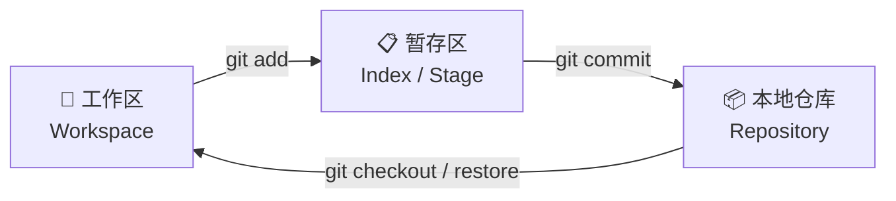
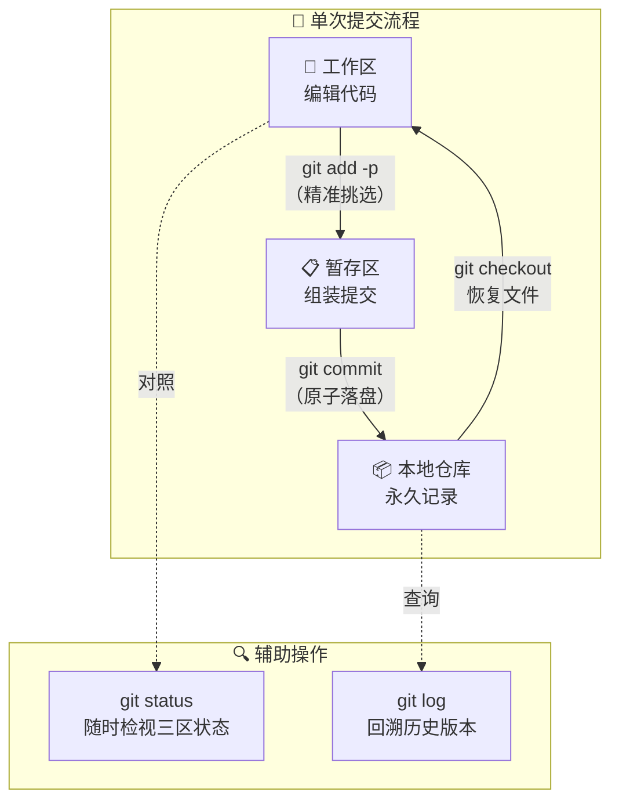

---
tags:
  - git
  - 版本管理
  - 基础
date: 2026-06-06
aliases:
  - Git基础
  - Git核心工作流
---

# Git — 版本管理之道

## 一、Git 的本质：不仅仅是几个命令

### 1.1 核心认知：内容寻址的文件系统

大多数开发者把 Git 理解为"代码差异备份工具"——这只说对了一半。从底层来看，**Git 本质上是一个内容寻址的文件系统（Content-Addressable Filesystem）**，版本管理只是构建在这个文件系统之上的一层应用。

> [!note] 什么是内容寻址？
> 在 Git 的 `.git/objects/` 目录中，每一个存储对象（文件内容、目录结构、提交信息）都以 **SHA-1 哈希值** 作为唯一标识符和存储路径。这意味着：**相同的内容永远产生相同的哈希，不同的内容永远不会碰撞**。
>
> 这不是"存差异"，而是"存快照"。每一次提交，Git 都记录整个项目在那个瞬间的完整状态——对于那些没有变化的文件，它只是用一个指针指向已有的对象，而非重新复制。

这种设计带来了两个关键好处：

1. **数据完整性**：任何一位数据的篡改都会导致哈希不匹配，Git 会立即检测到。
2. **操作高效**：分支切换、版本回退等操作本质上是"移动指针"，而非"重放差异"，所以极快。

### 1.2 三大区域与状态流转

理解 Git 的核心工作流，关键在于理解它与传统 VCS 截然不同的 **三段式架构**：



| 区域         | 物理位置                | 本质                   | 你对它的操作                                |
| ------------ | ----------------------- | ---------------------- | ------------------------------------------- |
| **工作区**   | 项目目录下的可见文件    | 你正在编辑的文件副本   | 自由修改、增删                              |
| **暂存区**   | `.git/index` 二进制文件 | 下一次提交的"预演快照" | `git add` 加入，`git restore --staged` 撤出 |
| **本地仓库** | `.git/objects/`         | 永久历史存档           | `git commit` 写入                           |

> [!warning] ⚠️ 认知纠正
> 暂存区不是"临时中转站"，而是 **原子化提交的构建台**。
>
> - 你可以分多次 `git add`，把一个大改动拆成多个逻辑独立的提交。
> - 你可以通过 `git add -p` 精确到**某几行代码**进入暂存区，而非整个文件。
> - 这种"先组装、再落盘"的设计，让你在最终 `git commit` 之前永远有机会反悔和精修。

**文件在 Git 中的两种状态：**

```
未跟踪 (Untracked) ──git add──▶ 已暂存 (Staged)
已跟踪 & 已修改 (Modified) ──git add──▶ 已暂存 (Staged)
已暂存 (Staged) ──git commit──▶ 未修改 (Unmodified)
未修改 (Unmodified) ──编辑文件──▶ 已修改 (Modified)
未修改 (Unmodified) ──git rm──▶ 未跟踪 (Untracked)
```

> [!tip] 💡 设计哲学
> 为什么大多数 VCS 没有暂存区，而 Git 坚持保留它？
>
> 因为 Linus 的设计目标之一是 **"让每一次提交都是一个逻辑完整的原子变更"**。暂存区给你一个可控的中间态：你可以尽情在工作区"乱改"，然后冷静地挑选哪些变更应该归于同一个 commit。这就是 **从"改完再想"到"想完再改"的工程素养转变**。

---

## 二、跨平台环境基石：安装与核心配置

### 2.1 安装指南

| 平台                      | 推荐方式                      | 命令                                                 |
| ------------------------- | ----------------------------- | ---------------------------------------------------- |
| **macOS**                 | Homebrew（首选）              | `brew install git`                                   |
| **Windows**               | Git for Windows（官方安装包） | 下载 [git-scm.com](https://git-scm.com/download/win) |
| **Linux (Debian/Ubuntu)** | apt 包管理器                  | `sudo apt install git`                               |
| **Linux (Fedora/CentOS)** | dnf / yum                     | `sudo dnf install git`                               |

> [!tip] 💡 macOS 用户请注意
> macOS 预装了一个 Git（由 Xcode Command Line Tools 提供），但版本通常较旧。建议通过 Homebrew 安装最新稳定版：
>
> ```bash
> # 安装后，确认使用 Homebrew 版本
> brew install git
> which git   # 应该输出 /opt/homebrew/bin/git 或 /usr/local/bin/git
> git --version
> ```

Windows 安装 Git for Windows 时，**建议选项**：

- 编辑器选择：VS Code 或你日常使用的编辑器（不要用默认的 Vim，除非你会用）
- 路径环境：选择 "Git from the command line and also from 3rd-party software"
- 行尾转换：选择 "Checkout as-is, commit as-is"（避免 CRLF/LF 混乱）

### 2.2 配置隔离策略

`git config` 的三个作用域，优先级从高到低：

```
--local  >  --global  >  --system
(当前仓库)  (当前用户)  (整台机器)
```

| 作用域     | 配置文件路径         | 适用内容                   |
| ---------- | -------------------- | -------------------------- |
| `--local`  | `<repo>/.git/config` | 项目特定配置（如项目邮箱） |
| `--global` | `~/.gitconfig`       | 用户身份、常用别名         |
| `--system` | `/etc/gitconfig`     | 极少使用，管理员级配置     |

```bash
# ========== 必备基础配置 ==========

# 1. 设置全局用户身份（所有仓库的默认值）
git config --global user.name "Your Name"
git config --global user.email "your.email@example.com"

# 2. 为特定项目设置不同的身份（如公司项目用公司邮箱）
cd /path/to/work-project
git config --local user.email "you@company.com"

# 3. 验证当前生效的配置
git config --list --show-origin   # 查看所有配置及其来源文件
git config user.name              # 查看某个具体值
```

> [!warning] 🔴 常见踩坑
>
> - 忘记配置 `user.name` / `user.email` 就直接 commit，会导致提交记录显示错误的身份。这在公司仓库中尤其尴尬。
> - 不确定当前配置来自哪个层级？用 `git config --list --show-origin` 一键排查。

### 2.3 `.gitignore` 编写原则

`.gitignore` 的作用是告诉 Git 哪些文件**永远不要跟踪**。这不是"安全功能"（已经 tracked 的文件不受影响），而是"噪音过滤器"。

```bash
# ========== .gitignore 常见模板 ==========

# 依赖目录（由包管理器管理，不应提交）
node_modules/
vendor/

# 编译产物
dist/
build/
*.class
*.o

# 环境配置文件（含敏感信息，绝不可提交）
.env
.env.local
*.pem
*.key
credentials.json

# 操作系统生成的文件（干扰协作）
.DS_Store       # macOS
Thumbs.db       # Windows
desktop.ini     # Windows

# IDE 配置（团队如无统一标准则忽略）
.idea/
.vscode/
*.swp            # Vim swap files
```

> [!tip] 💡 匹配规则速记
>
> | 模式             | 含义                                         |
> | ---------------- | -------------------------------------------- |
> | `*.log`          | 匹配所有 `.log` 后缀文件                     |
> | `build/`         | 匹配 `build/` 目录及其下所有内容             |
> | `!important.log` | 否定模式——不忽略 `important.log`             |
> | `/TODO.md`       | 只忽略**根目录**下的 `TODO.md`，不影响子目录 |
> | `doc/**/*.pdf`   | 匹配 `doc/` 下任意深度的 `.pdf` 文件         |

> [!danger] 🔴 安全红线
> **绝对不要提交**：API 密钥、数据库密码、私有证书、`.env` 文件。
>
> 一旦提交到 Git 历史，即使后续删除文件并提交，敏感信息仍然存在于历史记录中（`git log` 可回溯）。此时清理成本极高（需 `git filter-branch` 或 `BFG Repo-Cleaner` 重写历史）。
>
> **从源头上杜绝**：确保 `.gitignore` 在项目初始化时就覆盖所有敏感文件类型。

---

## 三、核心工作流：日常单兵作战指南

### 3.1 初始化与克隆

```bash
# ===== 场景 A：从零开始的新项目 =====
cd /path/to/project
git init                              # 在当前目录创建 .git，初始化仓库
git status                            # 查看当前状态（所有文件都是 Untracked）

# ===== 场景 B：参与已有项目 =====
git clone https://github.com/user/repo.git          # HTTPS 方式
git clone git@github.com:user/repo.git              # SSH 方式（推荐，免密）
git clone https://github.com/user/repo.git my-dir   # 克隆到指定目录名
```

> [!tip] 💡 HTTPS vs SSH
>
> | 协议  | 优点                   | 缺点                                         |
> | ----- | ---------------------- | -------------------------------------------- |
> | HTTPS | 配置简单，无需 SSH Key | 每次推送需输入密码（或用 credential helper） |
> | SSH   | 配置一次，永久免密     | 需先配置 SSH Key 并添加到 GitHub/GitLab      |
>
> **推荐**：个人开发环境配置 SSH Key，一劳永逸。

### 3.2 精准提交：`git add` 的进阶用法

大多数人的日常：`git add .` 一把梭。这在工作区干净整洁时没问题，但现实中你往往同时改了好几个功能。

```bash
# ===== 基础用法 =====
git add file.txt             # 添加单个文件
git add src/                 # 添加整个目录
git add *.js                 # 通配符添加

# ===== 手术刀级精准：git add -p（patch 模式）=====
git add -p                   # 逐块（hunk）交互式选择要暂存的变更
```

> [!tip] 💡 `git add -p` — 你真正需要的提交纪律
>
> `git add -p` 会把你对文件的修改拆分成一个个 **hunk（变更块）**，逐块问你：
>
> ```text
> (1/5) Stage this hunk [y,n,q,a,d,e,?]?
> ```
>
> | 选项 | 含义           | 使用场景                                 |
> | ---- | -------------- | ---------------------------------------- |
> | `y`  | 暂存这一块     | 这块属于当前即将提交的逻辑               |
> | `n`  | 跳过这一块     | 这块不属于本次提交                       |
> | `s`  | 拆分成更小的块 | 当前 hunk 里混了多个逻辑，需要进一步细化 |
> | `e`  | 手动编辑这一块 | 需要更精细的控制                         |
> | `q`  | 退出，保留已选 | 我选够了                                 |
>
> **实际工作流**：
>
> 1. 写代码时随意改（功能 A + Bug 修复 + 格式调整一起改）。
> 2. 准备提交时，用 `git add -p` 逐块挑选，将功能 A 的变更精准放入暂存区。
> 3. 执行 `git commit`，得到一个纯粹的、只包含功能 A 的提交。
> 4. 再 `git add -p` 选 Bug 修复的变更，得到第二个提交。
>
> 这就是 **原子化提交** 的最佳实践——每一次 commit 只做一件事，回退时干净利落。

### 3.3 版本定格：`git commit` 的规范

```bash
# ===== 基础提交 =====
git commit -m "feat: 添加用户登录功能"

# ===== 提交已跟踪文件的全部变更（跳过 git add）=====
git commit -a -m "fix: 修复导航栏样式错位"    # ⚠️ 不包括新文件（Untracked）

# ===== 修订上一次提交（尚未 push 时）=====
git commit --amend -m "docs: 更新 README 安装说明"
```

> [!note] Commit Message 的基本规范
>
> 推荐遵循 **Conventional Commits** 格式：
>
> ```
> <type>: <简短描述>
>
> <可选的详细说明正文>
> ```
>
> | type       | 含义                     | 示例                                 |
> | ---------- | ------------------------ | ------------------------------------ |
> | `feat`     | 新功能                   | `feat: 添加密码重置流程`             |
> | `fix`      | Bug 修复                 | `fix: 修复 token 过期后未跳转登录页` |
> | `docs`     | 文档变更                 | `docs: 补充 API 接口说明`            |
> | `refactor` | 重构（不改变功能）       | `refactor: 提取公共校验逻辑`         |
> | `style`    | 格式调整（空格、缩进等） | `style: 统一缩进为 2 空格`           |
> | `chore`    | 杂项（依赖更新等）       | `chore: 升级 ESLint 到 v9`           |
>
> 好的提交信息 = 六个月后的你能看懂今天做了什么。

> [!warning] 🔴 关于 `git commit --amend`
>
> - `--amend` 会**改写最后一次提交**，产生新的 commit hash。
> - **已经 push 到远程的 commit，绝对不要 amend**，否则会导致协作者的本地分支混乱。
> - 安全用法：只 amend 尚未 push 的本地 commit。

### 3.4 状态洞察与历史回溯

```bash
# ===== 状态检查：你的"仪表盘" =====
git status                            # 完整状态输出
git status -s                         # 简洁模式（适合脚本）
git status -sb                        # 简洁模式 + 显示当前分支信息

# ===== 历史查看：你的"时光机" =====
git log                               # 完整提交历史（q 退出）
git log --oneline                     # 一行一个提交，极简
git log --oneline --graph --all       # 图形化显示全部分支
git log -p                            # 显示每次提交的具体差异（patch）
git log --stat                        # 显示每次提交的文件变更统计
git log -3                            # 只看最近 3 次提交
git log --since="2026-01-01"          # 按日期过滤
git log --author="your-name"          # 按作者过滤
```

> [!tip] 💡 `git status` 输出解读速查
>
> ```text
> Changes to be committed:    → 暂存区中的变更（已 git add，等待 commit）
> Changes not staged:          → 工作区已修改但未暂存的文件
> Untracked files:             → 新文件，Git 尚未跟踪
> ```
>
> 只需记住：**"待提交"看暂存区，"未暂存"看工作区**。这和你前面学到的三大区域模型完全对应。

> [!note] 常用 `git log` 别名推荐
>
> 把这些加入你的全局配置，效率翻倍：
>
> ```bash
> git config --global alias.lg "log --oneline --graph --all"
> git config --global alias.ls "log --oneline --graph --all --decorate"
> git config --global alias.last "log -1 HEAD"
> ```
>
> 之后 `git lg` 就能得到漂亮的提交树形图。

---

## 总结：一张图理解 Git 日常工作流



**掌握这三个区域、五个核心命令**，你就已经具备了日常开发中 80% 的 Git 使用能力：

| 命令               | 职责     | 频率         |
| ------------------ | -------- | ------------ |
| `git status`       | 洞察状态 | 随时         |
| `git add -p`       | 精准暂存 | 每次提交前   |
| `git commit`       | 版本定格 | 每次提交     |
| `git log`          | 回溯历史 | 排查问题时   |
| `git clone / init` | 项目起点 | 每个项目一次 |

有了这个基础，后续的 [[Git分支与协作]]（分支、合并、变基）和 [[Git工作流与实际工程实践]]（团队工作流）就是水到渠成的进阶。
