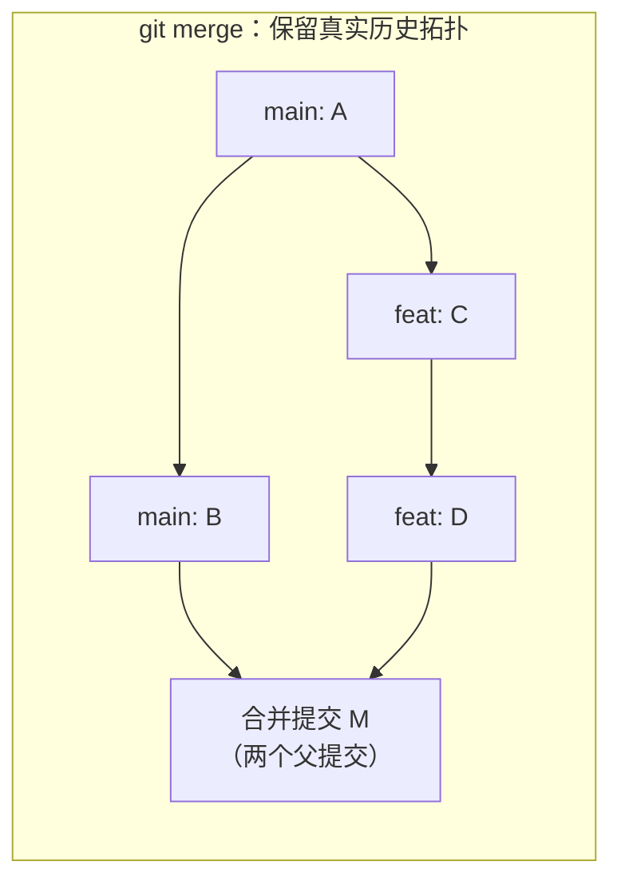
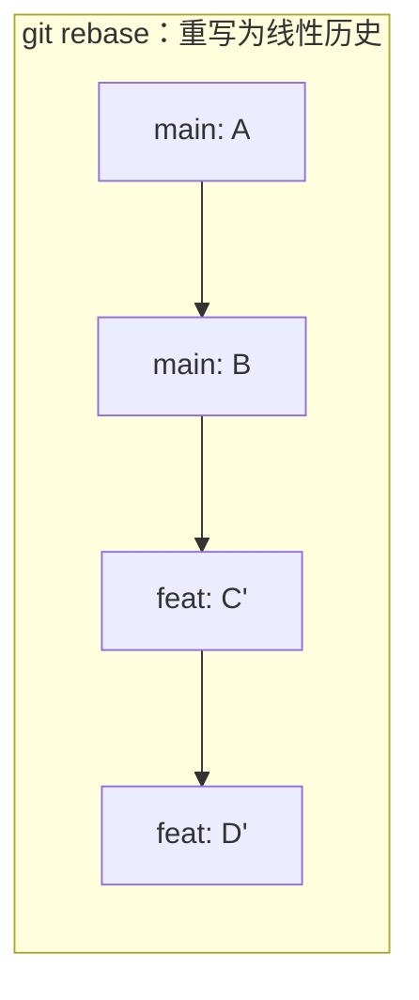
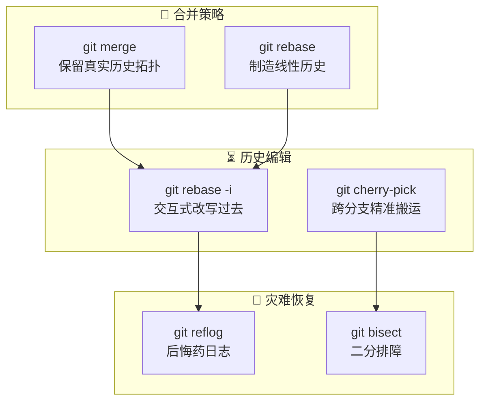

---
tags:
  - git
  - 版本管理
  - 进阶
date: 2026-06-10
aliases:
  - Git高级玩法
  - Git救火队长
---

# Git 的高级玩法：时光机与救火手册

掌握了 [[Git -- 版本管理之道|基础工作流]] 之后，你和 Git 之间已经过了"相识"阶段。接下来是"相知"——真正理解 Git 作为**时光机**的威力，以及当灾难发生时如何做自己的**救火队长**。

> [!note] 这一篇的定位
> 这不是"命令大全"，而是**思维模型的升级**。每一节都从一个核心问题出发：
>
> 1. **为什么** Git 要这样设计？
> 2. 这种设计带来了什么**超能力**？
> 3. 在实际灾难现场，你该按什么**步骤**操作？

---

## 一、合并策略之争：Merge 还是 Rebase？

这是 Git 社区最长寿的"宗教战争"之一。但本质上，这本不该是个二选一的选择题——**Merge 和 Rebase 解决的是不同层面的问题**，它们是你工具箱里的锤子和螺丝刀，而非对立的意识形态。

### 1.1 两种合并的本质区别

从底层来看，`git merge` 和 `git rebase` 的核心差异在于：**对提交历史的处理哲学截然不同**。





> [!tip] 💡 本质差异一句话
>
> | 维度           | `git merge`                                              | `git rebase`                                        |
> | -------------- | -------------------------------------------------------- | --------------------------------------------------- |
> | **历史记录**   | 保留原始提交时间线和分支拓扑                             | 将分支上的提交"嫁接"到目标分支顶端，生成全新 commit |
> | **提交 SHA**   | 原始 commit 的 SHA 不变                                  | 每个 commit 被重写，获得新 SHA                      |
> | **产生的节点** | 产生一个**合并提交**（merge commit），记录合并这一"事件" | 不产生额外节点，历史是**一条直线**                  |
> | **历史可读性** | 如实反映并行开发的分合过程                               | 呈现为"仿佛一直在主线开发"的线性叙事                |
> | **冲突解决**   | 一次解决所有冲突，记录在 merge commit 中                 | 可能需要在每个被重放的 commit 上**逐个解决冲突**    |

### 1.2 `git merge`：记录发生的"事实"

Merge 的核心哲学是：**"发生过的事情就应该留在历史里"**。

```bash
# ===== 场景：将 feature 分支合并回 main =====
git checkout main
git merge feature/user-auth

# 如果 main 在 feature 分支之后没有新提交，Git 默认执行 fast-forward
# Git 输出：
# Updating a1b2c3d..e4f5g6h
# Fast-forward
#  src/auth/login.js | 42 ++++++++++++++++++++++++++++++++++++++++++
#  1 file changed, 42 insertions(+)
```

> [!tip] 💡 Fast-Forward 是什么？
> 当目标分支（main）在你分出 feature 后**没有任何新提交**时，Git 只需把 main 的指针"快进"到 feature 的最新提交。这不会产生新的 merge commit——因为从图论上看，feature 的提交链路直接"接"在 main 后面，没有任何分叉需要合并。
>
> ```text
> 合并前:  main → A → B
>          feat → A → B → C → D
>
> fast-forward 后:  main → A → B → C → D
> （main 指针直接移动到 D，没有新增提交）
> ```

然而，在团队协作场景中，main 几乎不可能静止不动：

```bash
# ===== 更现实的场景：main 已有新提交 =====
# 此时的合并图：
#       C --- D (feature)
#      /
# A - B - E - F (main)

git checkout main
git merge feature/user-auth --no-ff   # 强制生成 merge commit

# Git 会生成一个自动的 merge commit message
```

> [!tip] 💡 `--no-ff` 与 `--ff-only` 的选择智慧
>
> | 选项           | 行为                                                              | 适用场景                                           |
> | -------------- | ----------------------------------------------------------------- | -------------------------------------------------- |
> | `--ff`（默认） | 能快进就快进，否则生成 merge commit                               | 日常合并                                           |
> | `--no-ff`      | **始终**生成 merge commit                                         | 团队功能分支合并（保留"这个功能是一个整体"的记录） |
> | `--ff-only`    | **只能**快进，否则拒绝合并                                        | 保持线性历史的仓库策略（如某些开源项目）           |
> | `--squash`     | 将整个分支的变更压缩为一个 commit 放入工作区，不产生 merge commit | 功能分支的 commit 太杂乱，需要手动整理后提交       |
>
> **推荐实践**：团队协作中，合并 feature 分支到 main 时始终使用 `--no-ff`。这样即使 feature 只有一个 commit，也会留下一个 merge commit 作为"功能边界标记"——将来你可以通过 `git log --merges` 快速定位到每一个功能合入的时间点。

### 1.3 `git rebase`：让历史"看起来像"一条直线

Rebase 的核心哲学是：**"把你在分支上的工作，嫁接到目标分支的最新进度之上，制造出一种'你一直在最新代码上开发'的假象"**。

```bash
# ===== 变基操作 =====
git checkout feature/user-auth
git rebase main

# 上述命令的内部执行过程：
# 1. 找到 feature 与 main 的共同祖先（分叉点）
# 2. 提取 feature 上自那之后的所有 commit（C, D）
# 3. 将 HEAD 移动到 main 的最新提交（F）
# 4. 逐个将 C 和 D 的变更"重放"到 F 之上，生成 C' 和 D'
# 5. 将 feature 指针指向 D'
#
# 变基前:
#       C --- D (feature)
#      /
# A - B - E - F (main)
#
# 变基后:
# A - B - E - F (main) --- C' --- D' (feature)
# （C 和 D 被"重放"到了 F 之后，SHA 已改变）
```

> [!warning] 🔴 变基的铁律：不要 rebase 公共分支
>
> Rebase 的核心副作用是**重写提交历史**（commit SHA 改变）。如果你 rebase 了一个已经 push 到远程、且他人已经基于其开发的公共分支，后果是灾难性的：
>
> ```text
> 你做了:  git push --force (因为 rebase 后历史不兼容)
> 同事看到: ! [rejected]  main -> main (non-fast-forward)
> 同事拉取后: 出现大量冲突和重复的 commit
> ```
>
> **绝对禁止的场景**：
>
> - ❌ `git rebase main` 之后 `git push --force origin main`
> - ❌ rebase 团队协作的公共 feature 分支
>
> **安全使用的场景**：
>
> - ✅ 在**你自己的 feature 分支**上 rebase main（同步主线最新代码）
> - ✅ 在 push 前用 `rebase -i` 整理本地 commit 历史

### 1.4 核心决策模型：一张表终结选择焦虑

> [!note] 决策框架
>
> | 场景                                        | 推荐策略                                     | 理由                                                             |
> | ------------------------------------------- | -------------------------------------------- | ---------------------------------------------------------------- |
> | **将最新 main 同步到你的个人 feature 分支** | `git rebase main`                            | 保持你的开发基点为最新，避免未来合并时的大量冲突                 |
> | **将完成的功能分支合并回 main**             | `git merge --no-ff feature/xxx`              | 保留"功能边界"，产生可追溯的合并节点                             |
> | **个人分支的 commit 历史混乱**              | `git rebase -i` 整理（见下一章）             | 在 push 前将"修 typo""再改一下"等草稿提交压缩为逻辑清晰的 commit |
> | **需要在公共分支上看到一个干净的线性历史**  | `git merge --squash` + 一个精心撰写的 commit | 既保持 main 线性，又避免 rebase 公共分支的风险                   |
> | **需要回退某个功能**                        | 使用 `git revert <merge-commit>`             | merge commit 使得回退一个完整功能只需要一次 revert               |

```text
心智模型总结：

                         git rebase
  你的个人分支  ←──────────────────→  整洁线性，保持与主线同步
       │
       │  git merge --no-ff
       ▼
  公共主干 (main)  ←────────────────→  保留真实拓扑，每次合入留下"事件记录"
```

> [!tip] 💡 一句话总结
> **Rebase 是你在自己世界里的事，Merge 是你对世界宣告的事。** 在自己的 feature 分支上，你拥有绝对的历史改写权；一旦代码进入公共领域，就应该用 merge 来诚实地告知所有人"这里发生了一次合并"。

---

## 二、历史重塑与精准摘取：代码的平行宇宙

如果说上一节讲的是 Git 的"时间线管理"，那么这一节是 Git 的"时间线编辑器"。你将拥有**退回过去、改写历史、再回到现在**的能力——这是 Git 作为"时光机"的真正体现。

### 2.1 交互式变基：`git rebase -i`

`git rebase -i`（interactive）是 Git 中最强大的历史编辑工具。它允许你**在 push 之前**，对你本地分支上的所有提交进行任意编辑。

```bash
# ===== 基础用法：整理最近 N 个 commit =====
git rebase -i HEAD~5      # 打开编辑器，展示最近 5 个 commit 供你操作

# 编辑器中将展示类似这样的内容：
# pick a1b2c3d feat: 添加用户登录功能
# pick b2c3d4e fix: 修一个 typo
# pick c3d4e5f feat: 添加密码重置流程
# pick d4e5f6g chore: 改一下文案
# pick e5f6g7h feat: 添加 JWT 鉴权中间件
#
# 最上方是详细的命令说明，可用命令包括：
# pick = 保留此提交
# reword = 保留提交，但修改 commit message
# edit = 保留提交，但暂停以便修改内容
# squash = 将此提交合并到前一个提交中（保留 message）
# fixup = 将此提交合并到前一个提交中（丢弃 message）
# drop = 删除此提交
```

> [!tip] 💡 交互式变基的工作原理
>
> 当你执行 `git rebase -i HEAD~5` 时，Git 做了三件事：
>
> 1. 将 HEAD 指针**临时移回**到你指定的起点（HEAD~5 之前的位置）
> 2. 按你指定的顺序和操作，**逐个重放**这些 commit 的变更
> 3. 将分支指针移到新生成的 commit 链条末端
>
> 这与时光机电影中的设定惊人地相似——回到过去某个时间点，改变一些事情，然后时间线自动"重演"到新的未来。从这个角度看，**每次 `git rebase -i` 都是在创建一条新的平行时间线**。

### 2.2 实战：合并（Squash）杂乱提交

这是 `git rebase -i` 最常用的场景。想象你刚完成一个功能，但本地的 commit 历史是这样的：

```text
feat: 添加 JWT 鉴权中间件
chore: 改一下默认值
fix: 修一个 typo
chore: 调整缩进
feat: 补充错误处理
```

这些琐碎的提交如果原封不动地推到团队仓库，既污染历史，也让 code review 变得困难。

```bash
# ===== 交互式变基：将 4 个提交压缩为 1 个 =====
git rebase -i HEAD~4

# 在编辑器中，将 2-4 的 pick 改为 squash（或简写 s）：
# pick a1b2c3d feat: 添加 JWT 鉴权中间件
# squash b2c3d4e chore: 改一下默认值
# squash c3d4e5f fix: 修一个 typo
# squash d4e5f6g feat: 补充错误处理
#
# 保存关闭后，Git 打开第二个编辑器，让你撰写合并后的 commit message：
# feat: 添加 JWT 鉴权中间件
#   - 实现 HS256 签名与验证
#   - 支持从 Authorization Header 提取 Token
#   - 包含完整的错误处理（401 未授权、403 禁止、498 Token 过期）
```

> [!tip] 💡 `squash` vs `fixup` 的选用策略
>
> | 命令         | 行为                                               | 适用场景                                              |
> | ------------ | -------------------------------------------------- | ----------------------------------------------------- |
> | `squash` (s) | 合并到前一个提交，**保留** commit message 供你编辑 | 你想把多条 message 整合为一条完整的功能描述           |
> | `fixup` (f)  | 合并到前一个提交，**丢弃** commit message          | 该提交的 message 毫无价值（如"fix typo"），不值得保留 |
>
> 日常建议：**能用 `fixup` 就不用 `squash`**，减少编辑时的认知负担。

### 2.3 实战：拆分一个混合了多种变更的 Commit

有时问题反过来——你把 A、B 两个逻辑写进了同一个 commit，想拆开：

```bash
# ===== 拆分一个 commit =====
git rebase -i HEAD~3

# 在编辑器中，将目标 commit 的 pick 改为 edit：
# pick a1b2c3d feat: 添加登录功能
# edit  b2c3d4e feat: 添加用户管理页面 (这个想拆)
# pick  c3d4e5f docs: 补充 API 文档

# 保存后，rebase 会在 b2c3d4e 处暂停，此时 HEAD 就在这个 commit 上
git reset HEAD~1             # 撤销该 commit，变更回到工作区（不丢失代码）

# 现在可以分批提交：
git add src/user-list.html       # 页面模板部分
git commit -m "feat: 添加用户列表页面模板"

git add src/user-controller.js   # 控制器逻辑部分
git commit -m "feat: 实现用户列表的查询与分页逻辑"

git rebase --continue            # 继续 rebase 的后续步骤
```

> [!warning] 🔴 注意：已经 push 的 commit 不要 edit
> 与所有历史改写操作一样，`rebase -i` 只应该操作**尚未推送到远程**的本地 commit。一旦 push 了，你改写的策略就应该是**接受不完美**，而非重写历史让协作者困惑。

### 2.4 精准摘取：`git cherry-pick`

`git cherry-pick` 是"时空穿越"的另一种形态——你不是回到过去改写，而是**从另一条时间线中，将某个特定的 commit 的变更"复制粘贴"到当前分支**。

```bash
# ===== 基础用法 =====
git cherry-pick <commit-SHA>        # 将指定 commit 的变更应用到当前分支

# ===== 一次摘取多个 commit =====
git cherry-pick abc123 def456       # 按顺序摘取两个 commit
git cherry-pick abc123..def456      # 摘取从 abc123（不含）到 def456（含）之间的所有 commit
```

> [!tip] 💡 Cherry-Pick 的本质
>
> Cherry-pick 并非字面上的"复制 commit"——它做的是：
>
> 1. 计算目标 commit 相对于其父 commit 的 **diff（变更集）**
> 2. 将这个 diff 作为 **patch** 应用到当前分支的 HEAD 上
> 3. 创建一个**全新的 commit**（新 SHA），message 默认沿用原始 commit
>
> 所以 Cherry-pick 本质上是 **"只挑变更，不挑历史"**。你得到的是同样的代码变更，但和原始 commit 之间没有任何历史关联。

### 2.5 实战：Hotfix 场景中的 Cherry-Pick 妙用

这是 Cherry-pick 最经典的工程应用场景：

```text
场景：
  线上 v2.0 版本发现了一个登录 Bug。
  与此同时，你正在 develop 分支上开发 v2.1 的新功能。

操作思路：
  1. 从线上版本对应的 tag 创建 hotfix 分支
  2. 在 hotfix 上修复 Bug
  3. cherry-pick 这个修复 commit 到 develop 分支
```

```bash
# ===== 完整热修复流程 =====

# 1. 从线上版本创建 hotfix 分支
git checkout -b hotfix/login-bug v2.0.0

# 2. 修复 Bug 并提交
git add src/auth/login.js
git commit -m "fix: 修复登录 Token 过期后无限重定向的 Bug"

# 记录这个修复 commit 的 SHA
# 假设为: f1x0bug

# 3. 将修复合入 main 并发布
git checkout main
git merge --no-ff hotfix/login-bug
git tag v2.0.1
# ... 部署上线

# 4. 将同一个修复"摘"到开发分支
git checkout develop
git cherry-pick f1x0bug
# 如果这里有冲突（因为 develop 上的代码已不同），解决后：
# git add .
# git cherry-pick --continue

# 本次热修复结束，develop 上也同步了这个修复
```

> [!tip] 💡 Cherry-Pick 解决冲突后：`--continue` vs `--abort`
>
> | 命令                         | 行为                                            |
> | ---------------------------- | ----------------------------------------------- |
> | `git cherry-pick --continue` | 使用已解决的变更，继续完成 cherry-pick          |
> | `git cherry-pick --abort`    | 放弃本次 cherry-pick，恢复到操作前的状态        |
> | `git cherry-pick --skip`     | 跳过当前 commit（多 commit 摘取时），继续下一个 |
>
> 如果冲突太复杂，你的理智选择是 `--abort`，然后手动写修复代码——有时候人工移植比重写冲突更快。

---

## 三、绝地求生与排障神器：做团队的救火队长

上面两章讲的是"日常精进"——让你写代码更高效、提交历史更优雅。但真正的极客只需要在**灾难现场**证明一次自己的价值，就足以让整个团队记住你。

这一章是 Git 的 **"后悔药"与"侦探工具"**。它们的共同点是：平时你可能永远用不到，但一旦用上，就意味着一场危机被化解于无形。

### 3.1 `git reflog`：Git 的终极"后悔药"

> [!note] 先建立认知
> Git 有一个鲜为人知但极其强大的机制：**引用日志（Reference Log）**。它记录了你本地仓库中 **HEAD 和分支指针的每一次移动**——无论这个移动是由 commit、reset、rebase、checkout 还是 merge 导致的。
>
> 更关键的是：**reflog 是本地专属的**。它不会 push 到远程，也不会被 clone 下来。它只存在于你本机的 `.git/logs/` 目录中，默默地记录着每一次指针变动。
>
> 这意味着：**只要你不主动清理（`git reflog expire`），你在本地做过的几乎所有操作都有迹可循**。

```bash
# ===== 查看 reflog =====
git reflog
# 输出示例：
# a1b2c3d (HEAD -> main) HEAD@{0}: commit: feat: 添加 JWT 鉴权
# e4f5g6h HEAD@{1}: rebase (finish): returning to refs/heads/feature
# b7c8d9e HEAD@{2}: rebase (start): checkout main
# f0a1b2c HEAD@{3}: checkout: moving from main to feature/jwt
# d3e4f5g HEAD@{4}: commit: fix: 修复一个 typo
# ...

# ===== 查看某个特定分支的 reflog =====
git reflog show feature/jwt

# ===== 查看带有日期的 reflog =====
git reflog --date=iso
```

> [!tip] 💡 理解 `HEAD@{n}` 语法
>
> `HEAD@{0}` 表示 HEAD **当前** 指向的位置。`HEAD@{1}` 是 HEAD **上一步** 指向的位置，依此类推。
>
> 你也可以用时间来引用：
>
> ```bash
> git reflog show HEAD@{2.days.ago}     # 两天前的 HEAD
> git reflog show HEAD@{2026-06-09}     # 指定日期的 HEAD
> git reflog show main@{one.week.ago}   # main 分支一周前的位置
> ```
>
> 这个语法的实用之处在于：当你不记得 commit SHA，但记得"大概是今天下午 3 点左右搞丢的"，你可以用 `master@{3.hours.ago}` 直接定位。

### 3.2 实战 1：误删分支后找回代码

这是经典灾难之一——`git branch -D` 误删了包含重要代码的分支。

```bash
# ===== 灾难现场：误删了 feature/payment 分支 =====
git branch -D feature/payment
# 删除后意识到：那个分支里有一个试验性的支付方案还没合入！

# ===== 抢救步骤 =====

# 1. 查看 reflog，找到该分支上的最后一个 commit
git reflog | grep "feature/payment"
# 输出类似：
# f1x0bug HEAD@{12}: checkout: moving from main to feature/payment
# c0de123 HEAD@{11}: commit: feat: 完成支付宝支付集成
# dead456 HEAD@{10}: commit: feat: 添加微信支付模块
# ...
# 88ff99a HEAD@{5}: checkout: moving from feature/payment to main

# 2. 记下最后一个提交的 SHA（这里假设为 dead456）
#    或者直接使用 HEAD@{n} 引用

# 3. 基于那个 commit 恢复分支
git checkout -b feature/payment-recovered dead456

# 4. 验证恢复的内容
git log --oneline feature/payment-recovered
# 你的代码完整回来了
```

> [!tip] 💡 为什么这能工作？
>
> Git 的删除分支操作（`git branch -D`）只是**删除了一个指针**，而非删除那些 commit 对象本身。那些 commit 在 reflog 过期之前（默认 90 天）仍然存在于 `.git/objects/` 中，只是没有指针指向它们。
>
> 更极端的情况——即使 reflog 也过期了，只要 commit 对象还**没有被 GC（垃圾回收）清除**，你依然可以通过 `git fsck --lost-found` 找到它们：
>
> ```bash
> git fsck --lost-found
> # 列出所有"悬空"的对象（dangling commits），它们没有指针指向但仍未回收
> ```
>
> Git 的 GC 会在特定条件下触发（如 `git gc --auto`），一般在本地仓库中，未被任何指针或 reflog 引用的 commit 至少会在 14 天后才被回收。

### 3.3 实战 2：搞砸 Rebase 后恢复现场

这是另一种高频灾难——你执行了一个复杂的 `rebase -i`，结束时发现结果不是你想的那样。

```bash
# ===== 灾难现场：rebase 后搞乱了历史 =====
git rebase -i HEAD~5
# ...一顿操作后...
git log --oneline
# 输出让你眼前一黑——commit 顺序错了，丢了几个，合并错了几个

# ===== 抢救步骤 =====

# 1. 查看 reflog，找到 rebase 之前 HEAD 的位置
git reflog
# a1b2c3d HEAD@{0}: rebase (finish): returning to refs/heads/feature
# e4f5g6h HEAD@{1}: rebase (pick): feat: 添加 JWT 鉴权
# b7c8d9e HEAD@{2}: rebase (pick): feat: 添加用户管理
# f0a1b2c HEAD@{3}: rebase (start): checkout HEAD~5
# d3e4f5g HEAD@{4}: commit: fix: 修了最后一个 typo  ← 注意这里！这是 rebase 之前的状态

# 2. 回到 rebase 之前的状态
git reset --hard HEAD@{4}
# 或者用具体 SHA:
# git reset --hard d3e4f5g

# 3. 检查历史是否回到正轨
git log --oneline -3
# 确认无误后，rebase 之前的所有 commit 都已恢复

# 4. 重新计划你的 rebase 操作
```

> [!warning] 🔴 关于 `git reset --hard`
>
> `--hard` 是一个危险选项——它会**丢弃工作区和暂存区中所有未提交的变更**。
>
> 在执行 `--hard` 之前，**总是**先确认：
>
> ```bash
> git status                     # 确保没有未提交的重要变更
> ```
>
> 如果你有未提交的变更但又想保留它们，改用：
>
> ```bash
> git stash                      # 暂存工作区变更
> git reset --hard <commit>      # 安全 reset
> git stash pop                  # 恢复暂存的变更
> ```

### 3.4 `git bisect`：科学排障的二分查找

当 Bug 被引入的 commit 未知时，在几百个 commit 中人工排查的体验是极其痛苦的。`git bisect` 利用**二分查找算法**，让你在对数级时间内锁定罪魁祸首。

> [!note] Bisect 的核心思想
>
> 给定一个"好的"commit（Bug 不存在）和一个"坏的"commit（Bug 存在），bisect 自动：
>
> 1. 在好和坏之间找到一个**中间点** commit 并 checkout 到那里
> 2. 由你来测试这个版本是否有 Bug
> 3. 根据你的反馈，将搜索范围缩小一半
> 4. 重复 1-3，直到定位到**第一个引入 Bug 的 commit**
>
> 这个过程需要手动测试吗？可以手动（交互式），也可以**全自动**（脚本化）——后者才是极客的正确打开方式。

### 3.5 Bisect 交互模式：一步步手动排查

```bash
# ===== 启动 bisect =====
git bisect start

# 标记一个"坏的"commit（通常就是当前 HEAD，Bug 存在）
git bisect bad HEAD
# 或者：git bisect bad <commit-SHA>

# 标记一个"好的"commit（你确定 Bug 不存在时的版本）
git bisect good v1.5.0
# 或者：git bisect good <commit-SHA>

# Git 输出：
# Bisecting: 128 revisions left to test after this (roughly 7 steps)
# [a1b2c3d] feat: 更新日志模块

# 此时 HEAD 已自动移动到中间点
# 你需要手动测试当前版本：
# 1. 编译/运行项目
# 2. 确认 Bug 是否存在

# 如果 Bug 存在：
git bisect bad

# 如果 Bug 不存在：
git bisect good

# 重复这个过程，每次都能将范围缩小一半
# 最终 Git 定位到元凶：
# c0de123 is the first bad commit
# commit c0de123
# Author: xxx
# Date:   ...
#     feat: 重构消息队列消费者底层逻辑

# ===== 结束 bisect，回到原来的状态 =====
git bisect reset
```

### 3.6 Bisect 全自动模式：让脚本替你干活

这才是 bisect 的真正威力——**完全无需人工测试**。

```bash
# ===== 前提：你需要一个能判断 Bug 是否存在的测试脚本 =====

# 举例：一个简单的 shell 脚本 test-bug.sh
cat > test-bug.sh << 'EOF'
#!/bin/bash
# 如果能成功登录（Bug 已修复），返回 0（good）
# 如果登录失败（Bug 存在），返回非 0（bad）

# 启动测试服务器
npm start &
SERVER_PID=$!
sleep 3

# 执行测试请求
curl -s -X POST http://localhost:3000/api/login \
  -H "Content-Type: application/json" \
  -d '{"username":"test","password":"test123"}' \
  | grep -q "token"

RESULT=$?

# 清理
kill $SERVER_PID 2>/dev/null

# Bug 存在（登录失败）→ 返回非 0（bad）
# Bug 不存在（登录成功）→ 返回 0（good）
exit $RESULT
EOF

chmod +x test-bug.sh

# ===== 全自动 bisect =====
git bisect start
git bisect bad HEAD
git bisect good v1.5.0

# 使用 run 命令，让 Git 自动运行测试脚本
git bisect run ./test-bug.sh
```

> [!tip] 💡 Bisect Run 的退出码语义
>
> Git 通过脚本的退出码来判断：
>
> | 退出码            | 含义                               | 示例场景               |
> | ----------------- | ---------------------------------- | ---------------------- |
> | `0`               | 这是 **good** commit（Bug 不存在） | 测试通过               |
> | `1-127`（除 125） | 这是 **bad** commit（Bug 存在）    | 测试失败               |
> | `125`             | **跳过**这个 commit（无法测试）    | 编译失败，无法运行测试 |
> | `>127`            | 终止 bisect                        | 出现了不可恢复的错误   |
>
> 这个机制让 bisect 不仅能定位 Bug，还能处理"某些旧 commit 根本编译不过"的复杂情况。

### 3.7 Bisect 进阶：跳过不可测试的 Commit

在大型项目中，你经常会遇到 bisect 过程中某些中间 commit **根本无法编译**——这是由于它们本身就是一次不完整的提交（如一个大的重构的中间步骤）。

```bash
# ===== 为 bisect run 脚本增加跳过逻辑 =====
cat > test-bug.sh << 'EOF'
#!/bin/bash

# 先尝试编译
make 2>/dev/null
if [ $? -ne 0 ]; then
    # 编译失败 → 跳过这个 commit
    exit 125
fi

# 编译成功 → 运行实际测试
make test 2>/dev/null

# 测试结果：
# 0 = 通过（good）
# 1 = 失败（bad）
# 125 = 跳过（不可测试）
EOF

# 然后正常执行：
git bisect start
git bisect bad HEAD
git bisect good v1.5.0
git bisect run ./test-bug.sh

# 如果 bisect 跳过了某些 commit，最终输出可能类似：
# There are only 'skip'ped commits left to test.
# The first bad commit could be any of:
#   a1b2c3d feat: 开始重构队列
#   e4f5g6h feat: 继续重构（未完成）
#   i7j8k9l feat: 完成队列重构
# We cannot bisect more!
```

> [!tip] 💡 当 bisect 卡住时的手动收尾
>
> 当自动 bisect 因为"只剩被跳过的 commit"而无法继续时，你可以：
>
> 1. 将范围缩小到少数几个可疑 commit
> 2. 逐个检查这些 commit 的变更内容（`git show`）
> 3. 通过**阅读代码**而非运行测试来定位 Bug
>
> 在绝大多数实际场景中，自动 bisect 就已经能给你答案了。

---

## 总结：四张图理解 Git 高级操作



| 工具                | 核心功能                       | 一句话口诀                    |
| ------------------- | ------------------------------ | ----------------------------- |
| `git merge --no-ff` | 保留功能边界，诚实记录合并事件 | "发生了什么，就记录什么"      |
| `git rebase`        | 将个人分支嫁接到主线最新进度   | "整理干净再出门见人"          |
| `git rebase -i`     | 合并/拆分/改写本地提交         | "改历史只能改自己尚未公开的"  |
| `git cherry-pick`   | 从别的分支精准搬运特定 commit  | "只取变更，不取历史"          |
| `git reflog`        | 找回丢失的 commit 和分支       | "只要做过，就有痕迹"          |
| `git bisect`        | 二分查找定位 Bug 源头          | "128 个可疑 commit？7 步锁凶" |

> [!note] 进阶之路的下一步
> 掌握了这些单兵作战的"高阶操作"后，下一步就是进入**团队协作**的战场：各种 Git 工作流模型（Git Flow、GitHub Flow、Trunk-Based Development）、Pull Request 的评审技巧、以及如何制定一个适合你团队的 Git 规范。详见 [[Git工作流与实际工程实践]]。

---

**你此刻掌握的 Git 技能已经超越了 90% 的日常使用者。下一个挑战：将这套思维模型带入真实的团队工程实践中，从"会用"进化到"能设计规则"。**
