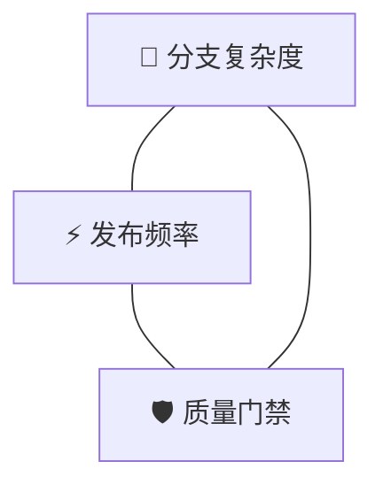
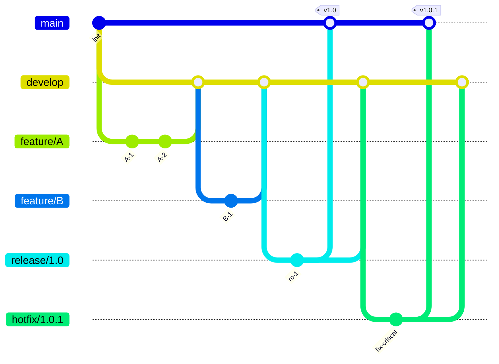
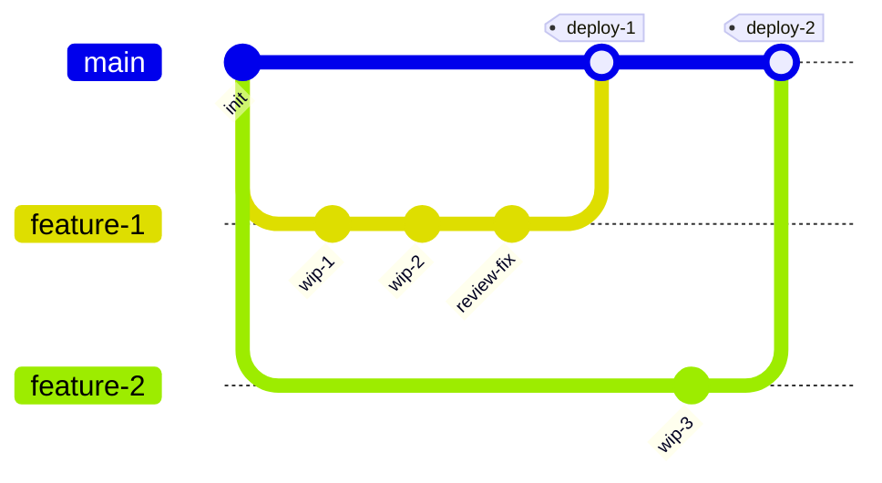
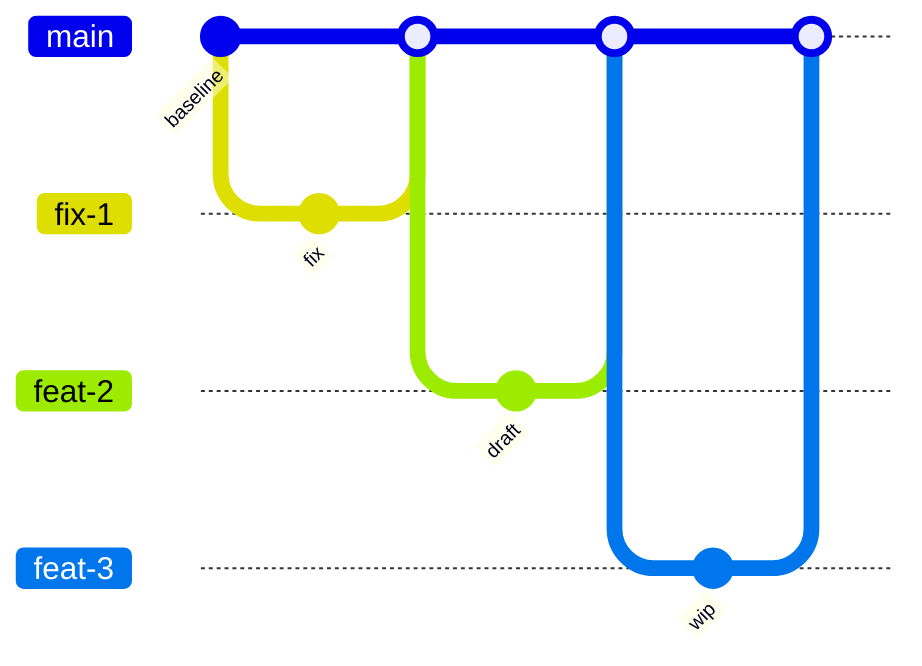
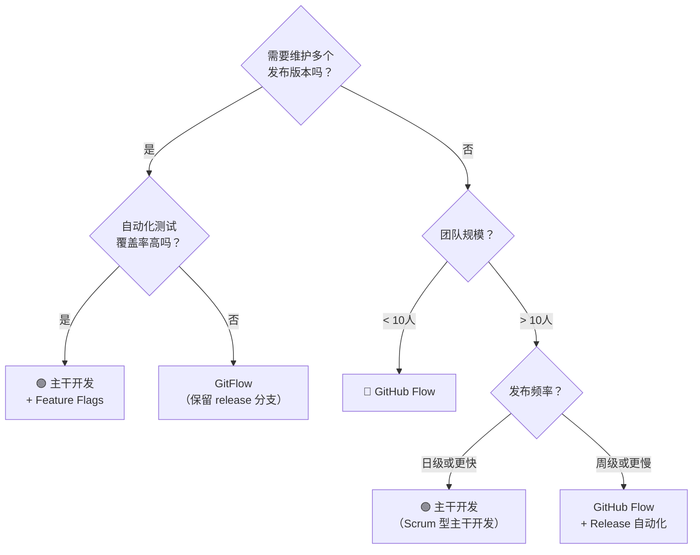
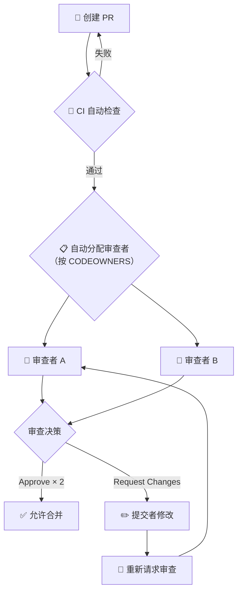
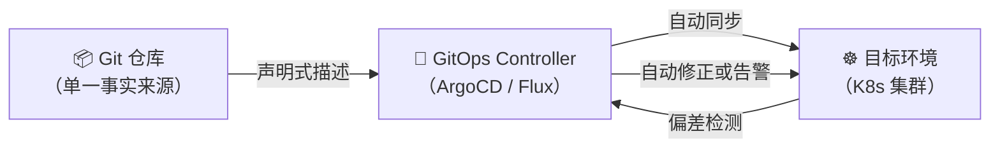
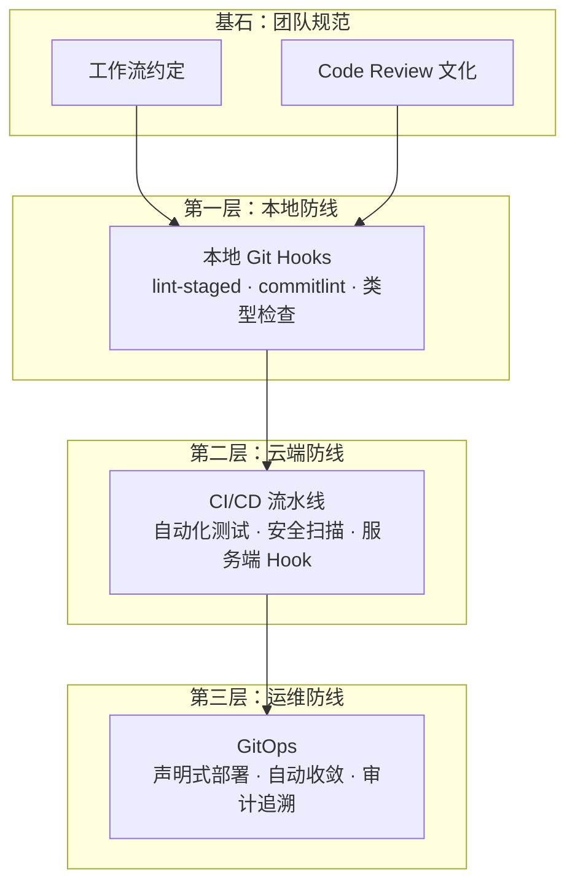

---
tags:
  - git
  - 版本管理
  - 工程实践
  - 工作流
date: 2026-06-10
aliases:
  - Git工程实践
  - Git工作流指南
  - 架构师Git手册
---

# Git 实际工程实践指南

> [!quote] 开篇立场
> 前面的 [[Git -- 版本管理之道]] 和 [[Git分支与协作]] 解决的是"怎么用"的问题。这一章解决的问题是——**在 20 人、50 人、200 人的团队中，怎么让所有人"用对"**。
>
> 如果说前两章是单兵武器手册，这一章就是**军团作战条例**。我们从工作流抉择、代码审查文化、自动化防线三个维度，构建一套可落地、可审计、可演进的工程体系。

---

## 一、工作流抉择：没有银弹，只有取舍

### 1.1 工作流演进的底层逻辑

Git 之所以强大，恰恰因为它**不强制任何工作流**——分布式架构给了你无限的自由。但"无限自由"在工程管理中就是"无限混乱"。工作流的意义在于：**在 Git 的能力边界内，画出一个团队共识的操作空间**。

工作流的演进，本质上是随着团队规模和交付节奏的变化，在三个维度上不断做权衡：



| 维度           | 向左倾斜           | 向右倾斜           |
| -------------- | ------------------ | ------------------ |
| **分支复杂度** | 分支少、模型简单   | 分支多、层级深     |
| **发布频率**   | 随时可发、持续交付 | 定时发布、版本火车 |
| **质量门禁**   | 依赖自动化         | 依赖人工审查       |

> [!note] 核心洞见
> 没有"最好的工作流"，只有"当前阶段最适合的工作流"。一个 3 人初创团队用 GitFlow 是过度工程；一个 500 人、需要维护 5 个发布版本的企业用 Trunk-based 是安全灾难。

### 1.2 传统 GitFlow：工业化时代的遗产

**模型结构**：



GitFlow 定义了严格的分支层级：`main` → `develop` → `feature` / `release` / `hotfix`。每一个分支类型都有明确的创建来源和合并目标。

> [!summary] 🛡️ GitFlow 的工程特征
>
> **优势**：
>
> - **版本回溯能力极强**：任何时候你都能找到某个版本的精确快照，适合需要长期维护多个版本的软件（如操作系统、嵌入式 SDK）。
> - **职责边界清晰**：新功能开发进入 `feature`，发布准备进入 `release`，紧急修复进入 `hotfix`——每个分支类型是一道质量门禁。
> - **对发布节奏慢、QA 流程重的传统企业非常友好**。
>
> **劣势**：
>
> - **分支寿命过长**：`feature` 分支可能存活数周，合并时的冲突代价随分支存活时间指数增长。
> - **合并复杂度高**：一次改动需要经过 `feature → develop → release → main` 多次合并，每一步都可能引入新的合并冲突。
> - **与持续交付根本冲突**：GitFlow 的核心假设是"发布是一个需要专门准备的事件"，而持续交付的理念是"每次提交都应该是可发布的"。

> [!question] 💡 GitFlow 在当下为什么显得笨重？
>
> 2010 年 Vincent Driessen 提出 GitFlow 时，软件行业的主流发布节奏是"数周甚至数月一次"。在那个时代，`release` 分支承担的是一个 **人工 QA 阶段**——测试团队需要数天时间在 `release` 分支上做回归测试。
>
> 而在 2025 年的今天，自动化测试和 CI/CD 流水线已经让"每次提交即发布"成为现实。你不再需要一个专用的 `release` 分支来承载人工测试阶段——这些工作已经在 CI 中完成了。**GitFlow 的笨重感，本质上来自它承载了本应由自动化承担的质量职责**。

**适用场景判断**：

| 条件                              | GitFlow 适合吗？ |
| --------------------------------- | ---------------- |
| 团队规模 < 10 人                  | ❌ 过度复杂      |
| 多版本并行维护（如维护 v1/v2/v3） | ✅ 天然优势      |
| 周级或月级发布节奏                | ✅ 契合          |
| 日级或更快的发布                  | ❌ 拖慢节奏      |
| 自动化测试覆盖率高                | ❌ 多余的门禁    |
| 有 QA 团队需要人工回归            | ✅ 契合          |

### 1.3 GitHub Flow：敏捷时代的极简主义



GitHub Flow 的核心原则只有一条：**`main` 分支上的任何东西都是可部署的**。

> [!note] 🔵 GitHub Flow 的核心规则
>
> 1. `main` 分支始终处于可部署状态。
> 2. 任何新工作都从 `main` 创建一个描述性命名的分支（如 `fix-login-timeout`）。
> 3. 在分支上提交、推送，并尽早创建 Pull Request——即使工作还没完成。
> 4. 通过 PR 进行代码审查和讨论。
> 5. 合并到 `main` 后**立即部署**（或自动触发部署）。

> [!compare] GitFlow vs GitHub Flow
>
> | 比较维度       | GitFlow                                         | GitHub Flow                     |
> | -------------- | ----------------------------------------------- | ------------------------------- |
> | 分支数量       | 5 类分支（main/develop/feature/release/hotfix） | 2 类（main/feature）            |
> | 发布流程       | 通过 release 分支专门准备                       | 合并到 main 即发布              |
> | 学习成本       | 高（新人需要理解所有分支类型的用途和流转规则）  | 低（15 分钟即可上手）           |
> | 持续部署兼容性 | 差                                              | 原生支持                        |
> | 回滚策略       | 通过版本标签回退                                | 在 main 上 revert，立即部署修复 |
> | 多版本维护     | 天然支持                                        | 不适合（只有一条主线）          |

> [!tip] 💡 为什么 GitHub Flow 能支撑现代 CI/CD？
>
> GitHub Flow 的极简性来源于一个关键的工程前提：**自动化测试覆盖率足够高，高到你可以信任 `main` 分支上的每一个合并都是安全的**。
>
> 它不是"省略了质量门禁"，而是**把质量门禁从人工流程转移到了自动化流水线**。PR 阶段的 CI 检查、自动化测试、代码扫描，共同构成了一个比人工检查更可靠、更快速的质量防线。
>
> 换句话说：**GitHub Flow 的简洁，是用高水平的自动化工程能力换来的**。

### 1.4 主干开发（Trunk-based Development）：极致交付的终局

Google、Facebook、Netflix 等顶级互联网公司的实际工作模式：



> [!important] 🟢 主干开发的铁律
>
> 1. **分支寿命极短**：通常不超过 1 天，理想情况下不超过几小时。
> 2. **每日向主干合并多次**：不是"开发完再合并"，而是"边开发边合并"。
> 3. **特性开关（Feature Flags）替代特性分支**：功能开发中但不希望用户看到？用 feature flag 开关控制，代码照样合入主干。
> 4. **持续集成是前提**：没有足够的自动化测试，主干开发就是灾难。

> [!compare] GitHub Flow vs 主干开发
>
> | 维度              | GitHub Flow  | 主干开发               |
> | ----------------- | ------------ | ---------------------- |
> | 分支存活时间      | 数小时到数天 | 数十分钟到数小时       |
> | 合并频率          | 每日 1-2 次  | 每日 N 次              |
> | Feature Flag 使用 | 可选         | 必备                   |
> | 合并冲突概率      | 低           | 极低（因为分支体量小） |
> | 对自动化的依赖    | 高           | 极高                   |
> | 对团队纪律的要求  | 中           | 极高                   |
> | 适用团队规模      | 小到中型     | 中到大型               |

> [!danger] 🔴 主干开发的危险一面
>
> 主干开发不是"随便往 main 上推代码"。它的前提是极其严格的工程纪律：
>
> - 每次提交必须通过全部自动化测试。
> - 必须有 feature flag 机制来控制未完成功能的可见性。
> - 必须有完善的监控和快速回滚能力（main 上的 revert 必须是秒级的）。
> - 代码审查不能因为"分支存活时间短"而被跳过。
>
> **没有这些前提的主干开发 = 灾难**。

### 1.5 工作流选择的决策框架



> [!tip] 💡 架构师的务实建议
>
> 不要一上来就追求主干开发。工作流的选择应该跟随团队的工程能力**渐进式演进**：
>
> ```
> 初创期（3-5 人）：GitHub Flow → 先习惯 PR + CI 的基本流程
> 成长期（10-30 人）：GitHub Flow + 自动化增强 → 补充测试覆盖率和 lint-staged
> 成熟期（50+ 人）：逐步向主干开发迁移 → 引入 Feature Flags + 更严格的 CI 流水线
> ```
>
> **先积累自动化资本，再追求极致效率**。没有自动化的主干开发，比 GitFlow 更危险。

---

## 二、代码门禁与审查：Code Review 是一种文化

### 2.1 重新定义 Code Review

大多数团队把 Code Review 理解为"上线前的最后一道检查"——这是一种**消极防御视角**。优秀的工程团队则把它视为**知识流动的通道**和**代码文化的载体**。

> [!important] 🟢 Code Review 的三重价值
>
> | 层次                 | 价值                                         | 关键问题             |
> | -------------------- | -------------------------------------------- | -------------------- |
> | **第一层：缺陷拦截** | 在代码合入前发现 Bug、逻辑错误、边界条件遗漏 | "这段代码对吗？"     |
> | **第二层：设计对齐** | 确保方案符合团队的技术决策和架构约束         | "这样做合适吗？"     |
> | **第三层：知识共享** | 让团队成员互相了解代码变更、传播最佳实践     | "原来还可以这样做！" |
>
> 大多数团队停留在第一层。真正产生复利效应的，是第二层和第三层。

> [!quote] 文化宣言
> **Code Review 不是挑刺，是对代码的敬畏和对同事的尊重。**
>
> 审查者：你的目标不是证明自己更聪明，而是帮助同事交付更好的代码。
> 提交者：你的目标不是"让代码通过审查"，而是从审查中获得成长。

### 2.2 Pull Request / Merge Request 工程规范

#### 2.2.1 PR 的原子性原则

一次 PR 应当**只做一件事**。这和 [[Git -- 版本管理之道]] 中强调的原子化提交一脉相承，只是粒度上升到了功能级别。

> [!danger] 🔴 一个 PR 做了三件事 = 三个麻烦
>
> ```text
> ❌ 坏 PR：同时完成了"重构用户模块 + 添加登录日志 + 修改按钮样式"
> ```
>
> 问题：
>
> - Review 者需要在三个不相关的上下文中反复切换。
> - 如果其中一个改动需要回滚，另外两个也会被牵连。
> - 如果有人和你的"重构用户模块"有冲突，他需要等你的"修改按钮样式"也通过审查。

#### 2.2.2 PR 描述模板

一个规范的 PR 描述，应当让审查者在 **30 秒内**理解变更的"为什么"和"怎么做"。

```markdown
## 变更概述

<!-- 一句话说明这个 PR 做了什么 -->

## 动机与背景

<!-- 为什么要做这个变更？关联的 Issue / 需求文档链接 -->

## 实现方案

<!-- 高层次的技术方案说明。如果有多种可行方案，说明你选择了哪种以及为什么 -->

## 影响范围

<!-- 这个变更影响了哪些模块 / 接口 / 页面？是否有破坏性变更？ -->

## 测试计划

<!-- 你做了什么测试？Review 者应该重点关注哪些测试场景？ -->

- [ ] 单元测试已通过
- [ ] 集成测试已通过
- [ ] 手动测试场景：
  - 场景 1：xxx → 预期结果：xxx
  - 场景 2：xxx → 预期结果：xxx

## 截图 / 录屏（如涉及 UI 变更）

<!-- 拖入截图或 GIF -->

## 检查清单

- [ ] 代码已通过本地 lint 和类型检查
- [ ] 没有遗留的调试代码（console.log 等）
- [ ] 相关文档已更新
- [ ] 数据库变更已附带 migration 脚本
```

> [!tip] 💡 PR 大小的黄金法则
>
> 优秀工程团队的统计数据表明：
>
> - **< 200 行变更**：审查质量最高，缺陷发现率最佳。
> - **200-400 行**：审查质量开始下降。
> - **> 400 行**：审查者倾向于"扫一眼就 Approve"，缺陷发现率急剧下降。
>
> **如果你的 PR 超过 400 行，首先问自己：能不能拆成多个独立的 PR？**

#### 2.2.3 分支命名规范

```text
<type>/<short-description>

类型前缀：
  feat/      新功能
  fix/       Bug 修复
  refactor/  重构
  docs/      文档
  chore/     杂项（依赖更新、构建配置等）
  perf/      性能优化

示例：
  feat/user-oauth-login
  fix/token-expiry-redirect
  refactor/extract-common-validation
```

> [!summary] 🛡️ 分支命名的工程价值
>
> 一致的分支命名不是形式主义。它的实际价值：
>
> - **快速定位**：看分支名就知道这个分支属于什么类型的变更。
> - **自动化联动**：CI 流水线可以根据 `type` 前缀决定不同的检查策略（如 `docs/` 分支跳过构建）。
> - **发布日志生成**：自动化 changelog 工具可以根据分支类型生成分类清晰的发布说明。

### 2.3 Code Review 的落地实践

#### 2.3.1 审查者：如何进行建设性评论

> [!important] 🛡️ 建设性评论的原则
>
> | 原则                       | 说明                           | 反面示例               | 正面示例                                                            |
> | -------------------------- | ------------------------------ | ---------------------- | ------------------------------------------------------------------- |
> | **对事不对人**             | 评论代码，不评论人             | "你这里写错了"         | "这段逻辑在 XX 边界条件下可能会有问题"                              |
> | **解释为什么**             | 不只说"改成这样"，还要说为什么 | "把这个改成 try-catch" | "这个 API 在超时时会抛异常，建议加 try-catch 覆盖这个场景"          |
> | **区分"必须改"和"建议改"** | 用标记让提交者明确优先级       | 所有评论混在一起       | "🔴 必须改：这里有空指针风险" / "💡 建议：这个变量名可以更具描述性" |
> | **指出好的部分**           | 看到好的实现时明确称赞         | 只指问题，不认可好代码 | "这个错误处理思路很好，可以作为团队范本"                            |
> | **一次审查尽量完整**       | 不要一个 PR 分 5 轮提意见      | 每轮发现一个新问题     | 仔细审查后一次性给出完整反馈                                        |

```markdown
<!-- ===== 评论模板示例 ===== -->

🔴 必须修改：
这里的 `user.getOrders()` 没有做 null 检查。根据 `UserService` 的实现（见 src/service/UserService.ts:45），
当用户不存在时返回 null，这会导致下行 `orders.map()` 抛出 NPE。
建议：`const orders = user?.getOrders() ?? [];`

💡 建议优化：
这个循环的时间复杂度是 O(n²)。数据量小时没问题，但建议在方法注释中标注："此方法适用于小数据集（<100 条），对大数据集请使用 findOrderById()"。
```

#### 2.3.2 提交者：如何对待审查意见

> [!summary] 🟢 提交者的心态准则
>
> 1. **你的代码不是你**：对代码的批评不是对你个人的批评。放下防御心态，专注于改进代码本身。
> 2. **先理解再修改**：如果你不认同某条意见，不要直接拒绝，而是追问："我理解你的担忧是 X，但当前方案的考虑是 Y——你觉得用 Z 方案能否同时满足？"
> 3. **小改动 PR 优先**：把大 PR 拆成小 PR 不仅让审查更轻松，也让你的代码更快合入主线。
> 4. **被 Approved 不代表结束**：回头看看审查中学到了什么——是否有可以沉淀为团队规范的实践？

#### 2.3.3 团队审查流程设计



> [!note] 🔵 CODEOWNERS 文件示例
>
> ```text
> # .github/CODEOWNERS
> # 格式：<文件路径模式> <负责人/团队>
>
> # 架构相关文件需要架构组审查
> /src/architecture/          @team/architects
> /src/core/                  @team/architects
>
> # 数据库相关变更需要 DBA 审查
> /migrations/                @team/dba
> **/*.sql                     @team/dba
>
> # API 接口变更需要安全组审查
> /src/api/                   @team/security
> /src/middleware/auth/       @team/security
>
> # 文档变更只需技术写作者审查
> /docs/                      @team/tech-writers
> ```
>
> CODEOWNERS 的价值在于**自动化责任分配**——不需要人工判断"这个 PR 应该找谁 Review"，GitHub/GitLab 会自动将审查者添加到 PR 中。

### 2.4 审查节奏：不要让 PR 变成瓶颈

> [!danger] 🔴 Code Review 最大的敌人：延迟
>
> 工程研究数据表明：
>
> - PR 等待审查超过 **4 小时**，开发者的上下文切换成本开始显著上升。
> - 等待超过 **1 个工作日**，开发者基本已经进入了另一个任务，重新回到原任务需要额外的上下文重建时间。
> - 等待超过 **3 天**，合并冲突的概率急剧上升，且 Review 质量下降（审查者也需要重新理解代码）。
>
> **高效的团队约定**：
>
> - 审查者在 **1 个工作日内** 必须对 PR 做出首次响应（Approve / Comment / Request Changes）。
> - PR 提交者在收到意见后 **4 小时内** 完成修改或回应。
> - **上午创建的 PR 不应该过夜不被审查**。

---

## 三、自动化护城河与 GitOps：用代码约束代码

如果说 Code Review 是**人的防线**，那么自动化体系就是**代码的防线**。人类会疲劳、会遗漏、会妥协——自动化不会。这一节我们构建三道防线：本地防线、CI 防线、运维防线。

### 3.1 本地防线：Git Hooks 与前端/后端工具链

#### 3.1.1 Git Hooks 的本质

Git 在特定事件发生时，会自动执行 `.git/hooks/` 目录下的脚本。这是不依赖任何外部工具的**原生能力**。

```bash
# .git/hooks/ 目录下的可用钩子（部分）
pre-commit        # 提交前触发 → 代码检查、格式化
commit-msg        # 提交信息编辑后触发 → commit message 校验
pre-push          # 推送前触发 → 单元测试
post-merge        # 合并后触发 → 依赖安装提醒
pre-rebase        # 变基前触发 → 防止危险操作
```

> [!note] 🔵 Hooks 的设计意图
>
> Git Hooks 不是 Git 的附属功能——它是 Git 架构中与生俱来的**扩展点**。Linus 在设计 Git 时，刻意将这些钩子暴露给用户，因为他深知：
> **一个版本管理工具不可能预知所有团队的工程规范，但它可以提供插入自定义逻辑的能力。**
>
> Hooks 就是 Git 的"插件系统"。

但原生 Hooks 有一个致命问题：**`.git/hooks/` 不在版本管理中**。每个开发者在 `git clone` 后，Hooks 不会被同步。这催生了工具链方案。

#### 3.1.2 前端工具链：Husky + lint-staged

```bash
# ===== 初始化 =====
npm install -D husky lint-staged
npx husky init   # 创建 .husky/ 目录并设置 prepare 脚本
```

```json
// package.json —— 配置 lint-staged
{
  "lint-staged": {
    "*.{ts,tsx,js,jsx}": ["eslint --fix --max-warnings=0", "prettier --write"],
    "*.{css,scss,less}": ["stylelint --fix", "prettier --write"],
    "*.{json,md,yaml}": ["prettier --write"]
  }
}
```

```bash
# .husky/pre-commit —— 提交前自动触发
npx lint-staged
```

```bash
# .husky/commit-msg —— 校验提交信息格式
npx --no -- commitlint --edit $1
```

```javascript
// commitlint.config.js —— Angular 规范的提交信息校验
module.exports = {
  extends: ["@commitlint/config-conventional"],
  rules: {
    "type-enum": [
      2,
      "always",
      ["feat", "fix", "docs", "style", "refactor", "perf", "test", "chore", "ci", "build"],
    ],
    "subject-case": [2, "always", "lower-case"],
    "subject-max-length": [2, "always", 72],
    "body-max-line-length": [2, "always", 100],
  },
}
```

> [!summary] 🛡️ Husky + lint-staged 的工程价值
>
> | 能力                           | 拦截什么问题                               | 不配置的后果                          |
> | ------------------------------ | ------------------------------------------ | ------------------------------------- |
> | **ESLint / Prettier 自动修复** | 代码风格不统一、潜在 Bug（如未使用的变量） | PR 中充斥格式争议，浪费 Review 精力   |
> | **commitlint**                 | commit message 不符合 Angular 规范         | 无法自动生成 changelog，历史阅读困难  |
> | **TypeScript 类型检查**        | 类型错误                                   | 合并后 CI 失败，影响整个团队          |
> | **单元测试**                   | 已有功能被破坏                             | 引入回归 Bug，且发现时机晚（CI 阶段） |
>
> 核心原则：**能在本地拦截的问题，不要让它在 CI 上暴露；能在 CI 上发现的问题，不要让它在生产环境爆发**。

> [!tip] 💡 常见配置文件组合
>
> ```text
> 项目根目录/
> ├── .husky/
> │   ├── pre-commit          # → npx lint-staged
> │   ├── commit-msg          # → npx commitlint --edit $1
> │   └── pre-push            # → npm run test:coverage
> ├── .lintstagedrc.json      # lint-staged 配置（或在 package.json 中）
> ├── commitlint.config.js    # commitlint 配置
> ├── .eslintrc.js            # ESLint 配置
> ├── .prettierrc             # Prettier 配置
> └── package.json            # 包含 prepare 脚本
> ```

#### 3.1.3 后端工具链（Java / Kotlin / Go）

```bash
# ===== Java/Kotlin 项目（Gradle）=====
# .husky/pre-commit
./gradlew spotlessApply    # 代码格式化（Spotless 插件）
./gradlew detekt           # Kotlin 静态分析（或 Checkstyle for Java）
```

```bash
# ===== Go 项目 =====
# .husky/pre-commit
gofmt -w .                 # 格式化
go vet ./...               # 静态分析
golangci-lint run          # 综合 lint
```

> [!note] 🔵 关键设计理念
>
> 无论是前端还是后端，**pre-commit 钩子的目标不是"检查所有东西"，而是"在 3-5 秒内完成最关键的门禁检查"**。
>
> - pre-commit：快速检查（格式、lint、类型）—— 5 秒内完成。
> - pre-push：较慢的检查（单元测试、集成测试）—— 可接受 30-60 秒。
> - CI 流水线：完整检查（E2E 测试、安全扫描、构建）—— 可接受数分钟。
>
> 如果在 pre-commit 阶段就运行完整的单元测试，每次提交都要等 30 秒——开发者会倾向于绕过钩子（`git commit --no-verify`），反而让防线失效。

### 3.2 云端拦截与 CI/CD 联动

本地的钩子依赖开发者自觉——他们可以用 `--no-verify` 跳过。**真正的安全底线必须在服务端实施**。

#### 3.2.1 服务端 `pre-receive` Hook

`pre-receive` 钩子在服务端接收到推送后、更新引用之前触发。这是**最后一道代码门禁**——在这里拦截，意味着不规范的代码根本无法进入仓库。

```bash
#!/bin/bash
# .git/hooks/pre-receive（服务端）
# 功能：校验所有推送的 commit message 格式

set -e

# Angular Conventional Commits 正则
COMMIT_PATTERN="^(feat|fix|docs|style|refactor|perf|test|chore|ci|build)(\(.+\))?: .{1,72}"

while read oldrev newrev refname; do
  # 遍历本次推送中的所有新 commit
  for commit in $(git rev-list $oldrev..$newrev); do
    message=$(git log --format=%B -n 1 $commit | head -n 1)

    if ! echo "$message" | grep -qE "$COMMIT_PATTERN"; then
      echo "============================================"
      echo "❌ 提交被拒绝：commit message 格式不符合规范"
      echo "   Commit:  $commit"
      echo "   Message: $message"
      echo ""
      echo "   要求的格式: <type>: <简短描述>"
      echo "   允许的 type: feat, fix, docs, style, refactor, perf, test, chore, ci, build"
      echo "   示例: feat: 添加用户登录功能"
      echo "============================================"
      exit 1
    fi
  done
done
```

> [!summary] 🛡️ 服务端 Hook 的威慑力
>
> 服务端 `pre-receive` 的价值不仅在于"拦截"，更在于**让团队形成肌肉记忆**。
>
> 当第一个人因为 commit message 不规范而被拒绝推送 3 次后，他在本地写 commit message 时就会开始注意格式。当整支团队都经历过这个过程后，`commitlint` 在本地阶段的拦截率就会大幅提升——**服务端防线倒逼了本地防线的有效性**。

#### 3.2.2 CI/CD 流水线集成

```yaml
# .github/workflows/pr-checks.yml —— GitHub Actions 示例
name: PR Checks
on:
  pull_request:
    types: [opened, synchronize, reopened]

jobs:
  quality:
    runs-on: ubuntu-latest
    steps:
      - uses: actions/checkout@v4

      # 第一层：代码风格与静态分析
      - name: Lint & Format Check
        run: |
          npm run lint
          npm run format:check

      # 第二层：类型检查
      - name: Type Check
        run: npm run typecheck

      # 第三层：单元测试
      - name: Unit Tests
        run: npm run test:coverage

      # 第四层：安全扫描
      - name: Security Audit
        run: npm audit --audit-level=high

      # 第五层：构建验证
      - name: Build Check
        run: npm run build
```

```yaml
# .gitlab-ci.yml —— GitLab CI 示例
stages:
  - lint
  - test
  - security
  - build

lint:
  stage: lint
  script:
    - npm run lint
    - npm run format:check
  only:
    - merge_requests

unit-test:
  stage: test
  script:
    - npm run test:coverage
  coverage: '/All files[^|]*\|[^|]*\s+([\d\.]+)/'
  only:
    - merge_requests

security-scan:
  stage: security
  script:
    - npm audit --audit-level=high
    - trivy fs --severity HIGH,CRITICAL .
  only:
    - merge_requests

build:
  stage: build
  script:
    - npm run build
  only:
    - merge_requests
```

> [!tip] 💡 CI 流水线的分层设计理念
>
> 优秀的 CI 流水线不是把所有检查塞进一个 Job，而是**按失败概率和运行时间分层**：
>
> ```
> 第一层（最快，< 30s）：Lint + 格式检查 → 最容易失败，给开发者最快反馈
> 第二层（较快，< 2min）：类型检查 + 单元测试 → 逻辑正确性验证
> 第三层（较慢，< 5min）：安全扫描 + 构建 → 深层次检查
> 第四层（最慢，< 15min）：E2E 测试 + 性能基准 → 最全面的验证
> ```
>
> **快速失败（Fail Fast）原则**：把最容易失败的检查放在最前面，让开发者在最短时间内获得反馈。

### 3.3 GitOps：仓库即真理

#### 3.3.1 GitOps 的核心理念

> [!important] 🔵 GitOps 的定义
>
> **GitOps = Git 仓库作为单一事实来源（Single Source of Truth）+ 自动化同步到运行环境**
>
> 在传统运维模型中：
>
> ```
> 开发者 → CI 构建 → 手动部署脚本 → 服务器
> ```
>
> 在 GitOps 模型中：
>
> ```
> 开发者 → Git PR → 合并到环境分支 → GitOps Controller 自动同步 → 服务器
> ```
>
> 核心转变：**操作的对象从"服务器"变成了"Git 仓库"**。你要上线一个新功能？不是执行部署脚本，而是合并一个 PR。你要回滚？不是重新执行旧版部署脚本，而是在 Git 上 revert 一个 commit。

#### 3.3.2 GitOps 的三大原则



> [!summary] 🛡️ GitOps 三大原则
>
> **1. 声明式配置（Declarative）**
> 你不在 Git 中写"先执行 A，再执行 B，最后执行 C"的步骤，而是声明"目标状态是什么"。系统自行计算如何达到目标状态。
>
> **2. 版本化（Versioned）**
> 环境的每一个变更都对应一个 Git commit。出问题时，`git log` 就是你的变更审计日志；`git revert` 就是你的回滚操作。
>
> **3. 自动收敛（Automatically Converged）**
> GitOps Controller 持续监控实际运行状态与 Git 中声明的目标状态之间的差异。一旦发现偏差（drift），自动修正或告警。
>
> 这三条原则共同解决了传统运维中两个最棘手的问题：**"谁改了什么？"（可审计性）** 和 **"怎么回到之前的状态？"（可恢复性）**。

#### 3.3.3 从代码到基础设施的统一管理

```text
仓库目录结构（GitOps 模式）：
├── src/                    # 应用源代码
├── deploy/
│   ├── base/               # 基础配置（所有环境共享）
│   │   ├── deployment.yaml
│   │   ├── service.yaml
│   │   └── kustomization.yaml
│   └── overlays/
│       ├── staging/        # 预发布环境差异化配置
│       │   ├── replica-count.yaml
│       │   └── kustomization.yaml
│       └── production/     # 生产环境差异化配置
│           ├── replica-count.yaml
│           └── kustomization.yaml
├── .github/workflows/
│   └── deploy.yaml         # CI 自动更新 deploy/ 中的镜像版本
```

> [!note] 🔵 GitOps 的工程意义
>
> 在 GitOps 架构下，**应用代码和基础设施配置被统一管理在同一个（或关联的）Git 仓库中**。这意味着：
>
> - 当应用代码变更需要配套的基础设施调整时（如新增环境变量、调整资源配额），两者在同一个 PR 中审核和合并，**不会出现"代码上线了但运维配置没跟上"的错位**。
> - 基础设施变更也享有完整的 Code Review 流程，**没有人能绕过审查直接修改生产环境配置**。
> - `git bisect` 不仅可以定位代码 Bug，也可以定位基础设施配置导致的故障。

---

## 四、工程实践的演进路线图

> [!important] 🟢 从个人规范到组织能力
>
> 回顾本章的三个层次，它们构成了一个逐级递进的工程能力金字塔：



| 层级            | 核心问题                         | 典型工具/实践                    | 实施难度               |
| --------------- | -------------------------------- | -------------------------------- | ---------------------- |
| **工作流约定**  | 分支怎么管理？代码怎么流动？     | GitFlow / GitHub Flow / 主干开发 | 中（需要团队共识）     |
| **Code Review** | 代码质量谁把关？知识怎么流动？   | PR 模板、CODEOWNERS、审查规范    | 中（需要文化养成）     |
| **本地防线**    | 低级的错误能不能在本地就拦住？   | Husky、lint-staged、commitlint   | 低（一次性配置）       |
| **云端防线**    | 本地的防线被绕过了怎么办？       | CI 流水线、服务端 Hook、安全扫描 | 中（需要 CI 平台）     |
| **运维防线**    | 环境变更有没有审计？能不能回滚？ | ArgoCD、Flux、GitOps             | 高（需要基础设施改造） |

> [!quote] 结语
> Git 本身只是一个工具。真正决定一个团队代码管理质量的，不是 Git 的掌握程度，而是**围绕 Git 构建的工程纪律和自动化体系**。
>
> 如果说 [[Git -- 版本管理之道]] 教会你驾驭 Git 这个工具，那么本章的目标是让你有能力**为整支团队定义"正确使用 Git"的标准**——并通过自动化的方式让这个标准被强制执行，而不是依赖每个人的主观意志。
>
> **好的工程实践，是把正确的事变成默认的事。**

---

## 参考资料

- [A successful Git branching model (GitFlow 原文)](https://nvie.com/posts/a-successful-git-branching-model/)
- [GitHub Flow](https://docs.github.com/en/get-started/using-github/github-flow)
- [Trunk Based Development](https://trunkbaseddevelopment.com/)
- [Conventional Commits](https://www.conventionalcommits.org/)
- [GitOps Guide (OpenGitOps)](https://opengitops.dev/)
- [[Git -- 版本管理之道]]
- [[Git分支与协作]]
