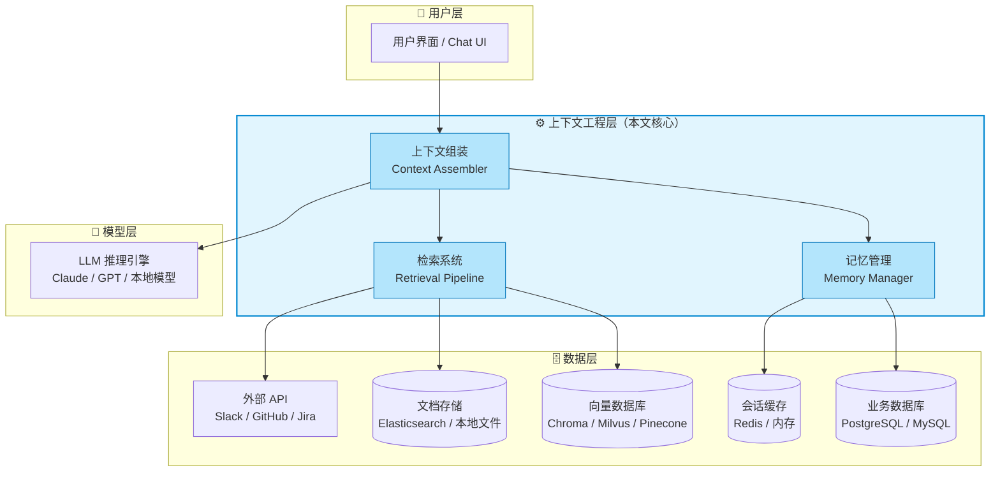
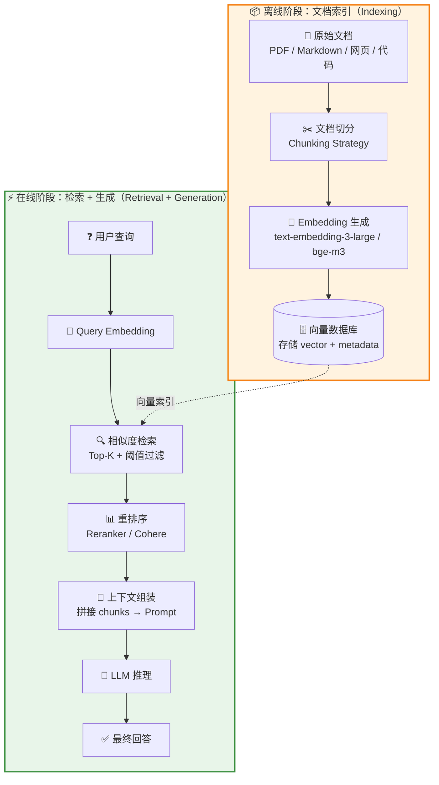
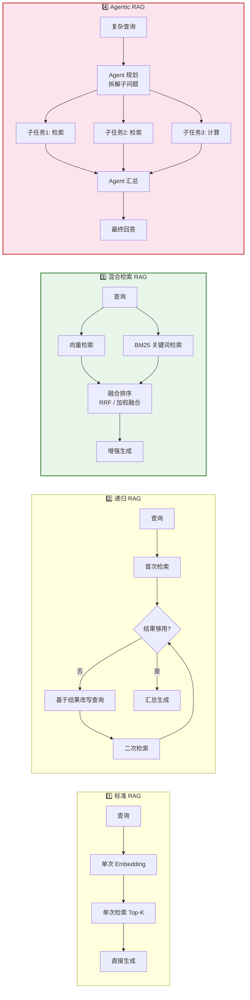
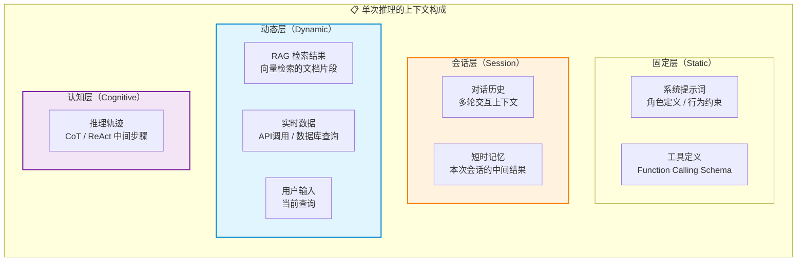
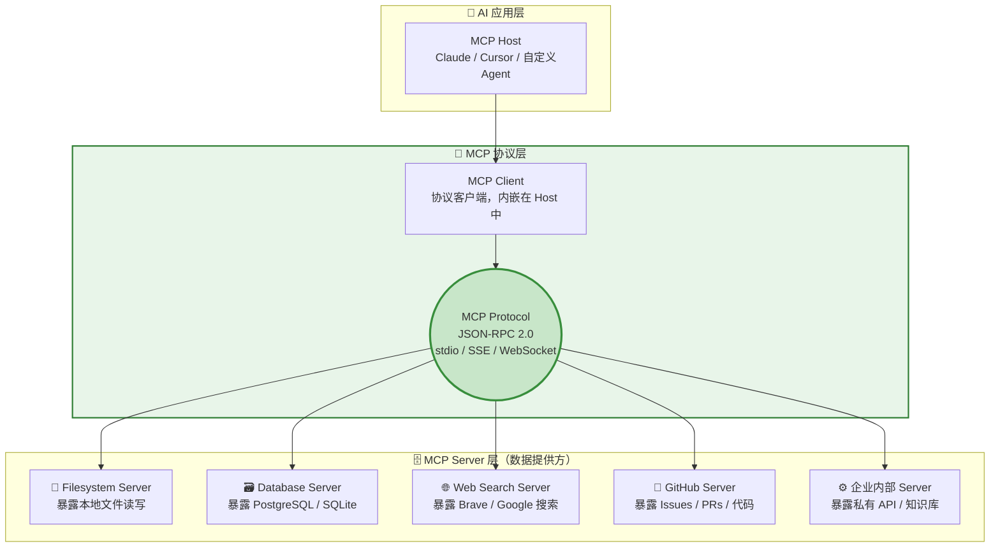
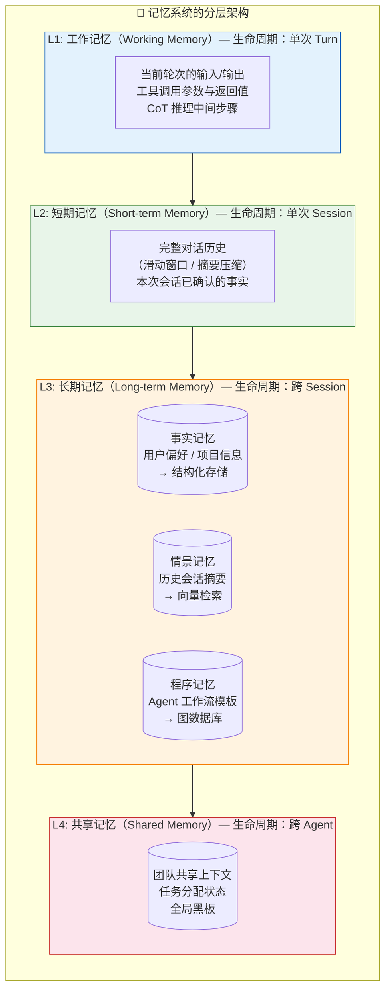
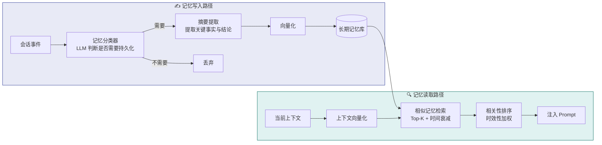
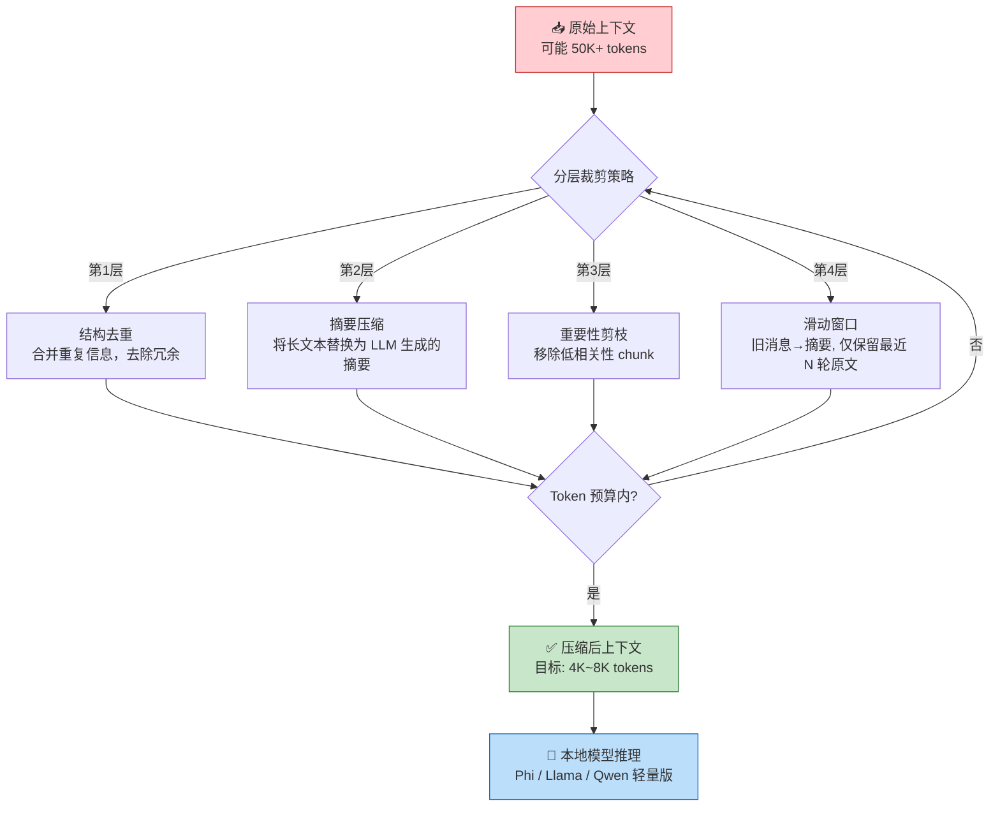
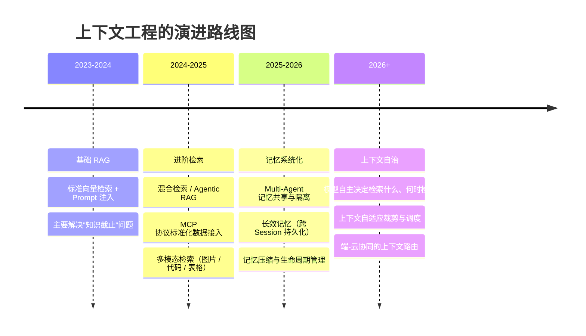

# 上下文工程：为 LLM 构建外挂大脑与长期记忆

> [!summary] 本文面向读者
> AI 应用开发者、系统架构师、后端工程师。从 LLM 的固有缺陷出发，深入解析上下文工程的核心命题：如何通过 **检索增强（RAG）** 为模型注入实时知识，如何借助 **MCP 协议** 标准化数据接入，以及如何在 [[Multi-Agent]] 协同场景下设计 **记忆系统** 的共享与隔离机制。
>
> 写作目标：不是泛泛介绍概念，而是从工程落地的视角，剖析上下文工程的完整链路——从数据摄入到上下文组装，从短时记忆到持久化存储，从云端推理到端侧裁剪。

> [!summary] 前置阅读
> - [[重新认识AI]] — LLM 的基本原理、能力边界与核心缺陷（幻觉、上下文窗口限制）
> - [[Model_Context_Protocol_MCP]] — AI 与外部系统的标准化连接协议
> - [[Multi-Agent]] — 多 Agent 协同的架构解析与工程实践

---

## 1. 问题原点：LLM 为什么需要"上下文工程"？

### 1.1 模型的三大先天缺陷

大语言模型虽然强大，但脱胎于离线训练的它，在面对真实世界的工程需求时暴露出三个根本性局限：

> [!info] 概念解析：LLM 的三大工程缺口

| 缺陷 | 表现 | 根因 |
|------|------|------|
| **知识截止** | 无法回答训练截止日期之后的事件 | 模型权重是静态快照，不具备增量学习能力 |
| **上下文窗口瓶颈** | 窗口长度有限（128K~1M tokens），无法塞入企业级全量文档 | 自注意力机制的 O(n²) 复杂度决定了硬上限 |
| **私有数据隔离** | 无法访问企业内部数据库、代码仓库、实时业务指标 | 模型训练时从未见过这些数据，且出于安全考虑不应直接暴露 |

> [!important] 架构重点
> 这三个缺陷并非独立存在，而是相互耦合的。例如：即使通过微调引入了企业数据（解决私有数据问题），模型依然会在微调截止后"过期"（知识截止问题），且微调无法解决实时数据查询（上下文窗口瓶颈）。**上下文工程**正是从架构层面系统性解决这三者耦合问题的工程范式。

### 1.2 上下文工程的定义与定位

> [!info] 概念解析：什么是上下文工程（Context Engineering）？
>
> **上下文工程**是一套系统化的工程方法论，其核心目标是：**在 LLM 推理之前，将从异构数据源中检索、转换、组装而来的"上下文信息"注入模型的提示词（Prompt）中，使模型在推理时能够访问超出其训练数据和上下文窗口限制的外部知识。**
>
> 它与传统软件工程的区别在于：
> - **输入不确定**：每次推理的上下文是动态拼装的，而非固定的配置或参数
> - **质量即答案**：上下文的质量直接决定模型输出质量，Garbage In, Garbage Out 更加显著
> - **延迟敏感**：上下文组装处于推理的"关键路径"上，任何延迟都会放大到用户体验层

上下文工程在 AI 应用栈中的定位可以用以下全景架构图表示：



---

## 2. RAG：检索增强生成的架构全景

### 2.1 标准 RAG 数据流

RAG（Retrieval-Augmented Generation）是上下文工程中最核心的范式。它的本质思想是：**从外部知识库中检索与用户查询最相关的文档片段，将其作为"参考材料"注入 Prompt，使模型能够基于这些材料生成回答。**



> [!info] 概念解析：RAG 核心组件

| 组件 | 职责 | 典型技术选型 |
|------|------|-------------|
| **文档切分器** | 将长文档切分为语义完整的段落 | LangChain Text Splitters, LlamaIndex Node Parser |
| **Embedding 模型** | 将文本映射为高维向量，捕获语义相似性 | OpenAI `text-embedding-3-large`, BGE-M3, Cohere Embed v3 |
| **向量数据库** | 存储和检索高维向量及其元数据 | Milvus（生产级）, Chroma（轻量）, Pinecone（托管）, pgvector（PG 生态） |
| **检索策略** | 决定如何从向量库中召回最相关的片段 | 相似度检索（Cosine/L2）, 混合检索（BM25 + 向量）, 递归检索 |
| **重排序器** | 对召回的候选片段进行精细排序，过滤低质量结果 | Cohere Rerank, BGE-Reranker, cross-encoder |

### 2.2 RAG 如何对抗模型幻觉

模型幻觉是 LLM 最棘手的工程问题之一——模型会以高度自信的语调编造不存在的事实。RAG 之所以能从根本上缓解幻觉，不是因为它"修复"了模型，而是因为它改变了模型的**信息来源**：

> [!important] 架构重点：RAG 对抗幻觉的三层机制

```
┌──────────────────────────────────────────────────────────────┐
│                      RAG 的三层抗幻觉机制                       │
├──────────────────────────────────────────────────────────────┤
│                                                              │
│  第一层：来源绑定（Source Grounding）                          │
│  ┌──────────────────────────────────────────────────────┐   │
│  │ LLM 不再依赖"记忆"回答，而是被强制引用检索到的文档片段。 │   │
│  │ Prompt 设计："请仅基于以下参考资料回答，若资料不足，    │   │
│  │  请明确说明'我无法从现有资料中找到相关信息'。"         │   │
│  └──────────────────────────────────────────────────────┘   │
│                           ↓                                  │
│  第二层：引用溯源（Citation）                                  │
│  ┌──────────────────────────────────────────────────────┐   │
│  │ 每个检索到的 chunk 携带元数据（来源文件、段落号、URL）， │   │
│  │ 模型被要求对每个断言标注出处，让用户可独立验证。        │   │
│  │                                                      │   │
│  │ 示例输出：                                            │   │
│  │ "Kubernetes 1.30 中 PodDisruptionBudget 支持了        │   │
│  │  新的 unhealthyPodEvictionPolicy 字段[来源:             │   │
│  │  k8s-docs/pdb.md, 段落 12]"                           │   │
│  └──────────────────────────────────────────────────────┘   │
│                           ↓                                  │
│  第三层：置信度分层（Confidence Calibration）                   │
│  ┌──────────────────────────────────────────────────────┐   │
│  │ 根据检索结果的相似度分数和数量，动态调整模型的回答策略： │   │
│  │                                                      │   │
│  │ • 高置信度（Top-1 score > 0.85）：直接引用回答        │   │
│  │ • 中置信度（0.6 < score < 0.85）：引用 + 免责声明     │   │
│  │ • 低置信度（score < 0.6）：拒绝回答 + 建议重新表述    │   │
│  └──────────────────────────────────────────────────────┘   │
│                                                              │
└──────────────────────────────────────────────────────────────┘
```

> [!warning] 工程避坑：RAG 并非银弹
>
> **① 检索失败 ≠ 无幻觉**
> 如果向量检索召回了**错误但仍然相关**的文档片段（例如不同产品的 API 文档），模型会基于错误材料生成"有据可查但事实错误"的回答，这种幻觉反而更隐蔽、更难排查。
>
> **② Chunk 切分的暗坑**
> 切分过小：语义碎片化，Embedding 无法捕获完整语义 → 检索精度下降
> 切分过大：每个 chunk 包含过多噪声，模型容易被无关信息干扰 → 窗口利用率低
>
> **③ Embedding 模型的语义盲区**
> 通用 Embedding 模型对领域专用术语（医疗、法律、金融）的语义理解可能很差，导致检索召回率断崖式下跌。**务必将 Embedding 模型的质量评估纳入技术选型流程。**

### 2.3 进阶 RAG 架构

标准 RAG 在实际生产中往往需要多轮优化才能达到可用水平。以下是几种工程化的进阶模式：



> [!tip] 最佳实践：检索策略选型指南
>
> - **文档量 < 1,000 篇，内容同质** → 标准 RAG 足够
> - **文档量中等，包含精确术语/代码** → 混合检索（向量 + BM25）
> - **查询需要多步推理**（如"和上月相比，哪些指标的变动超过10%"）→ Agentic RAG
> - **多语言场景** → 使用多语言 Embedding 模型（如 BGE-M3），并在 chunk 切分时保留语言标记

---

## 3. 上下文整合：协议、组装与 MCP

### 3.1 上下文的构成模型

在真实的企业 AI 应用中，一次推理所需的上下文远不止 RAG 检索到的文档片段。一个典型的上下文由以下几部分**动态组装**而成：



> [!important] 架构重点：上下文组装的核心矛盾
>
> 上下文的每一层都在**争抢有限的 Token 预算**。系统提示词占 500 tokens，对话历史占 3,000 tokens，RAG 检索结果占 5,000 tokens——当这三者已经逼近模型窗口上限时，就没有空间留给 CoT 推理轨迹了。
>
> 上下文工程的核心挑战不是"如何获取更多数据"，而是 **"如何在有限的 Token 预算内，选择最有价值的上下文"**。

### 3.2 MCP：数据源的标准化接入

在引入 [[Model_Context_Protocol_MCP]] 之前，每个数据源的接入都是一次性的"点对点"集成——写一套 Slack 胶水代码、一套 GitHub 胶水代码、一套 Jira 胶水代码。这种模式根本不可持续。

MCP 的价值在于它提供了一套 **标准化的客户端-服务器协议**，将数据源的接入与 AI 应用的上下文组装解耦：



> [!info] 概念解析：MCP 在上下文工程中的角色
>
> MCP 为上下文工程解决了**三个核心耦合问题**：
>
> 1. **接入解耦**：数据源的实现细节（认证、分页、格式转换）完全封装在 MCP Server 中，AI 应用只需通过标准协议调用 `tools/list` 和 `tools/call`。
> 2. **安全边界**：每个 MCP Server 运行在独立的进程/容器中，天然实现了权限隔离。GitHub Server 拥有删除仓库的权限，但 Filesystem Server 只有读取指定目录的权限——两者互不侵蚀。
> 3. **生态复用**：一个团队开发的 MCP Server 可以被公司内所有 AI 应用复用。MCP 的 `resources/list`、`tools/list`、`prompts/list` 三个核心原语构成了数据源的"服务发现"机制。

> [!tip] 最佳实践：MCP Server 的上下文设计模式
>
> **模式一：尽早过滤（Filter Early）**
> 不要在 MCP Server 中将全量数据返回给模型。利用 `tools/call` 的参数定义做语义过滤：
> ```
> // ❌ 错误：返回全量
> tools/call: { name: "list_issues" } → 返回 10,000 条 issues
>
> // ✅ 正确：参数过滤
> tools/call: { name: "list_issues", arguments: { 
>   repo: "backend", status: "open", 
>   label: "bug", limit: 20 
> }}
> ```
>
> **模式二：分层返回（Layered Response）**
> 首次返回摘要（title + ID），模型判断有价值的条目后再进行"展开"调用获取详情：
> ```
> 第一步：list_issues → [{id, title, priority} × 20]
> 第二步（按需）：get_issue({id: 123}) → {title, body, comments, ...}
> ```
>
> **模式三：资源模板化（Resource Templates）**
> 对于文档类数据，使用 MCP 的 `resources/templates` 语义描述 URI 模式，让模型自行构造精确的资源路径：
> ```
> Resource Template: docs://{project}/{version}/{page}
> 模型：我需要 docs://backend/v2.5/deployment-guide
> Server：返回该文档的完整内容（已分 chunk）
> ```

---

## 4. 系统级记忆管理

### 4.1 记忆的分层架构

在复杂的 [[Multi-Agent]] 协同场景或基于 [[脚手架工程]] 构建的 Agent 框架中，"记忆"不再是一个单一的 KV 存储，而是被拆分为多个层级的**时间-空间-权限**三维结构：



### 4.2 Multi-Agent 场景下的记忆隔离与共享

[[Multi-Agent]] 架构的最大工程挑战之一，就是如何设计记忆的**共享与隔离边界**。每个 Agent 既是独立的推理单元，又需要感知全局任务状态。

> [!important] 架构重点：Multi-Agent 记忆设计的四个维度

```
┌─────────────────────────────────────────────────────────────────┐
│                    Multi-Agent 记忆权限矩阵                        │
├──────────────────┬──────────┬──────────┬──────────┬─────────────┤
│   记忆类型        │ Agent A  │ Agent B  │ Agent C  │ Orchestrator│
│                  │ (代码生成)│ (代码审查)│ (测试运行)│ (编排器)     │
├──────────────────┼──────────┼──────────┼──────────┼─────────────┤
│ 工作记忆（Turn）  │ 隔离     │ 隔离     │ 隔离     │ 不可见       │
│ 短期记忆（Sess）  │ 隔离     │ 隔离     │ 隔离     │ 只读         │
│ 长期事实记忆      │ 共享读   │ 共享读   │ 共享读   │ 读写         │
│ 共享任务状态      │ 只读     │ 只读     │ 只读     │ 读写         │
│ 全局黑板          │ 读写     │ 读写     │ 读写     │ 读写         │
└──────────────────┴──────────┴──────────┴──────────┴─────────────┘
```

> [!info] 概念解析：记忆隔离的设计原则
>
> **原则一：最小可见性（Least Visibility）**
> 每个 Agent 默认只能访问自己的短期记忆。需要跨 Agent 共享的信息必须显式写入"全局黑板"（Shared Blackboard），而不是隐式地在 Agent 间传递。
>
> **原则二：消息不可变性（Immutable Messages）**
> 一旦一个 Agent 将信息写入共享记忆，其他 Agent 只能追加（Append），不能修改或删除。这避免了并发下的竞态条件，也为审计和回溯提供了基础。
>
> **原则三：记忆生命周期绑定（Lifecycle Binding）**
> 工作记忆绑定到 Turn，短期记忆绑定到 Session，长期记忆绑定到 User/Project。当一个 Session 结束，该 Session 内的短期记忆应被**摘要化**后写入长期记忆，原始数据可以安全清理。

> [!warning] 工程避坑：记忆系统的常见反模式
>
> **① "全量 dump"反模式**
> 将所有 Agent 的所有中间结果不加区分地写入同一个共享记忆池。随着 Agent 数量增加，共享记忆迅速退化为"噪声池"，后续 Agent 检索到的更多是垃圾数据而非有用信息。
>
> **② "内存泄漏"反模式**
> 每次会话都将完整的对话历史写入长期记忆而不做摘要压缩。一个活跃用户一个月可能产生数十万条消息，直接全部向量化存储会导致检索延迟不可接受。
>
> **③ "幽灵状态"反模式**
> Agent A 修改了共享记忆中的某个状态，Agent B 依赖该状态做决策——但 Agent A 的中途崩溃导致该状态不完整或矛盾。**始终为共享记忆写入设计幂等性和验证逻辑。**

### 4.3 长期记忆的工程实现



> [!tip] 最佳实践：记忆的时效性权重设计
>
> 并非所有记忆都同等重要。为每条记忆引入**时间衰减因子**可以显著提升检索相关性：
>
> ```
> 最终分数 = 向量相似度 × e^(-λ × 距今时长)
> 
> λ=0.01  → 半衰期约 70 天（项目背景、技术栈偏好）
> λ=0.1   → 半衰期约 7 天 （近期讨论主题、正在解决的问题）
> λ=1.0   → 半衰期约 0.7 天（会话内的临时决策）
> ```
>
> 通过为不同类型的记忆设置不同的衰减率，可以在不增加检索复杂度的情况下实现精细的时效性管理。

---

## 5. 工程考量：端侧 AI 与本地化

### 5.1 上下文裁剪与压缩

在跨平台应用（桌面端 → 移动端）或本地离线 AI 助手的场景下，模型的能力通常会显著下降（本地模型参数更小 → 上下文窗口更短 → 推理速度更慢）。上下文裁剪与压缩变成了**硬需求**。



> [!info] 概念解析：上下文压缩的核心手段

| 技术 | 原理 | 压缩率 | 适用场景 |
|------|------|--------|----------|
| **摘要压缩** | 用较小模型将长文本提炼为要点，丢弃原文 | 80-95% | 对话历史、长文档 |
| **语义去重** | 计算 chunk 间的语义相似度，合并高度相似的内容 | 20-40% | 多次检索返回冗余结果 |
| **重要性剪枝** | 按相关性分数排序，丢弃低于阈值的 chunk | 30-70% | RAG 检索结果 |
| **滑动窗口 + 摘要** | 保留最近 N 轮对话原文，更早的仅保留摘要 | 50-80% | 长对话历史 |
| **Token 级剪枝** | 移除低注意力分数的 token（如 LLMLingua） | 50-80% | 端侧推理的最后一步 |

### 5.2 本地化上下文管理的隐私与性能平衡

> [!important] 架构重点：端侧上下文管理的核心权衡

构建一个"本地优先"的 AI 助手（如本地知识库问答、离线 AI 编程助手），面临一个根本性的矛盾：

```
┌──────────────────────────────────────────────────────────────┐
│                        端侧上下文的三体问题                    │
│                                                              │
│                      隐私安全 (Privacy)                       │
│                      /            \                          │
│                     /              \                         │
│                    /    🔴 不可能   \                         │
│                   /    三者同时最优   \                        │
│                  /                    \                       │
│                 /                      \                      │
│    精度质量 (Quality) ──────────── 延迟性能 (Performance)     │
│                                                              │
│  选择 私密 + 高质 → 延迟高（大模型在云端推理，数据上传）       │
│  选择 私密 + 低延迟 → 质量低（本地小模型能力有限）              │
│  选择 高质 + 低延迟 → 无隐私（全量数据上云）                    │
└──────────────────────────────────────────────────────────────┘
```

> [!tip] 最佳实践：端侧上下文工程的实用策略

**策略一：分层推理（Tiered Inference）**

```
简单查询（关键词匹配 / 已有答案缓存）
  → 本地小模型（无网络，< 500ms）
复杂查询（需要深度推理 / 跨文档综合）
  → 先本地预处理（去敏 + 压缩）→ 脱敏后上云
```

**策略二：本地 Embedding + 云端推理**

```
Embedding 生成 & 向量检索（本地完成）
  → 数据不出设备，隐私得到保障
  ↓
检索到的 Top-K chunks（经过去敏）
  → 发送到云端推理
  ↓
优势：云端只看到检索结果，看不到全量知识库
```

**策略三：渐进式同步（Progressive Sync）**

对跨设备场景（桌面 → 手机），不是全量同步记忆库，而是按优先级分批同步：
- P0（即时同步）：当前会话上下文、任务状态
- P1（分钟级）：摘要化的近期记忆
- P2（小时级 / Wi-Fi）：完整的向量索引

> [!warning] 工程避坑：端侧部署的常见陷阱
>
> **① 本地模型的能力错觉**
> 在本地运行 7B 模型做复杂 RAG 推理时，模型的指令遵循能力会显著下降。很可能出现"资料就在上下文中，但模型无视资料"的情况。**始终在本地推理前对 Prompt 进行简化适配。**
>
> **② Embedding 模型的一致性陷阱**
> 如果索引阶段使用的是云端大 Embedding 模型（如 3,072 维的 `text-embedding-3-large`），而检索阶段在端侧使用轻量 Embedding 模型（如 384 维的 `all-MiniLM-L6-v2`），向量空间不兼容，检索精度会断崖式下跌。**确保索引和检索使用相同的 Embedding 模型。**
>
> **③ 存储膨胀陷阱**
> 本地知识库长期运行后，向量索引 + 原始文档 + 会话历史的存储占用可能远超预期。**为端侧存储设计明确的容量上限和淘汰策略（LRU + 重要性加权）。**

---

## 6. 全景总结：上下文工程的未来演进



> [!summary] 核心 Takeaways
>
> 1. **上下文工程不是提示词工程的子集**，而是一个独立的系统工程领域，涵盖数据摄入、检索、记忆管理、协议标准化，以及端侧部署的全链路。
> 2. **RAG 是手段，不是目的**。对抗模型幻觉 需要 RAG + 引用溯源 + 置信度分层的组合拳，任何单一技术都不足以根治幻觉。
> 3. **[[Model_Context_Protocol_MCP|MCP]] 是上下文工程的"标准化底座"**。它解决了 AI 应用与外部数据源之间的 M×N 集成复杂度，将线性增长的胶水代码缩减为常数的协议实现。
> 4. **[[Multi-Agent]] 的记忆管理需要"最小可见性 + 不可变消息 + 生命周期绑定"三个原则**，否则会陷入全量 dump、内存泄漏、幽灵状态的工程陷阱。
> 5. **端侧上下文工程的核心是分层决策**——不是把所有能力都压缩到本地，而是在隐私、质量和延迟之间找到动态平衡点。
> 6. **任何基于 [[脚手架工程]] 构建的 Agent 框架，都应在设计之初就把"上下文的生命周期管理"作为一等公民**，而非事后补救。

---

> [!tip] 延伸阅读
> - [[重新认识AI]] — LLM 基本原理与能力边界
> - [[Model_Context_Protocol_MCP]] — MCP 协议的深度解析
> - [[Multi-Agent]] — 多 Agent 协同架构与工程实践
> - [[提示词工程]] — 上下文注入后的 Prompt 设计方法论
