# 0. 概述

> [!summary] 本文面向读者
> AI 应用开发者、Agent 系统架构师、以及正在从 Demo 走向生产的一线工程团队。如果你已经掌握了 [[提示词工程|提示词工程]] 和 [[上下文工程|上下文工程]] 的基本方法论，但困惑于 "Prompt 调好了，上线后质量却持续劣化" 或 "模型一升级，整个系统行为全变了"——这篇文章正是为你写的。
>
> 写作目标：不是空谈 "持续迭代很重要"，而是从**工程基础设施**的视角，系统拆解如何为 LLM 应用构建一套可度量、可复现、可自动化的评估-反馈-优化闭环。

> [!summary] 前置阅读
> - [[重新认识AI]] — LLM 的底层本质与能力边界，理解 "概率预测系统" 的工程含义
> - [[提示词工程]] — 提示词作为接口协议的设计方法论
> - [[上下文工程]] — RAG、记忆管理、上下文组装
> - [[脚手架工程]] — Agent 编排与基础设施构建（本文的 Eval Harness 需依托脚手架运行）
> - [[Agent实践指南]] — 本文的核心目标读者：即将或正在构建工业级 Agent 的团队

---

# 1. 引言：为什么我们需要"循环工程"？

## 1.1 传统软件工程 vs LLM 应用的根本差异

> [!info] 概念解析
> 传统软件工程的核心理念可以概括为**确定性**——给定相同的输入、相同的代码、相同的环境，输出必然是相同的。单元测试、集成测试、回归测试，全部建立在这个确定性假设之上。

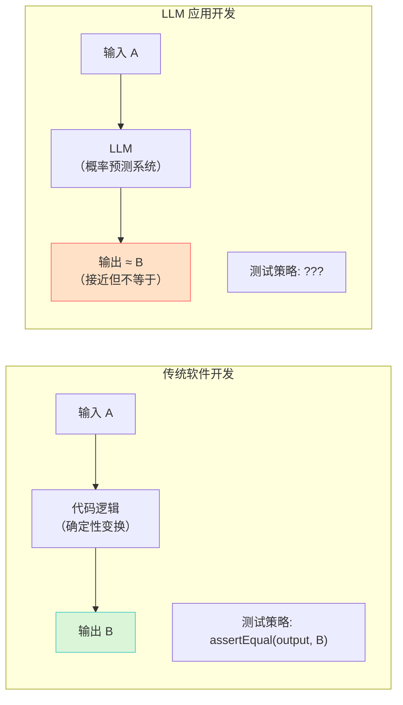

> [!important] 架构重点：LLM 应用的三大不确定性来源
>
> | 不确定性来源 | 表现 | 举例 |
> | :--- | :--- | :--- |
> | **模型非确定性** | 同一 prompt，两次调用的输出可能不同 | `temperature > 0` 时的采样随机性 |
> | **模型版本演进** | 基础模型升级后，原有 prompt 的行为漂移 | Claude 3.5 → 4.0，某些 prompt 的输出格式变了 |
> | **输入分布漂移** | 线上真实用户的输入，与开发时构造的测试用例差异巨大 | 你测试了标准 SQL 生成，用户输入的全是带方言的模糊描述 |

这三个不确定性叠加在一起，导致一个残酷的现实：**你的 LLM 应用上线第一天也许表现完美，但随着时间的推移，质量会不可阻挡地劣化——而你甚至无法准确定义"变差了"这件事。**

## 1.2 循环工程的定义

> [!info] 概念解析：什么是循环工程（Loop Engineering）？
>
> **循环工程**是一套系统化的工程方法论，其核心目标是：**在 LLM 应用的完整生命周期中，构建一条从"质量度量 → 问题发现 → 根因定位 → 定向优化 → 效果验证"的自动化闭环，使非确定性的概率系统产生可度量、可持续改进的确定性价值。**
>
> 它不是 Prompt Engineering 的进阶技巧，也不是 Fine-tuning 的替代方案——它是**把 LLM 应用当作真正的软件系统工程来对待时所必需的工程基础设施**。

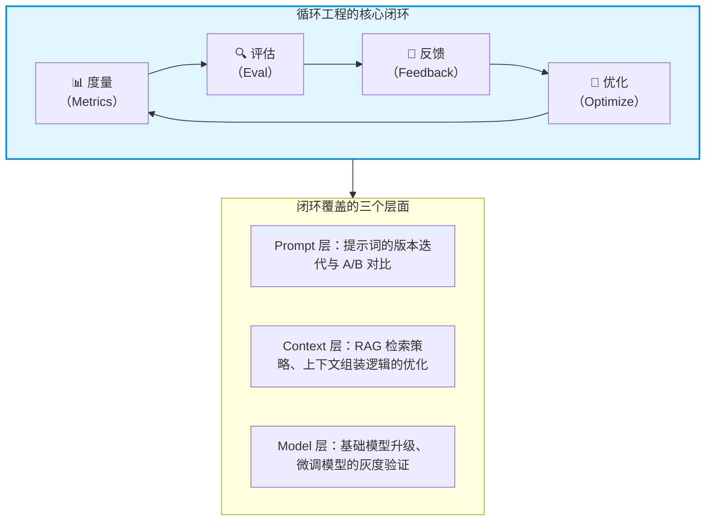

> [!quote] 核心观点
> **循环工程不是"写好代码之后的额外步骤"，而是 LLM 应用开发的"第一性原理"。** 在确定性软件中，你写测试是为了防止回归；在概率系统中，你必须在开发的第一天就建立评估体系——因为否则你根本不知道自己的产品是在变好还是变坏。

---

# 2. 循环工程的核心组件

## 2.1 基准测试与评估（Eval）：为概率输出建立确定性度量

### 2.1.1 为什么 LLM 的 Eval 比传统单元测试难一个数量级

> [!compare] 传统单元测试 vs LLM Eval

| 维度 | 传统单元测试 | LLM Eval |
| :--- | :--- | :--- |
| **断言方式** | 精确匹配（`assertEquals`） | 语义相似度、规则校验、模型打分 |
| **测试用例构造** | 人工编写有限边界用例 | 需要覆盖开放域的语义空间 |
| **通过/失败判定** | 二元（Pass / Fail） | 连续（Score 0-100）+ 阈值 |
| **回归风险** | 代码改动可精确定位影响面 | Prompt 一行改动可能改变 30% 的输出行为 |
| **维护成本** | 随代码规模线性增长 | 随任务复杂度指数增长 |

> [!warning] 工程避坑：Eval 的"信噪比陷阱"
>
> 很多团队在搭建 Eval 体系时陷入一个误区：**追求 Eval 用例的数量，而忽略了用例的质量和代表性**。200 个从测试文档自动生成的 "Hello World" 级别用例，远不如 20 个精心构造的、覆盖真实业务边界情况的用例。
>
> **Eval 的价值 = 用例代表性 × 判定准确性，而不是用例数量。**

### 2.1.2 三大评估范式

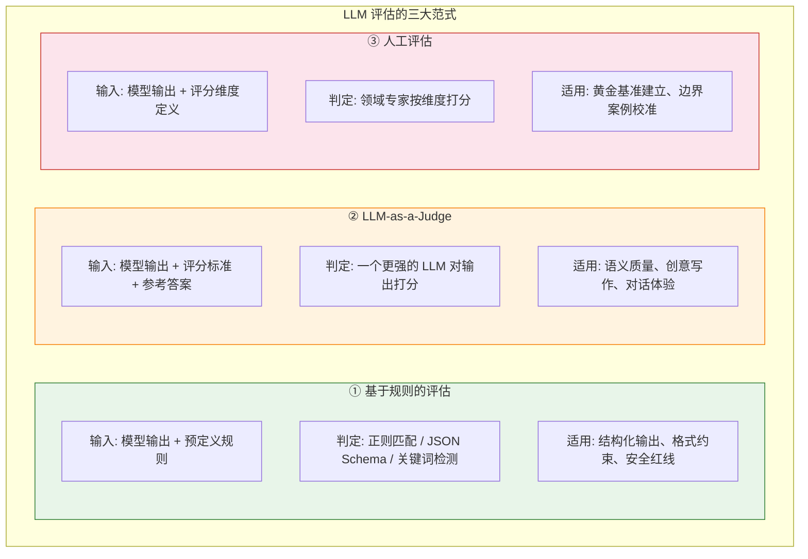

#### 范式一：基于规则的评估

这是最可靠、最快速、最便宜的评估方式——也是你应该**优先穷尽**的方式。

```python
"""
基于规则的 Eval 示例：评估一个 SQL 生成 Agent 的输出质量。
规则校验是 Eval 体系的第一道防线——能靠规则解决的，绝不依赖 LLM 打分。
"""
from dataclasses import dataclass
from typing import List, Optional
import json
import re


@dataclass
class EvalResult:
    """单条评估结果"""
    case_id: str
    passed: bool
    score: float  # 0.0 - 1.0
    failures: List[str]  # 失败原因列表


class SQLGenerationEval:
    """SQL 生成任务的规则评估器"""

    # 安全红线：禁止的 SQL 模式
    DANGEROUS_PATTERNS = [
        (r"DROP\s+(TABLE|DATABASE)", "禁止 DROP 操作"),
        (r"DELETE\s+FROM\s+\w+\s*(?!WHERE)", "DELETE 必须带 WHERE 条件"),
        (r"TRUNCATE", "禁止 TRUNCATE 操作"),
        (r"--.*(password|secret|token)", "SQL 注释中包含敏感字段提示"),
    ]

    def evaluate(self, case_id: str, generated_sql: str,
                 expected_sql: Optional[str] = None,
                 table_schema: Optional[dict] = None) -> EvalResult:
        failures: List[str] = []

        # 规则 1: 安全红线检查
        for pattern, description in self.DANGEROUS_PATTERNS:
            if re.search(pattern, generated_sql, re.IGNORECASE):
                failures.append(f"[安全] {description}")

        # 规则 2: SQL 语法可解析性（通过 sqlparse 或 sqlglot 校验）
        if not self._is_valid_sql(generated_sql):
            failures.append("[语法] 生成的 SQL 无法解析")

        # 规则 3: 表名/列名合法性（如果提供了 schema）
        if table_schema:
            invalid_refs = self._validate_schema_refs(generated_sql, table_schema)
            if invalid_refs:
                failures.append(f"[Schema] 引用了不存在的表/列: {invalid_refs}")

        # 规则 4: 与参考答案的精确/模糊匹配（如果提供了 expected_sql）
        if expected_sql:
            if not self._semantic_equivalent(generated_sql, expected_sql):
                failures.append("[一致] 与参考答案语义不等价")

        passed = len(failures) == 0
        score = 1.0 if passed else max(0.0,
            1.0 - 0.25 * len(failures))  # 每个失败扣 0.25 分

        return EvalResult(
            case_id=case_id,
            passed=passed,
            score=score,
            failures=failures
        )

    def _is_valid_sql(self, sql: str) -> bool:
        """校验 SQL 语法合法性"""
        try:
            import sqlglot
            sqlglot.parse(sql)
            return True
        except Exception:
            return False

    def _validate_schema_refs(self, sql: str, schema: dict) -> List[str]:
        """检查 SQL 中引用的表名和列名是否存在于 schema 中"""
        # 实现略：提取 SQL 中的表名/列名，与 schema 对比
        return []

    def _semantic_equivalent(self, generated: str, expected: str) -> bool:
        """检查两条 SQL 是否语义等价（通过语法树对比）"""
        # 实现略：使用 sqlglot 解析为 AST 后结构化对比
        return True
```

> [!tip] 最佳实践：规则评估的覆盖顺序
>
> 按优先级从高到低：
> 1. **安全红线**（禁止操作、敏感信息泄露）——一票否决
> 2. **格式合规**（JSON Schema、Markdown 结构、输出标签）——确保下游可解析
> 3. **关键事实**（引用的文件名、函数名、版本号是否正确）——事实性校验
> 4. **业务约束**（结果集大小、金额范围、时间格式）——领域规则

#### 范式二：LLM-as-a-Judge

当任务输出的质量无法用确定性规则完全覆盖时（如文本的流畅度、对话的自然度、摘要的完整性），引入一个**更强的 Judge 模型**来评分。

> [!important] 架构重点：Judge 模型选择的硬性要求
>
> **Judge 模型必须比被评估的模型更强。** 用一个 7B 的小模型去评判 Claude 4 的输出质量，就像让初中生给大学教授打分——毫无意义。在实际工程中，通常的做法是：
> - 被评估模型 = 线上服务模型（可能是微调后的较小模型）
> - Judge 模型 = 同期最强的旗舰模型（如 Claude Opus, GPT-4.5）

```python
"""
LLM-as-a-Judge 的核心实现模式。
关键设计决策：评分标准的结构化定义 + 强制引用证据。
"""

JUDGE_SYSTEM_PROMPT = """你是一个专业的输出质量评审专家。你的任务是严格、客观地评估 AI 输出。

## 评分规则
你需要按照以下四个维度打分（每项 1-5 分）：
1. **相关性**：输出是否直接回答了用户的问题？是否存在答非所问？
2. **准确性**：输出中的事实和代码是否正确？是否存在幻觉？
3. **完整性**：是否覆盖了问题的所有关键点？是否存在遗漏？
4. **格式规范**：输出格式是否符合要求（JSON Schema / Markdown / etc.）？

## 输出格式
你必须严格按照以下 JSON 格式输出评分结果：
{
  "scores": {
    "relevance": <1-5>,
    "accuracy": <1-5>,
    "completeness": <1-5>,
    "format": <1-5>
  },
  "overall": <1.0-5.0，加权平均分>,
  "evidence": {
    "strengths": ["具体引用输出中的优点，必须直接引用原文"],
    "weaknesses": ["具体引用输出中的缺陷，必须直接引用原文"]
  },
  "pass": <true/false，overall >= 3.5 为通过>
}

## 关键约束
- 评分必须有原文证据支撑，不能凭印象打分
- 如果输出中包含与参考答案矛盾的事实，准确性直接为 1 分
- 不支持模糊评价如 "整体不错"、"基本可以"
"""


def llm_judge_evaluate(
    user_query: str,
    model_output: str,
    reference_answer: str | None = None,
    judge_model: str = "claude-opus-4-20250514"
) -> dict:
    """
    使用 Judge 模型评估单条输出质量。

    Args:
        user_query: 原始用户输入
        model_output: 待评估的模型输出
        reference_answer: 参考答案（如有）
        judge_model: 用于评分的模型标识

    Returns:
        评分结果字典
    """
    judge_prompt = f"""请评估以下 AI 输出的质量。

## 用户问题
{user_query}

## AI 输出（待评估）
{model_output}
"""

    if reference_answer:
        judge_prompt += f"""
## 参考答案
{reference_answer}

注意：参考答案是"参考"而非"唯一正确答案"。如果 AI 输出与参考答案不同但同样正确有效，不应扣分。
"""

    # 调用 Judge 模型...
    # response = call_llm(judge_model, system=JUDGE_SYSTEM_PROMPT, user=judge_prompt)
    # return parse_judge_response(response)
    return {}
```

> [!warning] 工程避坑：LLM-as-a-Judge 的四大陷阱
>
> **① 位置偏差（Position Bias）**
> Judge 模型倾向于给排列在前面的选项打更高分。如果你在比较两个模型输出，务必做**双向评估**（交换 A/B 顺序评估两次，取平均）。
>
> **② 自我偏好（Self-Bias）**
> 用模型 A 评估模型 A 自己的输出，评分会显著偏高。**绝对禁止自评**——Judge 模型必须与被评估模型隔离。
>
> **③ 长度偏好（Length Bias）**
> Judge 模型倾向于认为"更长的回答更好"。在评分标准中明确加入简洁性约束，或对输出长度做归一化。
>
> **④ 风格偏好（Style Bias）**
> Judge 模型可能偏好某种写作风格（如正式 vs 口语化）。如果你的业务需要多种风格，确保在评分标准中明确业务场景的风格要求。

#### 范式三：人工评估

> [!tip] 最佳实践：人工评估的正确用法
>
> 人工评估不是 Eval 体系的主体——它的核心价值在于**校准**：
> - **初期校准**：在建立自动化 Eval 体系时，用人工标注建立 50-100 条 "黄金标准" 用例
> - **定期校准**：每月抽查 100 条线上输出，验证自动化 Eval 的评分是否与人工判断一致
> - **边界校准**：当 Judge 模型和规则评估的结论出现矛盾时，人工介入裁定

### 2.1.3 Eval 体系的分层架构

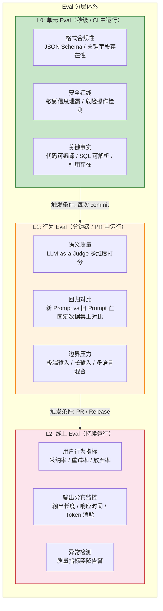

## 2.2 数据飞轮与埋点：从线上混沌中提取高信噪比信号

### 2.2.1 为什么"收集 Bad Case"看起来简单，做起来难

> [!info] 概念解析
> 数据飞轮（Data Flywheel）的核心思想是：**将线上用户与模型交互过程中产生的隐式反馈，系统性地转化为可用于优化模型/提示词的高质量数据集。** 这个看似简单的"收集-整理-利用"循环，在工程落地中却充满陷阱。

> [!warning] 工程避坑：Bad Case 收集的三大反模式
>
> **① "保存全量日志 = 建立数据飞轮"**
> 全量日志是**噪声池**，不是**数据集**。一个日均万次调用的 Agent 服务，每天的 JSONL 日志可能达到 GB 级别——但其中 90% 以上的对话是 "感谢"、"好的"、"再帮我改一下" 这类对优化无价值的交互。
>
> **② "用户点赞就是好，用户点踩就是差"**
> 用户的显式反馈（👍/👎）信噪比极低。用户可能因为模型态度好而点赞一个错误答案，也可能因为模型说了他不爱听的事实而点踩一个正确答案。
>
> **③ "把所有 Bad Case 都拿来微调"**
> Bad Case 不等于训练数据。一个用户因为网络超时导致的失败，不应该被模型学习为 "这种情况下应该输出错误信息"。

### 2.2.2 高信噪比的反馈信号设计

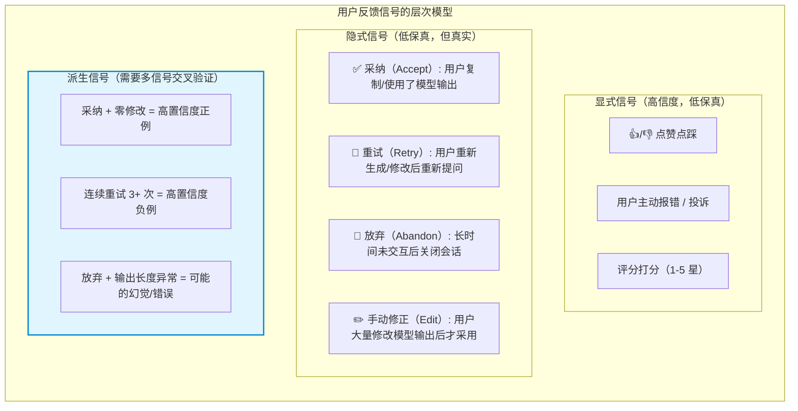

> [!important] 架构重点：最有价值的三个信号
>
> 在所有信号中，**采纳率（Accept Rate）**、**重试率（Retry Rate）**、**编辑距离（Edit Distance）** 构成了最核心的三维质量度量：
>
> ```python
> """
> 线上埋点的核心数据结构：捕获每一次"人机交互"中的关键信号。
> """
> from dataclasses import dataclass, field
> from datetime import datetime
> from enum import Enum
> from typing import Optional
>
>
> class Outcome(Enum):
>     ACCEPTED_AS_IS = "accepted_as_is"       # 用户直接采纳，零修改
>     ACCEPTED_WITH_EDITS = "accepted_edited"  # 用户修改后采纳
>     RETRIED = "retried"                      # 用户重新生成/重新提问
>     ABANDONED = "abandoned"                  # 用户放弃（无后续交互）
>     REPORTED_ERROR = "reported_error"        # 用户主动报错
>
>
> @dataclass
> class InteractionSignal:
>     """单次人机交互的反馈信号"""
>     # 基础信息
>     session_id: str
>     turn_id: int
>     timestamp: datetime
>
>     # 模型侧信息
>     prompt_version: str           # 当前使用的 Prompt 版本号
>     model_version: str            # 模型版本（含日期）
>     generated_output: str         # 模型原始输出
>     output_token_count: int
>     latency_ms: int
>
>     # 用户侧行为信号
>     outcome: Outcome              # 交互结果
>     final_output: Optional[str] = None     # 用户最终使用的文本（可能被编辑过）
>     edit_distance: Optional[int] = None    # 编辑距离（0 = 零修改）
>     retry_count: int = 0                   # 同一 turn 内的重试次数
>     time_to_next_action_ms: Optional[int] = None  # 响应时间，用于判断"犹豫"
>
>     # 质量标签（后续异步标注）
>     is_golden_case: bool = False  # 是否为人工标注的黄金用例
>     quality_label: Optional[str] = None  # good / bad / ambiguous
>     bad_case_root_cause: Optional[str] = None  # hallucination / format / incomplete / ...
> ```


### 2.2.3 从信号到数据集的转化流水线

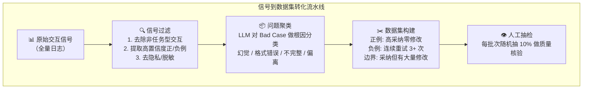

> [!tip] 最佳实践：数据飞轮的启动策略
>
> 不要把数据飞轮想成 "先收集三个月数据再一次性利用"。正确的启动方式：
>
> **Week 1-2**：上线最小埋点集（outcome + edit_distance + retry_count）。不做任何优化，纯观测。
>
> **Week 3-4**：从收集到的数据中人工抽取 20 条高质量正例和 20 条典型负例。这就是你的 **初始 Eval 基准集**。
>
> **Month 2**：基于基准集，做第一轮 Prompt 优化。观察线上采纳率的变化。
>
> **Month 3+**：自动化数据标注流水线上线。每周自动生成一批新的 Eval 用例，人工抽检后合并入基准集。

## 2.3 自动化迭代流水线（LLM CI/CD）：让变更不再靠"感觉"

### 2.3.1 LLM CI/CD 的定义与核心挑战

> [!info] 概念解析
> LLM CI/CD 是将传统软件 CI/CD 的核心思想——自动化测试、门禁检查、灰度发布、快速回滚——应用到 LLM 应用的生命周期管理中。它的核心挑战在于：**在传统 CI/CD 中，"通过测试"是明确的是/否判断；而在 LLM CI/CD 中，"通过测试"是一个连续的置信度区间。**

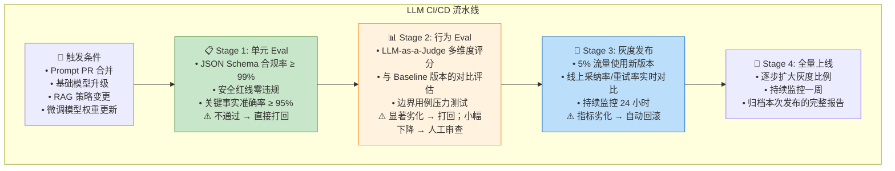

### 2.3.2 防劣化控制的核心机制

> [!important] 架构重点：防劣化（Regression Prevention）的四个工程抓手

**抓手一：基线快照（Baseline Snapshot）**

每次 Prompt 或模型变更前，必须在固定 Eval 数据集上生成一份完整的基线报告。新版本的**所有维度评分**都必须与基线做对比。关键指标：

| 指标 | 含义 | 可接受的劣化阈值 |
| :--- | :--- | :--- |
| Pass Rate | 整体通过率 | 下降 ≤ 2% |
| Avg Score | 平均得分 | 下降 ≤ 0.1 分（5 分制） |
| Regression Count | 从 Pass→Fail 的用例数 | ≤ 5% 的总用例数 |
| New Failures | 新增的失败用例 | 需要逐条人工审查 |

**抓手二：差异分析（Diff Analysis）**

不是笼统地比较总分，而是**逐用例对比新旧版本输出**，识别行为变化的具体模式：

```python
"""
差异分析的核心逻辑：不只是"新版本得分降低了3分"，
而是"在需要生成INSERT语句的场景下，新版本倾向于省略ON CONFLICT子句"。
"""

@dataclass
class DiffResult:
    """单条用例的新旧版本对比"""
    case_id: str
    old_score: float
    new_score: float
    score_delta: float          # 负值 = 劣化
    behavior_change: str        # "unchanged" / "format_change" / "content_change"
    change_summary: str         # LLM 生成的变化摘要（一句话）
    regression_severity: str    # "critical" / "major" / "minor" / "none"


def analyze_diff(old_output: str, new_output: str,
                 old_score: float, new_score: float) -> DiffResult:
    """
    分析单个用例的新旧版本差异。
    使用一个轻量级 LLM 来分类变化类型和严重程度。
    """
    # 1. 如果得分变化在阈值内，直接标记为无显著变化
    if abs(new_score - old_score) < 0.2:
        return DiffResult(
            case_id="...",
            old_score=old_score,
            new_score=new_score,
            score_delta=new_score - old_score,
            behavior_change="unchanged",
            change_summary="输出无显著变化",
            regression_severity="none"
        )

    # 2. 使用 LLM 分析输出差异的性质
    # diff_analysis = llm_analyze_diff(old_output, new_output)
    # return DiffResult(...)
    pass
```

**抓手三：回滚触发器（Rollback Trigger）**

灰度发布期间，以下任一条件触发自动回滚：

```
线上采纳率下降 > 10%（相对值）
线上重试率上升 > 20%（相对值）
P0/P1 红线违规 > 0
用户主动报错量 > 日常均值的 3 倍
```

**抓手四：变更日志（ChangeLog as Code）**

> [!tip] 最佳实践
> 每一次 Prompt 或模型变更，都必须附带一份结构化的变更记录——就像代码的 CHANGELOG.md：
```
## [prompt-v2.3.1] - 2026-06-25

### 变更类型
- Prompt 优化（System Prompt 分层重构）

### 变更内容
- Layer 3: 添加 "遇到不确定引用的 API 时，必须先搜索文档再生成代码" 规则
- Layer 4: 新增 2 条 SQL 生成的 Few-Shot 示例（覆盖 JOIN + 子查询场景）

### 动机
- 线上发现 12% 的代码生成请求中，模型引用了不存在的 API 方法（幻觉）
- Eval 用例 #45-#52 覆盖此场景

### 效果
| 指标 | 旧版本 | 新版本 | 变化 |
|------|--------|--------|------|
| Eval Pass Rate | 87.3% | 92.1% | +4.8% |
| 幻觉率（线上） | 12.4% | 5.1% | -7.3% |
| 平均 Token 消耗 | 2,340 | 2,510 | +7.3%（可接受） |
```

---

# 3. 从循环工程到 Agent 的跨越

## 3.1 宏观循环与微观循环：Agent 的双层迭代结构

> [!info] 概念解析
> 循环工程的思想并不是只在"开发阶段"生效——它直接映射到了 **Agent 运行时的内部架构**。一个设计良好的 Agent，内部本身就存在一个"微观循环"（ReAct Pattern）：
> **Reasoning（推理） → Acting（执行） → Observation（观察） → Reasoning（再推理）...**

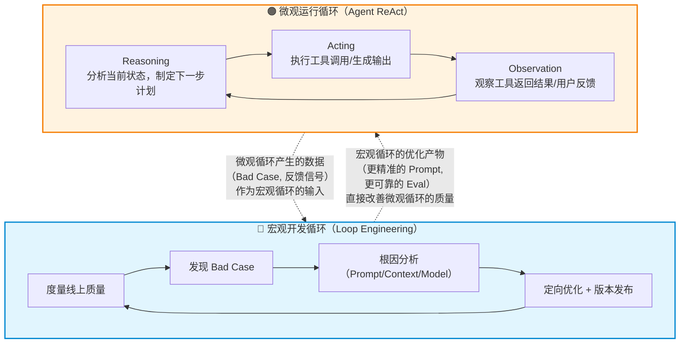

> [!important] 架构重点：两层循环的映射关系
>
> | 宏观循环（开发侧） | 微观循环（运行时） | 映射关系 |
> | :--- | :--- | :--- |
> | Eval 体系 | Agent 的 Critic/Self-Reflection 模块 | 宏观的 Eval 经过工程化打磨后，可以**下沉**为 Agent 的 Self-Correction 能力 |
> | Bad Case 分析 | Agent 的 Error Recovery 逻辑 | 宏观发现的系统性错误模式 → 微观的预置恢复策略 |
> | Prompt 版本迭代 | Agent 的 System Prompt | 宏观的 A/B 测试结论 → 微观的行为基线 |
> | 模型升级验证 | Agent 的推理引擎切换 | 宏观的灰度验证通过 → 微观的模型切换 |
>
> **核心洞察：宏观循环做好了，微观循环才能"智能"起来。** 没有高质量 Eval 的 Agent，就像没有测试的代码——你只能祈祷它不崩。

## 3.2 为什么 Agent 工程的门槛远高于 Chatbot

> [!quote] 核心观点
> 从 Chatbot 到 Agent 的跨越，本质上是从 **"单次推理质量"** 到 **"多步推理链的质量 + 工具调用的准确性 + 状态管理的一致性"** 的跨越。复杂度不是线性增长，而是**组合爆炸**。

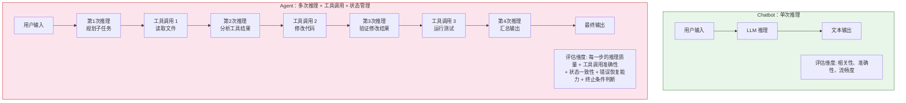

> [!warning] 工程避坑：一个没有循环工程基础设施的团队做 Agent，会遇到什么？
>
> **场景一：Prompt 改了 3 个字，Agent 的终止行为全变了**
> 你修改了 System Prompt 中关于 "何时停止重试" 的描述。旧的 Eval 只测了单轮对话，完全覆盖不到多轮 Agent 行为。上线后 Agent 开始在某些场景下无限循环——而你一周后才发现。
>
> **场景二：模型升级后，Agent 的工具选择准确率暴跌**
> 你从 Claude 3.5 升级到 Claude 4.0。单轮质量测试全部通过。但 Agent 在多步工具调用时，工具选择的准确率从 94% 跌到了 81%。没有多步 Eval，你根本感知不到这个变化。
>
> **场景三：你修了一个 Bug，引入了三个新 Bug**
> 你针对 "Agent 在读取大文件后忘记关键信息" 的问题优化了上下文管理逻辑。但新的逻辑导致 Agent 在某些场景下提前结束任务。你的回归 Eval 不够全面，这些问题在生产环境运行了几周后才被发现。

**这三个场景指向同一个根因：Agent 的行为空间远大于 Chatbot，手动测试和直觉判断完全不足以覆盖。只有系统化的循环工程基础设施——多层 Eval、自动化回归、灰度发布——才能让 Agent 的迭代从 "心惊胆战" 变成 "有的放矢"。**

## 3.3 循环工程如何直接影响 Agent 架构设计

> [!important] 架构重点：Agent 架构中的四个 "循环工程适配点"

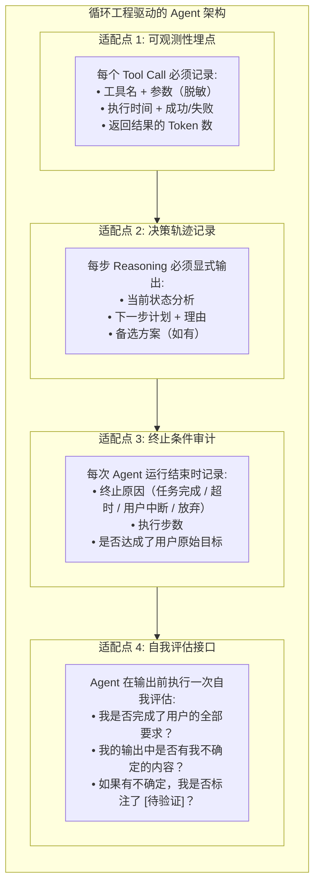

这些适配点不是 Agent 的 "附加功能"，而是**循环工程得以运转的数据基础设施**。没有它们，你的宏观开发循环就是盲人摸象。

## 3.4 执行轨迹工程（Trajectory Engineering）：把 Agent 运行过程变成可复现工件

> [!info] 概念解析：什么是执行轨迹（Trajectory）？
>
> 在 Agent 系统中，执行轨迹不是普通日志，而是一条完整的**行为链路**：它记录 Agent 从接收任务到结束任务之间，每一轮循环看到什么、想做什么、调用了什么、环境如何变化、状态如何转移。
>
> 如果传统软件调试依赖调用栈和日志，那么 Agent 调试依赖的就是执行轨迹。没有执行轨迹，你只能问"它刚才为什么这么做"；有了执行轨迹，你才能做到**复现、定位、修改、重放、对比**。

一个可用于循环工程的执行轨迹，至少应该包含以下粒度：

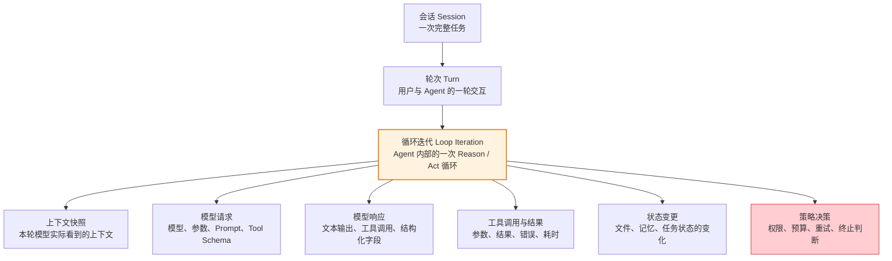

> [!important] 架构重点：执行轨迹是 Agent Eval 的事实源
>
> Agent 的失败往往不是发生在最终回答那一刻，而是发生在第 7 步误读了工具结果、第 13 步错误压缩了上下文、第 21 步选择了错误工具，直到第 37 步才表现为"任务失败"。
>
> 因此，循环工程不能只评估最终输出，还必须评估**轨迹质量**：
> - 上下文快照是否包含完成任务所需的关键事实？
> - 工具调用的选择是否符合当前状态？
> - 工具返回结果是否被正确注入下一轮上下文？
> - 状态变更是否与工具返回结果一致？
> - 重试与终止是否由确定性策略触发，而不是由模型随意决定？

执行轨迹工程的目标，是把 Agent 调试从"看日志猜原因"升级为一套可重复的工程流程：

```
线上 Bad Case
    ↓
提取执行轨迹
    ↓
重放：在相同模型、Prompt、上下文、工具 Mock 下复现
    ↓
分叉：从失败前的 checkpoint 出发，尝试新 Prompt、新 Loop、新上下文策略
    ↓
对比：比较旧轨迹与新轨迹的行为差异
    ↓
评估：用 Eval Harness 判断新版本是否真正修复
```

这也是 Loop 插件化真正重要的原因：当 Loop 本身可替换时，循环工程评估的对象就不再只是 Prompt 或模型，而是完整的 Agent 控制算法。

## 3.5 从模型基准到 Agent 基准：把 Loop 纳入评测对象

过去我们经常把 Agent 能力简单归因于模型能力：

```
Agent 能力 ≈ Model 能力
```

但真实工程中，Agent 的表现更接近一个组合函数：

```
Agent 能力 = f(模型, Prompt, 上下文策略, Loop, 工具集, 记忆, 沙盒, 编排)
```

这意味着两个重要结论：

> [!important] 架构重点：模型强不等于 Agent 强
>
> **强模型 + 脆弱 Harness** 可能输给 **中等模型 + 稳定 Harness**。一个模型长上下文能力强，可能适合"少压缩、大上下文"的 Loop；另一个模型便宜且响应快，可能适合"多 Subagent 并行 + 汇总评审"的 Loop；还有的模型工具调用稳定，更适合高频 Observe/Act 的 ReAct Loop。
>
> 因此，Agent 基准评测必须同时报告：模型版本、Prompt 版本、Loop 类型、上下文策略、工具集、预算、环境与 Harness 版本。否则评测结果不可复现，也不可迁移。

| 评测对象 | 传统做法 | 循环工程视角 |
| :--- | :--- | :--- |
| 模型 | 比较单轮问答质量 | 比较模型在同一 Harness 下的边际贡献 |
| Prompt | 看输出是否更好 | 用固定 Eval 集比较行为差异与回归数量 |
| 上下文策略 | 看召回片段是否相关 | 评估关键事实保留率、压缩损失、Token 成本 |
| Loop | 框架内部黑盒 | 评估工具选择准确率、重试质量、终止条件、轨迹长度 |
| 工具集 | 能不能调用工具 | 评估工具参数正确率、错误恢复率、副作用安全性 |
| 编排策略 | 是否能并行 | 评估任务拆分质量、Subagent 汇总质量、冲突解决能力 |

> [!tip] 最佳实践：把 Loop 当成可实验变量
>
> 对同一个任务集，至少可以比较三类 Loop：
> - **ReAct Loop**：LLM → Tool → Observation → LLM，适合交互式探索
> - **Plan-and-Execute Loop**：先生成计划，再批量执行，再统一验证，适合长任务
> - **CodeAct Loop**：模型生成可执行代码，由沙盒执行后返回结果，适合数据分析与结构化操作
>
> 不同 Loop 的优劣不要靠直觉判断，而要用同一组轨迹 Eval 对比：完成率、平均步数、工具错误率、上下文压缩次数、Token 成本、可恢复失败比例。

## 3.6 确定性外壳：循环工程与 AI-DLC 的汇合点

> [!quote] 核心观点
> 成熟 Agent 工程的目标，不是让 Agent 获得最大自主性，而是在保留模型智能的同时，用确定性的工程结构约束不确定性的模型行为。

可以把一个可靠 Agent 理解为：

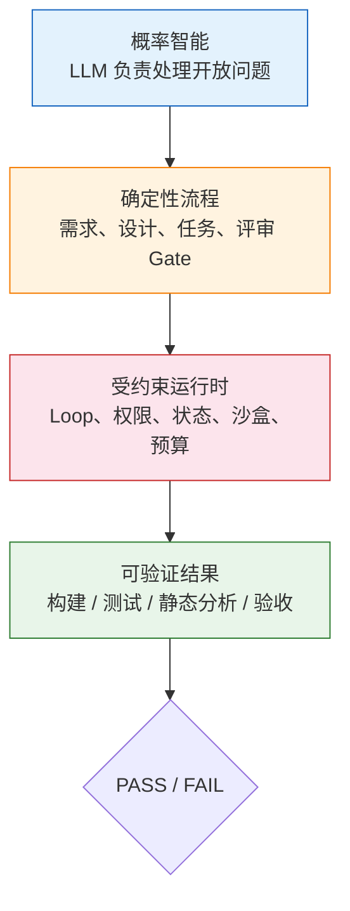

这与 AI-DLC 的核心思想天然一致：人的判断定义方向，工程工件沉淀事实源，确定性验证提供交付证据。Prompt 可以要求模型"先确认需求再实现"，但 Harness 和 Loop 才能进一步保证：

- 需求未形成 artifact 前，不能进入实现阶段
- 高风险工具调用必须经过 Gate / Permission
- 每个阶段都有可恢复 checkpoint
- 输出必须经过确定性 verifier，而不是只依赖模型自评
- 失败可以从执行轨迹中定位，并从 checkpoint 恢复

> [!important] 架构重点：LLM 负责不确定问题，传统软件保证确定边界
>
> 凡是能用确定性程序验证的事情，就不要交给 LLM 判断。`npm test`、`tsc`、`eslint`、`cargo test`、`go test`、静态分析、Schema 校验、权限策略、预算上限——这些都应该成为 Loop 的硬边界。
>
> Agent 可以自由探索方案，但不能自由决定是否跳过验证；可以自由调用低风险读工具，但不能自由执行生产部署；可以自由生成代码，但最终交付必须由构建、测试和验收标准裁决。

可以把这个原则压缩成一个公式：

```
可靠 Agent = 概率智能
           + 确定性流程
           + 受约束运行时
           + 可验证结果
```

这正是循环工程的最终落点：不是追求每一次模型输出都完全相同，而是让模型的不确定性只发生在允许探索的区域，并让每一次关键行为都有状态、有约束、有证据、可验证、可恢复。

---

# 4. 落地建议：从 0 到 1 建立循环工程体系

## 4.1 切入点一：先建立一套高信噪比的线上观测看板

> [!tip] 最佳实践：你不需要一开始就做大而全的 Eval 体系
>
> 循环工程的第一要务不是写 Eval，而是**建立对线上真实行为的可见性**。在你写任何一行 Eval 代码之前，先回答这三个问题：
>
> 1. 你的用户在什么情况下会采纳模型的输出？（采纳率）
> 2. 你的用户在什么情况下会重新提问/重新生成？（重试率）
> 3. 你的用户在什么情况下会放弃交互？（放弃率）

**最小可行观测（MVO）清单：**

| 指标 | 为什么重要 | 实现难度 | 建议粒度 |
| :--- | :--- | :--- | :--- |
| 采纳率（Accept Rate） | 最直接的质量信号 | 低——监测用户是否复制/使用输出 | 按任务类型分组 |
| 重试率（Retry Rate） | 指示 "模型第一次没做对" | 低——监测同一 turn 内的重新生成 | 按错误类型分组 |
| 放弃率（Abandon Rate） | 最严重的失败信号 | 中——需要定义"放弃"的时间窗口 | 按会话长度分组 |
| 输出编辑距离 | 指示 "模型做对了一部分" | 中——需要捕获用户最终使用的文本 | 按采纳类型分组 |
| P50/P95 延迟 | 用户体验的核心指标 | 低——标准 APM 指标 | 按模型分组 |

```python
"""
最小可行的观测看板数据结构。
不需要数据仓库，一个 SQLite + Grafana 就能跑起来。
"""

# 每天跑一次的聚合查询
DAILY_METRICS_SQL = """
SELECT
    date(timestamp) as day,
    prompt_version,
    COUNT(*) as total_requests,
    -- 采纳率
    SUM(CASE WHEN outcome = 'accepted_as_is' THEN 1 ELSE 0 END) * 1.0 / COUNT(*) as accept_rate,
    -- 有修改的采纳率
    SUM(CASE WHEN outcome = 'accepted_edited' THEN 1 ELSE 0 END) * 1.0 / COUNT(*) as edited_accept_rate,
    -- 重试率
    SUM(CASE WHEN outcome = 'retried' THEN 1 ELSE 0 END) * 1.0 / COUNT(*) as retry_rate,
    -- 放弃率
    SUM(CASE WHEN outcome = 'abandoned' THEN 1 ELSE 0 END) * 1.0 / COUNT(*) as abandon_rate,
    -- 平均编辑距离（仅对有修改的采纳）
    AVG(CASE WHEN outcome = 'accepted_edited' THEN edit_distance END) as avg_edit_distance,
    -- 平均 Token 消耗
    AVG(output_token_count) as avg_output_tokens
FROM interaction_signals
WHERE date(timestamp) >= date('now', '-30 days')
GROUP BY day, prompt_version
ORDER BY day DESC;
"""
```

## 4.2 切入点二：先别急着微调，先建立 Eval 库

> [!warning] 工程避坑：微调不是你的第一优先级
>
> 很多团队在 Agent 质量不达预期时的第一反应是 "我们需要微调"。这是一个昂贵的错误。
>
> **微调的隐性成本：**
> - 数据准备：清洗、标注、格式对齐 → 2-4 周
> - 训练 + 评估：多轮实验 → 1-2 周
> - 部署 + 验证：灰度发布 + 线上验证 → 1-2 周
> - **总计：4-8 周的周期 + 数万到数十万的计算成本**
>
> **更重要的是：** 微调之后，模型的行为会系统性改变。如果你没有一套完整的 Eval 体系来衡量这些改变，微调就是一场豪赌。

> [!tip] 最佳实践：在微调之前，你已经可以通过 Prompt Engineering 解决大部分问题
>
> 在 Claudian 的开发和本知识库的 [[提示词工程]] 中，我们有大量案例证明：**一个精心设计的 System Prompt + Few-Shot 示例，可以在不改变模型权重的情况下显著提升任务质量。**
>
> 只有当以下三个条件**全部满足**时，才应该考虑微调：
>
> 1. **你已经建立了至少 100 条高质量 Eval 用例**（覆盖正常、边界、异常三类场景）
> 2. **你已经穷尽了 Prompt Engineering 的优化空间**（分层 System Prompt、Few-Shot 示例、CoT 引导、输出 Schema 约束全部已尝试）
> 3. **你的线上指标（采纳率/重试率）已经连续 2 周没有通过 Prompt 优化得到显著改善**

**最小可行 Eval 构建路线图：**

```
Week 1: 人工标注 20 条黄金用例（10 条典型的"好"输出 + 10 条典型的"差"输出）
Week 2: 基于这 20 条用例，建立规则评估 + LLM-as-a-Judge 的基本框架
Week 3: 从线上日志中自动挖掘 30 条新用例，人工抽检后加入 Eval 集
Week 4: 形成 Eval 的 CI 集成——每次 Prompt 变更自动跑 Eval 并对比基线
```

## 4.3 切入点三：把 "先慢后快" 作为迭代哲学

> [!quote] 核心观点
> 循环工程的终极智慧只有四个字：**先慢后快**。

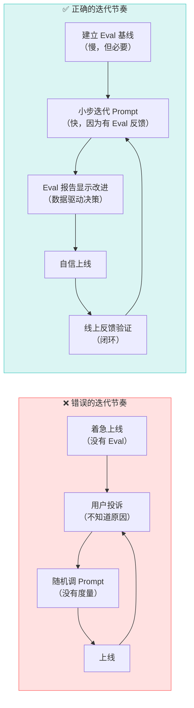

> [!tip] 最佳实践：循环工程的 "慢" 不是拖延，是积累可复用资产
>
> 你在循环工程上花费的每一分钟，都在为未来节省十倍的排查时间：
>
> - **今天花 2 天建立 20 条 Eval 用例** → 未来每次 Prompt 变更 30 分钟就能跑完回归
> - **今天花 1 周搭建线上看板** → 未来版本上线后 5 分钟就能看到质量变化
> - **今天花 1 天写自动化差异分析脚本** → 未来每次模型升级 1 小时就能定位到具体劣化用例
>
> **循环工程的本质，是把 "不确定性" 用工程手段逐步转化为 "可度量的确定性"。** 这套基础设施一旦建成，你的团队就从 "靠感觉调参的手艺人" 进化为 "用数据说话的工程团队"。

---

# 5. 结语：循环工程是 Agent 时代的工程基石

> [!quote] 核心观点
> 如果说 [[提示词工程]] 教会我们如何与模型对话，[[上下文工程]] 教会我们如何为模型配备外部记忆——那么**循环工程**教会我们的是：
>
> **如何在不确定性中建立确定性，如何让一个概率系统产生可度量、可持续改进的价值。**

在 Agent 系统日益复杂的今天，循环工程已经不是一个 "可选的优化手段"——它是 Agent 工程化的**准入门槛**。没有循环工程的 Agent 团队，就像没有测试框架的软件开发团队：你可以写出代码，但你无法保证它明天还能正常工作。

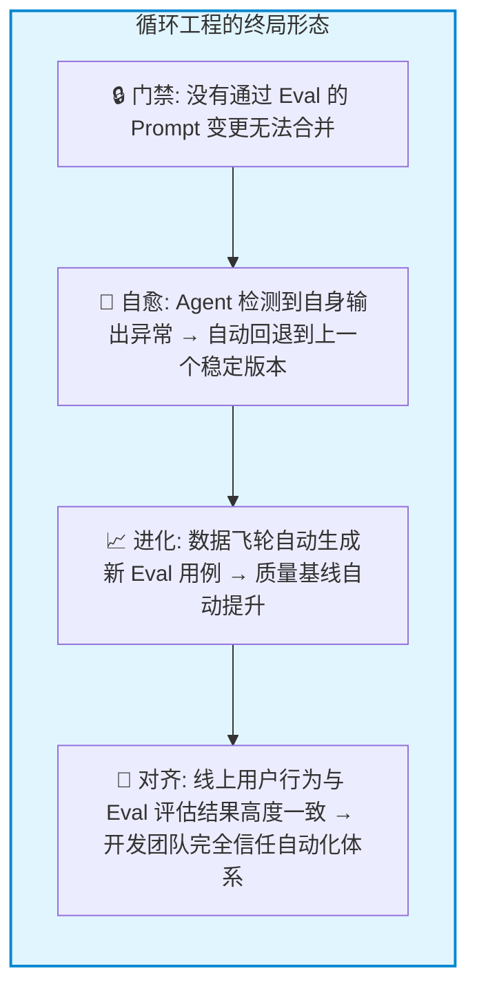

> [!quote] 最后一句话
> **未来真正拉开 AI 产品差距的，不是谁用的模型更强，而是谁的循环工程体系让模型迭代得更快、更稳、更有方向。**

---

> [!summary] 本文要点回顾
>
> - **循环工程的定义**：在 LLM 应用的全生命周期中，构建 "度量 → 评估 → 反馈 → 优化" 的自动化闭环，让概率系统产生可度量的确定性价值
> - **三大核心组件**：
>   - **Eval 体系**：规则评估（快速、便宜、可靠）+ LLM-as-a-Judge（语义质量）+ 人工评估（校准），三层分层架构覆盖 CI 到线上
>   - **数据飞轮**：不以全量日志为数据源，聚焦采纳率/重试率/编辑距离三大高信噪比信号，构建自动化标注流水线
>   - **LLM CI/CD**：基线快照 + 差异分析 + 灰度发布 + 回滚触发器，让每次 Prompt/模型变更都有据可查
> - **循环工程 → Agent 的桥梁**：宏观开发循环与微观 ReAct 循环互为输入输出；没有循环工程的团队做 Agent = 没有测试框架的团队做软件
> - **执行轨迹工程**：把 Session / Turn / Loop Iteration / Context Snapshot / Tool Call / State Mutation 记录为可复现轨迹，支撑重放、分叉、对比与 Eval
> - **Agent 基准评测**：评测对象不能只写模型版本，还要同时记录 Harness、Loop、上下文策略、工具集、记忆、沙盒、编排等变量
> - **确定性外壳**：可靠 Agent = 概率智能 + 确定性流程 + 受约束运行时 + 可验证结果；能用测试、构建、静态分析验证的事情，不交给模型自评
> - **落地三切入**：① 先建线上看板（MVO）→ ② 再建 Eval 库（别急着微调）→ ③ 坚持 "先慢后快" 的迭代哲学
> - **终极定位**：循环工程不是优化手段，是 Agent 工程化的准入门槛

> [!summary] 相关内容
> - [[重新认识AI]] — LLM 的底层本质与 Agent 系统全景
> - [[提示词工程]] — 提示词作为接口协议的设计、评估与版本管理
> - [[上下文工程]] — RAG、MCP、记忆管理的完整链路
> - [[Agent实践指南]] — 生产环境中 Agent 系统的工程化实战指南
