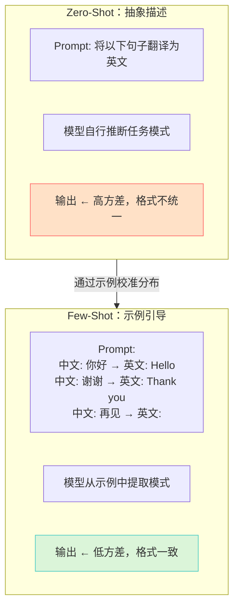
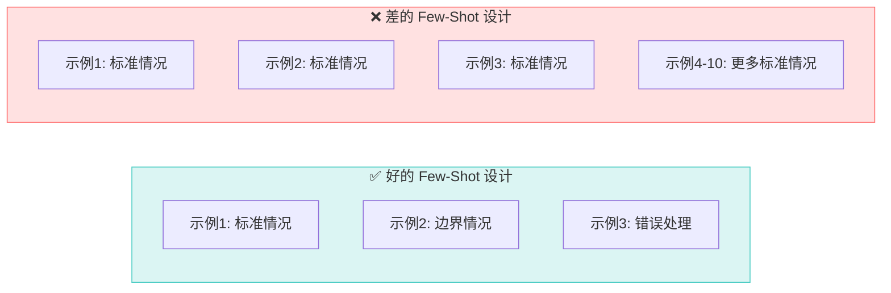
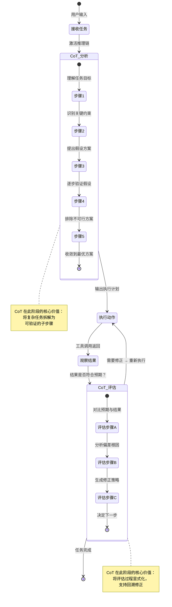
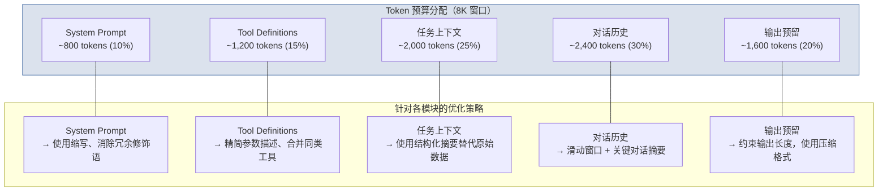
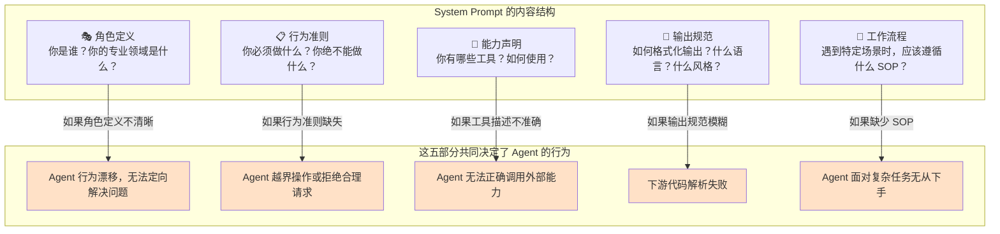
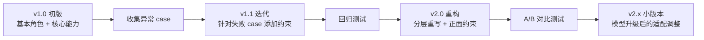
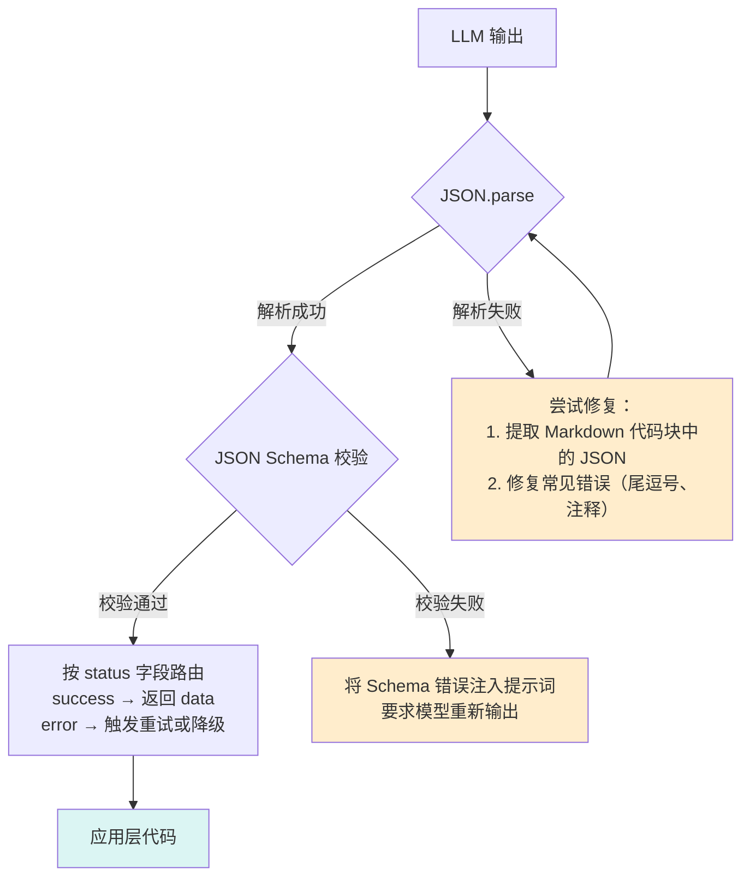
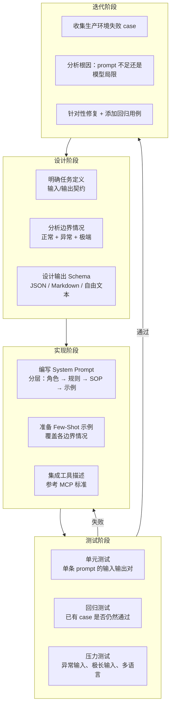
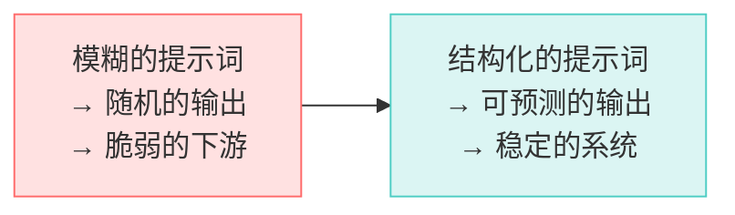

# 0. 概述

> [!summary] 本文面向读者
> AI 应用开发者、Agent 系统架构师、以及所有希望将大模型能力工程化落地的一线工程师。
>
> 写作目标：不是教你怎么写"好听的 prompt"，而是从**系统工程**的视角，揭示提示词作为"大模型交互协议"的本质，深入剖析 Few-Shot、CoT、System Prompt 等核心范式背后的工程机理，并给出可落地、可复现的质量控制方案。

> [!summary] 相关内容
>
> - [[重新认识AI]] — 理解大模型的能力边界与 Agent 系统的完整体系
> - [[上下文工程]] — 提示词是上下文工程的核心组成部分
> - [[Model_Context_Protocol_MCP|MCP]] — 提示词中工具描述的标准化协议
> - [[Multi-Agent]] — 多 Agent 场景下的提示词工程挑战

---

# 1. 核心定位：提示词不是玄学，是接口协议

## 1.1 重新定义"什么是提示词"

> [!info] 概念解析
> 提示词工程（Prompt Engineering）不是"对着 AI 说话的艺术"，也不是玄学化的"调参手艺"。从系统工程的角度看，**提示词是大模型系统的"接口协议"和"序列化规则"**。

在 [[重新认识AI]] 中，我们已经确立了核心认知：大语言模型本质上是**基于海量文本训练的参数化概率预测系统**。它没有意识、没有理解——它只是在掌握了语言统计规律之后，根据输入上文预测下一个最可能的 Token。

这意味着什么呢？

> [!important] 架构重点
> **提示词就是你把人类意图"编译"成模型能高效处理的上下文格式的协议层。**
>
> 就像 TCP/IP 定义了计算机之间的通信方式，提示词定义了人与大模型之间的通信方式。一个好的提示词——就像设计良好的 API ——具有清晰的接口定义、明确的输入输出契约、对边界条件的充分考虑。

```mermaid
flowchart LR
    subgraph Human["人类世界"]
        I[模糊意图<br/>"帮我改一下这个bug"]
    end

    subgraph Protocol["提示词协议层"]
        P[提示词工程<br/>意图编译 + 上下文组织 + 约束定义]
    end

    subgraph Model["模型世界"]
        M[概率预测系统<br/>Token → Token]
    end

    I -->|原始需求| P
    P -->|结构化提示词| M
    M -->|概率输出| P
    P -->|结构化结果| I
```

## 1.2 为什么提示词工程具有"工程属性"

> [!compare] 玄学调参 vs 系统工程的提示词设计

| 维度           | 玄学调参思维                               | 系统工程思维                                  |
| :------------- | :----------------------------------------- | :-------------------------------------------- |
| **方法论**     | "试试这个 prompt 行不行"                   | 定义接口契约，设计输入格式，度量输出一致性    |
| **可复现性**   | 低——同一个 prompt 在不同模型版本上表现不同 | 可度量——通过测试用例和评分规则量化质量        |
| **维护方式**   | 模型迭代 → 重写 prompt                     | 模型迭代 → 调整协议适配层                     |
| **工程工具**   | 无                                         | 版本管理、A/B 测试、回归测试、Token 计量      |
| **与代码关系** | 割裂——prompt 是 prompt，代码是代码         | 融合——prompt 由代码生成、版本化、单元测试保护 |

> [!tip] 最佳实践
> 把提示词当代码一样管理：纳入 Git 版本控制，编写单元测试，进行 Code Review。在 Claudian 插件的开发中，Skill 系统的提示词正是这样被沉淀和维护的——参考 [[重新认识AI#4.2 Skill 与 Prompt 的区别|Prompt vs Skill 的对比]]。

## 1.3 提示词在 Agent 架构中的位置

从 [[重新认识AI#2.4 Agent 的五大基础要素|Agent 的五大基础要素]] 出发，提示词横跨了**上下文（Context）**和**规则（Rules）**两个基础层：

| 提示词类型        | 对应 Agent 要素  | 作用                                  |
| :---------------- | :--------------- | :------------------------------------ |
| System Prompt     | Rules 规则层     | 定义 Agent 的角色、行为边界和输出规范 |
| User Prompt       | Context 上下文层 | 传递当前任务的具体需求和参数          |
| Tool Descriptions | Tools 工具层     | 定义可用工具的名称、参数和语义        |
| Few-Shot Examples | Context 上下文层 | 用具体例子"校准"模型的输出分布        |
| Output Schema     | Rules 规则层     | 约束输出格式，确保下游可解析          |

---

# 2. 进阶范式：从零样本到结构化推理

## 2.1 Few-Shot Prompting：展示比描述更精确

### 2.1.1 Few-Shot 的工程机理

> [!info] 概念解析
> **Few-Shot Prompting** 是在提示词中提供少量示例（通常 1-5 个），让模型通过"看例子"来理解任务模式，而非仅通过抽象的文字描述。

它的底层原理依赖于大模型的 **In-Context Learning (ICL)** 能力——模型不需要梯度更新参数，而是通过上下文中的示例在 Attention 层完成"隐式微调"。这种"微调"是临时性的，只在当前推理的前向传播中生效。



### 2.1.2 Few-Shot 的实战设计原则

> [!tip] 最佳实践：Few-Shot 示例的四个设计要点

1. **示例质量 > 数量**：2-3 个高质量的"黄金示例"远胜 10 个模糊的例子。每个示例都应覆盖任务的一个关键模式。
2. **覆盖边界情况**：不仅展示"正常情况"，还要展示错误处理、空输入、极端值等边界情况。
3. **一致性和格式对齐**：所有示例必须使用**完全一致**的格式。不一致的格式会让模型困惑，降低输出质量。
4. **示例的排列顺序**：最后一条示例对模型当前输出的影响最大（Recency Bias）。将最重要的模式放在最后。

> [!warning] 工程避坑：Few-Shot 的三大常见错误
>
> 1. **示例泄露**：示例中包含真实用户数据或敏感信息。永远使用构造的、脱敏的示例数据。
> 2. **过度约束**：示例过多（>10 个），挤占 Token 预算，反而让模型"过拟合"到特定模式上，失去泛化能力。
> 3. **示例与 System Prompt 冲突**：示例中的行为与 System Prompt 定义的规则不一致，导致模型行为不稳定。**示例应服从 System Prompt，而非凌驾其上。**



## 2.2 Chain of Thought (CoT)：让模型"说清楚"

### 2.2.1 CoT 的认知基础

> [!info] 概念解析
> **思维链（Chain of Thought, CoT）** 是一种引导模型在生成最终答案之前，先输出中间推理步骤的技术。它不是教会模型"如何推理"——模型本来就会推理——而是**强制模型将隐式的推理过程显式化为可读、可审计的文本**。

对于 [[重新认识AI#2.1 AI 不是魔法，是压缩与预测|基于概率预测的 LLM]] 来说，CoT 的作用在于：**将单步概率预测拆解为多步条件预测**。每一步推理都降低了下一次预测的熵，使得最终答案的分布更集中、更准确。

> [!important] 架构重点
> CoT 在 Agent 状态机中的核心价值：
>
> 1. **可审计性**：Agent 的决策过程不再是不透明的黑箱，每一步推理都可以被审计
> 2. **可纠错性**：当推理路径出错时，可以回溯到具体的推理步骤进行修正
> 3. **规划能力**：CoT 天然地为 Planner 组件提供了实现基础
> 4. **降低幻觉**：显式的推理步骤让模型更不容易跳过关键事实检查

### 2.2.2 CoT 在 Agent 状态机中的流转



### 2.2.3 CoT 的变体与选择策略

| 变体                 | 机制                              | 适用场景                   | Token 成本 |
| :------------------- | :-------------------------------- | :------------------------- | :--------- |
| **Zero-Shot CoT**    | 仅添加 "Let's think step by step" | 通用的中等复杂度推理       | 低         |
| **Few-Shot CoT**     | 提供完整的推理链示例              | 需要特定推理格式的任务     | 中         |
| **Self-Consistency** | 多次采样 + 投票选择最一致答案     | 数学、逻辑等确定性问题     | 高         |
| **Tree of Thoughts** | 分支探索多条推理路径              | 需要创造性探索的开放问题   | 极高       |
| **ReAct**            | 推理 + 行动交替进行               | Agent 系统中的多步工具调用 | 中-高      |

> [!warning] 工程避坑：CoT 的使用边界
>
> CoT 不是万能的。以下场景中，CoT 可能不仅无益，反而有害：
>
> - **简单任务**：对于"今天是星期几"这类单步问题，CoT 徒增 Token 消耗。
> - **创造性写作**：过度的推理约束会抑制模型的发散思维能力。
> - **情感/直觉判断**：某些任务依赖直觉而非逻辑（如幽默识别），CoT 可能适得其反。
> - **严格 JSON 输出**：当需要直接输出结构化 JSON 时，CoT 中的文本推理会污染输出格式。解决方案：让 CoT 输出到单独的字段，最终答案输出到另一个字段。

## 2.3 上下文窗口的"经济学"：精简 Prompt 的艺术

### 2.3.1 端侧模型与资源受限场景

> [!info] 概念解析
> 在端侧部署（手机、IoT、嵌入式设备）或使用轻量级模型时，上下文窗口通常很有限（2K-8K tokens）。这意味着 Prompt 设计必须遵循**极简主义原则**，否则任务还没开始，Token 预算就耗尽了。

这不是简单的"少写几行字"——而是一个系统级的优化问题：



### 2.3.2 精简 Prompt 的五大技术

> [!tip] 最佳实践：精简 Prompt 的工程方法

**① 指令压缩**

```
❌ 冗余："请你作为一个经验丰富的、专业的前端工程师，仔细地、认真地帮我修改一下..."
✅ 精简："角色：前端工程师。任务：修改按钮样式。要求：移动端全宽。"
```

**② 格式约定替代自然语言**

```
❌ 冗长："请将输出格式化为 JSON，其中 name 字段表示用户姓名，age 字段表示用户年龄..."
✅ 简洁："输出 JSON: {name: string, age: number}"
```

**③ 利用模型的内置知识**

如果模型已经深度理解某个领域（如 React、Tailwind CSS），不需要在 Prompt 中重新解释基础概念。直接给出具体指令即可。

**④ 动态上下文注入**

不要一次性把所有上下文都塞进 Prompt。使用 RAG 或选择性加载，只注入当前子任务真正需要的上下文。在 [[Multi-Agent#1.1 单 Agent 的工程天花板|Multi-Agent 架构]]中，这被称为"上下文污染"的解决方案——通过隔离不同 Worker 的上下文来保持每个 Prompt 的纯净和精简。

**⑤ 分层摘要**

对于长对话历史，不传原始对话，而传"关键信息摘要 + 最近 3 轮完整对话"。摘要由另一个轻量级模型或专用子 Agent 生成。

---

# 3. Agent 的"灵魂"：System Prompt 的设计艺术

## 3.1 System Prompt 在 Agent 架构中的核心地位

> [!info] 概念解析
> 如果把 Agent 比作一个员工，那么 **System Prompt 就是这份工作的"岗位说明书 + 行为守则"**。在 [[重新认识AI#3. Ruler / Rules：规则系统决定 Agent 的行为边界|Rules 规则系统]]中，System Prompt 是 Rules 层最直接的实现形式——它决定了 Agent 是谁、能做什么、不能做什么、如何思考、如何表达。



## 3.2 编写高鲁棒性 System Prompt 的工程方法

### 3.2.1 分层设计原则

> [!important] 架构重点
> System Prompt 不应该是一个平铺的"长文本块"。它应该按照**优先级分层**，让模型在不同的上下文长度下都能获取最关键的信息：

```
Layer 1 (前 500 tokens)： 角色核心 + 最关键的禁止规则
Layer 2 (500-1500 tokens)：标准工作流 + 主要工具使用规范
Layer 3 (1500-3000 tokens)：边界情况处理 + 示例
Layer 4 (3000+ tokens)：    领域知识 + 参考资料
```

**为什么要分层？**

因为在实际运行中，当上下文窗口被大量工具调用结果和对话历史填满时，模型可能"遗忘" System Prompt 中靠后的内容（Lost-in-the-Middle 效应）。把最关键的信息放在最前面，确保即使上下文被截断，核心约束也不会丢失。

### 3.2.2 否定句陷阱与正面约束

> [!warning] 工程避坑：禁用"不要做 X"式的否定指令
>
> 一个常见的陷阱是使用大量否定式指令：
>
> ```
> ❌ "不要生成不合法的 JSON"
> ❌ "不要使用中文标点"
> ❌ "不要忘记添加错误处理"
> ```
>
> **为什么否定指令容易失败？**
>
> 模型在生成文本时，是在寻找"下一个最可能的 token"。否定指令（"不要 X"）首先激活了 X 相关的语义路径，然后期望模型自行抑制——这本身就增加了不确定性。
>
> **正确做法：转化为正面约束**
>
> ```
> ✅ "输出必须是合法的 JSON"
> ✅ "使用英文标点符号"
> ✅ "每个 API 调用必须包含 try-catch 错误处理"
> ```

### 3.2.3 防越界的"护栏机制"

> [!info] 概念解析
> 护栏（Guardrails）是 System Prompt 中专门防止 Agent 行为越界的约束集。一个健壮的护栏应覆盖以下维度：

| 护栏维度     | 示例约束                                     | 防止的问题               |
| :----------- | :------------------------------------------- | :----------------------- |
| **操作边界** | "你只能修改 `.src/` 目录下的文件"            | Agent 误删或修改配置文件 |
| **信息边界** | "不要输出任何 API Key 或密钥信息"            | 敏感信息泄露             |
| **角色边界** | "不要假装自己能执行你没有工具支持的操作"     | Agent 幻觉自己有某种能力 |
| **风格边界** | "始终使用中文回复，除非用户明确要求其他语言" | 语言风格漂移             |
| **迭代边界** | "单次任务最多尝试 3 次修复，超过则报告问题"  | 无限循环修复             |

```kotlin
/**
 * 护栏规则的工程化实现示意。
 * 在实际的 Agent 系统中，这些约束通过 System Prompt 注入，
 * 同时在后端做硬性校验——双重保障。
 */
data class GuardRail(
    /** 约束类型 */
    val type: GuardRailType,
    /** 约束规则（注入 System Prompt） */
    val promptRule: String,
    /** 硬性校验逻辑（后端保障） */
    val hardCheck: ((Action) -> Boolean)? = null,
    /** 违反后的处理策略 */
    val violationPolicy: ViolationPolicy
)

enum class GuardRailType {
    FILE_SYSTEM_BOUNDARY,  // 文件系统边界
    NETWORK_ACCESS,        // 网络访问权限
    DATA_EXFILTRATION,     // 数据泄露防护
    INFINITE_LOOP,         // 无限循环检测
    ROLE_DRIFT             // 角色漂移
}
```

## 3.3 System Prompt 的版本演进策略

> [!tip] 最佳实践
> System Prompt 不是一次性写成的。它需要像软件一样迭代。一个成熟的 System Prompt 管理流程：



每次 System Prompt 更新，都应该记录变更内容、变更原因和定量效果数据——就像代码的 CHANGELOG 一样。

---

# 4. 质量控制：用提示词前置缓解模型幻觉

## 4.1 模型幻觉的提示词层面对策

> [!info] 概念解析
> [[模型幻觉]]（Hallucination）是指模型生成的内容看似合理、流畅，但实际上与事实不符、与上下文矛盾、或根本不存在。从提示词工程的角度，我们有两种缓解策略：

### 4.1.1 约束策略：收紧模型的"想象空间"

```
❌ 开放约束：
"介绍一下 Vue 3 的新特性"

✅ 强约束：
"仅列出 Vue 3 官方文档中明确记录的、与 Vue 2 不同的核心 API 变更。
对于每个变更，提供：1) 变更名称 2) Vue 2 语法 3) Vue 3 语法。
如果你不确定一个特性是否是官方记录的，标注为 [不确定] 而非编造。"
```

### 4.1.2 对齐策略：强制引用与事实校验

> [!important] 架构重点
> 在 Agent 系统中，一种有效的反幻觉机制是**强制引用链**：

```mermaid
flowchart TB
    Q[用户问题] --> Agent[Agent 推理]
    Agent --> Tool[工具调用：搜索/读取文件]
    Tool --> Data[获取真实数据]
    Data --> Check{数据是否足够回答？}

    Check -->|"是"| Cite[生成回答 + 标注数据来源]
    Check -->|"否"| MoreSearch["追加搜索 / 请求用户补充"]

    Cite --> Output[输出格式：<br/>答案 + [来源: 文件路径, 行号]]

    style MoreSearch fill:#ffa50033
    style Cite fill:#4ecdc433
```

**核心原则**：让模型没有机会"编造"。如果回答需要基于某个文件的内容，先让模型读取文件；如果需要基于网络搜索，先执行搜索。把"不确定性"踢回给工具层或用户，而不是让模型自由发挥。

## 4.2 强制输出格式：JSON Schema 约束

### 4.2.1 为什么 JSON 是关键

> [!info] 概念解析
> 在 Agent 系统中，模型的输出往往不是给人类看的——它是给代码解析的。如果输出是自由格式的自然语言，应用层代码就需要写大量脆弱的正则表达式来提取信息。

**JSON 解决了三个核心问题：**

1. **可解析性**：编程语言原生支持 JSON 解析，不需要"猜测"模型想表达什么
2. **可校验性**：JSON Schema 可以在应用层自动校验模型输出是否符合预期结构
3. **低歧义性**：相比于自然语言，"name"、"age"、"error" 这样的字段名没有模糊空间

### 4.2.2 提示词中的 JSON Schema 设计

```json
// 在 System Prompt 中定义的输出格式约束
{
  "output_format": {
    "type": "object",
    "required": ["status", "data", "reasoning"],
    "properties": {
      "status": {
        "type": "string",
        "enum": ["success", "partial_success", "error", "needs_clarification"],
        "description": "任务执行状态"
      },
      "data": {
        "description": "实际结果数据，结构取决于具体任务"
      },
      "reasoning": {
        "type": "array",
        "items": { "type": "string" },
        "description": "关键推理步骤摘要数组，每条不超过 100 字"
      },
      "errors": {
        "type": "array",
        "items": {
          "type": "object",
          "properties": {
            "code": { "type": "string" },
            "message": { "type": "string" },
            "step": { "type": "string" }
          }
        },
        "description": "仅在 status 为 error 时出现"
      }
    }
  }
}
```

### 4.2.3 JSON 输出的工程化处理



> [!warning] 工程避坑：JSON 输出的四个常见坑
>
> 1. **JSON 被 Markdown 包裹**：模型经常把 JSON 放在 ` ```json ... ``` ` 代码块中。解析代码必须能处理这种情况。
> 2. **尾逗号**：某些模型版本会生成带有尾逗号的 JSON（`{"a": 1,}`），这在严格模式下是非法的。
> 3. **注释**：模型可能添加 `// 这是用户名` 这类注释。标准 JSON 不支持注释，需要预处理。
> 4. **未转义的特殊字符**：模型输出的字符串中可能包含未转义的换行符、双引号等，导致 JSON 解析失败。

> [!tip] 最佳实践：JSON 输出的鲁棒性处理
>
> ```python
> def robust_json_parse(model_output: str) -> dict:
>     """
>     鲁棒的 JSON 解析器，处理模型输出的常见格式问题。
>     """
>     # 1. 提取 JSON 内容（处理 Markdown 代码块包裹）
>     json_str = extract_json_block(model_output)
>
>     # 2. 修复模型常见错误
>     json_str = fix_trailing_commas(json_str)
>     json_str = strip_json_comments(json_str)
>
>     # 3. 逐层修复
>     try:
>         return json.loads(json_str)
>     except json.JSONDecodeError:
>         # 最后手段：用正则提取字段
>         return fallback_regex_extract(json_str)
> ```

## 4.3 输出质量的度量与反馈

> [!tip] 最佳实践
> 提示词工程的质量是**可以度量**的。关键在于建立量化指标：

| 指标           | 度量方式                      | 目标  |
| :------------- | :---------------------------- | :---- |
| **格式合规率** | JSON Schema 校验通过率        | > 99% |
| **任务完成率** | 按 `status: success` 统计     | > 90% |
| **幻觉率**     | 标注后人工抽查引用来源        | < 5%  |
| **Token 效率** | 有效输出 Token / 总输出 Token | > 70% |
| **首次通过率** | 不需重试就直接成功的比例      | > 80% |

每一条提示词的迭代，都应该用这些指标来衡量效果——而不是凭感觉判断"新 prompt 好像好一些"。

---

# 5. 提示词工程的完整工作流

## 5.1 从需求到上线的提示词开发流程



## 5.2 生产环境中的提示词运维

> [!important] 架构重点
> 提示词不是写完就完了。在生产环境中，它需要持续的监控和运维：

- **版本控制**：每次修改都提交 Git，标注修改原因和影响范围
- **灰度发布**：新 prompt 先在小比例流量上验证，再全量上线
- **回滚机制**：保留最近 3 个版本，确保可以快速回退
- **成本监控**：跟踪每次 prompt 修改对 Token 消耗的影响
- **异常告警**：当格式合规率或任务完成率突然下降时，告警通知

在 [[Agent实践指南]] 中可以看到更多生产环境中 Agent 系统运维的实践细节。

---

# 6. 结语：从"写好提示词"到"设计好协议"

> [!quote] 核心观点
> 提示词工程不是一门"手艺"，而是一门**工程学科**。它的核心不是"怎样才能让 AI 听我的话"，而是——
>
> **如何设计一套稳健的、可维护的、可度量的交互协议，让不确定的概率系统产生确定的价值输出。**



> [!quote] 在这个 Agent 系统日益复杂的时代
> 提示词不再是写在聊天框里的一段话——它是 Agent 的行为程序，是上下文工程的灵魂，是模型世界与人类世界之间的通信协议。
>
> 今天的每一个提示词设计决策，都在定义明天的 AI 系统将如何理解我们、服务我们。

---

> [!summary] 本文要点回顾
>
> - **核心定位**：提示词是人-模型交互的接口协议与序列化规则，不是玄学调参
> - **Few-Shot**：通过示例"校准"模型输出分布，示例质量和排列顺序至关重要
> - **CoT**：强制模型显式化推理过程，实现可审计性、可纠错性和规划能力
> - **精简 Prompt**：在端侧/轻量级场景下，指令压缩、格式约定、分层摘要等五大技术
> - **System Prompt**：Agent 的"灵魂"，分层设计 + 正面约束 + 护栏机制，保证高鲁棒性
> - **JSON 输出**：通过强制输出格式，在输入层面前置缓解 [[模型幻觉]]，保证下游可解析
> - **工程化**：提示词即代码——版本管理、单元测试、灰度发布、可度量指标

> [!summary] 相关内容
>
> - [[重新认识AI]] — Agent 系统的完整体系与大模型本质
> - [[上下文工程]] — 上下文窗口管理与动态注入
> - [[Model_Context_Protocol_MCP|MCP]] — 工具描述的标准化协议
> - [[Multi-Agent]] — 多 Agent 场景下的提示词隔离与协同
> - [[Agent实践指南]] — 生产环境中 Agent 系统工程化实践
