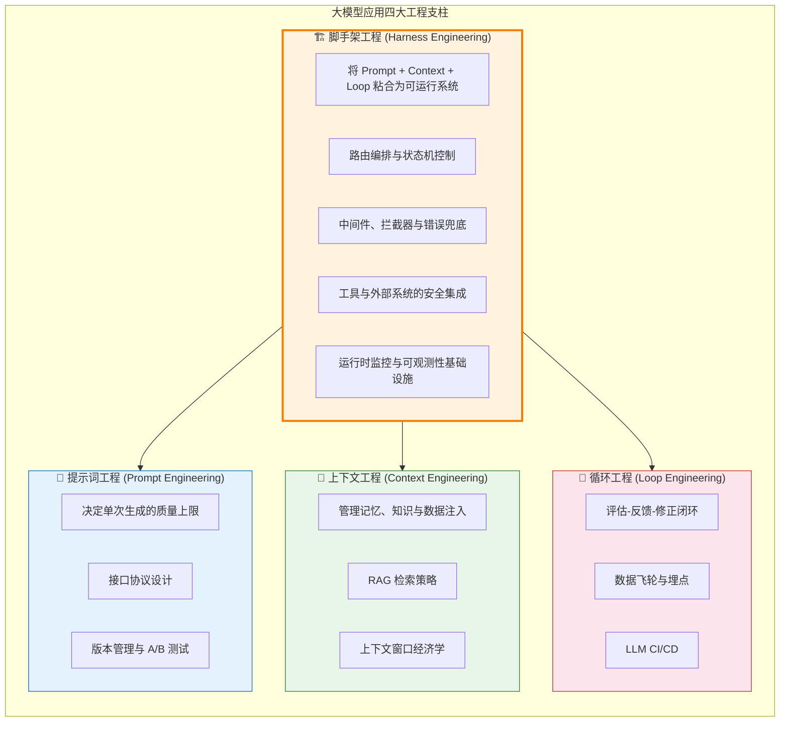
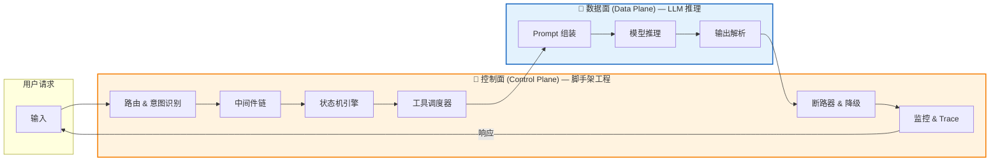
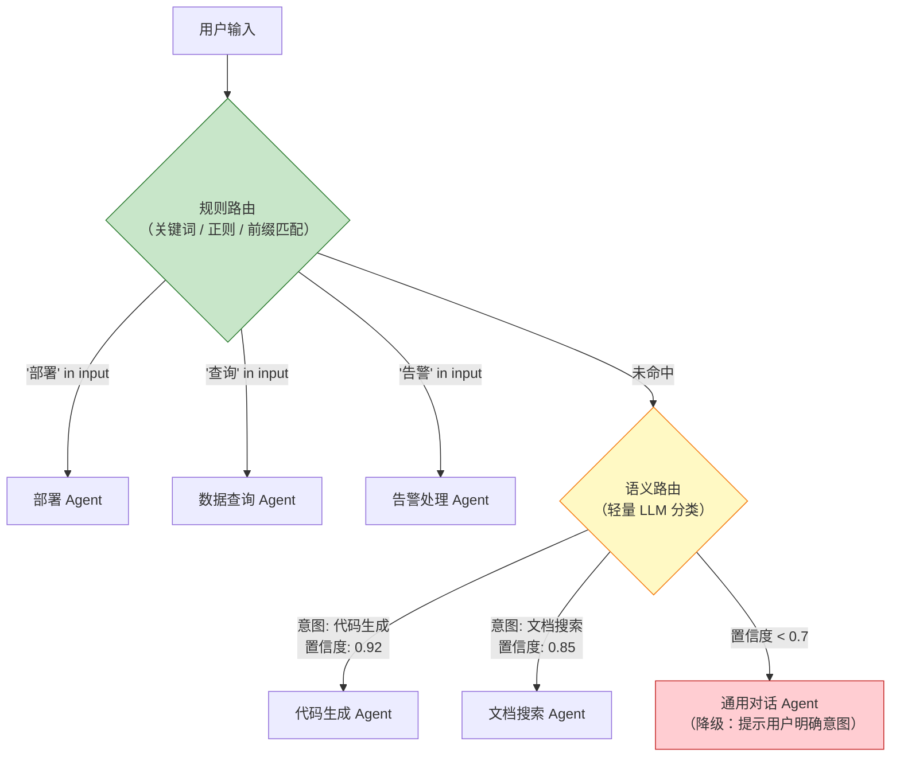
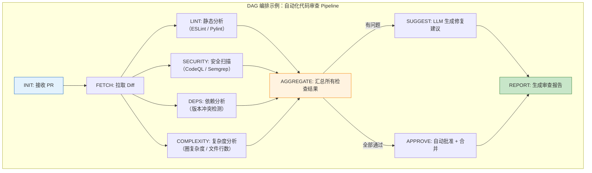
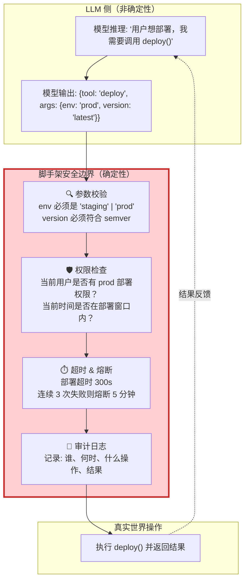
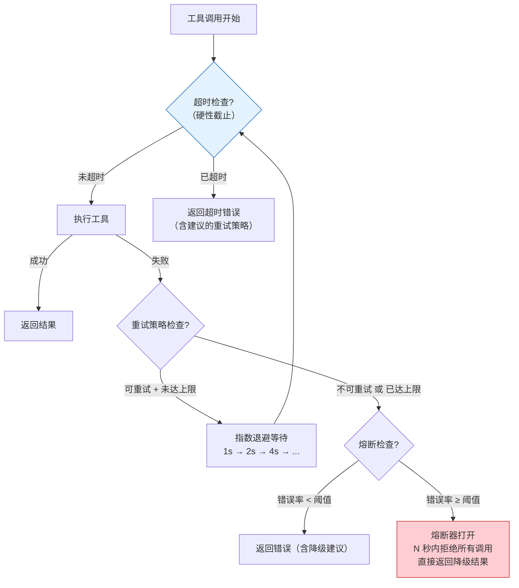
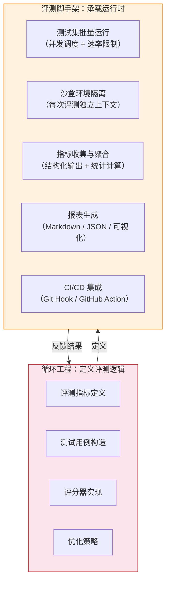
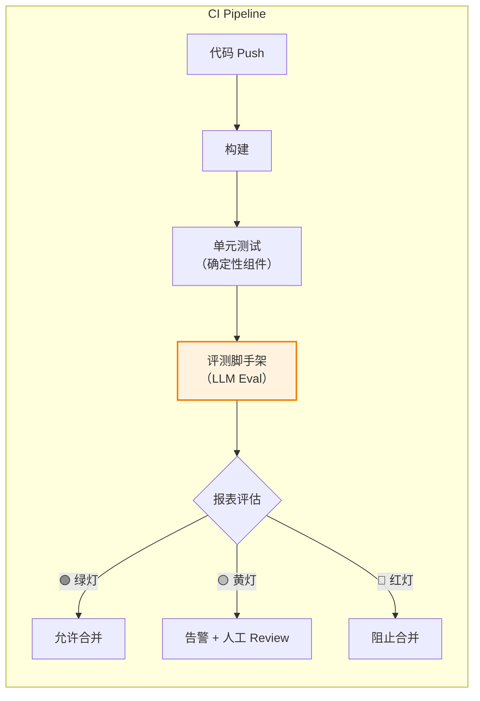
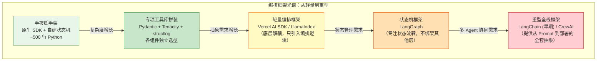

# 脚手架工程（Harness Engineering）：大模型应用的编排与基础设施构建

> [!summary] 本文面向读者
> 你已经理解了 [[提示词工程|提示词工程]] 如何定义单次生成的上限，[[上下文工程|上下文工程]] 如何管理记忆与知识的注入，[[循环工程|循环工程]] 如何建立"评估-反馈-修正"的迭代闭环。现在你面临一个更深层的问题：**这些能力如何被整合进一个真正可运行、可维护、可演进的系统中？**
>
> 写作目标：不是再讲一遍如何调 Prompt 或者如何搭 RAG——而是从**架构师**的视角，揭示大模型应用背后那条看不见的"脊梁"：将 Prompt、Context、Loop 三大工程粘合在一起的**编排层与基础设施层**。这是"四大工程"体系中的最后一环，也是从"能用"到"好用"的关键一跃。

> [!summary] 前置阅读
>
> - [[提示词工程]] — 提示词作为接口协议的设计方法论
> - [[上下文工程]] — RAG、MCP、记忆管理的完整链路
> - [[循环工程]] — Eval 体系、数据飞轮、LLM CI/CD
> - [[Model_Context_Protocol_MCP|MCP]] — Agent 连接外部世界的标准化协议
> - [[Agent实践指南]] — 本文的理论在工程实践中的落地代码

---

# 1. 引言：为什么 LLM 需要"脚手架"？

## 1.1 一个令架构师不安的场景

> [!bug] 生产痛点：当 LLM 调用散落在业务代码的每个角落
>
> 假设你正在开发一个智能客服系统。最初的需求很简单：用户提问 → 调用 LLM → 返回答案。你很自然地写下：
>
> ```python
> def answer_question(user_input: str) -> str:
>     response = requests.post(
>         "https://api.anthropic.com/v1/messages",
>         headers={"x-api-key": API_KEY},
>         json={"model": "claude-sonnet-4-20250514", "messages": [{"role": "user", "content": user_input}]}
>     )
>     return response.json()["content"][0]["text"]
> ```
>
> 三个月后，你的代码库变成了这样：
>
> - 37 个不同的文件中散布着 `requests.post(llm_api)` 调用
> - 每个调用使用不同的 `temperature`、`max_tokens`、`system` 参数
> - 没有统一的 Token 计费统计（财务问你这个月花了多少钱，你只能估算）
> - 某个 API 版本升级导致 3 个模块的输出格式全部崩坏，你花了 4 个小时逐一修复
> - PM 问"用户满意度有变化吗"，你无法回答——因为你没有任何埋点
>
> **这不是 LLM 的问题。这是架构的问题。**

## 1.2 四大工程的分工：定位脚手架工程

在进入正文之前，我们必须精准界定"四大工程"各自的职责边界。这不是学术上的咬文嚼字——边界模糊会导致架构层面的职责重叠与代码腐化。



> [!important] 架构重点：脚手架工程的定位
>
> 如果说 **Prompt 是大脑**（决定思考质量）、**Context 是记忆**（决定信息丰富度）、**Loop 是免疫系统**（检测并修正错误）——那么 **Harness 就是骨骼、神经和循环系统**：它不生产"智能"，但决定了智能能否在真实环境中存活。
>
> 没有脚手架，Prompt 只是一段文本，Context 只是数据检索，Loop 只是离线脚本。**脚手架让它们成为一个活的系统。**

## 1.3 核心定义：控制面与数据面的分离

> [!info] 概念解析：什么是 Harness / 编排工程？
>
> 在大模型应用的架构中，我们引入一个经典的分布式系统思想——**控制面（Control Plane）与数据面（Data Plane）的分离**：
>
> - **数据面（Data Plane）**：LLM 的推理过程本身——输入 Prompt → 模型计算 → 输出 Token。这是"智能发生的地方"，本质上是概率性的、非确定性的。
> - **控制面（Control Plane）**：包裹在数据面外层的所有基础设施——路由决策、状态管理、工具的注册与调度、中间件拦截、监控埋点、错误恢复、降级策略。这是"纪律执行的地方"，必须是确定性的、可预测的。
>
> **脚手架工程的核心命题就是：如何设计一个健壮的控制面，来管理和约束一个非确定性的数据面。**



> [!quote] 核心观点
> **LLM 只是引擎，脚手架才是底盘。** 你可以换引擎（从 Claude 换到 GPT，从 Sonnet 升级到 Opus），但底盘的架构——路由、状态机、中间件、监控——不应该随引擎的变化而重写。这就是脚手架工程的终极目标：**让 LLM 成为系统中的一个"可替换组件"，而非系统的"全部"。**

---

# 2. 脚手架工程的核心组件

## 2.1 路由与状态机：从非确定性输出到确定性控制流

### 2.1.1 路由层：意图识别与任务分发

脚手架工程的第一道关卡是**路由**。大模型可以处理几乎任何类型的输入——但你的业务系统不能只有一个巨大的 `handle_everything()` 函数。路由层的职责是将用户的模糊输入映射到确定的执行路径。

> [!info] 架构思考：路由的三层分级策略
>
> ```
> L1: 规则路由（确定性）
>    ↓ 匹配不到
> L2: 语义路由（LLM 分类）
>    ↓ 置信度不足
> L3: 通用兜底（默认 Agent）
> ```
>
> **核心原则：能用规则解决的，不要动用 LLM。** 每一次不必要的 LLM 调用都是延迟 + 成本 + 不确定性。路由层最经典的工程实践是：先用正则/关键词做第一层过滤，命中率通常可达 60-70%；未命中的再交给一个轻量级分类模型（或小参数 LLM）做语义路由；最后再交给主力模型。



### 2.1.2 状态机：模型的"纪律层"

> [!important] 架构重点：为什么纯 Prompt 驱动的 Agent 不够？
>
> 在 [[Agent实践指南#3.1 从 ReAct 到状态机：为什么纯 Prompt 驱动的 Agent 不靠谱|Agent 实践指南]] 中，我们详细讨论了 ReAct 模式的三大工程缺陷：行为不可预测、状态分散、无法中断恢复。这里从架构视角再做一次提炼：
>
> **脚手架工程的核心设计范式是：用确定性的状态机控制流程骨架，用概率性的 LLM 填充每个状态内的"智能行为"。**

这个范式有三个关键推论：

1. **状态转移不由 LLM 决定。** 状态机中的 `EXECUTING → VALIDATING → RETRYING → COMPLETED` 这类流转是由代码明确定义的，LLM 的职责仅限于在单个状态内部进行推理（如"校验阶段：这个 SQL 查询结果是否符合预期？"）。

2. **状态是可持久化、可恢复的最小单元。** 当 Agent 在 `EXECUTING` 状态崩溃时，检查点机制可以将其恢复到该状态的重入口——而非从 `INIT` 重新开始。

3. **每个状态都有明确的"合法操作白名单"。** 在 `VALIDATING` 状态下，Agent 不应该被允许调用部署工具——状态的边界就是权限的边界。

> [!warning] 工程避坑：状态粒度的"金发女孩原则"
>
> 状态不要太粗也不要太细。太粗（如只有 `START / EXECUTING / DONE` 三个状态）等于没做状态机——你的 Agent 仍然在三个状态之间"自由发挥"。太细（如 `OPEN_FILE → READ_LINE_1 → READ_LINE_2 → ...`）会导致状态爆炸，维护成本远超收益。
>
> 一个好的参考粒度：**每个状态对应一个"可中断 + 可恢复 + 有独立业务含义"的原子操作。** 例如"数据库迁移"是一个状态，而非"连接数据库 → 执行 DDL → 验证结果"三个状态——除非你的业务需要在 DDL 执行前后暂停以接受外部审批。

### 2.1.3 DAG 编排：当线性状态机不够用

对于复杂的多步骤 Agent 任务，单一的线性状态机不够表达——某些步骤天然可以并行，某些步骤有条件分支，某些步骤的依赖关系不是线性的。

> [!info] 架构思考：DAG（有向无环图）的工程价值
>
> DAG 在大模型编排中的核心价值不是"能并行就并行"的性能优化——而是**依赖关系的显式声明**。当你用一个 DAG 描述任务流时：
>
> - 每个节点知道它的前置依赖是什么
> - 调度器知道哪些节点可以并发执行
> - 失败时，你精确定位到"哪个节点的哪个依赖未满足"
> - 重试时，你只需要从失败节点重新执行，而非整个流程



> [!tip] 最佳实践：DAG 中的 LLM 节点 vs 确定性节点
>
> 一个好的 DAG 编排实践是**混合编排**——并非所有节点都需要 LLM：
>
> | 节点类型         | 示例                            | 特点                            | 工程关注点                       |
> | :--------------- | :------------------------------ | :------------------------------ | :------------------------------- |
> | **确定性节点**   | ESLint 检查、安全扫描、依赖分析 | 输入确定 → 输出确定，可精确断言 | 性能优化（并行度、缓存）         |
> | **LLM 推理节点** | 修复建议生成、代码审查总结      | 输入确定 → 输出近似，需要校验   | 输出校验、Retry 策略、Token 预算 |
> | **人工审核节点** | 敏感操作审批、不确定性确认      | 需要外部输入，可能长时间等待    | 超时处理、异步回调、状态持久化   |
>
> 关键洞察：**DAG 中的 LLM 节点应该像"纯函数"一样设计**——输入由上游确定性节点提供（结构化数据），输出被下游确定性节点校验（JSON Schema 验证 + 业务规则检查）。LLM 永远不应该直接决定流程的分支走向。

---

## 2.2 中间件与拦截器：在 LLM 调用的前后插入工程逻辑

### 2.2.1 什么是 Agent 中间件？

> [!info] 概念解析
>
> 如果你做过 Web 后端开发，你对"中间件"这个概念一定不陌生——在 HTTP 请求到达 Controller 之前，和 Response 返回给客户端之后，框架允许你插入一系列拦截逻辑。**Agent 中间件** 是将这个思想移植到大模型调用链路上的架构模式：
>
> ```
> 请求进入 → [前置中间件链] → LLM 推理 → [后置中间件链] → 响应返回
> ```
>
> 中间件的关键在于：它是一段**与业务逻辑解耦的、可组合的、对 LLM 透明**的工程代码。

```mermaid
flowchart LR
    subgraph Request["请求进入"]
        R["用户输入 + 对话历史"]
    end

    subgraph PreMiddleware["前置中间件链 (Pre-Middleware)"]
        direction TB
        M1["🔐 敏感词过滤器<br/>检测并脱敏 PII / 密钥"]
        M2["📊 Token 预算检查器<br/>预估本次调用成本，超限则裁剪上下文"]
        M3["💾 缓存命中检查器<br/>语义相似度匹配，命中则直接返回缓存结果"]
        M4["🔀 模型路由器<br/>根据任务复杂度选择模型（便宜 vs 贵）"]
    end

    subgraph LLM["LLM 推理"]
        L["模型调用"]
    end

    subgraph PostMiddleware["后置中间件链 (Post-Middleware)"]
        direction TB
        P1["📐 JSON Schema 校验器<br/>解析输出，校验格式，失败则注入纠错指令重试"]
        P2["🛡️ 输出安全过滤器<br/>检查输出是否包含敏感信息、不当内容"]
        P3["💰 Token 计费记录器<br/>记录本次调用的实际 Token 消耗和费用"]
        P4["📈 质量评估器<br/>对输出质量打分，低于阈值则触发告警或重试"]
    end

    subgraph Response["响应返回"]
        Res["最终输出"]
    end

    R --> M1 --> M2 --> M3 --> M4 --> L
    L --> P1 --> P2 --> P3 --> P4 --> Res

    style PreMiddleware fill:#e8f5e9,stroke:#2e7d32
    style PostMiddleware fill:#fff3e0,stroke:#f57c00
    style LLM fill:#e3f2fd,stroke:#1565c0
```



### 2.2.2 前置中间件：在模型"看到"之前做好防护

**① 敏感词过滤器（PII / Secret Detection）**

> [!warning] 工程避坑：永远不要把用户原始输入直接喂给 LLM
>
> LLM API 调用意味着数据离开你的服务器。如果用户在输入中包含手机号、身份证号、API 密钥——这些数据会在你的 Token 日志、LangSmith Trace、甚至模型提供商的训练数据中留下痕迹。**前置敏感词过滤不是可选项，是合规底线。**

```
原始输入: "我的手机号是 13812345678，帮我查一下订单。API_KEY=sk-abc123xyz"
                ↓ [敏感词过滤器]
安全输入: "我的手机号是 [PHONE_REDACTED]，帮我查一下订单。API_KEY=[SECRET_REDACTED]"
```

**② Token 预算检查器（Budget Enforcer）**

> [!important] 架构重点：Token 预算的工程化管理
>
> Token 不是免费的——但如果你不做预算控制，你的 Agent 会在不知不觉中挥霍 Token。**前置 Token 预算检查器的职责是：在每次 LLM 调用之前，预估本次调用的成本，如果超出预算则裁剪上下文或拒绝调用。**
>
> 预算策略示例：
>
> - 普通对话：单次上限 4,000 tokens
> - 代码生成：单次上限 12,000 tokens
> - 复杂 Agent 推理链：总上限 100,000 tokens，单步上限 16,000 tokens

**③ 语义缓存命中检查器（Semantic Cache）**

> [!tip] 最佳实践：语义缓存——性价比最高的性能优化
>
> 传统缓存的 key 是精确字符串匹配。但在 LLM 场景下，用户问"今天北京天气怎么样"和"帮我看看北京今天是什么天气"是同一个问题——精确匹配会 miss。**语义缓存**使用 Embedding 向量计算输入之间的语义相似度，相似度超过阈值（如 0.95）则直接返回缓存结果。
>
> 一个设计良好的语义缓存可以为高频问答场景节省 40-60% 的 LLM 调用成本。详见 [[上下文工程#上下文缓存与预计算|上下文工程中的缓存策略]]。

### 2.2.3 后置中间件：在模型"说完"之后做好善后

**① JSON Schema 校验器（Output Validator）**

> [!bug] 生产痛点：模型的 JSON 输出不可信任
>
> 模型输出的 JSON 可能被 Markdown 代码块包裹，可能包含尾逗号，可能缺少 required 字段，可能 key 名拼错。**后置 JSON Schema 校验器的职责是：将模型的"大概符合格式"的输出，转化为下游代码可以安全消费的结构化数据。**
>
> 校验失败时，中间件不直接返回错误——它构造一条纠错指令（"你输出的 JSON 缺少 `name` 字段，请补充后重新输出"），注入到下一次 LLM 调用的 Prompt 中，形成**中间件级别的自动修复闭环**。具体实现详见 [[Agent实践指南#2.2 结构化输出的校验与解析|Agent 实践指南中的 RobustJSONParser]]。

**② 输出安全过滤器（Output Guard）**

后置安全过滤是前置安全过滤的对称防线。即使 Prompt 中没有任何敏感信息，模型也可能在输出中"编造"出看似合理的敏感数据（如"你的默认密码是 admin123"）。输出安全过滤器检查生成的文本是否包含不应出现的内容模式。

**③ Token 计费记录器（Cost Tracker）**

> [!important] 架构重点：Token 计费是横向切面，不应散落在业务代码中
>
> 当你需要在 37 个文件中统计 LLM 调用成本时，你已经失败了。**Token 计费应该作为中间件的一个切面（Aspect），在架构层面统一处理**——每个 LLM 调用自动记录：调用时间、模型、输入 Token 数、输出 Token 数、费用、调用来源（哪个模块发起的）、Trace ID。
>
> 这不仅是财务需求，更是性能优化的基础数据——你会发现"这个 Agent 单次调用平均消耗 8,000 tokens，但 60% 的调用可以通过缓存解决"。

**④ 质量评估器（Quality Scorer）**

后置中间件的最后一环：对模型输出进行快速质量评估。这个评估器可以使用一个更小、更便宜的模型（如 Claude Haiku）对输出打分，低于阈值则触发告警、重试或降级。这是 [[循环工程#2.1 基准测试与评估（Eval）|循环工程中的 Eval 体系]] 在运行时的在线延伸。

### 2.2.4 中间件的编排：责任链模式

```python
"""
中间件的责任链（Chain of Responsibility）编排——每个中间件独立、可组合、可替换。
这是脚手架工程中最优雅的架构模式之一。
"""
from abc import ABC, abstractmethod
from dataclasses import dataclass
from typing import Any, Optional


@dataclass
class LLMCallContext:
    """一次 LLM 调用在中间件链中的上下文"""
    messages: list[dict]
    model: str
    temperature: float
    metadata: dict[str, Any]  # 中间件可在此读写任意数据


class LLMMiddleware(ABC):
    """
    LLM 中间件基类。

    每个中间件实现 pre_process 和/或 post_process。
    返回 None 表示"继续链路"；返回非 None 表示"截断链路，直接返回该结果"。
    """

    @abstractmethod
    def pre_process(self, ctx: LLMCallContext) -> Optional[str]:
        """前置处理：在 LLM 调用之前执行"""
        ...

    @abstractmethod
    def post_process(self, ctx: LLMCallContext, llm_response: str) -> Optional[str]:
        """后置处理：在 LLM 调用之后执行"""
        ...


class MiddlewareChain:
    """
    中间件责任链。

    调用流程：
    1. 依次执行所有中间件的 pre_process
       - 如果某个中间件返回非 None，截断链路，直接返回
    2. 执行 LLM 调用
    3. 反向依次执行所有中间件的 post_process
       - 如果某个中间件返回非 None，替换当前响应（可用于修复）
    """

    def __init__(self):
        self._middlewares: list[LLMMiddleware] = []

    def use(self, middleware: LLMMiddleware) -> "MiddlewareChain":
        self._middlewares.append(middleware)
        return self

    def execute(self, ctx: LLMCallContext, llm_call: callable) -> str:
        # 前置中间件
        for mw in self._middlewares:
            result = mw.pre_process(ctx)
            if result is not None:
                return result  # 截断链路（如缓存命中）

        # LLM 调用
        response = llm_call(ctx)

        # 后置中间件（可修改响应）
        for mw in self._middlewares:
            modified = mw.post_process(ctx, response)
            if modified is not None:
                response = modified  # 中间件修改了响应（如格式修复）

        return response
```

> [!tip] 最佳实践：中间件的排序策略
>
> 中间件的执行顺序至关重要。一个推荐的前置中间件排序：
>
> 1. **缓存检查器**（最先执行——如果命中，后续全部跳过，节省最大成本）
> 2. **Token 预算检查器**（在准备调用前做最后的预算核算）
> 3. **敏感词过滤器**（在数据离开服务器前的最后一道防线）
> 4. **请求日志记录器**（记录最终发送的请求内容，用于后续审计）
>
> 后置中间件推荐反向排序（后进先出），确保越底层的处理越靠近原始输出。

---

## 2.3 工具与协议集成层：安全、一致地连接外部世界

### 2.3.1 脚手架是 Agent 与外部世界的唯一桥梁

> [!important] 架构重点：工具调用的安全边界
>
> 当 Agent 调用一个工具时（如 `deploy_to_production()` 或 `DELETE FROM users`），这不再是一个"概率预测"——**这是一个会产生真实世界副作用的确定性操作。** 脚手架工程的核心职责之一是：**在 LLM 的"意图"和真实世界的"操作"之间建立一道不可绕过的安全边界。**



### 2.3.2 工具注册表（Tool Registry）：标准化工具接入

> [!info] 概念解析
>
> 工具注册表是脚手架工程中一个被严重低估的组件。它的核心设计理念是：**工具的定义（给 LLM 看的描述）与工具的实现（实际执行的代码）应该分离，且注册表是两者之间的唯一映射。**

```python
"""
工具注册表的核心抽象——定义与实现分离，统一管理生命周期。
"""
from dataclasses import dataclass
from typing import Any, Callable


@dataclass
class ToolDefinition:
    """工具的定义层（暴露给 LLM 的接口描述）"""
    name: str
    description: str
    input_schema: dict[str, Any]  # JSON Schema
    # 安全元数据
    requires_approval: bool = False     # 是否需要人工审批
    is_idempotent: bool = False         # 是否幂等（可安全重试）
    max_timeout_seconds: int = 30       # 最大执行时间
    risk_level: str = "low"             # 风险等级：low / medium / high / critical


class ToolRegistry:
    """
    工具注册表——Agent 与外部系统的唯一交互通道。

    核心设计原则：
    1. 定义与实现分离：LLM 只看到 ToolDefinition，看不到实现细节
    2. 权限边界：每个工具声明自己的风险等级，高风险工具需要额外审批
    3. 生命周期管理：统一管理超时、重试、熔断——工具实现者不需要关心这些
    4. 审计追踪：每次工具调用自动记录，无论成功还是失败
    """

    def __init__(self):
        self._tools: dict[str, tuple[ToolDefinition, Callable]] = {}

    def register(self, definition: ToolDefinition, handler: Callable):
        self._tools[definition.name] = (definition, handler)

    def get_definitions(self) -> list[ToolDefinition]:
        """获取所有工具定义（用于注入 System Prompt）"""
        return [defn for defn, _ in self._tools.values()]

    def invoke(self, tool_name: str, args: dict, ctx: "AgentContext") -> Any:
        """
        执行工具调用——带有完整的脚手架保护。

        调用流程：
        1. 查找工具定义和实现
        2. 参数校验（根据 input_schema）
        3. 权限检查（根据 risk_level + 用户上下文）
        4. 超时控制（根据 max_timeout_seconds）
        5. 执行并记录审计日志
        6. 返回结果——LLM 永远只看到结构化输出，看不到异常堆栈
        """
        ...
```

> [!warning] 工程避坑：工具返回的错误信息设计
>
> 当工具调用失败时，返回给 LLM 的错误信息需要精心设计。不是返回 `"ConnectionError: timeout after 30s"`——这会让 LLM 困惑，不知道下一步该做什么。而是返回结构化的、可执行的错误描述：
>
> ```
> ❌ 错误返回（LLM 无法据此调整行为）:
> "Error: upstream service returned 503"
>
> ✅ 正确的错误返回（LLM 可以据此调整行为）:
> {
>   "success": false,
>   "error_type": "SERVICE_UNAVAILABLE",
>   "message": "部署服务当前不可用（上游返回 503），可能原因：服务正在重启或负载过高。",
>   "suggested_action": "请等待 30 秒后重试，或使用 backup_deploy() 备用部署通道。",
>   "recoverable": true,
>   "retry_after_seconds": 30
> }
> ```
>
> **工具错误信息的本质是"写给另一个模型看的 Prompt"**——它需要包含失败原因、失败类型、建议的下一步行动。这直接决定了 Agent 能否自动从错误中恢复。

### 2.3.3 超时、重试与熔断：工具箱的可靠性三件套

> [!important] 架构重点：超时 + 重试 + 熔断是工具层的"安全网三层"



| 机制                        | 解决的问题                                 | 关键参数                                                 | 脚手架中的位置                                         |
| :-------------------------- | :----------------------------------------- | :------------------------------------------------------- | :----------------------------------------------------- |
| **超时（Timeout）**         | 工具调用一直不返回，Agent 无限等待         | 硬超时（30s-5min，取决于工具类型）                       | 工具调度器层——每个工具注册时声明 `max_timeout_seconds` |
| **重试（Retry）**           | 网络抖动、临时故障导致的偶发失败           | 最大重试次数（3）、退避策略（指数）、幂等性要求          | 工具执行器层——根据 `is_idempotent` 决定是否允许重试    |
| **熔断（Circuit Breaker）** | 下游服务持续不可用，重试不仅无效还加重负载 | 错误阈值（如 5 次失败）、熔断时间（如 5 分钟）、半开探测 | 工具注册表层——保护 Agent 和下游服务双方                |

> [!tip] 最佳实践：熔断器的"半开"状态
>
> 熔断器不是"全开"或"全关"的二元状态。当你连续 5 次调用失败、熔断器打开后，你不应该永远拒绝请求——下游服务可能已经恢复了。经典的三态熔断器：
>
> - **关闭（Closed）**：正常工作，调用通过，同时记录失败次数
> - **打开（Open）**：达到失败阈值，所有调用直接拒绝（不经过网络），持续 N 秒
> - **半开（Half-Open）**：N 秒后，允许一次探测调用——如果成功，恢复到关闭状态；如果失败，回到打开状态
>
> **半开状态是熔断器自我修复的关键。** 没有它，你只是把一个运行时故障变成了一个需要人工重启的配置故障。

---

# 3. 测试与评测脚手架（Evaluation Harness）

## 3.1 脚手架是循环工程的运行载体

> [!info] 概念解析：脚手架工程与循环工程的关系
>
> 在 [[循环工程|循环工程]] 中，我们定义了 LLM 应用的"评估-反馈-修正"闭环——度量（Metrics）、评估（Eval）、反馈（Feedback）、优化（Optimize）。**但这些闭环不是"自动运行"的——它们需要一个运行时环境来承载。** 这个运行时环境就是**评测脚手架（Evaluation Harness）**。
>
> 如果说循环工程定义了**评测什么**和**优化逻辑**，那么评测脚手架定义了**如何运行这些评测**——包括测试集的批量并发执行、沙盒环境隔离、指标收集与报表生成。



## 3.2 评测脚手架的核心能力

### 3.2.1 批量并发运行测试集

> [!important] 架构重点：评测的速度瓶颈与并行策略
>
> 一次 LLM Eval 通常包含 50-500 个测试用例，每个用例需要 1-5 秒的 LLM 推理时间。串行运行需要几分钟到几十分钟——这在开发迭代中是不可接受的。**评测脚手架的第一个核心能力是：高效、安全的批量并发执行。**

关键设计考量：

| 考量               | 策略                                                                                                               |
| :----------------- | :----------------------------------------------------------------------------------------------------------------- |
| **API Rate Limit** | 根据模型提供商的速率限制（如 Anthropic 的 RPM/TPM）设置并发上限。串行化请求时在脚手架层做排队，而非让 API 返回 429 |
| **测试用例隔离**   | 每个测试用例使用独立的对话上下文，确保用例之间不互相污染                                                           |
| **错误处理**       | 单个用例的 LLM 调用超时或失败不应中断整个评测批次。收集错误信息，在评测结束后统一报告                              |
| **进度反馈**       | 长时间运行的评测应有实时进度输出（已完成 N/500，预计剩余 X 分钟）                                                  |
| **可复现性**       | 记录每次评测的完整参数（模型版本、Prompt 版本、temperature、测试集版本），确保结果可复现                           |

### 3.2.2 沙盒环境隔离

> [!warning] 工程避坑：评测不能污染生产环境
>
> 如果你的 Agent 评测涉及到写操作（创建文件、发送消息、修改数据库）——你绝对不能在评测时操作真实的生产资源。评测脚手架需要提供**沙盒环境**：一个与生产完全隔离的执行环境。
>
> 沙盒的常见实现方式：
>
> - **Mock 层注入**：在评测模式下，工具注册表自动将所有写操作替换为 Mock 实现（如 `send_email()` 变为 `log_send_email_intent()`）
> - **临时资源池**：为评测创建临时的数据库 / 文件系统 / API endpoint，评测结束后自动清理
> - **Docker 容器隔离**：在 CI 中，整个评测流程在 Docker 容器中运行，测试结束后销毁容器

### 3.2.3 指标收集与报表生成

> [!info] 架构思考：评测脚手架的输出——从"跑完了"到"可决策"
>
> 评测脚手架不只是"跑完所有测试"，它的核心价值在于**将原始执行结果转化为可指导决策的结构化信息**：

```
原始结果 → 脚手架汇聚层 → 结构化报告

原始结果:
  Test #001: score=0.85, latency=2.3s, tokens=1240
  Test #002: score=0.62, latency=3.1s, tokens=1850
  ...

汇聚层:
  - 总体得分: 平均 0.78, 中位数 0.82, P95=0.91
  - 耗时分析: 平均 2.4s, P95=4.1s, P99=8.7s
  - 失败用例: 12/200 (6%) — 其中 8 个因 JSON 解析失败, 4 个因超时
  - 与上一版本对比: 平均得分 +0.03 (↑3.8%), 但 JSON 解析失败率 +2%
  - 耗时回归: P99 延迟增加了 2.1s (可能因为新版 Prompt 更长)
  - 建议: JSON 解析失败率上升, 建议检查 Prompt 中 format 指令的变化
```

> [!tip] 最佳实践：评测报表的"红绿灯"分级
>
> 不要给团队扔一堆数字。评测脚手架应该输出一个直觉化的"红绿灯"结论：
>
> - 🟢 **绿灯**：所有指标在可接受范围内，可以合并/发布
> - 🟡 **黄灯**：部分指标有退化但在容忍范围内，建议人工 review 后决定
> - 🔴 **红灯**：关键指标显著退化，阻止合并/发布
>
> 阈值的设定是一个需要持续校准的过程——详见 [[循环工程#2.2 数据飞轮与埋点|循环工程中的数据飞轮]]。

### 3.2.4 CI/CD 集成



> [!important] 架构重点：将 Eval 嵌入 CI——LLM 项目的"回归测试"
>
> 传统软件的回归测试确保代码改动不会破坏已有功能。LLM 项目的回归测试需要确保 Prompt 改动、模型升级、上下文策略变更不会导致整体质量退化。**评测脚手架是 LLM 项目 CI 流程中不可缺失的一环。**
>
> 但需要注意：LLM Eval 比传统单元测试慢 100-1000 倍，且需要消耗 API 费用。因此评测脚手架应支持：
>
> - **分层运行**：PR 提交时只跑快速 Eval（50 个精选用例，< 2 分钟），每日构建时跑全量 Eval（500 用例）
> - **智能用例选择**：根据改动范围只运行相关的测试子集（改动了 SQL 生成 Prompt → 只跑 SQL 相关用例）
> - **成本控制**：设置单次评测的 Token 预算上限

---

# 4. 框架选型与演进：重型装甲还是轻量级拼装？

## 4.1 当前编排工具栈全景

> [!info] 架构思考：市面上的编排方案概览



| 方案             | 代码量（你的）               | 灵活性                           | 学习曲线                                     | 适合场景                           |
| :--------------- | :--------------------------- | :------------------------------- | :------------------------------------------- | :--------------------------------- |
| **手搓脚手架**   | 500-1500 行                  | 最高（完全控制）                 | 高（需要理解所有底层机制）                   | 单一明确场景，团队有强工程能力     |
| **专项工具库**   | 300-800 行                   | 高（每个组件独立选型）           | 中（需要了解各库的 API）                     | 已有清晰架构，需要引入最佳实践的库 |
| **轻量编排框架** | 200-500 行                   | 中高（框架只做编排，不绑架细节） | 中                                           | 需要快速开发但不想被框架束缚       |
| **状态机框架**   | 300-1000 行                  | 中（状态流转由框架管理）         | 中高                                         | 复杂多步 Agent，需要可视化和调试   |
| **重型全栈框架** | 100-300 行（但调试成本极高） | 低（框架决定一切）               | 看似低，实则高（遇到边界问题要调试框架源码） | 快速原型验证，不建议直接用于生产   |

## 4.2 抽象泄漏：早期 LangChain 的教训

> [!warning] 工程避坑：框架的"抽象泄漏（Leaky Abstraction）"问题
>
> 2023 年的 LangChain 是大模型应用开发的事实标准。它的初衷是美好的：通过 Chain / Agent / Tool 等高级抽象，让开发者不需要关心底层 API 细节。但许多团队在生产环境撞了墙：
>
> **问题一：Prompt 模板的黑箱**
> LangChain 的 `PromptTemplate` 和 `ChatPromptTemplate` 在底层做了大量自动拼接逻辑。当 Prompt 在线上出现问题时，开发者无法快速定位"实际发送给模型的内容到底是什么"——因为他们看到的只是模板变量，真实 Prompt 被框架在运行时动态组装。
>
> **问题二：错误信息的吞噬**
> 框架的多层抽象带来了深层调用栈。当 LLM API 返回一个错误时，原始错误信息被逐层包装、转换、吞并。开发者看到的是 `ChainError: Agent stopped due to iteration limit`——而不是"第 3 步工具调用超时，因为下游 API 返回了 503"。
>
> **问题三：版本升级的破坏性**
> LangChain 在 0.0.x 到 0.1.x 到 0.2.x 的版本迭代中，API 发生了多次不兼容变更。一个在 0.0.350 上完美运行的 Agent，升级到 0.1.0 后可能需要重写 30% 的代码。**框架的进化速度超过了团队的适应速度。**

> [!quote] 核心观点
> **框架的价值 = 它为你节省的时间 - 你为理解它和绕过它的限制所花费的时间。** 如果一个框架的抽象层厚到你看不见底层发生了什么，那么当底层出问题时，你将完全束手无策。这就是为什么 2024-2025 年行业出现了一个明显的趋势：**从"信任框架"转向"理解底层后再选择性使用框架"。**

## 4.3 2025-2026 年的趋势：轻量级编排与手搓回归

> [!info] 架构思考：行业正在向"最小可行抽象"收敛
>
> 经历了 LangChain 的"抽象过度"教训后，2025-2026 年的行业共识正在向中间地带收敛：

**趋势一：LangGraph 的定位——只做状态管理，不绑架其他层**

LangGraph 是 LangChain 团队从"过度抽象"中吸取教训后的产物。它不再试图提供从 Prompt 到部署的全套方案，而是**只做一件事：用有向图（Graph）描述 Agent 的状态流转**。Prompt 的组装、模型的调用、工具的注册——这些全部留给开发者自己控制。

```
LangChain（早期）: "用我的方式做一切"
LangGraph（现在）:  "我只管状态流转，其他的你自己来"
手搓（始终）:      "我全都要自己来，但我理解每一行代码"
```

**趋势二：Vercel AI SDK 的"薄封装"哲学**

Vercel AI SDK 代表了另一种设计哲学：**不对 LLM API 做过多抽象，只提供流式处理、中间件、工具调用的薄封装。** 开发者始终能接触到原始的 API 参数，框架只负责处理"无聊但必要的工程细节"（如流式响应的解析、多 Provider 的统一接口）。

**趋势三：MCP 协议——工具集成的标准化**

[[Model_Context_Protocol_MCP|MCP 协议]] 的出现解决了工具层的最核心痛点：每个 Agent 框架都有自己的工具定义格式，导致工具无法跨框架复用。MCP 提供了一个标准化的协议——无论你的 Agent 使用什么框架，工具都遵循相同的描述格式和调用约定。**这是脚手架层标准化的重要一步。**

## 4.4 架构师的选型建议

> [!important] 架构重点：渐进式引入，而非一次性选择
>
> **不要在项目的第一天就选好"我们要用哪个框架"。** 框架选型应该跟随你对问题的理解深度而演进：

| 阶段                   | 推荐方案                                          | 理由                                                  |
| :--------------------- | :------------------------------------------------ | :---------------------------------------------------- |
| **原型验证**（1-2 周） | 原生 SDK + 最少代码                               | 验证的是"这个场景 LLM 能否胜任"，而不是"框架好不好用" |
| **MVP 开发**（1-2 月） | 引入专项工具库（Pydantic + Tenacity + structlog） | 保留完全控制权，同时复用成熟的工程组件                |
| **生产打磨**（2-6 月） | 评估轻量编排框架（LangGraph / Vercel AI SDK）     | 在理解所有底层机制后，选择性引入框架来减少重复代码    |
| **规模化**（6 月+）    | 混合架构（核心链路手搓 + 非核心链路用框架）       | 关键路径保持自主可控，非关键路径用框架加速            |

> [!tip] 最佳实践："兜底不使用框架也能跑"
>
> 一个健康的 Agent 架构应该满足一条简单的测试：**如果你删掉框架，只用原生 SDK + 你的状态机代码，系统是否还能基本运行？** 如果答案是"不能"——说明你的业务逻辑已经和框架深度耦合，换框架的成本将等同于重写。如果答案是"能"——说明框架只是一个加速器，你可以随时替换它。
>
> 这不是反框架的立场。这是**让框架成为你的工具，而非你的主人。**

---

# 5. 结语：脚手架是通向 Multi-Agent 的必经之路

## 5.1 脚手架工程的终极价值

> [!quote] 核心观点
>
> 至此，"四大工程"的完整版图已经呈现：
>
> - **[[提示词工程]]** 定义了 Agent 的思考质量上限
> - **[[上下文工程]]** 为 Agent 连接了外部知识和记忆
> - **[[循环工程]]** 建立了在不确定性中持续优化的闭环
> - **[[脚手架工程]]** 将前三者整合为一个**活的、可运行的、可演进的系统**
>
> 如果说前三者决定了一个 Agent "有多聪明"，脚手架决定了一个 Agent **"有多可靠"**。在真实的用户场景中——**可靠性永远比聪明更重要。** 用户会容忍一个偶尔说"我不确定"的 Agent，但不会容忍一个"大部分时候很聪明，但偶尔会删掉数据库"的 Agent。

```mermaid
flowchart TB
    subgraph FourPillars["四大工程的协同关系"]
        direction TB

        P["🎯 提示词工程<br/><i>决定上限</i>"]
        C["🧠 上下文工程<br/><i>扩展记忆</i>"]
        L["🔄 循环工程<br/><i>持续优化</i>"]
        H["🏗️ 脚手架工程<br/><i>承载一切</i>"]

        P --> H
        C --> H
        L --> H
    end

    subgraph Outcomes["产出"]
        O1["从"易碎的魔法"<br/>→ 健壮的软件资产"]
        O2["从"能跑通 Demo"<br/>→ 能抗住线上压力"]
        O3["从"单人开发的小工具"<br/>→ 团队协作的工程系统"]
        O4["从"单 Agent"<br/>→ Multi-Agent 协同"]
    end

    H --> Outcomes

    style H fill:#fff3e0,stroke:#f57c00,stroke-width:3px
    style Outcomes fill:#e8f5e9,stroke:#2e7d32
```

## 5.2 通向 Multi-Agent：脚手架是不可绕过的地基

> [!info] 架构思考：为什么说脚手架是 Multi-Agent 的前提？
>
> 当你开始构建 Multi-Agent 系统（多个 Agent 协同完成一个任务——详见 [[Multi-Agent]]），脚手架工程的价值会从"重要"变为"不可或缺"：
>
> - **单 Agent 场景**：你还可以用"一个 while 循环 + 一个 LLM 调用"勉强维护
> - **Multi-Agent 场景**：你需要 Agent 之间的消息路由、状态同步、任务分配、冲突解决、全局断路器——**这些没有一个是不需要脚手架的**
>
> **试图在没有脚手架的情况下构建 Multi-Agent 系统，就像试图在没有操作系统的情况下运行多个进程。** 你会发现自己不是在"开发 Agent"，而是在"手动管理并发、通信和故障恢复"——而这些恰恰是脚手架工程的核心能力。

## 5.3 从"写代码"到"建系统"的认知跃迁

> [!quote] 最后的思考
>
> 回顾整个"四大工程"的学习路径：
>
> 你从 [[重新认识AI|重新认识 AI]] 开始，理解了 LLM 的本质是一个概率预测系统。然后通过 [[提示词工程|提示词工程]] 学会了如何与这个系统高效对话，通过 [[上下文工程|上下文工程]] 为它配备外部记忆，通过 [[循环工程|循环工程]] 建立了质量保障体系。
>
> 现在，通过本文——**脚手架工程**——你应该意识到一个更深刻的认知跃迁：
>
> **构建大模型应用不仅仅是"调用 API"，而是在建造一个全新的软件架构范式。** 在这个范式中，确定性代码（脚手架）和非确定性推理（LLM）必须深度协同。脚手架不是 LLM 的"仆人"——它是 LLM 的"运行容器"。就像操作系统不是应用程序的"仆人"，而是为应用程序提供内存管理、进程调度、文件系统、网络通信的基础设施。
>
> **从"写代码"到"建系统"——这是脚手架工程赋予你的终极视角。**

---

> [!summary] 本文要点回顾
>
> - **脚手架定位**：Harness 是四大工程中的"粘合层"——它将 Prompt、Context、Loop 整合为可运行、可维护、可演进的系统。LLM 是引擎，脚手架是底盘。
> - **控制面与数据面**：脚手架工程的核心思想是引入"控制面"（确定性路由、状态机、中间件）来管理"数据面"（非确定性的 LLM 推理）。
> - **路由与状态机**：路由层将模糊输入映射到确定执行路径（三级策略：规则→语义→兜底）。状态机是 Agent 的"纪律层"——模型思考，状态机约束。
> - **DAG 编排**：当线性状态机不够用时，DAG 提供依赖关系的显式声明、并行执行和故障隔离。LLM 节点应像纯函数一样设计。
> - **中间件链**：前置中间件负责安全、预算、缓存；后置中间件负责校验、安全、计费、质量评估。核心模式是责任链（Chain of Responsibility）。
> - **工具集成层**：工具注册表将"定义"（给 LLM 看）与"实现"（实际执行）分离。超时 + 重试 + 熔断是工具层的安全网。错误信息应"写给模型看"。
> - **评测脚手架**：是循环工程的运行载体——提供批量并发执行、沙盒隔离、指标收集、CI/CD 集成。将 Eval 嵌入 CI 是 LLM 项目的"回归测试"。
> - **框架选型**：从原型到手搓到轻量框架的渐进式路线。避免"抽象泄漏"——始终满足"删掉框架也能跑"的底线。
> - **Multi-Agent 前提**：脚手架是构建 Multi-Agent 系统的不可绕过的基础设施。

> [!summary] 全系列文章索引
>
> - [[重新认识AI]] — LLM 的底层本质与 Agent 系统全景
> - [[提示词工程]] — 提示词作为接口协议的设计、评估与版本管理
> - [[上下文工程]] — RAG、MCP、记忆管理的完整链路
> - [[循环工程]] — Eval 体系、数据飞轮、LLM CI/CD 的工程实践
> - **脚手架工程**（本文）— 大模型应用的编排与基础设施构建
> - [[Model_Context_Protocol_MCP|MCP]] — AI 连接外部世界的标准化协议
> - [[Agent实践指南]] — 从 Demo 到工业级的完整工程实战
> - [[Multi-Agent]] — 多 Agent 协同的架构设计与隔离策略
