# 0. 概述

> [!summary] 本文面向读者
> 技术开发者、AI 产品从业者。从 AI 集成的痛点出发，梳理 MCP 协议的完整架构、核心原语、通信机制和在 Agent 生态中的定位。
>
> 写作目标：不是泛泛介绍 MCP，而是从"AI 系统为什么需要标准化协议"讲起，逐步解释 MCP 如何连接 AI 与外部世界，以及它在 Agent 架构中的关键作用。

> [!summary] 相关内容
> [[重新认识AI]]

> [!tip] 核心类比
> 把 MCP 想象成 **AI 应用的 USB-C 接口**——就像 USB-C 为电子设备提供了标准化的连接方式，MCP 为 AI 应用连接外部系统提供了标准化的协议。

---

## 1. 背景：AI 集成面临的碎片化问题

### 1.1 传统 AI 集成的痛点

> [!question] 在 MCP 出现之前，AI 应用接入外部数据有多难？
>
> 每个 AI 应用要连接数据源和工具，都需要**定制化的集成方案**：
>
> - 连接本地文件？写一套文件系统桥接代码
> - 连接数据库？为每个数据库类型实现不同的连接器
> - 调用外部 API？为每个服务编写独立的工具封装
> - 连接 Slack、Notion、GitHub？每个平台都有自己的认证、接口和数据格式

> [!note] 碎片化的集成现状
> 这种"点对点"的集成方式带来了几个严重问题：
>
> 1. **重复劳动**：每个 AI 应用（Claude、ChatGPT、Cursor）都需要为同一数据源重复实现连接
> 2. **互操作性差**：A 应用开发的连接器无法被 B 应用复用
> 3. **维护成本高**：每个连接器都需要独立维护、更新、安全审计
> 4. **生态割裂**：开发者被迫在多个平台上重复构建相同功能

### 1.2 MCP 的诞生与定位

> [!note] 什么是 MCP
> **Model Context Protocol (MCP)** 是一个**开放标准协议**，由 Anthropic 开发并开源，现由 Linux Foundation 托管。它定义了 AI 应用与外部数据源、工具和服务之间的标准通信方式。
>
> MCP 的目标非常明确：**用一个统一的协议，取代碎片化的 AI 集成**。

> [!note] MCP 的生态定位
> MCP 不是重新发明轮子，而是在现有技术之上建立标准层：
>
> - 底层使用 **JSON-RPC 2.0** 作为 RPC 协议——成熟、轻量、语言无关
> - 传输层支持 **stdio** 和 **Streamable HTTP**——覆盖本地和远程场景
> - 认证层兼容 **OAuth 2.1**——企业级安全标准
>
> 它不做"AI 如何思考"的事情，只做"AI 如何连接世界"的事情。

---

## 2. MCP 的核心架构

### 2.1 Host-Client-Server 三层模型

> [!note] MCP 采用经典的三层架构
> MCP 架构由三个核心角色组成，它们之间有着清晰的职责划分：

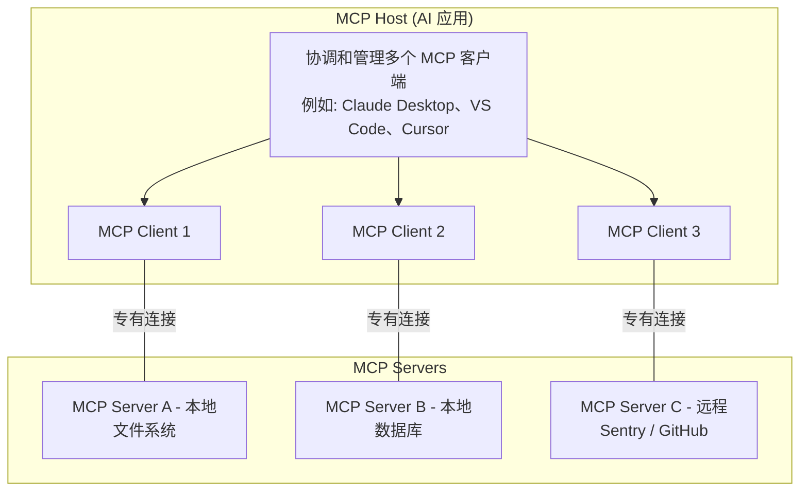

> [!compare] 三层角色职责

| 角色           | 职责                                    | 类比     | 示例                             |
| :------------- | :-------------------------------------- | :------- | :------------------------------- |
| **MCP Host**   | 协调和管理多个 MCP Client，提供用户界面 | 操作系统 | Claude Desktop、VS Code、Cursor  |
| **MCP Client** | 维护与单个 MCP Server 的连接，交换数据  | 设备驱动 | 每个 Server 对应一个 Client 实例 |
| **MCP Server** | 提供上下文数据（工具、资源、提示模板）  | 外接设备 | 文件系统服务器、数据库服务器     |

> [!important] 关键理解
> **MCP Server 指的是"提供上下文数据的程序"**，不区分本地或远程。本地运行的 filesystem server 和远程的 Sentry MCP server 都是 MCP Server，只是传输方式不同。

### 2.2 两层协议架构

> [!note] 数据层与传输层
> MCP 协议体系由两层构成：

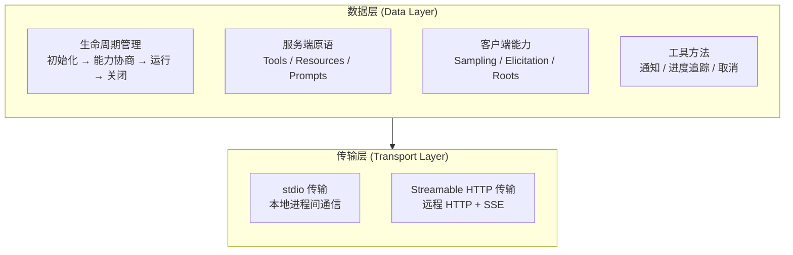

| 层级       | 职责                             | 技术基础           |
| :--------- | :------------------------------- | :----------------- |
| **数据层** | 定义消息结构、通信语义、核心原语 | JSON-RPC 2.0       |
| **传输层** | 管理连接建立、消息帧传输、认证   | stdio / HTTP + SSE |

> [!note] 两层分离的设计意义
> 数据层与传输层分离，意味着**相同的 JSON-RPC 消息可以在不同传输方式上运行**。本地开发用 stdio 追求低延迟，生产部署用 HTTP 支持远程连接，数据层的代码完全不需要修改。

### 2.3 核心原语详解

> [!note] MCP 的三个核心原语
> MCP 定义了三个核心原语，它们是 Server 向 AI 应用提供上下文的主要方式：

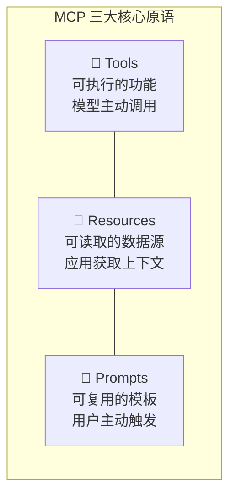

---

#### 2.3.1 Tools（工具）

> [!note] Tools 是 AI **主动调用**的功能
> Tools 是模型可以根据用户请求**自主决定调用**的可执行函数。每个 Tool 定义了一个特定操作，带有类型化的输入输出。

**协议操作：**

| 方法         | 用途         | 返回                           |
| :----------- | :----------- | :----------------------------- |
| `tools/list` | 发现可用工具 | 工具定义列表（含 JSON Schema） |
| `tools/call` | 执行特定工具 | 工具执行结果                   |

**典型 Tool 定义示例：**

```json
{
  "name": "searchFlights",
  "description": "搜索可用航班",
  "inputSchema": {
    "type": "object",
    "properties": {
      "origin": { "type": "string", "description": "出发城市" },
      "destination": { "type": "string", "description": "到达城市" },
      "date": { "type": "string", "format": "date", "description": "旅行日期" }
    },
    "required": ["origin", "destination", "date"]
  }
}
```

> [!tip] 关键设计特点
>
> - **模型控制**：模型决定何时调用工具，基于用户请求和上下文
> - **Schema 驱动**：使用 JSON Schema 定义输入参数，支持类型校验
> - **可动态发现**：Client 通过 `tools/list` 发现 Server 提供的所有工具
> - **可变更通知**：Server 支持 `notifications/tools/list_changed` 通知工具列表变化

---

#### 2.3.2 Resources（资源）

> [!note] Resources 是 AI **可以读取**的数据源
> Resources 提供对信息的结构化访问，让 AI 应用可以获取和传递上下文给模型。

**关键特性：**

- **唯一 URI**：每个 Resource 有独立 URI 标识（如 `file:///path/to/doc.md`）
- **MIME 类型**：声明内容格式，支持适当的处理
- **两种发现模式**：
  - **直接资源**：固定 URI 指向特定数据（如 `calendar://events/2024`）
  - **资源模板**：带参数的动态 URI（如 `weather://forecast/{city}/{date}`）

**协议操作：**

| 方法                       | 用途             | 返回            |
| :------------------------- | :--------------- | :-------------- |
| `resources/list`           | 列出可用直接资源 | 资源描述数组    |
| `resources/templates/list` | 发现资源模板     | 模板定义数组    |
| `resources/read`           | 读取资源内容     | 资源数据+元数据 |
| `resources/subscribe`      | 订阅资源变更     | 订阅确认        |

> [!compare] Tools vs Resources

| 维度     | Tools                            | Resources                            |
| :------- | :------------------------------- | :----------------------------------- |
| 控制方   | **模型**控制（主动调用）         | **应用**控制（获取上下文）           |
| 操作方式 | 执行动作（写操作）               | 读取信息（读操作）                   |
| 典型用途 | 搜索航班、发送邮件、创建日历事件 | 读取文件、获取数据库Schema、查阅文档 |
| 副作用   | 可能有副作用                     | 无副作用                             |

---

#### 2.3.3 Prompts（提示模板）

> [!note] Prompts 是**用户主动触发**的模板
> Prompts 提供了可复用的结构化模板，封装了特定领域的交互模式。它们是**用户控制**的，需要显式调用。

**协议操作：**

| 方法           | 用途             | 返回              |
| :------------- | :--------------- | :---------------- |
| `prompts/list` | 发现可用提示模板 | 模板描述数组      |
| `prompts/get`  | 获取模板详情     | 完整模板定义+参数 |

> [!tip] Prompts 的实用价值
> 在 MCP 生态中，Prompts 让 Server 可以"告诉"AI 应用如何最好地使用它的能力和资源。一个好的 prompts 设计，能大幅降低用户的学习成本。

---

#### 2.3.4 客户端能力

> [!note] 不仅仅是服务器有原语——客户端也提供关键能力
> 除了服务器暴露的三大原语，MCP 还定义了客户端可以提供给服务器的能力，让 Server 构建更丰富的交互。

| 客户端能力      | 说明                          | 类比                            |
| :-------------- | :---------------------------- | :------------------------------ |
| **Sampling**    | 服务器通过客户端请求 LLM 补全 | Server 说"帮我问问 AI"          |
| **Elicitation** | 服务器向用户请求额外信息      | Server 说"我需要用户确认"       |
| **Roots**       | 客户端告诉服务器文件系统边界  | 客户端说"你只能在目录 X 下操作" |
| **Logging**     | 服务器向客户端发送日志        | Server 说"记录这个事件"         |

> [!important] Sampling 的重要性
> Sampling 允许 MCP Server 在有需要时请求客户端代为调用 LLM。这意味着 Server **不需要直接集成任何 AI SDK**，通过客户端间接获得 AI 能力——这对于保持 Server 的模型无关性非常关键。

**Sampling 流程示意：**

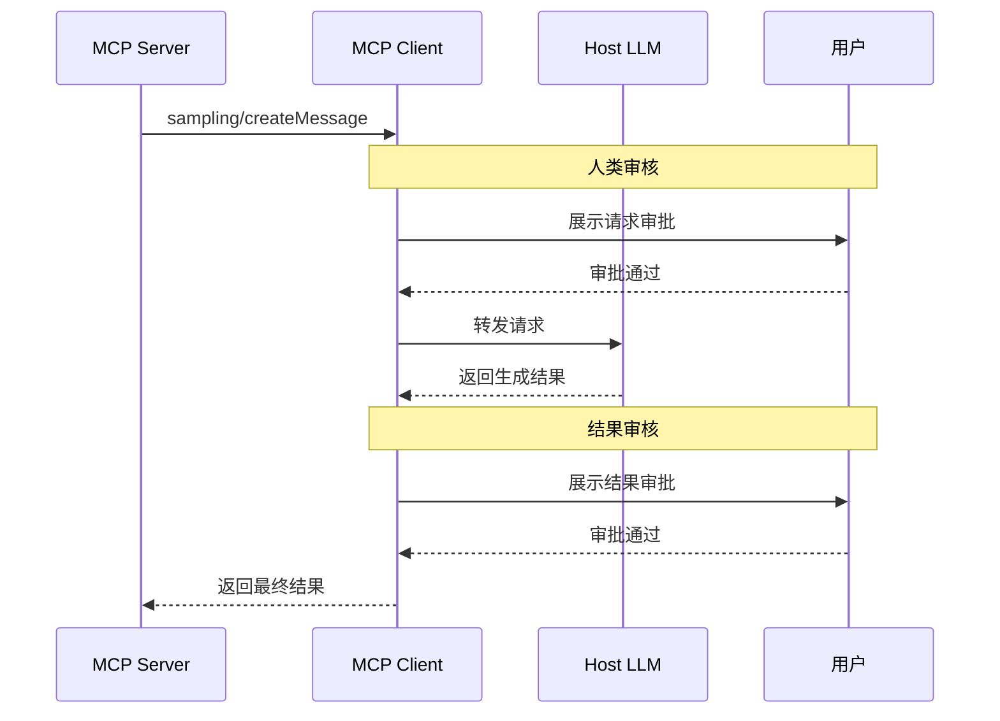

---

### 2.4 传输层

> [!note] MCP 支持两种标准传输机制
> 传输层负责实际的通信通道，抽象了底层通信细节，使上层 JSON-RPC 协议可以跨传输方式工作。

#### 2.4.1 stdio 传输

> [!note] 本地进程通信
> Client 将 MCP Server 作为子进程启动，通过标准输入/输出流进行通信。

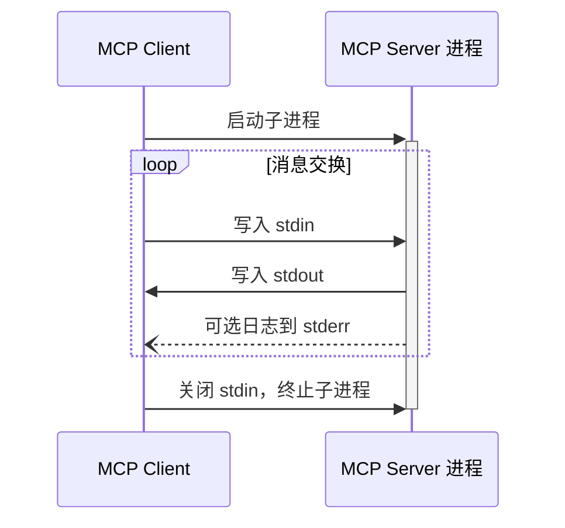

**stdio 传输特点：**

| 特性     | 说明                             |
| :------- | :------------------------------- |
| **性能** | 零网络开销，延迟最低             |
| **安全** | 进程隔离，不暴露网络端口         |
| **场景** | 本地开发工具、桌面应用集成       |
| **限制** | 一个 Client 对应一个 Server 进程 |

#### 2.4.2 Streamable HTTP 传输

> [!note] 远程 HTTP 通信
> Server 作为独立进程运行，通过 HTTP POST/GET 处理多个 Client 连接。支持 Server-Sent Events (SSE) 实现流式推送。

**核心流程：**

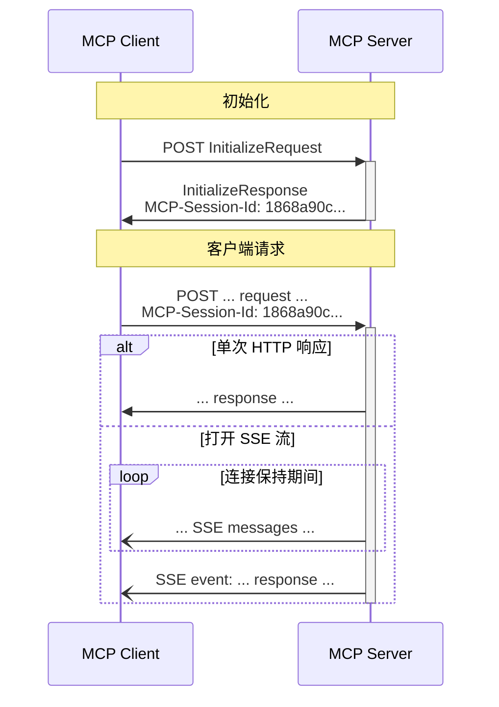

**关键特性：**

| 特性         | 说明                                             |
| :----------- | :----------------------------------------------- |
| **会话管理** | 通过 `MCP-Session-Id` Header 维持状态            |
| **流式支持** | 通过 SSE 实现 Server 推送                        |
| **断线重连** | SSE 支持 `Last-Event-ID` 恢复                    |
| **认证**     | 支持 OAuth 2.1、Bearer Token、API Key            |
| **安全**     | Server 必须验证 Origin Header 防止 DNS rebinding |

> [!important] Streamable HTTP 是推荐的远程传输方案
> 它取代了早期版本（2024-11-05）的 HTTP+SSE 传输，提供了更统一的端点设计和更完善的会话管理。对于远程 MCP Server，**Streamable HTTP 是最佳选择**。

---

## 3. MCP 的通信协议

### 3.1 JSON-RPC 2.0 基础

> [!note] MCP 基于 JSON-RPC 2.0 协议
> 所有消息都编码为 UTF-8 的 JSON 文本，使用标准的 JSON-RPC 2.0 格式：

**三种消息类型：**

| 类型             | 包含 id           | 需要响应 | 用途               |
| :--------------- | :---------------- | :------- | :----------------- |
| **Request**      | ✅                | ✅       | 请求对方执行操作   |
| **Response**     | ✅ (匹配 Request) | ❌       | 对 Request 的响应  |
| **Notification** | ❌                | ❌       | 单向通知，不需回复 |

### 3.2 生命周期

> [!note] MCP 是有状态的协议，需要严格的生命周期管理

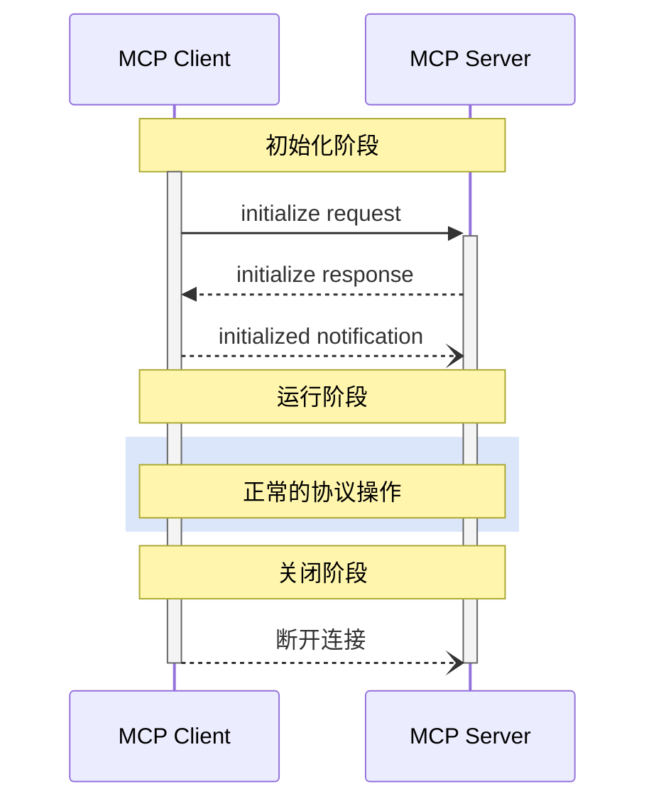

#### 3.2.1 初始化阶段

> [!note] 第一步：能力协商
> 初始化是 Client 和 Server 之间的第一次交互，核心目的是进行**能力协商**。Client 发送 `initialize` 请求，包含：

```json
{
  "jsonrpc": "2.0",
  "id": 1,
  "method": "initialize",
  "params": {
    "protocolVersion": "2025-11-25",
    "capabilities": {
      "roots": { "listChanged": true },
      "sampling": {},
      "elicitation": { "form": {}, "url": {} }
    },
    "clientInfo": {
      "name": "ExampleClient",
      "version": "1.0.0"
    }
  }
}
```

> [!note] 第二步：Server 响应
> Server 回复自己的能力和协议版本：

```json
{
  "jsonrpc": "2.0",
  "id": 1,
  "result": {
    "protocolVersion": "2025-11-25",
    "capabilities": {
      "tools": { "listChanged": true },
      "resources": { "subscribe": true, "listChanged": true },
      "prompts": { "listChanged": true },
      "logging": {}
    },
    "serverInfo": {
      "name": "ExampleServer",
      "version": "1.0.0"
    },
    "instructions": "可选的服务器使用说明"
  }
}
```

> [!important] 初始化完成了三件事情
>
> 1. **协议版本协商**：确保双方使用兼容的协议版本
> 2. **能力发现**：双方声明支持的功能（Tools、Resources、Prompts 等）
> 3. **身份交换**：Client 和 Server 互相告知身份信息

> [!note] 第三步：就绪通知
> 初始化成功后，Client 发送 `notifications/initialized` 通知 Server 已就绪。**此后才开始正常的操作通信。**

#### 3.2.2 运行与关闭

| 阶段             | 行为                                             | 说明                      |
| :--------------- | :----------------------------------------------- | :------------------------ |
| **运行**         | 按约定的能力进行正常通信                         | 双方遵守协商结果          |
| **关闭 (stdio)** | Client 关闭 stdin → 等待退出 → SIGTERM → SIGKILL | 逐级升级终止              |
| **关闭 (HTTP)**  | 关闭 HTTP 连接                                   | 也可通过 HTTP DELETE 通知 |

### 3.3 通知机制

> [!note] MCP 支持实时通知
> 通知是 MCP 实现动态更新的关键机制。Server 可以在工具列表发生变化时主动通知 Client：

```json
{
  "jsonrpc": "2.0",
  "method": "notifications/tools/list_changed"
}
```

> [!tip] 通知的设计价值
>
> - **无需轮询**：Server 变化时主动通知，而不是 Client 反复查询
> - **实时同步**：Client 收到通知后立即刷新工具列表
> - **条件启用**：仅在初始化时声明了 `listChanged: true` 的 Server 才会发送

### 3.4 客户端能力详解

#### 3.4.1 Elicitation（引导用户输入）

> [!note] Elicitation 让 Server 可以向用户请求信息
> Server 在需要额外信息时，通过 Client 向用户发起结构化的信息请求：

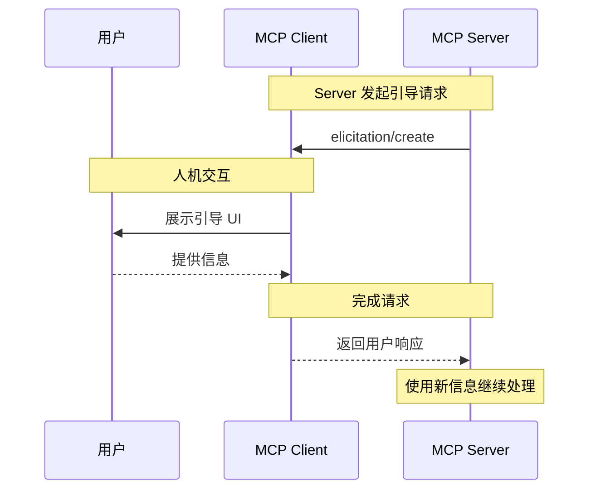

> [!note] 实际场景
> 一个旅行预订 Server 在最终确认订单前，可以通过 Elicitation 让用户确认：
>
> - 是否确认预订（机票+酒店 = $3,000）
> - 座位偏好（靠窗/过道）
> - 是否添加旅行保险

#### 3.4.2 Roots（文件系统边界）

> [!note] Roots 定义 Server 可以操作的文件系统范围
> 通过 Roots，Client 告诉 Server 哪些目录是"工作范围"，帮助 Server 理解可访问的文件边界：

```json
{
  "uri": "file:///Users/agent/travel-planning",
  "name": "旅行规划工作区"
}
```

> [!warning] Roots 不是安全边界
> Roots 是**协调机制**而不是**安全机制**。规范要求 Server "应当"尊重 Roots 边界，而非"必须"强制。实际安全需由操作系统级的文件权限或沙箱保障。

---

## 4. MCP 与 Agent 系统的关系

### 4.1 MCP 在 Agent 架构中的位置

> [!question] MCP 在 Agent 系统中的位置？
> 回顾 [[重新认识AI]] 中提到的 Agent 五大基础要素，MCP 直接对应 **Tools** 层——它是 Agent 连接外部世界的标准通道。

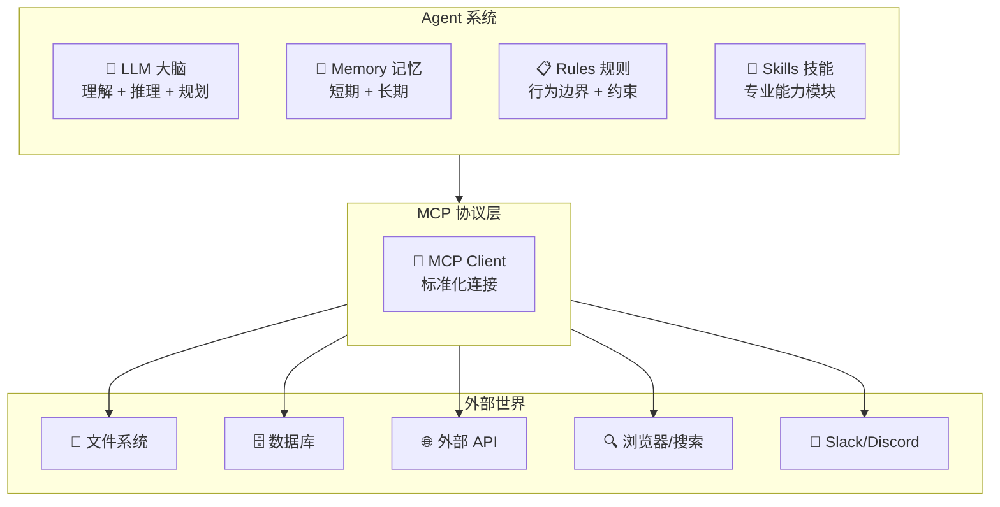

> [!note] MCP 在 Agent 架构中扮演的角色
> 在 [[重新认识AI]] 描述的 Agent 八大组件中，MCP 主要服务于 **Executor**（执行器）层：
>
> - Executor 需要的文件操作 → MCP Filesystem Server
> - Executor 需要的 API 调用 → MCP HTTP/API Server
> - Executor 需要的外部服务 → MCP Service Server
> - Context Builder 需要的数据源 → MCP Resources
>
> MCP 让 Agent 的"感官和肢体"不再是定制的，而是通过标准协议即插即用。

### 4.2 MCP vs 传统 API

> [!compare] MCP vs 传统 API 集成

| 维度         | 传统 API 集成                       | MCP                           |
| :----------- | :---------------------------------- | :---------------------------- |
| **连接方式** | 每个 API 独立实现 HTTP 调用         | 标准化协议，Server 声明能力   |
| **认证**     | 各自实现（API Key / OAuth / Basic） | 统一 OAuth 2.1 支持           |
| **发现机制** | 需查阅文档，手动编码                | `*/list` 方法自动发现所有能力 |
| **变更管理** | 需手动更新集成代码                  | 通过通知自动感知变更          |
| **复用性**   | 每应用重复实现                      | 一次开发，任意 MCP Host 可用  |
| **类型安全** | 依赖文档和手动校验                  | JSON Schema 自动校验输入      |

### 4.3 MCP vs Function Calling

> [!compare] MCP vs Function Calling（Tool Use）

| 维度       | Function Calling             | MCP                                    |
| :--------- | :--------------------------- | :------------------------------------- |
| **范围**   | 模型输出结构化工具调用的能力 | 端到端的协议标准                       |
| **定位**   | LLM 的底层能力               | AI 应用与外部系统的集成协议            |
| **提供方** | 每个模型各自实现             | 协议层统一，跨模型兼容                 |
| **功能**   | 只定义"如何调用"             | 定义发现、调用、通知、资源访问完整协议 |
| **生态**   | 独立的工具定义               | 可注册、可发现、可组合的 Server 生态   |

> [!tip] 关系
> Function Calling 是 LLM 的"肌肉记忆"——模型知道怎么调用函数。MCP 是"神经系统"——定义了函数在哪里、怎么连接、数据怎么传输。
>
> 在实际 Agent 系统中，两者协同工作：
>
> 1. MCP 提供统一的 Tool Registry（通过 `tools/list`）
> 2. Agent 将所有工具的描述注入 LLM 上下文
> 3. LLM 使用 Function Calling 能力选择并调用工具
> 4. Agent 通过 MCP 协议将调用转发到对应的 Server

---

## 5. MCP 的实际应用

### 5.1 开发工具集成

> [!note] 开发工具是 MCP 最活跃的应用领域
> AI IDE 和编码 Agent 通过 MCP 连接各种开发工具，极大提升了开发效率。

| 应用                  | MCP 作用                                     | 典型 Server           |
| :-------------------- | :------------------------------------------- | :-------------------- |
| **Cursor**            | Composer 中使用 MCP Tool                     | 文件系统、Git、GitHub |
| **VS Code + Copilot** | Agent 模式通过 MCP 扩展能力                  | 代码搜索、Issue 管理  |
| **Claude Code**       | 全功能 MCP Host，可使用 Resource/Prompt/Tool | GitHub、文件系统      |
| **Windsurf**          | Cascade 中集成 MCP Tool                      | 数据库、API 调试      |
| **Zed**               | 通过 Prompt 模板和 Tool 增强编码             | 代码审查、部署        |

#### 5.1.1 官方参考 Server

> [!note] MCP 官方提供了一系列参考 Server 实现
> 这些 Server 是 MCP 功能的示范实现，也是开发者构建自己 Server 的起点：

| Server                  | 功能                           | 使用场景                 |
| :---------------------- | :----------------------------- | :----------------------- |
| **Filesystem**          | 安全的文件操作，可配置访问控制 | Agent 读写项目文件       |
| **Git**                 | 读取、搜索、操作 Git 仓库      | Agent 管理版本控制       |
| **GitHub**              | 仓库、Issue、PR 管理           | Agent 操作 GitHub 工作流 |
| **Memory**              | 基于知识图谱的持久化记忆       | Agent 长期记忆系统       |
| **Fetch**               | 网页内容获取和转换             | Agent 获取网络信息       |
| **Sequential Thinking** | 动态和反思性问题求解           | Agent 复杂推理过程       |
| **Time**                | 时间和时区转换                 | Agent 时间相关操作       |
| **Everything**          | 参考/测试 Server，包含所有原语 | Server 开发测试          |

#### 5.1.2 快速配置示例

> [!note] 以 Claude Desktop 为例配置 MCP Server
> 在 `claude_desktop_config.json` 中：

```json
{
  "mcpServers": {
    "filesystem": {
      "command": "npx",
      "args": ["-y", "@modelcontextprotocol/server-filesystem", "/path/to/allowed/files"]
    },
    "github": {
      "command": "npx",
      "args": ["-y", "@modelcontextprotocol/server-github"],
      "env": {
        "GITHUB_PERSONAL_ACCESS_TOKEN": "<YOUR_TOKEN>"
      }
    },
    "memory": {
      "command": "npx",
      "args": ["-y", "@modelcontextprotocol/server-memory"]
    }
  }
}
```

### 5.2 数据源连接

> [!note] MCP 让 AI 应用可以安全地访问各类数据源
> 无论是本地文件、数据库、云存储还是 SaaS 服务，MCP 都提供了标准的连接方式。

**典型数据源 Server：**

| 数据源                 | MCP Server 职责                 | 价值                |
| :--------------------- | :------------------------------ | :------------------ |
| **文件系统**           | 读取/写入文件、目录遍历         | AI IDE 操作项目文件 |
| **数据库**             | 查询 Schema、执行 SQL、获取数据 | 自然语言查询数据库  |
| **向量数据库**         | 语义搜索、知识检索              | RAG 系统后端        |
| **Notion/Google Docs** | 文档读写、搜索                  | AI 助手访问知识库   |
| **Sentry**             | 错误日志、性能数据              | AI 调试生产问题     |

### 5.3 业务系统集成

> [!note] 企业级场景中的 MCP
> 在企业环境中，MCP 可以作为 AI 助手的"万能接口"，连接 CRM、项目管理、人力资源等系统：

| 场景         | 连接的 MCP Server                | 效果                          |
| :----------- | :------------------------------- | :---------------------------- |
| **客服**     | CRM + 知识库 + 工单系统          | AI 助理一站式处理客户问题     |
| **开发运维** | GitHub + Sentry + Docker + Slack | AI 自动排查故障、修复、通知   |
| **数据分析** | 数据库 + BI 工具 + 报表服务      | 自然语言查询 → 自动生成报表   |
| **项目管理** | Jira + Notion + Calendar         | AI 跟进项目进度、自动更新任务 |

### 5.4 多方协作场景

> [!note] 多个 MCP Server 协同工作
> MCP 的真正威力在于多个 Server 可以同时为同一个 AI 应用提供能力。以旅行规划为例：

**多 Server 协作流程：**

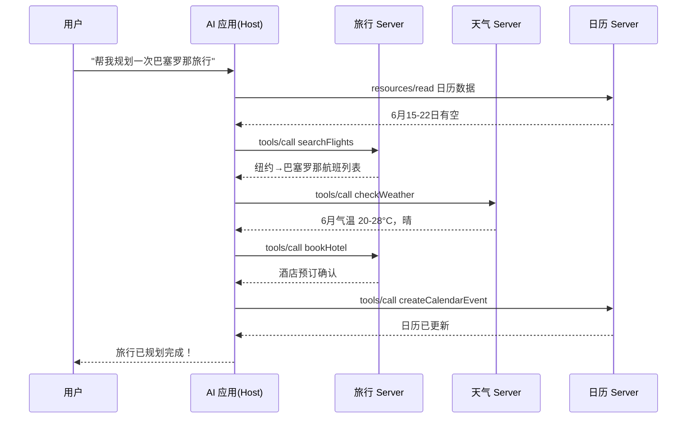

> [!tip] 这种多方协作的能力，让 MCP 成为了 Agent 系统的"工具总线"——所有外部能力通过统一的协议接入，AI 应用可以自由组合使用。

---

## 6. 开发实践与 SDK

### 6.1 SDK 支持情况

> [!note] MCP 提供多种语言的官方 SDK
> MCP 的设计目标是语言无关的协议，官方提供了主流语言的 SDK：

| SDK                | 语言                  | 维护状态           | 使用场景                |
| :----------------- | :-------------------- | :----------------- | :---------------------- |
| **Python SDK**     | Python                | 官方维护（Tier 1） | 数据科学、后端服务      |
| **TypeScript SDK** | TypeScript/JavaScript | 官方维护（Tier 1） | 前端工具、Node.js 服务  |
| **Java SDK**       | Java                  | 官方维护           | 企业后端、Spring 生态   |
| **Kotlin SDK**     | Kotlin                | 官方维护           | Android、KMP 项目       |
| **C# SDK**         | .NET/C#               | 社区维护           | .NET 生态集成           |
| **Rust SDK**       | Rust                  | 社区维护           | 高性能 Server、CLI 工具 |
| **Go SDK**         | Go                    | 社区维护           | 云原生服务              |

> [!tip] 使用建议
> 对于新项目，优先选择 **Python SDK** 或 **TypeScript SDK**（Tier 1 级别，功能最完整）。其他语言的 SDK 可能在功能完整性上有所差异。

### 6.2 快速入门：构建一个 MCP 服务器

> [!note] 以 TypeScript 为例，构建一个简单的天气查询 MCP Server
>
> 使用 TypeScript SDK 可以快速构建功能完整的 MCP Server：

```typescript
import { Server } from "@modelcontextprotocol/sdk/server/index.js"
import { StdioServerTransport } from "@modelcontextprotocol/sdk/server/stdio.js"

// 1. 创建 Server 实例
const server = new Server(
  {
    name: "weather-server",
    version: "1.0.0",
  },
  {
    capabilities: {
      tools: {},
    },
  },
)

// 2. 注册 Tool 定义
server.setRequestHandler(ListToolsRequestSchema, async () => ({
  tools: [
    {
      name: "get_weather",
      description: "获取指定城市的当前天气",
      inputSchema: {
        type: "object",
        properties: {
          city: { type: "string", description: "城市名称" },
        },
        required: ["city"],
      },
    },
  ],
}))

// 3. 实现 Tool 执行逻辑
server.setRequestHandler(CallToolRequestSchema, async (request) => {
  if (request.params.name === "get_weather") {
    const city = request.params.arguments?.city
    // 查询天气 API 的逻辑...
    return {
      content: [{ type: "text", text: `${city} 当前温度 22°C，晴` }],
    }
  }
  throw new Error("Tool not found")
})

// 4. 连接传输层
const transport = new StdioServerTransport()
await server.connect(transport)
```

### 6.3 调试工具

> [!note] MCP Inspector
> [MCP Inspector](https://github.com/modelcontextprotocol/inspector) 是官方提供的交互式调试工具，用于测试和调试 MCP Server：
>
> - 可视化查看 Tools、Resources、Prompts
> - 手动调用 Tool 并查看响应
> - 检查完整的 JSON-RPC 通信日志
> - 支持所有传输类型（stdio、SSE、Streamable HTTP）

> [!note] 其他调试工具
>
> - **Apify MCP Tester**：基于 SSE 的 Server 测试
> - **MCPJam Inspector**：支持 OAuth 调试的本地开发工具
> - **Postman**：最新版本已支持 MCP Server 测试

---

## 7. 生态与社区

### 7.1 早期采用者

> [!note] MCP 自发布以来，获得了广泛的行业支持
> 从开发工具到企业平台，从 AI 聊天客户端到云服务，MCP 已经形成了一个丰富的生态。

**AI 开发和编码类：**

| 产品               | 类型           | MCP 支持                               |
| :----------------- | :------------- | :------------------------------------- |
| **Claude Desktop** | AI 桌面应用    | Resources、Prompts、Tools、Roots、Apps |
| **Claude.ai**      | Web AI 助手    | Resources、Prompts、Tools、Apps        |
| **Claude Code**    | 终端编码 Agent | Resources、Prompts、Tools、Roots       |
| **ChatGPT**        | Web AI 助手    | Tools、Apps                            |
| **Gemini CLI**     | 终端 AI Agent  | Prompts、Tools                         |
| **GitHub Copilot** | IDE 编码助手   | Tools                                  |
| **VS Code**        | 代码编辑器     | 全功能支持（11 项能力）                |
| **Cursor**         | AI 代码编辑器  | Prompts、Tools、Roots、Elicitation     |
| **Windsurf**       | AI IDE         | Tools、Discovery                       |
| **Zed**            | 代码编辑器     | Prompts、Tools                         |
| **Amazon Q**       | 开发助手       | Tools                                  |
| **Augment Code**   | 编码平台       | Tools                                  |
| **JetBrains AI**   | IDE 插件       | Tools                                  |

**AI Agent 和框架类：**

| 产品             | 类型               | MCP 支持                        |
| :--------------- | :----------------- | :------------------------------ |
| **Goose**        | 开源 AI Agent      | 全功能支持（11 项能力）         |
| **Cline**        | VS Code 编码 Agent | Resources、Tools、Discovery     |
| **Roo Code**     | 编码 Agent         | Resources、Tools                |
| **OpenCode**     | 开源编码 Agent     | Resources、Prompts、Tools       |
| **Codex**        | 终端编码 Agent     | Resources、Tools、Elicitation   |
| **Continue**     | 开源编码助手       | Resources、Prompts、Tools、Apps |
| **Replit Agent** | 云端开发           | Tools                           |
| **Kilo Code**    | VS Code 编码 Agent | Resources、Tools、Discovery     |

**AI 聊天客户端类：**

| 产品            | 类型             | MCP 支持   |
| :-------------- | :--------------- | :--------- |
| **LibreChat**   | 开源聊天 UI      | Tools      |
| **Chatbox**     | 桌面聊天客户端   | Tools      |
| **TypingMind**  | LLM 前端         | Tools      |
| **BoltAI**      | 原生聊天客户端   | Tools      |
| **LM Studio**   | 本地模型运行     | Tools      |
| **Msty Studio** | 隐私优先 AI 平台 | Tools      |
| **Glama**       | AI 工作区        | 全功能支持 |

**企业平台类：**

| 产品                         | 类型            | MCP 支持           |
| :--------------------------- | :-------------- | :----------------- |
| **Langdock**                 | 企业 AI 平台    | Tools              |
| **Microsoft Copilot Studio** | 企业 Agent 平台 | Resources、Tools   |
| **IBM Bob**                  | AI SDLC 平台    | Resources、Tools   |
| **Archestra**                | 企业 AI 平台    | Tools、Apps、OAuth |
| **Tencent CloudBase**        | 云 AI DevKit    | Tools              |

### 7.2 MCP Registry

> [!note] 官方 MCP Server 注册中心
> [MCP Registry](https://modelcontextprotocol.io/registry/about) 是官方集中式元数据仓库，由 Anthropic、GitHub、PulseMCP、Microsoft 等主要贡献者共同支持。

**Registry 的核心功能：**

| 功能             | 说明                                              |
| :--------------- | :------------------------------------------------ |
| **命名空间管理** | 通过 DNS 验证确保 Server 来源可信                 |
| **REST API**     | 供 MCP Client 和聚合器发现可用 Server             |
| **标准化元数据** | 每个 Server 发布 `server.json` 描述安装和配置信息 |
| **包类型支持**   | npm、PyPI、Docker Hub 等                          |

> [!tip] 生态关系
>
> - **包注册中心**（npm/PyPI/Docker）托管代码和二进制
> - **MCP Registry** 托管指向这些包的元数据
> - **下游聚合器**（如 Smithery、Glama）消费 Registry 数据，提供更多增值服务
>
> 这种分层设计让 MCP Registry 保持轻量，同时为生态系统留出了充分的创新空间。

---

## 8. 设计原则与未来展望

### 8.1 七大设计原则

> [!note] MCP 社区制定了七条核心设计原则
> 这些原则指导着协议的发展方向，也解释了 MCP 为什么采用当前的架构设计：

**1. 趋同胜于选择 (Convergence over choice)**

> 一个问题在 MCP 中应该只有一种解决方案。与其支持多种方式导致生态碎片化，不如选择一条经过充分设计的路径。

**2. 可组合胜于特化 (Composability over specificity)**

> MCP 提供基础原语（Resources、Tools、Prompts、Tasks）。能用这些已有构建块解决的问题，就不增加新的协议特性。这让协议面保持小巧、实现保持简单。

**3. 互操作胜于优化 (Interoperability over optimization)**

> MCP 运行在各种不同能力的 Client、Server 和模型之上。通过能力协商机制，让参与者声明自己支持什么，协议自适应而非假设。

**4. 稳定胜于速度 (Stability over velocity)**

> 向 MCP 添加东西容易，移除几乎不可能。每个新增都是永久承诺。我们说"不"的同时为未来留出了可能性——"是"则永远关闭了其他可能性。

**5. 能力胜于补偿 (Capability over compensation)**

> 模型进步比协议演进快。避免为暂时性的模型局限添加永久结构——当限制消失时，复杂性仍在。可选性上下文（强的用不需要、弱的可以用）是好的设计。

**6. 示范胜于争论 (Demonstration over deliberation)**

> MCP 重视工作实现而非理论辩论。优先用真实使用中的证据而非假设性论证。鼓励先原型、先实验、先展示。

**7. 实用胜于纯粹 (Pragmatism over purity)**

> 在服务采用和可用性的前提下做出实际权衡。当"正确"的设计对实现者造成摩擦时，考虑"够好"的设计是否更能服务整个生态。

### 8.2 未来发展

> [!question] MCP 走向何方？
> 通过官方路线图和社区的 SEP（Spec Enhancement Proposal）机制，可以窥见 MCP 的未来方向：

**短期方向（正在推进）：**

| 方向                  | SEP/项目 | 说明                         |
| :-------------------- | :------- | :--------------------------- |
| **MCP Apps**          | SEP-2133 | Server 提供交互式 UI 组件    |
| **Tasks**             | SEP-1686 | 长时间运行任务的可持久化执行 |
| **File Uploads**      | 工作组   | 支持文件上传能力             |
| **Skills over MCP**   | 工作组   | 通过 MCP 暴露和管理技能      |
| **Triggers & Events** | 工作组   | 事件驱动的 Server 触发机制   |

**长期方向：**

> [!note] MCP 的演进趋势
>
> - **从工具到应用**：通过 MCP Apps，Server 可以提供完整的交互式界面
> - **从同步到异步**：Tasks 让长时间运行的操作有了标准管理方式
> - **从拉到推**：Triggers & Events 让 Server 可以主动响应外部变化
> - **从单 Server 到多 Server 协作**：更完善的 Server 组合和编排能力
> - **从开发者工具到企业平台**：OAuth 2.1、企业 IdP 集成、审计日志

---

## 结语：AI 的"USB-C 时刻"

> [!quote] 核心观点
> MCP 不是 AI 能力的核心——它不提升模型的智商、不增加模型的推理能力。但它是 AI 走向工程化的关键基础设施。
>
> 就像 USB-C 没有让电子设备本身变得更好，但让设备之间的连接变得前所未有的简单——**MCP 正在做同样的事情：让 AI 应用连接世界的成本降到最低**。

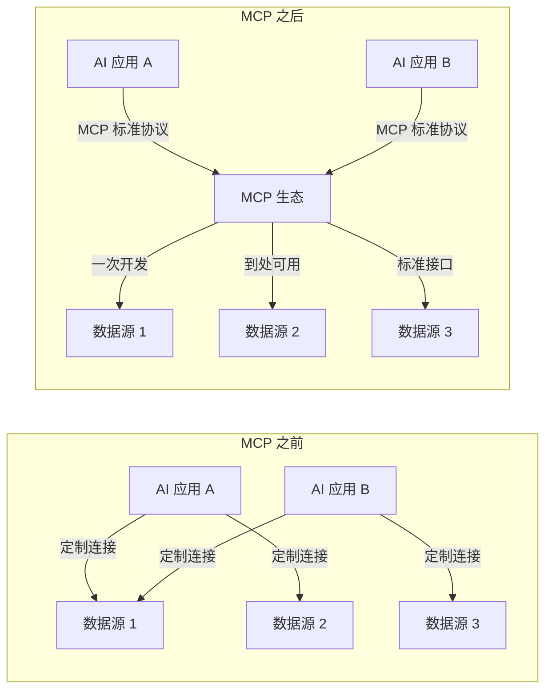

> [!quote] 在一个 AI Agent 无处不在的未来中
>
> - 一个 MCP Server = 一次开发，任意 Host 可用
> - 一个 MCP Host = 即插即用所有 Server
> - MCP 不是让 AI 更聪明，而是让 AI **更有用**

> [!summary] 本文要点回顾
>
> - MCP 是 AI 应用连接外部系统的标准化开放协议，类比 AI 的 USB-C
> - 架构分三层：Host（AI 应用）、Client（连接器）、Server（数据/工具提供方）
> - 三大核心原语：Tools（模型控制）、Resources（应用控制）、Prompts（用户控制）
> - 数据层基于 JSON-RPC 2.0，传输层支持 stdio（本地）和 Streamable HTTP（远程）
> - 生命周期管理包括初始化（能力协商）、运行、关闭三个阶段
> - 在 Agent 架构中，MCP 是"感官和肢体"的标准接口
> - 生态已覆盖 60+ 产品，从 IDE 到企业平台
> - 七大设计原则指导协议演进，确保稳定性和可持续发展
