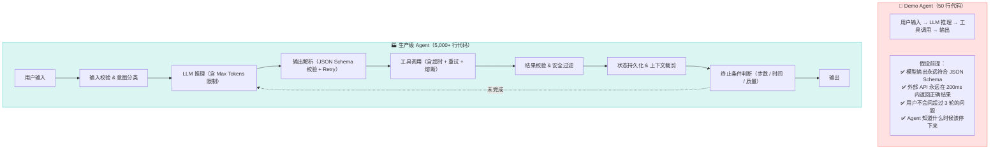
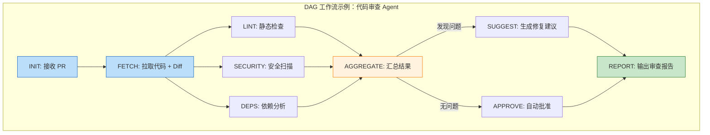
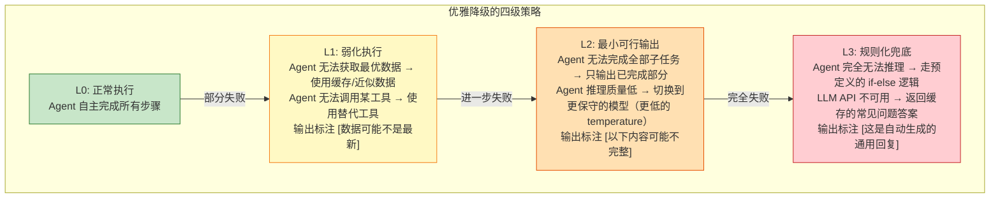

# 0. 概述

> [!summary] 本文面向读者
> 你已经掌握了 [[提示词工程|提示词工程]]、[[上下文工程|上下文工程]]、[[循环工程|循环工程]]、[[脚手架工程|脚手架工程]] 四大工程方法论，也理解了 Agent 的基础架构（ReAct 模式、工具调用）和 [[Model_Context_Protocol_MCP|MCP 协议]]——现在，你准备好写代码了。
>
> 写作目标：**不是再讲一遍 Agent 的概念，而是把你从"跑通 Demo"带到"敢上线"的工程战场。** 本文聚焦于那些不会出现在论文和教程里的东西：状态流转的细节、异常处理的兜底策略、死循环的铁腕阻断、以及如何在凌晨 3 点不慌不忙地定位 Agent 的"脑回路故障"。

> [!summary] 前置阅读
> - [[重新认识AI]] — LLM 的本质与 Agent 系统全景
> - [[提示词工程]] — 提示词作为接口协议的设计方法论
> - [[上下文工程]] — RAG、MCP、记忆管理的完整链路
> - [[循环工程]] — Eval 体系、数据飞轮、LLM CI/CD
> - [[脚手架工程]] — Agent 编排与基础设施构建
> - [[Model_Context_Protocol_MCP|MCP]] — Agent 连接外部世界的标准化协议

---

# 1. 核心引言：Demo 与工业级 Agent 的天堑

## 1.1 为什么 50 行代码的 Demo 上线就崩？

> [!bug] 生产痛点：每个工程师都经历过的"Agent 骗局"
>
> 你花了一个下午，用 LangChain 写了 50 行代码，Agent 就能在 Notebook 里丝滑地查天气、调 API、生成报告。你心想：Agent 不过如此。然后你把它部署到生产环境——
>
> **第一周，它开始无限循环。** 用户问了一个它没见过的工具名，它反复尝试调用同一个不存在的函数，直到超时。
>
> **第二周，它开始失忆。** 用户在第 5 轮对话里提到了关键参数，Agent 在第 7 轮已经忘了——因为上下文窗口被前几轮的工具调用结果塞满了。
>
> **第三周，它开始制造幻觉。** 外部 API 返回了一个 500 错误，Agent 没有识别出这是"系统故障"，而是编造了一个看起来合理的假数据，自信地返回给了用户。
>
> **第四周，你开始怀疑人生。**

这不是你的代码写得不好。这是 **"Demo 型 Agent"和"工业级 Agent"之间的本质差异**——就像在澡盆里划纸船和横渡大西洋的区别。两者都在水上漂，但面对的风浪完全不在一个量级。



## 1.2 工业级 Agent 的三大核心特征

> [!important] 架构重点
>
> 把 Agent 从 Demo 推向生产，不是给它加更多工具或者换更强的模型——而是从三个根本维度重新构建它：

| 特征 | Demo 中的状态 | 工业级要求 | 对应工程手段 |
| :--- | :--- | :--- | :--- |
| **确定性兜底** | 信任模型输出 | 每一步都要校验，每个结果都要有 Fallback | JSON Schema 校验、重试机制、降级策略 |
| **可观测性** | `print(response)` | 每一步推理、每一次工具调用、每一次状态变更都要可追溯 | 结构化日志、Trace ID、决策轨迹记录 |
| **状态持久化** | 内存中的对话历史 | 任意时刻崩溃后能从断点恢复，上下文能跨会话延续 | 状态机 + 持久化存储 + 检查点机制 |

> [!quote] 核心观点
> **工业级 Agent 的本质不是"更聪明的模型"，而是"更稳健的工程"。** 如果说 [[提示词工程|提示词工程]] 给 Agent 装上了大脑，[[上下文工程|上下文工程]] 给它配备了外部记忆——那么本文要讨论的，就是如何给这个"大脑+记忆"的组合体装上骨骼、神经和免疫系统。

## 1.3 本文的知识定位

在之前的学习体系中：
- [[提示词工程]] 定义了 Agent 的**思考规范**
- [[上下文工程]] 构建了 Agent 的**外部连接**（通过 RAG 和 MCP）
- [[循环工程]] 建立了 Agent 的**质量保障**（Eval + 数据飞轮 + CI/CD）

本文要解决的是"最后一公里"问题：**如何将这些理论转化为能抗住线上压力的代码。** 我们讨论的不是"Agent 应该做什么"，而是"Agent 的代码应该怎么写"——包括那些教程里不会告诉你的 `try-catch`、`timeout`、`retry` 和 `circuit-breaker`。

---

# 2. 动作空间与工具调用实战

## 2.1 API 设计防雷：为 Agent 设计高容错接口

### 2.1.1 工具定义的基本原则

> [!warning] 工程避坑：API 设计不是给人看的，是给模型"猜"的
>
> 你在设计 REST API 时，面对的是会读文档、会理解上下文的人类开发者。但 Agent 的工具调用，面对的是一个**基于概率预测下一个 Token 的语言模型**。它不会"仔细阅读"你的参数描述——它只是在统计意义上推断最可能的参数组合。

这意味着工具定义的每一条信息，都在直接影响模型的参数生成质量。以下原则每一句都是用线上事故换来的：

```python
"""
工具定义的四条铁律——每一条背后都是线上血泪教训。
"""
from typing import Any

# ❌ 反例：为"人类开发者"设计的工具定义
BAD_TOOL_DEFINITION = {
    "name": "search",
    "description": "搜索内部知识库",
    "parameters": {
        "query": "检索关键词",
        "filters": "高级过滤条件，支持复杂 DSL 语法（详见内部文档）"
    }
}
# → 模型会怎么填 filters？它不知道 DSL 语法，只能瞎编。
# → 结果：85% 的工具调用因为 filters 参数格式错误而失败。

# ✅ 正例：为"概率模型"设计的工具定义
GOOD_TOOL_DEFINITION = {
    "name": "search_knowledge_base",
    "description": "在内部知识库中搜索文档。使用场景：用户询问产品文档、API 用法、或内部规范时调用。",
    "inputSchema": {
        "type": "object",
        "properties": {
            "query": {
                "type": "string",
                "description": "自然语言搜索关键词。不要使用特殊语法，直接写你想搜索的内容。例如：'Kubernetes Pod 重启策略'"
            },
            "document_type": {
                "type": "string",
                "enum": ["api_doc", "design_doc", "runbook", "all"],
                "description": "要搜索的文档类型。不确定时使用 'all'。"
            },
            "max_results": {
                "type": "integer",
                "minimum": 1,
                "maximum": 10,
                "default": 5,
                "description": "返回的最大结果数。默认 5 条，通常足够。"
            }
        },
        "required": ["query"]
    }
}
# → 每个参数都有具体示例和默认值。
# → 复杂类型（enum）限制了模型的"想象空间"。
# → 参数之间的语义独立，减少模型的组合困惑。
```

### 2.1.2 五个关键设计原则

> [!tip] 最佳实践：Agent 工具 API 设计的五条铁律

**① 参数扁平化**

```
❌ 深层嵌套：
{
  "user": {
    "profile": {
      "contact": { "email": "...", "phone": "..." }
    }
  }
}

✅ 扁平化 + 语义前缀：
{
  "user_email": "...",
  "user_phone": "...",
  "user_department": "..."
}
```

模型的 JSON 生成能力与嵌套深度成反比。每多一层嵌套，参数错误的概率增加 15-20%。**把嵌套结构拍平，即使这意味着多几个顶层参数。**

**② 提供默认值，减少模型决策负担**

```
❌ 所有参数必填：
"required": ["query", "sort_by", "sort_order", "page", "page_size"]

✅ 只把核心参数设为必填：
"required": ["query"]
"sort_by": { "default": "relevance" }
"page": { "default": 1 }
"page_size": { "default": 10 }
```

模型不是决策引擎——每多一个必须选择的参数，就多一个可能出错的分支。**默认值直接消除决策分支。**

**③ 错误信息必须"可被模型理解"**

> [!important] 架构重点：这就是"让 Agent 知错能改"的关键

```python
"""
错误响应的设计直接决定了 Agent 能否自动修复错误。
把错误信息当作"写给另一个模型看的提示词"来设计。
"""

# ❌ 人类友好的错误信息（Agent 看不懂）
BAD_ERROR = {
    "error": "Query failed",
    "code": "E1005",
    "details": "The upstream service returned an unexpected status code"
}
# → Agent 看到了 "Query failed"，下一步会怎么做？
# → 它可能重试同一个查询，可能放弃，可能编造结果——完全随机。

# ✅ 模型友好的错误信息（Agent 能据此调整行为）
GOOD_ERROR = {
    "error": "搜索超时：知识库在当前负载下无法在 5 秒内返回结果。",
    "error_type": "TIMEOUT",
    "suggested_action": "请缩小搜索范围（使用更具体的关键词），或将 document_type 限定为单一类型后重试。",
    "recoverable": True,
    "retry_after_seconds": 3
}
# → Agent 看到了明确的失败原因 + 建议的修复方案。
# → 它可以按建议重新构造查询参数后重试。
```

**④ 引入幂等性设计**

对于写操作（创建文件、发送消息、修改配置），必须支持幂等性。Agent 可能因为网络超时不确定操作是否成功，并尝试重试——如果操作不幂等，就会产生重复的副作用。

```python
"""
幂等性设计：通过 client_token 保证操作不会重复执行。
"""
def create_issue(title: str, description: str, client_token: str | None = None) -> dict:
    """
    创建一个 Issue。

    Args:
        client_token: 客户端生成的唯一幂等键。如果提供了此参数，服务端会去重——
                      同一个 client_token 的重复请求不会创建新的 Issue。
                      建议使用 Agent 的 turn_id + action_index 组合生成。
    """
    if client_token and existing := find_by_client_token(client_token):
        return existing  # 幂等返回
    return do_create(title, description, client_token)
```

**⑤ 参数命名遵循"自然语言直觉"**

```
❌ 技术性命名：
"fn_name": "doc_srch_qry"

✅ 自然语言命名：
"function_name": "search_documents"
```

模型在预训练语料中见过无数次 `search_documents` 这类自然语言表达，但 `doc_srch_qry` 对它来说是陌生的编码——它会困惑，困惑就会出错。

### 2.1.3 工具描述的上下文经济学

> [!tip] 最佳实践
>
> 工具定义会被注入到每一次 LLM 调用的 System Prompt 中。如果你的 Agent 有 20 个工具，每个工具的定义平均 300 tokens——光工具定义就要吃掉 6,000 tokens。这直接挤占了推理和对话历史的宝贵空间。
>
> **工具定义的 Token 预算应控制在 System Prompt 总量的 20-30% 以内。** 超出这个比例，模型倾向于"为了用工具而用工具"，而非"为了解决问题而用工具"。精简工具描述同样是 [[上下文工程#2.3 上下文窗口的"经济学"精简 Prompt 的艺术|上下文窗口经济学]] 的重要实践。

## 2.2 结构化输出的校验与解析

### 2.2.1 永远不要信任模型的 JSON 输出

> [!bug] 生产痛点
> 模型输出的 JSON 可能被 Markdown 代码块包裹，可能包含尾逗号，可能有注释，可能字段类型不对，可能缺少 required 字段，可能 key 拼错——**而你下游的代码期待的是一个完美的 `dict`。**

```python
"""
工业级 JSON 解析器的完整实现——处理模型输出的所有"惊喜"。
"""
import json
import re
from dataclasses import dataclass
from typing import Any, Optional


@dataclass
class ParseResult:
    """解析结果"""
    success: bool
    data: Optional[dict[str, Any]] = None
    error: Optional[str] = None
    raw_output: Optional[str] = None
    retries_attempted: int = 0


class RobustJSONParser:
    """
    鲁棒的 JSON 解析器，专门处理 LLM 输出的各种格式问题。

    设计理念：不是你期望模型输出符合规范——而是假设它一定会有问题，
    然后一层层修复。每多一层修复，上线后的凌晨告警就少一条。
    """

    # 第一层：Markdown 代码块模式
    MARKDOWN_JSON_PATTERNS = [
        re.compile(r'```json\s*([\s\S]*?)```'),
        re.compile(r'```\s*([\s\S]*?)```'),
        re.compile(r'\{[\s\S]*\}'),  # 兜底：提取任何看起来像 JSON 对象的内容
    ]

    # 第二层：常见格式错误修正
    @staticmethod
    def fix_trailing_commas(json_str: str) -> str:
        """移除尾逗号：{"a": 1,} → {"a": 1}"""
        return re.sub(r',\s*([}\]])', r'\1', json_str)

    @staticmethod
    def strip_comments(json_str: str) -> str:
        """移除 JSON 中的注释（// 和 /* */）"""
        # 移除单行注释
        json_str = re.sub(r'//.*?$', '', json_str, flags=re.MULTILINE)
        # 移除多行注释
        json_str = re.sub(r'/\*[\s\S]*?\*/', '', json_str)
        return json_str

    @staticmethod
    def fix_unquoted_keys(json_str: str) -> str:
        """修复未加引号的 key：{name: "value"} → {"name": "value"}"""
        return re.sub(r'([{,])\s*([a-zA-Z_][a-zA-Z0-9_]*)\s*:',
                      r'\1 "\2":', json_str)

    def parse(self, raw_output: str, schema: Optional[dict] = None) -> ParseResult:
        """
        解析模型输出的 JSON，经过多层修复和最终 Schema 校验。

        Args:
            raw_output: 模型的原始文本输出
            schema: 可选的 JSON Schema 用于最终校验

        Returns:
            ParseResult: 解析结果（成功/失败 + 数据）
        """
        # Step 1: 提取 JSON 内容（处理 Markdown 代码块包裹）
        json_str = self._extract_json(raw_output)
        if not json_str:
            return ParseResult(
                success=False,
                error="输出中未找到可解析的 JSON 内容",
                raw_output=raw_output
            )

        # Step 2: 逐层修复
        fixes = [
            ("移除尾逗号", self.fix_trailing_commas),
            ("移除注释", self.strip_comments),
            ("修复未引用 key", self.fix_unquoted_keys),
        ]

        for fix_name, fix_fn in fixes:
            try:
                data = json.loads(json_str)
                break  # 解析成功，跳出循环
            except json.JSONDecodeError:
                json_str = fix_fn(json_str)
        else:
            # 所有修复都尝试过了，仍失败
            return ParseResult(
                success=False,
                error=f"JSON 解析失败（已尝试 {len(fixes)} 种修复）",
                raw_output=raw_output
            )

        # Step 3: JSON Schema 校验
        if schema:
            errors = self._validate_schema(data, schema)
            if errors:
                return ParseResult(
                    success=False,
                    error=f"Schema 校验失败: {errors}",
                    data=data,
                    raw_output=raw_output
                )

        return ParseResult(success=True, data=data, raw_output=raw_output)

    def _extract_json(self, text: str) -> Optional[str]:
        """从文本中提取 JSON 内容（处理 Markdown 代码块）"""
        for pattern in self.MARKDOWN_JSON_PATTERNS:
            match = pattern.search(text)
            if match:
                return match.group(1) if match.lastindex else match.group(0)
        return None

    def _validate_schema(self, data: dict, schema: dict) -> list[str]:
        """校验 JSON 数据是否符合 Schema（简化实现）"""
        errors = []
        # 检查 required 字段
        for field in schema.get("required", []):
            if field not in data:
                errors.append(f"缺少必需字段 '{field}'")
        return errors
```

### 2.2.2 Retry 机制：解析失败时如何引导模型修正

> [!important] 架构重点：Retry 不是简单的"再试一次"
>
> 当 JSON 解析失败时，直接让模型重新生成通常是无用的——因为模型不知道它错在哪里。**Retry 的关键是把校验错误"翻译"成模型能理解的纠错指令。**

```python
"""
智能 Retry：不是盲目重试，而是将错误信息注入 Prompt，引导模型修正。
"""
from typing import Callable


class ToolCallRetryPolicy:
    """
    工具调用失败时的重试策略。

    核心思路：
    1. 第一次失败 → 将明确的错误信息注入回 Prompt（"Schema 校验失败：缺少 age 字段"）
    2. 第二次失败 → 给出更具体的格式指导（"请确保输出包含 {"name": "...", "age": ...}"）
    3. 第三次失败 → 降级处理（使用默认值 or 返回错误给用户）
    """

    MAX_RETRIES = 3

    @staticmethod
    def build_retry_prompt(
        original_output: str,
        parse_error: str,
        attempt: int,
        expected_schema: dict
    ) -> str:
        """
        根据失败原因和重试次数，构造不同级别的纠错提示。

        Args:
            original_output: 模型的原始输出
            parse_error: 解析失败的具体原因
            attempt: 当前是第几次重试（从 1 开始）
            expected_schema: 期望的输出格式
        """
        if attempt == 1:
            # 第一次重试：温和提醒
            return f"""你上一次的输出格式不正确。具体错误：{parse_error}

请严格按照以下 JSON Schema 重新输出：
{json.dumps(expected_schema, ensure_ascii=False, indent=2)}

注意：
- 不要将 JSON 包裹在 Markdown 代码块中
- 确保所有 required 字段都存在
- 不要使用尾逗号"""

        elif attempt == 2:
            # 第二次重试：给出模板
            return f"""你的输出格式仍然不正确。错误：{parse_error}

请直接复制以下模板并填充内容：
{json.dumps(ToolCallRetryPolicy._generate_template(expected_schema), ensure_ascii=False, indent=2)}

这次请严格按模板输出，不要添加任何额外内容。"""

        else:
            # 第三次重试：最后通牒
            return f"""这是最后一次机会。你的输出必须是一个纯 JSON 对象。

错误原因：{parse_error}

规则：
1. 只输出 JSON，不要有任何其他文字
2. 不要用 Markdown 代码块包裹
3. 不要有注释
4. 不要有尾逗号
"""

    @staticmethod
    def _generate_template(schema: dict) -> dict:
        """根据 JSON Schema 生成填空模板"""
        template = {}
        for prop_name, prop_def in schema.get("properties", {}).items():
            prop_type = prop_def.get("type", "string")
            if prop_type == "string":
                template[prop_name] = f"<在此填写 {prop_def.get('description', prop_name)}>"
            elif prop_type == "integer" or prop_type == "number":
                template[prop_name] = 0
            elif prop_type == "array":
                template[prop_name] = []
            elif prop_type == "object":
                template[prop_name] = {}
        return template
```

> [!warning] 工程避坑：Retry 的隐藏成本
>
> **① Token 膨胀**：每次重试都是完整的一次 LLM 调用 + 上一次的错误输出 + 纠错提示。三次重试的 Token 消耗可能是正常调用的 5-8 倍。**在设计预算时，按最坏情况（3 次重试）计算成本。**
>
> **② 延迟放大**：如果单次工具调用 + LLM 推理需要 2 秒，三次重试就是 6 秒——用户已经不耐烦关闭了。**对重试设置总超时，超过即触发降级。**
>
> **③ 重试的"传染性"**：Agent 的推理链是多步的。如果第 2 步重试了 3 次，消耗了大量 Token，第 3-5 步的可用上下文窗口就变小了，增加了后续步骤出错的可能性。**对每次调用的 Token 消耗设置独立上限。**

---

# 3. 状态管理与工作流 (State & Workflow)

## 3.1 从 ReAct 到状态机：为什么纯 Prompt 驱动的 Agent 不靠谱

### 3.1.1 ReAct 模式的工程缺陷

> [!info] 概念解析
> ReAct（Reasoning + Acting）是 Agent 最经典的模式：模型先推理需要做什么，然后调用工具，观察结果，再推理下一步。这种"让模型自主决定一切"的方式在 Demo 中看起来非常智能——但在生产环境中，它恰恰是所有混乱的根源。

```mermaid
flowchart TB
    subgraph ReAct["ReAct 模式：模型自主决策"]
        R1["用户: 帮我部署到生产环境"] --> R2["🤖 推理: 我需要先检查配置"]
        R2 --> R3["🤖 行动: 调用 read_config()"]
        R3 --> R4["🤖 观察: 配置文件正常"]
        R4 --> R5["🤖 推理: 我需要先跑测试"]
        R5 --> R6["🤖 行动: 调用 run_tests()"]
        R6 --> R7["🤖 观察: 测试通过"]
        R7 --> R8["🤖 推理: 我可以部署了"]
        R8 --> R9["🤖 行动: 调用 deploy()"]
        R9 --> R10["✅ 部署完成"]
    end

    subgraph Problems["🔴 纯 ReAct 的三大工程问题"]
        P1["① 行为不可预测：同一个任务，两次执行可能走完全不同的路径"]
        P2["② 状态分散：Agent 的"进度"散落在对话历史的自然语言中，无法被代码精确判断"]
        P3["③ 无法中断恢复：如果第 5 步失败，无法从第 5 步重试——只能从头开始"]
    end

    style Problems fill:#ff6b6b33,stroke:#ff6b6b
```

> [!bug] 生产痛点
> 一个真实的线上事故：Agent 的部署流程包含 7 个步骤。在某个周末凌晨，第 4 步（数据库迁移）因为锁冲突失败了。纯 ReAct Agent 的表现是：它"推理"出锁冲突需要重试，然后重试了一次——但重试间隔是 0 秒（它不知道 DD 需要等待），锁依然被占用，再次失败。然后它"推理"出需要重启数据库——**在一个凌晨 3 点的自动部署流程中，Agent 自主决定重启生产数据库。**

**这不是模型的问题。这是没有状态机约束的问题。**

### 3.1.2 状态机：给 Agent 装上"强制执行骨架"

> [!important] 架构重点
> 工业级 Agent 的核心设计模式是：**用确定性的状态机（State Machine）控制流程骨架，用概率性的 LLM 填充每个状态内的"智能行为"。** 模型负责"思考"，状态机负责"纪律"。

```python
"""
状态机驱动的 Agent 执行器——模型负责思考，状态机负责纪律。
"""
from abc import ABC, abstractmethod
from dataclasses import dataclass, field
from enum import Enum
from typing import Any, Callable, Optional
import time


class AgentState(str, Enum):
    """Agent 的状态定义——精确、可枚举、无歧义"""
    INIT = "init"                          # 初始状态：接收任务
    PLANNING = "planning"                  # 规划阶段：分解子任务
    PRE_CHECK = "pre_check"               # 前置检查：环境 / 权限 / 依赖
    EXECUTING = "executing"                # 执行阶段：调用工具
    VALIDATING = "validating"              # 校验阶段：检查执行结果
    RETRYING = "retrying"                  # 重试阶段：修正后重试
    ROLLING_BACK = "rolling_back"         # 回滚阶段：撤销部分操作
    HUMAN_REVIEW = "human_review"         # 人工审核：不确定的操作需要人类确认
    COMPLETED = "completed"               # 完成：任务成功
    FAILED = "failed"                     # 失败：任务无法完成（但优雅终止）
    CANCELLED = "cancelled"               # 取消：用户主动中断


@dataclass
class AgentContext:
    """Agent 的全局上下文——贯穿所有状态的共享数据"""
    task_id: str
    user_input: str
    state_history: list[tuple[AgentState, float]] = field(default_factory=list)
    working_memory: dict[str, Any] = field(default_factory=dict)
    errors: list[dict] = field(default_factory=list)
    max_steps: int = 15
    max_time_seconds: int = 300
    created_at: float = field(default_factory=time.time)

    def record_state(self, state: AgentState):
        """记录状态变更——可观测性的基础"""
        self.state_history.append((state, time.time()))

    @property
    def elapsed_seconds(self) -> float:
        return time.time() - self.created_at

    @property
    def steps_used(self) -> int:
        return len(self.state_history)


class StateHandler(ABC):
    """
    状态处理器的抽象基类。

    每个状态都有一个独立的 Handler，负责：
    1. 定义该状态下允许执行的操作
    2. 定义状态转移的合法目标
    3. 实现进入 / 退出状态的钩子（埋点、日志、资源管理）
    """

    @abstractmethod
    def can_enter(self, ctx: AgentContext) -> bool:
        """检查是否满足进入该状态的条件"""
        ...

    @abstractmethod
    def execute(self, ctx: AgentContext) -> AgentState:
        """执行该状态的核心逻辑，返回下一个状态"""
        ...

    def on_enter(self, ctx: AgentContext) -> None:
        """进入状态时的钩子（默认：记录日志）"""
        pass

    def on_exit(self, ctx: AgentContext) -> None:
        """退出状态时的钩子"""
        pass


class AgentStateMachine:
    """
    确定性状态机——Agent 的执行骨架。

    关键设计决策：
    1. 状态转移由代码明确定义（不是由 LLM 推断）
    2. 每个状态的 Handler 内可以调用 LLM（用于推理），但状态流转不由 LLM 决定
    3. 支持检查点：任意时刻可以序列化当前状态，崩溃后从断点恢复
    """

    def __init__(self):
        self.handlers: dict[AgentState, StateHandler] = {}

    def register(self, state: AgentState, handler: StateHandler):
        """注册状态处理器"""
        self.handlers[state] = handler

    def run(self, ctx: AgentContext, start_state: AgentState = AgentState.INIT) -> AgentState:
        """
        运行状态机直到终止状态。

        每一步都检查：
        - 最大步数限制（防止死循环）
        - 最大时间限制（防止长耗时任务无限等待）
        - 用户中断信号
        """
        current_state = start_state

        while current_state not in (AgentState.COMPLETED, AgentState.FAILED, AgentState.CANCELLED):
            # 硬性断路器：步数限制
            if ctx.steps_used >= ctx.max_steps:
                print(f"[断路器] 超过最大步数 {ctx.max_steps}，强制终止")
                current_state = AgentState.FAILED
                break

            # 硬性断路器：时间限制
            if ctx.elapsed_seconds >= ctx.max_time_seconds:
                print(f"[断路器] 超过最大执行时间 {ctx.max_time_seconds}s，强制终止")
                current_state = AgentState.FAILED
                break

            handler = self.handlers.get(current_state)
            if not handler:
                print(f"[错误] 未注册的状态处理器: {current_state}")
                current_state = AgentState.FAILED
                break

            # 记录状态
            ctx.record_state(current_state)
            handler.on_enter(ctx)

            try:
                next_state = handler.execute(ctx)
                handler.on_exit(ctx)
                current_state = next_state
            except Exception as e:
                ctx.errors.append({
                    "state": current_state,
                    "error": str(e),
                    "timestamp": time.time()
                })
                print(f"[异常] 状态 {current_state} 执行失败: {e}")
                # 降级策略：异常时进入失败状态（而非让 Agent 继续"瞎猜"）
                current_state = AgentState.FAILED

        # 记录终止状态
        ctx.record_state(current_state)
        return current_state
```

> [!tip] 最佳实践：状态机的粒度决策
>
> **状态不要太粗也不要太细。** 太粗（如只有 START / EXECUTING / DONE 三个状态）等于没做状态机。太细（如把"打开文件"和"读取第一行"分成两个状态）会导致状态爆炸，状态机的维护成本超过收益。
>
> 一个好的粒度参考：**每个状态对应一个"可中断 + 可恢复"的原子业务操作。** 例如：数据库迁移是一个状态，而非"连接数据库 → 执行 DDL → 验证结果"三个状态——除非你的场景需要在 DDL 执行前后暂停接受外部输入。

## 3.2 工作流编排：DAG 与检查点

### 3.2.1 当状态机不够用：有向无环图（DAG）

对于复杂的多步骤 Agent 任务，单一的线性状态机不够表达——某些步骤可以并行，某些步骤有条件分支。这时需要用 **DAG（Directed Acyclic Graph）** 来编排工作流。



```python
"""
DAG 工作流引擎的简化实现——支持并行执行和条件分支。
"""
from concurrent.futures import ThreadPoolExecutor, as_completed
from dataclasses import dataclass
from typing import Any


@dataclass
class NodeResult:
    """DAG 节点的执行结果"""
    node_id: str
    success: bool
    output: Any = None
    error: str | None = None


class DAGWorkflow:
    """
    有向无环图工作流引擎。

    核心特性：
    1. 声明式节点定义（每个节点暴露 LLM 能力，但流转由代码控制）
    2. 自动并行化（无依赖关系的节点并发执行）
    3. 检查点持久化（任意节点失败后可从断点恢复）
    """

    def __init__(self):
        self.nodes: dict[str, dict] = {}      # node_id → {deps, handler, ...}
        self.checkpoints: dict[str, Any] = {} # node_id → 节点结果（用于恢复）

    def add_node(self, node_id: str, handler: Callable,
                 depends_on: list[str] | None = None):
        """添加节点及其依赖"""
        self.nodes[node_id] = {
            "handler": handler,
            "depends_on": depends_on or [],
            "result": None  # 运行时填充
        }

    def run(self, initial_input: dict) -> dict[str, NodeResult]:
        """
        执行 DAG 工作流。

        1. 找到所有不依赖其他节点的根节点
        2. 并发执行所有就绪的节点
        3. 节点完成后，检查是否有新节点变为就绪
        4. 重复直到所有节点完成或某个关键节点失败
        """
        results: dict[str, NodeResult] = {}
        remaining = set(self.nodes.keys())
        in_flight: set[str] = set()

        with ThreadPoolExecutor(max_workers=4) as executor:
            futures: dict[str, Any] = {}

            while remaining or in_flight:
                # 找到所有依赖已满足且未执行且未在执行的节点
                ready = {
                    node_id for node_id in remaining
                    if all(dep in results and results[dep].success
                           for dep in self.nodes[node_id]["depends_on"])
                    and node_id not in in_flight
                }

                # 提交就绪节点
                for node_id in ready:
                    node = self.nodes[node_id]
                    future = executor.submit(node["handler"], initial_input, results)
                    futures[node_id] = future
                    in_flight.add(node_id)
                    remaining.discard(node_id)

                # 等待任意一个节点完成
                if futures:
                    for future in as_completed(futures.values()):
                        # 找到对应的 node_id
                        for nid, fut in list(futures.items()):
                            if fut == future:
                                try:
                                    result = future.result()
                                    results[nid] = result
                                    # 持久化检查点
                                    self.checkpoints[nid] = result
                                    in_flight.discard(nid)
                                    del futures[nid]

                                    if not result.success:
                                        print(f"[DAG] 节点 {nid} 失败: {result.error}")
                                        # 关键节点失败 → 停止整个 DAG
                                except Exception as e:
                                    results[nid] = NodeResult(nid, False, error=str(e))
                                    in_flight.discard(nid)
                                    del futures[nid]
                                break

        return results
```

### 3.2.2 检查点与断点续传

> [!important] 架构重点：Agent 的状态持久化是工业级的基础设施
>
> Agent 可能在任何时刻崩溃——LLM API 超时、工具调用网络故障、进程被 OOM Killer 杀掉。如果你的 Agent 没有检查点，崩溃后就要从零开始——浪费的不仅是时间，还有用户的 Token 预算和耐心。

```python
"""
检查点（Checkpoint）机制的完整实现——让 Agent 的"后悔药"成为可能。
"""
import json
import os
from datetime import datetime
from typing import Any


class CheckpointManager:
    """
    Agent 检查点管理器。

    核心能力：
    1. 保存：在每次状态变更时自动保存检查点
    2. 恢复：从最近的检查点恢复 Agent 上下文
    3. 清理：按保留策略自动清理过期检查点
    """

    def __init__(self, base_dir: str = ".agent_checkpoints"):
        self.base_dir = base_dir
        os.makedirs(base_dir, exist_ok=True)

    def _checkpoint_path(self, task_id: str) -> str:
        return os.path.join(self.base_dir, f"{task_id}.json")

    def save(self, ctx: AgentContext) -> None:
        """
        保存 Agent 上下文到检查点文件。

        保存的策略不是"全量序列化"——而是只保存恢复所需的最小信息：
        - 任务 ID
        - 当前状态
        - 状态历史
        - 工作记忆（关键变量）
        - 错误日志
        """
        checkpoint = {
            "task_id": ctx.task_id,
            "current_state": ctx.state_history[-1][0] if ctx.state_history else AgentState.INIT,
            "state_history": [(s.value, ts) for s, ts in ctx.state_history],
            "working_memory": ctx.working_memory,
            "errors": ctx.errors,
            "max_steps": ctx.max_steps,
            "max_time_seconds": ctx.max_time_seconds,
            "elapsed_when_saved": ctx.elapsed_seconds,
            "saved_at": datetime.now().isoformat()
        }

        with open(self._checkpoint_path(ctx.task_id), 'w') as f:
            json.dump(checkpoint, f, ensure_ascii=False, indent=2)

    def restore(self, task_id: str) -> AgentContext | None:
        """
        从检查点恢复 Agent 上下文。

        如果检查点不存在或损坏，返回 None。
        """
        path = self._checkpoint_path(task_id)
        if not os.path.exists(path):
            return None

        try:
            with open(path, 'r') as f:
                data = json.load(f)
        except (json.JSONDecodeError, KeyError):
            return None

        ctx = AgentContext(
            task_id=data["task_id"],
            user_input="[从检查点恢复]",
            max_steps=data["max_steps"],
            max_time_seconds=data["max_time_seconds"]
        )

        # 恢复状态历史
        from datetime import datetime as dt
        ctx.state_history = [
            (AgentState(s), ts) for s, ts in data["state_history"]
        ]
        ctx.working_memory = data["working_memory"]
        ctx.errors = data["errors"]

        return ctx

    def cleanup(self, task_id: str) -> None:
        """任务完成后清理检查点"""
        path = self._checkpoint_path(task_id)
        if os.path.exists(path):
            os.remove(path)
```

> [!warning] 工程避坑：检查点的"状态一致性"陷阱
>
> 检查点保存的不是"Agent 的整个对话历史"，而是"Agent 的状态机上下文"——这两者有本质区别。对话历史包含大量冗余文本（Token 消耗），而状态机上下文只包含恢复执行所需的精确变量。
>
> 一个常见的错误是：在保存检查点时，把 Agent 的完整对话历史序列化进去。一个 50 轮对话的 Agent 可能产生 50,000+ tokens 的上下文——这不仅让检查点文件臃肿不堪，更重要的是：**恢复后，Agent 的上下文窗口已经被历史对话占满，没有空间进行新的推理。**

---

# 4. 异常处理与防御性编程

## 4.1 死循环阻断：铁腕的终止策略

### 4.1.1 Agent 为什么会陷入死循环？

> [!bug] 生产痛点：Agent 死循环的三种经典模式
>
> **模式一：工具调用 → 失败 → 无意义重试**
> Agent 调用 `search_database("用户增长数据")`，数据库返回 `Table 'metrics' doesn't exist`。Agent 的推理：查询失败了，我需要换一种方式查询。于是它又调用了 `search_database("SELECT * FROM metrics")`——同一个错误，换个写法。
>
> **模式二：纠错 → 产生新错误 → 纠错新错误**
> Agent 生成了有语法错误的 SQL。它意识到错误，修正了语法——但修改引入了新的逻辑错误（比如用 LEFT JOIN 替代了 INNER JOIN）。然后它试图修正逻辑错误，又破坏了语法。循环往复。
>
> **模式三：子任务拆分无限递归**
> Agent 将"优化服务性能"拆分为 10 个子任务。执行"优化数据库查询"子任务时，又将其拆分为 8 个子子任务。执行"优化索引"子子任务时，又拆分为 5 个子子子任务。Agent 永远在拆分，永远没有产出。

### 4.1.2 多层断路器的实现

```python
"""
工业级 Agent 的死循环防护——不是一层检查，而是多层断路器叠加。
"""
import time
import hashlib
from collections import defaultdict


class LoopDetector:
    """
    多层死循环检测器。

    设计理念：单一维度的限制（如"最多 10 步"）是不够的。
    一个睿智的 Agent 可能在第 3 步就陷入循环——它在重复尝试同一个错误的方法，
    只是每次换了个说法。我们需要多维度的"行为指纹"来识别这种情况。
    """

    def __init__(self,
                 max_iterations: int = 15,
                 max_time_seconds: int = 300,
                 max_consecutive_errors: int = 3,
                 duplicate_threshold: int = 3):
        self.max_iterations = max_iterations
        self.max_time_seconds = max_time_seconds
        self.max_consecutive_errors = max_consecutive_errors
        self.duplicate_threshold = duplicate_threshold

        self.iteration_count = 0
        self.start_time = time.time()
        self.consecutive_errors = 0
        self.tool_call_hashes: list[str] = []     # 工具调用历史（用于去重检测）
        self.tool_call_freq: dict[str, int] = defaultdict(int)  # 工具调用频率
        self.last_three_states: list[str] = []     # 最近三个状态（状态震荡检测）

    def before_step(self, tool_name: str, tool_args: dict) -> str | None:
        """
        在执行下一步之前进行多层检查。
        返回 None 表示可以继续；返回字符串表示应终止（字符串为终止原因）。
        """
        # 第一层：步数限制
        self.iteration_count += 1
        if self.iteration_count > self.max_iterations:
            return f"超过最大执行步数 {self.max_iterations}"

        # 第二层：时间限制
        if time.time() - self.start_time > self.max_time_seconds:
            return f"超过最大执行时间 {self.max_time_seconds}s"

        # 第三层：连续错误计数（每次重试时调用 increment_error）
        if self.consecutive_errors >= self.max_consecutive_errors:
            return f"连续错误 {self.consecutive_errors} 次，触发断路保护"

        # 第四层：重复工具调用检测
        call_hash = self._hash_tool_call(tool_name, tool_args)
        self.tool_call_hashes.append(call_hash)
        self.tool_call_freq[f"{tool_name}:{call_hash}"] += 1

        if self.tool_call_freq[f"{tool_name}:{call_hash}"] > self.duplicate_threshold:
            return (f"在 {self.iteration_count} 步中，对 {tool_name} 执行了 "
                    f"{self.tool_call_freq[f'{tool_name}:{call_hash}']} 次相同的调用，"
                    f"疑似死循环")

        # 第五层：状态震荡检测（A→B→A→B→A...）
        self.last_three_states.append(tool_name)
        if len(self.last_three_states) > 3:
            self.last_three_states.pop(0)
        if (len(self.last_three_states) == 3 and
            self.last_three_states[0] == self.last_three_states[2] and
            self.last_three_states[0] != self.last_three_states[1]):
            return (f"检测到工具调用震荡: "
                    f"{self.last_three_states[0]} → {self.last_three_states[1]} → {self.last_three_states[0]}")

        return None  # 通过所有检查

    def record_error(self):
        """记录一次错误（用于连续错误计数）"""
        self.consecutive_errors += 1

    def record_success(self):
        """重置连续错误计数"""
        self.consecutive_errors = 0

    @staticmethod
    def _hash_tool_call(tool_name: str, tool_args: dict) -> str:
        """生成工具调用的内容指纹（用于检测完全相同的重复调用）"""
        content = f"{tool_name}:{json.dumps(tool_args, sort_keys=True)}"
        return hashlib.sha256(content.encode()).hexdigest()[:12]
```

> [!tip] 最佳实践：断路器的触发策略建议
>
> | 断路器 | 建议阈值 | 触发后行为 |
> | :--- | :--- | :--- |
> | 最大步数 | 10-15 步（取决于任务复杂度） | 返回部分结果 + 明确说明"任务未完成" |
> | 最大时间 | 2-5 分钟（取决于 SLA） | 超时前的最后一次推理应给出"当前进度摘要" |
> | 连续错误 | 3 次 | 降级到预设回复，不再重试 |
> | 重复调用 | 同一工具+同一参数出现 3 次 | 标记为循环，建议用户手动介入 |
> | 状态震荡 | A→B→A→B 出现 2 轮 | 随机选择一个方向继续，或请求人工干预 |

## 4.2 优雅降级：当一切都失败时

### 4.2.1 降级策略的分级设计

> [!important] 架构重点
> Agent 系统的降级策略应该是分级的——不是"成功"或"失败"的二元选择，而是根据失败程度逐级降级到越来越保守（但确定性越来越高）的策略。



```python
"""
分级降级策略的工程实现。
"""
from enum import Enum
from typing import Any, Callable


class DegradationLevel(Enum):
    """降级等级"""
    NORMAL = 0          # 正常执行
    DEGRADED = 1        # 弱化执行（使用替代方案）
    MINIMAL = 2         # 最小可行输出（只输出已完成部分）
    FALLBACK = 3        # 规则化兜底（预置回复）


class GracefulDegradation:
    """
    优雅降级管理器。

    核心理念：永远不要让用户看到"系统错误，请稍后重试"——
    即使 Agent 内部已经崩溃得不成样子，也要给用户一个有意义的输出。
    """

    def __init__(self):
        # 兜底回复：按意图分类的预置模板
        self.fallback_responses: dict[str, str] = {
            "code_generation": (
                "抱歉，当前无法自动生成代码。以下是你可以尝试的替代方案：\n"
                "1. 参考我们的文档：[链接]\n"
                "2. 提交一个工单，工程师会手动处理：[链接]\n"
                "3. 在社区论坛搜索类似问题：[链接]"
            ),
            "data_query": (
                "当前数据查询服务暂不可用。请稍后重试，或通过以下方式获取数据：\n"
                "1. 直接访问数据看板：[链接]\n"
                "2. 导出 CSV 报表：[链接]"
            ),
            "general": (
                "我暂时无法处理你的请求。可能的原因：\n"
                "- 服务负载较高，请稍后重试\n"
                "- 你询问的内容超出了我当前可获取的信息范围\n"
                "如需紧急帮助，请联系人工支持。"
            )
        }

    def execute_with_degradation(
        self,
        ctx: AgentContext,
        primary_handler: Callable[[AgentContext], str],
        fallback_handler: Callable[[AgentContext], str] | None = None,
        intent: str = "general"
    ) -> tuple[str, DegradationLevel]:
        """
        按降级策略执行任务。

        Args:
            ctx: Agent 上下文
            primary_handler: 主执行函数
            fallback_handler: 备用执行函数（可选）
            intent: 任务意图类型（用于选择兜底回复模板）

        Returns:
            (输出文本, 降级等级)
        """
        # L0: 尝试正常执行
        try:
            result = primary_handler(ctx)
            return result, DegradationLevel.NORMAL
        except Exception as e:
            print(f"[降级] L0 正常执行失败: {e}")

        # L1: 尝试弱化执行（使用备用处理函数）
        if fallback_handler:
            try:
                result = fallback_handler(ctx)
                result = f"{result}\n\n> ⚠️ 注意：此结果使用了备用数据源，可能不是最新信息。"
                return result, DegradationLevel.DEGRADED
            except Exception as e:
                print(f"[降级] L1 弱化执行失败: {e}")

        # L2: 尝试最小可行输出（使用已完成的部分结果）
        if ctx.working_memory:
            partial_result = self._format_partial_result(ctx)
            if partial_result:
                return partial_result, DegradationLevel.MINIMAL

        # L3: 规则化兜底
        fallback = self.fallback_responses.get(intent, self.fallback_responses["general"])
        return fallback, DegradationLevel.FALLBACK

    def _format_partial_result(self, ctx: AgentContext) -> str:
        """格式化部分完成结果"""
        parts = []
        if "collected_data" in ctx.working_memory:
            parts.append(f"已收集数据：{ctx.working_memory['collected_data']}")
        if "analysis_draft" in ctx.working_memory:
            parts.append(f"初步分析：{ctx.working_memory['analysis_draft']}")

        if not parts:
            return ""

        return (
            "任务未能完全完成，以下是已完成的部分：\n\n"
            + "\n\n".join(parts)
            + "\n\n> ⚠️ 任务在完成前中断。如需完整结果，请稍后重试或联系人工支持。"
        )
```

### 4.2.2 LLM API 故障时的降级链路

> [!bug] 生产痛点：凌晨 4 点的 API 故障
>
> Anthropic API 宕机了。你的整个 Agent 服务停摆。用户看到的只有"服务不可用"——而你的值班电话在 30 秒后就会响起。

```python
"""
LLM API 的多级降级链路——从主模型到规则引擎的完整 Fallback 链条。
"""
import random
from typing import Any


class LLMFallbackChain:
    """
    LLM 调用的多级降级链路。

    降级顺序：
    1. 主模型（如 Claude Opus / GPT-4.5）
    2. 备用模型（如 Claude Sonnet / GPT-4o-mini）
    3. 本地小模型（如 Qwen 7B / Llama 3 8B，可选）
    4. 缓存匹配（基于语义相似度的历史回复）
    5. 规则引擎（关键词 + 模板）
    """

    def __init__(self):
        self.cache: dict[str, dict] = {}  # 简单的语义缓存

    def call_with_fallback(self,
                           prompt: str,
                           main_model: str = "claude-opus",
                           fallback_model: str = "claude-sonnet") -> str:
        """按降级链路调用 LLM"""
        # L0: 主模型
        try:
            return self._call_model(main_model, prompt)
        except Exception as e:
            print(f"[LLM Fallback] 主模型 {main_model} 不可用: {e}")

        # L1: 备用模型
        try:
            result = self._call_model(fallback_model, prompt)
            return f"{result}\n\n> ℹ️ 由于主模型暂时不可用，此回复由备用模型生成。"
        except Exception as e:
            print(f"[LLM Fallback] 备用模型 {fallback_model} 不可用: {e}")

        # L2: 语义缓存匹配
        cached = self._semantic_cache_lookup(prompt)
        if cached:
            return f"{cached}\n\n> ℹ️ 此回复来自缓存（基于相似历史问答）。"

        # L3: 规则引擎
        return self._rule_based_response(prompt)

    def _call_model(self, model: str, prompt: str) -> str:
        """实际调用 LLM API（模拟）"""
        # 实际实现中调用 Anthropic / OpenAI SDK
        raise NotImplementedError("请替换为实际的 API 调用")

    def _semantic_cache_lookup(self, prompt: str) -> str | None:
        """
        基于语义相似度的缓存匹配。

        在生产环境中，这应该使用向量数据库（如 Chroma/Milvus）存储历史问答对。
        简化实现：简单的关键词匹配。
        """
        # 实际实现：使用 Embedding 模型计算 prompt 的向量，
        # 然后在缓存中检索最相似的 3 条记录，返回相似度最高且 > 阈值的。
        return None

    def _rule_based_response(self, prompt: str) -> str:
        """最兜底的规则引擎——确定性回复"""
        keywords = {
            "部署": "部署操作当前不可用。请通过运维平台手动部署：[链接]",
            "查询": "数据查询服务暂时不可用。请访问数据看板：[链接]",
            "告警": "如果你收到了告警，请先确认告警详情页面：[链接]。紧急情况请直接联系值班工程师。",
        }

        for keyword, response in keywords.items():
            if keyword in prompt:
                return response

        return ("服务当前出现了暂时性故障，我们的工程师正在处理。\n"
                "请稍后重试，或联系技术支持。给你带来不便，非常抱歉。")
```

---

# 5. 可观测性与调试

## 5.1 追踪 Agent 的"脑回路"

### 5.1.1 为什么 `print()` 不够用？

> [!info] 概念解析
> 在 [[循环工程|循环工程]] 中，我们讨论了从**宏观层面**度量 Agent 质量的 Eval 体系和数据飞轮。本节聚焦的是**微观层面**：当 Agent 在生产环境中出现一次具体的错误行为时，你如何快速定位到是哪一步推理出了问题。

```python
"""
结构化 Trace 系统——Agent 的"黑匣子"。
"""
import time
import uuid
import json
from dataclasses import dataclass, field, asdict
from datetime import datetime
from typing import Any


class SpanType(str):
    LLM_CALL = "llm_call"
    TOOL_CALL = "tool_call"
    STATE_TRANSITION = "state_transition"
    ERROR = "error"
    DEGRADATION = "degradation"


@dataclass
class TraceSpan:
    """一次操作的完整追踪记录"""
    span_id: str
    trace_id: str
    parent_span_id: str | None
    span_type: str
    start_time: float
    end_time: float | None = None

    # 操作数据
    input_data: dict[str, Any] = field(default_factory=dict)
    output_data: dict[str, Any] | None = None
    error: str | None = None
    metadata: dict[str, Any] = field(default_factory=dict)

    @property
    def duration_ms(self) -> float:
        if self.end_time is None:
            return 0
        return (self.end_time - self.start_time) * 1000


class AgentTracer:
    """
    Agent 执行过程的完整追踪器。

    追踪的粒度：
    - 每一次 LLM 调用（输入 Prompt、输出 Response、Token 数、延迟）
    - 每一次工具调用（工具名、参数、返回值、是否成功）
    - 每一次状态转换（从什么状态到什么状态、触发原因）
    - 每一次错误（错误类型、错误信息、当时的上下文快照）
    """

    def __init__(self):
        self.traces: list[TraceSpan] = []
        self._active_spans: dict[str, TraceSpan] = {}

    def start_span(self, span_type: str, trace_id: str,
                   input_data: dict, parent_span_id: str | None = None) -> str:
        """开始一个追踪 Span，返回 span_id"""
        span_id = str(uuid.uuid4())[:8]
        span = TraceSpan(
            span_id=span_id,
            trace_id=trace_id,
            parent_span_id=parent_span_id,
            span_type=span_type,
            start_time=time.time(),
            input_data=input_data
        )
        self._active_spans[span_id] = span
        return span_id

    def end_span(self, span_id: str, output_data: dict | None = None,
                 error: str | None = None):
        """结束一个追踪 Span"""
        span = self._active_spans.pop(span_id, None)
        if span is None:
            return

        span.end_time = time.time()
        span.output_data = output_data
        span.error = error
        self.traces.append(span)

    def get_trace_summary(self, trace_id: str) -> dict:
        """获取某个 Trace 的摘要（用于快速排查）"""
        trace_spans = [s for s in self.traces if s.trace_id == trace_id]

        llm_calls = [s for s in trace_spans if s.span_type == SpanType.LLM_CALL]
        tool_calls = [s for s in trace_spans if s.span_type == SpanType.TOOL_CALL]
        errors = [s for s in trace_spans if s.error]

        total_tokens = sum(
            (s.output_data or {}).get("usage", {}).get("total_tokens", 0)
            for s in llm_calls
        )

        return {
            "trace_id": trace_id,
            "total_spans": len(trace_spans),
            "llm_calls": len(llm_calls),
            "tool_calls": len(tool_calls),
            "errors": len(errors),
            "total_duration_ms": sum(s.duration_ms for s in trace_spans),
            "total_tokens": total_tokens,
            "error_summary": [s.error for s in errors],
            "tool_call_success_rate": (
                sum(1 for s in tool_calls if not s.error) / len(tool_calls)
                if tool_calls else 1.0
            )
        }

    def export_jsonl(self, trace_id: str) -> str:
        """导出为 JSONL 格式（兼容 LangSmith 等 LLMOps 工具）"""
        trace_spans = [s for s in self.traces if s.trace_id == trace_id]
        lines = []
        for span in trace_spans:
            lines.append(json.dumps(asdict(span), ensure_ascii=False))
        return "\n".join(lines)
```

### 5.1.2 决策轨迹的"人类可读"格式化

> [!tip] 最佳实践：开发环境的 Agent 调试神器
>
> 在生产环境中，结构化 Trace 是王道。但在开发/调试阶段，你需要一个"人类可读"的决策轨迹展示——让你一眼看出 Agent 在想什么、做了什么、结果如何。

```python
"""
将 Agent 的结构化 Trace 渲染为人类可读的决策轨迹。
"""
def render_decision_trail(tracer: AgentTracer, trace_id: str) -> str:
    """
    将 Trace 渲染为 Markdown 格式的决策轨迹。

    输出示例：

    ## Agent 决策轨迹 (trace: a1b2c3d4)

    ### Step 1: LLM 推理 (2.3s, 1,240 tokens)
    **输入:** 用户问"帮我查一下今天北京天气"
    **推理:** 我需要调用天气查询工具 → 参数: city="北京", date="2026-06-25"

    ### Step 2: 工具调用: get_weather (0.8s)
    **参数:** {"city": "北京", "date": "2026-06-25"}
    **结果:** ✅ 成功 → 晴, 22-32°C

    ### Step 3: LLM 推理 (1.5s, 850 tokens)
    **观察:** 天气数据已获取
    **推理:** 可以给出最终答案

    ### Step 4: 输出 (0.2s)
    **最终输出:** 今天北京天气晴，温度 22-32°C...

    ---
    **总计:** 4 步 / 5.0s / 2,090 tokens / 0 错误
    """
    spans = [s for s in tracer.traces if s.trace_id == trace_id]
    lines = [f"## Agent 决策轨迹 (trace: {trace_id})", ""]

    step = 0
    for span in spans:
        step += 1

        if span.span_type == SpanType.LLM_CALL:
            tokens = (span.output_data or {}).get("usage", {}).get("total_tokens", "?")
            lines.append(
                f"### Step {step}: 🧠 LLM 推理 "
                f"({span.duration_ms/1000:.1f}s, {tokens} tokens)"
            )
        elif span.span_type == SpanType.TOOL_CALL:
            tool_name = span.input_data.get("tool_name", "unknown")
            status = "❌" if span.error else "✅"
            lines.append(
                f"### Step {step}: 🔧 工具调用: `{tool_name}` "
                f"({span.duration_ms/1000:.1f}s) {status}"
            )
        elif span.span_type == SpanType.STATE_TRANSITION:
            lines.append(f"### Step {step}: 🔄 状态切换")
        elif span.span_type == SpanType.ERROR:
            lines.append(f"### Step {step}: 🚨 错误")

        # 关键数据
        if span.input_data:
            lines.append(f"**输入:** {json.dumps(span.input_data, ensure_ascii=False, indent=0)[:200]}")
        if span.output_data:
            lines.append(f"**输出:** {json.dumps(span.output_data, ensure_ascii=False, indent=0)[:200]}")
        if span.error:
            lines.append(f"**错误:** {span.error}")
        lines.append("")

    # 汇总
    total_time = sum(s.duration_ms for s in spans) / 1000
    total_errors = sum(1 for s in spans if s.error)
    lines.append(f"---")
    lines.append(f"**总计:** {step} 步 / {total_time:.1f}s / {total_errors} 错误")

    return "\n".join(lines)
```

## 5.2 LLMOps 工具选型

> [!tip] 最佳实践：从手搓到工具化的演进路线
>
> 在开发初期，上述的手搓 Trace 系统（200 行代码）就足够用了。但当团队规模增长、Agent 调用量上升时，你需要考虑专业化的 LLMOps 工具：

| 工具 | 定位 | 适用场景 | 上手难度 |
| :--- | :--- | :--- | :--- |
| **LangSmith** | LLM 应用的调试与监控平台 | 使用 LangChain/LangGraph 的团队 | 低 |
| **Phoenix (Arize)** | 开源 LLM 可观测性平台 | 需要自托管 + OpenTelemetry 集成的团队 | 中 |
| **Weights & Biases** | ML 实验追踪 + LLM 监控 | 需要模型训练 + 推理统一观测的团队 | 中 |
| **Braintrust** | LLM 评估 + 日志 + 数据集管理 | 重视 Eval 驱动开发（与 [[循环工程]] 理念契合） | 低 |
| **自建 Trace 系统** | 完全定制化 | 有特殊合规要求 / 需要与内部系统深度集成 | 高 |

> [!important] 架构重点：无论用哪个工具，核心埋点维度不能少
>
> 在 [[循环工程#2.2 数据飞轮与埋点|数据飞轮与埋点]] 中，我们强调了"采集高信噪比信号"的重要性。对 Agent 的可观测性而言，无论你使用的是 LangSmith 还是自建系统，以下五个维度的埋点是**不可妥协**的最低要求：
>
> 1. **推理质量**：每次 LLM 调用的 System Prompt 版本、输入 Token 数、推理延迟
> 2. **工具调用**：调用的工具名、参数（脱敏后）、耗时、成功/失败
> 3. **状态流转**：当前状态、目标状态、触发流转的原因
> 4. **异常事件**：异常类型、异常信息、发生时的上下文快照
> 5. **终止条件**：任务的最终状态（完成/失败/超时/取消）、消耗的推理步数

---

# 6. 结语：框架选型与演进路线

## 6.1 不要被框架绑架

> [!quote] 核心观点
> 在你理解了 Agent 的核心工程挑战——状态管理、异常处理、可观测性——之后，你才能真正判断一个框架是在帮你解决问题，还是在帮你"屏蔽问题"。

```mermaid
flowchart TB
    subgraph Evolution["Agent 工程能力的演进路线"]
        direction LR

        Stage1["🏗️ Stage 1: 手搓核心<br/>原生 SDK（Anthropic / OpenAI）<br/>+ 自己的状态机<br/>+ 200 行 Trace 系统<br/>目标：理解每一个痛点的根因"]
        
        Stage2["📦 Stage 2: 引入专项工具<br/>Pydantic → JSON 校验<br/>Tenacity → 重试策略<br/>structlog → 结构化日志<br/>目标：用成熟的库替换手搓轮子"]
        
        Stage3["🔧 Stage 3: 选择框架<br/>评估 LangGraph / CrewAI / AutoGen<br/>只引入真正需要的部分<br/>始终保持"兜底不使用框架也能跑"<br/>目标：框架是加速器，不是拐杖"]
    end

    Stage1 --> Stage2 --> Stage3

    style Stage1 fill:#c8e6c9,stroke:#2e7d32
    style Stage2 fill:#fff3e0,stroke:#f57c00
    style Stage3 fill:#bbdefb,stroke:#1565c0
```

> [!warning] 工程避坑：框架选择的三个反模式
>
> **① "因为大家都在用"**
> LangChain 生态庞大不等于你的场景需要它。如果你的 Agent 本质上是一个 5 步的线性流程，LangChain 的 Chain 抽象带来的复杂度远超它解决的问题。
>
> **② "因为它屏蔽了底层细节"**
> "屏蔽底层细节"在框架语境中是中性词——它既屏蔽了繁琐的重复代码，也屏蔽了你理解问题本质的机会。当你遇到框架无法解决的边界问题时，你会发现自己对底层机制一无所知。
>
> **③ "因为以后可能需要"**
> 为"可能永远不会到来的需求"引入框架复杂度，是过度工程的经典案例。先用手搓方案上线，等需求真正出现时再重构——那时候你对需求的理解会比现在清晰 10 倍。

## 6.2 推荐的渐进式架构

```python
"""
工业级 Agent 的最低可行架构（Minimal Viable Architecture）。

这个架构的价值不在于代码量——而在于它用最少的抽象，
覆盖了 Agent 从开发到上线的所有关键工程挑战。
"""

# 第一层：LLM Client（原生 SDK，无框架封装）
# 使用 Anthropic SDK 或 OpenAI SDK 直接调用。
# 不要在这一层增加任何中间抽象——
# 你需要对每次 API 调用的参数、返回值、错误有完全的控制权。

# 第二层：工具注册表（Tool Registry）
# 一个 dict 或简单的 registry 类，将工具名映射到实际的 Python 函数。
# 每个工具函数内部自己处理超时、重试、参数校验。
# 参考 [[Model_Context_Protocol_MCP|MCP]] 的工具定义格式，确保与标准兼容。

# 第三层：状态机（State Machine）
# 见本文第 3 节的完整实现。
# 这是 Agent 的"纪律层"——它不依赖任何框架，纯 Python 即可实现。

# 第四层：上下文管理器（Context Manager）
# 负责上下文窗口的组装、裁剪、压缩。
# 参考 [[上下文工程]] 中的完整设计模式。

# 第五层：可观测性（Observability）
# 见本文第 5 节的 AgentTracer 实现。
# 初期 200 行代码，后期可替换为 LangSmith / Phoenix。

# 第六层：断路器与降级（Circuit Breaker + Degradation）
# 见本文第 4 节的 LoopDetector 和 GracefulDegradation。
# 这些组件与业务逻辑解耦，可以在任何 Agent 中复用。

# 将这六层组装起来，就是一个完整的工业级 Agent 运行环境。
# 总代码量：1500-2500 行 Python（不含测试）。
# 比任何框架都轻，但覆盖了所有框架声称解决的问题。
```

## 6.3 最后的思考

> [!quote] 核心观点
>
> 从 [[提示词工程]] 教会我们如何与模型对话，到 [[上下文工程]] 教会我们如何为模型配备外部记忆，再到 [[循环工程]] 教会我们如何在不确定性中建立可度量的质量体系——**本文想传达的最终信息是：Agent 工程的终极竞争力不在于模型，而在于工程。**
>
> 一个"聪明但不稳定"的 Agent，在用户心中的信任度远低于一个"普通但可靠"的 Agent。**可靠性的三个支柱——确定性兜底、可观测性、状态持久化——是工业级 Agent 不可妥协的底线。**
>
> 未来真正拉开 AI 产品差距的，不是谁用了最新的模型，而是谁的 Agent 在凌晨 3 点崩溃后能自动恢复，谁的 Agent 在 API 故障时能给用户一个体面的降级体验，谁的 Agent 在行为异常时能让工程师 5 分钟内定位到根因。
>
> **这就是从 Demo 到工业级的工程跨越。**

---

> [!summary] 本文要点回顾
>
> - **Demo vs 生产**：工业级 Agent 的核心不是"更强的模型"，而是"更稳健的工程"——确定性兜底、可观测性、状态持久化
> - **工具调用**：API 设计应遵循"为模型设计而非为人设计"的原则——扁平化、默认值、可理解的错误信息、幂等性
> - **JSON 解析**：永远不要信任模型的输出。多层修复（Markdown 包裹→尾逗号→注释→Schema 校验）+ 智能 Retry（注入纠错指令）
> - **状态管理**：用确定性的状态机控制流程骨架，用概率性的 LLM 填充状态内的智能行为。关键业务场景使用 DAG 编排
> - **检查点**：Agent 状态必须可持久化、可恢复。崩溃后能从断点恢复，而不是从零开始
> - **死循环阻断**：多层断路器叠加——步数限制 + 时间限制 + 连续错误 + 重复调用 + 状态震荡检测
> - **优雅降级**：四级降级策略（正常→弱化→最小可行→规则兜底），永远不让用户看到"系统错误"
> - **可观测性**：结构化 Trace（LLM 调用 + 工具调用 + 状态流转 + 异常事件）是 Agent 的"黑匣子"。初期手搓 200 行，后期可迁移到 LangSmith/Phoenix
> - **框架选型**：先手搓核心逻辑理解痛点，再引入专项工具库，最后选择性引入框架。不要被框架绑架

> [!summary] 全系列文章索引
> - [[重新认识AI]] — LLM 的底层本质与 Agent 系统全景
> - [[提示词工程]] — 提示词作为接口协议的设计、评估与版本管理
> - [[上下文工程]] — RAG、MCP、记忆管理的完整链路
> - [[Model_Context_Protocol_MCP|MCP]] — AI 连接外部世界的标准化协议
> - [[循环工程]] — Eval 体系、数据飞轮、LLM CI/CD 的工程实践
> - [[Multi-Agent]] — 多 Agent 协同的架构设计与隔离策略
