# 0. 概述

> [!summary] 本文面向读者
> 你已经掌握了 [[提示词工程|提示词工程]]、[[上下文工程|上下文工程]]、[[循环工程|循环工程]]、[[脚手架工程|脚手架工程]] 四大工程方法论，也理解了 Agent 的基础架构（ReAct 模式、工具调用）和 [[Model_Context_Protocol_MCP|MCP 协议]]——现在，你需要把这些认知落到真实交付中。
>
> 写作目标：**不是再讲一遍 Agent 的概念，而是把“AI 时代如何保证确定性交付”与“工业级 Agent 代码应该怎么写”合并成一条完整工程链路。** 上半部分从 AI-DLC 与 Vibe Coding 的哲学出发，回答人的判断、工程轨道、证据链为什么不可替代；下半部分进入工具调用、结构化输出、状态机、DAG、检查点、降级、Trace 与框架选型，回答从 Demo 到生产到底要补哪些工程骨架。

> [!summary] 前置阅读
> - [[重新认识AI]] — LLM 的本质、能力边界与 Agent 系统全景
> - [[提示词工程]] — 提示词作为接口协议的设计方法论
> - [[上下文工程]] — RAG、MCP、记忆管理的完整链路
> - [[循环工程]] — Eval 体系、数据飞轮、LLM CI/CD
> - [[脚手架工程]] — Agent 编排、运行时、Loop 插件化与基础设施构建
> - [[Model_Context_Protocol_MCP|MCP]] — Agent 连接外部世界的标准化协议

> [!summary] 本文主线
> **人的判断设方向，AI-DLC 把方向拆成可执行轨道，Exsecutio 用 Plan → Execute → Verify → Repair → Walkthrough 锁住闭环，工业级 Agent 运行时再用工具边界、结构化解析、状态机、检查点、降级与可观测性，把概率智能转化为可验证、可恢复、可上线的工程资产。**

---

# 1. 引言：效率的错觉与"实现者困境"

## 1.1 代码变得廉价了，但交付并没有

2024 年之后，任何一个使用过 Cursor、Copilot 或 Claude Code 的开发者都体验过那种令人眩晕的效率飙升：一个模糊的意图描述，[[重新认识AI|LLM]] 就能生成完整的函数实现、甚至整个模块的骨架代码。过去需要数小时的"打字劳动"，现在被压缩到了秒级。

但紧接着，你会发现自己陷入了另一个泥潭：

- 生成的代码**语法正确，语义偏离**——它"看起来像"你要的东西，但细看逻辑边界有三处错误。
- 你接受了第一版输出，花了两小时整合到项目中，然后发现它与现有模块的隐式约定冲突，**集成测试全红**。
- 你想回退到某个中间状态重新来过，却发现 AI 生成的是一次性大段落代码，**没有可追溯的中间决策点**。
- 你让 AI 修复报错，它确实修了，但同时悄悄改了另一个函数的行为，引入了**回归缺陷**。

> [!bug] "实现者困境"的 AI 时代变体
> 传统"实现者困境"是指：开发者太擅长把需求翻译成代码，却忽略了代码所栖身的系统是一个不断演化的生命体。在 AI 时代，这个困境有了一个更隐蔽的变体——**生成成本趋近于零，但验证成本、整合成本、追溯成本并没有降低，甚至因为代码量的暴增而成倍放大**。
>
> 代码生成的速度从"人手打字"跃迁到了"AI 喷涌"，但人类大脑理解代码、验证逻辑、判断正确性的带宽没有任何变化。**瓶颈没有消失，它只是从"生成"迁移到了"验证与整合"。**

这不是一个可以用"更好的 [[提示词工程|Prompt Engineering]]"来解决的问题。Prompt 优化能提高单次生成的命中率，但它无法解决系统级的确定性问题——因为你无法通过更精确的描述来消除概率模型的内在随机性。

## 1.2 真正的问题不是"AI 能不能写代码"，而是"如何把概率输出工程化"

LLM 的**本质是一个概率模型**。给定相同的输入，它在不同温度参数下会输出不同的代码；即使在零温度下，它的输出也受限于训练数据的分布和 Context Window（上下文窗口） 的约束。这意味着：

> [!warning] 概率智能的工程债务
> **没有经过工程化闭环验证的 AI 输出，本质上是一个"未经测试的第三方库"**——你不知道它的边界条件、异常行为和隐式假设。盲目信任它的输出，和盲目引入一个未经审计的开源依赖，风险等级完全相同。

那么出路在哪里？答案不是"用更聪明的 AI"，而是**用工程化的方法论来约束、验证和收编 AI 的概率输出**——把不确定性锁进确定性的闭环里。

这就是 AI-DLC 框架要回答的核心问题。

---

# 2. 范式破局：从"打字机"到"确定性交付系统"

## 2.1 三次范式跃迁

AI 在软件工程中的角色，并非一成不变。回溯过去三年的演进脉络，可以清晰地看到三次范式跃迁：

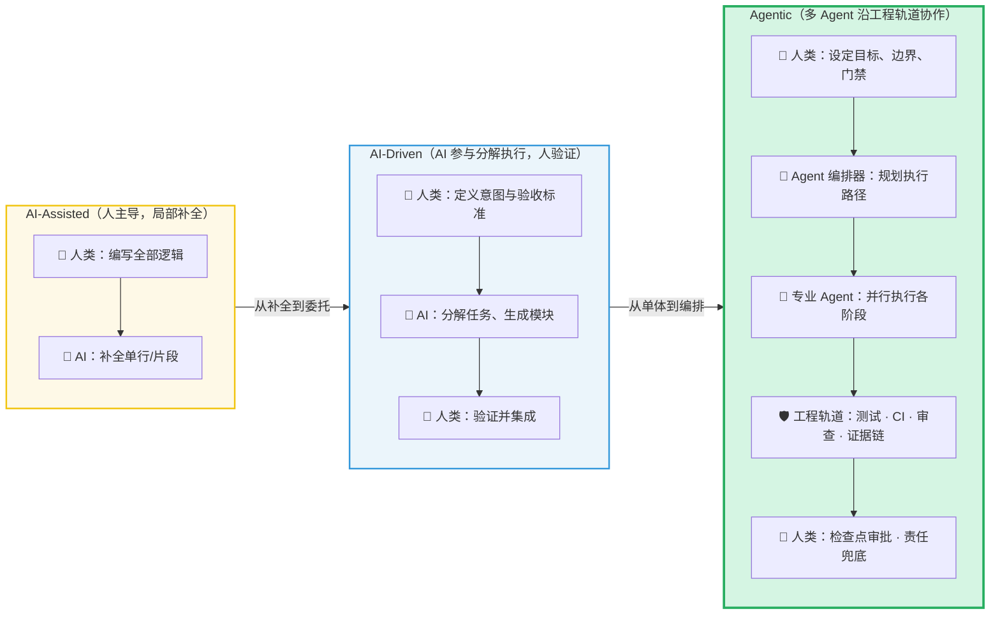

### 2.1.1 AI-Assisted：人是主体，AI 是"高级自动补全"

这是大多数人最熟悉的模式。开发者写一行注释，Copilot 补全函数体；开发者敲一半变量名，IDE 弹出建议。[[重新认识AI|AI]] 在这个阶段的角色本质上是一个**更聪明的打字机**——它降低了"翻译"的体力成本，但决策权、验证权、集成权完全在人手中。

> [!tip] AI-Assisted 的天花板
> 这个范式的核心瓶颈在于：**它只能加速你已经想清楚的事情**。如果你对需求的理解有偏差，AI 会以更快的速度帮你写出错误的代码。速度快了，方向错了，结果更糟。

### 2.1.2 AI-Driven：AI 参与分解，但人负责验证

进入 AI-Driven 阶段，开发者不再逐行指挥，而是给出**高层意图**（比如"实现一个支持分页和过滤的 REST API"），让 LLM 自主完成任务分解、模块设计和代码生成。人的角色从"编写者"转变为**"验证者"和"集成者"**。

这个阶段的关键变化是：[[重新认识AI|AI]] 开始具备**任务分解能力**——它不再只是补全当前行，而是能把一个模糊的目标拆解成多个子任务并逐一执行。但问题也随之暴露：AI 的分解策略可能不是最优的，生成的代码可能满足字面要求但违反隐式约束（比如团队的编码规范、项目的架构约定），而**人必须逐一检查每一个产出**。

### 2.1.3 Agentic：多 Agent 沿工程轨道协作

第三个阶段——也是当前前沿探索的核心——是 Agentic 范式。在这个范式中，不再是单个 AI Agent 独自完成全部工作，而是**多个专业化 Agent 在工程化轨道上协作**：

- **规划 Agent** 负责将高层目标拆解为可执行的工程计划
- **编码 Agent** 负责按计划生成代码
- **测试 Agent** 负责编写和运行测试用例
- **审查 Agent** 负责对代码变更进行质量审查
- **编排器（Orchestrator）** 负责协调各 Agent 的工作流

> [!important] Agentic ≠ 无人值守
> Agentic 范式并不是把人从流程中移除，恰恰相反——**它要求人在更高的抽象层次上发挥更关键的作用**。人不再是代码的逐行编写者，而是系统的**目标定义者、边界设定者和最终责任承担者**。Agent 越自主，人对"方向正确性"和"不可委托判断"的要求就越高。
>
> 这正是 AI-DLC 框架要回答的问题：**在 Agent 自主性越来越强的时代，人应该如何重新定位自己的角色？**

## 2.2 核心公式：AI-DLC = Ɛ (人的判断 + AI 能力)

> [!important] AI-DLC 核心公式
> $$\text{AI-DLC} = \varepsilon \, (\text{人的判断} + \text{AI 能力}) = \text{Engineering with Exsecutio}$$
>
> 这个公式的每一个部分都不可省略：
>
> - **人的判断**：确定方向（做什么）、划定边界（不做什么）、定义验收标准（做到什么程度才算完）。这是不可替代的——[[重新认识AI|AI]] 不知道你的业务上下文、团队约束和长期技术愿景。
> - **AI 能力**：高速生成、任务分解、模式匹配、知识检索。这是放大器——它让人从"手动砌砖"跃迁到"设计蓝图后让机器施工"。
> - **Ɛ (Engineering / Exsecutio)**：工程化执行闭环。这是连接器——它把"人的判断"和"AI 能力"粘合为确定性交付。没有它，人的判断停留在脑中无法落地，AI 的能力沦为概率性的自说自话。
>
> **三者缺一：**
> - 只有人的判断和 AI 能力，没有 Ɛ，产出的是"看起来对但没经过验证的代码"
> - 只有 AI 能力和 Ɛ，没有人的判断，产出的是"高效执行了错误方向的系统"
> - 只有人的判断和 Ɛ，没有 AI 能力，产出的是"正确但永远赶不上工期的传统交付"

## 2.3 为什么概率智能必须通过"工程轨道"转化

理解了核心公式，问题就变成了：**为什么不能让 AI 直接交付，而必须引入工程化闭环？**

答案藏在 LLM 的本质里。大语言模型是通过海量文本训练得到的概率模型，它的每一个输出都是"基于统计相关性的最佳猜测"。这意味着：

1. **它可能自信地说错话**（Hallucination）——语法完美、逻辑自洽、但事实错误
2. **它的输出不具备单调改进性**——修复一个 bug 可能引入另一个 bug
3. **它缺乏全局一致性保障**——多次独立生成的代码片段之间可能存在隐式冲突
4. **它没有"完成"的内在判断力**——AI 不知道自己什么时候真正完成了任务

> [!failure] AI 的"完成"≠ 工程意义上的"完成"
> 当 AI 说"已经完成了"，它的真实含义是"我生成了一段在统计意义上与你的需求描述最匹配的代码"。这与工程意义上的"完成"——**通过了所有测试、满足了所有验收标准、没有引入回归缺陷、代码可追溯可回滚**——之间存在巨大的鸿沟。
>
> **工程轨道（事实源、阶段门禁、证据链）存在的意义，就是填平这个鸿沟。**

所谓"工程轨道"包含三个核心要素：

- **事实源（Source of Truth）**：代码仓库、测试套件、CI/CD 流水线——这些是客观的、可执行的、不依赖 AI 自我评估的验证手段
- **阶段门禁（Stage Gates）**：每个阶段的进入和退出条件必须是可度量的——不是"AI 说完成了"，而是"所有测试通过且覆盖率不降低"
- **证据链（Evidence Chain）**：每一次 AI 生成、每一次人工决策、每一次测试结果都必须可追溯——当问题出现时，你能精确地定位是哪一步、哪个决策出了问题

---

# 3. 人的重塑：成为"裁判"与"门禁设计者"

## 3.1 告别"逐步提示"：从 Prompting 到 Propose-Validate

在 AI-Assisted 时代，开发者与 AI 的交互模式是**逐步提示（Prompting）**——人一步步描述需求，AI 一步步生成代码，人再一步步检查和修正。这个模式在 AI 只能做单行补全时是合理的，但在 Agentic 时代，它已经变成了一种**反模式**。

> [!warning] 逐步提示的反模式
> 当你能把一个复杂任务拆解为精确到每一步的指令时，你实际上已经完成了最难的部分——**设计和决策**。你让 AI 做的只是把你的决策翻译成代码，这等于退化回了 AI-Assisted 范式。你没有利用 AI 的任务分解能力，也没有获得 Agent 协作的杠杆效应。
>
> 更危险的是，逐步提示会让你产生一种**虚假的掌控感**——你以为自己在"控制"AI，实际上你只是在用更多的人工劳动替代 AI 本应承担的规划工作。这与 AI 时代的效率提升目标完全背道而驰。

正确的模式是**反向对话（AI Proposes, Human Validates）**：

1. **人定义意图和验收标准**（What & Done Criteria）
2. **AI 提出执行方案**（How & Plan）
3. **人审批方案或给出修正方向**（Gate & Redirect）
4. **AI 在工程轨道上执行**（Execute on Track）
5. **人基于证据做最终裁决**（Verify & Decide）

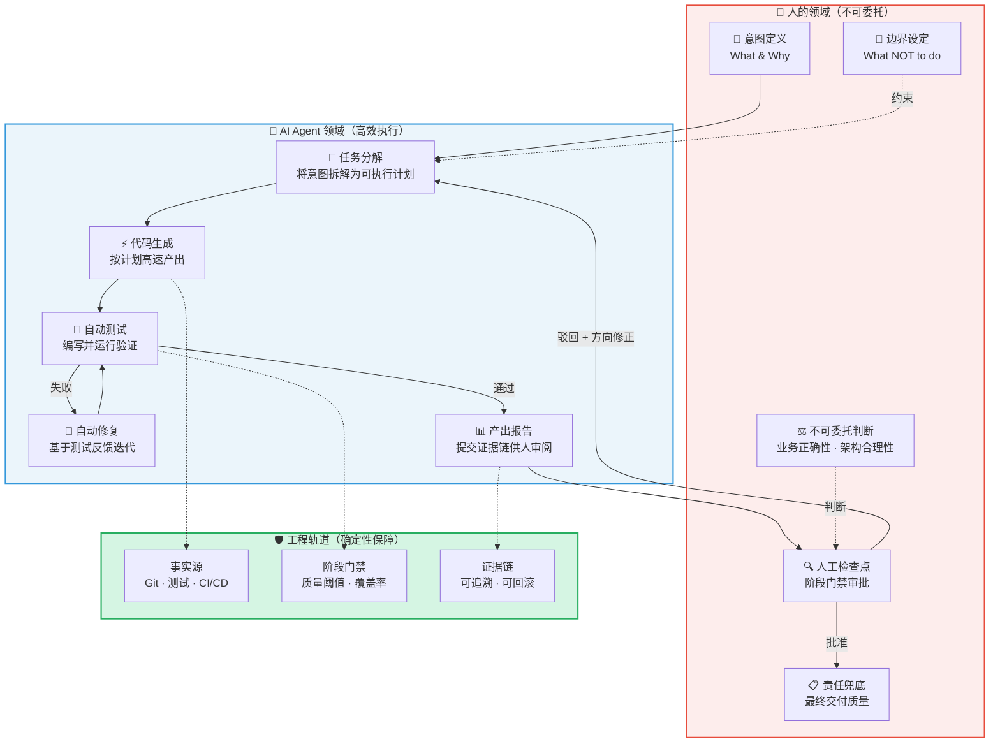

## 3.2 人的判断五件套

在 AI-DLC 框架中，人的角色被重新定义为五个不可委托的维度。它们共同构成了人在 AI 时代的"操作系统"：

### 3.2.1 意图（Intent）—— 指明目的地

> [!important] 意图 ≠ 需求文档
> 意图不是把 PRD（需求分析文档） 原文丢给 AI。意图是**你对"为什么要做这件事"的深层理解**——它的业务价值是什么？它服务于哪些用户场景？它的成功标准是什么？
>
> AI 能把"实现一个登录页面"执行得非常漂亮，但它无法告诉你"这个产品到底需不需要登录功能"。**方向错了，执行力越强，离正确结果越远。**

### 3.2.2 边界（Boundary）—— 划定不可逾越的红线

边界是"不做什么"的明确定义。它比"做什么"更重要，因为 AI 的本能是"尽可能多地生成"——你不告诉它停在哪里，它就会一直向外扩展。

- **技术边界**：不要引入新的外部依赖、不要改变现有的 API 契约、不要触碰核心支付模块
- **架构边界**：新增功能必须放在 `features/` 目录下、必须通过 Repository Pattern 访问数据层、不得在 Controller 中写业务逻辑
- **质量边界**：测试覆盖率不得低于当前基线、不能引入 any 类型、不能降低 CI/CD 流水线的通过率

### 3.2.3 不可委托判断（Non-delegable Judgment）—— AI 永远替你做不了的决定

有些判断，本质上只能由人来做：

- **业务正确性判断**：这段代码虽然语法正确、测试通过，但它对业务的理解是否准确？
- **架构合理性判断**：AI 提出的方案虽然能工作，但它是否符合系统的长期演进方向？
- **风险评估判断**：这个改动涉及支付模块，即使测试全绿，上线策略应该是什么？
- **取舍决策**：性能优化和开发效率之间如何权衡？短期方案和长期方案如何选择？

> [!tip] 判断的不可委托性
> 不可委托判断的本质是：**这些决策的后果由人承担，因此必须由人做出**。AI 可以提供决策所需的信息（分析、对比、预测），但最终拍板的那一瞬间，必须是人类的指纹。
>
> 这不是对 AI 的不信任，而是对**责任与权力对等**这一工程原则的坚守。

### 3.2.4 人工检查点（Human Checkpoint）—— 用门禁锁死漂移

人工检查点是工程化流程中的"阶段门禁"——在 AI 完成一个阶段性工作后，必须经过人的审批才能进入下一阶段。它的核心作用是**防止 AI 的输出在无人监督下持续漂移**。

典型的检查点设计：

| 检查点 | 触发条件 | 验证内容 | 决策选项 |
|:------:|:--------:|:--------:|:--------:|
| 计划审批 | AI 完成任务分解 | 方案合理性、边界合规性 | 批准 / 修正方向 / 重新分解 |
| 代码审查 | AI 完成编码 | 代码质量、架构一致性 | 批准合并 / 要求修改 / 驳回重做 |
| 集成验证 | 测试通过后 | 端到端行为、回归风险 | 准入测试 / 要求补充测试 |
| 上线决策 | 集成测试通过 | 业务验收、风险评估 | 灰度发布 / 全量发布 / 回退 |

### 3.2.5 责任（Accountability）—— 兜底者的清醒

> [!important] 责任不可委托
> 在 AI 写了 90% 代码的项目中，**对最终交付质量负 100% 责任的仍然是人类开发者**。这不是一个法律条文，而是一个工程事实：当线上出了事故，用户的愤怒指向的是产品和团队，不是写代码的模型版本号。
>
> 这意味着你必须对 AI 生成的每一行代码保持**最终裁决权**——不是每一行都亲自审查，而是确保有工程化的机制（测试、审查、门禁）来保障你能在需要时做出正确的判断。

---

# 4. 工程化执行（Exsecutio）：用闭环锁死不确定性

## 4.1 执行不是"让 AI 持续生成"

许多人对 AI 编码的理解停留在一个危险的简化上：**"给 AI 一个需求，让它一直写，写完就完事了。"** 这种模式在 Vibe Coding 的娱乐场景下或许可以接受，但在工程交付中，它是一种灾难性的反模式。

> [!failure] "一直生成"模式的致命缺陷
> 1. **没有验证的生成是随机噪声**——AI 生成了一百行代码，其中九十五行正确、五行有微妙的逻辑错误。如果你不在每一步都验证，最终你面对的是一个"整体看起来对但有五个隐蔽 bug"的代码库。
> 2. **没有修复闭环的验证是无效反馈**——测试告诉你"第 47 行断言失败"，但如果没有机制把这个反馈喂回给 AI 并要求它修复，测试结果就是一堆无用的红色日志。
> 3. **没有证据链的交付是不可追溯的黑盒**——三天后发现线上有 bug，你想定位"这段代码是哪个 AI 在什么上下文下生成的"，却发现没有任何记录。

**Exsecutio（拉丁语，意为"贯彻执行"）** 就是为了解决这个问题而设计的。它不是一个复杂的方法论，而是一个朴素但严格的**五步闭环**：

## 4.2 Exsecutio 的五步闭环

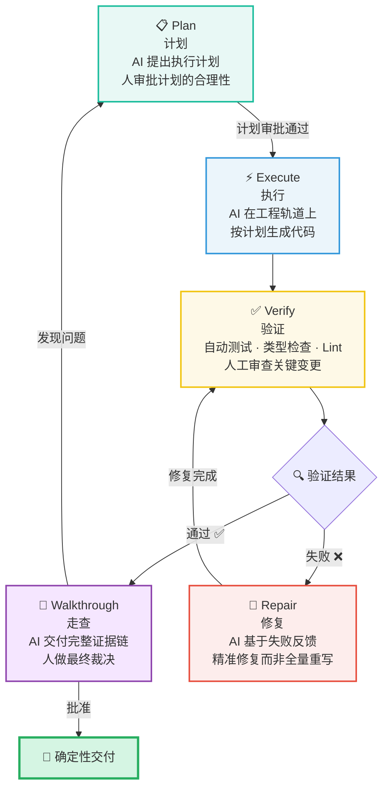

### 4.2.1 Plan（计划）—— 先想清楚再动手

AI 接收到人的意图和边界后，首先输出的不是代码，而是一份**可审查的执行计划**：

- 要修改哪些文件？每个文件的修改策略是什么？
- 需要新增哪些测试？测试策略如何设计？
- 是否有潜在的风险点？对应的缓解措施是什么？
- 预计的执行步骤和时间线是什么？

> [!tip] 计划是人类的第一个门禁
> 这一步的核心价值不在于计划本身有多精确，而在于它**强制 AI 在动手之前先暴露思路**。人类可以在代码生成之前就发现方向性错误——修正一份计划的成本是五分钟，修正一堆错误代码的成本可能是五小时。

### 4.2.2 Execute（执行）—— 在轨道上高速推进

计划审批通过后，AI 进入执行阶段。但这不是"自由生成"——执行必须在预设的工程轨道上进行：

- **代码必须通过 Lint 和类型检查**——这是最基本的确定性保障
- **每次变更都必须产生可 diff 的 commit**——保证可追溯性
- **禁止 AI 一次性修改超过计划范围的文件**——防止"顺手牵羊"式的附带修改

### 4.2.3 Verify（验证）—— 测试失败是燃料，不是噪音

验证阶段的核心理念是：**测试失败不是错误，它是提高准确率的燃料**。

每一次测试失败都在告诉你一个精确的事实："这段代码在这个条件下产生了错误的行为。"这个信息比 AI 自己的任何"检查"都更有价值，因为它是**客观的、可执行的、不含幻觉的**。

验证包含三个层次：

|    层次     |            手段             |      判断标准       |
| :-------: | :-----------------------: | :-------------: |
| **自动化验证** | 单元测试 · 集成测试 · 类型检查 · Lint |  所有检查通过，覆盖率不降低  |
| **结构验证**  |       架构约束检查 · 依赖分析       | 未引入禁止的依赖关系或架构违规 |
| **人工验证**  |     关键变更的 Code Review     |  符合业务意图，无隐式风险   |

### 4.2.4 Repair（修复）—— 精准修复而非全量重写

当验证发现失败时，AI 进入修复阶段。这里有一个至关重要的原则：

> [!warning] 修复 ≠ 重写
> 修复是指"基于具体的失败信息，对现有代码做最小化修改以消除缺陷"。它**不是**"删掉之前生成的代码，从头再生成一遍"。
>
> 全量重写的风险在于：它可能修复了当前的 bug，但同时引入了全新的、未被测试覆盖的问题。这种"修复-引入-修复"的死循环是 AI 编码中最常见的效率黑洞。
>
> 正确的做法是：**把测试失败的具体信息（错误消息、断言差异、堆栈追踪）作为精确上下文喂给 AI，让它定位并修复特定的缺陷点**。这比"这段代码有问题，请重新写"要精确一百倍。

### 4.2.5 Walkthrough（走查）—— 没有证据的"完成"是幻觉

Walkthrough 是 Exsecutio 闭环的最后一步，也是最容易被跳过的一步。它的本质是：**AI 向人呈现一份完整的证据链，人基于证据做出最终裁决**。

一份合格的 Walkthrough 应该包含：

- **变更摘要**：修改了哪些文件，每个文件的修改目的是什么
- **测试结果**：完整的测试运行日志，包括新增测试和回归测试
- **风险说明**：这次变更可能影响的上下游模块，以及已采取的缓解措施
- **回滚方案**：如果上线后出现问题，如何快速回退

> [!important] Walkthrough 的哲学意义
> Walkthrough 的存在不只是为了"再检查一遍"。它的更深层意义是：**它强制 AI 将自己的"思考过程"外化为可审查的证据，从而让人能够基于事实而非信任来做决策**。
>
> 在没有 Walkthrough 的模式下，人对 AI 的信任是"盲信"——你只能选择相信或不相信它的"我完成了"。在有 Walkthrough 的模式下，人对 AI 的信任是"验证后的信任"——你可以看到它做了什么、为什么这么做、结果如何。**这是从概率信任到确定性信任的质变。**

## 4.3 闭环的闭合：Walkthrough 反馈回 Plan

Walkthrough 不一定意味着"通过"。如果人在走查过程中发现了 AI 未预见的问题，流程会回退到 Plan 阶段，重新进入闭环。这种**反馈-修正-再验证**的螺旋上升，是 Exsecutio 与"一直生成直到完成"模式的根本区别。

> [!tip] Exsecutio 的工程心法
> 1. **测试失败是提高准确率的燃料**——每一次失败都在缩小不确定性空间
> 2. **没有证据的"已完成"是 AI 的幻觉**——必须有可追溯的证据链
> 3. **修复不是重写**——精准修复，最小化变更范围
> 4. **人永远是最终裁决者**——AI 提供信息，人做判断
> 5. **闭环比开环贵，但比事故便宜一百倍**——前期多花十分钟做验证，后期少花十小时修 bug

---

# 5. 从意图到执行批次：Inception 分解链

## 5.1 为什么意图不能直接进入执行

在 AI-DLC 的完整链路里，人的意图不是直接丢给编码 Agent 的。书里在第 3 章提出了一个关键问题：**"为什么一个 Intent 不能直接让 AI 自主执行？"**

> [!question] Inception 的必要性
> 一个模糊的意图（比如"把这本书发布成一个可维护的 GitHub 系统"）直接交给 AI，得到的往往是一堆不可验证的"一次性大段落"——没有需求、没有验收标准、没有执行边界。**意图是方向，不是可执行的工程单元。**
>
> 书中给出的答案是 **Inception**：在动手之前，把 Intent 逐级分解为 Requirements → System Context → Units → Stories → Bolt Plan，让每一个层级都对应仓库中可验证的证据路径。**没有 Inception，执行越快，偏差越大。**

## 5.2 五级分解链：向下分解，向上追踪

Inception 的产物是一棵"追踪树"——每一层都可以向上回链到意图、向下追溯到执行批次：

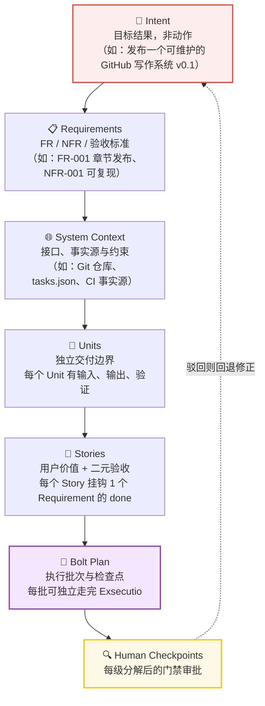

> [!tip] 向下分解 · 向上追踪
> 书的经验法则：**一个 Intent 通常产出 2 个 Unit、3~5 个 Story；每个 Story 必须挂钩一个 Requirement 的验收，且验收是二元的（done / not done）**。
>
> 追踪链的核心价值在于**避免"装饰性分解"**——每一层都必须对应仓库中真实的证据路径（如 `requirements.md`、`story-index.md`、`bolt.md`、`events.jsonl`）。不能追踪到证据的分解，只是看起来专业。

| 层级 | 回答的问题 | 证据落点 |
|:----:|:----------|:--------|
| **Intent** | 目标结果是什么？（非动作描述） | `memory-bank/intents/*/requirements.md` |
| **Requirements** | 功能与非功能验收标准是什么？ | FR / NFR / Acceptance |
| **System Context** | 接口、事实源、约束在哪里？ | 仓库结构、CI、任务状态文件 |
| **Units** | 哪些是独立的交付边界？ | `units.md` |
| **Stories** | 每个用户价值如何二元验收？ | `story-index.md` |
| **Bolt Plan** | 执行批次与检查点如何编排？ | `bolts/*/bolt.md` |

## 5.3 Memory Bank & Standards：AI 的跨会话记忆系统

Inception 解决了"这一轮怎么做"，但 AI 还有一个更隐蔽的问题：**每次会话都是冷启动**。

> [!warning] 冷启动陷阱
> 书中的实验（EXP-04-01）给出了一个扎心的对比：**有 Memory Bank 的 Agent 上下文恢复率 100%、首动作零错误、无需澄清问题；没有 Memory Bank 的 Agent 上下文恢复率 0%，第一轮就问 3 个澄清问题。**
>
> AI 没有"上个月我们讨论过"的记忆——它每次都在"失忆地重新开始"。Memory Bank 就是给 AI 装上**跨会话的长期记忆**。

Memory Bank 不是"资源池"也不是"垃圾场"，它是**决策层**——让下一个会话从"事实源"恢复，而不是从零推理。它由五要素构成：

| 要素 | 内容 | 示例 |
|:----:|:-----|:-----|
| **Current State** | 当前进行中 / 已完成 / 已阻塞的任务状态 | `tasks.json`、`current.json`、`cycles.json` |
| **Intent & Scope** | 目标与边界（含"不做什么"） | `requirements.md`、`story-index.md` |
| **Standards** | 术语、风格、门禁（DoD） | `coding-standards.md`、`tech-stack.md` |
| **Evidence Links** | 证据索引：events、reviews、snapshots | `events.jsonl`、`planning/reviews/` |
| **Update Protocol** | 如何执行并写回事实源 | `validate_project.py`、`ci_check.py` |

它的运作方式是"恢复栈"——每个新会话都从事实源恢复，而不是从零开始：

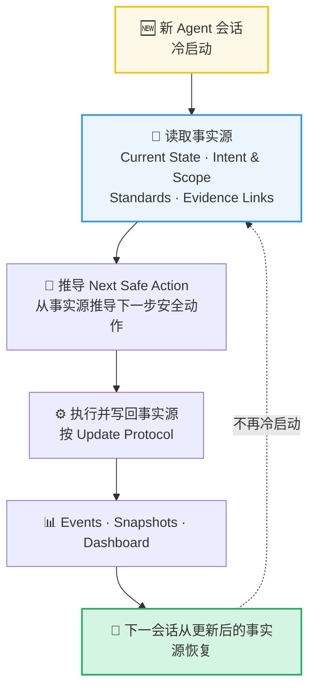

> [!note] Standards：把"团队默认值"固化为 AI 的行为约束
> 如果说 Memory Bank 是记忆，Standards 就是**行为准则**：技术栈、编码规范、术语表、门禁（Definition of Done）。书里的立场很明确：**AI 越自主，Standards 越必须显式化**——不能指望模型"自觉"遵守团队的隐式约定。团队约定一旦只在人脑中，AI 每轮都会以不同的方式"猜"它。

## 5.4 Bolt：执行批次与轨道选择

分解完成后，Stories 被组织成 **Bolt（执行批次）**。Bolt 既不是普通任务，也不是 Sprint：

> [!compare] Bolt vs 任务 vs Sprint
> | 维度 | 任务 | Sprint | Bolt |
> |:----:|:----:|:------:|:----:|
> | 描述方式 | 只说"做什么" | 固定周期 | 最小完成证据 |
> | 边界 | 模糊 | 时间盒 | 一个或多个 Story 的明确范围 |
> | 完成标准 | 人说了算 | 周期结束 | 四种证据齐备 |
> | 门禁 | 无 | 计划会 / 回顾会 | 由人审批的 Gates |

Bolt 有四个必备要素：**Scope（范围）**、**Type（轨道类型）**、**Gates（人审批的门禁）**、**Evidence（完成证据）**。其中每个 Bolt 都必须沿一条"轨道"执行——Simple 或 DDD：

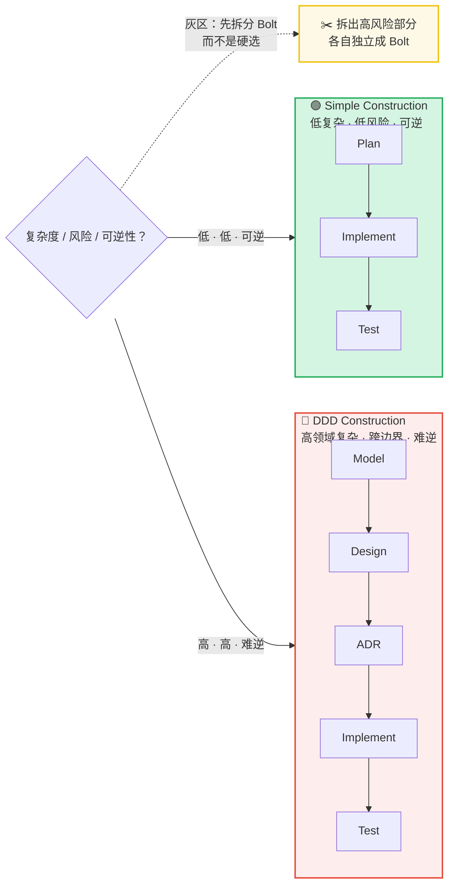

> [!important] 灰区先拆分，而不是硬选
> 书中的 Bolt 选择矩阵给出的不是"二选一"，而是一条决策规则：**低复杂、低风险、可逆 → Simple；高领域复杂、跨边界、难逆 → DDD；不确定时，先拆出高风险的部分，而不是硬选一条轨道。**
>
> 轨道不是惩罚，而是**与风险匹配的仪式**——Simple 省掉的每个步骤，都是 DDD 在同等风险下不敢省的。把一个"可逆的小改动"塞进 DDD 是仪式过剩；把一个"跨支付模块的核心变更"塞进 Simple 则是玩火。

---

# 6. 验证与运行：从证据链到持续运营

## 6.1 分层验证证据链：验证不是单一动作

现在把视角拉回第 4 章的 Exsecutio。书中对 Verify 这一步做了更精细的拆解：**验证不是 pass/fail，而是一条四层证据链**：

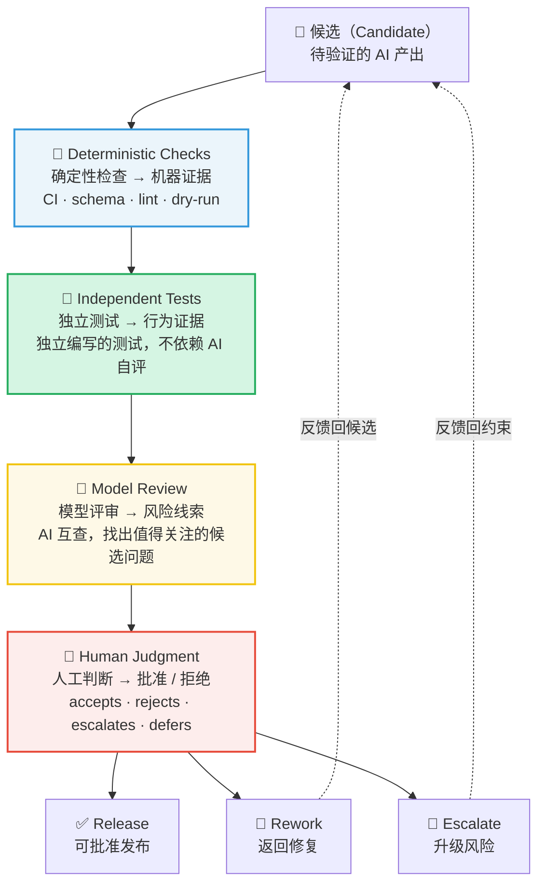

> [!important] Model Review 与 Human Judgment 的分工
> 书中用一句话定义了二者的边界：**Model Review finds candidates for concern. Human Judgment accepts, rejects, escalates, or defers them.**（模型评审找出值得关注的候选，人工判断负责接受、拒绝、升级或推迟。）
>
> 模型评审（包括 AI 互查）只是"找出候选问题"——它**服务而不替人盖章**。最终裁决权始终在人的手上。这与第 3 章"不可委托判断"完全同构：**机器提供风险线索，人承担决策后果。**

## 6.2 Verification Strength：按风险选择验证强度

书里没有要求"所有变更都用同一套重型验证"，而是给出一个按风险分级的验证强度表：

| 风险等级 | 典型场景 | 最低验证组合 |
|:------:|:--------|:------------|
| **Low** | 简单 Markdown / 状态更新 | 检查 + 快速浏览 |
| **Medium** | 流程 / 生成脚本 | 检查 + 独立测试 / 快照 |
| **High** | 数据 / 状态复杂 | 全流程测试 + 领域专家审查 / Runbook |
| **Critical** | 不可逆决策 | 独立测试 + 审查 + 明确的人工批准 |

> [!tip] 验证强度的经济学
> 验证强度应该与**复杂度、可逆性、安全影响、数据/状态**匹配：改一个说明文档不需要全量 CI；改支付流程的核心路径，每一层证据都不可省。**"验证过度"和"验证不足"一样是工程债**——前者烧时间，后者烧事故。

## 6.3 Operations 运行闭环：交付不是终点

Exsecutio 结束于"候选被批准"——但软件的生命在于运行。书的第 8 章提出一个关键区分：

> [!question] CH-07 Verify vs CH-08 Operations
> - **CH-07 Verify**：Should this candidate be approved?（这个候选该不该批准？）
> - **CH-08 Operations**：Can this approved candidate run, be observed, and be recovered?（这个被批准的候选能运行、能被观测、能被恢复吗？）
>
> CI 全绿只是"候选合格"，**不等于"线上稳定"**。从交付到运行，还有一整条闭环。

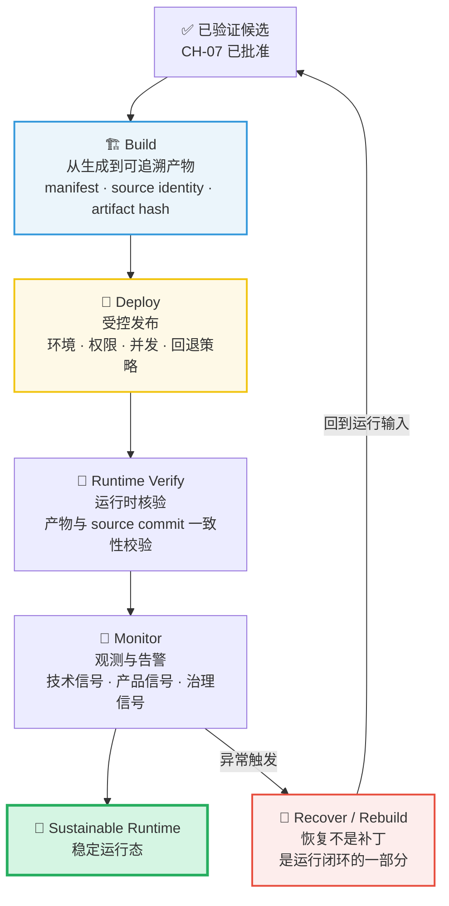

> [!danger] 没有 Recover 的交付是"信仰型交付"
> 书里的 Operations 模式把 **Recover 内建进运行闭环**：每个 Runbook 必须回答六个问题——**Trigger**（什么触发恢复）、**Owner**（谁负责）、**Scope**（影响范围）、**Steps**（怎么恢复）、**Verification**（怎么确认恢复完成）、**Communication**（怎么同步干系人）。
>
> 没有 Runbook 的"回滚方案"，在事故现场往往只是三行没有人敢执行的注释。**Build 的可追溯性（manifest 与 source identity）是 Recover 的前提**——你无法恢复一个说不清来源的产物。

---

# 7. 从方法论到运行时：工业级 Agent 的工程底座

前面 6 章解决的是 **“AI 时代应该如何交付”**：人的判断如何进入流程，意图如何被拆成可执行轨道，候选产物如何用证据链验证，运行状态如何被持续观测和恢复。

从这一章开始，视角下沉到代码层面：**这些方法论最终必须体现为 Agent 运行时的具体结构**。一个工业级 Agent 不是“一个 LLM 调用 + 一串工具”，而是由工具边界、结构化解析、状态机、检查点、断路器、降级策略和 Trace 系统共同支撑的工程系统。


## 7.1 为什么 50 行代码的 Demo 上线就崩？

> [!bug] 生产痛点：每个工程师都经历过的"Agent 骗局"
>
> 你花了一个下午，用 LangChain 写了 50 行代码，Agent 就能在 Notebook 里丝滑地查天气、调 API、生成报告。你心想：Agent 不过如此。然后你把它部署到生产环境——
>
> **第一周，它开始无限循环。** 用户问了一个它没见过的工具名，它反复尝试调用同一个不存在的函数，直到超时。
>
> **第二周，它开始失忆。** 用户在第 5 轮对话里提到了关键参数，Agent 在第 7 轮已经忘了——因为上下文窗口被前几轮的工具调用结果塞满了。
>
> **第三周，它开始制造幻觉。** 外部 API 返回了一个 500 错误，Agent 没有识别出这是"系统故障"，而是编造了一个看起来合理的假数据，自信地返回给了用户。
>
> **第四周，你开始怀疑人生。**

这不是你的代码写得不好。这是 **"Demo 型 Agent"和"工业级 Agent"之间的本质差异**——就像在澡盆里划纸船和横渡大西洋的区别。两者都在水上漂，但面对的风浪完全不在一个量级。

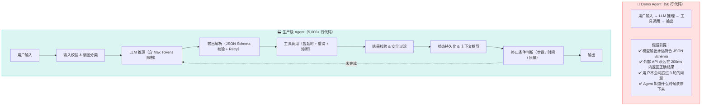

## 7.2 工业级 Agent 的三大核心特征

> [!important] 架构重点
>
> 把 Agent 从 Demo 推向生产，不是给它加更多工具或者换更强的模型——而是从三个根本维度重新构建它：

| 特征 | Demo 中的状态 | 工业级要求 | 对应工程手段 |
| :--- | :--- | :--- | :--- |
| **确定性兜底** | 信任模型输出 | 每一步都要校验，每个结果都要有 Fallback | JSON Schema 校验、重试机制、降级策略 |
| **可观测性** | `print(response)` | 每一步推理、每一次工具调用、每一次状态变更都要可追溯 | 结构化日志、Trace ID、决策轨迹记录 |
| **状态持久化** | 内存中的对话历史 | 任意时刻崩溃后能从断点恢复，上下文能跨会话延续 | 状态机 + 持久化存储 + 检查点机制 |

> [!quote] 核心观点
> **工业级 Agent 的本质不是"更聪明的模型"，而是"更稳健的工程"。** 如果说 [[提示词工程|提示词工程]] 给 Agent 装上了大脑，[[上下文工程|上下文工程]] 给它配备了外部记忆——那么本文要讨论的，就是如何给这个"大脑+记忆"的组合体装上骨骼、神经和免疫系统。

## 7.3 本文的知识定位

在之前的学习体系中：
- [[提示词工程]] 定义了 Agent 的**思考规范**
- [[上下文工程]] 构建了 Agent 的**外部连接**（通过 RAG 和 MCP）
- [[循环工程]] 建立了 Agent 的**质量保障**（Eval + 数据飞轮 + CI/CD）

本文要解决的是"最后一公里"问题：**如何将这些理论转化为能抗住线上压力的代码。** 我们讨论的不是"Agent 应该做什么"，而是"Agent 的代码应该怎么写"——包括那些教程里不会告诉你的 `try-catch`、`timeout`、`retry` 和 `circuit-breaker`。

---

# 8. 动作空间与工具调用实战

## 8.1 API 设计防雷：为 Agent 设计高容错接口

### 8.1.1 工具定义的基本原则

> [!warning] 工程避坑：API 设计不是给人看的，是给模型"猜"的
>
> 你在设计 REST API 时，面对的是会读文档、会理解上下文的人类开发者。但 Agent 的工具调用，面对的是一个**基于概率预测下一个 Token 的语言模型**。它不会"仔细阅读"你的参数描述——它只是在统计意义上推断最可能的参数组合。

这意味着工具定义的每一条信息，都在直接影响模型的参数生成质量。以下原则每一句都是用线上事故换来的：

```python
"""
工具定义的四条铁律——每一条背后都是线上血泪教训。
"""
from typing import Any

# ❌ 反例：为"人类开发者"设计的工具定义
BAD_TOOL_DEFINITION = {
    "name": "search",
    "description": "搜索内部知识库",
    "parameters": {
        "query": "检索关键词",
        "filters": "高级过滤条件，支持复杂 DSL 语法（详见内部文档）"
    }
}
# → 模型会怎么填 filters？它不知道 DSL 语法，只能瞎编。
# → 结果：85% 的工具调用因为 filters 参数格式错误而失败。

# ✅ 正例：为"概率模型"设计的工具定义
GOOD_TOOL_DEFINITION = {
    "name": "search_knowledge_base",
    "description": "在内部知识库中搜索文档。使用场景：用户询问产品文档、API 用法、或内部规范时调用。",
    "inputSchema": {
        "type": "object",
        "properties": {
            "query": {
                "type": "string",
                "description": "自然语言搜索关键词。不要使用特殊语法，直接写你想搜索的内容。例如：'Kubernetes Pod 重启策略'"
            },
            "document_type": {
                "type": "string",
                "enum": ["api_doc", "design_doc", "runbook", "all"],
                "description": "要搜索的文档类型。不确定时使用 'all'。"
            },
            "max_results": {
                "type": "integer",
                "minimum": 1,
                "maximum": 10,
                "default": 5,
                "description": "返回的最大结果数。默认 5 条，通常足够。"
            }
        },
        "required": ["query"]
    }
}
# → 每个参数都有具体示例和默认值。
# → 复杂类型（enum）限制了模型的"想象空间"。
# → 参数之间的语义独立，减少模型的组合困惑。
```

### 8.1.2 五个关键设计原则

> [!tip] 最佳实践：Agent 工具 API 设计的五条铁律

**① 参数扁平化**

```
❌ 深层嵌套：
{
  "user": {
    "profile": {
      "contact": { "email": "...", "phone": "..." }
    }
  }
}

✅ 扁平化 + 语义前缀：
{
  "user_email": "...",
  "user_phone": "...",
  "user_department": "..."
}
```

模型的 JSON 生成能力与嵌套深度成反比。每多一层嵌套，参数错误的概率增加 15-20%。**把嵌套结构拍平，即使这意味着多几个顶层参数。**

**② 提供默认值，减少模型决策负担**

```
❌ 所有参数必填：
"required": ["query", "sort_by", "sort_order", "page", "page_size"]

✅ 只把核心参数设为必填：
"required": ["query"]
"sort_by": { "default": "relevance" }
"page": { "default": 1 }
"page_size": { "default": 10 }
```

模型不是决策引擎——每多一个必须选择的参数，就多一个可能出错的分支。**默认值直接消除决策分支。**

**③ 错误信息必须"可被模型理解"**

> [!important] 架构重点：这就是"让 Agent 知错能改"的关键

```python
"""
错误响应的设计直接决定了 Agent 能否自动修复错误。
把错误信息当作"写给另一个模型看的提示词"来设计。
"""

# ❌ 人类友好的错误信息（Agent 看不懂）
BAD_ERROR = {
    "error": "Query failed",
    "code": "E1005",
    "details": "The upstream service returned an unexpected status code"
}
# → Agent 看到了 "Query failed"，下一步会怎么做？
# → 它可能重试同一个查询，可能放弃，可能编造结果——完全随机。

# ✅ 模型友好的错误信息（Agent 能据此调整行为）
GOOD_ERROR = {
    "error": "搜索超时：知识库在当前负载下无法在 5 秒内返回结果。",
    "error_type": "TIMEOUT",
    "suggested_action": "请缩小搜索范围（使用更具体的关键词），或将 document_type 限定为单一类型后重试。",
    "recoverable": True,
    "retry_after_seconds": 3
}
# → Agent 看到了明确的失败原因 + 建议的修复方案。
# → 它可以按建议重新构造查询参数后重试。
```

**④ 引入幂等性设计**

对于写操作（创建文件、发送消息、修改配置），必须支持幂等性。Agent 可能因为网络超时不确定操作是否成功，并尝试重试——如果操作不幂等，就会产生重复的副作用。

```python
"""
幂等性设计：通过 client_token 保证操作不会重复执行。
"""
def create_issue(title: str, description: str, client_token: str | None = None) -> dict:
    """
    创建一个 Issue。

    Args:
        client_token: 客户端生成的唯一幂等键。如果提供了此参数，服务端会去重——
                      同一个 client_token 的重复请求不会创建新的 Issue。
                      建议使用 Agent 的 turn_id + action_index 组合生成。
    """
    if client_token and existing := find_by_client_token(client_token):
        return existing  # 幂等返回
    return do_create(title, description, client_token)
```

**⑤ 参数命名遵循"自然语言直觉"**

```
❌ 技术性命名：
"fn_name": "doc_srch_qry"

✅ 自然语言命名：
"function_name": "search_documents"
```

模型在预训练语料中见过无数次 `search_documents` 这类自然语言表达，但 `doc_srch_qry` 对它来说是陌生的编码——它会困惑，困惑就会出错。

### 8.1.3 工具描述的上下文经济学

> [!tip] 最佳实践
>
> 工具定义会被注入到每一次 LLM 调用的 System Prompt 中。如果你的 Agent 有 20 个工具，每个工具的定义平均 300 tokens——光工具定义就要吃掉 6,000 tokens。这直接挤占了推理和对话历史的宝贵空间。
>
> **工具定义的 Token 预算应控制在 System Prompt 总量的 20-30% 以内。** 超出这个比例，模型倾向于"为了用工具而用工具"，而非"为了解决问题而用工具"。精简工具描述同样是 [[上下文工程#2.3 上下文窗口的"经济学"精简 Prompt 的艺术|上下文窗口经济学]] 的重要实践。

## 8.2 结构化输出的校验与解析

### 8.2.1 永远不要信任模型的 JSON 输出

> [!bug] 生产痛点
> 模型输出的 JSON 可能被 Markdown 代码块包裹，可能包含尾逗号，可能有注释，可能字段类型不对，可能缺少 required 字段，可能 key 拼错——**而你下游的代码期待的是一个完美的 `dict`。**

```python
"""
工业级 JSON 解析器的完整实现——处理模型输出的所有"惊喜"。
"""
import json
import re
from dataclasses import dataclass
from typing import Any, Optional


@dataclass
class ParseResult:
    """解析结果"""
    success: bool
    data: Optional[dict[str, Any]] = None
    error: Optional[str] = None
    raw_output: Optional[str] = None
    retries_attempted: int = 0


class RobustJSONParser:
    """
    鲁棒的 JSON 解析器，专门处理 LLM 输出的各种格式问题。

    设计理念：不是你期望模型输出符合规范——而是假设它一定会有问题，
    然后一层层修复。每多一层修复，上线后的凌晨告警就少一条。
    """

    # 第一层：Markdown 代码块模式
    MARKDOWN_JSON_PATTERNS = [
        re.compile(r'```json\s*([\s\S]*?)```'),
        re.compile(r'```\s*([\s\S]*?)```'),
        re.compile(r'\{[\s\S]*\}'),  # 兜底：提取任何看起来像 JSON 对象的内容
    ]

    # 第二层：常见格式错误修正
    @staticmethod
    def fix_trailing_commas(json_str: str) -> str:
        """移除尾逗号：{"a": 1,} → {"a": 1}"""
        return re.sub(r',\s*([}\]])', r'\1', json_str)

    @staticmethod
    def strip_comments(json_str: str) -> str:
        """移除 JSON 中的注释（// 和 /* */）"""
        # 移除单行注释
        json_str = re.sub(r'//.*?$', '', json_str, flags=re.MULTILINE)
        # 移除多行注释
        json_str = re.sub(r'/\*[\s\S]*?\*/', '', json_str)
        return json_str

    @staticmethod
    def fix_unquoted_keys(json_str: str) -> str:
        """修复未加引号的 key：{name: "value"} → {"name": "value"}"""
        return re.sub(r'([{,])\s*([a-zA-Z_][a-zA-Z0-9_]*)\s*:',
                      r'\1 "\2":', json_str)

    def parse(self, raw_output: str, schema: Optional[dict] = None) -> ParseResult:
        """
        解析模型输出的 JSON，经过多层修复和最终 Schema 校验。

        Args:
            raw_output: 模型的原始文本输出
            schema: 可选的 JSON Schema 用于最终校验

        Returns:
            ParseResult: 解析结果（成功/失败 + 数据）
        """
        # Step 1: 提取 JSON 内容（处理 Markdown 代码块包裹）
        json_str = self._extract_json(raw_output)
        if not json_str:
            return ParseResult(
                success=False,
                error="输出中未找到可解析的 JSON 内容",
                raw_output=raw_output
            )

        # Step 2: 逐层修复
        fixes = [
            ("移除尾逗号", self.fix_trailing_commas),
            ("移除注释", self.strip_comments),
            ("修复未引用 key", self.fix_unquoted_keys),
        ]

        for fix_name, fix_fn in fixes:
            try:
                data = json.loads(json_str)
                break  # 解析成功，跳出循环
            except json.JSONDecodeError:
                json_str = fix_fn(json_str)
        else:
            # 所有修复都尝试过了，仍失败
            return ParseResult(
                success=False,
                error=f"JSON 解析失败（已尝试 {len(fixes)} 种修复）",
                raw_output=raw_output
            )

        # Step 3: JSON Schema 校验
        if schema:
            errors = self._validate_schema(data, schema)
            if errors:
                return ParseResult(
                    success=False,
                    error=f"Schema 校验失败: {errors}",
                    data=data,
                    raw_output=raw_output
                )

        return ParseResult(success=True, data=data, raw_output=raw_output)

    def _extract_json(self, text: str) -> Optional[str]:
        """从文本中提取 JSON 内容（处理 Markdown 代码块）"""
        for pattern in self.MARKDOWN_JSON_PATTERNS:
            match = pattern.search(text)
            if match:
                return match.group(1) if match.lastindex else match.group(0)
        return None

    def _validate_schema(self, data: dict, schema: dict) -> list[str]:
        """校验 JSON 数据是否符合 Schema（简化实现）"""
        errors = []
        # 检查 required 字段
        for field in schema.get("required", []):
            if field not in data:
                errors.append(f"缺少必需字段 '{field}'")
        return errors
```

### 8.2.2 Retry 机制：解析失败时如何引导模型修正

> [!important] 架构重点：Retry 不是简单的"再试一次"
>
> 当 JSON 解析失败时，直接让模型重新生成通常是无用的——因为模型不知道它错在哪里。**Retry 的关键是把校验错误"翻译"成模型能理解的纠错指令。**

```python
"""
智能 Retry：不是盲目重试，而是将错误信息注入 Prompt，引导模型修正。
"""
from typing import Callable


class ToolCallRetryPolicy:
    """
    工具调用失败时的重试策略。

    核心思路：
    1. 第一次失败 → 将明确的错误信息注入回 Prompt（"Schema 校验失败：缺少 age 字段"）
    2. 第二次失败 → 给出更具体的格式指导（"请确保输出包含 {"name": "...", "age": ...}"）
    3. 第三次失败 → 降级处理（使用默认值 or 返回错误给用户）
    """

    MAX_RETRIES = 3

    @staticmethod
    def build_retry_prompt(
        original_output: str,
        parse_error: str,
        attempt: int,
        expected_schema: dict
    ) -> str:
        """
        根据失败原因和重试次数，构造不同级别的纠错提示。

        Args:
            original_output: 模型的原始输出
            parse_error: 解析失败的具体原因
            attempt: 当前是第几次重试（从 1 开始）
            expected_schema: 期望的输出格式
        """
        if attempt == 1:
            # 第一次重试：温和提醒
            return f"""你上一次的输出格式不正确。具体错误：{parse_error}

请严格按照以下 JSON Schema 重新输出：
{json.dumps(expected_schema, ensure_ascii=False, indent=2)}

注意：
- 不要将 JSON 包裹在 Markdown 代码块中
- 确保所有 required 字段都存在
- 不要使用尾逗号"""

        elif attempt == 2:
            # 第二次重试：给出模板
            return f"""你的输出格式仍然不正确。错误：{parse_error}

请直接复制以下模板并填充内容：
{json.dumps(ToolCallRetryPolicy._generate_template(expected_schema), ensure_ascii=False, indent=2)}

这次请严格按模板输出，不要添加任何额外内容。"""

        else:
            # 第三次重试：最后通牒
            return f"""这是最后一次机会。你的输出必须是一个纯 JSON 对象。

错误原因：{parse_error}

规则：
1. 只输出 JSON，不要有任何其他文字
2. 不要用 Markdown 代码块包裹
3. 不要有注释
4. 不要有尾逗号
"""

    @staticmethod
    def _generate_template(schema: dict) -> dict:
        """根据 JSON Schema 生成填空模板"""
        template = {}
        for prop_name, prop_def in schema.get("properties", {}).items():
            prop_type = prop_def.get("type", "string")
            if prop_type == "string":
                template[prop_name] = f"<在此填写 {prop_def.get('description', prop_name)}>"
            elif prop_type == "integer" or prop_type == "number":
                template[prop_name] = 0
            elif prop_type == "array":
                template[prop_name] = []
            elif prop_type == "object":
                template[prop_name] = {}
        return template
```

> [!warning] 工程避坑：Retry 的隐藏成本
>
> **① Token 膨胀**：每次重试都是完整的一次 LLM 调用 + 上一次的错误输出 + 纠错提示。三次重试的 Token 消耗可能是正常调用的 5-8 倍。**在设计预算时，按最坏情况（3 次重试）计算成本。**
>
> **② 延迟放大**：如果单次工具调用 + LLM 推理需要 2 秒，三次重试就是 6 秒——用户已经不耐烦关闭了。**对重试设置总超时，超过即触发降级。**
>
> **③ 重试的"传染性"**：Agent 的推理链是多步的。如果第 2 步重试了 3 次，消耗了大量 Token，第 3-5 步的可用上下文窗口就变小了，增加了后续步骤出错的可能性。**对每次调用的 Token 消耗设置独立上限。**

---

# 9. 状态管理与工作流 (State & Workflow)

## 9.1 从 ReAct 到状态机：为什么纯 Prompt 驱动的 Agent 不靠谱

### 9.1.1 ReAct 模式的工程缺陷

> [!info] 概念解析
> ReAct（Reasoning + Acting）是 Agent 最经典的模式：模型先推理需要做什么，然后调用工具，观察结果，再推理下一步。这种"让模型自主决定一切"的方式在 Demo 中看起来非常智能——但在生产环境中，它恰恰是所有混乱的根源。

```mermaid
flowchart TB
    subgraph ReAct["ReAct 模式：模型自主决策"]
        R1["用户: 帮我部署到生产环境"] --> R2["🤖 推理: 我需要先检查配置"]
        R2 --> R3["🤖 行动: 调用 read_config()"]
        R3 --> R4["🤖 观察: 配置文件正常"]
        R4 --> R5["🤖 推理: 我需要先跑测试"]
        R5 --> R6["🤖 行动: 调用 run_tests()"]
        R6 --> R7["🤖 观察: 测试通过"]
        R7 --> R8["🤖 推理: 我可以部署了"]
        R8 --> R9["🤖 行动: 调用 deploy()"]
        R9 --> R10["✅ 部署完成"]
    end

    subgraph Problems["🔴 纯 ReAct 的三大工程问题"]
        P1["① 行为不可预测：同一个任务，两次执行可能走完全不同的路径"]
        P2["② 状态分散：Agent 的"进度"散落在对话历史的自然语言中，无法被代码精确判断"]
        P3["③ 无法中断恢复：如果第 5 步失败，无法从第 5 步重试——只能从头开始"]
    end

    style Problems fill:#ff6b6b33,stroke:#ff6b6b
```

> [!bug] 生产痛点
> 一个真实的线上事故：Agent 的部署流程包含 7 个步骤。在某个周末凌晨，第 4 步（数据库迁移）因为锁冲突失败了。纯 ReAct Agent 的表现是：它"推理"出锁冲突需要重试，然后重试了一次——但重试间隔是 0 秒（它不知道 DD 需要等待），锁依然被占用，再次失败。然后它"推理"出需要重启数据库——**在一个凌晨 3 点的自动部署流程中，Agent 自主决定重启生产数据库。**

**这不是模型的问题。这是没有状态机约束的问题。**

### 9.1.2 状态机：给 Agent 装上"强制执行骨架"

> [!important] 架构重点
> 工业级 Agent 的核心设计模式是：**用确定性的状态机（State Machine）控制流程骨架，用概率性的 LLM 填充每个状态内的"智能行为"。** 模型负责"思考"，状态机负责"纪律"。

```python
"""
状态机驱动的 Agent 执行器——模型负责思考，状态机负责纪律。
"""
from abc import ABC, abstractmethod
from dataclasses import dataclass, field
from enum import Enum
from typing import Any, Callable, Optional
import time


class AgentState(str, Enum):
    """Agent 的状态定义——精确、可枚举、无歧义"""
    INIT = "init"                          # 初始状态：接收任务
    PLANNING = "planning"                  # 规划阶段：分解子任务
    PRE_CHECK = "pre_check"               # 前置检查：环境 / 权限 / 依赖
    EXECUTING = "executing"                # 执行阶段：调用工具
    VALIDATING = "validating"              # 校验阶段：检查执行结果
    RETRYING = "retrying"                  # 重试阶段：修正后重试
    ROLLING_BACK = "rolling_back"         # 回滚阶段：撤销部分操作
    HUMAN_REVIEW = "human_review"         # 人工审核：不确定的操作需要人类确认
    COMPLETED = "completed"               # 完成：任务成功
    FAILED = "failed"                     # 失败：任务无法完成（但优雅终止）
    CANCELLED = "cancelled"               # 取消：用户主动中断


@dataclass
class AgentContext:
    """Agent 的全局上下文——贯穿所有状态的共享数据"""
    task_id: str
    user_input: str
    state_history: list[tuple[AgentState, float]] = field(default_factory=list)
    working_memory: dict[str, Any] = field(default_factory=dict)
    errors: list[dict] = field(default_factory=list)
    max_steps: int = 15
    max_time_seconds: int = 300
    created_at: float = field(default_factory=time.time)

    def record_state(self, state: AgentState):
        """记录状态变更——可观测性的基础"""
        self.state_history.append((state, time.time()))

    @property
    def elapsed_seconds(self) -> float:
        return time.time() - self.created_at

    @property
    def steps_used(self) -> int:
        return len(self.state_history)


class StateHandler(ABC):
    """
    状态处理器的抽象基类。

    每个状态都有一个独立的 Handler，负责：
    1. 定义该状态下允许执行的操作
    2. 定义状态转移的合法目标
    3. 实现进入 / 退出状态的钩子（埋点、日志、资源管理）
    """

    @abstractmethod
    def can_enter(self, ctx: AgentContext) -> bool:
        """检查是否满足进入该状态的条件"""
        ...

    @abstractmethod
    def execute(self, ctx: AgentContext) -> AgentState:
        """执行该状态的核心逻辑，返回下一个状态"""
        ...

    def on_enter(self, ctx: AgentContext) -> None:
        """进入状态时的钩子（默认：记录日志）"""
        pass

    def on_exit(self, ctx: AgentContext) -> None:
        """退出状态时的钩子"""
        pass


class AgentStateMachine:
    """
    确定性状态机——Agent 的执行骨架。

    关键设计决策：
    1. 状态转移由代码明确定义（不是由 LLM 推断）
    2. 每个状态的 Handler 内可以调用 LLM（用于推理），但状态流转不由 LLM 决定
    3. 支持检查点：任意时刻可以序列化当前状态，崩溃后从断点恢复
    """

    def __init__(self):
        self.handlers: dict[AgentState, StateHandler] = {}

    def register(self, state: AgentState, handler: StateHandler):
        """注册状态处理器"""
        self.handlers[state] = handler

    def run(self, ctx: AgentContext, start_state: AgentState = AgentState.INIT) -> AgentState:
        """
        运行状态机直到终止状态。

        每一步都检查：
        - 最大步数限制（防止死循环）
        - 最大时间限制（防止长耗时任务无限等待）
        - 用户中断信号
        """
        current_state = start_state

        while current_state not in (AgentState.COMPLETED, AgentState.FAILED, AgentState.CANCELLED):
            # 硬性断路器：步数限制
            if ctx.steps_used >= ctx.max_steps:
                print(f"[断路器] 超过最大步数 {ctx.max_steps}，强制终止")
                current_state = AgentState.FAILED
                break

            # 硬性断路器：时间限制
            if ctx.elapsed_seconds >= ctx.max_time_seconds:
                print(f"[断路器] 超过最大执行时间 {ctx.max_time_seconds}s，强制终止")
                current_state = AgentState.FAILED
                break

            handler = self.handlers.get(current_state)
            if not handler:
                print(f"[错误] 未注册的状态处理器: {current_state}")
                current_state = AgentState.FAILED
                break

            # 记录状态
            ctx.record_state(current_state)
            handler.on_enter(ctx)

            try:
                next_state = handler.execute(ctx)
                handler.on_exit(ctx)
                current_state = next_state
            except Exception as e:
                ctx.errors.append({
                    "state": current_state,
                    "error": str(e),
                    "timestamp": time.time()
                })
                print(f"[异常] 状态 {current_state} 执行失败: {e}")
                # 降级策略：异常时进入失败状态（而非让 Agent 继续"瞎猜"）
                current_state = AgentState.FAILED

        # 记录终止状态
        ctx.record_state(current_state)
        return current_state
```

> [!tip] 最佳实践：状态机的粒度决策
>
> **状态不要太粗也不要太细。** 太粗（如只有 START / EXECUTING / DONE 三个状态）等于没做状态机。太细（如把"打开文件"和"读取第一行"分成两个状态）会导致状态爆炸，状态机的维护成本超过收益。
>
> 一个好的粒度参考：**每个状态对应一个"可中断 + 可恢复"的原子业务操作。** 例如：数据库迁移是一个状态，而非"连接数据库 → 执行 DDL → 验证结果"三个状态——除非你的场景需要在 DDL 执行前后暂停接受外部输入。

## 9.2 工作流编排：DAG 与检查点

### 9.2.1 当状态机不够用：有向无环图（DAG）

对于复杂的多步骤 Agent 任务，单一的线性状态机不够表达——某些步骤可以并行，某些步骤有条件分支。这时需要用 **DAG（Directed Acyclic Graph）** 来编排工作流。

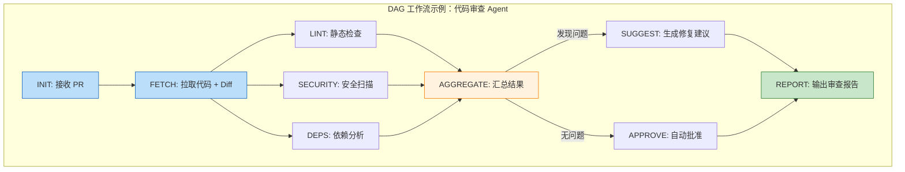

```python
"""
DAG 工作流引擎的简化实现——支持并行执行和条件分支。
"""
from concurrent.futures import ThreadPoolExecutor, as_completed
from dataclasses import dataclass
from typing import Any


@dataclass
class NodeResult:
    """DAG 节点的执行结果"""
    node_id: str
    success: bool
    output: Any = None
    error: str | None = None


class DAGWorkflow:
    """
    有向无环图工作流引擎。

    核心特性：
    1. 声明式节点定义（每个节点暴露 LLM 能力，但流转由代码控制）
    2. 自动并行化（无依赖关系的节点并发执行）
    3. 检查点持久化（任意节点失败后可从断点恢复）
    """

    def __init__(self):
        self.nodes: dict[str, dict] = {}      # node_id → {deps, handler, ...}
        self.checkpoints: dict[str, Any] = {} # node_id → 节点结果（用于恢复）

    def add_node(self, node_id: str, handler: Callable,
                 depends_on: list[str] | None = None):
        """添加节点及其依赖"""
        self.nodes[node_id] = {
            "handler": handler,
            "depends_on": depends_on or [],
            "result": None  # 运行时填充
        }

    def run(self, initial_input: dict) -> dict[str, NodeResult]:
        """
        执行 DAG 工作流。

        1. 找到所有不依赖其他节点的根节点
        2. 并发执行所有就绪的节点
        3. 节点完成后，检查是否有新节点变为就绪
        4. 重复直到所有节点完成或某个关键节点失败
        """
        results: dict[str, NodeResult] = {}
        remaining = set(self.nodes.keys())
        in_flight: set[str] = set()

        with ThreadPoolExecutor(max_workers=4) as executor:
            futures: dict[str, Any] = {}

            while remaining or in_flight:
                # 找到所有依赖已满足且未执行且未在执行的节点
                ready = {
                    node_id for node_id in remaining
                    if all(dep in results and results[dep].success
                           for dep in self.nodes[node_id]["depends_on"])
                    and node_id not in in_flight
                }

                # 提交就绪节点
                for node_id in ready:
                    node = self.nodes[node_id]
                    future = executor.submit(node["handler"], initial_input, results)
                    futures[node_id] = future
                    in_flight.add(node_id)
                    remaining.discard(node_id)

                # 等待任意一个节点完成
                if futures:
                    for future in as_completed(futures.values()):
                        # 找到对应的 node_id
                        for nid, fut in list(futures.items()):
                            if fut == future:
                                try:
                                    result = future.result()
                                    results[nid] = result
                                    # 持久化检查点
                                    self.checkpoints[nid] = result
                                    in_flight.discard(nid)
                                    del futures[nid]

                                    if not result.success:
                                        print(f"[DAG] 节点 {nid} 失败: {result.error}")
                                        # 关键节点失败 → 停止整个 DAG
                                except Exception as e:
                                    results[nid] = NodeResult(nid, False, error=str(e))
                                    in_flight.discard(nid)
                                    del futures[nid]
                                break

        return results
```

### 9.2.2 检查点与断点续传

> [!important] 架构重点：Agent 的状态持久化是工业级的基础设施
>
> Agent 可能在任何时刻崩溃——LLM API 超时、工具调用网络故障、进程被 OOM Killer 杀掉。如果你的 Agent 没有检查点，崩溃后就要从零开始——浪费的不仅是时间，还有用户的 Token 预算和耐心。

```python
"""
检查点（Checkpoint）机制的完整实现——让 Agent 的"后悔药"成为可能。
"""
import json
import os
from datetime import datetime
from typing import Any


class CheckpointManager:
    """
    Agent 检查点管理器。

    核心能力：
    1. 保存：在每次状态变更时自动保存检查点
    2. 恢复：从最近的检查点恢复 Agent 上下文
    3. 清理：按保留策略自动清理过期检查点
    """

    def __init__(self, base_dir: str = ".agent_checkpoints"):
        self.base_dir = base_dir
        os.makedirs(base_dir, exist_ok=True)

    def _checkpoint_path(self, task_id: str) -> str:
        return os.path.join(self.base_dir, f"{task_id}.json")

    def save(self, ctx: AgentContext) -> None:
        """
        保存 Agent 上下文到检查点文件。

        保存的策略不是"全量序列化"——而是只保存恢复所需的最小信息：
        - 任务 ID
        - 当前状态
        - 状态历史
        - 工作记忆（关键变量）
        - 错误日志
        """
        checkpoint = {
            "task_id": ctx.task_id,
            "current_state": ctx.state_history[-1][0] if ctx.state_history else AgentState.INIT,
            "state_history": [(s.value, ts) for s, ts in ctx.state_history],
            "working_memory": ctx.working_memory,
            "errors": ctx.errors,
            "max_steps": ctx.max_steps,
            "max_time_seconds": ctx.max_time_seconds,
            "elapsed_when_saved": ctx.elapsed_seconds,
            "saved_at": datetime.now().isoformat()
        }

        with open(self._checkpoint_path(ctx.task_id), 'w') as f:
            json.dump(checkpoint, f, ensure_ascii=False, indent=2)

    def restore(self, task_id: str) -> AgentContext | None:
        """
        从检查点恢复 Agent 上下文。

        如果检查点不存在或损坏，返回 None。
        """
        path = self._checkpoint_path(task_id)
        if not os.path.exists(path):
            return None

        try:
            with open(path, 'r') as f:
                data = json.load(f)
        except (json.JSONDecodeError, KeyError):
            return None

        ctx = AgentContext(
            task_id=data["task_id"],
            user_input="[从检查点恢复]",
            max_steps=data["max_steps"],
            max_time_seconds=data["max_time_seconds"]
        )

        # 恢复状态历史
        from datetime import datetime as dt
        ctx.state_history = [
            (AgentState(s), ts) for s, ts in data["state_history"]
        ]
        ctx.working_memory = data["working_memory"]
        ctx.errors = data["errors"]

        return ctx

    def cleanup(self, task_id: str) -> None:
        """任务完成后清理检查点"""
        path = self._checkpoint_path(task_id)
        if os.path.exists(path):
            os.remove(path)
```

> [!warning] 工程避坑：检查点的"状态一致性"陷阱
>
> 检查点保存的不是"Agent 的整个对话历史"，而是"Agent 的状态机上下文"——这两者有本质区别。对话历史包含大量冗余文本（Token 消耗），而状态机上下文只包含恢复执行所需的精确变量。
>
> 一个常见的错误是：在保存检查点时，把 Agent 的完整对话历史序列化进去。一个 50 轮对话的 Agent 可能产生 50,000+ tokens 的上下文——这不仅让检查点文件臃肿不堪，更重要的是：**恢复后，Agent 的上下文窗口已经被历史对话占满，没有空间进行新的推理。**

---

# 10. 异常处理与防御性编程

## 10.1 死循环阻断：铁腕的终止策略

### 10.1.1 Agent 为什么会陷入死循环？

> [!bug] 生产痛点：Agent 死循环的三种经典模式
>
> **模式一：工具调用 → 失败 → 无意义重试**
> Agent 调用 `search_database("用户增长数据")`，数据库返回 `Table 'metrics' doesn't exist`。Agent 的推理：查询失败了，我需要换一种方式查询。于是它又调用了 `search_database("SELECT * FROM metrics")`——同一个错误，换个写法。
>
> **模式二：纠错 → 产生新错误 → 纠错新错误**
> Agent 生成了有语法错误的 SQL。它意识到错误，修正了语法——但修改引入了新的逻辑错误（比如用 LEFT JOIN 替代了 INNER JOIN）。然后它试图修正逻辑错误，又破坏了语法。循环往复。
>
> **模式三：子任务拆分无限递归**
> Agent 将"优化服务性能"拆分为 10 个子任务。执行"优化数据库查询"子任务时，又将其拆分为 8 个子子任务。执行"优化索引"子子任务时，又拆分为 5 个子子子任务。Agent 永远在拆分，永远没有产出。

### 10.1.2 多层断路器的实现

```python
"""
工业级 Agent 的死循环防护——不是一层检查，而是多层断路器叠加。
"""
import time
import hashlib
from collections import defaultdict


class LoopDetector:
    """
    多层死循环检测器。

    设计理念：单一维度的限制（如"最多 10 步"）是不够的。
    一个睿智的 Agent 可能在第 3 步就陷入循环——它在重复尝试同一个错误的方法，
    只是每次换了个说法。我们需要多维度的"行为指纹"来识别这种情况。
    """

    def __init__(self,
                 max_iterations: int = 15,
                 max_time_seconds: int = 300,
                 max_consecutive_errors: int = 3,
                 duplicate_threshold: int = 3):
        self.max_iterations = max_iterations
        self.max_time_seconds = max_time_seconds
        self.max_consecutive_errors = max_consecutive_errors
        self.duplicate_threshold = duplicate_threshold

        self.iteration_count = 0
        self.start_time = time.time()
        self.consecutive_errors = 0
        self.tool_call_hashes: list[str] = []     # 工具调用历史（用于去重检测）
        self.tool_call_freq: dict[str, int] = defaultdict(int)  # 工具调用频率
        self.last_three_states: list[str] = []     # 最近三个状态（状态震荡检测）

    def before_step(self, tool_name: str, tool_args: dict) -> str | None:
        """
        在执行下一步之前进行多层检查。
        返回 None 表示可以继续；返回字符串表示应终止（字符串为终止原因）。
        """
        # 第一层：步数限制
        self.iteration_count += 1
        if self.iteration_count > self.max_iterations:
            return f"超过最大执行步数 {self.max_iterations}"

        # 第二层：时间限制
        if time.time() - self.start_time > self.max_time_seconds:
            return f"超过最大执行时间 {self.max_time_seconds}s"

        # 第三层：连续错误计数（每次重试时调用 increment_error）
        if self.consecutive_errors >= self.max_consecutive_errors:
            return f"连续错误 {self.consecutive_errors} 次，触发断路保护"

        # 第四层：重复工具调用检测
        call_hash = self._hash_tool_call(tool_name, tool_args)
        self.tool_call_hashes.append(call_hash)
        self.tool_call_freq[f"{tool_name}:{call_hash}"] += 1

        if self.tool_call_freq[f"{tool_name}:{call_hash}"] > self.duplicate_threshold:
            return (f"在 {self.iteration_count} 步中，对 {tool_name} 执行了 "
                    f"{self.tool_call_freq[f'{tool_name}:{call_hash}']} 次相同的调用，"
                    f"疑似死循环")

        # 第五层：状态震荡检测（A→B→A→B→A...）
        self.last_three_states.append(tool_name)
        if len(self.last_three_states) > 3:
            self.last_three_states.pop(0)
        if (len(self.last_three_states) == 3 and
            self.last_three_states[0] == self.last_three_states[2] and
            self.last_three_states[0] != self.last_three_states[1]):
            return (f"检测到工具调用震荡: "
                    f"{self.last_three_states[0]} → {self.last_three_states[1]} → {self.last_three_states[0]}")

        return None  # 通过所有检查

    def record_error(self):
        """记录一次错误（用于连续错误计数）"""
        self.consecutive_errors += 1

    def record_success(self):
        """重置连续错误计数"""
        self.consecutive_errors = 0

    @staticmethod
    def _hash_tool_call(tool_name: str, tool_args: dict) -> str:
        """生成工具调用的内容指纹（用于检测完全相同的重复调用）"""
        content = f"{tool_name}:{json.dumps(tool_args, sort_keys=True)}"
        return hashlib.sha256(content.encode()).hexdigest()[:12]
```

> [!tip] 最佳实践：断路器的触发策略建议
>
> | 断路器 | 建议阈值 | 触发后行为 |
> | :--- | :--- | :--- |
> | 最大步数 | 10-15 步（取决于任务复杂度） | 返回部分结果 + 明确说明"任务未完成" |
> | 最大时间 | 2-5 分钟（取决于 SLA） | 超时前的最后一次推理应给出"当前进度摘要" |
> | 连续错误 | 3 次 | 降级到预设回复，不再重试 |
> | 重复调用 | 同一工具+同一参数出现 3 次 | 标记为循环，建议用户手动介入 |
> | 状态震荡 | A→B→A→B 出现 2 轮 | 随机选择一个方向继续，或请求人工干预 |

## 10.2 优雅降级：当一切都失败时

### 10.2.1 降级策略的分级设计

> [!important] 架构重点
> Agent 系统的降级策略应该是分级的——不是"成功"或"失败"的二元选择，而是根据失败程度逐级降级到越来越保守（但确定性越来越高）的策略。

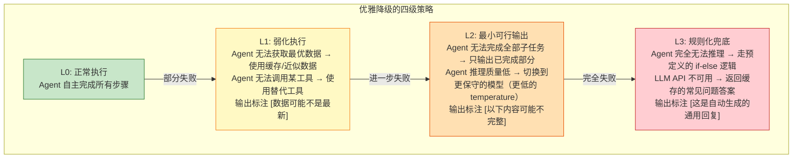

```python
"""
分级降级策略的工程实现。
"""
from enum import Enum
from typing import Any, Callable


class DegradationLevel(Enum):
    """降级等级"""
    NORMAL = 0          # 正常执行
    DEGRADED = 1        # 弱化执行（使用替代方案）
    MINIMAL = 2         # 最小可行输出（只输出已完成部分）
    FALLBACK = 3        # 规则化兜底（预置回复）


class GracefulDegradation:
    """
    优雅降级管理器。

    核心理念：永远不要让用户看到"系统错误，请稍后重试"——
    即使 Agent 内部已经崩溃得不成样子，也要给用户一个有意义的输出。
    """

    def __init__(self):
        # 兜底回复：按意图分类的预置模板
        self.fallback_responses: dict[str, str] = {
            "code_generation": (
                "抱歉，当前无法自动生成代码。以下是你可以尝试的替代方案：\n"
                "1. 参考我们的文档：[链接]\n"
                "2. 提交一个工单，工程师会手动处理：[链接]\n"
                "3. 在社区论坛搜索类似问题：[链接]"
            ),
            "data_query": (
                "当前数据查询服务暂不可用。请稍后重试，或通过以下方式获取数据：\n"
                "1. 直接访问数据看板：[链接]\n"
                "2. 导出 CSV 报表：[链接]"
            ),
            "general": (
                "我暂时无法处理你的请求。可能的原因：\n"
                "- 服务负载较高，请稍后重试\n"
                "- 你询问的内容超出了我当前可获取的信息范围\n"
                "如需紧急帮助，请联系人工支持。"
            )
        }

    def execute_with_degradation(
        self,
        ctx: AgentContext,
        primary_handler: Callable[[AgentContext], str],
        fallback_handler: Callable[[AgentContext], str] | None = None,
        intent: str = "general"
    ) -> tuple[str, DegradationLevel]:
        """
        按降级策略执行任务。

        Args:
            ctx: Agent 上下文
            primary_handler: 主执行函数
            fallback_handler: 备用执行函数（可选）
            intent: 任务意图类型（用于选择兜底回复模板）

        Returns:
            (输出文本, 降级等级)
        """
        # L0: 尝试正常执行
        try:
            result = primary_handler(ctx)
            return result, DegradationLevel.NORMAL
        except Exception as e:
            print(f"[降级] L0 正常执行失败: {e}")

        # L1: 尝试弱化执行（使用备用处理函数）
        if fallback_handler:
            try:
                result = fallback_handler(ctx)
                result = f"{result}\n\n> ⚠️ 注意：此结果使用了备用数据源，可能不是最新信息。"
                return result, DegradationLevel.DEGRADED
            except Exception as e:
                print(f"[降级] L1 弱化执行失败: {e}")

        # L2: 尝试最小可行输出（使用已完成的部分结果）
        if ctx.working_memory:
            partial_result = self._format_partial_result(ctx)
            if partial_result:
                return partial_result, DegradationLevel.MINIMAL

        # L3: 规则化兜底
        fallback = self.fallback_responses.get(intent, self.fallback_responses["general"])
        return fallback, DegradationLevel.FALLBACK

    def _format_partial_result(self, ctx: AgentContext) -> str:
        """格式化部分完成结果"""
        parts = []
        if "collected_data" in ctx.working_memory:
            parts.append(f"已收集数据：{ctx.working_memory['collected_data']}")
        if "analysis_draft" in ctx.working_memory:
            parts.append(f"初步分析：{ctx.working_memory['analysis_draft']}")

        if not parts:
            return ""

        return (
            "任务未能完全完成，以下是已完成的部分：\n\n"
            + "\n\n".join(parts)
            + "\n\n> ⚠️ 任务在完成前中断。如需完整结果，请稍后重试或联系人工支持。"
        )
```

### 10.2.2 LLM API 故障时的降级链路

> [!bug] 生产痛点：凌晨 4 点的 API 故障
>
> Anthropic API 宕机了。你的整个 Agent 服务停摆。用户看到的只有"服务不可用"——而你的值班电话在 30 秒后就会响起。

```python
"""
LLM API 的多级降级链路——从主模型到规则引擎的完整 Fallback 链条。
"""
import random
from typing import Any


class LLMFallbackChain:
    """
    LLM 调用的多级降级链路。

    降级顺序：
    1. 主模型（如 Claude Opus / GPT-4.5）
    2. 备用模型（如 Claude Sonnet / GPT-4o-mini）
    3. 本地小模型（如 Qwen 7B / Llama 3 8B，可选）
    4. 缓存匹配（基于语义相似度的历史回复）
    5. 规则引擎（关键词 + 模板）
    """

    def __init__(self):
        self.cache: dict[str, dict] = {}  # 简单的语义缓存

    def call_with_fallback(self,
                           prompt: str,
                           main_model: str = "claude-opus",
                           fallback_model: str = "claude-sonnet") -> str:
        """按降级链路调用 LLM"""
        # L0: 主模型
        try:
            return self._call_model(main_model, prompt)
        except Exception as e:
            print(f"[LLM Fallback] 主模型 {main_model} 不可用: {e}")

        # L1: 备用模型
        try:
            result = self._call_model(fallback_model, prompt)
            return f"{result}\n\n> ℹ️ 由于主模型暂时不可用，此回复由备用模型生成。"
        except Exception as e:
            print(f"[LLM Fallback] 备用模型 {fallback_model} 不可用: {e}")

        # L2: 语义缓存匹配
        cached = self._semantic_cache_lookup(prompt)
        if cached:
            return f"{cached}\n\n> ℹ️ 此回复来自缓存（基于相似历史问答）。"

        # L3: 规则引擎
        return self._rule_based_response(prompt)

    def _call_model(self, model: str, prompt: str) -> str:
        """实际调用 LLM API（模拟）"""
        # 实际实现中调用 Anthropic / OpenAI SDK
        raise NotImplementedError("请替换为实际的 API 调用")

    def _semantic_cache_lookup(self, prompt: str) -> str | None:
        """
        基于语义相似度的缓存匹配。

        在生产环境中，这应该使用向量数据库（如 Chroma/Milvus）存储历史问答对。
        简化实现：简单的关键词匹配。
        """
        # 实际实现：使用 Embedding 模型计算 prompt 的向量，
        # 然后在缓存中检索最相似的 3 条记录，返回相似度最高且 > 阈值的。
        return None

    def _rule_based_response(self, prompt: str) -> str:
        """最兜底的规则引擎——确定性回复"""
        keywords = {
            "部署": "部署操作当前不可用。请通过运维平台手动部署：[链接]",
            "查询": "数据查询服务暂时不可用。请访问数据看板：[链接]",
            "告警": "如果你收到了告警，请先确认告警详情页面：[链接]。紧急情况请直接联系值班工程师。",
        }

        for keyword, response in keywords.items():
            if keyword in prompt:
                return response

        return ("服务当前出现了暂时性故障，我们的工程师正在处理。\n"
                "请稍后重试，或联系技术支持。给你带来不便，非常抱歉。")
```

---

# 11. 可观测性与调试

## 11.1 追踪 Agent 的"脑回路"

### 11.1.1 为什么 `print()` 不够用？

> [!info] 概念解析
> 在 [[循环工程|循环工程]] 中，我们讨论了从**宏观层面**度量 Agent 质量的 Eval 体系和数据飞轮。本节聚焦的是**微观层面**：当 Agent 在生产环境中出现一次具体的错误行为时，你如何快速定位到是哪一步推理出了问题。

```python
"""
结构化 Trace 系统——Agent 的"黑匣子"。
"""
import time
import uuid
import json
from dataclasses import dataclass, field, asdict
from datetime import datetime
from typing import Any


class SpanType(str):
    LLM_CALL = "llm_call"
    TOOL_CALL = "tool_call"
    STATE_TRANSITION = "state_transition"
    ERROR = "error"
    DEGRADATION = "degradation"


@dataclass
class TraceSpan:
    """一次操作的完整追踪记录"""
    span_id: str
    trace_id: str
    parent_span_id: str | None
    span_type: str
    start_time: float
    end_time: float | None = None

    # 操作数据
    input_data: dict[str, Any] = field(default_factory=dict)
    output_data: dict[str, Any] | None = None
    error: str | None = None
    metadata: dict[str, Any] = field(default_factory=dict)

    @property
    def duration_ms(self) -> float:
        if self.end_time is None:
            return 0
        return (self.end_time - self.start_time) * 1000


class AgentTracer:
    """
    Agent 执行过程的完整追踪器。

    追踪的粒度：
    - 每一次 LLM 调用（输入 Prompt、输出 Response、Token 数、延迟）
    - 每一次工具调用（工具名、参数、返回值、是否成功）
    - 每一次状态转换（从什么状态到什么状态、触发原因）
    - 每一次错误（错误类型、错误信息、当时的上下文快照）
    """

    def __init__(self):
        self.traces: list[TraceSpan] = []
        self._active_spans: dict[str, TraceSpan] = {}

    def start_span(self, span_type: str, trace_id: str,
                   input_data: dict, parent_span_id: str | None = None) -> str:
        """开始一个追踪 Span，返回 span_id"""
        span_id = str(uuid.uuid4())[:8]
        span = TraceSpan(
            span_id=span_id,
            trace_id=trace_id,
            parent_span_id=parent_span_id,
            span_type=span_type,
            start_time=time.time(),
            input_data=input_data
        )
        self._active_spans[span_id] = span
        return span_id

    def end_span(self, span_id: str, output_data: dict | None = None,
                 error: str | None = None):
        """结束一个追踪 Span"""
        span = self._active_spans.pop(span_id, None)
        if span is None:
            return

        span.end_time = time.time()
        span.output_data = output_data
        span.error = error
        self.traces.append(span)

    def get_trace_summary(self, trace_id: str) -> dict:
        """获取某个 Trace 的摘要（用于快速排查）"""
        trace_spans = [s for s in self.traces if s.trace_id == trace_id]

        llm_calls = [s for s in trace_spans if s.span_type == SpanType.LLM_CALL]
        tool_calls = [s for s in trace_spans if s.span_type == SpanType.TOOL_CALL]
        errors = [s for s in trace_spans if s.error]

        total_tokens = sum(
            (s.output_data or {}).get("usage", {}).get("total_tokens", 0)
            for s in llm_calls
        )

        return {
            "trace_id": trace_id,
            "total_spans": len(trace_spans),
            "llm_calls": len(llm_calls),
            "tool_calls": len(tool_calls),
            "errors": len(errors),
            "total_duration_ms": sum(s.duration_ms for s in trace_spans),
            "total_tokens": total_tokens,
            "error_summary": [s.error for s in errors],
            "tool_call_success_rate": (
                sum(1 for s in tool_calls if not s.error) / len(tool_calls)
                if tool_calls else 1.0
            )
        }

    def export_jsonl(self, trace_id: str) -> str:
        """导出为 JSONL 格式（兼容 LangSmith 等 LLMOps 工具）"""
        trace_spans = [s for s in self.traces if s.trace_id == trace_id]
        lines = []
        for span in trace_spans:
            lines.append(json.dumps(asdict(span), ensure_ascii=False))
        return "\n".join(lines)
```

### 11.1.2 决策轨迹的"人类可读"格式化

> [!tip] 最佳实践：开发环境的 Agent 调试神器
>
> 在生产环境中，结构化 Trace 是王道。但在开发/调试阶段，你需要一个"人类可读"的决策轨迹展示——让你一眼看出 Agent 在想什么、做了什么、结果如何。

```python
"""
将 Agent 的结构化 Trace 渲染为人类可读的决策轨迹。
"""
def render_decision_trail(tracer: AgentTracer, trace_id: str) -> str:
    """
    将 Trace 渲染为 Markdown 格式的决策轨迹。

    输出示例：

    ## Agent 决策轨迹 (trace: a1b2c3d4)

    ### Step 1: LLM 推理 (2.3s, 1,240 tokens)
    **输入:** 用户问"帮我查一下今天北京天气"
    **推理:** 我需要调用天气查询工具 → 参数: city="北京", date="2026-06-25"

    ### Step 2: 工具调用: get_weather (0.8s)
    **参数:** {"city": "北京", "date": "2026-06-25"}
    **结果:** ✅ 成功 → 晴, 22-32°C

    ### Step 3: LLM 推理 (1.5s, 850 tokens)
    **观察:** 天气数据已获取
    **推理:** 可以给出最终答案

    ### Step 4: 输出 (0.2s)
    **最终输出:** 今天北京天气晴，温度 22-32°C...

    ---
    **总计:** 4 步 / 5.0s / 2,090 tokens / 0 错误
    """
    spans = [s for s in tracer.traces if s.trace_id == trace_id]
    lines = [f"## Agent 决策轨迹 (trace: {trace_id})", ""]

    step = 0
    for span in spans:
        step += 1

        if span.span_type == SpanType.LLM_CALL:
            tokens = (span.output_data or {}).get("usage", {}).get("total_tokens", "?")
            lines.append(
                f"### Step {step}: 🧠 LLM 推理 "
                f"({span.duration_ms/1000:.1f}s, {tokens} tokens)"
            )
        elif span.span_type == SpanType.TOOL_CALL:
            tool_name = span.input_data.get("tool_name", "unknown")
            status = "❌" if span.error else "✅"
            lines.append(
                f"### Step {step}: 🔧 工具调用: `{tool_name}` "
                f"({span.duration_ms/1000:.1f}s) {status}"
            )
        elif span.span_type == SpanType.STATE_TRANSITION:
            lines.append(f"### Step {step}: 🔄 状态切换")
        elif span.span_type == SpanType.ERROR:
            lines.append(f"### Step {step}: 🚨 错误")

        # 关键数据
        if span.input_data:
            lines.append(f"**输入:** {json.dumps(span.input_data, ensure_ascii=False, indent=0)[:200]}")
        if span.output_data:
            lines.append(f"**输出:** {json.dumps(span.output_data, ensure_ascii=False, indent=0)[:200]}")
        if span.error:
            lines.append(f"**错误:** {span.error}")
        lines.append("")

    # 汇总
    total_time = sum(s.duration_ms for s in spans) / 1000
    total_errors = sum(1 for s in spans if s.error)
    lines.append(f"---")
    lines.append(f"**总计:** {step} 步 / {total_time:.1f}s / {total_errors} 错误")

    return "\n".join(lines)
```

## 11.2 LLMOps 工具选型

> [!tip] 最佳实践：从手搓到工具化的演进路线
>
> 在开发初期，上述的手搓 Trace 系统（200 行代码）就足够用了。但当团队规模增长、Agent 调用量上升时，你需要考虑专业化的 LLMOps 工具：

| 工具 | 定位 | 适用场景 | 上手难度 |
| :--- | :--- | :--- | :--- |
| **LangSmith** | LLM 应用的调试与监控平台 | 使用 LangChain/LangGraph 的团队 | 低 |
| **Phoenix (Arize)** | 开源 LLM 可观测性平台 | 需要自托管 + OpenTelemetry 集成的团队 | 中 |
| **Weights & Biases** | ML 实验追踪 + LLM 监控 | 需要模型训练 + 推理统一观测的团队 | 中 |
| **Braintrust** | LLM 评估 + 日志 + 数据集管理 | 重视 Eval 驱动开发（与 [[循环工程]] 理念契合） | 低 |
| **自建 Trace 系统** | 完全定制化 | 有特殊合规要求 / 需要与内部系统深度集成 | 高 |

> [!important] 架构重点：无论用哪个工具，核心埋点维度不能少
>
> 在 [[循环工程#2.2 数据飞轮与埋点|数据飞轮与埋点]] 中，我们强调了"采集高信噪比信号"的重要性。对 Agent 的可观测性而言，无论你使用的是 LangSmith 还是自建系统，以下五个维度的埋点是**不可妥协**的最低要求：
>
> 1. **推理质量**：每次 LLM 调用的 System Prompt 版本、输入 Token 数、推理延迟
> 2. **工具调用**：调用的工具名、参数（脱敏后）、耗时、成功/失败
> 3. **状态流转**：当前状态、目标状态、触发流转的原因
> 4. **异常事件**：异常类型、异常信息、发生时的上下文快照
> 5. **终止条件**：任务的最终状态（完成/失败/超时/取消）、消耗的推理步数

---

# 12. 规模化：Flow 与 Agent 工作系统

## 12.1 风险-仪式矩阵：不是所有项目都要全套 AI-DLC

书的第 9 章提出一个反直觉的立场：**AI-DLC 不是唯一正确的流程，它是"高风险 × 高仪式"象限的选择。**

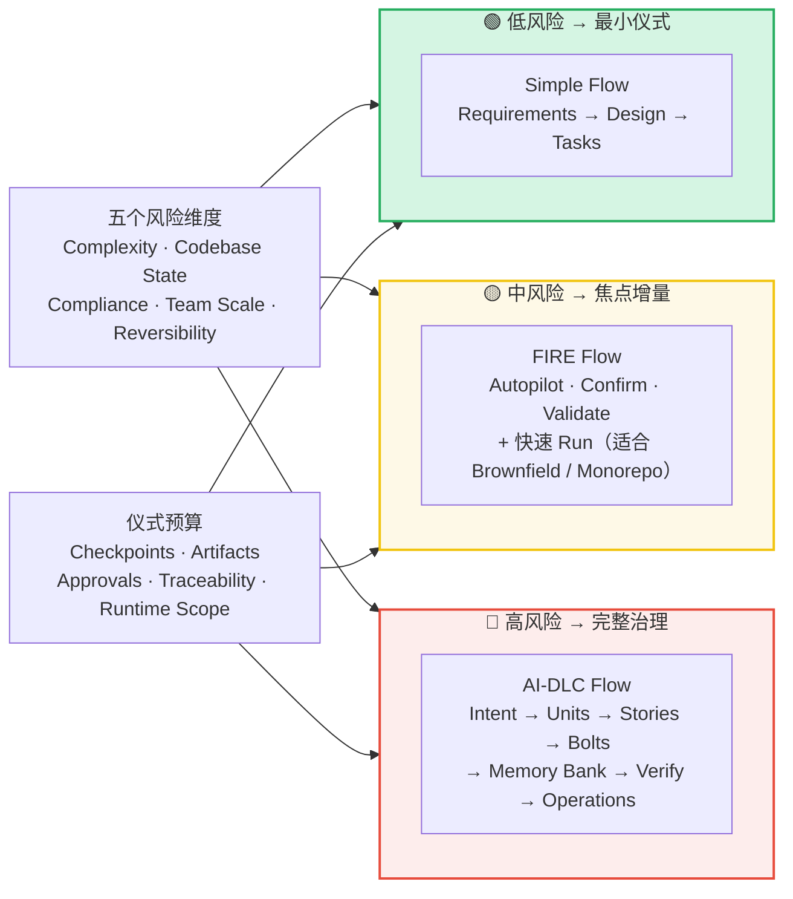

> [!compare] 三种 Flow 的取舍
> | 维度 | Simple | FIRE | AI-DLC |
> |:----:|:------:|:----:|:------:|
> | 适用 | 低风险 · 最小仪式 | 中风险 · 焦点增量 | 高风险 · 完整治理 |
> | 流程 | Requirements → Design → Tasks | Autopilot / Confirm / Validate + Run | Intent → Units → Stories → Bolts → Memory Bank → Verify → Operations |
> | 升级触发 | 跨边界 · 难逆 · 合规上升 | 同左 | — |
> | 降级触发 | — | 范围收缩 · 风险已隔离 | 同左 |

> [!tip] Swap Test：检验你的 Flow 选择
> 书里给出了一个验证流程选择的技巧——**把任务与流程交叉组合**：把低风险任务放进 AI-DLC 会怎样（仪式过剩）？把高风险任务放进 Simple 会怎样（验证不足）？如果任何一组组合明显荒谬，说明你的选择可能只是**惯性**，而不是基于风险判断。
>
> 每个 Flow 选择都应留下一份 **Decision Record**：Top risks、Chosen flow、Why not the other two、Checkpoint budget、Runtime scope、Upgrade/downgrade trigger。**流程选择本身也要可追溯、可复盘。**

## 12.2 Agent 工作系统：RACI、Mob 与价值记分卡

当 AI-DLC 运行在团队规模时，人机协作需要一个**组织形态**。书的第 10 章给出的答案是"研发操作系统三层图"：

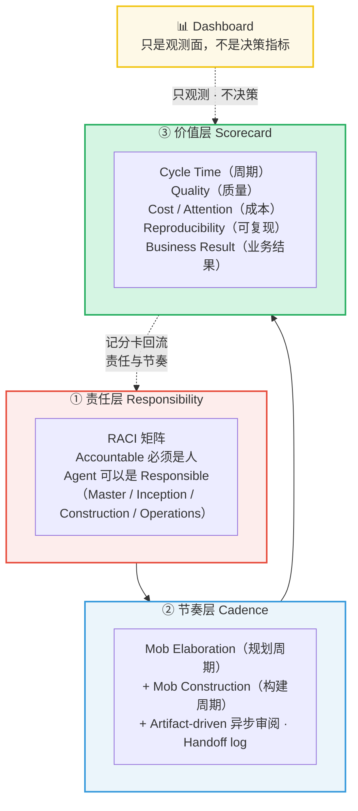

> [!important] Accountable 属于人
> 书里的责任规则极其明确：**AI 可以是 Responsible（负责执行），但 Accountable（最终负责）必须是人**；Dashboard 只是观测面，永远不是决策指标。
>
> 这正是第 3 章"责任不可委托"在组织层面的落地——**Agent 越多，RACI 越要写在明处，否则"每个人都负责"会退化成"没有人负责"。** 规模化不是把人撤下来，而是把人的责任放到更精确的位置上。

## 12.3 整条思维链路总览

现在把全书串起来——从人的意图到下一轮意图，AI-DLC 是一条完整的、可回环的工程链路：

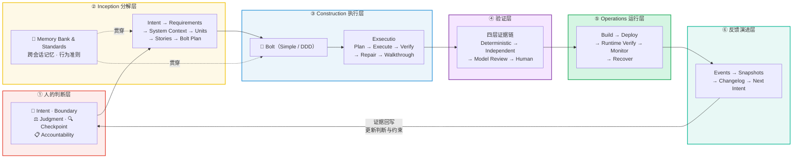

> [!abstract] 一句话总结整条链路
> **人的判断设方向，Inception 把它分解成可执行的轨道，Memory Bank 保证 AI 不"失忆"，Bolt + Exsecutio 把执行锁进闭环，四层证据链完成验证，Operations 让它稳定运行，最终证据回写，更新下一轮人的判断。**
>
> 这就是 `AI-DLC = Ɛ(人的判断 + AI 能力)` 的完整展开——**Ɛ（Engineering with Exsecutio）不是某个步骤，而是贯穿②到⑥的整条工程轨道。**

---

# 13. 框架选型与演进路线

## 13.1 不要被框架绑架

> [!quote] 核心观点
> 在你理解了 Agent 的核心工程挑战——状态管理、异常处理、可观测性——之后，你才能真正判断一个框架是在帮你解决问题，还是在帮你"屏蔽问题"。

```mermaid
flowchart TB
    subgraph Evolution["Agent 工程能力的演进路线"]
        direction LR

        Stage1["🏗️ Stage 1: 手搓核心<br/>原生 SDK（Anthropic / OpenAI）<br/>+ 自己的状态机<br/>+ 200 行 Trace 系统<br/>目标：理解每一个痛点的根因"]
        
        Stage2["📦 Stage 2: 引入专项工具<br/>Pydantic → JSON 校验<br/>Tenacity → 重试策略<br/>structlog → 结构化日志<br/>目标：用成熟的库替换手搓轮子"]
        
        Stage3["🔧 Stage 3: 选择框架<br/>评估 LangGraph / CrewAI / AutoGen<br/>只引入真正需要的部分<br/>始终保持"兜底不使用框架也能跑"<br/>目标：框架是加速器，不是拐杖"]
    end

    Stage1 --> Stage2 --> Stage3

    style Stage1 fill:#c8e6c9,stroke:#2e7d32
    style Stage2 fill:#fff3e0,stroke:#f57c00
    style Stage3 fill:#bbdefb,stroke:#1565c0
```

> [!warning] 工程避坑：框架选择的三个反模式
>
> **① "因为大家都在用"**
> LangChain 生态庞大不等于你的场景需要它。如果你的 Agent 本质上是一个 5 步的线性流程，LangChain 的 Chain 抽象带来的复杂度远超它解决的问题。
>
> **② "因为它屏蔽了底层细节"**
> "屏蔽底层细节"在框架语境中是中性词——它既屏蔽了繁琐的重复代码，也屏蔽了你理解问题本质的机会。当你遇到框架无法解决的边界问题时，你会发现自己对底层机制一无所知。
>
> **③ "因为以后可能需要"**
> 为"可能永远不会到来的需求"引入框架复杂度，是过度工程的经典案例。先用手搓方案上线，等需求真正出现时再重构——那时候你对需求的理解会比现在清晰 10 倍。

## 13.2 推荐的渐进式架构

```python
"""
工业级 Agent 的最低可行架构（Minimal Viable Architecture）。

这个架构的价值不在于代码量——而在于它用最少的抽象，
覆盖了 Agent 从开发到上线的所有关键工程挑战。
"""

# 第一层：LLM Client（原生 SDK，无框架封装）
# 使用 Anthropic SDK 或 OpenAI SDK 直接调用。
# 不要在这一层增加任何中间抽象——
# 你需要对每次 API 调用的参数、返回值、错误有完全的控制权。

# 第二层：工具注册表（Tool Registry）
# 一个 dict 或简单的 registry 类，将工具名映射到实际的 Python 函数。
# 每个工具函数内部自己处理超时、重试、参数校验。
# 参考 [[Model_Context_Protocol_MCP|MCP]] 的工具定义格式，确保与标准兼容。

# 第三层：状态机（State Machine）
# 见本文第 3 节的完整实现。
# 这是 Agent 的"纪律层"——它不依赖任何框架，纯 Python 即可实现。

# 第四层：上下文管理器（Context Manager）
# 负责上下文窗口的组装、裁剪、压缩。
# 参考 [[上下文工程]] 中的完整设计模式。

# 第五层：可观测性（Observability）
# 见本文第 5 节的 AgentTracer 实现。
# 初期 200 行代码，后期可替换为 LangSmith / Phoenix。

# 第六层：断路器与降级（Circuit Breaker + Degradation）
# 见本文第 4 节的 LoopDetector 和 GracefulDegradation。
# 这些组件与业务逻辑解耦，可以在任何 Agent 中复用。

# 将这六层组装起来，就是一个完整的工业级 Agent 运行环境。
# 总代码量：1500-2500 行 Python（不含测试）。
# 比任何框架都轻，但覆盖了所有框架声称解决的问题。
```

---

# 14. 总结与展望：未来的开发者形态

## 14.1 开发者的身份转型

AI 时代正在倒逼开发者完成一次身份的根本转型。这不是渐进式的技能升级，而是一次角色定义的范式重写：

| 维度 | 传统开发者 | AI 时代开发者 |
|:----:|:----------:|:------------:|
| **核心工作** | 编写代码 | 定义意图与边界 |
| **价值来源** | 打字速度和语法熟练度 | 判断力、架构视野和系统思维 |
| **与 AI 的关系** | 使用 AI 辅助编码 | 指挥 Agent 编排执行 |
| **质量保障** | 手动测试 + Code Review | 设计门禁 + 证据链审查 |
| **责任范围** | 自己写的代码 | 系统的全部产出（含 AI 生成） |
| **身份隐喻** | 建筑工人 | 建筑师 + 质检总监 |

## 14.2 三个不可逆的趋势

1. **代码生成的商品化**：代码本身正在变成大宗商品——LLM 让代码生成的成本趋近于零，就像云计算让服务器变成了按需付费的资源。**纯编码能力的护城河正在以指数级速度消失。**

2. **工程判断力的稀缺化**：当代码变得廉价，**知道"写什么代码"和"怎么验证代码"的人变得极其稀缺**。系统设计能力、质量保障能力、风险评估能力——这些"看不见的技能"正在成为开发者最核心的竞争力。

3. **Agent 协作的常态化**：未来的开发团队不再是"五个人类开发者"，而是"两个人类 + 若干专业 Agent"。人类负责目标定义、边界设定和最终裁决；Agent 负责分解执行、自动化验证和持续交付。**能否高效地编排 Agent 而非事必躬亲，将成为区分普通开发者和架构师的关键分水岭。**

## 14.3 最终的哲学命题

> [!abstract] 从概率到确定性的工程哲学
> [[重新认识AI|AI]] 时代的一切工程挑战，归根结底都指向同一个命题：**如何把概率性的智能输出，转化为确定性的工程交付？**
>
> AI-DLC 框架给出的回答是：**人的判断设方向，AI 能力加速度，工程化执行保交付。**
>
> 这不是对 AI 的限制，恰恰是对 AI 能力的最大化释放——就像铁轨不是限制火车的自由，而是让火车能够以最大速度安全行驶的基础设施。Vibe Coding 不该是无序的概率狂欢，而应该是**有轨道的、可控的、可验证的确定性交付**。
>
> 未来的顶级开发者，不再是代码写得最快的人，而是**最善于把 AI 的概率能力约束在工程轨道中、使其产出可信赖的确定性结果的人**。

---

# 15. 参考来源与致谢

> [!abstract] 参考来源与致谢
> 本文的核心思想与工程框架深度参考并总结自开源图书《深入理解 AI-DLC》：
>
> - **项目地址**：[深入理解 AI-DLC - GitHub](https://github.com/mancbj/aidlc-book-baojun)
>
> AI-DLC 框架中的核心公式 `AI-DLC = Ɛ (人的判断 + AI 能力)`、人的五件套（意图、边界、不可委托判断、检查点、责任）、以及 Exsecutio 五步闭环（Plan → Execute → Verify → Repair → Walkthrough）等核心概念均源自该项目的工程思想体系。
>
> 特别感谢原作者 [@mancbj](https://github.com/mancbj) 及所有贡献者对 AI 时代软件工程方法论的探索与开源分享。本文在原始思想基础上进行了扩展解读与个人工程实践的融合诠释。
