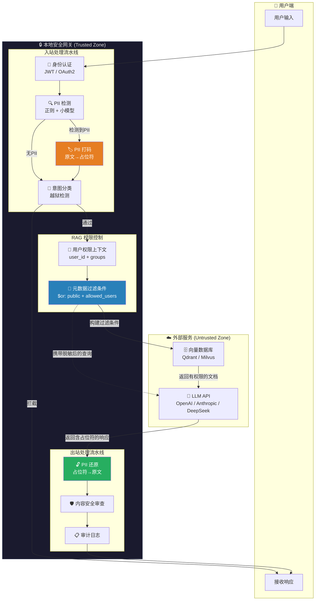

---
tags:
  - AI安全
  - RAG
  - 数据隐私
  - PII脱敏
  - 访问控制
created: 2026-06-26
aliases:
  - RAG Security
  - 检索增强生成安全
---

## 文章三：数据隐私与检索安全

### 引言：RAG 的"双刃剑"——检索越强，泄露越深

RAG（Retrieval-Augmented Generation）是当前企业级 LLM 应用的标配架构——它通过将外部知识库接入大模型，显著降低了幻觉率，并让模型能够回答超出训练截止日期的问题。但 RAG 也是一把**危险的双刃剑**：

> [!important] 架构重点
> RAG 的本质是**将企业内部最敏感的数据（文档、代码、客户记录、财务报告）暴露给一个统计语言模型**。在没有适当的访问控制和安全护栏时，RAG 系统就是一个"权限旁路隧道"——用户不再需要通过层层审批来访问敏感文件，他们只需要在聊天框里问对问题。

### 核心威胁模型：RAG 的三种数据泄露路径

| 泄露路径 | 攻击方式 | 后果严重度 |
| -------- | -------- | ---------- |
| **权限越权** | 用户通过构造巧妙的检索查询，获取到不属于其权限范围内的文档内容 | 🔴 高危 |
| **数据提取** | 攻击者通过反复"拷问"模型，逐片还原训练数据或知识库中的敏感原文 | 🟠 中危 |
| **隐私泄露** | 用户输入的 PII（身份证、银行卡、病历）被发送至云端 LLM 供应商，脱离企业控制 | 🔴 高危 |

### 权限越权防范：RAG 中的访问控制

这是企业 RAG 部署中最常见也最致命的漏洞。一个典型的脆弱架构长这样：

```python
# ============================================================
# ❌ 危险的 RAG 实现——没有权限过滤
# ============================================================
async def vulnerable_rag_query(user_query: str, user_id: str):
    """这种实现会返回所有匹配的文档，无视用户权限！"""
    # 生成查询向量
    query_embedding = embedding_model.encode(user_query)

    # 从向量数据库检索 top-k 相似文档——⚠️ 完全没有过滤！
    results = vector_db.search(
        collection="all_documents",
        vector=query_embedding,
        top_k=10,  # 直接返回最相似的 10 条，不关心用户是否有权查看
    )
    # 💀 攻击场景：用户问"公司三个月后要裁员哪些部门？"
    #    系统从 HR 机密文档中检索到这个信息并直接返回

    context = "\n".join([r["text"] for r in results])
    return await llm.generate(f"根据以下文档回答：\n{context}\n\n问题：{user_query}")
```

> [!bug] 红队视角 (Attacker)
> 没有权限过滤的 RAG 是一个**信息放大镜**——攻击者不需要知道文档的具体内容，只需要知道"公司可能存在某类文件"。通过反复变换提示词（"公司有没有关于裁员的文件？" → "HR 部门最近有没有组织架构调整的计划？" → "2026 年的人员优化方案主要内容是什么？"），攻击者可以像剥洋葱一样逐层榨取敏感信息。这比传统 SQL 注入更危险，因为攻击者不需要理解数据库结构——自然语言本身就是最强大的查询语言。

#### 解决方案：元数据驱动的权限过滤（Metadata-Based RBAC）

核心思路：在向量检索的同时，利用向量数据库的**元数据过滤**能力，在检索阶段就排除用户无权访问的文档。

```python
"""
✅ 安全的 RAG 实现——元数据驱动的权限过滤

核心设计:
1. 每份文档入库时携带权限元数据（允许访问的用户组/标签）
2. 检索时点将用户的权限信息作为过滤条件传入向量数据库
3. 后检索阶段再做一次服务端二次校验（纵深防御，防止过滤逻辑被绕过）
"""

from dataclasses import dataclass, field
from typing import Optional
from enum import Enum


class AccessLevel(Enum):
    """文档访问级别"""
    PUBLIC = "public"           # 全员可见
    INTERNAL = "internal"       # 公司内部可见
    DEPARTMENT = "department"   # 部门内可见
    CONFIDENTIAL = "confidential"  # 仅特定人员可见
    RESTRICTED = "restricted"   # 仅指定个人可见


@dataclass
class DocumentMetadata:
    """文档入库时携带的安全元数据"""
    doc_id: str
    owner: str                          # 文档所有者
    access_level: AccessLevel           # 访问级别
    allowed_groups: list[str] = field(default_factory=list)   # 允许的组
    allowed_users: list[str] = field(default_factory=list)    # 允许的个人
    tags: list[str] = field(default_factory=list)             # 分类标签


@dataclass
class UserContext:
    """当前请求用户的权限上下文"""
    user_id: str
    groups: list[str]           # 用户所属的组
    department: Optional[str]
    clearance_level: int = 0    # 安全许可等级 0-5


def build_permission_filter(user: UserContext) -> dict:
    """
    构建向量数据库的元数据过滤条件。

    生成一个类似 MongoDB 查询语法的过滤条件，
    在向量检索时只匹配用户有权访问的文档。

    权限判定逻辑（OR 关系，满足任一即可）：
    1. 文档是 PUBLIC 级别
    2. 文档的 allowed_users 包含当前用户
    3. 文档的 allowed_groups 与用户组有交集
    """
    return {
        "$or": [
            {"access_level": "public"},
            {"allowed_users": {"$in": [user.user_id]}},
            {"allowed_groups": {"$in": user.groups}},
        ]
    }


async def secure_rag_query(
    user_query: str,
    user: UserContext,
):
    """
    安全的 RAG 查询——在检索阶段就过滤掉无权访问的文档。

    这个实现的关键点：
    1. filter 条件在向量检索之前或同时生效（取决于向量数据库的实现）
    2. 无权限的文档永远不会进入 LLM 的上下文窗口
    3. 即使用户精心构造了诱导性查询，也无法触及权限范围外的文档
    """
    # 步骤 1: 生成查询向量
    query_embedding = embedding_model.encode(user_query)

    # 步骤 2: 构建权限过滤条件
    permission_filter = build_permission_filter(user)

    # 步骤 3: 带权限过滤的向量检索
    # filter 条件确保了——即使某文档向量与查询高度相似，
    # 只要用户无权访问，它就不会出现在结果中
    results = vector_db.search(
        collection="all_documents",
        vector=query_embedding,
        filter=permission_filter,  # 🔑 这里是安全的关键
        top_k=10,
    )

    # 步骤 4: （纵深防御）服务端二次校验
    # 即使向量数据库的过滤逻辑有 bug，这层校验也能兜底
    verified_results = [
        r for r in results
        if _verify_access(r["metadata"], user)
    ]

    # 步骤 5: 构建上下文并生成回复
    context = "\n---\n".join([r["text"] for r in verified_results])
    return await llm.generate(
        f"根据以下文档回答用户问题。如果文档中没有相关信息，请明确表示无法回答。\n\n"
        f"参考文档：\n{context}\n\n"
        f"用户问题：{user_query}"
    )


def _verify_access(doc_meta: dict, user: UserContext) -> bool:
    """
    服务端二次权限校验（纵深防御）。

    Args:
        doc_meta: 文档元数据
        user: 当前用户权限上下文

    Returns:
        bool: 用户是否有权限访问
    """
    access_level = doc_meta.get("access_level", "public")

    # PUBLIC 和 INTERNAL 级别：所有登录用户可访问
    if access_level in ("public", "internal"):
        return True

    # 直接授权：用户在白名单中
    if user.user_id in doc_meta.get("allowed_users", []):
        return True

    # 组授权：用户组与文档允许的组有交集
    if set(user.groups) & set(doc_meta.get("allowed_groups", [])):
        return True

    return False
```

> [!tip] 蓝队视角 (Defender)
> RAG 权限控制的工程落地清单：
> 1. **权限过滤必须在检索阶段完成，而非后检索阶段。** 如果先检索再过滤，攻击者可以通过 side-channel（如响应时间的差异）推断出被过滤文档的存在。
> 2. **向量数据库选型时优先考虑原生支持元数据过滤的引擎。** Qdrant、Weaviate、Milvus 都支持在向量搜索时附带结构化过滤条件，这比在应用层做二次过滤更高效也更安全。
> 3. **从不信任 LLM 来执行权限判断。** 不要在 Prompt 里写"请只回答用户有权知道的文档内容"——LLM 不是访问控制系统，它可能在压力下"忘记"这个规则。
> 4. **审计日志**：记录每一次 RAG 检索命中了哪些文档——这不仅是合规需要，也是事后追溯攻击路径的依据。

### 隐私数据脱敏（PII Redaction）

即使权限控制完美，仍有另一个维度的风险：**用户输入本身包含的敏感信息**。当用户将身份证号、银行卡号、健康信息输入聊天框时，这些数据会被发送到 LLM 供应商的服务器——脱离了企业的数据治理边界。

> [!warning] 高危操作
> 以下数据未经脱敏直接发送给 OpenAI / Anthropic / DeepSeek 等云端 API 是**严重的数据合规违规**：
> - 中国《个人信息保护法》（PIPL）规定的个人信息跨境传输限制
> - 欧盟 GDPR 的第 44-49 条，关于数据跨境转移的要求
> - 医疗行业 HIPAA、金融行业 PCI-DSS 的明文数据外传禁令
>
> 解决方案：在请求出站前，在本地网关层完成 PII 检测与打码。

#### 完整 PII 脱敏网关实现

```python
"""
本地 PII 检测与脱敏网关

设计目标:
1. 在用户输入发送给云端 LLM 之前，自动识别并替换敏感信息
2. 脱敏后的文本发送给 LLM，LLM 返回的响应中包含占位符
3. 在响应返回给用户之前，将占位符还原为原始敏感信息
4. 整个过程对用户和 LLM 都是透明的

核心流程:
用户输入 → [PII检测] → [打码] → [发送LLM] → [LLM响应] → [还原PII] → 返回用户

┌───────────────────────────────────────────┐
│           企业安全边界 (Trusted)            │
│                                           │
│  ┌─────────┐   ┌──────┐   ┌─────────┐    │
│  │ PII检测  │──▶│ 打码  │──▶│ 调用LLM │    │
│  │ (正则)   │   │      │   │         │────┼──▶ 云端 API
│  └─────────┘   └──────┘   └─────────┘    │     (打码后)
│       ▲                         │         │
│       │         ┌─────────┐     │         │
│       └─────────│ PII还原 │◀────┘         │
│   (还原后返回)  └─────────┘  (LLM响应)    │
│                                           │
└───────────────────────────────────────────┘
"""

import re
import hashlib
import hmac
import json
from dataclasses import dataclass, field
from typing import Optional
from collections import OrderedDict


@dataclass
class PIIMatch:
    """单个 PII 匹配记录"""
    pii_type: str           # 类型：ID_CARD / PHONE / EMAIL / BANK_CARD
    original: str           # 原始明文（需要被保护）
    placeholder: str        # 占位符（发送给 LLM 的安全替代品）
    start_pos: int          # 在输入文本中的起始位置
    end_pos: int            # 在输入文本中的结束位置
    checksum: str           # 校验和（防止占位符被篡改）


class PIIRedactionEngine:
    """
    PII 脱敏引擎——本地执行，零数据外泄。

    支持的 PII 类型（可按需扩展）：
    - CN_ID_CARD: 中国大陆居民身份证（18位，含校验位）
    - CN_PHONE: 中国大陆手机号码
    - CN_BANK_CARD: 银行卡号（Luhn算法校验）
    - EMAIL: 电子邮箱地址
    - IP_ADDRESS: IP 地址（v4/v6）
    """

    def __init__(self, secret_key: str = ""):
        """
        Args:
            secret_key: 用于生成占位符 HMAC 的密钥。
                       占位符中加入 HMAC 可以防止攻击者绕过脱敏。
        """
        self.secret_key = secret_key

    # ============================================================
    # PII 正则模式库
    # ============================================================
    PII_PATTERNS = OrderedDict({
        # 身份证号（18位）
        # 前6位: 地区码, 8位: 出生日期, 3位: 顺序码, 1位: 校验码
        "CN_ID_CARD": re.compile(
            r'(?<!\d)'  # 负向后顾：前面不能是数字（防止截取）
            r'[1-9]\d{5}'           # 地区码（6位，首位1-9）
            r'(?:19|20)\d{2}'       # 年份（1900-2099）
            r'(?:0[1-9]|1[0-2])'   # 月份（01-12）
            r'(?:0[1-9]|[12]\d|3[01])'  # 日期（01-31）
            r'\d{3}'                # 顺序码
            r'[\dXx]'               # 校验码
            r'(?!\d)'  # 负向前瞻：后面不能是数字
        ),

        # 手机号码（大陆）
        "CN_PHONE": re.compile(
            r'(?<!\d)'
            r'1[3-9]\d{9}'  # 1 + 3-9 + 9位任意数字
            r'(?!\d)'
        ),

        # 电子邮箱
        "EMAIL": re.compile(
            r'\b[A-Za-z0-9._%+-]+@[A-Za-z0-9.-]+\.[A-Z|a-z]{2,}\b'
        ),

        # 银行卡号（16-19位数字，Luhn算法校验）
        "BANK_CARD": re.compile(
            r'(?<!\d)'
            r'\d{16,19}'
            r'(?!\d)'
        ),
    })

    # 占位符映射表——用于事后还原
    # key: placeholder, value: original_value
    def __init_post_init__(self):
        self.redaction_table: dict[str, str] = {}

    def detect_and_redact(self, text: str) -> tuple[str, list[PIIMatch]]:
        """
        检测并脱敏文本中的所有 PII。

        Args:
            text: 原始用户输入文本

        Returns:
            (redacted_text, matches): 脱敏后的文本 和 匹配记录列表
        """
        matches: list[PIIMatch] = []
        redacted_text = text

        for pii_type, pattern in self.PII_PATTERNS.items():
            for match in pattern.finditer(redacted_text):
                original = match.group()

                # Luhn 算法二次验证（仅银行卡）
                if pii_type == "BANK_CARD" and not self._luhn_check(original):
                    continue  # 可能是16位随机数字，跳过

                # 生成占位符
                placeholder, checksum = self._generate_placeholder(pii_type, original)

                # 记录匹配
                pii_match = PIIMatch(
                    pii_type=pii_type,
                    original=original,
                    placeholder=placeholder,
                    start_pos=match.start(),
                    end_pos=match.end(),
                    checksum=checksum,
                )
                matches.append(pii_match)

                # 保存映射关系
                self.redaction_table[placeholder] = original

        # 替换所有 PII（按位置从后往前替换，避免偏移问题）
        matches.sort(key=lambda m: m.start_pos, reverse=True)
        for m in matches:
            redacted_text = (
                redacted_text[:m.start_pos]
                + m.placeholder
                + redacted_text[m.end_pos:]
            )

        return redacted_text, matches

    def restore(self, redacted_text: str) -> str:
        """
        将已脱敏文本中的占位符还原为原始 PII。

        Args:
            redacted_text: 包含占位符的文本（通常是 LLM 返回的响应）

        Returns:
            还原了 PII 的文本
        """
        restored = redacted_text
        for placeholder, original in self.redaction_table.items():
            restored = restored.replace(placeholder, original)
        return restored

    def _generate_placeholder(self, pii_type: str, original: str) -> tuple[str, str]:
        """
        生成安全的占位符。

        占位符格式: <PII_{TYPE}_{HMAC_FIRST_8}>

        HMAC 确保占位符不可预测，防止攻击者在输入中提前构造占位符
        来"欺骗"还原逻辑替换为虚假信息。
        """
        h = hmac.new(
            self.secret_key.encode() if self.secret_key else b"default",
            original.encode(),
            hashlib.sha256
        )
        checksum = h.hexdigest()[:8]
        placeholder = f"<PII_{pii_type}_{checksum}>"
        return placeholder, checksum

    @staticmethod
    def _luhn_check(card_number: str) -> bool:
        """
        Luhn 算法校验银行卡号有效性。

        这不仅能区分银行卡和普通数字，更关键的是可以防止
        将"看起来像卡号"的普通 16 位数字（如订单号）错误脱敏。
        """
        digits = [int(d) for d in card_number]
        odd_digits = digits[-1::-2]  # 从右往左，奇数位
        even_digits = digits[-2::-2]  # 从右往左，偶数位

        total = sum(odd_digits)
        for d in even_digits:
            d *= 2
            total += d - 9 if d > 9 else d

        return total % 10 == 0


# ============================================================
# 使用示例
# ============================================================
def demo_pii_redaction():
    """演示完整的 PII 脱敏 → LLM调用 → PII还原 流程"""

    engine = PIIRedactionEngine(secret_key="production-secret-key-2026")

    # 模拟用户输入（包含多种 PII）
    user_input = """
    我叫张三，身份证号是11010119900307765X，手机号13812345678。
    我的银行卡号是6222021234567890123，请帮我查一下余额。
    另外请将账单发送到zhangsan@example.com。
    """

    print("=" * 60)
    print("原始输入:")
    print(user_input)

    # 第一步：检测并脱敏
    redacted, matches = engine.detect_and_redact(user_input)

    print("\n" + "=" * 60)
    print("脱敏后（发送给LLM的文本）:")
    print(redacted)

    print("\n" + "=" * 60)
    print("匹配到的 PII:")
    for m in matches:
        print(f"  类型: {m.pii_type}")
        print(f"  原始: {m.original}")
        print(f"  占位: {m.placeholder}")
        print()

    # 第二步：模拟 LLM 返回了包含占位符的响应
    llm_response = """
    您好，<PII_CN_ID_CARD_a1b2c3d4>，已查到您的账户信息：
    - 绑定手机: <PII_CN_PHONE_e5f6g7h8>
    - 银行卡尾号: 0123
    - 账单将发送至: <PII_EMAIL_i9j0k1l2>

    您的账户余额为: ¥12,345.67
    """

    # 第三步：还原 PII
    restored = engine.restore(llm_response)

    print("=" * 60)
    print("LLM 原始响应（含占位符）:")
    print(llm_response)

    print("\n" + "=" * 60)
    print("还原后（返回给用户）:")
    print(restored)


if __name__ == "__main__":
    demo_pii_redaction()
```

> [!tip] 蓝队视角 (Defender)
> PII 脱敏网关的五个工程落地关键点：
> 1. **脱敏在前，出站在后**：PII 检测必须在任何 HTTP 出站调用之前完成。如果使用了 API 网关（如 Kong、APISIX），将脱敏逻辑嵌入为网关插件是最优雅的方案。
> 2. **占位符需要密码学强度**：不要使用 `[REDACTED_1]`、`[REDACTED_2]` 这种可预测的占位符。攻击者可以在输入中提前构造相同格式的文本来鱼目混珠。使用 HMAC 或 UUID 确保占位符不可伪造。
> 3. **还原时机要精确**：只在返回给终端用户之前还原 PII。不要在 LLM 的思维链、工具调用的参数、或日志中还原——这些环节不需要真实数据。
> 4. **选择性打码**：不是所有场景都需要打码。例如，用户在客服场景中输入自己的手机号是合理的（需要回访），但在匿名问答场景中就不应该收集。根据业务上下文动态决定脱敏策略。
> 5. **脱敏≠加密**：此处展示的是"可逆脱敏"（占位符→还原），适用场景是请求生命周期内需要还原。如果数据需要持久化存储，必须使用真正的加密（AES-256-GCM）而非占位符替换。

### 隐私保护架构全景图



### 总结

RAG 安全的核心矛盾是**相关性 vs 机密性**——检索系统天生追求"找到最相关的信息"，而安全系统要求"只返回有权限的信息"。解决这个矛盾的关键不在于"在 Prompt 里加一条规则"，而在于**在检索的数学层面就把无权限的文档排除在外**。PII 脱敏则是另一维度的防御——它不是防止"读不该读的"，而是防止"泄露不该泄露的"。两者结合，构成 RAG 场景下数据安全的完整拼图。下一篇将进入最前沿的领域：Agent 的安全边界控制。
