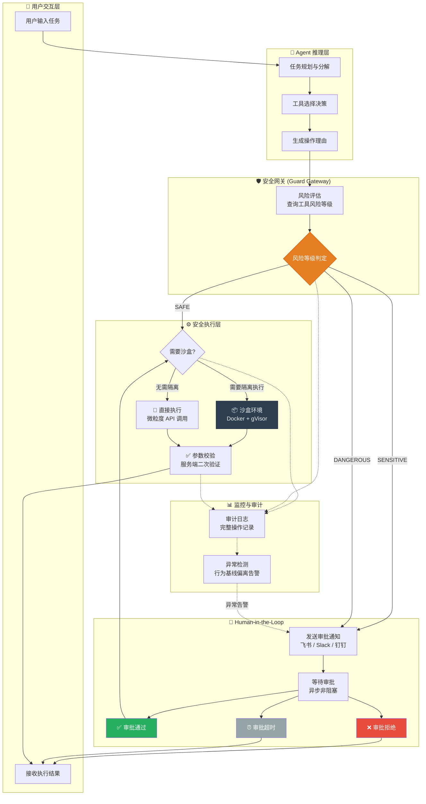

---
tags:
  - AI安全
  - Agent安全
  - 工具调用
  - 沙盒隔离
  - Human-in-the-loop
created: 2026-06-26
aliases:
  - Agentic Security
  - 智能体安全边界
---

## 文章四：智能体越权与边界控制

### 引言：当 LLM 不再只是"说话"，而是开始"动手"

前几篇文章讨论的威胁——提示词注入、越狱、隐私泄露——在"只会聊天"的 LLM 场景中已经足够危险。但 2026 年的 LLM 应用正在全面转向 **Agentic 模式**：模型不仅能生成文本，还能**调用外部工具、执行代码、操作数据库、发送 HTTP 请求**。

> [!important] 架构重点
> Agent 的安全问题不是"聊天机器人安全问题"的延伸，而是一次**质的飞跃**。当一个聊天机器人被越狱，最坏的情况是它说了不该说的话。当一个 Agent 被越狱，最坏的情况是它**删除了你的数据库、转走了你的资金、向所有客户发送了钓鱼邮件**。Agent 将 LLM 的风险从**信息安全**升级为**物理世界安全**。

### Agent 安全的核心矛盾：自主性 vs 可控性

| 维度 | LLM 聊天模式 | LLM Agent 模式 |
| ---- | ------------ | -------------- |
| **输出类型** | 文本（信息） | 动作（side effect） |
| **影响范围** | 对话窗口内 | 数据库、文件系统、网络、API |
| **错误成本** | 需要重新生成回复 | 不可逆的数据破坏/资金损失 |
| **攻击者收益** | 获取信息/制造内容 | 执行任意代码/窃取资产 |
| **恢复方式** | 清除对话历史 | 数据恢复/资金追回（可能不可行） |

### 原则一：动作空间的最小权限（PoLP for Tool Calling）

这是 Agent 安全的第一性原理。**绝对不要给 Agent 暴露一个"万能工具"。**

> [!bug] 红队视角 (Attacker)
> 如果 Agent 可以调用 `exec(code: str)` 或 `sql_query(query: str)`，攻击者只需要一条被注入的提示词就可以获得完整的 Shell 访问权限或数据库控制权。这不是"Agent 被越狱了"——这是 **Agent 本身就是一把万能钥匙**，越狱与否的区别只在于谁会来转动它。

> [!warning] 高危操作
> 以下是 Agent 工具设计的**绝对禁忌**：
> - ❌ `exec(code: str)` —— 允许 Agent 执行任意代码
> - ❌ `sql_query(raw_query: str)` —— 允许 Agent 执行任意 SQL（本质上是 SQL 注入的 Agent 版本）
> - ❌ `http_request(url: str, method: str, body: str)` —— 允许 Agent 向任意 URL 发送任意请求（SSRF + 数据外泄）
> - ❌ `send_email(to: str, subject: str, body: str)` —— 允许 Agent 向任意收件人发送任意内容（钓鱼攻击放大器）
> - ❌ `delete_file(path: str)` —— 无路径白名单的文件删除
>
> 每一个"通用型"工具都是 Agent 安全体系中的一个**单点故障（Single Point of Failure）**。

#### 安全工具设计的微粒度拆分原则

将宏观的、危险的通用工具，拆分为安全的、语义明确的微粒度工具：

```python
"""
Agent 工具设计：从"万能工具"到"安全微粒度 API"

设计原则：
1. 每个工具只做一件事，且这件事的"破坏半径"被严格限制
2. 工具参数不接受"命令字符串"或"代码片段"，只接受结构化参数
3. 工具内部实施服务器端校验——永远不信任 Agent 传入的参数
"""

# ============================================================
# ❌ 危险设计：万能型工具——攻击面巨大
# ============================================================
DANGEROUS_TOOLS = {
    "execute_sql": {
        "description": "执行任意 SQL 语句",
        "parameters": {
            "query": "string — 任意 SQL 查询语句"  # 💀 DROP TABLE 也可以传入
        }
    },
    "run_code": {
        "description": "在服务器上执行代码",
        "parameters": {
            "code": "string — Python/Shell 代码"  # 💀 rm -rf / 也可以传入
        }
    },
}


# ============================================================
# ✅ 安全设计：微粒度工具——每个工具的破坏半径被精确控制
# ============================================================
SAFE_TOOLS = {
    # 数据库操作：拆分为具体的、参数化的业务操作
    "get_customer_by_id": {
        "description": "根据客户 ID 查询客户信息。只能执行 SELECT 操作。",
        "parameters": {
            "customer_id": "integer — 客户 ID（1-999999），服务器端校验范围"
        },
        # 服务器端实现：
        # cursor.execute("SELECT name, email FROM customers WHERE id = ?", (customer_id,))
        # 注意：使用参数化查询（?），不接受拼接 SQL
    },

    "list_orders_by_customer": {
        "description": "查询指定客户的订单列表，最多返回 50 条。",
        "parameters": {
            "customer_id": "integer — 客户 ID",
            "limit": "integer — 返回条数，范围 1-50，默认 10"
        },
    },

    "update_order_status": {
        "description": "更新订单状态。仅允许从 'pending' 更新为 'cancelled'。不支持其他状态变更。",
        "parameters": {
            "order_id": "integer — 订单 ID",
            "reason": "string — 取消原因（最大 200 字符）"
        },
        # 服务器端强制校验：
        # - 验证当前状态确实是 'pending'
        # - 新状态固定为 'cancelled'，不信任 Agent 传入的状态值
        # - 记录完整的审计日志（操作人、时间戳、IP、原因）
    },

    # 文件操作：路径白名单 + 内容校验
    "read_report": {
        "description": "读取指定日期的日报文件。只能读取 /var/reports/ 目录下的文件。",
        "parameters": {
            "report_date": "string — 日期，格式 YYYY-MM-DD"
        },
        # 服务器端实现：
        # safe_path = f"/var/reports/report_{report_date}.pdf"
        # # 路径遍历防护：resolve 后必须仍在 /var/reports/ 下
        # if not os.path.realpath(safe_path).startswith("/var/reports/"):
        #     raise SecurityError("路径遍历攻击")
    },

    # 网络请求：域名白名单 + SSRF 防护
    "fetch_product_info": {
        "description": "从公司产品 API 获取产品信息。只能访问 api.company.com。",
        "parameters": {
            "product_sku": "string — 产品 SKU，格式: [A-Z]{2}-\\d{4}"
        },
        # 服务器端实现：
        # # 硬编码域名，不接受 Agent 传入 URL
        # url = f"https://api.company.com/v1/products/{product_sku}"
        # # SKU 格式校验，防止路径遍历
        # if not re.match(r'^[A-Z]{2}-\d{4}$', product_sku):
        #     raise SecurityError("无效的 SKU 格式")
    },
}
```

> [!tip] 蓝队视角 (Defender)
> 微粒度工具设计的四项准则：
> 1. **永远不接受"命令字符串"作为工具参数。** 每个工具的参数必须是结构化的业务对象，不是一段代码或 SQL 语句。
> 2. **工具内部实施"双重校验"。** 即使你"信任"Agent 不会恶意调用，也要假设它可能被注入攻击劫持——在工具的实现代码中再次校验所有参数。
> 3. **为每个工具定义"破坏半径"（Blast Radius）。** 问自己："如果这个工具被完全滥用，最坏能造成什么后果？"如果答案是"数据库被清空"或"服务器被控制"，那么这个工具需要被进一步拆分。
> 4. **区分读写权限。** Agent 的读取工具和写入工具应该分开定义。如果 Agent 只需要查询数据，就不要给它 `update_*` 或 `delete_*` 工具。最小权限原则不是"给 Agent 尽可能少的工具"，而是"给 Agent 恰好完成当前任务所需的工具"。

### 原则二：沙盒隔离——Agent 代码执行的最后一道防线

有些场景下，Agent 确实需要执行代码（如数据分析、代码生成与验证）。这时不能让它直接在生产环境中执行——必须经过**沙盒隔离**。

```python
"""
Agent 代码执行沙盒方案

方案对比：
┌─────────────────────────────────────────────────────────────┐
│ 方案          │ 隔离强度  │ 性能开销  │ 适用场景             │
├─────────────────────────────────────────────────────────────┤
│ Docker Container │ 中等     │ 低       │ 数据分析、脚本执行   │
│ gVisor (runsc)   │ 高       │ 中       │ 不可信代码执行       │
│ Firecracker      │ 极高     │ 中       │ 多租户隔离           │
│ WebAssembly      │ 极高     │ 极低     │ 轻量级函数执行       │
└─────────────────────────────────────────────────────────────┘

推荐方案：Docker + gVisor 双层隔离
"""

import subprocess
import tempfile
import os
import uuid
import json
import shlex
from dataclasses import dataclass
from pathlib import Path


@dataclass
class SandboxConfig:
    """沙盒执行配置"""
    # 资源限制
    max_cpu_quota: int = 100_000     # CPU 配额（微秒/周期），100ms = 0.1核
    max_memory_mb: int = 256         # 最大内存限制
    max_execution_seconds: int = 30  # 超时时间
    max_disk_mb: int = 100           # 最大磁盘写入

    # 网络隔离
    network_enabled: bool = False    # 默认禁用网络
    allowed_domains: list[str] = None  # 白名单域名（如需要联网）

    # 文件系统隔离
    read_only_root: bool = True      # 根文件系统只读
    writable_dir: str = "/tmp/sandbox"  # 唯一可写目录

    # 内核能力限制
    drop_all_capabilities: bool = True  # 丢弃所有 Linux capabilities
    no_new_privileges: bool = True      # 禁止提权


class CodeSandbox:
    """
    基于 Docker 的代码执行沙盒。

    安全措施（纵深防御）：
    1. Docker 容器隔离——与宿主机进程、网络、文件系统隔离
    2. 资源限制（cgroups）——防止 CPU/内存/磁盘耗尽攻击
    3. Linux capabilities 最小化——容器内无法加载内核模块、无法修改网络配置
    4. seccomp 系统调用过滤——阻止危险的系统调用（如 mount、kexec_load）
    5. 只读根文件系统——防止修改系统文件
    6. 网络隔离——默认完全断网，仅白名单放行
    """

    SANDBOX_IMAGE = "sandbox-python:3.12-slim"
    SECCOMP_PROFILE = "/etc/sandbox/seccomp.json"

    def __init__(self, config: SandboxConfig = None):
        self.config = config or SandboxConfig()

    def execute(self, code: str, timeout: int = 30) -> dict:
        """
        在沙盒中安全执行 Python 代码。

        Args:
            code: 要执行的 Python 代码
            timeout: 超时时间（秒）

        Returns:
            {
                "stdout": "标准输出内容",
                "stderr": "标准错误内容",
                "exit_code": 退出码 (0 = 正常),
                "killed": 是否因超时/资源耗尽被强制终止,
                "execution_time_ms": 执行耗时（毫秒）
            }
        """
        execution_id = uuid.uuid4().hex[:12]
        sandbox_dir = Path(f"/tmp/sandbox-{execution_id}")
        sandbox_dir.mkdir(parents=True, exist_ok=True)

        try:
            # 将代码写入临时文件（而非通过命令行参数传入——防止注入）
            code_file = sandbox_dir / "user_code.py"
            code_file.write_text(code, encoding="utf-8")

            # 构建 Docker 运行命令
            docker_cmd = self._build_docker_command(execution_id, sandbox_dir)

            # 执行
            result = subprocess.run(
                docker_cmd,
                capture_output=True,
                text=True,
                timeout=timeout + 5,  # Docker 自身超时 > 容器内超时
            )

            return {
                "stdout": result.stdout[:10_000],  # 输出截断防止撑爆内存
                "stderr": result.stderr[:10_000],
                "exit_code": result.returncode,
                "killed": result.returncode == 137,  # SIGKILL (OOM/timeout)
                "execution_time_ms": 0,  # 实际部署时从容器日志中提取
            }
        except subprocess.TimeoutExpired:
            return {"stdout": "", "stderr": "执行超时", "exit_code": -1, "killed": True, "execution_time_ms": timeout * 1000}
        finally:
            # 清理临时文件
            import shutil
            shutil.rmtree(sandbox_dir, ignore_errors=True)

    def _build_docker_command(self, execution_id: str, sandbox_dir: Path) -> list[str]:
        """
        构建安全的 Docker run 命令。

        每一条参数都有其安全含义（详见注释）。
        """
        cfg = self.config
        cmd = [
            "docker", "run", "--rm",                          # 执行完毕后自动销毁容器
            f"--name=sandbox-{execution_id}",
            "--cpus=0.5",                                     # CPU 限制：最多 0.5 核
            f"--memory={cfg.max_memory_mb}m",                 # 内存限制
            f"--memory-swap={cfg.max_memory_mb}m",            # 禁止 swap（防止磁盘 I/O 绕过内存限制）
            "--pids-limit=50",                                 # 进程数限制：防止 fork bomb
            "--read-only",                                     # 根文件系统只读
            f"--tmpfs=/tmp:size={cfg.max_disk_mb}m,noexec",   # /tmp 为内存文件系统 + 不可执行
            "--cap-drop=ALL",                                  # 丢弃所有 Linux capabilities
            "--security-opt=no-new-privileges",               # 禁止通过 suid 提权
            f"--security-opt=seccomp={self.SECCOMP_PROFILE}",  # seccomp 系统调用过滤
            "--network=none" if not cfg.network_enabled else "",  # 网络隔离
            f"--stop-timeout=3",                               # 强制终止等待时间
            # 将用户代码以只读方式挂载进容器
            f"-v={sandbox_dir}/user_code.py:/code/user_code.py:ro",
            self.SANDBOX_IMAGE,
            "timeout", str(cfg.max_execution_seconds),        # 容器内超时控制
            "python3", "-I",                                   # -I: 隔离模式（忽略 PYTHON* 环境变量）
            "/code/user_code.py",
        ]
        # 过滤掉空字符串
        return [arg for arg in cmd if arg]
```

> [!tip] 蓝队视角 (Defender)
> 沙盒隔离不是"设置一次就忘记"的配置。你需要在运维层面建立持续的验证机制：
> 1. **定期沙盒逃逸测试**：使用已知的 Docker 逃逸 POC（如 CVE-2024-21626 runc 逃逸）定期验证你的沙盒配置是否仍然有效。
> 2. **监控异常模式**：如果某个 Agent 突然开始执行大量 `import os`、`import subprocess`、`import socket` 的代码，即使它在沙盒内，这也是一个需要调查的安全事件——它可能已经被注入攻击劫持。
> 3. **沙盒分层**：对于不同风险等级的代码，使用不同强度的沙盒。内部数据分析 → Docker；用户提交的代码 → gVisor；多租户场景 → Firecracker microVM。

### 原则三：人机协同（Human-in-the-Loop）——高危操作的强制审批断点

当 Agent 要执行的操作属于"不可逆"或"高风险"类别时，自动化流程必须在执行前**强制中断并等待人类审批**。

```python
"""
Human-in-the-Loop (HITL) 审批网关

核心设计：
1. 将 Agent 的工具分为三个风险等级：SAFE / SENSITIVE / DANGEROUS
2. SAFE 操作自动执行
3. SENSITIVE 操作需要人类审批（可设置自动过期时间）
4. DANGEROUS 操作强制人类审批 + 二次确认

审批流程：
Agent决策 → 工具调用请求 → 风险评估 → [SAFE]直接执行
                                    → [SENSITIVE/DANGEROUS]入队等待审批
                                    → 人类审批/拒绝 → 执行/回滚
"""

from enum import Enum
from dataclasses import dataclass, field
from datetime import datetime, timedelta
from typing import Optional, Callable, Any
import asyncio
import uuid


class RiskLevel(Enum):
    """操作风险等级"""
    SAFE = "safe"            # 只读操作、查询类——自动执行
    SENSITIVE = "sensitive"  # 修改操作、但可逆——需要单人审批
    DANGEROUS = "dangerous"  # 不可逆操作、资金操作——需要双人审批


@dataclass
class ApprovalRequest:
    """审批请求"""
    request_id: str
    agent_id: str
    tool_name: str
    tool_params: dict
    risk_level: RiskLevel
    reason: str               # Agent 给出的操作理由（帮助审批者决策）
    created_at: datetime
    expires_at: datetime      # 审批请求自动过期时间
    status: str = "pending"   # pending / approved / rejected / expired

    # 审批信息
    approved_by: Optional[str] = None
    approved_at: Optional[datetime] = None
    second_approved_by: Optional[str] = None  # DANGEROUS 级别需要双人审批
    second_approved_at: Optional[datetime] = None


class HumanInTheLoopGateway:
    """
    人机协同（HITL）审批网关。

    在所有 Agent 工具调用之前介入，根据操作风险等级决定是否需要人类审批。

    工作流程：
    1. Agent 发起工具调用请求
    2. 网关查询该工具的风险等级
    3. SAFE → 直接放行
    4. SENSITIVE/DANGEROUS → 生成审批请求，Agent 流程挂起
    5. 人类审批者收到通知（钉钉/飞书/Slack/邮件）
    6. 审批通过 → 恢复 Agent 流程，执行工具调用
    7. 审批拒绝 → Agent 流程收到拒绝通知，可以尝试替代方案
    """

    # 工具风险等级映射表——每个工具在注册时必须申明风险等级
    TOOL_RISK_MAP = {
        # SAFE 操作：只读、无副作用
        "get_customer_by_id": RiskLevel.SAFE,
        "list_orders_by_customer": RiskLevel.SAFE,
        "search_knowledge_base": RiskLevel.SAFE,

        # SENSITIVE 操作：有副作用但可逆
        "update_order_status": RiskLevel.SENSITIVE,
        "create_draft_report": RiskLevel.SENSITIVE,
        "send_notification": RiskLevel.SENSITIVE,

        # DANGEROUS 操作：不可逆或涉及资金
        "execute_refund": RiskLevel.DANGEROUS,
        "delete_customer_data": RiskLevel.DANGEROUS,
        "transfer_funds": RiskLevel.DANGEROUS,
        "send_mass_email": RiskLevel.DANGEROUS,
        "modify_production_config": RiskLevel.DANGEROUS,
    }

    def __init__(self):
        self.pending_approvals: dict[str, ApprovalRequest] = {}
        self.approval_callbacks: dict[str, asyncio.Event] = {}

    def get_risk_level(self, tool_name: str) -> RiskLevel:
        """获取工具的风险等级（未注册的工具默认为 DANGEROUS）"""
        return self.TOOL_RISK_MAP.get(tool_name, RiskLevel.DANGEROUS)

    async def request_approval(
        self,
        agent_id: str,
        tool_name: str,
        tool_params: dict,
        reason: str,
        timeout_minutes: int = 30,
    ) -> bool:
        """
        提交审批请求并等待结果。

        Args:
            agent_id: 发起请求的 Agent 标识
            tool_name: 要调用的工具名
            tool_params: 工具调用参数
            reason: Agent 给出的操作理由
            timeout_minutes: 审批超时时间（超时后自动拒绝）

        Returns:
            bool: True = 审批通过, False = 审批被拒绝或超时
        """
        risk_level = self.get_risk_level(tool_name)
        request_id = uuid.uuid4().hex[:16]

        approval = ApprovalRequest(
            request_id=request_id,
            agent_id=agent_id,
            tool_name=tool_name,
            tool_params=tool_params,
            risk_level=risk_level,
            reason=reason,
            created_at=datetime.now(),
            expires_at=datetime.now() + timedelta(minutes=timeout_minutes),
        )

        self.pending_approvals[request_id] = approval
        self.approval_callbacks[request_id] = asyncio.Event()

        # 发送审批通知（飞书/钉钉/Slack/邮件）
        await self._send_approval_notification(approval)

        # 等待审批结果或超时
        try:
            await asyncio.wait_for(
                self.approval_callbacks[request_id].wait(),
                timeout=timeout_minutes * 60,
            )
        except asyncio.TimeoutError:
            approval.status = "expired"
            return False

        # 清理
        approval = self.pending_approvals.pop(request_id, None)
        self.approval_callbacks.pop(request_id, None)

        return approval and approval.status == "approved"

    def approve(self, request_id: str, approver_id: str) -> bool:
        """人类审批者批准请求"""
        approval = self.pending_approvals.get(request_id)
        if not approval or approval.status != "pending":
            return False

        risk_level = approval.risk_level

        if risk_level == RiskLevel.SENSITIVE:
            # 单人审批即通过
            approval.status = "approved"
            approval.approved_by = approver_id
            approval.approved_at = datetime.now()
        elif risk_level == RiskLevel.DANGEROUS:
            # 双人审批逻辑
            if approval.approved_by is None:
                # 第一个审批者
                approval.approved_by = approver_id
                approval.approved_at = datetime.now()
                return True  # 等待第二个审批者
            elif approval.approved_by != approver_id:
                # 第二个审批者（不能与第一人相同）
                approval.second_approved_by = approver_id
                approval.second_approved_at = datetime.now()
                approval.status = "approved"

        # 审批完成，唤醒等待中的 Agent 流程
        if approval.status == "approved":
            self.approval_callbacks[request_id].set()

        return True

    def reject(self, request_id: str, approver_id: str, reject_reason: str = "") -> bool:
        """人类审批者拒绝请求"""
        approval = self.pending_approvals.get(request_id)
        if not approval:
            return False

        approval.status = "rejected"
        self.approval_callbacks[request_id].set()  # 唤醒 Agent（但返回 False）
        return True

    async def _send_approval_notification(self, approval: ApprovalRequest):
        """
        发送审批通知。

        实际部署时，替换为飞书/钉钉/Slack API 调用。
        通知内容应包含：
        - 操作名称和参数（人类可读的摘要，而非原始 JSON）
        - 风险等级
        - Agent 给出的理由
        - [审批] 和 [拒绝] 按钮（回调至 approve/reject API）
        """
        notification = f"""
        ⚠️ Agent 操作审批请求

        操作: {approval.tool_name}
        参数: {json.dumps(approval.tool_params, ensure_ascii=False, indent=2)}
        风险: {approval.risk_level.value.upper()}
        理由: {approval.reason}

        Agent: {approval.agent_id}
        过期: {approval.expires_at.strftime('%Y-%m-%d %H:%M:%S')}
        """
        # 生产环境: 调用飞书机器人 / Slack Webhook / 邮件 API
        print(notification)
```

> [!tip] 蓝队视角 (Defender)
> HITL 审批系统的三个工程雷区：
> 1. **审批不能阻塞整个系统。** 如果一个 Agent 的审批挂起导致整个线程池被耗尽，那就是你自己给自己造了一颗"审批炸弹"。审批等待必须是异步、非阻塞的。
> 2. **审批界面必须展示足够的上下文。** 不要在审批通知里只写"Agent 请求调用 execute_refund"。要展示：退多少钱？退给谁？理由是什么？操作的可逆性如何？审批者需要有足够信息做出判断。
> 3. **DANGEROUS 操作的双人审批不能流于形式。** 如果第二个审批者看到"已被 XX 批准"就直接点通过，那双人审批就形同虚设。系统应该对审批行为本身进行监控——如果一个审批者长期"秒批"所有请求，需要触发安全审计。

### Agent 执行全流程安全架构



### Agent 安全的终极哲学

> [!important] 架构重点
> 当你给一个 Agent 装上"手脚"（工具调用能力）之后，安全设计的核心问题不再是"它会不会说错话"，而是——
>
> **"如果这个 Agent 被完全攻破（Assume Breach），它的破坏半径有多大？"**
>
> 答案不应该取决于你有多信任你的 Prompt 加固或护栏系统，而应该取决于 Agent 的**建筑结构（Architecture）**本身：
> - 微粒度工具（PoLP）将破坏半径从"整个系统"缩小为"单个业务操作"
> - 沙盒隔离将破坏半径从"宿主机"缩小为"一个用完即毁的容器"
> - 人机协同将破坏半径从"自动执行的灾难"缩小为"等待审批的请求"
>
> **没有单一的安全机制可以保护 Agent——但三层机制的叠加可以将攻击者的成功概率和成功后的影响降低到可接受的风险水平。**

### 总结

Agent 安全是 LLM 安全领域中最具挑战性的分支，因为它将"信息风险"升级为"物理世界风险"。三根支柱——最小权限（PoLP）、沙盒隔离（Sandboxing）、人机协同（HITL）——构成了 Agent 安全的防御三角。每根支柱各自独立地限制了 Agent 被攻破后的"破坏半径"，三者叠加形成了一个**纵深防御体系**。这不是"哪个方案最好"的问题——你必须同时使用它们。

---

*四篇文章到此完结。从威胁建模到防御架构，从 RAG 数据安全到 Agent 边界控制——这套知识体系构成了 AI 安全工程的核心骨架。建议与安全团队逐篇深入讨论，结合实际业务场景细化为可落地的安全策略文档。*
