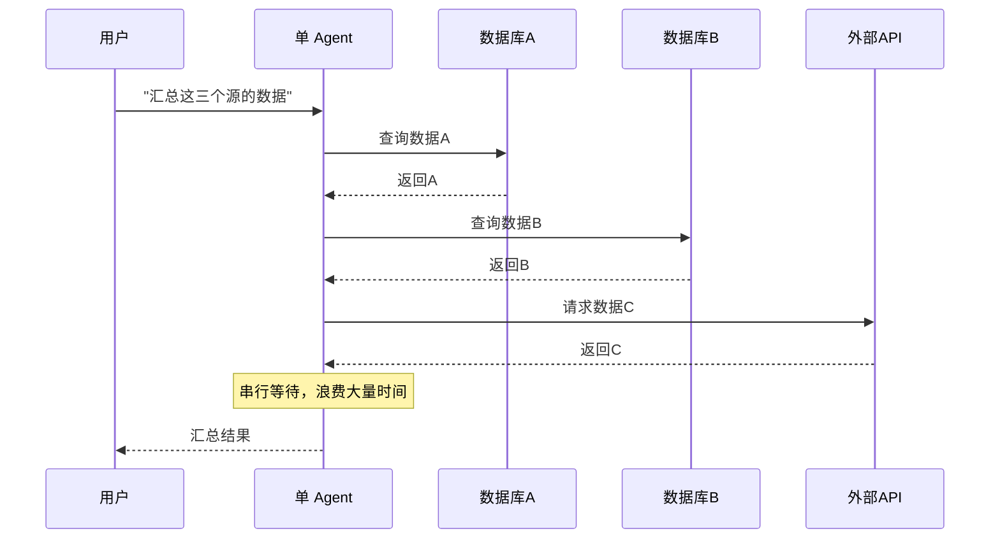
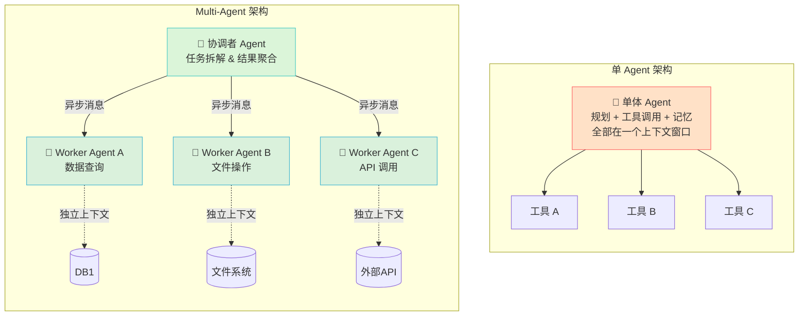
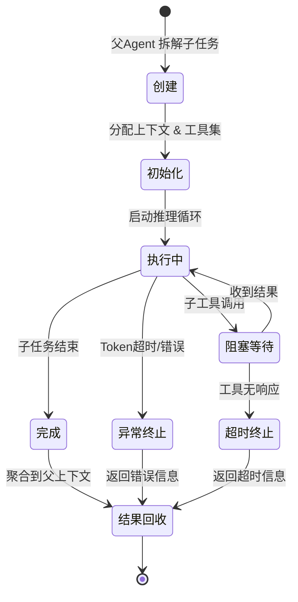
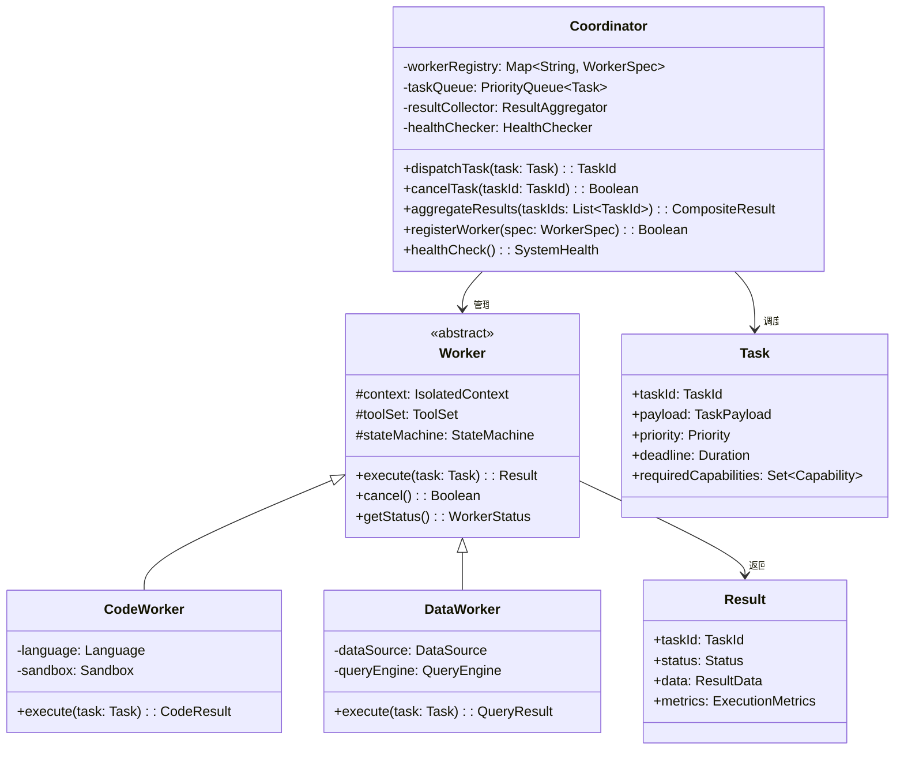
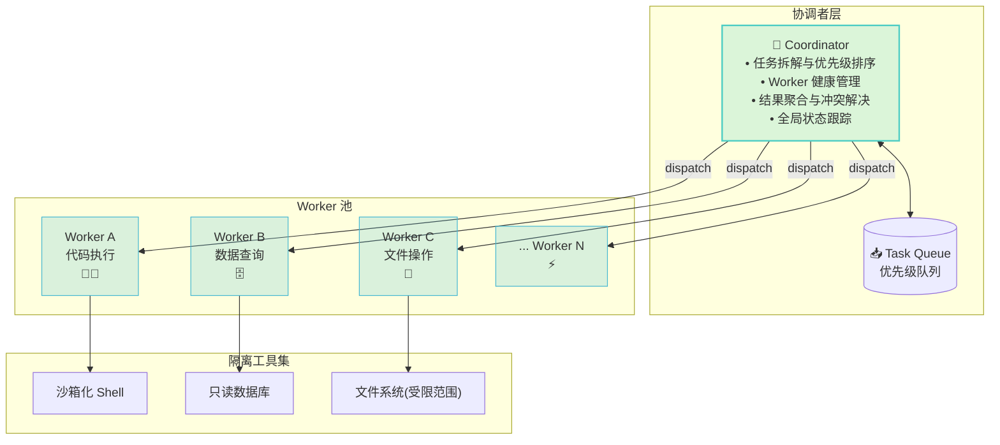
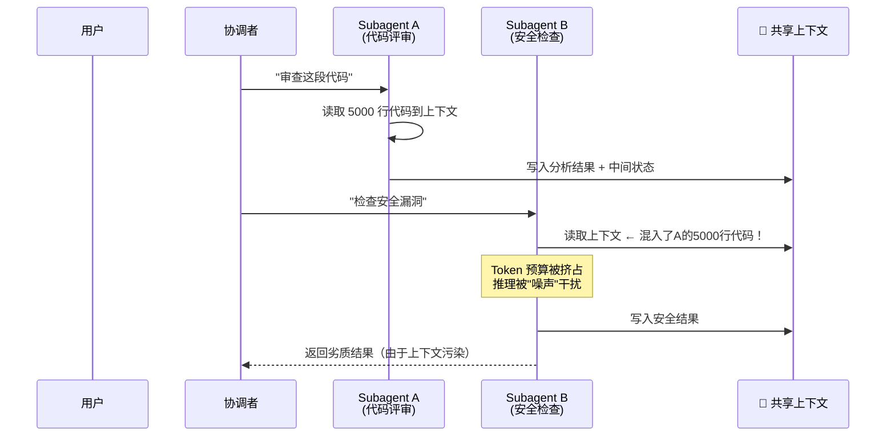
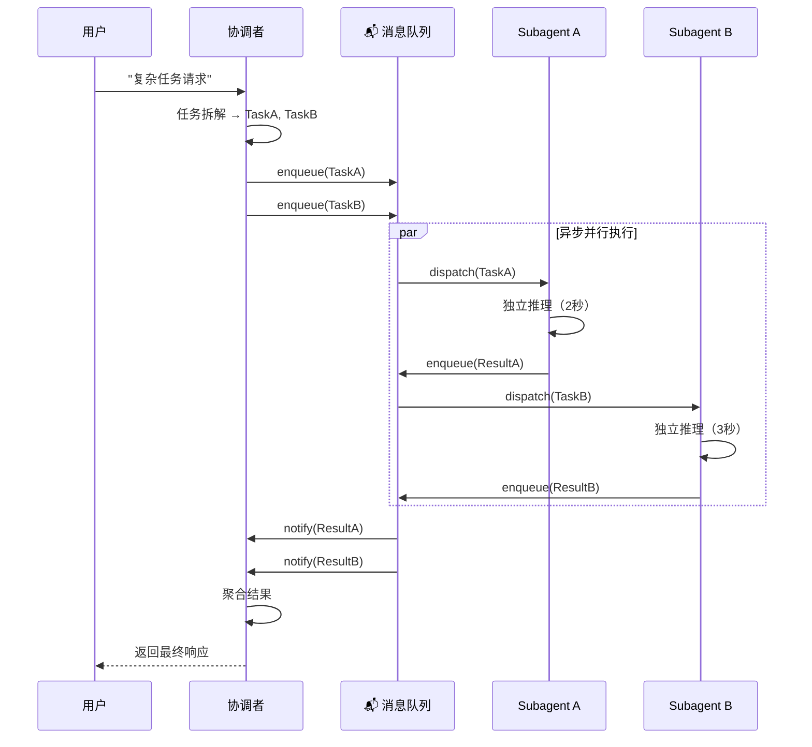
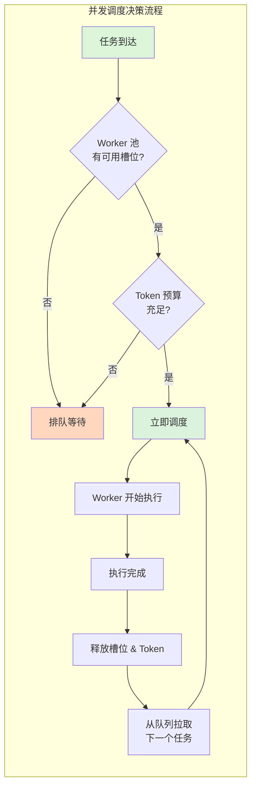
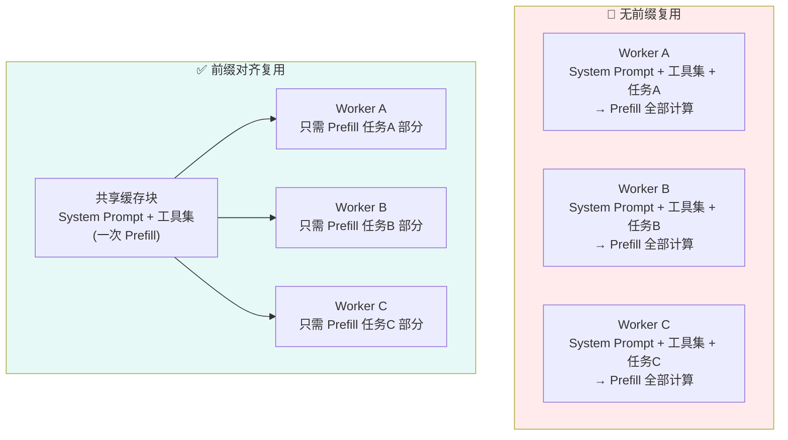

# Multi-Agent 的架构解析与工程实践

> [!summary] 本文面向读者
> 有一定后端或 AI 开发经验，希望深入了解并动手搭建 Multi-Agent 系统的工程师。
>
> 写作目标：不是泛泛介绍 Multi-Agent 的概念，而是从"单 Agent 的工程天花板"讲起，逐步解析核心架构模式、隔离机制、异步通信和并发调度等**真正落地**时绕不开的工程挑战。

> [!summary] 前置阅读
> - [[重新认识AI]] — Agent 系统的基本概念与演进脉络
> - [[Model_Context_Protocol_MCP|MCP]] — AI 与外部工具的标准连接协议

---

## 1. 引言：为什么我们需要走向 Multi-Agent？

### 1.1 单 Agent 的工程天花板

在构建 [[重新认识AI|Agent 系统]] 的初期，一个单 Agent —— 即一个 LLM 实例 + 一套工具集 —— 能够解决大多数问题。但随着业务复杂度提升，单 Agent 模型的工程瓶颈开始显现：

> [!warning] 实践排坑：单 Agent 的三大瓶颈

**① 上下文污染 (Context Pollution)**

单 Agent 所有工具调用、中间结果、历史信息都写入同一个上下文窗口。一旦某个工具返回了异常数据或超长响应，整个上下文被"污染"，后续推理质量急剧下降。

```
用户请求 → [LLM] ← 工具A结果（正常）
                    ← 工具B结果（含 2 万行日志）
                    ← 工具C结果（正常）
                    ← 记忆检索结果
  ↑ 当工具B的结果异常，LLM 被"垃圾数据"包围
```

**② 职责耦合 (Responsibility Coupling)**

一个 Agent 既要理解用户意图，又要规划步骤，还要执行文件操作、调用 API、查询数据库。这些职责全部耦合在一个推理循环中：

- 修改文件系统的代码和策略规划的逻辑共享同一个 Token 预算
- 安全策略和业务逻辑无法独立演进
- 无法对"高危操作"（如删除文件）单独设置审批门禁

**③ 单线程阻塞 (Single-threaded Blocking)**

LLM 推理本身是顺序的：发出一次工具调用 → 等待返回 → 继续推理。当需要并行查询多个数据源时，单 Agent 只能串行执行：



### 1.2 单 Agent vs Multi-Agent：工作流对比

> [!info] 概念解析
> **Multi-Agent** 的核心思想是：将一个复杂的 AI 任务拆解为多个子任务，由多个专门化的 Agent 实例协同完成，通过**职责分离、隔离执行、异步通信**来突破单 Agent 的天花板。



| 维度 | 单 Agent | Multi-Agent |
|:---|:---|:---|
| 上下文隔离 | 共享窗口，互相污染 | 独立上下文，各司其职 |
| 职责边界 | 模糊耦合 | 接口化、协议化 |
| 并行能力 | 串行调度 | 异步并发 |
| 扩展性 | 水平受限 | 可动态增减 Worker |
| 故障域 | 整体崩溃 | 局部隔离 |

> [!abstract] 核心提要：Multi-Agent 的架构哲学
> Multi-Agent 本质上是一种**分布式计算范式在 AI 系统中的映射**。它将"一个全能的 Agent"拆解为"一群协作的 Specialist"，通过明确的通信协议、严格的隔离边界和异步调度机制，在保留 LLM 推理能力的同时，获得了工程上的**可伸缩性、可观测性和可靠性**。
>
> 核心思想可以概括为 16 个字：**职责分离、隔离执行、异步协同、容错设计**。

---

## 2. 核心架构模式拆解

Multi-Agent 不是一种固定的架构，而是根据任务的**粒度**和**耦合度**衍生出不同的模式。在实践中，最常见的两种模式是 **父子模式** 和 **主从协调模式**。

### 2.1 父子模式 (Subagent / Hierarchical)

> [!info] 概念解析
> **父子模式**是最直观的 Multi-Agent 架构：一个父 Agent 将任务拆解为子任务，为每个子任务生成一个 **Subagent**，Subagent 执行完成后返回结果给父 Agent。

#### 生命周期

父子模式的核心在于 Subagent 的**生命周期管理**：



**状态定义**：

```kotlin
/**
 * Subagent 生命周期的严格状态机定义。
 * 每个状态转换都必须经过协调者确认，防止状态漂移。
 */
enum class SubagentState {
    /** 任务已拆分，但上下文尚未初始化 */
    PENDING,

    /** 上下文已分配，推理循环已启动 */
    ACTIVE,

    /** 等待外部工具调用返回（异步阻塞） */
    BLOCKED,

    /** 任务正常结束，结果已就绪 */
    COMPLETED,

    /** 异常终止（Token 耗尽、LLM 错误等） */
    FAILED,

    /** 工具调用超时 */
    TIMEOUT
}

/**
 * Subagent 的上下文边界定义。
 * 每个 Subagent 获得父上下文的只读快照 + 自己的读写隔离区域。
 */
data class SubagentContext(
    /** 父 Agent 上下文的只读快照（不可变引用） */
    val parentSnapshot: ReadOnlyContext,

    /** Subagent 私有的工作区（完全隔离） */
    val privateWorkspace: MutableContext,

    /** 允许使用的工具白名单 */
    val allowedTools: Set<ToolPermission>,

    /** 最大 Token 预算 */
    val maxTokens: Int
)
```

> [!tip] 架构金律
> **父子模式适用于"深度优先"的任务**——即任务天然可以层次化拆解，每个子任务有明确的输入输出边界。典型场景：
>
> - **代码审查**：父 Agent 拆解为"检查语法 → 检查性能 → 检查安全"三个 Subagent
> - **文档生成**：父 Agent 生成大纲，Subagent 各自撰写一个章节
> - **多步推理**：每个推理步骤作为一个独立 Subagent，防止上下文污染

#### 适用边界

| 判断维度 | 适合父子模式 | 不适合父子模式 |
|:---|:---|:---|
| 子任务耦合度 | 低耦合，独立输入输出 | 高度依赖，需要频繁协作 |
| 子任务数量 | 通常 < 20 个 | 大规模（> 100 个） |
| 执行顺序 | 可并行或简单串行 | 复杂的 DAG 依赖关系 |
| 容错要求 | 单个失败可接受 | 需要全局协调和重试 |

### 2.2 主从协调模式 (Coordinator-Worker)

> [!info] 概念解析
> **主从协调模式**引入了一个**纯协调者 (Coordinator)** 角色。Coordinator 不执行具体任务，而是专注于**任务调度、结果聚合、异常处理和负载均衡**。





> [!important] 关键理解：Coordinator 的"纯协调者"定位
>
> Coordinator **不应该做任何具体的业务推理**。它的 LLM 能力只用于：
>
> 1. **任务拆解**：将用户请求分解为可并行/串行的子任务
> 2. **结果聚合**：将 Worker 的返回合并为有意义的最终响应
> 3. **异常决策**：当 Worker 失败时决定重试、降级还是终止
>
> 如果 Coordinator 开始"顺手"做业务执行，就会退化成一个有 Multi-Agent 皮囊的单 Agent，同时承受了分布式复杂度和单 Agent 的所有缺点。

### 2.3 两种模式的选型对比

> [!compare] 父子模式 vs 主从协调模式

| 维度 | 父子模式 (Subagent) | 主从协调模式 (Coordinator-Worker) |
|:---|:---|:---|
| **角色定位** | 父 Agent 兼任协调和执行 | 纯协调者 + 纯执行者分离 |
| **子任务数量** | 小规模（< 20） | 中大规模（10 ~ 1000+） |
| **任务耦合** | 低 ~ 中 | 低（Worker 之间无依赖） |
| **复杂度** | 轻量级，实现简单 | 重量级，需要消息队列/注册中心 |
| **容错策略** | 局部重试或跳过 | 全局调度、降级、熔断 |
| **典型实现** | LangGraph、AutoGen 子 Agent | Claude Code Subagent、OpenClaw Worker |
| **适用场景** | 代码审查、文档写作、数据分析 | 大规模爬虫、批量代码迁移、持续集成 |

---

## 3. 工程实践难点一：坚如磐石的隔离机制

> [!warning] 实践排坑
> **隔离是 Multi-Agent 系统的第一道防线，也是最容易被低估的工程挑战。** 不少初期的 Multi-Agent 系统直接让所有 Subagent 共享一个上下文——这基本上在复刻单 Agent 的所有问题，甚至更糟。

### 3.1 为什么不能简单共享上下文？

**反面场景** — 没有隔离的 Multi-Agent：



> [!bug] 常见反面模式：共享上下文的连锁灾难
>
> 一个生产环境中的真实案例：
>
> 1. Subagent A 执行文件搜索，返回了 15,000 行的项目目录结构
> 2. 这些数据被写入共享上下文
> 3. Subagent B 的安全审查任务 Token 预算被大量占用，导致关键漏洞分析被截断
> 4. 协调者基于 B 的不完整结果做出了"无严重漏洞"的错误结论
> 5. 最终后果：**一个有漏洞的 PR 被合并到了生产分支**
>
> 这就是没有隔离机制的典型代价。

### 3.2 细粒度的状态隔离策略

正确的做法是**为每个 Subagent 创建独立的上下文边界**：

```kotlin
/**
 * 上下文隔离的核心抽象。
 * 每个 Subagent 获得一个隔离的 ContextScope，通过深浅拷贝策略
 * 在"数据共享"和"隔离安全"之间取得平衡。
 */
interface ContextIsolationPolicy {

    /**
     * 为 Subagent 创建隔离的上下文环境。
     *
     * @param parentContext 协调者的当前上下文
     * @param isolationLevel 隔离级别（见下）
     * @param budget Token 预算上限
     * @return 隔离后的子上下文
     */
    fun isolate(
        parentContext: Context,
        isolationLevel: IsolationLevel,
        budget: TokenBudget
    ): IsolatedContext

    /**
     * 将 Subagent 的执行结果合并回父上下文。
     * 支持自定义合并策略（追加、覆盖、仅摘要）。
     */
    fun mergeBack(
        parentContext: Context,
        subagentResult: IsolatedContext,
        mergeStrategy: MergeStrategy
    ): Context
}

/**
 * 隔离级别定义。
 * 级别越高，隔离越彻底，但通信开销越大。
 */
enum class IsolationLevel {
    /** 只读共享父上下文，仅工作区隔离 */
    LIGHTWEIGHT,

    /** 父上下文深度克隆，Subagent 拥有完整副本 */
    FULL_CLONE,

    /** 完全独立上下文，父上下文只传递任务的 Input DTO */
    ZERO_SHARING
}

/**
 * 读写权限控制。
 * 每个 Tool 在被 Subagent 调用前必须经过权限检查。
 */
data class ToolPermission(
    val toolName: String,
    /** 允许的操作类型 */
    val allowedOperations: Set<Operation>,
    /** 速率限制（次/分钟） */
    val rateLimit: Int,
    /** 是否需要审批门禁 */
    val requiresApproval: Boolean = false
)

enum class Operation {
    READ,       // 只读
    WRITE,      // 写入
    DELETE,     // 删除（高危）
    EXECUTE     // 执行（高危）
}
```

> [!tip] 架构金律：上下文隔离的三种策略
>
> 1. **写时克隆 (Copy-on-Write)**：Subagent 启动时共享父上下文的只读引用，仅在修改时创建副本。适合大多数场景，性能和隔离的平衡最佳。
>
> 2. **基于 Checkpoint 的 Diff 同步**：父上下文定期生成 Checkpoint，Subagent 只接收增量变更。适合上下文极大（> 100K tokens）的场景。
>
> 3. **结果摘要注入**：Subagent 不获得完整上下文，而是接收任务描述 + 关键背景摘要。执行完毕后，只将**结构化摘要**写回父上下文。适合零共享策略。

### 3.3 工具权限分级体系

隔离不止是上下文数据，更关键的是**工具调用的权限控制**。Subagent 没有权限访问所有工具——它只能使用白名单中的工具。

```kotlin
/**
 * 工具注册中心 —— Multi-Agent 系统的权限网关。
 * 所有工具调用必须先通过中心的路由和鉴权。
 */
class ToolRegistry {
    private val toolPermissions: Map<String, ToolPermission> = mutableMapOf()
    private val auditLogger: AuditLogger = AuditLogger()

    /**
     * 校验并执行工具调用。
     * 返回 Result 类型——调用可能因权限不足而被拒绝。
     */
    fun execute(
        agentId: AgentId,
        toolName: String,
        args: JsonObject
    ): Result<Any, ToolExecutionError> {
        // 1. 权限校验
        val permission = toolPermissions[toolName]
            ?: return Result.failure(ToolNotFound(toolName))

        if (toolName !in getAllowedToolsFor(agentId)) {
            auditLogger.warn(agentId, "UNAUTHORIZED_TOOL_CALL", toolName)
            return Result.failure(PermissionDenied(toolName))
        }

        // 2. 速率限制校验
        if (!rateLimiter.tryAcquire(agentId, toolName, permission.rateLimit)) {
            return Result.failure(RateLimitExceeded(toolName))
        }

        // 3. 审批门禁
        if (permission.requiresApproval) {
            val approved = approvalGate.request(agentId, toolName, args)
            if (!approved) {
                return Result.failure(ApprovalDenied(toolName))
            }
        }

        // 4. 执行（在沙箱中）
        return sandboxExecutor.execute(agentId, toolName, args)
    }

    /**
     * 获取指定 Agent 的工具白名单。
     * 硬件相关的、网络相关的、文件删除等高危操作会逐级受限。
     */
    fun getAllowedToolsFor(agentId: AgentId): Set<String> {
        return when (agentId.role) {
            AgentRole.COORDINATOR -> setOf(
                "task_dispatch", "result_query", "health_check"
            )
            AgentRole.CODE_WORKER -> setOf(
                "file_read", "code_search", "git_diff"
            )
            AgentRole.DATA_WORKER -> setOf(
                "db_query_readonly", "data_export"
            )
            AgentRole.DANGEROUS -> setOf(
                "file_write", "shell_exec", "network_call"
            )
        }
    }
}
```

> [!warning] 实践排坑：递归失控防护
>
> Subagent 不能拥有"创建子 Subagent"的权限。**只有协调者可以创建新的 Agent 实例。**
>
> **递归失控场景**（没有防护）：
> ```
> Agent A → 创建 Agent B → 创建 Agent C → 创建 Agent D ...
> → 直到上下文爆裂 / Token 耗尽 / 无限循环
> ```
>
> **工程约束**：
> - `maxDepth`：最大嵌套深度（通常 ≤ 3）
> - `maxSubagentCount`：单次任务最大 Subagent 数量
> - `creationTokenCost`：每创建一个 Subagent 消耗固定 Token 预算
> - 所有 Agent 创建操作必须经过 Coordinator 的审批

---

## 4. 工程实践难点二：打破阻塞的通信设计

### 4.1 为什么同步 RPC 行不通？

传统的微服务通信中，同步 RPC（gRPC/HTTP）是主流选择。但在 Multi-Agent 系统中，同步调用会带来致命的阻塞问题：

> [!bug] 常见反面模式：同步通信的死锁陷阱
>
> ```
> 协调者 → 同步调用 Subagent A（LLM 推理 5 秒）
>        → 同步调用 Subagent B（LLM 推理 8 秒）
>        → 同步调用 Subagent C（LLM 推理 3 秒）
>        → 总耗时 = 5 + 8 + 3 = 16 秒（串行）
>
> 而且！如果 Subagent A 调用的工具无响应（例如数据库挂了），
> A 会持续阻塞，而 B 和 C 根本没有机会开始执行。
> ```

同步调用的三大问题：

| 问题 | 表现 | 后果 |
|:---|:---|:---|
| **串行瓶颈** | 一个 Agent 推理时，其他全部等待 | 整体吞吐 = 单个 Agent 的吞吐 / N |
| **级联失败** | 单个 Subagent 卡死 → 整个链路阻塞 | 故障扩散到全系统 |
| **资源浪费** | 等待期间 LLM 实例空闲但被占用 | 付费 Token 在空转 |

### 4.2 基于消息队列的异步通信模型

> [!info] 概念解析
> Multi-Agent 的通信应该采用**事件驱动 + 消息队列**的异步模式。协调者和 Subagent 之间不直接调用，而是通过消息通道进行解耦通信。



### 4.3 XML 通知注入的唤醒机制

在像 [[Model_Context_Protocol_MCP|MCP]] 这样的协议中，一个实用的异步模式是 **XML/结构化通知注入**：当 Subagent 的结果就绪时，通过一个轻量级通知消息"唤醒"协调者，协调者再从消息队列中拉取完整结果。

```kotlin
/**
 * Subagent → 协调者的异步通知消息。
 * 只包含必要元数据，不携带完整 payload。
 * 这保证了通知本身的轻量和实时性。
 */
data class AgentNotification(
    /** 消息唯一标识 */
    val messageId: MessageId,

    /** 发送方 Agent */
    val from: AgentId,

    /** 接收方 Agent */
    val to: AgentId,

    /** 通知类型 */
    val type: NotificationType,

    /** 任务 ID（关联到原始任务） */
    val taskId: TaskId,

    /** 状态摘要（简短，< 200 chars） */
    val summary: String,

    /** 结果是否在消息队列中可用 */
    val resultAvailable: Boolean,

    /** 消息队列中的结果引用 */
    val resultRef: ResultRef? = null,

    /** 时间戳 */
    val timestamp: Instant = Instant.now()
)

/**
 * 异步通信的核心接口 —— 消息总线。
 * 所有 Agent 之间的通信都经过此总线，不直接调用。
 */
interface MessageBus {
    /** 发送通知（非阻塞，立即返回） */
    fun send(notification: AgentNotification)

    /** 订阅指定类型的通知 */
    fun subscribe(
        agentId: AgentId,
        handler: (AgentNotification) -> Unit
    ): Subscription

    /** 从队列中拉取完整的任务结果 */
    fun <T> fetchResult(ref: ResultRef): CompletableFuture<T>
}

/**
 * 协调者的事件循环 —— 异步处理的核心。
 * 基于消息驱动而非轮询，避免无意义的 Token 消耗。
 */
class CoordinatorEventLoop(
    private val messageBus: MessageBus,
    private val taskOrchestrator: TaskOrchestrator
) {
    fun start(): Unit = coroutineScope {
        // 订阅所有 Worker 的通知
        messageBus.subscribe(AgentRole.WORKER) { notification ->
            when (notification.type) {
                NotificationType.TASK_COMPLETED -> {
                    // 结果可用，从队列拉取并聚合
                    launch {
                        val result = messageBus.fetchResult<Result>(
                            notification.resultRef!!
                        )
                        taskOrchestrator.onWorkerResult(
                            notification.taskId, result
                        )
                    }
                }
                NotificationType.TASK_FAILED -> {
                    // 异常处理：重试 / 降级 / 上报
                    taskOrchestrator.onWorkerFailed(
                        notification.taskId, notification.summary
                    )
                }
                NotificationType.TASK_HEARTBEAT -> {
                    // 心跳检测，更新活跃状态
                    taskOrchestrator.refreshHeartbeat(
                        notification.taskId
                    )
                }
            }
        }
    }
}
```

> [!tip] 架构金律：异步通信的四大设计原则
>
> 1. **通知轻量化**：通知消息只携带"有结果了"的信号，不携带数据本身。完整数据存放在消息队列中，由接收方按需拉取。
>
> 2. **非阻塞调度**：协调者发出任务后立即返回，不等待 Worker 完成。Worker 结果通过回调/通知的方式异步到达。
>
> 3. **超时 + 心跳**：每个任务有明确的 TTL。Worker 定期发送心跳（heartbeat），超时未完成的 Worker 会被标记为失败并触发重试。
>
> 4. **幂等消息**：每条消息有唯一 ID（`messageId`），消费端保证幂等处理，防止消息重投导致重复执行。

### 4.4 通信协议对比

| 维度 | 同步 RPC | 异步消息队列 | XML 通知注入 |
|:---|:---|:---|:---|
| **延迟** | 低（串行） | 中（队列开销） | 低（轻量通知） |
| **吞吐** | 低（串行阻塞） | 高（并行消费） | 高 + 实时 |
| **耦合度** | 高（直接依赖） | 低（通过队列解耦） | 低（事件驱动） |
| **失败隔离** | 差（级联崩溃） | 好（独立消费） | 好（通知独立） |
| **实现复杂度** | 低 | 中 | 中 |
| **适用场景** | 内部微服务调用 | 大规模任务分发 | Agent 间心跳/信号 |

---

## 5. 工程实践难点三：高并发与成本优化的艺术

### 5.1 并发调度：最大化并行吞吐

Multi-Agent 的核心优势之一是并行。但"并行"不等于"越多越好"——需要考虑 LLM 实例数、Token 速率限制、下游服务负载等因素。

```kotlin
/**
 * 并发调度器 —— 控制 Worker 的并行度。
 * 不是简单的线程池，而是感知 Token 预算和下游负载的智能调度。
 */
class ConcurrencyScheduler(
    /** 全局最大并行 Worker 数 */
    private val maxConcurrency: Int = 8,
    /** 每个 Worker 的 Token 预算 */
    private val tokenBudgetPerWorker: TokenBudget = TokenBudget(32000),
    /** 全局 Token 速率限制（TPM = Tokens Per Minute） */
    private val globalTpmLimit: Int = 100_000
) {
    private val activeWorkers: MutableMap<TaskId, WorkerHandle> = mutableMapOf()
    private val pendingQueue: PriorityQueue<ScheduledTask> = PriorityQueue()

    /**
     * 调度任务 —— 根据当前水位决定立即执行或排队。
     */
    fun schedule(task: Task): ScheduleResult {
        return when {
            activeWorkers.size >= maxConcurrency -> {
                // 水位已满，加入等待队列
                pendingQueue.add(ScheduledTask(task, priority = task.priority))
                ScheduleResult.QUEUED
            }
            !hasAvailableTokenBudget(task) -> {
                // Token 预算不足，等待释放
                pendingQueue.add(ScheduledTask(task, priority = TaskPriority.HIGH))
                ScheduleResult.DEFERRED
            }
            else -> {
                // 立即调度
                val handle = launchWorker(task)
                activeWorkers[task.taskId] = handle
                ScheduleResult.DISPATCHED
            }
        }
    }

    /**
     * Worker 完成回调 —— 释放资源并调度下一个排队任务。
     */
    fun onWorkerCompleted(taskId: TaskId): Unit {
        activeWorkers.remove(taskId)
        releaseTokenBudget(taskId)

        // 从队列中取出最高优先级任务调度
        val next = pendingQueue.poll()
        if (next != null) {
            schedule(next.task)
        }
    }

    private fun hasAvailableTokenBudget(task: Task): Boolean {
        val currentUsage = activeWorkers.values.sumOf { it.tokenConsumed }
        val estimatedCost = estimateTokenCost(task)
        return (currentUsage + estimatedCost) < globalTpmLimit
    }
}
```



### 5.2 缓存优化：Fork 机制与前缀对齐

> [!info] 概念解析
> LLM 的推理成本中，**Prompt 处理（Prefill）** 占据了主要延迟和 Token 消耗。如果多个 Subagent 共享相同的"系统提示词 + 任务描述"前缀，可以通过**前缀缓存复用**大幅降低成本。

**核心思想**：

在 Multi-Agent 系统中，多个 Worker 通常共享相同的系统提示词（System Prompt）、安全策略和工具描述。如果这些内容在物理内存中是**字节级对齐**的，大模型推理框架（如 vLLM、TGI）可以复用 KV Cache，避免重复计算 Prefill 阶段：



> [!tip] 架构金律：成本优化的三个实战策略
>
> **策略一：共享前缀工程**
>
> 将 System Prompt、安全策略、工具 Schema 等公共内容严格对齐为字节级一致的内容块。所有 Worker 使用完全相同的前缀文本（包括换行符和空格），确保 KV Cache 可以物理复用。
>
> ```
> ✅ System Prompt + 安全策略 + 核心工具 Schema = 同一个预编译 Cache 块
> ❌ 每个 Worker 自行拼接 System Prompt（哪怕差一个空格，Cache Miss）
> ```
>
> **策略二：优先级化 Token 分配**
>
> 不要让所有 Subagent 雨露均沾地消耗 Token。根据任务重要性和阶段分配 Token：
>
> | 优先级 | 阶段 | Token 预算 | 说明 |
> |:---|:---|:---|:---|
> | P0 | 关键路径 | 80% | 主任务的核心 Subagent |
> | P1 | 辅助增强 | 15% | 可选的补充分析 |
> | P2 | 冗余校验 | 5% | 并行验证，可随时中断 |
>
> **策略三：结果缓存去重**
>
> 对于重复性工具调用（如数据库 Schema 查询、文件目录结构等），缓存结果，避免多个 Subagent 重复触发相同的 LLM 推理：
>
> ```kotlin
> class ResultCache(private val ttl: Duration = 5.minutes) {
>     private val cache: ConcurrentHashMap<CacheKey, CachedResult> = ConcurrentHashMap()
>
>     fun getOrCompute(
>         key: CacheKey,
>         compute: () -> CompletableFuture<Result>
>     ): CompletableFuture<Result> {
>         return cache[key]?.let {
>             if (it.isExpired()) {
>                 cache.remove(key)
>                 null
>             } else {
>                 CompletableFuture.completedFuture(it.result)
>             }
>         } ?: compute().thenApply { result ->
>             cache[key] = CachedResult(result, Instant.now() + ttl)
>             result
>         }
>     }
> }
> ```

### 5.3 Token 消耗的成本模型

在系统设计之初，就应该建立清晰的成本模型：

| 操作 | Token 消耗（估计） | 成本占比 |
|:---|:---|:---|
| Coordinator 任务拆解 | 500 ~ 2000 | 5% |
| Worker System Prompt（共享缓存） | 3000 ~ 8000 | 0%（一次 Prefill） |
| Worker 任务执行（每人） | 8000 ~ 32000 | 60% |
| 结果聚合 | 2000 ~ 5000 | 5% |
| 工具调用结果（动态） | 5000 ~ 50000+ | 30%（取决于工具数据量） |

> [!success] 最佳实践
> **在设计 Multi-Agent 系统时，把 Token 成本作为一等架构指标。**
>
> 具体做法：
> - 每个任务执行前先**估算 Token 消耗**，超出预算的请求直接降级
> - 建立 **Token 预算池**，按优先级分配而非按需使用
> - 对 Subagent 的结果大小做**上限约束**（例如：每个 Worker 返回 ≤ 4000 tokens 的摘要）
> - 定期审计 Token 流向，找出"Token 黑洞"并优化

---

## 6. 构建高可用 Multi-Agent 系统的架构原则

### 6.1 三条反面教训

> [!bug] 常见反面模式：我们在生产环境见到的真实崩溃

**教训一："万能 Worker"的陷阱**

> 有人设计了一个"通用 Worker"——它拥有所有工具的访问权限，什么任务都能干。结果是：这个 Worker 变成了一个**没有隔离的单 Agent**，所有 Multi-Agent 的架构优势全部消失。
>
> **原则：每个 Worker 的职责和工具必须是受限的。宁可多几种专用 Worker，也不要一个万能 Worker。**

**教训二："超级 Context"的诱惑**

> 为了让 Subagent "理解全局"，协调者把整个项目背景都塞进了子上下文。Subagent 还没开始干活，Token 预算已经花了一半。
>
> **原则：只传递"任务需要知道的最小上下文"。多传不等于多懂，多传 = 多花钱 + 低质量。**

**教训三："无状态"的过度设计**

> 为了追求"弹性伸缩"，有人设计了完全无状态的 Worker——所有状态都存在外部存储中。结果是 Worker 每次启动都要重新加载全部上下文，延迟暴增。
>
> **原则：正确比纯粹更重要。有状态的隔离 Session 加上优雅的生命周期管理，比纯粹的无状态更实用。**

### 6.2 五条工程金律

> [!success] 最佳实践：构建高可用 Multi-Agent 系统的五条架构金律

**金律一：隔离第一，通信第二**

```
优先级排序：
  1. 上下文隔离（防止雪崩）
  2. 工具隔离（防止越权）
  3. 故障隔离（防止扩散）
  4. 通信机制（仅在隔离完备后考虑）
```

在没有做好前三层隔离之前，通信机制设计得再优雅，也挡不住一次上下文污染的连锁灾难。

**金律二：Coordinator 不做业务，Worker 不做协调**

这条原则看起来简单，但在实践中需要持续对抗"图方便"的冲动：

- Coordinator 加的每一行业务逻辑，都是未来耦合的种子
- Worker 加的每一个协调动作，都是未来死锁的源头

**金律三：异步优先，同步留作逃逸口**

- 默认通信方式：异步消息队列 + 事件驱动
- 允许的同步逃逸口：需要强一致性的元数据查询（如"获取 Worker 列表"）
- 绝对不要同步等待 LLM 推理结果

**金律四：预设失败，设计容错**

在 Multi-Agent 系统中，以下情况**不是异常，而是常态**：

| 故障类型 | 概率 | 处理策略 |
|:---|:---|:---|
| LLM 推理超时 | 高 | 重试 2 次，仍失败则降级 |
| 工具调用异常 | 中 | 记录错误，返回"工具不可用" |
| Worker 崩溃 | 低 | 协调者重新调度任务到另一个 Worker |
| Token 耗尽 | 中 | 中断低优先级 Worker，回收 Token 预算 |
| 消息丢失 | 极低 | 基于消息 ID 的幂等重投 |

**金律五：成本是架构问题，不是运维问题**

```
❌ 错误的思维方式：
  "先上线，成本问题以后通过优化解决。"

✅ 正确的思维方式：
  "在架构设计阶段，就像考虑延迟和吞吐一样，
   把 Token 效率作为核心架构指标。"
```

这意味着：
- 选择架构模式时，同时评估其 Token 消耗特征
- 引入前缀缓存复用技术，作为基础架构组件而非锦上添花
- 每个 Subagent 的 Token 预算是架构常量，不是运行时参数

### 6.3 结语：从"能用"到"可靠"的距离

> [!quote] 写在最后
>
> Multi-Agent 不是银弹。它不能解决单 Agent 的所有问题——但它能解决**单 Agent 架构下无法解决的那一类问题**：需要职责分离、并行处理、故障隔离和水平扩展的复杂 AI 工作流。
>
> 从"能跑起来的 Multi-Agent demo"到"生产环境中可靠的 Multi-Agent 系统"之间，距离就在于：
>
> - 你认真做了隔离，还是只做了"看起来像隔离"？
> - 你设计了异步通信，还是用线程池模拟了异步？
> - 你把 Token 成本纳入了架构决策，还是留给了运维团队？
>
> 架构的差距不是在 PPT 中拉开的，而是在每一次隔离边界、每一条消息通道、每一个 Token 预算的决策中积累的。

---

> [!summary] 本文要点回顾
>
> - **单 Agent 的三大瓶颈**：上下文污染、职责耦合、单线程阻塞
> - **两种核心架构模式**：父子模式（Subagent）适合深度拆解，主从协调模式（Coordinator-Worker）适合大规模并发
> - **隔离是基石**：上下文隔离 + 工具权限分级 + 递归失控防护，缺一不可
> - **通信必须异步**：消息队列 + 事件驱动 + XML 通知注入，替代传统的同步 RPC
> - **成本要在架构阶段设计**：前缀缓存复用、优先级 Token 分配、结果缓存去重
> - **五条架构金律**：隔离优先、职责分离、异步通信、预设失败、成本内置

> [!summary] 相关内容
> - [[重新认识AI]] — Agent 系统的基本原理
> - [[Model_Context_Protocol_MCP|MCP]] — AI 连接外部工具的标准协议
