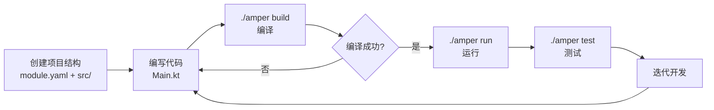
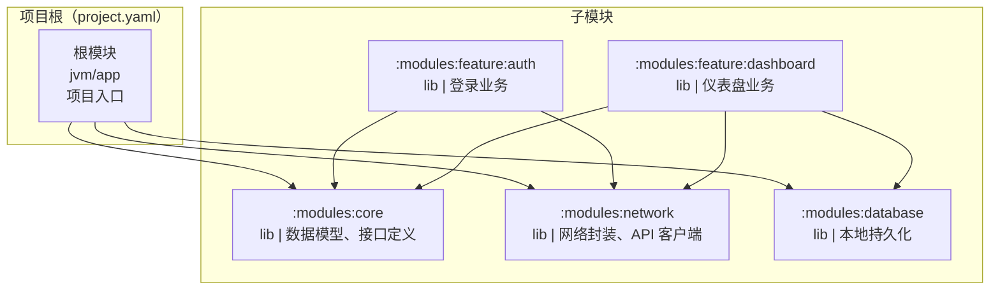
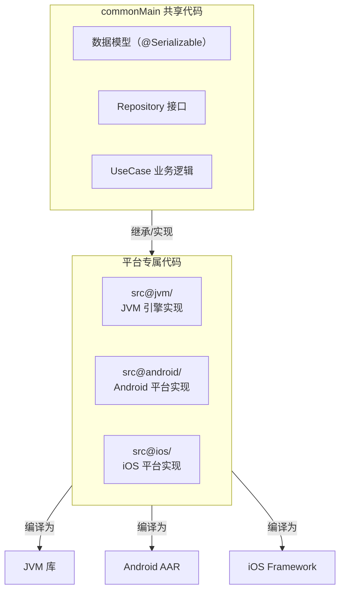
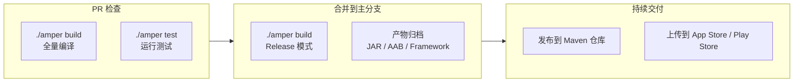
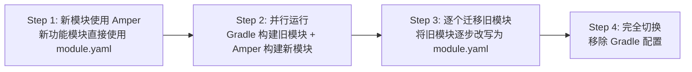

> [!tip] 相关内容
> [[Kotlin知识点快速梳理|Kotlin]] · [[Kotlin Multiplatform]]

# 0. Kotlin Toolchain 简介

> [!note] Kotlin Toolchain（即 JetBrains Amper）
> Kotlin Toolchain 是 JetBrains 推出的新一代 Kotlin 项目构建和管理工具，**代号 Amper**。它使用**声明式 YAML 配置**（`project.yaml` / `module.yaml`）替代传统的 Gradle DSL，旨在大幅降低 Kotlin 项目的配置复杂度，特别针对 Kotlin Multiplatform（KMP）、Android、iOS 和纯 JVM 项目做了深度优化。

Kotlin Toolchain 的核心理念是 **"约定大于配置"**——它提供了丰富的内置默认值和智能的自动推导，让开发者可以用最少的配置描述一个完整的 Kotlin 项目。

> [!question] 它解决了什么痛点？
> 传统的 Gradle 构建脚本虽然功能强大，但在日常开发中暴露了以下问题：
> - **样板代码过多**：一个简单的 KMP 项目动辄数百行 `build.gradle.kts`
> - **多平台配置分散**：JVM / Android / iOS 的配置散落在不同 DSL 块中，心智负担重
> - **版本管理混乱**：依赖版本、插件版本、编译器版本需要手动对齐
> - **学习曲线陡峭**：Gradle 的生命周期、配置阶段、Task 图对新手不友好

```kotlin
// ❌ Gradle DSL —— 一个简单的 KMP 模块就要数十行配置
plugins {
    kotlin("multiplatform")
    id("com.android.library")
}

kotlin {
    androidTarget {
        compilations.all {
            kotlinOptions { jvmTarget = "17" }
        }
    }
    iosArm64()
    iosSimulatorArm64()

    sourceSets {
        commonMain.dependencies {
            implementation("org.jetbrains.kotlinx:kotlinx-coroutines-core:1.8.0")
        }
    }
}

android {
    namespace = "com.example.lib"
    compileSdk = 35
    // ...
}
```

```yaml
# ✅ Kotlin Toolchain —— 同样功能的配置
product: lib
platforms: [jvm, android, iosArm64, iosSimulatorArm64]
dependencies:
  - org.jetbrains.kotlinx:kotlinx-coroutines-core:1.8.0
settings:
  android:
    namespace: "com.example.lib"
    compileSdk: 35
```

> [!summary] 为什么值得关注？
> - **开发效率提升**：配置量减少 70% 以上，专注于业务而非构建脚本
> - **跨平台体验统一**：一套 YAML 描述所有平台，无需在 Groovy/Kotlin DSL 之间切换
> - **内置工具链管理**：自动下载和管理 JDK、Kotlin 编译器、Android SDK 等
> - **独立模式**：从 Amper 0.7+ 开始，独立 CLI（非 Gradle 后端）成为主要使用方式，启动更快、诊断更清晰
> - **JetBrains 全力投入**：官方持续迭代，已支持 Compose Hot Reload、KSP2、Spring Boot 等关键生态

---

# 1. 核心概念解析

## 1.1 项目与模块

> [!note] 概述
> Kotlin Toolchain 的项目结构围绕**两个配置文件**展开：`project.yaml` 定义项目整体结构，`module.yaml` 定义单个模块的构建方式。

```
my-project/
├── project.yaml            # 项目级配置（多模块时必须）
├── module.yaml             # 根模块配置（单模块时可替代 project.yaml）
├── amper                   # Amper CLI 启动脚本（Linux/macOS）
├── amper.bat               # Amper CLI 启动脚本（Windows）
├── src/
│   ├── main.kt
│   └── ...
└── modules/
    ├── core/
    │   └── module.yaml     # 子模块配置
    └── web/
        └── module.yaml     # 子模块配置
```

### project.yaml

```yaml
# project.yaml —— 项目清单
modules:
  - ./modules/core        # 列出所有子模块路径
  - ./modules/web
plugins:                  # 可选：全局插件
  - ./build-sources/my-plugin
```

> [!tip] 说明
> - `project.yaml` 所在目录本身隐含为一个根模块，无需在 `modules` 中列出
> - 单模块项目**不需要** `project.yaml`，仅用 `module.yaml` 即可
> - 模块路径支持 glob 模式（如 `./libs/*`），但推荐显式列出

### module.yaml

```yaml
# module.yaml —— 模块构建描述
product: jvm/app                                            # 产物类型
dependencies:                                               # 依赖声明
  - org.jetbrains.kotlinx:kotlinx-coroutines-core:1.8.0
  - ./modules/core                                          # 内部模块依赖
  - $compose.material3                                      # 内置目录依赖
settings:                                                   # 工具链配置
  kotlin:
    languageVersion: "2.0"
  jvm:
    release: 21
test-dependencies:                                          # 测试依赖
  - $kotlin.test
```

| 配置段 | 作用 | 必需 |
|:------:|:----|:----:|
| `product` | 定义模块的产物类型和目标平台 | **是** |
| `dependencies` | 外部 Maven 依赖 + 内部模块依赖 + 目录依赖 | 否 |
| `test-dependencies` | 测试环境专属依赖 | 否 |
| `settings` | Kotlin、JVM、Android、Compose 等工具链配置 | 否 |
| `test-settings` | 测试环境的工具链配置覆盖 | 否 |
| `apply` | 引用 `.module-template.yaml` 模板文件 | 否 |
| `plugins` | 模块级插件配置 | 否 |
| `repositories` | 自定义 Maven 仓库 | 否 |
| `aliases` | 自定义平台分组别名（多模块） | 否 |

> [!warning] 注意
> `settings` 中的配置会自动继承到 `test-settings`，测试环境只需覆盖需要不同的部分即可。

## 1.2 产品类型（Product Types）

> [!note] 概述
> `product` 字段定义了模块**产物的类型**和**目标平台**，是 `module.yaml` 中最重要的配置项。Kotlin Toolchain 根据 product 类型自动配置编译器、链接器和打包方式。

### 完整产品类型列表

| 类型 | Schema 值 | 目标平台 | 说明 |
|:----:|:----------|:---------|:----|
| JVM 应用 | `jvm/app` | `jvm` | 可执行的 JVM 应用程序 |
| JVM 库 | `jvm/lib` | `jvm` | JVM 专属库（Amper 0.8+） |
| JVM 插件 | `jvm/amper-plugin` | `jvm` | Amper 构建插件 |
| 多平台库 | `lib` | 所有叶平台 | 可导出为 KMP 库 |
| Android 应用 | `android/app` | `android` | Android APK/AAB |
| iOS 应用 | `ios/app` | `iosArm64`, `iosX64`, `iosSimulatorArm64` | iOS 应用 |
| macOS 应用 | `macos/app` | `macosX64`, `macosArm64` | macOS 桌面应用 |
| Linux 应用 | `linux/app` | `linuxX64`, `linuxArm64` | Linux 桌面应用 |
| Windows 应用 | `windows/app` | `mingwX64` | Windows 桌面应用 |
| JS 应用 | `js/app` | `js` | JavaScript 应用 |
| Wasm JS 应用 | `wasm-js/app` | `wasmJs` | WebAssembly (JS) 应用 |
| Wasm Wasi 应用 | `wasm-wasi/app` | `wasmWasi` | WebAssembly (WASI) 应用 |

### 简写语法

```yaml
# 简写——使用默认平台
product: jvm/app
product: android/app
product: lib
```

### 完整语法

```yaml
# 完整语法——显式指定平台
product:
  type: lib
  platforms: [jvm, android, iosArm64, iosSimulatorArm64]
```

```yaml
# 多平台库：为 Android 和 iOS 共享逻辑
product:
  type: lib
  platforms: [android, iosArm64, iosSimulatorArm64]
```

> [!tip] 选择指南
> - **纯 JVM 服务端应用** → `jvm/app` 或 `jvm/lib`
> - **Android 原生应用** → `android/app`
> - **KMP 共享库** → `lib`（多平台库，最灵活）
> - **桌面应用** → `macos/app` / `linux/app` / `windows/app`
> - **关注 Web 前端** → `js/app` 或 `wasm-js/app`

### 片段模块（Fragment）

某些产品类型标记为 **Fragment**（如上表中的"Fragment？"列为"是"的项）。Fragment 模块不会生成独立的产物，而是作为依赖被其他非 Fragment 模块引用。这使得多平台项目的模块组织更加灵活。

```yaml
# ios/app 是 Fragment——它本身不产出独立产物，
# 而是作为其他模块的依赖被集成到最终的 iOS 应用中
product: ios/app
```

## 1.3 依赖管理

> [!note] 概述
> Kotlin Toolchain 提供了**四种依赖声明方式**，覆盖了从外部 Maven 坐标到内部模块引用的所有场景。

### 外部 Maven 依赖

使用标准的 `group:artifact:version` 坐标格式：

```yaml
dependencies:
  - org.jetbrains.kotlinx:kotlinx-coroutines-core:1.8.0
  - com.squareup.okhttp3:okhttp:4.12.0
  - io.ktor:ktor-client-core:2.3.7
```

### 内部模块依赖

使用相对路径（以 `./` 或 `../` 开头）指向其他模块：

```yaml
dependencies:
  - ./modules/core          # 同项目下的子模块
  - ../utilities/logger     # 父项目中的工具模块
```

### 目录依赖（Catalogs）

> [!tip] 目录依赖是 Kotlin Toolchain 的一大亮点
> 使用 `$catalog.key` 语法引用**内置目录**中的依赖，自动获取与当前工具链版本匹配的依赖版本，无需手动拼写版本号。

**内置目录一览：**

| 目录名称 | 触发条件 | 示例 |
|:--------:|:---------|:-----|
| `$kotlin` | 始终可用 | `$kotlin.test`, `$kotlin.reflect`, `$kotlin.test.junit5` |
| `$kotlin.serialization` | `settings.kotlin.serialization.enabled` | `$kotlin.serialization.json` |
| `$compose` | `settings.compose.enabled` | `$compose.foundation`, `$compose.material3`, `$compose.runtime` |
| `$ktor` | `settings.ktor.enabled` | `$ktor.server.core`, `$ktor.client.core`, `$ktor.bom` |
| `$springBoot` | `settings.springBoot.enabled` | Spring Boot 相关依赖 |

```yaml
settings:
  kotlin:
    serialization: json              # 启用序列化
  compose: true                       # 启用 Compose
  ktor:                               # 启用 Ktor
    enabled: true
    applyBom: true

dependencies:
  - $kotlin.test                      # 自动使用当前 Kotlin 版本匹配的 kotlin-test
  - $kotlin.serialization.json        # 自动添加序列化库
  - $compose.material3                # 自动使用当前 Compose 版本
  - $ktor.client.core                 # 自动使用当前 Ktor 版本
```

**Gradle 版本目录支持：**

如果项目中存在 `gradle/libs.versions.toml`，其中的 library 声明也可以通过 `$libs` 前缀引用：

```yaml
dependencies:
  - $libs.commons.lang3     # 对应 gradle/libs.versions.toml 中的 [libraries]
```

### BOM 依赖

使用 `bom:` 前缀导入 Maven BOM（Bill of Materials），统一管理版本约束：

```yaml
dependencies:
  - bom: org.springframework.boot:spring-boot-dependencies:3.2.0
  - bom: io.ktor:ktor-bom:2.3.7
```

### 依赖作用域（Scope）

```yaml
dependencies:
  - com.google.guava:guava:33.0.0              # scope: all（默认）
  - org.jetbrains:annotations:24.0.0:
      scope: compile-only                        # 编译期可见，运行时不可见
  - com.mysql:mysql-connector-j:8.2.0:
      scope: runtime-only                        # 运行时可见，编译期不可见
```

| 作用域 | 编译期 | 运行时 | 使用场景 |
|:------:|:------:|:------:|:---------|
| `all`（默认） | ✓ | ✓ | 常规依赖 |
| `compile-only` | ✓ | ✗ | 注解库、编译期 API |
| `runtime-only` | ✗ | ✓ | JDBC 驱动、SPI 实现 |

### 可见性控制（Exported）

```yaml
dependencies:
  - com.fasterxml.jackson.core:jackson-databind:2.16.0:
      exported: true      # 对外暴露——下游模块可访问（类似 Gradle 的 api()）
  - com.google.guava:guava:33.0.0:
      exported: false     # 内部实现——对外隐藏（默认，类似 Gradle 的 implementation()）
```

### 测试依赖

使用 `test-dependencies` 声明仅在测试中使用的依赖：

```yaml
test-dependencies:
  - org.junit.jupiter:junit-jupiter:5.10.1
  - $kotlin.test.junit5
  - $libs.mockk
  - ./test-utils                    # 测试工具模块
```

## 1.4 平台限定符（@platform）

> [!note] 概述
> 在多平台（`product: lib`）项目中，通过 **`@platform` 语法**可以按平台限定依赖、设置和源代码目录，实现细粒度的平台差异化控制。

### 依赖限定

```yaml
dependencies:
  # 所有平台共享
  - org.jetbrains.kotlinx:kotlinx-coroutines-core:1.8.0

  # 仅 JVM 平台
  - com.fasterxml.jackson.core:jackson-databind:2.16.0@jvm

  # 仅 Android 平台
  - com.google.android.material:material:1.11.0@android

  # 仅 iOS 平台
  - org.jetbrains.skia:skia-ios:1.0.0@ios

  # 仅 JS 平台
  - org.jetbrains.skia:skia-wasm:1.0.0@js
```

### 平台家族与叶平台

> [!important] 平台层次结构
> Kotlin Toolchain 定义了**平台家族（Family）** 和**叶平台（Leaf Platform）** 两个层次。使用家族名限定等价于限定该家族下的所有叶平台。

| 家族 | 包含的叶平台 |
|:----:|:-------------|
| `jvm` | `jvm` |
| `android` | `android` |
| `ios` | `iosArm64`, `iosX64`, `iosSimulatorArm64` |
| `macos` | `macosX64`, `macosArm64` |
| `linux` | `linuxX64`, `linuxArm64` |
| `mingw` | `mingwX64` |
| `js` | `js` |
| `wasmJs` | `wasmJs` |
| `wasmWasi` | `wasmWasi` |

```yaml
# @ios 等价于同时限定 iosArm64 + iosX64 + iosSimulatorArm64
dependencies:
  - org.jetbrains.skia:skia-ios:1.0.0@ios

# 精确到具体架构
  - org.jetbrains.skia:skia-ios-arm64:1.0.0@iosArm64
```

### 设置限定

平台限定符也可以用于 `settings` 中的配置：

```yaml
settings:
  kotlin:
    languageVersion: "2.0"

  # 仅 JVM 平台生效的设置
  jvm@jvm:
    release: 21

  # 仅 Android 平台生效的设置
  android@android:
    namespace: "com.example.lib"
    compileSdk: 35
```

### 自定义别名

```yaml
# 在 module.yaml 中定义平台别名
aliases:
  - jvmAndAndroid: [jvm, android]                        # 自定义分组
  - appleTargets: [iosArm64, iosSimulatorArm64, macosArm64]  # Apple 全平台

dependencies:
  - com.example:shared-lib:1.0.0@jvmAndAndroid           # 使用别名
```

> [!warning] 别名使用限制
> - 别名不能与已有平台名或家族名冲突
> - 所有别名中的平台必须在模块的 `platforms` 列表中
> - 不允许循环引用

### 源代码目录限定

多平台项目中，可以使用 `src@platform/` 目录结构组织平台专属源码：

```
src/
├── commonMain/                      # 所有平台共享
├── commonTest/
├── src@jvm/                         # JVM 平台专属
├── src@android/                     # Android 平台专属
├── src@ios/                         # iOS 平台专属（家族限定）
├── src@iosMain/                     # 也可用叶平台名
└── src@jvmAndAndroid/               # 自定义别名（需先在 aliases 中定义）
```

> [!tip] 源代码目录的组织规则
> - `commonMain` 中的代码对所有平台可见
> - 平台限定目录中的代码仅在该平台编译时包含
> - 平台的优先级：精确平台名 > 家族名 > `commonMain`
> - 可以理解为"多态源码集"——类似 KMP 的 `expect/actual`，但通过文件系统组织

---

# 2. 快速入门教程

> [!note] 本节目标
> 从零创建一个**单模块 JVM 应用项目**，包含一个 HTTP 请求示例，使用 Ktor Client 发起网络调用。通过这个过程掌握 Kotlin Toolchain 的核心工作流。

## 2.1 安装 Amper CLI

```bash
# 下载 Amper 启动脚本（Linux / macOS）
curl -sSfL https://github.com/JetBrains/amper/releases/latest/download/amper -o amper
chmod +x amper

# Windows 用户下载 amper.bat

# 验证安装
./amper --version
```

> [!tip] 说明
> 首次运行 `./amper` 时，启动脚本会自动下载并缓存 Amper CLI 发行版和 JetBrains Runtime（JBR）。缓存位于 `~/.cache/JetBrains/Amper`（Unix）或 `%LOCALAPPDATA%\JetBrains\Amper`（Windows）。

## 2.2 创建项目结构

```bash
mkdir kotlin-toolchain-demo
cd kotlin-toolchain-demo
```

手动创建以下目录结构：

```
kotlin-toolchain-demo/
├── amper              # 下载的启动脚本
├── amper.bat
├── module.yaml
└── src/
    └── Main.kt
```

> [!tip] 也可以使用 `./amper init` 交互式创建
> 运行 `./amper init` 后选择 `JVM Console Application` 模板，工具会自动生成上述结构。

## 2.3 编写 module.yaml

```yaml
# module.yaml
# 产品类型：JVM 应用
product: jvm/app

# 依赖声明
dependencies:
  # 使用 Ktor 客户端发起 HTTP 请求
  - io.ktor:ktor-client-core:2.3.7
  # 使用 kotlinx-serialization 解析 JSON
  - org.jetbrains.kotlinx:kotlinx-serialization-json:1.6.2
  # JVM 引擎（CIO 引擎，不依赖 OkHttp）
  - io.ktor:ktor-client-cio:2.3.7

# 工具链配置
settings:
  kotlin:
    # 指定 Kotlin 语言版本
    languageVersion: "2.0"
    # 启用序列化插件
    serialization: json
  jvm:
    # 目标 JVM 版本
    release: 21
  # 测试框架
  junit: junit-5

# 测试依赖
test-dependencies:
  - $kotlin.test
  - io.ktor:ktor-client-mock:2.3.7
```

> [!note] 配置解读
> - `product: jvm/app` 告诉工具链生成一个可执行的 JVM 应用
> - `settings.kotlin.serialization: json` 是 `serialization: { enabled: true, format: json }` 的简写
> - `settings.junit: junit-5` 自动添加 `kotlin-test-junit5` 依赖
> - `$kotlin.test` 自动使用与当前 Kotlin 版本匹配的测试库

## 2.4 编写应用代码

```kotlin
// src/Main.kt
package com.example.demo

import io.ktor.client.*
import io.ktor.client.request.*
import io.ktor.client.statement.*
import kotlinx.serialization.Serializable
import kotlinx.serialization.json.Json

@Serializable
data class Todo(
    val userId: Int,
    val id: Int,
    val title: String,
    val completed: Boolean
)

suspend fun fetchTodo(): Todo {
    val client = HttpClient {
        // Ktor CIO 引擎，纯 Kotlin 实现，无需 OkHttp
    }

    val response: HttpResponse = client.get("https://jsonplaceholder.typicode.com/todos/1")
    val body = response.bodyAsText()

    // 使用 kotlinx-serialization 解析 JSON
    return Json.decodeFromString<Todo>(body)
}

suspend fun main() {
    println("🚀 Kotlin Toolchain Demo 启动")
    println("正在获取数据...")

    try {
        val todo = fetchTodo()
        println("✅ 获取成功：")
        println("   ID：${todo.id}")
        println("   标题：${todo.title}")
        println("   用户：${todo.userId}")
        println("   完成：${if (todo.completed) "是" else "否"}")
    } catch (e: Exception) {
        println("❌ 请求失败：${e.message}")
    }
}
```

## 2.5 构建与运行

```bash
# 编译项目
./amper build

# 运行应用
./amper run

# 运行测试
./amper test

# 清理构建产物
./amper clean
```

> [!tip] 运行效果
> ```
> 🚀 Kotlin Toolchain Demo 启动
> 正在获取数据...
> ✅ 获取成功：
>    ID：1
>    标题：delectus aut autem
>    用户：1
>    完成：false
> ```

## 2.6 完整工作流



> [!summary] 本节要点
> - 单模块 JVM 项目只需一个 `module.yaml` + `src/` 目录
> - `product: jvm/app` 声明 JVM 应用类型
> - `amper build` + `amper run` 完成构建和运行
> - 工具链自动处理 JDK 版本下载、编译器配置和依赖解析

---

# 3. 工程实践指导

> [!important] 本节定位
> 当项目从"个人原型"走向"团队工程"时，合理的项目结构、工具链选型和构建优化成为关键。以下实践基于 Kotlin Toolchain（Amper）的官方推荐和社区最佳实践。

## 3.1 多模块项目结构

> [!note] 大型项目的推荐组织方式
> 多模块架构有助于代码隔离、职责清晰和编译并行化。Kotlin Toolchain 通过 `project.yaml` 管理模块拓扑。



```
my-multimodule-project/
├── project.yaml                          # 模块清单
├── module.yaml                           # 根模块（应用入口）
├── amper
├── src/
│   └── Main.kt
├── modules/
│   ├── core/
│   │   └── module.yaml                   # 核心模块：数据模型
│   ├── network/
│   │   └── module.yaml                   # 网络模块：API 封装
│   ├── database/
│   │   └── module.yaml                   # 数据库模块
│   └── feature/
│       ├── auth/
│       │   └── module.yaml               # 登录功能
│       └── dashboard/
│           └── module.yaml               # 仪表盘功能
└── gradle/
    └── libs.versions.toml                # 可选：Gradle 版本目录
```

### project.yaml

```yaml
# project.yaml —— 多模块项目清单
modules:
  - ./modules/core
  - ./modules/network
  - ./modules/database
  - ./modules/feature/auth
  - ./modules/feature/dashboard
```

### 根模块 module.yaml

```yaml
# module.yaml —— 根模块（应用入口）
product: jvm/app

dependencies:
  - ./modules/feature/auth
  - ./modules/feature/dashboard

settings:
  kotlin:
    languageVersion: "2.0"
  jvm:
    release: 21
    mainClass: "com.example.app.MainKt"
```

### 核心模块 module.yaml

```yaml
# modules/core/module.yaml —— 共享数据模型
product: jvm/lib

dependencies:
  - org.jetbrains.kotlinx:kotlinx-serialization-json:1.6.2

settings:
  kotlin:
    serialization: json
  jvm:
    release: 17
```

> [!tip] 导出控制
> 核心模块的依赖应标记 `exported: true`，使下游模块可以直接使用：
> ```yaml
> dependencies:
>   - com.fasterxml.jackson.core:jackson-databind:2.16.0:
>       exported: true     # 对外暴露——下游模块可见
> ```

## 3.2 多平台项目实战

> [!important] lib 类型的产品专为多平台共享设计
> 使用 `product: lib` 配合 `platforms` 列表和 `@platform` 限定符，可以精确控制每个平台的依赖和源码。



### 多平台模块配置

```yaml
# modules/shared/module.yaml —— KMP 共享模块
product:
  type: lib
  platforms: [jvm, android, iosArm64, iosSimulatorArm64]

dependencies:
  # 所有平台共享
  - org.jetbrains.kotlinx:kotlinx-coroutines-core:1.8.0
  - org.jetbrains.kotlinx:kotlinx-serialization-json:1.6.2

  # JVM 平台专属
  - io.ktor:ktor-client-cio:2.3.7@jvm

  # Android 平台专属
  - io.ktor:ktor-client-okhttp:2.3.7@android

  # iOS 平台专属（家族限定，覆盖所有 iOS 叶平台）
  - io.ktor:ktor-client-darwin:2.3.7@ios

settings:
  kotlin:
    serialization: json
    languageVersion: "2.0"

  android:
    namespace: "com.example.shared"
    compileSdk: 35
    minSdk: 26

  ios:
    framework:
      basename: "SharedKit"
      isStatic: true
```

> [!compare] 多平台 vs 单平台配置对比
> | 维度 | 单平台（jvm/app） | 多平台（lib） |
> |:----:|:-----------------:|:-------------:|
> | 配置文件 | 1 个平台段 | 多平台 + 限定符 |
> | 源码目录 | `src/` | `src/commonMain/` + `src@platform/` |
> | 依赖管理 | 全局声明 | 全局 + `@platform` 限定 |
> | 产物 | JAR | JAR + AAR + Framework |
> | 适用场景 | 纯后端/桌面 | 移动端共享 + 跨平台库 |

## 3.3 工具链配置最佳实践

> [!summary] 推荐的 settings 配置基线

```yaml
settings:
  # --- Kotlin 编译器设置 ---
  kotlin:
    version: "2.0.21"              # 固定 Kotlin 版本，避免意外升级
    languageVersion: "2.0"          # 语言兼容版本
    apiVersion: "2.0"               # API 兼容版本
    progressiveMode: true           # 渐进式严格模式——提前发现潜在问题
    allWarningsAsErrors: true       # 警告即错误——保持代码质量
    serialization: json             # 启用 kotlinx.serialization
    optIns:
      - "kotlinx.serialization.ExperimentalSerializationApi"  # 显式 opt-in

  # --- JVM 设置 ---
  jvm:
    release: 21                     # 目标 JVM 版本

  # --- Android 设置 ---
  android:
    namespace: "com.example.app"
    compileSdk: 35
    minSdk: 26
    targetSdk: 35

  # --- Compose Multiplatform 设置 ---
  compose:
    enabled: true                   # 启用 Compose 编译器插件和运行时
    resources:                      # Compose 资源
      packageName: "com.example.app"
```

> [!question] 为什么要设 `allWarningsAsErrors: true`？
> 团队协作中，"先忽略警告以后修复"几乎等同于"永远不会修"。开启此选项后，编译器将警告视为错误，CI 阶段即可发现潜在的 API 弃用、类型安全等问题，而不是等到运行时才暴露。

## 3.4 版本管理策略

> [!tip] 版本锁定 vs 版本浮动
> 在 `settings.kotlin.version` 和依赖中始终使用**精确版本号**，而非动态版本（如 `1.+`）。精确版本确保构建的可复现性。

```yaml
# ❌ 不推荐：浮动版本
dependencies:
  - org.jetbrains.kotlinx:kotlinx-coroutines-core:1.8.+   # 可能意外升级
settings:
  kotlin:
    version: "2.0"                   # 隐式为 2.0.x 最新，不可控

# ✅ 推荐：精确版本
dependencies:
  - org.jetbrains.kotlinx:kotlinx-coroutines-core:1.8.1
settings:
  kotlin:
    version: "2.0.21"
```

### 统一版本管理方案

使用 `gradle/libs.versions.toml` 集中管理所有版本：

```toml
# gradle/libs.versions.toml
[versions]
kotlin = "2.0.21"
coroutines = "1.8.1"
ktor = "2.3.7"
serialization = "1.6.2"

[libraries]
kotlinx-coroutines-core = { module = "org.jetbrains.kotlinx:kotlinx-coroutines-core", version.ref = "coroutines" }
kotlinx-serialization-json = { module = "org.jetbrains.kotlinx:kotlinx-serialization-json", version.ref = "serialization" }
ktor-client-core = { module = "io.ktor:ktor-client-core", version.ref = "ktor" }
```

```yaml
# module.yaml —— 通过 $libs 引用目录
dependencies:
  - $libs.kotlinx.coroutines.core
  - $libs.kotlinx.serialization.json
  - $libs.ktor.client.core
```

## 3.5 CI/CD 集成

> [!important] 构建矩阵配置
> Kotlin Toolchain 的独立模式非常适合 CI 环境——无需安装 Gradle、JDK 版本由工具链自动管理。



### GitHub Actions 示例

```yaml
# .github/workflows/ci.yml
name: CI

on:
  push:
    branches: [main]
  pull_request:
    branches: [main]

jobs:
  build:
    runs-on: ubuntu-latest

    steps:
      - uses: actions/checkout@v4

      - name: Setup Amper
        run: |
          curl -sSfL https://github.com/JetBrains/amper/releases/latest/download/amper -o amper
          chmod +x amper

      - name: Build
        run: ./amper build

      - name: Test
        run: ./amper test
```

> [!tip] macOS CI 注意事项
> iOS 目标（`iosArm64` 等）需要在 macOS runner 上构建。如果项目包含 iOS 平台，请使用 `macos-latest` runner。

## 3.6 从 Gradle 迁移到 Kotlin Toolchain

> [!warning] 渐进式迁移策略
> Kotlin Toolchain 目前尚处于**积极开发阶段**（Amper 0.x），建议采用**绞杀者模式（Strangler Fig）** 逐步迁移，而非一次性全量切换。



### 迁移检查清单

> [!summary] 迁移前需要确认的事项
> - [ ] Amper 版本是否支持项目所需的所有功能（如 KSP、Compose、iOS Framework 导出）
> - [ ] 所有第三方依赖是否可通过 Maven 坐标或目录获取
> - [ ] 自定义 Gradle Task 是否有 Amper 插件机制的等效方案
> - [ ] CI/CD 环境是否已安装 Amper CLI
> - [ ] 团队是否已了解 YAML 配置的工作方式

> [!danger] 已知局限
> - Amper 0.x **尚不支持的**：自定义 Task 图、复杂的多项目构建逻辑
> - **独立模式**（非 Gradle 后端）是主要发展方向，Gradle 后端已被标记为弃用
> - 部分 Gradle 插件可能没有 Amper 等效方案，需要等待社区或官方支持

## 3.7 常见问题与排查

> [!question] 常见问题

**Q: `./amper build` 报 JDK 版本不匹配怎么办？**
> 在 `module.yaml` 中指定正确的 JVM release 版本，或者通过环境变量 `AMPER_JAVA_HOME` 指定 JDK 路径。Amper 也会自动下载所需版本的 JDK。

**Q: 如何添加自定义 Maven 仓库？**
```yaml
repositories:
  - https://maven.pkg.jetbrains.space/public/p/compose/dev
  - mavenCentral:  # 内置，无需显式声明
```

**Q: 模块间循环依赖如何处理？**
> 和 Gradle 一样，Kotlin Toolchain 不允许循环依赖。如果出现，需要重构模块结构——通常是将双方共同依赖的类型抽取到第三个模块中。

**Q: 如何查看详细的构建日志？**
```bash
./amper build --verbose
```

**Q: 测试报告在哪里查看？**
```bash
# 测试结果默认输出到 build/test-results/ 目录
./amper test
cat build/test-results/*.xml
```

---

> [!summary] 核心要点回顾
> ```text
> Kotlin Toolchain（Amper）的核心价值：
>
> 🎯 声明式配置 —— YAML 描述一切，配置量减少 70%
> 🔧 工具链自动管理 —— JDK、Kotlin 编译器自动下载和配置
> 📦 内置目录系统 —— $kotlin、$compose、$ktor 等开箱即用
> 🔀 多平台原生支持 —— 一套配置覆盖 JVM/Android/iOS/Web
> 🚀 独立 CLI —— 告别 Gradle，启动更快、诊断更清晰
> 🏗️ 渐进式采用 —— 可与现有 Gradle 项目共存，逐步迁移
> ```

> [!tip] 进阶阅读
> - [[Kotlin Multiplatform]] — KMP 项目架构与跨平台共享策略
> - [[Kotlin知识点快速梳理|Kotlin]] — Kotlin 语言基础与特性速览
> - [JetBrains Amper 官方文档](https://github.com/JetBrains/amper) — 最新的项目动态和完整配置参考
