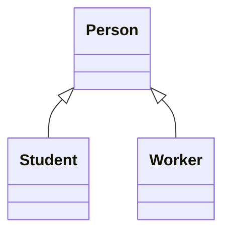
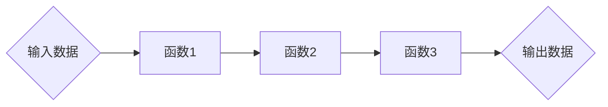
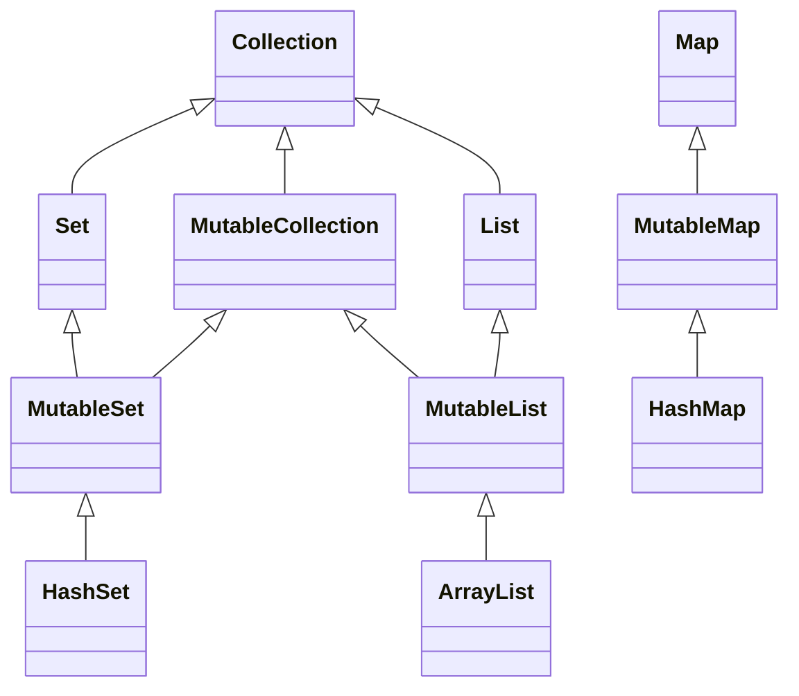
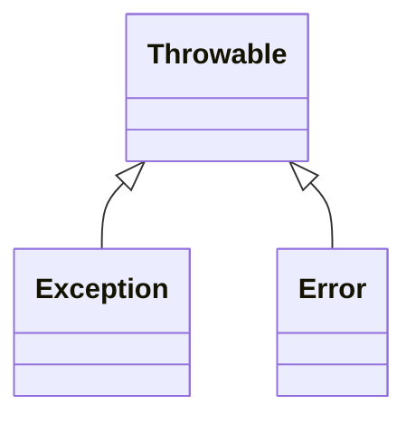

# 0.Kotlin概述
## Kotlin的工作原理
Kotlin 是一种由 JetBrains 设计开发并开源的静态类型编程语言。它最常见的运行目标是 JVM 和 Android，也可以通过 Kotlin/JS、Kotlin/Native 和 Kotlin/Wasm 面向 Web、Native、iOS、桌面等平台。
Kotlin 在 JVM 上会编译成 Java 字节码，因此可以直接调用 Java 生态中的类库；在多平台项目中，则通过不同 target 生成对应平台的产物。


## 核心优势
可以说,Kotlin和Java基本上是同根同源,所以根据[[Java知识点总结|Java]]的语法能够大致理解Kotlin的基本内容,此外,Kotlin还有以下优点:
1. ​**简洁性**​：相比 Java 更少的样板代码
2. ​**安全性**​：内置*空安全*机制
3. ​**互操作性**​：100% 兼容 Java 代码
4. ​**工具支持**​：JetBrains 提供优秀的 IDE 支持(IntelliJ IDEA)
5. ​**多平台**​：支持 JVM、Android、JavaScript 和 Native

## Kotlin与Java的主要区别

|   特性   |   Java    |      Kotlin      |
| :----: | :-------: | :--------------: |
|  空安全   |   无内置支持   |      内置空安全       |
|  变量声明  |   类型在前    |       类型在后       |
|  函数定义  |  必须放在类中   |     可以有顶级函数      |
|  数据类   |  需要手动实现   | 使用data class自动生成 |
|  扩展函数  |    不支持    |        支持        |
| lambda | Java 8+支持 |       原生支持       |
|   协程   | 主要依赖线程/虚拟线程或第三方库 | 语言提供`suspend`等基础能力，常配合`kotlinx.coroutines` |
| 字符串模板  |   简单支持    |       强大支持       |
|  智能转换  |    不支持    |        支持        |

> [!note] 学习建议
> 1. 利用Kotlin的Java互操作性，逐步将Java代码转换为Kotlin
> 2. 多使用Kotlin的简洁语法，如表达式体函数、字符串模板等
> 3. 熟悉Kotlin标准库，它提供了许多有用的扩展函数
> 4. 学习Kotlin的空安全机制，避免NPE
> 5. 尝试使用协程处理异步编程


---

# 1.基本内容

## 1.1 Kotlin关键字
Kotlin 有自己的一套关键字，部分与 Java 相同，部分不同：

- 声明相关：`val`, `var`, `fun`, `class`, `interface`, `object`
- 控制流：`if`, `else`, `when`, `for`, `while`, `do`, `break`, `continue`, `return`
- 访问修饰符：`public`, `private`, `protected`, `internal`
- 特殊关键字：`as`, `is`, `in`, `by`, `this`, `super`
- 空安全相关运算符：`?`, `!!`, `?:`
- 协程相关关键字：`suspend`

> [!tip] 注意
> `async`、`await`、`launch`不是 Kotlin 关键字，它们通常来自`kotlinx.coroutines`或框架扩展函数。

其中,关键字又分为**硬关键字**,**软关键字**,和**修饰符关键字**
- 硬关键字在任何情况下都不能直接作为标识符,
- 软关键字是在它适用的场景下不能作为标识符而在其他场景下可以作为标识符
- 修饰符关键字是一种特殊的软关键字,它们用来修饰函数,接口,类,参数和属性等内容
## 1.2 变量
Kotlin 有自己的类型系统。在 JVM 平台上，`Int`、`Long`、`Boolean`等类型会按上下文映射为 Java 基本类型或包装类型；但在 Kotlin 代码中，它们都以统一的类型形式出现，并且区分可空与非空。
### 声明方式
与 Java 不同，Kotlin 有两种变量声明方式：
- 可变变量: `var`
- 只读变量: `val`

```kotlin
val name = "Kotlin"  // 只读引用，初始化后不能重新赋值
var age = 10         // 可变变量
```

> [!warning] 注意
> `val`表示引用不可重新赋值，不等同于编译期常量。真正的编译期常量需要在顶层、`object`或伴生对象中使用`const val`声明，并且类型只能是基本类型或`String`。

此外类型可以显式声明, 也可以省略, 通过自动类型识别来确定

```kotlin
val message: String = "Hello"
var count: Int = 0
```
### 类型转换
Kotlin中若想要实现类型转换,需要使用转换函数进行显式转换:
- toByte()
- toShort()
- toInt()
- toLong()
- toFloat()
- toDouble()
- toChar()

> [!warning] 注意
> 在高精度转换到低精度时会丢失精度(如Double转Float).


### 可空类型
> [!note] 空安全
> 这是Kotlin的一大特色之一 ——  **空安全类型**
#### 概述
在Kotlin中将一个对象声明为非空的类型,那么它就永远无法接收空值,否则就会发生编译错误
```Kotlin
var n : Int = 10
n = null //编译错误!
```

> [!tip] 我们发现
> 上述代码发生了编译错误,因为Int是非空类型,它所声明的变量n无法接收空值. 但是在某些场景中确实没有数据, 如在查询数据库记录时,没有查询到符合条件的数据是很正常的事情. 为此,Kotlin为每一种非空类型对应提供了*可空的类型(Nullable)*,就是在非空类型后添加**问号(?)** 表示类型可空.
修改上述的代码如下:

```Kotlin
var n : Int? = 10
n = null
```
#### 使用安全调用运算符-->(?.)
> [!note] 说明
> 可空类型变量使用安全调用运算符(`?.`)可以在接收者非空时访问成员函数或属性。安全调用运算符会判断可空类型的变量是否为空,如果是则不会调用成员,直接返回`null`,否则返回调用结果。因此表达式整体通常仍是可空类型。

示例代码
```Kotlin
fun divide(n: Int,m: Int): Double?{  
    if(m==0){  
        return null  
    }  
    return n.toDouble()/m  
}  
fun main() {  
    println(divide(10, 2))  
    println(divide(10, 0))  
}
```

运行结果
```text
5.0
null
```

#### 非空断言运算符-->(!!)
> [!note] 说明
> 可空类型变量可以使用非空断言运算符来调用非空类型的函数或属性. 非空断言顾名思义就是断言可空类型变量不会为空. 调用过程存在风险,如果可空类型变量真的为空,则会抛出空指针异常.

```Kotlin
fun main(){  
    val result1 = divide(11,2)!!  
    val result2 = divide(10,0)!!  
}
```
运行结果
```text
Exception in thread "main" java.lang.NullPointerException
	at training.foundation.DivideTest2Kt.main(divideTest2.kt:7)
	at training.foundation.DivideTest2Kt.main(divideTest2.kt)
```

#### Elvis运算符-->(?:)
有的时候在可空类型表达式中,当表达式为空时,并不希望返回默认的空值, 而是其他数值. 此时可以使用Elvis运算符`?:` ,也称为空值合并运算符. Elvis表达式有两个操作数: 假设有表达式`A ?: B`,如果A不为空值则结果为A,否则结果为B
```Kotlin
fun main(){  
    val result1 = divide(10,3)?:0  
    val result2 = divide(10,0)?:0  
    println(result1)  
    println(result2)  
}
```
运行结果
```text
3.3333333333333335
0
```

### 字符串
> [!note] 概述
> 与Java相同,在Kotlin中,字符串分为不可变字符串**String**和可变字符串**StringBuilder**
二者的差距在: 不可变字符串在进行拼接等操作时会产生一个新的字符串对象,而可变的字符串不会,直接在原本的操作对象上进行操作并返回结果.

#### String
Kotlin提供的*不可变字符串*类是kotlin.String. 获得String对象有两种方式:
##### 字符串赋值
通过直接赋值的方式为字符串对象赋值
```Kotlin
val str:String = "Hello"
```
##### 转换函数
- 字节数组转换为字符串
```Kotlin
fun String(
	bytes : ByteArray, //要转换的字节数组
	offset : Int,      //字节数组开始索引,可省略
	length : Int,      //转换字节的长度,可省略
	charset : Charset  //解码字符集,可省略
) :String
```
- 字符数组转换为字符串
```Kotlin
fun String(
	chars : CharArray,  //要转换的字符数组
	offset : Int,       //字符数组开始索引,可省略
	length : Int        //转换字符的长度,可省略
) :String
```
- StringBuilder转换为字符串
```Kotlin
fun String(stringBuilder: StringBuilder): String
```

```Kotlin
fun main(){  
    val chars = charArrayOf('a','b','c','d','e')  
  
    val str1 = String(chars)  
    val str2 = String(chars,1,3)  
    println(str1)  
    println(str2)  
    println("===========================")  
  
    val bytes = byteArrayOf(65,66,67,68,69)  
    val str3 = String(bytes)  
    val str4 = String(bytes,1,3)  
    println(str3)  
    println(str4)  
}
```
运行结果
```text
abcde
bcd
===========================
ABCDE
BCD
```

##### 字符串拼接
虽然是不可变字符串,但是String仍然可以进行拼接操作,只是**会产生一个新对象**.String的拼接可以使用+或+=,它们可以将任意数据类型拼接为字符串.
```Kotlin
fun main(){  
    val str1 = "Hello"  
    val str2 = "World"  
    println(str1 + str2)  
  
    var str3 = "I"  
    str3+=" "  
    str3+="love "  
    str3+="you"  
    println(str3)  
}
```
运行结果
```text
HelloWorld
I love you
```

##### 字符串模板
如果字符串的内容中要加入一些非字符串的内容,单纯的拼接就不够用了,就需要模板字符串来进行操作.
模板字符串的格式为 `${要拼接的内容}` . 其中,大括号内的内容可以为表达式等复杂的内容
```Kotlin
fun main(){  
    println("请输入年龄")  
    val age: Int = readln().toInt()  
    println("今年是${LocalDate.now().year}年")
    println("I am $age years old")  
}
```

运行结果
```text
请输入年龄
17
今年是2025年
I am 17 years old
```

##### 字符串查找
- 通过**indexOf()** 查找-->查找到了返回相应索引,否则返回-1
```Kotlin
fun String.indexOf(
	char: Char,                    //要查找的字符
	startIndex: Int = 0,           //指定查找开始的索引
	ignoreCase: Boolean = false    //是否忽略大小写默认匹配
) :Int
```
字符串版本为`indexOf(string: String, startIndex: Int = 0, ignoreCase: Boolean = false)`。
> [!tip]  提示
> startIndex和ignoreCase 都有默认值,因此可以省略. 其中,startIndex的默认值为0,即从头开始; ignoreCase的默认值为false,表示不忽略大小写进行匹配


- 通过**lastIndexOf()** 查找-->查找到了返回相应索引,否则返回-1
lastIndexOf()函数类似于indexOf(), 表示*从字符串尾部开始*进行查找匹配,参数的意义和indexOf()函数相同.
```Kotlin
fun String.lastIndexOf(
	char: Char,                    //要查找的字符
	startIndex: Int = lastIndex,   //指定反向查找开始的索引
	ignoreCase: Boolean = false    //是否忽略大小写默认匹配
) :Int
```
字符串版本为`lastIndexOf(string: String, startIndex: Int = lastIndex, ignoreCase: Boolean = false)`。

与Java相同,在字符串中,空格也被算作一个字符
```kotlin
fun main(){  
    val str = "hello world"  
    println("字符串为:$str")  
    println("字符串长度为:"+"${str.length}")  
    println("从前往后查找l字符,索引为:"+"${str.indexOf('l')}")  
    println("从后往前查找l字符,索引为:"+"${str.lastIndexOf('l')}")  
    println("从指定位置开始,查找l字符,索引为:"+"${str.indexOf('l',5)}")  
    println("从指定位置开始,从后往前查找l字符,索引为:"+"${str.lastIndexOf('l',5)}")  
}
```
运行结果
```text
字符串为:hello world
字符串长度为:11
从前往后查找l字符,索引为:2
从后往前查找l字符,索引为:9
从指定位置开始,查找l字符,索引为:9
从指定位置开始,从后往前查找l字符,索引为:3
```

##### 字符串比较
- 比较字符串是否相等 : **equals()**
equals函数可以比较可空的String类型
```Kotlin
fun String?.equals(
	other: String?,
	ignoreCase: Boolean = false //默认不忽略大小写,传true时忽略大小写
)
```

```Kotlin
fun main(){  
    val str = "Hello"  
    println("请输入字符串")  
    val str1 = readln().toString()  
    val result = str1.equals(str)  
    println(result)  
}
```
运行结果
```text
请输入字符串
Hello
true

请输入字符串
hello
false
```


- 按照字典的顺序比较字符串 : **compareTo()**
按照字典的顺序比较字符串基于字符串中各字符的Unicode值,按照字典的顺序将String对象表示的字符序列与参数字符串所表示的字符序列进行比较.如果按照字典顺序该String对象位于参数字符串之前则比较结果是一个负整数,位于参数字符串之后则比较结果是一个正整数,如果相等则返回0

- 比较前后缀 : **startsWith()** 和 **endsWith()**
startsWith()
```Kotlin
fun String.startsWith(
	prefix: String,
	ignoreCase: Boolean = false
) :Boolean
```

endsWith()
```Kotlin
fun String.endsWith(
	suffix: String,
	ignoreCase: Boolean = false
) :Boolean
```


```kotlin
fun main(){  
    val num1: String = "24130433"  
    val num2: String = "21593078"  
  
    val result1: Boolean = num1.startsWith("24")  
    val result2: Boolean = num2.endsWith("78")  
  
    println(result1)  
    println(result2)  
}
```
运行结果
```text
true
true
```

##### 字符串截取
通过substring()函数来对字符串进行截取
- 指定整数区间截取
```Kotlin
String.substring(range: IntRange):String
```
- 指定开始位置
```Kotlin
fun String.substring(startIndex:Int):String
```
- 指定开始索引和结束索引,截取的范围为:`[开始索引,结束索引)`.
```Kotlin
fun String.substring(startIndex:Int,endIndex:Int):String
```

```kotlin
fun main(){  
    val str = "Hello"  
    val str1 = str.substring(0,2)  
    println("指定起始索引和结束索引截取:")  
    println(str1)  
    val str2 = str.substring(1 until 3)  
    println("指定截取范围进行截取:")  
    println(str2)  
    val str3 = str.substring(1)  
    println("指定起始索引截取到字符串末尾:")  
    println(str3)  
}
```

运行结果
```text
指定起始索引和结束索引截取:
He
指定截取范围进行截取:
el
指定起始索引截取到字符串末尾:
ello
```

#### StringBuilder
##### 基本内容
与Java相同,Kotlin提供的*可变字符串*类同样是StringBuilder. 

> [!note] 在Kotlin中,StringBuilder有四种构造函数
> - StringBuilder()
> 创建字符串的内容是空的StringBuilder对象,初始容量为16
> - StringBuilder(seq : CharSequence) 
> 指定CharSequence字符串创建的对象.
> - StringBuilder(capacity : Int) 
> 创建字符串的内容是空的StringBuilder对象,初始容量由capacity指定
> - StringBuilder(str : String)
> 指定String字符串创建StringBuilder对象


##### 相关函数
- 追加-->**append()**
- 插入-->**insert()**
- 删除-->**delete()**
- 替换-->**replace()**

```kotlin
fun main(){  
    val str1 = StringBuilder("Hello")  
    str1.append("World")     //Hello World  
    println(str1)  
    println("----------")  
    //添加布尔值,转义字符,空对象  
    val str2 = StringBuilder()  
    val obj: Any? = null  
    str2.append(true).append('\t').append(obj)  
    println(str2)  
    println("----------")  
    //添加数值  
    val str3 = StringBuilder()  
    for(i in 1..10){  
        str3.append(i)  
    }  
    println(str3)  
    println("----------")  
    //插入字符串  
    str3.insert(5,"abc")  
    println(str3)  
    println("----------")  
    //删除字符串  
    str3.delete(1,2)  
    println(str3)  
    println("----------")  
    //替换字符串  
    str3.replace(1,2,"abc")  
    println(str3)  
}
```
运行结果
```text
HelloWorld
----------
true	null
----------
12345678910
----------
12345abc678910
----------
1345abc678910
----------
1abc45abc678910
```
需要注意,删除和替换字符串操作的指定的区间为**左闭右开**的区间

### 正则表达式
正则表达式(**reg**ular **ex**pression 在代码中常简写为regex,regexp或RE), 是预先定义好一个"规则字符串", 这个规则字符串可以用来进行匹配,过滤,检索和替换那些符合规则的字符串.
#### Regex类
Kotlin提供的关于正则表达式的类是*kotlin.text.Regex*.可以通过两种方式来创建Regex对象
- 构造函数
Regex默认的构造函数为
```Kotlin
Regex(pattern: String)
```
其中,pattern是模板字符串
- 使用toRegex扩展函数.
String提供toRegex扩展函数来返回Regex对象.

#### 字符串匹配
正则表达式通过字符串匹配能够验证字符串的格式的有效性,如邮箱,电话号码,日期等内容.

有关字符串匹配的函数如下
- `matches(input: CharSequence): Boolean`
该函数精确匹配函数,测试输入的字符串是否**完全匹配**正则表达式模式.
- `containsMatchIn(input: CharSequence): Boolean`
该函数包含匹配函数,测试输入的字符串是否**部分匹配**正则表达式模式

示例代码
```Kotlin
fun main(){  
    //全是数字的模式  
    val regex = Regex("""\d+""")  
  
    val str1 = "1000"  
    val str2 = "$1000"  
  
    println("精确匹配结果:")  
    println(str1.matches(regex))  
    println(str2.matches(regex))  
  
    println()  
    println("部分匹配结果:")  
    println(regex.containsMatchIn(str1))  
    println(regex.containsMatchIn(str2))  
}
```

运行结果
```text
精确匹配结果:
true
false

部分匹配结果:
true
true
```

#### 字符串查找
正则表达式还用于字符串的查找.
常用的函数有
- `find(input: CharSequence,startIndex: Int) : MatchResult?`
该函数查找第一个匹配模式的字符串,返回MatchResult?类型
- `findAll(input: CharSequence,startIndex: Int) : Sequence`
该函数查找所有匹配模式的字符串,返回Sequence类型,Sequence是可进行迭代的集合的类型,其中放置的元素是MatchResult类型.

示例代码
```Kotlin
fun main(){  
    val str = "hello 12345 world 67890"  
    val regex = Regex("\\d+")  
  
    val result = regex.find( str)  
    println("第一个匹配的字符串:${result?.value}")  
  
    regex.findAll(str).forEach {  
        e->println(e.value)  
    }  
}
```
运行结果
```text
第一个匹配的字符串:12345
12345
67890
```

#### 字符串替换
Regex中提供的字符串替换的函数如下
```Kotlin
replace(input: CharSequence, replaceInput: String): String
```
其中,input是输入的字符串,replaceInput是目标字符串

示例代码
```Kotlin
fun main(){  
    val str = "Hello 12345 World 67890"  
    val regex = Regex("\\d+")  
    val result = regex.replace(str, " ")  
    println(result)  
  
}
```
运行结果
```text
Hello   World  
```
该程序实现了将字符串中的数字替换为空格

#### 字符串分割
Regex中关于字符串分割的函数如下
```Kotlin
split(input: CharSequence,limit: Int):List
```
其中,input是输入的字符串,limit是分割子字符串的最大个数,如果为0则无限制,返回的是List集合.

示例代码如下
```Kotlin
fun main(){  
    val str = "Hello123World456"  
    val regex = Regex("\\d")  
    val result = regex.split(str)  
    println(result)  
}
```
运行结果
```text
[Hello, , , World, , , ]
```
可以发现,该程序实现了根据数字内容分割字符串.

## 1.3 函数定义

### 基本函数：

```kotlin
fun  add  (a: Int, b: Int): Int {
    return a + b
}
// fun: 声明函数
// add: 函数名
// (a: Int, b: Int): 参数列表
// Int: 返回值类型
```

> [!attention] 注意
> - 与Java不同,没有返回值(void)时,返回值类型使用Unit(也可以直接省略)
> - 此外,Kotlin还会提供一种特殊的数据类型-->**Nothing**. Nothing用于函数返回值类型的声明,Nothing声明的数据永远不会正常返回数据,只会抛出异常. 就结果来看,这类似于Java的抛出异常的方法(throws),但是二者本质是不同的.Nothing是类型系统的特性,而Java抛出异常的本质则是流程控制.

### ​表达式体函数（单表达式）：

```kotlin
fun add(a: Int, b: Int) = a + b
```

### ​函数参数
#### 参数默认值
在声明函数时可以为参数设置一个默认值, 在调用的时候,如果没有传入参数,则使用默认参数.

```kotlin
fun makeCoffee(type: String="卡布奇诺"): String{  
    return "制作一杯${ type}咖啡"  
}  
  
fun main(){  
    val coffee1 = makeCoffee()  
    val coffee2 = makeCoffee("拿铁")  
    println(coffee1)  
    println(coffee2)  
}
```

运行结果
```text
制作一杯卡布奇诺咖啡
制作一杯拿铁咖啡
```

#### 可变参数
Kotlin中函数的参数传递的个数是可变的, 它可以接受不确定数量的输入类型的参数(这些参数的类型相同). 可以通过在参数名前面添加**vararg**关键字来表示这是可变参数.
```Kotlin
fun sum(vararg nums: Double,multiple:Int = 1): Double{  
    var total = 0.0  
    for(num in nums){  
        total += num  
    }  
    return total* multiple  
}  
  
fun main(){  
    println(sum(100.0,200.0))  
    println(sum(100.0,200.0,300.0))  
    println(sum(100.0,200.0,300.0,multiple = 2))  
    val arr = doubleArrayOf(100.0,200.0,300.0)  
	println(sum(100.0,200.0,300.0,*arr))
}
```
注意,当传入一个数组作为参数时,需要使用**展开运算符**`*`把数组中的内容展开
在传入多个参数时,另外一个参数multiple需要用命名参数的形式进行传入
运行结果
```text
300.0
600.0
1200.0
1200.0
```


#### 表达式函数体
如果在函数体中,表达式能够表示为单个表达式时,那么函数可以有更简单的表达方式
```Kotlin
fun S(length: Int, width: Int):Int = length * width  
fun main(args: Array<String>) {  
    println(S(5, 6))  
}
```
运行结果
```text
30
```

#### 局部函数
之前讲的函数都是顶层函数, 除此之外,函数也可以定义在类的内部或另一个函数的内部. 在类内部的函数称为成员函数, 在另一个函数内声明的函数称为局部函数.
```Kotlin
fun calculate(a: Int,b: Int,opr: Char): Int {  
    val multiple = 2  
    fun sum(vararg nums: Int): Int{  
        var result = 0  
        for (num in nums){  
            result += num  
        }  
        return result * multiple  
    }  
  
    fun minus(vararg nums: Int): Int{  
        var result = nums[0]  
        for (i in 1 until nums.size){  
            result -= nums[i]  
        }  
        return result * multiple  
    }  
  
    return if(opr == '+') sum(a,b)else minus(a,b)  
}  
  
fun main(args: Array<String>) {  
    val result1 = calculate(1,2,'+')  
    println(result1)  
    val result2 = calculate(1,2,'-')  
    println(result2)  
}
```

运行结果
```text
6
-2
```

#### 匿名函数
在Kotlin中可以使用匿名函数,匿名函数不需要函数名,需要fun关键字声明,还需要有参数列表和返回类型的声明,函数体内需要有必要的return语句
```Kotlin
fun main() {  
    // 定义一个匿名函数并赋值给变量  
    val sum = fun(a: Int, b: Int): Int {  
        return a + b  
    }  
  
    // 使用匿名函数  
    val result = sum(5, 3)  
    println("5 + 3 = $result") // 输出: 5 + 3 = 8  
  
    // 另一个例子：将匿名函数作为参数传递  
    val numbers = listOf(1, 2, 3, 4, 5)  
    val evenNumbers = numbers.filter(fun(num): Boolean {  
        return num % 2 == 0  
    })  
    println("偶数: $evenNumbers") // 输出: 偶数: [2, 4]  
  
    // 更简洁的lambda表达式写法  
    val squared = numbers.map { it * it }  
    println("平方数: $squared") // 输出: 平方数: [1, 4, 9, 16, 25]  
}
```

运行结果
```text
5 + 3 = 8
偶数: [2, 4]
平方数: [1, 4, 9, 16, 25]
```


## 1.4 条件表达式

### if 表达式​（可以返回值）：
> [!note] 概述
> 类似于三目运算符, 但是在Kotlin中,`?`已经代表了可空, 所以将使用
> `if(条件表达式) <返回值1> else <返回值2>`
```kotlin
val max = if (a > b) a else b
```

### ​when 表达式​（增强版 switch）：

```kotlin
when (x) {
    1 -> print("x == 1")
    2 -> print("x == 2")
    in 3..10 -> print("3-10")
    is String -> print("是字符串")
    else -> print("其他")
}
```

## 1.5 循环
### 范围迭代​：

```kotlin
for (i in 1..10) print(i)       // 1到10
for (i in 1 until 10) print(i)  // 1到9
for (i in 10 downTo 1) print(i) // 10到1
for (i in 1..10 step 2) print(i) // 1,3,5,7,9
```

### ​集合迭代​：

```kotlin
val list = listOf("a", "b", "c")
for (item in list) print(item)
for ((index, value) in list.withIndex()) {
    println("$index: $value")
}
```


---
# 2.进阶内容--面向对象和函数式编程
## 2.1 类和对象
### 面向对象介绍
> [!example] 形象的比喻
>想象你正在导演一场戏剧，面向对象编程(OOP)就像是这场戏剧的剧本创作方式。让我们用生动的比喻来理解这个编程范式：
>1. 🎭 角色与演员：类与对象
>在OOP中，​**类(Class)​**就像是角色的剧本大纲。比如"英雄"这个角色有大纲描述了他的能力、性格特征等。而**对象(Object)​**则是根据这个大纲实际登台表演的演员 - 比如"蜘蛛侠"就是"英雄"类的一个具体==实例==。
>
>2. 🎒 角色的装备：属性 ->每个角色都有自己的**属性(Properties)​**​：
>	- 英雄可能装备着"振金盾牌"(属性值)
>	- 拥有"超级力量"(属性值)
>	- 穿着"红色斗篷"(属性值)
>这些属性定义了角色的**状态和特征**。
>
>3. 🎬 角色的动作：方法 -> 角色的**方法(Methods)​**是他们能执行的动作：
>	- 英雄可以"飞行()"
>	- 可以"发射激光()"
>	- 可以"自我修复()"
>这些方法定义了角色**能做什么**。
>
>4. 👨👦 家族传承：继承 -> **继承(Inheritance)​**就像家族遗传：
>	- "钢铁侠"类可以继承自更通用的"超级英雄"类
>	- 孩子继承了父母的特征，但可以添加自己独特的能力
>	- 这避免了重复编写相似的代码
>
>5. 🕵️‍♂️ 多重身份：多态 -> **多态(Polymorphism)​**让角色可以以不同形式出现：
>	- 一个"攻击()"方法，对于弓箭手是射箭，对于法师是施法
>	- 同样的方法名，**根据对象类型不同而有不同实现**
>6. 🔒 秘密日记：封装  **封装(Encapsulation)​**就像角色的秘密日记：
>	- 把数据(属性)和操作数据的方法捆绑在一起
>	- 隐藏内部实现细节，只暴露必要的接口
>	- 就像你不需要知道手机如何工作，只需知道怎么使用它
>
>7. 🤝 角色关系：关联、聚合与组合
>	- ​**关联**​：英雄认识记者(松散关系)
>	- **聚合**​：复仇者联盟由多个英雄组成(整体与部分可独立存在)
>	- **组合**​：手臂是身体的一部分(部分不能脱离整体存在)
>
---

> [!tip] 提示
> 
Kotlin中的类和对象与Java类似，都是面向对象编程的核心概念，但在语法上有显著差异。Kotlin的类声明更加简洁，构造函数和属性声明方式与Java不同。

|  特性  |          Java          |    Kotlin    |
| :--: | :--------------------: | :----------: |
| 类定义  | public class Person{ } | class Person |
| 构造函数 |          单独定义          |   主构造和次构造    |
| 属性声明 |   私有字段+getter/setter   |     直接声明     |
|  继承  |        extends         |      :       |
| 实现接口 |       implements       |      :       |

### 类的声明
```Kotlin
//主构造函数  
class Person(var name: String, var age: Int) {  
    //次构造函数  
    constructor(name: String):this(name, 18)  
  
    //属性  
    var city: String = "Shanghai"  
        get() = field.uppercase()  
        set(value) {  
            field = value.uppercase()  
        }  
    //方法  
    fun greet() = "Hello, I'm $name, $age years old, from ${city.uppercase()}"  
}  
  
fun main(args: Array<String>) {  
    val person = Person("James")  
    println(person.greet())  
}
```
运行结果
```text
Hello, I'm James, 18 years old, from SHANGHAI.
```

### 属性
> [!note] 概述
> 属性是为了*方便访问**封装**后的字段*而设计的, 它们自动提供getter和setter方法，比Java的字段+getter/setter模式更简洁。属性本身并不存储数据,数据是存储在支持字段中的
> 
> 属性 = 字段(field) + 访问器(getter/setter)


#### JavaBean
> [!note] 概述
> JavaBean是一种Java的可重用组件技术,它能够与JSP标签绑定,很多Java框架也使用JavaBean. JavaBean的字段往往被封装为私有(private), 为了能够在类外引用到相关的内容,需要通过**创建getter和setter方法**进行访问.
```Java
// Java示例
public class Student {  
    private int id;  
    private String name;  
    private int age;  
  
  
    public Student() {  
    }  
  
    public Student(int id, String name, int age) {  
        this.id = id;  
        this.name = name;  
        this.age = age;  
    }  
  
    /**  
     * 获取  
     * @return id  
     */    public int getId() {  
        return id;  
    }  
  
    /**  
     * 设置  
     * @param id  
     */  
    public void setId(int id) {  
        this.id = id;  
    }  
  
    /**  
     * 获取  
     * @return name  
     */    public String getName() {  
        return name;  
    }  
  
    /**  
     * 设置  
     * @param name  
     */  
    public void setName(String name) {  
        this.name = name;  
    }  
  
    /**  
     * 获取  
     * @return age  
     */    public int getAge() {  
        return age;  
    }  
  
    /**  
     * 设置  
     * @param age  
     */  
    public void setAge(int age) {  
        this.age = age;  
    }  
  
    public String toString() {  
        return "Student{id = " + id + ", name = " + name + ", age = " + age + "}";  
    }  
}
```


#### 声明属性
Kotlin中声明属性的语法格式如下
```Kotlin
// []中的内容代表可省略的内容
var/val 属性名 [:数据类型] [=属性初始化]
// 如果需要,可以重写getter和setter
	[getter访问器]
	[setter访问器]
```

> [!tip] 提示
> **属性本身不保存数据**,数据被保存到支持字段(backing field)中, 支持字段一般是不可见的,支持字段只能应用在属性访问器中,通过系统定义好的field变量访问

示例代码
```Kotlin
class Employee {  
    var id:Int = 0  
    var job:String? =  null  
    var firstName:String = "Tony"  
    var lastName:String = "Stark"  
    //全名属性  (表达式函数体)
    var fullName:String  
        get() = "$firstName $lastName"  
        set(value) {  
            val name = value.split(".")  
            firstName = name[0]  
            lastName = name[1]  
        }  
  
    var salary: Double = 0.0  
        set(value) {  
            if (value >= 0) {  
                field = value  
            }  
        }  
}  
  
fun main(){  
    val emp = Employee()  
    println(emp.fullName)  // 输出属性
    emp.fullName = "Tom.Guan"   //修改全名(属性)
    println(emp.fullName)  
  
    emp.salary = -10.0  
    println(emp.salary)  
    emp.salary = 10.0  
    println(emp.salary)  
}
```
> [!tip] 解释
> 上述代码通过创建一个员工类,然后先后声明了lastName和salary两个属性,然后分别在其声明之后重写get和set方法

运行结果
```text
Tony.Stark
Tom.Guan
0.0
10.0
```

#### 延迟初始化属性
> [!example] 我们举一个实际的情景
> 在一个公司员工管理系统中有两个类Employee(员工)和Department(部门),它们有相关联的关系-->一个员工必然隶属于一个部门, 一个员工实例必然对应一个部门实例.
> 
> 在创建员工对象时,需要同时实例化员工的所有属性,包括部门的相关内容.但是如果是一个新入职的员工,就不会先关心其所属的部门,而是优先解决其基本信息.虽然不会使用到部门对象,但是仍然会实例化它,这样会占用内存. Kotlin可以将属性设置为**延迟初始化**
> 
> **lateinit**用于修饰`var`可变属性，表示该属性会在稍后初始化，避免在声明时就立即初始化

> [!warning] 使用时要注意
> - 只能用于*var*属性
> - **不能用于基本数据类**
> - **不能用于可空属性**
> - 使用前必须初始化,否则会抛出 `UninitializedPropertyAccessException`

示例代码: 
```Kotlin
open class Employee {  
    var id:Int = 0  
    var firstName:String = "Tony"  
    var lastName:String = "Guan"  
    lateinit var dept: Department  // 所在部门延迟初始化
}  
// 部门类
class Department{  
    var name:String = ""  // 部门名称
    var id:Int = 0  // 部门编号
}
```

#### 委托属性
> [!note] 概述
> 委托属性(Delegated Properties)是Kotlin中一种强大的特性，它允许**将属性的getter/setter操作委托给另一个对象处理**。这种机制可以简化代码，实现属性的复用和自定义行为。
> 委托属性使用**by**关键字声明, 格式如下
> ```kotlin
> val/var <属性名>: <类型> by <委托对象>
>```

示例代码:
```Kotlin
class User {  
    var name: String by Delegate()  
}  
class Delegate{  
//operator为运算符重载函数
    operator fun getValue(thisRef: Any, property: KProperty<*>): String=property.name  
    operator fun setValue(thisRef: Any, property: KProperty<*>, value: String) {  
        println("$value is assigned to ${property.name}")  
    }  
}  
  
fun main(){  
    val user = User()  
    user.name = "Tom"  
    println(user.name)  
}
```
运行结果
```text
Tom is assigned to name
name
```


#### 惰性加载属性
> [!note] 概述
> 在实际开发中,很少使用到自己声明的委托属性,而是使用Kotlin标准库中提供的一些委托属性,如*惰性加载属性和可观察属性*.
> 
> 惰性加载(*lazy*)和延迟初始化(*lateinit*)的区别如下表

|   特性   |             惰性加载             |         延迟初始化          |
| :----: | :--------------------------: | :--------------------: |
| 初始化时机  | 首次访问时自动初始化(只有第一次访问该属性时才会初始化) |     必须手动初始化,否则会抛异常     |
|  适用类型  |          必须是**val**          | 必须是**var**, 且不能是基本数据类型 |
| 是否支持可空 |           可以返回可空类型           |        不能用于可空类型        |
|  线程安全  |       默认线程安全(可配置同步模式)        |     非线程安全(需开发者保证)      |
|  典型场景  |          计算成本高的初始化           |         依赖外部注入         |
|   原理   | 通过代理委托实现, 内部维护一个`lazy<T>`实例  | 编译时为属性生成一个占位符,未初始化抛异常  |

示例代码
```kotlin
open class Employee1 {  
    var id:Int = 0  
    var firstName:String = "Tony"  
    var lastName:String = "Guan"  
    // 惰性加载全名属性,在第一次访问时初始化
    val fullName:String by lazy {  
        "$firstName.$lastName"  
    }  
    // 延迟加载部门属性
    lateinit var dept: Department  
}  
class Department{  
    var name:String = ""  
    var id:Int = 0  
}  
  
fun main(){  
    val emp = Employee1()  
    println(emp.fullName)  
  
    val dept = Department()  
    dept.id = 20  
    dept.name = "IT"  
    emp.dept = dept  
    println(emp.dept.id)  
    println(emp.dept.name)  
}
```

运行结果
```text
Tony.Guan
20
IT
```

#### 可观察属性
> [!note] 概述
> 另一个委托属性的示例是**可观察属性**,委托对象监听属性的变化,当属性变化时委托对象会被触发.
> 
> 共同特点:
> 当属性值发生变化时，会触发一个回调函数，这个回调函数接收三个参数：
> 1. `property`：被观察的属性的元数据（KProperty对象）
> 2. `oldValue`：属性变化前的旧值
> 3. `newValue`：属性将被设置的新值
> 
> 可观察属性分为两种
> - 基本观察: 
> ```Kotlin
> var name: String by Delegates.observable("无"){
> 	p,oldvalue,newvalue ->
> 	println("属性'{$p.name}'从$oldvalue变为$newvalue")
> }
> ```
> - 带条件拦截的观察: 
> ```kotlin
> var age: Int by Delegates.vetoable(0){
> 	_,old,new ->  // 如果某个参数未被使用,用下划线代替(Kotlin惯例,避免IDE警告)
> 	if(new > 0){
> 		println("年龄从$old变为$new")
> 		true // 允许修改
> 	}
> 	else{
> 		println("年龄不能为负数")
> 		false //不允许修改
> 	}
> }
> ```


示例代码
```Kotlin
open class Employee1 {  
    var id:Int = 0  
    var firstName:String = "Tony"  
    var lastName:String = "Guan"  
  
    val fullName:String by lazy {  
        "$firstName.$lastName"  
    }  
    lateinit var dept: Department  
}  
class Department{  
    var id:Int = 0  
    // 基本
    var name:String by Delegates.observable("无"){  
        p,oldValue, newValue -> 
        println("$oldValue -> $newValue")  
    }  
}  
  
fun main(){  
    val emp = Employee1()  
    println(emp.fullName)  
  
    val dept = Department()  
    dept.id = 20  
    dept.name = "IT"    // 无-> IT,触发属性变化  
    emp.dept = dept    //打印可观察属性代码块中的内容
    println(emp.dept.id)  
    println(emp.dept.name)  
}
```

运行结果
```text
Tony.Guan
无 -> IT
20
IT
```


### 扩展
> [!note] 概述
> 在"面向对象分析与设计方法学"中,为了增强一个类的新功能,可以通过继承机制从父类继承一些函数的属性, 然后再根据需要在子类中添加一些函数和属性,这样就能够得到增强功能的新类了. 但是这种方式受到了一些限制,继承过程比较繁琐,类继承性可能被禁止,有些功能也有可能无法继承.
> 
> 在Kotlin中可以使用一种**扩展**机制,在原始类型的基础上添加新功能. 扩展是一种"轻量级"的继承机制,即使原始类型被限制继承,仍然可以通过扩展机制*增强原始类的功能*. Kotlin可以扩展原始类型的函数和属性,原始类型被称为"接收类型". 扩展必须针对某种接收类型,所以顶层函数和属性没有扩展.

#### 扩展函数
在接收类型上扩展函数,格式如下
```Kotlin
fun 接收类型.函数名(参数列表): 返回值类型{
	函数体
	return
}
```
其中,接收类型可以是任意的Kotlin数据类型,包括基本数据类型和引用类型.

```Kotlin
//基本数据类型扩展  
fun Double.interestBy(interestRate: Double): Double{  
    return this * interestRate  
}  
//账户类  
class Account{  
    var amount: Double = 0.0  
    var owner: String = ""  
}  
  
//账户类(对象类型)扩展  
fun Account.interestBy(interestRate: Double): Double{  
    return this.amount * interestRate  
}  
  
fun main() {  
    val interest = 10_0000.0.interestBy(0.052)  
    println("利息: $interest")  
  
    val account = Account()  
    account.owner = "Tony"  
    account.amount = 10_0000.0  
    val interest2 = account.amount.interestBy(0.056)  
    println("用户${account.owner},所得利息: $interest2")  
}
```

运行结果
```text
利息: 5200.0
用户Tony,所得利息: 5600.0
```

上述代码通过扩展函数计算了不同情况下的利息

#### 扩展属性
扩展属性允许你为现有的类添加新的属性, 而无需继承或修改原始类,语法如下
```Kotlin
var|val 接收类型.属性名 [:数据类型]
	[getter访问器]
	[setter访问器]
```
可见扩展属性和普通属性在声明时的区别是在属性名前加上"接收类型".

Kotlin扩展属性没有支持字段,所以扩展属性不能初始化,不能使用field变量

```Kotlin
var StringBuilder.firstChar :  Char  
    get() {  
        if (this.isEmpty()) throw NoSuchElementException("字符串为空!")  
        return this[0]  
    }  
    set(value){  
        if (this.isEmpty()) throw NoSuchElementException("无法在空字符串上设置字符!")  
        this.setCharAt(0,value)  
    }  
  
fun main(){  
    val sb = StringBuilder("Kotlin")  
  
    println("原始首字母: ${sb.firstChar}") // 输出: K  
  
    sb.firstChar = 'J' // 修改首字母  
  
    println("修改后的字符串: $sb") // 输出: Jotlin  
    println("新的首字母: ${sb.firstChar}") // 输出: J  
}
```

运行结果
```text
原始首字母: K
修改后的字符串: Jotlin
新的首字母: J
```

该代码中,声明了一个扩展属性firstChar,它的接收类型是StringBuilder, 其中get方法用来获取第一个字母,为空则抛出异常, set(value)方法设置第一个字符为value,若为空则抛出异常

#### 成员优先原则
> [!note] 概述
> 当扩展函数/属性与类本身的成员函数/属性同名时，*成员总是优先被调用*. 这就是**成员优先**原则
##### 示例1：扩展函数与成员函数冲突

```kotlin
class Example {
    fun printMessage() {
        println("成员函数")
    }
}

// 定义同名扩展函数
fun Example.printMessage() {
    println("扩展函数")
}

fun main() {
    val example = Example()
    example.printMessage() // 输出: "成员函数"
}
```
运行结果
```text
成员函数
```

##### 示例2：扩展属性与成员属性冲突

```kotlin
class Person(val name: String)

// 定义同名扩展属性
val Person.name: String
    get() = "扩展属性: $name"

fun main() {
    val person = Person("张三")
    println(person.name) // 输出: "张三" (成员属性优先)
}
```
运行结果
```text
张三
```

##### 示例3：继承场景下的成员优先

```kotlin
open class Parent {
    open fun show() = println("父类成员")
}

class Child : Parent() {
    override fun show() = println("子类成员")
}

// 为Parent和Child定义同名扩展函数
fun Parent.show() = println("Parent扩展")
fun Child.show() = println("Child扩展")

fun main() {
    val child: Parent = Child()
    child.show() // 输出: "子类成员" (成员优先，且动态绑定)
    
    // 如果想调用扩展函数，需要明确指定类型
    (child as Child).show() // 仍然输出"子类成员"
    (child as Parent).show() // 仍然输出"子类成员"
}
```
运行结果
```text
子类成员
子类成员
子类成员
```

> [!tip] 关键点总结
> 1. **成员总是优先于扩展**
> 2. 这个规则*适用于函数和属性*
> 3. 即使在继承场景下，成员函数也会通过动态绑定优先调用
> 4. 无法通过类型转换来绕过成员优先原则

#### 定义中缀运算符
> [!note] 概述
>在Kotlin中，​**中缀运算符（Infix Notation）​**是一种特殊的函数调用语法，允许你以更自然、更易读的方式调用某些函数。它主要用于那些**逻辑上表示二元关系**的操作，比如集合操作、范围创建或自定义DSL（领域特定语言）。

> [!attention] 中缀函数必须满足以下条件
> - 必须是**成员函数或扩展函数**
> - 必须**只有一个参数**
> - 必须**用infix关键字标记**

```Kotlin
// 定义中缀函数
infix fun Double.interestedBy(interestRate: Double): Double {  
    return this * interestRate  
}  
  
class Department1{  
    var id:Int = 10  
    // 定义中缀函数 
    infix fun rp(times: Int){  
        repeat(times){  
            println("NO.$id")  
        }  
    }  
}  
  
fun main(){  
	// 常规调用
    var interest1 = 1_0000_0000.0.interestedBy(0.052)  
    println("利息:$interest1")  
    // 调用中缀函数
    val interest2 = 1_0000_0000.0 interestedBy 0.052  
    println("利息:$interest2")  
  
    val dept = Department1()  
    dept rp 5  // 调用中缀函数,重复打印五次
}
```

运行结果
```text
利息:5200000.0
利息:5200000.0
NO.10
NO.10
NO.10
NO.10
NO.10
```

### 构造函数
> [!note] 概述
>构造函数用来初始化类中的属性,在创建实例后自行调用. 在Kotlin中,构造函数有主次之分,主构造函数只能有1个,次构造函数可以有多个.

#### 主构造函数
> [!note] 概述
> - 主构造函数涉及两个关键字: **constructor**和**init**. 
> - 主构造函数在类头中或类名的后面声明,用关键字*constructor*声明

示例代码:
```Kotlin
class Rectangle constructor(w: Int, h: Int){  
    var width: Int  
    var height: Int   
    var area: Int  
    // 初始化代码块  
    init {  
        width = w  
        height = h  
        area = w * h  
    }  
}
```

这样的代码看起来会比较臃肿,需要进行简化. 可以将属性与主构造函数的参数合并, 在函数体中便不需要再次声明
```Kotlin
class Rectangle constructor(var width: Int, var height: Int){  
    var area: Int  
    init {  
        area = width * height  
    }  
}
```
在上述代码中,Rectangle类的width和height属性声明不在函数体中,而是放到了主构造函数的参数中, 此时主构造函数的参数前面需要用val或var来声明.

Kotlin编译器会根据主构造函数参数列表生成相应的属性. 如果所有的属性都在主构造函数中初始化,便可以省略init代码块
```Kotlin
class User constructor(var name:String,var password:String)
```

此外,*如果主构造函数没有注解或可见性修饰符,可以省略constructor关键字*
```Kotlin
class User (var name:String,var password:String)
```

```Kotlin
// 有权限修饰符,需要显式声明constructor
class User private constructor(var name:String,var password:String)
```

#### 次构造函数
> [!note] 概述
> 由于主构造函数只能有一个,而且初始化时只有init代码块,有时候不够灵活, 这时可以使用*次构造函数*, 次构造函数在函数体内声明,使用**constructor**关键字.

特别是在以下场景：
- 需要多种参数组合来创建对象时
- 需要基于不同输入参数进行不同初始化逻辑时
- 需要为主构造函数提供默认值或特殊处理时

```Kotlin
class Rectangle constructor(var width: Int, var height: Int){  
    var area: Int  
    // init块优先执行
    init {  
        area = width * height  
    }  
}  
  
class Triangle(var width: Int, var height: Int){  
    var area: Int  
    init {  
        area = width * height / 2  
    }  
	  //次构造函数1:接收三个参数.委托给主构造函数
    constructor(width: Int, height: Int,area: Int):this(width,height){  
        this.area =  area  
    }  
	  //次构造函数2:只接受面积参数,使用固定宽高
    constructor(area: Int) :this(200,100){  
        this.area =  area  
    }  
  
}  
fun main() {  
    val r = Rectangle(10, 20)  
    println(r.area)  
    val t = Triangle(10, 20)  
    println(t.area)  
    val t1 = Triangle(100)  
    println(t1.area)  
    val t2 = Triangle(50,12,300)  
    println(t2.area)  
}
```
运行结果
```text
200
100
100
300
```

#### 默认构造函数
如果一个*非抽象类*中根本看不到任何构造函数,编译器会为其生成一个默认的构造函数,即**无参数,public的主构造函数**.
```kotlin
class User{
	val username: String?
	val password: String?

	init{
		username = null
		password = null
	}
}
val user = User()
```

### 修饰符
Kotlin的可见性修饰符与Java类似但有所不同，提供了更精细的访问控制。

Kotlin中的修饰符与Java的修饰符对比:

|    修饰符    | Java  | Kotlin |
| :-------: | :---: | :----: |
|  public   |  默认   |   默认   |
|  private  | 类内可见  | 成员在类内可见；顶层声明在文件内可见 |
| protected | 同包+子类 |  类和子类内可见，不按包开放   |
| internal  |   无   | 模块内可见  |

### 数据类
> [!note] 概述
> 有时需要一种*数据容器*在各个组件之间传递. 数据容器中只有一些用来保存数据的属性, 如User:
> ```Kotlin
> class User(val name: String,var password: String)
> ```
> 但是这些作为数据容器还不够完善,依旧需要重写下列函数:
> - `equals`: 比较其他对象是否与当前对象相等, `==`运算符重载`equals`函数
> - `hashCode`: 返回该对象的哈希码, 可以提高对*HashTable*和*HashMap*对象的访问效率
> - `toString`: 返回该对象的字符串表示
> 
> 虽然重写Any(Kotlin中的所有类都直接或间接继承自Any) 的三个函数不是很麻烦,但是一旦属性多起来, 重写的代码量将会很大. 因此, Kotlin提供了**数据类**

#### 声明数据类
> [!note] 数据类的声明很简单,只需要在`class`前加上`data`关键字即可
> 修改之前的User类如下
> ```Kotlin
> // 注意,数据类的括号是圆括号
> data class User(
> 	val name: String,
> 	var password: String
> )
> ```
> 添加data关键字后, 这个类就成为了数据类, 它会基于主构造函数中声明的属性生成`equals`、`hashCode`、`toString`、`componentN`和`copy`等函数. `equals`重写后,若主构造函数中的属性全部相等, 则返回true; `toString`重写后, 将这些属性连接成一个字符串
> 
> **注意** : 数据类的主构造函数中参数一定要声明为`val/var`, 否则会出现编译错误

#### 使用`copy`函数
> [!note] 概述
> 数据类中还提供了一个`copy`函数, 通过该函数可以复制一个新的数据类对象.

#### 解构数据类
> [!note] 理解
> 数据对象是一个数据容器, 可以理解为多个相关数据被打包到一个对象中. 而解构则是进行相反的操作, 是将数据拆开, 然后将内部的属性取出, 赋值给不同的变量.
> 
> 解构不仅适用于数据对象, 也适用于集合对象
```Kotlin
fun main(){
	// 创建User对象
	val user1 = User("Tony","123")
	
	//解构User对象,解构出来的内容分别赋值给name1和pwd1
	val(name1,pwd1) = user1
	println(name1)
	println(pwd1)
	// 解构User对象,但是不需要解构第二个属性
	val(name2,_) = user1
	println(name2)
}
```
运行结果
```text
Tony
123
Tony
```


### 继承与多态
> [!note] 概述
> Kotlin的继承机制与Java类似，但默认情况下类是不可继承的（final），需要使用`open`关键字明确标记可继承的类和方法

与Java对比:

|  特性   |    Java     |           Kotlin            |
| :---: | :---------: | :-------------------------: |
| 默认继承性 |    默认可继承    | 默认为final, 需要用**open**来标记可继承 |
| 方法的重写 | @Override注解 |         override关键字         |
|  抽象类  | abstract关键字 |            同Java            |

#### 继承
```kotlin
// 基类
open class Parent(open val property: String) {  // 必须用open标记可继承类
    open fun method() {                        // 必须用open标记可重写方法
        println("父类方法")
    }
}

class Child(override val property: String) : Parent(property) {
    override fun method() {                    // 必须用override标记重写方法
        println("子类方法")
        super.method()                         // 调用父类方法
    }
}
```
#### 调用父类构造函数
> [!note] 概述
> 当子类实例化时,不仅需要初始化子类的属性,也需要初始化父类的属性, 初始化父类的属性时就需要调用父类的构造函数

父类
```Kotlin
open class Person(val name: String, val age: Int,val birthday: Date){  
    //次构造函数  
    constructor(name: String, age: Int):this(name, age, Date())  
    override fun toString():String{  
        return ("Person [name=$name, age=$age, birthday=$birthday]")  
    }  
}
```
##### 调用父类的主构造函数
子类必须直接或间接调用父类主构造函数
```Kotlin
/**  
 * 使用主构造函数  
 * 在子类中可以声明主构造函数和次构造函数  
 * */  
//声明子类的主构造函数  
class Student(name: String, age: Int, birthday: Date, val school: String): Person(name, age, birthday){  
    //次构造函数  
    constructor(name: String, age: Int, school: String):this(name, age, Date(), school)  
    //次构造函数  
    constructor(name: String,school: String):this(name,18,school)  
}
```

在上述代码中,声明了子类的主构造函数,然后声明了次构造函数,通过子类的主构造函数完成初始化. 此时如果将this的内容改为super,则会发生编译错误.
##### 调用父类的次构造函数
必须通过**this**或**super**委托主构造函数
```Kotlin
/**  
 * 使用次构造函数  
 * 在子类中可以不声明主构造函数,可以声明多个次构造函数实现函数重载  
 * */  
class Teacher : Person {  
    // 声明次构造函数  
    constructor(name: String, age: Int, birthday: Date, title: String) : super(name, age, birthday)  
  
    constructor(name: String, age: Int, title: String) : super(name, age, Date())  
}
```

##### 使用参数默认值调用构造函数
> [!note] 概述
> 一个类有多个构造函数时,多个构造函数之间构成了**重载**关系,Kotlin从语法角度是支持重载的,但是更推荐使用参数默认值调用构造函数
```Kotlin
class Employee: Person  {  
    private var school :String? = null  
    constructor(  
        name: String,  
        age: Int = 18,  
        birthday: Date= Date(),  
        school: String  
        ):super (name, age, birthday){  
            this.school = school  
        }  
}
```
上述代码声明了一个次构造函数,它有四个参数,其中age和birthday提供了默认值,这样相当于提供了三个构造函数
调用如下
```Kotlin
fun main(){  
    val emp1 = Employee("Tom", 18, Date(), "HIT")  
    val emp2 = Employee("Anna", birthday = Date(), school = "HIT") // 使用次构造函数 2  
    val emp3 = Employee("Bob", school = "NUC")          // 使用次构造函数 1    
    println(emp1)  
    println(emp2)  
    println(emp3)  
}
```
运行结果
```text
Person [name=Tom, age=18, birthday=Mon Jul 14 13:48:17 CST 2025]
Person [name=Anna, age=18, birthday=Mon Jul 14 13:48:17 CST 2025]
Person [name=Bob, age=18, birthday=Mon Jul 14 13:48:17 CST 2025]
```

需要注意,在实例化时,如果要跳过默认参数(如age), 其余的参数就需要*显式声明*,否则会导致参数不匹配而报错.
#### 函数和属性的重写(Override)
- 子类的属性和父类相同,会**重写**父类中的成员属性,也就是屏蔽了父类成员的属性
- 如果子类和父类的函数相同,即子类函数和父类函数有相同的函数名,相同的参数列表和相同的返回值类型,只是函数体(具体实现的内容)不同,这称为子类重写父类函数
- *允许重写的函数/属性*通过添加**open**关键字声明
```Kotlin
// 父类：Animal  
open class Animal {  
    // open 关键字允许该属性被子类重写  
    open val species: String = "Unknown"  
  
    // open 方法允许被子类覆盖  
    open fun makeSound() {  
        println("This animal makes a sound.")  
    }  
}

// 子类：Dog 继承自 Animal
class Dog : Animal() {  
    // 重写父类的属性 species    
    override val species: String = "Dog"  
  
    // 重写父类的 makeSound 方法  
    override fun makeSound() {  
        println("The dog barks.")  
    }  
}

fun main(){  
    val ani: Animal = Dog()  
    println(ani.species)  
    ani.makeSound()  
}
```

运行结果
```text
Dog
The dog barks.
```

#### 多态
多态的发生要先满足三个前置条件
- 继承
- 重写
- 声明对象**类型是父类类型,对象是子类的实例**
```Kotlin
open class Figure {  
    //绘制函数  
    open fun draw() {  
        println("绘制一个图形")  
    }  
}

class Ellipse: Figure() {  
    override fun draw(){  
        println("绘制一个椭圆")  
    }  
}

class Triangle: Figure() {  
    override fun draw() {  
        println("绘制一个三角形")  
    }  
}

fun main(){  
    //父类类型父类实例  
    val fig1 = Figure()  
    fig1.draw()  
    //父类类型子类实例  
    val fig2: Figure = Triangle()  
    fig2.draw()  
  
    val fig3: Figure = Ellipse()  
    fig3.draw()  
  
    //子类类型子类实例  
    val fig4 = Triangle()  
    fig4.draw()  
}
```

运行结果
```text
绘制一个图形
绘制一个三角形
绘制一个椭圆
绘制一个三角形
```


##### 类型检查--is和!is
有时需要在运行时判断一个对象是否属于某个类型,这时可以使用`is`或`!is`运算符
语法格式如下
```Kotlin
obj is type
obj !is type
```
其中,obj是一个对象,type是数据类型

举个例子
如图展示了一颗继承层次树


Person类是根类, Student和Worker类是Person的直接子类

代码实现
```Kotlin
open class Person(val name: String,val age: Int) {  
    override fun toString():String{  
        return "Person(name=$name, age=$age)"  
    }  
}

class Student( name: String, age: Int, private val school: String) : Person(name, age){  
    override fun toString(): String {  
        return "Student(name=$name, age=$age, school=$school)"  
    }  
}

class Worker(name: String, age: Int,private val factory: String): Person(name, age) {  
    override fun toString(): String {  
        return "Worker(name=$name, age=$age, factory=$factory)"  
    }  
}

fun main(){  
    val stu1: Student = Student("Tom", 18, "HUST")  
    val stu2: Student = Student("Tony",19,"NUC")  
    val stu3: Student = Student("Jerry", 20, "HUST")  
  
    val worker1: Worker = Worker("Jenny",32,"纺织厂")  
    val worker2: Worker = Worker("Jot",33,"服装厂")  
  
    val people = arrayOf(stu1, stu2, stu3, worker1, worker2)  
    var stuCount = 0  
    var workerCount = 0  
    for (person in people){  
        if(person is Student){  
            stuCount++  
        }  
        if(person is Worker){  
            workerCount++  
        }  
    }  
    println("有$stuCount 个学生，有$workerCount 个员工")  
}
```

运行结果
```text
有3 个学生，有2 个员工
```

`is`和`!is`同样适用于基本数据类型判定!
如
```Kotlin
println(0 is Int)
```
结果
```text
true
```
##### 类型转换--as和as?
`as`用于强制类型转换，转换失败会抛出`ClassCastException`; `as?`用于安全转换，转换失败返回`null`。

> [!tip] 说明
> 向上转型通常可以由编译器自动完成；需要显式转换的常见场景是从父类型转回子类型，也就是向下转型。
```Kotlin
open class Animal {  
    open fun makeSound() {  
        println("The animal makes a sound.")  
    }  
}

class Cat: Animal() {  
    override fun makeSound() {  
        println("Cat: Meow")  
    }  
}

fun main() {  
    // 创建一个 Cat 实例，并赋值给 Animal 类型的变量  
    val animal: Animal = Cat()  
  
    // 使用 'as' 进行强制向下转型
    val cat1: Cat = animal as Cat  
    println("cat1 is a Cat instance")  // 正常输出  
  
    // 第二次强转只是演示语法，实际项目中无需重复转换
    val cat2: Cat = animal as Cat  
    println("cat2 is also a Cat instance")  
  
    // 尝试转换不兼容的类型(强转)会抛出异常
    val anotherAnimal: Animal = Animal()  
    // 下面这行代码会抛出 ClassCastException    
    // val cat3: Cat = anotherAnimal as Cat  
    // 安全转换：先使用 'is' 检查类型  
    if (anotherAnimal is Cat) {  
        val cat4: Cat = anotherAnimal as Cat  
        println("This won't be printed")  
    } else {  
        println("anotherAnimal is not a Cat")  
    }  
  
    // 使用 'as?' 进行安全可空转换（推荐做法）  
    val cat5: Cat? = anotherAnimal as? Cat  
    println("cat5 is null because the cast failed: $cat5")  
    // 输出：null  
}
```

运行结果
```text
cat1 is a Cat instance
cat2 is also a Cat instance
anotherAnimal is not a Cat
cat5 is null because the cast failed: null
```

需要注意,向下转换并不总是安全,如果运行时对象并不是目标子类就会抛出异常；不确定时优先使用`as?`或先用`is`判断。

#### 密封类
> [!note] 概述
> 如果一个类的子类个数是有限的,那么在Kotlin中可以将这种父类定义为*密封类*. 密封类是一种**抽象类**, 它限定了子类的个数. 密封类类似于枚举类, 不同的是枚举类中每个常量实例只能有一个,而密封类的子类实例可以有多个.
> 
> 密封类使用关键字**sealed**进行修饰,因为其本身就是抽象类,所以是可继承的,也不需要使用abstract关键字.

**特点**​：
- 限制继承层级，直接子类必须与密封类位于同一个包和模块中；在多平台项目中还要遵守源集限制
- 常用于表示受限的类层次结构
- 与when表达式完美配合，实现模式匹配

示例代码
```Kotlin
//定义一个密封类  
sealed class Result{
	//继承密封类的子类  
	class Success(val data: String) : Result()  
	class Error(val message: String) : Result()  
	object Loading : Result()  
}  
  
//使用密封类的函数  
fun processResult(result: Result) {  
    when (result) {  
        is Result.Success -> println("成功: ${result.data}")
        is Result.Error -> println("错误: ${result.message}")
        Result.Loading -> println("加载中...")
    }  
}  
  
fun main() {  
    val result1 = Result.Success("成功数据")
    processResult(result1)  
    val result2 = Result.Error("错误信息")
    processResult(result2)  
    val result3 = Result.Loading
	processResult(result3)
}
```

运行结果
```text
成功: 成功数据
错误: 错误信息
加载中...
```


### 抽象类和接口

#### 抽象类
- 由abstract修饰
- 抽象类中的抽象成员,继承它的子类必须实现
- 不能实例化,只能靠子类实现(一般将抽象类定义为父类)
- 抽象方法必须在抽象类中
- 抽象类中可以有普通方法

示例代码
```Kotlin
//抽象类  
abstract class Figure {  
    //抽象方法  
    abstract fun draw()
    //抽象属性  
    abstract val name: String  
    //具体方法  
    fun printName() {  
        println("name: $name")  
    }  
    //具体属性  
    val cName: String = "Figure"  
}
```

设计抽象类目的就是*让子类实现*,否则抽象类就失去了存在的意义.
```Kotlin
class Triangle(override val name: String = "Triangle"): Figure() {  
    override fun draw(){  
        println("绘制一个三角形")  
    }  
}

class Ellipse: Figure() {  
    override val name: String  
    get() = "Ellipse"  
    override fun draw() {  
        println("绘制一个椭圆")  
    }  
}

//主函数
fun main() {  
    // 创建 Ellipse 实例  
    val ellipse: Figure = Ellipse()  
    // 创建 Triangle 实例  
    val triangle: Figure = Triangle()  
  
    // 测试 Ellipse
    println("Testing Ellipse:")
    ellipse.printName()  // 输出: name: Ellipse  
    ellipse.draw()       // 输出: 绘制一个椭圆  
  
    println()  
  
    // 测试 Triangle
    println("Testing Triangle:")
    triangle.printName()  // 输出: name: Triangle  
    triangle.draw()       // 输出: 绘制一个三角形  
}
```

运行结果
```text
Testing Ellipse:
name: Ellipse
绘制一个椭圆

Testing Triangle:
name: Triangle
绘制一个三角形
```

#### 接口

##### 接口的概念以及使用
> [!example] 
> 提到接口,我们不由会联想到生活中常见的东西,如电脑上的各种接口,排插的插销等,这些都是实体的"接口",它们的共同特点是**符合某一规范**(如USB,Type-C,HDMI,或是插座的形状规范),但是不限制具体的内容是什么.
> 那么在任何面向对象的编程中, 接口这个概念与生活中的接口类似, 起到一个**约束和规范**的作用

Kotlin和Java的接口功能对比如下

|   特性    |                    Java                     |                 Kotlin                 |
| :-----: | :-----------------------------------------: | :------------------------------------: |
|  默认实现   |               从Java8开始支持默认方法                |      支持,默认方法可以直接写函数体,不使用`default`关键字      |
|  属性声明   |                  不允许直接声明属性                  |   可以声明属性但是不能保存状态(只提供getter和setter实现)   |
|  构造函数   |                     不支持                     |                  不支持                   |
|  静态方法   |           支持,Java8+允许接口定义static方法           | 通常通过**companion object**暴露；需要Java静态调用时可配合`@JvmStatic` |
|  访问修饰符  |             默认public,不允许使用其他修饰符             |         默认public,也可以显式指定其他的可见性         |
|  实例字段   |                   不允许存储状态                   |                不允许存储状态                 |
| 继承多个接口  |                   支持多接口继承                   |                支持多接口继承                 |
|  私有成员   | Java9+支持*private*方法作为默认方法的辅助方法 |     Kotlin接口支持*private*函数作为辅助函数      |
| JVM编译结果 |            Java接口编译为标准JVM接口            |    Kotlin接口会按编译目标和默认方法模式生成对应JVM接口/辅助类    |
| 初始化代码块  |                     不支持                     |                  不支持                   |


示例代码
```Kotlin
//接口  
interface Figure {  
    //声明函数(不能有函数体)  
    fun draw()  
    //抽象属性  
    val name: String  
    //具体属性  
    val cname: String  
        get () = "几何图形"  
    //具体函数  
    fun display(){  
        println(name)  
    }  
}

class Circle(override  val name: String): Figure {  
    override fun draw() {  
        println("绘制一个圆形")  
    }  
}

fun main(){  
    val circle = Circle("Ellipse")  
  
    println("name: ${circle.name}")  
    println("cname: ${circle.cname}")  
    circle.draw()  
    circle.display()  
}
```

运行结果
```text
name: Ellipse
cname: 几何图形
绘制一个圆形
Ellipse
```

##### 接口与多继承
在Kotlin中,只允许继承一个类,但是可以继承多个接口.
```Kotlin
interface InterfaceA {  
    fun method_A()  
    fun method_B()  
}

interface InterfaceB {  
    fun method_B()  
    fun method_C()  
}

class ClassAB : Any(), InterfaceA, InterfaceB {
    // 实现 methodA
    override fun method_A() {
        println("methodA")  
    }  
  
    // 实现 methodB
    override fun method_B() {
        println("methodB")  
    }  
  
    // 实现 methodC
    override fun method_C() {
        println("methodC")  
    }  
}

fun main() {  
    // 创建 classAB 实例  
    val obj = ClassAB()
  
    // 调用接口方法  
    obj.method_A() // 输出: methodA  
    obj.method_B() // 输出: methodB  
    obj.method_C() // 输出: methodC  
}
```

运行结果
```text
methodA
methodB
methodC
```

##### 接口之间的继承
接口之间的继承同样使用**冒号(:)** 进行
```Kotlin
interface InterfaceA {  
    fun methodA()  
    fun methodB()  
}

interface InterfaceB : InterfaceA{  
    override fun methodB()
    fun methodC()
}

class ClassABC: InterfaceB {  
    override fun methodA() {  
        println("methodA")  
    }  
    override fun methodB() {  
        println("methodB")  
    }  
  
    override fun methodC() {  
        println("methodC")  
    }  
}

fun main(){  
    val obj = ClassABC()  
    obj.methodA()  
    obj.methodB()  
    obj.methodC()  
}
```

运行结果
```text
methodA
methodB
methodC
```
上述代码实现了接口B,本质上是同时实现了接口A和B中的所有功能

##### 接口中的**具体**函数和属性
> [!note] 概述
> 在Kotlin中,接口的内容主要是抽象函数和属性,但是也有具体函数和属性(区别于Java).
接口中的抽象函数和属性是**必须实现**的,而具体函数和属性是**可选实现**的,根据实际需求选择是否重写它们.

示例代码如下
```Kotlin
interface InterfaceA {  
    // 抽象函数/属性  
    fun methodA()  
    fun methodB()  
    val name: String  
    val cname: String  
  
    // 具体函数/属性  
    fun methodC() {  
        println("methodC")  
    }  
    fun methodD(): String{  
        return "methodD"  
    }  
    val Id :Int  
  
}

class ClassABCD: InterfaceA {  
    override val name: String = "ClassABCD"  
    override val cname: String = "ClassABCD_1"  
    override val Id: Int = 1001  
    override fun methodA() {  
        println("methodA")  
    }  
    override fun methodB() {  
        println("methodB")  
    }  
    override fun methodC() {  
        println("method__C")  
    }  
    override fun methodD(): String {  
        return "method__D"  
    }  
}

fun main(){  
    val obj = ClassABCD()  
    println(obj.name)  
    println(obj.cname)  
    println(obj.Id)  
    obj.methodA()  
    obj.methodB()  
    obj.methodC()  
    println(obj.methodD())  
}
```

运行结果
```text
ClassABCD
ClassABCD_1
1001
methodA
methodB
method__C
method__D
```

### 包和内部类
Kotlin的包和内部类概念与Java类似，但内部类的声明方式有所不同

与Java对比

|  特性   |         Java         |         Kotlin         |
| :---: | :------------------: | :--------------------: |
|  包声明  | package com.example; |  package com.example   |
|  内部类  |      默认持有外部类引用       | 默认不持有引用,需要用**inner**标记 |
| 静态嵌套类 |     static class     |       class(默认)        |

#### 包
声明方式：
- 使用 package 关键字在文件顶部声明。
- 示例：package com.example.myapp
作用：
- 组织代码结构，避免命名冲突。
- 控制访问权限（默认包内可见）。
特点：
- 文件可以属于一个包。
- 包名通常使用小写，按层级组织，如 com.example.utils。
#### 内部类
##### 嵌套类
> [!note] 概述
> Kotlin允许在一个类的内部声明另一个类, 称为**嵌套类**. 封装嵌套类的类称为**外部类**, 嵌套类和外部类存在逻辑上的隶属关系
> 
> 一般的嵌套类可以声明为*public, internal, protected和private*,即四种可见性声明均可

示例代码
```Kotlin
//外部类  
class View {  
    //外部类属性  
    val x = 20  
    //嵌套类  
    class Button{  
        //嵌套类函数  
        fun onClick(){  
            println("Button clicked")  
            //不能访问外部类的内容!  
            //println("x = $x") -->会报错!  
        }  
    }  
}

fun main(){  
    val button = View.Button()  
    button.onClick()  
  
    val view = View()  
    println(view.x)  
}
```
注意: 代码`val button = View.Button()`是实例化嵌套类. 在外部类访问内部类,需要使用**外部类.内部类**的格式

运行结果
```text
Button clicked
20
```

##### 内部类
> [!note] 概述
> 内部类是特殊的嵌套类, 一般的嵌套类不能外部访问外部类引用, 不能访问外部类的成员, 而内部类可以.

示例代码
```Kotlin
//外部类  
class Outer {  
    //外部类属性  
    val Id = 10  
    //外部类函数  
    fun printOuter(){  
        println("调用了外部函数")  
    }  
    //测试调用内部类  
    fun test(){  
        val inner = Inner()  
        inner.display()  
    }  
    //内部类  
    inner class Inner{  
        //内部类属性  
        private val Id = 20  
        //内部类函数  
        fun display(){  
            //访问外部类属性  
            println("外部类属性:"+this@Outer.Id)  
            //访问内部类属性  
            println("内部类属性:"+this@Inner.Id)  
            println("内部类属性"+ Id)  
            //调用外部类函数  
            println("外部类函数:"+this@Outer.printOuter())  
            printOuter()  
        }  
    }  
}
```
提示: 在内部类中this引用的是当前内部类中的对象. 如果要引用外部类对象,则需要使用**this@类名**进行调用,如果在命名无冲突的情况下,可以不使用this来声明引用的类

运行结果
```text
外部类属性:10
内部类属性:20
内部类属性20
调用了外部函数
外部类函数:kotlin.Unit
调用了外部函数
外部类属性:10
内部类属性:20
内部类属性20
调用了外部函数
外部类函数:kotlin.Unit
调用了外部函数
```

### object关键字
> [!note] 概述
> object关键字**在声明一个类的同时创建这个类的对象**. 具体而言它有三方面的应用
> - 对象表达式
> - 对象声明
> - 伴生对象
#### 对象表达式
> [!note] 概述
> object关键字可以**声明对象表达式**, 对象表达式用来替代Java中的匿名内部类. 就是在声明一个匿名类的同时创建匿名类的对象.

```Kotlin
//类  
class View{  
    fun handler(listener: OnClickListener){  
        listener.onClick()  
    }  
}  
//接口  
interface OnClickListener{  
    fun onClick()  
}  
//主函数  
fun main(){  
    var i = 10  
    val view = View()  
    //对象表达式作为参数  
    view.handler(object : OnClickListener{  
        override fun onClick() {  
            println("对象表达式做函数参数")  
            println(i++)  
        }  
    })  
}
```
运行结果
```text
对象表达式做函数参数
10
```

对象表达式的匿名类*可以实现接口,也可以继承具体类或抽象类*
```Kotlin
open class Person(val name: String, val age: Int)  
  
//接口  
interface OnClickListener{  
    fun onClick()  
}  
  
fun main(){  
    val person = object : Person("Alice", 29), OnClickListener{  
        override fun onClick() {  
            println("实现了onClick函数")  
        }  
        override fun toString(): String {  
            return "Person(name=$name, age=$age)"  
        }  
    }  
    println(person)  
}
```
运行结果
```text
Person(name=Alice, age=29)
```

有的时候没有指定具体的父类也可以使用对象表达式
```Kotlin
fun main(){  
    var rectangle = object{  
        var width = 10  
        var height = 20  
        override fun toString(): String {  
            return "width: $width, height: $height"  
        }  
    }  
    println(rectangle)  
}
```
这段代码声明了一个对象表达式,没有具体的父类和实现接口,直接在object的代码块中编写类体代码

运行结果
```text
width: 10, height: 20
```

#### 对象声明
> [!note] 概述
> *单例设计模式*可以保证在**整个系统运行过程中只有一个实例**, 单例设计模式是在实际开发中经常使用的设计模式. Kotlin把单例设计模式上升到语法层面,对象声明将单例设计模式的细节隐藏起来,使得在Kotlin中使用单例设计模式变得非常简单.

示例代码
```Kotlin
object Database {  
    private val connection: String = "Connected to database"  
  
    fun getConnectionStatus(): String {  
        return connection  
    }  
}  
  
fun main() {  
    println(Database.getConnectionStatus())   
}
```
运行结果
```text
Connected to database
```

#### 伴生对象
> [!note] 概述
> Java类有**实例成员**和**静态成员**, 实例成员隶属于*类的个体*, 静态成员隶属于*类本身*.
> 

> [!example] 例如
> 有一个银行账户类,它有三个属性: amount(账户金额), interestRate(利率)和owner(账户名). 在这三个属性中,金额和账户名会因人而异,不同的账户中这两个内容是不同的, 而所有账户的利率都是相同的. 
> 
> 在这个例子中,金额和用户名属性和账户个体有关,称为**实例属性**,利率和账户个体无关,称为**静态属性**或**类属性**
> 
> 本质上, 伴生对象是Kotlin中用来替代Java静态成员的一种机制, 它更灵活, 支持继承, 实现接口, 甚至可以作为对象表达式使用
##### 声明伴生对象
> [!note] 概述
> 在很多语言中静态成员的声明都会使用*static*关键字修饰,而Kotlin没有static关键字,也没有静态成员,它通过**声明伴生对象**--*companion object*实现Java静态成员的访问方式.

示例代码
```Kotlin
class Account{  
    //余额(实例属性)  
    var amount = 0.0  
    //开户人(实例属性)  
    var owner: String? = null  
    //实例函数  
    fun messageWith(amt: Double){  
        //实例函数能够访问实例属性/函数,静态属性/函数  
        val interest = Account.interestBy(amt)  
    }  
    // 声明伴生对象
    companion object {  
        //利率(静态属性)  
        var interestRate : Double = 0.0  
        //静态函数  
        fun interestBy(amt: Double): Double{  
            return amt * interestRate  
        }  
        //静态代码块  
        init {  
            println("正在执行静态代码块")  
            interestRate = 0.0467  
        }  
    }  
}  
  
fun main(){  
    val account = Account()  
    account.owner = "张三"  
    println("用户: ${account.owner}")  
    //访问伴生对象属性  
    println("利率: ${Account.interestRate}")  
    //访问伴生对象函数  
    println("利息: ${Account.interestBy(1000.0)}")  
      
}
```
上述代码定义了一个 Account 类，包含余额、开户人属性，以及一个计算利息的伴生对象（静态属性和方法）。静态代码块用于*初始化利率*。main 函数创建账户对象并输出用户信息、利率和利息。
简要说明如下：
- amount：账户余额，默认为 0.0
- owner：开户人名称，可为空
- messageWith：一个实例方法，调用静态方法 interestBy
- companion object：包含静态属性 interestRate 和静态方法 interestBy
- init：伴生对象中的静态代码块，用于初始化利率为 0.0467
- main 函数演示了如何使用该类，输出账户信息和利息计算结果

运行结果
```text
正在执行静态代码块
用户: 张三
利率: 0.0467
利息: 46.699999999999996
```

##### 伴生对象非省略形式
在上面的示例中,省略了伴生对象的名字,声明伴生对象时*还可以添加继承父类或实现接口*.
```Kotlin
interface OnClickListener {
    fun onClick()
}

class Account(var amount: Double = 0.0, var owner: String? = null) {

    fun messageWith(): String {
        return "利息为：${Account.AccountCompanion.calculateInterest(amount)}"
    }

    companion object AccountCompanion : OnClickListener {
        // 常量命名规范
        const val DEFAULT_INTEREST_RATE = 0.0467

        // 静态属性
        var interestRate = DEFAULT_INTEREST_RATE

        // 静态方法：计算利息
        fun calculateInterest(amount: Double): Double {
            return amount * interestRate
        }

        // 实现接口方法
        override fun onClick() {
            println("点击了一下")
        }
    }
}

fun main() {
    val account = Account(10000.0, "Tom")
    println("用户：${account.owner}")
    println("利率：${Account.AccountCompanion.interestRate}")
    println(account.messageWith())

    // 调用点击方法
    Account.AccountCompanion.onClick()
}
```

运行结果
```text
用户：Tom
利率：0.0467
利息为：467.0
点击了一下
```


##### 伴生对象扩展
在伴生对象中可以添加扩展函数和属性.
```Kotlin
class Account(var amount: Double = 0.0, var owner: String? = null) {  
  
    fun messageWith(): String {  
        return "利息为：${Account.AccountCompanion.calculateInterest(amount)}"  
    }  
  
    companion object AccountCompanion {  
        const val DEFAULT_INTEREST_RATE = 0.0467  
        var interestRate = DEFAULT_INTEREST_RATE  
  
        fun calculateInterest(amount: Double): Double {  
            return amount * interestRate  
        }  
    }  
}  

fun Account.AccountCompanion.calculateMonthlyInterest(amount: Double): Double {  
    return amount * interestRate / 12  
}  

fun main() {  
    println("年利息：${Account.AccountCompanion.calculateInterest(10000.0)}")  
    println("月利息：${Account.AccountCompanion.calculateMonthlyInterest(10000.0)}")  
}
```

运行结果
```text
年利息：467.0
月利息：38.916666666666664
```


## 2.2 高阶函数和lambda表达式(函数式编程的基础)
Kotlin对函数式编程有很好的支持，高阶函数和lambda表达式是其核心特性之一。

与Java对比:

|   特性   | Java(8+)  |        Kotlin         |
| :----: | :-------: | :-------------------: |
| Lambda |   语法繁琐    |         简洁语法          |
|  高阶函数  | 通过函数式接口实现 |         原生支持          |
|  函数类型  |     无     | 有`(Int)->String`等函数类型 |
### 函数式编程
#### 什么是函数式编程
函数式编程是一种编程范式,也就是**面向函数的编程**. 在这种范式中,函数可以像普通值一样被传递、保存和返回。

函数式编程的核心概念如下
1. 函数是"一等公民": 指函数和其他数据类型一样,处于平等地位. *函数可以作为其他函数的参数传入 ,也可以作为其他函数的返回值返回*
2. 使用表达式,而非语句: 函数式编程关心**输入和输出**,即参数和返回值. 在程序中使用表达式可以有返回值, 而使用语句没有.
3. 高阶函数: 函数式编程支持高阶函数,高阶函数就是**一个函数可以作为另一个函数的参数或返回值**
4. 无副作用: 指函数执行过程会返回一个结果,**不会修改外部变量**,这就是纯函数 同样的,输入参数一定会有相同的结果.

Kotlin支持函数式编程,提供了高阶函数和Lambda表达式
#### 高阶函数
函数式编程的**关键**是**高阶函数的支持**
##### 函数类型
现有如下三个函数的定义
```Kotlin
//定义长方形面积  
//函数类型:(Double, Double) -> Double  
fun rectangleArea(length: Double, width: Double): Double{  
    return length * width  
}  
  
//定义三角形面积  
//函数类型:(Double, Double) -> Double  
fun triangleArea(base: Double, height: Double) = height * base * 0.5  
  
//定义打印hello  
//函数类型:() -> Unit  
fun sayHello(){  
    println("hello")  
}

fun main(){  
	//引用rectangleArea函数
    val getArea:(Double, Double)-> Double = ::rectangleArea  
    val area = getArea(10.0, 20.0)  
    println(area)  
}
```
上述代码中,函数rectangleArea和triangleArea有相同的函数类型==(Double,Double)->Double==. 函数类型就是把函数参数列表中的**类型参数**保留下来,再加上箭头和返回值类型,即
`参数列表中的参数类型 -> 返回值类型`

每一个函数都有函数类型,即便是函数列表中没有参数或没有返回值的函数,也有函数类型.如代码中的sayHello函数,它的函数类型就是`() -> Unit`

##### 函数字面量
函数类型可以声明变量,那么函数类型变量能接收什么样的数据?即函数字面量能用什么表示?
函数字面量有三种表示方法
1. 函数**引用**: 引用一个已经定义好的,有名字的函数,它可以作为函数字面量
2. 匿名函数: 没有名字的函数,匿名函数也可以作为函数字面量
3. Lambda表达式: Lambda表达式是一类匿名函数,也可以作为函数字面量

示例代码:
```Kotlin
fun calculate(opr: Char): (Int,Int)-> Int{  
    fun add(a: Int, b: Int): Int {  
        return a + b  
    }  
    fun sub(a: Int, b: Int): Int{  
        return a - b  
    }  
  
    val result :(Int,Int)-> Int =  
        when(opr){  
	        // 引用方法
            '+' -> ::add  
            '-' -> ::sub  
            '*' ->{  
                //乘法匿名函数  
                fun (a:Int,b:Int): Int{  
                    return a * b  
                }  
            }  
            '/' ->{  
                //lambda表达式  
                { a, b -> a / b }  
            }  
            else -> throw IllegalArgumentException("Invalid operator")  
        }  
    return result  
}  
  
fun main(){  
    val f1 = calculate('+')  
    println(f1(1,2))  
    val f2 = calculate('-')  
    println(f2(1,2))  
    val f3 = calculate('*')  
    println(f3(1,2))  
    val f4 = calculate('/')  
    println(f4(1,2))  
}
```
运行结果
```text
3
-1
2
0
```
上述代码中,加法和减法使用了**双冒号+函数名**的形式对已经定义的函数进行引用, 乘法使用了匿名函数, 除法使用了lambda表达式.
对于calculate函数,该函数返回一个函数类型 (Int, Int) -> Int，即接收两个整数并返回一个整数的函数。根据传入的运算符，它**返回**对应的加法、减法、乘法或除法操作的**函数**。


##### *函数*作为另一个函数的**返回值**
如果**可以把一个函数作为另一个函数的返回值使用**, 说明这个函数**属于高阶函数**.
上面举的例子中,calculate函数就属于高阶函数.

下面再介绍一个函数作为另一个函数返回值使用的示例
```Kotlin
fun rectangleArea(length: Double, width: Double): Double {  
    return length * width  
}  
  
fun triangleArea(base: Double, height: Double) = height * base * 0.5  
  
fun getArea(shape: String):(Double, Double)-> Double{  
    var result :(Double, Double)-> Double  
    when(shape){  
        "rectangle" -> result = ::rectangleArea  
        "triangle" -> result = ::triangleArea  
        else -> result = {_, _ -> 0.0}  
    }  
    return result  
}  
  
fun main() {  
    val rectangleArea = getArea("rectangle")  
    println("长方形的面积为：${rectangleArea(10.0, 20.0)}")  
    val triangleArea = getArea("triangle")  
    println("三角形的面积为：${triangleArea(10.0, 20.0)}")
```
运行结果
```text
长方形的面积为：200.0
三角形的面积为：100.0
```


##### 函数作为**参数**
高阶函数还可以接受另一个函数**作为参数**使用

示例代码
```Kotlin
fun rectangleArea(length: Double, width: Double): Double {  
    return length * width  
}  
fun triangleArea(base: Double, height: Double) = base * height * 0.5  
  
//高阶函数  
fun getAreaByFunc(funcName:(Double,Double)-> Double, length: Double, width: Double): Double{  
    return funcName(length, width)  
}  
  
fun main(){  
    val result1 = getAreaByFunc(::rectangleArea, 10.0, 20.0)  
    println("矩形面积为: $result1")  
    val result2 = getAreaByFunc(::triangleArea, 10.0, 20.0)  
    println("三角形面积为: $result2")  
}
```
上述代码定义了函数*getAreaByFunc*,它的第一个参数是函数类型为(Double,Double)-> Double的函数,第二,三个参数都是Double类型, 返回值为Double类型
在调用getAreaByFunc函数时,传递的第一个参数的形式为**函数引用**,后两个参数依次为要计算的数据.

运行结果
```text
矩形面积为: 200.0
三角形面积为: 100.0
```

#### Lambda表达式
##### 概述
lambda是希腊字母`λ`的读音,lambda表达式是基于λ演算而得名, 因为lambda抽象(lambda abstraction)表示一个匿名函数, 于是开发语言也将lambda表达式用来**表示匿名函数**, 也就是没有函数名的函数. 

##### 标准语法格式
lambda表达式的语法很抽象, 且有非常强大的自动化功能, 如自动识别泛型, 自动数据类型转换等.
```Kotlin
{
参数列表 ->
	Lambda函数体
}
```
其中
- Lambda表达式的参数列表和函数参数列表类似, 但是Lambda表达式的参数列表不被括号包围. 
- lambda表达式**不需要声明返回值类型**.
- Lambda表达式可以有返回值,如果没有return语句,则返回Lambda函数体的最后一个表达式; 如果有return语句,则返回return中的内容

示例代码
```Kotlin
private fun calculate(opr:Char): (Int,Int)->Int{  
    return when(opr){  
        '+'-> {a: Int,b: Int->a+b}  
        '-'-> {a: Int,b: Int->a-b}  
        '*'-> {a: Int,b: Int->a*b}  
        '/'-> {a: Int,b: Int->a/b}  
        else-> {a: Int,b: Int->0}  
    }  
}  
  
fun main(){  
    println(calculate('+')(1,2))  
    println(calculate('-')(1,2))  
    println(calculate('*')(1,2))  
    println(calculate('/')(1,2))  
    println(calculate('a')(1,2))  
}
```
上述代码定义了一个高阶函数calculate, 它的返回值类型是(Int,Int)->Int, 在when语句中定义了五个Lambda表达式,他们的函数类型也是(Int,Int)->Int,与calculate要求返回类型一致

##### 使用Lambda表达式
Lambda表达式也是**函数类型**,可以声明变量, 也可以作为其他函数参数或者返回值使用.
在标准语法的例子中,实现了Lambda表达式作为返回值使用,接下来介绍一个Lambda表达式作为参数的例子
```Kotlin
fun calculatePrint(  
    a:Int,  
    b:Int,  
    opr:Char,  
    calculate:(Int,Int)->Int  
){  
    println("$a $opr $b = ${calculate(a,b)}")  
}  
  
fun main() {  
    calculatePrint(1,2,'+',{a,b->a+b})  
    calculatePrint(1,2,'-',{a,b->a-b})  
    calculatePrint(1,2,'*',{a,b->a*b})  
    calculatePrint(1,2,'/',{a,b->a/b})  
}
```
在函数calculatePrint中,最后一个参数是一个类型为(Int,Int)->Int的函数. 在主函数的调用中,第四个参数传递的是相关的Lambda表达式

##### Lambda表达式简化写法
- 参数类型推导简化
类型推导是Kotlin的强项,Kotlin编译器可以根据上下文推断出参数类型和返回值类型.
```Kotlin
//标准形式
{a:Int,b:Int -> a+b}
//简化形式
{a,b -> a+b}
```

- 使用尾随Lambda表达式
我们知道,Lambda表达式可以作为函数参数传递,如果Lambda表达式很长,就会影响程序的可读性. 如果一个函数的最后一个参数是Lambda表达式,那么这个Lambda表达式可以放在括号之后
```Kotlin
//标准形式
calculatePrint(1,2,'/',{a,b->a/b})  
//尾随Lambda表达式
calculatePrint(1,2,'/'){a,b->a/b}
```
但是要注意,尾随形式容易误认为是函数声明,要保证可读性!

- 省略参数声明
如果Lambda表达式的**参数只有一个**,并且**能够**根据上下文环境**推导出**它的**数据类型**,那么可以省略这个参数声明,在Lambda函数体中使用**隐式参数 it**替代.

示例代码
```Kotlin
fun reverseAndPrint(str: String, func: (String) -> String){  
    val result = func(str)  
    println(result)  
}  
  
fun main(){  
    //标准形式  
    reverseAndPrint("Hello",{s->s.reversed()})  
    //使用隐式参数it  
    reverseAndPrint("Hello",{it.reversed()})  
      
    val result1 = {a:Int ->println(a)}  
    val result2 :(Int)->Unit = {println(it)}  
    result2(10)  
}
```
注意观察result1和result2,由于result1未指定数据类型,编译器无法推导出Lambda表达式的参数类型,所以不能使用it, 而result2指定了类型为(Int)->Unit, 编译器能够推导出数据类型,因此可以使用it

#### 闭包和捕获变量
> [!note] 概述
> **闭包**是一种特殊的函数, 它**可以访问函数体之外的变量**,这个变量和函数一同存在, 即使已经离开了作用域也不例外. 这种函数一般是局部函数,匿名函数或Lambda表达式.
> 
> 闭包访问函数体外变量这个过程称为**捕获**变量

示例代码
```Kotlin
var value = 10  
  
fun main(){  
    var localValue = 20  
    val result = {  
        a: Int ->  
        value++  
        localValue++  
        val c = a+value+localValue  
        println("c = $c")  
    }  
    result(10)  
    println("value = $value")  
    println("localValue = $localValue")  
}
```
本示例中的闭包是捕获value和localValue的Lambda表达式.
运行结果
```text
c = 42
value = 11
localValue = 21
```

注意: 区别于Java,Java中的lambda表达式捕获局部变量时,局部变量只能是*final*的,也就是说,Java中只能读取局部变量的内容但是不能修改其内容. 而在Kotlin中没有这个限制,既可以读取也可以修改.

#### 内联函数
>[!note] 概述
>在高阶函数中,参数如果是函数类型, 则可以接收Lambda表达式, 而Lambda表达式在编译时会被编译为一个匿名类. 每次调用时都会**创建一个对象**, 会带来**运行时间的额外开销**. 为了解决该问题, 在Kotlin中可以将这种函数声明为内联函数
>
>Kotlin标准库中提供了很多常用的内联函数, 开发人员也可以自定义内联函数, 但是如果函数参数不是函数类型,无法接收Lambda表达式,那么这种函数一般不声明为内联函数.

##### 自定义内联函数
声明内联函数要使用**inline**关键字进行修饰

示例代码
```Kotlin
inline fun calculatePrint(func: (Int, Int) -> Int){  
    println("${func(1,2)}")  
}  
  
fun main(){  
    calculatePrint { a, b -> a + b }  
    calculatePrint { a, b -> a * b }  
}
```


##### 使用**let**函数
> [!note] 概述
> 在Kotlin中一个函数参数被声明为非空类型时, 不能直接接收可空类型参数. 如果手中有一个可空值, 需要在传参之前判断它是否非空

示例代码
```Kotlin
fun square(x: Int): Int = x * x  
  
fun main(){  
    val n1:Int? = 10  
    if (n1 != null){  
        println(square(n1))  
    }  
}
```

> [!tip] 
> 上述代码声明了一个函数square,然后在主函数中,先判断了n1是否为空,才选择是否调用. 每次手动判断会很麻烦, 在Kotlin中任何对象都可以使用一个**let**函数,let函数后尾随一个Lambda表达式, **在对象非空时执行**

将示例代码中的If语句替换成如下代码即可.
```Kotlin
//显式声明参数
n1?.let{n -> println(square(n))}
//或
//使用隐式参数it
n1?.let { println(square(it)) }
```
这两句代码的效果是一样的,当n1非空时执行Lambda代码块中的内容.

##### 使用**with**和**apply**函数
当需要对一个对象设置多个属性或多个函数时,可以使用with或apply函数. 与let类似,Kotlin中所有对象都可以使用这两个函数.

示例代码
```Kotlin
import java.awt.BorderLayout  
import javax.swing.JButton  
import javax.swing.JFrame  
import javax.swing.JLabel  
  
class myFrame(title: String): JFrame(title){  
    init {  
        //创建标签  
        val label = JLabel("Label")  
        //创建button1  
        val button1 = JButton()  
        button1.text = "Button1"  
        button1.toolTipText = "Button1"  
        //注册事件监听器,监听button1单击事件  
        button1.addActionListener {label.text = "单击了Button1"}  
  
        //创建button2  
        val button2 = JButton().apply {  
            text = "Button2"  
            toolTipText = "Button2"  
            //注册事件监听器,监听button2单击事件  
            addActionListener {label.text = "单击了Button2"}  
            //添加button2到内容面板  
            contentPane.add(this, BorderLayout.SOUTH)  
        }  
  
        with(contentPane){  
            //添加标签到内容面板  
            add(label, BorderLayout.NORTH)  
            //添加button1到内容面板  
            add(button1, BorderLayout.CENTER)  
            println(height)  
            println(this.width)  
        }  
  
        //设置窗体属性  
        setSize(400, 300)  
        //设置窗口可见  
        isVisible = true  
    }  
}  
  
fun main(){  
    myFrame("myFrame")  
}
```
这段 Kotlin 代码实现了一个基于 Swing 的简单图形界面窗口，包含两个按钮和一个标签,其中
- apply 用于初始化 button2，相比于创建button1的常规过程, 它允许在创建对象后**立即调用其方法**并设置属性，同时**返回该对象本身**。这样可以**在一行代码中完成创建和配置**，并将 button2 添加到 contentPane。
- with 被用来对 contentPane 执行多个操作（如添加组件和打印尺寸），无需重复写 contentPane.add(...)，提升代码可读性。

## 2.3 函数式编程API
### 函数式编程API和链式调用
函数操作的是数据,数据是存放在数据容器中, 而数据容器在数学中的计算可以分为遍历,排序,过滤,映射,聚合等. 因此,凡是支持函数式编程的语言,他们的函数式API都是相似的, 如forEach,sort,map,filter,max,count等, 这些在所有函数式编程语言中都是一样的,

函数式编程将用户需求和业务逻辑抽象为函数, 通过函数的不同组合调用完成复杂的业务逻辑. 下面的代码就是采用了函数式编程的链式调用的风格实现的
```Kotlin
fun getUsers(db:ManagedSQLLiteOpenHelper):List<User> = db.use{
	db.select("Users")
		.whereSimple("family_name=?","John")
		.doExec()
		.parseList(UserParser)
}
```
上述代码通过**多个函数的组合**实现了从Users表中查询family_nam=John的数据. 像这样,关注输入输出,输入数据通过多个函数的连续计算输出数据, **不修改函数之外的变量**,就是链式调用.


### 遍历操作
#### forEach函数
forEach函数用于遍历Collection集合,Map集合以及数组和函数只有一个函数类型的参数; 实参往往是尾随形式的Lambda表达式. 在执行时,forEach函数会把集合或数组中的每一个元素传递给Lambda表达式或别的函数执行

示例代码
```Kotlin
fun main(){  
    val strArray = arrayOf("张三","李四","王五")  
    val set = setOf(1,3,5,7,9)  
    val map = mapOf(1 to "张三",2 to "李四",3 to "王五")  
      
    println("遍历数组:")  
    strArray.forEach {   
println(it)  
    }  
    println("遍历set集合:")  
    set.forEach {   
println(it)  
    }  
    println("遍历map集合:")  
    map.forEach {   
println("key:${it.key},value:${it.value}")  
    }  
}
```

运行结果
```text
遍历数组:
张三
李四
王五
遍历set集合:
1
3
5
7
9
遍历map集合:
key:1,value:张三
key:2,value:李四
key:3,value:王五
```
#### forEachIndexed函数
使用forEach函数无法返回元素对应的索引,如果**既想返回集合元素,又想返回元素索引**,可以使用forEach**Indexed**函数. forEachIndexed函数**适用于Collection集合和数组**

示例代码
```Kotlin
fun main(){  
    val strArray = arrayOf("张三","李四","王五","赵六")  
    val set = setOf(19,23,24,25)  
  
    println("遍历数组:")  
    strArray.forEachIndexed {  
        index, element ->  
        println("索引为$index,元素为$element")  
    }  
  
    println("遍历集合:")  
    set.forEachIndexed {  
        index, element ->  
        println("索引为$index,元素为$element")  
    }  
}
```

运行结果
```text
遍历数组:
索引为0,元素为张三
索引为1,元素为李四
索引为2,元素为王五
索引为3,元素为赵六
遍历集合:
索引为0,元素为19
索引为1,元素为23
索引为2,元素为24
索引为3,元素为25
```
### 三大基础函数
#### filter函数
**过滤操作**使用filter函数. 它可以对Collection集合,Map集合或数组元素进行过滤. Collection集合和数组返回的是一个List集合,而Map集合返回的是一个Map集合.

示例代码
```Kotlin
data class User(val name: String, val age: Int)  
  
val users = listOf(  
    User("Alice", 29),  
    User("Bob", 31),  
    User("Charlie", 27)  
)  
  
fun main(){  
    users.filter {  
        it.age > 30  
    }.forEach {  
        println(it.name)  
    }  
}
```
上述代码实现了从用户列表中过滤出年龄大于30岁的用户,遍历并输出
运行结果
```text
Bob
```
#### map函数
**映射操作**使用map函数,它可以对Collection集合,Map集合或数组元素进行变换并返回一个**List**集合

示例代码
```Kotlin
//用户列表使用filter示例中的列表
fun main(){  
    users.filter {  
        it.name.startsWith('A')  
    }.map {  
        it.name  
    }.forEach {  
        println(it)  
    }  
}
```
上述代码先根据首字母为A过滤出符合条件的人,再通过map函数对集合进行变换,`it.name`是变换表达式,将结果放到一个新的List集合中.
运行结果
```text
Alice
```
#### reduce函数
聚合操作会将Collection集合或数组中的数据聚合起来**输出单个数据**
聚合操作中最基础的是**归纳函数**reduce,reduce函数会将集合或数组的元素按照指定的算法累积叠加起来,最后输出一个数据.

示例代码
```Kotlin
val songs = listOf(  
    Song("Song1", 120),  
    Song("Song2", 90),  
    Song("Song3", 150)  
)  
  
fun main(){  
    val durations = songs.map {  
        it.durationInSecond  
    }.reduce {  
        sum, duration ->  
        sum + duration  
    }  
    println("总时长为${durations}s")  
}
```
上述代码先使用map变换集合,返回歌曲时长的List集合,再通过reduce对时长进行求和
运行结果
```text
总时长为360s
```

### 聚合函数
常用的聚合函数除了之前reduce外还有11个,如下表

|       函数        |         适用类型          |   返回类型   |               说明               |
| :-------------: | :-------------------: | :------: | :----------------------------: |
|       any       | Collection集合,Map集合或数组 |   布尔值    |    如果至少有一个元素与指定条件相符,返回true     |
|       all       | Collection集合,Map集合或数组 |   布尔值    |      如果所有元素均符合指定条件,返回true      |
|      count      | Collection集合,Map集合或数组 |  Int类型   |         返回与指定条件相符的元素个数         |
|       max       |    Collection集合或数组    |  元素自身类型  |      返回最大元素,如果没有元素,则返回空值       |
|      maxBy      | Collection集合,Map集合或数组 |  元素自身类型  | 返回使指定函数产生最大值的第一个元素,如果没有元素则返回空值 |
|       min       |    Collection集合或数组    |  元素自身类型  |       返回最小元素,如果没有元素则返回空值       |
|      minBy      | Collection集合,Map集合或数组 |  元素自身类型  | 返回使指定函数产生最小值的第一个元素,如果没有元素则返回空值 |
|       sum       |    Collection集合或数组    |  元素自身类型  |            返回所有元素之和            |
| ~~sumBy~~ sumOf | Collection集合,Map集合或数组 |  元素自身类型  |        返回使指定函数计算集合元素总和         |
|     average     |    Collection集合或数组    | Double类型 |           返回所有元素的平均值           |
|      none       | Collection集合,Map集合或数组 |   布尔值    |     如果没有与指定条件相符的元素,则返回true     |


示例代码
```Kotlin
fun main(){  
    val list = listOf(1,2,3,4,5)
    val map = mapOf(1001 to "张三",1002 to "李四",1003 to "王五")

    // 检查集合中是否有元素满足条件（大于3）
    println(list.any{it > 3})
    // 检查集合中是否所有元素都满足条件（大于3）
    println(list.all{it > 3})
    // 统计满足条件的元素个数（大于3）
    println(list.count{it > 3})

    // 获取集合中的最大值
    println(list.max())
    // 获取Map中key值最大的键值对
    println(map.maxBy { it.key })

    // 获取集合中的最小值
    println(list.min())
    // 获取Map中key值最小的键值对
    println(map.minBy { it.key })

    // 计算集合元素的总和
    println(list.sum())
    // 计算集合中每个元素的某个属性的总和
    println(songs.sumOf { it.durationInSecond })

    // 计算集合元素的平均值
    println(list.average())

    // 检查集合中是否没有任何元素满足条件（小于2）
    println(list.none{it < 2}) 
}
```

运行结果
```text
true
false
2
5
1003=王五
1
1001=张三
15
360
3.0
false
```

### 过滤函数
常用的过滤函数除了filter,还有14个. 如下表

|       函数        |         适用类型          |     返回类型     |                           说明                           |
| :-------------: | :-------------------: | :----------: | :----------------------------------------------------: |
|   drop(n:Int)   |    Collection集合或数组    |    List集合    |                   返回不包括前n个元素的List集合                    |
|    filterNot    | Collection集合,Map集合或数组 | List集合/Map集合 | 与filter相反,返回不符合条件的数据. Collection集合和数组返回List,Map集合返回Map |
|  filterNotNull  | Collection集合或Array数组  |    List集合    |         返回非空元素List集合. 需要注意Array数组是对象数组而非基本类型数组         |
|      slice      |    Collection集合或数组    |    List集合    |                    返回指定索引的元素List集合                     |
|   take(n:Int)   |    Collection集合或数组    |    List集合    |                     返回前n个元素的List集合                     |
| takeLast(n:Int) |    Collection集合或数组    |    List集合    |                     返回后n个元素的List集合                     |
|      find       |    Collection集合或数组    |    元素自身类型    |              返回符合条件的第一个元素,如果没有符合条件的则返回空值               |
|    findLast     |    Collection集合或数组    |    元素自身类型    |              返回符合条件的最后一个元素,如果没有符合条件的则返回空值              |
|     first()     |    Collection集合或数组    |    元素自身类型    |                        返回第一个元素                         |
|     last()      |    Collection集合或数组    |    元素自身类型    |                        返回最后一个元素                        |
|    first{条件}    |    Collection集合或数组    |    元素自身类型    |             返回符合条件的第一个元素,如果没有符合条件的元素则抛出异常              |
|    last{条件}     |    Collection集合或数组    |    元素自身类型    |             返回符合条件的最后一个元素,如果没有符合条件的元素则抛出异常             |
| firstOrNull{条件} |    Collection集合或数组    |    元素自身类型    |             返回符合条件的第一个元素,如果没有符合条件的元素则返回空值              |
| lastOrNull{条件}  |    Collection集合或数组    |    元素自身类型    |             返回符合条件的最后一个元素,如果没有符合条件的元素则返回空值             |

示例代码
```Kotlin
package training.medium.functionDemo.APIDemo.filtDemo  
  
fun main(){  
    val map = mapOf(101 to "张三", 102 to "李四", 103 to "王五")  
    val arr = intArrayOf(1, 2, 3, 4, 5)  
    val charList = listOf('A',null,'B','C')  
  
    /**  
     * 从数组中删除前n个元素并返回剩余元素组成的新列表  
     * @param n 要删除的元素个数  
     * @return 删除前n个元素后的新列表  
     */  
     println(arr.drop(2))  
  
    /**  
     * 根据条件过滤Map中的条目，返回满足条件的条目组成的新Map  
     * @param predicate 判断条件函数，返回true表示保留该条目  
     * @return 过滤后的新Map  
     */    
     println(map.filter { it.key > 101 })  
  
    /**  
     * 根据条件过滤Map中的条目，返回不满足条件的条目组成的新Map  
     * @param predicate 判断条件函数，返回true表示移除该条目  
     * @return 过滤后的新Map  
     */    
     println(map.filterNot { it.key > 101 })  
  
    /**  
     * 过滤集合中的null元素，返回不包含null元素的新列表  
     * @return 移除所有null元素后的新列表  
     */  
     println(charList.filterNotNull())  
  
    /**  
     * 根据指定索引列表从数组中提取对应元素组成新列表  
     * @param indices 要提取元素的索引列表  
     * @return 按索引提取元素组成的新列表  
     */  
     println(arr.slice(listOf(0,2)))  
  
    /**  
     * 从数组开头获取前n个元素组成新列表  
     * @param n 要获取的元素个数  
     * @return 包含前n个元素的新列表  
     */  
     println(arr.take(3))  
  
    /**  
     * 从数组末尾获取后n个元素组成新列表  
     * @param n 要获取的元素个数  
     * @return 包含后n个元素的新列表  
     */  
     println(arr.takeLast(3))  
  
    /**  
     * 查找数组中第一个满足条件的元素  
     * @param predicate 判断条件函数  
     * @return 第一个满足条件的元素，如果不存在则返回null  
     */    
     println(arr.find { it > 3 })  
  
    /**  
     * 查找数组中最后一个满足条件的元素  
     * @param predicate 判断条件函数  
     * @return 最后一个满足条件的元素，如果不存在则返回null  
     */    
     println(arr.findLast { it < 1 })  
  
    /**  
     * 获取数组中的第一个元素  
     * @return 数组的第一个元素  
     * @throws NoSuchElementException 如果数组为空  
     */  
     println(arr.first())  
  
    /**  
     * 获取数组中的最后一个元素  
     * @return 数组的最后一个元素  
     * @throws NoSuchElementException 如果数组为空  
     */  
     println(arr.last())  
  
    /**  
     * 查找数组中第一个满足条件的元素  
     * @param predicate 判断条件函数  
     * @return 第一个满足条件的元素  
     * @throws NoSuchElementException 如果没有元素满足条件  
     */  
     println(arr.first{ it > 3})  
  
    /**  
     * 查找数组中第一个满足条件的元素，如果没有则返回null  
     * @param predicate 判断条件函数  
     * @return 第一个满足条件的元素或null  
     */    
     println(arr.firstOrNull { it < 1 })  
  
    /**  
     * 查找数组中最后一个满足条件的元素  
     * @param predicate 判断条件函数  
     * @return 最后一个满足条件的元素  
     * @throws NoSuchElementException 如果没有元素满足条件  
     */  
     println(arr.last{ it < 2})  
  
    /**  
     * 查找数组中最后一个满足条件的元素，如果没有则返回null  
     * @param predicate 判断条件函数  
     * @return 最后一个满足条件的元素或null  
     */    
     println(arr.lastOrNull{it > 4})  
}
```

运行结果
```text
[3, 4, 5]
{102=李四, 103=王五}
{101=张三}
[A, B, C]
[1, 3]
[1, 2, 3]
[3, 4, 5]
4
null
1
5
4
null
1
5
```

### 映射函数
映射函数除了map之外还有3个. 如下表

|     函数     |              适用类型              |  返回类型  |                       说明                        |
| :--------: | :----------------------------: | :----: | :---------------------------------------------: |
| mapNotNull | Collection集合,Map集合或**Array数组** | List集合 |       返回一个List集合,该集合包含对原始集合中非空元素进行转换后的结果.       |
| mapIndexed |        Collection集合或数组         | List集合 | 返回一个List集合, 该List集合包含对原始集合中每个元素进行转换后的结果和它们对应的索引 |
|  flatMap   |        Collection集合或数组         | List集合 |             扁平化映射,可以将多维数组或集合变换为一维集合             |
flatMap函数的变换过程如图


示例代码
```Kotlin
fun main(){  
    val set = setOf(1,3,43,54,75)  
    val charList = listOf('A',null,'b','c')  
  
    // 将字符列表中的非空字符转换为小写并打印  
    // mapNotNull { it }: 过滤掉空值并保持非空字符  
    // map { it.lowercaseChar() }: 将每个字符转换为小写形式  
    println(charList.mapNotNull { it }  
        .map { it.lowercaseChar() })  
  
    // 将集合中的元素与其索引相加并打印结果  
    // mapIndexed { index, s }: 将每个元素与其索引位置相加  
    println(set.mapIndexed { index,s -> index+s })  
  
    // 展平嵌套列表并对内部元素进行变换  
    // datas: 包含两个子列表的嵌套列表  
    // flatMap { e -> e.map{it*10} }: 将每个子列表中的元素乘以10后展平为单个列表  
    val datas = listOf(listOf(10,20),listOf(20,40))  
    val flatMapList = datas.flatMap { e -> e.map{it*10} }  
    println(flatMapList)  
}
```

运行结果
```text
[a, b, c]
[1, 4, 45, 57, 79]
[100, 200, 200, 400]
```

### 排序函数
常用的排序函数有5个,如下表

|         函数         |         适用类型         |   返回类型    |        说明        |
| :----------------: | :------------------: | :-------: | :--------------: |
|       sorted       | 可排序的Iterable或数组 | List集合 |        升序        |
|      sortedBy      | Iterable或数组 | List集合 | 指定表达式计算之后再按照升序排序 |
|  sortedDescending  | 可排序的Iterable或数组 | List集合 |        降序        |
| sortedByDescending | Iterable或数组 | List集合 | 指定表达式计算之后再按照降序排序 |
|      reversed      | List或数组 | List集合 |     返回反转后的新列表     |

示例代码
```Kotlin
fun main(){  
    // 创建一个包含整数的不可变集合  
    val set = setOf(1,-3,23,-42,46)  
  
    // 对集合进行升序排序并打印结果  
    println(set.sorted())  
  
    // 按照用户姓名升序排序后打印每个用户信息  
    println(users.sortedBy { it.name }.forEach { println(it) })  
  
    // 对集合进行降序排序并打印结果  
    println(set.sortedDescending())  
  
    // 按照用户年龄降序排序后打印每个用户信息  
    println(users.sortedByDescending { it.age }.forEach { println(it) })  
  
    // 将集合作为列表并反转元素顺序后打印  
    println(set.reversed())  
}
```

运行结果
```text
[-42, -3, 1, 23, 46]
User(name=Alice, age=29)
User(name=Bob, age=31)
User(name=Charlie, age=27)
kotlin.Unit
[46, 23, 1, -3, -42]
User(name=Bob, age=31)
User(name=Alice, age=29)
User(name=Charlie, age=27)
kotlin.Unit
[46, -42, 23, -3, 1]
```

## 2.4 枚举和泛型
### 枚举
Kotlin的枚举比Java更强大，可以声明属性和方法
#### 枚举类的声明
Kotlin中使用**enum**和**class**两个关键字声明枚举类
```Kotlin
enum class 枚举名{
	枚举常量列表
}
```
enum是软关键字,与class一起使用, 只有在声明枚举类时enum才作为关键字使用,其他场景可作为标识符. 枚举名是枚举类的名称,它首先应该是有效的标识符, 其次应该遵守Kotlin命名规范. 它应该是一个名称,采用英文单词命名, 首字母须大写, 且尽量只用一个单词.

示例代码
```Kotlin
enum class Weekdays {  
    MONDAY,  
    TUESDAY,  
    WEDNESDAY,  
    THURSDAY,  
    FRIDAY,  
    SATURDAY,  
    SUNDAY;  
}  
  
fun main() {   
    println("今天是${Weekdays.MONDAY}")  
}
```

#### 枚举类构造函数
枚举类可以像其他类一样包含属性和函数, 可以通过构造函数初始化属性.
```Kotlin
enum class Weekdays(private val dayName: String,private val index: Int) {  
    Monday("周一",1),  
    Tuesday("周二",2),  
    Wednesday("周三",3),  
    Thursday("周四",4),  
    Friday("周五",5),  
    Saturday("周六",6),  
    Sunday("周日",7);  
    override fun toString(): String {  
        return "$dayName - $index"  
    }  
}  
  
fun main() {  
    println(Weekdays.Monday)  
    println(Weekdays.Tuesday)  
    println(Weekdays.Wednesday)  
    println(Weekdays.Thursday)  
    println(Weekdays.Friday)  
    println(Weekdays.Saturday)  
    println(Weekdays.Sunday)  
}
```
在这段代码中,Weekdays 是一个带有构造函数的枚举类：
- 枚举常量的初始化参数必须与枚举类的构造函数参数匹配。例如，Monday("周一", 1) 表示将 dayName 设置为 "周一"，index 设置为 1。
- 枚举类的构造函数**默认是私有的**，不能在外部实例化额外的对象，保证了枚举值的**唯一性**和**可控性**。
运行结果
```text
周一 - 1
周二 - 2
周三 - 3
周四 - 4
周五 - 5
周六 - 6
周日 - 7
```

注意:
- 枚举类的构造函数不能使用 public 或 external 修饰符。
- 枚举类可以包含方法，例如重写的 toString() 方法，用于返回自定义的字符串表示形式。
- 枚举常量必须放在枚举类的第一部分，并用逗号分隔，最后一个常量后使用分号结束，如果后面有方法定义的话。

#### 枚举常用属性和函数
枚举本身有一些常用的属性和函数
1. **ordinal**属性: 返回枚举常量的顺序,这个顺序根据枚举常量的声明顺序而定,顺序从0开始.
2. **entries**属性: 返回一个包含全部枚举常量的`EnumEntries`.
3. **valueOf(value : String)** 函数: value是枚举常量对应的字符串, 返回一个包含枚举类型实例

> [!tip] 补充
> 旧代码中常见的`values()`仍然可用，但新代码更推荐使用`entries`，避免每次都创建新的数组。

### 泛型
Kotlin的泛型与Java类似，但解决了Java泛型的一些问题，并增加了如`reified`类型参数等特性
#### 泛型函数
##### 声明泛型函数
思考一个问题: 现在要编写一个比较两个数的函数, 比较逻辑很容易,但是, 参数该怎么设置呢?
我们会考虑到很多种情况,如整数和整数比,整数和浮点数比,浮点数相比等. 但是在不确定传入参数的类型的情况下,我们该怎么声明?这时就需要**泛型**来对函数进行声明
```Kotlin
fun <T> isEquals (a:T,b:T):Boolean{
	return a==b
}
```
- 在函数名前添加`<T>`声明这是一个泛型函数
- `T`是类型参数，在调用时会被实际类型替代
- 参数类型声明为`T`，确保两个参数类型相同

##### 多类型参数
泛型函数可以同时声明多个类型参数,用逗号分隔
示例代码:
```Kotlin
fun <T,U> function(a:T,b:U):Boolean{...}
```

类型参数不仅能够作为参数类型,也可以作为返回值类型
示例代码:
```Kotlin
fun <T,U> function(a:T,b:U):U{...}
```
##### 泛型约束
Kotlin允许对类型参数进行约束，限制可以使用的类型：
```kotlin
fun <T : Comparable<T>> sort(list: List<T>) {
    // 排序逻辑
}
```
上述代码将第二个参数约束为`Comparable<T>`接口类型,所有可比较的对象都实现该接口, `Comparable<T>`本身也是泛型类型
##### 可空类型参数
默认情况下，Kotlin类型参数的上界是`Any?`，因此可以用可空类型实参。若希望限制为非空类型，需要显式声明`T : Any`：
```kotlin
fun <T : Any> nonNullFunction(a: T)  // T不能为null
fun <T> nullableFunction(a: T)       // T可以为null
```

#### 泛型属性
普通属性本身不能像函数一样单独声明自己的类型参数。常见做法是让类、接口或扩展属性使用外层声明的类型参数。
```kotlin
class Box<T>(var content: T)

val <T> List<T>.lastIndexValue: Int
    get() = size - 1
```
#### 泛型类
类可以声明为泛型，在整个类范围内使用类型参数：
```kotlin
class GenericBox<T>(private var item: T) {
    fun getItem(): T = item
    fun setItem(newItem: T) {
        item = newItem
    }
}
```
#### 泛型接口
接口也可以使用泛型：
```kotlin
interface Repository<T> {
    fun getById(id: Int): T
    fun save(entity: T)
}
```

#### Kotlin泛型的改进
相比Java，Kotlin泛型有以下改进：
1. 类型投影（使用处变型）更清晰
2. 支持reified类型参数（内联函数中可访问具体类型）
3. 声明处变型（in/out修饰符）
4. 星投影语法更简洁
这些特性使Kotlin泛型更安全、表达力更强，同时减少了模板代码

## 2.5 数据容器--数组和集合

### 数组
Kotlin的数组是**固定大小**的容器，与Java数组类似但提供了更多实用函数。

与Java相比

|  特性  |        Java         |              Kotlin              |
| :--: | :-----------------: | :------------------------------: |
| 创建方式 | `new int[] {1,2,3}` | `arrayOf(1,2,3)`或`intArrayOf(1,2,3)` |
|  类型  |    基本类型数组和对象数组分开    |         统一处理,但是有基本类型的优化          |

#### 对象数组
Kotlin的对象数组是`Array<T>`,在 JVM 上会表现为引用类型数组。基本类型如果放进`Array<Int>`这类数组中会发生装箱；如果需要避免装箱,应使用`IntArray`等基本类型数组。
```Kotlin
Array<Byte>       Array<Float>
Array<Short>      Array<Double>
Array<Int>        Array<Char>
Array<Long>       Array<Boolean>
```

其中,创建对象数组有三种方式
1. `arrayOf(vararg elem:T)`工厂函数. 指定元素列表,创建参数为T的数组. vararg表示参数个数是可变的
2. `arrayOfNulls<T>(size:Int)`函数. size指定数组大小,创建元素类型为T的数组,数组中的元素为空
3. `Array(size:Int,init:(Int)->T)`构造函数. 通过size指定数组大小,init参数指定一个用于初始化元素的函数,实际使用时常用Lambda表达式

示例代码
```Kotlin
fun main(){  
    //静态初始化  
    val intArr1 = arrayOf(1, 2, 3)  
    val strArr1 = arrayOf("a", "b", "c")  
  
    //动态初始化  
    val strArr2 = arrayOfNulls<String>(4)  
    //初始化数组中的元素  
    strArr2[0] = "a"  
    strArr2[1] = "b"  
    strArr2[2] = "c"  
    strArr2[3] = "d"  
  
    val intArr2 = Array<Int>(10){i->i*i}  
    val intArr3 = Array<Int?>(10){it*it*it}  
  
    println("遍历intArr2")  
    for(item in intArr2){  
        print("$item ")  
    }  
	println()
    println("遍历strArr2")  
    for(item in strArr2){  
        print("$item ")  
    }  
}
```
运行结果
```text
遍历intArr2
0 1 4 9 16 25 36 49 64 81 
遍历strArr2
a b c d 
```

#### 基本数据类型数组
Kotlin编译器将元素是基本类型的Kotlin数组编译为Java包装类数组,但是Java包装类数组和Java基本类型数组相比, **包装类数组的数据存储占用大**, 运算效率差. 为此,Kotlin提供8种基本数据类型数组, 并将这些基本类型数组**编译为Java基本类型数组**类型


| Kotlin基本数据类型数组 | Java基本数据类型数组 |
| :------------: | :----------: |
|   ByteArray    |   `byte[]`   |
|   ShortArray   |  `short[]`   |
|    IntArray    |   `int[]`    |
|   LongArray    |   `long[]`   |
|   FloatArray   |  `float[]`   |
|  DoubleArray   |  `double[]`  |
|   CharArray    |   `char[]`   |
|  BooleanArray  | `boolean[]`  |
每一个基本数据类型数组的创建都有三种方式(用Int类型举例):
1. `intArrayOf(vararg elem:Int)`工厂函数. vararg表示参数可变, 是Int数据列表
2. `IntArray(size:Int)`构造函数: size指定数组大小,创建数据类型为Int的数组,元素为该类型默认值
3. `IntArray(size:Int,init:(Int)->Int)`构造函数: 通过size指定数组大小,init指定初始化的元素. 参数常使用Lambda表达式

示例代码
```Kotlin
fun main(){  
    //静态初始化  
    val Arr1 = arrayOf(1, 2, 3)  
  
    //动态初始化  
    val Arr2 = CharArray(3)  
    Arr2[0] = 'a'  
    Arr2[1] = 'b'  
    Arr2[2] = 'c'  
  
    val Arr3 = IntArray(10){it*it}  
  
    for (i in Arr3){  
        print("$i ")  
    }  
    println()  
    for(idx in Arr2.indices){  
        print(Arr2[idx])  
    }  
}
```
运行结果
```text
0 1 4 9 16 25 36 49 64 81 
abc
```


### 集合类
Kotlin的集合分为可变(mutable)和只读(read-only)两类接口，提供了丰富的操作函数。
Kotlin集合类/接口的继承关系如下图




#### 核心特性

`可变集合`(Mutable) vs `只读集合`(Read-only)：
- ✅ 可变集合：支持增删改操作（如`add()`/`remove()`）
- ❌ 只读集合：当前引用不能调用增删改操作
- ⚠️ 易混点：只读不等于深不可变，也不天然等于线程安全；如果底层对象仍被其它引用持有，内容仍可能被修改

#### Set集合
##### 概述
Set集合是由一串**无序的**,**不能重复的**相同元素类型构成的集合
##### 不可变Set集合
创建不可变Set集合可以使用工厂函数**setOf**,它有以下三个版本:

|           函数           |              描述              |
| :--------------------: | :--------------------------: |
|       `setOf()`        |         创建空的不可变Set集合         |
|    `setOf(elem:T)`     |       创建单个元素的不可变Set集合        |
| `setOf(vararg elem:T)` | 创建多个元素的不可变Set集合,vararg表示参数可变 |
不可变Set集合接口是kotlin.collections.Set, 它也继承自Collection接口, 它提供了一些集合操作函数和属性

|        函数/属性         |              描述               |
| :------------------: | :---------------------------: |
|    `isEmpty()`函数     | 判断集合是否为空,若为空则返回true,反之返回false |
| `contains(elem:T)`函数 |    判断集合中是否包含指定元素,包含返回true     |
|    `iterator()`函数    |    返回**迭代器对象**,迭代器对象用来遍历集合    |
|       `size`属性       |         返回Set集合中的元素个数         |
示例代码
```Kotlin
fun main(){  
    val set1 = setOf("A","B","C")  
    val set2 = setOf<Long?>()  
    val set3 = setOf(1,2,3)  
  
    println(set1)  
    println(set2)  
    println(set3)  
  
    println(set1.size)  
    println(set2.isEmpty())  
    println(set3.contains(23))  
  
    //遍历  
    println("使用for循环遍历")  
    for (iten in set3){  
        print("$iten ")  
    }  
    println()  
    println("使用迭代器遍历")  
    val iterator = set3.iterator()  
    while (iterator.hasNext()){  
        print("${iterator.next()} ")  
    }  
}
```
运行结果
```text
[A, B, C]
[]
[1, 2, 3]
3
true
false
使用for循环遍历
1 2 3 
使用迭代器遍历
1 2 3 
```

##### 可变Set集合
创建可变Set集合可以使用**两类**工厂函数

|              函数               |                描述                |
| :---------------------------: | :------------------------------: |
|       `mutableSetOf()`        |  创建空的可变Set集合,集合类型为MutableSet接口   |
| `mutableSetOf(vararg elem:T)` | 创建多个元素的可变Set集合,集合类型为MutableSet接口 |
|         `hashSetOf()`         |    创建空的可变Set集合,集合类型为HashSet类     |
|  `hashSetOf(vararg elem:T)`   |   创建多个元素的可变Set集合,集合类型为HashSet类   |

可变的Set集合接口是kotlin.collections.MutableSet,它也继承自Set接口, 它提供了一些**修改集合内容的函数**

|        函数        |          描述           |
| :--------------: | :-------------------: |
|  `add(elem:E)`   |    向Set集合添加指定元素    |
| `remove(elem:E)` | 如果Set集合中存在指定元素则将该元素移除 |
|    `clear()`     |     从Set集合中移除所有元素     |

示例代码
```kotlin
fun main(){  
    val set1 = mutableSetOf(1,2,3,4,5)  
    val set2 = mutableSetOf<String>()  
    val set3 = hashSetOf("A","B","C")  
    val set4 = hashSetOf<Long?>()  
    //向set2添加元素  
    set2.add("X")  
    set2.add("Y")  
    set2.add("Z")  
    println("set2中元素个数:${set2.size}")  
    println(set2)  
  
    set2.remove("X")  
    println("set2中是否包含A:${set2.contains("A")}")  
    println("set2是否为空:${set2.isEmpty()}")  
    //清空集合  
    set2.clear()  
    println("set2是否为空:${set2.isEmpty()}")  
  
    set4.add(1000)  
    set4.add(2000)  
    set4.add(3000)  
  
    println("使用for循环遍历:")  
    for (element in set4) {  
        print("$element ")  
    }  
    println("使用迭代器遍历:")  
    val it = set3.iterator()  
    while (it.hasNext()) {  
        val element = it.next()  
        print("$element ")  
    }  
}
```
运行结果
```text
set2中元素个数:3
[X, Y, Z]
set2中是否包含A:false
set2是否为空:false
set2是否为空:true
使用for循环遍历:
2000 1000 3000 使用迭代器遍历:
A B C 
```


#### List集合
##### 概述
List集合中的元素是**有序的**,**可以重复**出现.
List集合关心元素是否有序,不关心元素是否重复. 与Set相比,**List强调有序**,**Set强调不重复**, 倘若不考虑顺序且无重复元素,Set和List是可以互换的

##### 不可变List集合
创建不可变List集合可以使用工厂函数**listOf**,它有以下三个版本:

|           函数            |              描述               |
| :---------------------: | :---------------------------: |
|       `listOf()`        |         创建空的不可变List集合         |
|    `listOf(elem:T)`     |       创建单个元素的不可变List集合        |
| `listOf(vararg elem:T)` | 创建多个元素的不可变List集合,vararg表示参数可变 |
不可变List提供了一些集合操作函数和属性

|                函数/属性                 |                             描述                              |
| :----------------------------------: | :---------------------------------------------------------: |
|            `isEmpty()`函数             |                判断集合是否为空,若为空则返回true,反之返回false                |
|         `contains(elem:T)`函数         |                   判断集合中是否包含指定元素,包含返回true                    |
|            `iterator()`函数            |                   返回**迭代器对象**,迭代器对象用来遍历集合                   |
|               `size`属性               |                       返回List集合中的元素个数                        |
|          `indexOf(elem:E)`           |           从前往后查找目标元素,返回目标元素第一次出现的索引位置,如果没找到则返回-1            |
|        `lastIndexOf(elem:E)`         |           从后往前查找目标元素,返回目标元素最后一次出现的索引位置,如果没找到则返回-1            |
| `subList(fromIndex:Int,toIndex:Int)` | 返回List集合中从fromIndex到toIndex之间的元素集合(**左闭右开**),**返回值为List集合** |

示例代码
```Kotlin
fun main(){  
    val list1 = listOf("A", "B", "C", "D", "E")  
    val list2 = listOf<Long?>()  
    val list3 = listOf(1, 2, 3, 4, 5)  
    val list4 = list3.subList(1,3)  
  
    println(list1.size)  
    println(list2.isEmpty())  
    println(list3.contains(6))  
    println(list3.indexOf(3))  
    println(list3.lastIndexOf(3))  
    //通过下标访问  
    println(list3[1])  
  
    println("for循环遍历")  
    for (item in list3){  
        print("$item ")  
    }  
    println("使用迭代器遍历")  
    val iterator = list3.iterator()  
    while (iterator.hasNext()){  
        val item = iterator.next()  
        print("$item ")  
    }  
}
```
运行结果
```text
5
true
false
2
2
2
for循环遍历
1 2 3 4 5 使用迭代器遍历
1 2 3 4 5 
```

##### 可变List集合
创建可变List集合可以使用**两类**工厂函数

|               函数               |                 描述                 |
| :----------------------------: | :--------------------------------: |
|       `mutableListOf()`        |  创建空的可变List集合,集合类型为MutableList接口   |
| `mutableListOf(vararg elem:T)` | 创建多个元素的可变List集合,集合类型为MutableList接口 |
|        `arrayListOf()`         |    创建空的可变List集合,集合类型为ArrayList类    |
|  `arrayListOf(vararg elem:T)`  |  创建多个元素的可变List集合,集合类型为ArrayList类   |


可变的List集合接口是kotlin.collections.MutableList,它也继承自List接口, 它提供了一些**修改集合内容的函数**

|        函数        |           描述           |
| :--------------: | :--------------------: |
|  `add(elem:E)`   |    在List集合的尾部添加指定元素    |
| `remove(elem:E)` | 如果List集合中存在指定元素则将该元素移除 |
|    `clear()`     |     从List集合中移除所有元素     |

示例代码
```Kotlin
fun main(){  
    val list1 = mutableListOf(1,2,3,4,5)  
    val list2 = mutableListOf<String>()  
    val list3 = arrayListOf<Long?>()  
    val list4 = arrayListOf("A","B","C")  
  
    list2.add("X")  
    list2.add("Y")  
    list2.add("Z")  
    println("list2中元素个数:${list2.size}")  
    println(list2)  
    list2.remove("Y")  
    println("list2中是否存在Y:${list2.contains("Y")}")  
    println("list2是否为空:${list2.isEmpty()}")  
    list2.clear()  
    println("list2是否为空:${list2.isEmpty()}")  
      
      
    list3.add(1000)  
    list3.add(2000)  
    list3.add(3000)  
      
    //for循环遍历  
    for (element in list3) {  
        println(element)  
    }  
    //迭代器遍历  
    val it = list3.iterator()  
    while (it.hasNext()) {  
        val element = it.next()  
        println(element)  
    }  
}
```
运行结果
```text
list2中元素个数:3
[X, Y, Z]
list2中是否存在Y:false
list2是否为空:false
list2是否为空:true
1000
2000
3000
1000
2000
3000
```
#### Map集合
##### 概述
Map集合是通过**键值对**来访问集合内元素的集合. Map中的**键不能重复**,但不同键可以对应相同的值。

##### 不可变Map集合
创建不可变的Map集合可以使用工厂函数**mapOf()**,有三个版本

|               函数                |               描述                |
| :-----------------------------: | :-----------------------------: |
|            `mapOf()`            |          创建空的不可变的Map集合          |
|    `mapOf(pairs:Pair<K,V>)`     |       创建一个键值对元素的不可变Map集合        |
| `mapOf(vararg pairs:Pair<K,V>)` | 创建多个键值对元素的不可变Map集合,vararg代表参数可变 |
不可变Map集合的接口是kotlin.collections.Map,它继承自collections接口,它提供了一系列集合操作函数和属性

|          函数/属性           |               描述                |
| :----------------------: | :-----------------------------: |
|      `isEmpty()`函数       |            判断Map是否为空            |
|  `containsKey(key:K)`函数  |       判断Map中是否存在对应的**键**        |
| `containsValue(val:V)`函数 |       判断Map中是否存在对应的**值**        |
|         `size`属性         |        返回Map中的元素(键值对)个数         |
|         `keys`属性         |    返回Map中的所有键的集合,类型为**Set**     |
|        `values`属性        | 返回Map中的所有值的集合,类型为**Collection** |
示例代码
```Kotlin
fun main(){  
    // 创建不可变Map  
    val map1 = mapOf("A" to 1, "B" to 2, "C" to 3)  
    val map2 = mapOf<String, Int?>()  
    val map3 = mutableMapOf("one" to 1, "two" to 2, "three" to 3)  
  
    // 获取Map大小  
    println(map1.size)  
  
    // 判断Map是否为空  
    println(map2.isEmpty())  
  
    // 判断是否包含指定键  
    println(map1.containsKey("A"))  
  
    // 判断是否包含指定值  
    println(map1.containsValue(2))  
  
    // 获取指定键对应的值  
    println(map1["A"])  
    println(map1.get("B"))  
  
    // 获取键的集合  
    println(map1.keys)  
  
    // 获取值的集合  
    println(map1.values)  
  
    // 通过下标访问(不存在的键返回null)  
    println(map1["D"])  
  
    println("for循环遍历键值对")  
    for ((key, value) in map1) {  
        print("$key:$value ")  
    }  
    println()  
  
    println("使用迭代器遍历键值对")  
    val iterator = map1.iterator()  
    while (iterator.hasNext()) {  
        val entry = iterator.next()  
        print("${entry.key}:${entry.value} ")  
    }  
    println()  
  
    println("遍历所有键")  
    for (key in map1.keys) {  
        print("$key ")  
    }  
    println()  
  
    println("遍历所有值")  
    for (value in map1.values) {  
        print("$value ")  
    }  
    println()  
}
```
运行结果
```text
3
true
true
true
1
2
[A, B, C]
[1, 2, 3]
null
for循环遍历键值对
A:1 B:2 C:3 
使用迭代器遍历键值对
A:1 B:2 C:3 
遍历所有键
A B C 
遍历所有值
1 2 3 
```

##### 可变Map集合
创建可变的Map集合通常使用两类工厂函数: **mutableMapOf()** 和 **hashMapOf()**

|                   函数                   |               描述               |
| :------------------------------------: | :----------------------------: |
|            `mutableMapOf()`            |   创建空的可变Map集合,类型为MutableMap    |
| `mutableMapOf(vararg pairs:Pair<K,V>)` | 创建多个键值对的的可变Map集合,类型为MutableMap |
|             `hashMapOf()`              |     创建空的可变Map集合,类型为HashMap     |
|  `hashMapOf(vararg pairs:Pair<K,V>)`   |  创建多个键值对的的可变Map集合,类型为HashMap   |

此外,可变Map集合还提供了一些修改集合操作的函数

|         函数         |      描述       |
| :----------------: | :-----------: |
| `put(key:K,val:V)` | 将指定的键值对添加到集合中 |
|  `remove(key:K)`   |  移除键为key的键值对  |
|     `clear()`      |   清空所有的键值对    |

示例代码
```Kotlin
fun main() {  
    // 创建可变Map  
    val map1 = mutableMapOf("A" to 1, "B" to 2, "C" to 3)  
    val map2 = mutableMapOf<String, Int?>()  
    val map3 = hashMapOf("one" to 1, "two" to 2, "three" to 3)  
  
    // 获取Map大小  
    println(map1.size)  
  
    // 判断Map是否为空  
    println(map2.isEmpty())  
  
    // 判断是否包含指定键  
    println(map1.containsKey("A"))  
  
    // 判断是否包含指定值  
    println(map1.containsValue(2))  
  
    // 获取指定键对应的值  
    println(map1["A"])  
    println(map1.get("B"))  
  
    // 添加键值对  
    map1.put("D", 4)  
    println(map1)  
  
    // 批量添加键值对  
    map1.putAll(mapOf("E" to 5, "F" to 6))  
    println(map1)  
  
    // 修改指定键的值  
    map1["A"] = 10  
    println(map1)  
  
    // 移除指定键的键值对  
    map1.remove("B")  
    println(map1)  
  
    // 移除指定键值对  
    map1.remove("C", 3)  
    println(map1)  
  
    // 清空所有键值对  
    // map1.clear()  
    // println(map1)  
    // 获取键的集合  
    println(map1.keys)  
  
    // 获取值的集合  
    println(map1.values)  
  
    // 通过下标访问(不存在的键返回null)  
    println(map1["Z"])  
  
    println("for循环遍历键值对")  
    for ((key, value) in map1) {  
        print("$key:$value ")  
    }  
    println()  
  
    println("使用迭代器遍历键值对")  
    val iterator = map1.iterator()  
    while (iterator.hasNext()) {  
        val entry = iterator.next()  
        print("${entry.key}:${entry.value} ")  
    }  
    println()  
  
    println("遍历所有键")  
    for (key in map1.keys) {  
        print("$key ")  
    }  
    println()  
  
    println("遍历所有值")  
    for (value in map1.values) {  
        print("$value ")  
    }  
    println()  
}
```
运行结果
```text
3
true
true
true
1
2
{A=1, B=2, C=3, D=4}
{A=1, B=2, C=3, D=4, E=5, F=6}
{A=10, B=2, C=3, D=4, E=5, F=6}
{A=10, C=3, D=4, E=5, F=6}
{A=10, D=4, E=5, F=6}
[A, D, E, F]
[10, 4, 5, 6]
null
for循环遍历键值对
A:10 D:4 E:5 F:6 
使用迭代器遍历键值对
A:10 D:4 E:5 F:6 
遍历所有键
A D E F 
遍历所有值
10 4 5 6 
```

#### 常见误区
1. 认为`listOf(1,2,3)`是深不可变且线程安全的集合（实际只是暴露只读接口）
2. 混淆`arrayListOf()`和`mutableListOf()`（前者返回具体类型，后者返回接口）
3. 误用`map[key]`访问不存在的键（应使用`getOrDefault()`）

## 2.6 异常处理
Kotlin的异常处理与Java类似，但不强制检查异常。

与Java相比:

|   特性   | Java |  Kotlin  |
| :----: | :--: | :------: |
|  检查异常  | 强制处理 |   不强制    |
| try表达式 |  语句  | 可作为表达式使用 |
### 初识异常
我们先来看一段很简单的代码
```Kotlin
fun main(){  
    val a = 0  
    println(5/a)  
}
```
运行结果
```text
Exception in thread "main" java.lang.ArithmeticException: / by zero
	at training.medium.ExceptionDemo.First.TestKt.main(test.kt:5)
	at training.medium.ExceptionDemo.First.TestKt.main(test.kt)

进程已结束，退出代码为 1
```

根据常识,0不能作为除数,所以在在运行表达式`5/a`时会抛出`ArithmeticException`异常--数学计算异常
在程序的运行过程中发生异常是难免的,但是,如何预防这些异常,就是我们在设计和编写时需要特别注意的点,保证不让程序终止,确保程序的**健壮性**.

### 异常类
#### 概述


异常类的继承层次如上图.

注意: Kotlin的异常处理机制基本继承了Java的异常处理机制, 但是有一点很大的区别--Java中的异常分为运行时异常和受检查异常, 受检查异常要么被`try-catch`语句捕获, 要么抛出,否则就会出现编译错误. 而Kotlin中没有受检查异常,**全部是运行时异常**.


#### Throwable类
如继承关系图,Throwable类是所有异常类的父类. 而在Throwable类中,有几个很重要的属性和函数

|       属性/函数       |       描述       |
| :---------------: | :------------: |
|     message属性     | 获得发生错误或异常的详细信息 |
| printStackTrace函数 | 打印错误或异常堆栈跟踪信息  |
|    toString函数     |  获得错误或异常对象的描述  |
我们将之前发生异常的代码修改一下
```Kotlin
fun main(){  
    val a = 0  
    val result = divide(10,a)  
    println(result)  
}  
fun divide(n: Int,m: Int):Int{  
    try {  
        return n/m  
    }  
    catch (throwable: Throwable){  
        println("message(): "+throwable.message)  
        println("toString(): "+throwable.toString())  
        println("输出信息如下:")  
        throwable.printStackTrace()  
    }  
    return 0  
}
```

运行结果
```text
message(): / by zero
toString(): java.lang.ArithmeticException: / by zero
输出信息如下:
0
java.lang.ArithmeticException: / by zero
	at training.medium.ExceptionDemo.First.Test_ProKt.divide(test_Pro.kt:10)
	at training.medium.ExceptionDemo.First.Test_ProKt.main(test_Pro.kt:5)
	at training.medium.ExceptionDemo.First.Test_ProKt.main(test_Pro.kt)
```


通过继承关系图,Throwable类有两个直接子类
##### Error类
Error是指程序无法恢复正常的**严重错误**, 程序员无能为力,只能让程序终止.

##### **Exception**类
Exception是指程序可恢复的异常,是程序员能够掌控的. 我们对异常处理的讨论,就是对Exception及其子类进行讨论的

### 捕获异常: 
#### 传统方式: try-catch-finally
基本的捕获异常语句为
```Kotlin
try{
	可能会发生异常的语句
}catch(e1:Throwable){
	处理异常e1
}catch(e2:Throwable){
	处理异常e2
}catch(e3:Throwable){
	处理异常e3
}...
finally{
	默认执行的内容
}
```
注意: 
- 在多个catch代码块的情况下, 当一个catch捕获到一个异常后,剩余的catch便不再进行匹配. 因此,在捕获多个异常类时,尤其要注意顺序--**先捕获子类后捕获父类**.
- try-catch-finally语句内可以嵌套`try-catch`语句,但是finally只能有一个.

#### 自动资源管理(use函数)替代finally
在Kotlin中可以使用Java7提供的自动资源管理技术来替代finally代码块,优化代码结构,提高可读性. 这时,就需要调用**输入流的use函数**进行嵌套. 采用自动资源管理,就不需要考虑释放资源的问题,Java虚拟机会帮我们完成资源的释放.

```Kotlin
import java.io.BufferedReader  
import java.io.FileInputStream  
import java.io.FileNotFoundException  
import java.io.IOException  
import java.io.InputStreamReader  
import java.text.ParseException  
import java.text.SimpleDateFormat  
import java.util.Date  
  
fun main(){  
    val date = readDate()  
    println("读取的日期为:$date")  
}  
private fun readDate(): Date?{  
    try {  
        FileInputStream("date.txt").use {  
            fileis ->  
            InputStreamReader(fileis).use {  
                isr ->  
                BufferedReader(isr).use {  
                    br ->  
                    val date = br.readLine()  
                    val df = SimpleDateFormat("yyyy-MM-dd")  
                    return df.parse(date)  
                }  
            }        }    }catch (e: FileNotFoundException){  
        println("文件未找到!")  
    }catch (e: IOException){  
        println("文件读取错误!")  
    }catch (e: ParseException){  
        println("日期格式错误!")  
    }  
    return null  
}
```
运行结果
```text
文件未找到!
读取的日期为:null
```

自动资源管理虽然方便,但是需要注意: 所有可以自动管理的资源需要实现Java中的**AutoCloseable**接口, 才能使用use函数进行操作.

### 抛出异常
当异常发生时,系统会生成一个异常对象,并将其抛出. 也可以通过**throw**关键字进行显式抛出.

所有Throwable及其子类的实例都可以通过throw显式抛出异常.

示例代码
```Kotlin
import java.io.BufferedReader  
import java.io.FileInputStream  
import java.io.FileNotFoundException  
import java.io.IOException  
import java.io.InputStreamReader  
import java.text.ParseException  
import java.text.SimpleDateFormat  
import java.util.Date  
  
fun main(){  
    try {  
        val date = readDate()  
        println(date)  
    } catch (e: myException) {  
        println(e.message)  
    }  
}  
  
private fun readDate(): Date?{  
    try {  
        FileInputStream("date.txt").use {   
        fis ->  
            InputStreamReader(fis).use {   
            isr ->  
                BufferedReader(isr).use {   
                br ->  
                    val str = br.readLine() ?: return  null  
                    val df = SimpleDateFormat("dd.MM.yyyy")  
                    return df.parse(str)  
                }  
            }
        }    
    }catch (e: FileNotFoundException){  
        throw myException("文件未找到!")  
    }catch (e: IOException){  
        throw myException("文件读取错误!")  
    }catch (e: ParseException){  
        throw myException("日期格式错误!")  
    }  
      
    return null  
}
```
运行结果
```text
文件未找到!
```

> [!tip] 说明
> Java中,一个方法想要抛出受检查异常,需要使用throws进行显式声明. Kotlin不强制检查异常,调用Java方法时可以选择捕获,也可以让异常继续向外抛出。若希望Java调用Kotlin方法时看到`throws`声明,可以在Kotlin函数上使用`@Throws`注解。

---
# 3.高阶内容

## 3.1 线程
Kotlin 在 JVM 平台上可以直接使用 Java 的线程 API，也可以使用`kotlin.concurrent.thread`简化线程创建。

```kotlin
import kotlin.concurrent.thread

fun main(){
    val worker = thread(name = "worker") {
        println("当前线程: ${Thread.currentThread().name}")
    }
    worker.join()
}
```

> [!tip] 说明
> 线程是操作系统调度的执行单元，适合 CPU 密集型任务或需要与阻塞式 Java API 交互的场景。大量 I/O 并发场景中，更常用协程把等待过程挂起，减少线程长期阻塞。


## 3.2 协程
> [!note] 协程介绍
> 协程（Coroutines）是一种轻量级的并发抽象。它不是操作系统线程本身，而是可以在挂起点暂停和恢复的计算过程。挂起协程不会阻塞承载它的线程，因此很适合 I/O 密集型和异步流程。
> 
> 传统异步编程常见写法是回调(callback)或Future链式调用。协程把这些复杂的调度封装起来，使代码看起来仍然是顺序执行的。通俗地讲，协程让我们**用同步的写法表达异步流程**。
> 
> 区别线程和协程：
> - 线程是**抢占式**的，线程调度是**系统级**的
> - 协程是**协作式**的，只有在挂起点才会让出执行权
> - 协程最终仍运行在线程之上，调度由协程库和调度器完成，不需要业务代码自己管理底层线程池

### 创建协程
> [!note] Kotlin的协程API
> Kotlin 支持协程，主要有三个方面的支持：
> 1. 语言支持：Kotlin 语言本身提供一些对协程的支持，如 Kotlin 中的**suspend**关键字可以声明一个挂起函数
> 2. 底层API支持：Kotlin 标准库中包含协程编程核心底层API，这些底层 API 虽然虽然也可以编程协程代码，但是使用起来很麻烦，不推荐使用
> 3. 高级API支持：高级 API 使用起来很简单，但是 Kotlin 标准库中没有高级API，它来自 Kotlin的扩展项目`kotlinx.coroutines`框架，使用时需要额外配置项目的依赖关系

> [!example] 第一个协程程序
```kotlin
// 导入kotlin的协程库中的内容
import kotlinx.coroutines.delay  
import kotlinx.coroutines.launch  
import kotlinx.coroutines.runBlocking
  
fun main() = runBlocking {
    launch {
        delay(1000L)  
        println("World!")  
        println("协程结束")  
    }  
    println("Hello,")  
    delay(2000L)
    println("主线程结束")  
}
```
运行结果
```text
Hello,
World!
协程结束
主线程结束
```
> [!tip] 说明
> - 上述代码通过`launch`函数创建并启动一个子协程。协程必须运行在某个`CoroutineScope`中，`runBlocking`在这里提供了一个阻塞当前线程的作用域，常用于`main`函数和测试
> - `delay`函数是挂起协程，类似于线程的 sleep，但不同的是 delay 不会阻塞线程，而 sleep 会阻塞线程。
> - `GlobalScope`生命周期与应用相同，容易造成任务泄漏。除演示或少数全局后台任务外，实际项目更推荐结构化并发

#### `launch`函数与`Job`对象
> [!note] 概述
> 刚才使用的示例中用到的`launch`函数返回的值是一个**Job对象**。Job 是协程要执行的任务，可以将Job对象看作是协程本身，所有对协程的操作都是通过 Job 对象完成的。协程的状态和生命周期都是通过Job反映出来的

> [!summary] Job对象中常用的属性和函数如下
> - `isActive`属性：判断Job是否处于活动状态
> - `isCompleted`属性：判断Job是否处于完成状态
> - `isCancelled`属性：判断Job是否处于取消状态
> - `start`函数：开始Job
> - `cancel`函数：取消Job
> - `join`函数：是当前协程处于等待状态，直到Job完成。join 是一个挂起函数，只能在协程体中或其它的挂起函数中调用

> [!example] 示例代码
```kotlin
import kotlinx.coroutines.delay  
import kotlinx.coroutines.launch  
import kotlinx.coroutines.runBlocking
  
fun main() = runBlocking {
    val job = launch {
        for (i in 1..9){  
            println("第${i}次执行协程")  
            delay(1000L)  
        }  
        println("协程结束")  
    }  
    job.join()
    println("主线程结束")  
    println(job.isCompleted)  
}
```
运行结果
```text
第1次执行协程
第2次执行协程
第3次执行协程
第4次执行协程
第5次执行协程
第6次执行协程
第7次执行协程
第8次执行协程
第9次执行协程
协程结束
主线程结束
true
```

#### 使用`runBlocking`函数
> [!note] 概述
> `runBlocking`会启动一个协程并阻塞当前线程，直到其内部协程执行完成。它常用于命令行入口函数、单元测试或把阻塞世界和协程世界连接起来，不建议在服务端请求处理或 Android 主线程中随意使用。
```kotlin
fun main() = runBlocking<Unit>{  
    val job = launch {
        for(i in 1..9){  
            println("第${i}次执行协程")  
            delay(1000L)  
        }  
        println("协程结束")  
    }  
    job.join()
    println("主线程结束")  
    println(job.isCompleted)  
}
```
运行结果
```text
第1次执行协程
第2次执行协程
第3次执行协程
第4次执行协程
第5次执行协程
第6次执行协程
第7次执行协程
第8次执行协程
第9次执行协程
协程结束
主线程结束
true
```
> [!tip] 说明
> 上述代码将 main 代码放到 `runBlocking`函数中，该函数创建了一个顶层协程作用域。`job.join()`表示等待子协程完成，比手写固定时间的`delay`更准确。
#### 挂起函数
> [!note] 概述
> 如果需要开发者也能够编写挂起函数，其实很容易，在函数声明之前添加**suspend**关键字即可
> ```kotlin
> suspend fun run(){
> 	// ...
> }
> ```
> - **注意**：挂起函数只能在协程体中或其它挂起函数中调用，不能在普通函数体中调用，否则会发生编译错误
> - 挂起函数不仅可以是顶层函数，还可以是抽象函数和成员函数，子类重写挂起函数后它还应该是挂起函数
> ```kotlin
> abstract class SuperClass{
> 	suspend abstract fun run()
> }
> class SubClass : SuperClass(){
> 	override suspend fun run(){
> 		// ...
> 	}
> }
> ```
```kotlin
import kotlinx.coroutines.delay  
import kotlinx.coroutines.launch  
import kotlinx.coroutines.runBlocking  
import java.lang.Math.random  
  
abstract class SuperClass{  
    abstract suspend fun run()  
}  
  
class SubClass: SuperClass(){  
    override suspend fun run() {}  
}  
  
suspend fun run(name: String){  
    for (i in 1..9){  
        println("子协程${name}执行第${i}次")  
        val sleepTime = (1000 * random()).toLong()  
        delay(sleepTime)  
    }  
    println("子协程${name}结束")  
}  
  
fun main() = runBlocking {  
    val job1 = launch {  
        run("job1")  
    }  
  
    val job2 = launch {  
        run("job2")  
    }  
    delay(10000)  
    println("主协程结束")  
}
```
运行结果
```text
子协程job1执行第1次
子协程job2执行第1次
子协程job2执行第2次
子协程job1执行第2次
子协程job2执行第3次
子协程job1执行第3次
子协程job1执行第4次
子协程job1执行第5次
子协程job2执行第4次
子协程job1执行第6次
子协程job2执行第5次
子协程job2执行第6次
子协程job1执行第7次
子协程job1执行第8次
子协程job2执行第7次
子协程job2执行第8次
子协程job1执行第9次
子协程job2执行第9次
子协程job2结束
子协程job1结束
主协程结束
```

#### `async`函数与`Deferred`对象
> [!note] 概述
> `launch`适合启动不需要返回值的任务，返回`Job`；`async`适合启动需要返回值的任务，返回`Deferred<T>`。通过`await()`可以挂起等待结果。

```kotlin
import kotlinx.coroutines.async
import kotlinx.coroutines.delay
import kotlinx.coroutines.runBlocking

suspend fun loadUser(): String{
    delay(300)
    return "Tom"
}

suspend fun loadScore(): Int{
    delay(500)
    return 95
}

fun main() = runBlocking {
    val user = async { loadUser() }
    val score = async { loadScore() }
    println("${user.await()} 的分数是 ${score.await()}")
}
```

> [!warning] 注意
> `await()`不是 Kotlin 关键字，而是`Deferred`上的挂起函数。只有在协程作用域或挂起函数中才能调用。

### 协程的生命周期
> [!note] 概述
> 协程的生命周期通过Job的几种状态体现，如下图：
> ```mermaid
> graph LR
> A[新建状态] --> B[活动状态]
> A --> C[已取消状态（最终状态）]
> B --> D[正在完成状态]
> D --> E[正在取消状态]
> E --> C
> D --> F[已完成状态（最终状态）]
> ```
> Job 协程一共六种状态：
> 1. 新建：新建状态主要是通过`launch`函数创建协程对象，这仅仅是一个空协程对象
> 2. 活动：新建协程调用`start`函数后，进入活动状态。`launch`函数通过 start 参数设置是否启动协程。处于活动状态的协程会执行协程体
> 3. 正在完成：正在完成状态是一个瞬间过渡状态，从活动状态进入到已完成状态的中间状态
> 4. 已完成：协程成功执行完协程体，就会进入已完成状态，这是最终状态，说明这个协程已经停止
> 5. 正在取消：活动状态或正在完成状态时，如果调用了`cancel`函数，就会进入已取消状态，在此之前要先进入正在取消状态，该状态也是一个瞬间过渡状态
> 6. 已取消：协程取消完成或因取消异常结束后的最终状态

### 管理协程
#### 等待结束
使用`join()`等待一个不返回结果的协程结束，使用`await()`等待一个返回结果的协程结束。

```kotlin
fun main() = runBlocking {
    val job = launch {
        delay(100)
        println("任务完成")
    }
    job.join()
    println("main结束")
}
```

#### 超时设置
使用`withTimeout`或`withTimeoutOrNull`限制协程执行时间。

```kotlin
import kotlinx.coroutines.delay
import kotlinx.coroutines.runBlocking
import kotlinx.coroutines.withTimeoutOrNull

fun main() = runBlocking {
    val result = withTimeoutOrNull(500) {
        delay(1000)
        "完成"
    }
    println(result ?: "超时")
}
```

#### 取消协程
取消协程通常调用`cancel()`，随后可以使用`join()`等待取消完成。取消是协作式的，协程需要到达挂起点或主动检查`isActive`才会及时响应。

```kotlin
import kotlinx.coroutines.delay
import kotlinx.coroutines.isActive
import kotlinx.coroutines.launch
import kotlinx.coroutines.runBlocking

fun main() = runBlocking {
    val job = launch {
        while (isActive) {
            println("working")
            delay(100)
        }
    }
    delay(350)
    job.cancel()
    job.join()
    println("cancelled")
}
```

> [!summary] 协程最佳实践
> - 优先使用结构化并发，让子协程挂在明确的`CoroutineScope`下
> - 避免在业务代码中滥用`GlobalScope`
> - 阻塞式 I/O 放到`Dispatchers.IO`，CPU 密集型任务放到`Dispatchers.Default`
> - 不要吞掉`CancellationException`，否则会破坏取消传播
> - 在服务端、Android、桌面等框架中优先使用框架提供的生命周期作用域

## 3.3 Kotlin和Java的混合编程
> [!note] 概述
> Kotlin虽然已经比较成熟, 但 JVM 生态中仍有大量项目、组件、框架使用Java开发. 在实际项目中经常会出现Kotlin调用Java、Java调用Kotlin的情况. Kotlin在设计之初就充分考虑了与Java的互操作.

### 数据类型映射
> [!note] 概述
> Kotlin最终会编译为字节码在JVM虚拟机上运行, 它的一些数据类型会编译为Java中的数据类型. Kotlin的一些数据类型和Java的一些数据类型有一定的映射关系, 如Java的基本数据类型, Java的包装类, Java常用类和Java集合类.

#### Java基本数据与Kotlin数据类型的映射

| Java类型  |    Kotlin类型    |
| :-----: | :------------: |
|  byte   |  kotlin.Byte   |
|  short  |  kotlin.Short  |
|   int   |   kotlin.Int   |
|  long   |  kotlin.Long   |
|  char   |  kotlin.Char   |
|  float  |  kotlin.Float  |
| double  | kotlin.Double  |
| boolean | kotlin.Boolean |


#### Java包装类与Kotlin数据类型的映射
> [!note] 概述
> Java包装类是对Java基本数据类型的包装, Java包装类可以有空值, 所以映射到Kotlin数据类型是可空类型


|       Java类型        |    Kotlin类型     |
| :-----------------: | :-------------: |
|   java.lang.Byte    |  kotlin.Byte?   |
|   java.lang.Short   |  kotlin.Short?  |
|  java.lang.Integer  |   kotlin.Int?   |
|   java.lang.Long    |  kotlin.Long?   |
| java.lang.Character |  kotlin.Char?   |
|   java.lang.Float   |  kotlin.Float?  |
|  java.lang.Double   | kotlin.Double?  |
|  java.lang.Boolean  | kotlin.Boolean? |


#### Java常用类与Kotlin数据类型的映射

|         Java类型         |       Kotlin类型       |
| :--------------------: | :------------------: |
|    java.lang.Object    |     kotlin.Any!      |
|  java.lang.Cloneable   |  kotlin.Cloneable!   |
|  java.lang.Comparable  |  kotlin.Comparable!  |
|     java.lang.Enum     |     kotlin.Enum!     |
|  java.lang.Annotation  |  kotlin.Annotation!  |
|    java.lang.Number    |    kotlin.Number!    |
|  java.lang.Deprecated  |  kotlin.Deprecated!  |
|  java.lang.Throwable   |  kotlin.Throwable!   |
| java.lang.CharSequence | kotlin.CharSequence! |
|    java.lang.String    |    kotlin.String!    |
#### Java集合类型与Kotlin数据类型的映射
> [!note] 概述
> Java的集合类型映射到Kotlin的数据类如下表所示. Java的集合类是不区分可变或不可变, 而在Kotlin中有这个区别. 此外, 在混合编程时Kotlin将它们看做可空或非空, 所以用**平台类型** `(Mutable)Iterator<T>`来表示`Iterator<T>`,`Iterator<T>?`,`MutableIterator<T>`和`MutableIterator<T>?`

|      Java类型       |    Kotlin不可变类型    |        Kotlin可变类型        |            平台类型            |
| :---------------: | :---------------: | :----------------------: | :------------------------: |
|   `Iterator<T>`   |   `Iterator<T>`   |   `MutableIterator<T>`   |   `(Mutable)Iterator<T>`   |
|   `Iterable<T>`   |   `Iterable<T>`   |   `MutableIterable<T>`   |   `(Mutable)Iterable<T>`   |
|  `Collection<T>`  |  `Collection<T>`  |  `MutableCollection<T>`  |  `(Mutable)Collection<T>`  |
|     `Set<T>`      |     `Set<T>`      |     `MutableSet<T>`      |     `(Mutable)Set<T>`      |
|     `List<T>`     |     `List<T>`     |     `MutableList<T>`     |     `(Mutable)List<T>`     |
| `ListIterator<T>` | `ListIterator<T>` | `MutableListIterator<T>` | `(Mutable)ListIterator<T>` |
|    `Map<K,V>`     |    `Map<K,V>`     |    `MutableMap<K,V>`     |    `(Mutable)Map<K,V>`     |
| `Map.Entry<K,V>`  | `Map.Entry<K,V>`  | `MutableMap.Entry<K,V>`  | `(Mutable)Map.Entry<K,V>`  |
### Kotlin调用Java
> [!note] 概述
> 混合编程包括Kotlin调用Java和Java调用Kotlin. 接下来我们介绍Kotlin调用Java.
> 实际上, Kotlin调用Java很简单, 因为Kotlin是主动的, Java是被动的, Kotlin在设计之初充分考虑到Kotlin主动调用Java的各种情况

#### 避免Kotlin关键字
> [!attention] 注意
> 在编写Java的类时要注意避开Kotlin的关键字. 如果要调用这类代码时, 需要将这些关键字**用反引号括起来** 

示例代码
```Java
public class JavaClass {  
    public static JavaClass object = new JavaClass();  
  
    @Override  
    public String toString() {  
        return "JavaClass";  
    }
}
```
```Kotlin
fun main(){  
    // 在Kotlin中调用Java代码时, Java的关键字要用反引号括起来  
    val obj = JavaClass.`object`  
    println(obj)  
}
```
运行结果
```text
JavaClass
```

#### 平台类型与空值
> [!note] 概述
> 在介绍集合类的映射时我们提及了*平台类型*, 这些类型来自Java声明的变量或返回值,可能为空也可能非空. Kotlin在调用它们时无法从类型系统里直接判断空值约束，因此需要开发者根据Java API文档或注解谨慎处理。

示例代码
```Java
public class Person {  
    private String name = "James";  
  
    private int age = 18;  
  
    private Date birthday;  
  
    public String getName() {  
        return name;  
    }  
    public void setName(String name) {  
        this.name = name;  
    }  
    public int getAge() {  
        return age;  
    }  
    public void setAge(int age) {  
        this.age = age;  
    }  
    public Date getBirthday() {  
        return birthday;  
    }  
    public void setBirthday(Date birthday) {  
        this.birthday = birthday;  
    }
}
```
```Kotlin
fun main(){  
    val person = Person()  
    val date = person.birthday  
    println("brithday: $date")        // null  
    val date1: Date? = person.birthday  
    println("brithday: $date1")       // null  
    val date2: Date = person.birthday // 抛出异常  
    println("brithday: $date2")  
}
```
运行结果
```text
brithday: null
brithday: null
Exception in thread "main" java.lang.NullPointerException: getBirthday(...) must not be null
	at training.Senior.Java_Kotlin.kotlin.PersonTestKt.main(personTest.kt:12)
	at training.Senior.Java_Kotlin.kotlin.PersonTestKt.main(personTest.kt)
```

#### 异常检查
> [!question] 思考 
> Kotlin和Java在异常检查上有很大的不同, Java有受检查异常, 而Kotlin没有. 那么当Kotlin调用Java中的一个函数时,这个函数声明抛出异常, Kotlin会如何处理?

```Kotlin
fun main(){  
    try {  
        InputStreamReader(System.`in`).use{ ir ->  
            BufferedReader(ir).use { reader ->  
                val command = reader.readLine()  
                println(command)  
            }
        }
    }    
    catch (e: IOException){  
        println(e.message)  
    }
}
```
运行结果
```
aaaa(输入的内容)
aaaa(输出的内容)
```

> [!tip] 解释
> 这段代码展示了 Kotlin 调用 Java 代码的几个重要方面：
> - 使用 Java 标准库类：代码中使用了 InputStreamReader、BufferedReader 和 System.in 等 Java 标准库类，Kotlin 可以直接使用这些 Java 类。
> - Java 风格的异常处理：通过 try-catch 块处理 IOException，这与 Java 中的异常处理方式相同。
> - 使用反引号转义关键字
#### 调用Java函数式接口
> [!note] 概述
> Java函数式接口中只有一个抽象函数的接口, 简称SAM(Single Abstract Method), 在Kotlin中调用Java函数式接口非常简洁, 形式是`接口名{...}`

示例代码
```Java
@FunctionalInterface  
public interface Calculate {  
    int calculate(int a, int b);  
}
```
```Kotlin
fun main(){  
    val n1 = 10  
    val n2 = 5  
  
    // 加法实现  
    val f1 = Calculate{n1, n2 -> n1 + n2}  
    // 减法实现  
    val f2 = Calculate{n1, n2 -> n1 - n2}  
  
    // 调用calculate计算  
    println("$n1 + $n2 = ${f1.calculate(n1, n2)}")  
    println("$n1 - $n2 = ${f2.calculate(n1, n2)}")  
}
```
运行结果
```text
10 + 5 = 15
10 - 5 = 5
```

### Java调用Kotlin


## 3.4 Exposed--轻量的数据库框架
> [!tip] 提示
>  在开始本节之前，需要读者先熟悉[[MySQL知识点梳理|MySQL]]或其它数据库的基本内容

### 概述
> [!note] Exposed介绍
> [Exposed: the SQL library for Kotlin](https://www.jetbrains.com/exposed/)
> Exposed 是JetBrains 推出的轻量级数据库DSL（**D**omain **S**pecific **L**anguage，领域特定语言）框架，能够实现：
> - 轻量级ORM
> - 类型安全查询
> - CRUD操作
> - 查询构造器
>
> 需要注意, Exposed 同时支持 JDBC 和 R2DBC 两类访问方式。JDBC API 是阻塞式的, R2DBC API 面向非阻塞访问。具体选型要结合项目的技术栈和数据库驱动支持情况。
> Exposed 1.x之后包名带有`org.jetbrains.exposed.v1`命名空间。旧版本教程中常见的`org.jetbrains.exposed.sql.*`需要按当前版本迁移。
### 回顾JDBC
> [!note] JDBC
> 我们回忆一下使用 JDBC 进行数据库交互时的步骤，我们要使用 DriverManager、Connection、Statement、PreparedStatement以及ResultSet进行一系列复杂的操作，而在kotlin中，可以使用Exposed完成更加简便、易懂、类型安全的数据库交互。若项目需要非阻塞数据库访问,应选择Exposed的R2DBC模块或Vert.x、R2DBC等专门的响应式客户端。

> [!tip] 提示
> 在开始之前，我们需要创建一个Kotlin项目，构建方式使用Gradle，然后在*build.gradle.kts*文件中添加插件：
> ```kotlin
> dependencies {  
>    implementation("io.ktor:ktor-server-core")  
>    implementation("io.ktor:ktor-server-content-negotiation")  
>    implementation("io.ktor:ktor-serialization-kotlinx-json")  
>    implementation("org.jetbrains.exposed:exposed-core:$exposed_version")  
>    implementation("org.jetbrains.exposed:exposed-jdbc:$exposed_version")  
>    implementation("org.jetbrains.exposed:exposed-dao:$exposed_version")  
>    implementation("org.jetbrains.exposed:exposed-java-time:$exposed_version")  
>    implementation("com.mysql:mysql-connector-j:8.0.33")
>    implementation("io.ktor:ktor-server-netty")  
>    implementation("ch.qos.logback:logback-classic:$logback_version")  
>    testImplementation("io.ktor:ktor-server-test-host")  
>    testImplementation("org.jetbrains.kotlin:kotlin-test-junit:$kotlin_version")  
>}
> ```
### 轻量级ORM
> [!note] 概述
> 提供了数据库架构与Kotlin对象的直观映射，但是需要注意，这是仅对于数据表的操作。
> 
> 在常规的Java项目中，我们一般使用dao层完成数据库的交互（无论是使用JDBC还是MyBatis），但是在kotlin + Exposed中，我们会将数据表作为一个**object**，并使其继承**Table**类或指定属性ID的Table类（如IntIdTable等），然后通过dao层进行数据库相关操作
> 
> ## *对比传统SQL和Exposed*
> - MySQL
> ```MySQL
> create table petstore.user
>(
>    userid   varchar(80) not null primary key,
>    password varchar(25) not null,
>    email    varchar(80) not null,
>    name     varchar(80) not null,
>    address  varchar(80) not null,
>    city     varchar(80) not null,
>    country  varchar(20) not null,
>    phone    varchar(11) not null
>);
>
>
> ```
> - Exposed
> ```kotlin
> import org.jetbrains.exposed.v1.core.Table
>  
>object AccountTable: Table("user") {  
>    val userId = varchar("userid",80)  
>    override val primaryKey = PrimaryKey(userId)  
>    val password = varchar("password",25)  
>    val email = varchar("email",80)  
>    val name = varchar("name",80)  
>    val address = varchar("address",80)  
>    val city = varchar("city",80)  
>    val country = varchar("country",80)  
>    val phone = varchar("phone",11)  
>}
> ```

### 类型安全查询
> [!note] 概述
> Exposed DSL 通过 Kotlin 表对象和列对象构造 SQL。查询条件不是字符串拼接，而是类型安全的表达式，能够减少字段名写错、类型不匹配和SQL拼接带来的问题。

```kotlin
transaction {
    AccountTable
        .select(AccountTable.userId, AccountTable.email)
        .where { AccountTable.country eq "CN" }
        .forEach { row ->
            println("${row[AccountTable.userId]} -> ${row[AccountTable.email]}")
        }
}
```

> [!tip] 说明
> DSL并不意味着不需要理解SQL。索引、事务边界、连接查询和分页策略仍然需要按数据库规则设计。

### CRUD操作
> [!summary] 常见操作
> - Create：`insert`
> - Read：`select` / `selectAll`
> - Update：`update`
> - Delete：`deleteWhere`

```kotlin
transaction {
    AccountTable.insert {
        it[userId] = "tom"
        it[password] = "123456"
        it[email] = "tom@example.com"
        it[name] = "Tom"
        it[address] = "Shanghai"
        it[city] = "Shanghai"
        it[country] = "CN"
        it[phone] = "13800000000"
    }

    AccountTable.update({ AccountTable.userId eq "tom" }) {
        it[email] = "tom.new@example.com"
    }

    AccountTable.deleteWhere { userId eq "tom" }
}
```

### 查询构造器
> [!note] 概述
> 查询构造器可以把过滤、排序、分页等条件逐步组合起来，适合做后台列表查询。

```kotlin
fun findAccounts(keyword: String?, page: Long, size: Int) = transaction {
    var query = AccountTable.selectAll()

    if (!keyword.isNullOrBlank()) {
        query = query.where {
            (AccountTable.userId like "%$keyword%") or
            (AccountTable.email like "%$keyword%")
        }
    }

    query
        .orderBy(AccountTable.userId)
        .limit(size, offset = (page - 1) * size)
        .map { row ->
            row[AccountTable.userId] to row[AccountTable.email]
        }
}
```

> [!warning] 注意
> Exposed 的事务要尽量短小，避免在`transaction {}`中执行耗时网络调用。服务端项目中也要避免在事件循环线程里执行阻塞式 JDBC 事务。


## 3.5 Kotlin I/O


## 3.6 网络编程


---
