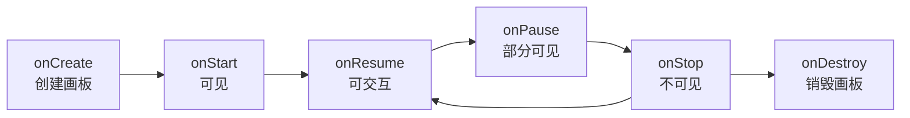
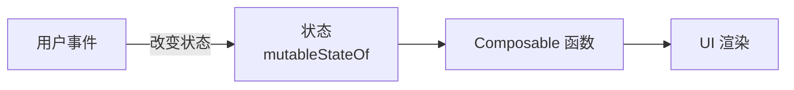
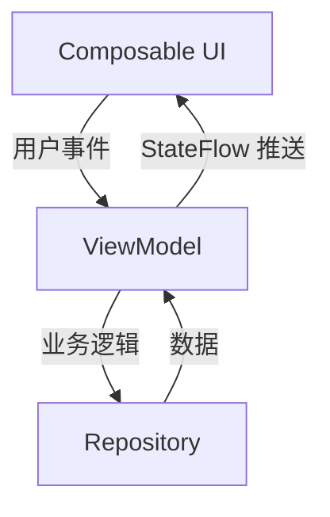

> [!tip] 前置知识
> [[Kotlin知识点快速梳理|Kotlin基础]] · 本篇是 [[Compose Multiplatform]] 系列的先导篇

---

# 学习 Android 开发，但不学「旧 Android」

> [!quote] 写给谁看？
> 你有 Kotlin 基础，**想学 KMP / Compose Multiplatform**，但一打开 Android 文档就被 `Activity`、`Fragment`、`Context`、`XML` 这些概念砸晕了？
>
> **这篇文章就是为你写的。** 我们不学 `ListView`、不碰 `Fragment`、不提 `findViewById`——我们用 **2026 年最现代、最干净** 的方式，建立足以驾驭 Compose Multiplatform 的 Android 知识体系。

---

# 0. 为什么 KMP 开发者需要懂一点 Android？

Compose Multiplatform 的 UI 渲染引擎 **完全脱胎于 Android 的 Jetpack Compose**。在 CMP 里写 `Column`、`Row`、`Modifier`、`remember`，跟在 Android 里写一模一样。

当你打开 CMP 官方文档时，难免会遇到这些 **Android 原生概念**：

- 💢 `ComponentActivity` 是什么？为什么我的 Compose 代码要嵌套在它里面？
- 💢 `Context` 到底是个什么东西？为什么 `expect/actual` 里总能看到它？
- 💢 Android 的「声明式 UI」和我从前理解的 UI 开发有什么不同？

> [!important] 核心观点
> **你不必成为 Android 专家才能写 CMP。** 但你确实需要理解 Android 为 Compose 准备了哪些「基础设施」——因为 CMP 在其他平台（iOS、Desktop、Web）上，**也要模拟或替换这些基础设施**。
>
> 好消息是：**Android 2026 年的现代开发栈，已经瘦身到你可以用一下午就掌握核心。** 那些被淘汰的历史包袱，我们一律跳过。

---

# 1. 剥离外壳：Android 极简运行机制

> 你只需要理解三个东西：**画板（Activity）**、**通行证（Context）**、**规则（权限）**。

## 1.1 ComponentActivity —— 一切的画板

在 Android 上，你的 Compose UI 需要一个「画板」来承载。这个画板就是 `ComponentActivity`。

```kotlin
class MainActivity : ComponentActivity() {
    override fun onCreate(savedInstanceState: Bundle?) {
        super.onCreate(savedInstanceState)
        setContent {
            // 这里写你的 Compose UI
            Greeting("KMP 开发者")
        }
    }
}
```

`setContent { ... }` 就是**把 Compose UI 挂到 Activity 这个画板上**。

Activity 有生命周期（创建 → 前台运行 → 退到后台 → 销毁），但作为 Compose 开发者，**绝大多数时候你不需要手动处理这些事件**——Compose 的状态机制会自动帮你管理。



> [!note] 对 CMP 的意义
> iOS 上 CMP 用 `ComposeUIViewController` 充当画板，Desktop 上则是 `Window { ... }`。**概念统一，入口不同**——这正是 CMP 「一次学习，多平台应用」的精髓。

## 1.2 Context —— 系统资源的通行证

`Context` 可能是 Android 新人最困惑的概念。用一个比喻：

> [!quote] Context 就是你的 App 进入 Android 系统的 **「通行证」**
>
> 想读取一个资源文件？需要 Context。想启动一个新页面？需要 Context。想获取系统服务（传感器、剪贴板）？都需要 Context。

在纯 Android 开发中，Context 无处不在。但在 CMP/KMP 的世界里：

- 🟢 **Composable 函数中**：你极少直接接触 Context，Compose 框架帮你料理了大部分需求。
- 🟡 **跨平台代码中**：当确实需要平台能力时，你会通过 `expect/actual` 机制，在 Android 侧传入 Context，iOS 侧传入等效对象。

> [!tip] 关键理解
> 你不需要深挖 Context 的所有细节。只需要知道：**它是 Android 访问系统能力的入口**，在跨平台时需要用 `expect/actual` 做一层抽象隔离。

## 1.3 权限机制 —— 动态申请

Android 的敏感权限（相机、位置、通知等）需要在运行时动态申请。这在 KMP 跨平台时同样需要 `expect/actual` 处理。

```kotlin
// 在 Compose 中请求权限（使用 accompanist-permissions）
@Composable
fun CameraScreen() {
    val permissionState = rememberPermissionState(
        android.Manifest.permission.CAMERA
    )
    if (permissionState.status.isGranted) {
        CameraPreview()
    } else {
        Button(onClick = { permissionState.launchPermissionRequest() }) {
            Text("授予相机权限")
        }
    }
}
```

> [!warning] 对 KMP 的提醒
> 权限机制是**强平台相关**的。iOS 有自己的一套权限体系，Desktop 则相对宽松。在 KMP 中建议通过接口抽象，不同的平台各自实现权限请求逻辑。

---

# 2. UI 核心：Jetpack Compose 极速入门

> 这一节是 **CMP 的灵魂**。你在这里学到的每一个概念，都能直接用在 iOS、Desktop 上。

## 2.1 声明式 UI 思想 —— 告别「找控件改属性」

旧 Android（XML + View 体系）的开发方式是：

```
① 找 Button 控件 → ② 设置 OnClickListener → ③ 在回调里修改 TextView 的文本
```

Compose 的方式是：

```
UI = f(State)
```

**界面 = 状态的纯函数。** 状态变了，界面自动刷新。你不会再写出 `textView.text = "xxx"` 这种代码。

```kotlin
@Composable
fun Counter() {
    var count by remember { mutableStateOf(0) }

    Button(onClick = { count++ }) {       // 事件向上传
        Text("点击了 $count 次")           // 状态向下流 → 自动重组
    }
}
```

> [!compare] 新旧思维对比
> | 旧思维 (View 体系) | 新思维 (Compose) |
> |---|---|
> | `findViewById` 获取控件 | 无需引用控件，只管描述界面 |
> | 手动 `setText()` / `setOnClickListener()` | 状态驱动，自动重组 |
> | 需要 Adapter 填充列表 | `LazyColumn {}` 直接描述 |
> | XML + Kotlin 两处维护 | 全部 Kotlin，一处维护 |

## 2.2 三大基础布局

| 布局 | 方向 | 类比前端 |
|------|------|---------|
| **`Column`** | 纵向排列 | flex-direction: column |
| **`Row`** | 横向排列 | flex-direction: row |
| **`Box`** | 层叠堆叠 | position: absolute / flexbox 叠放 |

```kotlin
@Composable
fun ProfileCard() {
    Row(
        modifier = Modifier.padding(16.dp),
        verticalAlignment = Alignment.CenterVertically
    ) {
        // 头像（Box 层叠）
        Box {
            Image(/* 头像 */)
            if (isOnline) Badge()  // 在线状态标记叠在上面
        }
        Spacer(modifier = Modifier.width(12.dp))
        Column {
            Text("小明", style = MaterialTheme.typography.titleMedium)
            Text("@xiaoming", style = MaterialTheme.typography.bodySmall)
        }
    }
}
```

## 2.3 Modifier —— Compose 的「魔法修饰符」

传统 Android 通过 XML 属性或 Java 代码设置样式。Compose 则用 **Modifier 链式调用** 描述一切：

```kotlin
Modifier
    .fillMaxWidth()           // 铺满宽度
    .padding(16.dp)           // 外边距
    .clip(RoundedCornerShape(8.dp))  // 圆角裁剪
    .background(Color.White)  // 背景色
    .clickable { /* 点击事件 */ }    // 点击响应
```

> [!important] 顺序敏感！
> Modifier 的调用顺序**决定了执行顺序**。`background` 写在 `padding` 前面还是后面，效果截然不同。记住：**Modifier 从左到右、从外到内依次作用。**

## 2.4 State & Remember —— 状态魔法

Compose 最核心的机制：**状态变化 → 触发重组（Recomposition）**。



- **`mutableStateOf(初始值)`**：创建一个可观察的状态容器
- **`remember { }`**：告诉 Compose 「记住这个值，别在重组时丢掉」
- **重组**：状态变化时，Compose 重新执行**依赖该状态的 Composable 函数**

```kotlin
@Composable
fun SearchScreen() {
    var query by remember { mutableStateOf("") }

    TextField(
        value = query,
        onValueChange = { query = it }  // 输入变化 → 状态更新 → UI 重组
    )
    Text("你正在搜索：$query")  // 自动刷新
}
```

> [!warning] 陷阱提醒
> 不要在 Composable 函数体里**直接写网络请求、数据库写入等副作用**。重组可能被频繁触发，造成性能问题。副作用需要用 `LaunchedEffect`、`DisposableEffect` 等机制托管。

---

# 3. 现代架构与数据流

> 这一部分 **直接服务于 KMP**。你在这里搭建的架构，可以原封不动地搬到 `commonMain` 里。

## 3.1 单向数据流（UDF）

```
State 向下流（从 ViewModel → UI）
Event 向上传（从 UI → ViewModel）
```



## 3.2 MVVM 架构

这套架构可以直接平移到 KMP 的共享代码中：

```kotlin
// ViewModel —— 放在 commonMain
class MainViewModel : ViewModel() {
    private val _uiState = MutableStateFlow("初始数据")
    val uiState: StateFlow<String> = _uiState.asStateFlow()

    fun loadData() {
        viewModelScope.launch {
            val result = repository.fetchData()  // 网络请求
            _uiState.value = result
        }
    }
}

// Composable —— 使用状态
@Composable
fun MainScreen(viewModel: MainViewModel) {
    val state by viewModel.uiState.collectAsState()

    Text(state)
}
```

> [!tip] KMP 最重要的架构启示
> - **ViewModel** 管理状态和业务逻辑 → 放入 `commonMain`
> - **UI 层** 只负责渲染和事件转发 → 使用 `@Composable`
> - **Repository** 处理数据源（网络/本地） → 放入 `commonMain`
>
> 这套分层在 CMP 中可以**全平台共享**，是 KMP 跨平台架构的核心骨架。

## 3.3 StateFlow —— 连接 ViewModel 和 Compose 的桥梁

`StateFlow` 是 Kotlin 协程的「可观察状态容器」：

1. ViewModel 持有 `StateFlow<T>`
2. ViewModel 更新状态：`_uiState.value = newValue`
3. Compose 收集状态：`val state by viewModel.uiState.collectAsState()`
4. 状态变化 → 自动触发重组

> [!note] StateFlow vs LiveData
> `StateFlow` 是 **KMP 友好的**，`LiveData` 是 Android 专属的。在面向 KMP 的项目中，请**一律使用 StateFlow**，这样你的 ViewModel 代码可以无缝移到 `commonMain`。

---

# 4. 装备精炼：面向 KMP 的技术栈选择

> **最关键的实战建议：在 Android 练手阶段，就直接使用支持 KMP 的库！** 这样你的代码以后可以直接迁移到 `commonMain`，不用重写。

## 技术栈对比

| 领域 | ❌ 不推荐（Android 专属） | ✅ 推荐（KMP 友好） |
|------|------------------------|-------------------|
| 网络请求 | Retrofit + OkHttp | **Ktor Client** |
| 依赖注入 | Hilt / Dagger | **Koin** |
| 本地存储 | SharedPreferences | **DataStore** / **Room (KMP)** / **SQLDelight** |
| 图片加载 | Glide / Picasso | **Coil 3** / **Kamel** |
| 序列化 | Gson / Moshi | **kotlinx.serialization** |
| 导航 | Android Navigation | **Voyager** / **Decompose** / **PreCompose** |
| 异步 | RxJava | **kotlinx.coroutines + StateFlow** |

> [!important] 原则
> 永远问自己一个问题：**这个库支持 `commonMain` 吗？** 如果不支持，除非你确认它只在平台层使用，否则换一个。

---

# 5. 结语：迈向星辰大海

> [!summary] 你已经学会了什么？
>
> - ✅ Android 只是 CMP 的「画板 + 通行证 + 权限规则」
> - ✅ Compose = 声明式 UI + 状态驱动 + 链式 Modifier
> - ✅ MVVM + StateFlow = 可以直接搬进 KMP 的架构方案
> - ✅ 选库原则：优先选 KMP 友好的

从这篇文章开始，你不再是一个「Android 零基础」的开发者——你已经掌握了 **2026 年最干净的安卓开发知识**。那些被我们刻意跳过的历史概念（Fragment、XML、View 体系、RxJava），**你大概率永远不需要专门去学它们**。

还记得引言里的那个判断吗？——

> 🚀 **这不是从头学习，这是一场降维打击。**

你已有的 Kotlin 功底 + 这篇文章建立的知识体系，已经足够让你直接打开 [[Compose Multiplatform]] 的文档，开始写跨平台 UI 了。

## 下一篇预告

在接下来的文章中，我们将：
- 🛠 建立一个完整的 KMP 工程项目
- 📱 把今天学的 Compose 知识，**无缝迁移到 iOS 和 Desktop 上**
- 🔄 真正实现「一次编写，三端运行」

> [!tip] 导航
> → 继续阅读：[[Compose Multiplatform|Compose Multiplatform 核心概念]]
> → 回顾基础：[[Kotlin知识点快速梳理|Kotlin 知识点梳理]]
> → 了解跨平台共享：[[Kotlin Multiplatform]]
