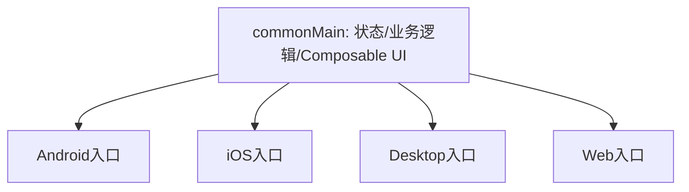

> [!tip] 相关内容
> [[Android开发基础|Android 前置知识（零基础友好）]] ← **先读这篇** · [[Kotlin知识点快速梳理|Kotlin]] · [[Kotlin Multiplatform]]

# 0. CMP简介
> [!note] CMP -- 跨端UI
> **C**ompose **M**ulti**p**latform 是 JetBrains 基于 Compose 声明式UI模型推出的跨平台UI框架。它通常与 Kotlin Multiplatform 搭配使用，让公共代码不仅能共享业务逻辑，也能共享部分或全部UI。

支持的主要方向：
- Android
- iOS
- Desktop(JVM)
- Web(Wasm)

> [!warning] 注意
> Compose Multiplatform不是KMP本身。KMP负责跨平台编译和代码共享，Compose Multiplatform负责共享UI层。

---
# 1. 基础内容
## 1.1 可组合函数
> [!note] 概述
> 可组合函数使用`@Composable`标记，用来描述界面。它不是“创建View对象”的命令式写法，而是根据当前状态声明界面应该是什么样。

```kotlin
@Composable
fun Greeting(name: String) {
    Text("Hello, $name")
}
```

> [!tip] 说明
> Composable函数可以被重复执行，这叫重组(Recomposition)。因此函数体中不要直接写网络请求、数据库写入等副作用逻辑。

## 1.2 主题
主题用于统一颜色、字体、形状等视觉规则。

```kotlin
@Composable
fun AppTheme(content: @Composable () -> Unit) {
    MaterialTheme(
        colorScheme = lightColorScheme(),
        typography = Typography(),
        content = content
    )
}
```

## 1.3 布局
常用布局：
- `Column`：纵向排列
- `Row`：横向排列
- `Box`：层叠布局
- `LazyColumn`：长列表
- `Modifier`：描述尺寸、间距、背景、点击等修饰信息

```kotlin
@Composable
fun UserCard(name: String, email: String) {
    Column(
        modifier = Modifier.padding(16.dp)
    ) {
        Text(name, style = MaterialTheme.typography.titleMedium)
        Text(email, style = MaterialTheme.typography.bodyMedium)
    }
}
```

## 1.4 事件
事件通常通过回调向上传递，避免子组件直接操作全局状态。

```kotlin
@Composable
fun Counter(count: Int, onIncrease: () -> Unit) {
    Button(onClick = onIncrease) {
        Text("count = $count")
    }
}
```

## 1.5 状态
> [!note] 概述
> Compose的核心是“状态驱动UI”。状态发生变化后，依赖该状态的Composable会重新执行。

```kotlin
@Composable
fun CounterScreen() {
    var count by remember { mutableStateOf(0) }

    Counter(
        count = count,
        onIncrease = { count++ }
    )
}
```

> [!warning] 注意
> `remember`只在当前组合中保存状态。页面旋转、进程重建、导航返回等场景需要结合平台生命周期或持久化方案处理。

## 1.6 修饰符
`Modifier`用于描述UI元素的布局、绘制和交互行为。

```kotlin
Modifier
    .fillMaxWidth()
    .padding(16.dp)
    .background(Color.White)
```

---
# 2. 平台差异
> [!note] 概述
> CMP尽量提供一致的Compose API，但不同平台仍然存在输入方式、窗口、系统返回、权限、字体、滚动行为等差异。

常见差异：
- Android使用`Activity`承载界面
- iOS需要通过`ComposeUIViewController`嵌入
- Desktop通过`application { Window { ... } }`启动
- Web需要挂载到浏览器DOM或Canvas相关入口

> [!tip] 实践建议
> UI可以共享，但平台入口、权限、系统能力、深链、推送等内容通常应保留在平台层。

---
# 3. 与KMP的关系


> [!summary] 分层建议
> - `commonMain`：UI组件、状态模型、网络接口、业务逻辑
> - `androidMain`：Activity、权限、Android专属能力
> - `iosMain`：UIKit/SwiftUI嵌入、iOS专属能力
> - `desktopMain`：窗口、菜单、文件系统交互

---
# 4. 最佳实践
> [!summary] 实践原则
> - UI状态尽量向上提升，组件只接收状态和事件
> - 避免在Composable函数体中直接执行副作用
> - 平台能力通过接口或`expect/actual`隔离
> - 复杂页面先拆成小组件，保证重组范围可控
> - Web和iOS平台仍要关注框架成熟度、包体和原生交互体验

> [!warning] 常见误区
> - 认为所有平台UI行为可以完全一致
> - 把业务逻辑写进Composable中
> - 在公共UI层直接依赖Android或iOS API
> - 忽略不同平台的导航、返回和窗口模型
