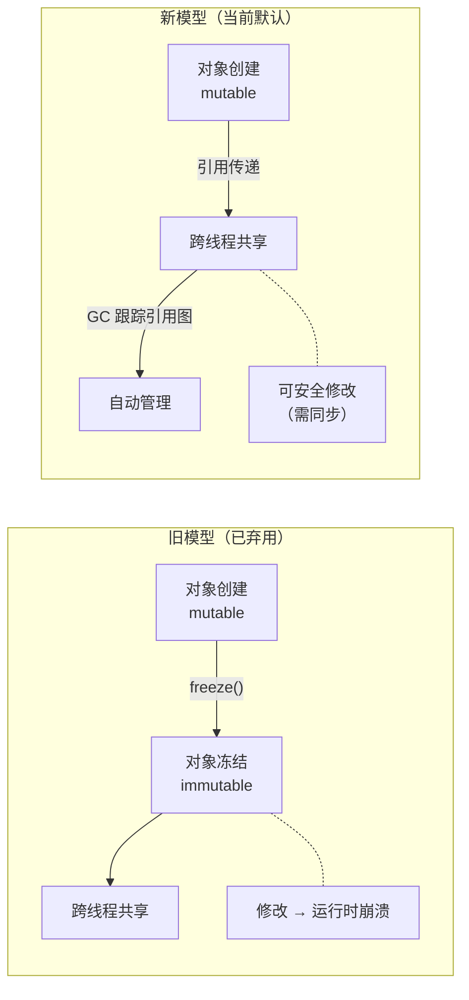
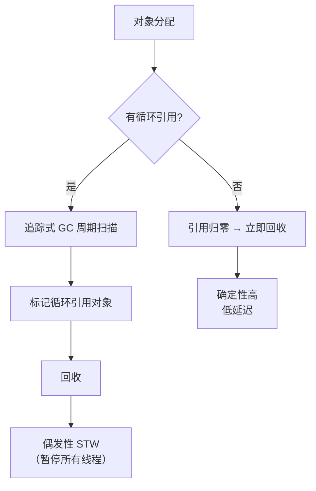
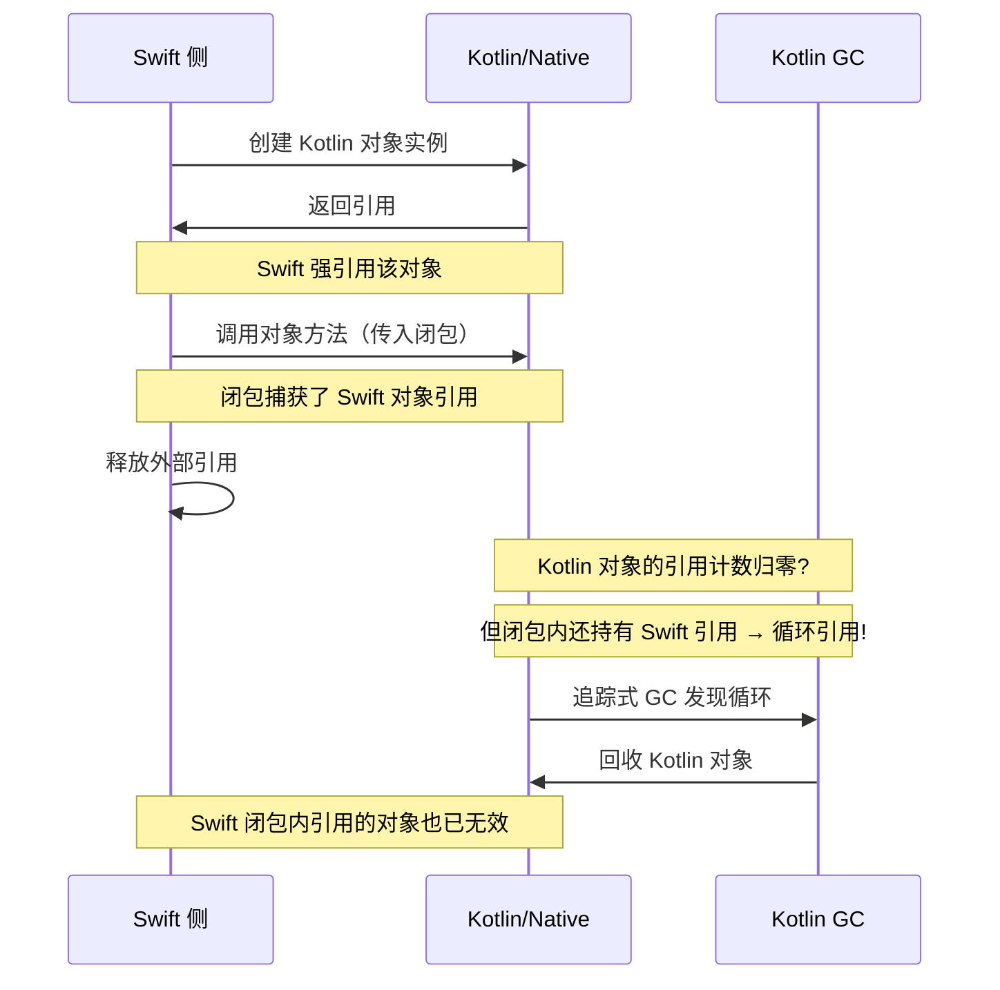
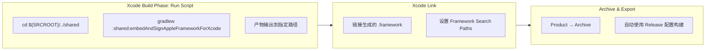
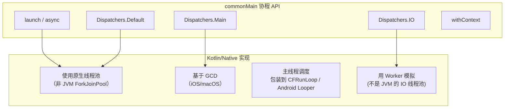
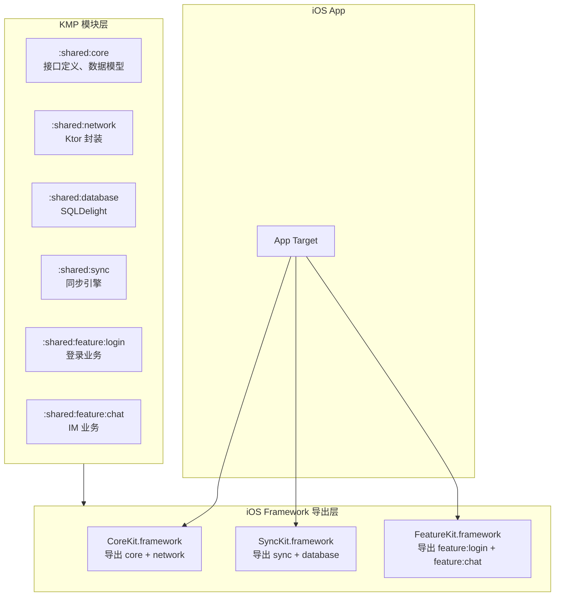
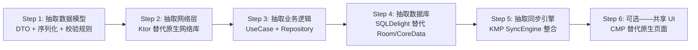

> [!tip] 相关内容
> [[Kotlin知识点快速梳理|Kotlin]]、[[Kotlin Multiplatform]]

# 0. Kotlin/Native简介
> [!note] 概述
> Kotlin/Native 是 Kotlin Multiplatform 的一部分，它可以把 Kotlin 代码编译为不依赖 JVM 的原生二进制产物。常见目标包括 iOS、macOS、Linux、Windows、watchOS、tvOS 等。

Kotlin/Native的核心价值：
- 在没有JVM的环境运行Kotlin代码
- 为iOS等平台提供共享业务逻辑
- 与C、Objective-C、Swift生态互操作
- 生成命令行工具、动态库或平台framework

> [!warning] 注意
> Kotlin/Native不是“把JVM程序直接搬到原生平台”。JVM专属库、反射能力、动态类加载等能力不能直接复用。

---
# 1. 编译目标
## 1.1 常见target
```kotlin
kotlin {
    iosArm64()
    iosSimulatorArm64()
    macosArm64()
    linuxX64()
}
```

> [!tip] 说明
> Native target 的可用性与操作系统、CPU架构、编译工具链有关。例如iOS相关target通常需要在macOS环境下配合Xcode工具链构建。

## 1.2 产物形式
Kotlin/Native可以生成：
- 可执行文件
- 静态库
- 动态库
- Apple平台使用的framework

```kotlin
kotlin {
    iosArm64 {
        binaries {
            framework {
                baseName = "Shared"
            }
        }
    }
}
```

---
# 2. 内存模型
> [!note] 概述
> Kotlin/Native使用自动内存管理。现在的默认内存模型已经支持更自然的跨线程对象共享，减少了早期版本中冻结对象带来的心智负担。

需要注意的点：
- 不要把JVM中的线程模型经验完全照搬到Native
- 并发代码优先使用协程和明确的状态管理
- 与Objective-C/Swift互操作时要注意对象生命周期
- 大型对象、图片、文件句柄等资源仍然要按平台规则释放

---
# 3. 与平台互操作
## 3.1 C互操作
Kotlin/Native可以通过`.def`文件描述C库头文件和链接参数，然后生成Kotlin可调用的绑定。

```text
headers = mylib.h
libraryPaths = /usr/local/lib
staticLibraries = libmylib.a
```

## 3.2 Objective-C和Swift互操作
在Apple平台，Kotlin代码常被编译为framework供Swift或Objective-C调用。

```swift
import Shared

let info = PlatformInfo().name
```

> [!tip] 说明
> Swift调用Kotlin时，Kotlin中的可空类型、集合、异常、协程返回值都会映射为平台可理解的形式，但映射后的API不一定像原生Swift一样自然，需要专门设计对外暴露的接口。

---
# 4. 适用场景
> [!summary] 适合使用
> - Android/iOS共享业务逻辑
> - 跨平台命令行工具
> - 需要复用Kotlin算法代码到Native环境
> - Kotlin库需要提供Apple framework

> [!warning] 不适合强行使用
> - 强依赖JVM生态的后端应用
> - 需要大量运行时反射或动态代理的框架
> - 对平台UI细节要求很高但团队不熟悉Native互操作的项目

---
# 5. 最佳实践
> [!summary] 实践原则
> - 公共层保持小而稳定
> - 对外暴露给Swift的API要单独设计，不要直接暴露复杂内部模型
> - 使用接口或`expect/actual`隔离平台差异
> - 避免在Native层引入只支持JVM的依赖
> - 对iOS framework的包名、模块名和二进制大小保持关注

---
# 6. 深入内存模型

> [!important] Kotlin/Native 内存模型的演进
> 早期 Kotlin/Native 使用**冻结模型**——跨线程共享对象必须先调用 `freeze()`，冻结后的对象不可变。这带来了大量心智负担。
>
> 从 Kotlin 1.7.20+ 开始，默认启用**新内存模型**：对象不再需要冻结即可跨线程共享，Kotlin/Native 的 GC 现在可以追踪跨线程的对象图。但这并不意味着所有 JVM 经验可以直接照搬。

## 6.1 对象迁移与引用追踪



> [!note] 新旧对比
> - 旧模型：安全但僵化——要么冻结，要么不共享
> - 新模型：灵活但有代价——GC 需要更复杂的跨线程引用跟踪，性能略低于冻结模型

## 6.2 @SharedImmutable 与 @ThreadLocal

> [!warning] 虽然新模型去掉了 freeze()，但有些场景仍需要显式注解

```kotlin
// commonMain

/**
 * @SharedImmutable：标记一个对象在初始化后永不改变。
 * 编译器可以进行激进优化（如常量折叠、内联）。
 * 适用于：全局配置、枚举映射、编译期确定的常量。
 */
@SharedImmutable
val PLATFORM_ORDER: Map<String, Int> = mapOf(
    "Android" to 1,
    "iOS" to 2,
    "Desktop" to 3
)

/**
 * @ThreadLocal：每个线程持有独立副本。
 * 适用于：线程不安全但需要全局访问的对象（如 SimpleDateFormat、Random 实例）。
 * 注意：每个线程都有一份，注意内存开销。
 */
@ThreadLocal
object PerThreadRandom {
    private val random = java.util.Random()
    fun nextInt(): Int = random.nextInt()
}
```

| 注解 | 作用 | 适用场景 | 内存代价 |
|:----:|:----|:---------|:--------:|
| `@SharedImmutable` | 告诉编译器该对象永不改变，可安全共享 | 全局常量、配置映射、枚举 | 无（单例） |
| `@ThreadLocal` | 每个线程独立副本，避免同步开销 | 线程不安全工具类、SimpleDateFormat | 每线程一份副本 |

> [!tip] 使用建议
> - 97% 的场景不需要这两个注解——默认 GC 管理已经够用
> - `@SharedImmutable` 用于性能关键的全局常量
> - `@ThreadLocal` 只用于无法设计为无状态的工具类

## 6.3 GC 行为与内存分析

### 6.3.1 Kotlin/Native GC 特点

> [!note] 与 JVM GC 的关键区别
> - Kotlin/Native 使用**引用计数（Ref-Counting）+ 追踪式 GC** 的混合策略
> - 引用计数：大多数对象在引用归零时立即回收（确定性高）
> - 追踪式 GC：周期性扫描循环引用和跨线程引用（类似 JVM 的 CMS）
> - **没有分代收集**，也没有 `System.gc()` 的等价物



### 6.3.2 内存泄漏常见模式

| 模式 | 描述 | 解决方案 |
|:----:|:------|:--------|
| **跨线程闭包捕获** | 协程 Job 未被取消，闭包持有外部对象引用 | 确保 `scope.cancel()` 在组件销毁时调用 |
| **@ThreadLocal 滥用** | 以为 @ThreadLocal 会自动回收，但线程池中的线程不会释放 | 改用 `ThreadLocal.withInitial` 或对象池 |
| **C 指针未释放** | `CPointer` 对应的 native 内存未调用 `free()` | 用 `usePinned {}` 或 `CPointerHolder` RAII 包装 |
| **循环引用** | Kotlin 对象互相引用，GC 扫描周期未到 | 在 `DisposableEffect` 或 `onDestroy` 中显式断裂引用 |

```kotlin
// 常见泄漏示例：协程泄漏
class LeakyViewModel {
    val scope = CoroutineScope(Dispatchers.Default)

    fun startHeavyWork() {
        scope.launch {
            // 假设这是个无限循环
            while (true) {
                delay(1000)
                // 持有外部引用 → 对象无法回收
            }
        }
    }
    // ❌ 没有 dispose() / cancel() 方法
}

// ✅ 修复方案
class SafeViewModel {
    private val scope = CoroutineScope(SupervisorJob() + Dispatchers.Default)

    fun startHeavyWork() {
        scope.launch { /* ... */ }
    }

    fun dispose() {
        scope.cancel()  // 取消所有协程 → 释放引用链
    }
}
```

---
# 7. 跨语言互操作进阶

> [!important] Kotlin/Native 的真正价值在于与平台生态融合
> 共享逻辑层用 Kotlin 编写，但最终需要被 Swift/ObjC/ArkTS 调用。接口设计直接决定团队开发体验。

## 7.1 C 互操作深度

### 7.1.1 .def 文件详解

```c
// native/interop/libcurl.def
headers = curl/curl.h
headerFilter = curl/*

// 链接参数
linkerOpts = -L/usr/local/opt/curl/lib -lcurl

// 编译参数
compilerOpts = -I/usr/local/opt/curl/include

// 静态链接
staticLibraries = libcurl.a
libraryPaths = /usr/local/opt/curl/lib
```

> [!tip] .def 文件关键配置
> - `headers`：C 头文件路径（多个用空格分隔）
> - `headerFilter`：只暴露匹配的头文件中的符号（避免引入系统头文件的噪声）
> - `staticLibraries`：静态库名称（不包含 `lib` 前缀和 `.a` 后缀）
> - `linkerOpts` / `compilerOpts`：链接和编译时传递给 clang 的参数

### 7.1.2 内存安全模式

```kotlin
// 使用 CPointer 时的内存安全模式

// ❌ 危险：手动管理 C 内存（容易泄漏）
val ptr = nativeHeap.alloc<IntVar>()
ptr.value = 42
// 忘记调用 nativeHeap.free(ptr)

// ✅ 安全：使用 usePinned {} —— 自动释放
memScoped {
    val ptr = alloc<IntVar>()
    ptr.value = 42
    sendToC(ptr.ptr)
    // 退出 memScoped 时自动释放
}

// ✅ 安全：CPointerHolder RAII 包装
class NativeBuffer(size: Int) : Closeable {
    private val ptr: CPointer<ByteVar> = nativeHeap.allocArray(size)

    fun asPointer(): CPointer<ByteVar> = ptr

    override fun close() {
        nativeHeap.free(ptr)
    }
}
```

> [!warning] C 互操作的黄金法则
> - 谁分配，谁释放——遵循底层 C 库的内存管理约定
> - 总是用 `memScoped {}` 或 `usePinned {}` 代替手动 `alloc/free`
> - C 回调中的 Kotlin 闭包可能被多线程调用，确保线程安全

## 7.2 Objective-C / Swift 互操作最佳实践

### 7.2.1 接口设计原则

```kotlin
// commonMain/kotlin/shared/GreetingService.kt

/**
 * Swift 友好的接口设计要点：
 * 1. 用 interface 而不是 class（Swift 协议更自然）
 * 2. 避免 Kotlin 独有的类型（如 Pair、Triple、sealed class）
 * 3. 可空类型用 ? 明确标记（Swift 侧映射为 Optional）
 * 4. 集合类型使用 List/Set/Map 而非平台特定类型
 * 5. 回调使用函数类型而非接口（Swift 闭包更自然）
 */
interface GreetingService {
    fun greet(name: String): String
    suspend fun fetchGreetingAsync(name: String): String
}
```

```swift
// iOS 侧调用
import Shared

class ViewController: UIViewController {
    let service: GreetingService = GreetingServiceImpl()

    func displayGreeting() {
        // Kotlin interface → Swift protocol
        let message = service.greet(name: "World")
        label.text = message
    }

    func loadGreeting() {
        // suspend 函数 → Swift async/await（Kotlin 2.0+）
        Task {
            let message = try await service.fetchGreetingAsync(name: "World")
            label.text = message
        }
    }
}
```

### 7.2.2 suspend 函数在 Swift 侧的映射

> [!important] Kotlin 2.0+ 的改进
> Kotlin 1.x 中，`suspend` 函数被映射为带有 `completionHandler` 的 ObjC 方法。Kotlin 2.0+ 支持直接映射为 Swift 的 `async throws`。

```kotlin
// Kotlin 1.x 写法（兼容 iOS 13 以下）
suspend fun fetchData(): Result<Data> {
    // 映射为 completionHandler 回调
}

// Kotlin 2.0+ 写法（需要 iOS 13+ / Swift 5.5+）
// 自动映射为 Swift async throws
@ObjCName(swiftName = "fetchData()")
suspend fun fetchData(): Data
```

```swift
// Kotlin 2.0+ 在 Swift 中的调用
Task {
    do {
        let data = try await sharedModule.fetchData()
        // 使用 data
    } catch {
        // 处理错误
    }
}
```

### 7.2.3 跨语言引用管理



> [!warning] 跨语言引用的核心风险
> 1. Kotlin 闭包被传入 Swift/ObjC，可能被该侧长期持有
> 2. Swift 闭包被传入 Kotlin，捕获了 Swift 对象，形成跨语言引用链
> 3. 双方 GC / ARC 互不了解对方的引用图，可能延迟回收甚至泄漏

**跨语言资源管理三原则**：

```kotlin
// 原则 1：Kotlin → Swift 的回调使用 WeakReference
class CallbackHolder {
    private val weakCallbacks = mutableListOf<() -> Unit>()

    fun addCallback(cb: () -> Unit) {
        // 用弱引用包装，防止 Swift 侧长期持有阻止 Kotlin 回收
        weakCallbacks.add(cb)
    }
}

// 原则 2：Swift → Kotlin 的方法调用避免闭包捕获
// Swift 侧：
// ❌ 闭包捕获 self
// sharedObject.doWork { [weak self] result in
//     self?.handleResult(result)
// }

// 原则 3：Disposable 模式——显式清理
interface Disposable {
    fun dispose()
}
```

## 7.3 与 HarmonyOS ArkTS 互操作

> [!note] 当前状态
> HarmonyOS 的 Native API 通过 C 接口暴露。Kotlin/Native 可以通过 C Interop 桥接到 ArkTS 的 FFI（Foreign Function Interface）。这意味着 KMP 的共享代码可以以 `.so` 的形式被鸿蒙应用加载。

```text
Kotlin/Native 共享层
    ↓ 编译为 .so
C API 接口层（手动包装）
    ↓ FFI 调用
ArkTS / 仓颉 应用层
```

> [!warning] 鸿蒙互操作的局限性
> - 目前没有官方的 Kotlin/Native → ArkUI 直接绑定
> - 需要通过 C 接口做中间层，序列化/反序列化开销较大
> - 建议：鸿蒙侧只共享纯业务逻辑（无 UI），UI 层仍使用 ArkTS

---
# 8. Framework 构建与集成

> [!important] 框架构建是 KMP Native 项目从"个人项目"走向"团队项目"的关键基础设施

## 8.1 Framework 产物配置详解

```kotlin
// build.gradle.kts
kotlin {
    iosArm64()
    iosSimulatorArm64()

    listOf(iosArm64(), iosSimulatorArm64()).forEach { target ->
        target.binaries {
            framework {
                // 产物名称
                baseName = "SharedKit"

                // ★ 导出指定 module 的 API，外部只看到导出的接口
                export(project(":shared:core"))
                export(project(":shared:sync-api"))

                // ★ 是否传递导出依赖（不传递 = 更小的 framework）
                transitiveExport = false

                // ★ 静态 vs 动态 framework
                isStatic = true  // 开发期推荐，避免每次重新签名
                // isStatic = false  // 发布到 App Store 时可用动态库

                // ★ 嵌入并签名（Xcode 集成时需要）
                embedAndSignAppleFrameworkForXcode = true
            }
        }
    }

    // ★ 合并模拟器和真机 framework（用于本地开发和 CI）
    task("mergeIOSFramework") {
        dependsOn("linkDebugFrameworkIosArm64", "linkDebugFrameworkIosSimulatorArm64")
        doLast {
            copy {
                from(layout.buildDirectory.dir("bin/iosArm64/debugFramework"))
                from(layout.buildDirectory.dir("bin/iosSimulatorArm64/debugFramework"))
                into(layout.buildDirectory.dir("bin/iosUniversal/debugFramework"))
            }
            exec {
                commandLine(
                    "lipo", "-create",
                    "${layout.buildDirectory}/bin/iosArm64/debugFramework/SharedKit.framework/SharedKit",
                    "${layout.buildDirectory}/bin/iosSimulatorArm64/debugFramework/SharedKit.framework/SharedKit",
                    "-output",
                    "${layout.buildDirectory}/bin/iosUniversal/debugFramework/SharedKit.framework/SharedKit"
                )
            }
        }
    }
}
```

### 8.1.1 静态 vs 动态框架对比

| 维度 | 静态框架（`isStatic = true`） | 动态框架（`isStatic = false`） |
|:----:|:-----------------------------:|:------------------------------:|
| 产物大小 | 嵌入到主二进制，增量 | 独立 .framework，整体上传 |
| 构建速度 | 快（不需要签名 framework） | 慢（每次需要 codesign） |
| 启动时间 | 无额外加载开销 | App 启动时 dyld 加载 |
| 多 target 合并 | 需要 lipo | 需要 lipo |
| 发布到 App Store | 正常 | 正常 |
| **开发期推荐** | **✅ 是** | ❌ 否 |

> [!tip] 开发期用静态库，发布期按需选择
> 静态库在 Xcode 中不需要每次重新 `embed` 和 `sign`，显著提升迭代速度。

## 8.2 CocoaPods 集成

```ruby
# Podfile
platform :ios, '16.0'
use_frameworks!

# 方式一：通过 Kotlin CocoaPods plugin
plugin 'cocoapods-Kotlin'

target 'MyApp' do
    pod 'SharedKit', :path => '../shared'
end
```

```kotlin
// build.gradle.kts — CocoaPods plugin 配置
plugins {
    id("org.jetbrains.kotlin.multiplatform")
    id("org.jetbrains.kotlin.native.cocoapods")
}

kotlin {
    cocoapods {
        // Pod 名称
        name = "SharedKit"
        summary = "Shared KMP business logic"
        homepage = "https://example.com"

        // 支持的 iOS 最低版本
        ios.deploymentTarget = "16.0"

        // 指定 framework 配置
        framework {
            baseName = "SharedKit"
            isStatic = true
            export(project(":shared:core"))
        }

        // 额外 pod 依赖（KMP 共享层依赖原生 cocoapods 库时使用）
        pod("Alamofire") {
            version = "~> 5.0"
        }
    }
}
```

> [!warning] CocoaPods plugin 的局限性
> - 每次 Gradle 构建后自动执行 `pod install`，如果 shared module 依赖复杂可能耗时较长
> - 多个 App Target 共享同一个 KMP framework 时，需要确保 pod 路径一致
> - **推荐替代方案**：直接生成 `.xcframework` 手动集成

## 8.3 Xcode 构建集成



```bash
# Xcode Run Script Phase (放在 Build Sources 之前)
cd "${SRCROOT}/../shared"
./gradlew :shared:embedAndSignAppleFrameworkForXcode \
    -Pkotlin.native.cacheKind=none \
    -PXCODE_CONFIGURATION=${CONFIGURATION}
```

> [!tip] Xcode 集成最佳实践
> 1. Run Script 放在 **"Compile Sources" 之前**，确保 framework 已生成
> 2. 设置 `FRAMEWORK_SEARCH_PATHS = $(SRCROOT)/../shared/build/xcode-frameworks/$(CONFIGURATION)/$(SDK_NAME)`
> 3. 调试时使用 `isStatic=true` + `kotlin.native.cacheKind=static` 提速
> 4. 在 `.gitignore` 中添加 `shared/build/` 和 `*.framework/`

---
# 9. 调试与性能优化

## 9.1 崩溃符号化

> [!important] 没有符号化的崩溃栈毫无意义
> Kotlin/Native 编译后的二进制不包含 Kotlin 源文件名和行号，除非显式生成调试符号。

```kotlin
// build.gradle.kts — 调试符号配置
kotlin {
    iosArm64 {
        binaries {
            framework {
                // 发布版也保留调试符号（便于线上崩溃符号化）
                if (project.findProperty("releaseWithSymbols") == "true") {
                    freeCompilerArgs += "-Xinclude=debug-symbols.opt"
                }
            }
        }
    }
}
```

```bash
# dSYM 文件管理
# Kotlin/Native 生成的 dSYM 位于：
build/bin/iosArm64/releaseFramework/SharedKit.framework.dSYM

# 符号化崩溃栈
atos -arch arm64 -o SharedKit.framework/SharedKit -l <loadAddress> <address>

# 或者使用 Xcode 的 symbolicatecrash
export DEVELOPER_DIR=/Applications/Xcode.app/Contents/Developer
/Applications/Xcode.app/Contents/SharedFrameworks/DVTFoundation.framework/Versions/A/Resources/symbolicatecrash crash.crash > symbolicated.crash
```

> [!tip] 线上崩溃符号化流程
> 1. CI 构建时保存 dSYM 文件（关联 Git commit SHA）
> 2. 上报崩溃栈时附带 dSYM UUID
> 3. 在符号化服务中根据 UUID 匹配 dSYM
> 4. 使用 `atos` 或 `llvm-symbolizer` 符号化

## 9.2 性能分析工具

| 工具 | 适用平台 | 分析能力 | 接入难度 |
|:----:|:--------|:---------|:--------:|
| **Xcode Instruments** | iOS/macOS | CPU、内存、GPU、网络全量分析 | 低 |
| **Android Studio Profiler** | Android | CPU、内存、网络 | 低 |
| **perf** (Linux) | Linux | CPU 采样、调用图 | 中 |
| **Heap Profiler** | iOS/Android | Kotlin/Native 对象分配追踪 | 高 |
| **自定义 Trace** | 所有 | 埋点追踪特定 Kotlin 函数调用耗时 | 中 |

```kotlin
// 自定义 Trace 打点
// commonMain
expect fun traceBegin(section: String)
expect fun traceEnd(section: String)

// iOS actual
actual fun traceBegin(section: String) {
    platform.os.OSSignposter.begin(section) // 接入 Xcode Instruments
}
actual fun traceEnd(section: String) {
    platform.os.OSSignposter.end(section)
}

// Android actual
actual fun traceBegin(section: String) {
    android.os.Trace.beginSection(section)
}
actual fun traceEnd(section: String) {
    android.os.Trace.endSection()
}
```

## 9.3 编译器选项调优

```kotlin
// build.gradle.kts — 编译器调优参数
kotlin {
    iosArm64 {
        freeCompilerArgs += listOf(
            // 优化级别
            "-opt",                           // 启用编译器优化（等同于 -O2）
            // "-Xdebug",                      // 调试模式（禁用优化，仅开发期）

            // 生成调试信息
            "-g",                             // 生成完整调试信息

            // 链接优化
            "-Xbinary=linkerAppendArguments=-dead_strip", // 移除未使用符号
            "-Xbinary=linkerAppendArguments=-ObjC",       // 保留 ObjC 分类

            // 并发 GC 模式
            "-Xgc=cms",                       // 并发标记清除（默认）
            // "-Xgc=noop",                    // 无 GC（仅用于极端性能场景）

            // 内联阈值
            "-Xinline-checks=false",          // 禁用内联检查（生产环境）
        )
    }
}
```

| 编译器选项 | 效果 | 推荐场景 |
|:----------:|:----|:--------|
| `-opt` | 启用 LLVM 优化（O2） | 所有构建（包括 debug，除非需要快速迭代） |
| `-g` | 生成 DWARF 调试信息 | 开发期 + 发布版（配合 dSYM） |
| `-Xgc=cms` | 并发标记清除 GC | 默认，大多数场景 |
| `-Xgc=noop` | 完全禁用 GC | 仅在确定无循环引用且性能极端敏感时使用 |
| `-Xbinary=dead_strip` | 链接时移除未用符号 | 发布版（减小包体积） |
| `-Xinline-checks=false` | 消除内联边界检查 | 发布版（提升运行时性能） |

> [!warning] `-Xgc=noop` 的风险
> 禁用 GC 意味着所有对象永远不会被回收。只在确定对象数量有限且固定（如嵌入式系统、游戏引擎的固定对象池）时使用。**生产环境几乎永远不推荐**。

---
# 10. 并发与协程实践

## 10.1 Kotlin/Native 协程特性

> [!note] Kotlin/Native 的协程与 JVM 的行为基本一致，但存在重要差异



> [!important] 区别列表
> - `Dispatchers.Default`：基于原生线程池（不是 JVM 的 ForkJoinPool），线程数 = CPU 核心数
> - `Dispatchers.Main`：iOS 上基于 GCD 主队列，Android 上基于主线程 Looper
> - `Dispatchers.IO`：Kotlin/Native 上没有专用 IO 线程池，用 `newSingleThreadContext` 替代

```kotlin
// iOS 侧替代 Dispatchers.IO 的方案
// commonMain
expect val Dispatchers.IO: CoroutineDispatcher

// iosMain
actual val Dispatchers.IO: CoroutineDispatcher =
    newSingleThreadContext("NativeIO")
```

## 10.2 Mutex 与原子操作

> [!note] Kotlin/Native 标准库提供了跨平台的同步原语

```kotlin
// commonMain — 跨平台同步原语

import kotlinx.coroutines.sync.Mutex
import kotlinx.coroutines.sync.withLock
import kotlin.native.concurrent.AtomicInt
import kotlin.native.concurrent.AtomicReference

/**
 * 线程安全的计数器
 */
class ThreadSafeCounter {
    private val count = AtomicInt(0)

    fun increment(): Int = count.addAndGet(1)
    fun get(): Int = count.get()
}

/**
 * 线程安全的对象持有者
 */
class ThreadSafeHolder<T> {
    private val ref = AtomicReference<T?>(null)

    fun set(value: T) { ref.value = value }
    fun get(): T? = ref.value
}

/**
 * 协程安全的临界区
 */
class SafeRepository {
    private val mutex = Mutex()
    private val cache = mutableMapOf<String, Data>()

    suspend fun getOrFetch(key: String): Data = mutex.withLock {
        cache.getOrPut(key) { fetchFromRemote(key) }
    }
}
```

> [!tip] `AtomicInt` vs `Mutex` 选择
> - `AtomicInt`/`AtomicLong`/`AtomicReference`：无锁、高性能，适合简单状态
> - `Mutex.withLock {}`：协程挂起式锁，适合长时间临界区操作
> - 不要直接用 `synchronized` 块——Kotlin/Native 上可能退化为平台的 `@Synchronized` 注解

## 10.3 Worker 与多线程（底层）

> [!warning] 大多数场景不需要直接使用 Worker
> 协程已经封装了线程管理和任务调度。只有以下情况需要直接操作 Worker：
> - 需要绑定线程到特定 CPU 核心
> - 执行不支持协程的 C 库回调
> - 需要确定性线程优先级

```kotlin
import kotlin.native.concurrent.*

// 使用 Worker 执行 CPU 密集型任务
val worker = Worker.start(name = "heavy-compute")

val future = worker.execute(TransferMode.SAFE, { inputData }) {
    // 在 Worker 线程中执行
    heavyComputation(it)
}

// 获取结果
val result = future.result

// 使用完后终止 Worker
worker.requestTermination()
```

---
# 11. 包体积与构建优化

> [!important] KMP Native 的包体积是团队落地时最先遇到的"硬钉子"

## 11.1 Framework 体积组成分析

一个典型的 KMP Native framework 在 iOS 上的体积分布：

```text
SharedKit.framework (约 35MB)
  ├── Kotlin 标准库        ~8-12 MB     ← kotlin/ 包下的运行时
  ├── kotlinx 库           ~5-8 MB      ← coroutines/serialization
  ├── 业务代码              ~5-10 MB     ← 你的 shared module
  ├── 第三方 KMP 依赖       ~3-5 MB      ← SQLDelight, Ktor 等
  ├── Skia (CMP)           ~15-25 MB    ← 仅在使用 CMP 时
  └── 调试符号              +10-20 MB    ← 发布版可剥离
```

## 11.2 体积治理策略

### 11.2.1 按需导出（最有效的策略）

```kotlin
kotlin {
    iosArm64 {
        binaries {
            framework {
                // ★ 只导出必要的 API 给 Swift
                export(project(":shared:core"))
                export(project(":shared:sync-api"))

                // ★ 不导出依赖 —— 未导出的类型会被链接器内联移除
                transitiveExport = false
            }
        }
    }
}
```

| 配置 | 效果 | 体积影响 |
|:----:|:----|:--------:|
| 导出所有依赖 | 所有 module 的 public API 都对 Swift 可见 | 基线 +100% |
| **仅导出必要 module** | 只暴露核心 API | **-30~50%** |
| `transitiveExport = false` | 不传递导出依赖 | **-10~20%** |

### 11.2.2 Dead Code Elimination

```kotlin
// gradle.properties
# 启用更激进的 DCE
kotlin.native.dce=true

# 排除特定包（防止 DCE 误删反射使用的类）
kotlin.native.dce.excludePackages=kotlinx.serialization,com.example.reflection
```

```kotlin
// 保留清单文件 keep.list（放在 src/iosMain 下）
// 每行一个需要保留的全限定类名
kotlinx.serialization.json.Json
com.example.reflection.CachedSerializer
```

### 11.2.3 Framework 拆分

> [!tip] 单一 framework 方便但体积大
> 将大模块拆分为多个独立 framework，App 按需加载：

```text
大型项目推荐拆分方案：
  ┌──────────────────────────────────────┐
  │ CoreKit.framework     (~5MB)         │ ← 必须加载
  │  └─ 数据模型、接口定义、工具类         │
  ├──────────────────────────────────────┤
  │ SyncKit.framework     (~8MB)         │ ← 按需加载
  │  └─ 同步引擎、冲突处理、WebSocket      │
  ├──────────────────────────────────────┤
  │ UIFramework.framework  (~20MB)       │ ← 仅含 UI 的页面加载
  │  └─ CMP 页面、主题、组件库            │
  └──────────────────────────────────────┘
```

## 11.3 构建速度优化

```kotlin
// gradle.properties — 构建加速配置
# 并行编译
org.gradle.parallel=true
org.gradle.caching=true
org.gradle.jvmargs=-Xmx6g -XX:+UseParallelGC -XX:MaxMetaspaceSize=512m

# Kotlin/Native 缓存
kotlin.native.cacheKind.iosArm64=static          # 缓存 native 编译产物
kotlin.native.cacheKind.iosSimulatorArm64=static

# 增量编译
kotlin.incremental.multiplatform=true

# 禁用不必要的 target（开发期）
# kotlin.native.targets=iosArm64,iosSimulatorArm64
```

> [!note] 构建时间参考（中等规模项目）
> - 首次全量编译：~8-15 分钟
> - 增量编译（一行代码修改）：~30-90 秒
> - 增量编译（添加依赖）：~2-5 分钟

---
# 12. 大型项目应用模式

> [!important] 当团队规模 > 5 人、shared module > 10 个时，以下模式决定项目成败

## 12.1 多模块框架发布架构



```kotlin
// :shared:sync/build.gradle.kts
kotlin {
    iosArm64 {
        binaries {
            framework {
                baseName = "SyncKit"
                isStatic = true

                // 导出自己及依赖的 core module
                export(project(":shared:core"))
                export(project(":shared:database"))
                // 不导出 network（仅内部使用）
                // transitiveExport = false
            }
        }
    }
}
```

> [!tip] 多模块策略的好处
> - **并行编译**：各个 framework 可独立编译，CI 可以并行
> - **按需加载**：App 只有在使用同步功能时才加载 SyncKit
> - **API 隔离**：不同团队负责不同的 framework，接口变更互不影响
> - **版本独立**：每个 framework 可以有不同的版本迭代节奏

## 12.2 API Surface 管理

```kotlin
// ★ 对外 API 放在 api/ 包中，内部实现在 internal/ 包中
// commonMain/kotlin/com/example/shared/api/
interface UserRepository {
    suspend fun getUser(id: String): User
    suspend fun updateUser(user: User)
}

// commonMain/kotlin/com/example/shared/internal/
// 使用 internal 可见性，不会被 framework 导出
internal class UserRepositoryImpl(
    private val api: KtorApi
) : UserRepository {
    // ...
}
```

> [!important] API Surface 控制规则
> 1. `public` 的顶层声明才会被 framework 导出 → Swift 可见
> 2. `internal`、`private` 的声明**不会**出现在 framework 的头文件中
> 3. 仅导出 `api/` 包的模块，`internal/` 包不导出
> 4. 使用 `@PublishedApi internal` 谨慎暴露 internal 给 inline 函数

## 12.3 版本兼容管理

```kotlin
// ★ 二进制兼容性检查清单
// 新增
fun newMethod()        // ✅ 安全（不影响已有调用方）
// 新增类
class NewClass         // ✅ 安全

// 修改
fun existingMethod()   // ❌ 修改签名 = 破坏性变更
// 删除
fun removedMethod()    // ❌ 删除 = 调用方编译失败
// 废弃（推荐方式）
@Deprecated("Use newMethod instead", ReplaceWith("newMethod()"))
fun oldMethod()        // ✅ 安全，编译器给 warning
```

> [!tip] 语义化版本管理建议
> ```
> MAJOR.MINOR.PATCH
> MAJOR：破坏性 API 变更（删除/修改 public 方法）
> MINOR：新增 API（向后兼容）
> PATCH：内部实现变更，API 不变
> ```

## 12.4 增量迁移策略（从现有项目接入 KMP Native）



> [!note] strangler fig 模式（绞杀者模式）
> 不需要一次全部迁移。从最"纯"的层（数据模型）开始，逐层向上替换。每个步骤完成后都能独立编译和测试，不影响未迁移的模块。

> [!summary] Kotlin/Native 进阶全景
> ```text
> 从"能编译"到"能交付"，Kotlin/Native 需要跨越的维度：
>
> 内存模型  ── 理解 GC、@SharedImmutable、跨语言引用管理
> 互操作    ── C/Swift/ArkTS 三套接口设计 + 内存安全
> Framework ── 构建配置、CocoaPods/SPM、Xcode 集成
> 调试      ── 符号化、Profiling、编译器选项
> 并发      ── 协程适配、Atomic/Mutex、Worker
> 包体积    ── 导出控制、DCE、模块拆分
> 工程化    ── 多模块、API Surface、版本管理、增量迁移
> ```

> [!tip] 关联进阶笔记
> - [[Kotlin Multiplatform]] — KMP 全栈项目架构与工程实践
> - [[跨平台同步原理]] — 端云同步引擎与冲突处理
> - [[Compose Multiplatform 混合渲染]] — CMP 与原生组件互操作
