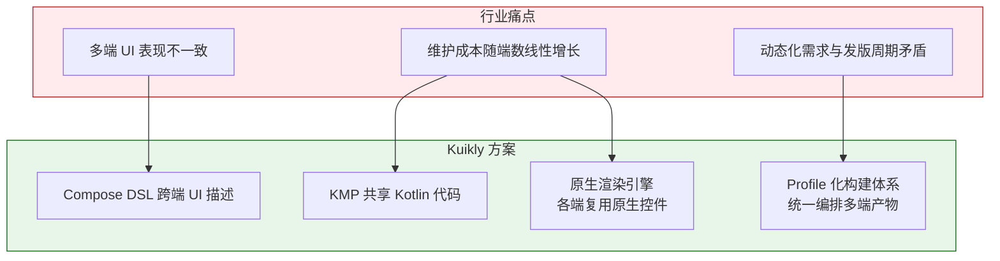
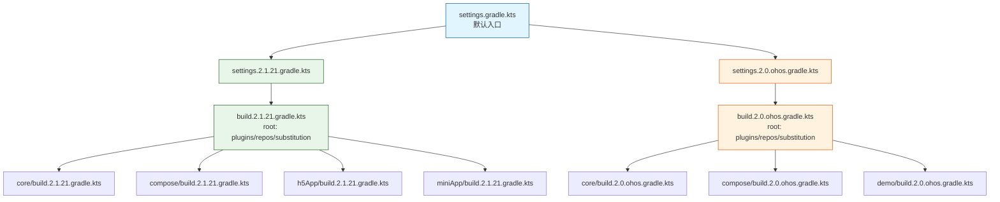
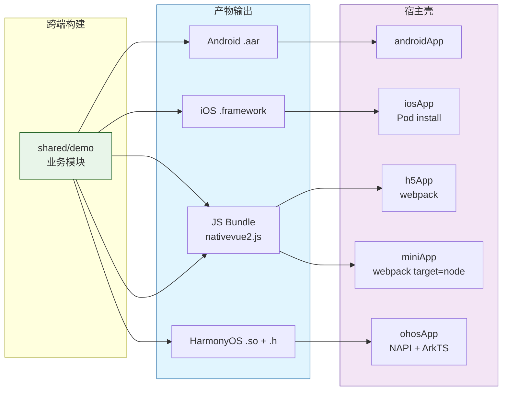
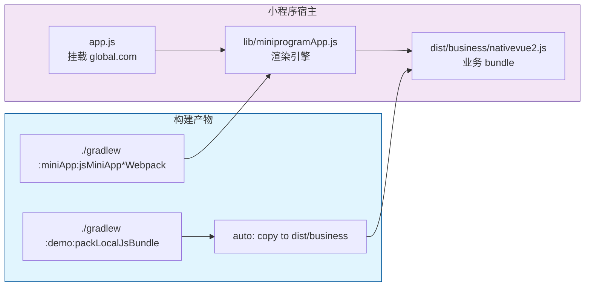
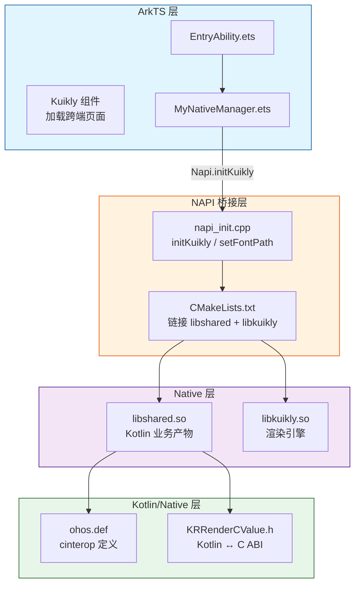

# KuiklyUI 工程实践——基于 KMP 的全方位跨平台 UI 同步方案

> [!summary] 文章导读
> 本文从工程化视角出发，深度剖析 KuiklyUI 的 Gradle 构建体系与多平台构建策略。重点聚焦 **Profile 化构建**、**版本矩阵管理**、**产物联动机制** 三大核心主题，旨在为 KMP 跨端项目提供可复用的工程实践参考。

---

## 1. 引言

### 1.1 跨端 UI 一致性的行业困境

移动端生态碎片化已是老生常态。一个业务功能通常需要覆盖 Android、iOS、Web、小程序乃至鸿蒙等多个平台。传统方案面临三重困境：

- **人力倍增**：每端独立开发，需求对齐成本随端数线性增长
- **表现割裂**：同一份设计稿在各端渲染效果不一致，UI 还原度难以保障
- **维护失控**：业务逻辑在各端重复实现，Bug 修复需要多端同步

Kotlin Multiplatform（KMP）的出现为上述问题提供了语言层的破局思路——**一份 Kotlin 业务逻辑，编译到多个平台**。但 KMP 本身只解决了"逻辑共享"问题，UI 层的跨平台同步才是真正的硬骨头。

### 1.2 Kuikly 的定位与价值

> [!note] Kuikly 是什么？
> Kuikly 是腾讯 TDS 推出的基于 KMP 的跨平台 UI 框架，一套 Kotlin 代码可运行在 **Android、iOS、HarmonyOS、Web、小程序、macOS** 六个平台。已在 QQ、QQ 音乐、QQ 浏览器、腾讯新闻、搜狗输入法、酷狗音乐等 20+ 产品中落地。

Kuikly 的核心价值在于：

1. **UI 层共享**：不仅共享业务逻辑，更共享 UI 描述（Compose DSL + 自研 DSL）
2. **原生渲染**：各平台使用原生控件渲染，非 WebView 套壳
3. **动态化能力**：支持远端下发放 DSL 描述，不发版即可更新 UI
4. **轻量 AOT**：Android 约 300KB，iOS 约 1.2MB



---

## 2. 工程全景：架构分层与模块职责

### 2.1 整体架构

Kuikly 的工程组织并非"一个 KMP 模块跑多端"的简单形态，而是一个**分层跨端系统**：

```mermaid
flowchart TB
    subgraph Common[Common Layer — commonMain]
        CORE[core<br/>布局/事件/Bridge/序列化]
        COMPOSE[compose<br/>跨端 Compose 实现]
        ANNOTATION[core-annotations<br/>@Page 注解]
        KSP[core-ksp<br/>入口自动生成]
    end

    subgraph Render[Render Layer — 各平台渲染]
        R_AND[core-render-android]
        R_IOS[core-render-ios<br/>Pod/SPM]
        R_WEB[core-render-web<br/>h5 + miniapp]
        R_OHOS[core-render-ohos<br/>HAR + native lib]
    end

    subgraph Host[Host Layer — 宿主壳]
        H_AND[androidApp]
        H_IOS[iOSApp / macApp]
        H_H5[h5App]
        H_MINI[miniApp]
        H_OHOS[ohosApp]
    end

    Common --> Render
    Render --> Host

    style Common fill:#e8f5e9,stroke:#1b5e20
    style Render fill:#e1f5fe,stroke:#01579b
    style Host fill:#f3e5f5,stroke:#4a148c
```

### 2.2 模块职责矩阵

| 模块 | 职责 | 关键能力 |
|------|------|---------|
| `core` | 跨端基础能力 | 响应式 UI、布局算法、Bridge 通信、序列化 |
| `compose` | Compose 跨端实现 | 基于 Jetpack Compose 1.7.3，包名替换为 `com.tencent.kuikly.compose` |
| `core-annotations` | 注解定义 | `@Page` 页面注解 |
| `core-ksp` | 注解处理器 | 按 target 生成 `KuiklyCoreEntry` |
| `core-render-*` | 各平台渲染层 | Android View / UIKit / ArkUI / Web |
| `*-App` | 宿主壳工程 | 生命周期托管、桥接适配 |

### 2.3 入口自动生成（KSP）

这是 Kuikly 工程化的关键设计之一——**无需手动维护各端入口**：

```kotlin
// @Page 注解标记页面，KSP 自动生成入口
@Page(path = "home", title = "首页")
class HomePage : BasePager() {
    override fun body(): ViewBuilder {
        // ...
    }
}
```

`core-ksp` 会根据编译目标生成不同平台的 `KuiklyCoreEntry`：

- Android/iOS/鸿蒙都有独立 Builder
- 支持多模块场景（`enableMultiModule`、`subModules`、`moduleId`）
- 通过 `@Page` 自动收集页面并注册路由，避免手写入口漂移

---

## 3. Profile 化 Gradle 构建体系（核心）

> [!important] 本章重点
> Kuikly 的 Gradle 构建体系是其工程化的基石。它把"版本兼容"从口头约定升级为**脚本化约束**——每个特殊工具链都有独立的构建配置、依赖版本和 CI 流水线。

### 3.1 从单文件到 Profile 化

传统 KMP 项目通常只有一个 `settings.gradle.kts` 和 `build.gradle.kts`。当需要支持不同 Kotlin 版本、不同工具链（如鸿蒙定制版 Kotlin）时，单个文件会变得难以维护。

Kuikly 的做法是 **Profile 化**——按 Kotlin 版本/平台拆分为多套配置文件：

```text
项目根目录/
├── settings.gradle.kts              # 默认入口（指向主线 profile）
├── settings.2.1.21.gradle.kts       # 主线 profile：Kotlin 2.1.21
├── settings.2.0.ohos.gradle.kts     # 鸿蒙 profile：Kotlin 2.0.21-KBA-010
├── build.2.1.21.gradle.kts          # 主线构建逻辑
├── build.2.0.ohos.gradle.kts        # 鸿蒙构建逻辑
├── shared/
│   ├── build.2.1.21.gradle.kts
│   └── build.2.0.ohos.gradle.kts
├── androidApp/build.gradle.kts
├── iosApp/Podfile
├── h5App/
│   └── build.2.1.21.gradle.kts
├── miniApp/
│   └── build.2.1.21.gradle.kts
└── ohosApp/
    └── entry/oh-package.json5
```

> [!question] 为什么需要 Profile 化？
> 鸿蒙依赖定制 Kotlin 工具链（`2.0.21-KBA-010`），与主线 Kotlin 2.1.21 并不等价。强行塞入同一构建链会导致 sync 失败、依赖冲突。独立 profile 让特殊平台"被隔离但可维护"。

### 3.2 版本矩阵管理

Kuikly 仓库内维护了成体系的版本化配置：

| 配置文件 | Kotlin 版本 | 适用平台 |
|---------|-------------|---------|
| `settings.1.9.22.gradle.kts` | 1.9.22 | 历史兼容 |
| `settings.2.0.21.gradle.kts` | 2.0.21 | 主线（默认） |
| `settings.2.1.21.gradle.kts` | 2.1.21 | 当前主线 |
| `settings.2.0.ohos.gradle.kts` | **2.0.21-KBA-010** | 鸿蒙专用 |

每个 profile 独立管理：

- Kotlin/AGP/KSP 插件版本
- `allprojects.repositories` 仓库源
- `dependencySubstitution` 依赖替换策略
- 模块参与清单

### 3.3 settings + build 双层编排

Kuikly 的 Gradle 不是"一个 settings + 一个 root build"的简单形态，而是 **profile 驱动** 的双层编排：

```text
settings.<profile>.gradle.kts
    → 选模块 + 指定每个模块的 buildFileName
        → root build.<profile>.gradle.kts
            → 插件版本 / 仓库 / 全局策略
                → module build.<profile>.gradle.kts
                    → target + sourceSet + 自定义任务
```



以主线 profile（2.1.21）为例，根 `settings.gradle.kts` 实际上是**委托选择器**：

```kotlin
// settings.gradle.kts — 选择并委托到对应 profile
val buildFileName = "build.2.1.21.gradle.kts"

include(":core")
project(":core").buildFileName = buildFileName

include(":compose")
project(":compose").buildFileName = buildFileName

include(":demo")
project(":demo").buildFileName = buildFileName
```

而 `build.2.1.21.gradle.kts` 统一了以下关键点：

```kotlin
// build.2.1.21.gradle.kts — 主线的全局构建契约
plugins {
    kotlin("multiplatform").version("2.1.21").apply(false)
    kotlin("android").version("2.1.21").apply(false)
    id("com.android.application").version("8.1.4").apply(false)
    id("com.google.devtools.ksp").version("2.1.21-1.0.27").apply(false)
}

allprojects {
    repositories {
        maven("https://mirrors.tencent.com/nexus/repository/maven-tencent/")
        google()
        mavenCentral()
    }
}

// 依赖替换：将远端 compose 替换为本地工程，便于源码联调
dependencySubstitution {
    substitute(module("com.tencent.kuikly-open:compose"))
        .using(project(":compose"))
}
```

### 3.4 shared 模块核心配置

`shared/build.gradle.kts` 是跨端业务模块的配置枢纽：

```kotlin
plugins {
    kotlin("multiplatform")
    id("com.google.devtools.ksp")
}

kotlin {
    // ── 平台 Target 声明 ──
    androidTarget {
        compilations.all {
            kotlinOptions {
                jvmTarget = "17"
            }
        }
    }

    iosX64()
    iosArm64()
    iosSimulatorArm64()

    // macOS（Alpha）
    macosX64()
    macosArm64()

    // JS(IR) — 用于 H5/小程序
    js(IR) {
        browser()
        binaries.library()
    }

    // 鸿蒙（可选，在 ohos profile 中打开）
    // ohosArm64 { binaries.sharedLib() }

    sourceSets {
        val commonMain by getting {
            dependencies {
                implementation("com.tencent.kuikly-open:core:2.17.0")
                implementation("com.tencent.kuikly-open:compose:2.17.0")
                implementation("com.tencent.kuikly-open:core-annotations:2.17.0")
            }
        }

        val androidMain by getting {
            dependencies {
                implementation("com.tencent.kuikly-open:core-render-android:2.17.0")
            }
        }

        val iosX64Main by getting
        val iosArm64Main by getting
        val iosSimulatorArm64Main by getting
        val iosMain by creating {
            dependsOn(commonMain)
            iosX64Main.dependsOn(this)
            iosArm64Main.dependsOn(this)
            iosSimulatorArm64Main.dependsOn(this)
        }

        val jsMain by getting {
            dependencies {
                implementation("com.tencent.kuikly-open:core-render-web:2.17.0")
            }
        }
    }
}

// KSP 配置
dependencies {
    add("kspCommonMainMetadata", "com.tencent.kuikly-open:core-ksp:2.17.0")
    add("kspAndroid", "com.tencent.kuikly-open:core-ksp:2.17.0")
    add("kspIosX64", "com.tencent.kuikly-open:core-ksp:2.17.0")
    add("kspIosArm64", "com.tencent.kuikly-open:core-ksp:2.17.0")
    add("kspIosSimulatorArm64", "com.tencent.kuikly-open:core-ksp:2.17.0")
}

android {
    namespace = "com.example.demo"
    compileSdk = 34
    defaultConfig {
        minSdk = 21
    }
}
```

> [!tip] 版本号管理建议
> 推荐使用 `gradle.properties` 或 `libs.versions.toml`（Version Catalog）统一管理版本号：
> ```properties
> # gradle.properties
> kuiklyVersion=2.17.0
> kotlinVersion=2.1.21
> kspVersion=2.1.21-1.0.27
> ```

### 3.5 核心配置清单

无论使用哪个 profile，以下配置建议在项目首日全部补齐：

> [!important] 完整配置初始化清单
>
> 1. **root build 固定插件版本**：Kotlin/AGP/KSP/Compose 版本锁定
> 2. **统一仓库源**：`allprojects.repositories` 集中管理，避免子模块各写一份
> 3. **dependencySubstitution**：本地工程替代远端制品，便于源码联调
> 4. **gradle.properties 关键参数**：
>    ```properties
>    ksp.incremental=true
>    kotlin.js.webpack.major.version=4
>    kotlin.mpp.androidSourceSetLayoutVersion=2
>    android.useAndroidX=true
>    ```
> 5. **KSP 参数**：`pageName`、`packLocalJsBundle` 等业务参数
> 6. **Android assets 目录配置**：
>    ```kotlin
>    android {
>        sourceSets.named("main") {
>            assets.srcDirs("src/commonMain/assets")
>        }
>    }
>    ```

---

## 4. 多平台构建策略与产物联动

每个平台的构建链路不同，但遵循统一的 **两段式编排**：

1. **先构建跨端业务产物**（业务模块）
2. **再构建平台宿主并拷贝/链接业务产物**



### 4.1 Android 构建

Android 是最简单的链路——全部在 Gradle 内联动完成：

```kotlin
// androidApp/build.gradle.kts
plugins {
    id("com.android.application")
    kotlin("android")
}

android {
    namespace = "com.example.demo.android"
    compileSdk = 34
    defaultConfig {
        applicationId = "com.example.demo"
        minSdk = 21
        targetSdk = 34
    }
}

dependencies {
    implementation(project(":shared"))
    implementation("com.tencent.kuikly-open:core-render-android:2.17.0")
}
```

> [!tip] Android Studio 2024.2.1+ 注意
> 新版 Android Studio 默认 Gradle JDK 为 21。**必须手动切换为 JDK 17**，否则 KMP 项目 sync 会报兼容性错误。在 `Settings → Build, Execution, Deployment → Build Tools → Gradle → Gradle JDK` 中修改。

### 4.2 iOS / macOS 构建

iOS/macOS 通过 CocoaPods 或 SPM 集成：

```ruby
# iosApp/Podfile
source 'https://cdn.cocoapods.org/'
platform :ios, '14.1'

target 'iosApp' do
  inhibit_all_warnings!
  pod 'OpenKuiklyIOSRender', '2.17.0'
end
```

业务模块通过 `kotlin("native.cocoapods")` 输出 `shared` framework，宿主 Podfile 同时依赖渲染层与业务产物。

> [!danger] Xcode 15+ Sandbox 错误
> Xcode 15 默认启用 `User Script Sandboxing`，KMP 脚本涉及文件读写会导致 Sandbox 错误。在 `Build Settings` 中将 `User Script Sandboxing` 设为 **No**。

### 4.3 Web (H5) 构建

H5 的构建链路涉及业务 bundle 的打包、拷贝和 HTML 重写：

```kotlin
// h5App/build.2.1.21.gradle.kts
// 核心任务链：bundle 打包 → 拷贝到宿主 → 生成 HTML

val jsBrowserDistribution by tasks.getting

val publishLocalJSBundle by tasks.registering(Copy::class) {
    dependsOn(jsBrowserDistribution)
    from("${project.buildDir}/dist/js/")
    into("${projectDir}/dist/")
}

val generateLocalHtml by tasks.registering {
    dependsOn(publishLocalJSBundle)
    doLast {
        // 重写 HTML 中的 JS 引用路径
    }
}
```

典型命令：

```bash
# Debug 模式
./gradlew :shared:packLocalJsBundleDebug
./gradlew :h5App:jsBrowserDevelopmentRun -t

# Release 模式
./gradlew :shared:packLocalJsBundleRelease
./gradlew :h5App:publishLocalJSBundle
```

### 4.4 小程序构建

> [!note] 小程序方案本质
> **Kotlin/JS(IR) 输出 + 小程序模板壳 + 宿主桥接模块。** 模板壳与业务 bundle 解耦，可嵌入现有小程序工程。

#### 4.4.1 构建链路（两段式）

第一段：构建业务 JS bundle

```bash
./gradlew :demo:packLocalJsBundleDebug -Pkuikly.useLocalKsp=false
```

第二段：构建小程序宿主 JS 并拷贝产物到 `dist`

```bash
./gradlew :miniApp:jsMiniAppDevelopmentWebpack
```

#### 4.4.2 关键配置

```kotlin
// miniApp/build.2.1.21.gradle.kts
plugins {
    kotlin("js")
}

kotlin {
    js(IR) {
        // 关键：target = 'node' 兼容小程序运行环境
        compilations.all {
            kotlinOptions {
                sourceMap = true
                moduleKind = "commonjs"
            }
        }
        browsers()
    }
}

// 业务 bundle 名称配置（在 demo 模块中）
// demo/build.gradle.kts
kuikly {
    js {
        outputName("nativevue2")
    }
}
```

#### 4.4.3 宿主任务关系

```text
generateWebpackConfig
    → jsBrowserDevelopmentWebpack / jsBrowserProductionWebpack
        → finalizedBy syncRender*ToDist
            → jsMiniApp*Webpack (再执行 copyLocalJSBundle)
```

#### 4.4.4 运行时桥接

小程序壳通过挂载全局对象完成 Kotlin 与壳层通信：

```javascript
// dist/app.js — 小程序宿主入口
global.com = business.com;
global.callKotlinMethod = business.callKotlinMethod;
render.initApp();
```



### 4.5 鸿蒙（HarmonyOS）构建

> [!important] 鸿蒙方案本质
> **Kotlin/Native(ohosArm64) 业务产物 + ArkTS 渲染库 + NAPI 桥接。** 这是 Kuikly 所有平台中配置最复杂、链路最长的一条，也是最体现工程化功底的部分。

#### 4.5.1 独立 Profile 管理

鸿蒙使用定制 Kotlin 工具链（`2.0.21-KBA-010`），与主线 Kotlin 版本不兼容。Kuikly 的做法是**完全隔离**：

```kotlin
// settings.2.0.ohos.gradle.kts
pluginManagement {
    repositories {
        maven { url = uri("https://mirrors.tencent.com/nexus/repository/maven-tencent/") }
        google()
        mavenCentral()
        gradlePluginPortal()
    }
    plugins {
        kotlin("android").version("2.0.21-KBA-010").apply(false)
        kotlin("multiplatform").version("2.0.21-KBA-010").apply(false)
    }
}

dependencyResolutionManagement {
    repositories {
        maven { url = uri("https://mirrors.tencent.com/nexus/repository/maven-tencent/") }
        google()
        mavenCentral()
    }
}

include(":core")
include(":compose")
include(":demo")
```

#### 4.5.2 鸿蒙 Target 配置

```kotlin
// demo/build.2.0.ohos.gradle.kts
plugins {
    kotlin("multiplatform")
    id("com.android.application")
}

kotlin {
    ohosArm64 {
        binaries {
            sharedLib {
                baseName = "shared"
            }
        }
    }

    sourceSets {
        val commonMain by getting {
            dependencies {
                implementation("com.tencent.kuikly-open:core:2.17.0-2.0.21-ohos")
                implementation("com.tencent.kuikly-open:core-annotations:2.17.0-2.0.21-ohos")
            }
        }
        val ohosArm64Main by getting {
            dependsOn(commonMain)
        }
    }
}

dependencies {
    compileOnly("com.tencent.kuikly-open:core-ksp:2.17.0-2.0.21-ohos")
}
```

> [!warning] 版本后缀注意
> 鸿蒙依赖版本带 `-ohos` 后缀（如 `2.17.0-2.0.21-ohos`），且 `-ohos` 版本的 SDK 仅支持 ohos target。如果 shared 模块同时需要 Android/iOS target，需在 `commonMain` 中使用不带后缀的版本。

#### 4.5.3 构建链路

```bash
# 编译产物（指定鸿蒙 profile）
./gradlew -c settings.2.0.ohos.gradle.kts :demo:linkSharedDebugSharedOhosArm64

# 或编译全部产物
./gradlew -c settings.2.0.ohos.gradle.kts :demo:linkSharedOhosArm64
```

产物路径：

```text
demo/build/bin/ohosArm64/
├── debugShared/
│   ├── libshared.so
│   └── libshared_api.h
└── releaseShared/
    ├── libshared.so
    └── libshared_api.h
```

#### 4.5.4 产物联动

仓库提供自动化脚本完成产物拷贝：

```bash
# 2.0_ohos_demo_build.sh（Mac/Linux）
./gradlew -c settings.2.0.ohos.gradle.kts :demo:linkSharedDebugSharedOhosArm64

# 拷贝 so 到宿主工程
cp demo/build/bin/ohosArm64/debugShared/libshared.so \
   ohosApp/entry/libs/arm64-v8a/

# 拷贝头文件到宿主工程
cp demo/build/bin/ohosArm64/debugShared/libshared_api.h \
   ohosApp/entry/src/main/cpp/thirdparty/biz_entry/
```

> [!tip] 脚本隐藏细节
> `2.0_ohos_demo_build.sh/.bat` 会临时把 `gradle-wrapper.properties` 切到 `gradle-8.0`，编译后再恢复原配置——这是为了兼容鸿蒙工具链要求，同时不影响主线 profile。**这个"切 wrapper"的细节很容易被忽略，但它是跨 profile 管理最实用的工程技巧之一。**

#### 4.5.5 Kuikly Hvigor 插件（自动化方案）

对于更自动化的集成，Kuikly 提供了 Hvigor 插件：

```properties
# ohosProject/local.properties
kuikly.projectPath=/path/to/kuikly/project
kuikly.moduleName=shared
kuikly.ohosGradleSettings=settings.ohos.gradle
kuikly.soPath=entry/libs/arm64-v8a
kuikly.headerPath=entry/src/main/cpp
kuikly.compilePluginEnabled=true
```

```typescript
// entry/hvigorfile.ts
import { kuiklyCompilePlugin, kuiklyCopyAssetsPlugin } from 'kuikly-ohos-compile-plugin';

export default {
    plugins: [kuiklyCompilePlugin(), kuiklyCopyAssetsPlugin()]
}
```

#### 4.5.6 跨语言桥接全景



> [!compare] iOS vs 鸿蒙桥接对比
>
> | 维度 | iOS | 鸿蒙 |
> |------|-----|------|
> | 跨语言边界定义 | `ios.def`（cinterop） | `ohos.def`（cinterop） |
> | 值协议 | C/ObjC 头文件 | `KRRenderCValue.h` |
> | 业务产物格式 | `.framework`（CocoaPods） | `.so + .h`（NAPI） |
> | 宿主接入方式 | Podfile `pod 'OpenKuiklyIOSRender'` | CMake + ArkTS NAPI |
>
> 两者思路相同：**用 cinterop 定义跨语言边界，只是宿主生态一个是 Pod/ObjC，一个是 ArkTS/NAPI。**

---

## 5. 工程化实践与避坑指南

### 5.1 小程序实践要点

> [!question] 小程序构建的核心问题
> Web 平台默认的 target 是浏览器环境，但小程序运行时并非标准浏览器——没有 `window`、`document` 等全局对象。

**关键配置**：`miniApp/build.gradle.kts` 中强制 webpack `target = 'node'`，这是小程序工程最容易遗漏的配置。遗漏后产物在小程序端运行会报 `window is not defined`。

**模板壳与业务解耦**：小程序宿主与业务 bundle 分离：

```text
miniApp/dist/
├── lib/
│   └── miniprogramApp.js     # 渲染引擎（复用）
├── business/
│   └── nativevue2.js         # 业务 bundle（按需更新）
└── app.js                    # 宿主入口
```

### 5.2 鸿蒙实践要点

> [!danger] 鸿蒙工程的三个常见陷阱
>
> 1. **工具链版本不匹配**：鸿蒙 Kotlin 工具链必须使用 `2.0.21-KBA-010`（或 `-004`），主线 Kotlin 2.1.21 无法编译 ohosArm64 target
> 2. **so 未同步**：宿主编译前必须确保 `libshared.so` 与 `libshared_api.h` 已同步到正确目录，否则链接失败
> 3. **assets 无法内置打包**：鸿蒙会将业务代码编译为 so 文件，不支持 `assets` 资源内置打包，需使用 `kuiklyCopyAssetsPlugin` 单独处理资源文件

### 5.3 通用实践要点

> [!note] Profile 隔离原则
> 特殊平台（鸿蒙、小程序等）**不要塞进主干构建链**。独立 profile + 独立脚本 + 独立 CI job，三者缺一不可。这不是"不支持"，而是"支持的代价可控"。

**一键脚本模板**：

```bash
#!/usr/bin/env bash
# scripts/build_all.sh — 一次构建所有平台
set -e

MODE=${1:-debug}

# 主线构建
./gradlew -c settings.2.1.21.gradle.kts :shared:packLocalJsBundle${MODE^}
./gradlew -c settings.2.1.21.gradle.kts :androidApp:assemble${MODE^}

# 鸿蒙构建（可选）
if [ -n "${OHOS_SDK_HOME:-}" ]; then
    ./gradlew -c settings.2.0.ohos.gradle.kts :demo:linkShared${MODE^}SharedOhosArm64
    # 拷贝产物
    cp demo/build/bin/ohosArm64/${mode,,}Shared/libshared.so \
       ohosApp/entry/libs/arm64-v8a/
fi
```

**Gradle JDK 版本**

| 场景 | JDK 版本 |
|------|---------|
| Android Studio < 2024.2.1 | JDK 17 |
| Android Studio ≥ 2024.2.1 | 默认 JDK 21，**必须切回 JDK 17** |
| 鸿蒙 DevEco Studio | JDK 17 |

### 5.4 产物契约标准化

各平台最终产物保持强契约：

| 平台 | 产物格式 | 分发方式 |
|------|---------|---------|
| Android | `.aar` | Gradle 依赖 |
| iOS/macOS | `.framework` | CocoaPods / SPM |
| Web/H5 | `.js` | webpack |
| 小程序 | `.js` | dist 拷贝 |
| 鸿蒙 | `libshared.so` + `libshared_api.h` | NAPI 桥接 |

---

## 6. 收益与展望

### 6.1 可迁移的工程原则

> [!summary] 五大可复用的核心方法论
>
> 1. **Profile 化构建**：用 `settings.<profile>.gradle.kts` 将版本兼容性从"口头约定"升级为"脚本化约束"——每个特殊工具链都有独立配置、依赖和 CI 流水线。这是最容易复制的最佳实践。
>
> 2. **分层穿透力**：不是简单将代码放在 commonMain 就完事，而是每层（Core → Render → Host）都有清晰的职责和数据契约。层与层之间用不可变数据传递，降低耦合。
>
> 3. **产物联动脚本化**：各平台业务产物（so/framework/js bundle）的拷贝、链接、打包流程全部脚本化，避免"本地能跑、同事不能跑"的窘境。
>
> 4. **非标准平台隔离策略**：鸿蒙和小程序这类平台，独立 profile + 独立脚本 + 独立 CI job。特殊平台不要硬塞进主构建链。
>
> 5. **入口自动生成**：通过 KSP + `@Page` 注解自动生成各端路由入口，消除手写入口的样板代码和人为错误。

### 6.2 架构决策矩阵

> [!compare] 什么场景该用，什么场景该放弃
>
> | 场景 | 推荐方案 | 理由 |
> |------|---------|------|
> | 需要覆盖 4+ 平台，动态化需求强 | ✅ **Kuikly 类架构** | KMP 共享 + 原生渲染，性价比最高 |
> | 已有 KMP 基础，需要跨多端 | ✅ **Kuikly 类架构** | 复用 Kotlin 工程师和基础设施 |
> | 电商首页/信息流 50%+ 页面动态化 | ✅ **Kuikly 类架构** | 不发版即可更新 UI |
> | 管理后台/表单类 | ⚠️ **H5 / React Native** | 动态化需求强，但渲染要求低 |
> | 视频/直播/绘图类 | ❌ **纯原生开发** | 性能要求苛刻，动态化无价值 |
> | 轻量工具类 App | ❌ **纯原生 / Flutter** | 包体积增量不可接受 |

### 6.3 未来展望

Kuikly 社区和腾讯内部仍在持续演进：

- **Kotlin 版本升级**：主线已从 2.0.21 升级到 2.1.21，后续紧跟 Kotlin 官方发版节奏
- **调试工具链**：热重载、DevTools 等开发者体验正在完善
- **更多端覆盖**：Windows、Linux 桌面端已在路线图中

---

## 参考资源

- Kuikly 官方文档：[https://kuikly.tds.qq.com/](https://kuikly.tds.qq.com/)
- GitHub 仓库：[https://github.com/Tencent-TDS/KuiklyUI](https://github.com/Tencent-TDS/KuiklyUI)
- 腾讯 Maven 仓库：`https://mirrors.tencent.com/nexus/repository/maven-tencent/`
- 版本发布页：[https://kuikly.tds.qq.com/ChangeLog/changelog.html](https://kuikly.tds.qq.com/ChangeLog/changelog.html)
- KMP 鸿蒙适配指南：[https://kuikly.tds.qq.com/DevGuide/kuiklybase-ohos-kn.html](https://kuikly.tds.qq.com/DevGuide/kuiklybase-ohos-kn.html)
