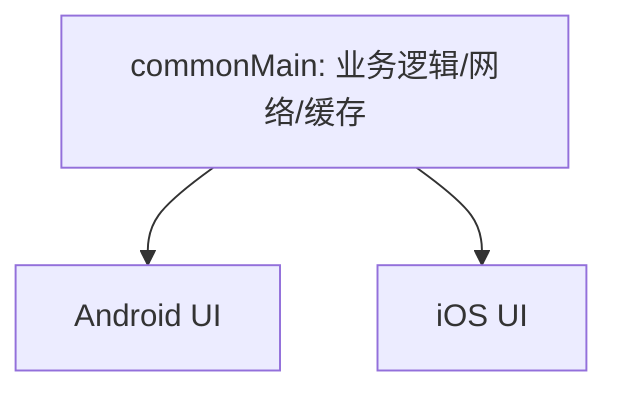
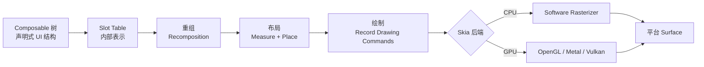
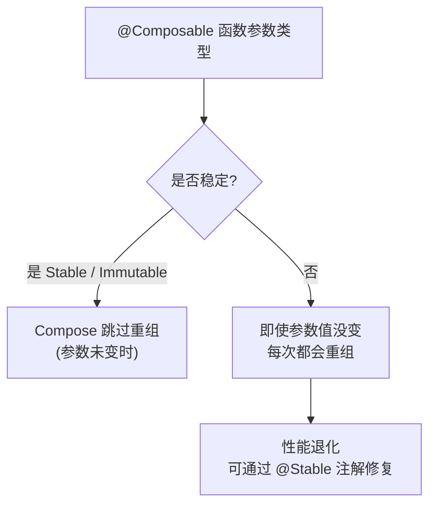
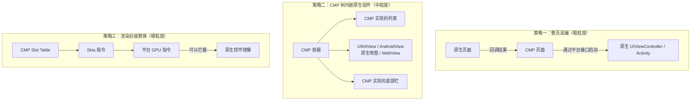
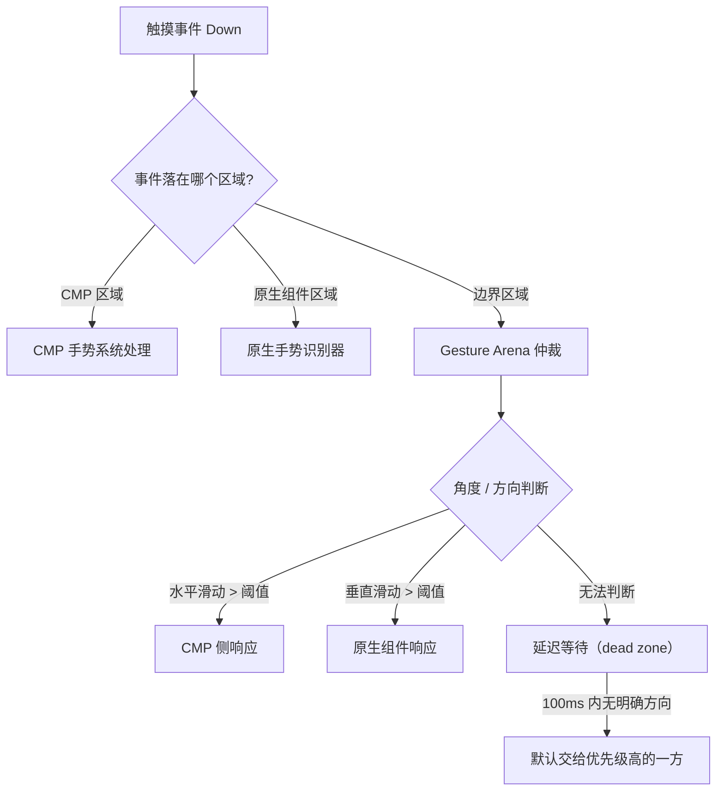
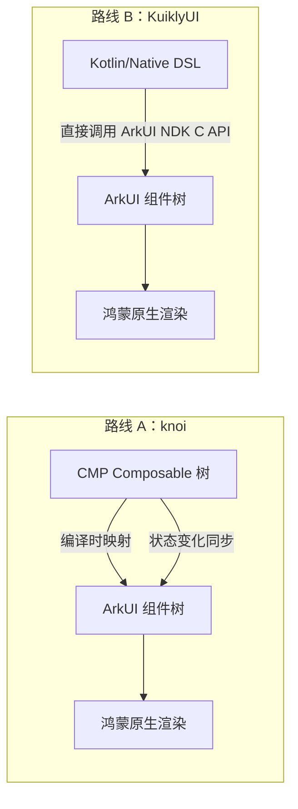
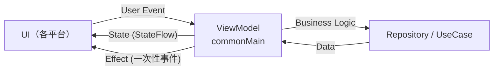
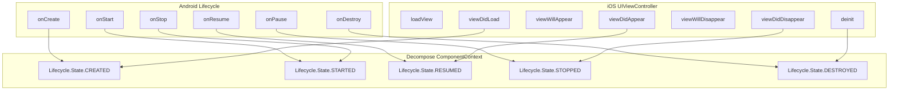
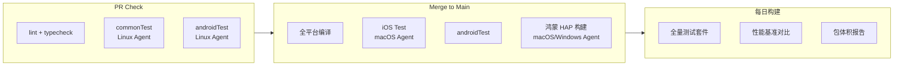

> [!tip] 相关内容
> [[Kotlin知识点快速梳理|Kotlin]] · [[Kotlin Native]] · [[Compose Multiplatform]]
>
> 📖 零基础入门 CMP？先读 [[Android开发基础|Android 开发基础（先导篇）]]

# 0. KMP简介
> [!note] KMP -- 共享业务逻辑
> **K**otlin **M**ulti**p**latform (KMP) 是 JetBrains 推出的跨平台技术。它的核心目标不是“完全一次编写到处运行”，而是让不同平台之间共享可复用的 Kotlin 代码，同时保留各平台的原生能力和交互体验。

KMP常见共享内容包括：
- 数据模型
- 网络请求
- 序列化
- 数据库访问
- 业务规则
- 状态管理

不适合强行共享的内容包括：
- 强依赖平台交互的UI细节
- 系统权限与平台生命周期
- 蓝牙、相机、推送等平台API
- 对性能和原生体验要求很高的页面

---
# 1. 核心概念
## 1.1 Target
> [!note] 概述
> Target 表示项目要编译到的平台，例如 Android、JVM、iOS、macOS、Linux、Windows、JS 或 Wasm。

```kotlin
kotlin {
    androidTarget()
    iosArm64()
    iosSimulatorArm64()
    jvm()
}
```

> [!tip] 说明
> 每一个target都会生成对应平台的编译任务和产物。能否使用某个库，取决于该库是否支持对应target。

## 1.2 Source Set
> [!note] 概述
> Source Set 表示一组共享源码。KMP通过不同source set控制代码在哪些平台上可见。

常见结构如下：
```text
src/
├── commonMain/      # 所有平台共享代码
├── commonTest/      # 所有平台共享测试
├── androidMain/     # Android平台代码
├── iosMain/         # iOS平台代码
└── jvmMain/         # JVM平台代码
```

> [!summary] 使用建议
> - 业务规则优先放在`commonMain`
> - 平台API放在对应平台source set
> - 不要为了共享而牺牲平台体验
> - 共享层要保持纯净，避免直接依赖Android、iOS等平台类

## 1.3 expect/actual
> [!note] 概述
> 当公共代码需要调用平台能力时，可以在`commonMain`中使用`expect`声明能力，在各平台中使用`actual`提供实现。

commonMain:
```kotlin
expect class PlatformInfo {
    val name: String
}
```

androidMain:
```kotlin
actual class PlatformInfo {
    actual val name: String = "Android"
}
```

iosMain:
```kotlin
actual class PlatformInfo {
    actual val name: String = "iOS"
}
```

> [!warning] 注意
> `expect/actual`适合封装少量平台差异。如果差异非常大，应该把平台逻辑下沉到原生层，而不是把公共层设计得过重。

---
# 2. 依赖管理
## 2.1 公共依赖
公共依赖写在`commonMain.dependencies`中：

```kotlin
kotlin {
    sourceSets {
        commonMain.dependencies {
            implementation("org.jetbrains.kotlinx:kotlinx-coroutines-core:$coroutines_version")
            implementation("org.jetbrains.kotlinx:kotlinx-serialization-json:$serialization_version")
        }
    }
}
```

## 2.2 平台依赖
平台依赖写在对应source set中：

```kotlin
kotlin {
    sourceSets {
        androidMain.dependencies {
            implementation("io.ktor:ktor-client-okhttp:$ktor_version")
        }

        iosMain.dependencies {
            implementation("io.ktor:ktor-client-darwin:$ktor_version")
        }
    }
}
```

> [!tip] 说明
> 像Ktor Client这种库会提供公共API和多个平台engine。公共代码面向统一API编写，具体平台选择自己的engine。

---
# 3. 适用场景
## 3.1 移动端共享业务逻辑
Android和iOS分别使用原生UI，但共享网络、缓存、领域模型和业务规则。



## 3.2 服务端与客户端共享协议
服务端和客户端可以共享DTO、校验规则和序列化协议，减少字段不一致的问题。

## 3.3 与Compose Multiplatform结合
如果项目希望连UI也共享，可以使用[[Compose Multiplatform]]。需要注意，UI共享会显著提高公共层复杂度，适合内部工具、跨端一致性强的业务或团队能接受Compose技术栈的项目。

---
# 4. 最佳实践
> [!summary] 实践原则
> - 先共享稳定业务逻辑，再考虑共享UI
> - 公共层只依赖多平台库，不直接引用平台SDK
> - 使用`expect/actual`隔离平台差异
> - 通过接口把平台能力注入公共层
> - 为`commonMain`补充单元测试，确保共享逻辑可靠

> [!warning] 常见误区
> - 把KMP理解为跨平台UI框架
> - 认为所有代码都应该放进`commonMain`
> - 忽略平台差异导致公共层越来越臃肿
> - 使用只支持JVM的库后才发现iOS无法编译

---
# 5. Compose Multiplatform 渲染管线与性能剖析

> [!important] 本章定位
> 当团队进入 CMP 深水区后，"重组性能"和"渲染帧率"是最先暴露的两个痛点。本章从底层管线出发，建立 CMP 性能的量化认知。

## 5.1 渲染管线全景

CMP 的每一帧渲染经历四个阶段：



> [!note] 关键认知
> CMP 不是"每次从头重绘"。重组只重新执行输入变化了的 `@Composable` 函数；布局只在约束或内容变化时重测量；绘制也只重绘 `invalidate` 的区域。性能优化的核心是**减少每一阶段的无效工作量**。

## 5.2 重组（Recomposition）的代价

### 5.2.1 重组范围过大的常见场景

```kotlin
// ❌ 不良实践：整个列表使用同一个 State，修改一项触发全部重组
var allItems by remember { mutableStateOf(listOf(...)) }

// ✅ 好实践：每项独立 State，修改只触发对应项重组
@Composable
fun ItemList(items: List<Item>) {
    LazyColumn {
        items(items, key = { it.id }) { item ->  // key 是 LazyColumn 高效重组的关键
            ItemCard(item)
        }
    }
}

@Composable
fun ItemCard(item: Item) {
    val state = item.state  // 单一项的 snapshot state
}
```

> [!tip] 重组优化原则
> - `derivedStateOf`：从多个 State 派生出计算结果，避免派生过程中的无关重组
> - `remember` + `key`：让 Compose 能准确识别哪些实例需要保留
> - `LazyColumn` / `LazyRow` 务必指定 `key` 参数——这是逃逸分析的基础

### 5.2.2 稳定性的影响



> [!note] 稳定性规则
> - 基本类型（Int、String、Float 等）+ Lambda 表达式 = 稳定
> - `data class` 所有字段均为稳定类型 = 稳定
> - `data class` 包含不稳定字段 = 不稳定（可加 `@Stable` 或使用 `immutable-collections`）
> - `List<>` 接口类型 = 不稳定（建议用 `kotlinx.collections.immutable`）

## 5.3 布局阶段的三大瓶颈

| 瓶颈 | 原因 | 解决方案 |
|:---:|:---:|:--------|
| **深度嵌套** | `Column` 套 `Row` 套 `Box` 层层叠加 | 扁平化布局，减少非必要容器 |
| **多次测量** | `IntrinsicSize` / `Measurable` 多次调用 `measure()` | 使用 `Layout` 自定义一次性测量 |
| **约束传递** | 父组件约束变化导致整子树重测量 | 用 `Modifier.widthIn()` 限定子组件约束范围 |

```kotlin
// ❌ 避免：不必要的嵌套 + IntrinsicSize
Box(Modifier.width(IntrinsicSize.Min)) {
    Column {
        Row { ... }
        Row { ... }
    }
}

// ✅ 推荐：扁平化 + 明确的约束
Row(Modifier.fillMaxWidth()) {
    // 直接用 Row 替代 Box > Column > Row
    content1()
    content2()
}
```

## 5.4 Skia 渲染后端选型

> [!important] CPU vs GPU 的选择并非随意
> - **CPU 路径**（Software Rasterizer）：兼容性好，任何设备都支持。但每帧需要将 bitmap 拷贝到平台窗口，大屏幕高刷新率场景下带宽瓶颈明显。
> - **GPU 路径**（OpenGL / Metal / Vulkan）：复杂的绘制指令由 GPU 并行处理，省去 bitmap 拷贝开销。但受限于 GPU 内存和驱动稳定性。

| 因素 | CPU 路径 | GPU 路径 |
|:----:|:--------:|:--------:|
| 兼容性 | 极高（所有设备） | 中（依赖 GPU 驱动） |
| 文本渲染 | 优（Skia 文本堆栈成熟） | 良（部分特殊字体 fallback） |
| 复杂路径/渐变 | 良 | 优 |
| 高刷新率(120Hz) | 可能丢帧 | 流畅 |
| 首次帧率稳定时间 | 即时 | 需 warm-up（shader 编译） |

> [!tip] 调试方法
> Android 端用 `Profile GPU Rendering` + `Layout Inspector`；iOS 端用 `Xcode Metal Debugger`；CMP 内置 `isDebugInspectorInfoEnabled` 可在布局边界绘制重组次数。

## 5.5 性能评估基线

> [!summary] 建立性能"红线"
> - 列表滑动：保持 60fps（检查 `slow-undo` 重组日志）
> - 页面打开：Composition 耗时 < 16ms
> - 布局阶段：每帧测量次数 ≤ 200
> - 重组次数：首次打开后稳定状态下应降为 0（无事发生时不重组）

---
# 6. 混合渲染：在 CMP 树中嵌入原生组件

> [!important] 为什么会需要混合渲染？
> CMP 的 Skia 渲染管线虽然足够通用，但在以下场景仍需"逃生舱"回到原生渲染路径：
> - **地图组件**：Google Maps / Apple Maps / 高德 SDK 只提供原生 SDK
> - **WebView**：平台 WebView 的渲染管线与 Skia 隔离
> - **视频播放器**：平台解码器 + 硬件加速层
> - **AR/VR**：ARKit / ARCore / 华为 AR Engine
> - **平台 Widget**：iOS Widget / 鸿蒙卡片
> - **支付/安全键盘**：系统级安全输入

## 6.1 三种混合策略



| 策略 | 共享度 | 性能 | 维护成本 | 适用场景 |
|:----:|:------:|:----:|:--------:|:--------|
| 整页混编 | 低 | 最佳 | 低 | 支付页、AR 相机页 |
| **CMP 内嵌原生** | 中 | 良 | 中 | WebView、地图、视频 |
| 渲染后端替换 | 高 | 取决于实现 | 极高 | Figma 级别的基础设施 |

> [!note] 推荐策略
> 绝大多数项目采用**策略二**——在 CMP 的 `@Composable` 树中通过 `UIKitView`（iOS）/ `AndroidView`（Android）插入原生组件。这是共享度与工程代价的最佳平衡点。

## 6.2 UIKitView / AndroidView 互操作实战

### 6.2.1 统一接口设计

```kotlin
// commonMain/kotlin/ui/native/NativeMapView.kt
package ui.native

import androidx.compose.runtime.Composable
import androidx.compose.ui.Modifier

/**
 * 跨平台原生地图组件接口。
 * 各平台 actual 使用对应平台 SDK 实现。
 */
@Composable
expect fun NativeMapView(
    modifier: Modifier,
    latitude: Double,
    longitude: Double,
    zoomLevel: Float,
    onMapClick: (Double, Double) -> Unit
)
```

### 6.2.2 iOS 侧：UIKitView

```kotlin
// iosMain/kotlin/ui/native/NativeMapView.ios.kt
package ui.native

import androidx.compose.runtime.*
import androidx.compose.ui.Modifier
import androidx.compose.ui.interop.UIKitView
import platform.MapKit.MKMapView
import platform.MapKit.MKMapTypeStandard

@Composable
actual fun NativeMapView(
    modifier: Modifier,
    latitude: Double,
    longitude: Double,
    zoomLevel: Float,
    onMapClick: (Double, Double) -> Unit
) {
    val mapView = remember { MKMapView() }

    // 响应式更新：状态变化时更新原生组件属性
    LaunchedEffect(latitude, longitude, zoomLevel) {
        // 设置地图中心点与缩放
        mapView.setCenterCoordinate(
            coordinate = TODO("CLLocationCoordinate2DMake"),
            animated = true
        )
    }

    DisposableEffect(Unit) {
        onDispose {
            // 关键：离开 Composable 时释放原生资源
            mapView.delegate = null
        }
    }

    UIKitView(
        factory = { mapView },
        modifier = modifier,
        update = { /* 可选：每次重组时的更新逻辑 */ }
    )
}
```

> [!warning] iOS 侧的内存泄漏高发区
> 1. `UIKitView` 内部持有的闭包引用了 Compose `State`，而 `State` 又关联到被回收的 `Composition`
> 2. Swift 的高引用计数与 Kotlin/Native 的 GC 互不了解
> 3. **防范**：`DisposableEffect` 中显式清理原生 delegate，避免循环引用

### 6.2.3 Android 侧：AndroidView

```kotlin
// androidMain/kotlin/ui/native/NativeMapView.android.kt
package ui.native

import androidx.compose.runtime.*
import androidx.compose.ui.Modifier
import androidx.compose.ui.viewinterop.AndroidView
import com.google.android.gms.maps.MapView
import com.google.android.gms.maps.GoogleMap

@Composable
actual fun NativeMapView(
    modifier: Modifier,
    latitude: Double,
    longitude: Double,
    zoomLevel: Float,
    onMapClick: (Double, Double) -> Unit
) {
    val context = LocalContext.current

    AndroidView(
        factory = { ctx ->
            MapView(ctx).apply {
                onCreate(Bundle())
                onResume()
                getMapAsync { googleMap ->
                    // 地图就绪回调
                }
            }
        },
        modifier = modifier
    )
}
```

> [!tip] Android 侧注意点
> - `MapView` 需要在 `factory` 中手动触发 `onCreate/onResume` 生命周期
> - AndroidView 内部会自动绑定 `Lifecycle.Event.ON_DESTROY` 时触发 `factory` 中对象的清理
> - 最佳实践：将 `MapView` 的生命周期与 `DisposableEffect` 同步

## 6.3 手势冲突解决策略

> [!question] 为什么手势是最难的问题？
> CMP 有自己的手势系统（`Modifier.pointerInput`、`Modifier.clickable` 等），原生组件（`MKMapView`、`WKWebView`）也有自己的手势识别器。两者共存时，一个触摸事件可能被双方同时处理，造成地图拖拽同时页面滚动的"双重响应"。

### 6.3.1 手势竞技场（Gesture Arena）模型



### 6.3.2 常见冲突场景与解决

| 场景 | 冲突原因 | 解决策略 |
|:----:|:--------:|:--------|
| 原生地图在 `LazyColumn` 中 | 手指垂直滑动触发列表滚动 vs 地图拖拽 | `NestedScrollConnection` 拦截边界事件 |
| 原生 WebView 内部水平滑动 | WebView 的水平翻页与 CMP 页面切换冲突 | 角度阈值：dx/dy > 2 交给 WebView |
| 视频播放器手势调节 | 音量/亮度滑动手势与 CMP 的滑动返回冲突 | 播放器全屏时禁用 CMP 侧滑动返回 |

```kotlin
// 示例：CMP 侧拦截滚动传递给原生组件
// commonMain
@Composable
expect fun GestureInteropWrapper(
    modifier: Modifier,
    onNativeScroll: (Float) -> Boolean, // true = 原生消费了事件
    content: @Composable () -> Unit
)
```

> [!tip] 通用解决原则
> 1. **先让原生组件消化手势**，确认不消费后再回退给 CMP
> 2. **明确的边界**：原生区域和 CMP 区域用 `Modifier.hitTest()` 划分
> 3. **dead zone 迟滞区**：首个 50-100ms 不做响应，收集触摸方向后再决策

## 6.4 HarmonyOS 生态的特殊方案

> [!important] 鸿蒙的 ArkUI 是一个完全独立的声明式 UI 框架
> CMP 的 Skia 渲染结果需要通过鸿蒙的 `NativeWindow` 接口嵌入到 ArkUI 的组件树中。这与 iOS 的 `UIKitView` 和 Android 的 `AndroidView` 有本质不同。

### 6.4.1 两条技术路线对比



| 维度 | knoi | KuiklyUI |
|:----:|:----:|:--------:|
| 原理 | CMP Composable → 映射为 ArkUI 节点 | Kotlin DSL → 直接调用 ArkUI C API |
| 渲染管线 | 维护两套节点树同步 | 直接使用 ArkUI 管线 |
| 共享度 | 高（UI 代码跨平台） | 中（业务逻辑共享，UI 层需适配） |
| 性能 | 中等（有映射层开销） | 接近原生 |
| CMP 生态兼容 | 完全兼容 | 不兼容 |

> [!note] 选型建议
> - 如果目标是**尽可能多的跨平台 UI 共享**，选 knoi——它能跑 CMP 代码，代价是映射层性能和兼容性风险
> - 如果目标是**鸿蒙侧的极致性能**且团队能维护两套 UI 描述，选 KuiklyUI
> - 折中方案：核心页面用 CMP 共享，鸿蒙特色页面（卡片、元服务）用 KuiklyUI 或原生 ArkTS

---
# 7. 复杂状态管理：MVI + Decompose

> [!important] 跨平台状态管理的三大挑战
> 1. **生命周期差异**：Android 的 `LifecycleOwner`、iOS 的 `UIViewController` 生命周期、鸿蒙的 `Page` 页面事件完全不同
> 2. **状态持久化与恢复**：进程被杀死后重建时，Compose 的 `remember` 状态会丢失
> 3. **单向数据流的一致性**：多平台共享相同的 MVI 架构，避免"Android 用 LiveData、iOS 用 ObservableObject"的分裂

## 7.1 MVI 在 commonMain 的纯净实现

### 7.1.1 核心架构



```kotlin
// commonMain/kotlin/arch/mvi/MviFeature.kt
package arch.mvi

import kotlinx.coroutines.flow.*

interface MviFeature<State : Any, Event : Any, Effect : Any> {
    val state: StateFlow<State>       // 界面状态（持久可观察）
    val effect: Flow<Effect>          // 一次性副作用（导航、Toast、Snackbar）

    fun process(event: Event)         // 用户事件入口
    fun dispose()                     // 清理资源
}

abstract class BaseMviFeature<State : Any, Event : Any, Effect : Any>(
    initialState: State
) : MviFeature<State, Event, Effect> {

    private val _state = MutableStateFlow(initialState)
    override val state: StateFlow<State> = _state.asStateFlow()

    private val _effect = MutableSharedFlow<Effect>(extraBufferCapacity = 8)
    override val effect: Flow<Effect> = _effect.asSharedFlow()

    protected suspend fun updateState(reducer: (State) -> State) {
        _state.update(reducer)
    }

    protected fun sendEffect(effect: Effect) {
        _effect.tryEmit(effect)
    }

    override fun dispose() {
        // 子类重写以清理协程 Job 等资源
    }
}
```

> [!note] 为什么要用 StateFlow 而非 LiveData / ObservableObject？
> - `StateFlow` 是纯 Kotlin 协程原语，`commonMain` 中无平台依赖
> - `LiveData` 绑定 Android Lifecycle，iOS 侧无法直接使用
> - `ObservableObject` 是 SwiftUI 专属
> - 各平台 UI 层通过 `collectAsState()`（CMP）、`observe()`（Android XML）或 Swift 适配层订阅

### 7.1.2 具体示例

```kotlin
// commonMain/kotlin/feature/login/LoginFeature.kt
package feature.login

// State
data class LoginState(
    val username: String = "",
    val password: String = "",
    val isLoading: Boolean = false,
    val error: String? = null
)

// Event
sealed interface LoginEvent {
    data class UsernameChanged(val value: String) : LoginEvent
    data class PasswordChanged(val value: String) : LoginEvent
    data object Submit : LoginEvent
    data object DismissError : LoginEvent
}

// Effect
sealed interface LoginEffect {
    data object NavigateToHome : LoginEffect
    data class ShowSnackbar(val message: String) : LoginEffect
}

// Feature
class LoginFeature(
    private val loginUseCase: LoginUseCase
) : BaseMviFeature<LoginState, LoginEvent, LoginEffect>(LoginState()) {

    override fun process(event: LoginEvent) {
        when (event) {
            is LoginEvent.UsernameChanged -> {
                scope.launch { updateState { it.copy(username = event.value, error = null) } }
            }
            is LoginEvent.PasswordChanged -> {
                scope.launch { updateState { it.copy(password = event.value, error = null) } }
            }
            is LoginEvent.Submit -> login()
            is LoginEvent.DismissError -> {
                scope.launch { updateState { it.copy(error = null) } }
            }
        }
    }

    private fun login() {
        scope.launch {
            updateState { it.copy(isLoading = true, error = null) }
            loginUseCase(state.value.username, state.value.password)
                .onSuccess { sendEffect(LoginEffect.NavigateToHome) }
                .onFailure { updateState { it.copy(error = it.message, isLoading = false) } }
        }
    }
}
```

## 7.2 Decompose：不只是导航框架

> [!tip] Decompose 的核心价值不是导航，而是生命周期
> Decompose 的 `ComponentContext` 提供了**平台无关的生命周期抽象**，让 `commonMain` 中的组件能感知"创建→可见→不可见→销毁"的全过程。

### 7.2.1 ComponentContext 生命周期映射



> [!note] 关键洞察
> Decompose 在 iOS 侧通过 `UIViewController` 的生命周期回调驱动 `ComponentContext` 的状态迁移。因此 `commonMain` 中编写的业务逻辑无需感知平台差异——只需要依赖 `ComponentContext.lifecycle`。

### 7.2.2 状态保存与恢复的陷阱

```kotlin
// commonMain
class CounterFeature(
    componentContext: ComponentContext
) : BaseMviFeature<CounterState, CounterEvent, CounterEffect>(CounterState()),
    ComponentContext by componentContext {

    init {
        // 注册状态保存回调
        lifecycle.subscribe(object : LifecycleObserver {
            override fun onSaveState(state: Parcelable) {
                // ❌ 陷阱：@Parcelize 无法跨平台使用
                // Android 的 Parcelable 在 iOS 侧不可用
            }
        })
    }
}
```

> [!warning] 序列化陷阱
> - `@Parcelize` 是 Android 专属，iOS 侧无用
> - 跨平台状态保存建议用 `kotlinx.serialization` + JSON 字符串存储
> - Decompose 的 `InstanceKeeper`：适合保存不序列化的实例（如协程 Job、Socket 连接），实例跟着 ComponentContext 存活

```kotlin
// 推荐：使用 kotlinx.serialization 进行跨平台状态持久化
import kotlinx.serialization.Serializable
import kotlinx.serialization.encodeToString
import kotlinx.serialization.json.Json

@Serializable
data class PersistableState(
    val counterValue: Int,
    val lastUpdatedEpoch: Long
)

// 在 onSaveState 中用 Json 编码
// 在恢复时用 Json.decodeFromString<PersistableState>()
```

## 7.3 跨平台生命周期模型统一

> [!tip] 终极目标
> 不再关心 `onCreate` / `viewDidLoad` / `onPageShow` 的差异。业务组件只面向 `Lifecycle.State` 编程。

```kotlin
// commonMain/kotlin/arch/lifecycle/PlatformLifecycle.kt
package arch.lifecycle

import kotlinx.coroutines.flow.StateFlow

enum class LifecycleState {
    INITIALIZED, CREATED, STARTED, RESUMED, STOPPED, DESTROYED
}

/**
 * 统一跨平台生命周期模型。
 * Android: 桥接 LifecycleOwner
 * iOS: 桥接 UIViewController 生命周期
 * HarmonyOS: 桥接 Page 的 onPageShow/onPageHide
 */
expect class PlatformLifecycle {
    val state: StateFlow<LifecycleState>

    fun addObserver(observer: LifecycleObserver)
    fun removeObserver(observer: LifecycleObserver)
}

interface LifecycleObserver {
    fun onStateChanged(state: LifecycleState) {}
    fun onSaveState() {}
    fun onRestoreState() {}
}
```

> [!summary] 状态管理架构总结
> ```
> UI Layer (各平台)           ← collect State / send Event
>     ↓
> MviFeature (commonMain)    ← 纯 Kotlin，无平台依赖
>     ↓
> Decompose (commonMain)     ← ComponentContext = 跨平台生命周期
>     ↓
> Repository (commonMain)    ← 数据源编排
> ```

---
# 8. 工程基建与效能

> [!important] 从"个人项目"到"团队项目"的跨越
> KMP 引入的跨平台编译复杂度是 n 倍的。如果没有建立正确的工程基建，团队的开发体验会迅速恶化到"改一行等十分钟"的程度。

## 8.1 构建矩阵编排与 CI

### 8.1.1 跨平台 CI 矩阵



> [!note] CI 平台要求
> | Agent 系统 | 必须的 Target |
> |:---------:|:-------------|
> | macOS | iosArm64, iosSimulatorArm64, macosArm64, watchosArm64 |
> | Linux | androidTarget, jvm, linuxX64 |
> | Windows | mingwX64, (鸿蒙 IDE DevEco Studio) |

### 8.1.2 Gradle 构建优化

```kotlin
// gradle.properties
# 启用并行编译
org.gradle.parallel=true
org.gradle.caching=true

# Kotlin 编译守护进程
kotlin.daemon.jvmargs=-Xmx4g -XX:+UseParallelGC

# Kotlin/Native 缓存（不同 target 独立缓存，避免互相污染）
kotlin.native.cacheKind.iosArm64=static
kotlin.native.cacheKind.iosSimulatorArm64=static

# 增量编译
kotlin.incremental.multiplatform=true
kotlin.incremental.js=true
```

> [!warning] Kotlin/Native 构建耗时的常见原因
> - **链接阶段**：所有 `cinterop` 库和框架链接在一起。检查 `cinterop` 定义文件是否引入了不必要的符号
> - **缓存失效**：`kotlin.native.cacheKind` 设置为 `none` 会导致每次全量编译
> - **framework 打包**：`isStatic = false`（动态框架）每次都需要重新签名，改用 `isStatic = true` 可加速开发迭代

## 8.2 跨平台测试金字塔

> [!tip] 测试分层策略
> KMP 项目的测试不能单纯按 Android/iOS 划分，而应按**共享深度**划分：

```text
                ╱  E2E（多客户端）  ╲        ← 2-3 个关键路径
              ╱  平台截图回归      ╲        ← paparazzi + iOS snapshot
            ╱   集成测试层         ╲        ← SQLDelight + Ktor mock
          ╱    单元测试层           ╲        ← commonTest 覆盖率 > 80%
```

### 8.2.1 各层具体方案

| 层级 | 工具 | 覆盖内容 | 运行频率 |
|:----:|:----:|:--------:|:--------:|
| 单元测试 | `commonTest` + `kotlin.test` | 纯逻辑、MVI 状态机、同步引擎规则 | 每次提交 |
| 集成测试 | `commonTest` + Mock 引擎（Ktor MockEngine + SQLDelight in-memory） | Repository、SyncEngine、数据流 | 每次 PR |
| 截图回归 | Android: `paparazzi` / `robolectric` + iOS: SnapshotTesting | CMP UI 组件 | 每次 PR |
| E2E | 自建多客户端测试框架 | 同步流程、冲突、离线恢复 | 每日构建 |

### 8.2.2 共享测试的 expect/actual 模式

```kotlin
// commonTest/kotlin/sync/SyncEngineTest.kt
// ✨ 这是 KMP 超越传统跨平台方案的优势——逻辑在 commonTest 中覆盖，各平台无需重复测试

class SyncEngineTest {
    private lateinit var engine: SyncEngine
    private lateinit var localStore: FakeLocalSyncStore
    private lateinit var remoteApi: FakeRemoteSyncApi

    @BeforeTest
    fun setup() {
        localStore = FakeLocalSyncStore(lastSeq = 50)
        remoteApi = FakeRemoteSyncApi()
        engine = SyncEngine(localStore, remoteApi, FakeNetworkMonitor(isOnline = true))
    }

    @Test
    fun `pull events after successful push`() = runTest {
        localStore.addPendingOp(operationId = "op-1")
        engine.syncOnce()

        assertTrue(localStore.isSynced("op-1"))     // 上传后被标记 synced
        assertEquals(70, localStore.getLastSeq())     // 游标已推进
        assertTrue(localStore.containsEvent("evt-51")) // 新事件已保存
    }

    @Test
    fun `auto retry when network unavailable`() = runTest {
        val offlineEngine = SyncEngine(localStore, remoteApi, FakeNetworkMonitor(isOnline = false))
        offlineEngine.syncOnce()

        // offline 状态下不触发任何网络调用
        assertEquals(0, remoteApi.pushCallCount)
    }
}
```

> [!summary] KMP 测试红利
> 同一条同步规则（如冲突合并策略），只需在 `commonTest` 中写一次，天然覆盖所有平台。这是 KMP 相比"各平台独立写测试"的核心效率优势。

## 8.3 Kotlin/Native 编译优化

### 8.3.1 linker 选项调优

```kotlin
// build.gradle.kts
kotlin {
    iosArm64 {
        binaries {
            framework {
                // 静态链接：开发期更快（不需要每次重新签名动态库）
                isStatic = true
                // 调试模式下不剥离符号——方便 crash 符号化
                if (project.findProperty("debug") == "true") {
                    embedAndSignAppleFrameworkForXcode = false
                }
            }
        }
        // 链接器优化
        freeCompilerArgs += listOf(
            "-Xbinary=builder=legacy",                // 兼容旧版 linker（部分 cocoapods 需要）
            "-Xbinary=linkerAppendArguments=-dead_strip", // 去掉未使用符号
            "-Xbinary=linkerOpts=-L${projectDir}/native-libs", // 自定义库路径
        )
    }
}
```

### 8.3.2 Dead Code Elimination（DCE）

> [!note] DCE 的原理
> Kotlin/Native 编译器会分析整个调用图，去掉不可达的代码。但这在 Kotlin 的反射场景下可能过于激进——被反射调用（如 `kotlinx.serialization` 通过 `@Serializable` 注解发现的类）需要保留。

```kotlin
// 保留被反射使用的类（避免 DCE 误删）
@kotlin.native.ObjCName("__keep_me")
class ReflectionTarget {
    // ...
}

// 或者在 gradle 中通过 proguard 规则保留
// iosArm64.freeCompilerArgs += "-Xinclude=keep.list"
```

## 8.4 包体积治理

> [!important] CMP 加入 iOS 后，包体积增幅通常在 30-50MB
> 这主要来自：
> - Skia 框架本身 ≈ 15-25MB
> - Kotlin/Native 标准库 + runtime ≈ 8-12MB
> - 依赖的第三方 KMP 库 ≈ 5-15MB

| 策略 | 效果 | 实施难度 |
|:----:|:----:|:--------:|
| Framework 瘦身：只编译需要的 target | -10~20MB | 低 |
| DCE + linker 配置 | -5~10MB | 低 |
| Skia 字体裁剪：移除非常用字体 | -3~8MB | 中 |
| 按需 framework 分发：只包含实际使用的模块 | -10~30MB | 高 |
| 资源归置：平台资源放到各自 target，不放入 common | -1~5MB | 中 |
| 改用静态库 + 系统原生字体替代 Skia 字体 | -5~10MB | 高 |

```kotlin
// 按 target 拆分的 framework 配置
kotlin {
    iosArm64 {
        binaries {
            framework {
                baseName = "SharedKit"
                // 只导出必要模块的 API，减少暴露面
                export(project(":shared:core"))
                export(project(":shared:sync"))
                // 不导出的模块会被内联，减小 framework 大小
                transitiveExport = false
            }
        }
    }
}
```

> [!summary] 工程效能核心原则
> - CI 矩阵要**并行编排**：Android + JVM 用 Linux，Apple target 用 macOS，互不阻塞
> - **测试**要分层：commonTest 承担 80% 覆盖率，平台测试只覆盖本地化差异
> - **编译速度**和**包体积**是 KMP 项目的两个"显性工程债"，需要在项目初期就建立基线

---

> [!tip] 进阶关联笔记
> - [[跨平台同步原理]] — 端云同步架构的完整拆解（离线优先、增量同步、冲突处理）
> - [[Compose Multiplatform 混合渲染]] — 深入 CMP + UIKit/ArkUI 原生互操作
> - [[Kotlin Multiplatform#8.3 Kotlin/Native 编译优化|Kotlin/Native 编译优化]] — 构建性能与包体积治理的详细方案
