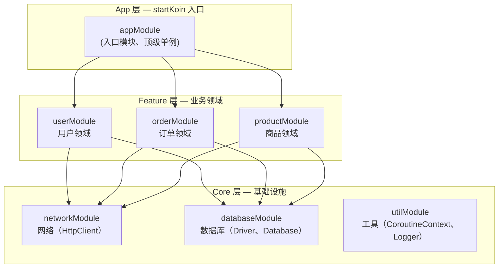
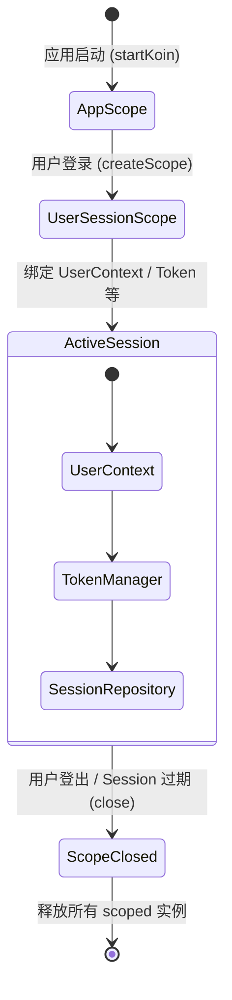
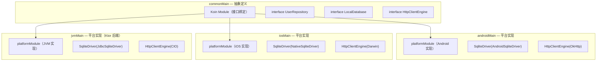

# 1. 引言：为什么在工程中选择 Koin？

## 1.1 核心理念：轻量 DSL 与纯 Kotlin 哲学

在 Kotlin 生态中，依赖注入框架的选型长期以来存在两条路径：**编译时生成派**（Dagger/Hilt、Kodein-DI、KSP-based）与**运行时解析派**（Koin、Kodein 传统模式）。Koin 旗帜鲜明地选择了后者——它完全摒弃了注解处理器（APT）和 KSP 代码生成，一切依赖定义通过纯 Kotlin DSL 完成。

```kotlin
// Koin 的依赖定义：原生 Kotlin DSL，零代码生成
val appModule = module {
    single<DatabaseDriver> { SqliteDriverFactory.create() }
    factory { (userId: String) -> UserSession(get(), userId) }
    viewModel { UserProfileViewModel(get(), get()) }
}
```

> [!info] 架构概念
> Koin 本质上是一个**运行时 Service Locator 的 DSL 化变体**。它不依赖 JSR-330 注解，不需要 `@Inject`、`@Provides` 等编译期元数据，而是将"工厂函数"注册到一张全局映射表中，在运行时通过 `get()` 或 `by inject()` 委托解析依赖。这使它天然支持 Kotlin Multiplatform（所有 target 上行为一致），并且编译速度不受模块数量影响。

## 1.2 架构师视角的权衡

每一种架构决策都有 trade-off，Koin 也不例外。

| 维度         | 编译时 DI（Dagger/Hilt）                      | 运行时 DI（Koin）                        |
| ------------ | --------------------------------------------- | ---------------------------------------- |
| 编译速度     | 随模块数增长显著下降（KAPT 性能瓶颈）         | 几乎不受影响（纯 Kotlin DSL）            |
| 启动性能     | 依赖图在编译期构造，启动几乎零开销            | 运行时构建依赖图（可接受，详见 5.1）     |
| 跨平台       | 仅 Android/JVM（Hilt 不支持 KMP）             | 所有 Kotlin Target 统一语法              |
| 错误发现时机 | **编译期**：缺失绑定立即报错                  | **运行时**：需要 `checkModules` 提前校验 |
| 学习曲线     | 陡峭（注解、Component、Scope、Subcomponent…） | 平缓（`single` / `factory` / `scope`）   |

> [!tip] 架构师思考
> 选择 Koin 的核心决策点通常不是"它比 Dagger 更强大"，而是**"我的团队需要一个高度可维护、跨平台兼容、且不拖累编译速度的 DI 方案"**。在多模块 KMP 项目中，编译速度的增益往往远超运行时解析的微小开销。而运行时的"不可知性"可以通过 `checkModules()` 在 CI 中弥补（见第 5 章）。

# 2. 基石构建：大型项目中的模块化设计

## 2.1 反模式：巨型单 Module

> [!warning] 生产环境避坑
> 把所有依赖全塞进一个 `appModule` 是 Koin 项目中最常见的反模式。这不仅让依赖图谱难以阅读，还会导致以下问题：
>
> 1. **测试隔离困难**：单元测试无法选择性加载依赖
> 2. **跨平台失效**：JVM 特有实现和 Android 实现混在一起
> 3. **启动性能退化**：所有模块都在首次访问时初始化，无法懒加载

```kotlin
// ❌ 反模式：巨型单 Module
val appModule = module {
    // 网络
    single { HttpClient { install(ContentNegotiation) { json() } } }
    single { ApiService(get()) }
    // 数据库
    single { DriverFactory().createDriver() }
    single { AppDatabase(get()) }
    // 仓库
    single { UserRepository(get(), get()) }
    single { OrderRepository(get(), get()) }
    // UseCase
    factory { GetUserProfileUseCase(get()) }
    factory { PlaceOrderUseCase(get(), get()) }
    // ViewModel
    viewModel { UserProfileViewModel(get()) }
    viewModel { OrderViewModel(get()) }
    // ... 100+ 行
}
```

## 2.2 最佳实践：按领域与层级分层拆分

一个成熟的大型 Koin 项目应按**业务领域**和**架构层级**两个维度组织 Module。



**对应代码落地：**

```kotlin
// ═══════════════════════════════════════
// Core 层：networkModule
// ═══════════════════════════════════════
val networkModule = module {
    single<HttpClient> {
        HttpClient {
            install(ContentNegotiation) { json() }
            install(Logging) { level = LogLevel.BODY }
        }
    }
    single<ApiService> { ApiServiceImpl(get()) }
}

// ═══════════════════════════════════════
// Core 层：databaseModule
// ═══════════════════════════════════════
val databaseModule = module {
    single<SqlDriver> { DriverFactory().createDriver() }
    single<AppDatabase> { AppDatabase(get()) }
}

// ═══════════════════════════════════════
// Feature 层：userModule
// ═══════════════════════════════════════
val userModule = module {
    single<UserRepository> { UserRepositoryImpl(get(), get()) }
    factory { GetUserProfileUseCase(get()) }
    viewModel { UserProfileViewModel(get()) }
}

// ═══════════════════════════════════════
// Feature 层：orderModule
// ═══════════════════════════════════════
val orderModule = module {
    single<OrderRepository> { OrderRepositoryImpl(get(), get()) }
    factory { PlaceOrderUseCase(get(), get<OrderRepository>()) }
    viewModel { OrderViewModel(get()) }
}
```

## 2.3 `includes` 与懒加载（Lazy Modules）

`includes()` 是构建模块层级树的关键函数，它将子 Module 的所有定义"合并"到父 Module 的命名空间中。

```kotlin
// 方案 A：显式 includes 构建层级
val appModule = module {
    includes(networkModule, databaseModule, utilModule)  // Core 层
    includes(userModule, orderModule, productModule)      // Feature 层
}

// 方案 B：延迟加载——仅在首次访问时触发
// Koin 原生不支持"延迟加载 module"，但可以通过 KoinApplication 分步加载实现：
fun loadLazyModule(koin: Koin, module: Module) {
    // 在真正需要时才加载特定模块，避免启动时加载全量依赖
    koin.loadModules(listOf(module))
}
```

> [!tip] 最佳实践
> 对于大型项目，推荐在 `appModule` 中使用 `includes()` 集中管理子模块的导入关系。这带来三层收益：
>
> 1. **可读性**：一眼看清模块间的拓扑关系
> 2. **可测试性**：单元测试可以只加载 `userModule + networkModule`，无需拖入整个 App 依赖树
> 3. **可维护性**：删除一个 Feature Module 时，只需在 `includes` 中移除一行

> [!note] 阶段总结
> 模块化是 Koin 工程的基石。分层后的 Module 就像乐高积木——每个积木独立、可替换、可单独测试，而 `includes()` 和 `loadModules()` 是组装积木的关键指令。

# 3. 高阶掌控：作用域（Scope）与内存管理

## 3.1 `single` 与 `factory` 的适用场景边界

| 声明方式  | 生命周期                | 适用场景                         | 内存特征                 |
| --------- | ----------------------- | -------------------------------- | ------------------------ |
| `single`  | 应用全局单例            | 数据库连接池、HttpClient、Logger | 常驻内存，应用启动到退出 |
| `factory` | 每次 `get()` 创建新实例 | UseCase、临时处理器              | 随用随建，GC 及时回收    |
| `scoped`  | 绑定到自定义 Scope      | 用户会话、事务上下文             | Scope 销毁时释放         |

```kotlin
// single：整个 Application 生命周期内唯一实例
val appModule = module {
    single<AppDatabase> { AppDatabase(get()) }        // ✅ 全局单例
    single<HttpClient> { createHttpClient() }          // ✅ 全局单例
}

// factory：每次注入都创建新实例（无状态或轻量对象首选）
val useCaseModule = module {
    factory { ValidateEmailUseCase() }                 // ✅ 无状态，factory 足矣
    factory { FormatUserNameUseCase() }                // ✅ 随用随建
}

// ⚠️ 陷阱：误把有状态对象声明为 factory
// factory { MutableStateFlow(user) } // ❌ 每次 get() 都是新的 StateFlow，状态丢失！
```

> [!warning] 生产环境避坑
> 不要把需要"唯一状态"的对象声明为 `factory`。例如 `MutableStateFlow`、带缓存的 Repository 等。如果多个模块分别持有不同的实例，状态同步将变得不可控。

## 3.2 自定义 Scope：管理"用户会话"生命周期

Scope 是 Koin 最强大的特性之一，也是处理"限定生命周期"依赖的关键工具。

**工程场景：** 用户登录后，需要持有 `UserContext`（含 token、偏好设置等），而这些对象在用户登出后必须被释放，否则会造成**内存泄漏**和**安全问题**（token 残留）。



对应代码实现：

```kotlin
// ── 定义 Scope 标识符 ──
val USER_SESSION_SCOPE = named<org.koin.core.qualifier.Qualifier>("UserSession")

// ── 定义限定在 Scope 内的依赖 ──
val sessionModule = module {
    scope(USER_SESSION_SCOPE) {
        scoped<UserContext> { UserContext(get()) }           // 每次会话唯一
        scoped<TokenManager> { TokenManager(get()) }         // 持有 token
        scoped<SessionRepository> { SessionRepositoryImpl(get(), get()) }
    }
}

// ── 登录时创建 Scope ──
class AuthManager(private val koin: Koin) {
    private var userSessionScope: Scope? = null

    fun login(userId: String) {
        // 1. 先销毁旧的 Session（防止泄漏）
        userSessionScope?.close()

        // 2. 创建新的 Scope，并注入一个字符串类型的 userId
        userSessionScope = koin.createScope(
            scopeId = "user_$userId",
            qualifier = USER_SESSION_SCOPE
        )

        // 3. 通过 Scope 获取 UserContext
        val context = userSessionScope!!.get<UserContext>()
    }

    fun logout() {
        userSessionScope?.close()   // 销毁 Scope，释放所有 scoped 依赖
        userSessionScope = null
    }
}
```

> [!tip] 架构师思考
> Scope 的工程价值在于将**"对象生命周期"与"业务生命周期"对齐**。没有 Scope 时，开发者只能借助 `@Volatile` + `null` 手动管理，极易出错。而 Scope 提供了声明式的生命周期管理：`createScope` → 使用 → `close`。对 Android 开发者来说，这与 `ViewModelScope` / `LifecycleScope` 的设计哲学一脉相承。

# 4. 跨平台与后端的架构实战

## 4.1 Ktor 后端实战：Koin Plugin 深度集成

Ktor 的插件（Plugin）架构与 Koin 的依赖注入天然契合。通过 `KoinPlugin`，可以在应用启动时初始化 DI 容器，并在路由（Route）中通过 `call.get<Service>()` 获取注入的实例。

```kotlin
// ═══════════════════════════════════════
// build.gradle.kts（JVM 后端）
// ═══════════════════════════════════════
// implementation("io.insert-koin:koin-ktor:3.5.0")
// implementation("io.insert-koin:koin-logger-slf4j:3.5.0")

// ═══════════════════════════════════════
// Application.kt — Ktor 应用入口
// ═══════════════════════════════════════
fun Application.module() {

    // 1. 安装 Koin Plugin
    install(Koin) {
        slf4jLogger()  // 接入 SLF4J 日志（生产环境推荐）
        modules(appModule)
    }

    // 2. 安装其他插件
    install(ContentNegotiation) { json() }
    install(StatusPages) {
        exception<Throwable> { call, cause ->
            call.respondText("Internal Error", status = HttpStatusCode.InternalServerError)
        }
    }

    // 3. 注册路由
    routing {
        userRoutes()
        orderRoutes()
    }
}

// ═══════════════════════════════════════
// UserRoutes.kt — 通过 call.get() 注入
// ═══════════════════════════════════════
fun Routing.userRoutes() {
    route("/api/v1/users") {
        get("/{id}") {
            val userService = call.get<UserService>()
            val id = call.parameters["id"] ?: throw MissingParameterException("id")
            call.respond(userService.getUser(id))
        }
        post {
            val userService = call.get<UserService>()
            val request = call.receive<CreateUserRequest>()
            call.respond(HttpStatusCode.Created, userService.createUser(request))
        }
    }
}

// ═══════════════════════════════════════
// 后端 Koin Module 定义
// ═══════════════════════════════════════
val appModule = module {
    // ── 基础设施层 ──
    single<Database> { Database.connect(url = "jdbc:postgresql://...", driver = "org.postgresql.Driver") }
    single { ExposedTransactionManager(get(), Dispatchers.Default) }

    // ── 数据层 ──
    single<UserRepository> { UserRepositoryImpl(get()) }
    single<OrderRepository> { OrderRepositoryImpl(get()) }

    // ── 服务层 ──
    single<UserService> { UserServiceImpl(get(), get()) }
    single<OrderService> { OrderServiceImpl(get(), get()) }
}
```

> [!tip] 最佳实践
> Ktor 后端中，推荐使用 `call.get<T>()` 而非构造器注入 Service。这是因为 Ktor 的路由是顶层扩展函数，没有 `this` 引用，`call.get()` 是最符合 Ktor 惯用法的方案。对于需要在 Plugin 中使用的依赖（如自定义 Authentication Provider），可以在 `install` 闭包内通过 Koin 获取。

## 4.2 KMP 跨平台实战：Shared 模块中的 DI 树

Kotlin Multiplatform 的依赖注入挑战在于：**Common 代码定义接口抽象，各 Platform 提供实现**。Koin 不依赖平台注解，因此天然适配这一模式。



**代码落地：**

```kotlin
// ═══════════════════════════════════════
// commonMain — shared/shared.kt
// ═══════════════════════════════════════
interface LocalDatabase {
    fun userDao(): UserDao
}

interface HttpClientEngineFactory {
    fun createEngine(): io.ktor.client.engine.HttpClientEngine
}

// Common 中的 Koin Module（声明接口 → 实现由平台注入）
val sharedModule = module {
    single<UserRepository> { UserRepositoryImpl(get(), get()) }
    factory { GetUserProfileUseCase(get()) }
}

// ═══════════════════════════════════════
// androidMain — shared/androidMain.kt
// ═══════════════════════════════════════
val androidPlatformModule = module {
    single<LocalDatabase> { AndroidLocalDatabase(DriverFactory(get()).createDriver()) }
    single<HttpClientEngineFactory> { object : HttpClientEngineFactory {
        override fun createEngine() = OkHttp.create()
    } }
}

// ═══════════════════════════════════════
// iosMain — shared/iosMain.kt
// ═══════════════════════════════════════
val iosPlatformModule = module {
    single<LocalDatabase> { IosLocalDatabase(NativeSqliteDriver()) }
    single<HttpClientEngineFactory> { object : HttpClientEngineFactory {
        override fun createEngine() = Darwin.create()
    } }
}

// ═══════════════════════════════════════
// 各平台的 startKoin 入口
// ═══════════════════════════════════════

// Android: MainApplication.kt
class MainApplication : Application() {
    override fun onCreate() {
        super.onCreate()
        startKoin {
            androidContext(this@MainApplication)
            modules(sharedModule + androidPlatformModule)
        }
    }
}

// iOS: MainViewController.kt (Helper)
fun initKoin() {
    startKoin {
        modules(sharedModule + iosPlatformModule)
    }
}
```

> [!tip] 架构师思考
> KMP 中 Koin 的 DI 策略遵循**"接口下沉、实现上浮"**原则：
>
> - **Common 层**声明接口（`interface`），`sharedModule` 中绑定到该接口
> - **Platform 层**提供具体实现，通过 `platformModule` 注入
> - 最终在 `startKoin {}` 中将两者合并：`modules(sharedModule + platformModule)`
>
> 这种模式避免了 `expect/actual` 的语法限制（`expect/actual` 只能用于顶层声明，而 Koin Module 中可以放任意工厂逻辑），同时保持了 Common 代码的纯净性。

> [!note] 阶段总结
> Koin 在 Ktor 后端和 KMP 跨平台两个场景中展现了高度一致的编程模型。工程师只需掌握一套 `module { single / factory / scope }` 的 DSL，便可在服务端、移动端、桌面端中复用相同的 DI 心智模型。这是编译时 DI 框架难以企及的。

# 5. 工程护航：测试驱动与依赖校验

## 5.1 `checkModules()` 弥补运行时短板

Koin 最大的工程痛点在于：**如果某个依赖未注册，只有在运行时调用 `get()` 时才会抛出 `NoBeanDefFoundException`**。这在生产环境中可能是灾难性的。

解法是 `checkModules()`——它会在测试阶段遍历整个 Koin 容器，**静态验证所有依赖链的完整性**。

```kotlin
// ═══════════════════════════════════════
// KoinModuleTest.kt — 放在 CI/CD 流程中执行
// ═══════════════════════════════════════
class KoinModuleTest {

    @Test
    fun `verify all modules are correctly configured`() {
        // checkModules 会尝试实例化所有 single/factory，
        // 并使用 mock 填充参数，验证整个依赖链能否"跑通"
        koinApplication {
            modules(
                networkModule,
                databaseModule,
                userModule,
                orderModule,
                productModule
            )
            checkModules {
                // 允许创建：这些类型将被 Koin 真实构建
                create<HttpClient> { parametersOf() }

                // 使用 Mock：直接 mock 掉无法在单元测试中创建的依赖
                withInstance<SqlDriver>(mockk(relaxed = true))
            }
        }
    }

    @Test(expected = NoBeanDefFoundException::class)
    fun `missing dependency should be detected`() {
        // 故意不注册 UserRepository，验证 checkModules 能捕获
        koinApplication {
            modules(module {
                single<UserService> { UserServiceImpl(get(), get()) }
            })
            checkModules()
        }
    }
}
```

> [!tip] 最佳实践
> 将 `checkModules()` 集成到 CI/CD 管线的 **pre-commit hook** 或 **GitHub Actions** 中。推荐策略：
>
> 1. **本地开发**：`./gradlew test` 中执行
> 2. **PR 提交**：作为必须通过的检查项
> 3. **定期全量扫描**：对 `production` 分支的完整依赖图做每日校验
>
> 这样可以把"运行时崩溃"转化为"编译期/CI 期发现"，从根本上消除 Koin 的短板。

## 5.2 结合 MockK 实现解耦测试

Koin 的 `declare` 和 `koinTest` DSL 让单元测试中的依赖替换变得极其简洁。

```kotlin
// ═══════════════════════════════════════
// UserServiceTest.kt
// ═══════════════════════════════════════
class UserServiceTest : KoinTest {

    // 直接通过 by inject() 委托获取 Koin 容器中的实例
    private val userService: UserService by inject()

    private val userRepository: UserRepository = mockk(relaxed = true)

    @Before
    fun setup() {
        startKoin {
            modules(
                module {
                    single<UserService> { UserServiceImpl(get()) }
                    single<UserRepository> { userRepository } // 注入 mock
                }
            )
        }
    }

    @After
    fun tearDown() {
        stopKoin()
    }

    @Test
    fun `getUser should return user when repository returns valid data`() {
        // Given
        val expectedUser = User(id = 1, name = "Alice")
        every { userRepository.findById(1) } returns Result.success(expectedUser)

        // When
        val result = userService.getUser(1)

        // Then
        assertEquals(expectedUser, result)
        verify(exactly = 1) { userRepository.findById(1) }
    }

    @Test
    fun `getUser should throw when repository returns error`() {
        // Given
        every { userRepository.findById(-1) } returns Result.failure(NotFoundException())

        // When & Then
        assertFailsWith<NotFoundException> {
            userService.getUser(-1)
        }
    }
}
```

对于 ViewModel 测试，Koin 同样提供了便捷的 `declareMock` 扩展：

```kotlin
// Android ViewModel 测试
class UserProfileViewModelTest : KoinTest {

    @get:Rule
    val koinTestRule = KoinTestRule.create {
        modules(
            module {
                viewModel { UserProfileViewModel(get()) }
                factory { mockk<GetUserProfileUseCase>(relaxed = true) }
            }
        )
    }

    @Test
    fun `viewModel should update state when use case succeeds`() {
        // 直接声明 mock，替换容器中的绑定
        declareMock<GetUserProfileUseCase> {
            every { invoke(any()) } returns UserProfile("Bob", "bob@example.com")
        }

        val viewModel = get<ViewModel<UserProfileViewModel>>()

        // 验证 UI 状态
        // ...
    }
}
```

> [!note] 阶段总结
> 测试是 Koin 工程化的最后一道防线。`checkModules()` 负责"静态验证"——确保依赖拓扑完整；MockK + KoinTest 负责"动态验证"——确保每个业务单元在隔离环境下正确运行。两者结合，构建起从 CI 到生产环境的完整质量防线。

# 6. 总结：Koin 工程化落地的全景视角

贯穿全文，Koin 工程化的最佳实践可归纳为以下几条原则：

1. **模块化优先**：按领域和层级拆分 Module，用 `includes()` 组装，避免巨型单 Module
2. **生命周期管理**：用 `single` 管理全局实例，`factory` 管理无状态实例，`scope` 管理有限生命周期的会话/事务
3. **平台抽象**：Common 定义接口，Platform 提供实现，`startKoin {}` 时合并 Module 列表
4. **CI 前置校验**：将 `checkModules()` 纳入持续集成，把运行时错误扼杀在 commit 阶段
5. **测试即文档**：Koin 的 Module 定义本身就是依赖拓扑的声明，配合 MockK 使测试代码成为接口契约的活文档

> [!tip] 架构师思考
> Koin 的哲学本质是 **"用简单性换取可维护性"**。它不追求编译时的绝对安全，而是通过清晰的 DSL、良好的测试支持和跨平台能力，为 Kotlin 工程提供了一套"务实且不折腾"的依赖注入方案。对于大规模 KMP 项目和 Ktor 微服务体系来说，这种"简单性"本身就是一种架构竞争力。
