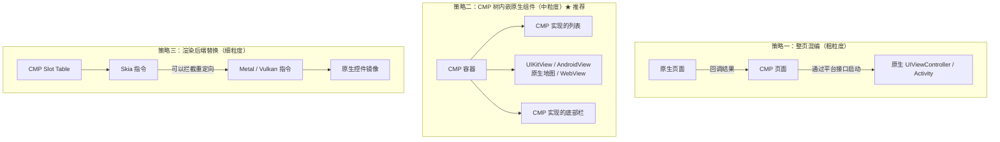
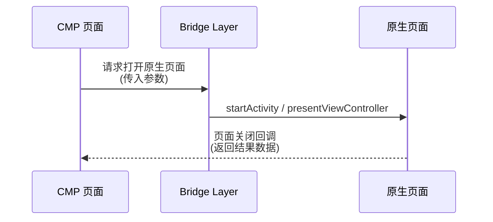
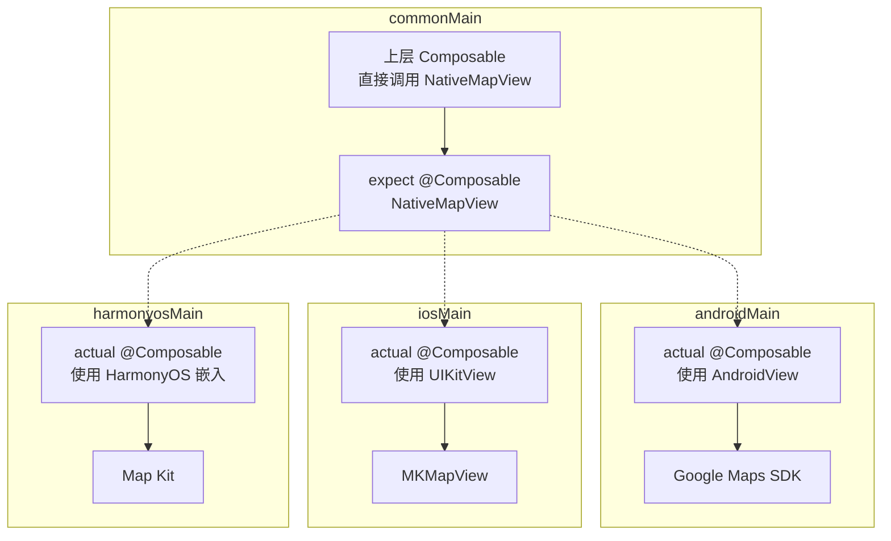
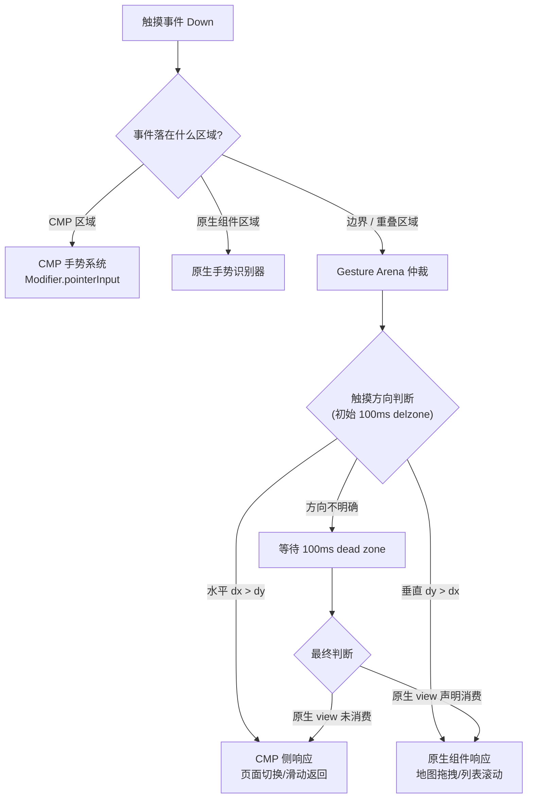

> [!tip] 相关内容
> [[Compose Multiplatform]] · [[Kotlin Multiplatform]] · [[跨平台同步原理]] · [[Kotlin/Native 编译优化]]
>
> 前置基础：先熟悉 [[Compose Multiplatform]] 的基础概念和 [[Kotlin Multiplatform]] 的 expect/actual 机制。

# 0. 背景：为什么需要混合渲染？

> [!important] CMP 不是万能的
> Compose Multiplatform 基于 Skia 渲染引擎，理论上可以绘制任何 UI，但在以下场景必须"凿墙"回到原生渲染路径：

| 场景 | 原因 | 典型案例 |
|:----:|:----|:---------|
| **地图** | 各平台地图 SDK（Google Maps / Apple Maps / 高德）只提供原生 SDK，不暴露 Skia 可用的绘制接口 | 外卖配送轨迹、门店定位 |
| **WebView** | 平台 WebView 的渲染管线和 Skia 完全隔离——浏览器内核直接管理自己的绘制层 | 支付 H5 页面、用户协议 |
| **视频播放器** | 平台解码器 + 硬件视频加速层（VideoToolbox / MediaCodec）不走 Skia 管线 | 短视频、直播 |
| **AR/VR** | ARKit / ARCore / 华为 AR Engine 需要原生相机 + 传感器管线 | 虚拟试穿、AR 导航 |
| **安全键盘** | 系统级安全输入不在应用进程内渲染 | 密码、支付密码输入 |
| **平台 Widget** | iOS Widget / 鸿蒙卡片运行在独立进程中 | 桌面小组件 |

> [!note] 核心理念
> CMP 共享 UI 逻辑，原生组件提供"逃生舱"。混合渲染不是 CMP 的缺陷，而是 CMP 对平台能力的尊重——**该共享的共享，该下沉的下沉**。

---
# 1. 三种混合策略对比

> [!important] 按侵入程度从小到大排列



| 策略 | 共享度 | 性能 | 维护成本 | 适用场景 |
|:----:|:------:|:----:|:--------:|:--------|
| **整页混编** | 低 | 最佳 | 低 | 支付页、AR 相机页、首次启动引导 |
| **CMP 内嵌原生** | 中 | 良 | 中 | 地图、WebView、视频播放器、安全输入 |
| **渲染后端替换** | 高 | 取决于实现 | 极高 | Figma 级别的基础设施（极少需要） |

> [!tip] 推荐策略
> 绝大多数项目选择**策略二**——在 CMP `@Composable` 树中通过 `UIKitView`（iOS）/ `AndroidView`（Android）插入原生组件。这是共享度与工程代价的最佳平衡点，也是本章讨论的重点。

## 1.1 策略一：整页混编



> [!note] 适用建议
> 整页切换的场景中，状态直接在原生页面内部管理，不需要 CMP 和原生之间频繁的状态同步，因此复杂度最低。

## 1.2 策略二：CMP 树内嵌原生组件 ★

> [!important] 这就是本章的核心内容
> 在 `@Composable` 树的某一点"切"到原生渲染路径，然后在该组件内部完全由原生框架负责绘制和事件处理。

```text
CMP 渲染层（Skia）
  │
  ├── Composable A（CMP）
  ├── Composable B（CMP）
  ├── NativeViewHost.composable （插入点）
  │   │
  │   └── 原生渲染层（UIKit / Android View / ArkUI）
  │       ├── 原生组件 1
  │       └── 原生组件 2
  │
  └── Composable C（CMP）
```

## 1.3 策略三：渲染后端替换（理论方向）

> [!warning] 这一层几乎不推荐落地
> 将 Skia 的绘制指令拦截并映射为平台原生控件，相当于为 CMP 实现一套全新的渲染后端。只有 Figma、Microsoft Office 等对像素级控制有极端需求的团队会考虑此路线。

---
# 2. UIKitView / AndroidView 互操作实战

## 2.1 统一接口设计

> [!important] 最佳实践
> 不要在各平台 `@Composable` 中直接调用 `UIKitView` / `AndroidView`。**在 `commonMain` 中用 `expect` 声明统一接口，各平台用 `actual` 提供实现**——这样上层 Composable 无需感知平台差异。



```kotlin
// commonMain/kotlin/ui/native/NativeMapView.kt
package ui.native

import androidx.compose.runtime.Composable
import androidx.compose.ui.Modifier

/**
 * 跨平台原生地图组件接口。
 * 各平台 actual 使用对应平台 SDK 实现。
 */
@Composable
expect fun NativeMapView(
    modifier: Modifier,
    latitude: Double,
    longitude: Double,
    zoomLevel: Float,
    onMapClick: (Double, Double) -> Unit
)
```

## 2.2 iOS 侧：UIKitView

```kotlin
// iosMain/kotlin/ui/native/NativeMapView.ios.kt
package ui.native

import androidx.compose.runtime.*
import androidx.compose.ui.Modifier
import androidx.compose.ui.interop.UIKitView
import platform.MapKit.MKMapView
import platform.MapKit.MKMapTypeStandard
import platform.CoreLocation.CLLocationCoordinate2DMake

@Composable
actual fun NativeMapView(
    modifier: Modifier,
    latitude: Double,
    longitude: Double,
    zoomLevel: Float,
    onMapClick: (Double, Double) -> Unit
) {
    val mapView = remember { MKMapView() }

    // 响应式更新：状态变化时驱动原生地图更新
    LaunchedEffect(latitude, longitude) {
        mapView.setCenterCoordinate(
            coordinate = CLLocationCoordinate2DMake(latitude, longitude),
            animated = true
        )
    }

    // 生命周期感知清理
    DisposableEffect(Unit) {
        onDispose {
            // ★ 必须：释放 delegate 避免循环引用
            mapView.delegate = null
        }
    }

    UIKitView(
        factory = { mapView },
        modifier = modifier,
        update = { /* 每次重组时的可选更新逻辑 */ }
    )
}
```

> [!warning] iOS 侧内存泄漏的高发区
> 1. `UIKitView` 内部持有的闭包引用了 Compose `State`，而 `State` 又关联到 `Composition`
> 2. Swift 的高引用计数的对象持有 Kotlin 闭包 → Kotlin 侧对象无法被 GC 回收
> 3. **三原则**：`DisposableEffect` 清 delegate / 不要直接传 `State` 给原生 / 弱引用原生回调

## 2.3 Android 侧：AndroidView

```kotlin
// androidMain/kotlin/ui/native/NativeMapView.android.kt
package ui.native

import android.os.Bundle
import androidx.compose.runtime.*
import androidx.compose.ui.Modifier
import androidx.compose.ui.platform.LocalContext
import androidx.compose.ui.viewinterop.AndroidView
import com.google.android.gms.maps.MapView
import com.google.android.gms.maps.GoogleMap
import com.google.android.gms.maps.model.LatLng
import com.google.android.gms.maps.model.CameraUpdateFactory

@Composable
actual fun NativeMapView(
    modifier: Modifier,
    latitude: Double,
    longitude: Double,
    zoomLevel: Float,
    onMapClick: (Double, Double) -> Unit
) {
    val context = LocalContext.current
    val mapView = remember { MapView(context) }

    // 生命周期同步
    DisposableEffect(Unit) {
        mapView.onCreate(Bundle())
        mapView.onResume()
        onDispose {
            mapView.onPause()
            mapView.onDestroy()
        }
    }

    // 响应地图点击
    LaunchedEffect(Unit) {
        mapView.getMapAsync { googleMap ->
            googleMap.setOnMapClickListener { latLng ->
                onMapClick(latLng.latitude, latLng.longitude)
            }
        }
    }

    AndroidView(
        factory = { mapView },
        modifier = modifier,
        update = { /* 状态变化时更新地图参数 */ }
    )
}
```

> [!tip] Android 侧注意点
> - `MapView` 需要手动调用生命周期方法（`onCreate/onResume/onPause/onDestroy`）
> - `AndroidView` 在 `Dispose` 时不会自动调用 `onDestroy`，需要 `DisposableEffect` 显式触发
> - `LocalContext.current` 获取 Activity 级别的 Context，用于初始化 MapView

## 2.4 HarmonyOS 侧：ArkUI 嵌入

> [!important] 鸿蒙的差异
> 鸿蒙没有 `UIKitView` 或 `AndroidView` 的等价物。CMP 的 Skia 需要由：
> 1. 鸿蒙的 `NativeWindow` 接口承载
> 2. 或者通过 **knoi** 将 CMP Composable 映射为 ArkUI 组件树
> 3. 或者通过 **KuiklyUI** 用 Kotlin/Native DSL 直接调用 ArkUI NDK C API

```kotlin
// harmonyosMain/kotlin/ui/native/NativeMapView.harmonyos.kt
package ui.native

import androidx.compose.runtime.*
import androidx.compose.ui.Modifier

@Composable
actual fun NativeMapView(
    modifier: Modifier,
    latitude: Double,
    longitude: Double,
    zoomLevel: Float,
    onMapClick: (Double, Double) -> Unit
) {
    // 方案一：通过 knoi 的 ArkUI 节点包装器
    // knoi 在编译时将 CMP Composable 树映射到 ArkUI 组件
    // 内部通过 HarmonyOS Map Kit 的 NDK API 实现

    // 方案二：直接使用 KuiklyUI DSL
    // KuiklyView(
    //     factory = { MapController() },
    //     modifier = modifier,
    //     update = { controller ->
    //         controller.setCenter(latitude, longitude, zoomLevel)
    //     }
    // )
}
```

> [!note] 选型建议
> - **knoi**：适合希望最大化跨平台 UI 共享的团队。但 CMP → ArkUI 的映射层有性能损耗和兼容性风险
> - **KuiklyUI**：适合鸿蒙侧追求原生性能的场景。不共享 UI 代码，只共享业务逻辑和状态
> - **折中**：核心页面用 knoi 共享，鸿蒙特色页面（卡片、元服务）用 KuiklyUI 或 ArkTS

---
# 3. 手势冲突的架构解法

> [!question] 为什么混合渲染中手势是最难的问题？
> CMP 有自己的手势系统（`Modifier.pointerInput`、`Modifier.clickable`、`Modifier.draggable` 等），原生组件（`MKMapView`、`WKWebView`、`ScrollView`）也有自己独立的手势识别器。一个触摸事件可能被双方同时消费，造成"地图拖拽的同时页面也在滚动"的双重响应。

## 3.1 Gesture Arena（手势竞技场）模型



> [!important] Gesture Arena 的核心原则
> 1. **延迟决策**：前 50-100ms 不立刻将事件分配给任何一方，收集触摸轨迹后决定
> 2. **角度阈值**：dx/dy 比值区分水平滑动和垂直滑动
> 3. **优先原生**：原生组件通常先消费事件，如果不消费再回退给 CMP

## 3.2 常见冲突场景与解决策略

| 场景 | 冲突描述 | 解决策略 |
|:----:|:---------|:--------|
| **原生地图在 LazyColumn 中** | 垂直滑动触发列表滚动 vs 地图拖拽 | `NestedScrollConnection` 拦截：地图内部未消费的滚动传给列表 |
| **WebView 水平翻页** | WebView 内部幻灯片水平滑动 vs CMP 页面滑动返回 | 角度阈值（dx/dy > 2 认定水平翻页 → 给 WebView） |
| **视频播放器手势** | 音量/亮度滑动手势 vs 系统导航手势 | 全屏时禁用 CMP 侧滑动返回 |
| **原生输入框** | 输入框获得焦点后键盘弹出 vs CMP 页面重新布局 | 监听 `keyboard` 事件，禁用重组直到键盘稳定 |

### 3.2.1 NestedScrollConnection 实战

```kotlin
// commonMain/kotlin/ui/native/MapInLazyList.kt

/**
 * 在地图内拖拽时禁止 LazyColumn 滚动。
 * 当地图到达边界（不能再平移）时，恢复 LazyColumn 滚动。
 */
class MapNestedScrollConnection(
    private val isMapAtBoundary: () -> Boolean
) : NestedScrollConnection {

    override fun onPreScroll(available: Offset, source: NestedScrollSource): Offset {
        // 如果地图不在边界，消费所有垂直滚动
        if (!isMapAtBoundary()) {
            return Offset(0f, available.y)  // 全部消费
        }
        return Offset.Zero  // 放行给 LazyColumn
    }

    override suspend fun onPreFling(available: Velocity): Velocity {
        if (!isMapAtBoundary()) {
            return available  // 全部消费
        }
        return Velocity.Zero
    }
}
```

## 3.3 跨平台手势仲裁接口

```kotlin
// commonMain/kotlin/ui/native/GestureBridge.kt
package ui.native

/**
 * 跨平台手势仲裁接口。
 * 各平台 actual 负责与各自原生手势系统对接。
 */
expect class GestureBridge {

    /**
     * 注册一个需要手势仲裁的原生组件区域。
     * hitTest 返回 true 表示事件坐标落在原生区域内。
     */
    fun registerNativeRegion(
        id: String,
        hitTest: (x: Float, y: Float) -> Boolean,
        onTouchEvent: (event: TouchEvent) -> TouchResult
    )

    /**
     * 设置手势仲裁策略。
     */
    fun setPolicy(policy: GesturePolicy)

    /**
     * 移除原生区域。
     */
    fun unregister(id: String)
}

enum class GesturePolicy {
    NATIVE_FIRST,       // 先让原生组件消费
    CMP_FIRST,          // 先让 CMP 消费
    ANGLE_THRESHOLD,    // 按角度阈值判断
    DEAD_ZONE           // 延迟 100ms 后按实际情况分配
}

data class TouchEvent(
    val action: TouchAction,
    val x: Float,
    val y: Float,
    val timestamp: Long,
    val dx: Float,   // 相对上一个事件的偏移
    val dy: Float
)

enum class TouchAction { DOWN, MOVE, UP, CANCEL }

enum class TouchResult { CONSUMED, NOT_CONSUMED, PENDING }
```

> [!tip] 通用解决原则总结
> 1. **默认放行给原生组件**，它不消费再交给 CMP
> 2. **明确的 hitTest 边界**：精确计算原生组件在 CMP 布局中的位置
> 3. **dead zone 迟滞区**：前 50-100ms 什么都不做，收集触摸方向后再决策
> 4. **角度阈值**：dx/dy > 2 → 水平 | dy/dx > 2 → 垂直 | 其他 → 按默认策略

---
# 4. 生命周期桥接的底层机制

> [!important] 最关键的问题：如何防止泄漏？
> CMP 的一个 `@Composable` 可能重组 N 次，但原生组件通常只有一份实例（创建于 `remember`）。原生组件的生命周期何时结束？它的资源何时释放？

## 4.1 生命周期对照表

| CMP 阶段 | iOS 原生组件 | Android 原生组件 | HarmonyOS 组件 |
|:--------:|:------------:|:----------------:|:--------------:|
| `LaunchedEffect`（首次创建） | `init` / `viewDidLoad` | `onCreate` | `onInit` |
| `DisposableEffect.onDispose`（离开树） | `deinit` / `viewDidDisappear` | `onDestroy` | `onDispose` |
| 重组（状态更新） | `update` block | `update` block | `update` block |

## 4.2 跨语言引用链的泄漏模式

```text
CMP 侧（Kotlin/Native）                iOS 侧（Swift/ObjC）
────────────────────────────────────────────────────────────────
Composable 持有 State                  UIKitView 持有 MKMapView
State 更新 → 重组触发                  MKMapView.delegate → Swift 闭包
Swift 闭包捕获 Kotlin State           ← ★ 这里形成跨语言强引用
  │                                     │
  └── State 引用 Composition ─────────→ ← ★ Composition 不释放
```

**解除方法**：

```kotlin
// 在 DisposableEffect 中显式断裂引用链
DisposableEffect(Unit) {
    onDispose {
        // ★ 关键：设为 null 断裂 Swift → Kotlin 的强引用链
        mapView.delegate = null
        // ★ 移除所有 observer 和 listener
        mapView.removeAnnotations()
    }
}
```

---
# 5. 混合渲染的性能评估

> [!question] 混入原生组件后，性能是变好还是变差？
> 答案是**取决于场景**。原生组件在自己的渲染管线中效率更高（地图、视频），但 CMP ↔ 原生之间的数据桥接会产生额外开销。

## 5.1 性能基准指标

| 指标 | 测量方式 | 健康阈值 |
|:----:|:--------|:--------:|
| **帧率** | Android Profile GPU / Xcode Metal Debugger | ≥ 55fps |
| **桥接延迟** | 从 CMP 状态变化到原生组件 UI 更新 | < 8ms |
| **内存增量** | 嵌入原生组件前后对比 | < 50MB |
| **首次加载** | `factory` 创建原生组件耗时 | < 100ms |

## 5.2 避免常见的性能陷阱

> [!warning] 不要在 `update` 中做耗时操作
> `UIKitView.update` / `AndroidView.update` 在每次重组时都会调用。如果重组频率高（如动画），update 中不要做：
> - ❌ 创建新对象（`Bitmap`、`URLSessionTask`）
> - ❌ I/O 操作
> - ❌ 复杂计算
>
> 正确做法：只在 `factory` 中初始化，`update` 中只做属性赋值。

> [!warning] 注意"布局抖动"
> 原生组件的尺寸变化可能导致 CMP 布局重新测量，形成连锁反应：`原生组件 resize → CMP 布局重测量 → 更多组件重组 → 原生组件再次 resize → ...`
> **解决方案**：给原生组件一个固定的 `Modifier.size()`，或使用 `Modifier.widthIn()` 限定范围。

---
# 6. 最佳实践 Checklist

> [!summary] 混合渲染落地检查清单

**架构设计**
- [ ] 是否用 `expect` / `actual` 封装了原生组件接口？
- [ ] 原生组件的生命周期是否与 `DisposableEffect` 绑定？
- [ ] 是否设计了统一的 GestureBridge 来处理跨平台手势冲突？

**内存安全**
- [ ] 原生组件的 delegate / listener 是否在 `onDispose` 中清理？
- [ ] 是否避免了原生回调直接引用 CMP `State` 对象？
- [ ] 长期存活的原生组件是否使用 `WeakReference` 持有 Composable 回调？

**性能**
- [ ] 原生组件的创建是否放在了 `remember` 中（不在重组中重复创建）？
- [ ] `update` block 是否只做简单的属性赋值？
- [ ] 原生组件是否有固定尺寸约束，避免布局抖动？

**平台差异**
- [ ] iOS 侧是否测试了 `UIKitView` 在不同 iOS 版本上的表现？
- [ ] Android 侧是否正确处理了 `Activity` 重建（配置变更）场景？
- [ ] 鸿蒙侧是否确认了 knoi / KuiklyUI 的稳定版本兼容范围？

> [!tip] 关联进阶内容
> - [[Kotlin Multiplatform]] 的渲染管线章节 — 深入 CMP 重组与布局性能优化
> - [[跨平台同步原理]] — 端云同步中的状态管理与离线架构
> - [[Kotlin/Native 编译优化]] — 包体积治理与构建提速
