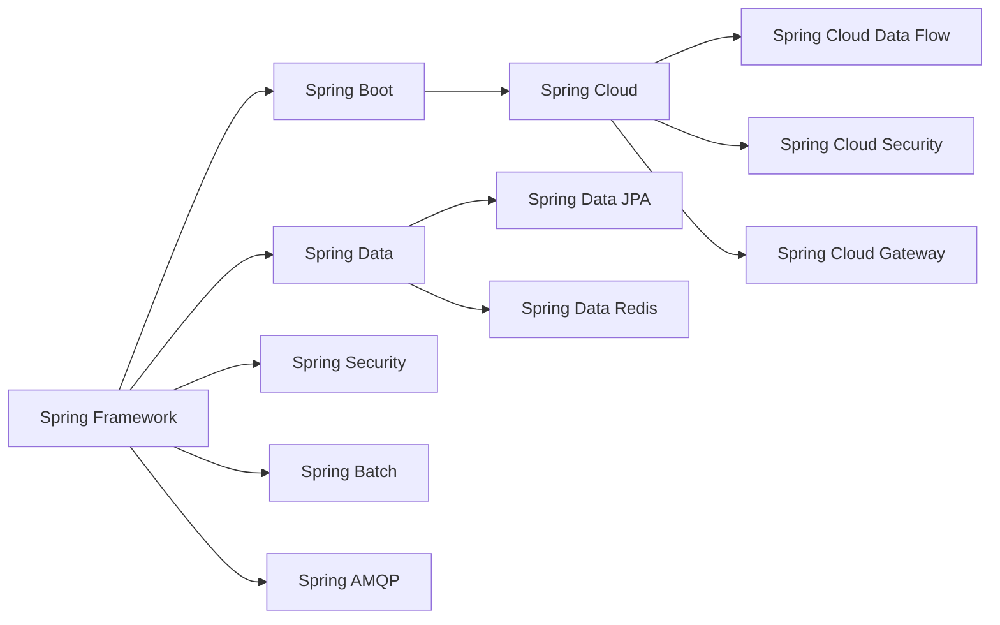
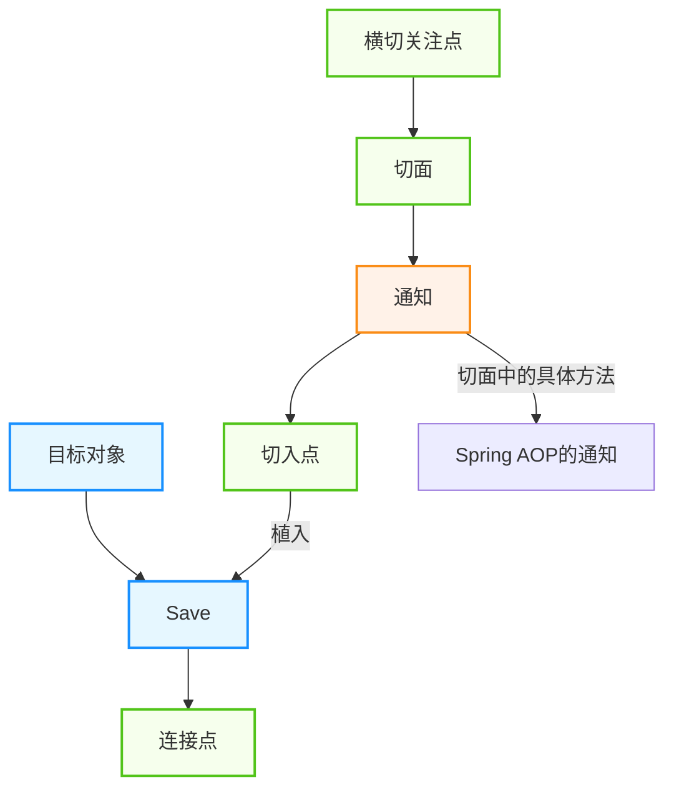
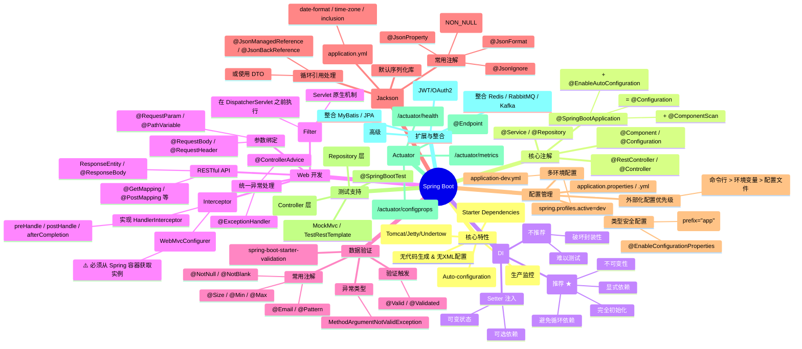
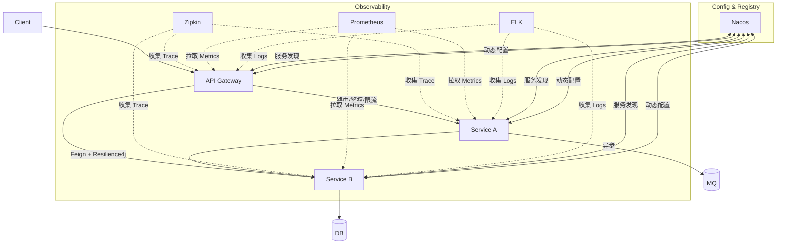
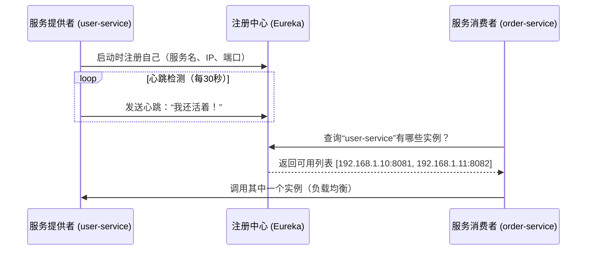
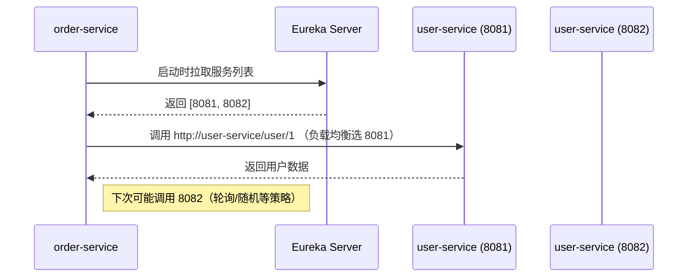
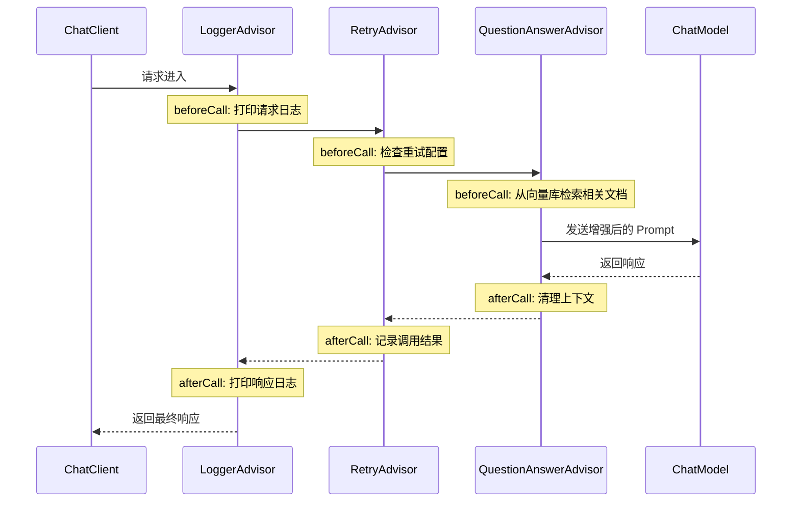

> [!summary] 先导内容
> [[JavaWeb]]，[[MySQL知识点梳理|MySQL]]

> [!summary] 相关内容
> [[MyBatis]]，[[Redis]]，[[RabbitMQ]]

# 0. Spring(万恶之源)

## 概述

> [!note] Spring简介
> Spring是一个支持快速开发[[Java知识点总结|Java]]EE应用程序的框架。它提供了一系列底层容器和基础设施，并可以和大量常用的开源框架无缝集成，可以说是开发JavaEE/[[Kotlin知识点快速梳理|Kotlin]]应用程序的必备。
>
> 理念: 使现有的技术更加容易使用,本身是一个"大杂烩", 整合了现有的技术框架.
>
> Spring最早是由Rod Johnson在他的《[Expert One-on-One J2EE Development without EJB](https://book.douban.com/subject/1426848/)》一书中提出的用来取代EJB的轻量级框架。随后这哥们又开始专心开发这个基础框架，并起名为*Spring Framework*。
>
> 随着Spring越来越受欢迎，在Spring Framework基础上，又诞生了Spring Boot、Spring Cloud、Spring Data、Spring Security等一系列基于Spring Framework的项目。本章我们只介绍Spring Framework，即最核心的Spring框架。后续章节我们还会涉及Spring Boot、Spring Cloud等其他框架。

> [!tip] 优点
>
> 1. 开源免费
> 2. 轻量级,非入侵式的框架
> 3. **控制反转(IOC)和面向切面(AOP)**
> 4. 支持事务的处理, 对框架整合的支持.

## Spring组成及拓展

### 组成

Spring Framework由7大核心模块组成，它们相互协作，提供了全面的企业级应用开发支持：

| 模块名称                   | 主要功能                  | 核心组件                                        |
| :------------------------- | :------------------------ | :---------------------------------------------- |
| **Spring Core**            | 提供IOC容器和Bean管理功能 | BeanFactory、ApplicationContext、BeanDefinition |
| **Spring AOP**             | 提供面向切面编程支持      | AspectJ、Advice、Pointcut、JoinPoint            |
| **Spring Data Access**     | 提供数据访问和事务管理    | JdbcTemplate、TransactionManager、ORM集成       |
| **Spring Web**             | 提供Web应用开发支持       | Spring MVC、RESTful API、WebSocket              |
| **Spring Integration**     | 提供企业集成模式支持      | MessageChannel、MessageHandler、Gateway         |
| **Spring Test**            | 提供测试支持              | SpringJUnit4ClassRunner、MockMvc、TestContext   |
| **Spring Instrumentation** | 提供类加载和代理支持      | LoadTimeWeaver、InstrumentationSavingAgent      |

### 拓展

Spring生态系统在核心框架基础上，发展出了一系列拓展项目，形成了完整的Spring技术栈：



> [!note] 核心拓展项目说明
>
> - **Spring Boot**
>   - 一个快速开发的**脚手架**，简化Spring应用的初始搭建和开发过程
>   - 基于SpringBoot可以快速开发单个微服务
>   - 核心原则：**约定大于配置**
>   - 提供自动配置、起步依赖、内嵌服务器等特性
> - **Spring Cloud**
>   - 基于SpringBoot实现的分布式系统开发工具集
>   - 提供服务发现、配置中心、负载均衡、断路器等微服务核心组件
>   - 支持多种微服务架构模式
>   - 核心组件包括：
>     - **服务注册与发现**：Eureka、Nacos、Consul、Zookeeper
>     - **配置中心**：Spring Cloud Config、Nacos Config、Apollo
>     - **负载均衡**：Ribbon、Spring Cloud LoadBalancer
>     - **服务调用**：Feign、OpenFeign、RestTemplate
>     - **断路器**：Hystrix、Sentinel、Resilience4j
>     - **网关**：Spring Cloud Gateway、Zuul
>     - **分布式追踪**：Sleuth、Zipkin、SkyWalking
>     - **分布式事务**：Seata、LCN
>     - **消息总线**：Spring Cloud Bus

## **IOC(控制反转)**

### 理论推导

> [!note] 概述
> 在传统的JavaEE开发的过程中, 每个对象都需要**自己负责**获取它所依赖的其他对象。我们称之为 ​**​“控制正转”​**​ —— 控制权在每个对象自己手里。
> **传统模式的痛点：​**​
>
> - ​**紧耦合（Tight Coupling）​**: `UserServiceImpl`直接依赖于 `UserDaoImpl`这个具体实现类，而不是`UserDao`接口。如果想换一个Dao实现（比如换成`UserDaoJdbcImpl`），就必须修改`UserServiceImpl`的源代码。
> - ​**难以测试**: 如果想对`UserService`进行单元测试，因为它内部直接`new`了一个真实的Dao，你无法轻松地注入一个“Mock Dao”来进行隔离测试。
> - ​**责任混乱**: 对象不仅要完成自己的业务逻辑，还要负责管理依赖对象的生命周期，违反了“单一职责原则”。
> - ​**资源浪费**: 每个对象都自己创建依赖，可能导致大量重复的对象创建，无法做到资源共享（如数据库连接池）。
>
> ```Java
> // 1. 数据访问层接口和实现
> public interface UserDao {
> 	User findUserById(Long id);
> }
> public class UserDaoImpl implements UserDao {
> @Override
> public User findUserById(Long id) {
> 		// 模拟数据库操作
>       return new User(id, "John Doe");
>   }
> }
>
> // 2. 服务层接口和实现
> public interface UserService {
>   User getUserById(Long id);
> }
> public class UserServiceImpl implements UserService {
>    // 重点在这里：服务层需要自己创建（或获取）它所依赖的DAO对象
>    private UserDao userDao;
>
>    public UserServiceImpl() {
>        // 控制权在Service内部：它主动new了一个具体的Dao实现
>        this.userDao = new UserDaoImpl(); // 紧耦合的关键所在！
>    }
>
>    @Override
>    public User getUserById(Long id) {
>        return userDao.findUserById(id);
>    }
> }
>
> // 3. 表现层（如Servlet）
> public class UserServlet extends HttpServlet {
>    private UserService userService;
>
>    public UserServlet() {
>        // 控制权在Servlet内部：它主动new了一个具体的Service实现
>        this.userService = new UserServiceImpl(); // 同样是紧耦合
>    }
>
>    protected void doGet(HttpServletRequest request, HttpServletResponse response) {
>        User user = userService.getUserById(1L);
>        // ... 将user输出到响应
>    }
> }
> ```
>
> Spring的IOC(*I*nversion *o*f *C*ontrol)模式:
>
> - 控制反转，顾名思义，就是**将对象的创建和依赖注入的控制权，从程序内部反转到外部容器（Spring容器）**
> - Spring IOC的核心是通过 ​**IOC容器**​ 来替你管理所有的对象（这些对象在Spring中被称为 ​**Bean**）。你只需要告诉容器需要哪些Bean，以及Bean之间的依赖关系，容器就会在运行时自动帮你创建它们，并将依赖注入到需要的地方。
> - 这个过程也叫 ​**依赖注入（Dependency Injection， DI）​**，DI是IOC最典型的实现方式。
>
> 让我们用Spring重写上面的例子
>
> ```Java
>
> // 标记这是一个Dao层的Bean，让Spring容器管理
> @Repository
> public class UserDaoImpl implements UserDao {...}
>
> // 标记这是一个Service层的Bean
> @Service
> public class UserServiceImpl implements UserService {
>    // 自动注入依赖的Bean！容器会自动找到UserDao的实现并注入到这里
>    @Autowired
>    private UserDao userDao;
>    ...
> }
>
> // 在配置类中，甚至不需要XML，只需告诉容器去哪里扫描这些Bean
> @Configuration
> @ComponentScan("com.example") // 扫描com.example包下的所有@Repository, @Service, @Component等
> public class AppConfig {
> }
> ```

### IOC本质

> [!note] IOC的本质
>
> 1. 控制权的反转
>
> - 传统: 对象控制着自身和依赖的创建
> - Spring: 容器控制所有对象的依赖和组装, 代码从主动创建变成了被动接受
>
> ```mermaid
> graph TD
>    subgraph 传统
>        A1[用户] --> A2[主动权在程序员，<br>程序调用什么]
>        A2 --> A3[业务层]
>        A3 --> A4[MySQL]
>        A3 --> A5[Oracle]
>        A3 --> A7[...]
>    end
>
>    subgraph Spring
>        B1[用户] --> B2[主动权在用户，<br>用户想调用什么就调用什么]
>        B2 --> B3[业务层]
>        B3 --> B4[MySQL]
>        B3 --> B5[Oracle]
>        B3 --> B6[...]
>    end
> ```
>
> 2. **依赖注入**
>
> - 这是*实现IOC的主要技术手段*,容器通过构造函数,Setter方法或字段反射将依赖关系注入到对象中
> - 关键好处: 解耦 --> 用IOC容器将各个对象连接在一起, 就像原来的若干个齿轮互相啮合在一起, 这时在他们中间加入一个大齿轮与之啮合, 将各个模块分开, **使得各个模块没有强联系**
>
> 3. 面向接口编程
>
> - IOC极大地促进了面向接口编程的良好实践。因为依赖是注入的，所以注入一个接口的任何实现都非常容易。
>
> 4. Bean生命周期管理
>
> - 容器不仅负责创建对象，还负责管理其整个生命周期（初始化、使用、销毁）。你可以通过`init-method`和`destroy-method`等定制生命周期行为。
>
> 5. 配置元数据
>
> - 需要以某种形式（XML、Java注解、Java Config）告诉容器如何构建和管理Bean之间的依赖关系。这份“说明书”就是配置元数据。
>
> 6. 易于测试
>
> - 这是最大的优势之一。由于依赖是外部注入的，你可以在测试时轻松地注入一个模拟对象（Mock），从而实现对单个类的隔离单元测试。

> [!example] 形象的比喻
>
> - 传统模式: **传统模式**​：就像你想吃一份披萨。你需要自己**亲自去超市**​（`new Supermarket()`）买面粉、奶酪、烤箱（依赖），然后**自己动手做**​（`new Pizza()`）。过程繁琐， tightly coupled to the supermarket and kitchen.
> - **Spring IOC模式**​：就像你**打电话给披萨店**​（Spring容器）点一份披萨。你只需要说“我要一个披萨”（声明依赖），披萨店就会用它的面粉、它的奶酪、它的烤箱做好，然后**送上门**​（依赖注入）给你。你完全不用关心披萨是怎么做的，食材是哪里来的。控制权从你身上反转到了披萨店身上。

## 依赖注入

> [!note] 概述
> 首先，我们重温一下核心思想：​**依赖注入是实现控制反转（IoC）的主要手段**。它的目的就是将对象所需依赖的创建和注入工作，从对象内部转移到外部容器（如Spring），从而实现解耦。
>
> 就像你想喝奶茶，你不是自己种茶、养牛、熬糖（自己创建依赖），而是告诉奶茶店你的需求（配置元数据），由奶茶店（IoC容器）做好后送给你（注入依赖）。
>
> 下面，我们开始介绍三种“送货上门”的方式:
>
> 1. 构造器注入--> 定制一杯基础奶茶: 想象一下，你走进一家奶茶店，​**在点单时就必须明确说出最核心的要求**，比如：“我要一杯**大杯的、三分糖的**奶茶”。店员（容器）在你下单（创建对象）的瞬间，就根据你的要求，把杯型（`size`）和糖度（`sugarLevel`）这两个**最基本的、必需的属性**给你配置好了。这杯奶茶一旦做好，它的杯型和糖度就不可更改了。
>
> ```Java
> public class MilkTea {
>    // 两个必需的、不变的属性
>    private final String size;
>    private final String sugarLevel;
>
>    // 构造器：在创建MilkTea对象时，必须传入这两个参数
>    public MilkTea(String size, String sugarLevel) {
>        this.size = size;
>        this.sugarLevel = sugarLevel;
>    }
>    // ... getter 方法
> }
>
> // Spring配置（基于注解）
> @Component
> public class MilkTeaShop {
>    // Spring容器会调用这个构造方法，并自动传入配置好的Bean
>    private final MilkTea milkTea;
>
>    @Autowired // Spring 4.3以后，如果只有一个构造方法，此注解可省略
>    public MilkTeaShop(MilkTea milkTea) {
>        this.milkTea = milkTea; // 依赖在对象构造时就被注入
>    }
> }
> ```
>
> - 优点:
>   - 不可变性: 依赖通常被声明为 `final`，使得对象在整个生命周期内依赖关系不变，非常安全
>   - 完全初始化的状态: 对象一旦被创建，其所有必需依赖就已就绪，不可能存在一个状态不完整的对象
>   - 明确的要求: 清楚地表示：“要创建我，你必须提供这些依赖”。Spring在启动时就会检查，如果依赖不全，会直接报错，有利于快速发现配置错误
> - 推荐场景: **强烈推荐用于所有必需的、不变的依赖。​**​ 这是目前社区公认的最佳实践。
>
> 2. Set注入 --> **为一杯已做好的基础奶茶加“小料”​**: 现在，你点了一杯基础的原味奶茶（对象已经创建好了）。之后，你还可以**随时选择是否要加珍珠、是否要加椰果、是否要换盖子**。这些“小料”和“配件”是可选的，你可以加，也可以不加。加了更好喝，不加也能喝。店员（容器）会在奶茶做好后，通过一个个独立的“加料”动作为你配置。
>
> ```Java
> public class MilkTea {
>   private String size;
>   private String sugarLevel;
>   // 可选的小料
>   private String topping; // 配料
>
>    // Setter 方法：可以在对象创建后，单独调用这些方法来设置属性
>    public void setSize(String size) {
>        this.size = size;
>    }
>    public void setSugarLevel(String sugarLevel) {
>        this.sugarLevel = sugarLevel;
>    }
>    public void setTopping(String topping) {
>        this.topping = topping; // 这是一个可选的依赖
>    }
>    // ... getter 方法
> }
>
> // Spring XML配置示例（这也是Setter注入最经典的配置方式）
> <bean id="myMilkTea" class="com.example.MilkTea">
>    <property name="size" value="大杯"/> <!-- 调用setSize("大杯") -->
>    <property name="sugarLevel" value="三分糖"/> <!-- 调用setSugarLevel("三分糖") -->
>    <property name="topping" value="珍珠"/> <!-- 调用setTopping("珍珠") -->
> ```

?</bean>

> ```
>
> - 优点:
> 	- 灵活性: 可以重新配置对象, 如在对象创建后更换依赖
> 	- 可选依赖: 适合不是对象正常运行必须的依赖
> - 缺点: 对象可能在某个时间段内处于依赖不完整的*部分初始化*状态.
> - 适用场景: 用于**可选的依赖**。虽然图中标注“重要”，但在现代Spring开发中，其重要性已被构造器注入取代，但它仍然是一种不可或缺的注入方式
>
> 3. 拓展方式注入 --> **奶茶店老师傅直接上手操作**: 这是一种比较特殊的方式。它不像点单（构造器）也不像加料（Setter），而是像奶茶店的老师傅**直接绕过所有流程，掀开盖子，直接把糖浆倒进去**。非常直接，但也很粗暴，完全打破了封装性。
> ```

Spring支持两种拓展的注入方式，需要在XML配置文件中导入相应的命名空间：

##### p命名空间注入

> [!note] 说明
> p命名空间是对Setter注入的简化，通过XML属性的方式进行注入
>
> 导入命名空间：`xmlns:p="http://www.springframework.org/schema/p"`

```xml
<!-- 使用p命名空间注入 -->
<bean id="milkTea" class="com.example.MilkTea"
      p:size="大杯"
      p:sugarLevel="三分糖"
      p:topping="珍珠" />
```

##### c命名空间注入

> [!note] 说明
> c命名空间是对构造器注入的简化，通过XML属性的方式进行注入
>
> 导入命名空间：`xmlns:c="http://www.springframework.org/schema/c"`

```xml
<!-- 使用c命名空间注入 -->
<bean id="milkTea" class="com.example.MilkTea"
      c:size="大杯"
      c:sugarLevel="三分糖" />
```

> [!tip] 注意事项
>
> - p命名空间和c命名空间都需要在XML配置文件中导入相应的命名空间
> - p命名空间对应Setter注入，c命名空间对应构造器注入
> - 这两种方式都是XML配置的简化形式，在现代Spring开发中，注解方式（@Autowired、@Resource等）更为常用
>
> ## **需要注意**
>
> 从SpringBoot 2.6开始，默认禁止循环依赖（可以通过配置开启，但是不推荐）。构造器注入天然暴露循环依赖的问题，有助于早期发现问题，这也是它由于setter注入的原因之一

## Bean

> [!question] 什么是Bean?
> 在 Spring 中，Bean 是由 Spring IoC 容器管理的对象实例。这些对象通过容器进行实例化、组装和管理。
> 关键特征:
>
> - 由Spring容器管理其生命周期
> - 通过依赖注入获取其依赖关系
> - 通常代表应用程序中的核心组件

### Bean的配置方式

#### xml配置(传统方式)

```xml
<bean id="userService" class="com.example.UserServiceImpl">
    <property name="userDao" ref="userDao"/>
</bean>

<bean id="userDao" class="com.example.UserDaoImpl"/>
```

#### 注解配置(现代开发主流)

```Java
@Service
public class UserServiceImpl implements UserService {
    @Autowired
    private UserDao userDao;
}

@Repository
public class UserDaoImpl implements UserDao {}
```

#### JavaConfig配置

```Java
@Configuration
public class AppConfig {
    @Bean
    public UserService userService() {
        return new UserServiceImpl(userDao());
    }

    @Bean
    public UserDao userDao() {
        return new UserDaoImpl();
    }
}
```

### Bean的作用域(_scope_)

|   作用域    |                描述                |        适用场景         |
| :---------: | :--------------------------------: | :---------------------: |
|  singleton  | 默认作用域，每个容器中只有一个实例 |    无状态的共享服务     |
|  prototype  |        每次请求都创建新实例        |      有状态的对象       |
|   request   |     每个 HTTP 请求创建一个实例     | Web应用中的请求相关对象 |
|   session   |     每个 HTTP 会话创建一个实例     |    用户会话相关数据     |
| application |      ServletContext 生命周期       |    全局应用共享对象     |
|  websocket  |       WebSocket 会话生命周期       |    websocket相关对象    |
|  配置示例:  |

```JAVA
@Scope("prototype")
@Component
public class PrototypeBean {}
```

### Bean的生命周期

#### 完整的生命周期阶段

1. 实例化 --> 调用构造函数创建爱你对象
2. 属性赋值 --> 依赖注入
3. Aware接口回调 --> 如BeanNameAware, BeanFactoryAware等
4. 前置初始化 --> `@PostConstruct`注解方法和`InitializingBean.afterPropertiesSet()`
5. 自定义初始化 --> init-method 指定的方法
6. 使用阶段 --> Bean就绪,可以使用
7. 销毁前回调 --> `@PreDestroy`注解方法和`DisposableBean.destroy()`
8. 自定义销毁 --> destroy-method指定的方法

#### 生命周期回调实现方式

##### 接口方式

```Java
public class LifecycleBean implements InitializingBean, DisposableBean {
    @Override
    public void afterPropertiesSet() {
        // 初始化逻辑
    }

    @Override
    public void destroy() {
        // 销毁逻辑
    }
}
```

##### 注解方式(常用)

```Java
@Component
public class LifecycleBean {
    @PostConstruct
    public void init() {
        // 初始化逻辑
    }

    @PreDestroy
    public void cleanup() {
        // 销毁逻辑
    }
}
```

##### xml配置方式

```xml
<bean id="lifecycleBean" class="com.example.LifecycleBean"
      init-method="init" destroy-method="cleanup"/>
```

### Bean的延迟初始化

> [!note] 懒加载
> 默认情况下, Spring容器启动时会初始化所有单例Bean, 可以通过`@Lazy`实现延迟初始化

```Java
@Lazy
@Component
public class LazyBean {
    public LazyBean() {
        System.out.println("LazyBean initialized!");
    }
}
```

### Bean的自动装配

> [!note] 概述
> 自动装配是Spring满足Bean依赖的一种方式
> Spring会在上下文中自动寻找并自动给Bean装配属性
>
> 在Spring中的装配方式:
>
> - xml中显式配置
> - Java中显式配置
> - _隐式自动装配_(重要)
>
> 我们会重点讲解自动装配

Spring提供了4种自动装配的模式:

| 模式        | 说明                                              |
| ----------- | ------------------------------------------------- |
| no          | 默认, 不自动装配                                  |
| byName      | 根据属性名匹配Bean名称(需要保证所有Bean的id唯一)  |
| byType      | 根据属性类型匹配Bean(需要保证所有Bean的Class唯一) |
| constructor | 类似byType, 但是用于构造器参数                    |

#### 自动装配(`@Autowired`)

> [!note] 说明
> `@Autowired`是Spring提供的自动装配注解，默认**按类型装配**。如果不能唯一自动装配上属性，则要使用`@Qualifier`进行限制，或者结合`@Primary`注解使用。
>
> `@Autowired`的工作流程：
>
> ```mermaid
> graph TD
> A[按类型查找Bean] --> B{是否找到？}
> B -->|是| C1[只找到一个？]
> B -->|否| C2[抛异常]
> C1 -->|只有一个| D[自动装配]
> C1 -->|不只一个| D1[是否配置了Qualifier？]
> D1 -->|是| E1[按照Qualifier查找Bean]
> E1 --> F1{是否找到？}
> F1 -->|是| D
> F1 -->|否| C2
> D1 -->|否| E2[按名称查找Bean]
> E2 --> F2{是否找到？}
> F2 -->|是| D
> F2 -->|否| C2
> ```

#### 其他自动装配注解

##### `@Resource`

> [!note] 说明
> `@Resource`是JDK提供的自动装配注解，默认**按名称装配**，如果找不到则按类型装配。
>
> 支持的属性：
>
> - `name`：指定要注入的Bean名称
> - `type`：指定要注入的Bean类型

```Java
// 按名称装配
@Resource(name = "userDaoImpl")
private UserDao userDao;

// 按类型装配
@Resource(type = UserDaoImpl.class)
private UserDao userDao;

// 先按名称查找，找不到则按类型查找
@Resource
private UserDao userDao;
```

##### `@Inject`

> [!note] 说明
> `@Inject`是JSR-330提供的自动装配注解，默认**按类型装配**，需要导入javax.inject依赖。
>
> 可以结合`@Named`注解使用，类似于`@Autowired`结合`@Qualifier`。

```Java
// 按类型装配
@Inject
private UserDao userDao;

// 结合@Named按名称装配
@Inject
@Named("userDaoImpl")
private UserDao userDao;
```

#### 自动装配注解对比

| 注解         | 来源    | 装配方式               | 支持的属性      | 是否需要额外依赖   |
| :----------- | :------ | :--------------------- | :-------------- | :----------------- |
| `@Autowired` | Spring  | 默认按类型，支持按名称 | required, value | 否                 |
| `@Resource`  | JDK     | 默认按名称，支持按类型 | name, type      | 否                 |
| `@Inject`    | JSR-330 | 默认按类型，支持按名称 | 无              | 是（javax.inject） |

> [!tip] 最佳实践
>
> - 优先使用`@Autowired`，它是Spring原生支持的注解，功能最丰富
> - 当需要按名称装配时，结合`@Qualifier`使用
> - 对于需要跨框架兼容的项目，可以考虑使用`@Inject`
> - 避免在同一个类中混合使用不同的自动装配注解，保持一致性

> [!example] 从"智能奶茶店"来看`@Autowired`
> 想象你走进一家**全自动智能奶茶店**，这里没有服务员问你"要加什么料"，而是有一套智能系统自动为你搭配最适合的配料组合。Spring的`@Autowired`注解就是这套智能系统！
>
> 1. 传统点单 VS 自动装配
>
> - 传统方式: 你明确告诉店员各种配料(手动配置每个依赖)
> - 自动装配: 只需要说明"我要一杯招牌奶茶", 系统会自动为你搭配
>
> 2. `@Autowired`的工作原理:
>
> - 按类型匹配
>
> ```Java
> public class MilkTea{
> 	@Autowired  //系统会找Tea类型的配料
> 	private Tea tea;
> }
>
> @Component // 库存有绿茶
> public class GreenTea implements Tea{...}
>
> @Component // 库存有红茶
> public class BlackTea implements Tea{...}
> ```
>
> - 使用`@Qualifier`指定具体配料
>
> ```java
> public class MilkTea{
> 	@Autowired
> 	@Qualifier("blackTea") //明确指定要红茶
> 	private Tea tea;
> }
>
> @Component("blackTea")
> public class BlackTea implements Tea{...}
> ```
>
> - `@Primary`标记默认选择: 店长可以指定招牌默认茶底
>
> ```Java
> @Primary  // 这是默认茶底
> @Component
> public class OolongTea implements Tea{...}
>
> // 顾客没有特殊要求时就用默认的茶底
> public class MilkTea{
> 	@Autowired  //会自动选择OolongTea
> 	private Tea tea;
> }
> ```
>
> 3. 特殊情况处理
> 1. 可选配料 (required = false)
>    有些配料可以不要
>
> ```Java
> public class LightMilkTea{
> 	@Autowired(required = false) //没有糖也可以
> 	private Sugar sugar;
> }
> ```
>
> 2. 同类型多配料处理
>
> - 方案1: 用`@Qualifier`指定要哪个
>
> ```Java
> public class CustomMilkTea{
> 	@Autowired
> 	@Qualifier("brownSugar")  // 明确要红糖
> 	private Sugar sugar;
> }
> ```
>
> - 方案2: 注入所有同类配料
>
> ```java
> public class SuperMilkTea{
> 	@Autowired  // 注入所有糖的类型
> 	private List<Sugar> allSugars;
> }
> ```
>
> - 方案3: 用Map按照名称管理
>
> ```Java
> public class UltimateMilkTea{
> 	@Autowired  // 按名称组织所有糖
> 	private Map<String,Sugar> sugarMap;
> }
> ```
>
> 3. 循环依赖: A依赖B, B又同时需要A
>    解决方案:
>    - 使用Setter注入代替构造器注入(先做出半成品再完善)
>    - 使用`@Lazy`延迟加载(等到真正需要的时候再加载)
>
> ```Java
> public class MilkTea{
> 	@Lazy
> 	@Autowired
> 	private IngredientB b;
> }
> ```
>
> 4. 最优实践步骤
> 1. 首选构造器注入 --> 明确你的必选配料
>
> ```Java
> @Service
> public class Customer{
> 	private final MilkTea milkTea;
>
> 	@Autowired
> 	public Customer(MilkTea milkTea){
> 		this.milkTea = milkTea;
> 	}
> }
> ```
>
> 2. 合理使用`@Qualifier` --> 特殊要求要说清楚
>
> ```Java
> @Autowired
> @Qualifier("lessIce")
> private Ice ice;
> ```
>
> 3. 避免滥用自动装配 --> 不是所有的配料都适合添加
> 4. 保持单一职责 --> 一杯奶茶里面不需要50种配料

#### 条件化装配

##### @Conditional

> [!note] 概述
> 根据条件决定是否创建Bean

```Java
@Bean
@Conditional(DataSourceCondition.class)
public DataSource dataSource() {
    // 仅当条件满足时创建
}
```

##### Profile

> [!note] 概述
> 根据环境激活不同的Bean

```Java
@Profile("dev")
@Component
public class DevDataSource implements DataSource {}

@Profile("prod")
@Component
public class ProdDataSource implements DataSource {}
```

## **AOP(面向切面编程)**

### 代理模式

> [!question] 为什么学习代理模式?
> 答: 因为这是Spring**AOP**的底层
>
> 代理模式的分类
>
> - 静态代理
> - 动态代理

> [!note] 概述
>
> ```mermaid
> flowchart TD
>    A[租房] --> B[抽象主题]
>
>    B --> C[代理角色 - 中介]
>    B --> D[真实角色 - 房东]
>
>    C --> E[代理]
>    E --> F[代替房东处理租房事务，提供额外服务]
>
>    D --> G[真实主题]
>    G --> H[实际是房子的拥有者，拥有最终的决定权]
>
>    I[租客] --> C
>
>    %% 设置样式
>    classDef abstract fill:#f0f0f0,stroke:#333,stroke-width:1px
>    classDef proxy fill:#e6f3ff,stroke:#0066cc,stroke-width:1px
>    classDef real fill:#fff0e6,stroke:#cc6600,stroke-width:1px
>    classDef client fill:#f0f0f0,stroke:#666,stroke-width:1px
>
>    class A,B abstract
>    class C,E,F proxy
>    class D,G,H real
>    class I client
> ```
>
> 想象你是一个要租房子的租客, 在这个时候, 应该是你直接去找房东就能够租房了, 但是房东他只想把房子租给你, 不想管合同那些事情, 于是, 中介(代理)角色便诞生了.
> 中介代替房东处理租房事务”，持有对真实主题的引用。客户端（租客）直接与代理交互。代理在调用真实主题的方法之前或之后，可以“提供额外服务”（如：资质审核、看房安排、合同准备、费用代收等），从而实现对真实对象的访问控制和功能增强

#### 静态代理

> [!note] 概述
> 角色分析:
>
> - 抽象角色 -> 租房: 一般使用接口或抽象类来解决
> - 真实角色 -> 房东: 被代理的角色
> - 代理角色 -> 中介: 代理真实角色, 代理真实角色后, **一般会做一些附属操作**
>
> 好处:
>
> - 使真实的角色操作更加纯粹, _不用去关注一些公共的业务_
> - 公共业务交给代理, 实现了业务的分工
> - 公共业务发生扩展时, 方便集中管理
>
> 缺点:
>
> - 一个真实角色就会产生一个代理角色, 代码量会提高, 开发效率会降低.

> [!example] 使用静态代理实现租房场景
>
> 1. 定义接口
>
> ```Java
> public interface RentService{
> 	void rentHouse();   // 核心租房方法
> 	void showHouse();   // 看房方法
> }
> ```
>
> 2. 真实角色(房东)实现
>
> ```Java
> public class Landlord implements RentService{
> 	private String name;
>
> 	public Landlord(String name){
> 		this.name = name;
> 	}
>
> 	@Override
> 	public void rentHouse(){
> 		System.out.println(name + "房东:签订租房合同,交出钥匙");
> 	}
>
> 	@Override
> 	public void showHouse(){
> 		System.out.println(name + "房东:亲自带你来看房");
> 	}
> }
> ```
>
> 3. 代理角色(中介)实现
>
> ```java
> public class HouseAgent implements RentService{
> 	private Landlord landlord;  // 持有对真实角色的引用
>
> 	//中介可以代理多个房东
> ```

    public HouseAgent(Landlord landlord){

    	this.landlord = landlord;
    }

> @Override
> public void rentHouse(){
> // 前置处理,中介的增值服务(中介的附属操作)
> System.out.println("中介:核实租客信用资质");
> System.out.println("中介:准备标准租房合同");
>
>       // 委托真实角色处理的核心业务
>       landlord.rentHouse();
>
>       // 后置处理
>       System.out.println("中介:收取中介费");
>
> }
>
> @Override
> public void showHouse(){
> // 中介的附属操作
> System.out.println("中介:专车接送看房");
> System.out.println("中介:提供周别配套设施介绍");
>
>       // 执行看房的方法
>       landlord.showHouse();
>
> }
>
> // 代理特有的方法
> public void evaluateHouse(){
> System.out.println("中介:提供估价服务");
> }
> }
>
> ````
> 4. 租客(客户端)操作
> ```java
> public class Renter{
> 	public static void main(String[] args){
> 		// 创建真实角色
> 		Landlord landlord = new Landlord("张先生");
>
> 		// 创建代理角色
> 		HouseAgent agent = new HouseAgent(landlord);
>
> 		// 租客和代理交互,不直接接触房东
> 		agent.showHouse();
> 		agent.rentHouse();
> 	}
> }
> ````

#### 动态代理(AOP的核心机制之一)

> [!question] 思考: 静态代理中, 每次代理一个角色代码量都要增加的弊端应该如何解决?
> 答: 使用**反射**来动态的加载一些类, 也就是动态代理

> [!note] 动态代理概述
>
> - 动态代理和静态代理的角色是一样的
> - 动态代理的代理类是*动态生成*的, 不是直接写好的
> - 动态代理分为两大类
>   1.  基于接口的动态代理 --> JDK动态代理
>   2.  基于类的动态代理 --> javassist
>
> 需要了解两个类
>
> 1. Proxy --> 提供了创建动态代理类的静态方法
> 2. InvocationHandler (java.lang.reflect)

> [!example] 使用动态代理实现租房场景
>
> RentService接口和Landlord类和静态代理中的代码相同
>
> 1. 创建调用处理器
>
> ```Java
> public class RentInvocationHandler implements InvocationHandler{
> 	private Object target;  // 被代理的真实对象
>
> 	public RentInvocationHandler(Object target){
> 		this.target = target;
> 	}
>
> 	@Override
> 	public Object invoke
> 	(Object proxy,
> 	Method method,
> 	Object[] args)throws Throwable{
> 		//前置增强
> 		System.out.println("动态代理: 开始处理"+method.getName()+"请求");
>
> 		//根据方法名提供不同的增强逻辑
> 		if("rentHouse".equals(method.getName())){
> 			System.out.println("动态代理: 验证租客身份信息");
> 			System.out.println("动态代理: 准备电子合同模板");
> 		}
> 		else if("showHouse".equals(method.getName())){
> 			System.out.println("动态代理: 发送看房预约确认短信");
> 		}
>
> 		// 调用真实对象的方法
> 		Object result = method.invoke(target,args);
>
> 		// 后置增强
> 		System.out.println("动态代理:"+method.getName()+"请求处理完成");
>
> 		return result;
> 	}
> }
> ```
>
> 2. 客户端使用动态代理
>
> ```Java
> public class DynamicProxyDemo {
>    public static void main(String[] args) {
>        // 1. 创建真实主题(房东)
>        RentService landlord = new Landlord("李女士");
>
>        // 2. 创建调用处理器，并传入真实主题
>        RentInvocationHandler handler = new RentInvocationHandler(landlord);
>
>        // 3. 动态创建代理对象
>        RentService proxy = (RentService) Proxy.newProxyInstance(
>            landlord.getClass().getClassLoader(),  // 使用相同的类加载器
>            landlord.getClass().getInterfaces(),   // 实现相同的接口
>            handler                                // 自定义调用处理器
>        );
>
>        // 4. 通过代理调用方法
>        proxy.showHouse();
>        proxy.rentHouse();
>
>        // 5. 动态代理的独特优势演示
>        System.out.println("\n动态代理生成的类: " + proxy.getClass().getName());
>        System.out.println("动态代理的父类: " + proxy.getClass().getSuperclass());
>        System.out.println("动态代理实现的接口: ");
>        for (Class<?> intf : proxy.getClass().getInterfaces()) {
>            System.out.println(" - " + intf.getName());
>        }
>    }
> }
> ```

#### 两种代理方式对比

|     特性     |           静态代理            |           动态代理            |
| :----------: | :---------------------------: | :---------------------------: |
|   实现方式   |           手动编写            |        运行时动态生成         |
|    灵活性    |   低,每个接口需要单独代理类   | 高,一个处理器可以代理多个接口 |
|    代码量    | 多,需要为每个方法编写调用逻辑 |  少,统一在`invoke`方法中处理  |
|    维护性    |   差,接口变更需要修改代理类   |   好,接口变更不影响代理生成   |
|     性能     |         稍快,直接调用         |         稍慢,反射调用         |
|   适用场景   |       代理类较少且固定        |    需要代理多个接口或方法     |
| 特有方法支持 |   支持,可以添加代理特有方法   |    不支持,只能实现接口方法    |

### AOP(**A**spect-**O**riented **P**rogramming)

#### 概述

> [!note] 什么是AOP?
> **面向切面编程(AOP)** 是一种编程范式，它允许开发者*在不修改源代码的情况下，动态地向程序中添加额外的行为或功能*。AOP 是面向对象编程（OOP）的补充，它通过预编译方式和运行期动态代理实现程序功能的统一维护。在Spring框架中，AOP 是一个重要的组成部分，它主要用于事务处理、日志管理、权限控制和异常处理等方面。

> [!question] 什么是切面? 什么时候会用到AOP?
>
> ```mermaid
> graph TD
> A[DAO] --> B[Service]
> B --> C[Controller]
> C --> D[客户端]
> ```
>
> 如图, 一个功能分为若干个模块, 加入我想要在控制层和客户端(*纯粹的业务逻辑*上)添加一个校验的方法来验证某些内容是否符合程序设计的规范, 这个时候, 加入的这个校验方法(_非业务核心但必要的操作_) , 就像拿一把刀在一根绳子上面的一个点(校验*方法的执行点*)上**横切**(**正交,无耦合**)了一刀, 形成了一个平面, 这个平面承载了**横切逻辑** (如在方法执行前检查是否符合条件). 这就是所谓的"**切面**"
>
> 但是需要注意, 切面并**不会破坏源代码和业务的完整性**, 可以随时进行完善或移除

#### 相关概念

|        名称        |                                  说明                                  |
| :----------------: | :--------------------------------------------------------------------: |
| JoinPoint - 连接点 |      "可能要切割位置", 在Spring中, 指可以被动态代理的模板类或方法      |
| Pointcut - 切入点  |                   "实际选择的切割点", 被拦截的连接点                   |
|   Advice - 通知    |                "切割后的处理动作", 即对切入点增强的内容                |
|   Target - 目标    |                   "原来完整的绳子", 指代理的目标对象                   |
|   Weaving - 植入   | "整个切割加工的过程", 指把增强代码应用到目标上, **生成代理对象的过程** |
|    Proxy - 代理    |                "加工后的绳子", 也就是**生成的代理对象**                |
|   Aspect - 切面    |                    "切割方案说明书", 承载了横切逻辑                    |



#### Spring AOP通知分类

> [!note] 概述
> 在Spring AOP中, 通过Advice定义横切逻辑, Spring中支持如下表五种通知

|            通知类型             |                      说明                      |                 执行时机                 |
| :-----------------------------: | :--------------------------------------------: | :--------------------------------------: |
|       before --> 前置通知       |          通知方法在目标方法调用前执行          |              目标方法执行前              |
|       after --> 后置通知        |       通知方法在目标方法返回或异常后调用       |       目标方法执行后，无论是否异常       |
| after-returning --> 返回后通知  |          通知方法在目标方法返回后调用          |            目标方法正常返回后            |
| after-throwing --> 抛出异常通知 |        通知方法在目标方法抛出异常后调用        |            目标方法抛出异常后            |
|       around --> 环绕通知       | 通知方法会将目标方法封装，可控制目标方法的执行 | 目标方法执行前后，可控制目标方法是否执行 |

#### 使用Spring实现AOP

> [!note] 概述
> Spring AOP支持多种实现方式，主要包括以下三种：
>
> 1. **调用Spring API实现**：通过实现Spring提供的Advice接口来定义通知
> 2. **自定义实现**：通过自定义切面类来实现AOP
> 3. **注解实现**：使用@AspectJ注解来实现AOP（目前最流行的方式）

##### 1. 调用Spring API实现

> [!note] 说明
> 通过实现Spring提供的Advice接口（如MethodBeforeAdvice、AfterReturningAdvice等）来定义通知

```Java
// 前置通知实现
public class BeforeLog implements MethodBeforeAdvice {
    /**
     * @param method 目标方法
     * @param args 方法参数
     * @param target 目标对象
     */
    @Override
    public void before(Method method, Object[] args, Object target) throws Throwable {
        System.out.println("【Spring API前置通知】" + target.getClass().getName() + "的" + method.getName() + "方法被调用");
    }
}

// 后置通知实现
public class AfterLog implements AfterReturningAdvice {
    /**
     * @param returnValue 方法返回值
     * @param method 目标方法
     * @param args 方法参数
     * @param target 目标对象
     */
    @Override
    public void afterReturning(Object returnValue, Method method, Object[] args, Object target) throws Throwable {
        System.out.println("【Spring API后置通知】" + target.getClass().getName() + "的" + method.getName() + "方法返回" + returnValue);
    }
}

// 配置类
@Configuration
public class SpringApiAopConfig {
    // 注册目标对象
    @Bean
    public UserService userService() {
        return new UserServiceImpl();
    }

    // 注册前置通知
    @Bean
    public BeforeLog beforeLog() {
        return new BeforeLog();
    }

    // 注册后置通知
    @Bean
    public AfterLog afterLog() {
        return new AfterLog();
    }

    // 配置AOP代理工厂
    @Bean
    public ProxyFactoryBean userServiceProxy() {
        ProxyFactoryBean proxyFactory = new ProxyFactoryBean();
        proxyFactory.setTarget(userService());
        proxyFactory.setInterfaces(UserService.class);
        proxyFactory.setInterceptorNames("beforeLog", "afterLog");
        return proxyFactory;
    }
}
```

##### 2. 自定义实现

> [!note] 说明
> 通过自定义切面类来实现AOP，需要实现MethodInterceptor接口

```Java
// 自定义切面类
public class CustomAspect implements MethodInterceptor {
    @Override
    public Object invoke(MethodInvocation invocation) throws Throwable {
        System.out.println("【自定义切面】方法执行前");
        Object result = invocation.proceed(); // 执行目标方法
        System.out.println("【自定义切面】方法执行后");
        return result;
    }
}

// 配置类
@Configuration
public class CustomAopConfig {
    @Bean
    public UserService userService() {
        return new UserServiceImpl();
    }

    @Bean
    public CustomAspect customAspect() {
        return new CustomAspect();
    }

    @Bean
    public ProxyFactoryBean userServiceProxy() {
        ProxyFactoryBean proxyFactory = new ProxyFactoryBean();
        proxyFactory.setTarget(userService());
        proxyFactory.addAdvice(customAspect());
        return proxyFactory;
    }
}
```

##### 3. 注解实现（推荐）

> [!note] 说明
> 使用@AspectJ注解来实现AOP，是目前最流行、最简便的方式

- 配置启用AOP支持

```Java
@Configuration
@EnableAspectJAutoProxy  // 启用AspectJ自动代理
@ComponentScan("com.example") // 扫描组件
public class AppConfig {
}
```

- 定义切面类

```Java
@Aspect
@Component
public class LoggingAspect {

    // 定义切入点：匹配service包下所有类的所有方法
    @Pointcut("execution(* com.example.service.*.*(..))")
    public void serviceLayer() {}

    // 前置通知
    @Before("serviceLayer()")
    public void logMethodStart(JoinPoint joinPoint) {
        String methodName = joinPoint.getSignature().getName();
        System.out.println("【前置通知】开始执行 " + methodName + " 方法");
    }

    // 后置通知（无论是否异常都会执行）
    @After("serviceLayer()")
    public void logMethodEnd(JoinPoint joinPoint) {
        System.out.println("【后置通知】" + joinPoint.getSignature().getName() + " 方法执行结束");
    }

    // 返回后通知
    @AfterReturning(
        pointcut = "serviceLayer()",
        returning = "result"
    )
    public void logAfterReturning(JoinPoint joinPoint, Object result) {
        System.out.println("【返回通知】方法 " + joinPoint.getSignature().getName() + " 返回结果: " + result);
    }

    // 异常通知
    @AfterThrowing(
        pointcut = "serviceLayer()",
        throwing = "ex"
    )
    public void logAfterThrowing(JoinPoint joinPoint, Exception ex) {
        System.out.println("【异常通知】方法 " + joinPoint.getSignature().getName() + " 抛出异常: " + ex.getMessage());
    }

    // 环绕通知
    @Around("serviceLayer()")
    public Object logAround(ProceedingJoinPoint joinPoint) throws Throwable {
        String methodName = joinPoint.getSignature().getName();
        System.out.println("【环绕通知-前】准备执行 " + methodName);

        long start = System.currentTimeMillis();
        Object result = joinPoint.proceed(); // 执行目标方法
        long elapsedTime = System.currentTimeMillis() - start;

        System.out.println("【环绕通知-后】" + methodName + " 执行完成，耗时 " + elapsedTime + " 毫秒");
        return result;
    }
}
```

- 业务类

```Java
@Service
public class UserService {

    public String getUserById(Long id) {
        System.out.println("执行业务逻辑：获取用户 " + id);
        return "用户" + id;
    }

    public void updateUser(User user) {
        System.out.println("执行业务逻辑：更新用户 " + user.getId());
        // 模拟抛出异常
        throw new RuntimeException("更新用户失败");
    }
}
```

- 测试类

```Java
@SpringBootTest
public class UserServiceTest {

    @Autowired
    private UserService userService;

    @Test
    public void testAop() {
        // 测试正常流程
        userService.getUserById(1L);

        // 测试异常流程
        try {
            userService.updateUser(new User(2L, "test"));
        } catch (Exception e) {
            System.out.println("捕获到异常: " + e.getMessage());
        }
    }
}
```

##### AOP实现方式对比

| 实现方式       | 优点                       | 缺点                         | 适用场景                               |
| :------------- | :------------------------- | :--------------------------- | :------------------------------------- |
| Spring API实现 | 基于接口，类型安全         | 代码量大，配置复杂           | 早期Spring版本，需要严格类型检查的场景 |
| 自定义实现     | 灵活性高，可自定义切面逻辑 | 实现复杂，需要了解底层原理   | 需要高度自定义切面逻辑的场景           |
| 注解实现       | 配置简单，开发效率高       | 依赖注解，可读性依赖注解命名 | 现代Spring开发，大多数AOP场景          |

## Spring中的事务

> [!note] 概述
> 在[[MySQL知识点梳理|MySQL]]的学习中,我们学习了事务
>
> 而在Spring中, 事务的本质是通过**AOP+线程绑定**实现的跨数据库的操作管理机制, 核心组件包括:
>
> - 事务管理器
> - 事务定义
> - 事务状态
>   Spring事务一共有3种实现方式:
>
> 1. 编程式事务
> 2. 声明式事务(推荐且常用)
> 3. xml配置事务(旧式,现在用得少)

> [!tip] Spring中7种Propagation类的事务属性详解4. REQUIRED: 支持当前事务, 如果当前没有事务,就新建一个事务. 这是最常见的选择5. SUPPORTS: 支持当前事务, 如果当前没有事务, 就以非事务方式执行6. MANDATORY: 支持当前事务, 如果当前没有事务就抛出7. REQUIRES_NEW: 新建事务, 如果当前存在事务, 把当前事务挂起8. NOT_SUPPORTED: 以非事务方式执行操作, 如果当前存在事务, 就把事务挂起9. NEVER: 以非事务方式执行, 如果当前存在事务, 则抛出异常10. NESTED: 支持当前事务, 如果当前事务存在, 则执行一个嵌套事务, 如果当前没有事务则新建一个事务

> [!example] 示例代码

- 配置Maven依赖

```xml
<!-- Spring核心 -->
<dependency>
    <groupId>org.springframework.boot</groupId>
    <artifactId>spring-boot-starter</artifactId>
</dependency>

<!-- AOP支持 -->
<dependency>
    <groupId>org.springframework.boot</groupId>
    <artifactId>spring-boot-starter-aop</artifactId>
</dependency>

<!-- 数据库事务 -->
<dependency>
    <groupId>org.springframework.boot</groupId>
    <artifactId>spring-boot-starter-data-jpa</artifactId>
</dependency>
```

- 启动AOP和事务

```Java
@SpringBootApplication
@EnableTransactionManagement // 启用事务管理
@EnableAspectJAutoProxy // 启用AOP自动代理
public class Application {
    public static void main(String[] args) {
        SpringApplication.run(Application.class, args);
    }
}
```

- 业务实现层
  订单服务接口

```Java
public interface OrderService {
    /**
     * 创建订单（需要事务）
     */
    Order createOrder(OrderDTO dto);

    /**
     * 查询订单（不需要事务）
     */
    Order getOrder(Long orderId);
}
```

订单服务实现

```Java
@Service
public class OrderServiceImpl implements OrderService {

    @Autowired
    private OrderRepository orderRepo;

    @Autowired
    private InventoryService inventoryService;

    @Autowired
    private PaymentService paymentService;

    /**
     * 创建订单 - 核心业务方法
     * @Transactional 注解表示该方法需要事务管理
     * propagation: 使用REQUIRED传播行为（默认）
     * rollbackFor: 所有异常都触发回滚
     * timeout: 事务超时时间5秒
     */
    @Transactional(
        propagation = Propagation.REQUIRED,
        rollbackFor = Exception.class,
        timeout = 5
    )
    @Override
    public Order createOrder(OrderDTO dto) {
        // 1. 扣减库存（子事务）
        inventoryService.deduct(dto.getSku(), dto.getQuantity());

        // 2. 创建订单记录
        Order order = new Order();
        order.setUserId(dto.getUserId());
        order.setAmount(dto.getAmount());
        order = orderRepo.save(order);

        // 3. 发起支付（子事务）
        paymentService.processPayment(order.getId(), dto.getAmount());

        return order;
    }

    /**
     * 查询订单 - 只读操作
     * readOnly=true 优化查询性能
     */
    @Transactional(readOnly = true)
    @Override
    public Order getOrder(Long orderId) {
        return orderRepo.findById(orderId).orElse(null);
    }
}
```

- AOP切面实现

日志切面

```Java
@Aspect
@Component
@Order(1) // 切面执行顺序（数值越小优先级越高）
public class LoggingAspect {

    private static final Logger log = LoggerFactory.getLogger(LoggingAspect.class);

    /**
     * 切入点定义：拦截所有Service层的public方法
     * execution表达式说明：
     * * com.example.service..*.*(..)
     * - 第一个*表示任意返回类型
     * - com.example.service..* 表示service包及其子包
     * - 第二个.* 表示任意类
     * - *(..) 表示任意方法，任意参数
     */
    @Pointcut("execution(public * com.example.service..*.*(..))")
    public void serviceLayer() {}

    /**
     * 前置通知：记录方法入参
     * JoinPoint参数可以获取方法签名、参数等信息
     */
    @Before("serviceLayer()")
    public void logMethodStart(JoinPoint joinPoint) {
        String methodName = joinPoint.getSignature().toShortString();
        Object[] args = joinPoint.getArgs();
        log.info("[AOP-LOG] 开始执行 {} 参数: {}", methodName, Arrays.toString(args));
    }

    /**
     * 返回通知：记录方法返回值
     * returning属性指定返回值的参数名
     */
    @AfterReturning(
        pointcut = "serviceLayer()",
        returning = "result"
    )
    public void logMethodReturn(JoinPoint joinPoint, Object result) {
        log.info("[AOP-LOG] 方法 {} 返回结果: {}",
                joinPoint.getSignature().toShortString(), result);
    }

    /**
     * 异常通知：记录异常信息
     * throwing属性指定异常的参数名
     */
    @AfterThrowing(
        pointcut = "serviceLayer()",
        throwing = "ex"
    )
    public void logMethodException(JoinPoint joinPoint, Exception ex) {
        log.error("[AOP-LOG] 方法 {} 抛出异常: {}",
                 joinPoint.getSignature().toShortString(), ex.getMessage());
    }
}
```

性能监控切面

```Java
@Aspect
@Component
@Order(2) // 在日志切面之后执行
public class PerformanceAspect {

    /**
     * 环绕通知：计算方法执行耗时
     * ProceedingJoinPoint可以控制是否执行目标方法
     */
    @Around("LoggingAspect.serviceLayer()") // 引用LoggingAspect的切入点
    public Object monitorPerformance(ProceedingJoinPoint pjp) throws Throwable {
        String methodName = pjp.getSignature().toShortString();
        long start = System.currentTimeMillis();

        try {
            // 执行目标方法
            Object result = pjp.proceed();

            long elapsed = System.currentTimeMillis() - start;
            if (elapsed > 500) {
                log.warn("[AOP-PERF] 方法 {} 执行耗时 {}ms (超过500ms阈值)",
                        methodName, elapsed);
            }
            return result;
        } catch (Exception e) {
            long elapsed = System.currentTimeMillis() - start;
            log.error("[AOP-PERF] 方法 {} 执行失败，已耗时 {}ms",
                     methodName, elapsed);
            throw e;
        }
    }
}
```

事务重试切面

```Java
@Aspect
@Component
@Order(3) // 最后执行
public class RetryAspect {

    /**
     * 自定义注解标记需要重试的方法
     */
    @Target(ElementType.METHOD)
    @Retention(RetentionPolicy.RUNTIME)
    public @interface RetryOnFailure {
        int attempts() default 3; // 默认重试3次
        Class<? extends Exception>[] forExceptions() default {Exception.class};
    }

    /**
     * 拦截带有@RetryOnFailure注解的方法
     */
    @Pointcut("@annotation(retryOnFailure)")
    public void retryPointcut(RetryOnFailure retryOnFailure) {}

    /**
     * 环绕通知实现重试逻辑
     */
    @Around("retryPointcut(retryOnFailure)")
    public Object retryOperation(ProceedingJoinPoint pjp,
                               RetryOnFailure retryOnFailure) throws Throwable {
        int attempts = 0;
        int maxAttempts = retryOnFailure.attempts();
        Class<? extends Exception>[] exceptionTypes = retryOnFailure.forExceptions();

        while (attempts < maxAttempts) {
            try {
                return pjp.proceed();
            } catch (Exception e) {
                attempts++;
                if (!shouldRetry(e, exceptionTypes) || attempts >= maxAttempts) {
                    throw e;
                }
                log.warn("[AOP-RETRY] 方法 {} 第{}次重试，异常: {}",
                        pjp.getSignature().toShortString(), attempts, e.getMessage());
                Thread.sleep(1000 * attempts); // 指数退避
            }
        }
        return null;
    }

    private boolean shouldRetry(Exception e, Class<? extends Exception>[] exceptionTypes) {
        return Arrays.stream(exceptionTypes)
            .anyMatch(type -> type.isAssignableFrom(e.getClass()));
    }
}
```

- 测试验证
  测试类

```Java
@SpringBootTest
public class OrderServiceTest {

    @Autowired
    private OrderService orderService;

    @Test
    public void testCreateOrder() {
        OrderDTO dto = new OrderDTO();
        dto.setUserId(1001L);
        dto.setSku("SKU-001");
        dto.setQuantity(2);
        dto.setAmount(new BigDecimal("599.99"));

        Order order = orderService.createOrder(dto);
        assertNotNull(order.getId());
    }

    @Test
    public void testGetOrder() {
        Order order = orderService.getOrder(1L);
        System.out.println(order);
    }
}
```

运行结果

```text
[AOP-LOG] 开始执行 OrderServiceImpl.createOrder(..) 参数: [OrderDTO(...)]
[AOP-LOG] 开始执行 InventoryService.deduct(..) 参数: ["SKU-001", 2]
[AOP-LOG] 方法 InventoryService.deduct(..) 返回结果: true
[AOP-LOG] 开始执行 PaymentService.processPayment(..) 参数: [123, 599.99]
[AOP-LOG] 方法 PaymentService.processPayment(..) 返回结果: PaymentResult(...)
[AOP-LOG] 方法 OrderServiceImpl.createOrder(..) 返回结果: Order(id=123, ...)
[AOP-PERF] 方法 OrderServiceImpl.createOrder(..) 执行耗时 120ms
```

---

# 1. SpringBoot(快速构建和启动)

> [!note] 概述
> 当代的spring程序开发无需手动编写配置文件，只需要添加spring boot的相关依赖即可快速构建一个spring项目



## 1.1 SpringBoot项目包结构

### 标准目录结构

> [!note] 核心模块划分
>
> 1. **src/main/java**：核心代码目录
> 2. **src/main/resources**：资源文件目录（含配置文件、静态资源等）
> 3. **src/test/java**：单元测试代码目录
> 4. **src/test/resources**：测试资源文件目录

### 详细模块说明

#### ***src***目录

> [!attention] 注意
> 在 src 目录下的各个层下的内容要符合**单一职责的原则**

##### **config**层

> [!note] 配置模块
>
> - 存放Spring Boot配置类（@Configuration）
> - 包含数据库配置、安全配置、日志配置等
> - 可添加自定义配置类（如MyBatis配置、Redis配置）
>
> ```java
> @Configuration
> @PropertySource("classpath:application.properties")
> public class AppConfig {
>    // 配置数据库连接、Bean定义等
> }
> ```

##### **controller**层

> [!note] 控制层
> 作用
>
> - 存放RESTful API接口（@RestController）
> - 包含请求映射（@RequestMapping）、请求参数处理等
>
> ```java
> @RestController
> @RequestMapping("/users")
> public class UserController {
>    @Autowired
>    private UserService userService;
>
>    @GetMapping("/{id}")
>    public User getUser(@PathVariable Long id) {
>        return userService.getUserById(id);
>    }
> }
> ```

> [!attention] 区分 `@Controller` 和 `@RestController`
>
> - `@Controller`: 旨在构建传统的**MVC（Model-View-Controller）Web应用**。它的方法通常返回一个**视图名称**​（如 `"index"`, `"user/profile"`），这个视图名称会被视图解析器（如Thymeleaf、JSP）解析为具体的HTML页面，最终将渲染后的页面返回给客户端（通常是浏览器）。
> - ​`@RestController`: 旨在创建**RESTful Web服务**。它的方法返回值会直接通过**HTTP响应体**​（Response Body）写入，通常被序列化为JSON或XML格式，而不是被解析为视图。它专为前后端分离架构或为移动应用、其他服务提供API接口而设计。

|      特性      |                           @Controller                           |                      @RestController                       |
| :------------: | :-------------------------------------------------------------: | :--------------------------------------------------------: |
|    核心用途    |                    服务端渲染，返回HTML页面                     |                构建REST API，返回结构化数据                |
| 方法返回值处理 | 通常返回视图逻辑名，需要配合`@ResponseBody`注解才能直接返回数据 |         返回值直接写入HTTP 响应体，无需额外的注解          |
|    本质关系    |                    一个 SpringMVC 控制器注解                    |            `@Controller`+`@ResponseBody`的组合             |
|  HTTP消息转换  |            可选，仅在方法上使用`@ResponseBody`时生效            |  默认启用，自动使用 HTTPMessageConventer 将对象转换为JSO   |
|    内容协商    |        支持，但更常用于返回不同的视图（如PC端和移动端）         |         核心功能。客户端通过Accept头请求不同的格式         |
|    典型场景    |                   传统Web应用，页面由后端渲染                   | 前后端分离项目，为移动APP/IoT设备提供API，微服务之间的调用 |

##### **dao/repository**层

> [!note] 数据持久层
>
> - 存放数据访问接口（@Repository）
> - 包含与数据库交互的CRUD操作
> - 通常使用MyBatis、JPA等ORM框架
>
> ```java
> @Repository
> public interface UserRepository {
>    User findById(Long id);
>    List<User> findAll();
>    void save(User user);
> }
> ```

> [!question] 思考：dao和repository的区别在哪里？
> 简单来说，​在Spring框架的语境下，`Repository`是 `DAO`的演进和升华，二者在核心目标上一致，但在理念、抽象层次和技术实现上有着重要区别。​
>
> 核心内容：
>
> - **功能目标相同**​：二者都是为了将业务逻辑与数据访问逻辑分离，充当数据持久层（Persistence Layer）的抽象。
> - ​**理念和抽象层次不同**​：`DAO`是一个更偏重“实现”的、通用的设计模式概念；而Spring中的 `Repository`是一个更偏重“声明”的、更高层次的抽象，它本身就是一种特殊的 `DAO`。
>   详细对比如下表：

|   特性   |                   DAO（Data Access Object）                    |                             Repository（Spring Data）                             |
| :------: | :------------------------------------------------------------: | :-------------------------------------------------------------------------------: |
|   本质   |                 一种核心的 J2EE/Java 设计模式                  |                 一个标记接口，是Spring Data对DAO模式的封装和扩展                  |
| 核心方法 | 开发者需要手动定义接口并手动编写实现类，实现具体的增删改查操作 |      开发者只需要定义接口，无需编写实现类。实现由SpringData在运行时自动生成       |
| 抽象层次 |       相对较低。通常与特定的数据访问技术如纯JDBC等强绑定       | **极高**。它抽象了底层的数据存储技术（JPA，MongoDB，Redis等），提供统一的实现方式 |
|  代码量  |     多。每个DAO接口都需要对应的实现类，包含大量的模板代码      |                  极少。通过方法名约定或少量注解即可实现复杂查询                   |
| 查询方式 |                     在实现类中手动编写SQL                      |    方法名派生查询：根据方法名自动生成查询`@Query`注解查询：自定义JPQL或原生SQL    |
| 所属范畴 |                  通用设计模式，不局限于Spring                  |              SpringData项目家族的核心概念，是Spring生态系统的一部分               |

##### **dto**层

> [!note] 数据传输对象（**D**ata **T**ransfer **O**bject）
>
> - 存放请求参数和响应数据的封装类
> - 通常包含字段和getter/setter
>
> ```java
> public class UserDTO {
>    private Long id;
>    private String name;
>    // getters and setters
> }
> ```

> [!tip] 虽然 DTO 和 JavaBean都是普通Java对象（POJO），但是它们的目的、用途、特性可能有所不同
>
> 1. DTO 通常被用来**传输数据**，尤其是在不同的系统、应用程序或层次之间。例如：它们可以在控制器和服务层之间，或服务层和数据持久层之间，甚至是在不同的微服务之间传递数据。JavaBean更为通用，可以用于各种目的。它们可以代表数据库的实体、UI的模型、配置数据等
> 2. 由于 DTO 经常用于从客户端接收数据或将数据发送到客户端，因此它们通常与验证注解一起使用（如`@NotBlank`、`@Size`等），以确保数据的正确性。JavaBean不包含这些注解，除非它们也被用于数据传输对象
> 3. 为了简化和优化数据传输的过程，DTO 一般是不可变的。这意味着 DTO 一旦被创建，它的状态就不能更改。而 JavaBean 可以根据需求来选择是否可变
> 4. DTO的生命周期较短，仅在数据传输的过程中存在。JavaBean的生命周期会更长，这取决于它们的用途

##### **exception**层

> [!note] 异常处理模块
>
> - 存放自定义异常类（如BusinessException）
> - 包含全局异常处理器（@ControllerAdvice）
>
> ```java
> @ControllerAdvice
> public class GlobalExceptionHandler {
>    @ExceptionHandler(BusinessException.class)
>    public ResponseEntity<String> handleBusinessException(BusinessException ex) {
>        return new ResponseEntity<>(ex.getMessage(), HttpStatus.BAD_REQUEST);
>    }
> }
> ```

##### **Interceptor**层

> [!note] 拦截器模块
>
> - 存放**请求拦截器**（`@Component`）
> - 包含全局拦截逻辑（如权限校验、日志记录、请求处理等）
> - 通常实现 `HandlerInterceptor` 接口，定义 `preHandle`、`postHandle`、`afterCompletion` 方法

```java
@Component
public class AuthInterceptor implements HandlerInterceptor {
    // 请求处理前执行（如权限校验）
    @Override
    public boolean preHandle(HttpServletRequest request, HttpServletResponse response, Object handler) {
        String requestURI = request.getRequestURI();
        if (requestURI.contains("/api")) {
            // 检查用户是否登录
            if (request.getSession().getAttribute("user") == null) {
                response.sendRedirect("/login");
                return false; // 中断请求链
            }
        }
        return true; // 继续处理请求
    }

    // 请求处理后执行（如日志记录）
    @Override
    public void postHandle(HttpServletRequest request, HttpServletResponse response, Object handler, ModelAndView modelAndView) {
        System.out.println("【拦截器】请求处理完成，URI: " + request.getRequestURI());
    }

    // 请求完成后执行（如资源清理）
    @Override
    public void afterCompletion(HttpServletRequest request, HttpServletResponse response, Object handler, Exception ex) {
        System.out.println("【拦截器】请求完成，耗时: " + (System.currentTimeMillis() - startTime) + "ms");
    }
}
```

> [!tip] 拦截器与Filter的区别
>
> - **拦截器**：基于Spring MVC，可访问Spring上下文（如注入Service、获取请求参数等）
> - **Filter**：基于Servlet，无法直接访问Spring Bean，但作用于更早的请求阶段
> - **优先级**：拦截器的 `preHandle` 会在Filter之后执行

##### **model/pojo/entity**层

> [!note] 实体类
>
> - 存放与数据库表映射的实体类（@Entity）
> - 包含字段、getter/setter、toString等
>
> ```java
> @Entity
> public class User {
>    @Id
>    private Long id;
>    private String name;
>    // getters and setters
> }
> ```

##### **service**层

> [!note] 服务层
>
> - 存放业务逻辑（@Service）
> - 包含接口和实现类（如UserService、UserServiceImpl）
> - 实现类一般放在service目录下的impl目录下
>
> ```java
> @Service
> public class UserServiceImpl implements UserService {
>    @Autowired
>    private UserRepository userRepository;
>
>    @Transactional
>    public User getUserById(Long id) {
>        return userRepository.findById(id).orElseThrow();
>    }
> }
> ```

##### **security**层

> [!note] 安全模块
>
> - 存放Spring Security配置类（@EnableWebSecurity）
> - 包含认证、授权、安全过滤器等
>
> ```java
> @Configuration
> @EnableWebSecurity
> public class SecurityConfig extends WebSecurityConfigurerAdapter {
>    @Override
>    protected void configure(HttpSecurity http) throws Exception {
>        http.authorizeRequests()
>            .antMatchers("/api/**").authenticated()
>            .and()
>            .addFilter(new JwtAuthenticationFilter());
>    }
> }
> ```

##### **util**层

> [!note] 工具类
>
> - 存放通用工具类（如日期工具、字符串工具）
> - 包含自定义异常处理类、枚举类等
>
> ```java
> public class DateUtils {
>    public static String format(LocalDate date) {
>        return date.format(DateTimeFormatter.ISO_LOCAL_DATE);
>    }
> }
> ```

#### ***resource***目录

> [!note] 重要内容
>
> - **application.yml**：核心配置文件（包含数据库连接、服务端口等）
> - **logback-spring.xml**：日志配置文件
> - **db/migration**：数据库迁移脚本（如Flyway或Liquibase）
> - **static/**：静态资源（CSS、JS、图片等）
> - **templates/**：模板文件（Thymeleaf等视图模板）

#### ***test***目录

> [!note] 测试模块
>
> - **test/java**：单元测试和集成测试类
> - **test/resources**：测试专用资源文件（如测试数据库配置）
>
> ```java
> @SpringBootTest
> public class UserServiceTest {
>    @MockBean
>    private UserRepository userRepository;
>
>    @Test
>    void testGetUser() {
>        User user = new User(1L, "John");
>        when(userRepository.findById(1L)).thenReturn(Optional.of(user));
>        assertEquals("John", userService.getUserById(1L).getName());
>    }
> }
> ```

---

# 2. Spring**MVC**(核心架构)

## 认识MVC

> [!question] 什么是MVC?
>
> - MVC是 模型(*M*odel), 视图(*V*iew), 控制器(*C*ontroller)的简称, 是一种**软件设计规范**
> - 将业务逻辑, 数据, 显示分离的方式组织代码
> - MVC的主要作用是降低了视图和业务逻辑之间的双向耦合

> [!note] MVC的运行逻辑
>
> 1. MVC的组成
>
> - **Model(模型)**: 数据模型,提供要展示的数据, 因此包含数据和行为, 可以认为是领域模型或JavaBean组件(包含数据和行为), 不过现在一般会分离开
> - **View(视图)**: 负责进行模型的展示, 一般就是我们见到的用户界面, 客户想看到的东西
> - **Controller(控制器)**: 接收用户的请求, 委托给模型进行处理(状态改变), 处理完毕后把返回的数据模型返回给视图,由视图负责展示.
>
> ```mermaid
> graph LR
> A[用户] -- 1.发送请求 --> B[Controller]
> B -- 4.传递数据 --> C[View]
> C -- 5.响应用户 --> A
> D[Model] -- 3.返回数据 --> B
> B -- 2.获取数据 --> D
> ```
>
> 2. MVC的核心工作流程
>
> - **用户交互**：流程开始于用户在 Web 浏览器中的操作，如单击按钮或链接。这些操作会将触发的请求发送至响应的控制器
> - **控制器处理**：
>   - 控制器接收用户的请求后，会解释用户的请求，控制器可能会检查用户输入的数据， 如表单的数据，以确保它们是有效的。
>   - 接着控制器会基于用户的输入和应用程序的业务逻辑决定下一步要如何操作，一旦决定了如何响应用户的请求，控制器会指示模型进行响应的数据处理，这可能包括从数据库中获取数据、更新数据或其他任何与数据有关系的数据。
> - **模型执行**：模型执行控制器的指令，处理数据并返回结果（如查询结果）给控制器，模型也可能根据需要更新其状态
> - **视图呈现**：控制器接收模型的数据后，会选择一个合适的视图进行展示。视图获取控制器传递的数据，生成输出，如 HTML 页面。视图的职责仅限于数据展示，不处理业务逻辑
> - **用户响应**：一旦视图生成了输出（如一个完整的 HTML 页面），这个输出就会被发送回用户的设备，供用户查看和互动。在 Web 应用中，输出通常是由 Web 浏览器展示。一旦响应被送回给用户，系统就会再次等待用户的下一个动作，然后重复整个过程。

> [!tip] SpringMVC的特点3. 轻量级, 简单易学4. 高效, 基于请求响应的MVC框架5. 与Spring无缝结合6. **约定大于配置** 7. 功能强大, RESTful, 数据验证, 格式化, 本地化, 主题等 8. 简洁灵活

## 理解MVC

> [!summary] 可以将MVC的映射关系与网络的传输相类比

### 请求与响应

> [!note] 概述
> 在SpringBoot中，请求与响应的处理主要是基于SpringMVC框架的一些注解：
>
> 1. **@Controller**：标记一个类为控制器（处理请求）
> 2. **@RestController**：组合注解（@Controller + @ResponseBody）
> 3. **@RequestMapping**：映射请求URL（可配合@GetMapping、@PostMapping等）
> 4. **@PathVariable**：获取URL路径参数（如@GetMapping("/users/{id}")）
> 5. **@RequestParam**：获取请求参数（如@RequestParam("name") String name）
> 6. **@RequestBody**：接收请求体（用于POST/PUT等）
> 7. **@ResponseBody**：将返回值序列化为响应体（常用于RESTful API）
> 8. **@ModelAttribute**：绑定请求参数到模型对象（如@PostMapping，配合@Valid）
>
> 接下来我们讲解其中常用的部分注解

#### 请求映射

> [!note] 概述
> `@RequestMapping`是Spring MVC 中的核心注解，用于将请求路径映射到特定的控制器方法。它具有多个属性，使得处理器方法能够只响应满足特定条件的请求。如下表

|    属性    |                                                           描述                                                           |                                                                     示例                                                                      |
| :--------: | :----------------------------------------------------------------------------------------------------------------------: | :-------------------------------------------------------------------------------------------------------------------------------------------: |
| value/path |                              定义URI模式，是`@RequestMapping`最常用的属性，类型为`String[]`                              |                                                          `@RequestMapping("/books")`                                                          |
|   method   |                         定义HTTP*请求方法*，如GET，POST，PUT，DELETE等，类型为`RequestMethod[]`                          |                                        `@RequestMapping(value = "/books",method = RequestMethod.GET)`                                         |
|   params   |                  定义*请求必须满足的参数条件*，可以指定参数存在，不存在或具有特定的值，类型为`String[]`                  |                            `@RequestMapping(value = "/books",params = "type=novel")`只匹配有 type=novel 参数的请求                            |
|  headers   |                                       定义*必须满足的请求头条件*，类型为`String[]`                                       |                    `@RequestMapping(value="/books", headers="Referer=http://www.example.com")`只匹配来自指定 Referer的请求                    |
|  consumes  | 定义*请求必须发送的内容类型*，通常是 Content-Type 头部的值，常用于处理特定格式的请求主体，如 JSON，XML，类型为`String[]` | `@RequestMapping(value="/books", method=RequestMethod.POST, consumes="application/json")`只匹配 Content-Type 为 application/json 的 post 请求 |
|  produces  | 定义*响应的可接收的内容类型*，通常对应于 Accept 头部。允许处理器方法根据客户端可接收的内容类型生成响应，类型为`String[]` |                           `@RequestMapping(value="/books", produces="application/json")`指示处理器方法产生JSON响应                            |

##### 基于 value 属性的请求路径匹配

> [!note] 概述
> 最简单的方式就是直接指定一个路径，如`@RequestMapping("/books")`会将所有发送到 /books的请求映射到控制器方法
>
> ```java
> @RestController
> public class BookController {
>    @RequestMapping("/books")
>    public List<String> getAllBooks(){
>        return Arrays.asList("Spring Boot", "Spring Cloud", "Spring Data");
>    }
> }
> ```
>
> 此外，`@RequestMapping`还支持使用通配符进行更灵活的路径匹配
>
> - `?`：匹配单个字符，如`/boo?s`可以匹配`/books`或`/boots`，但是不匹配`/booos`
> - `*`：匹配路径的一个部分，如`/users/*`可以匹配`/users/1`或`/users/john`，但不匹配`/users`或`/users/1/details`
> - `**`：匹配路径的多个部分，如`/users/**`可以匹配`/users/1`、`users/john`、`users/1/details`等

> [!tip] 资源级别 = 类级别 + 方法级别
> `@RequestMapping`既可以用于控制**类级别**，也可以用于**方法级别**。当它被同时使用于子类和方法时，类级别和方法级别的URL模式会组合在一起，例如
>
> ```java
> @RestController
> @RequestMapping("/api")
> public class BookController {
>    @RequestMapping("/books")
>    public List<String> getAllBooks(){
>        return Arrays.asList("Spring Boot", "Spring Cloud", "Spring Data");
>    }
> }
> ```
>
> 在上述代码中，所有发送到`/api/books`的请求都会被映射到`getAllBooks()`方法。当`@RequestMapping`应用于类上时，它就为该类中的所有方法定义了一个基础的 URI，可以被视为所有方法共有的“前缀”。因此，类级别和方法级别的模式组合在一起，就形成了最终的请求映射路径。
>
> 在控制器方法中，可以通过在路径中使用`{variableName}`的格式来捕获 URL 的一部分作为路径变量。这些变量随后可以在控制器的处理器方法中通过`@PathVariable`注解进行访问
>
> ```java
> @RequestMapping("/books/{bookId}")
> public String getBook(@PathVariable String bookId){
> 	System.out.println(bookId);
> 	return "The Great Gatsby";
> }
> ```

##### 基于 method 属性的请求方法匹配

> [!note] 概述
> `@RequestMapping`注解的 method 属性允许我们根据 HTTP 的请求方法来进行进一步限定请求的匹配。这意味着可以将特定的 HTTP 方法映射到相应的处理器方法上
>
> ```java
> `@RequestMapping(value = "/books",method = RequestMethod.GET)`
> ```
>
> 为了简化开发和提高代码可读性，Spring提供了一些快捷注解，它们实际上是`@RequestMapping`的预设版本
>
> - `GetMapping`：对应 HTTP 的 GET 方法
> - `PostMapping`：对应 HTTP 的 POST 方法
> - `PutMapping`：对应 HTTP 的 PUT 方法
> - `DeleteMapping`：对应 HTTP 的 DELETE 方法
> - `PatchMapping`：对应 HTTP 的 PATCH 方法
>   使用这些注解，上述的例子可以进一步简化为
>
> ```java
> @GetMapping("/books")
> ```

#### 参数绑定

> [!note] 概述
> 在 Web 应用中，服务端经常要获取浏览器传递的数据，如搜索查询，分页，排序和过滤等场景。在SpringBoot中，有多种注解可以将请求中传递的数据绑定到处理器方法的参数中，以便获取并处理这些数据。常用的注解如下
>
> - `@PathVariable`：从 URI 模板中提取值，如从`/books/{id}`中提取id
> - `@RequestParam`：获取查询参数或表单数据
> - `@RequestBody`：将请求主体（JSON 或 XML）绑定到方法参数
> - `@RequestHeader`：获取请求头的值
> - `@CookieValue`：从Cookie中提取值

##### 查询参数 -- `@RequestParam`

> [!note] 概述
> 查询参数，也称为查询字符串参数或 URL 参数，是 URL 的一部分，用于传递额外的信息给服务器。这些参数以键值对的形式存在，并且以问号开头附加到 URL 后面。多个参数之间通常使用`&`进行分割
>
> 例如
> `https://example.com/search?query=springboot&page=2`
> 在这个 URL 中，query 和 page 是查询参数的键，而springboot 和 2是对应的值
>
> 在 Web 开发中，查询参数通常用于以下场景：
>
> - 搜索查询：如`query=springboot`表示一个搜索查询
> - 分页：如`page=2`，告诉服务器用户要查看第二页的内容
> - 排序和过滤：如`sort=asc&filter=active`表示按照升序排序并过滤活跃项目
> - 其他设置或选项：如选择显示语言，布局选项等

> [!example] 在SpringBoot中，使用`@RequestParam`注解来获取查询参数的值
>
> ```java
> @GetMapping("/search")
> public String search(@RequestParam String query,@RequestParam int page){
> 	...
> }
> ```
>
> 1. 如果 HTTP 请求中的参数名称和控制器方法的参数名相同，则可以省略注解。在这种情况下，Spring会自动完成数据绑定，将请求参数的值赋给方法参数。
>
> ```java
> @GetMapping("/search")
> public String search(String query,int page){
> 	...
> }
> ```
>
> 2. 如果 HTTP 请求中的参数名和方法参数名不同，那么就必须使用注解来明确映射关系。
>
> ```java
> @GetMapping("/example")
> public String example(@RequestParam("p") String keyword){
> 	...
> }
> ```
>
> 3. `@RequestParam`注解支持设置参数可选，并允许这些参数指定默认值
>
> ```java
> @GetMapping("/example")
> public String example
> (@RequestParam(name="param",
> required=false,
> defaultValue="default") String param)
> ```

##### 路径变量 -- `@PathVariable`

> [!note] 概述
> 有时，数据会嵌入到 URL 的路径中。例如：`/books/123`，此时，可以使用`@PathVariable`来捕获这些数据
>
> ```java
> @GetMapping("/books/{bookId}")
> public String getBook(@PathVariable String bookId){
> 	...
> }
> ```

##### 请求体 -- `@RequestBody`

> [!note] 概述
> 在前后端分离的应用或者 RESTful 服务中，客户端通常通过 JSON 或 XML 格式在请求体中发送数据。在SpringBoot中，`@RequestBody`注解用于读取 HTTP 请求的正文（body）并*将其反序列化为Java对象*

> [!example] 假设一个名为Book的实体类表示书籍
>
> 1. 创建实体
>
> ```java
> public class Book{
> 	private String title;
> 	private String author;
> 	// getters & setters
> }
> ```
>
> 2. 在控制器中使用`@RequestBody`注解来添加一个方法，该方法用于创建新书籍
>
> ```java
> @PostMapping("/")
> public String createBook(@RequestBody Book book){
> 	// 实现逻辑
> 	return "创建成功";
> }
> ```
>
> 当客户端发送 post 请求时
>
> ```json
> {
> 	"title": "The Great Gatsby"
> 	"author": "F. Scott Fitzgerald"
> }
> ```
>
> Spring将自动将请求体中的 JSON 数据反序列化为对象，并将其传递给 createBook 方法。在这个方法中，可以执行保存操作或其他逻辑处理。这种方式在需要处理来自前端应用（如Angular，React，Vue等）发送的复杂数据结构时非常有用

##### HTTP头 -- `RequestHeader`

> [!note] 概述
> 有时某些数据会通过 HTTP 请求头发送，如 User-Agent 或自定义的头信息。在SpringBoot中，可以使用`@RequestHeader`注解来获取特定的头信息
>
> ```java
> @GetMapping("/endpoint")
> public String handleRequest(@RequestHeader("User-Agent") String userAgent){
> 	...
> }
> ```
>
> 上述代码将 HTTP 请求头中的 User-Agent 属性值绑定到 userAgent 变量中

##### Cookie -- `@CookieValue`

> [!note] 概述
> 在 Web 应用中，浏览器可以存储数据在Cookie中，并在每个请求中发送这些数据，在SpringBoot中，可以使用`@CookieValue`来读取特定Cookie的值。这个注解将指定名称的Cookie 值绑定到控制器方法的参数上
>
> ```java
> @GetMapping("/profile")
> public String getProfile(@CookieValue("SessionId") String sessionId){
> 	// sessionId 参数现在包含名为 sessionId 的 Cookie 的值
> 	// 可以根据这个 sessionId 来执行进一步的逻辑处理
> 	return "用户资料";
> }
> ```
>
> 在上述代码中，`@CookieValue("sessionId")`注解用于从 HTTP 请求的 Cookies 中查询名为SessionId 的Cookie，并将其值绑定到方法参数 sessionId 上。这种方法很适用于需要使用Cookie中存储的数据的场景，如在用户认证和会话管理中。

#### JSON响应

> [!note] JSON介绍
> JSON（**J**ava**S**cript **O**bject **N**otation）是一种轻量级的数据交换格式，基于键值对结构，广泛用于前后端数据交互、配置文件存储、API接口定义等场景。以下是使用JSON时需要注意的关键点：
>
> 1. **结构简单**：
>
> - 由键值对组成，支持嵌套结构（对象、数组、对象嵌套数组等）。
> - 示例：
>
> ```json
> {
>   "name": "张三",
>   "age": 25,
>   "hobbies": ["阅读", "编程"],
>   "address": { "city": "北京", "zip": "100000" }
> }
> ```
>
> 2. **数据类型有限**：
>
> - 支持：字符串（`" "`）、数字（`123`）、布尔值（`true`/`false`）、数组（`[1,2,3]`）、对象（`{ "key": "value" }`）、`null`。
> - **不支持**：日期类型（需用字符串或自定义格式）、函数、注释。
>
> 3. **跨语言兼容性**：语法基于JS，但被广泛支持

使用 JSON 时的注意事项

> 4. **数据安全**：
>
> - 避免直接暴露敏感信息（如密码），应使用加密或Token机制（如JWT）。
> - 示例：
>
> ```json
> {
>   "username": "user123",
>   "token": "abc.def.ghi"
> }
> ```
>
> 5. **序列化和反序列化**：
>
> - 需确保字段名与目标对象属性匹配（如Java的Jackson库要求字段名一致）。
> - 处理默认值（如`null`）、枚举映射、循环引用等问题。
>
> 6. **格式规范**：需要严格遵循语法规则
>
> - 键必须用双引号（`"key"`），值若为字符串也需双引号。
> - 避免单引号（`'key'`），可能导致解析错误。
> - 使用缩进或换行提高可读性（非必须，但推荐）。
>
> 7. **性能优化**：
>
> - 避免过度嵌套或冗余字段，减少传输体积
> - 对大数据量使用压缩或分页处理
>
> 8. **版本控制**：
>
> - 接口变更时需要注意兼容性
> - 推荐使用`@Deprecated`标记旧字段，并提供迁移文档
>
> 9. **错误处理**：
>
> - 错误信息要明确
> - 示例：
>
> ```json
> {
>   "error": "缺少必填字段 'email'"
> }
> ```
>
> 10. **和数据库交互**：
>
> - 数据库字段与 json 键需要对应，避免类型转换问题（如null 与 ” “的差异）
> - 使用 JSON 类型字段存储复杂结构

> [!tip] 在SpringBoot中，返回JSON数据非常简单，`spring-boot-starter-web`依赖自带了Jackson 库，可以将Java对象序列化为 json 格式 。
> Jackson 支持将各种 Java 对象序列化为 JSON，包括 List、Map、Set、基本数据类型以及包装类
> 当使用`@RestController`注解时，SpringBoot会自动使用 Jackson 库来完成这些对象的序列化。

> [!example] 完善之前创建的Book实体类，并在控制器中返回数据信息
>
> ```java
> public class Book{
> 	private String title;
> 	private String author;
>
> 	public Book(String title,String author){
> 		this.title = title;
> 		this.author = author;
> 	}
> 	// getters & setters
> }
>
> @RestController
> @RequestMapping("/books")
> public class BookController{
> 	@GetMapping("/{id}")
> 	public Book getBookById(@PathVariable Long id)
> 	return new Book("The Great Gatsby","F. Scott Fitzgerald")
> }
> ```

> [!example] 上述只是返回 JSON 的简单案例，在实际开发中，可能需要处理更复杂的数据结构，如错误处理，HTTP状态码等，为了保持 API 的一致性和可读性，许多项目都会**封装一个公共的结果类来标准化响应结构**。这不仅使得前端开发更简单，也使得后端代码更具组织性。
>
> 以下是一个简单的公共结果类的示例：
>
> ```java
> public class R<T> {
>    private boolean success;
>    private String message;
>    private T data;
>    private int code;
>
>    // getter & setter
>
>    public boolean isSuccess() {
>        return success;
>    }
>
>    public void setSuccess(boolean success) {
>        this.success = success;
>    }
>
>    public String getMessage() {
>        return message;
>    }
>
>    public void setMessage(String message) {
>        this.message = message;
>    }
>
>    public T getData() {
>        return data;
>    }
>
>    public void setData(T data) {
>        this.data = data;
>    }
>
>    public int getCode() {
>        return code;
>    }
>
>    public void setCode(int code) {
>        this.code = code;
>    }
>
>    // 成功时的静态方法
>    public static <T> R<T> success(T data) {
>        R<T> r = new R<>();
>        r.setSuccess(true);
>        r.setCode(20000);
>        r.setData(data);
>        return r;
>    }
>
>    // 失败时的静态方法
>    public static <T> R<T> error(String message,int errorCode) {
>        R<T> r = new R<>();
>        r.setSuccess(false);
>        r.setCode(errorCode);
>        r.setMessage(message);
>        return r;
>    }
> }
> ```
>
> `R<T>`是一个用于SpringBoot程序的通用响应结果类，旨在标准化 API 响应。该类使用Java泛型，允许不同类型的数据作为响应返回，如 `String`，`List<Book>`或其他自定义对象。其成员变量用于封装数据及表示请求成功或失败的信息
>
> - `success`：布尔值，表示 API 是否请求成功。通常成功为true
> - `message`：存储请求失败时的错误信息。
> - `data`：泛型字段，用于存储请求成功时返回的数据
> - `code`：表示自定义状态码。
>
> 在控制器中，使用`R<T>`类可以返回结构化的响应，包括成功和失败的场景
>
> ```java
> @RestController
> @RequestMapping("/books")
> public class BookController{
>   @GetMapping("/{id}")
>   public R<Book> getBookById(@PathVariable Long id){
>   	// 模拟查找过程
>   	Book book = findBookById(id);
>   	if(book != null){
>   		return R.success(book);
>   	}
>   	else{
>   		return R.error("未找到书籍",40000);
>   	}
>   }
> }
> ```

#### ResponseEntity

> [!note] 概述
> SpringBoot 框架提供了 **ResponseEntity** 类，这是一个内建的封装类，用于在RESTful Web服务中更精细地控制 HTTP 响应。
> ResponseEntity 用于全面控制 HTTP响应，包括状态码，头部信息和响应体内容。它在 RESTful Web 服务中尤其有用，因为它允许根据不同的场景返回不同的 HTTP 状态，以下是其主要特定和常见用途
>
> - **完整的 HTTP 响应控制**：能够精确控制响应的每个部分，包括头部信息，状态码和响应体
> - **链式语法**：通过 ResponseEntity 的 `ok()`,`notFound()`,`badRequest()`等静态方法，可以方便地构建不同类型的响应
> - **泛型支持**：`ResponseEntity<T>`允许定义响应体的具体类型，增加了返回类型的灵活性和明确性

> [!example] 如何在一个 RESTful API 中使用 ResponseEntity 类来返回不同的HTTP状态和数据
>
> 1. 使用 ResponseEntity 自带的方法
>
> ```java
> @GetMapping("/item/{id}")
> public ResponseEntity<Item> getItem(@PathVariable Long id){
> 	Item item = itemService.findById(id);
> 	if(item != null){
> 		// 如果找到Item，返回状态码200和Item对象
> 		return ResponseEntity.ok(item);
> 	}
> 	else{
> 		// 如果没有找到Item，返回状态码404
> 		return ResponseEntity.notFound().build();
> 	}
> }
> ```
>
> 2. 使用自定义信息
>
> ```java
> @GetMapping("/item/{id}/download")
> public ResponseEntity<Resource> downloadItem(@PathVariable Long id){
> 	return ResponseEntity
> 	.ok()
> 	.header(HttpHeaders.CONTENT_DISPOSITION,
> 	"attachment;filename=\""+resource.getFilename()+"\"")
> 	.body(resource);
> }
> ```

### 构建RESTful服务

> [!note] 概述
> RESTful 服务是基于 REST（**Re**presentational **S**tate **T**ransfer，表述性状态转移）架构风格的 Web 服务。它遵循唯一的一组标准，使得 Web 服务能够通过预定义的无状态操作（如 HTTP 的GET，POST等）让用户获取和操作资源的表示形式。
>
> 在REST 服务中，所有的事物都视为资源，这些资源通过 URI （统一资源标识符）进行标识。例如：在提供书籍和作者信息的服务中，“书”和“作者”都被视为资源，它们分别可以通过类似`/books`和`/authors`的URI进行访问。
>
> 资源可以有不同的表示形式，如 JSON，XML等。当客户端请求一个资源时，服务器返回该资源的特定表达形式。客户端和服务器之间的交互完全是通过这些表示形式进行的。
>
> 在 RESTful 架构中，所有的交互都必须是无状态的。这意味着每个请求必须包括所有必要的信息，以便服务器能够理解和处理该请求，而非依赖于之前的请求或存储在服务器上的上下文信息。

> [!question] 如何理解表述性状态转移？
>
> - **表述性**：指的是数据的表现形式。如：“书“资源可以用JSON等格式来呈现。访问资源时，_得到的是一个资源的表述而非资源本身_
> - **状态**：值资源的当前状态，如书籍的书名，作者等。_REST 是状态无关的_，这意味着每个请求都是独立的，包含了处理请求所需要的所有信息。
> - **转移**：值状态的转移。当客户端请求一个资源时，服务器*将资源的”表述“传递给客户端*，即状态转移
>   综上，”表述性状态转移“指的是：客户端和服务器之间，资源的某种”表述“（或状态）被传递（或转移）

#### RESTful 设计原则

> [!note] 概述
> 在RESTful 架构中，其核心概念是**资源**，它们通常使用名词表示，如`/users`而不是`/getUser`。资源可以是单个实体或者是对象的集合，如用户、订单、产品等
>
> 每个资源基本上都有创建，读取，更新，删除操作。RESTful 服务利用HTTP方法来执行对资源的操作，具体包括：
>
> - **GET**：获取资源
> - **POST**：创建新资源
> - **PUT**：更新或替换资源
> - **DELETE**：删除资源
>
> 除了上述的基本内容，RESTful 服务通常还遵循以下原则：
>
> - **资源命名与层级**：资源路径应该是有意义的，并遵循一定的命名规范。如`/users/123/orders`表示获取用户ID为123的所有订单
> - **版本控制**：引入版本控制，如`/v1/users`可以避免对现有客户端的中断
> - **过滤、排序与分页**：使用查询参数来处理过滤、排序和分页。如`/users?age=25&sort=desc`
> - **适当的HTTP状态码**：使用标准的 HTTP 状态码来明确地传达操作的结果，如`201 Created`表示资源成功创建
> - **错误处理**：在出错时返回清晰，详细的错误信息，通常使用JSON格式。
> - **安全与授权**：使用 HTTPS 保护数据交换的安全性，并通过OAuth，JWT等机制进行身份验证和授权
> - **文档**：无论 API 多复杂，详尽的文档必不可少！

#### 实现 RESTful API

> [!example] 如何创建一个用于处理图书的RESTful服务

```java
@RestController
@RequestMapping("/api/books")
public class RestBookController {
    /**
     * 获取所有图书列表
     *
     * @return 包含图书列表的通用响应对象
     */
    @GetMapping
    public R<List<Book>> getAllBooks(){
        return R.success(Arrays.asList(new Book(),new Book()));
    }

    /**
     * 根据ID获取指定图书
     *
     * @param id 图书ID
     * @return 包含指定图书信息的通用响应对象
     */
    @GetMapping("/{id}")
    public R<Book> getBookById(@PathVariable Long id){
        return R.success(new Book());
    }

    /**
     * 创建新图书
     *
     * @param book 待创建的图书对象
     * @return 包含已创建图书信息的通用响应对象
     */
    @PostMapping
    public R<Book> createBook(@RequestBody Book book){
        return R.success(book);
    }

    /**
     * 更新指定ID的图书信息
     *
     * @param id 待更新的图书ID
     * @param book 更新后的图书对象
     * @return 包含更新后图书信息的通用响应对象
     */
    @PutMapping("/{id}")
    public R<Book> updateBook(@PathVariable Long id, @RequestBody Book book){
        return R.success(book);
    }

    /**
     * 删除指定ID的图书
     *
     * @param id 待删除的图书ID
     * @return 包含操作结果信息的通用响应对象
     */
    @DeleteMapping("/{id}")
    public R<String> deleteBook(@PathVariable Long id){
        return R.success("删除成功");
    }
}
```

> [!attention] 注意
> 这个示例是简化版的，目的是让读者明白这些方法的功能。在实际开发中，业务处理逻辑要复杂得多

### 文件的上传与下载

> [!note] 概述
> 在SpringBoot中上传文件通常依赖于 SpringBoot中的 **MultipartFile**接口。这是一个专门处理HTTP请求中上传文件的接口。当客户端（浏览器）通过 `multipart/form-data`格式的表单提交文件时，SpringMVC会将这些文件映射为 _MultipartFile对象_，便于在服务器端进行处理。
>
> 主要方法如下

|             方法名             |                                    描述                                     |
| :----------------------------: | :-------------------------------------------------------------------------: |
|      `byte[] getBytes()`       |                        以字节数组的形式返回文件内容                         |
|   `String getContentType()`    |                     返回文件的 MIME 类型，如 image/jpeg                     |
| `InputStream getInputStream()` |                返回一个 InputStream ，允许用户读取其中的内容                |
|       `String getName()`       | 返回参数名称，如：当表单中的input元素的name属性为file时，这个方法会返回file |
| `String getOriginalFilename()` |                     返回客户端在文件系统中的原始文件名                      |
|      `boolean isEmpty()`       |                              返回文件是否为空                               |
|  `void transferTo(File dest)`  |                     将上传的文件保存到目标文件或目录中                      |

> [!example] 在SpringMVC控制器中，可以使用`@RequestParam`注解和`MultipartFile`类型的参数来接收上传的文件
>
> ```java
> @PostMapping("/upload")
> public String handleFileUpload(@RequestParam("file") MultipartFile file){
> 	// 处理上传的文件
> }
> ```
>
> 在这个例子中，假设有一个包含名为 file 的 input 元素的表单用于文件上传。当用户提交表单时，可以在服务器端使用 MultipartFile 对象来访问和处理这个文件。

> [!tip] 文件的相关配置
> 在实际开发中，除了接收前端上传的文件，服务器端通常还需要将文件保存在服务器的适当位置，这可能涉及到文件存储的路径配置，文件命名策略以及安全性考虑，如避免文件名冲突和限制文件大小
> 需要在 ***application.properties***文件中，可以配置文件的相关属性如大小限制和存储位置
>
> ```properties
> spring.servlet.multipart.max-file-size=10MB
> spring.servlet.multipart.max-request=size=10MB
> upload.path=./uploads/
> ```

> [!example] 定义一个控制器，命名为 FileUploadController ，用来处理文件上传和下载

```java
import com.example.springbootdemo.dto.R;
import org.springframework.http.MediaType;
import org.springframework.beans.factory.annotation.Value;
import org.springframework.web.bind.annotation.PostMapping;
import org.springframework.web.bind.annotation.RequestMapping;
import org.springframework.web.bind.annotation.RequestParam;
import org.springframework.web.bind.annotation.RestController;
import org.springframework.web.multipart.MultipartFile;
import org.springframework.web.servlet.support.ServletUriComponentsBuilder;

import java.nio.file.Files;
import java.nio.file.Path;
import java.nio.file.Paths;
import java.nio.file.StandardCopyOption;

@RestController
@RequestMapping("/api/files")
public class FileUploadController {
    @Value("${upload.path}")
    private String UPLOAD_DIR;

    @PostMapping(value = "/upload",consumes = MediaType.MULTIPART_FORM_DATA_VALUE)
    public R<String> uploadFile(@RequestParam("file") MultipartFile file){
        try {
            // 确保上传目录存在
            Files.createDirectories(Paths.get(UPLOAD_DIR));
            // 将文件上传到目录
            Path path = Paths.get(UPLOAD_DIR,file.getOriginalFilename());
            Files.copy(file.getInputStream(),path, StandardCopyOption.REPLACE_EXISTING);

            // 创建下载uri
            String fileDownloadUri = ServletUriComponentsBuilder
                    .fromCurrentContextPath()
                    .path("/api/files/download/")
                    .path(file.getOriginalFilename())
                    .toUriString();

            return R.success(fileDownloadUri);
        }
        catch (Exception e){
            return R.error("上传文件失败:"+e.getMessage(),500);
        }
    }
    @GetMapping("/download/{fileName:.+\\.\\w+}")
    public R<?> downloadFile(@PathVariable String fileName){
try {
            Path path = Paths.get(UPLOAD_DIR,fileName);
            Resource resource = new UrlResource(path.toUri());
            if(resource.exists()){
                return R.success(resource);
            }
            else {
                return R.error("文件不存在",404);
            }
        }
        catch (Exception e){
            return R.error("下载文件失败:"+e.getMessage(),500);
        }
    }
}
```

> [!summary] 在上述代码中
>
> - _上传方法_
>   - UPLOAD_DIR 通过`@Value`注解从配置文件中获取上传目录路径
>   - `uploadFile()`方法处理来自`/api/files/upload`的 POST 请求。
>   - 使用`Files.createDirectories`确保上传目录存在，如果不存在则会自动创建。
>   - 定义 Path 对象指向要保存文件的位置，包含上传目录和文件的原始名称。
>   - 使用`Files.copy`将文件数据复制到指定路径。如果文件已经存在，`StandardCopyOption.REPLACE_EXISTING`选项会替换旧文件
>   - 使用`ServletUriComponentsBuilder`构建文件下载的URI
> - _下载方法_
>   - `@GetMapping`路径使用正则表达式来更精细地匹配路径的某个部分
>   - `Paths.get(UPLOAD_DIR,filename)`方法创建一个 Path 对象，该对象表示文件的路径。这里的文件位于 UPLOAD_DIR 目录中，并使用提取的 filename 值进行命名
>   - `new UrlResource(path.toUri())`将文件路径转换为 URI 并用其创建一个 UrlResource，当创建一个 UrlResource 并将其返回给客户端时，Spring 会处理文件的读取和数据的发送

### 数据验证与异常处理

#### 全局异常处理

> [!note] 概述
> 全局异常处理是确保无论在应用程序的哪个部分遇到问题，都能够一致、清晰的方式向用户反馈的关键机制。这一机制允许我们在一个集中的位置处理所有的异常，确保整体的用户体验和应用的响应行为始终如一
>
> 在SpringBoot中，全局异常处理通常通过使用`@ControllerAdvice`或`RestControllerAdvice`和`@ExceptionHandler`注解来实现的。`@RestControllerAdvice`是`@ControllerAdvice`的特殊变种，它默认将结果作为*JSON*返回，非常适合 RESTful 服务。
>
> - `@ControllerAdvice`和`RestControllerAdvice`允许用户为多个`@Controller`或`RestController`类定义全局、跨切面的行为。它们不直接处理 HTTP 请求，而是提供一个机制来影响或修改其他控制器的行为，它的功能影响所有控制器，除非特定了一组控制器或包。
> - `@ExceptionHandler`用于处理控制器中的特定异常，这个注解提供了一种优雅的方式来集中处理特定的异常类型，而不是在每个控制器中使用`try-catch`块。

> [!example]
>
> ```java
> @RestController
> @RequestMapping("/api")
> public class MyRestController {
>    @GetMapping("/some-endpoint")
>    public R<String> someEndpoint(){
>        // 可能抛出CustomException的代码
>        return R.success("成功");
>    }
>
>    @ExceptionHandler(CustomException.class)
>    public R<String> handleCustomException(CustomException e){
>        // 自定义异常处理
>        return R.error(e.getMessage(),5000);
>    }
> }
> ```
>
> 上述代码如果`someEndPoint()`方法抛出了 `CustomException`，则`handleCustomException()`方法会被调用来处理该异常，并返回一个包含错误消息的 `BAD_REQUEST`响应

> [!example] 当与`@RestControllerAdvice`结合使用时，`@ExceptionHandler`注解可以为多个REST控制器提供全局异常处理
>
> ```java
> @ControllerAdvice
> public class GlobalExceptionHandler {
>    @ExceptionHandler(CustomException.class)
>    public R<String> handleCustomException(CustomException e){
>        return R.error(e.getMessage(),50000);
>    }
> }
> ```
>
> 上述是一个**全局异常处理器**，它会处理所有控制器中抛出的`CustomException`

#### 数据验证

> [!note] 概述
> 在SpringBoot中，数据验证是一个常见且重要的任务。无论是从前端传递的请求数据还是从别的服务接收的数据，正确地验证它们都是确保应用程序健壮性的关键。
> SpringBoot通过集成 Hibernate Validator和使用 Java 的 Bean Validation API，为开发者提供了一套强大灵活且易于使用的数据验证机制
> 要在SpringBoot程序中使用数据验证，首先要添加相关的依赖，要在 pom.xml 文件中添加以下依赖：
>
> ```xml
> <dependency>
> 	<groupId>org.springframework.boot</groupId>
> 	<artifactId>spring-boot-starter-validation</artifactId>
> </dependency>
> ```
>
> JavaBean Validation 提供了一系列注解，用于在JavaBean字段上指定验证规则，常见的注解如下：
>
> - `@NotNull`：确保字段的值非空
> - `@Size(min=,max=)`：确保字段的大小/长度在指定的范围内
> - `@Min(value=)`：确保字段的值大于等于给定的最小值
> - `@Max(value=)`：确保字段的值小于等于给定的最大值
> - `@NotBlank`：确保某个字符串的属性在验证时不为空，并且去除首尾空格后长度至少为1
> - `@Email`：确保字段值是电子邮件地址
> - `@Pattern(regexp=)`：确保字段的值与给定的正则表达式匹配

> [!example] 在dto层创建UserDto
>
> ```java
> public class UserDto {
>    @NotNull
>    private Long id;
>
>    @Size(min = 5, max = 20)
>    private String name;
>
>    @Email
>    private String email;
>
>    // getter & setter
> }
> ```
>
> 在上述示例中，UserDto包含了三个字段：id, name, email，它们分别使用`@NotNull`、`@Size`和`@Email`注解来定义验证规则。

> [!example] 创建 DTO 相关类后，要在 Controller 中触发验证，通常在参数前使用`@Valid`注解。该注解一般用于**触发被注解对象的验证**，当用于方法参数时，SpringMVC 会检查该对象的约束并验证它
>
> ```java
> @RestController
> public class UserController {
>    @PostMapping("/user")
>    public R<String> createUser(@Valid @RequestBody UserDto userDto){
>        // 具体实现逻辑
>        return R.success("创建用户成功");
>    }
> }
> ```
>
> 当验证失败时，通常会抛出`MethodArgumentNotValidException`异常，`@RestControllerAdvice`本质上是`@ControllerAdvice`和`ResponseBody`的组合，这意味着它不仅可以处理异常，而且可以直接将返回值作为响应体返回给客户端
>
> ```java
> @ExceptionHandler(MethodArgumentNotValidException.class)
> public R<List<String>> handleValidationException(MethodArgumentNotValidException e){
>    List<String> errors = e.getBindingResult()  // 从异常对象中获取验证结果
>            .getAllErrors()   // 获取所有的验证错误
>            .stream()   // 将错误列表转换为Stream
>            .map(ObjectError::getDefaultMessage) // 从每个ObjectError对象中提取默认错误消息
>            .collect(Collectors.toList());  // 将所有的错误信息收集到一个列表中
>    return R.error(errors,40000);
> }
> ```

> [!example] `@Valid`注解可以与任何对象使用，不只限于方法参数。也可以在一个对象中的另一个对象上使用该注解进行级联验证
>
> ```java
> public class Address{
> 	@NotBlank
> 	private String street;
> 	@NotBlank
> 	private String city;
> 	// 构造函数、getter & setter
> }
> public class User{
> 	@NotBlank
> 	private String name;
> 	@Valid
> 	private Address address;
> 	// 构造函数、getter & setter
> }
> ```
>
> 在 User 类中
>
> - name 属性使用`@NotBlank`注解，保证字段不为空
> - address 属性前的`@Valid`注解启用了级联验证。这意味着在验证User对象时，除了验证User本身的约束，还会验证 address 属性的约束
>
> 级联验证非常适用于处理复杂对象模型，其中一个对象包含其他自定义对象作为其属性。通过在父对象的属性上使用`@Valid`注解，可以确保整个数据模型在验证时的完整性，从而避免了漏检某些嵌套对象的错误。

#### 拦截器

> [!note] 概述
> 拦截器（interceptor）是一种设计模式，**用于在某个操作或请求后插入特定行为或处理逻辑**。在Web 开发中，拦截器通常用于在处理 HTTP 请求的前后执行某些操作，例如
>
> - _身份验证和授权_：在请求到达目标处理器之前，进行用户身份验证和权限检查
> - _日志记录_：记录详细的信息，如来源IP，请求的URL，请求方法以及响应时间和执行时长
> - _数据处理与监控_：预加载请求所需的数据，记录请求处理时间以进行性能监控，限制 API 的使用频率等。
>
> 在SpringBoot中，拦截器通过实现 **HandlerInterceptor** 接口进行创建。该接口包含三个主要方法：
>
> - `preHandle()`：在*请求处理之前*调用。如果返回true，请求继续执行，反之则中断
> - `postHandle()`：在*请求被处理后，视图被渲染之前*调用
> - `afterCompletion()`：在*请求处理完毕后*调用，这包括视图的渲染。通常用于资源清理操作

> [!example] 使用拦截器
>
> ```java
> @Component
> public class CustomInterceptor implements HandlerInterceptor {
>    @Override
>    public boolean preHandle(HttpServletRequest request,
> HttpServletResponse response,
> Object handler) throws Exception{
>        // 前置逻辑管理
>        return true;
>    }
>
>    @Override
>    public void postHandle(HttpServletRequest request,
> HttpServletResponse response,
> Object handler,
> ModelAndView modelAndView) throws Exception{
>        // 后置逻辑管理
>    }
>
>    @Override
>    public void afterCompletion(HttpServletRequest request,
> HttpServletResponse response,
> Object handler,
> Exception ex) throws Exception{
>        // 请求完成后的逻辑处理
>    }
> ```

}

> ````
> 要在SpringBoot 中使用自定义拦截器，需要将其注册到应用的拦截器注册表中，可以通过实现 *WebMvcConfigurer*接口并重写`addInterceptors`方法来实现
> ```java
> @Configuration
> public class WebConfig implements WebMvcConfigurer {
>    @Override
>    public void addInterceptors(InterceptorRegistry  registry){
>        registry.addInterceptor(customInterceptor)
>                .addPathPatterns("/api/**")            // 指定拦截路径
>                .excludePathPatterns("/api/auth/**");  // 指定排除路径
>    }
> }
> ````

---

# 3. SpringCloud 微服务

> [!summary] 开始前说明
> 必要的中间件已经在[[Docker]]中部署

## 3.0 微服务架构介绍

> [!note] 什么是微服务？
> 微服务（Microservices）是一种将单一应用程序拆分为一组小型、独立、松耦合的服务的软件架构风格。每个服务运行在自己的进程中，通过轻量级通信机制（通常是 HTTP RESTful API）进行交互。

> [!example] 以电商网站为例
>
> - 传统单体架构就像一家“百货公司”，所有商品都堆在一个大仓库里，顾客要买衣服、鞋子、手机都要去同一个地方找。
> - 而微服务架构就像是一个“商业街”：
>   - 用户中心（user-service）→ 卖衣服店
>   - 订单中心（order-service）→ 卖鞋店
>   - 商品中心（product-service）→ 手机专卖店
>   - 支付中心（pay-service）→ 收银台
>
> 每家店独立运营，可以单独升级、扩展、维护，互不影响。

> [!question] 为什么要使用微服务？
>
> 1. **技术栈灵活**：每个服务可以用不同语言/框架开发（如 Java + Node.js）
> 2. **独立部署与扩展**：只有订单服务压力大？只扩容订单服务即可
> 3. **故障隔离**：用户服务挂了，不影响商品浏览
> 4. **团队自治**：小团队负责一个小服务，职责清晰
> 5. **持续交付**：快速迭代，频繁发布

> [!danger] 微服务带来的挑战 6. **服务之间调用复杂**：调用链路如何管理？超时如何处理？7. **数据一致性问题**：多个服务共享数据，如何确保事务一致性？8. **服务发现与注册**：服务启动后，其它服务如何知道它的地址？9. **配置管理困难**：很多个服务，每个都有不同的数据库连接、日志级别等，如何进行统一管理？10. **监控与追踪困难**：请求经过多个服务，出错时如何定位？11. **安全问题**：服务之间的通信是否加密？如何做身份认证？

> [!note] SpringCloud
> SpringCloud 是一套基于Spring Boot 的**开源框架集合**，用于简化分布式系统的构建过程，特别是微服务架构中的常见问题
>
> ## _**核心理念**_
>
> - **约定大于配置**：减少xml配置，使用注解和默认配置
> - **开箱即用**：集成主流组件，快速搭建微服务生态
> - **模块化设计**：每个功能点是一个独立模块
>
> ## _**主要组件**_
>
> - **Eureka / Nacos**
>   - 功能：服务注册与发现
>   - 对应挑战：服务如何找到彼此？
> - **OpenFeign**
>   - 功能：声明式服务调用
>   - 对应挑战：如何优雅地调用远程服务？
> - **Spring Cloud LoadBalancer**
>   - 功能：负载均衡
>   - 对应挑战：如何在多个服务之间合理分配流量？
> - **Resilience4j / Sentinel（推荐）**
>   - 功能：熔断、降级、限流
>   - 对应挑战：防止雪崩效应
> - **Config Server / Nacos Config**
>   - 功能：配置中心
>   - 对应挑战：如何集中管理配置？
> - **Spring Cloud Gateway**
>   - 功能：API 网关
>   - 对应挑战：如何统一入口、路由、鉴权
> - **Sleuth + Zipkin**
>   - 功能：分布式链路追踪
>   - 对应挑战：请求路径如何跟踪？
> - **Actuator**
>   - 功能：应用监控
>   - 对应挑战：如何查看服务健康状态



> [!note] 微服务目录结构
>
> # _总结构_
>
> ```
> SpringCloud_Demo/    # 项目根目录（Maven 多模块聚合工程）
> ├── .idea            # IntelliJ IDEA 的项目配置文件（可忽略）
> ├── .mvn             # Maven Wrapper 配置（用于统一构建环境）
> ├── .gitattributes   # Git 属性配置（如换行符、二进制文件处理等）
> ├── .gitignore       # 指定 Git 忽略的文件和目录（如 target/、日志等）
> ├── README.md        # 项目说明文档：如何构建、启动、访问服务等
> ├── docs/            # 存放架构设计、接口文档、部署指南等说明材料
> ├── docker-compose.yml   # 本地开发一键启动所有微服务的 Docker 编排文件
> ├── pom.xml          # Maven 聚合父 POM，管理所有子模块及依赖版本
> │
> ├── common/          # 公共模块：存放各服务共享的代码（DTO、工具类、异常等）
> ├── config-server/   # 配置中心服务：集中管理各微服务的配置（如使用 Spring Cloud Config）
> ├── api-gateway/     # API 网关：统一入口，负责路由、认证、限流等横切逻辑
> ├── eureka-server/   # 服务注册与发现中心：微服务在此注册并相互发现（你已有的模块）
> └── product-service/ # 业务微服务示例：提供商品相关功能（你已有的模块）
> ```
>
> # _单个服务的目录结构_
>
> 以`product-service`为例
>
> ```text
> product-service/
> ├── src/
> │   └── main/
> │       ├── java/com/example/productservice/
> │       │   ├── ProductServiceApplication.java          // 启动类（✅ 微服务需加 @EnableDiscoveryClient）
> │       │   │
> │       │   ├── config/                 // 配置类目录
> │       │   │   ├── FeignConfig.java   // 【微服务特有】Feign 客户端配置（如日志、超时）
> │       │   │   ├── WebMvcConfig.java  // 普通 Spring Boot 也有（非特有）
> │       │   │   └── Resilience4jConfig.java    // 【微服务特有】熔断/限流配置
> │       │   │
> │       │   ├── controller/
> │       │   │   └── ProductController.java            // REST 接口（普通）
> │       │   │
> │       │   ├── dto/                                  // 数据传输对象（普通）
> │       │   │   ├── request/CreateProductRequest.java
> │       │   │   └── response/ProductResponse.java
> │       │   │
> │       │   ├── model/                             // 实体类（JPA / MyBatis）（普通）
> │       │   │   └── Product.java
> │       │   │
> │       │   ├── repository/                        // 数据访问层（普通）
> │       │   │   └── ProductRepository.java
> │       │   │
> │       │   ├── service/
> │       │   │   ├── impl/ProductServiceImpl.java
> │       │   │   └── ProductService.java
> │       │   │
> │       │   ├── client/                       // 【微服务特有】远程调用其他服务的客户端
> │       │   │   └── OrderServiceClient.java   // 使用 OpenFeign 调用 order-service
> │       │   │
> │       │   └── exception/                    // 异常处理（普通 + 微服务增强）
> │       │       ├── GlobalExceptionHandler.java        // 统一异常处理（普通）
> │       │       └── FeignFallback.java        // 【微服务特有】Feign 熔断降级实现类
> │       │
> │       └── resources/
> │           ├── application.yml               // 主配置文件（普通）
> │           ├── bootstrap.yml                 // 【微服务特有】优先加载，用于连接配置中心（如 Nacos / Config Server）
> │           └── static/, templates/           // 微服务通常不用（可删）
> │
> ├── pom.xml                                   // 依赖管理
> └── Dockerfile                                // 容器化构建（✅ 微服务部署必备）
> ```
>
> 异于 Spring Boot 的内容：
>
> - `@EnableDiscoveryClient`：启动类必须添加，用于注册到 Eureka 或 Nacos
> - `bootstrap.yml`：用于在 application.yml 之前加载配置中心地址
> - `client/`包：封装对其它微服务的调用
> - `FeignConfig.java / FeignFallback.java`：远程调用的配置与降级逻辑，属于服务之间通信的范畴
> - `Resilience4jConfig.java`：熔断、限流、重试等弹性能力，微服务高可用核心
> - `Dockerfile`：容器化部署

## 3.1 服务注册与发现

> [!question] 为什么需要微服务的注册与实现？
> 在单体应用中，所有模块都在同一个JVM中，调用是直接的。
> 但在微服务架构中：
>
> - **每个服务独立部署，IP和端口可能动态变化**
> - **服务A要调用服务B，不能写死IP**
> - **需要一个“电话簿”来记录所有服务的位置**
>
> 工作流程如下：



### 使用 Eureka 搭建注册中心

> [!note] 操作流程
>
> ## _**创建一个父工程，两个子模块**_
>
> ### **创建父工程**
>
> 1. 创建 SpringBoot 项目，使用Java/Kotlin ，构建方式选择maven，打 Jar 包
> 2. 依赖仅选择 **SpringWeb**
> 3. SpringBoot版本选择3.2~3.3最好（后续的版本微服务尚未支持，随着后续迭代和支持可以考虑升级）
> 4. 创建了父工程之后，首先删除项目下的 _src目录以及mvnw开头的两个文件_，然后在pom.xml文件中进行修改：
>
> ```xml
> <parent>
>    <groupId>org.springframework.boot</groupId>
>    <artifactId>spring-boot-starter-parent</artifactId>
>    <version>3.3.0</version>  <!-- 修改SpringBoot的版本以兼容微服务 -->
>    <relativePath/> <!-- lookup parent from repository -->
> </parent>
> <!-- 表示子模块，子项目创建后添加到此处 -->
> <modules>
>    <module>order_service</module>
>    <module>product_service</module>
> </modules>
> <!-- 添加这一行，表示这是一个聚合项目 -->
> <packaging>pom</packaging>
> ```
>
> 5. 按需添加相应的依赖
>
> ```xml
> <dependencies>
>    <dependency>
>        <groupId>org.springframework.boot</groupId>
>        <artifactId>spring-boot-starter-web</artifactId>
>    </dependency>
>
>    <dependency>
> 	   <groupId>org.springframework.boot</groupId>
>        <artifactId>spring-boot-starter-test</artifactId>
>        <scope>test</scope>
>    </dependency>
> </dependencies>
> ```
>
> 6. 添加SpringCloud依赖库，后续子项目调用时就无需指定版本
>
> ```xml
> <dependencyManagement>
>    <dependencies>
>        <dependency>
>            <groupId>org.springframework.cloud</groupId>
>            <artifactId>spring-cloud-dependencies</artifactId>
>            <version>${spring-cloud.version}</version>
>            <type>pom</type>
>            <scope>import</scope>
>        </dependency>
>        <dependency>
> 	   <groupId>org.mybatis.spring.boot</groupId>
>        <artifactId>mybatis-spring-boot-starter</artifactId>
>        <version>3.0.5</version>
>    </dependency>
> 	   <dependency>
> 		   <groupId>com.mysql</groupId>
> 	       <artifactId>mysql-connector-j</artifactId>
> 	       <scope>runtime</scope>
> 	   </dependency>
> 	   <dependency>
> 		   <groupId>org.mybatis.spring.boot</groupId>
> 	       <artifactId>mybatis-spring-boot-starter-test</artifactId>
> 	       <version>3.0.5</version>
> 	       <scope>test</scope>
> 	   </dependency>
> 	   <dependency>
> 		   <groupId>org.projectlombok</groupId>
> 	       <artifactId>lombok</artifactId>
> 	       <scope>annotationProcessor</scope>
> 	   </dependency>
>    </dependencies>
> </dependencyManagement>
> ```
>
> ### **创建子工程**
>
> #### **创建注册中心（EurekaServer）**
>
> 1. 在父项目下*创建模块*，依旧选择SpringBoot，注意jdk版本选择项目jdk（和父项目保持相同）
> 2. 依赖选择：仅选择 Eureka Server ，然后进行创建
> 3. 创建后修改子项目的 parent 标签中的内容，指向父工程
>
> ```xml
> <parent>
>    <groupId>org.example</groupId>
>    <artifactId>SpringCloud_Demo</artifactId>
>    <version>0.0.1-SNAPSHOT</version>
>    <relativePath>../pom.xml</relativePath>
> </parent>
> ```
>
> 4. 在父项目中的 module 标签中添加该子模块
> 5. 由于子项目会继承父项目的依赖，因此要删除子项目中多余的依赖，后续需要什么加什么
> 6. 编写 application.yml 配置文件（此处重点强调eureka部分的编写，其余部分按需编写）
>
> ```yml
> # 端口配置
> server:
>   port: 10001
> # spring配置
> spring:
>   application:
>     name: eureka-server
>   datasource:
>     url: jdbc:mysql://127.0.0.1:3306/eureka?useUnicode=true&characterEncoding=utf-8&zeroDateTimeBehavior=convertToNull&transformedBitIsBoolean=true&allowMultiQueries=true&useSSL=false&allowPublicKeyRetrieval=true&tinyInt1isBit=false&allowLoadLocalInfile=true&allowLocalInfile=true&allowUrlInLocalInfile=true&allowPublicKeyRetrieval=true&allowPublicKeyRetrieval=true&allowPublicKeyRetrieval=true&allowPublicKeyRetrieval=
>     username: root
>     password: <PASSWORD>
>     driver-class-name: com.mysql.cj.jdbc.Driver
>
> # eureka地址
> eureka:
>   client:
>     service-url:
>       defaultZone: http://127.0.0.1:10001/eureka
>     # 不添加这两条会报错
>     register-with-eureka: true
>     fetch-registry: true
> ```
>
> 7. 在启动类上添加`@EnableEurekaServer`注解
>
> ```java
> @EnableEurekaServer
> @SpringBootApplication
> public class EurekaServerApplication {
>    public static void main(String[] args) {
>        SpringApplication.run(EurekaServerApplication.class, args);
>    }
> }
> ```
>
> 8. 启动服务，如果能正常运行，证明 Eureka 创建成功
>
> #### **进行服务注册**
>
> 情景：创建一个 order 服务和一个 product 服务，将二者都注册到eureka中。
> 以创建order-service为例：
>
> 1. 在父项目下创建模块，选择SpringBoot，注意jdk的版本与父项目一致
> 2. 注意，由于后续创建的服务要注册到eureka中，因此依赖就需要选择 _Eureka Discovery Client_
> 3. 使该子项目指向父项目
> 4. 编写 application.yml 配置文件（仅展示eureka部分的设置）
>
> ```yml
> eureka:
>   client:
>     service-url:
>       defaultZone: http://localhost:10001/eureka
> ```
>
> 5. 在启动类添加`@EnableEurekaClient`注解（已弃用）：在较新版本的Spring Cloud中，如果在pom.xml中添加了`spring-cloud-starter-netflix-eureka-client`依赖，应用会自动注册到Eureka服务器，无需手动在启动类上添加注解
> 6. 以上是一个服务的创建，其余服务同理

### 使用 Nacos 搭建注册中心(更推荐)

> [!question] 为什么更推荐使用 Nacos ？
>
> 1. 功能集成度更高：注册 + 配置一体化
>
> - Nacos
>   - 同时支持**服务发现**和**动态配置管理**
>   - 一个 Nacos 集群即可替代 Eureka + Apollo/Config Server 减少运维辐照度
> - Eureka
>   - 仅提供服务注册与发现的功能，配置管理需要依赖 SpringCloudConfig 或 Apollo等额外组件
>
> 2. 服务发现机制更高效：推拉结合 vs 纯拉模式
>
> - Nacos
>   - AP 模式下采用“服务端主动推送” + 客户端长轮询，变更秒级生成
>   - 支持 **DNS-F（基于 DNS 的服务发现）**，兼容传统系统
> - Eureka
>   - **纯客户端定时拉取（默认30秒）**，存在明显延迟
>   - 服务下线后最长可能 **90 秒** 才被剔除（3次心跳超时 × 30秒间隔）
>
> 3. 健康检查更灵活可靠
>
> - Nacos
>   - 支持 **TCP、HTTP、MySQL 等多种健康检查方式**，也可自定义
>   - 支持 **服务端主动探测**（Server-side health check），不依赖客户端心跳
> - Eureka
>   - 仅依赖 **客户端定期发送 HTTP 心跳**（Renewal），若客户端卡死但进程未退出，仍会被认为“健康”
>
> 4. 隔离与多环境支持更精细
>
> - Nacos
>   - 三级命名空间：`namespace`（环境隔离，如 dev/test/prod） → `group`（业务线） → `service`
>   - 一套集群可支撑 **多项目、多租户、多环境**
> - Eureka
>   - 仅支持 `region` 和 `zone` 两级，且主要用于 AWS 场景，**无法实现逻辑环境隔离**
>
> 5. 流量治理与灰度发布原生支持
>
> - Nacos
>   - 内置 **权重控制**，可调整实例流量比例（如 90% 流量走 v1，10% 走 v2）
>   - 结合 Spring Cloud Alibaba 可轻松实现 **金丝雀发布、蓝绿部署**
> - Eureka
>   - **无任何流量控制能力**，需依赖 Ribbon/Zuul 自行实现，复杂且易出错
>
> 6. CAP 模型更灵活
>
> - Nacos
>   - 默认 AP（高可用），但可通过 **切换为 CP 模式（基于 Raft 协议）** 保证强一致性（如配置写入）
>   - 适用于对一致性有要求的场景（如金融配置）
> - Eureka
>   - **仅支持 AP 模式**，在网络分区时宁可保留过期数据也不中断服务
>
> 7. 生态活跃 & 长期维护保障
>
> - Nacos
>   - 阿里巴巴开源并持续投入，社区活跃（GitHub 30k+ stars），**Spring Cloud Alibaba 官方推荐**
>   - 明确支持 **Kubernetes、Service Mesh、多语言 SDK** 等未来方向
> - Eureka
>   - Netflix 已于 **2018 年停止维护**（官方声明进入 maintenance mode）
>   - 虽然 Spring Cloud 仍兼容，但**无新功能、无安全更新**，存在技术债风险
>
> 8. 性能与扩展性更强
>
> - Nacos
>   - 基于 **Raft + Distro 协议**，集群扩展性好，**支持数千节点规模**
>   - 单机写 TPS ≈ 1800，读 TPS ≈ 15000（优于 Eureka）
> - Eureka
>   - 节点间通过 **全量广播同步注册表**，集群超过 1000 实例后性能急剧下降
>
> 9. 运维与可观测性更好
>
> - Nacos
>   - 提供 **Web 控制台**：可手动上下线实例、查看元数据、编辑配置、监控服务状态
>   - 支持 **Prometheus/Grafana 监控集成**
> - Eureka
>   - 控制台仅为只读展示，**无法操作服务**，上下线需调 API
>
> 10. 跨注册中心同步能力
>
> - Nacos
>   - 官方提供 **NacosSync 组件**，支持 Eureka/Zookeeper/Consul ↔ Nacos 双向同步
>   - 便于 **平滑迁移** 或 **混合架构过渡**
> - Eureka
>   - **无同步能力**，迁移即割接，风险高

> [!note] 操作流程
>
> ## **操作前须知**
>
> - 为了保证Nacos能够正常使用，可以将Nacos部署到Docker中进行集中管理
>
> ## **创建父项目**
>
> - 父项目的创建同Eureka，但是其中有一些依赖需要手动导入（如spring-cloud-alibaba）。全局依赖仅导入SpringWeb即可
>
> ```xml
> <properties>
>    <java.version>17</java.version>
>    <spring.cloud.version>2023.0.0</spring.cloud.version>
>    <!-- 匹配Spring3.2.x版本 -->
>    <spring.cloud.alibaba.version>2023.0.1.0</spring.cloud.alibaba.version>
> </properties>
>
> <dependencyManagement>
>    <dependencies>
>        <dependency>
>            <groupId>org.springframework.boot</groupId>
>            <artifactId>spring-boot-dependencies</artifactId>
>            <version>3.3.0</version>
>            <type>pom</type>
>            <scope>import</scope>
>        </dependency>
>
>        <!-- Spring Cloud BOM -->
>        <dependency>
>            <groupId>org.springframework.cloud</groupId>
>            <artifactId>spring-cloud-dependencies</artifactId>
>            <version>${spring.cloud.version}</version>
>            <type>pom</type>
>            <scope>import</scope>
>        </dependency>
>
>        <!-- Spring Cloud Alibaba BOM -->
>        <dependency>
>            <groupId>com.alibaba.cloud</groupId>
>            <artifactId>spring-cloud-alibaba-dependencies</artifactId>
>            <version>${spring.cloud.alibaba.version}</version>
>            <type>pom</type>
>            <scope>import</scope>
>        </dependency>
>    </dependencies>
> </dependencyManagement>
> ```
>
> - 此外，还需要在父项目中指定仓库
>
> ```xml
> <repositories>
>    <!-- 阿里云Maven仓库 -->
>    <repository>
>        <id>aliyunmaven</id>
>        <name>阿里云公共仓库</name>
>        <url>https://maven.aliyun.com/repository/public</url>
>        <releases>
> 	    <enabled>true</enabled>
>        </releases>
>        <snapshots>
> 	    <enabled>false</enabled>
>        </snapshots>
>    </repository>
>    <!-- Spring Cloud Alibaba仓库 -->
>    <repository>
>        <id>spring-cloud-alibaba</id>
>        <name>Spring Cloud Alibaba Repository</name>
>        <url>https://maven.aliyun.com/repository/spring</url>
>        <releases>
> 	    <enabled>true</enabled>
>        </releases>
>        <snapshots>
> 	    <enabled>false</enabled>
>        </snapshots>
>    </repository>
> </repositories>
>
> <pluginRepositories>
>    <!-- 阿里云插件仓库 -->
>    <pluginRepository>
>        <id>aliyunplugin</id>
>        <name>阿里云插件仓库</name>
>        <url>https://maven.aliyun.com/repository/public</url>
>        <releases>
>         <enabled>true</enabled>
>        </releases>
>        <snapshots>
>         <enabled>false</enabled>
>        </snapshots>
>    </pluginRepository>
> </pluginRepositories>
> ```
>
> ## **创建子项目**
>
> ### **创建注册中心**
>
> - 在pom文件中添加 _**Nacos服务注册发现的依赖**_
>
> ```xml
> <!-- Nacos 服务注册发现 -->
>         <dependency>
>             <groupId>com.alibaba.cloud</groupId>
>             <artifactId>spring-cloud-starter-alibaba-nacos-discovery</artifactId>
>         </dependency>
> ```
>
> - 编写 application.yml 配置文件
>
> ```yml
> spring:
>   cloud:
>     nacos:
>       # 服务注册发现配置
>       discovery:
>         # 心跳相关配置
>         heart-beat-interval: 1000  # 心跳间隔，默认5秒
>         heart-beat-timeout: 3000    # 心跳超时，默认15秒
>         # 服务调用超时
>         timeout: 5000               # 超时时间，默认3秒
>         # 命名空间与分组
>         namespace: public           # 命名空间，默认public
>         group: DEFAULT_GROUP        # 分组，默认DEFAULT_GROUP
>       # 配置中心配置
>       config:
>         server-addr: 127.0.0.1:8848  # 配置中心地址，与注册中心一致
>         username: nacos              # 配置中心用户名
>         password: nacos              # 配置中心密码
>         namespace: public            # 配置中心命名空间，与注册中心保持一致
>         group: DEFAULT_GROUP         # 配置中心分组，与注册中心保持一致
>         file-extension: yaml         # 配置文件格式，支持yaml、properties
>         timeout: 5000                # 配置读取超时时间
>         refresh-enabled: true        # 启用配置自动刷新
> ```
>
> ### **进行服务注册**
>
> - 服务消费者同服务提供者，添加Nacos注册发现的依赖
>
> ```xml
> <!-- Nacos 服务注册发现 -->
> <dependency>
>    <groupId>com.alibaba.cloud</groupId>
>    <artifactId>spring-cloud-starter-alibaba-nacos-discovery</artifactId>
> </dependency>
> ```
>
> - 编写 application.yml 配置文件
>
> ```yml
> server:
>   port: 8082 # 注意：消费者端口必须与提供者不同，避免端口冲突
>
> spring:
>   application:
>     name: nacos-consumer # 服务名称，必须唯一，建议使用小写字母和连字符
>   # Spring Cloud 配置
>   cloud:
>     # Nacos 配置
>     nacos:
>       # 服务注册发现配置
>       discovery:
>         server-addr: 127.0.0.1:8848 # 注意：Nacos服务器地址，必须与提供者配置一致
>         username: nacos # 注意：Nacos用户名，生产环境建议使用不同账号
>         password: nacos # 注意：Nacos密码，生产环境建议使用强密码
>         namespace: public # 注意：命名空间，必须与提供者配置一致，用于环境隔离
>         group: DEFAULT_GROUP # 注意：分组，必须与提供者配置一致，用于业务隔离
>         heart-beat-interval: 1000 # 心跳间隔，默认5秒，可根据实际情况调整
>         heart-beat-timeout: 3000 # 心跳超时，默认15秒，必须大于心跳间隔
>         timeout: 5000 # 服务调用超时，默认3秒，建议根据网络情况调整
>       # 配置中心配置（可选，建议与提供者保持一致）
>       config:
>         server-addr: 127.0.0.1:8848 # 配置中心地址，与注册中心一致
>         username: nacos # 配置中心用户名
>         password: nacos # 配置中心密码
>         namespace: public # 配置中心命名空间，与注册中心保持一致
>         group: DEFAULT_GROUP # 配置中心分组，与注册中心保持一致
>         file-extension: yaml # 配置文件格式，支持yaml、properties
>         timeout: 5000 # 配置读取超时时间
>         refresh-enabled: true # 注意：启用配置自动刷新，生产环境建议开启
>
> # 健康检查配置
> management:
>   endpoints:
>     web:
>       exposure:
>         include: "*" # 注意：暴露所有端点，便于Nacos健康检查和监控
>   endpoint:
>     health:
>       show-details: always # 显示详细健康信息，便于排查问题
> ```

> [!question] 思考：在创建父项目时，如何管理依赖？
> 这是一个关于设计理念的问题，涉及到两个关键的标签：
>
> - `<dependencies>`
> - `<dependencyManagement>`
>   二者在父项中的差别就在于：前者中的所有依赖都会被子项目继承，子项目必须去实现，而后者仅声明相关依赖，供子项目按需选用。
>
> 如果我们将所有的依赖都放在了`<dependencies>`中，那么有的子项目可能不需要使用数据库连接或其它内容，但是在这个标签里，子项目必须无条件调用，这就会导致出错。因此，最安全的方式就是通过`<dependencyManagement>`进行依赖的统一管理，在这里面的依赖仅声明版本，保证了所有子项目使用的依赖版本一致，子项目可以按需导入自己需要的依赖，避免了依赖污染
>
> ## **最佳实践**
>
> 在父项目中，如果有所有子项目都不得不去使用的依赖，可以存放在`<dependencies>`标签中，反之则放在`<dependencyManagement>`中进行统一管理，子类通过显式调用来进行依赖的导入

## 3.2 服务调用

> [!question] 思考：在创建了几个服务后，如何进行服务之间的互相调用？
>
> 1. 最简单粗暴的方式，就是通过在字段中写死服务的url，但是这样会导致几个问题：
>
> - 无法动态扩展：新增一个实例，调用方无法感知
> - 单点故障：某个端点挂了，整个系统就会崩溃
> - 违反开闭原则：每次修改地址都需要改代码
>   很明显，这种方案是不正确、不合适的。那么，正确的方式是什么？
>
> 2. 通过服务名调用 + 客户端负载均衡
>    核心流程如下图：



### 最佳实践--OpenFeign

> [!summary] 优势
>
> - 代码更简洁，能够像调用本地服务一样调用远程服务
> - 自动集成 Ribbon 负载均衡、Hystrix 熔断（可选）
> - 支持请求/响应压缩、日志、拦截器等

> [!tip] 操作步骤
>
> # _添加依赖_
>
> 1. 在xml中添加 Feign 的依赖
>
> ```xml
> <dependency>
>    <groupId>org.springframework.cloud</groupId>
>    <artifactId>spring-cloud-starter-openfeign</artifactId>
> </dependency>
> ```
>
> 2. 在 application.yml 配置中进行 feign 的配置
>
> ```yml
> spring:
> > cloud:
>   openfeign:
>      client:
>       config:
>          default:
>   	    connect-timeout: 5000
>   	    read-timeout: 10000
> ```
>
> # _启用Feign_
>
> - 在启动类中添加 Feign 注解
>
> ```java
> @SpringBootApplication
> @EnableFeignClients  // 一定要添加这个注解，否则后续的注入操作会报错
> public class ProductServiceApplication {
>    public static void main(String[] args) {
>        SpringApplication.run(ProductServiceApplication.class, args);
>    }
> }
> ```
>
> # _定义Feign客户端接口_
>
> 在服务下的 client 包下创建客户端接口
>
> ```java
> @FeignClient("product-service")  // 指定调用的微服务名称
> public interface ProductClient {
>    // 方法签名与product-service的接口(Controller中的方法)一致，返回值类型也一致
>    @GetMapping("/products")
>    String getProducts();
> }
> ```
>
> # _在Service中注入并使用_
>
> ```java
> @Service
> public class OrderService {
>    @Autowired  // 直接注入接口
>    private ProductClient productClient;
>    public String getProducts() {
>        return productClient.getProducts(); // 像调用本地服务一样调用远程服务
>    }
> }
> ```

## 3.3 负载均衡

> [!note] 负载均衡概述
> 在微服务架构中，一个服务通常会有多个实例部署在不同节点上。当某个服务调用另一个服务时，需要选择其中一个实例进行通信，这就涉及到了 **负载均衡（Load Balancing）**
> 负载均衡的目标：
>
> - 分散请求压力
> - 提高系统可用性
> - 避免单点过载
> - 支持故障转移

### 使用 Spring Cloud LoadBalancer 实现负载均衡

> [!tip] 引入
> 在使用 Feign 编写了服务之间调用的接口后，我们依次启动服务，在调用API的时候发现，调用方启动失败了，由于报错代码过多，我们就省略不看了，只看重点的信息：
> consumer启动失败的主要原因是缺少负载均衡依赖。错误信息明确提示： **No Feign Client for loadBalancing defined. Did you forget to include spring-cloud-starter-loadbalancer?** 。从Spring Cloud 2020版本开始，Ribbon被弃用，OpenFeign默认需要**Spring Cloud LoadBalancer**来实现负载均衡

> [!note] 依赖配置
> 在 pom.xml 文件中导入 Spring Cloud LoadBalancer 的依赖即可：
>
> ```xml
> <!-- Spring Cloud LoadBalancer 负载均衡 -->
> <dependency>
>    <groupId>org.springframework.cloud</groupId>
>    <artifactId>spring-cloud-starter-loadbalancer</artifactId>
> </dependency>
> ```

## 3.4 服务容错与降级

> [!question] 为什么需要这一步？
>
> # _雪崩效应_
>
> 假如一个架构如下：
>
> ```mermaid
> graph LR
> A[用户请求] --> B[order-service]
> B --> C[user-service]
> C --> D[auth-service]
> ```
>
> - 正常情况下，每个服务的响应时间为50ms
> - 某天，`auth-service`因数据库慢查询，响应时间飙升到2s
> - `user-service` 调用 `auth-service`时被阻塞，线程池迅速耗尽
> - `order-service` 调用 `user-service`也超时失败
> - 最终，一个下游服务的故障导致了整个链路的瘫痪
>
> ## **这就是雪崩效应--微服务中最危险的问题之一**

> [!summary] 三大容错机制
>
> 1. **熔断**：当失败率达到阈值，自动跳闸，不再调用故障服务
> 2. **降级**：熔断或超时时，返回兜底数据（如缓存，默认值等）
> 3. **限流**：控制单位时间的请求量，防止系统过载
>
> ## **三者配合使用，才能构建高可用的微服务系统**

### 使用 Sentinel实现熔断降级

> [!note] Sentinel 概述
> 随着微服务的流行，服务和服务之间的稳定性变得越来越重要。Sentinel 是面向分布式、多语言异构化服务架构的流量治理组件，主要*以流量为切入点*，从**流量路由、流量控制、流量整形、熔断降级、系统自适应过载保护、热点流量防护**等多个维度来帮助开发者保障微服务的稳定性

> [!summary] 配置过程
>
> ## _导入依赖(每个子模块都需要导入)_
>
> ```xml
> <!-- Sentinel 熔断降级 -->
> <dependency>
>    <groupId>com.alibaba.cloud</groupId>
>    <artifactId>spring-cloud-starter-alibaba-sentinel</artifactId>
> </dependency>
> <!-- Sentinel Nacos数据源依赖 -->
> <dependency>
>   <groupId>com.alibaba.cloud</groupId>
>   <artifactId>spring-cloud-alibaba-sentinel-datasource</artifactId>
> </dependency>
> ```
>
> ## _编写配置文件_
>
> ```yml
> # Sentinel 配置
> sentinel:
>   transport:
>     dashboard: 127.0.0.1:8080 # 注意：Sentinel控制台地址，若未部署控制台必须注释，否则会出错
>     port: 8719 # 注意：Sentinel客户端端口，默认8719，同一机器多服务需修改
>   eager: true # 注意：是否提前初始化Sentinel，建议开启
>   log:
>     dir: ./logs/sentinel # 注意：Sentinel日志目录
>   datasource:
>     ds1:
>       nacos:
>         server-addr: 127.0.0.1:8848 # 注意：Nacos配置中心地址
>         dataId: sentinel-provider-rules # 注意：规则配置的dataId
>         groupId: DEFAULT_GROUP # 注意：规则配置的groupId
>         rule-type: flow # 注意：规则类型，支持flow(流控)/degrade(熔断)/param-flow(热点参数)/system(系统保护)/authority(授权)
>         namespace: public # 注意：命名空间，与Nacos保持一致
> ```
>
> ### **注意事项**
>
> - 配置文件 ：避免重复的配置键，YAML不允许重复键
> - Sentinel数据源 ：基础功能不需要数据源配置，动态规则管理才需要
> - 依赖管理 ：确保依赖版本兼容
> - 端口配置 ：同一机器多服务使用不同的Sentinel客户端端口

## 3.5 配置中心

> [!question] 为什么需要配置中心？
>
> - 在单体架构的程序中，我们的所有配置都写在 application.yml 文件中
> - 但是在微服务架构中，假设我们有10个服务，每个服务都需要编写数据库连接、Redis地址、日志级别、第三方密钥等。这样带来的缺陷有：
>   - **配置分散**：每个服务都有自己的 application.yml，改一个参数要修改10份
>   - **安全性差**：敏感信息明文写在代码中，容易泄露
>   - **无法动态生效**：修改配置必须重启服务，影响可用性
>   - **环境隔离困难**：dev/test/prod 环境配置混杂，容易误操作
>
> ## **配置中心的价值**
>
> 1. 集中管理：所有配置在一个地方维护
> 2. 动态刷新：修改后无需重启，实时生效
> 3. 环境隔离：支持多环境（开发、测试、生产环境）
> 4. 版本控制：配置变更可追溯

> [!tip] 说明
> 常用的配置中心搭建有：
>
> - Nacos
> - Consul
> - Spring Cloud Config
> - Apollo
>
> 我们主要使用Nacos和Consul进行搭建

> [!summary] Consul 和 Nacos 构建配置中心的异同
>
> - 相同点：
>   - **分布式配置管理**：二者都提供分布式配置中心的功能，支持多环境、多集群配置管理
>   - **动态配置更新**：支持配置的动态推送和热更新，无需重新启动应用
>   - **服务发现与集成**：都与服务发现功能紧密集成，可与微服务架构无缝结合
>   - **配置版本管理**：支持配置的版本控制和回滚
>   - **高可用设计**：都支持集群部署，保证配置中心的高可用性
> - 不同点：
>   如下表

|     特性     |                 Consul                 |                        Nacos                         |
| :----------: | :------------------------------------: | :--------------------------------------------------: |
|   设计定位   | 服务网格解决方案，配置中心是其功能之一 |       专注于服务发现和配置管理的一站式解决方案       |
|   数据模型   |   基于KV存储，配置以键值对的方式存储   |       支持KV、YAML、JSON、Properties等多种格式       |
|   配置管理   |   简单的KV存储，需要自行设计配置结构   | 提供更丰富的配置管理功能，如命名空间、分组、数据ID等 |
| 动态更新机制 |       基于长轮询（Long Polling）       |         支持长轮询和推送两种机制，更新要及时         |
|   生态集成   |    更适合与SpringCLoud原生组件集成     | 与Spring Cloud Alibaba生态深度集成，同时支持Dubbo等  |
|     性能     |  性能较好，但大规模场景下可能出现瓶颈  |           针对大规模场景优化，性能表现更优           |
|  部署复杂度  |    部署相对复杂，需要额外的组件支持    |           部署简单，单节点即可提供完整功能           |
|  社区活跃度  |   社区活跃，但主要维护者是HashiCrop    |     社区活跃度高，尤其是在国内，有阿里巴巴的支持     |
|  多语言支持  |   支持多种语言，但客户端生态相对较弱   |              提供丰富的多语言客户端支持              |

### 使用Consul搭建配置中心

> [!summary] 操作过程
>
> ## _创建项目和依赖导入_
>
> - 在父项目下创建SpringBoot子项目，依赖选择Consul服务发现的依赖
>
> ```xml
> <!-- 只保留Consul服务发现功能，移除配置中心功能 -->
> <dependency>
>   <groupId>org.springframework.cloud</groupId>
>   <artifactId>spring-cloud-starter-consul-discovery</artifactId>
> </dependency>
> ```
>
> ## _配置文件的编写_
>
> 1. 编写 application.yml 文件
>
> ```yml
> # 服务器配置
> ```

server:

> port: 8083 # 服务端口
>
> # 应用配置
>
> spring:  
> application:  
> name: cloud-consul-config # 服务名称，Consul配置中心会根据此名称查找配置
>
> # 完全禁用Consul配置中心，只保留服务发现功能
>
> cloud:  
> consul:  
> config:  
> enabled: false # 完全禁用Consul配置中心  
> import-check:  
> enabled: false # 禁用配置导入检查禁用配置导入检查，解决启动错误
>
> # Web配置
>
> mvc:  
> pathmatch:  
> matching-strategy: ant_path_matcher # 路径匹配策略
>
> # 健康检查配置
>
> management:  
> endpoints:  
> web:  
> exposure:  
> include: "*" # 暴露所有端点，便于Consul健康检查  
> endpoint:  
> health:  
> show-details: always # 显示详细健康信息
>
> # 日志配置
>
> logging:  
> level:  
> root: INFO # 根日志级别  
> org.springframework.cloud.consul: DEBUG # Consul相关日志级别，便于调试  
> file:  
> name: ./logs/cloud-consul-config.log # 日志文件路径
>
> ````
> 2. 编写 bootstrap.yml 文件
> ```yml
> # Consul配置中心客户端配置
> spring:
>  # Spring Cloud Config Import配置
>  config:
>    import:
>      - "optional:consul:"  # 启用Consul配置导入
>  cloud:
>    consul:
>      # Consul服务器配置
>      host: 127.0.0.1
>      port: 8500
>
>      # 服务注册发现配置
>      discovery:
>        enabled: true
>        service-name: ${spring.application.name}
>        instance-id: ${spring.application.name}-${random.value}
>        prefer-ip-address: true
>        heartbeat:
>          enabled: true
>        tags:
>          - config-client
>          - spring-cloud
>
>      # 配置中心配置
>      config:
>        enabled: true
>        prefixes: config
>        default-context: application
>        profile-separator: '-'
>        format: yaml
>        data-key: data
>        watch:
>          enabled: true
>        fail-fast: true
> ````

### 使用Nacos搭建配置中心（推荐）

> [!summary] 操作过程
>
> ## _创建配置服务_
>
> 在父项目下创建子模块：CloudNacosConfig
>
> ## _依赖导入_
>
> - 导入Nacos相关依赖：
>
> ```xml
> <!-- 添加Nacos服务发现和配置中心依赖 -->
> <dependency>
>    <groupId>com.alibaba.cloud</groupId>
>    <artifactId>spring-cloud-starter-alibaba-nacos-discovery</artifactId>
> </dependency>
> <dependency>
>    <groupId>com.alibaba.cloud</groupId>
>    <artifactId>spring-cloud-starter-alibaba-nacos-config</artifactId>
> </dependency>
> <!-- 添加Spring Boot配置处理器，帮助IDE识别自定义配置属性 -->
>        <dependency>
>             <groupId>org.springframework.boot</groupId>
>             <artifactId>spring-boot-configuration-processor</artifactId>
>             <optional>true</optional>
>         </dependency>
> ```
>
> ## _配置文件的编写_
>
> - 编写 application.yml 配置文件
>
> ```yml
> # 服务器配置
> server:
>   port: 8083  # 服务端口
> # 应用配置
> spring:
>   application:
>     name: cloud-nacos-config  # 服务名称，Nacos配置中心会根据此名称查找配置
>     # 激活的配置文件，明确指定环境
>   profiles:
>     active: dev
>   # 配置导入，这是Spring Boot 3.x中加载外部配置的推荐方式
>   config:
>     import: "nacos:${spring.application.name}"  # 启用Nacos配置导入
>   # Nacos配置
>   cloud:
>     nacos:
>       discovery:
>         server-addr: localhost:8848
>         namespace: dev
>         group: DEFAULT_GROUP
>         service-name: ${spring.application.name}
>         instance-id: ${spring.application.name}-${random.value}
>         prefer-ip-address: true
>         heartbeat:
>           enabled: true
>       config:
>         server-addr: localhost:8848
>         namespace: dev
>         group: DEFAULT_GROUP
>         file-extension: yaml
>         shared-configs:
>           - dataId: common.yaml
>             group: DEFAULT_GROUP
>             refresh: true
>  # Web配置
>  mvc:
>    pathmatch:
>      matching-strategy: ant_path_matcher  # 路径匹配策略
>
> # 健康检查配置
> management:
>  endpoints:
>    web:
>      exposure:
>        include: "*"  # 暴露所有端点，便于Consul健康检查
>  endpoint:
>    health:
>      show-details: always  # 显示详细健康信息
>
> # 日志配置
> logging:
>  level:
>    root: INFO  # 根日志级别
>    com.alibaba.cloud.nacos: DEBUG  # Nacos相关日志级别，便于调试
>  file:
>    name: ./logs/cloud-nacos-config.log  # 日志文件路径
> ```
>
> ## _编写控制器_
>
> `@RefreshScope` 注解使该 Bean 在配置刷新时被重新创建，从而实现配置的**动态刷新**
>
> ```java
> @RestController
> @RefreshScope
> @RequestMapping("/config")
> public class ConfigController {
>
>    /**
>     * 通过 @Value 注入 Nacos 配置中心的单个属性
>     * 当 Nacos 中对应配置项变更时，@RefreshScope 会自动刷新这些值
>     */
>    @Value("${app.datasource.url:jdbc:mysql://localhost:3306/default}")
>    private String dbUrl;
>
>    @Value("${app.feature.cache-enabled:false}")
>    private boolean cacheEnabled;
>
>    @Value("${app.business.discount:0.0}")
>    private double discount;
>
>    /**
>     * 测试配置是否加载成功
>     */
>    @GetMapping("/test")
>    public String test() {
>        return "Nacos Config is working! Active Profile: " +
>               System.getProperty("spring.profiles.active", "default");
>    }
>
>    /**
>     * 获取数据库连接配置（验证敏感信息是否从配置中心正确加载）
>     */
>    @GetMapping("/datasource")
>    public Map<String, String> getDatasourceConfig() {
>        Map<String, String> config = new HashMap<>();
>        config.put("url", dbUrl);
>        config.put("status", "loaded from Nacos Config Center");
>        return config;
>    }
>
>    /**
>     * 获取特性开关配置（演示动态开关功能）
>     */
>    @GetMapping("/feature")
>    public Map<String, Object> getFeatureConfig() {
>        Map<String, Object> config = new HashMap<>();
>        config.put("cacheEnabled", cacheEnabled);
>        config.put("note", "修改 Nacos 配置后无需重启，值会自动刷新");
>        return config;
>    }
>
>    /**
>     * 获取业务规则配置（如折扣率等）
>     */
>    @GetMapping("/business")
>    public Map<String, Object> getBusinessConfig() {
>        Map<String, Object> config = new HashMap<>();
>        config.put("discount", discount);
>        config.put("description", "业务规则配置，支持动态调整");
>        return config;
>    }
>
>    /**
>     * 返回当前所有配置的完整快照
>     */
>    @GetMapping("/info")
>    public Map<String, Object> getAllConfig() {
>        Map<String, Object> info = new HashMap<>();
>        info.put("service", "cloud-nacos-config");
>        info.put("datasource", Map.of("url", dbUrl));
>        info.put("feature", Map.of("cacheEnabled", cacheEnabled));
>        info.put("business", Map.of("discount", discount));
>        info.put("message", "所有配置均从 Nacos 配置中心动态加载");
>        return info;
>    }
> }
> ```

## 3.6 API网关

> [!question] 为什么要使用网关？
> 在微服务架构中，客户端（如 Web 前端、移动端）通常需要调用多个微服务来完成一个业务功能。如果让客户端直接与各个微服务通信，会带来以下问题：
>
> ```text
> 前端 → user-service:8081
>     → order-service:8082
>     → product-service:8083
> ```
>
> 那么就会带来严重的问题：
>
> - **直接暴露内部结构**：客户端需要知道每个服务的IP和端口
> - **跨域访问问题**：多个服务端口不同，CORS 配置复杂
> - **重复逻辑**：每个服务都要做鉴权、日志、限流
> - **协议不统一**：未来想支持 WebSocket/gRPC 时改造困难
>
> **API 网关** 就是所有请求的统一入口，它对外提供单一访问点，对内路由到具体微服务，并集中处理横切关注点

> [!summary] API 网关的价值：
>
> 1. 统一入口：所有请求先经过网关
> 2. 职责分离：网关处理横切关注点（鉴权、日志、限流），业务服务专注核心逻辑
> 3. 安全隔离：内部服务不直接暴露给外网
> 4. 协议转换：支持 HTTP/HTTPS/WebSocket 统一接入
>
> ## 💡 _类比_
>
> API 网关就像入境时的海关，所有进入国家（系统）的人员（请求），都必须先经过海关的检查，才能进入境内（后端服务）。海关不负责你在境内做什么（业务逻辑），只负责"能不能进"、"怎么进"、"是否合规"。如果没了海关，每个人都可以随便进入，就会带来混乱和安全隐患

### 使用Spring Cloud Gateway搭建API网关

> [!note] Spring Cloud Gateway 核心概念
>
> 1. **Route（路由）**：网关的基本构建块，由 ID、目标 URI、断言（Predicate）和过滤器（Filter）组成。_满足断言的请求会被路由到指定 URI_
> 2. **Predicate（断言）**：判断 HTTP 请求是否匹配某个路由的条件，如路径、方法、Header、Query 参数等。支持多个断言组合（AND 逻辑）
> 3. **Filter（过滤器）**：在请求被路由前后执行的逻辑，可用于修改请求/响应头、添加认证信息、记录日志、限流等。分为 **GatewayFilter**（作用于单个路由） 和 **GlobalFilter**（作用于所有路由）

> [!note] 网关工作流程
>
> ```mermaid
> sequenceDiagram
>     participant Client as 客户端
>     participant Gateway as API Gateway<br/>(端口:9000)
>     participant Nacos as Nacos 注册中心
>     participant Provider as service-provider<br/>(端口:8081)
>     participant Consumer as service-consumer<br/>(端口:8082)
>
>     Note over Gateway: 启动时从 Nacos 拉取服务列表
>     Gateway->>Nacos: 订阅服务列表
>     Nacos-->>Gateway: 返回可用服务实例
>
>     Client->>Gateway: GET /provider/api/products
>
>     Note over Gateway: ① 断言匹配：Path=/provider/** 命中路由
>     Note over Gateway: ② 过滤器链：StripPrefix=1 → 路径变为 /api/products
>     Note over Gateway: ③ 限流检查：令牌桶是否还有可用令牌
>
>     Gateway->>Provider: lb://service-provider/api/products
>     Provider-->>Gateway: 200 OK [产品列表 JSON]
>     Gateway-->>Client: 200 OK [产品列表 JSON]
>
>     Client->>Gateway: GET /consumer/api/orders
>
>     Note over Gateway: ① 断言匹配：Path=/consumer/** 命中路由
>     Note over Gateway: ② StripPrefix=1 → 路径变为 /api/orders
>     Note over Gateway: ③ RequestRateLimiter 限流检查
>
>     Gateway->>Consumer: lb://service-consumer/api/orders
>     Consumer-->>Gateway: 200 OK [订单列表 JSON]
>     Gateway-->>Client: 200 OK [订单列表 JSON]
>
>     Note over Gateway: 全局过滤器始终执行：记录请求日志、响应状态码
> ```

> [!summary] 构建过程
>
> ## _子模块创建_
>
> - 创建一个子模块，专门负责网关的内容
>
> ## _依赖引入_
>
> ```xml
> <dependencies>
>         <dependency>
>             <groupId>org.springframework.cloud</groupId>
>             <artifactId>spring-cloud-starter-gateway</artifactId>
>         </dependency>
>        
>         <dependency>
>             <groupId>com.alibaba.cloud</groupId>
>             <artifactId>spring-cloud-starter-alibaba-nacos-discovery</artifactId>
>         </dependency>
>        
>         <dependency>
>             <groupId>org.springframework.cloud</groupId>
>             <artifactId>spring-cloud-starter-consul-config</artifactId>
>         </dependency>
>        
>         <dependency>
>             <groupId>org.springframework.boot</groupId>
>             <artifactId>spring-boot-starter-actuator</artifactId>
>         </dependency>
>        
>         <dependency>
>             <groupId>org.springframework.boot</groupId>
>             <artifactId>spring-boot-starter-test</artifactId>
>             <scope>test</scope>
>         </dependency>
>     </dependencies>
> ```
>
> 由于网关服务也属于该项目中的子模块，也需要使用Nacos进行服务发现以及使用Consul进行配置管理
>
> ## _配置文件的编写_
>
> ````yml
> # 网关服务配置文件
> # Spring应用基本配置
> spring:
>   # 应用名称，用于服务发现和配置中心
>   application:
>     name: nacos-gateway
>   # 配置导入，指定使用Consul配置中心
>   config:
>     import: "optional:consul:"
>   # 主应用配置，设置为reactive类型以支持Spring Cloud Gateway
>   main:
>     # Spring Cloud Gateway基于WebFlux，必须使用reactive类型
>     web-application-type: reactive
>   # Spring Cloud配置
>   cloud:
>     # Nacos服务发现配置
>     nacos:
>       discovery:
>         # Nacos服务器地址
>         server-addr: localhost:8848
>         # 命名空间，用于环境隔离
>         namespace: dev
>         # 服务分组，默认DEFAULT_GROUP
>         group: DEFAULT_GROUP
>     # Consul配置中心配置
>     consul:
>       config:
>         # 启用Consul配置中心
>         enabled: true
>         # Consul服务器地址
>         host: localhost
>         # Consul服务器端口
>         port: 8500
>         # 配置前缀
>         prefix: config
>         # 默认上下文
>         default-context: nacos-gateway
>         # 配置文件分隔符
>         profile-separator: ','
>         # 配置数据键
>         data-key: data
>     # Spring Cloud Gateway配置
>     gateway:
>       # 服务发现定位器配置
>       discovery:
>         locator:
>           # 启用服务发现定位器，自动为注册的服务创建路由
>           enabled: true
>           # 将服务ID转换为小写
>           lower-case-service-id: true
>       # 路由规则配置
>       routes:
>         # 服务提供者路由
>         - id: service-provider  # 路由ID，唯一标识
>           uri: lb://service-provider  # 目标服务地址，lb://表示负载均衡
>           predicates:  # 路由断言，匹配请求条件
>             - Path=/provider/**  # 路径断言，匹配以/provider/开头的请求
>           filters:  # 路由过滤器，对请求和响应进行处理
>             - StripPrefix=1  # 去除路径前缀，将/provider/api转换为/api
>         # 服务消费者路由
>         - id: service-consumer
>           uri: lb://service-consumer
>           predicates:
>             - Path=/consumer/**
>           filters:
>             - StripPrefix=1
>             # 请求限流过滤器
>             - name: RequestRateLimiter
>               args:
>                 # 令牌桶填充速率，每秒生成10个令牌
>                 redis-rate-limiter.replenishRate: 10
>                 # 令牌桶容量，允许突发20个请求
>                 redis-rate-limiter.burstCapacity: 20
>                 # 限流键解析器，使用自定义的userKeyResolver
>                 key-resolver: "#{@userKeyResolver}"
>   # 激活的配置文件
>   profiles:
>     active: dev
> # 服务器配置
> server:
>   # 网关服务端口
>   port: 9000
> # 管理端点配置
> management:
>   endpoints:
>     web:
>       exposure:
>         # 暴露所有管理端点
>         include: '*'
>   endpoint:
>     health:
>       # 显示详细的健康信息
>       show-details: always
> > ```
> ````

> [!summary] 编写全局过滤器
>
> ## _配置类_
>
> ```java
> package org.example.nacosgateway.config;
>
> import org.springframework.cloud.gateway.filter.ratelimit.KeyResolver;
> import org.springframework.context.annotation.Bean;
> import org.springframework.context.annotation.Configuration;
> import reactor.core.publisher.Mono;
>
> @Configuration
> public class GatewayConfig {
>
>    /**
>     * 基于用户的限流
>     */
>    @Bean
>    public KeyResolver userKeyResolver() {
>        return exchange -> Mono.just(exchange.getRequest().getQueryParams().getFirst("user") != null ?
>                exchange.getRequest().getQueryParams().getFirst("user") : "anonymous");
>    }
>
>    /**
>     * 基于IP的限流
>     */
>    @Bean
>    public KeyResolver ipKeyResolver() {
>        return exchange -> Mono.just(exchange.getRequest().getRemoteAddress().getHostString());
>    }
>
>    /**
>     * 基于路径的限流
>     */
>    @Bean
>    public KeyResolver pathKeyResolver() {
>        return exchange -> Mono.just(exchange.getRequest().getPath().toString());
>    }
> }
> ```
>
> ## _自定义全局过滤器_
>
> ```java
> package org.example.nacosgateway.filter;
>
> import org.springframework.cloud.gateway.filter.GatewayFilterChain;
> import org.springframework.cloud.gateway.filter.GlobalFilter;
> import org.springframework.core.Ordered;
> import org.springframework.http.server.reactive.ServerHttpRequest;
> import org.springframework.http.server.reactive.ServerHttpResponse;
> import org.springframework.stereotype.Component;
> import org.springframework.web.server.ServerWebExchange;
> import reactor.core.publisher.Mono;
>
> @Component
> public class GlobalLoggingFilter implements GlobalFilter, Ordered {
>
>    @Override
>    public Mono<Void> filter(ServerWebExchange exchange, GatewayFilterChain chain) {
>        ServerHttpRequest request = exchange.getRequest();
>        ServerHttpResponse response = exchange.getResponse();
>        // 记录请求信息
>        String path = request.getPath().toString();
>        String method = request.getMethod().name();
>        String ip = request.getRemoteAddress().getHostString();
>        System.out.println("[Gateway] Request: " + method + " " + path + " from " + ip);
>        // 记录响应信息
>        return chain.filter(exchange).then(Mono.fromRunnable(() -> {
>            int statusCode = response.getStatusCode().value();
>            System.out.println("[Gateway] Response: " + statusCode + " for " + method + " " + path);
>        }));
>    }
>
>    @Override
>    public int getOrder() {
>        return -1;
>    }
> }
> ```

## 3.7 链路追踪与监控

> [!question] 为什么需要链路追踪？
> 一个简单的请求可能经过多个服务：
>
> ```mermaid
> graph LR
> A[用户] --> B[Gateway]
> B --> C[Order]
> C --> D[User]
> D --> E[Auth]
> E --> F[DB]
> ```
>
> 1.  传统日志的问题：
>
> - 每个服务独立记录日志，无法关联
> - 出现慢请求时，不知道是哪个环节耗时
> - 错误发生时，难以定位源头（是调用服务失败还是服务本身存在异常？）
>
> 2. 链路追踪的价值：
>
> - 唯一标识：为每个请求分配全局 TraceID
> - 调用关系可视化：展示服务间的调用拓补与时序
> - 性能分析：精确到每个 Span（服务调用段）的耗时
> - 错误定位：能够快速发现异常节点

> [!summary] 核心概念
>
> 1. **Trace**：一次完整请求的全局唯一标识
> 2. **Span**：一个服务内的操作单元（如一个HTTP请求）
> 3. **Parent Span**：调用方的Span ID
> 4. **Baggage**：跨服务传递的上下文数据
>
> 关系：一个Trace，多个Span

### 集成 Sleuth + Zipkin （链路追踪）

> [!tip] 操作步骤
>
> ## **说明**
>
> 在Spring Cloud 2023.0.3版本中，链路追踪的依赖结构已经发生了变化。Spring Cloud Sleuth不再作为独立项目存在，而是被**Micrometer Tracing**取代。以下是正确的依赖配置：
>
> ## _依赖添加_
>
> ```xml
> <!-- 链路追踪 - Micrometer Tracing -->
> <dependency>
>     <groupId>io.micrometer</groupId>
>     <artifactId>micrometer-tracing-bridge-brave</artifactId>
> </dependency>
> ```
>
> ## _配置文件编写_
>
> ```yml
> spring:
>   # 链路追踪配置
>   zipkin:
>     base-url: http://127.0.0.1:9411  # Zipkin服务器地址，默认端口9411
>     sender:
>       type: web  # 发送方式，支持web、kafka、rabbit等
>   sleuth:
>     sampler:
>       probability: 1.0  # 采样率，0.0-1.0之间，1.0表示100%采样
>     tracing:
>       propagation:
>         type: b3  # 追踪上下文传播格式，支持b3、w3c等
> ```
>
> ## _相关代码编写_
>
> 在Spring Cloud 2023.0.3版本中，链路追踪是自动集成的，不需要编写额外的代码。只要添加了正确的依赖和配置，Spring Boot应用就会自动生成和发送追踪数据
>
> ## **注意事项**
>
> - 确保已经部署了Zipkin服务器，默认地址为[http://127.0.0.1:9411]()
> - 可以使用Docker快速启动Zipkin
> - 生产环境中建议根据流量调整采样率，避免性能开销过大

### 服务监控（Actuator + Prometheus）

> [!tip] 操作过程
>
> ## _依赖导入_
>
> 在父pom.xml中添加以下依赖：
>
> ```xml
> <!-- 服务监控 - Actuator 和 Prometheus -->
> <dependency>
>     <groupId>org.springframework.boot</groupId>
>     <artifactId>spring-boot-starter-actuator</artifactId>
> </dependency>
> <dependency>
>     <groupId>io.micrometer</groupId>
>     <artifactId>micrometer-registry-prometheus</artifactId>
> </dependency>
> ```
>
> ## _配置文件编写_
>
> ```yml
> spring:
>    # 监控配置
>   micrometer:
>     metrics:
>       tags:
>         application: ${spring.application.name}  # 为所有指标添加应用名称标签
>       enable:
>         all: true  # 启用所有指标收集
>  # 服务监控配置
> management:
>   endpoints:
>     web:
>       exposure:
>         include: "*"  # 暴露所有端点
>     jmx:
>       exposure:
>         include: "*"  # JMX暴露所有端点
>   endpoint:
>     health:
>       show-details: always  # 显示详细健康信息
>     prometheus:
>       enabled: true  # 启用Prometheus端点
>   metrics:
>     export:
>       prometheus:
>         enabled: true  # 启用Prometheus指标导出
>     tags:
>       application: ${spring.application.name}  # 为所有指标添加应用名称标签
> ```
>
> ## _相关代码编写_
>
> 在Spring Boot 3.x版本中，Actuator和Prometheus也是自动集成的，不需要编写额外的代码。只要添加了正确的依赖和配置，Spring Boot应用就会自动暴露监控端点
>
> 常用端点
>
> - `/actuator/health`：查看服务健康状态
> - `/actuator/prometheus`：获取Prometheus格式的指标数据
> - `/actuator/metrics`：查看所有可用指标
> - `/actuator/env`：查看环境变量
> - `/actuator/info`：查看应用信息

> [!tip] 使用说明
>
> 1. 访问各服务的`/actuator/prometheus`端点获取Prometheus指标
> 2. 在Prometheus配置文件中添加以下配置，定期抓取指标数据：
>
> ```yaml
>    scrape_configs:
>      - job_name: "spring-boot"
>        scrape_interval: 5s
>        metrics_path: "/actuator/prometheus"
>        static_configs:
>          - targets: ["localhost:8081", "localhost:8082", "localhost:8083", "localhost:9000"]
> ```
>
>     3. 使用Grafana连接Prometheus数据源，创建可视化监控面板

## 3.8 分布式事务

> [!question] 思考：为什么需要分布式事务？
> 早在学习数据库时，我们就了解到了事务的**ACID**四个特性，以及并发事务的问题（脏读、幻读、不可重复读以及丢失更新）
>
> - **原子性**：事务中的所有操作要么全部成功要么全部失败
> - **一致性**：事务执行前后，数据必须满足业务规则和约束
> - **隔离性**：多个事务并发执行时互不干扰，避免脏写脏读
> - **持久性**：事务一旦提交，结果讲永久保存在数据库中
>
> 在单体事务中，我们可以通过`@Transactional`注解实现本地事务管理，确保多个数据库操作在一个事务中完成。如：在用户下单时，同时扣减库存、创建订单、冻结积分，这些操作都在同一个数据库中进行，使用本地事务即可保证数据的一致性
>
> 然而，在微服务架构下，一个业务往往涉及多个独立的服务，每个服务拥有其独立的数据库，如：
>
> ```mermaid
> sequenceDiagram
>    participant User
>    participant OrderService
>    participant InventoryService
>    participant UserService
>
>    User->>OrderService: 下单
>    OrderService->>InventoryService: 扣减库存
>    OrderService->>UserService: 冻结积分
>    OrderService-->>User: 成功
> ```
>
> 此时，我们需要一种机制来**协调跨服务、跨数据库的事务**，确保整个业务流程的**一致性与可靠性**，这就是**分布式事务**的核心价值

### 两大理论依据

#### CAP定律

> [!note] 概述
> 这个定理的内容是指：在一个分布式系统中，**C**onsistency（一致性）、**A**vailability（可用性）以及**P**artitiontolerance（分区容错性），三者缺一不可
>
> - **一致性**（C）：在分布式系统中的所有数据备份，在同一时刻是否同样的值。（等同于所有节点访问同一份最新的数据副本）
> - **可用性**（A）：在集群中一部分节点故障后，集群整体是否还能响应客户端的读写请求。（对数据更新具备高可用性）
> - **分区容错性**（P）：以实际效果而言，分区相当于对通信的时限要求。系统如果不能在时限内达成数据一致性，就意味着发生了分区的情况，必须就当前操作在C和A之间做出选择

> [!example] CAP三者就像一个铁三角，三个角无法同时满足，最多同时满足其二。以下面的例子说明：
>
> ```mermaid
> graph LR
>    A[用户下单] --> B{库存}
>    B -->|减库存| C[订单]
>    C -->|生成订单| D[用户]
>    D -->|加积分| E[流程结束]
> ```
>
> - 当库存服务减少库存后，需要将数据同步到其它的服务上，这是为了保证数据的**一致性**，但是网络是不可靠的，所有我们系统需要**保证分区容错**，也就是我们必须容忍网络带来的一系列问题，此时如果我们想保证 C，就必须舍弃 A，也就是说 **CP 无法保证高可用**
> - 如果为了保证 A，也就是高可用的情况下，也就意味着必须在限定时间内给出响应，同样由于网络不可靠 P，订单服务就有可能拿不到新的数据，但是也要给用户做出响应，那么也就无法保证一致性 C，所以 **AP 是无法保证强一致性的**
> - 如果我们想保 CA，也就是高可用和一致性，也就是必须保证网络良好才能实现，那么也就是说我们需要将库存、订单、用户放到一起，但是**这种情况也就丧失了 P 这个保证**，并且这个时候的系统也不是分布式系统了
>   总而言之：在分布式系统中，P是必然存在的，那么我们只能够在 AC 之间做取舍，在这种情况下就诞生了**BASE理论**

#### BASE理论

> [!note] 概述
> BASE 是 **B**asically **A**vailable（基本可用）、**S**oft state（软状态）和**E**ventually consistency（最终一致性）三个短语的缩写。BASE 理论是对 CAP 中一致性和可用性权衡的结果，其来源于对大规模互联网系统分布式实践的总结，是基于 CAP 定理逐步演化而来的。BASE 理论的核心思想是：即使无法做到强一致性，但每个应用都可以根据自身业务特点，**采用适当的方式来使系统达到最终一致性**。
>
> - **基本可用**：指分布式系统在出现不可预知的故障的时候，_**允许损失一部分可用性，但这绝不等于系统不可用**_。如：
>   - _响应时间上的损失_：正常情况下，一个在线搜索引擎需要在0.5s之内返回用户相应的查询结果，但由于出现故障，擦汗寻结果的响应时间增加了1~2s
>   - _系统功能上的损失_：正常情况下，在一个电子商务网站上进行购物的时候，消费者几乎能够顺利完成每一笔订单，但是在一些节日大促购物高峰的时候，由于消费者的购物行为激增，为了保护购物系统的稳定性，部分消费者可能会被引导到一个降级页面
> - **软状态**：软状态指允许系统中的数据***存在中间状态，并认为该中间状态的存在不会影响系统的整体可用性***，即允许系统在不同节点的数据副本之间进行数据同步的过程存在延时
> - **最终一致性**：最终一致性强调的是所有的数据副本，_**在经过一段时间的同步后，最终都能到达一个一致的状态**_。因此，最终一致性的本质是需要系统保证最终数据能够达到一致，而不需要实时保证系统的强一致性

> [!example] 依旧可以用CAP中的例子来说明
>
> - **基本可用**：保证核心服务是可以使用的，至于其它服务可以适当地降低响应时间，甚至是服务降级
>
> ```mermaid
> graph LR
>    A[双十一大促期间] --> B[用户下单]
>    B --> C{库存<br>（核心服务）}
>    C -->|减库存| D{订单<br>（核心服务）}
>    D -->|生成订单| E[用户<br>（非核心服务/基本可用）]
>    E -->|加积分| F[流程结束]
> ```
>
> - **软状态**：存在中间状态，不影响系统的整体使用，数据同步存在延时
>
> ```mermaid
> graph LR
>    A[双十一大促期间] --> B[用户下单]
>    B --> C{库存<br>（核心服务）}
>    C -->|减库存,数据同步延迟| D{订单<br>（核心服务）}
>    D -->|生成订单| E[用户<br>（非核心服务/基本可用）]
>    E -->|加积分| F[流程结束]
> ```
>
> - **最终一致性**：在过了流量高峰之后，经过一段时间的同步，保持各服务的数据一致
>
> ```mermaid
> graph LR
>    A[双十一大促期间] --> B[用户下单]
>    B --> C{库存<br>（核心服务）}
>    C <-->|经过一段时间同步达到一致| D{订单<br>（核心服务）}
>    D -->|生成订单| E[用户<br>（非核心服务/基本可用）]
>    E -->|加积分| F[流程结束]
> ```

### Seata解决分布式事务

> [!note] 概述
> Seata 是一款开源的分布式事务解决方案，致力于提供高性能和简单易用的分布式事务服务。Seata 为用户提供了 **AT**、**TCC**、**SAGA**和**XA**事务模式，为用户打造一站式的解决方案

#### 基本架构

> [!summary] 概述
>
> - TC（Transaction Coordinator）：**事务协调者** --> 维护全局和分支事务的状态，驱动全局事务提交或回滚
> - TM（Transaction Manager）：**事务管理器** --> 定义全局事务的范围，开始/提交或回滚全局事务
> - RM（Resource Manager）：**资源管理器** --> 管理分支事务处理的资源，与 TC 交谈以注册分支事务和报告分支事务的状态，并驱动分支事务提交或回滚

#### 四种解决方案

> [!summary] Seata提供了4种不同d的分布式事务解决方案：
>
> - **XA模式**：强一致性分阶段事务模式，牺牲了一定可用性，无业务侵入
> - **TCC模式**：最终一直的分阶段事务模式，有业务侵入
> - **AT模式**：最终一直的分阶段事务模式，无业务侵入，也是**Seata的默认模式**
> - **SAGA模式**：长事务模式，有业务侵入

##### AT

> [!note] 概述
>
> ## **基本概念**
>
> AT模式是一种无侵入的分布式事务解决方案，在AT模式下，用户只需要关注自己的“业务SQL”，用户的“业务SQL”作为一阶段，Seata框架会自动生成事务的二阶段提交和回滚
>
> ## **整体机制**
>
> - 两阶段提交协议的演变：
>   - 一阶段：业务数据和回滚日志在同一个本地事务中提交，释放本地锁和连接资源：
>     在一阶段中，Seata会拦截“业务SQL”，首先解析SQL的语义，找到要更新呢的业务数据，在数据更新前，保存下来“undo”，然后执行“业务SQL”更新数据，更新之后再次保存数据“redo”，最后生成行锁，这些操作都在本地数据库内完成，这样就保证了一阶段的原子性
>   - 二阶段：提交异步化，非常快速地完成，回滚通过一阶段的回滚日志进行反向补偿：
>     相对于一阶段，二阶段比较简单，负责整体的回滚和提交，如果之前的一阶段中有本地事务没有通过，那么就执行全局回滚，否则执行全局提交，回滚用到的就是一阶段记录的“undo Log”，通过回滚记录生成反向更新SQL并执行，以完成分支的回滚。当然，在事务完成后会释放所有的资源并删除所有的日志
>
> ```mermaid
> graph TD
>    subgraph TM_RM_Group["TM/RM 组件组"]
>        TM_RM[TM/RM]
>        DB1[数据库]
>        TM_RM --> DB1
>    end
>
>    subgraph RM_Group["RM 组件组"]
>        RM[RM]
>        DB2[数据库]
>        RM --> DB2
>    end
>
>    TC[TC] -->|① 注册分支事务<br>记录undo log/redo log<br>告知执行结果| TM_RM
>    TC -->|② 注册分支事务<br>记录undo log/redo log<br>告知执行结果| RM
>
>    TM_RM -->|③ 远程调用| RM
>
>    TC -->|④ 执行全局的commit/rollback| TM_RM
>    TC -->|⑤ 执行分支的commit/rollback| RM
>
>    style TM_RM_Group fill:#cce5ff,stroke:#333
>    style RM_Group fill:#cce5ff,stroke:#333
>    style TC fill:#ffb347,stroke:#333
>    style DB1 fill:#2e7d32,stroke:#333,color:white
>    style DB2 fill:#2e7d32,stroke:#333,color:white
> ```

##### XA

> [!note] 概述
>
> ## **XA的历史背景**
>
> XA 模式早在上世纪90年代初就被提出，用以解决分布式事务处理这个领域的问题。
> **注意**：不存在某一种分布式事务能够完美适应所有场景，满足所有需求
> 现在，无论是AT模式、TCC模式还是SAGA模式，本质上都源于XA规范对某些场景的需求无法满足
>
> ## **什么是XA协议**
>
> XA 规范是 X/Open 组织定义的分布式事务处理（DTP，**D**istributed **T**ransaction **P**rocessing）标准
>
> XA 规范描述了**全局的事务管理器与局部的事务管理器之间的接口**。XA 规范的目的是允许将多个资源（如数据库、应用服务器、消息队列等）在同一事务中访问，这样可以使 ACID 属性能够跨越应用程序而保持有效
>
> XA 规范早在上世纪九十年代就被提出，目前，几乎所有的主流数据库都对XA规范提供了支持
>
> DTP 模型定义了如下角色：
>
> - **AP**：应用程序，可以理解为使用DTP分布式事务的程序
> - **RM**：资源管理器，可以理解为事务的参与者，一般情况下是指一个数据库的实例，通过资源管理器对该数据库进行控制，资源管理器控制着分支事务
> - **TM**：事务管理器，负责协调和管理事务，**事务管理器控制着全局事务**，管理事务生命周期，**并协调各个 RM**。全局事务是指分布式事务处理环境中，需要操作多个数据库共同完成一个工作，这个工作即是一个全局事务
>   **DTP 模式定义TM和RM之间的通讯的接口规范就叫做XA**，简单理解为数据库提供的2PC接口协议，基于数据库的XA协议来实现的2PC又称为XA方案

> [!example] 案例解释
>
> 1. 应用程序（AP）持有订单库和商品库两个数据源
> 2. 应用程序通过 TM 通知订单库和商品库（RM），来创建订单和减少库存，RM此时并未提交事务，此时商品和订单资源锁定
> 3. TM 收到执行回复
>
> - 只要有一方失败就分别向其它 RM 发送回滚事务，回滚完毕后释放资源
> - 如果全部成功，此时向所有的 RM 发起提交事务，提交完毕后释放资源
>
> ```mermaid
> graph TD
>    AP[AP] --> TM[TM]
>    TM -->|创建订单| RM1[RM]
>    TM -->|减库存| RM2[RM]
>
>    RM1 --> DB1[订单]
>    RM2 --> DB2[库存]
>
>    TM --> Note[收到回复：Commit，释放资源 收到回复：Rollback，释放资源]
>
>    style AP fill:#c8e6c9,stroke:#333
>    style TM fill:#bbdefb,stroke:#333
>    style RM1 fill:#bbdefb,stroke:#333
>    style RM2 fill:#bbdefb,stroke:#333
>    style DB1 fill:#c8e6c9,stroke:#333
>    style DB2 fill:#c8e6c9,stroke:#333
>    style Note fill:#64b5f6,stroke:#333,color:white
> ```

> [!danger] XA协议的痛点
> 如果一个参与全局事务的资源失联了（收不到f分支事务结束的命令），那么它锁定的数据将一直被锁定，进而可能**产生死锁**

##### TCC

> [!note] 概述
> TCC 是 **T**ry、**C**onfirm、**C**ancel 三个单词的缩写，是一种基于补偿的分布式事务模式。与 AT 模式的无侵入不同，**TCC 模式需要开发者自己实现三个阶段的业务逻辑**
>
> ## **三个阶段**
>
> - **Try 阶段**：尝试执行，完成所有业务检查（一致性），预留必须的业务资源（准隔离性）
> - **Confirm 阶段**：确认执行，真正执行业务，不做任何业务检查，只使用 Try 阶段预留的资源。Confirm 操作必须满足**幂等性**（允许重试而不产生副作用）
> - **Cancel 阶段**：取消执行，释放 Try 阶段预留的业务资源。Cancel 操作同样必须满足**幂等性**
>
> ```mermaid
> sequenceDiagram
>     participant TM as 事务管理器(TM)
>     participant Order as 订单服务<br/>(Try/Confirm/Cancel)
>     participant Inventory as 库存服务<br/>(Try/Confirm/Cancel)
>     participant Account as 账户服务<br/>(Try/Confirm/Cancel)
>
>     Note over TM,Account: ===== Try 阶段 =====
>     TM->>Order: Try: 创建订单(状态=待支付)
>     Order-->>TM: 成功，订单ID=1001
>
>     TM->>Inventory: Try: 冻结库存(SKU=123, 数量=1)
>     Inventory-->>TM: 成功，库存已冻结
>
>     TM->>Account: Try: 冻结余额(用户=U1, 金额=99元)
>     Account-->>TM: 成功，余额已冻结
>
>     Note over TM,Account: 所有 Try 成功 → 进入 Confirm
>
>     TM->>Order: Confirm: 确认订单(状态=已支付)
>     Order-->>TM: 确认成功
>
>     TM->>Inventory: Confirm: 扣减库存(SKU=123)
>     Inventory-->>TM: 扣减成功
>
>     TM->>Account: Confirm: 扣减余额(用户=U1)
>     Account-->>TM: 扣减成功
>
>     Note over TM,Account: 事务完成 ✅
> ```
>
> > [!example] 以"用户下单"为例说清 TCC 的运作流程
> >
> > | 阶段        | 订单服务                                  | 库存服务                                        | 账户服务                                           |
> > | :---------- | :---------------------------------------- | :---------------------------------------------- | :------------------------------------------------- |
> > | **Try**     | 创建订单，状态=「待支付」，**不通知用户** | 冻结1件库存（不可被其他人购买），**不实际扣减** | 冻结用户99元（不可被其他交易使用），**不实际扣款** |
> > | **Confirm** | 修改订单状态为「已支付」                  | 将冻结的库存**实际扣减**                        | 将冻结的余额**实际扣除**                           |
> > | **Cancel**  | 修改订单状态为「已取消」                  | 将冻结的库存**解冻归还**                        | 将冻结的余额**解冻归还**                           |
>
> ## **TCC 的注意事项**
>
> - **空回滚**：处理 Try 阶段未执行（网络丢包）时收到的 Cancel 请求，需要返回成功
> - **防悬挂**：Cancel 比 Try 先到，需要拒绝执行后到的 Try，可使用事务状态表记录
> - **幂等性**：Confirm/Cancel 可能被重复调用（重试机制），必须保证幂等
> - **业务侵入性强**：需要为每个业务接口编写 Try/Confirm/Cancel 三个方法

##### SAGA

> [!note] 概述
> SAGA 是一种**长事务解决方案**，适用于业务流程长、步骤多且每个步骤都有独立数据库事务的场景。SAGA 的思想是将一个长事务拆分为多个**有序的本地事务**，每个本地事务都有对应的**补偿操作（Compensation）**，当某个步骤失败时，按逆序依次调用已成功步骤的补偿操作
>
> ## **SAGA 的两种实现模式**
>
> ### 1. 编排模式（Choreography）—— 去中心化
>
> 各服务通过**事件驱动**的方式协作，每个服务执行完本地事务后发布事件，下游服务监听到事件后执行自己的事务
>
> ```mermaid
> sequenceDiagram
>     participant Order as 订单服务
>     participant MQ as 消息队列
>     participant Inventory as 库存服务
>     participant Payment as 支付服务
>
>     Order->>Order: 创建订单(状态=已创建)
>     Order->>MQ: 发布事件：订单已创建
>
>     MQ->>Inventory: 消费事件
>     Inventory->>Inventory: 扣减库存
>     Inventory->>MQ: 发布事件：库存已扣减
>
>     MQ->>Payment: 消费事件
>     Payment->>Payment: 发起支付...失败！❌
>     Payment->>MQ: 发布事件：支付失败，需回滚
>
>     MQ->>Inventory: 补偿：恢复库存
>     Inventory->>Inventory: 库存恢复
>     Inventory->>MQ: 发布事件：库存已恢复
>
>     MQ->>Order: 补偿：取消订单
>     Order->>Order: 订单状态=已取消
>
>     Note over Order,Payment: 逆序补偿完成，数据回到初始状态 ✅
> ```
>
> ### 2. 控制模式（Orchestration）—— 中心化
>
> 由一个**SAGA 协调器（Orchestrator）**统一调度各个服务，类似于一个"指挥官"按顺序调用各个服务，并在失败时指挥补偿
>
> ```mermaid
> sequenceDiagram
>     participant Orchestrator as SAGA 协调器
>     participant Order as 订单服务
>     participant Inventory as 库存服务
>     participant Payment as 支付服务
>
>     Orchestrator->>Order: ① 创建订单
>     Order-->>Orchestrator: 成功
>
>     Orchestrator->>Inventory: ② 扣减库存
>     Inventory-->>Orchestrator: 成功
>
>     Orchestrator->>Payment: ③ 发起支付
>     Payment-->>Orchestrator: 失败！❌
>
>     Note over Orchestrator: 开始逆序补偿...
>
>     Orchestrator->>Inventory: ②' 补偿：恢复库存
>     Inventory-->>Orchestrator: 补偿成功
>
>     Orchestrator->>Order: ①' 补偿：取消订单
>     Order-->>Orchestrator: 补偿成功
>
>     Note over Orchestrator: 所有数据已回滚 ✅
> ```
>
> ## **两种模式对比**
>
> | 维度     | 编排模式 (Choreography)      | 控制模式 (Orchestration)     |
> | :------- | :--------------------------- | :--------------------------- |
> | 耦合度   | 松耦合，服务只关注自身       | 协调器与各服务存在耦合       |
> | 可维护性 | 流程分散在各服务中，难以追踪 | 流程集中在协调器中，一目了然 |
> | 扩展性   | 新增服务只需订阅事件         | 需修改协调器逻辑             |
> | 故障处理 | 复杂，事件容易丢失           | 集中管理，补偿逻辑清晰       |
> | 适用场景 | 简单链路、服务自治需求高     | 复杂业务流程、需要全局把控   |
>
> ## **Seata 中的 SAGA**
>
> Seata 的 SAGA 模式采用**状态机（State Machine）驱动**的方式实现，开发者通过 JSON/YAML 定义状态机，描述服务调用序列和补偿逻辑，Seata 引擎负责驱动状态流转和异常时的自动补偿

## 3.9 微服务总结

### 技术栈方面

> [!summary] Spring微服务各类技术栈的使用场景
> 在构建一个完整的微服务系统时，以下技术栈各司其职，共同保障系统的稳定运行：
>
> ## _全局基础设施（所有服务共享）_
>
> - **API 网关（Spring Cloud Gateway）**：统一入口，负责路由转发、鉴权、限流、日志等横切关注点，是系统的"守门人"
> - **配置中心（Nacos Config / Consul）**：集中管理所有服务的配置文件，支持动态刷新，是系统的"中央配置局"
> - **服务注册与发现（Nacos Discovery / Eureka）**：维护服务实例的动态注册表，是系统的"电话簿"
>
> ## _单服务能力（按需集成）_
>
> - **OpenFeign**：声明式 HTTP 客户端，让服务间调用像调用本地方法一样简单
> - **Spring Cloud LoadBalancer**：客户端负载均衡，在多个服务实例间合理分发请求
> - **Sentinel**：流量哨兵，提供熔断、降级、限流能力，防止雪崩效应
> - **Micrometer Tracing + Zipkin**：分布式链路追踪，让每次请求的完整路径可观测
> - **Seata**：分布式事务解决方案，保证跨服务的数据一致性
>
> ## _可观测性三件套_
>
> - **Actuator**：暴露服务健康状态和运行时指标
> - **Prometheus**：拉取和存储各服务的指标数据
> - **Grafana**：将指标数据可视化，构建监控面板

### 微服务请求全流程

> [!note] 一次完整请求的旅程
> 以下以一个"用户下单"请求为例，展示请求在微服务系统中的完整流转过程：
>
> ```mermaid
> sequenceDiagram
>     participant User as 用户
>     participant Gateway as API Gateway<br/>(9000)
>     participant Order as order-service
>     participant Product as product-service
>     participant Inventory as inventory-service
>     participant Nacos as Nacos<br/>(注册+配置中心)
>     participant Zipkin as Zipkin<br/>(链路追踪)
>     participant Sentinel as Sentinel<br/>(流量控制)
>
>     Note over Nacos: 各服务启动时注册到 Nacos<br/>并从 Nacos 拉取配置
>
>     rect rgb(230, 245, 255)
>         Note over User,Sentinel: ① 请求进入网关
>         User->>Gateway: POST /api/orders (下单请求)
>         Gateway->>Gateway: 全局过滤器：日志记录、Token校验
>         Gateway->>Sentinel: 限流检查（令牌桶）
>         Sentinel-->>Gateway: 放行
>     end
>
>     rect rgb(255, 245, 230)
>         Note over User,Sentinel: ② 网关路由到订单服务
>         Gateway->>Nacos: 查询 order-service 实例列表
>         Nacos-->>Gateway: [192.168.1.10:8081, ...]
>         Gateway->>Order: lb://order-service/api/orders (负载均衡)
>     end
>
>     rect rgb(230, 255, 230)
>         Note over User,Sentinel: ③ 订单服务调用商品服务
>         Order->>Nacos: 查询 product-service 实例列表
>         Nacos-->>Order: [192.168.1.20:8082, ...]
>         Order->>Product: Feign: GET /products/123 (获取商品信息)
>         Product-->>Order: 商品详情 JSON
>     end
>
>     rect rgb(255, 230, 255)
>         Note over User,Sentinel: ④ 订单服务调用库存服务
>         Order->>Nacos: 查询 inventory-service 实例列表
>         Nacos-->>Order: [192.168.1.30:8083, ...]
>         Order->>Inventory: Feign: POST /inventory/deduct (扣减库存)
>
>         Note over Inventory: Sentinel 熔断保护：<br/>若失败率>50%则触发熔断
>         Inventory-->>Order: 扣减成功
>     end
>
>     rect rgb(245, 245, 245)
>         Note over User,Sentinel: ⑤ 响应回传
>         Order->>Order: 本地事务：创建订单记录
>         Order-->>Gateway: 200 OK 下单成功
>         Gateway-->>User: 200 OK 下单成功
>     end
>
>     rect rgb(255, 255, 230)
>         Note over User,Sentinel: ⑥ 可观测性（后台进行）
>         Order-)Zipkin: 上报 Span (服务端收到请求, 调用product-service, ...)
>         Product-)Zipkin: 上报 Span (收到Feign请求, 查询DB, 返回结果)
>         Inventory-)Zipkin: 上报 Span (收到Feign请求, 扣减库存, 返回结果)
>         Gateway-)Zipkin: 上报 Span (收到客户端请求, 路由到order-service)
>         Note over Zipkin: 将所有 Span 按 TraceID 聚合<br/>形成完整调用链路
>     end
> ```

---

# 4. SpringAI（AI 集成框架）

> [!note] 概述
> SpringAI（原名 Spring AI）是 Spring 官方推出的**AI 应用开发框架**，旨在将 AI/大模型能力无缝集成到 Spring 生态中。它的设计理念和 Spring 其他项目一脉相承：**通过抽象层屏蔽底层差异，让开发者专注于业务逻辑**。
>
> SpringAI 的灵感来源于 Python 生态中的 LangChain 和 LlamaIndex，但充分发挥了 Spring 在模块化设计、可移植服务抽象、自动配置等方面的优势。
>
> ```mermaid
> mindmap
>   root((SpringAI))
>     核心概念
>       ChatClient（聊天客户端）
>       ChatModel（聊天模型接口）
>       Function Calling（函数调用）
>       Advisors（顾问链）
>       Vector Store（向量存储）
>       ETL Pipeline（数据管道）
>
>     支持的模型提供商
>       OpenAI
>         GPT-4o / GPT-4.1
>         DALL-E（图像生成）
>       Azure OpenAI
>       Anthropic（Claude）
>       Google（Gemini）
>       AWS Bedrock
>       Ollama（本地部署 ★）
>       国产模型
>         DeepSeek
>         通义千问
>         文心一言
>         Moonshot
>
>     典型应用场景
>       智能客服 / 知识问答
>       代码生成 / Code Review
>       文档总结 / 内容创作
>       RAG 检索增强生成
>       多模态分析
>       自动化 Agent
>
>     与 Spring 生态整合
>       Spring Boot Starter
>       Spring Cloud（微服务）
>       Spring Data（数据访问）
>       Spring Security（安全）
>       Spring Batch（批处理）
>       Koog（JetBrains AI Agent）
> ```
>
> ## SpringAI 的核心定位
>
> SpringAI 并不是一个"AI 服务提供商"，而是一个**集成层**。它提供统一的 `ChatModel` 接口，让你用相同的代码切换不同的 AI 后端（OpenAI、Ollama、DeepSeek 等），就像 JDBC 让你用相同的代码切换 MySQL 和 PostgreSQL 一样。

## 4.1 项目环境搭建

### 依赖配置

> [!note] Maven 依赖
>
> ```xml
> <dependency>
>     <groupId>org.springframework.ai</groupId>
>     <artifactId>spring-ai-openai-spring-boot-starter</artifactId>
>     <version>1.0.0-M6</version>
> </dependency>
> ```
>
> Gradle 依赖
>
> ```groovy
> dependencies {
>     implementation 'org.springframework.ai:spring-ai-openai-spring-boot-starter:1.0.0-M6'
> }
> ```

### 配置文件

> [!note] 以 OpenAI 为例的 application.yml
>
> ```yaml
> spring:
>   ai:
>     openai:
>       api-key: ${OPENAI_API_KEY} # 从环境变量读取，不要硬编码！
>       base-url: https://api.openai.com
>       chat:
>         enabled: true
>         options:
>           model: gpt-4o # 默认模型
>           temperature: 0.7 # 控制创造性，0-2之间
> ```

> [!tip] 使用本地模型（Ollama）
> 如果不想依赖云端 API，可以使用 Ollama 在本地运行开源模型：
>
> ```yaml
> spring:
>   ai:
>     ollama:
>       base-url: http://localhost:11434
>       chat:
>         enabled: true
>         options:
>           model: qwen2.5:7b # 本地部署的通义千问 7B
>           temperature: 0.7
> ```

> [!attention] 安全提示
> **永远不要将 API Key 硬编码在配置文件中或提交到版本控制！** 应使用环境变量、Vault 或配置中心（Nacos/Consul）管理敏感信息。

## 4.2 ChatClient —— 聊天的核心入口

> [!note] 什么是 ChatClient
> `ChatClient` 是 SpringAI 提供的一个**流畅 API（Fluent API）客户端**，用于与 AI 模型进行对话交互。它是 SpringAI 1.0 版本中新引入的核心入口，取代了旧的 `ChatModel` 直接调用方式。ChatClient 不仅支持基本的文本对话，还内置了对 Advisors、Function Calling 的支持。
>
> ```mermaid
> flowchart LR
>     subgraph "应用层"
>         App[Spring Boot 应用]
>     end
>
>     subgraph "SpringAI 框架层"
>         CC[ChatClient<br/>Fluent API 入口]
>         Advisors[Advisors 顾问链<br/>日志/重试/安全]
>         CM[ChatModel 接口<br/>统一抽象]
>     end
>
>     subgraph "模型层"
>         OAI[OpenAI<br/>GPT-4o]
>         OLL[Ollama<br/>本地模型]
>         DS[DeepSeek<br/>国产模型]
>     end
>
>     App --> CC
>     CC --> Advisors
>     Advisors --> CM
>     CM --> OAI
>     CM --> OLL
>     CM --> DS
>
>     style App fill:#e6f3ff,stroke:#0066cc
>     style CC fill:#fff0e6,stroke:#cc6600
>     style CM fill:#f0f0f0,stroke:#333
> ```

### 自动配置 ChatClient

```java
@Configuration
public class AIConfig {

    /**
     * 构建 ChatClient Bean，注入默认的 Advisor 和选项
     */
    @Bean
    public ChatClient chatClient(ChatClient.Builder builder) {
        return builder
                .defaultAdvisors(new SimpleLoggerAdvisor())
                .defaultSystem("你是一个有帮助的Spring开发助手，回答问题时请附带代码示例。")
                .defaultOptions(
                    OpenAiChatOptions.builder()
                        .withTemperature(0.7)
                        .withModel("gpt-4o")
                        .build()
                )
                .build();
    }
}
```

### 基础对话

```java
@RestController
@RequestMapping("/ai")
public class ChatController {

    private final ChatClient chatClient;

    public ChatController(ChatClient chatClient) {
        this.chatClient = chatClient;
    }

    /**
     * 简单文本问答
     * GET /ai/chat?message=什么是IOC
     */
    @GetMapping("/chat")
    public String chat(@RequestParam String message) {
        return chatClient.prompt()
                .user(message)
                .call()
                .content();
    }

    /**
     * 流式问答（SSE），适合长文本生成
     * GET /ai/chat/stream?message=写一篇SpringBoot入门教程
     */
    @GetMapping(value = "/chat/stream", produces = MediaType.TEXT_EVENT_STREAM_VALUE)
    public Flux<String> chatStream(@RequestParam String message) {
        return chatClient.prompt()
                .user(message)
                .stream()
                .content();
    }

    /**
     * 携带模板变量的对话
     * GET /ai/translate?text=Hello World&target=中文
     */
    @GetMapping("/translate")
    public String translate(@RequestParam String text, @RequestParam String target) {
        return chatClient.prompt()
                .user("请将以下文本翻译成{target}：\n{text}")
                .param("target", target)
                .param("text", text)
                .call()
                .content();
    }
}
```

## 4.3 Advisors —— 增强型顾问链

> [!note] 概述
> Advisors 是 SpringAI 中的**请求/响应拦截器链**，类似于 Spring MVC 中的 Interceptor 或 Servlet Filter。它们可以在请求发送前和响应返回后执行逻辑，是实现横切关注点的核心机制。

> [!example] 常见 Advisors 类型
>
> | Advisor 类型            | 作用                          | 使用场景         |
> | :---------------------- | :---------------------------- | :--------------- |
> | `QuestionAnswerAdvisor` | 基于向量存储的 RAG            | 知识库问答       |
> | `SimpleLoggerAdvisor`   | 记录请求/响应日志             | 调试、审计       |
> | `RetryAdvisor`          | 失败后自动重试                | 网络不稳定、限流 |
> | `SafeGuardAdvisor`      | 内容安全过滤                  | 敏感词过滤       |
> | `ChatMemoryAdvisor`     | 对话历史记忆                  | 多轮对话         |
> | **自定义 Advisor**      | 实现 `CallAroundAdvisor` 接口 | 业务特定需求     |



## 4.4 Function Calling —— 让 AI 调用你的代码

> [!note] 概述
> Function Calling（函数调用/工具调用）是让 AI 模型**主动调用开发者预定义的函数**的能力。AI 会根据用户的问题自动判断需要调用哪个函数，并生成结构化的参数。这是构建 **AI Agent** 的核心能力——让 AI 不只会"说"，还能"做"。
>
> ```mermaid
> sequenceDiagram
>     participant User as 用户
>     participant ChatClient as ChatClient
>     participant AI as AI 模型
>     participant Tool as 工具函数
>
>     User->>ChatClient: "上海今天天气怎么样？"
>     ChatClient->>AI: 发送 Prompt + Tool 描述列表
>     Note over AI: 分析意图，选择工具<br/>→ getWeatherByCity(city="上海")
>     AI-->>ChatClient: 返回 Function Call 请求
>     ChatClient->>Tool: 调用 getWeatherByCity("上海")
>     Tool-->>ChatClient: {temperature: 25, condition: "晴"}
>     ChatClient->>AI: 将结果返回给 AI 进行总结
>     AI-->>ChatClient: "上海今天晴天，气温25度，体感舒适。"
>     ChatClient-->>User: "上海今天晴天，气温25度"
> ```

### 定义工具函数

```java
@Component
public class WeatherTools {

    /**
     * 根据城市名查询天气
     * @Tool 注解的 description 会被发送给 AI 模型，用于理解函数用途
     */
    @Tool(description = "获取指定城市的实时天气信息")
    public WeatherInfo getWeatherByCity(
            @ToolParam(description = "城市名称，如：上海、北京") String city) {
        return weatherService.query(city);
    }

    /**
     * 根据经纬度查询天气
     */
    @Tool(description = "根据经纬度获取天气信息")
    public WeatherInfo getWeatherByCoord(
            @ToolParam(description = "经度") double lon,
            @ToolParam(description = "纬度") double lat) {
        return weatherService.queryByCoord(lon, lat);
    }
}
```

### 注册工具并使用

```java
@RestController
@RequestMapping("/ai")
public class AgentController {

    private final ChatClient chatClient;
    private final WeatherTools weatherTools;

    public AgentController(ChatClient chatClient, WeatherTools weatherTools) {
        this.chatClient = chatClient;
        this.weatherTools = weatherTools;
    }

    /**
     * POST /ai/agent  —— AI Agent 入口
     * AI 会自动判断是否需要调用天气工具
     */
    @PostMapping("/agent")
    public String agent(@RequestBody String userMessage) {
        return chatClient.prompt()
                .user(userMessage)
                .tools(weatherTools)    // 注册工具
                .call()
                .content();
    }
}
```

> [!tip] Function Calling 的核心价值
>
> - **打破 AI 的信息壁垒**：让 AI 能够获取实时数据（天气、股价、数据库查询等）
> - **赋予 AI 行动能力**：让 AI 能够执行操作（发邮件、创建订单、调用 API 等）
> - **构建 AI Agent**：整合多个工具函数，让 AI 自主规划和执行复杂任务链

## 4.5 RAG —— 检索增强生成

> [!note] 概述
> RAG（**R**etrieval-**A**ugmented **G**eneration，检索增强生成）是解决 AI 模型**知识时效性**和**私有知识**问题的核心方案。它的核心思想是：**在生成回答之前，先从知识库中检索相关文档，然后将检索结果附加到 Prompt 中，让 AI 基于这些文档生成回答**。
>
> ```mermaid
> flowchart TB
>     subgraph "离线阶段（数据准备）"
>         A[📄 原始文档<br/>PDF/Word/Markdown/网页] --> B[🔪 文档切割<br/>按段落/语义分块]
>         B --> C[🧮 向量化<br/>Embedding Model]
>         C --> D[💾 存入向量数据库<br/>PgVector/Redis/Milvus]
>     end
>
>     subgraph "在线阶段（问答）"
>         E[🙋 用户提问] --> F[🔍 向量检索<br/>找到相关文档块]
>         D --> F
>         F --> G[📝 构建增强Prompt<br/>问题 + 检索到的文档]
>         G --> H[🤖 AI 模型生成回答]
>     end
>
>     style A fill:#fff0e6,stroke:#cc6600
>     style D fill:#e6f3ff,stroke:#0066cc
>     style H fill:#e6ffe6,stroke:#006600
> ```

### RAG 实现示例

```java
@Configuration
public class RAGConfig {

    @Bean
    public VectorStore vectorStore(EmbeddingModel embeddingModel) {
        // 使用 PgVector 作为向量存储
        return new PgVectorStore(
            embeddingModel,
            new PgVectorStoreConfig("spring_ai_docs")
        );
    }

    /**
     * 使用 QuestionAnswerAdvisor 实现 RAG
     * 该 Advisor 会自动在每次提问前从 VectorStore 中检索相关文档
     */
    @Bean
    public ChatClient ragClient(ChatClient.Builder builder, VectorStore vectorStore) {
        return builder
                .defaultAdvisors(new QuestionAnswerAdvisor(vectorStore))
                .defaultSystem("请基于提供的文档内容回答问题。如果文档中没有相关信息，请如实告知。")
                .build();
    }
}
```

> [!tip] RAG vs 微调（Fine-tuning）
>
> | 维度       | RAG                | 微调                   |
> | :--------- | :----------------- | :--------------------- |
> | 知识更新   | 实时，修改文档即可 | 需重新训练             |
> | 成本       | 低，只需向量存储   | 高，需要 GPU 训练      |
> | 适用场景   | 知识问答、文档检索 | 风格模仿、特定领域理解 |
> | 幻觉控制   | 较好（有原文依据） | 一般                   |
> | 实现复杂度 | 较低               | 较高                   |

## 4.6 多模态能力

> [!note] 概述
> SpringAI 支持**多模态（Multimodal）**输入，即除了文本外，还可以将图片、音频等作为输入发送给 AI 模型。GPT-4o、Gemini 等模型原生支持多模态。

```java
@RestController
@RequestMapping("/ai/multimodal")
public class MultimodalController {

    private final ChatClient chatClient;

    public MultimodalController(ChatClient chatClient) {
        this.chatClient = chatClient;
    }

    /**
     * 图片分析 —— 上传图片让 AI 描述内容
     */
    @PostMapping("/image")
    public String analyzeImage(@RequestParam("file") MultipartFile image) {
        byte[] imageBytes = image.getBytes();
        Media imageMedia = new Media("image/jpeg", imageBytes);

        return chatClient.prompt()
                .user(
                    user -> user
                        .text("请详细描述这张图片的内容")
                        .media(imageMedia)
                )
                .call()
                .content();
    }

    /**
     * 多图对比分析
     */
    @PostMapping("/compare")
    public String compareImages(
            @RequestParam("image1") MultipartFile image1,
            @RequestParam("image2") MultipartFile image2) {

        return chatClient.prompt()
                .user(user -> user
                    .text("请对比分析这两张图片的异同")
                    .media(new Media("image/jpeg", image1.getBytes()))
                    .media(new Media("image/jpeg", image2.getBytes()))
                )
                .call()
                .content();
    }
}
```

## 4.7 SpringAI 与 Spring 生态整合

> [!summary] 整合全景
> SpringAI 最大的优势在于与 Spring 全家桶的**无缝整合**，让 AI 能力成为 Spring 应用的自然延伸，而非外挂组件。
>
> ```mermaid
> flowchart TB
>     subgraph "Spring 生态"
>         Boot[Spring Boot<br/>自动配置、起步依赖]
>         Security[Spring Security<br/>认证鉴权]
>         Data[Spring Data<br/>数据访问]
>         Cloud[Spring Cloud<br/>微服务体系]
>         Batch[Spring Batch<br/>批处理]
>     end
>
>     subgraph "SpringAI"
>         Chat[ChatClient]
>         FC[Function Calling]
>         RAG[RAG检索]
>         Multi[多模态]
>     end
>
>     Boot --> Chat
>     Security --> Chat
>     Data --> RAG
>     Cloud --> Chat
>     Batch --> RAG
>
>     style Chat fill:#fff0e6,stroke:#cc6600
>     style Boot fill:#e6f3ff,stroke:#0066cc
> ```
>
> | 整合方向             | 典型应用                        | 说明                        |
> | :------------------- | :------------------------------ | :-------------------------- |
> | **Spring Boot**      | 自动配置、`@Value` 管理 API Key | 添加 Starter 即可使用       |
> | **Spring Security**  | OAuth2 + AI API 权限控制        | 保护 AI 接口不被滥用        |
> | **Spring Data**      | 结构化数据 + AI 查询            | NL2SQL：自然语言 → SQL 查询 |
> | **Spring Cloud**     | 微服务 + AI 中台                | 将 AI 能力封装为独立微服务  |
> | **Spring Batch**     | 批量文档向量化                  | 大批量文档入库的离线 ETL    |
> | **Spring WebSocket** | 实时流式对话                    | WebSocket 推送流式 AI 响应  |

## 4.8 小结

> [!summary] Spring 家族技术栈全景
> 至此，我们已经覆盖了 Spring 全家桶的核心技术。下面这张图展示了它们之间的关系和定位：
>
> ```mermaid
> flowchart TB
>     subgraph "基础层"
>         Core[Spring Framework<br/>IOC / AOP / Bean管理]
>     end
>
>     subgraph "开发层"
>         Boot[Spring Boot<br/>快速构建应用]
>         MVC[Spring MVC<br/>Web 开发框架]
>     end
>
>     subgraph "分布式 & 微服务层"
>         Cloud[Spring Cloud<br/>微服务治理]
>         Gateway[Spring Cloud Gateway<br/>API 网关]
>         Feign[OpenFeign<br/>服务调用]
>         Sentinel[Sentinel<br/>熔断限流]
>         Seata[Seata<br/>分布式事务]
>     end
>
>     subgraph "数据层"
>         Data[Spring Data<br/>数据访问抽象]
>         JPA[Spring Data JPA]
>         Redis[Spring Data Redis]
>     end
>
>     subgraph "治理层"
>         Security[Spring Security<br/>安全认证]
>     end
>
>     subgraph "AI 层"
>         AI[SpringAI<br/>AI 集成框架]
>     end
>
>     Core --> Boot
>     Core --> MVC
>     Core --> Data
>     Boot --> Cloud
>     Boot --> AI
>     Cloud --> Gateway
>     Cloud --> Feign
>     Cloud --> Sentinel
>     Cloud --> Seata
>     Data --> JPA
>     Data --> Redis
>     Boot --> Security
>
>     style Core fill:#f0f0f0,stroke:#333,stroke-width:2px
>     style AI fill:#e6ffe6,stroke:#006600,stroke-width:2px
>     style Cloud fill:#fff0e6,stroke:#cc6600,stroke-width:2px
> ```
>
> | 框架                 | 定位           | 核心贡献                                    |
> | :------------------- | :------------- | :------------------------------------------ |
> | **Spring Framework** | 万物之基       | IOC 容器、AOP、Bean 管理                    |
> | **Spring Boot**      | 快速开发脚手架 | 自动配置、起步依赖、约定大于配置            |
> | **Spring MVC**       | Web 层框架     | 请求映射、参数绑定、RESTful 支持            |
> | **Spring Cloud**     | 微服务治理     | 服务发现、负载均衡、熔断、网关、分布式事务  |
> | **Spring Data**      | 数据访问抽象   | Repository 模式、JPA/Redis/MongoDB 统一接口 |
> | **Spring Security**  | 安全框架       | 认证、授权、OAuth2、JWT                     |
> | **SpringAI**         | AI 集成框架    | LLM 统一接口、RAG、Function Calling、多模态 |
