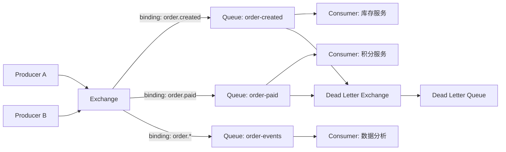
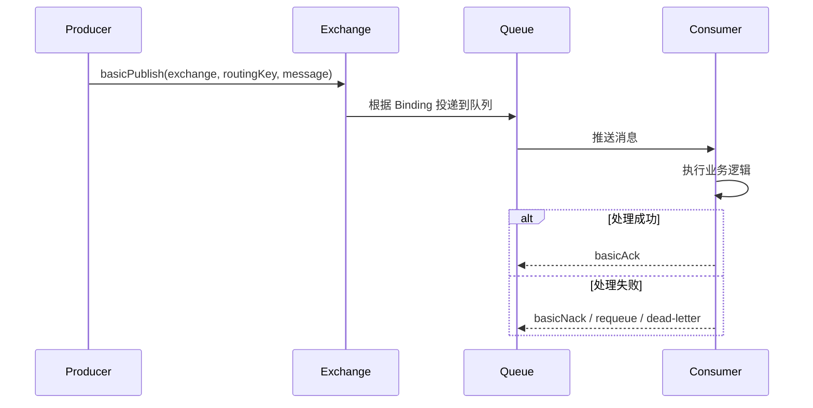
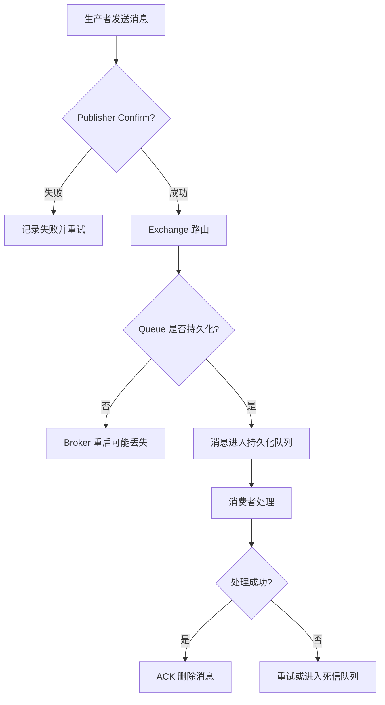
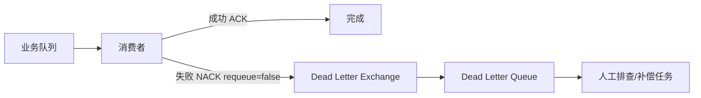
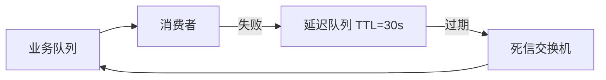
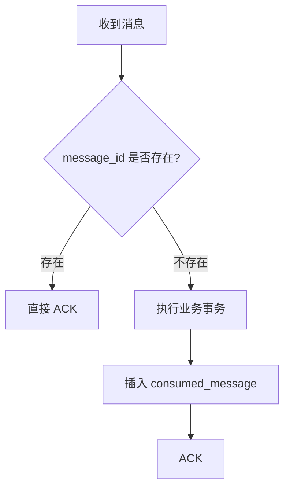
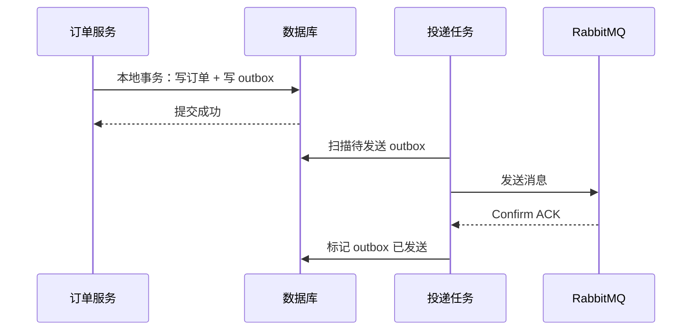

# 0. RabbitMQ 简介
> [!question] RabbitMQ 是什么？
> RabbitMQ 是一个实现 AMQP 协议的消息代理（Message Broker）。
> 它的核心职责是接收生产者发送的消息，根据路由规则投递到队列，再由消费者异步消费。

> [!summary] RabbitMQ 适合的场景
> - 订单创建后异步发送通知
> - 支付完成后触发积分、优惠券、发票等后续流程
> - 消费失败后延迟重试
> - 服务之间通过事件解耦
> - 削峰填谷，保护下游服务

# 1. RabbitMQ 架构
> [!important] 核心组件
> - **Producer**：生产者，负责发送消息
> - **Exchange**：交换机，负责根据路由规则分发消息
> - **Queue**：队列，负责保存消息
> - **Binding**：绑定关系，连接 Exchange 和 Queue
> - **Consumer**：消费者，从 Queue 中消费消息
> - **Routing Key**：路由键，用来匹配消息投递路径



## 1.1 消息投递流程


# 2. Exchange 类型
| 类型 | 路由方式 | 示例 |
| :---: | :---: | :---: |
| Direct | Routing Key 完全匹配 | `order.paid` |
| Fanout | 不看 Routing Key，广播到所有队列 | 系统通知 |
| Topic | 通配符匹配，`*` 匹配一个词，`#` 匹配多个词 | `order.*`、`user.#` |
| Headers | 按消息头匹配 | 复杂条件路由 |

> [!example] Topic Exchange 示例
> ```mermaid
> flowchart LR
>     P[Producer] --> E[Topic Exchange]
>     E -->|order.created| A[库存队列]
>     E -->|order.paid| B[积分队列]
>     E -->|order.#| C[数据分析队列]
>     E -->|user.#| D[用户事件队列]
> ```

# 3. 消息可靠性
> [!warning] RabbitMQ 可靠性要覆盖三段链路
> 1. Producer -> Broker：生产者确认（Publisher Confirm）
> 2. Broker 内部：队列和消息持久化
> 3. Broker -> Consumer：手动 ACK、失败重试、死信队列



## 3.1 持久化
> [!note] 三个地方都要注意
> - Exchange durable
> - Queue durable
> - Message persistent
>
> 只设置队列持久化还不够，消息本身也要设置为持久化。

## 3.2 ACK
> [!important] 为什么推荐手动 ACK？
> 自动 ACK 表示 RabbitMQ 一投递给消费者就认为成功。
> 如果消费者刚拿到消息就崩溃，消息会丢失。
>
> 手动 ACK 的语义是：消费者业务逻辑真正执行成功后，再确认消息。

## 3.3 死信队列
> [!note] 消息什么时候会变成死信？
> - 被消费者 `basicNack` 并且不重新入队
> - 消息 TTL 过期
> - 队列长度超过限制
> - 消费重试次数超过上限



# 4. 常见业务模型
## 4.1 异步任务
> [!example] 下单后发短信
> 下单接口只负责创建订单，然后发送 `order.created` 事件。
> 短信服务异步消费事件，不影响下单主链路。

## 4.2 发布订阅
> [!example] 支付成功事件
> `order.paid` 可以同时被多个系统消费：
> - 积分服务
> - 发票服务
> - 数据分析
> - 通知服务

## 4.3 延迟重试
> [!note] RabbitMQ 延迟重试思路
> 可以通过 TTL + 死信队列实现：
> 1. 消费失败后投递到延迟队列
> 2. 延迟队列设置 TTL
> 3. TTL 到期后消息进入业务队列
> 4. 重新消费



# 5. Ktor 示例
> [!example] Ktor + RabbitMQ Java Client
> Ktor 没有强绑定 RabbitMQ 的官方服务端插件，通常直接使用 RabbitMQ Java Client 或封装成自己的组件。

```kotlin
// build.gradle.kts
dependencies {
    implementation("io.ktor:ktor-server-core")
    implementation("io.ktor:ktor-server-netty")
    implementation("io.ktor:ktor-server-content-negotiation")
    implementation("io.ktor:ktor-serialization-kotlinx-json")
    implementation("com.rabbitmq:amqp-client:5.21.0")
}
```

## 5.1 连接管理
```kotlin
// RabbitProvider.kt
package com.example.rabbit

import com.rabbitmq.client.Channel
import com.rabbitmq.client.Connection
import com.rabbitmq.client.ConnectionFactory

object RabbitProvider {
    private const val EXCHANGE = "order.exchange"
    private const val ORDER_CREATED_QUEUE = "order.created.queue"
    private const val ROUTING_KEY = "order.created"

    private val factory = ConnectionFactory().apply {
        host = "localhost"
        port = 5672
        username = "guest"
        password = "guest"
    }

    private val connection: Connection = factory.newConnection("ktor-rabbitmq")

    init {
        newChannel().use { channel ->
            // durable = true，表示交换机和队列会在 Broker 重启后保留
            channel.exchangeDeclare(EXCHANGE, "topic", true)
            channel.queueDeclare(ORDER_CREATED_QUEUE, true, false, false, null)
            channel.queueBind(ORDER_CREATED_QUEUE, EXCHANGE, ROUTING_KEY)
        }
    }

    fun exchangeName(): String = EXCHANGE
    fun orderCreatedQueue(): String = ORDER_CREATED_QUEUE
    fun orderCreatedRoutingKey(): String = ROUTING_KEY
    fun newChannel(): Channel = connection.createChannel()

    fun close() {
        connection.close()
    }
}
```

## 5.2 生产者接口
```kotlin
// OrderRoutes.kt
package com.example.rabbit

import com.rabbitmq.client.MessageProperties
import io.ktor.http.*
import io.ktor.server.application.*
import io.ktor.server.request.*
import io.ktor.server.response.*
import io.ktor.server.routing.*
import kotlinx.serialization.Serializable
import kotlinx.serialization.encodeToString
import kotlinx.serialization.json.Json

@Serializable
data class CreateOrderRequest(val userId: Long, val productId: Long)

@Serializable
data class OrderCreatedEvent(
    val orderId: Long,
    val userId: Long,
    val productId: Long,
    val eventId: String
)

fun Application.orderRoutes() {
    routing {
        post("/orders") {
            val request = call.receive<CreateOrderRequest>()

            // 示例中直接生成订单 ID，真实项目应先写数据库
            val event = OrderCreatedEvent(
                orderId = System.currentTimeMillis(),
                userId = request.userId,
                productId = request.productId,
                eventId = java.util.UUID.randomUUID().toString()
            )

            val body = Json.encodeToString(event).toByteArray()

            val published = RabbitProvider.newChannel().use { channel ->
                // 开启 publisher confirm，确认 Broker 已收到消息
                channel.confirmSelect()
                channel.basicPublish(
                    RabbitProvider.exchangeName(),
                    RabbitProvider.orderCreatedRoutingKey(),
                    // PERSISTENT_TEXT_PLAIN 表示消息持久化
                    MessageProperties.PERSISTENT_TEXT_PLAIN,
                    body
                )

                // 示例中同步等待确认；生产环境可封装异步确认提升吞吐
                channel.waitForConfirms(5_000)
            }

            if (!published) {
                return@post call.respond(HttpStatusCode.ServiceUnavailable, "message publish failed")
            }

            call.respond(HttpStatusCode.Accepted, mapOf("orderId" to event.orderId))
        }
    }
}
```

## 5.3 消费者
```kotlin
// OrderConsumer.kt
package com.example.rabbit

import com.rabbitmq.client.DeliverCallback

class OrderConsumer {
    fun start() {
        val channel = RabbitProvider.newChannel()
        // 限制每个消费者一次只拿 10 条未 ACK 消息，避免消费者被压垮
        channel.basicQos(10)

        val deliverCallback = DeliverCallback { _, delivery ->
            val message = String(delivery.body)
            val tag = delivery.envelope.deliveryTag

            try {
                // 这里执行业务逻辑，例如扣减库存、发送通知等
                println("received order event: $message")

                // 业务成功后手动 ACK
                channel.basicAck(tag, false)
            } catch (ex: Exception) {
                // requeue=false 表示不重新入队，可配合死信队列处理失败消息
                channel.basicNack(tag, false, false)
            }
        }

        channel.basicConsume(
            RabbitProvider.orderCreatedQueue(),
            false, // autoAck=false，必须手动确认
            deliverCallback,
            { consumerTag -> println("consumer cancelled: $consumerTag") }
        )
    }
}
```

> [!warning] Ktor 中的注意点
> RabbitMQ Java Client 的部分 API 是阻塞式的。
> 如果在 Ktor 请求处理中做大量同步等待，应放到 `Dispatchers.IO` 或封装异步投递队列，避免阻塞事件循环。

# 6. SpringBoot 示例
> [!example] 依赖配置
```kotlin
// build.gradle.kts
dependencies {
    implementation("org.springframework.boot:spring-boot-starter-web")
    implementation("org.springframework.boot:spring-boot-starter-amqp")
}
```

```yaml
# application.yml
spring:
  rabbitmq:
    host: localhost
    port: 5672
    username: guest
    password: guest
    publisher-confirm-type: correlated
    publisher-returns: true
    listener:
      simple:
        acknowledge-mode: manual
        prefetch: 10
```

## 6.1 队列与交换机配置
```java
// RabbitConfig.java
package com.example.rabbit;

import org.springframework.amqp.core.Binding;
import org.springframework.amqp.core.BindingBuilder;
import org.springframework.amqp.core.Queue;
import org.springframework.amqp.core.TopicExchange;
import org.springframework.amqp.support.converter.Jackson2JsonMessageConverter;
import org.springframework.amqp.support.converter.MessageConverter;
import com.fasterxml.jackson.databind.ObjectMapper;
import org.springframework.context.annotation.Bean;
import org.springframework.context.annotation.Configuration;

@Configuration
public class RabbitConfig {
    public static final String ORDER_EXCHANGE = "order.exchange";
    public static final String ORDER_CREATED_QUEUE = "order.created.queue";
    public static final String ORDER_CREATED_ROUTING_KEY = "order.created";

    @Bean
    TopicExchange orderExchange() {
        // durable=true，Broker 重启后交换机仍然存在
        return new TopicExchange(ORDER_EXCHANGE, true, false);
    }

    @Bean
    Queue orderCreatedQueue() {
        // durable=true，Broker 重启后队列仍然存在
        return new Queue(ORDER_CREATED_QUEUE, true);
    }

    @Bean
    Binding orderCreatedBinding() {
        return BindingBuilder
                .bind(orderCreatedQueue())
                .to(orderExchange())
                .with(ORDER_CREATED_ROUTING_KEY);
    }

    @Bean
    MessageConverter messageConverter(ObjectMapper objectMapper) {
        // 使用 JSON 序列化消息体，便于跨语言消费和排查问题
        return new Jackson2JsonMessageConverter(objectMapper);
    }
}
```

## 6.2 生产者
```java
// OrderEvent.java
package com.example.rabbit;

public record OrderEvent(
        Long orderId,
        Long userId,
        Long productId,
        String eventId
) {}
```

```java
// OrderProducer.java
package com.example.rabbit;

import org.springframework.amqp.rabbit.core.RabbitTemplate;
import org.springframework.stereotype.Service;

import java.util.UUID;

@Service
public class OrderProducer {
    private final RabbitTemplate rabbitTemplate;

    public OrderProducer(RabbitTemplate rabbitTemplate) {
        this.rabbitTemplate = rabbitTemplate;
    }

    public void sendOrderCreated(Long orderId, Long userId, Long productId) {
        OrderEvent event = new OrderEvent(
                orderId,
                userId,
                productId,
                UUID.randomUUID().toString()
        );

        rabbitTemplate.convertAndSend(
                RabbitConfig.ORDER_EXCHANGE,
                RabbitConfig.ORDER_CREATED_ROUTING_KEY,
                event
        );
    }
}
```

```java
// OrderController.java
package com.example.rabbit;

import org.springframework.http.HttpStatus;
import org.springframework.web.bind.annotation.PostMapping;
import org.springframework.web.bind.annotation.RequestBody;
import org.springframework.web.bind.annotation.ResponseStatus;
import org.springframework.web.bind.annotation.RestController;

record CreateOrderRequest(Long userId, Long productId) {}

@RestController
public class OrderController {
    private final OrderProducer orderProducer;

    public OrderController(OrderProducer orderProducer) {
        this.orderProducer = orderProducer;
    }

    @PostMapping("/orders")
    @ResponseStatus(HttpStatus.ACCEPTED)
    public void createOrder(@RequestBody CreateOrderRequest request) {
        // 示例中省略数据库落单逻辑，真实项目应先写订单表
        Long orderId = System.currentTimeMillis();
        orderProducer.sendOrderCreated(orderId, request.userId(), request.productId());
    }
}
```

## 6.3 消费者
```java
// OrderConsumer.java
package com.example.rabbit;

import com.rabbitmq.client.Channel;
import org.springframework.amqp.core.Message;
import org.springframework.amqp.rabbit.annotation.RabbitListener;
import org.springframework.stereotype.Component;

@Component
public class OrderConsumer {
    @RabbitListener(queues = RabbitConfig.ORDER_CREATED_QUEUE)
    public void handle(OrderEvent event, Message message, Channel channel) throws Exception {
        long deliveryTag = message.getMessageProperties().getDeliveryTag();

        try {
            // 这里执行幂等业务逻辑，例如根据 eventId 做去重
            System.out.println("consume order event: " + event);

            // 业务处理成功后手动 ACK
            channel.basicAck(deliveryTag, false);
        } catch (Exception ex) {
            // requeue=false：不重新入队，避免失败消息无限循环
            channel.basicNack(deliveryTag, false, false);
        }
    }
}
```

## 6.4 生产者确认
```java
// RabbitTemplateConfig.java
package com.example.rabbit;

import org.springframework.amqp.rabbit.connection.CorrelationData;
import org.springframework.amqp.rabbit.core.RabbitTemplate;
import org.springframework.context.annotation.Configuration;

@Configuration
public class RabbitTemplateConfig {
    public RabbitTemplateConfig(RabbitTemplate rabbitTemplate) {
        // mandatory=true 时，消息无法路由到队列会触发 ReturnsCallback
        rabbitTemplate.setMandatory(true);
        rabbitTemplate.setConfirmCallback(this::confirm);
        rabbitTemplate.setReturnsCallback(returned -> {
            // 消息无法路由到任何队列时触发，例如 routing key 写错
            System.err.println("message returned: " + returned.getMessage());
        });
    }

    private void confirm(CorrelationData correlationData, boolean ack, String cause) {
        if (!ack) {
            // 生产环境应记录失败消息，并由补偿任务重试投递
            System.err.println("message publish failed: " + cause);
        }
    }
}
```

# 7. 幂等与事务
> [!warning] 消息重复是正常现象
> RabbitMQ + 手动 ACK 的系统中，如果消费者处理完业务但 ACK 之前宕机，消息会再次投递。
> 所以消费者必须幂等。

## 7.1 幂等表
```sql
CREATE TABLE consumed_message (
    message_id VARCHAR(64) PRIMARY KEY,
    consumed_at TIMESTAMP NOT NULL
);
```



## 7.2 本地消息表
> [!important] 解决“数据库成功但消息发送失败”
> 如果业务写数据库成功，但发送 MQ 失败，就会出现数据和消息不一致。
> 常见方案是本地消息表：
> 1. 在同一个数据库事务中写业务表和 outbox 表
> 2. 后台任务扫描 outbox 表并发送 MQ
> 3. 发送成功后标记为已发送



# 8. 最佳实践
> [!summary] RabbitMQ 使用建议
> - Exchange、Queue、Message 都要按可靠性要求持久化
> - 生产者开启 Publisher Confirm 和 Return Callback
> - 消费者使用手动 ACK
> - 消费失败不要无限 requeue，应进入重试队列或死信队列
> - 消费者必须幂等，不能假设消息只会到达一次
> - 设置 `prefetch` 控制单个消费者未 ACK 消息数量
> - 对业务消息增加 `eventId`、`traceId`、`createdAt`
> - 监控队列积压、消费失败率、死信数量、消费耗时
