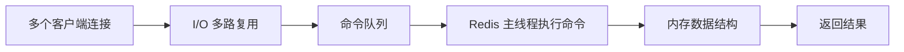
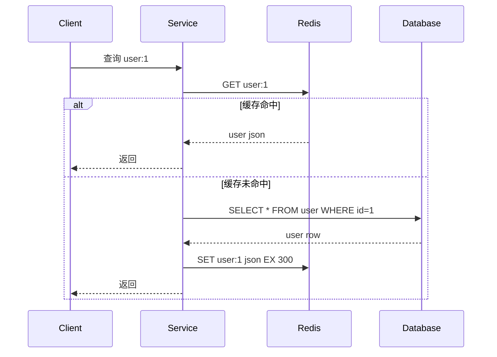
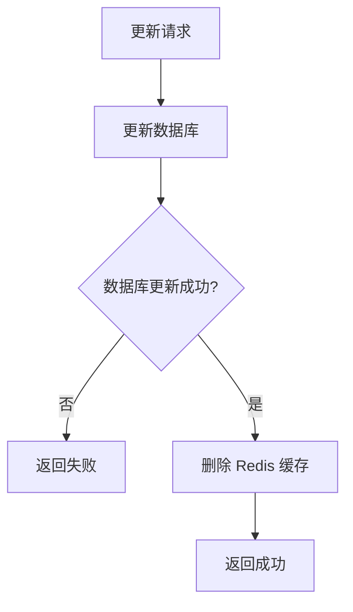
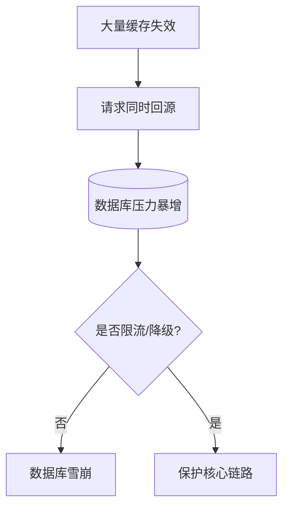
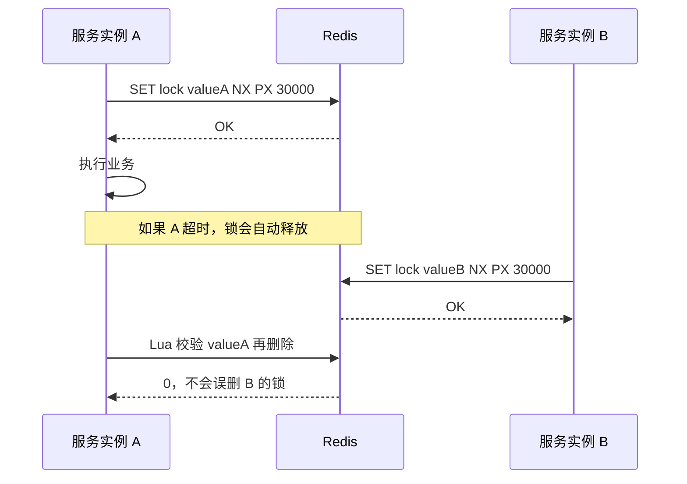
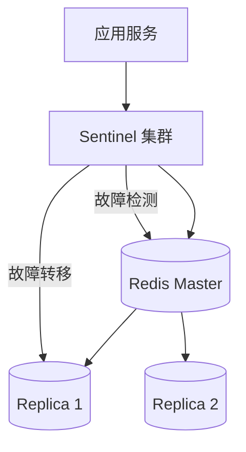
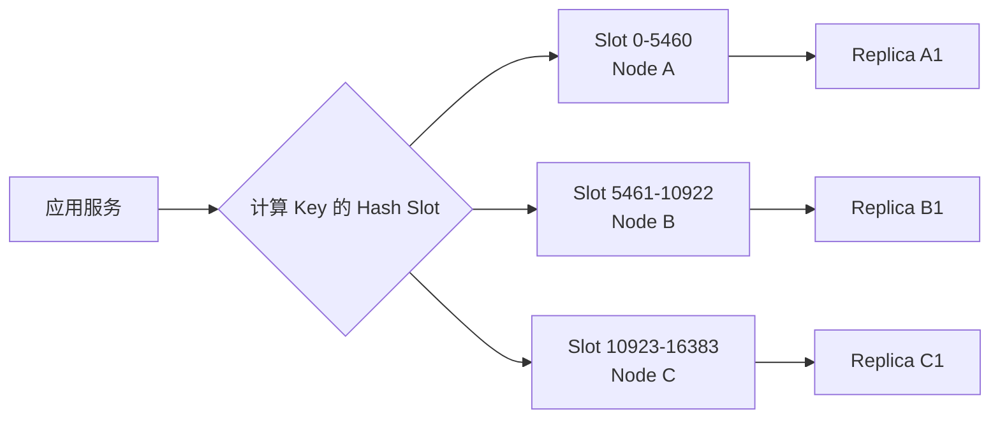

# 0. Redis 简介
> [!question] Redis 是什么？
> Redis 是一个基于内存的数据结构存储系统，常用于缓存、分布式锁、计数器、限流、排行榜、消息通知等场景。
>
> 它不是“简单的 key-value 数据库”，而是一个高性能的数据结构服务器。

> [!summary] Redis 常见用途
> - **缓存**：热点数据放内存，降低数据库压力
> - **分布式锁**：控制多个服务实例对共享资源的并发访问
> - **计数器**：点赞数、阅读数、接口调用次数
> - **限流**：按用户/IP/接口限制访问频率
> - **排行榜**：使用 Sorted Set
> - **会话存储**：保存 Token、验证码、临时状态
> - **发布订阅**：轻量级消息通知

# 1. Redis 架构
> [!important] Redis 在后端系统中的位置
> ```mermaid
> flowchart TD
>     A[客户端请求] --> B[后端服务]
>     B --> C{是否命中缓存?}
>     C -->|命中| D[(Redis)]
>     D --> E[返回数据]
>     C -->|未命中| F[(MySQL/PostgreSQL)]
>     F --> G[查询数据]
>     G --> H[写入 Redis<br/>设置 TTL]
>     H --> E
>
>     B --> I[分布式锁]
>     B --> J[限流计数]
>     B --> K[消息发布]
>     I --> D
>     J --> D
>     K --> D
> ```

## 1.1 单线程模型
> [!note] Redis 为什么快？
> Redis 的命令执行主要是单线程模型，但它仍然很快，原因是：
> - 数据主要在内存中
> - 单线程避免了复杂锁竞争
> - 使用 I/O 多路复用处理大量连接
> - 数据结构实现高度优化
>
> 注意：Redis 的持久化、网络 I/O 等部分在新版本中并不完全等同于“所有事情都单线程”，但命令执行仍然要避免慢操作。



## 1.2 常用数据结构
| 数据结构 | 常见命令 | 适合场景 |
| :---: | :---: | :---: |
| String | `GET` / `SET` / `INCR` | 缓存、计数器、验证码 |
| Hash | `HGET` / `HSET` | 用户对象、配置对象 |
| List | `LPUSH` / `BRPOP` | 简单队列 |
| Set | `SADD` / `SISMEMBER` | 去重、标签、关注关系 |
| Sorted Set | `ZADD` / `ZRANGE` | 排行榜、延迟任务 |
| Stream | `XADD` / `XREADGROUP` | 可靠消息流 |
| Bitmap | `SETBIT` / `BITCOUNT` | 签到、活跃统计 |
| HyperLogLog | `PFADD` / `PFCOUNT` | UV 估算 |

# 2. 缓存模式
## 2.1 Cache Aside
> [!important] 最常用的缓存模式
> Cache Aside 的流程是：
> 1. 先查 Redis
> 2. 命中直接返回
> 3. 未命中查数据库
> 4. 查询结果写回 Redis
> 5. 更新数据时先更新数据库，再删除缓存



## 2.2 缓存更新策略
> [!warning] 为什么通常是“更新数据库后删除缓存”？
> 如果先更新缓存，再更新数据库，中途失败会导致缓存和数据库不一致。
> 更常见做法是：
> - 先更新数据库
> - 再删除缓存
> - 下次查询重新回源加载



# 3. 缓存常见问题
## 3.1 缓存穿透
> [!note] 问题
> 请求的数据根本不存在，例如恶意请求 `user:-1`，每次都查不到缓存，然后打到数据库。
>
> 解决方案：
> - 缓存空值，并设置较短 TTL
> - 参数校验
> - 布隆过滤器

## 3.2 缓存击穿
> [!note] 问题
> 某个热点 Key 过期，大量请求同时打到数据库。
>
> 解决方案：
> - 热点 Key 不设置过短 TTL
> - 使用互斥锁，只允许一个请求回源
> - 后台主动刷新缓存

## 3.3 缓存雪崩
> [!note] 问题
> 大量 Key 同时过期，数据库瞬间承压。
>
> 解决方案：
> - TTL 加随机值
> - 多级缓存
> - 限流降级
> - Redis 集群高可用



# 4. 分布式锁
> [!important] 分布式锁的用途
> 当多个服务实例同时处理同一个资源时，需要保证同一时间只有一个实例执行关键逻辑。
> 例如：
> - 防止重复下单
> - 定时任务只由一个实例执行
> - 热点缓存重建只允许一个线程回源

## 4.1 基础实现
```text
SET lock:order:10001 requestId NX PX 30000
```

含义：
> - `NX`：只有 Key 不存在时才设置成功
> - `PX 30000`：锁 30 秒后自动过期，避免死锁
> - `requestId`：锁持有者标识，释放锁时必须校验

## 4.2 安全释放锁
> [!warning] 不能直接 DEL
> 如果业务执行超过锁过期时间，锁被别人重新拿到，此时旧线程再 `DEL`，会误删别人的锁。
> 正确做法是用 Lua 脚本保证“判断持有者 + 删除”原子执行。

```lua
-- unlock.lua
if redis.call("GET", KEYS[1]) == ARGV[1] then
    return redis.call("DEL", KEYS[1])
else
    return 0
end
```



# 5. Redis 高可用
## 5.1 主从复制与哨兵
> [!note] Sentinel 模式
> - 主节点负责写
> - 从节点复制主节点数据
> - Sentinel 监控主从状态
> - 主节点故障时自动选举新的主节点



## 5.2 Cluster 模式
> [!note] Redis Cluster
> Redis Cluster 通过 16384 个 Hash Slot 分片存储数据。
> Key 会被映射到某个 Slot，再由对应节点负责。



# 6. Ktor 示例
> [!example] Ktor + Lettuce 操作 Redis
> Lettuce 是常用的 Redis Java/Kotlin 客户端，支持同步、异步和响应式 API。

```kotlin
// build.gradle.kts
dependencies {
    implementation("io.ktor:ktor-server-core")
    implementation("io.ktor:ktor-server-netty")
    implementation("io.ktor:ktor-server-content-negotiation")
    implementation("io.ktor:ktor-serialization-kotlinx-json")
    implementation("io.lettuce:lettuce-core:6.3.2.RELEASE")
}
```

```kotlin
// RedisClientProvider.kt
package com.example.redis

import io.lettuce.core.RedisClient
import io.lettuce.core.api.StatefulRedisConnection

object RedisClientProvider {
    private val client: RedisClient = RedisClient.create("redis://localhost:6379")
    val connection: StatefulRedisConnection<String, String> = client.connect()

    fun close() {
        connection.close()
        client.shutdown()
    }
}
```

```kotlin
// UserRoutes.kt
package com.example.redis

import io.ktor.http.*
import io.ktor.server.application.*
import io.ktor.server.response.*
import io.ktor.server.routing.*
import kotlinx.coroutines.Dispatchers
import kotlinx.coroutines.withContext
import kotlinx.serialization.Serializable
import kotlinx.serialization.encodeToString
import kotlinx.serialization.json.Json

@Serializable
data class UserDto(val id: Long, val name: String)

class UserRepository {
    suspend fun findById(id: Long): UserDto? {
        // 示例中直接返回固定数据，真实项目应查询数据库
        return if (id == 1L) UserDto(1, "Alice") else null
    }
}

fun Application.userRoutes() {
    val redis = RedisClientProvider.connection.sync()
    val userRepository = UserRepository()

    routing {
        get("/users/{id}") {
            val id = call.parameters["id"]?.toLongOrNull()
                ?: return@get call.respond(HttpStatusCode.BadRequest, "invalid id")

            val cacheKey = "user:$id"
            val cached = withContext(Dispatchers.IO) {
                redis.get(cacheKey)
            }

            if (cached != null) {
                // 缓存命中，直接返回
                return@get call.respondText(cached, ContentType.Application.Json)
            }

            val user = userRepository.findById(id)
            if (user == null) {
                // 缓存空值，避免缓存穿透
                withContext(Dispatchers.IO) {
                    redis.setex(cacheKey, 60, "{}")
                }
                return@get call.respond(HttpStatusCode.NotFound)
            }

            val json = Json.encodeToString(user)
            // 设置随机 TTL 可以降低缓存雪崩概率
            withContext(Dispatchers.IO) {
                redis.setex(cacheKey, 300, json)
            }
            call.respondText(json, ContentType.Application.Json)
        }
    }
}
```

> [!warning] Ktor 中的注意点
> 上面为了突出 Redis 操作流程，使用的是 Lettuce 同步 API。
> 生产环境中更推荐使用 Lettuce 异步 API；如果必须使用同步 API，应像示例一样把阻塞调用放入 `Dispatchers.IO`，避免影响请求调度线程。

> [!example] Ktor 分布式锁示例
```kotlin
// RedisLock.kt
package com.example.redis

import io.lettuce.core.SetArgs
import java.util.UUID

class RedisLock {
    private val redis = RedisClientProvider.connection.sync()

    fun tryLock(key: String, ttlMillis: Long): String? {
        val requestId = UUID.randomUUID().toString()
        val result = redis.set(
            key,
            requestId,
            SetArgs.Builder.nx().px(ttlMillis)
        )
        return if (result == "OK") requestId else null
    }

    fun unlock(key: String, requestId: String): Boolean {
        val script = """
            if redis.call("GET", KEYS[1]) == ARGV[1] then
                return redis.call("DEL", KEYS[1])
            else
                return 0
            end
        """.trimIndent()

        val result: Long = redis.eval(
            script,
            io.lettuce.core.ScriptOutputType.INTEGER,
            arrayOf(key),
            requestId
        )
        return result == 1L
    }
}
```

# 7. SpringBoot 示例
> [!example] 依赖配置
```kotlin
// build.gradle.kts
dependencies {
    implementation("org.springframework.boot:spring-boot-starter-web")
    implementation("org.springframework.boot:spring-boot-starter-data-redis")
}
```

```yaml
# application.yml
spring:
  data:
    redis:
      host: localhost
      port: 6379
```

> [!example] RedisTemplate 配置
```java
// RedisConfig.java
package com.example.redis;

import com.fasterxml.jackson.databind.ObjectMapper;
import org.springframework.context.annotation.Bean;
import org.springframework.context.annotation.Configuration;
import org.springframework.data.redis.connection.RedisConnectionFactory;
import org.springframework.data.redis.core.RedisTemplate;
import org.springframework.data.redis.serializer.GenericJackson2JsonRedisSerializer;
import org.springframework.data.redis.serializer.StringRedisSerializer;

@Configuration
public class RedisConfig {
    @Bean
    RedisTemplate<String, Object> redisTemplate(
            RedisConnectionFactory connectionFactory,
            ObjectMapper objectMapper
    ) {
        RedisTemplate<String, Object> template = new RedisTemplate<>();
        template.setConnectionFactory(connectionFactory);

        // Key 使用字符串序列化，便于排查问题
        template.setKeySerializer(new StringRedisSerializer());
        template.setHashKeySerializer(new StringRedisSerializer());

        // Value 使用 JSON，避免 Java 默认序列化带来的可读性和兼容性问题
        var jsonSerializer = new GenericJackson2JsonRedisSerializer(objectMapper);
        template.setValueSerializer(jsonSerializer);
        template.setHashValueSerializer(jsonSerializer);

        template.afterPropertiesSet();
        return template;
    }
}
```

> [!example] 缓存查询接口
```java
// UserController.java
package com.example.redis;

import org.springframework.data.redis.core.RedisTemplate;
import org.springframework.web.bind.annotation.GetMapping;
import org.springframework.web.bind.annotation.PathVariable;
import org.springframework.web.bind.annotation.RestController;

import java.time.Duration;

record UserDto(Long id, String name) {}

@RestController
public class UserController {
    private final RedisTemplate<String, Object> redisTemplate;

    public UserController(RedisTemplate<String, Object> redisTemplate) {
        this.redisTemplate = redisTemplate;
    }

    @GetMapping("/users/{id}")
    public UserDto getUser(@PathVariable Long id) {
        String key = "user:" + id;
        Object cached = redisTemplate.opsForValue().get(key);

        if (cached instanceof UserDto user) {
            return user;
        }

        // 示例中直接构造数据，真实项目应查询数据库
        UserDto user = new UserDto(id, "Alice");

        // 写入缓存并设置过期时间
        redisTemplate.opsForValue().set(key, user, Duration.ofMinutes(5));
        return user;
    }
}
```

> [!example] SpringBoot 分布式锁
```java
// RedisLockService.java
package com.example.redis;

import org.springframework.data.redis.core.StringRedisTemplate;
import org.springframework.data.redis.core.script.DefaultRedisScript;
import org.springframework.stereotype.Service;

import java.time.Duration;
import java.util.List;
import java.util.UUID;

@Service
public class RedisLockService {
    private final StringRedisTemplate redisTemplate;

    public RedisLockService(StringRedisTemplate redisTemplate) {
        this.redisTemplate = redisTemplate;
    }

    public String tryLock(String key, Duration ttl) {
        String requestId = UUID.randomUUID().toString();
        Boolean success = redisTemplate.opsForValue()
                .setIfAbsent(key, requestId, ttl);
        return Boolean.TRUE.equals(success) ? requestId : null;
    }

    public boolean unlock(String key, String requestId) {
        String lua = """
                if redis.call('GET', KEYS[1]) == ARGV[1] then
                    return redis.call('DEL', KEYS[1])
                else
                    return 0
                end
                """;

        Long result = redisTemplate.execute(
                new DefaultRedisScript<>(lua, Long.class),
                List.of(key),
                requestId
        );
        return result != null && result == 1L;
    }
}
```

# 8. 最佳实践
> [!summary] Redis 使用建议
> - Key 命名要有业务前缀，例如 `user:profile:10001`
> - 热点缓存设置随机 TTL，避免同时过期
> - 禁止线上使用 `KEYS *`，用 `SCAN` 替代
> - 大 Key 要拆分，避免阻塞主线程
> - 缓存对象要控制大小，不要把 Redis 当文档数据库
> - 所有缓存都要考虑穿透、击穿、雪崩
> - 分布式锁必须设置过期时间，释放锁必须校验持有者
> - 高可用场景使用 Sentinel 或 Cluster，不要单点部署
