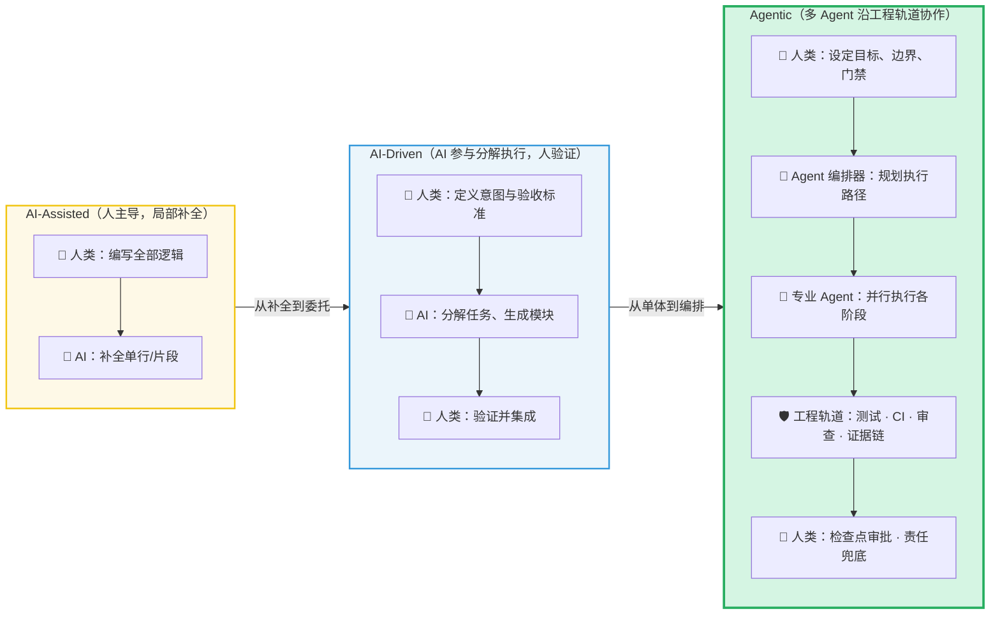
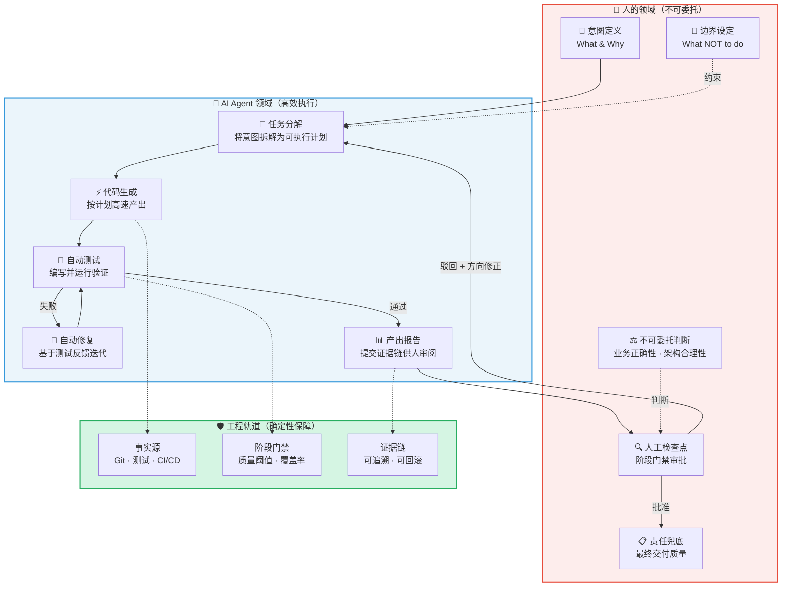
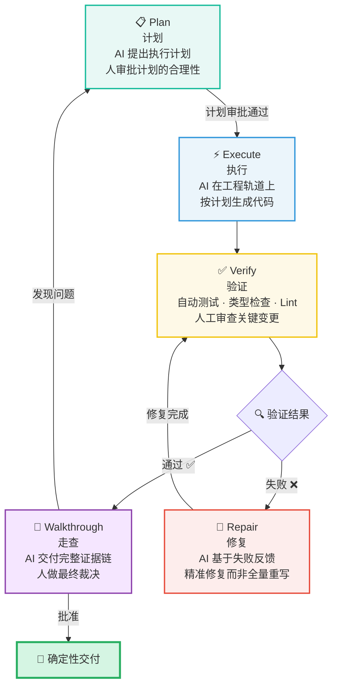

> [!abstract] 全文摘要
> [[AI]] 正在以前所未有的速度重塑代码生成的成本曲线——[[LLM]] 可以在数秒内输出数百行语法正确的代码，[[AI Agent]] 能自主分解任务、调用工具链、迭代修复。但一个尖锐的悖论随之浮现：**代码生成越快，交付反而越容易失控**。因为概率性输出的本质没有改变，而生成速度的提升成倍放大了选择、验证、整合与追溯的压力。
>
> 本文从工程哲学的高度，重新审视 AI 时代的编程范式。我们引入 [[AI-DLC]]（AI Development Lifecycle）框架——**`AI-DLC = Ɛ (人的判断 + AI 能力) = Engineering with Exsecutio`**——作为核心论点：人的判断是方向，AI 能力是加速度，工程化执行（Exsecutio）是保交付的确定性闭环。文章将完整梳理从 [[AI-Assisted]] → [[AI-Driven]] → [[Agentic]] 的范式转移，剖析"人的五件套"（意图、边界、不可委托判断、检查点、责任），并展示如何用 Exsecutio 的五步闭环（Plan → Execute → Verify → Repair → Walkthrough）将概率智能锁进确定性交付的轨道。
>
> 核心思想与工程框架深度参考并总结自开源图书《深入理解 AI-DLC》。

---

# 1. 引言：效率的错觉与"实现者困境"

## 1.1 代码变得廉价了，但交付并没有

2024 年之后，任何一个使用过 [[Cursor]]、[[Copilot]] 或 [[Claude Code]] 的开发者都体验过那种令人眩晕的效率飙升：一个模糊的意图描述，[[LLM]] 就能生成完整的函数实现、甚至整个模块的骨架代码。过去需要数小时的"打字劳动"，现在被压缩到了秒级。

但紧接着，你会发现自己陷入了另一个泥潭：

- 生成的代码**语法正确，语义偏离**——它"看起来像"你要的东西，但细看逻辑边界有三处错误。
- 你接受了第一版输出，花了两小时整合到项目中，然后发现它与现有模块的隐式约定冲突，**集成测试全红**。
- 你想回退到某个中间状态重新来过，却发现 AI 生成的是一次性大段落代码，**没有可追溯的中间决策点**。
- 你让 AI 修复报错，它确实修了，但同时悄悄改了另一个函数的行为，引入了**回归缺陷**。

> [!bug] "实现者困境"的 AI 时代变体
> 传统"实现者困境"是指：开发者太擅长把需求翻译成代码，却忽略了代码所栖身的系统是一个不断演化的生命体。在 AI 时代，这个困境有了一个更隐蔽的变体——**生成成本趋近于零，但验证成本、整合成本、追溯成本并没有降低，甚至因为代码量的暴增而成倍放大**。
>
> 代码生成的速度从"人手打字"跃迁到了"AI 喷涌"，但人类大脑理解代码、验证逻辑、判断正确性的带宽没有任何变化。**瓶颈没有消失，它只是从"生成"迁移到了"验证与整合"。**

这不是一个可以用"更好的 [[Prompt Engineering]]"来解决的问题。Prompt 优化能提高单次生成的命中率，但它无法解决系统级的确定性问题——因为你无法通过更精确的描述来消除概率模型的内在随机性。

## 1.2 真正的问题不是"AI 能不能写代码"，而是"如何把概率输出工程化"

LLM 的本质是一个概率模型。给定相同的输入，它在不同温度参数下会输出不同的代码；即使在零温度下，它的输出也受限于训练数据的分布和 Context Window（上下文窗口） 的约束。这意味着：

> [!warning] 概率智能的工程债务
> **没有经过工程化闭环验证的 AI 输出，本质上是一个"未经测试的第三方库"**——你不知道它的边界条件、异常行为和隐式假设。盲目信任它的输出，和盲目引入一个未经审计的开源依赖，风险等级完全相同。

那么出路在哪里？答案不是"用更聪明的 AI"，而是**用工程化的方法论来约束、验证和收编 AI 的概率输出**——把不确定性锁进确定性的闭环里。

这就是 AI-DLC 框架要回答的核心问题。

---

# 2. 范式破局：从"打字机"到"确定性交付系统"

## 2.1 三次范式跃迁

AI 在软件工程中的角色，并非一成不变。回溯过去三年的演进脉络，可以清晰地看到三次范式跃迁：

### 2.1.1 AI-Assisted：人是主体，AI 是"高级自动补全"

这是大多数人最熟悉的模式。开发者写一行注释，Copilot 补全函数体；开发者敲一半变量名，IDE 弹出建议。[[重新认识AI|AI]] 在这个阶段的角色本质上是一个**更聪明的打字机**——它降低了"翻译"的体力成本，但决策权、验证权、集成权完全在人手中。

> [!tip] AI-Assisted 的天花板
> 这个范式的核心瓶颈在于：**它只能加速你已经想清楚的事情**。如果你对需求的理解有偏差，AI 会以更快的速度帮你写出错误的代码。速度快了，方向错了，结果更糟。

### 2.1.2 AI-Driven：AI 参与分解，但人负责验证

进入 AI-Driven 阶段，开发者不再逐行指挥，而是给出**高层意图**（比如"实现一个支持分页和过滤的 REST API"），让 LLM 自主完成任务分解、模块设计和代码生成。人的角色从"编写者"转变为**"验证者"和"集成者"**。

这个阶段的关键变化是：[[AI]] 开始具备**任务分解能力**——它不再只是补全当前行，而是能把一个模糊的目标拆解成多个子任务并逐一执行。但问题也随之暴露：AI 的分解策略可能不是最优的，生成的代码可能满足字面要求但违反隐式约束（比如团队的编码规范、项目的架构约定），而**人必须逐一检查每一个产出**。

### 2.1.3 Agentic：多 Agent 沿工程轨道协作

第三个阶段——也是当前前沿探索的核心——是 Agentic 范式。在这个范式中，不再是单个 AI Agent 独自完成全部工作，而是**多个专业化 Agent 在工程化轨道上协作**：

- **规划 Agent** 负责将高层目标拆解为可执行的工程计划
- **编码 Agent** 负责按计划生成代码
- **测试 Agent** 负责编写和运行测试用例
- **审查 Agent** 负责对代码变更进行质量审查
- **编排器（Orchestrator）** 负责协调各 Agent 的工作流

> [!important] Agentic ≠ 无人值守
> Agentic 范式并不是把人从流程中移除，恰恰相反——**它要求人在更高的抽象层次上发挥更关键的作用**。人不再是代码的逐行编写者，而是系统的**目标定义者、边界设定者和最终责任承担者**。Agent 越自主，人对"方向正确性"和"不可委托判断"的要求就越高。
>
> 这正是 AI-DLC 框架要回答的问题：**在 Agent 自主性越来越强的时代，人应该如何重新定位自己的角色？**

## 2.2 核心公式：AI-DLC = Ɛ (人的判断 + AI 能力)

> [!important] AI-DLC 核心公式
> $$\text{AI-DLC} = \varepsilon \, (\text{人的判断} + \text{AI 能力}) = \text{Engineering with Exsecutio}$$
>
> 这个公式的每一个部分都不可省略：
>
> - **人的判断**：确定方向（做什么）、划定边界（不做什么）、定义验收标准（做到什么程度才算完）。这是不可替代的——[[重新认识AI|AI]] 不知道你的业务上下文、团队约束和长期技术愿景。
> - **AI 能力**：高速生成、任务分解、模式匹配、知识检索。这是放大器——它让人从"手动砌砖"跃迁到"设计蓝图后让机器施工"。
> - **Ɛ (Engineering / Exsecutio)**：工程化执行闭环。这是连接器——它把"人的判断"和"AI 能力"粘合为确定性交付。没有它，人的判断停留在脑中无法落地，AI 的能力沦为概率性的自说自话。
>
> **三者缺一：** 
> - 只有人的判断和 AI 能力，没有 Ɛ，产出的是"看起来对但没经过验证的代码"
> - 只有 AI 能力和 Ɛ，没有人的判断，产出的是"高效执行了错误方向的系统"
> - 只有人的判断和 Ɛ，没有 AI 能力，产出的是"正确但永远赶不上工期的传统交付"

## 2.3 为什么概率智能必须通过"工程轨道"转化

理解了核心公式，问题就变成了：**为什么不能让 AI 直接交付，而必须引入工程化闭环？**

答案藏在 LLM 的本质里。大语言模型是通过海量文本训练得到的概率模型，它的每一个输出都是"基于统计相关性的最佳猜测"。这意味着：

1. **它可能自信地说错话**（Hallucination）——语法完美、逻辑自洽、但事实错误
2. **它的输出不具备单调改进性**——修复一个 bug 可能引入另一个 bug
3. **它缺乏全局一致性保障**——多次独立生成的代码片段之间可能存在隐式冲突
4. **它没有"完成"的内在判断力**——AI 不知道自己什么时候真正完成了任务

> [!failure] AI 的"完成"≠ 工程意义上的"完成"
> 当 AI 说"已经完成了"，它的真实含义是"我生成了一段在统计意义上与你的需求描述最匹配的代码"。这与工程意义上的"完成"——**通过了所有测试、满足了所有验收标准、没有引入回归缺陷、代码可追溯可回滚**——之间存在巨大的鸿沟。
>
> **工程轨道（事实源、阶段门禁、证据链）存在的意义，就是填平这个鸿沟。**

所谓"工程轨道"包含三个核心要素：

- **事实源（Source of Truth）**：代码仓库、测试套件、CI/CD 流水线——这些是客观的、可执行的、不依赖 AI 自我评估的验证手段
- **阶段门禁（Stage Gates）**：每个阶段的进入和退出条件必须是可度量的——不是"AI 说完成了"，而是"所有测试通过且覆盖率不降低"
- **证据链（Evidence Chain）**：每一次 AI 生成、每一次人工决策、每一次测试结果都必须可追溯——当问题出现时，你能精确地定位是哪一步、哪个决策出了问题

---

# 3. 人的重塑：成为"裁判"与"门禁设计者"

## 3.1 告别"逐步提示"：从 Prompting 到 Propose-Validate

在 AI-Assisted 时代，开发者与 AI 的交互模式是**逐步提示（Prompting）**——人一步步描述需求，AI 一步步生成代码，人再一步步检查和修正。这个模式在 AI 只能做单行补全时是合理的，但在 Agentic 时代，它已经变成了一种**反模式**。

> [!warning] 逐步提示的反模式
> 当你能把一个复杂任务拆解为精确到每一步的指令时，你实际上已经完成了最难的部分——**设计和决策**。你让 AI 做的只是把你的决策翻译成代码，这等于退化回了 AI-Assisted 范式。你没有利用 AI 的任务分解能力，也没有获得 Agent 协作的杠杆效应。
>
> 更危险的是，逐步提示会让你产生一种**虚假的掌控感**——你以为自己在"控制"AI，实际上你只是在用更多的人工劳动替代 AI 本应承担的规划工作。这与 AI 时代的效率提升目标完全背道而驰。

正确的模式是**反向对话（AI Proposes, Human Validates）**：

1. **人定义意图和验收标准**（What & Done Criteria）
2. **AI 提出执行方案**（How & Plan）
3. **人审批方案或给出修正方向**（Gate & Redirect）
4. **AI 在工程轨道上执行**（Execute on Track）
5. **人基于证据做最终裁决**（Verify & Decide）

## 3.2 人的判断五件套

在 AI-DLC 框架中，人的角色被重新定义为五个不可委托的维度。它们共同构成了人在 AI 时代的"操作系统"：

### 3.2.1 意图（Intent）—— 指明目的地

> [!important] 意图 ≠ 需求文档
> 意图不是把 PRD（需求分析文档） 原文丢给 AI。意图是**你对"为什么要做这件事"的深层理解**——它的业务价值是什么？它服务于哪些用户场景？它的成功标准是什么？
>
> AI 能把"实现一个登录页面"执行得非常漂亮，但它无法告诉你"这个产品到底需不需要登录功能"。**方向错了，执行力越强，离正确结果越远。**

### 3.2.2 边界（Boundary）—— 划定不可逾越的红线

边界是"不做什么"的明确定义。它比"做什么"更重要，因为 AI 的本能是"尽可能多地生成"——你不告诉它停在哪里，它就会一直向外扩展。

- **技术边界**：不要引入新的外部依赖、不要改变现有的 API 契约、不要触碰核心支付模块
- **架构边界**：新增功能必须放在 `features/` 目录下、必须通过 Repository Pattern 访问数据层、不得在 Controller 中写业务逻辑
- **质量边界**：测试覆盖率不得低于当前基线、不能引入 any 类型、不能降低 CI/CD 流水线的通过率

### 3.2.3 不可委托判断（Non-delegable Judgment）—— AI 永远替你做不了的决定

有些判断，本质上只能由人来做：

- **业务正确性判断**：这段代码虽然语法正确、测试通过，但它对业务的理解是否准确？
- **架构合理性判断**：AI 提出的方案虽然能工作，但它是否符合系统的长期演进方向？
- **风险评估判断**：这个改动涉及支付模块，即使测试全绿，上线策略应该是什么？
- **取舍决策**：性能优化和开发效率之间如何权衡？短期方案和长期方案如何选择？

> [!tip] 判断的不可委托性
> 不可委托判断的本质是：**这些决策的后果由人承担，因此必须由人做出**。AI 可以提供决策所需的信息（分析、对比、预测），但最终拍板的那一瞬间，必须是人类的指纹。
>
> 这不是对 AI 的不信任，而是对**责任与权力对等**这一工程原则的坚守。

### 3.2.4 人工检查点（Human Checkpoint）—— 用门禁锁死漂移

人工检查点是工程化流程中的"阶段门禁"——在 AI 完成一个阶段性工作后，必须经过人的审批才能进入下一阶段。它的核心作用是**防止 AI 的输出在无人监督下持续漂移**。

典型的检查点设计：

| 检查点 | 触发条件 | 验证内容 | 决策选项 |
|:------:|:--------:|:--------:|:--------:|
| 计划审批 | AI 完成任务分解 | 方案合理性、边界合规性 | 批准 / 修正方向 / 重新分解 |
| 代码审查 | AI 完成编码 | 代码质量、架构一致性 | 批准合并 / 要求修改 / 驳回重做 |
| 集成验证 | 测试通过后 | 端到端行为、回归风险 | 准入测试 / 要求补充测试 |
| 上线决策 | 集成测试通过 | 业务验收、风险评估 | 灰度发布 / 全量发布 / 回退 |

### 3.2.5 责任（Accountability）—— 兜底者的清醒

> [!important] 责任不可委托
> 在 AI 写了 90% 代码的项目中，**对最终交付质量负 100% 责任的仍然是人类开发者**。这不是一个法律条文，而是一个工程事实：当线上出了事故，用户的愤怒指向的是产品和团队，不是写代码的模型版本号。
>
> 这意味着你必须对 AI 生成的每一行代码保持**最终裁决权**——不是每一行都亲自审查，而是确保有工程化的机制（测试、审查、门禁）来保障你能在需要时做出正确的判断。

---

# 4. 工程化执行 (Exsecutio)：用闭环锁死不确定性

## 4.1 执行不是"让 AI 持续生成"

许多人对 AI 编码的理解停留在一个危险的简化上：**"给 AI 一个需求，让它一直写，写完就完事了。"** 这种模式在 Vibe Coding 的娱乐场景下或许可以接受，但在工程交付中，它是一种灾难性的反模式。

> [!failure] "一直生成"模式的致命缺陷
> 1. **没有验证的生成是随机噪声**——AI 生成了一百行代码，其中九十五行正确、五行有微妙的逻辑错误。如果你不在每一步都验证，最终你面对的是一个"整体看起来对但有五个隐蔽 bug"的代码库。
> 2. **没有修复闭环的验证是无效反馈**——测试告诉你"第 47 行断言失败"，但如果没有机制把这个反馈喂回给 AI 并要求它修复，测试结果就是一堆无用的红色日志。
> 3. **没有证据链的交付是不可追溯的黑盒**——三天后发现线上有 bug，你想定位"这段代码是哪个 AI 在什么上下文下生成的"，却发现没有任何记录。

**Exsecutio（拉丁语，意为"贯彻执行"）** 就是为了解决这个问题而设计的。它不是一个复杂的方法论，而是一个朴素但严格的**五步闭环**：

## 4.2 Exsecutio 的五步闭环

### 4.2.1 Plan（计划）—— 先想清楚再动手

AI 接收到人的意图和边界后，首先输出的不是代码，而是一份**可审查的执行计划**：

- 要修改哪些文件？每个文件的修改策略是什么？
- 需要新增哪些测试？测试策略如何设计？
- 是否有潜在的风险点？对应的缓解措施是什么？
- 预计的执行步骤和时间线是什么？

> [!tip] 计划是人类的第一个门禁
> 这一步的核心价值不在于计划本身有多精确，而在于它**强制 AI 在动手之前先暴露思路**。人类可以在代码生成之前就发现方向性错误——修正一份计划的成本是五分钟，修正一堆错误代码的成本可能是五小时。

### 4.2.2 Execute（执行）—— 在轨道上高速推进

计划审批通过后，AI 进入执行阶段。但这不是"自由生成"——执行必须在预设的工程轨道上进行：

- **代码必须通过 Lint 和类型检查**——这是最基本的确定性保障
- **每次变更都必须产生可 diff 的 commit**——保证可追溯性
- **禁止 AI 一次性修改超过计划范围的文件**——防止"顺手牵羊"式的附带修改

### 4.2.3 Verify（验证）—— 测试失败是燃料，不是噪音

验证阶段的核心理念是：**测试失败不是错误，它是提高准确率的燃料**。

每一次测试失败都在告诉你一个精确的事实："这段代码在这个条件下产生了错误的行为。"这个信息比 AI 自己的任何"检查"都更有价值，因为它是**客观的、可执行的、不含幻觉的**。

验证包含三个层次：

|    层次     |            手段             |      判断标准       |
| :-------: | :-----------------------: | :-------------: |
| **自动化验证** | 单元测试 · 集成测试 · 类型检查 · Lint |  所有检查通过，覆盖率不降低  |
| **结构验证**  |       架构约束检查 · 依赖分析       | 未引入禁止的依赖关系或架构违规 |
| **人工验证**  |     关键变更的 Code Review     |  符合业务意图，无隐式风险   |

### 4.2.4 Repair（修复）—— 精准修复而非全量重写

当验证发现失败时，AI 进入修复阶段。这里有一个至关重要的原则：

> [!warning] 修复 ≠ 重写
> 修复是指"基于具体的失败信息，对现有代码做最小化修改以消除缺陷"。它**不是**"删掉之前生成的代码，从头再生成一遍"。
>
> 全量重写的风险在于：它可能修复了当前的 bug，但同时引入了全新的、未被测试覆盖的问题。这种"修复-引入-修复"的死循环是 AI 编码中最常见的效率黑洞。
>
> 正确的做法是：**把测试失败的具体信息（错误消息、断言差异、堆栈追踪）作为精确上下文喂给 AI，让它定位并修复特定的缺陷点**。这比"这段代码有问题，请重新写"要精确一百倍。

### 4.2.5 Walkthrough（走查）—— 没有证据的"完成"是幻觉

Walkthrough 是 Exsecutio 闭环的最后一步，也是最容易被跳过的一步。它的本质是：**AI 向人呈现一份完整的证据链，人基于证据做出最终裁决**。

一份合格的 Walkthrough 应该包含：

- **变更摘要**：修改了哪些文件，每个文件的修改目的是什么
- **测试结果**：完整的测试运行日志，包括新增测试和回归测试
- **风险说明**：这次变更可能影响的上下游模块，以及已采取的缓解措施
- **回滚方案**：如果上线后出现问题，如何快速回退

> [!important] Walkthrough 的哲学意义
> Walkthrough 的存在不只是为了"再检查一遍"。它的更深层意义是：**它强制 AI 将自己的"思考过程"外化为可审查的证据，从而让人能够基于事实而非信任来做决策**。
>
> 在没有 Walkthrough 的模式下，人对 AI 的信任是"盲信"——你只能选择相信或不相信它的"我完成了"。在有 Walkthrough 的模式下，人对 AI 的信任是"验证后的信任"——你可以看到它做了什么、为什么这么做、结果如何。**这是从概率信任到确定性信任的质变。**

## 4.3 闭环的闭合：Walkthrough 反馈回 Plan

Walkthrough 不一定意味着"通过"。如果人在走查过程中发现了 AI 未预见的问题，流程会回退到 Plan 阶段，重新进入闭环。这种**反馈-修正-再验证**的螺旋上升，是 Exsecutio 与"一直生成直到完成"模式的根本区别。

> [!tip] Exsecutio 的工程心法
> 1. **测试失败是提高准确率的燃料**——每一次失败都在缩小不确定性空间
> 2. **没有证据的"已完成"是 AI 的幻觉**——必须有可追溯的证据链
> 3. **修复不是重写**——精准修复，最小化变更范围
> 4. **人永远是最终裁决者**——AI 提供信息，人做判断
> 5. **闭环比开环贵，但比事故便宜一百倍**——前期多花十分钟做验证，后期少花十小时修 bug

---

# 5. 总结与展望：未来的开发者形态

## 5.1 开发者的身份转型

AI 时代正在倒逼开发者完成一次身份的根本转型。这不是渐进式的技能升级，而是一次角色定义的范式重写：

| 维度 | 传统开发者 | AI 时代开发者 |
|:----:|:----------:|:------------:|
| **核心工作** | 编写代码 | 定义意图与边界 |
| **价值来源** | 打字速度和语法熟练度 | 判断力、架构视野和系统思维 |
| **与 AI 的关系** | 使用 AI 辅助编码 | 指挥 Agent 编排执行 |
| **质量保障** | 手动测试 + Code Review | 设计门禁 + 证据链审查 |
| **责任范围** | 自己写的代码 | 系统的全部产出（含 AI 生成） |
| **身份隐喻** | 建筑工人 | 建筑师 + 质检总监 |

## 5.2 三个不可逆的趋势

1. **代码生成的商品化**：代码本身正在变成大宗商品——LLM 让代码生成的成本趋近于零，就像云计算让服务器变成了按需付费的资源。**纯编码能力的护城河正在以指数级速度消失。**

2. **工程判断力的稀缺化**：当代码变得廉价，**知道"写什么代码"和"怎么验证代码"的人变得极其稀缺**。系统设计能力、质量保障能力、风险评估能力——这些"看不见的技能"正在成为开发者最核心的竞争力。

3. **Agent 协作的常态化**：未来的开发团队不再是"五个人类开发者"，而是"两个人类 + 若干专业 Agent"。人类负责目标定义、边界设定和最终裁决；Agent 负责分解执行、自动化验证和持续交付。**能否高效地编排 Agent 而非事必躬亲，将成为区分普通开发者和架构师的关键分水岭。**

## 5.3 最终的哲学命题

> [!abstract] 从概率到确定性的工程哲学
> [[重新认识AI|AI]] 时代的一切工程挑战，归根结底都指向同一个命题：**如何把概率性的智能输出，转化为确定性的工程交付？**
>
> AI-DLC 框架给出的回答是：**人的判断设方向，AI 能力加速度，工程化执行保交付。**
>
> 这不是对 AI 的限制，恰恰是对 AI 能力的最大化释放——就像铁轨不是限制火车的自由，而是让火车能够以最大速度安全行驶的基础设施。Vibe Coding 不该是无序的概率狂欢，而应该是**有轨道的、可控的、可验证的确定性交付**。
>
> 未来的顶级开发者，不再是代码写得最快的人，而是**最善于把 AI 的概率能力约束在工程轨道中、使其产出可信赖的确定性结果的人**。

---

# 6. 参考来源与致谢

> [!abstract] 参考来源与致谢
> 本文的核心思想与工程框架深度参考并总结自开源图书《深入理解 AI-DLC》：
>
> - **项目地址**：[深入理解 AI-DLC - GitHub](https://github.com/mancbj/aidlc-book-baojun)
>
> AI-DLC 框架中的核心公式 `AI-DLC = Ɛ (人的判断 + AI 能力)`、人的五件套（意图、边界、不可委托判断、检查点、责任）、以及 Exsecutio 五步闭环（Plan → Execute → Verify → Repair → Walkthrough）等核心概念均源自该项目的工程思想体系。
>
> 特别感谢原作者 [@mancbj](https://github.com/mancbj) 及所有贡献者对 AI 时代软件工程方法论的探索与开源分享。本文在原始思想基础上进行了扩展解读与个人工程实践的融合诠释。
