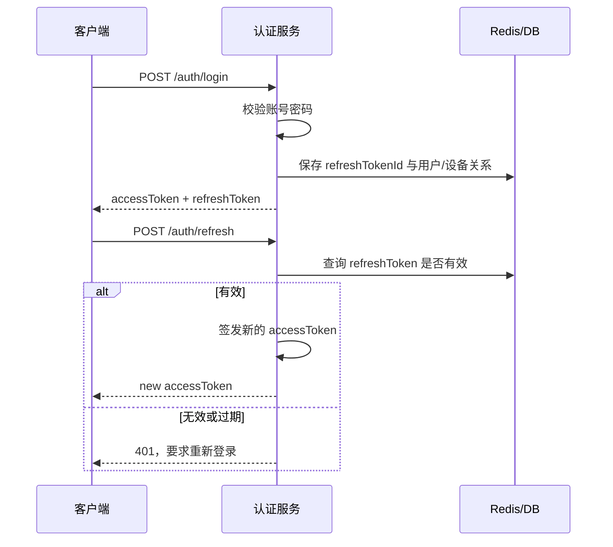

# 1. Token、Session、Cookie

> [!note] 引入
> 在当代，软件开发以Web应用为主，而提到 Web，我们就会想到 HTTP。众所周知，HTTP是无状态协议，那假如我们已经登录了一个网站，要用什么手段让浏览器知道当前登录的状态是我呢？这个时候，就需要一个特定的**标识**，来进行对应的匹配与确定。
>
> 传统的方案是让服务端保持会话状态，但是这样会导致服务端必须保存大量会话数据，并且在多实例部署时还要额外处理 Session 共享、过期、清理、故障转移等问题。

## 1.1 Cookie

> [!note] Cookie
>
> ## _概念_
>
> Cookie 是由服务器通过`Set-Cookie`响应头发送给浏览器，浏览器自动在后续请求中携带
>
> ## _特点_
>
> - 存储在客户端（浏览器）
> - 自动随请求发送（同域下）
> - 可设置过期时间、HttpOnly、Secure、SameSite
>
> ## _用途_
>
> 常用于存储**Session-ID**
>
> ## _举例_
>
> 用户登录后，服务器生成一个`session_id = "abc123"`，存入内存/缓存（Redis等），并通过`Set-Cookie: JSESSIONID=abc123`返回，浏览器下次的请求会自带`Cookie: JSESSIONID=abc123`，服务查session来确认身份

## 1.2 Session

> [!note] Session
>
> ## _概念_
>
> 服务端保存的用户会话数据（如userId、权限等）
>
> ## _特点_
>
> 依赖Cookie：通过Cookie中的Session ID关联
>
> ## _缺点_
>
> - 服务端需要存储用户状态 -> 不利于水平扩展（需要共享Session存储，如Redis）
> - 跨域、跨平台支持差（Android/iOS不自动管理Cookie）

## 1.3 Token

> [!note] Token
>
> ## _概念_
>
> Token是一个泛指的概念，指的是**一段字符串**，代表用户身份或者权限，由客户端主动携带（如放在Authorization Header）
>
> ## _特点_
>
> - **无状态**，即服务端无需存储
> - 客户端负责存储和发送（LocalStorage、SharedPreferences等）
> - 适用于前后端分离、移动端、微服务

对比上述三种方式：

|     特性     |       Cookie       |     Session      |     Token      |
| :----------: | :----------------: | :--------------: | :------------: |
|   存储位置   |  客户端（浏览器）  |      服务端      | 客户端（任意） |
| 是否自动发送 |     是（同域）     | 否（依赖Cookie） | 否（需要手动） |
|  服务端状态  |    无（仅存id）    |        有        |       无       |
|   跨域支持   | 差（需要跨域配置） |        差        |      良好      |
|  移动端友好  |         否         |        否        |       是       |
|    安全性    |    易受CSRF攻击    |  依赖Cookie安全  |  易受XSS攻击   |

# 2. Json Web Token（JWT）详解

## 2.1 基本内容

> [!question] 什么是JWT？
>
> ## _概念_
>
> JWT是一种基于 Json 的开放标准（RFC 7519），用于在各方之间安全地传递信息
>
> ## _特点_
>
> - 紧凑（Compact）：可通过URL、POST参数或HTTP头传输
> - 自包含（Self-contained）：携带了用户的基本身份信息和声明
> - 可验证（Verifiable）：签名保证数据未被篡改
>
> ## _典型场景_
>
> 用户登录后，服务器会发一个JWT，客户端每次请求都会携带这个Token，无需再次查询数据库做Session验证

> [!important] JWT的组成
> 一个典型的JWT结构如下：
> `xxxxxx.yyyyyy.zzzzzz`
> 各部分讲解：
>
> - Header（头部）：用于指定算法和类型
> - Payload（负载）：存放声明（Claims），如用户ID，过期时间等
> - Signature（签名）：保证前两部分不被篡改
>
> **需要注意**：Header 和 Payload 都需要做 Base64Url 编码
> `JWT = Base64Url(Header) + "." + Base64Url(Payload) + "." + Base64Url(Signature)`

## 2.2 JWT密钥与签名算法

> [!note] JWT Secret（密钥）
>
> ## _作用_
>
> 对称签名（HS256/HS384/HS512）中，Secret用于签发和验证Token
>
> ## _形式&长度_
>
> 高强度随机字节，建议 ≥ 256bits（32bytes）
> 常见的编码：
>
> - URL-Safe Base64：`9d6bXFMmZ3RV8Ytp9rz8QpKBuGV9zZ4T5vHSuJEjw8M`
> - Hex：`e75ab5c53266774557c62da7dacfc429281b8695f736784f9bc74ae24923c3c30`

> [!note] 签名算法（alg）
>
> - HS256：HMAC + SHA-256，对称加密（Shared Secret）
> - HS384：HMAC + SHA-384
> - HS512：HMAC + SHA-512
> - RS256：RSA + SHA-256，非对称加密（公钥/私钥对）
> - ES256：ECDSA + SHA-256，椭圆曲线数字签名算法
>
> 小项目常用 HS256；安全需求高可选 RS256（私钥签发、公钥验签）

## 2.3 工作流程（重要）

> [!important] JWT的工作流程
>
> 1. 用户**登录**（提供用户名和密码）
> 2. 服务器验证成功后，**签发**JWT
> 3. 客户端保存（LocalStorage/Cookie）
> 4. 后续请求携带JWT
> 5. 推荐：请求头`Authorization: Bearer <token>`
> 6. 服务器验证签名&检查声明（是否过期，是否有权限等）
> 7. 验证通过，返回对应的内容，反之则会报`401 Unauthorized`
>
> ```mermaid
> graph TD
>    subgraph 登录流程
>        A[用户登录<br/>提供用户名/密码] --> B[服务器验证成功]
>        B --> C[签发 JWT]
>    end
>
>    subgraph 客户端处理
>        C --> D[客户端保存<br/>LocalStorage / Cookie]
>        D --> E[后续请求携带 JWT]
>        E --> F[请求头: Authorization: Bearer <token>]
>    end
>
>    subgraph 验证流程
>        F --> G[服务器验证签名<br/>检查声明]
>        G --> H{验证通过?}
>        H -->|是| I[返回数据]
>        H -->|否| J[返回 401 Unauthorized]
>    end
>
>    style A fill:#e1f5fe
>    style I fill:#e8f5e8
>    style J fill:#ffebee
>    style C fill:#fff3e0
> ```

> [!important] 签名与认证（以HS256为例）
>
> ## _签名生成_
>
> 令：
>
> - H = Base64Url(Header)
> - P = Base64Url(Payload)
> - Secret = 服务器持有的密钥
>
> LaTex公式：`Signature = HMACSHA256(H + "." + P,Secret)`
>
> ## _验证流程_
>
> - 拆分为`Header.Payload.Signature`
> - 重新计算`HMACSHA256(H + "." + P,Secret)`
> - 对比结果：
>   - 相同 --> 数据未被篡改
>   - 不同 --> 拒绝访问

## 2.4 优缺点概览

|                优点                |                缺点                |
| :--------------------------------: | :--------------------------------: |
|          无状态，水平扩展          |    无法即时“撤销”已签发的 Token    |
| 携带信息自包含，无需多次查询数据库 |   Token 泄露风险大，需要妥善存储   |
|            支持跨域认证            | Payload 明文可读，敏感信息请勿存放 |

## 2.5 最佳实践方案--双 Token 模式

> [!note] 回顾
> 在了解 Token 登录后，我们马上会遇到一个新的问题：如果 Token 有效期很长，泄露后风险很大；如果有效期很短，用户又会频繁登录。
>
> 因此生产项目常用 **Access Token + Refresh Token** 的双 Token 模式。

> [!important] 双 Token 的职责划分
>
> - **Access Token**：短有效期，用于访问业务接口，例如 15 分钟
> - **Refresh Token**：长有效期，只用于刷新 Access Token，例如 7 天或 30 天
> - **服务端存储 Refresh Token 状态**：可存在 Redis / DB，用来支持退出登录、踢下线、设备管理
> - **Access Token 尽量无状态**：接口请求只验证签名和声明，不做频繁数据库查询

> [!important] 双 Token 架构图
>
> ```mermaid
> flowchart TD
>     A[用户登录] --> B[认证服务验证账号密码]
>     B --> C[签发 Access Token<br/>短期有效]
>     B --> D[签发 Refresh Token<br/>长期有效]
>     D --> E[(Redis/DB 保存 Refresh Token 状态)]
>     C --> F[客户端保存 Access Token]
>     D --> G[客户端安全保存 Refresh Token]
>
>     F --> H[访问业务接口]
>     H --> I{Access Token 是否有效?}
>     I -->|有效| J[返回业务数据]
>     I -->|过期| K[调用刷新接口]
>     G --> K
>     K --> L{Refresh Token 是否有效?}
>     L -->|有效| M[签发新的 Access Token]
>     L -->|无效| N[重新登录]
>     M --> F
> ```

> [!warning] 安全注意点
>
> - Payload 不要放密码、手机号、身份证等敏感信息
> - Access Token 有效期要短
> - Refresh Token 必须能撤销
> - 移动端应优先存入 Keychain / Keystore 等安全存储
> - Web 端如果放 Cookie，需要设置 `HttpOnly`、`Secure`、`SameSite`
> - 服务端要校验 `iss`、`aud`、`exp`、`nbf` 等声明

> [!note] 配置文件编写

```hocon
jwt {
  issuer = "med-collab-system"
  audience = "med-collab-api"
  realm = "med-collab-system"
  secret = "your-super-secret-key-must-be-at-least-256-bits-long"
  accessExpirationSeconds = 900
  refreshExpirationSeconds = 2592000
}
```

```yaml
jwt:
  issuer: "med-collab-system"
  audience: "med-collab-api"
  realm: "med-collab-system"
  secret: "your-super-secret-key-must-be-at-least-256-bits-long"
  access-expiration-seconds: 900
  refresh-expiration-seconds: 2592000
```

# 3. 实战案例

## 3.1 SpringBoot 示例

> [!example] 依赖配置

```kotlin
// build.gradle.kts
dependencies {
    implementation("org.springframework.boot:spring-boot-starter-web")
    implementation("org.springframework.boot:spring-boot-starter-security")
    implementation("com.auth0:java-jwt:4.4.0")
}
```

> [!example] JWT 工具类

```java
// JwtUtil.java
package com.example.auth;

import com.auth0.jwt.JWT;
import com.auth0.jwt.JWTVerifier;
import com.auth0.jwt.algorithms.Algorithm;
import com.auth0.jwt.interfaces.DecodedJWT;

import java.time.Instant;
import java.util.Date;

public class JwtUtil {
    private final String issuer;
    private final String audience;
    private final Algorithm algorithm;
    private final JWTVerifier verifier;

    public JwtUtil(String issuer, String audience, String secret) {
        this.issuer = issuer;
        this.audience = audience;
        this.algorithm = Algorithm.HMAC256(secret);
        this.verifier = JWT.require(algorithm)
                .withIssuer(issuer)
                .withAudience(audience)
                .build();
    }

    public String createAccessToken(Long userId, String role, long expireSeconds) {
        Instant now = Instant.now();
        return JWT.create()
                .withIssuer(issuer)
                .withAudience(audience)
                // subject 通常放用户唯一标识
                .withSubject(String.valueOf(userId))
                // 自定义声明，放权限、租户等非敏感信息
                .withClaim("role", role)
                .withIssuedAt(Date.from(now))
                .withExpiresAt(Date.from(now.plusSeconds(expireSeconds)))
                .sign(algorithm);
    }

    public DecodedJWT verify(String token) {
        // 校验签名、issuer、audience、过期时间
        return verifier.verify(token);
    }
}
```

```java
// JwtBeanConfig.java
package com.example.auth;

import org.springframework.beans.factory.annotation.Value;
import org.springframework.context.annotation.Bean;
import org.springframework.context.annotation.Configuration;

@Configuration
public class JwtBeanConfig {
    @Bean
    JwtUtil jwtUtil(
            @Value("${jwt.issuer}") String issuer,
            @Value("${jwt.audience}") String audience,
            @Value("${jwt.secret}") String secret
    ) {
        return new JwtUtil(issuer, audience, secret);
    }
}
```

> [!example] Spring Security 过滤器

```java
// JwtAuthenticationFilter.java
package com.example.auth;

import com.auth0.jwt.interfaces.DecodedJWT;
import jakarta.servlet.FilterChain;
import jakarta.servlet.ServletException;
import jakarta.servlet.http.HttpServletRequest;
import jakarta.servlet.http.HttpServletResponse;
import org.springframework.security.authentication.UsernamePasswordAuthenticationToken;
import org.springframework.security.core.authority.SimpleGrantedAuthority;
import org.springframework.security.core.context.SecurityContextHolder;
import org.springframework.web.filter.OncePerRequestFilter;

import java.io.IOException;
import java.util.List;

public class JwtAuthenticationFilter extends OncePerRequestFilter {
    private final JwtUtil jwtUtil;

    public JwtAuthenticationFilter(JwtUtil jwtUtil) {
        this.jwtUtil = jwtUtil;
    }

    @Override
    protected void doFilterInternal(
            HttpServletRequest request,
            HttpServletResponse response,
            FilterChain filterChain
    ) throws ServletException, IOException {
        String header = request.getHeader("Authorization");

        if (header != null && header.startsWith("Bearer ")) {
            String token = header.substring("Bearer ".length());
            DecodedJWT jwt = jwtUtil.verify(token);

            Long userId = Long.valueOf(jwt.getSubject());
            String role = jwt.getClaim("role").asString();

            // 将用户身份放入 Spring Security 上下文，后续 Controller 可直接获取认证信息
            var authentication = new UsernamePasswordAuthenticationToken(
                    userId,
                    null,
                    List.of(new SimpleGrantedAuthority("ROLE_" + role))
            );
            SecurityContextHolder.getContext().setAuthentication(authentication);
        }

        filterChain.doFilter(request, response);
    }
}
```

```java
// SecurityConfig.java
package com.example.auth;

import org.springframework.context.annotation.Bean;
import org.springframework.context.annotation.Configuration;
import org.springframework.security.config.annotation.web.builders.HttpSecurity;
import org.springframework.security.config.http.SessionCreationPolicy;
import org.springframework.security.web.SecurityFilterChain;
import org.springframework.security.web.authentication.UsernamePasswordAuthenticationFilter;

@Configuration
public class SecurityConfig {
    @Bean
    SecurityFilterChain securityFilterChain(HttpSecurity http, JwtUtil jwtUtil) throws Exception {
        return http
                .csrf(csrf -> csrf.disable())
                // JWT 是无状态认证，不需要服务端 Session
                .sessionManagement(session -> session.sessionCreationPolicy(SessionCreationPolicy.STATELESS))
                .authorizeHttpRequests(auth -> auth
                        .requestMatchers("/auth/login", "/auth/refresh").permitAll()
                        .anyRequest().authenticated()
                )
                .addFilterBefore(new JwtAuthenticationFilter(jwtUtil), UsernamePasswordAuthenticationFilter.class)
                .build();
    }
}
```

## 3.2 Ktor 示例

> [!example] 依赖配置

```kotlin
// build.gradle.kts
dependencies {
    implementation("io.ktor:ktor-server-auth")
    implementation("io.ktor:ktor-server-auth-jwt")
    implementation("com.auth0:java-jwt:4.4.0")
}
```

> [!example] JWT 配置与路由

```kotlin
// Security.kt
package com.example.auth

import com.auth0.jwt.JWT
import com.auth0.jwt.algorithms.Algorithm
import io.ktor.http.*
import io.ktor.server.application.*
import io.ktor.server.auth.*
import io.ktor.server.auth.jwt.*
import io.ktor.server.response.*
import io.ktor.server.routing.*
import java.util.Date

data class JwtConfig(
    val issuer: String,
    val audience: String,
    val realm: String,
    val secret: String,
    val accessExpirationSeconds: Long
)

fun JwtConfig.createAccessToken(userId: Long, role: String): String {
    val now = System.currentTimeMillis()
    return JWT.create()
        .withIssuer(issuer)
        .withAudience(audience)
        .withSubject(userId.toString())
        // 只放非敏感声明，敏感信息应从服务端查询
        .withClaim("role", role)
        .withIssuedAt(Date(now))
        .withExpiresAt(Date(now + accessExpirationSeconds * 1000))
        .sign(Algorithm.HMAC256(secret))
}

fun Application.configureJwt(config: JwtConfig) {
    install(Authentication) {
        jwt("auth-jwt") {
            realm = config.realm
            verifier(
                JWT.require(Algorithm.HMAC256(config.secret))
                    .withIssuer(config.issuer)
                    .withAudience(config.audience)
                    .build()
            )
            validate { credential ->
                // subject 是用户 ID，缺失时拒绝认证
                if (credential.payload.subject != null) {
                    JWTPrincipal(credential.payload)
                } else {
                    null
                }
            }
            challenge { _, _ ->
                call.respond(HttpStatusCode.Unauthorized, "Token is invalid or expired")
            }
        }
    }
}

fun Application.authRoutes(config: JwtConfig) {
    routing {
        post("/auth/login") {
            // 示例中省略账号密码校验，真实项目需要查询数据库并校验密码哈希
            val accessToken = config.createAccessToken(userId = 10001L, role = "USER")
            call.respond(mapOf("accessToken" to accessToken))
        }

        authenticate("auth-jwt") {
            get("/profile") {
                val principal = call.principal<JWTPrincipal>()!!
                val userId = principal.payload.subject
                val role = principal.payload.getClaim("role").asString()
                call.respond(mapOf("userId" to userId, "role" to role))
            }
        }
    }
}
```

## 3.3 Refresh Token 刷新流程

> [!note] 为什么 Refresh Token 要存服务端？
> Access Token 适合无状态校验，但 Refresh Token 必须支持撤销。
> 例如用户退出登录、修改密码、设备丢失时，服务端需要让旧 Refresh Token 失效。



> [!tip] 实战建议
>
> - Refresh Token 可以使用随机 UUID，也可以是 JWT，但都需要服务端记录状态
> - 每次刷新后可以轮换 Refresh Token，降低泄露风险
> - Redis Key 示例：`refresh:user:{userId}:device:{deviceId}`
> - 如果要实现“单设备登录”，刷新时删除同一用户其他设备的 Refresh Token 即可
