# 0. 引言：为什么开发者需要"架构思维"？

## 0.1 痛点：代码实现不等于系统交付

在日常开发中，我们经常会遇到这样的场景：一个看似简单的新需求，开发同学花了三天写完代码，自测通过后自信地提测。结果测试同学一跑，发现修改影响了三个看似毫不相关的模块，线上出了 P0 故障，全员回滚修复。

问题出在哪？不是代码写得不对，而是**写代码时只盯着眼前的一个点，没有看到系统这个面**。

这就是典型的"**实现者困境**"——我们太擅长把需求翻译成代码，却忽略了代码所栖身的系统是一个不断演化的生命体。每一行新代码都在改变系统的结构、耦合关系和运行时行为。当团队中每个人都只关注自己的一亩三分地时，日积月累，系统就会悄然走向腐化。

> [!warning] "屎山"是如何诞生的？
> 它从来不是一次灾难性的设计失误造成的，而是无数次"这里先凑合一下""后面再重构""这个逻辑放这里也行"的**微小妥协的累积**。缺乏大局观的开发，就像是蒙着眼砌墙——每一块砖都放得很稳，但整面墙可能是歪的。

## 0.2 核心观点：架构是一种思维方式

很多人认为架构是架构师的工作，普通开发者只需要实现功能就好。这是一种危险的误解。

> [!important] 架构的本质
> 架构不是文档、不是 UML 图、不是技术选型报告，而是一种**看待系统的方式**。

它要求我们在实现每一个功能时，脑子里同时装着几个问题：

- 这个改动会影响哪些模块？
- 如果将来业务变了，这里改起来方便吗？
- 别人接手这段代码，能看得懂、改得动吗？
- 如果这个服务挂了，系统会怎样？

优秀的开发者与普通开发者的分水岭，不在于谁写的代码更"高级"、谁用了更新潮的框架，而在于谁能在编码时**同时看到代码背后的系统**。前者在写代码，后者在设计系统。

这篇文章的目的，就是帮助你完成这次视角的跃迁——从"把功能跑通"到"构建可靠系统"，从"代码实现者"到"系统设计师"。

---

# 1. 建立大局观——跳出代码看系统

## 1.1 理解业务上下文：技术永远服务于业务

一个最常见的反模式是：**技术方案脱离业务场景**。

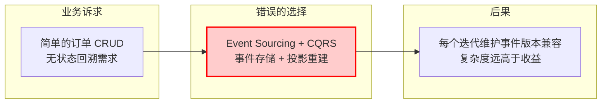

举一个真实例子。某团队在做订单系统的重构时，选择了 Event Sourcing + CQRS 架构，理由是"这架构先进、解耦彻底、业界都在用"。结果上线后发现：这个业务的核心场景就是简单的 CRUD，订单创建后几乎没有复杂的状态回溯需求。Event Sourcing 带来的事件存储、投影重建等复杂度，不仅没有带来价值，反而让团队每个迭代都需要花大量精力维护事件版本兼容。

这个问题的根源不是 Event Sourcing 不好，而是**没有理解自己的业务上下文**。

建立大局观的第一步，是问自己几个问题：

> [!question] 业务上下文三问
> - **这个模块在业务中的定位是什么？** 是核心链路还是边缘功能？这直接决定了它的可用性要求和投入产出比。
> - **业务会朝哪个方向演变？** 不需要猜测需求，但可以判断趋势。如果业务天然具有多变的规则（如营销活动、风控策略），那么设计时就该预留扩展点；如果业务非常稳定（如基础数据维护），那就不要过度抽象。
> - **谁在使用这个系统？** 内部运营工具和用户端核心链路的架构取舍截然不同。前者可以接受偶尔的不可用，后者需要 99.99% 的保障。

> [!tip] 一个实用的思考框架
> 在做任何技术决策前，先画出这个业务的核心流程图，标出哪些是"不变的部分"（如订单状态流转的基本节点），哪些是"可能变的部分"（如促销规则、审核流程）。然后问自己：我的设计方案，是让可变的部分更容易变，还是更困难？

## 1.2 识别非功能性需求（NFR）：功能跑通只是起点

多数开发者容易陷入一个思维习惯：**"需求说做什么，我就做什么。"** 需求文档要求"用户下单后发送通知"，那就实现一个发通知的功能。功能测试通过了，任务就算完成了。

但真正决定系统质量的，从来不是功能性需求，而是那些**没有写进需求文档的非功能性需求（Non-Functional Requirements, NFR）**。

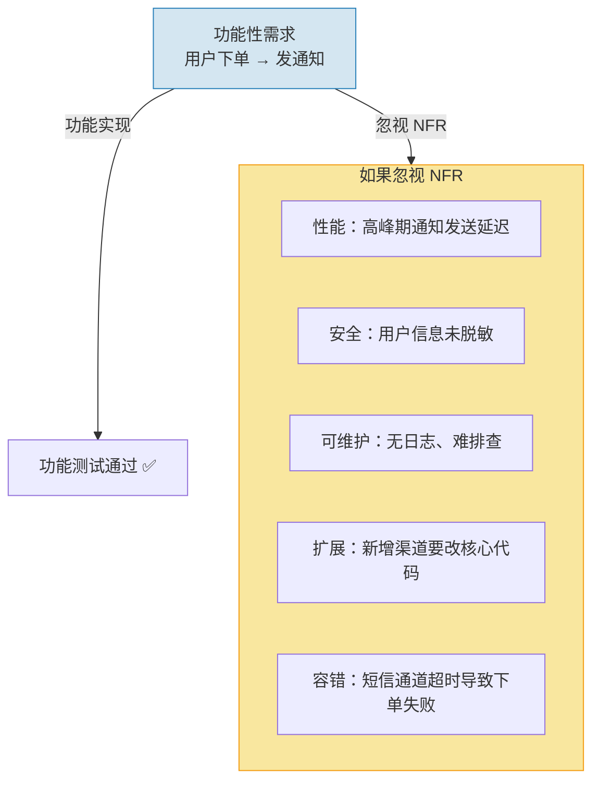

我们用一张对比表来看两种思维模式的差异：

> [!compare] 功能型开发者 vs 架构型开发者
> | 维度 | 只关注功能的开发者 | 有架构思维的开发者 |
> |------|-------------------|-------------------|
> | 性能 | "能跑就行" | "P99 延迟控制在 200ms 以内，高峰期 QPS 预估 5000" |
> | 安全 | "先上线再说" | "用户输入要校验、敏感字段要脱敏、接口要防重放攻击" |
> | 可维护性 | "写完任务就行了" | "三个月后别人能快速理解这段代码吗？日志能帮我快速定位问题吗？" |
> | 扩展性 | "当前需求就这样" | "如果明天要对接第三个通知渠道，需要改多少代码？" |
> | 容错性 | "外部服务不会挂" | "如果短信通道超时了，是阻塞主流程，还是降级处理？" |

> [!danger] 血的教训：支付回调没有幂等
> 某团队开发了一个支付回调接口，只验证了"回调参数是否正确"，没有做幂等处理。上线第一天，支付网关因网络抖动重发了三次回调，结果用户的账户被扣了三次款。
>
> 这就是典型的只关注"功能（接收回调并处理）"而忽略了 NFR（幂等性、可靠性）的代价。

**有架构思维的人，在实现每一个功能时都会自动在心里过一遍 NFR 检查清单**——这个改动影响性能吗？有安全风险吗？出错后能快速恢复吗？别人好理解吗？这些拷问，就是大局观在日常编码中的具体体现。

## 1.3 权衡的艺术：没有完美的架构，只有适合的妥协

新手最爱问："什么架构是最好的？" 而资深的架构师会说："没有最好的架构，只有最不坏的架构。"

**架构设计的本质是取舍（trade-off）**。每一次技术选型、每一个设计决策，都是在多个互相冲突的目标之间寻求平衡。

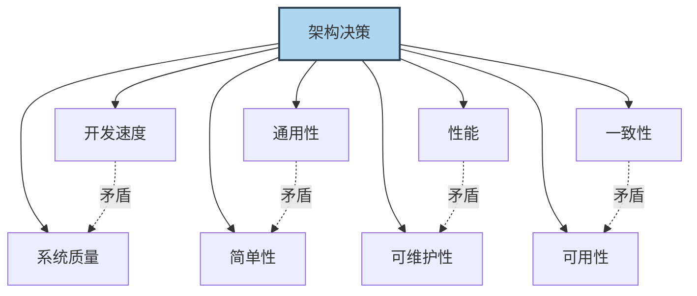

常见的需要权衡的维度包括：

| 维度 | 向左走 | 向右走 | 怎么选 |
|------|--------|--------|--------|
| **开发速度 vs. 质量** | 快速上线 MVP，少写测试 | 完整测试 + 监控，交付慢 | MVP 可接受技术债，但要**明确记下**并计划偿还 |
| **通用性 vs. 简单性** | 抽象出通用框架 | 针对当前需求硬编码 | 判断核心逻辑是否**确实会被多处复用** |
| **性能 vs. 可维护性** | 手写优化、内存管理 | 用成熟的方案，性能"足够好" | 99% 的场景下可维护性 > 极致性能 |
| **一致性 vs. 可用性** | 强一致（分布式事务） | 最终一致（补偿机制） | 扣款要强一致，点赞数可最终一致 |

> [!important] 权衡的关键：知道你在放弃什么
> 真正的"权衡能力"不是选择了一个方案就万事大吉，而是**清楚地知道被放弃的那条路径的成本是什么，并且这个成本是可控的、可接受的**。
>
> 如果你选择了快速交付而减少了测试覆盖，那就要接受线上可能会有更多 bug，并准备好快速响应机制。所有决策都有代价，**清醒地承担代价才是成熟的表现**。

> [!summary] 第一部分小结
> 建立大局观，意味着在写代码之前先问三个问题：业务场景是什么？NFR 要求有哪些？当前约束下怎么取舍最合理？这三点构成了架构思维的地基。

---

# 2. 核心设计原则在开发中的映射

## 2.1 边界感与模块化："高内聚低耦合"到底怎么落地？

"高内聚、低耦合"这句话几乎每个开发者都听过，但在日常开发中，它经常被理解为一句空洞的口号。我们先看一个典型的反面场景：

> [!warning] 没有边界的典型症状
> - 一个工具类 `Utils.java` 超过 3000 行，从时间格式化到加解密什么都有
> - 一个微服务既处理订单又管理用户积分还发送短信
> - 修改 A 模块的数据库字段，发现 B、C、D 模块都直接引用了这个字段
> - 新同学入职一个月，仍然搞不清某个功能应该在哪个服务里改

这些问题共同的根源是：**没有明确的边界意识**。

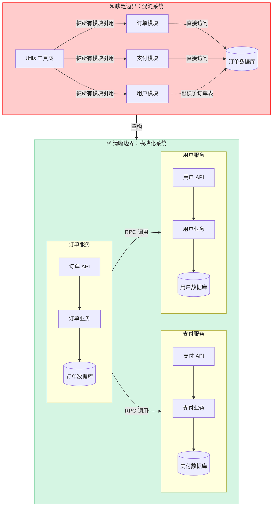

> [!note] 怎么才算"高内聚低耦合"？
> - **高内聚**：一个模块内部的东西都是**高度相关**的。订单模块只做订单相关的事，不掺合用户积分。
> - **低耦合**：模块之间通过**明确定义的接口**通信，不直接访问对方的内部数据。
>
> 衡量指标很简单：**这个模块能独立修改、独立测试、独立部署吗？**

在微服务架构中，边界划分有一经验法则：

| 错误做法 | 正确做法 |
|---------|---------|
| 按"表现层 / 业务层 / 数据层"切分 | 按**业务领域**切分（订单、支付、库存） |
| 为了"将来可能复用"而抽出一个通用服务 | 只有**确实存在多个消费者**时才抽离 |
| 多个服务共享一个数据库 | 每个服务拥有自己的数据存储 |
| 服务之间直接调用对方的数据库 | 服务之间通过 API 通信 |

> [!tip] 判断边界是否合理的实践方法
> 尝试回答这个问题：**"如果我要把这个模块完全重写，最小影响范围是多大？"**
>
> 如果答案是"只改这一个模块，不改调用方"，说明边界划得好。如果答案是"上下游都得跟着改"，说明耦合过重，该重新审视边界了。

## 2.2 接口即契约：设计稳定且易于扩展的 API

面向接口编程是消除耦合最有力的武器之一。其核心思想很简单：**"我要做什么"和"我怎么实现"是两件不同的事。**

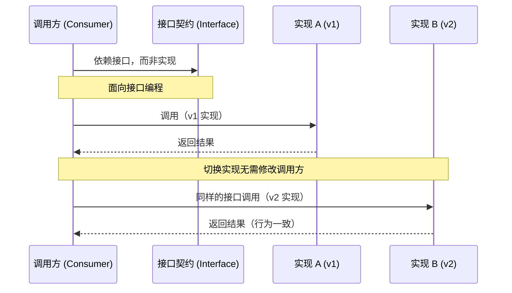

这个思想在架构中体现在各个层面：

> [!compare] 接口契约在不同层面的体现
> | 层面 | 表现形式 | 稳定的是什么 | 可以变的是什么 |
> |------|---------|-------------|---------------|
> | 微服务层 | RESTful / gRPC API | URL、请求/响应结构 | 内部实现逻辑 |
> | 模块层 | 服务类 Interface | 方法签名、语义 | 算法、数据源 |
> | 组件层 | SPI / 插件接口 | 扩展点定义 | 具体实现 |

设计好接口的关键原则：

> [!note] 接口设计的四个原则
> 1. **接口要稳定**：接口一旦发布，就像一份合同，不要轻易违约。不兼容的变更意味着所有调用方都需要修改。
> 2. **接口要精简**：接口数量越少越好、每个接口的职责越单一越好。一个接口超过 5 个方法就要警惕是否违反了单一职责。
> 3. **要留扩展余地**：使用开放式的数据结构（如 Map、扩展字段），而不是把所有字段都写死。这在 API 版本演进时至关重要。
> 4. **契约测试不可少**：接口的调用方和提供方都应对契约进行验证。Consumer-Driven Contract 测试（如 Pact）能有效防止接口不兼容的变更上线。

> [!example] 一个反例：脆弱的接口
> ```kotlin
> // ❌ 反例：接口定义过于僵硬
> fun sendNotification(title: String, content: String, userId: Long, channel: String)
> // 如果要新增参数（如优先级、定时发送），要么追加参数破坏签名，要么重载
> 
> // ✅ 正例：留有余地的接口
> data class NotificationRequest(
>     val title: String,
>     val content: String,
>     val userId: Long,
>     val channel: String,
>     val extras: Map<String, Any> = emptyMap()  // 扩展字段
> )
> fun sendNotification(request: NotificationRequest)
> // 新增字段只需在 Data Class 中加可选字段，不影响已有调用方
> ```

## 2.3 警惕过度设计：不要为了架构而架构

> [!danger] 你可能在过度设计的信号
> - 你的项目里有一个"抽象工厂""策略工厂""工厂的工厂"
> - 你的代码里有大量**目前没有任何实现类**的接口
> - 你花了一周时间搭建"通用框架"，真正写业务只用了半天
> - 你为了"将来可能用微服务"，先把一个几百行的代码拆成了十个服务

过度设计和没有设计一样糟糕。YAGNI（You Aren't Gonna Need It）原则告诉我们：**永远不要为当前不需要的功能编写代码。**

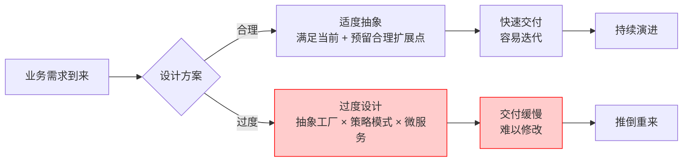

那么，如何在"为未来留余地"和"过度抽象"之间找到平衡？这里有一个实用的判断尺度：

> [!tip] 什么时候该抽象，什么时候不该？
> | 场景 | 该抽象 | 不该抽象 |
> |------|--------|---------|
> | 你已经写了三遍相似的代码 | ✅ 提取公共逻辑 | ❌ 造一个通用的"业务规则引擎" |
> | 需求明确说明"未来需要对接多个供应商" | ✅ 定义供应商 SPI 接口 | ❌ 先实现"支持热插拔"的动态加载框架 |
> | 一个简单的 if-else 分支 | ✅ 保持原样 | ❌ 用策略模式重构"以防将来" |
> | 你确信某个逻辑不会再变了 | ✅ 直接实现 | ❌ 坚持要加一层接口"方便测试" |
>
> **判断准则：用一个代码逻辑出现三次作为抽象的最低门槛。** 两次是巧合，三次才是规律。

> [!important] 一句话区分
> - **为未来留余地** = 在简单实现中预留一个扩展点（比如上面例子中的 `extras: Map`）
> - **过度抽象** = 为这个扩展点编写了一套完整的框架代码

> [!summary] 第二部分小结
> - 好的边界让模块可独立修改、测试、部署
> - 接口即契约，稳定精简的 API 是系统长期健康的关键
> - 在抽象上做减法，在扩展点上做预留，过度设计比设计不足更危险

---

# 3. 构建可靠性——把防御写进基因里

## 3.1 防御性编程：永远不要信任外部输入

有一句经典的系统设计格言：**"Everything that can go wrong will go wrong."**

在软件开发中，这意味着：

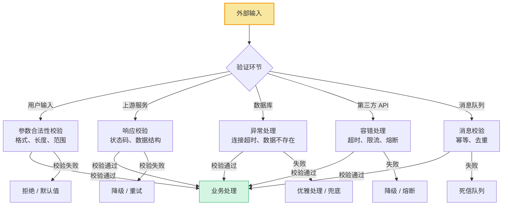

> [!warning] 常见的"信任陷阱"
> ```kotlin
> // ❌ 反例：信任上游传过来的所有数据
> fun processOrder(order: Order) {
>     val price = order.price!!  // 假设 price 一定不为 null
>     db.save(order)              // 假设数据库一定不会超时
>     sms.send(order.userPhone)   // 假设 phone 格式一定正确
> }
> 
> // ✅ 正例：防御性编程
> fun processOrder(order: Order) {
>     requireNotNull(order.price) { "price must not be null" }
>     require(order.price > 0) { "price must be positive" }
>     require(validatePhone(order.userPhone)) { "invalid phone" }
>     
>     try {
>         db.save(order)
>     } catch (e: DatabaseException) {
>         logger.error("订单保存失败，加入重试队列", e)
>         retryQueue.enqueue(order)
>         throw e  // 或返回兜底响应
>     }
> }
> ```

## 3.2 面向失败设计（Design for Failure）

在分布式系统中，有一个非常关键的心态转变：**不要假设任何事情是可靠的。** 网络可能延迟、服务可能宕机、磁盘可能写满、第三方 API 可能超时——把这些看作常态，而不是异常。

> [!question] 面向失败设计要回答的问题
> - 如果这个下游服务返回 500，我的系统怎么办？
> - 如果请求量突然暴涨 10 倍，系统会怎样？
> - 如果 Redis 缓存集群挂了，我的服务还能正常工作吗？
> - 如果我在修复 bug 期间，用户发生了异常操作，数据会不一致吗？

面向失败设计的核心机制可以用下面的状态机来理解：

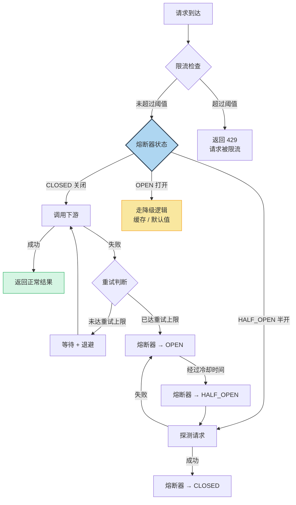

> [!important] 面向失败设计的三个层次
> **第一层：重试（Retry）**
> - 适用场景：瞬时故障（网络闪断、连接池满）
> - 要点：必须配合退避策略（Exponential Backoff），防止重试风暴
> - 反例：失败后立即重试 3 次，等于给已经过载的系统又踹了三脚
>
> **第二层：熔断（Circuit Breaker）**
> - 适用场景：持续故障（下游服务宕机、慢查询）
> - 要点：快速失败，给下游恢复的时间
> - 模式：CLOSED（正常）→ OPEN（断开）→ HALF_OPEN（探测恢复）
>
> **第三层：降级（Degradation）**
> - 适用场景：部分能力不可用时的优雅兜底
> - 要点：核心功能不受影响，边缘功能可牺牲
> - 示例：推荐服务挂了 → 返回热门榜单缓存；评论服务挂了 → 不阻塞下单

> [!example] 工作中的降级实践
> ```kotlin
> // 场景：商品详情页依赖多个数据源
> fun getProductDetail(productId: Long): ProductDetail {
>     // 核心数据——从主库获取，失败则直接报错
>     val baseInfo = primaryDb.getProduct(productId)
>     
>     // 非核心数据——可降级
>     val recommendations = try {
>         recommendService.getRecommendations(productId)
>     } catch (e: Exception) {
>         logger.warn("推荐服务不可用，返回空列表", e)
>         emptyList()  // 降级：推荐为空，不影响主流程
>     }
>     
>     val reviews = try {
>         reviewService.getReviews(productId)
>     } catch (e: Exception) {
>         logger.warn("评论服务不可用，返回缓存", e)
>         cache.getCachedReviews(productId)  // 降级：返回旧缓存
>     }
>     
>     return ProductDetail(baseInfo, recommendations, reviews)
> }
> ```

## 3.3 可观测性建设：让系统主动"说话"

很多时候，系统出问题不可怕，可怕的是**出了问题你不知道**，或者**你知道出问题了，但完全不知道问题出在哪**。

可观测性（Observability）就是解决这个问题的。它包括三个核心支柱：

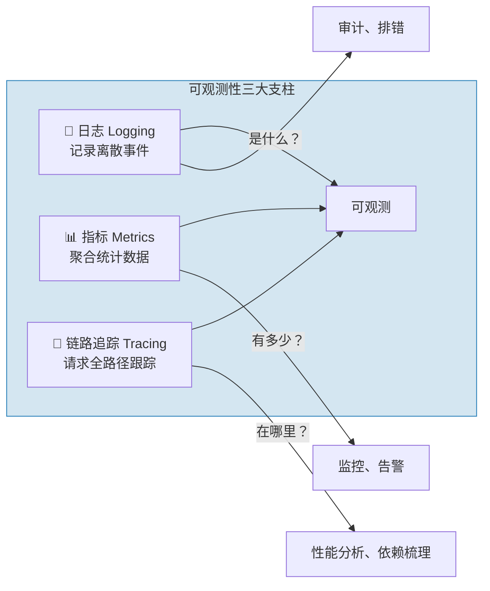

> [!compare] 三大支柱的定位
> | 维度 | 日志（Logging） | 指标（Metrics） | 链路追踪（Tracing） |
> |------|----------------|----------------|-------------------|
> | 数据类型 | 文本事件 | 时序聚合数据 | 请求级链路 |
> | 典型工具 | ELK、Loki | Prometheus、Grafana | Jaeger、Zipkin |
> | 回答的问题 | 这个请求报了什么错？ | 系统当前 QPS/延迟/错误率是多少？ | 这个请求经过了哪些服务？哪一步最慢？ |
> | 存储量 | 大 | 小 | 中 |
> | 适合的场景 | 异常排查、审计 | 实时监控、告警 | 性能瓶颈分析、依赖梳理 |

对于日常开发，可观测性建设可以落到具体的编码规范上：

> [!note] 日志规范三条黄金法则
> 1. **有层次的日志**：`ERROR`（系统不可用）→ `WARN`（预期之外的状况）→ `INFO`（关键业务流程）→ `DEBUG`（调试细节），不要所有日志都用 `INFO`
> 2. **可搜索的日志**：关键信息（订单 ID、用户 ID、请求 TraceId）一定要出现在日志里。没有上下文的日志等于没写
> 3. **可理解的日志**：一条日志应该让值班的同学不需要翻代码就能大致明白发生了什么：
>    - ❌ `Update failed: null`
>    - ✅ `订单[ORD-20240506-001] 支付状态更新失败：支付网关返回超时 (orderId=123, userId=456, traceId=abc-def)`

> [!warning] 没有可观测性的代价
> 想象你接手了一个线上告警："订单成功率跌到 50%"。没有链路追踪、没有结构化日志、没有监控大盘。
>
> 你只能一台台机器登录上去 `tail -f` 日志。半小时后你终于在几十 G 的日志里找到了一个 `NullPointerException`，但日志里没有订单号，没有调用堆栈。你完全不知道这是哪个场景触发的。
>
> 这就是在**盲飞**。可观测性不是锦上添花，而是生产系统的必备基础设施。

> [!summary] 第三部分小结
> - 防御性编程：永远不要信任输入，永远要做好最坏的打算
> - 面向失败设计：重试 + 熔断 + 降级，让系统在故障中仍然可用
> - 可观测性：日志、指标、链路追踪，让系统主动告诉你它怎么了

---

# 4. 结语：架构是演进而来的

## 4.1 好的架构不是画出来的

很多人有一个误区：认为好的架构是在项目开始时由架构师"画"出来的——画好一张完美的架构图，然后开发团队照着实现就好。

但我见过太多这样的故事：

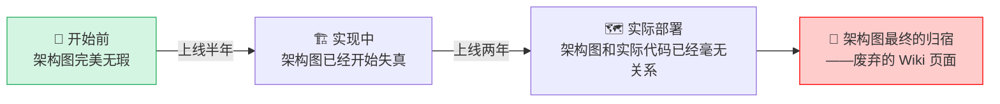

**架构不是静态的设计图，而是活的结构。** 真正的架构是在持续的迭代中，通过无数次小小的重构、调整、进化和学习，逐步塑造成形的。

## 4.2 重构是架构演进的发动机

如果承认架构是演进的，那么重构就不是"代码洁癖"，而是**架构治理的核心手段**。

> [!tip] 日常重构三问
> 每次修改代码时，问自己三个问题：
> 1. **我让代码更好了吗？**—— 修改后代码的可读性、可维护性是提升了还是下降了？
> 2. **我留下了备用的"逃生门"吗？**—— 如果这次修改有问题，能快速回滚吗？
> 3. **我留下记录了吗？**—— 其他人能通过 commit message 或注释理解我为什么这么改吗？

> [!important] 避免"重构陷阱"
> - ❌ "我先不管代码多烂，把功能做出来，后面再统一重构" → **后面永远不会到来**
> - ✅ "每次修改都顺手把周围代码**整理得比来的时候更干净一点**"（童子军军规）
> - ❌ "我们停下来一个月专门重构" → **业务不会等你，风险极高**
> - ✅ "重构融入到每次迭代中，每次改动都带走一些技术债"

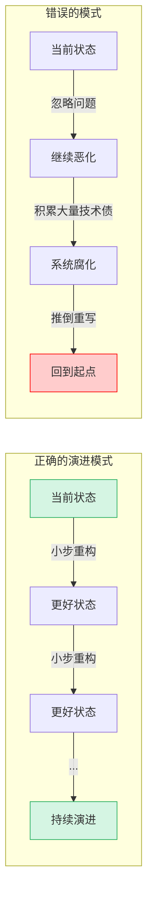

## 4.3 从"砖瓦匠"到"系统设计师"

回到文章最开始的问题：为什么开发者需要架构思维？

因为**每一行代码都在塑造系统的未来**。

- 当你选择了清晰的命名而不是模糊的缩写，你就在塑造可维护性
- 当你主动处理了异常边界而不是放任崩溃，你就在塑造可靠性
- 当你思考了接口的扩展性而不是硬编码当前需求，你就在塑造扩展性
- 当你记录了上下文和设计决策而不是匆匆提交，你就在塑造团队效率

> [!summary] 最后的升华
> 你写下的每一行代码，**要么是在构建一个可靠系统，要么是在往屎山上又添了一铲土。** 没有中间状态。架构思维不是某个周末学来的技能，而是在每一次编码决策中刻意练习的**视角**。
>
> 从今天开始，试试在每次写完代码后，多花五分钟问自己一个问题：
>
> > **"如果半年后有个新人来看我今天写的代码，他能快速理解并安全地修改它吗？"**
>
> 如果你的答案是"Yes"，那么恭喜，你已经走在从"系统构建砖瓦匠"到"系统设计师"的路上了。


