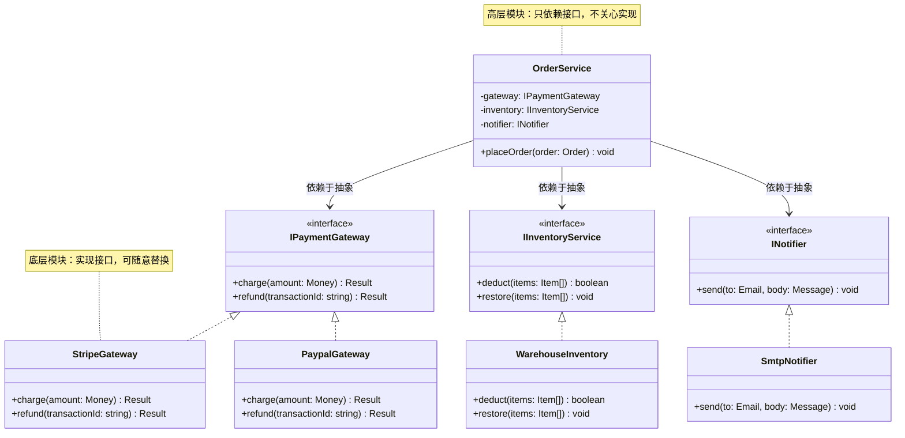
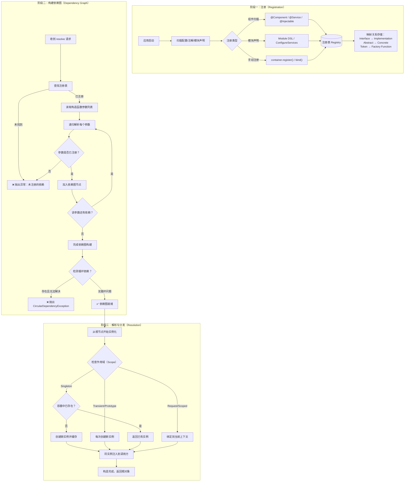
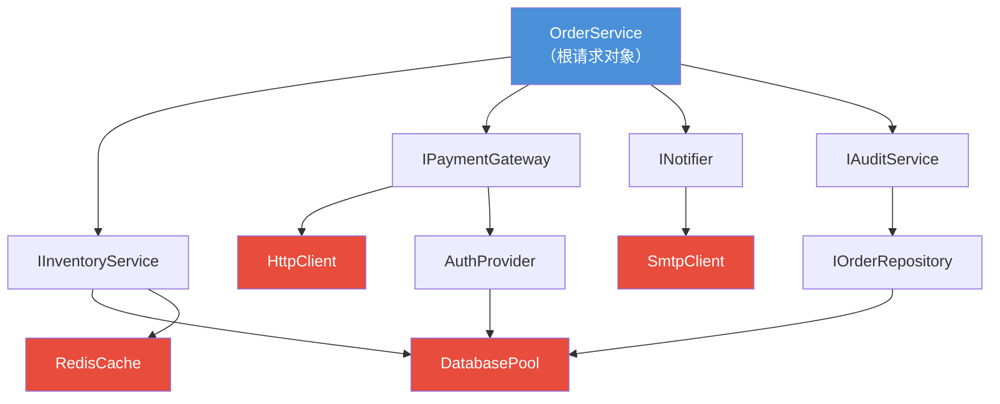
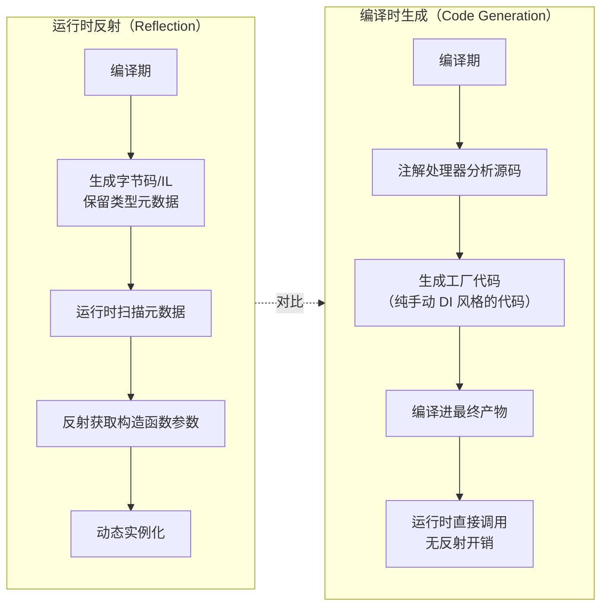
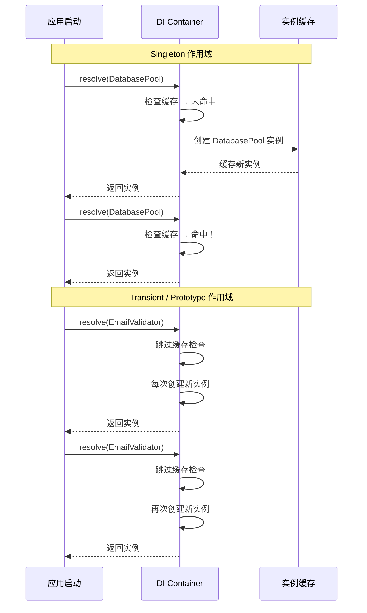
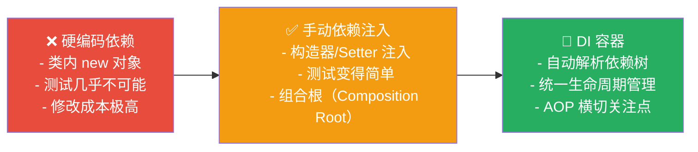

# 0. 引言：打破认知，从"控制反转（IoC）"说起

## 0.1 痛点引入：高耦合代码在任何语言中都是灾难

在软件工程的日常实践中，"耦合"是一个绕不开的话题。考虑这样一个场景：你正在开发一个电商系统的订单模块，核心类 `OrderService` 需要处理订单创建、库存扣减、支付通知。

最直觉的写法是什么？直接在方法内部 `new` 出依赖对象：

```typescript
// 反模式：硬编码依赖
class OrderService {
  private inventoryService = new InventoryService() // 直接实例化
  private paymentGateway = new StripeGateway("sk-xxx") // 构造函数参数硬编码
  private emailNotifier = new SmtpNotifier("smtp.example.com", 587)

  placeOrder(order: Order) {
    this.inventoryService.deduct(order.items)
    this.paymentGateway.charge(order.total)
    this.emailNotifier.send(order.customerEmail, "Order Confirmed")
  }
}
```

这段代码的问题如同定时炸弹：

> [!danger] 硬编码依赖的致命缺陷
>
> 1. **无法替换**：想从 Stripe 切换到 PayPal？必须修改 `OrderService` 源码。
> 2. **无法测试**：单元测试时会真的扣库存、真的扣款、真的发邮件——这是测试的灾难。
> 3. **生命周期失控**：每个 `OrderService` 实例都会新建一个 `StripeGateway`，你无法控制这些对象是共享还是独立。
> 4. **违反开闭原则**：对扩展开放，对修改关闭——而每一次新需求都要修改已有类。

这种痛苦不分语言——无论是 Java 的 `new`、C# 的 `new`、TypeScript 的 `new`、还是 Kotlin 的 `new`，本质上都是在**编译期将高层模块与底层实现焊死**。

## 0.2 概念澄清：IoC（控制反转）与 DI（依赖注入）的关系

> [!info] 核心概念：IoC（Inversion of Control，控制反转）
> **IoC 是一种设计思想**，它的核心是：**将"对象创建"和"依赖组装"的控制权从业务代码手中夺走，交给一个外部的、统一的框架或容器来管理。**
>
> 通俗地说：由"我自己 new"变成"有人给我"。

> [!tip] 架构师思考：IoC vs DI
> IoC 和 DI 的关系经常被混淆，这里给出一个精确的界定：
>
> - **IoC（控制反转）**：是一个**广义的设计原则**。任何将控制流"反转"出去的模式都属于 IoC，包括依赖注入、事件驱动、模板方法模式等。
> - **DI（依赖注入）**：是 **IoC 的一种具体实现形式**，特指通过外部组装的方式将依赖"注入"到目标对象中。
>
> ```
> IoC（控制反转）= 上层指导思想
>   ├── DI（依赖注入）= 最常见的落地方式 ← 本文重点
>   ├── Service Locator（服务定位器）
>   ├── Event/Message-Driven（事件驱动）
>   └── Template Method（模板方法）
> ```

## 0.3 核心思想：依赖倒置原则（DIP）

> [!info] 核心概念：DIP（Dependency Inversion Principle）
> DIP 是 SOLID 原则中的 "D"，由 Robert C. Martin 提出，包含两条核心规则：
>
> 1. **高层模块不应该依赖于低层模块，二者都应该依赖于抽象。**
> 2. **抽象不应该依赖于细节，细节应该依赖于抽象。**

这意味着依赖关系的方向应该从"自上而下"翻转为"自下而上指向抽象"：



> [!note] 关键洞察
> 注意图中箭头的方向：**所有的依赖关系都指向了抽象的接口**，而不是具体的实现类。这就是"倒置"的含义——依赖方向被反转了。`OrderService` 不再"知道" `StripeGateway` 的存在，它只知道 `IPaymentGateway` 这个约定。

---

# 1. 演进之路：DI 的自然推演过程

理解了 DIP 的思想之后，一个自然的问题浮现出来：**谁来负责把这些接口与它们的实现组装到一起？** 这个问题的不同答案，划分了 DI 实践的不同阶段。

## 1.1 阶段一：硬编码依赖（Hard-Coded Dependencies）

```java
// Java 反模式：在构造函数中直接 new
public class OrderService {
    // 依赖被"焊接"在类内部
    private final InventoryService inventory = new WarehouseInventory(config);
    private final PaymentGateway gateway = new StripeGateway("sk-key");

    public Result placeOrder(OrderRequest req) {
        inventory.deduct(req.items);      // 直接依赖具体实现
        gateway.charge(req.total);        // 换了支付方式就要改代码
        return Result.ok();
    }
}
```

> [!warning] 注意避坑
> 这种写法导致：
>
> - **生命周期与实现细节强绑定**：`WarehouseInventory` 的构造参数一旦变化，所有引用它的类都要修改。
> - **单元测试几乎不可能进行**：测试 `placeOrder` 时会真的连接数据库、真的调用支付 API。
> - **类本身承担了"创建"和"使用"两种职责**，违反了单一职责原则（SRP）。

## 1.2 阶段二：手动依赖注入（Manual DI）

DI 的本质其实极其简单——**把依赖从"内部创建"变为"外部传入"**。这不是框架的专利，而是任何一个工程师都可以手写的设计模式：

```typescript
// 方式一：构造函数注入（推荐）
class OrderService {
  constructor(
    private inventory: IInventoryService, // 通过构造函数接收依赖
    private gateway: IPaymentGateway,
    private notifier: INotifier,
  ) {}

  placeOrder(order: Order) {
    this.inventory.deduct(order.items)
    this.gateway.charge(order.total)
    this.notifier.send(order.customerEmail, "Order Confirmed")
  }
}

// 应用启动时手动组装（Composition Root）
const app = new OrderService(
  new WarehouseInventory(dbConnection),
  new StripeGateway(config.stripeKey),
  new SmtpNotifier(config.smtpHost, config.smtpPort),
)
```

```typescript
// 方式二：Setter/Property 注入（可选依赖的场合）
class OrderService {
  private _logger?: ILogger

  set logger(logger: ILogger) {
    this._logger = logger
  }

  placeOrder(order: Order) {
    this._logger?.info("Placing order...")
    // ... 核心逻辑
  }
}
```

> [!note] 阶段总结
> 手动 DI 已经解决了 **解耦** 和 **可测试性** 两个核心问题。此时你可以轻松地为测试注入 Mock 对象：
>
> ```typescript
> const mockInventory = new FakeInventory()
> const mockGateway = new FakeGateway()
> const sut = new OrderService(mockInventory, mockGateway)
> // 测试 placeOrder，无需任何真实的外部依赖
> ```
>
> 但新的问题随之而来：**当系统规模增长到几十个、上百个类时，手动在 `main()` 函数里组装所有依赖会变成一场噩梦。**

## 1.3 阶段三：引入 DI 容器（IoC Container）

> [!info] 核心概念：DI 容器（IoC Container）
> DI 容器是一个**全局的对象工厂**，它负责：
>
> 1. **知道如何创建每一个对象**（通过注册阶段的配置）
> 2. **理解对象之间的依赖关系**（通过构建依赖图）
> 3. **在需要时自动完成组装并返回可用实例**（通过解析与分发）

有了 DI 容器之后，应用启动的代码从：

```typescript
// 手动组装：50 个类，逐个 new，维护困难
const db = new DatabasePool(config.db)
const cache = new RedisCache(config.redis)
const repo = new OrderRepository(db)
const inventory = new WarehouseInventory(db, cache)
const gateway = new StripeGateway(config.stripe)
const logger = new FileLogger(config.log)
const notifier = new SmtpNotifier(config.smtp)
const audit = new AuditService(repo, logger)
const orderService = new OrderService(inventory, gateway, notifier, audit, logger)
// ... 脑袋已经爆炸
```

变成了：

```typescript
// 容器自动组装：声明式配置，自动解析
container.register(DatabasePool, { scope: "singleton" })
container.register(OrderRepository, { scope: "singleton" })
container.register(IInventoryService, { use: WarehouseInventory, scope: "singleton" })
container.register(IPaymentGateway, { use: StripeGateway, scope: "singleton" })

// 一句搞定
const orderService = container.resolve<OrderService>(OrderService)
```

> [!tip] 架构师思考
> DI 容器的价值不在于"减少代码量"（配置代码可能比手动 new 还多），而在于：
>
> 1. **依赖关系的声明式管理**：你不必知道 `OrderService` 依赖什么，容器会自动推导。
> 2. **统一的生命周期控制**：哪些对象是全局单例？哪些是每次新建？容器替你管理。
> 3. **横切关注点（AOP）**：事务、日志、权限检查等可以在容器层面织入，业务代码无需感知。

---

# 2. 核心机制：DI 容器是如何工作的？

本章将深入剖析所有 DI 容器的通用内部机制。无论是 Spring、Guice、Dagger、Koin 还是 .NET 的 ServiceCollection，它们的内核都遵循同样的三段式流程。

## 2.1 通用生命周期全景图



这是 DI 容器的**完整内部生命周期**。下面我们分阶段深入剖析。

## 2.2 阶段一：注册（Registration）——定义"万物之源"

注册的本质是建立一个映射表：**"当有人需要接口 A 时，请给他实现类 B 的实例"**。

```typescript
// 伪代码：一个简化的注册表结构
interface Registry {
  // 键：抽象标识（接口、抽象类、Token）
  // 值：实现描述（具体类、工厂函数、已有实例）
  bindings: Map<InjectionToken, Binding>

  register<T>(token: InjectionToken, config: BindingConfig): void
}

// 注册示例 —— 不同语言生态，相同的思想
container.register(IOrderRepository, {
  useClass: PostgresOrderRepository, // 接口 → 实现类
  scope: Scope.Singleton, // 生命周期策略
})

container.register("STRIPE_API_KEY", {
  useValue: process.env.STRIPE_KEY, // Token → 字面量
})

container.register(IHttpClient, {
  useFactory: () => {
    // Token → 工厂函数
    return new HttpClient({ timeout: 5000 })
  },
  scope: Scope.Transient,
})
```

> [!tip] 架构师思考：注册的三种驱动方式
> 不同语言的 DI 框架采用了不同的注册发现策略，但它们的内核完全一致：
>
> | 策略           | 代表框架                   | 核心机制                                   | 优势                               | 劣势                 |
> | -------------- | -------------------------- | ------------------------------------------ | ---------------------------------- | -------------------- |
> | **编译时生成** | Dagger/Hilt, Wire, MacWire | 注解处理器扫描源码，生成工厂代码           | 编译期检查依赖完备性，零运行时开销 | 注册逻辑"分散"在各处 |
> | **运行时反射** | Spring, Guice, .NET DI     | 运行时扫描类路径或程序集，反射获取构造函数 | 配置灵活，学习成本低               | 启动开销较大         |
> | **显式 DSL**   | Koin, Kodein               | 用 Kotlin/TypeScript 等语言自身的 DSL 声明 | 类型安全，IDE 友好，可读性强       | 需要手动维护模块文件 |
>
> 无论哪种策略，本质上都是在构建同一个数据结构：**一张从"抽象 Token"到"具体实现描述"的映射表**。

## 2.3 阶段二：构建依赖图（Dependency Graph）——递归发现依赖链

> [!info] 核心概念：依赖图
> 依赖图是一个**有向无环图（DAG）**，其中：
>
> - **节点**代表对象（类型或具体实例）
> - **边**代表依赖关系（A 依赖 B，则有一条从 A 指向 B 的边）
>
> 容器通过**递归遍历构造函数参数**来构建这个图。



> [!note] 图的解读
>
> - **蓝色节点**：应用层的业务服务（高层模块）。
> - **红色节点**：基础设施（数据库连接、缓存、HTTP 客户端等——底层模块）。
> - 注意从 `OrderService` 到 `DatabasePool` 的路径：`OrderService → IAuditService → IOrderRepository → DatabasePool`。容器必须递归解析这整条链。

### 递归解析的伪代码实现

```typescript
// 伪代码：DI 容器依赖图构建与解析的核心算法
class IoCContainer {
  private registry: Map<Token, Binding> = new Map()
  private singletonCache: Map<Token, any> = new Map()
  private resolvingStack: Token[] = [] // 用于检测循环依赖

  resolve<T>(token: Token): T {
    // 1. 循环依赖检测
    if (this.resolvingStack.includes(token)) {
      throw new CircularDependencyError(
        `Circular dependency detected: ${[...this.resolvingStack, token].join(" → ")}`,
      )
    }

    const binding = this.registry.get(token)
    if (!binding) throw new UnregisteredDependencyError(token)

    // 2. 作用域检查：Singleton 已有实例则直接返回
    if (binding.scope === Scope.Singleton && this.singletonCache.has(token)) {
      return this.singletonCache.get(token)
    }

    // 3. 递归解析构造函数依赖
    this.resolvingStack.push(token)

    const paramTypes = this.getConstructorParams(binding.implementation)
    const resolvedParams = paramTypes.map(
      (paramToken) => this.resolve(paramToken), // ← 递归调用，这是核心！
    )

    this.resolvingStack.pop()

    // 4. 实例化并缓存
    const instance = new binding.implementation(...resolvedParams)
    if (binding.scope === Scope.Singleton) {
      this.singletonCache.set(token, instance)
    }
    return instance
  }
}
```

> [!warning] 注意避坑：循环依赖陷阱
> 这是一个常见的反模式：
>
> ```typescript
> class A {
>   constructor(private b: B) {}
> } // A 依赖 B
> class B {
>   constructor(private a: A) {}
> } // B 依赖 A ← 循环！
> ```
>
> 此时 `resolvingStack` 会检测到 `A → B → A` 的循环路径，直接抛出异常。解决方式通常是**引入中间层接口**或使用**延迟加载/Lazy 注入**来打破闭环。

## 2.4 对比不同语言生态的实现流派

> [!info] 核心概念：运行时反射 vs 编译时生成
> 这是 DI 容器实现的两大技术路线，本质上是**"何时解析依赖关系"这个问题的两种答案**。



| 维度             | 运行时反射（Spring, Guice, Koin） | 编译时生成（Dagger/Hilt）         |
| ---------------- | --------------------------------- | --------------------------------- |
| **原理**         | 类加载时读取注解/元数据           | 注解处理器生成 `Xxx_Factory.java` |
| **错误发现时机** | 运行时 → 启动失败                 | 编译期 → 编译失败                 |
| **启动速度**     | 较慢（扫描 + 反射）               | 极快（纯 new 调用）               |
| **学习曲线**     | 低（声明式注解）                  | 中高（需理解生成逻辑）            |
| **适用场景**     | 服务端应用、快速开发              | Android/移动端、对启动速度敏感    |

> [!note] 阶段总结
> 无论选择哪种实现流派，DI 容器的内核逻辑完全一致：**注册 → 构建依赖图 → 递归解析**。学会这个通用模型，你就能在任何语言、任何框架中快速理解其 DI 机制。

---

# 3. 架构视角的工程价值

> [!tip] 架构师思考
> DI / IoC 容器不仅仅是一个"方便的工具"，它是现代软件架构中**模块化、可测试性、可维护性**三大支柱的基石。

## 3.1 模块化与组件化架构的基石

在模块化架构中，每个模块只暴露抽象接口（API），而将具体实现（Impl）隐藏在模块内部。DI 容器让这种模式得以顺畅运转：

```typescript
// 支付模块（payment-module）仅对外暴露接口
// payment-module/api.ts —— 对外暴露的抽象
export interface IPaymentGateway {
  charge(amount: Money): PaymentResult
  refund(transactionId: string): RefundResult
}

// payment-module/internal/stripe-gateway.ts —— 内部实现
export class StripeGateway implements IPaymentGateway {
  /* ... */
}

// payment-module/index.ts —— 模块入口，仅暴露注册函数
export function registerPaymentModule(container: Container) {
  container.bind(IPaymentGateway).to(StripeGateway).inSingletonScope()
}

// 消费者模块 —— 只 import api，不知道内部实现
import { IPaymentGateway } from "payment-module/api"
// 永远不会 import StripeGateway —— 真正的物理隔离！
```

> [!info] 核心概念：Composition Root（组装根）
> Composition Root 是应用程序中**唯一知道所有具体实现的地方**（通常是 `main()` 函数或启动模块）。除此之外，代码的任何其他部分都只与抽象打交道。这是实现架构解耦的关键设计模式。

## 3.2 测试驱动开发（TDD）的便利性

DI 让单元测试从"无法进行"变为"轻而易举"。因为所有依赖都是注入的，测试时可以随意替换：

```typescript
// 测试用例：验证订单金额超过 10000 时需要人工审核
describe("OrderService - High Value Orders", () => {
  it("should flag orders > 10000 for manual review", () => {
    // Arrange：所有依赖都是可控的替身
    const fakeInventory = new FakeInventoryService();   // 不连接真实仓库
    const spyGateway = new SpyPaymentGateway();         // 不调用真实支付
    const fakeNotifier = new FakeNotifier();             // 不发送真实邮件

    // 注入 Mock 依赖
    const sut = new OrderService(fakeInventory, spyGateway, fakeNotifier);

    // Act
    const result = sut.placeOrder({ items: [...], total: 15000 });

    // Assert
    expect(result.requiresManualReview).toBe(true);
    expect(spyGateway.chargeWasCalled).toBe(false);       // 大额不该直接扣款
    expect(fakeNotifier.sentEmails).toHaveLength(0);      // 不该发确认邮件
  });
});
```

> [!note] 关键洞察
> 没有 DI 时，你只能在集成测试中测试 `placeOrder`，而集成测试缓慢、脆弱、难以覆盖边界条件。DI 将单元测试的覆盖率从 **20%** 提升到接近 **90%**——这是质的飞跃。

## 3.3 作用域（Scope）与对象生命周期管理

> [!info] 核心概念：作用域
> 作用域决定了容器在多长时间内、什么上下文中复用同一个对象实例。这是 DI 容器最强大但也最容易被误用的特性。

| 作用域                    | 行为                  | 典型场景                           | 伪代码示例                                        |
| ------------------------- | --------------------- | ---------------------------------- | ------------------------------------------------- |
| **Singleton**             | 全局唯一实例          | 数据库连接池、配置对象、日志工厂   | `dbPool` 在整个应用生命周期内只创建一次           |
| **Transient / Prototype** | 每次请求新建          | 轻量级 DTO、无状态工具类           | 每次 `resolve(EmailValidator)` 都返回新实例       |
| **Request / Scoped**      | 在一个请求/会话内复用 | Web 请求的 DbContext、用户会话对象 | 同一个 HTTP 请求中多次注入得到同一个 `UnitOfWork` |
| **Thread**                | 同一线程内复用        | 线程安全的上下文、事务对象         | 同一线程内多次注入得到同一个 `Transaction`        |



> [!warning] 注意避坑：作用域误用的常见陷阱
>
> 1. **Singleton 依赖了 Transient 对象**：如果 Singleton 的 `OrderService` 注入了 Transient 的 `HttpClient`，`HttpClient` 在第一次注入后实际上变成了 Singleton 的一部分，再也不会"Transient"了。这种现象被称为 **"Captive Dependency"（被俘获的依赖）**。
> 2. **Request-Scoped 对象被跨线程使用**：在异步编程中，请求作用域的对象可能被错误地传递到另一个线程/协程中。

---

# 4. 总结与避坑

## 4.1 核心要义回顾

> [!note] 阶段总结
> 让我们用一个简洁的对照表来总结 DI 的演进：



## 4.2 常见的反模式：Service Locator

> [!warning] 注意避坑：Service Locator 反模式
> Service Locator 是 IoC 的另一种实现方式，但它**不应该被滥用**。两者的关键区别如下：
>
> ```typescript
> // ❌ 反模式：Service Locator —— 到处传递容器
> class OrderService {
>   private container: Container // 依赖的是容器本身！
>
>   placeOrder(order: Order) {
>     // 隐式依赖 —— 看类定义完全不知道它需要什么
>     const inventory = this.container.get<IInventoryService>("Inventory")
>     const gateway = this.container.get<IPaymentGateway>("Payment")
>     // ...
>   }
> }
>
> // ✅ 正确方式：Dependency Injection —— 依赖显式声明
> class OrderService {
>   // 显式依赖 —— 看构造函数就知道这个类需要什么
>   constructor(
>     private inventory: IInventoryService,
>     private gateway: IPaymentGateway,
>   ) {}
> }
> ```

| 对比维度       | Dependency Injection              | Service Locator                           |
| -------------- | --------------------------------- | ----------------------------------------- |
| **依赖可见性** | ✅ 显式声明（构造函数签名即契约） | ❌ 隐式隐藏（看了类定义也不知道需要什么） |
| **测试友好度** | ✅ 直接 new + Mock 即可           | ❌ 必须 Mock 容器 + Mock 依赖             |
| **编译期安全** | ✅ 缺失依赖编译失败               | ❌ 运行时才知道缺少注册                   |
| **可维护性**   | ✅ 新增依赖 = 新增构造函数参数    | ❌ 在方法内部默默地多了一次 get 调用      |

## 4.3 依赖图谱过大（构造函数地狱）

> [!warning] 注意避坑：构造函数地狱
> 当一个类的构造函数参数超过 4-5 个时，这是架构在向你发出警告：
>
> ```typescript
> // 🚨 构造函数地狱：这个类承担了太多职责
> class OrderService {
>   constructor(
>     private inventory: IInventoryService,
>     private gateway: IPaymentGateway,
>     private notifier: INotifier,
>     private audit: IAuditService,
>     private logger: ILogger,
>     private cache: ICacheService,
>     private rateLimiter: IRateLimiter,
>     private fraudDetector: IFraudDetector, // 第 8 个依赖！
>   ) {}
> }
> ```
>
> **诊断标准**：如果 DI 容器可以轻松处理 8 个依赖，这不代表你的设计是好的。一个拥有 8 个依赖的类很可能违反了**单一职责原则**。

> [!tip] 架构师思考：如何应对构造函数地狱
>
> 1. **拆分与重构**：8 个依赖暗示着至少 3-4 个独立的职责。考虑将 `OrderService` 拆分为 `OrderProcessor`、`OrderValidator`、`OrderNotifier` 等。
> 2. **外观模式（Facade）**：如果某些依赖总是成组出现（如 `inventory + gateway`），将它们封装成一个 `IOrderFulfillment` 门面。
> 3. **领域事件**：像 `notifier`、`audit` 这种典型的"副作用"依赖，可以考虑用事件驱动的方式解耦——`OrderService` 只发布 `OrderPlaced` 事件，其他模块各自订阅。

## 4.4 最终心法

> [!note] 阶段总结
> **依赖注入的本质**不是一个工具、一个框架或一行注解。它的本质是一种**依赖管理哲学**：
>
> > _你的类不应该负责寻找自己的依赖，它应该仅仅声明自己需要什么。_
>
> 将这一思想牢记于心，你会发现——无论你是用 Java、C#、TypeScript、Kotlin 还是任何其他语言编写代码——`interface` 和 `constructor` 就是你手中最优雅的解耦工具。而 DI 容器，只是让这一哲学在大规模系统中自动化执行的"效率放大器"。
>
> 当你理解了这一点，你就真正掌握了依赖注入的"道"，而不仅仅是一个框架的"术"。

---

_思考，而非记忆。理解原则，而非背诵 API。_
