# 0. 引言：软件工程的上帝视角

## 0.1 痛点：只盯代码导致的"实现者困境"

在日常开发中，我们经常遇到这样的场景：一个看似简单的新需求，开发花三天写完代码，自测通过后自信地提测。结果测试一跑，发现修改影响了三个看似毫不相关的模块，线上出了故障，全员回滚修复。

问题出在哪？不是代码写得不对，而是**写代码时只盯着眼前的一个点，没有看到系统这个面**。

这就是典型的"**实现者困境**"——我们太擅长把需求翻译成代码，却忽略了代码所栖身的系统是一个不断演化的生命体。每一行新代码都在改变系统的结构、耦合关系和运行时行为。当团队中每个人都只关注自己的一亩三分地时，日积月累，系统就会悄然走向腐化。

但实现者困境有一个更隐蔽的变体：**即便是具备了架构思维的开发者，也容易陷入另一个陷阱——只从技术维度思考系统**。他们能画出漂亮的架构图，能写出高内聚低耦合的模块，却在产品方向偏移时浑然不觉，在线上故障面前手足无措。技术上无懈可击的系统，如果做了一个没人需要的产品，或者上线后无法被观测和维护，其价值等于零。

> [!warning] "屎山"是如何诞生的？
> 它从来不是一次灾难性的设计失误造成的，而是无数次"这里先凑合一下""后面再重构""这个逻辑放这里也行"的**微小妥协的累积**。每一次战术性妥协，都在系统的复杂度账户上记了一笔债。缺乏全局视角的开发，就像是蒙着眼砌墙——每一块砖都放得很稳，但整面墙可能是歪的。

## 0.2 跃迁：从"战术级功能的实现者"到"战略级系统的定义者"

John Ousterhout 在《软件设计的哲学》中提出了一个关键区分：**战术编程 (Tactical Programming)** 与**战略编程 (Strategic Programming)**。

> [!important] 战术编程 vs. 战略编程
> **战术编程**的核心心态是"**把这版功能跑通就行**"——每个需求来了，以最快的速度、最短的路径实现功能，至于代码结构好不好、接口设计合不合理、这次改动给系统增加了多少复杂度——**那是以后的事**。这种思维模式的诱惑在于：它让你在当下感觉"效率很高"，但代价是每一行仓促的代码都在悄悄地往系统里埋雷。
>
> **战略编程**则完全不同——它把**设计良好、易于维护的系统结构视为一项长期投资**。它承认好设计需要多花一点时间（比如 10%~20%），但从系统整个生命周期的投入产出比来看，这点前期投入是微不足道的。战略编程的工作方式不是"写完了就跑了"，而是在每一次决策时主动问自己：**我是在减少系统复杂度，还是在增加它？**

但仅有"战术 vs 战略"的二分还不够。战略编程的"战略"到底指向哪里？如果只关注代码层面的战略（接口设计、模块划分），而忽略了产品方向的战略（做什么、不做什么）和运维层面的战略（如何面对失败、如何观测），那本质上仍是一种**局部最优的战术行为**。

我们需要的，是一次从**局部战略**到**全域战略**的跃迁。

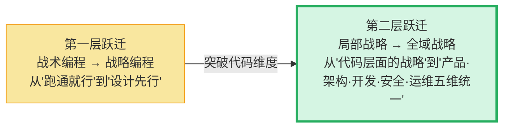

## 0.3 核心主张：全域架构观——软件工程的决策闭环

> [!important] 全域架构观的核心公式
> **产品定边界，架构做权衡，开发控细节，安全护底线，运维保演进。**
>
> 这五个维度不是独立的阶段，而是一个**闭环**：运维中发现的问题反馈给架构做调整，架构的约束指引开发的实现，开发中的安全编码实践筑牢系统的防御基线，安全事件的复盘驱动架构和产品的迭代决策，产品的演进方向又驱动下一轮架构决策。**任何一个维度的缺失，都会让整个闭环断裂。**

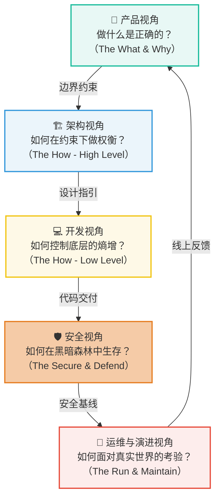

这篇文章的目的，就是帮你建立这五维统一的**上帝视角**——不是让你在每个维度都成为专家，而是让你在做任何一个维度的决策时，都能看到它与其他维度的联动关系。

## 0.4 从系统结构到系统行为：被忽略的运行时世界

建立全局视角之后，还需要完成第二次认知跃迁：**不能只看到系统“长什么样”，还要看到系统“跑起来以后是什么样”。**

模块、接口、依赖和架构图能够描述系统的静态结构，却不会自动告诉我们一次请求实际经过了哪里、一个任务等待了多久、有限资源如何被争抢、局部失败又怎样扩散。前者是设计世界，后者是执行世界；二者共同构成真实的软件系统。

> [!compare] 静态世界 vs. 运行时世界
> | 静态世界 | 运行时世界 |
> |---|---|
> | 模块 | 实例 |
> | 接口 | 实际调用 |
> | 依赖关系 | 调用链 |
> | 数据结构 | 内存中的状态 |
> | 函数 | 被调度的执行单元 |
> | 架构图 | 真实请求路径 |
> | 设计约束 | 实际资源竞争 |
> | 理论依赖 | 真实故障传播 |

> [!important] 源码描述意图，Runtime 呈现事实
> 源码告诉我们开发者希望系统做什么；Runtime（运行时）则展现这些意图在调度、资源、状态和失败的共同作用下，最终变成了什么行为。
>
> Runtime 不是全域架构观的第六个维度。它是**产品、架构、开发、安全与运维的工程决策最终汇合、执行并表现为真实系统行为的地方**。

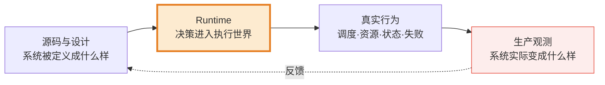


> [!question] 因此，当我们读到一段看似清晰的代码时，还要继续追问：
> - 一个函数究竟在哪个线程执行？
> - 一个对象真正占用了多少资源？
> - 一个异步任务什么时候会被调度？
> - 一个请求为什么卡住？
> - 一个队列为什么不断增长？
> - 一个服务故障为什么最终拖垮了整个系统？
> - 一段设计良好的代码为什么上线之后仍然会出现延迟尖刺？


> [!important] 从本章之后，每一次讨论产品、架构、开发、安全和运维，都同时问一个问题：
> **这个设计在 Runtime 中最终会表现成什么？**
> 
> 这条“运行时暗线”不是要消灭抽象、迫使所有人手动管理底层资源，而是补上动态视角：既理解系统的静态结构，也对它真正执行时的行为负责。
****
---

# 1. 产品视角 —— 解决"做什么是正确的"（The What & Why）

> [!note] 本章核心立场
> 在所有技术决策之前，有一个更根本的问题：**我们做的事情是否值得做？** 最精妙的架构，如果服务于一个伪需求或一个过度膨胀的产品，就是在用工程能力做负功。产品视角是整个决策闭环的起点，也是最容易被技术团队忽视的一环。

## 1.1 需求溯源：穿透用户的"解决方案"到"真实痛点"

开发者接到需求时，最常见的反应是"怎么做"。但更重要的问题是"为什么要做"。

用户和产品经理提出的，往往是**他们心中的解决方案**，而不是**他们真正面临的问题**。如果我们不穿透表面的解决方案，直接按描述去实现，很可能会做出一个技术上正确但业务上无效的东西。

> [!question] 需求溯源的灵魂三问
> 1. **这个需求要解决谁的什么问题？** —— 明确用户画像和核心痛点。
> 2. **在没有这个功能之前，用户是怎么解决的？** —— 理解现有路径，判断新方案的增量价值。
> 3. **如果这个需求不做，用户会怎样？** —— 这个问题最犀利。如果答案是"没什么影响"，那你可能正在处理一个伪需求。

一个经典的例子：产品经理说"我们需要在商品详情页加一个用户标签系统"。如果你直接开始设计标签的数据库模型、CRUD 接口、前端展示——你就掉进了"实现者陷阱"。你首先应该追问："这个标签系统要解决什么业务问题？" 答案可能是"运营想针对不同用户群体展示不同的商品推荐"。那么真正的解法可能是"基于用户分群的内容差异化展示"——标签只是其中一种实现手段，甚至不一定是最优的。

> [!tip] 思维模型：区分"问题空间"和"解法空间"
> **问题空间（Problem Space）**：用户面临的真实困境、真实诉求。它是稳定的、收敛的。
> **解法空间（Solution Space）**：可能的解决方案。它是发散的、可变的。
>
> 优秀的技术决策，是在**充分理解问题空间之后**，从解法空间中选择最匹配当前约束的方案。而不是拿到一个解法就直接执行——那等于把别人未经验证的假设当成了事实。

## 1.2 边界感与减法：决策的核心在于"不做什么"

软件工程中，最昂贵的决策不是"做了什么"，而是"做了不该做的"。每一个不必要的功能，都是一笔永久的维护成本——它需要测试、需要文档、需要兼容性保障、需要在每次重构时被考虑。

> [!important] MVP 的真正含义
> MVP（最小可行性产品）不是"做一个残缺的版本赶紧上线"。MVP 是一种**假设验证工具**——用最小的投入，去**验证**你对"用户需要什么"的核心假设是否成立。
>
> 它的核心精神是**减法思维**：不是问"这个功能要不要做"，而是问"**砍掉这个功能，我们还能验证核心假设吗？**" 如果能砍，就砍。

边界的确立需要回答三个问题：

| 问题 | 思考方向 | 示例 |
|------|---------|------|
| **做什么？** | 核心价值链路，必须闭环 | 用户能完成下单并支付 |
| **不做什么？** | 明确画出系统边界，拒绝膨胀 | 不做退款系统，人工处理（初期） |
| **做到什么程度？** | 质量标准与业务阶段匹配 | MVP 阶段可接受人工介入，规模化后必须自动化 |

> [!warning] "做加法"的诱惑
> "这个功能很小，加上也就半天的事。" —— 这句话是系统膨胀的开端。每一个"很小的功能"都有隐性成本：它需要被测试、被维护、被兼容。当这样的"小功能"积累了几十个，系统就变成了一个功能堆积的怪兽——每个功能单独看都合理，合在一起却无法维护。
>
> **每一次说"不"，都是在保护系统的可维护性。**

## 1.3 闭环思维：技术决策始终服务于业务价值交付

产品视角不仅是需求评审阶段的事，它必须贯穿整个开发生命周期。每一个技术决策，最终都要回到一个问题：**它为用户创造了什么价值？**

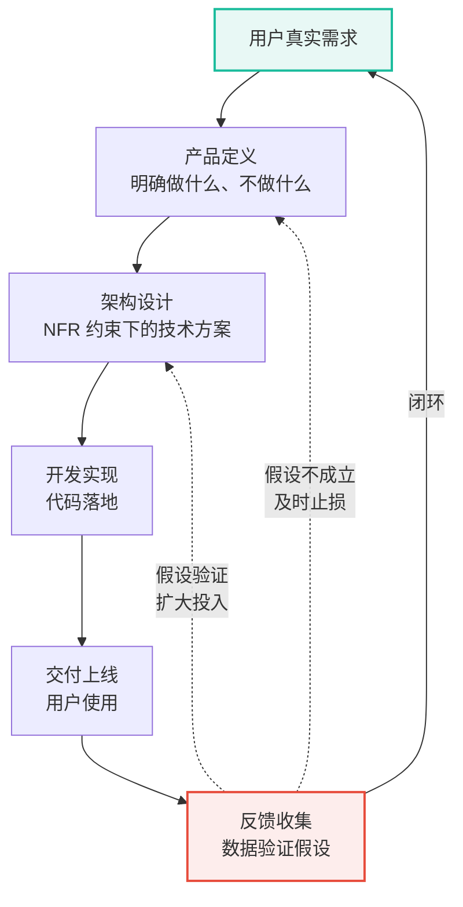

这个闭环意味着：

- **技术选型不是炫技，而是服务于交付节奏。** 选择一个团队不熟悉的新技术栈，意味着学习成本和交付延迟——这在业务验证阶段可能是不可接受的。
- **过度设计的本质是用工程时间赌未来需求。** 如果赌对了，省的是未来的重构时间；如果赌错了（大部分时候都会），浪费的是当下的交付速度。
- **技术债的管理必须与业务节奏对齐。** MVP 阶段可以接受合理的技术债（前提是**明确记下**），规模化阶段必须偿还。

### Runtime 优化不是目的，而是业务约束的结果

Runtime 越靠近执行底层，越容易给人一种“更高级、更值得优化”的错觉。但产品视角首先要问的不是“我们能否控制得更深”，而是“**这种控制解决了什么业务问题**”。

| Runtime 指标或行为 | 映射到的业务结果 |
|---|---|
| 启动时间 | 用户等待时间、首屏体验 |
| 运行时内存占用 | 低端设备可用性、后台存活率 |
| GC Pause | 卡顿、延迟尖刺 |
| 任务调度效率 | 响应延迟、吞吐能力 |
| Agent Runtime 执行失控 | Token 成本、任务延迟、成功率 |
| CPU、Memory、IO 利用率 | 基础设施成本、单位请求成本 |

> [!important] 先建立价值映射，再讨论底层优化
> 运行时优化只有映射到**用户体验、系统成本、可靠性或核心业务指标**后才有价值。没有价值映射的“优化”，往往只是用工程复杂度购买了一组用户感知不到的技术指标。

> [!warning] 不要为了“可控”而重造 Runtime
> 控制力不是免费的。自定义 Runtime 会引入设计、维护、测试、兼容和生态成本。如果通用 Runtime 已经满足当前业务目标，自建执行体系反而是一种过度设计。
>
> 这与 YAGNI 和 Trade-off 的原则完全一致：只有当执行过程已经成为产品能力、性能、安全、成本或工程可控性的关键瓶颈时，向 Runtime 下沉才值得。

> [!important] 全域架构观的第一条法则
> **技术永远服务于业务，但业务不能无视技术约束。** 二者是双向约束关系，不是单向服从关系。好的技术 leader 既不会盲目执行产品需求，也不会用技术难度来推脱业务诉求——他会在两者之间找到最优平衡点。

> [!summary] 第一部分小结
> 产品视角解决的是"做什么"和"不做什么"的根本问题。它要求我们穿透表面需求去理解真实痛点，用减法思维确立系统边界，用闭环思维确保技术投入始终产生业务价值。Runtime 优化同样必须先证明它对体验、成本、可靠性或业务指标的价值，并接受 YAGNI 的约束。**没有产品视角的技术决策，就像没有目的地的航行——船再坚固，也不知道该驶向何方。**

---

# 2. 架构视角 —— 解决"如何在约束下做权衡"（The How - High Level）

> [!note] 本章核心立场
> 架构是将产品意图翻译为系统结构的**翻译层**。它的任务不是追求技术上的完美，而是在业务需求、技术约束和团队能力的多重限制下，找到**最不坏的方案**。

## 2.1 翻译需求：从产品边界到非功能性需求（NFR）

多数开发者容易陷入一个思维习惯：**"需求说做什么，我就做什么。"** 需求文档要求"用户下单后发送通知"，那就实现一个发通知的功能。功能测试通过了，任务就算完成了。

但真正决定系统质量的，从来不是功能性需求，而是那些**没有写进需求文档的非功能性需求（Non-Functional Requirements, NFR）**。

NFR 是产品需求到架构设计的**翻译桥梁**。产品说"要快"，架构要翻译成"P99 延迟 < 200ms"；产品说"要稳定"，架构要翻译成"单节点故障时核心链路可用率 > 99.9%"。

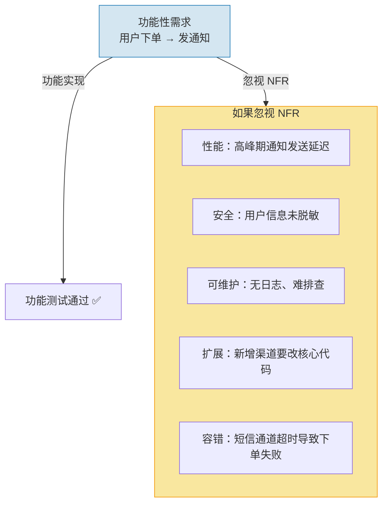

> [!question] 业务上下文三问 —— NFR 的翻译起点
> 在将产品需求翻译为 NFR 之前，先回答三个问题：
>
> - **这个模块在业务中的定位是什么？** 是核心链路还是边缘功能？这直接决定了它的可用性要求和投入产出比。
> - **业务会朝哪个方向演变？** 不需要猜测需求，但可以判断趋势。如果业务天然具有多变的规则（如营销活动、风控策略），那么设计时就该预留扩展点；如果业务非常稳定（如基础数据维护），那就不要过度抽象。
> - **谁在使用这个系统？** 内部运营工具和用户端核心链路的架构取舍截然不同。前者可以接受偶尔的不可用，后者需要极高的可用性保障。

> [!compare] 功能型开发者 vs 架构型开发者
> | 维度 | 只关注功能的开发者 | 有架构思维的开发者 |
> |------|-------------------|-------------------|
> | 性能 | "能跑就行" | "P99 延迟控制在 200ms 以内，高峰期 QPS 预估 5000" |
> | 安全 | "先上线再说" | "用户输入要校验、敏感字段要脱敏、接口要防重放攻击" |
> | 可维护性 | "写完任务就行了" | "三个月后别人能快速理解这段代码吗？日志能帮我快速定位问题吗？" |
> | 扩展性 | "当前需求就这样" | "如果明天要对接第三个通知渠道，需要改多少代码？" |
> | 容错性 | "外部服务不会挂" | "如果短信通道超时了，是阻塞主流程，还是降级处理？" |

> [!danger] 血的教训：支付回调没有幂等
> 某团队开发了一个支付回调接口，只验证了"回调参数是否正确"，没有做幂等处理。上线第一天，支付网关因网络抖动重发了三次回调，结果用户的账户被扣了三次款。
>
> 这就是典型的只关注"功能（接收回调并处理）"而忽略了 NFR（幂等性、可靠性）的代价。

> [!tip] 实用框架：NFR 检查清单
> 有架构思维的人，在实现每一个功能时都会自动在心里过一遍 NFR 检查清单：
> - 这个改动影响**性能**吗？
> - 有**安全**风险吗？
> - 出错后能快速**恢复**吗？
> - 别人好**理解**吗？
> - 将来改起来**方便**吗？
>
> 这些拷问，就是架构视角在日常编码中的具体体现。

### NFR 最终会落到 Runtime Behavior

产品说“要快、稳定、省资源”，架构师会把它翻译成可以验证的指标：

```text
P99 < 200 ms
Memory < X
CPU 利用率 < X
并发能力 > X
Availability > X
```

但还要继续追问：**这些指标最终由什么产生？**

答案不是架构图本身，而是系统运行时真实发生的调度、等待、分配与竞争：

```text
线程调度    任务队列    锁竞争      内存分配    GC
IO          连接池      缓存命中    网络等待    Backpressure
Timeout     Retry       Circuit Breaker
```

> [!compare] NFR 与 Runtime Behavior 的映射
> | NFR | Runtime 中真正决定它的因素 |
> |---|---|
> | 延迟 | 调度、IO、锁、队列、GC |
> | 吞吐 | 并行度、资源利用率、批处理 |
> | 内存 | 分配模型、对象生命周期、缓存 |
> | 稳定性 | 隔离、限流、超时、熔断 |
> | 可伸缩性 | 调度模型、无状态化、资源边界 |
> | 成本 | CPU、Memory、IO、Network 利用率 |

架构定义了 NFR，Runtime 则生产了 NFR 的真实结果。一个架构图可以画出三层服务，却画不出线程池已经耗尽；可以标注“异步解耦”，却不会自动说明队列是否有界、消费速度是否追得上流入速度。

> [!important] 大量 NFR 最终都是 Runtime Behavior
> 架构师不能只设计模块如何组织，还必须设计系统如何执行。否则，所谓性能、稳定性与成本目标，就只是写在文档里的愿望。

## 2.2 应对复杂度的三大症状：变更放大、认知负荷、未知的未知

架构设计的第一要务是**管理复杂度**。但"复杂度"这个词太抽象了，我们需要把它具象化为可以感知的症状。

John Ousterhout 在《软件设计的哲学》中将系统复杂度归结为三种客观症状。**注意，这三种症状不是主观感受，而是在日常开发中可以明确观测到的现象：**

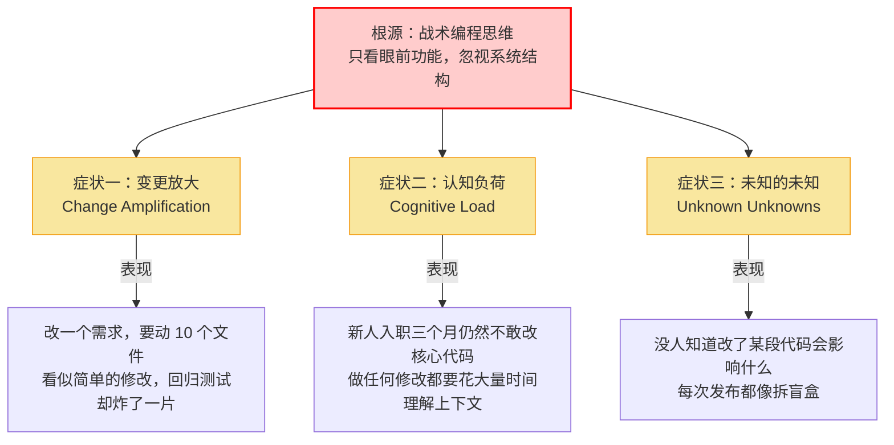

### 症状一：变更放大（Change Amplification）

> 一个看似简单的需求变更，需要修改**多个地方的代码**。

最直观的例子：系统中一个核心数据模型（比如"订单状态"）被几十个模块直接引用，改一个字段就意味着要改几十个文件，漏改任何一个都可能导致线上故障。这不是代码写得不好，而是架构层面**缺乏隔离**——变更的冲击没有被人为控制在最小范围内。

### 症状二：认知负荷（Cognitive Load）

> 为了完成一个任务，开发者需要**同时理解大量的、彼此不相关的信息**。

最具象的体验是：你想在一个服务里加一个新字段，结果发现你需要先搞懂这个服务是怎么处理登录的、缓存是怎么刷新的、消息队列是怎么消费的——这些知识跟你当前的任务**毫无关系**，但因为设计上没有清晰的模块边界，你被迫要把它们全都装进脑子里。

### 症状三：未知的未知（Unknown Unknowns）

> 你不知道**哪些是你不知道的**。

这是三种症状中最致命的一种。变更放大至少你知道要改哪些文件（虽然很多），认知负荷至少你知道要去了解哪些东西（虽然很杂）。但在一个复杂度失控的系统里，**你甚至无法确认自己对系统的改动是否安全**——你不知道某个看似无关的模块是不是间接依赖了你修改的数据结构，你不知道某个"废弃"的接口是不是还有人在用，你不知道这次修改会不会引发链路深处的某种级联故障。

> [!important] 三种症状的递进关系
> 这三种症状之间存在一个清晰的恶化路径：**认知负荷过高 → 开发者无法完整理解系统 → 出现"未知的未知" → 每次变更的实际影响被低估 → 线上故障频发 → 变更放大（修复 bug 又引入新 bug）。**
>
> 而这一整个恶性循环的起点，就是日常开发中一次次的战术性妥协——"这里先凑合一下""多引一个依赖没事的""把逻辑塞进通用工具类就行了"。

### 静态复杂度之外，还有运行时复杂度

有些系统不是代码难读，而是**执行过程难以推理**。

源码中的关系可能只是：

```text
A → B
```

运行起来却可能变成：

```text
A
→ Thread Pool
→ Queue
→ Retry
→ Cache
→ RPC
→ B
→ Callback
→ Event
→ C
```

每一个中间环节都可能改变执行顺序、资源消耗和失败路径。它们往往不会完整出现在方法签名或模块依赖图里，却共同决定系统能否被理解。

开发者可能知道 `A` 调用了 `B`，却不知道：

- callback 最终在哪个线程执行；
- coroutine 是否真的被取消；
- queue 是否会无限增长；
- retry 是否制造了流量放大；
- cache miss 是否导致请求风暴；
- 一个 Agent Tool 调用是否会再次触发模型推理；
- Plugin 是否改变了整个执行链；
- 某个对象是否被 Runtime 长期持有。

这些不是单纯的实现细节，而是运行时的 Unknown Unknowns。静态代码越简洁，隐藏在抽象之后的执行过程越可能被低估。

> [!important] 运行时的 Unknown Unknowns
> 最危险的复杂度不是“我不知道这段代码在做什么”，而是：
>
> **“我看懂了代码，却仍然不知道系统运行起来会发生什么。”**

> [!tip] 管理运行时复杂度
> 不要试图在脑中模拟所有执行细节，而要优先让关键行为显式化：队列有界、超时可见、重试可计数、线程约束写入契约、资源生命周期可追踪、失败路径可以演练。
>
> 好的架构不仅降低阅读代码时的认知负荷，也降低推理执行过程时的认知负荷。

## 2.3 高内聚低耦合的灵魂检验：深模块 vs 浅模块

"高内聚、低耦合"这句话几乎每个开发者都听过，但在日常开发中，它经常被理解为一句空洞的口号。我们需要一个更具体、更可操作的检验工具。

John Ousterhout 提出了一个极具穿透力的概念：**深模块（Deep Modules）和浅模块（Shallow Modules）**。它用一个简单的比喻让"好模块长什么样"变得一目了然：

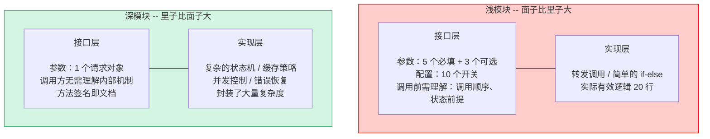

> [!important] 深模块的核心思想
> **深模块**：对外暴露的**接口极简**（一小撮 API，很少的参数），但内部封装了**大量复杂的逻辑**。它有效地把复杂性**隐藏**在模块内部，调用方不需要知道内部发生了什么，只需要知道"我给它什么，它能给我什么"。好的深模块就像一台洗衣机——你只需要按一个按钮，它内部怎么进水、怎么旋转、怎么排水你根本不用关心。
>
> **浅模块**：接口相对功能而言**过于复杂**（参数多、配置多、前置条件多），但内部逻辑却很简单（往往只是转发调用或简单的条件判断）。浅模块的问题在于它**没有有效隐藏信息**——它把内部的复杂度原封不动地暴露给了调用方。

**深模块概念就是检验模块设计的最直接工具：**

| 判断标准 | 深模块（合格） | 浅模块（不合格） |
|---------|-------------|---------------|
| 接口复杂度 | 方法少、参数少、调用方看一眼就懂 | 参数列表泛滥、调用顺序有讲究、需要翻文档才能用对 |
| 信息隐藏 | 内部数据结构、算法、异常处理全部封装，调用方零感知 | 内部依赖关系暴露、数据格式要求透传 |
| 改动的代价 | 内部实现随便改，只要接口不变，调用方纹丝不动 | 改内部逻辑，调用方也得跟着改 |
| 一句话总结 | **"里子比面子大"** | **"面子比里子大"** |

> [!tip] 实践方法：用"深模块思维"审视你的代码
> 每次 Code Review 时，对每个新增的模块用三个问题衡量：
> - 这个模块的接口是不是比它的实现更"薄"？
> - 调用方是不是需要提前理解很多上下文才能用对？
> - 如果我换掉内部实现，调用方需要改多少代码？
>
> 如果三个答案都不理想——你正在制造一个浅模块，而浅模块就是未来**认知负荷**和**变更放大**的温床。

判断边界是否合理的终极检验：

> [!tip] 边界质量的终极检验
> **"如果我要把这个模块完全重写，最小影响范围是多大？"**
>
> 如果答案是"只改这一个模块，不改调用方"，说明边界划得好。如果答案是"上下游都得跟着改"，说明耦合过重，该重新审视边界了。

## 2.4 决策的本质：没有完美的架构，只有适合的妥协

新手最爱问："什么架构是最好的？" 而资深的架构师会说："**没有最好的架构，只有最不坏的架构。**"

**架构设计的本质是取舍（Trade-off）**。每一次技术选型、每一个设计决策，都是在多个互相冲突的目标之间寻求平衡。

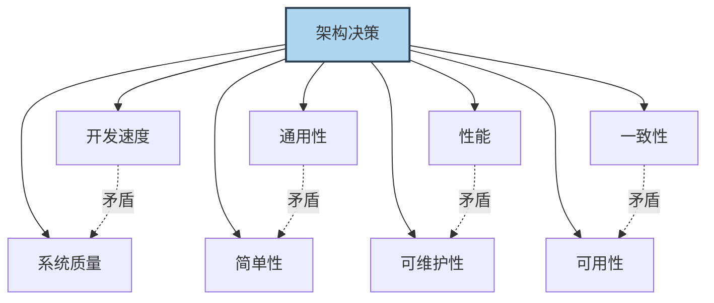

常见的需要权衡的维度：

| 维度 | 向左走 | 向右走 | 怎么选 |
|------|--------|--------|--------|
| **开发速度 vs. 质量** | 快速上线 MVP，少写测试 | 完整测试 + 监控，交付慢 | MVP 可接受技术债，但要**明确记下**并计划偿还 |
| **通用性 vs. 简单性** | 抽象出通用框架 | 针对当前需求硬编码 | 判断核心逻辑是否**确实会被多处复用** |
| **性能 vs. 可维护性** | 手写优化、专用方案 | 用成熟的方案，性能"足够好" | 99% 的场景下可维护性 > 极致性能 |
| **一致性 vs. 可用性** | 强一致 | 最终一致 | 核心业务要强一致，边缘场景可最终一致 |

### 谁拥有执行权？

除了性能、可维护性和一致性，架构还要做一类更隐蔽的权衡：**系统愿意把多少执行权交给通用 Runtime，又愿意为多少自主控制承担成本？**

> [!compare] Runtime 控制权的 Trade-off
> | 方案 | 获得什么 | 付出什么 |
> |---|---|---|
> | 通用 Managed Runtime | 开发效率、成熟生态、自动资源管理 | 更少的底层控制能力 |
> | Native Runtime | 更直接的资源控制、更可预测的部分行为 | 更高的工程复杂度 |
> | 固定执行流程 | 可预测、易调试 | 灵活性较低 |
> | 插件化 Runtime | 可替换、可组合、可扩展 | 执行过程更加复杂 |
> | Runtime 黑盒 | 开发简单、接入快速 | 出问题时难以理解和干预 |
> | Runtime 可编排 | 可控、可观测、可动态治理 | 需要设计并维护控制面 |

这里没有“Native 必然优于 Managed”，也没有“自研必然优于通用方案”。Managed Runtime 隐藏了大量复杂度，使团队能够把注意力集中在业务上；Native 或自定义 Runtime 提供更多控制，却把原本由平台承担的责任重新交还给团队。

> [!important] Runtime 自主权也是一种架构能力
> 但**控制力需要用复杂度购买**。关键问题不是“能不能控制”，而是：**当前业务是否值得为这种控制力支付复杂度成本？**
>
> 当瓶颈仍是功能缺失和需求验证时，重造执行层通常偏离产品目标；当关键瓶颈已经变成执行过程本身不可控时，调度、资源、生命周期、失败路径与扩展机制才值得成为架构的一等公民。

> [!important] 权衡的关键：知道你在放弃什么
> 真正的"权衡能力"不是选择了一个方案就万事大吉，而是**清楚地知道被放弃的那条路径的成本是什么，并且这个成本是可控的、可接受的**。
>
> 如果你选择了快速交付而减少了测试覆盖，那就要接受线上可能会有更多 bug，并准备好快速响应机制。所有决策都有代价，**清醒地承担代价才是成熟的表现**。

## 2.5 从静态架构到运行时架构：控制流、资源流与执行权

传统架构图擅长回答“系统由什么组成”，却不一定能回答“系统如何活着”。因此，架构视角需要从 Static Architecture 继续穿透到 Runtime Architecture。

> [!compare] Static Architecture vs. Runtime Architecture
> | Static Architecture 关注 | Runtime Architecture 关注 |
> |---|---|
> | 模块、服务、接口 | 谁执行、在哪里执行 |
> | 数据模型、依赖关系 | 什么时候执行、按照什么顺序执行 |
> | 结构边界 | 使用多少资源、资源由谁释放 |
> | 理论调用关系 | 真实调用链、排队与等待 |
> | 设计时约束 | 失败如何传播、谁能改变执行过程 |

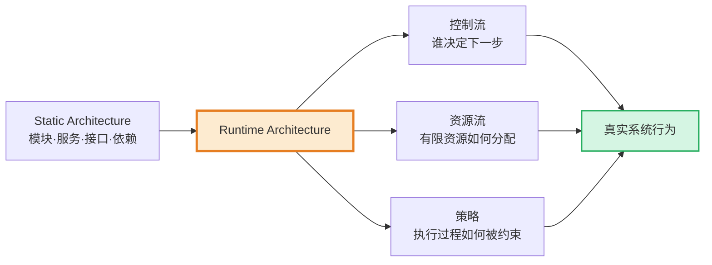

### 1. 控制流（Control Flow）：谁决定下一步执行什么？

同步函数调用中，调用方看似掌握着控制权；进入线程池、Event Loop、Coroutine Scheduler、消息队列、Actor、Workflow Engine、Agent Loop 或 Plugin Hook 之后，下一步何时执行、由谁执行、是否被插入其他步骤，可能已经交给了另一个调度者。

```text
函数调用 → 调用方决定下一步
消息消费 → Broker 与 Consumer 共同决定时机
Coroutine → Scheduler 决定恢复位置与时间
Agent Loop → 模型、Tool 与控制策略共同推进流程
Plugin Hook → 插件可能插入、改写或终止执行链
```

> [!question] 执行权在哪里？
> 当系统出现延迟、乱序或无法取消时，先不要只盯着业务函数。问清楚：当前控制权在调用方、线程池、调度器、消息系统、框架，还是插件手中？

### 2. 资源流（Resource Flow）：有限资源如何被分配？

任何软件抽象最终都会消耗真实资源：

```text
CPU        Memory       Thread       File Descriptor
Connection Disk IO      Network IO   GPU
Token      Context Window
```

源码中的“启动一个任务”很轻，Runtime 中却意味着为它分配执行时间、内存、连接或上下文。单个任务的成本可能微不足道，但当流入速度持续超过处理速度，等待会在队列、线程池、连接池或内存中积累，最终表现为延迟尖刺、拒绝服务甚至系统雪崩。

> [!important] 资源流的基本事实
> **资源是有限的。Runtime 的重要职责之一，就是把有限资源分配给无限欲望。**
>
> 因此，架构不能只声明“异步”“并发”“缓存”，还要声明并发上限、队列边界、缓存生命周期、资源配额和过载策略。

### 3. 策略（Policy）：执行过程受什么规则约束？

Runtime 不只是把代码跑起来，它还经常控制：

```text
Scheduling    Timeout       Retry       Rate Limit
Isolation     Priority      Cancellation Permission
Fallback      Plugin        Hook        Quota
```

这些策略决定谁先执行、谁必须等待、失败后走哪条路、一个执行单元能使用多少资源，以及谁有权改变流程。策略如果散落并写死在业务代码里，系统难以统一治理；策略如果被提升为显式的运行时机制，就可以被观测、验证和调整，但也会引入新的控制面复杂度。

> [!important] Runtime 的工程定义
> **Runtime 是系统对执行权、资源权和策略权进行管理的执行层。**
>
> 源码告诉系统“要做什么”，Runtime 决定这些意图最终“如何发生”。

这个定义把 Runtime 放回了全域架构观：产品解释为什么需要某种运行特性；架构选择执行模型并分配控制权；开发让代码遵守这种模型；安全约束执行能力；运维观察和干预真实行为。Runtime 不是第六维，而是五维决策共同进入现实的执行世界。

> [!summary] 第二部分小结
> 架构视角是连接产品意图与技术实现的翻译层。它要求我们：将模糊需求翻译为精确 NFR，并继续追踪 NFR 在 Runtime 中由什么行为产生；同时管理静态复杂度与运行时复杂度；用“深模块 vs. 浅模块”检验信息隐藏；在多个冲突维度及 Runtime 控制权之间做清醒取舍。
>
> **架构的本质不只是组织结构，更是在约束下设计执行过程。**

---

# 3. 开发视角 —— 解决"如何控制底层的熵增"（The How - Low Level）

> [!note] 本章核心立场
> 如果说架构视角是"画蓝图"，那么开发视角就是"砌砖瓦"。蓝图再好，如果每一块砖都砌歪了，建筑照样会塌。开发视角关注的是代码层面的纪律和品味——**如何让微观的编码决策与宏观的架构意图保持一致**。

## 3.1 契约精神：接口即合同，设计稳定且具备演进能力的边界

面向接口编程是消除耦合最有力的武器之一。其核心思想很简单：**"我要做什么"和"我怎么实现"是两件不同的事。**

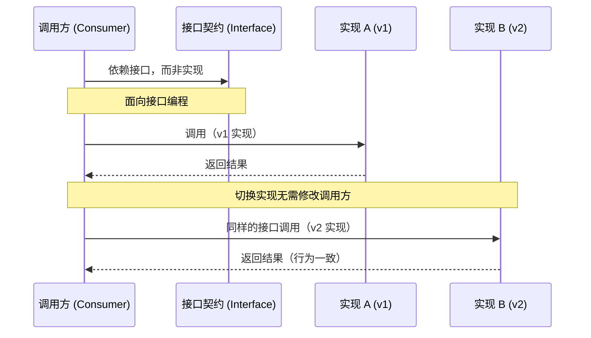

接口就像一份合同——一旦签订（发布），任何单方面的修改都是"违约"，会给所有签约方（调用方）带来损失。

> [!note] 接口设计的四个原则
> 1. **接口要稳定**：接口一旦发布，就像一份合同，不要轻易违约。不兼容的变更意味着所有调用方都需要修改。
> 2. **接口要精简**：接口数量越少越好、每个接口的职责越单一越好。一个接口承载过多职责就会变成"上帝接口"。
> 3. **要留扩展余地**：使用开放式的数据结构（如扩展字段），而不是把所有字段都写死。这在接口演进时至关重要。
> 4. **契约验证不可少**：接口的调用方和提供方都应对契约进行验证，确保双方对"合同条款"的理解一致。

接口的脆弱性往往体现在一个细节上——**参数设计**：

> [!example] 接口设计的脆弱与健壮
> **反例：脆弱的接口**
> 参数列表不断膨胀，每次新增能力都意味着破坏签名或引入大量重载。调用方需要记住每个参数的位置和含义，稍有不慎就会出错。
>
> **正例：健壮的接口**
> 将参数封装为结构化对象，并预留扩展字段。新增能力只需在对象中添加可选字段，不影响任何已有调用方。调用方只需关注它关心的字段，其余保持默认即可。
>
> **核心原则：接口的演进应该是"只增不改"的。**

这个思想在不同层面的体现：

> [!compare] 接口契约在不同层面的体现
> | 层面 | 稳定的是什么 | 可以变的是什么 |
> |------|-------------|---------------|
> | 服务层 | API 端点、请求/响应结构 | 内部实现逻辑 |
> | 模块层 | 方法签名、语义承诺 | 算法、数据源 |
> | 组件层 | 扩展点定义 | 具体实现 |

### 接口还有第二层合同：运行时契约

传统接口契约回答：

```text
输入是什么？
输出是什么？
错误是什么？
```

但调用方能否正确使用一个接口，还取决于它的执行特性。Runtime Contract（运行时契约）需要继续回答：

```text
这个方法会阻塞吗？              应该在哪个线程调用？
是否线程安全？                  是否允许并发调用？
是否可以取消？                  最长执行多久？
资源由谁释放？                  失败后能否重试？
调用是否幂等？                  是否要求执行顺序？
是否可能回调调用方？
```

例如，一个签名简单到不能再简单的方法：

```kotlin
fun query(): Result
```

从类型上看，它只是返回一个结果。但在 Runtime 中，它可能访问网络、阻塞当前线程、触发磁盘 IO、分配大量内存、内部重试三次，或者在另一个线程回调调用方。如果这些执行语义没有成为契约的一部分，调用方即使“类型使用正确”，仍然可能把它放在 Event Loop 上导致整体阻塞，或在超时后留下无法取消的后台任务。

> [!important] 方法签名只是静态契约，执行特性也是接口的一部分
> 一个真正稳定的接口，不只是输入输出稳定，它的**执行语义也应该稳定且可以被调用方理解**。
>
> 深模块可以隐藏实现复杂度，但不能隐藏调用方为了正确使用接口而必须知道的运行时约束。信息隐藏不是把风险藏起来，而是只暴露必要且稳定的知识。

## 3.2 抵御混乱的基因：防御性编程

有一句经典的系统设计格言：**"Everything that can go wrong will go wrong."**

防御性编程的核心假设是：**外部世界是不可信的，一切输入都可能是恶意的或错误的，一切外部依赖都可能在最不该出问题的时候出问题。**

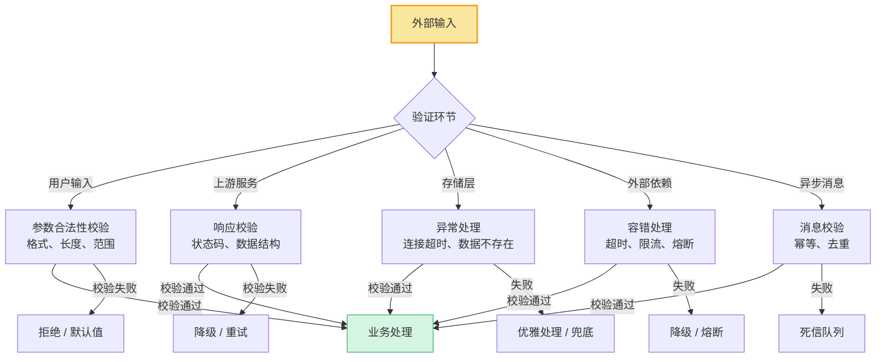

> [!warning] 防御性编程的三条铁律
> **第一条：永远校验输入。** 不管数据来自用户、上游服务、数据库还是消息队列——在使用之前，先验证它的合法性。空值检查、格式校验、范围约束、类型断言——这些"繁琐"的代码是系统健壮性的第一道防线。
>
> **第二条：永远处理异常。** 任何可能失败的操作（网络调用、磁盘写入、外部依赖）都要有异常处理策略。"不可能出错"是最危险的假设。
>
> **第三条：永远做好兜底。** 当异常确实发生时，系统应该有一个安全的"着陆点"——要么重试，要么降级，要么返回一个合理的默认值。最差的情况是：异常发生后，系统处于一个不确定的中间状态。

> [!danger] "信任陷阱"的代价
> "假设上游传过来的数据一定不为 null" → 空指针崩溃。
> "假设数据库一定不会超时" → 请求阻塞，线程池耗尽。
> "假设第三方 API 一定在 100ms 内返回" → 超时导致用户看到白屏。
>
> 每一个"假设"都是一个未被处理的失败路径。它们不会在开发环境和测试环境中暴露——它们会在生产环境的高并发、高压力、网络抖动下同时爆发。

### 从“输入不可信”到“Runtime 也会失控”

防御性编程还需要再向前一步：不仅输入和依赖会出错，**资源和调度本身也会失控**。

```text
OOM                         Stack Overflow
Deadlock                    Livelock
Thread Starvation           Thread Pool Exhaustion
Connection Pool Exhaustion  Queue Explosion
Event Loop Blocking         GC Pause
Task Leak                   Coroutine Leak
Retry Storm
```

这些问题往往不是某个输入值“错了”，而是系统对数量、时间、并发和生命周期缺少边界。一次正常请求创建一个未回收任务，测试时几乎不可见；持续流量下，几万个任务就会成为资源泄漏。一次失败重试看似合理；下游整体故障时，所有请求同时重试就会形成流量风暴。

因此，Runtime-aware 的防御性编程还要接受四个事实：

- **不要假设资源是无限的。** 每个缓存、队列、任务和连接都需要上限。
- **不要假设任务会及时执行。** 排队、饥饿和优先级反转都可能让“已提交”不等于“会很快完成”。
- **不要假设异步等于不会阻塞。** 异步接口内部仍可能执行阻塞 IO 或占满 Event Loop。
- **不要假设失败只影响当前请求。** 重试、共享连接池和公共队列会把局部故障传播到整个系统。

> [!question] Runtime 防御三问
> 1. 这段代码消耗的资源有没有明确上限？
> 2. 如果执行速度跟不上流入速度，会在哪里堆积？
> 3. 如果这个任务永远没有结束，会发生什么？

## 3.3 警惕过度设计：用 YAGNI 原则对抗不必要的抽象

> [!danger] 你可能在过度设计的信号
> - 你的项目里有一个"抽象工厂""策略工厂""工厂的工厂"
> - 你的代码里有大量**目前没有任何实现类**的接口
> - 你花了一周时间搭建"通用框架"，真正写业务只用了半天
> - 你为了"将来可能需要"，先把一个简单的模块拆成了十个子模块

过度设计和没有设计一样糟糕。**YAGNI（You Aren't Gonna Need It）** 原则告诉我们：**永远不要为当前不需要的功能编写代码。**

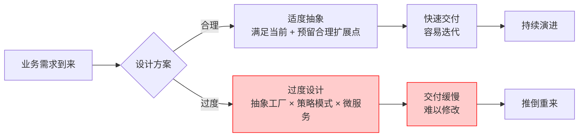

如何在"为未来留余地"和"过度抽象"之间找到平衡？

> [!tip] 什么时候该抽象，什么时候不该？
> | 场景 | 该抽象 | 不该抽象 |
> |------|--------|---------|
> | 你已经写了三遍相似的代码 | ✅ 提取公共逻辑 | ❌ 造一个通用的"规则引擎" |
> | 需求明确说明"未来需要对接多个供应商" | ✅ 定义供应商接口 | ❌ 先实现"支持热插拔"的动态加载框架 |
> | 一个简单的条件分支 | ✅ 保持原样 | ❌ 用策略模式重构"以防将来" |
> | 你确信某个逻辑不会再变了 | ✅ 直接实现 | ❌ 坚持要加一层接口"方便测试" |
>
> **判断准则：用一个代码逻辑出现三次作为抽象的最低门槛。** 两次是巧合，三次才是规律。

> [!important] 一句话区分
> - **为未来留余地** = 在简单实现中预留一个扩展点（比如一个可选的扩展参数）
> - **过度抽象** = 为这个扩展点编写了一套完整的框架代码
>
> 前者是智慧，后者是傲慢——你预测不了未来，不要假装可以。

## 3.4 看见代码背后的执行：Runtime-aware Programming

代码是我们表达意图的媒介，但机器不会直接执行“意图”。所有高级语言抽象，都必须经过编译、解释或运行时系统，最终落到调度、内存、IO、操作系统和硬件资源上。

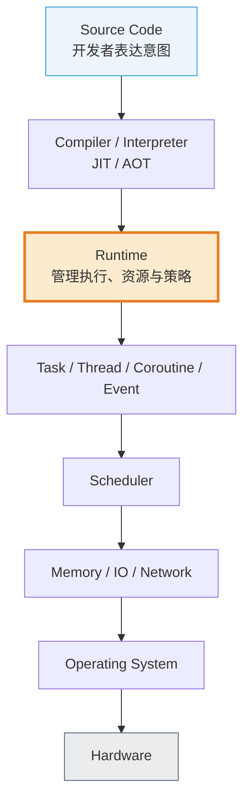

Kotlin 的 `suspend`、Go 的 goroutine、Rust 的 async Future、JavaScript 的 Promise、C++ 的 thread，语法和实现机制各不相同，却都绕不开同一组工程问题：

```text
执行    调度    等待    内存    生命周期    资源竞争
```

Runtime Thinking 的价值，不是把不同语言抹平成同一种实现，而是提供一组跨技术栈都有效的问题。以后遇到 JVM、Go Runtime、Node.js、浏览器、容器或 Agent Runtime，我们都可以先问：控制权在哪里？资源如何分配？任务何时结束？失败如何传播？

### Runtime-aware Developer 的思考方式

普通开发者看到：

```text
foo()
```

想到的是：“调用 `foo`。”

Runtime-aware Developer 会继续问：

```text
是否发生对象分配？        是否触发 IO？
是否切换线程？            是否进入队列？
是否可能阻塞？            生命周期由谁管理？
是否可能重试？            失败如何传播？
有没有隐式资源消耗？      是否能够取消？
```

这不是要求每次调用前都追踪到 CPU 指令，也不是要求所有开发者手动管理内存。认知深度应该与风险匹配：普通业务代码关注明显的阻塞、分配与生命周期；核心链路、基础组件和高并发路径则需要更深入地验证调度与资源行为。

> [!important] 语言抽象帮助我们忽略细节，但工程能力要求我们知道自己究竟忽略了什么
> **抽象可以使用，黑盒不能迷信。**
>
> 好的抽象让多数细节无需被多数人反复理解；成熟的开发者则知道何时必须穿透抽象，并用 profiling、metrics、tracing、压力测试或故障注入验证自己的判断。

### 从 Source-aware 到 Runtime-aware

```text
初级开发者：代码能跑就是正确。
↓
进一步：代码结构必须可维护。
↓
Runtime-aware Developer：
即使源码结构正确，也必须理解代码真正执行时产生的资源、调度、并发和失败行为。
```

回到全域架构观，开发承担的是把架构执行模型落实为可靠代码：接口要表达 Runtime Contract，任务要有生命周期，资源要有边界，失败要有传播策略，关键行为要能被观测。只有这样，源码中的架构意图才不会在 Runtime 中变形。

> [!summary] 第三部分小结
> 开发视角是架构意图的微观落地。它要求我们：
> - 用**契约精神**设计接口——既稳定输入输出，也稳定执行语义
> - 用**防御性编程**构建健壮性——既不信任外部输入，也不假设资源和调度永不失控
> - 用 **YAGNI 原则**对抗过度设计——在预留扩展点和过度包装之间找到平衡
> - 用 **Runtime-aware Programming** 看见抽象背后的执行成本、生命周期与失败行为
>
> **代码是架构的最终载体，Runtime 是代码接受现实检验的地方。**

---

# 4. 安全视角 —— 解决"如何在黑暗森林中生存"（The Secure & Defend）

> [!note] 本章核心立场
> 前三章讨论的防御，都是针对**无意的错误**——网络抖动、用户误操作、开发者疏忽。但现实世界中，还存在另一种截然不同的威胁：**蓄意的、恶意的、以摧毁或掠夺你系统为目标的攻击者**。他们不走你预设的流程，不遵守你心中的"规矩"，他们的全部创造力都用在寻找你系统的裂缝上。安全视角的本质，是要求系统设计者在心中同时扮演两个角色：一个想保护系统的人，和一个想摧毁系统的人。

## 4.1 打破 Happy Path 幻觉：红队的"破坏者视角"

每个开发者心中都住着一个"理想用户"——他会按照文档操作、按照界面引导点击、按照约定的格式提交数据。我们写代码时，下意识地围绕这个理想用户构建逻辑，这就是 **Happy Path（快乐路径）**。

但攻击者不是你的理想用户。

> [!important] 两种截然不同的思维模式
> **开发者思维**："用户会按照我设计的步骤走。代码的每一个分支我都考虑到了。"
>
> **攻击者思维**："只要没被代码**明确禁止**的路径，我全都要试。你的设计步骤？那只是参考意见。"
>
> 开发者在**已知的功能空间**内工作——需求是确定的，接口是定义好的，流程是设计过的。
> 攻击者在**未知的可能性空间**中探索——他不关心你的功能是什么，他关心的是你的系统**还能做什么你没想过的事**。

这两种思维模式的根本差异在于：**开发者思考的是"系统应该做什么"，攻击者思考的是"系统能被强迫做什么"。**

一个接口的入参设计为 `userId`，开发者想的是"传入一个合法的用户 ID"；攻击者想的是"如果我传入别人的 userId 呢？如果我传入一个超长字符串呢？如果我传入一个 SQL 片段呢？如果我连续调用一万次呢？"

> [!warning] 木桶原理在安全领域的映射
> 你的系统不是由最精妙的模块决定安全性的，而是由**最短的那块木板**决定的。
>
> 攻击者不需要攻破你引以为傲的核心引擎，他只需要找到一个被遗忘的调试接口、一个没有鉴权的管理后台、一个未做频率限制的短信发送接口——然后从这个最薄弱的点长驱直入。

这就是为什么安全不能是开发完成后的"附加检查"，而必须是**架构设计阶段就内建的思维模式**。你需要在心中常驻一个"红队视角"——时刻以攻击者的眼光审视自己的系统：**如果我是恶意的，我会从哪里下手？**

> [!tip] 培养红队思维的日常练习
> 在设计每一个对外暴露的接口时，花一分钟做这个思想实验：
> 1. **如果有人不按正常流程调用这个接口会怎样？** —— 跳过前置步骤、乱序调用、重复调用
> 2. **如果传入的数据不是"正常"的会怎样？** —— 空值、超长、特殊字符、极端值
> 3. **如果这个接口被以 1000 倍的频率调用会怎样？** —— 资源耗尽、服务雪崩
>
> 这一分钟的思想实验，可能帮你省下一个月的线上救火。

## 4.2 从边界防御到零信任（Zero Trust）：蓝队的"纵深防御"

第 3 章的防御性编程告诉我们"不信任外部输入"——这是一条重要原则，但它只防住了第一层。安全领域有一个更深层的认知跃迁：**不仅外部不可信，系统内部也不应被默认信任。**

> [!important] 信任模型的三次进化
> **第一代：边界防御（Perimeter Defense）**
> "城堡外是危险的，城堡内是安全的。" 只要在入口处做好校验（防火墙、参数验证），内部就可以放松警惕。问题在于：一旦攻击者突破了边界（通过一个漏洞、一个被泄露的凭证），内部的一切都对他敞开大门——这就是"**软心硬壳**"模型。
>
> **第二代：纵深防御（Defense in Depth）**
> 不再依赖单一的防线，而是在多个层次分别设置防御。即使某一层被突破，下一层仍然能阻止或延缓攻击。这就像中世纪城堡的护城河、城墙、内墙、守卫塔——每一层都是独立的防线。
>
> **第三代：零信任（Zero Trust）**
> "永远不要信任，始终验证。" 无论请求来自外部还是内部，无论是用户还是微服务之间的调用，每一次访问都必须经过身份验证和授权。网络位置（内网/外网）不再是信任的依据。

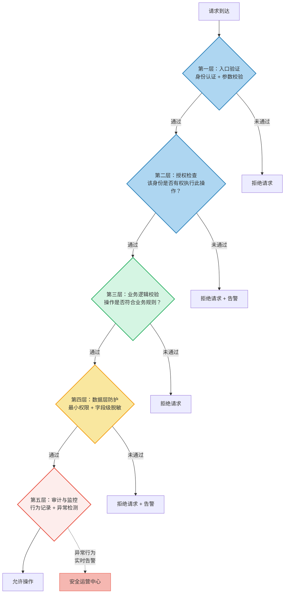

纵深防御的核心设计原则是：**每一层防线都假设前一层已经被突破。** 这不是悲观，而是工程上的务实——任何单点防御都有失效的可能，只有多层叠加才能让攻击的成本指数级增长。

> [!compare] 边界防御 vs. 纵深防御 vs. 零信任
> | 维度 | 边界防御 | 纵深防御 | 零信任 |
> |------|---------|---------|--------|
> | 信任模型 | "内网安全，外网危险" | "每层独立防御" | "永不信任，始终验证" |
> | 防御位置 | 入口处 | 多个层次 | 每一次访问 |
> | 攻击者突破边界后 | 长驱直入 | 遭遇下一层防线 | 仍然寸步难行 |
> | 典型实践 | 防火墙 + 参数校验 | 认证 → 授权 → 业务校验 → 数据防护 → 审计 | 服务间 mTLS + 细粒度 RBAC + 持续验证 |
> | 适合阶段 | 项目初期，快速上线 | 中等规模，有安全意识 | 大规模系统，高安全要求 |

> [!tip] 零信任的渐进式落地
> 零信任不是一天建成的。务实的路径是：
> 1. **先做到纵深防御**：至少在入口、业务逻辑、数据三层分别设防
> 2. **逐步消除隐式信任**：微服务之间的调用加入认证，内部 API 不再假设"调用方一定是自己人"
> 3. **最终迈向零信任**：每一次访问都经过验证，网络位置不再是信任依据
>
> **安全建设是一场持续的旅程，不是一个可以一次性完成的里程碑。**

### Runtime Capability Boundary：把信任边界落实为执行能力

身份验证回答“你是谁”，授权回答“你是否可以发起这个操作”，但安全还必须继续追问：**即使某段代码已经开始执行，它到底被允许做什么？**

Runtime 可以对执行中的代码施加能力边界：

```text
File Access          Network Access       System Call
Memory               CPU Time             Execution Time
Dynamic Code Loading Credential Access    Tool Calling
Plugin Permission    External Process      Database Permission
```

容器、Sandbox、WebAssembly、插件系统、浏览器 Runtime、Agent Runtime 与 Tool Runtime 的实现机制并不相同，但都在回答同一个架构问题：一个执行单元能获得哪些能力，这些能力能持续多久，超出边界后谁来阻止它。

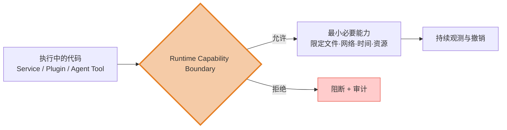

> [!important] 安全边界最终必须落实为运行时能力边界
> 写在文档里的“插件只能读取配置”不是安全边界；Runtime 中真正无法读取其他文件，才是安全边界。声明“Agent 只能调用查询工具”也不够；工具白名单、凭证隔离、资源配额与调用审计共同生效，约束才进入现实。

> [!danger] 血的教训：一次裸奔上线的代价
> 一位学长曾耗费大量心血部署上线了一个极具创意的项目——一个面向 C 端用户的社区平台。功能做得精巧，用户体验也不错，上线初期迅速吸引了一批种子用户。
>
> 但他毫无安全防御思维：**API 接口裸奔，没有任何鉴权机制**；管理后台使用了默认密码且暴露在公网上；数据操作接口没有做任何权限校验，任何人都可以通过篡改请求参数来操作他人的数据；接口也没有任何限流措施。
>
> 上线不到两周，灾难降临。攻击者通过遍历接口发现了管理后台，轻而易举地获取了最高权限。随后，**数据库中的用户数据被大规模清空和篡改**，核心业务数据被导出并在暗网上流通。面对满目疮痍的系统和高昂的数据恢复成本，更致命的是——用户的信任已经彻底崩塌。
>
> 项目最终被迫搁置，再未维护。几个月的心血，毁于对安全的无知。
>
> **这不是技术能力的问题，而是思维模型的缺失。** 他从未在心中扮演过"攻击者"的角色，因此从未意识到自己的系统在恶意目光下是何等脆弱。

## 4.3 假设突破（Assume Breach）：控制爆炸半径

即使你做到了纵深防御和零信任，仍然要接受一个残酷的现实：**绝对的安全是不存在的。** 零日漏洞、社会工程学攻击、内部人员泄密——总有一天，某一道防线会被突破。

真正成熟的防御者不是追求"不被攻破"，而是思考：**如果被攻破了，损失有多大？**

> [!important] Assume Breach：安全设计的最高原则
> **假设突破（Assume Breach）** 不是放弃抵抗，而是一种设计原则：
>
> 在设计系统的每一个环节，都假设"攻击者已经进入了系统的一部分"，然后问自己：
> - **他能走多远？** —— 攻击者从一个被突破的点出发，能横向移动到多少其他模块？
> - **他能看到什么？** —— 他能访问到多少敏感数据？
> - **他能破坏什么？** —— 他对系统的影响范围有多大？
>
> 这个范围，就是**爆炸半径（Blast Radius）**。安全架构的核心目标之一，就是**将每一次入侵的爆炸半径控制在最小**。

控制爆炸半径的三大支柱：

> [!note] 控制爆炸半径的三大支柱
> **支柱一：最小权限原则（Principle of Least Privilege）**
> 每个组件、每个服务、每个用户，只拥有完成其职责所**必需的最小权限**。一个负责读取用户信息的服务，不应该拥有删除数据的权限。一个普通用户，不应该能访问管理接口。权限不是"给够用的"，而是"给最少的"。
>
> **支柱二：数据隔离（Data Isolation）**
> 不同业务域的数据在存储、传输和处理层面相互隔离。即使攻击者突破了一个域的防线，也无法直接访问其他域的数据。隔离的层次包括：网络隔离、数据库隔离、加密隔离、权限隔离。
>
> **支柱三：不可篡改的审计日志（Immutable Audit Log）**
> 当入侵发生后，最紧迫的问题是"发生了什么"。如果攻击者能删除或修改日志，你将永远无法还原事件真相。审计日志必须是**只追加、不可修改、不可删除的**——它是事后的"黑匣子"，是取证和复盘的唯一依据。

当被突破的对象是插件、Agent Tool 或其他可扩展执行单元时，控制爆炸半径还必须检查它的 Runtime Capability：

```text
它能够读取整个文件系统吗？
能够访问全部 Credential 吗？
能够调用任意网络地址吗？
能够无限占用 CPU 或 Memory 吗？
能够无限创建任务吗？
能够执行任意 Tool 或加载任意代码吗？
```

如果答案是“可以”，那么逻辑上的模块隔离并没有形成真正的安全隔离。攻击者会沿着执行能力而不是架构图上的边界移动。

> [!important] 用 Runtime Capability 控制爆炸半径
> 控制爆炸半径不仅要划分服务边界和数据边界，还要划分执行能力。最小权限原则只有落实为文件、网络、凭证、工具、时间和资源的实际限制，才真正完成了从静态安全设计到动态安全行为的闭环。

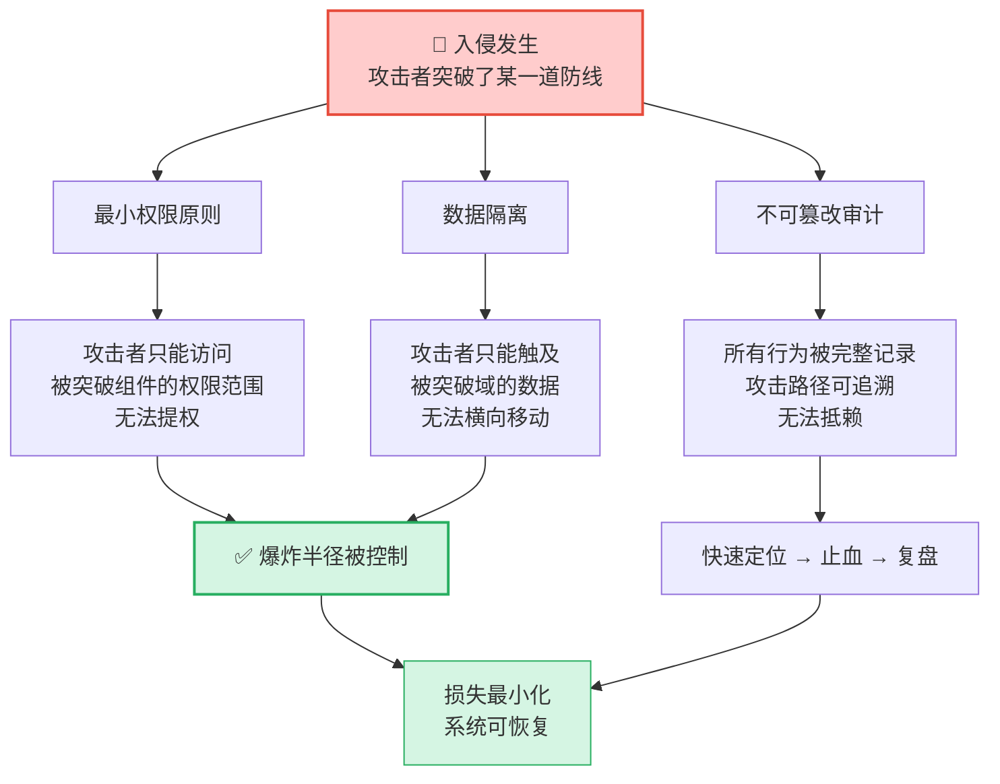

> [!question] 架构师的灵魂拷问
> 如果此刻，你的系统中某一个服务被完全攻破了——攻击者拥有了它的全部权限和数据：
> - 他能以此为跳板访问到多少其他服务？
> - 他能接触到哪些敏感数据？这些数据是否被加密保护？
> - 你能从日志中还原出他的完整攻击路径吗？
> - 你能在一个小时内止血吗？
>
> 如果这些问题你答不上来，说明你的系统**没有为"被攻破"做好准备**。

> [!tip] 从"城堡思维"到"舰船思维"
> 传统的安全思维像**城堡**——一道高墙保护所有东西，一旦城墙被攻破，全军覆没。
>
> Assume Breach 的思维像**舰船**——水密舱壁将船体分割为多个独立隔舱。即使一个舱室进水，关闭舱门后其他舱室仍然安全，船不会沉没。
>
> **你的系统是城堡还是舰船？**

## 4.4 权衡的艺术：安全、体验与成本的博弈

如果安全是唯一的目标，最简单的方案是：把系统关掉，断网，锁进保险柜——绝对安全，但毫无价值。

安全从来不是一个可以无限加码的维度。它必须与**用户体验、系统性能、开发迭代速度**之间取得平衡。这正是第 2 章所说的架构本质——**取舍**。

> [!warning] 安全过度的代价
> - **用户体验**：每增加一步验证，就流失一批用户。每多一次弹窗确认，用户就多一分烦躁。安全措施如果让用户感到"麻烦"，他们会选择绕过——或者离开。
> - **系统性能**：每一次加密解密、每一次签名校验、每一次权限查询，都是额外的计算开销。在高并发场景下，这些开销可能成为瓶颈。
> - **开发速度**：严格的安全规范意味着更多的代码审查、更多的测试用例、更长的交付周期。在业务验证阶段，这可能意味着错过市场窗口。

那么如何做出务实的权衡？

> [!important] 安全权衡的决策框架
> 安全投入的优先级，应该由两个维度共同决定：**资产价值** × **威胁概率**。
>
> | | 威胁概率低 | 威胁概率高 |
> |---|---|---|
> | **资产价值高** | 必须防护，但可适度投入 | **最高优先级**：核心链路的安全是不可妥协的 |
> | **资产价值低** | 基础防护即可 | 合理投入，但不要过度 |
>
> 核心原则：**安全投入应与风险等级成正比。** 不要在一个低风险的内部管理工具上投入与支付系统相同的安全资源。

安全、体验与成本之间的权衡，本质上是在回答一个问题：**我们愿意为多大的安全付出多大的代价？**

| 决策维度 | 安全优先 | 体验优先 | 成本优先 | 务实的权衡 |
|---------|---------|---------|---------|-----------|
| 身份验证 | 多因素认证 + 生物识别 | 免登录 / 社交账号一键登录 | 简单密码即可 | **分级策略**：普通操作轻验证，敏感操作强验证 |
| 数据加密 | 全链路加密 + 字段级加密 | 不加密，明文传输 | 仅传输加密 | **按数据敏感度分级**：核心数据加密，公开数据不加密 |
| 接口防护 | 全量签名校验 + 时间戳 + Nonce | 不校验，直接放行 | 仅关键接口校验 | **核心链路严防护，边缘接口适度放松** |
| 日志审计 | 全量操作审计 | 不记录 | 仅错误日志 | **敏感操作全量审计，普通操作采样记录** |

> [!tip] 安全设计的"二八法则"
> **80% 的安全收益来自 20% 的基础措施。** 务实的安全建设路径是：
> 1. **先做基础**：输入校验、鉴权、限流、敏感数据加密——这些措施成本低、收益高
> 2. **再加固核心**：核心链路的纵深防御、审计日志、数据隔离
> 3. **最后精雕**：零信任、高级威胁检测、自动化安全响应
>
> 不要在第一步还没做好的时候就去追求第三步。**安全的地基不牢，上面盖再高的墙也会塌。**

> [!important] 安全视角回归全域架构观
> 安全不是一个独立的技术领域，而是**贯穿产品、架构、开发、运维全生命周期的横切关注点**。
> - **产品层面**：哪些功能涉及敏感数据？用户信任的边界在哪里？
> - **架构层面**：如何划分信任域？如何设计纵深防御？如何控制爆炸半径？
> - **开发层面**：如何用代码实现最小权限？如何防止常见攻击面？
> - **运维层面**：如何检测入侵？如何快速响应和恢复？
>
> **安全视角的缺失，不会让系统在平时出问题——它会让系统在最关键的时刻崩塌。** 它是全域架构观中唯一一个"平时无感、出事致命"的维度。

> [!summary] 第四部分小结
> 安全视角补全了防御性编程的盲区——它防备的不是无心之失，而是**蓄意的恶意**。它要求我们：
> - 用**红队思维**打破 Happy Path 幻觉——以攻击者的眼光审视系统的每一个薄弱点
> - 用**纵深防御与零信任**构建多层防线——不依赖单一防线，每一层都假设前一层已被突破
> - 用 **Assume Breach** 控制爆炸半径——承认绝对安全不存在，但确保每一次入侵的损失可控
> - 用 **Runtime Capability Boundary** 落实最小权限——限制执行中的文件、网络、凭证、工具与资源能力
> - 用**务实的权衡**平衡安全与体验——安全投入与风险等级成正比，不做过度防护
>
> **在黑暗森林中，最危险的不是野兽，而是以为森林里没有野兽的幻觉。安全视角的价值，就是让你在设计系统时，始终保有一双看见黑暗的眼睛。**

---

# 5. 运维与演进视角 —— 解决"如何面对真实世界的考验"（The Run & Maintain）

> [!note] 本章核心立场
> 代码通过测试、合入主干、部署上线——这只是故事的一半。另一半是：**系统在真实世界中如何运行、如何失败、如何被观测、如何随时间演进。** 很多系统不是死于设计缺陷，而是死于对运维现实的无知。

## 5.1 面向失败设计（Design for Failure）：抛弃"一切正常"的假设

在分布式系统中，有一个非常关键的心态转变：**不要假设任何事情是可靠的。** 网络可能延迟、服务可能宕机、磁盘可能写满、第三方 API 可能超时——把这些看作常态，而不是异常。

> [!question] 面向失败设计要回答的问题
> - 如果这个下游服务返回错误，我的系统怎么办？
> - 如果请求量突然暴涨 10 倍，系统会怎样？
> - 如果缓存集群挂了，我的服务还能正常工作吗？
> - 如果我在修复 bug 期间，用户发生了异常操作，数据会不一致吗？

面向失败设计的思维层次——**防御纵深**：

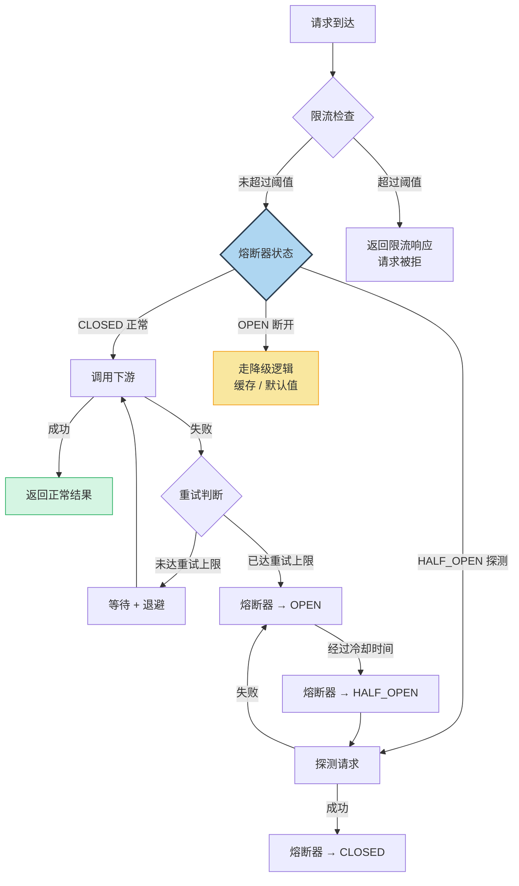

> [!important] 面向失败设计的三个层次
> **第一层：重试（Retry）**
> - 适用场景：瞬时故障（网络闪断、连接池满）
> - 要点：必须配合退避策略（Exponential Backoff），防止重试风暴
> - 反例：失败后立即重试 3 次，等于给已经过载的系统又踹了三脚
>
> **第二层：熔断（Circuit Breaker）**
> - 适用场景：持续故障（下游服务宕机、慢查询）
> - 要点：快速失败，给下游恢复的时间
> - 模式：CLOSED（正常）→ OPEN（断开）→ HALF_OPEN（探测恢复）
>
> **第三层：降级（Degradation）**
> - 适用场景：部分能力不可用时的优雅兜底
> - 要点：核心功能不受影响，边缘功能可牺牲
> - 精髓：**降级不是"报错"，而是"提供一个合理的替代方案"**

这些机制不是散落在业务代码里的“异常处理技巧”，它们实际上是在**重新定义失败发生时的执行路径**。

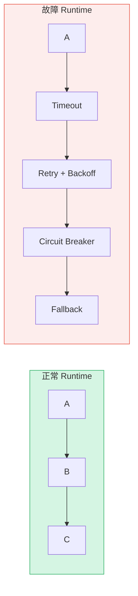

在正常路径中，调用关系可能只是 `A → B → C`；故障时，超时多长、是否重试、重试几次、何时熔断、降级返回什么，共同构成了另一套 Runtime。没有提前设计这条路径，系统就会在压力最大、信息最少的时候临时决定如何行动。

> [!important] Design for Failure 也是 Runtime Design
> 面向失败设计，本质上是在提前设计异常情况下 Runtime 应该怎么执行。失败是必然的，但失败后的控制流、资源消耗与传播范围可以被设计。

降级策略的设计需要提前思考，而不是在故障发生时才临时决定：

> [!tip] 降级策略的设计原则
> - **区分核心路径与非核心路径**：核心路径（如支付）不可降级，非核心路径（如推荐、评论）可以返回缓存或默认值
> - **降级方案应该是"静默"的**：用户感知到功能简化了，但不应该感知到系统出了故障
> - **降级是可逆的**：当下游恢复时，系统应该自动从降级状态回到正常状态

## 5.2 可观测性：让系统主动"说话"——闭环的测量层

很多时候，系统出问题不可怕，可怕的是**出了问题你不知道**，或者**你知道出问题了，但完全不知道问题出在哪**。

可观测性（Observability）就是解决这个问题的。它包括三个核心支柱：

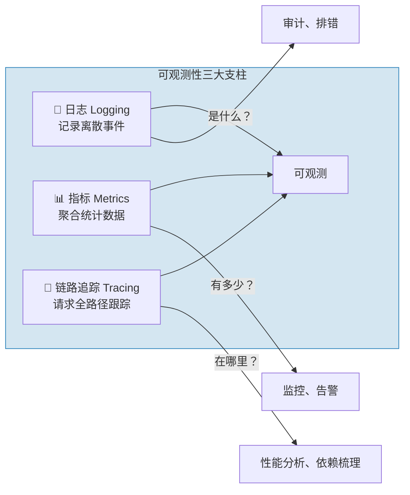

> [!compare] 三大支柱的定位
> | 维度 | 日志（Logging） | 指标（Metrics） | 链路追踪（Tracing） |
> |------|----------------|----------------|-------------------|
> | 数据类型 | 文本事件 | 时序聚合数据 | 请求级链路 |
> | 回答的问题 | 这个请求报了什么错？ | 系统当前 QPS/延迟/错误率是多少？ | 这个请求经过了哪些服务？哪一步最慢？ |
> | 存储量 | 大 | 小 | 中 |
> | 适合的场景 | 异常排查、审计 | 实时监控、告警 | 性能瓶颈分析、依赖梳理 |

可观测性不是上线后才考虑的"运维基建"，而是**从第一行代码开始就应该融入开发习惯**。

> [!important] Observability 就是看见 Runtime
> 代码告诉我们系统**应该**怎么运行；Observability 告诉我们系统**实际上**是怎么运行的。它是静态设计和动态现实之间的测量层。

三大支柱分别从不同尺度观察执行世界：

### Logs：Runtime 中发生了什么离散事件？

日志记录一次超时、一次重试、一次权限拒绝或一次状态切换。它提供具体上下文，帮助我们还原某个时刻“发生了什么”。

### Metrics：Runtime 当前整体状态如何？

指标把大量执行行为聚合为趋势和分布：

```text
CPU       Memory      QPS          Latency
GC        Queue Depth Thread Count Connection Pool
Retry     Error Rate  Token Usage  Task Duration
```

单条日志无法回答队列是否持续增长，而 Queue Depth 的时间序列可以；平均延迟看似正常时，P99 能暴露少数用户正在经历的长时间等待。

### Tracing：一次执行到底经过了哪里？

Tracing 把服务、队列、数据库和外部调用串成一次真实执行路径。静态依赖图说“可能调用谁”，Trace 说“这一次实际调用了谁、在哪里等待、哪一步失败”。

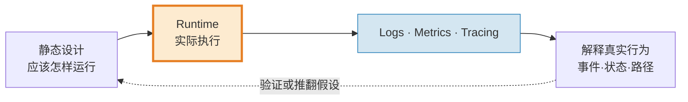

> [!note] 日志规范三条黄金法则
> 1. **有层次的日志**：`ERROR`（系统不可用）→ `WARN`（预期之外的状况）→ `INFO`（关键业务流程）→ `DEBUG`（调试细节），不要所有日志都用同一个级别
> 2. **可搜索的日志**：关键信息（业务 ID、用户 ID、链路 ID）一定要出现在日志里。没有上下文的日志等于没写
> 3. **可理解的日志**：一条日志应该让值班的同学不需要翻代码就能大致明白发生了什么：
>    - ❌ `Update failed: null`
>    - ✅ `订单[ORD-20240506-001] 支付状态更新失败：支付网关返回超时 (orderId=123, userId=456, traceId=abc-def)`

> [!warning] 没有可观测性的代价
> 想象你接手了一个线上告警："订单成功率跌到 50%"。没有链路追踪、没有结构化日志、没有监控大盘。
>
> 你只能一台台机器登录上去翻日志。半小时后你终于在几十 G 的日志里找到了一个异常，但日志里没有订单号，没有调用堆栈。你完全不知道这是哪个场景触发的。
>
> 这就是在**盲飞**。可观测性不是锦上添花，而是生产系统的必备基础设施。

> [!important] 可观测性在决策闭环中的位置
> 可观测性是**连接运维视角与产品视角的桥梁**。它不仅帮助你发现和定位技术问题，更能提供业务层面的洞察：
> - 指标告诉你**用户行为的真实分布**（哪些功能被高频使用，哪些几乎无人问津）
> - 日志告诉你**用户在哪里遇到了困难**（错误率高的路径就是用户体验的痛点）
> - 链路追踪告诉你**系统的性能瓶颈在哪里**（影响用户体验的延迟集中在哪一步）
>
> 这些信息，是下一轮产品决策和技术优化的**数据基础**。

## 5.3 架构是活的：重构不是大翻修，而是融入日常的"童子军军规"

很多人有一个误区：认为好的架构是在项目开始时由架构师"画"出来的——画好一张完美的架构图，然后开发团队照着实现就好。

但现实是：

```mermaid
flowchart LR
    Phase1["📐 开始前，架构图完美无瑕"] -->|"上线半年"| Phase2["🏗️ 实现中，架构图已经开始失真"]
    Phase2 -->|"上线两年"| Phase3["🗺️ 实际部署中，架构图和实际代码已经毫无关系"]
    Phase3 --> Phase4["📜 架构图最终的归宿——废弃的文档"]

    style Phase1 fill:#d5f5e3,stroke:#27ae60
    style Phase4 fill:#ffcccc,stroke:#ff0000
```

**架构不是静态的设计图，而是活的结构。** 真正的架构是在持续的迭代中，通过无数次小小的重构、调整和学习，逐步塑造成形的。

如果承认架构是演进的，那么重构就不是"代码洁癖"，而是**架构治理的核心手段**。

> [!important] 避免"重构陷阱"
> - ❌ "我先不管代码多烂，把功能做出来，后面再统一重构" → **后面永远不会到来**
> - ✅ "每次修改都顺手把周围代码**整理得比来的时候更干净一点**"（童子军军规）
> - ❌ "我们停下来一个月专门重构" → **业务不会等你，风险极高**
> - ✅ "重构融入到每次迭代中，每次改动都带走一些技术债"

```mermaid
graph TD
    subgraph R[正确的演进模式]
        T1(当前状态) -->|小步重构| T2(更好状态)
        T2 -->|小步重构| T3(更好状态)
        T3 -->|持续改进| Tn(持续演进)
    end

    subgraph W[错误的模式]
        P1(当前状态) -->|忽略问题| P2(继续恶化)
        P2 -->|积累技术债| P3(系统腐化)
        P3 -->|推倒重写| P4(回到起点)
    end

    style T1 fill:#d5f5e3,stroke:#27ae60
    style Tn fill:#d5f5e3,stroke:#27ae60
    style P4 fill:#ffcccc,stroke:#ff0000
```

> [!tip] 日常重构三问
> 每次修改代码时，问自己三个问题：
> 1. **我让代码更好了吗？** —— 修改后代码的可读性、可维护性是提升了还是下降了？
> 2. **我留下了备用的"逃生门"吗？** —— 如果这次修改有问题，能快速回滚吗？
> 3. **我留下记录了吗？** —— 其他人能通过提交记录或注释理解我为什么这么改吗？

## 5.4 从可观测到可控：把运行时行为纳入工程治理

看见问题是必要条件，却不是工程闭环的终点。成熟系统需要经历三个阶段：

```text
第一阶段：能运行
↓
第二阶段：能看见
↓
第三阶段：能控制
```

“能控制”不是随意修改生产环境，而是在明确权限、风险和审计边界下，对关键执行行为进行限制、调整、终止与恢复。

```mermaid
flowchart LR
    Run["Run<br/>运行"] --> Observe["Observe<br/>观测"]
    Observe --> Understand["Understand<br/>理解"]
    Understand --> Control["Control<br/>控制"]
    Control --> Feedback["Feedback<br/>反馈"]
    Feedback --> Evolve["Evolve<br/>演进"]
    Evolve -.->|"新的设计进入执行"| Run

    style Observe fill:#d4e6f1,stroke:#2980b9
    style Control fill:#fdebd0,stroke:#e67e22,stroke-width:3px
    style Evolve fill:#d5f5e3,stroke:#27ae60
```

### Runtime Control Plane：把执行策略提升为治理能力

现代系统常见的 Runtime 控制能力包括：

```text
Dynamic Configuration  Feature Flag      Rate Limit
Timeout                Retry Policy      Circuit Breaker
Resource Quota         Priority          Scheduling Policy
Plugin                 Hook              Middleware
Traffic Shaping        Canary            Degradation
Kill Switch
```

这些能力的共同本质，不是“配置比较多”，而是：**把原本写死在代码里的执行策略，提升成可以在运行过程中治理的控制面。**

例如，限流阈值不再必须通过重新编译才能调整；Feature Flag 可以控制新路径只对少量流量开放；Kill Switch 可以在外部依赖异常时停止高风险能力；资源配额可以阻止单个租户、插件或 Agent 任务吞噬整个系统。

但控制面本身也会增加复杂度和风险：动态策略可能互相冲突，错误配置可能比代码 bug 扩散更快，权限过大可能让一次误操作影响全局。因此每项控制能力都需要明确作用域、默认值、变更审计、回滚路径和故障安全状态。

> [!warning] 控制面不是“万能旋钮”
> 控制力需要用复杂度购买。只有那些确实需要在部署之外快速治理、并且能够被安全验证的策略，才值得进入 Runtime Control Plane。其余逻辑保持静态、简单和可测试，往往更可靠。

### 从“程序”到“执行系统”

传统思维是：

> 我写好程序 → 编译 → 部署 → 运行。

成熟系统的思维是：

> 我设计一个可以持续被**观测、限制、调整和恢复的执行系统**。

这意味着开发交付的不只是业务代码，还包括可度量的 Runtime Contract、明确的资源边界、可以演练的故障路径、受权限保护的控制能力，以及让生产反馈进入下一轮设计的证据链。

> [!important] 成熟 Runtime 的判断标准
> 一个成熟的 Runtime，不只是能够执行代码。
>
> 它还应该让系统的关键执行行为：**可观测、可解释、可限制、可干预、可恢复。**

至此，Runtime 暗线形成闭环：架构设计执行模型，开发按模型实现，安全限制执行能力，运维观测并调控真实行为，生产证据再反馈产品和架构。Runtime 仍然不是第六个维度，而是五个维度得以接受现实检验的共同执行层。

> [!summary] 第五部分小结
> 运维与演进视角补全了决策闭环的最后一环。它要求我们：
> - 用**面向失败设计**预先定义故障 Runtime——重试、熔断、降级重写异常执行路径
> - 用**可观测性**看见 Runtime——日志记录事件、指标描述状态、追踪还原路径
> - 用**持续重构**保持架构的生命力——让静态结构持续匹配运行时现实
> - 用 **Runtime Control Plane** 治理关键行为——在受控边界内限制、调整、终止与恢复
>
> **系统上线不是终点，而是静态设计接受动态现实检验、并持续反馈演进的起点。**

---

# 6. 结语：思维的闭环

## 6.1 总结：五个维度，一个闭环

让我们把全文的核心浓缩为五句话：

> [!important] 全域架构观的五维法则
> **产品定边界** —— 在动手之前，先确认做的事是对的。穿透需求看本质，用减法思维守住系统边界。
>
> **架构做权衡** —— 没有完美的方案，只有最不坏的妥协。把产品意图翻译为 NFR，用深模块思维设计结构，用清醒的取舍对抗复杂度。
>
> **开发控细节** —— 代码是架构的最终载体。用契约精神设计接口，用防御性编程构建健壮性，用 YAGNI 原则克制过度设计。
>
> **安全护底线** —— 系统不仅要防无心之失，更要防蓄意之恶。用红队思维审视弱点，用纵深防御构建多层防线，用 Assume Breach 控制爆炸半径。
>
> **运维保演进** —— 系统上线才是考验的开始。面向失败设计，让系统在故障中存活；建设可观测性，让系统主动说话；持续重构，让架构保持生命力。

```mermaid
flowchart TD
    P["🎯 产品定边界\n做什么、不做什么"]
    A["🏗️ 架构做权衡\n约束下的最优妥协"]
    D["💻 开发控细节\n代码层面的纪律与品味"]
    S["🛡️ 安全护底线\n黑暗森林中的生存法则"]
    O["🔧 运维保演进\n面对真实世界的考验"]

    P -->|"约束"| A
    A -->|"指引"| D
    D -->|"交付"| S
    S -->|"安全基线"| O
    O -->|"反馈"| P

    P -.-|"验证假设"| O
    A -.-|"度量设计"| O
    D -.-|"实现意图"| A
    S -.-|"安全事件复盘"| A

    style P fill:#e8f8f5,stroke:#1abc9c,stroke-width:2px
    style A fill:#ebf5fb,stroke:#3498db,stroke-width:2px
    style D fill:#fef9e7,stroke:#f1c40f,stroke-width:2px
    style S fill:#f5cba7,stroke:#e67e22,stroke-width:2px
    style O fill:#fdedec,stroke:#e74c3c,stroke-width:2px
```

五维法则保持不变，但现在我们能够看见它们共同作用的另一条暗线：

```text
产品决定价值
↓
架构决定机制
↓
开发决定实现
↓
安全决定能力边界
↓
运维观察现实
↓
反馈下一轮决策

Runtime
=
这一切最终发生作用的执行世界
```

产品不是直接“管理 Runtime”，却决定启动速度、响应延迟、资源成本和任务成功率是否值得优化；架构选择执行模型；开发实现执行语义；安全限制执行能力；运维用观测和控制让现实反馈设计。**Runtime 横切五维，但不取代任何一维。**

## 6.2 呼应开头：每一次代码提交，都是在做架构决策

回到文章最开始的问题：为什么需要全域架构观？

因为**每一行代码都在同时回应五个维度的问题**：

- 它是否服务于正确的业务目标？（产品）
- 它是否与系统的整体结构一致？（架构）
- 它是否具备应有的健壮性和可演进性？（开发）
- 它是否能抵御蓄意的恶意攻击？（安全）
- 它是否能在真实世界的考验中存活？（运维）

而每一行代码，其实还有两种形态：

> [!compare] 每一行代码的两种形态
> | 静态意图 | Runtime 中的真实行为 |
> |---|---|
> | 源码里的一次函数调用 | 可能意味着线程切换、网络等待和对象分配 |
> | 源码里的一个循环 | 可能意味着 CPU 被持续占用 |
> | 源码里的一个 Retry | 可能意味着故障时的流量放大 |
> | 源码里的一个缓存 | 意味着内存生命周期和一致性问题 |
> | 源码里的一个 Plugin | 意味着新的执行权和安全边界 |

第一种是源码中的静态意图，第二种是 Runtime 中的真实行为。只对第一种负责，会让我们在 Code Review 中得到结构正确的代码，却在生产环境中得到不可预测的系统。

当你选择了清晰的命名而不是模糊的缩写，你就在塑造可维护性。
当你主动处理了异常边界而不是放任崩溃，你就在塑造可靠性。
当你思考了接口的扩展性而不是硬编码当前需求，你就在塑造扩展性。
当你为每一个接口加上了鉴权和限流，你就在塑造安全性。
当你记录了上下文和设计决策而不是匆匆提交，你就在塑造团队效率。
当你为一个功能做了减法而不是盲目堆砌，你就在塑造产品的聚焦度。

同样，当你为队列设置边界、为任务定义取消语义、为重试配置退避、为插件限制能力、为关键路径补上 Metrics 和 Trace 时，你不仅是在处理“底层细节”，也是在塑造系统运行起来的样子。

> [!important] 从设计系统的结构，到设计系统的执行过程
> **成熟的工程师不仅对代码“写了什么”负责，也对代码“运行之后发生什么”负责。**
>
> 抽象可以帮助我们隐藏复杂度，但不能让我们失去对执行成本的认知；架构可以描述系统长什么样，但还必须回答系统如何活着。

### 全域架构观的双轴模型

纵向，五维闭环回答软件生命周期中“谁在做什么决策”；横向，运行时暗线回答这些决策“如何从意图进入执行，再从现实反馈演进”。两条轴不是两套方法论，而是观察同一个系统的两个方向。

```mermaid
flowchart TB
    subgraph V["纵向：五维决策闭环"]
        direction TB
        P["产品<br/>定义价值与边界"] --> A["架构<br/>选择机制与权衡"]
        A --> D["开发<br/>落实代码与契约"]
        D --> S["安全<br/>约束能力与底线"]
        S --> O["运维<br/>观测、控制与恢复"]
        O -.->|"生产反馈"| P
    end

    subgraph H["横向：从静态意图到动态演进"]
        direction LR
        I["Intent<br/>意图"] --> ST["Structure<br/>结构"]
        ST --> EX["Execution<br/>执行"]
        EX --> OB["Observation<br/>观测"]
        OB --> CO["Control<br/>控制"]
        CO --> EV["Evolution<br/>演进"]
        EV -.->|"新一轮意图"| I
    end

    P -.-> I
    A -.-> ST
    D -.-> EX
    S -.-> EX
    O -.-> OB
    O -.-> CO
    EV -.-> P

    style EX fill:#fdebd0,stroke:#e67e22,stroke-width:3px
    style V fill:#f8f9f9,stroke:#7f8c8d
    style H fill:#f8f9f9,stroke:#7f8c8d
```

> [!summary] 双轴统一
> **全域架构观不仅要求看到软件生命周期的全部决策维度，还要求同时看到系统的静态结构与动态行为。**
>
> 真正的全域思维，是从产品一路看到运维，从源码意图穿透到 Runtime 事实，再用观测与控制获得的生产证据反馈下一轮设计。

> [!summary] 最后的升华
> 你写下的每一行代码，**要么是在减少系统复杂度，要么是在增加技术债。** 没有中间状态。
>
> 全域架构观不是某个周末学来的技能，而是在每一次决策中刻意练习的**视角**。它要求你同时看到五个维度：产品的方向、架构的约束、代码的品质、安全的底线、运维的现实。
>
> 它还要求你同时保有两种观察方式：用静态视角理解系统被设计成什么样，用动态视角理解系统真正运行起来是什么样。
>
> 从今天开始，试试在每次做完一个功能后，多花五分钟问自己一个问题：
>
> > **"我刚才的每一个决策——做什么、怎么做、做到什么程度、出了问题怎么办——是否构成了一个完整的、自洽的闭环？"**
>
> 如果你的答案是"Yes"，那么恭喜，你已经不只是一个"写代码的人"——你是一个**用代码构建系统的人**。
>
> **成熟的开发者，不仅设计系统“长什么样”，还设计系统“如何活着”。**

---

> [!note] 附录：全文核心概念索引
> | 概念 | 出处 | 核心要义 |
> |------|------|---------|
> | 战术编程 vs. 战略编程 | Ousterhout | 把代码当消耗品 vs. 把代码当投资 |
> | 业务上下文三问 | 本文 | 定位、演变方向、使用者 |
> | NFR（非功能性需求） | 业界共识 | 功能之外的质量属性 |
> | Runtime Behavior | 本文 | NFR 在调度、资源、状态与失败中的真实表现 |
> | Runtime Architecture | 本文 | 从控制流、资源流和策略观察系统如何执行 |
> | Runtime Contract | 本文 | 接口除输入输出外的阻塞、并发、取消、时限与生命周期承诺 |
> | 系统复杂度三大症状 | Ousterhout | 变更放大、认知负荷、未知的未知 |
> | 运行时复杂度 | 本文 | 源码可读但执行过程仍难以推理的动态复杂度 |
> | 深模块 vs. 浅模块 | Ousterhout | 里子比面子大 vs. 面子比里子大 |
> | 防御性编程 | 业界共识 | 永远不信任外部输入 |
> | 红队思维（破坏者视角） | 安全攻防 | 以攻击者眼光审视系统，打破 Happy Path 幻觉 |
> | 纵深防御（Defense in Depth） | 安全架构 | 多层独立防线，每一层假设前一层已被突破 |
> | 零信任（Zero Trust） | 安全架构 | 永不信任，始终验证，网络位置不再是信任依据 |
> | Assume Breach / 爆炸半径 | 安全设计 | 假设入侵已发生，设计上控制单次入侵的影响范围 |
> | Runtime Capability Boundary | 本文 | 把最小权限落实为执行中的文件、网络、资源与工具能力限制 |
> | 面向失败设计 | 分布式系统实践 | 重试、熔断、降级三层次 |
> | YAGNI 原则 | 极限编程 | 不为当前不需要的功能编写代码 |
> | 可观测性三支柱 | 业界共识 | 日志、指标、链路追踪 |
> | Runtime Control Plane | 本文 | 将关键执行策略提升为可审计、可回滚的运行时治理能力 |
> | 童子军军规 | Robert C. Martin | 让代码比你来时更干净 |
