# 0. 引言：软件工程的上帝视角

## 0.1 痛点：只盯代码导致的"实现者困境"

在日常开发中，我们经常遇到这样的场景：一个看似简单的新需求，开发花三天写完代码，自测通过后自信地提测。结果测试一跑，发现修改影响了三个看似毫不相关的模块，线上出了故障，全员回滚修复。

问题出在哪？不是代码写得不对，而是**写代码时只盯着眼前的一个点，没有看到系统这个面**。

这就是典型的"**实现者困境**"——我们太擅长把需求翻译成代码，却忽略了代码所栖身的系统是一个不断演化的生命体。每一行新代码都在改变系统的结构、耦合关系和运行时行为。当团队中每个人都只关注自己的一亩三分地时，日积月累，系统就会悄然走向腐化。

但实现者困境有一个更隐蔽的变体：**即便是具备了架构思维的开发者，也容易陷入另一个陷阱——只从技术维度思考系统**。他们能画出漂亮的架构图，能写出高内聚低耦合的模块，却在产品方向偏移时浑然不觉，在线上故障面前手足无措。技术上无懈可击的系统，如果做了一个没人需要的产品，或者上线后无法被观测和维护，其价值等于零。

> [!warning] "屎山"是如何诞生的？
> 它从来不是一次灾难性的设计失误造成的，而是无数次"这里先凑合一下""后面再重构""这个逻辑放这里也行"的**微小妥协的累积**。每一次战术性妥协，都在系统的复杂度账户上记了一笔债。缺乏全局视角的开发，就像是蒙着眼砌墙——每一块砖都放得很稳，但整面墙可能是歪的。

## 0.2 跃迁：从"战术级功能的实现者"到"战略级系统的定义者"

John Ousterhout 在《软件设计的哲学》中提出了一个关键区分：**战术编程 (Tactical Programming)** 与**战略编程 (Strategic Programming)**。

> [!important] 战术编程 vs. 战略编程
> **战术编程**的核心心态是"**把这版功能跑通就行**"——每个需求来了，以最快的速度、最短的路径实现功能，至于代码结构好不好、接口设计合不合理、这次改动给系统增加了多少复杂度——**那是以后的事**。这种思维模式的诱惑在于：它让你在当下感觉"效率很高"，但代价是每一行仓促的代码都在悄悄地往系统里埋雷。
>
> **战略编程**则完全不同——它把**设计良好、易于维护的系统结构视为一项长期投资**。它承认好设计需要多花一点时间（比如 10%~20%），但从系统整个生命周期的投入产出比来看，这点前期投入是微不足道的。战略编程的工作方式不是"写完了就跑了"，而是在每一次决策时主动问自己：**我是在减少系统复杂度，还是在增加它？**

但仅有"战术 vs 战略"的二分还不够。战略编程的"战略"到底指向哪里？如果只关注代码层面的战略（接口设计、模块划分），而忽略了产品方向的战略（做什么、不做什么）和运维层面的战略（如何面对失败、如何观测），那本质上仍是一种**局部最优的战术行为**。

我们需要的，是一次从**局部战略**到**全域战略**的跃迁。

## 0.3 核心主张：全域架构观——软件工程的决策闭环

> [!important] 全域架构观的核心公式
> **产品定边界，架构做权衡，开发控细节，运维保演进。**
>
> 这四个维度不是独立的阶段，而是一个**闭环**：运维中发现的问题反馈给架构做调整，架构的约束指引开发的实现，开发中的技术现实反哺产品的可行性判断，产品的演进方向又驱动下一轮架构决策。**任何一个维度的缺失，都会让整个闭环断裂。**

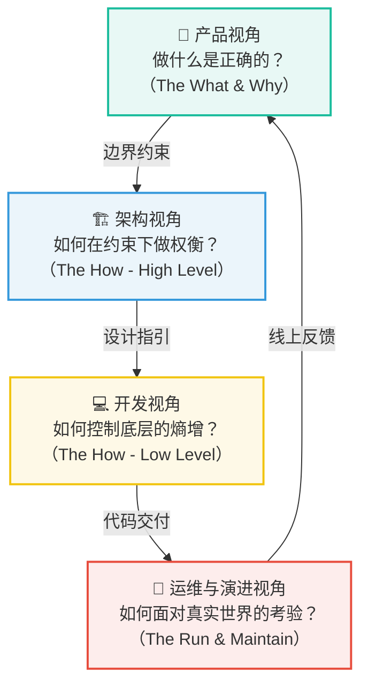

这篇文章的目的，就是帮你建立这四维统一的**上帝视角**——不是让你在每个维度都成为专家，而是让你在做任何一个维度的决策时，都能看到它与其他三个维度的联动关系。

---

# 1. 产品视角 —— 解决"做什么是正确的"（The What & Why）

> [!note] 本章核心立场
> 在所有技术决策之前，有一个更根本的问题：**我们做的事情是否值得做？** 最精妙的架构，如果服务于一个伪需求或一个过度膨胀的产品，就是在用工程能力做负功。产品视角是整个决策闭环的起点，也是最容易被技术团队忽视的一环。

## 1.1 需求溯源：穿透用户的"解决方案"到"真实痛点"

开发者接到需求时，最常见的反应是"怎么做"。但更重要的问题是"为什么要做"。

用户和产品经理提出的，往往是**他们心中的解决方案**，而不是**他们真正面临的问题**。如果我们不穿透表面的解决方案，直接按描述去实现，很可能会做出一个技术上正确但业务上无效的东西。

> [!question] 需求溯源的灵魂三问
> 1. **这个需求要解决谁的什么问题？** —— 明确用户画像和核心痛点。
> 2. **在没有这个功能之前，用户是怎么解决的？** —— 理解现有路径，判断新方案的增量价值。
> 3. **如果这个需求不做，用户会怎样？** —— 这个问题最犀利。如果答案是"没什么影响"，那你可能正在处理一个伪需求。

一个经典的例子：产品经理说"我们需要在商品详情页加一个用户标签系统"。如果你直接开始设计标签的数据库模型、CRUD 接口、前端展示——你就掉进了"实现者陷阱"。你首先应该追问："这个标签系统要解决什么业务问题？" 答案可能是"运营想针对不同用户群体展示不同的商品推荐"。那么真正的解法可能是"基于用户分群的内容差异化展示"——标签只是其中一种实现手段，甚至不一定是最优的。

> [!tip] 思维模型：区分"问题空间"和"解法空间"
> **问题空间（Problem Space）**：用户面临的真实困境、真实诉求。它是稳定的、收敛的。
> **解法空间（Solution Space）**：可能的解决方案。它是发散的、可变的。
>
> 优秀的技术决策，是在**充分理解问题空间之后**，从解法空间中选择最匹配当前约束的方案。而不是拿到一个解法就直接执行——那等于把别人未经验证的假设当成了事实。

## 1.2 边界感与减法：决策的核心在于"不做什么"

软件工程中，最昂贵的决策不是"做了什么"，而是"做了不该做的"。每一个不必要的功能，都是一笔永久的维护成本——它需要测试、需要文档、需要兼容性保障、需要在每次重构时被考虑。

> [!important] MVP 的真正含义
> MVP（最小可行性产品）不是"做一个残缺的版本赶紧上线"。MVP 是一种**假设验证工具**——用最小的投入，去验证你对"用户需要什么"的核心假设是否成立。
>
> 它的核心精神是**减法思维**：不是问"这个功能要不要做"，而是问"**砍掉这个功能，我们还能验证核心假设吗？**" 如果能砍，就砍。

边界的确立需要回答三个问题：

| 问题 | 思考方向 | 示例 |
|------|---------|------|
| **做什么？** | 核心价值链路，必须闭环 | 用户能完成下单并支付 |
| **不做什么？** | 明确画出系统边界，拒绝膨胀 | 不做退款系统，人工处理（初期） |
| **做到什么程度？** | 质量标准与业务阶段匹配 | MVP 阶段可接受人工介入，规模化后必须自动化 |

> [!warning] "做加法"的诱惑
> "这个功能很小，加上也就半天的事。" —— 这句话是系统膨胀的开端。每一个"很小的功能"都有隐性成本：它需要被测试、被维护、被兼容。当这样的"小功能"积累了几十个，系统就变成了一个功能堆积的怪兽——每个功能单独看都合理，合在一起却无法维护。
>
> **每一次说"不"，都是在保护系统的可维护性。**

## 1.3 闭环思维：技术决策始终服务于业务价值交付

产品视角不仅是需求评审阶段的事，它必须贯穿整个开发生命周期。每一个技术决策，最终都要回到一个问题：**它为用户创造了什么价值？**

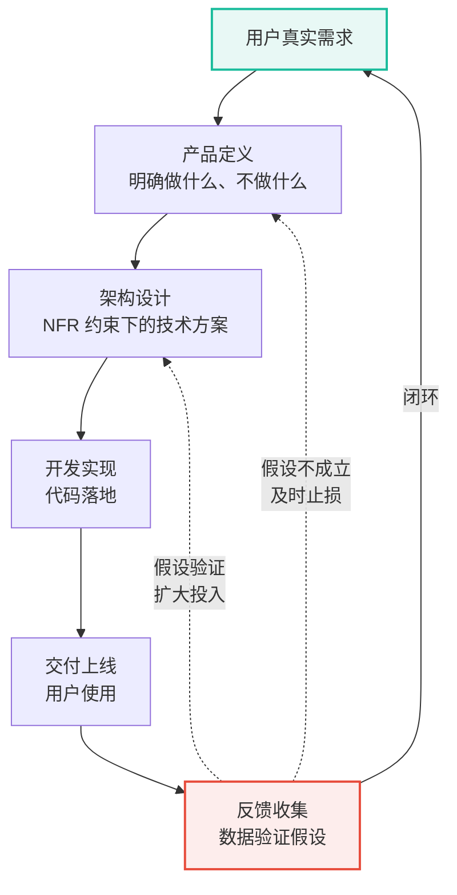

这个闭环意味着：

- **技术选型不是炫技，而是服务于交付节奏。** 选择一个团队不熟悉的新技术栈，意味着学习成本和交付延迟——这在业务验证阶段可能是不可接受的。
- **过度设计的本质是用工程时间赌未来需求。** 如果赌对了，省的是未来的重构时间；如果赌错了（大部分时候都会），浪费的是当下的交付速度。
- **技术债的管理必须与业务节奏对齐。** MVP 阶段可以接受合理的技术债（前提是**明确记下**），规模化阶段必须偿还。

> [!important] 全域架构观的第一条法则
> **技术永远服务于业务，但业务不能无视技术约束。** 二者是双向约束关系，不是单向服从关系。好的技术 leader 既不会盲目执行产品需求，也不会用技术难度来推脱业务诉求——他会在两者之间找到最优平衡点。

> [!summary] 第一部分小结
> 产品视角解决的是"做什么"和"不做什么"的根本问题。它要求我们穿透表面需求去理解真实痛点，用减法思维确立系统边界，用闭环思维确保技术投入始终产生业务价值。**没有产品视角的技术决策，就像没有目的地的航行——船再坚固，也不知道该驶向何方。**

---

# 2. 架构视角 —— 解决"如何在约束下做权衡"（The How - High Level）

> [!note] 本章核心立场
> 架构是将产品意图翻译为系统结构的**翻译层**。它的任务不是追求技术上的完美，而是在业务需求、技术约束和团队能力的多重限制下，找到**最不坏的方案**。

## 2.1 翻译需求：从产品边界到非功能性需求（NFR）

多数开发者容易陷入一个思维习惯：**"需求说做什么，我就做什么。"** 需求文档要求"用户下单后发送通知"，那就实现一个发通知的功能。功能测试通过了，任务就算完成了。

但真正决定系统质量的，从来不是功能性需求，而是那些**没有写进需求文档的非功能性需求（Non-Functional Requirements, NFR）**。

NFR 是产品需求到架构设计的**翻译桥梁**。产品说"要快"，架构要翻译成"P99 延迟 < 200ms"；产品说"要稳定"，架构要翻译成"单节点故障时核心链路可用率 > 99.9%"。

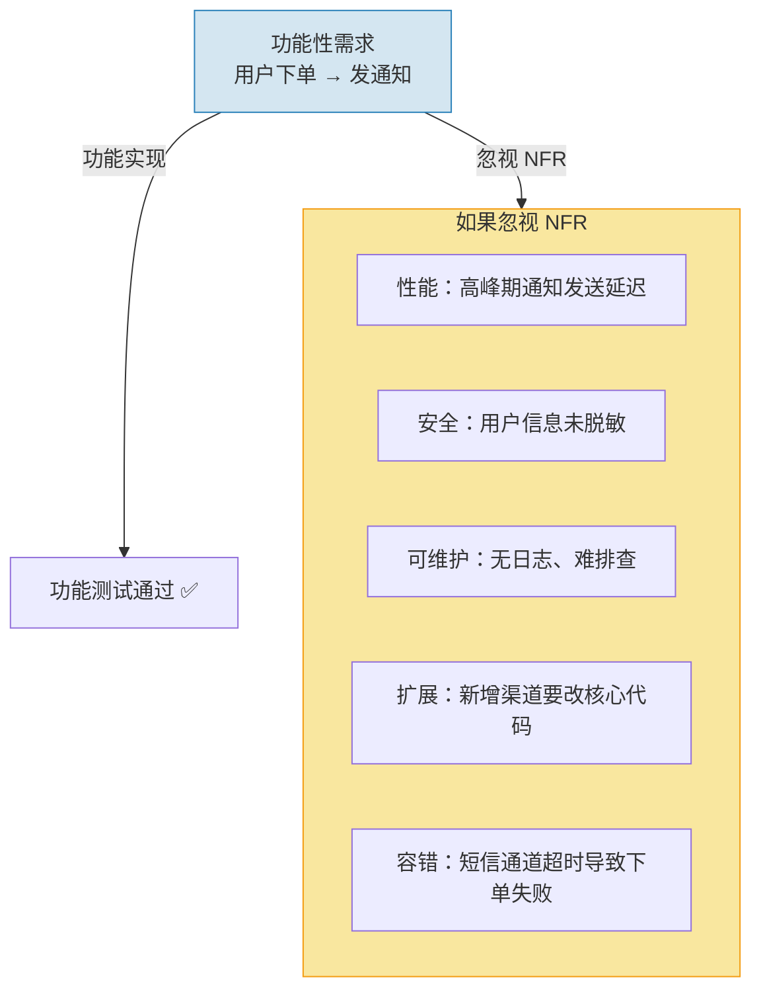

> [!question] 业务上下文三问 —— NFR 的翻译起点
> 在将产品需求翻译为 NFR 之前，先回答三个问题：
>
> - **这个模块在业务中的定位是什么？** 是核心链路还是边缘功能？这直接决定了它的可用性要求和投入产出比。
> - **业务会朝哪个方向演变？** 不需要猜测需求，但可以判断趋势。如果业务天然具有多变的规则（如营销活动、风控策略），那么设计时就该预留扩展点；如果业务非常稳定（如基础数据维护），那就不要过度抽象。
> - **谁在使用这个系统？** 内部运营工具和用户端核心链路的架构取舍截然不同。前者可以接受偶尔的不可用，后者需要极高的可用性保障。

> [!compare] 功能型开发者 vs 架构型开发者
> | 维度 | 只关注功能的开发者 | 有架构思维的开发者 |
> |------|-------------------|-------------------|
> | 性能 | "能跑就行" | "P99 延迟控制在 200ms 以内，高峰期 QPS 预估 5000" |
> | 安全 | "先上线再说" | "用户输入要校验、敏感字段要脱敏、接口要防重放攻击" |
> | 可维护性 | "写完任务就行了" | "三个月后别人能快速理解这段代码吗？日志能帮我快速定位问题吗？" |
> | 扩展性 | "当前需求就这样" | "如果明天要对接第三个通知渠道，需要改多少代码？" |
> | 容错性 | "外部服务不会挂" | "如果短信通道超时了，是阻塞主流程，还是降级处理？" |

> [!danger] 血的教训：支付回调没有幂等
> 某团队开发了一个支付回调接口，只验证了"回调参数是否正确"，没有做幂等处理。上线第一天，支付网关因网络抖动重发了三次回调，结果用户的账户被扣了三次款。
>
> 这就是典型的只关注"功能（接收回调并处理）"而忽略了 NFR（幂等性、可靠性）的代价。

> [!tip] 实用框架：NFR 检查清单
> 有架构思维的人，在实现每一个功能时都会自动在心里过一遍 NFR 检查清单：
> - 这个改动影响**性能**吗？
> - 有**安全**风险吗？
> - 出错后能快速**恢复**吗？
> - 别人好**理解**吗？
> - 将来改起来**方便**吗？
>
> 这些拷问，就是架构视角在日常编码中的具体体现。

## 2.2 应对复杂度的三大症状：变更放大、认知负荷、未知的未知

架构设计的第一要务是**管理复杂度**。但"复杂度"这个词太抽象了，我们需要把它具象化为可以感知的症状。

John Ousterhout 在《软件设计的哲学》中将系统复杂度归结为三种客观症状。**注意，这三种症状不是主观感受，而是在日常开发中可以明确观测到的现象：**

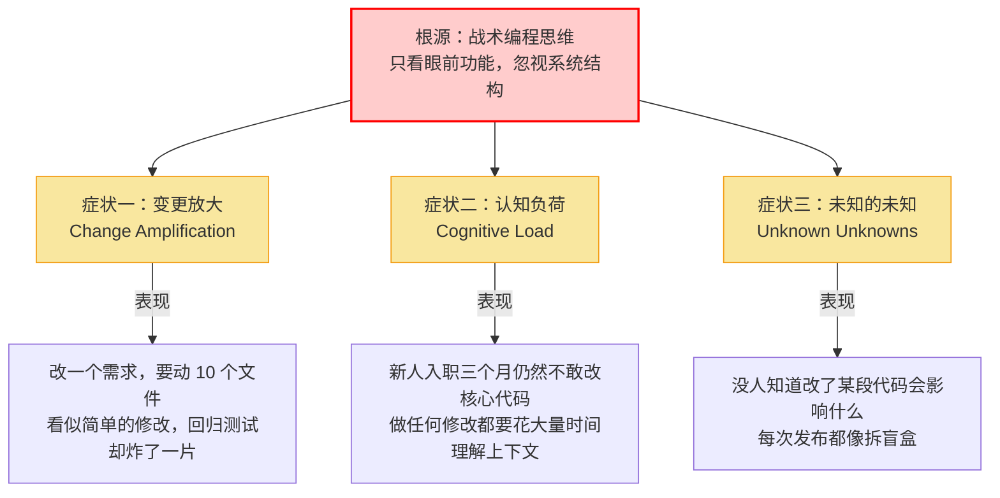

### 症状一：变更放大（Change Amplification）

> 一个看似简单的需求变更，需要修改**多个地方的代码**。

最直观的例子：系统中一个核心数据模型（比如"订单状态"）被几十个模块直接引用，改一个字段就意味着要改几十个文件，漏改任何一个都可能导致线上故障。这不是代码写得不好，而是架构层面**缺乏隔离**——变更的冲击没有被人为控制在最小范围内。

### 症状二：认知负荷（Cognitive Load）

> 为了完成一个任务，开发者需要**同时理解大量的、彼此不相关的信息**。

最具象的体验是：你想在一个服务里加一个新字段，结果发现你需要先搞懂这个服务是怎么处理登录的、缓存是怎么刷新的、消息队列是怎么消费的——这些知识跟你当前的任务**毫无关系**，但因为设计上没有清晰的模块边界，你被迫要把它们全都装进脑子里。

### 症状三：未知的未知（Unknown Unknowns）

> 你不知道**哪些是你不知道的**。

这是三种症状中最致命的一种。变更放大至少你知道要改哪些文件（虽然很多），认知负荷至少你知道要去了解哪些东西（虽然很杂）。但在一个复杂度失控的系统里，**你甚至无法确认自己对系统的改动是否安全**——你不知道某个看似无关的模块是不是间接依赖了你修改的数据结构，你不知道某个"废弃"的接口是不是还有人在用，你不知道这次修改会不会引发链路深处的某种级联故障。

> [!important] 三种症状的递进关系
> 这三种症状之间存在一个清晰的恶化路径：**认知负荷过高 → 开发者无法完整理解系统 → 出现"未知的未知" → 每次变更的实际影响被低估 → 线上故障频发 → 变更放大（修复 bug 又引入新 bug）。**
>
> 而这一整个恶性循环的起点，就是日常开发中一次次的战术性妥协——"这里先凑合一下""多引一个依赖没事的""把逻辑塞进通用工具类就行了"。

## 2.3 高内聚低耦合的灵魂检验：深模块 vs 浅模块

"高内聚、低耦合"这句话几乎每个开发者都听过，但在日常开发中，它经常被理解为一句空洞的口号。我们需要一个更具体、更可操作的检验工具。

John Ousterhout 提出了一个极具穿透力的概念：**深模块（Deep Modules）和浅模块（Shallow Modules）**。它用一个简单的比喻让"好模块长什么样"变得一目了然：

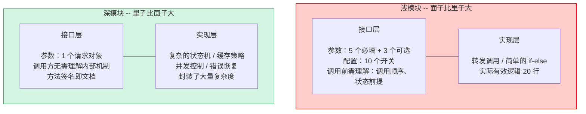

> [!important] 深模块的核心思想
> **深模块**：对外暴露的**接口极简**（一小撮 API，很少的参数），但内部封装了**大量复杂的逻辑**。它有效地把复杂性**隐藏**在模块内部，调用方不需要知道内部发生了什么，只需要知道"我给它什么，它能给我什么"。好的深模块就像一台洗衣机——你只需要按一个按钮，它内部怎么进水、怎么旋转、怎么排水你根本不用关心。
>
> **浅模块**：接口相对功能而言**过于复杂**（参数多、配置多、前置条件多），但内部逻辑却很简单（往往只是转发调用或简单的条件判断）。浅模块的问题在于它**没有有效隐藏信息**——它把内部的复杂度原封不动地暴露给了调用方。

**深模块概念就是检验模块设计的最直接工具：**

| 判断标准 | 深模块（合格） | 浅模块（不合格） |
|---------|-------------|---------------|
| 接口复杂度 | 方法少、参数少、调用方看一眼就懂 | 参数列表泛滥、调用顺序有讲究、需要翻文档才能用对 |
| 信息隐藏 | 内部数据结构、算法、异常处理全部封装，调用方零感知 | 内部依赖关系暴露、数据格式要求透传 |
| 改动的代价 | 内部实现随便改，只要接口不变，调用方纹丝不动 | 改内部逻辑，调用方也得跟着改 |
| 一句话总结 | **"里子比面子大"** | **"面子比里子大"** |

> [!tip] 实践方法：用"深模块思维"审视你的代码
> 每次 Code Review 时，对每个新增的模块用三个问题衡量：
> - 这个模块的接口是不是比它的实现更"薄"？
> - 调用方是不是需要提前理解很多上下文才能用对？
> - 如果我换掉内部实现，调用方需要改多少代码？
>
> 如果三个答案都不理想——你正在制造一个浅模块，而浅模块就是未来**认知负荷**和**变更放大**的温床。

判断边界是否合理的终极检验：

> [!tip] 边界质量的终极检验
> **"如果我要把这个模块完全重写，最小影响范围是多大？"**
>
> 如果答案是"只改这一个模块，不改调用方"，说明边界划得好。如果答案是"上下游都得跟着改"，说明耦合过重，该重新审视边界了。

## 2.4 决策的本质：没有完美的架构，只有适合的妥协

新手最爱问："什么架构是最好的？" 而资深的架构师会说："没有最好的架构，只有最不坏的架构。"

**架构设计的本质是取舍（Trade-off）**。每一次技术选型、每一个设计决策，都是在多个互相冲突的目标之间寻求平衡。

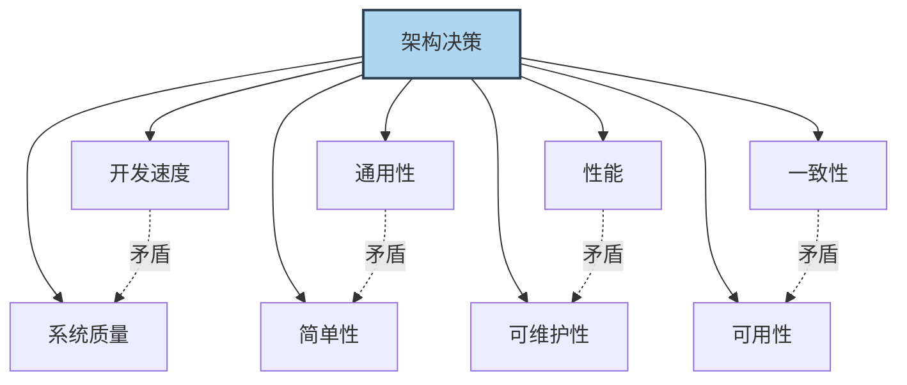

常见的需要权衡的维度：

| 维度 | 向左走 | 向右走 | 怎么选 |
|------|--------|--------|--------|
| **开发速度 vs. 质量** | 快速上线 MVP，少写测试 | 完整测试 + 监控，交付慢 | MVP 可接受技术债，但要**明确记下**并计划偿还 |
| **通用性 vs. 简单性** | 抽象出通用框架 | 针对当前需求硬编码 | 判断核心逻辑是否**确实会被多处复用** |
| **性能 vs. 可维护性** | 手写优化、专用方案 | 用成熟的方案，性能"足够好" | 99% 的场景下可维护性 > 极致性能 |
| **一致性 vs. 可用性** | 强一致 | 最终一致 | 核心业务要强一致，边缘场景可最终一致 |

> [!important] 权衡的关键：知道你在放弃什么
> 真正的"权衡能力"不是选择了一个方案就万事大吉，而是**清楚地知道被放弃的那条路径的成本是什么，并且这个成本是可控的、可接受的**。
>
> 如果你选择了快速交付而减少了测试覆盖，那就要接受线上可能会有更多 bug，并准备好快速响应机制。所有决策都有代价，**清醒地承担代价才是成熟的表现**。

> [!summary] 第二部分小结
> 架构视角是连接产品意图与技术实现的翻译层。它要求我们：将模糊的产品需求翻译为精确的 NFR，用"三大症状"来检验系统复杂度是否失控，用"深模块 vs 浅模块"作为检验设计质量的试金石，并在多个冲突维度之间做出清醒的取舍。**架构的本质不是追求完美，而是在约束下做出最合理的妥协。**

---

# 3. 开发视角 —— 解决"如何控制底层的熵增"（The How - Low Level）

> [!note] 本章核心立场
> 如果说架构视角是"画蓝图"，那么开发视角就是"砌砖瓦"。蓝图再好，如果每一块砖都砌歪了，建筑照样会塌。开发视角关注的是代码层面的纪律和品味——**如何让微观的编码决策与宏观的架构意图保持一致**。

## 3.1 契约精神：接口即合同，设计稳定且具备演进能力的边界

面向接口编程是消除耦合最有力的武器之一。其核心思想很简单：**"我要做什么"和"我怎么实现"是两件不同的事。**

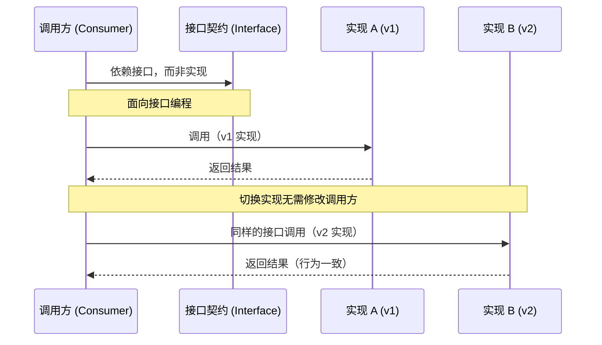

接口就像一份合同——一旦签订（发布），任何单方面的修改都是"违约"，会给所有签约方（调用方）带来损失。

> [!note] 接口设计的四个原则
> 1. **接口要稳定**：接口一旦发布，就像一份合同，不要轻易违约。不兼容的变更意味着所有调用方都需要修改。
> 2. **接口要精简**：接口数量越少越好、每个接口的职责越单一越好。一个接口承载过多职责就会变成"上帝接口"。
> 3. **要留扩展余地**：使用开放式的数据结构（如扩展字段），而不是把所有字段都写死。这在接口演进时至关重要。
> 4. **契约验证不可少**：接口的调用方和提供方都应对契约进行验证，确保双方对"合同条款"的理解一致。

接口的脆弱性往往体现在一个细节上——**参数设计**：

> [!example] 接口设计的脆弱与健壮
> **反例：脆弱的接口**
> 参数列表不断膨胀，每次新增能力都意味着破坏签名或引入大量重载。调用方需要记住每个参数的位置和含义，稍有不慎就会出错。
>
> **正例：健壮的接口**
> 将参数封装为结构化对象，并预留扩展字段。新增能力只需在对象中添加可选字段，不影响任何已有调用方。调用方只需关注它关心的字段，其余保持默认即可。
>
> **核心原则：接口的演进应该是"只增不改"的。**

这个思想在不同层面的体现：

> [!compare] 接口契约在不同层面的体现
> | 层面 | 稳定的是什么 | 可以变的是什么 |
> |------|-------------|---------------|
> | 服务层 | API 端点、请求/响应结构 | 内部实现逻辑 |
> | 模块层 | 方法签名、语义承诺 | 算法、数据源 |
> | 组件层 | 扩展点定义 | 具体实现 |

## 3.2 抵御混乱的基因：防御性编程

有一句经典的系统设计格言：**"Everything that can go wrong will go wrong."**

防御性编程的核心假设是：**外部世界是不可信的，一切输入都可能是恶意的或错误的，一切外部依赖都可能在最不该出问题的时候出问题。**

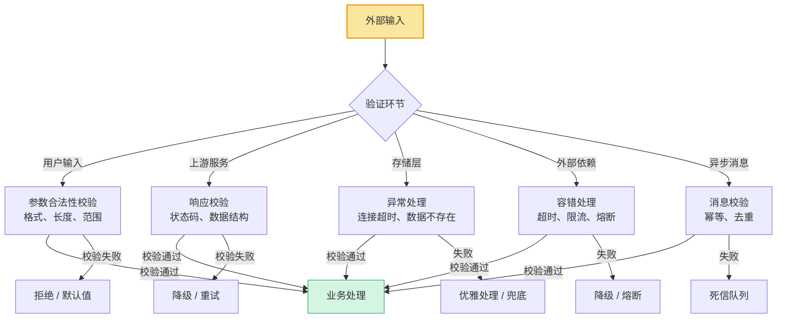

> [!warning] 防御性编程的三条铁律
> **第一条：永远校验输入。** 不管数据来自用户、上游服务、数据库还是消息队列——在使用之前，先验证它的合法性。空值检查、格式校验、范围约束、类型断言——这些"繁琐"的代码是系统健壮性的第一道防线。
>
> **第二条：永远处理异常。** 任何可能失败的操作（网络调用、磁盘写入、外部依赖）都要有异常处理策略。"不可能出错"是最危险的假设。
>
> **第三条：永远做好兜底。** 当异常确实发生时，系统应该有一个安全的"着陆点"——要么重试，要么降级，要么返回一个合理的默认值。最差的情况是：异常发生后，系统处于一个不确定的中间状态。

> [!danger] "信任陷阱"的代价
> "假设上游传过来的数据一定不为 null" → 空指针崩溃。
> "假设数据库一定不会超时" → 请求阻塞，线程池耗尽。
> "假设第三方 API 一定在 100ms 内返回" → 超时导致用户看到白屏。
>
> 每一个"假设"都是一个未被处理的失败路径。它们不会在开发环境和测试环境中暴露——它们会在生产环境的高并发、高压力、网络抖动下同时爆发。

## 3.3 警惕过度设计：用 YAGNI 原则对抗不必要的抽象

> [!danger] 你可能在过度设计的信号
> - 你的项目里有一个"抽象工厂""策略工厂""工厂的工厂"
> - 你的代码里有大量**目前没有任何实现类**的接口
> - 你花了一周时间搭建"通用框架"，真正写业务只用了半天
> - 你为了"将来可能需要"，先把一个简单的模块拆成了十个子模块

过度设计和没有设计一样糟糕。**YAGNI（You Aren't Gonna Need It）** 原则告诉我们：**永远不要为当前不需要的功能编写代码。**

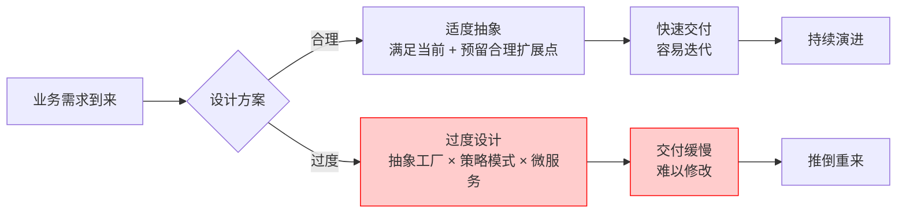

如何在"为未来留余地"和"过度抽象"之间找到平衡？

> [!tip] 什么时候该抽象，什么时候不该？
> | 场景 | 该抽象 | 不该抽象 |
> |------|--------|---------|
> | 你已经写了三遍相似的代码 | ✅ 提取公共逻辑 | ❌ 造一个通用的"规则引擎" |
> | 需求明确说明"未来需要对接多个供应商" | ✅ 定义供应商接口 | ❌ 先实现"支持热插拔"的动态加载框架 |
> | 一个简单的条件分支 | ✅ 保持原样 | ❌ 用策略模式重构"以防将来" |
> | 你确信某个逻辑不会再变了 | ✅ 直接实现 | ❌ 坚持要加一层接口"方便测试" |
>
> **判断准则：用一个代码逻辑出现三次作为抽象的最低门槛。** 两次是巧合，三次才是规律。

> [!important] 一句话区分
> - **为未来留余地** = 在简单实现中预留一个扩展点（比如一个可选的扩展参数）
> - **过度抽象** = 为这个扩展点编写了一套完整的框架代码
>
> 前者是智慧，后者是傲慢——你预测不了未来，不要假装可以。

> [!summary] 第三部分小结
> 开发视角是架构意图的微观落地。它要求我们：
> - 用**契约精神**设计接口——稳定、精简、可演进
> - 用**防御性编程**构建健壮性——永远不信任外部输入
> - 用 **YAGNI 原则**对抗过度设计——在预留扩展点和过度包装之间找到平衡
>
> **代码是架构的最终载体。如果代码层面失守，再好的架构蓝图也是空中楼阁。**

---

# 4. 运维与演进视角 —— 解决"如何面对真实世界的考验"（The Run & Maintain）

> [!note] 本章核心立场
> 代码通过测试、合入主干、部署上线——这只是故事的一半。另一半是：**系统在真实世界中如何运行、如何失败、如何被观测、如何随时间演进。** 很多系统不是死于设计缺陷，而是死于对运维现实的无知。

## 4.1 面向失败设计（Design for Failure）：抛弃"一切正常"的假设

在分布式系统中，有一个非常关键的心态转变：**不要假设任何事情是可靠的。** 网络可能延迟、服务可能宕机、磁盘可能写满、第三方 API 可能超时——把这些看作常态，而不是异常。

> [!question] 面向失败设计要回答的问题
> - 如果这个下游服务返回错误，我的系统怎么办？
> - 如果请求量突然暴涨 10 倍，系统会怎样？
> - 如果缓存集群挂了，我的服务还能正常工作吗？
> - 如果我在修复 bug 期间，用户发生了异常操作，数据会不一致吗？

面向失败设计的思维层次——**防御纵深**：

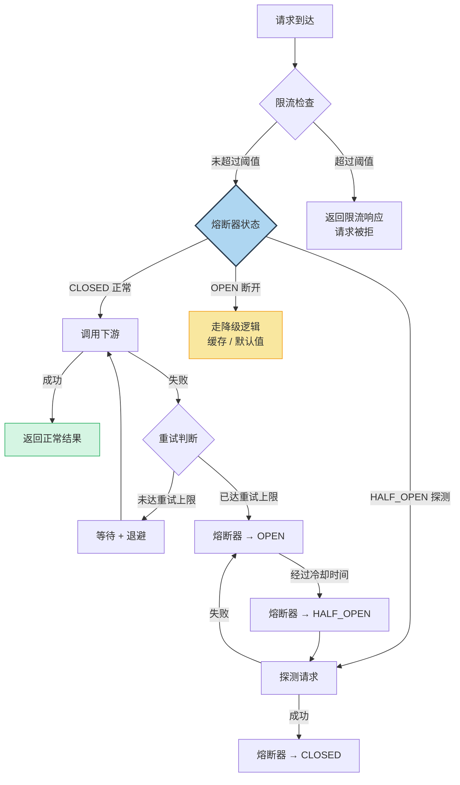

> [!important] 面向失败设计的三个层次
> **第一层：重试（Retry）**
> - 适用场景：瞬时故障（网络闪断、连接池满）
> - 要点：必须配合退避策略（Exponential Backoff），防止重试风暴
> - 反例：失败后立即重试 3 次，等于给已经过载的系统又踹了三脚
>
> **第二层：熔断（Circuit Breaker）**
> - 适用场景：持续故障（下游服务宕机、慢查询）
> - 要点：快速失败，给下游恢复的时间
> - 模式：CLOSED（正常）→ OPEN（断开）→ HALF_OPEN（探测恢复）
>
> **第三层：降级（Degradation）**
> - 适用场景：部分能力不可用时的优雅兜底
> - 要点：核心功能不受影响，边缘功能可牺牲
> - 精髓：**降级不是"报错"，而是"提供一个合理的替代方案"**

降级策略的设计需要提前思考，而不是在故障发生时才临时决定：

> [!tip] 降级策略的设计原则
> - **区分核心路径与非核心路径**：核心路径（如支付）不可降级，非核心路径（如推荐、评论）可以返回缓存或默认值
> - **降级方案应该是"静默"的**：用户感知到功能简化了，但不应该感知到系统出了故障
> - **降级是可逆的**：当下游恢复时，系统应该自动从降级状态回到正常状态

## 4.2 可观测性：让系统主动"说话"——闭环的最后一块拼图

很多时候，系统出问题不可怕，可怕的是**出了问题你不知道**，或者**你知道出问题了，但完全不知道问题出在哪**。

可观测性（Observability）就是解决这个问题的。它包括三个核心支柱：

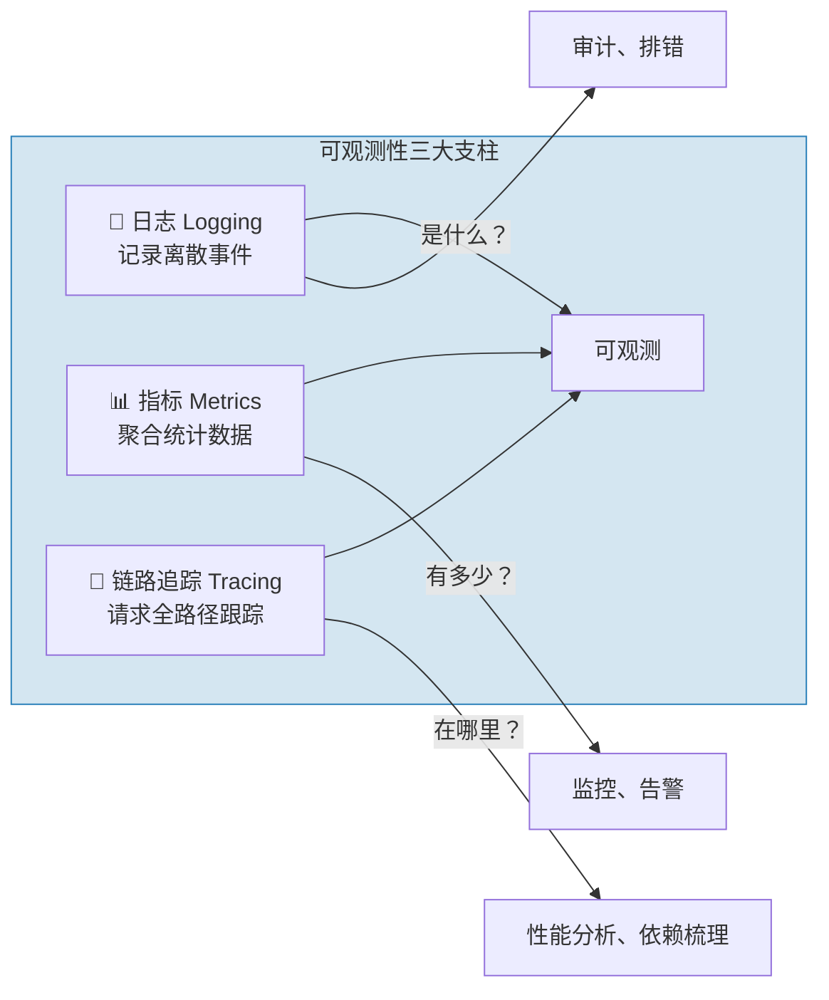

> [!compare] 三大支柱的定位
> | 维度 | 日志（Logging） | 指标（Metrics） | 链路追踪（Tracing） |
> |------|----------------|----------------|-------------------|
> | 数据类型 | 文本事件 | 时序聚合数据 | 请求级链路 |
> | 回答的问题 | 这个请求报了什么错？ | 系统当前 QPS/延迟/错误率是多少？ | 这个请求经过了哪些服务？哪一步最慢？ |
> | 存储量 | 大 | 小 | 中 |
> | 适合的场景 | 异常排查、审计 | 实时监控、告警 | 性能瓶颈分析、依赖梳理 |

可观测性不是上线后才考虑的"运维基建"，而是**从第一行代码开始就应该融入开发习惯**。

> [!note] 日志规范三条黄金法则
> 1. **有层次的日志**：`ERROR`（系统不可用）→ `WARN`（预期之外的状况）→ `INFO`（关键业务流程）→ `DEBUG`（调试细节），不要所有日志都用同一个级别
> 2. **可搜索的日志**：关键信息（业务 ID、用户 ID、链路 ID）一定要出现在日志里。没有上下文的日志等于没写
> 3. **可理解的日志**：一条日志应该让值班的同学不需要翻代码就能大致明白发生了什么：
>    - ❌ `Update failed: null`
>    - ✅ `订单[ORD-20240506-001] 支付状态更新失败：支付网关返回超时 (orderId=123, userId=456, traceId=abc-def)`

> [!warning] 没有可观测性的代价
> 想象你接手了一个线上告警："订单成功率跌到 50%"。没有链路追踪、没有结构化日志、没有监控大盘。
>
> 你只能一台台机器登录上去翻日志。半小时后你终于在几十 G 的日志里找到了一个异常，但日志里没有订单号，没有调用堆栈。你完全不知道这是哪个场景触发的。
>
> 这就是在**盲飞**。可观测性不是锦上添花，而是生产系统的必备基础设施。

> [!important] 可观测性在决策闭环中的位置
> 可观测性是**连接运维视角与产品视角的桥梁**。它不仅帮助你发现和定位技术问题，更能提供业务层面的洞察：
> - 指标告诉你**用户行为的真实分布**（哪些功能被高频使用，哪些几乎无人问津）
> - 日志告诉你**用户在哪里遇到了困难**（错误率高的路径就是用户体验的痛点）
> - 链路追踪告诉你**系统的性能瓶颈在哪里**（影响用户体验的延迟集中在哪一步）
>
> 这些信息，是下一轮产品决策和技术优化的**数据基础**。

## 4.3 架构是活的：重构不是大翻修，而是融入日常的"童子军军规"

很多人有一个误区：认为好的架构是在项目开始时由架构师"画"出来的——画好一张完美的架构图，然后开发团队照着实现就好。

但现实是：

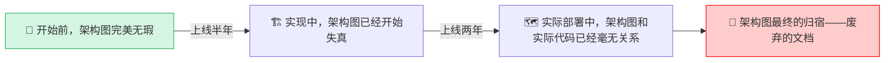

**架构不是静态的设计图，而是活的结构。** 真正的架构是在持续的迭代中，通过无数次小小的重构、调整和学习，逐步塑造成形的。

如果承认架构是演进的，那么重构就不是"代码洁癖"，而是**架构治理的核心手段**。

> [!important] 避免"重构陷阱"
> - ❌ "我先不管代码多烂，把功能做出来，后面再统一重构" → **后面永远不会到来**
> - ✅ "每次修改都顺手把周围代码**整理得比来的时候更干净一点**"（童子军军规）
> - ❌ "我们停下来一个月专门重构" → **业务不会等你，风险极高**
> - ✅ "重构融入到每次迭代中，每次改动都带走一些技术债"

> [!tip] 日常重构三问
> 每次修改代码时，问自己三个问题：
> 1. **我让代码更好了吗？** —— 修改后代码的可读性、可维护性是提升了还是下降了？
> 2. **我留下了备用的"逃生门"吗？** —— 如果这次修改有问题，能快速回滚吗？
> 3. **我留下记录了吗？** —— 其他人能通过提交记录或注释理解我为什么这么改吗？

> [!summary] 第四部分小结
> 运维与演进视角补全了决策闭环的最后一环。它要求我们：
> - 用**面向失败设计**建立防御纵深——重试、熔断、降级，让系统在故障中仍然可用
> - 用**可观测性**让系统主动说话——日志、指标、链路追踪，从盲飞到精准掌控
> - 用**持续重构**保持架构的生命力——不是大翻修，而是融入日常的"童子军军规"
>
> **系统上线不是终点，而是考验的起点。真正优秀的架构，是在真实世界的千锤百炼中存活并持续进化的。**

---

# 5. 结语：思维的闭环

## 5.1 总结：四个维度，一个闭环

让我们把全文的核心浓缩为四句话：

> [!important] 全域架构观的四维法则
> **产品定边界** —— 在动手之前，先确认做的事是对的。穿透需求看本质，用减法思维守住系统边界。
>
> **架构做权衡** —— 没有完美的方案，只有最不坏的妥协。把产品意图翻译为 NFR，用深模块思维设计结构，用清醒的取舍对抗复杂度。
>
> **开发控细节** —— 代码是架构的最终载体。用契约精神设计接口，用防御性编程构建健壮性，用 YAGNI 原则克制过度设计。
>
> **运维保演进** —— 系统上线才是考验的开始。面向失败设计，让系统在故障中存活；建设可观测性，让系统主动说话；持续重构，让架构保持生命力。

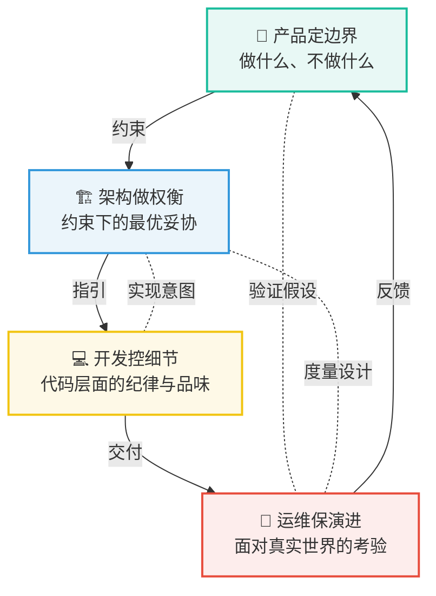

## 5.2 呼应开头：每一次代码提交，都是在做架构决策

回到文章最开始的问题：为什么需要全域架构观？

因为**每一行代码都在同时回应四个维度的问题**：
- 它是否服务于正确的业务目标？（产品）
- 它是否与系统的整体结构一致？（架构）
- 它是否具备应有的健壮性和可演进性？（开发）
- 它是否能在真实世界的考验中存活？（运维）

当你选择了清晰的命名而不是模糊的缩写，你就在塑造可维护性。
当你主动处理了异常边界而不是放任崩溃，你就在塑造可靠性。
当你思考了接口的扩展性而不是硬编码当前需求，你就在塑造扩展性。
当你记录了上下文和设计决策而不是匆匆提交，你就在塑造团队效率。
当你为一个功能做了减法而不是盲目堆砌，你就在塑造产品的聚焦度。

> [!summary] 最后的升华
> 你写下的每一行代码，**要么是在减少系统复杂度，要么是在增加技术债。** 没有中间状态。
>
> 全域架构观不是某个周末学来的技能，而是在每一次决策中刻意练习的**视角**。它要求你同时看到四个维度：产品的方向、架构的约束、代码的品质、运维的现实。
>
> 从今天开始，试试在每次做完一个功能后，多花五分钟问自己一个问题：
>
> > **"我刚才的每一个决策——做什么、怎么做、做到什么程度、出了问题怎么办——是否构成了一个完整的、自洽的闭环？"**
>
> 如果你的答案是"Yes"，那么恭喜，你已经不只是一个"写代码的人"——你是一个**用代码构建系统的人**。

---

> [!note] 附录：全文核心概念索引
> | 概念 | 出处 | 核心要义 |
> |------|------|---------|
> | 战术编程 vs. 战略编程 | Ousterhout | 把代码当消耗品 vs. 把代码当投资 |
> | 业务上下文三问 | 本文 | 定位、演变方向、使用者 |
> | NFR（非功能性需求） | 业界共识 | 功能之外的质量属性 |
> | 系统复杂度三大症状 | Ousterhout | 变更放大、认知负荷、未知的未知 |
> | 深模块 vs. 浅模块 | Ousterhout | 里子比面子大 vs. 面子比里子大 |
> | 防御性编程 | 业界共识 | 永远不信任外部输入 |
> | 面向失败设计 | 分布式系统实践 | 重试、熔断、降级三层次 |
> | YAGNI 原则 | 极限编程 | 不为当前不需要的功能编写代码 |
> | 可观测性三支柱 | 业界共识 | 日志、指标、链路追踪 |
> | 童子军军规 | Robert C. Martin | 让代码比你来时更干净 |
