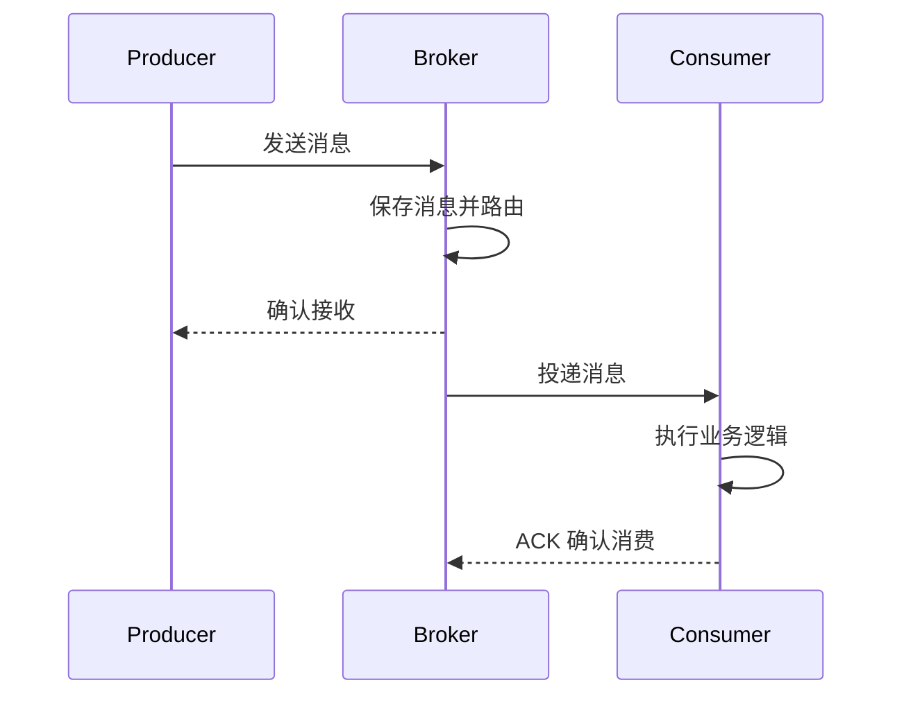
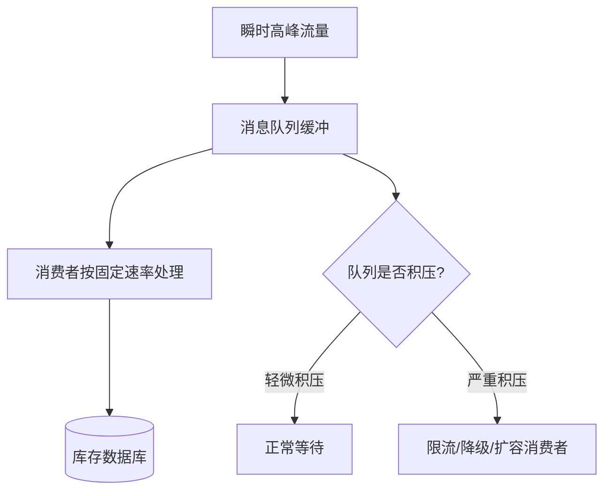
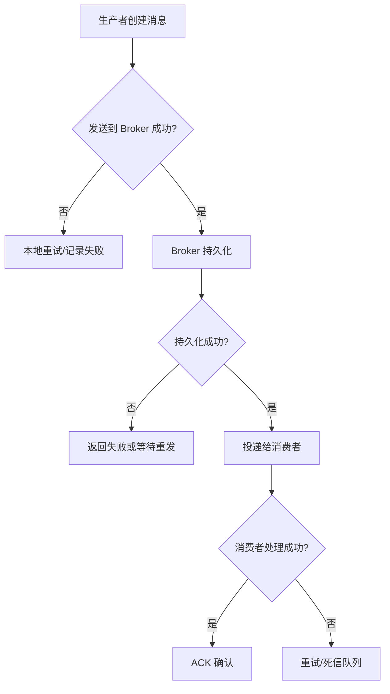
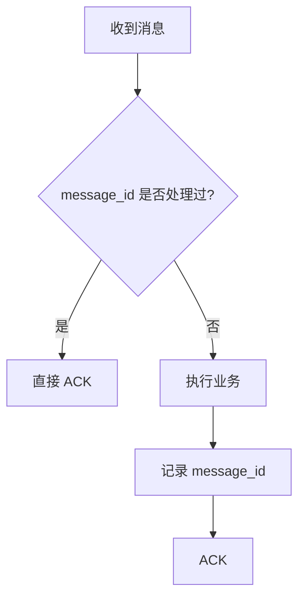
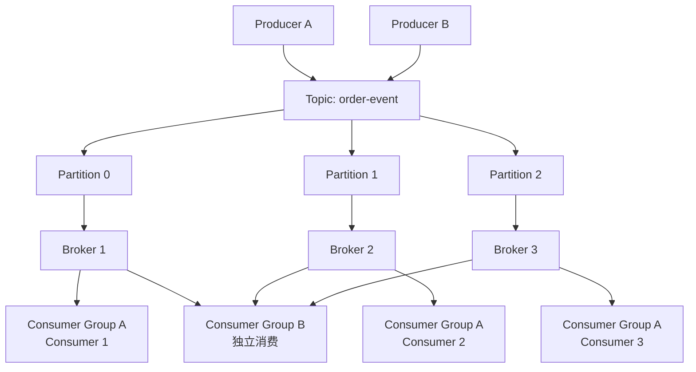
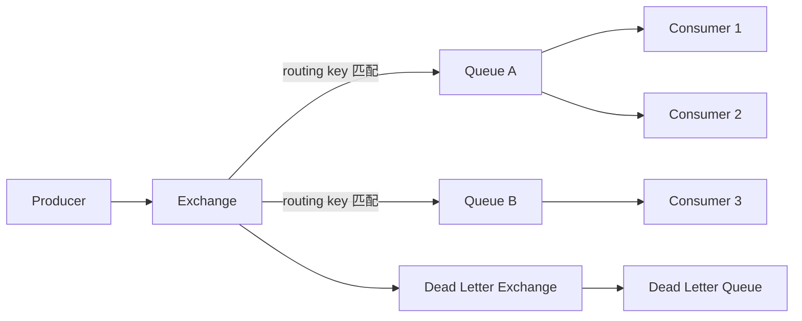
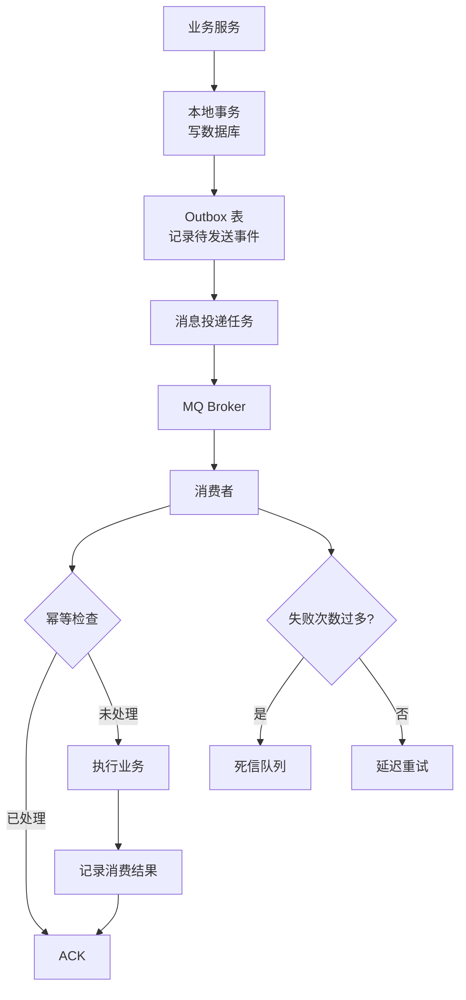

# 0. 简介

> [!question] 为什么需要消息队列？
> 在传统接口调用中，服务 A 调用服务 B，A 必须等待 B 执行完成才能继续。
> 这种方式简单直接，但是一旦业务变复杂，就会遇到问题：
>
> - 下游服务慢，导致上游接口超时
> - 高峰流量直接打到数据库或第三方服务
> - 服务之间强依赖，任何一个服务异常都会连锁影响
> - 一次请求中混入太多非核心逻辑，例如发短信、写日志、推送通知
>
> 消息队列（Message Queue，MQ）的核心思想是：
> **把“直接调用”改成“先发送消息，再由消费者异步处理”。**

> [!important] MQ 在系统架构中的位置
>
> ```mermaid
> flowchart LR
>     A[用户请求] --> B[业务服务]
>     B --> C[(数据库<br/>核心事务)]
>     B --> D[消息队列 MQ]
>
>     D --> E[短信服务]
>     D --> F[通知服务]
>     D --> G[积分服务]
>     D --> H[日志/数据分析]
>
>     B --> I[快速返回结果]
> ```
>
> 业务服务只保证核心事务完成，然后把后续动作交给 MQ。
> 这就是常见的异步化、削峰、解耦。

# 1. 核心概念

## 1.1 Producer / Broker / Consumer

> [!note] 三个核心角色
>
> - **Producer（生产者）**：发送消息的一方
> - **Broker（消息代理）**：保存、路由、投递消息的中间件
> - **Consumer（消费者）**：接收并处理消息的一方



## 1.2 为什么 MQ 能削峰？

> [!note] 削峰填谷
> 假如秒杀活动瞬间进来 10 万个请求，而库存系统每秒只能处理 5000 个请求。
> 如果没有 MQ，请求会直接打爆库存服务。
> 如果有 MQ，请求可以先进入队列，库存服务按照自己的处理能力慢慢消费。



## 1.3 点对点与发布订阅

> [!compare] 两种常见消息模型

|   模型   |              说明              |           典型场景           |
| :------: | :----------------------------: | :--------------------------: |
|  点对点  | 一条消息通常只被一个消费者处理 |      订单支付、库存扣减      |
| 发布订阅 |  一条消息可以被多个订阅者处理  | 事件通知、日志采集、状态同步 |

> [!important] 发布订阅流程
>
> ```mermaid
> flowchart LR
>     P[订单服务<br/>发布 OrderPaid] --> T[Topic/Exchange]
>     T --> A[积分服务]
>     T --> B[优惠券服务]
>     T --> C[消息通知服务]
>     T --> D[数据分析服务]
> ```

# 2. 消息可靠性

> [!warning] MQ 最大的难点不是“发消息”，而是“消息不能乱”
> 生产环境最需要关注的问题：
>
> - 消息是否成功发送到 Broker
> - Broker 是否可靠保存消息
> - 消费者处理完成后是否正确 ACK
> - 消费失败是否重试
> - 重复消费是否会导致脏数据
> - 消息顺序是否会被破坏

## 2.1 消息投递的三个阶段



## 2.2 ACK 与重试

> [!note] ACK 的意义
> ACK 是消费者告诉 Broker：“这条消息我已经处理完了，可以删除或标记完成。”
>
> 如果消费者处理过程中崩溃，但还没有 ACK，Broker 可以重新投递这条消息。

> [!warning] 重试一定要配合幂等
> MQ 通常只能保证“至少一次投递”，也就是说同一条消息可能被消费多次。
> 因此消费者必须具备幂等性。

## 2.3 幂等设计

> [!important] 常见幂等方案
>
> - 业务表增加唯一索引，例如 `order_id`
> - 消息增加全局唯一 `message_id`
> - 消费前先查去重表
> - 使用 Redis `SETNX` 做短期去重
> - 状态机流转只允许合法状态变化



# 3. Kafka

> [!note] Kafka 的定位
> Kafka 更像一个高吞吐的分布式日志系统。
> 它非常适合：
>
> - 日志采集
> - 行为埋点
> - 大数据管道
> - 流式计算
> - 事件溯源

## 3.1 Kafka 架构



## 3.2 Kafka 的核心特点

> [!summary] Kafka 的特点
>
> - Topic 被拆成多个 Partition，提高并行度
> - Partition 内有序，Topic 全局不保证有序
> - Consumer Group 内同一条消息只会被一个消费者消费
> - 不同 Consumer Group 可以独立消费同一批消息
> - 消息通过 Offset 标记消费进度

> [!warning] Kafka 适合高吞吐，不一定适合复杂路由
> 如果业务需要灵活的路由、延迟队列、死信交换机等能力，RabbitMQ 通常更容易落地。

# 4. RabbitMQ

> [!note] RabbitMQ 的定位
> RabbitMQ 是典型的 AMQP 消息代理，强调可靠投递、灵活路由和业务消息处理。
> 它非常适合：
>
> - 异步任务
> - 订单状态流转
> - 延迟重试
> - 服务间解耦
> - 中小规模业务消息系统

## 4.1 RabbitMQ 架构



## 4.2 Exchange 类型

|  类型   |       路由方式       |      场景      |
| :-----: | :------------------: | :------------: |
| Direct  | routing key 完全匹配 |    精确路由    |
| Fanout  |  广播到所有绑定队列  |    通知广播    |
|  Topic  |      通配符匹配      | 按业务主题分发 |
| Headers |     按消息头匹配     | 少见，复杂规则 |

# 5. 选型对比

|   维度   |        Kafka         |      RabbitMQ      |
| :------: | :------------------: | :----------------: |
| 核心模型 |      分布式日志      |      消息代理      |
|  吞吐量  |         极高         |        中高        |
| 路由能力 |         较弱         |        很强        |
| 消息顺序 |   Partition 内有序   |  Queue 内相对有序  |
| 消费进度 |        Offset        |        ACK         |
| 适合场景 | 日志、流处理、大数据 | 业务异步、可靠任务 |
| 学习成本 |         中高         |         中         |

> [!tip] 选型建议
>
> - 日志、埋点、流式计算、大吞吐：优先 Kafka
> - 订单、通知、延迟重试、业务解耦：优先 RabbitMQ
> - 只是简单异步任务：也可以先用 Redis Stream / 本地任务队列，但要评估可靠性

# 6. 工程最佳实践

> [!important] 落地 MQ 前先回答这些问题
>
> 1. 消息是否允许丢失？
> 2. 消息是否允许重复？
> 3. 消息是否要求顺序？
> 4. 消费失败如何重试？
> 5. 重试多次失败后进哪里？
> 6. 消费者处理能力不足时如何扩容？
> 7. 如何监控积压、失败率、消费耗时？

## 6.1 推荐架构



> [!summary] 消息队列的本质
> 消息队列不是为了让系统“更快”而存在，而是为了让系统在复杂链路中更稳定：
>
> - 用异步化缩短核心请求链路
> - 用队列缓冲高峰流量
> - 用发布订阅降低服务耦合
> - 用 ACK、重试、死信保证失败可处理
> - 用幂等设计接受“重复消息”这个现实
