# 0. 背景
> [!note] 多端同步是什么？
> 多端同步指的是：同一个账号在手机、平板、桌面端、Web 端等多个设备上使用时，数据能够在不同端之间保持一致。
>
> 典型场景：
> - 微信：手机、电脑、平板之间同步消息、会话、已读状态
> - 飞书/钉钉：多端同步聊天、文档、日程、通知
> - 备忘录：多端同步文本、附件、编辑记录
> - 音乐软件：同步收藏、播放列表、播放进度
>
> 这里以“微信这类多端 IM / 协同系统”为背景讲原理，但不讨论任何产品的真实内部实现，只从工程角度抽象其通用架构。

> [!question] 同步系统到底在同步什么？
> 不是简单地“把数据库复制一份”。
> 多端同步真正要同步的是：
> - 数据本身：消息、联系人、会话、设置
> - 数据状态：已读、撤回、删除、置顶、免打扰
> - 数据顺序：消息先后、操作先后
> - 数据版本：谁更新了什么，是否有冲突
> - 数据范围：某台设备是否只同步最近数据

# 1. 多端同步的整体架构
> [!important] 核心架构
> 一个完整的跨平台同步系统通常由客户端本地层、同步协议层、服务端同步层和存储层组成。

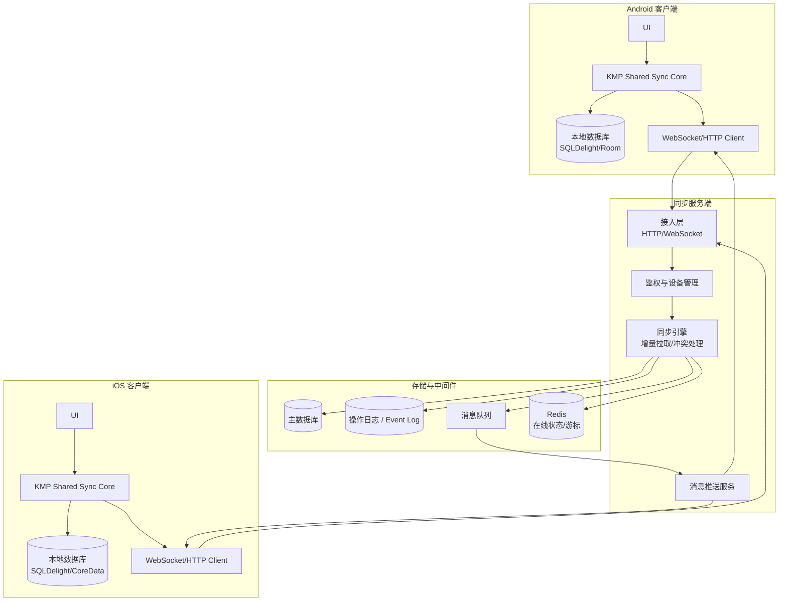

> [!summary] 一句话理解
> 客户端不是每次都“从零拉全量数据”，而是通过本地数据库 + 增量同步 + 推送通知，把远端变化持续合并到本地。

# 2. 同步系统的核心概念
## 2.1 本地优先（Local First）
> [!note] 为什么不是所有操作都先请求服务端？
> 如果用户发消息、改备注、标记已读时都必须等待服务端成功，网络稍差就会卡顿。
> 更好的体验是：
> 1. 用户操作先写入本地数据库
> 2. UI 立即根据本地数据刷新
> 3. 同步引擎后台上传操作
> 4. 服务端确认后更新本地状态

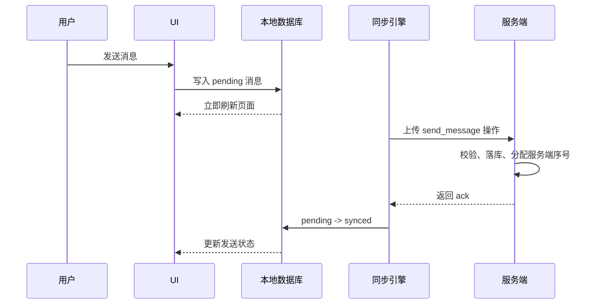

## 2.2 增量同步
> [!important] 为什么需要游标？
> 多端同步不能每次都拉全量数据。服务端通常会给每个账号或会话维护一个递增游标：
> - `server_seq`：服务端全局或会话内递增序号
> - `updated_at`：更新时间戳
> - `version`：对象版本号
> - `event_id`：事件日志 ID
>
> 客户端保存自己已经同步到的位置，下次只拉取之后的变化。

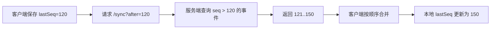

## 2.3 操作日志（Operation Log）
> [!note] 同步的基础不是表，而是事件
> 直接同步数据库表会遇到很多问题：删除怎么表示？顺序如何保证？冲突如何判断？
> 因此同步系统更常见的做法是保存一条条操作日志：
> - `message_created`
> - `message_recalled`
> - `conversation_read`
> - `contact_updated`
> - `note_edited`
> - `device_logged_in`

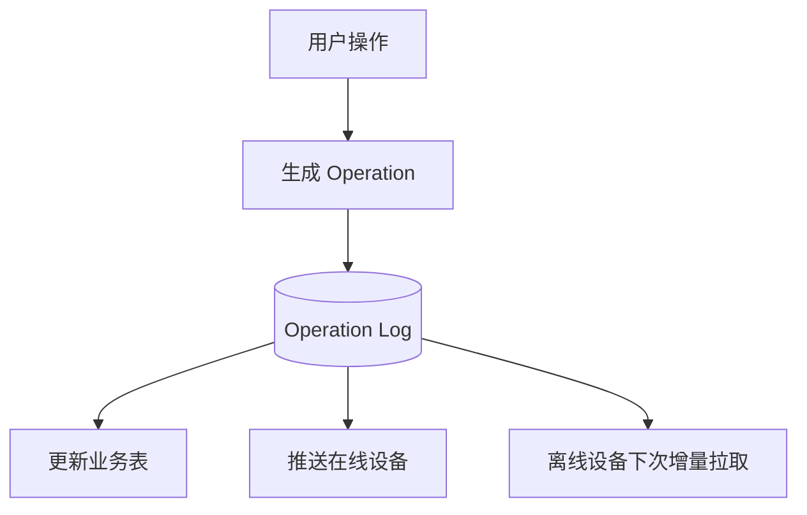

## 2.4 设备与会话
> [!note] 多端系统一定要区分账号和设备
> 同一个用户可能有多台设备：
> - Android 手机
> - iPhone
> - iPad
> - macOS 客户端
> - Windows 客户端
>
> 每台设备都需要独立维护：
> - `device_id`
> - 登录态
> - 在线状态
> - 同步游标
> - 推送通道

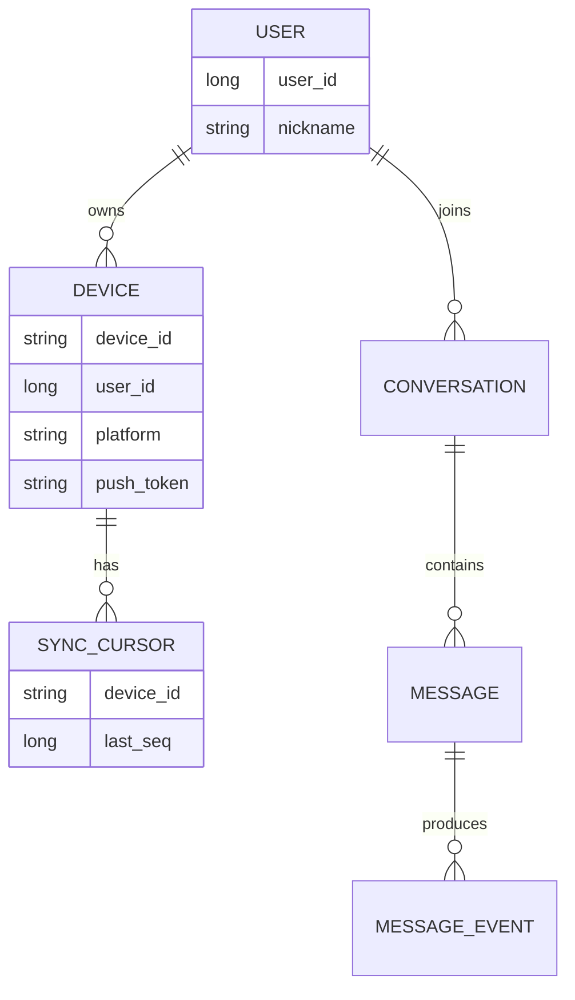

# 3. 推拉结合：实时与离线
> [!important] 同步通常不是单纯推送，也不是单纯轮询
> 正确模式是：
> - 在线时通过 WebSocket 推送“有新变化”
> - 客户端收到通知后按游标拉取增量数据
> - 离线时服务端不强推，等设备上线后补拉

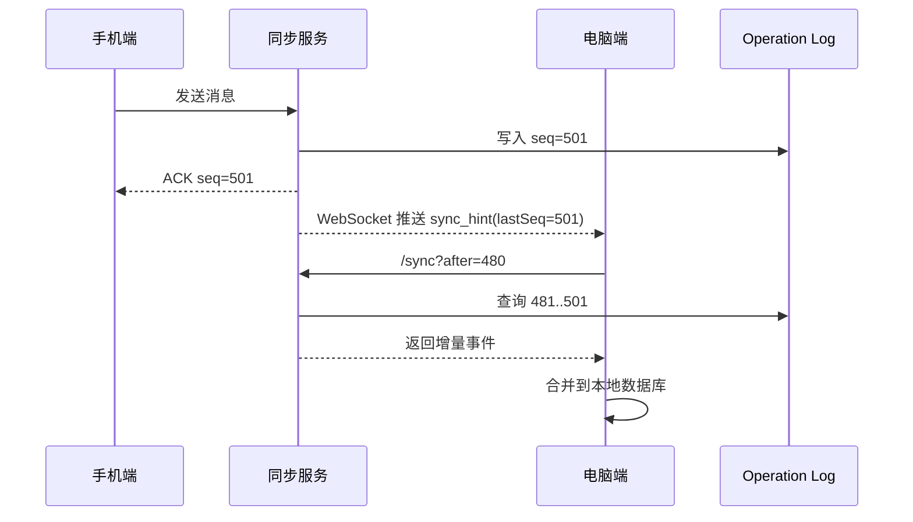

> [!tip] 为什么推送里只放 hint？
> 推送通道可能不稳定，也可能乱序或丢失。
> 如果推送只负责告诉客户端“有更新”，真正数据通过 `/sync` 按游标拉取，就能保证最终一致。

# 4. 冲突处理
## 4.1 为什么会冲突？
> [!question] 多端同时修改怎么办？
> 例如：
> - 手机端把会话设置为置顶
> - 电脑端几乎同时取消置顶
> - 两个操作都离线发生，稍后才上传
>
> 服务端必须判断最终以哪个为准。

## 4.2 常见策略
| 策略 | 说明 | 适合场景 |
| :---: | :---: | :---: |
| 服务端时间优先 | 以后到服务端的操作为准 | 简单设置项 |
| 版本号 CAS | 上传时携带版本，不匹配则冲突 | 资料编辑、配置修改 |
| 操作合并 | 把操作当成事件合并 | 聊天消息、点赞、计数 |
| CRDT | 多端独立编辑后可自动收敛 | 协作文档 |
| 人工解决 | 提示用户选择版本 | 重要文档 |

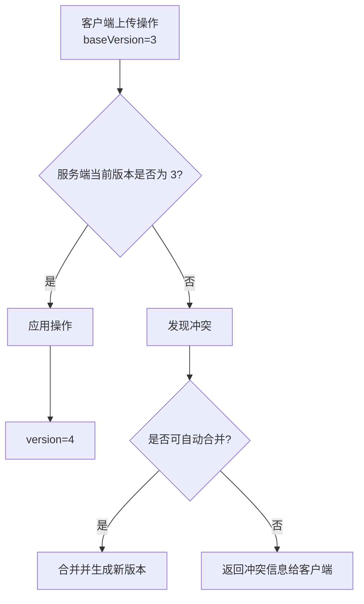

> [!summary] IM 场景的常见做法
> 聊天消息通常不采用"覆盖式更新"，而是追加事件。
> 发送、撤回、已读、删除都可以看成事件，因此比文档编辑更容易保证最终一致。

## 4.3 分层冲突矩阵（生产级设计）

> [!important] 真实系统不只用一种冲突策略
> 生产级的同步引擎按数据类型分层，不同层选用不同策略：

| 层级 | 数据类型 | 冲突策略 | 一致性模型 | 分区容忍 | 典型示例 |
|:----:|:--------|:--------|:----------:|:--------:|:--------|
| **L1** | 幂等事件流 | 追加操作日志（无需冲突处理） | 最终一致 | 高 | 消息发送、撤回、已读游标 |
| **L2** | 主人翁数据 | LWW + HLC | 最终一致 | 高 | 昵称、头像、个人设置 |
| **L3** | 协同数据 | 版本向量 / CRDT | 最终-收敛 | 高 | 协作文档、白板 |
| **L4** | 有状态聚合 | 事务性 CAS + 人工仲裁 | 强一致 | 低 | 订单、余额、库存 |

> [!question] 为什么要分层？
> 如果所有数据都用 CRDT 或强一致 CAS，服务端压力会指数级上升。**按数据性质选择策略**：越往上（L1→L4）冲突概率越低、但一旦冲突的代价越高；越往下对一致性的要求越强。

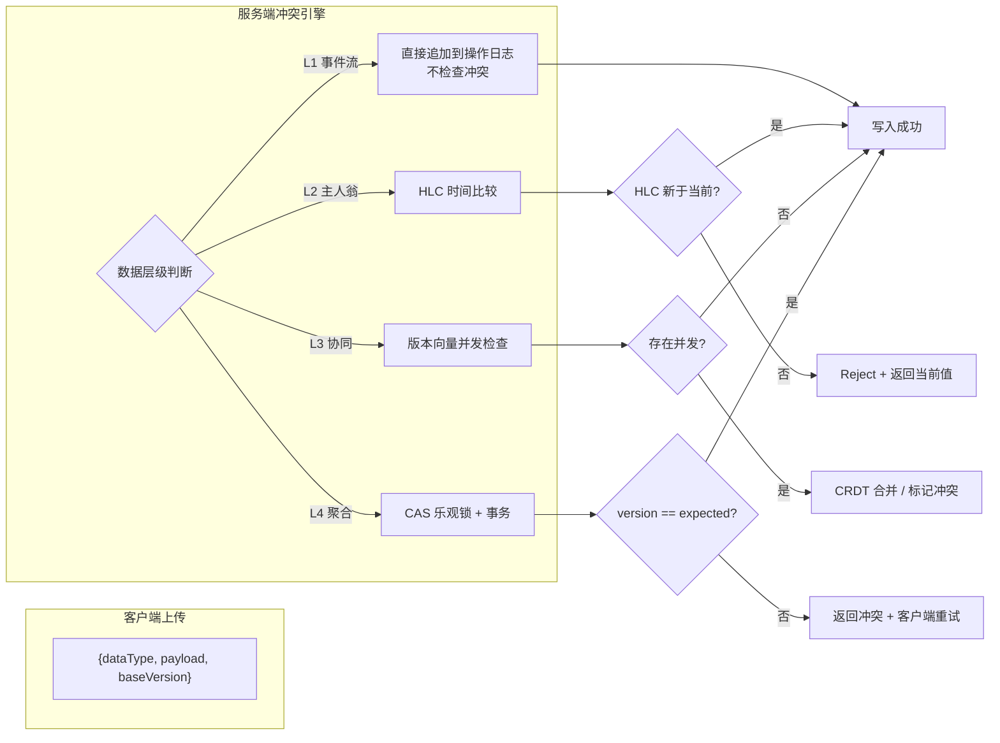

## 4.4 混合逻辑时钟（HLC）—— LWW 的真正生产级方案

> [!warning] 为什么不能用 `updated_at` 做 LWW？
> 1. 多设备系统时钟不同步：iOS 设备快 5 分钟 → "未来数据"覆盖"正确数据"
> 2. 同一毫秒内可能有多个操作，时间戳精度不够
> 3. 无法表示因果依赖关系

**HLC（Hybrid Logical Clock）** 结合物理时钟和逻辑计数器，保证：
- 所有 HLC 值可全局比较（全序关系）
- 不依赖设备时钟同步（物理时间偏差仅在比较时影响先后）
- 同一毫秒内的并发操作通过 nodeId 字典序打破平局

```kotlin
// commonMain/kotlin/sync/hlc/HybridTimestamp.kt
package sync.hlc

import kotlinx.serialization.Serializable
import kotlin.math.max

/**
 * 混合逻辑时钟（Hybrid Logical Clock）时间戳。
 * 相比单纯 updated_at，HLC 可全局全序比较，
 * 且不要求各设备时钟同步。
 */
@Serializable
data class HybridTimestamp(
    val wallClockMillis: Long,     // 物理时间（NTP 同步或本地系统时间）
    val logicalTick: Int,          // 同一毫秒内递增的逻辑计数器
    val nodeId: String             // 设备/节点标识，用于打破最终平局
) : Comparable<HybridTimestamp> {

    companion object {
        var lastWallClock: Long = 0
        var lastLogicalTick: Int = 0
        val nodeId: String = generateNodeId()

        /**
         * 生成新的 HLC 时间戳。
         * 保证单调递增，即使物理时钟回拨。
         */
        fun generate(): HybridTimestamp {
            val now = currentWallClock()
            val tick = when {
                now > lastWallClock -> {
                    lastLogicalTick = 0
                    0
                }
                now == lastWallClock -> ++lastLogicalTick
                else -> {
                    // 物理时钟回拨：逻辑计数器递增，时间戳不变
                    ++lastLogicalTick
                }
            }
            lastWallClock = max(now, lastWallClock)
            return HybridTimestamp(lastWallClock, tick, nodeId)
        }

        /**
         * 从远端接收到的 HLC 更新本地状态。
         * 确保本地 HLC 永远 ≥ 收到的最大 HLC。
         */
        fun updateWithRemote(remote: HybridTimestamp) {
            if (remote.wallClockMillis > lastWallClock) {
                lastWallClock = remote.wallClockMillis
                lastLogicalTick = 0
            } else if (remote.wallClockMillis == lastWallClock) {
                lastLogicalTick = max(lastLogicalTick, remote.logicalTick) + 1
            }
        }

        private fun currentWallClock(): Long = System.currentTimeMillis()
        private fun generateNodeId(): String = "device-${platformDeviceId()}"
    }

    override fun compareTo(other: HybridTimestamp): Int {
        return when {
            this.wallClockMillis != other.wallClockMillis ->
                this.wallClockMillis.compareTo(other.wallClockMillis)
            this.logicalTick != other.logicalTick ->
                this.logicalTick.compareTo(other.logicalTick)
            else -> this.nodeId.compareTo(other.nodeId)
        }
    }
}
```

> [!tip] 回拨处理说明
> 第 3 种分支处理的是"物理时间回拨"：当 NTP 校正或用户手动调时间导致系统时间比上次记录的值还小时，HLC **不后退时间戳**，而是递增逻辑计数器，保证单调性不受影响。

```kotlin
// LWW Register 基于 HLC 的合并判断
fun lwwMerge(local: ValueWithHlc, remote: ValueWithHlc): ValueWithHlc {
    return if (remote.hlc >= local.hlc) remote else local
}
```

## 4.5 向量时钟——并发冲突检测的精确方案

> [!note] 向量时钟的核心思想
> 每个设备维护一个"版本视图"：`{deviceA: 5, deviceB: 3, deviceC: 7}`，表示当前已知各设备产生的操作数。
>
> **冲突判断**：
> - VC₁ 所有分量 ≤ VC₂ 对应分量 → VC₁ 是旧版本（VC₂ 为新）
> - VC₁ 有分量 > VC₂ 且 VC₂ 也有分量 > VC₁ → **并发冲突**

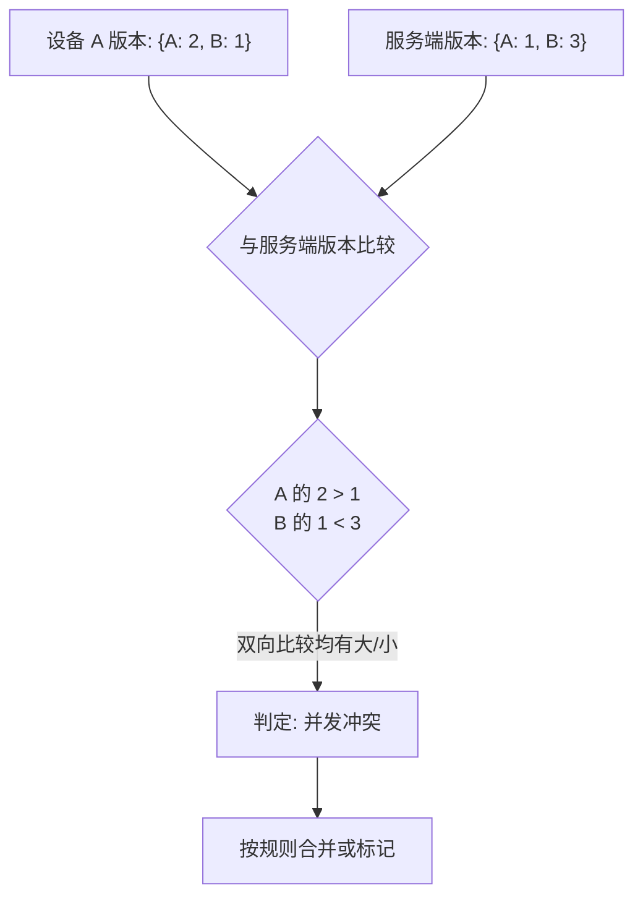

```kotlin
// commonMain/kotlin/sync/vc/VectorClock.kt
package sync.vc

import kotlinx.serialization.Serializable

/**
 * 向量时钟。
 * 映射：nodeId -> 该节点产生的操作计数。
 */
@Serializable
data class VectorClock(
    private val clock: Map<String, Int> = emptyMap()
) {
    /**
     * 本设备递增自己的计数器。
     */
    fun tick(nodeId: String): VectorClock {
        val newClock = clock.toMutableMap()
        newClock[nodeId] = (clock[nodeId] ?: 0) + 1
        return VectorClock(newClock)
    }

    /**
     * 合并两个向量时钟（取每个分量的最大值）。
     * 这是 CRDT 中 join 操作的基础。
     */
    fun merge(other: VectorClock): VectorClock {
        val allKeys = clock.keys + other.clock.keys
        val merged = allKeys.associateWith { key ->
            maxOf(clock[key] ?: 0, other.clock[key] ?: 0)
        }
        return VectorClock(merged)
    }

    /**
     * 检测本时钟是否"先于"other（所有分量 ≤）。
     * true 表示本时钟完全被 other 涵盖。
     */
    fun happensBefore(other: VectorClock): Boolean {
        if (this == other) return false
        val allKeys = clock.keys + other.clock.keys
        return allKeys.all { key ->
            (clock[key] ?: 0) <= (other.clock[key] ?: 0)
        }
    }

    /**
     * 检测是否与 other 存在并发冲突。
     * 即：!happensBefore(other) && !other.happensBefore(this)。
     */
    fun concurrent(other: VectorClock): Boolean {
        return !happensBefore(other) && !other.happensBefore(this)
    }
}
```

> [!warning] 向量时钟的代价
> - 设备数 n → 向量长度 n。IM 场景 5-10 台设备可接受，但 IoT 场景数百台设备不可行
> - **生产优化方案**：DVV（Dotted Version Vector）——用 `{deviceId: maxVersion}` 的摘要 + 每个值的 `{dot: version}` 标记，将复杂度从 O(n²) 降到 O(1) 常见情况

## 4.6 CRDT 的工程真相——选型前的权衡

> [!important] CRDT 不是银弹
> 业界对 CRDT 有过度美化的倾向。下表列出各变体的真实工程代价：

| CRDT 类型 | 适用场景 | 优点 | 真实代价 |
|:---------:|:--------|:----|:--------|
| **G-Counter** | 点赞数（只增不减） | 自动收敛，实现简单 | 不能减，不适用于"取消点赞" |
| **PN-Counter** | 可增减的计数（如库存） | 支持增减 | 内部两个 G-Counter，状态膨胀一倍 |
| **LWW-Register** | 简单字段（昵称、标题） | 实现最简单 | 丢失"为什么覆盖"的语义信息 |
| **RGA** | 协作文本文本 | 支持有序列表插入删除 | Tombstone 堆积→长文档性能退化严重 |
| **Map + LWW** | JSON 结构数据 | 自动合并 | 嵌套冲突时外层覆盖内层，粒度太粗 |

### 4.6.1 Tombstone 堆积问题（RGA 的核心缺陷）

```
文档版本 1: [A, B, C]
文档版本 2: [A, (B已删除), C]    ← B 标记为 tombstone（墓碑）
文档版本 3: [A, (B已删除), C, D] ← 插入 D，B 的 tombstone 仍在增长
...
文档版本 1000: tombstones 占 40% 空间
```

> [!tip] 生产级解决：定期 cleanup + 快照
> 纯 CRDT 不适合长时间运行的协作文档。通常采用 **CRDT + 定期快照（Snapshot）**：
> 1. 每次操作写入增量 CRDT op log
> 2. 每隔 N 个操作或 M 小时生成一份全量快照（移除 tombstone）
> 3. 新加入的设备直接拉快照，再从快照后的增量开始同步

### 4.6.2 混合架构建议

```text
纯 CRDT 不是最优解，
CRDT + OT（操作转换）混合架构 才是生产级方案：

┌─ 字符级编辑 ──→ OT（Google Docs / Figma 路线）
├─ 结构数据    ──→ CRDT Map + 版本向量
├─ 顺序列表    ──→ RGA（配合定期快照）
└─ 完整性校验  ──→ Merkle Tree（对比两端数据是否一致）
```

## 4.7 冲突策略选型决策树

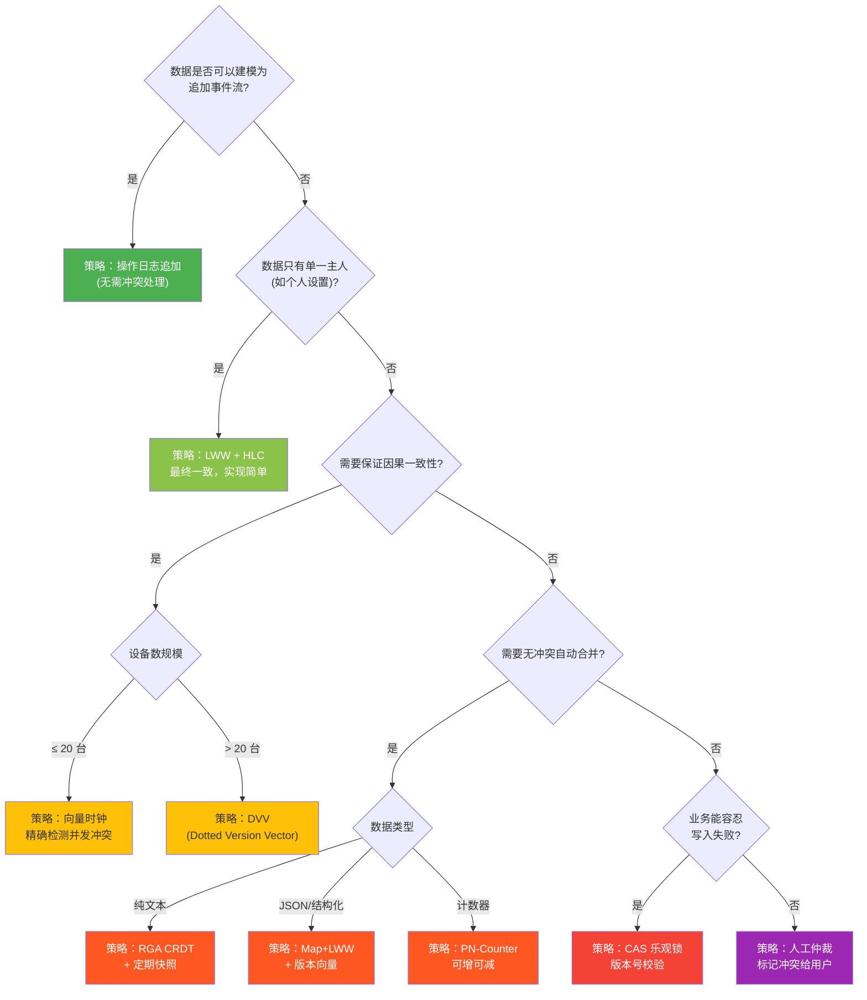

> [!summary] 选型总结
> - **IM/聊天类**：90% 场景用 L1 事件追加，少数设置项用 L2 LWW+HLC
> - **协作文档/笔记**：L3 CRDT（推荐 RGA + 快照回退）
> - **电商/金融**：L4 CAS + 事务，必要时人工仲裁
> - **文件同步**：Merkle Tree 比对文件块差异 + LWW 最后写入

# 5. Kotlin 跨平台实践方案
> [!note] 为什么用 Kotlin Multiplatform？
> 多端同步中，最容易重复造轮子的部分是：
> - 同步协议
> - 数据模型
> - 增量合并逻辑
> - 冲突处理
> - 重试队列
> - API DTO
>
> 这些逻辑与 Android / iOS UI 无关，适合放到 KMP 的 `commonMain` 中共享。

## 5.1 KMP 分层架构
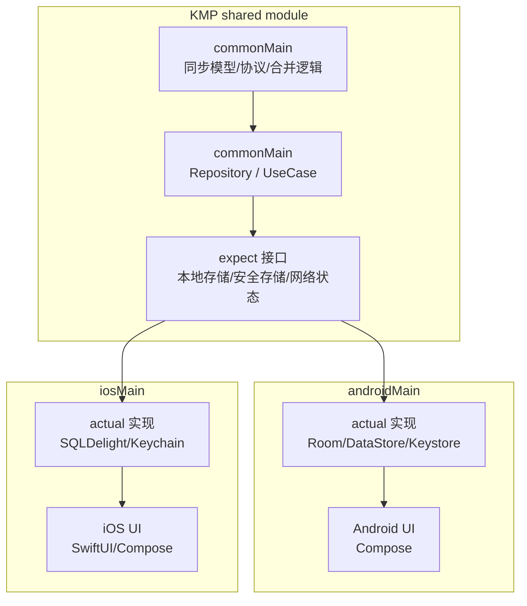

## 5.2 共享数据模型
```kotlin
// commonMain/kotlin/sync/model/SyncModels.kt
package sync.model

import kotlinx.serialization.Serializable

@Serializable
data class SyncEvent(
    val eventId: String,
    val seq: Long,
    val type: SyncEventType,
    val aggregateId: String,
    val payload: String,
    val serverTimeMillis: Long
)

@Serializable
enum class SyncEventType {
    MESSAGE_CREATED,
    MESSAGE_RECALLED,
    CONVERSATION_READ,
    CONVERSATION_PINNED,
    CONTACT_UPDATED
}

@Serializable
data class PendingOperation(
    val operationId: String,
    val type: SyncEventType,
    val aggregateId: String,
    val payload: String,
    val baseVersion: Long?,
    val createdAtMillis: Long
)

@Serializable
data class SyncResult(
    val events: List<SyncEvent>,
    val latestSeq: Long,
    val hasMore: Boolean
)
```

## 5.3 平台无关的同步接口
```kotlin
// commonMain/kotlin/sync/core/SyncPorts.kt
package sync.core

import sync.model.PendingOperation
import sync.model.SyncEvent
import sync.model.SyncResult

interface LocalSyncStore {
    suspend fun getLastSeq(): Long
    suspend fun updateLastSeq(seq: Long)
    suspend fun loadPendingOperations(limit: Int): List<PendingOperation>
    suspend fun markOperationSynced(operationId: String)
    suspend fun saveEvents(events: List<SyncEvent>)
}

interface RemoteSyncApi {
    suspend fun pushOperations(operations: List<PendingOperation>)
    suspend fun pullEvents(afterSeq: Long, limit: Int): SyncResult
}

interface NetworkMonitor {
    fun isOnline(): Boolean
}
```

## 5.4 同步引擎
```kotlin
// commonMain/kotlin/sync/core/SyncEngine.kt
package sync.core

class SyncEngine(
    private val localStore: LocalSyncStore,
    private val remoteApi: RemoteSyncApi,
    private val networkMonitor: NetworkMonitor
) {
    suspend fun syncOnce() {
        if (!networkMonitor.isOnline()) return

        // 1. 先上传本地离线期间产生的操作
        pushPendingOperations()

        // 2. 再拉取服务端新增事件
        pullRemoteEvents()
    }

    private suspend fun pushPendingOperations() {
        val operations = localStore.loadPendingOperations(limit = 100)
        if (operations.isEmpty()) return

        remoteApi.pushOperations(operations)

        // 服务端成功接收后，再把本地 pending 标记为 synced
        operations.forEach { operation ->
            localStore.markOperationSynced(operation.operationId)
        }
    }

    private suspend fun pullRemoteEvents() {
        var lastSeq = localStore.getLastSeq()
        var hasMore: Boolean

        do {
            val result = remoteApi.pullEvents(afterSeq = lastSeq, limit = 200)

            // 必须先保存事件，再推进游标，避免中途崩溃造成数据缺失
            localStore.saveEvents(result.events)
            localStore.updateLastSeq(result.latestSeq)

            lastSeq = result.latestSeq
            hasMore = result.hasMore
        } while (hasMore)
    }
}
```

> [!warning] 顺序非常关键
> 拉取增量时必须遵循：
> 1. 保存事件
> 2. 应用事件到本地业务表
> 3. 推进游标
>
> 如果先推进游标再写数据，中途崩溃会导致客户端以为自己已经同步过，但本地其实缺数据。

## 5.5 expect / actual 处理平台差异
> [!note] 哪些东西不适合放 commonMain？
> - Android Keystore / iOS Keychain
> - 系统网络状态监听
> - 推送 token 获取
> - 后台任务调度
> - 平台数据库驱动初始化

```kotlin
// commonMain/kotlin/sync/platform/SecureStore.kt
package sync.platform

expect class SecureStore {
    suspend fun saveToken(token: String)
    suspend fun readToken(): String?
    suspend fun clearToken()
}
```

```kotlin
// androidMain/kotlin/sync/platform/SecureStore.android.kt
package sync.platform

actual class SecureStore {
    actual suspend fun saveToken(token: String) {
        // 实际项目中可使用 EncryptedSharedPreferences 或 Android Keystore
    }

    actual suspend fun readToken(): String? {
        // 从 Android 安全存储读取登录凭证
        return null
    }

    actual suspend fun clearToken() {
        // 清理 Android 本地凭证
    }
}
```

```kotlin
// iosMain/kotlin/sync/platform/SecureStore.ios.kt
package sync.platform

actual class SecureStore {
    actual suspend fun saveToken(token: String) {
        // 实际项目中调用 Keychain 保存登录凭证
    }

    actual suspend fun readToken(): String? {
        // 从 iOS Keychain 读取登录凭证
        return null
    }

    actual suspend fun clearToken() {
        // 清理 iOS 本地凭证
    }
}
```

# 6. 服务端同步接口设计
> [!important] 最小可用接口

| 接口 | 作用 |
| :---: | :---: |
| `POST /sync/push` | 上传本地 pending 操作 |
| `GET /sync/pull?afterSeq=xxx` | 按游标拉取增量事件 |
| `GET /sync/snapshot` | 首次登录或游标过旧时拉取快照 |
| `POST /device/register` | 注册设备与推送 token |
| `POST /device/logout` | 设备退出登录 |

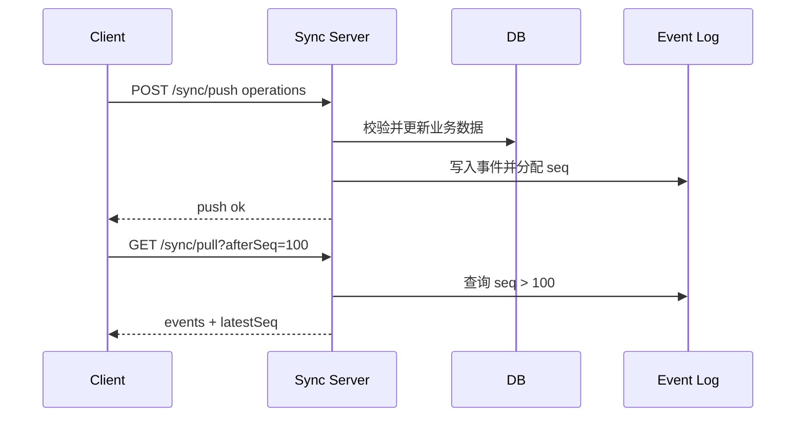

> [!warning] 首次同步与游标过旧
> 如果一个设备很久没上线，服务端可能已经清理了早期操作日志。
> 此时不能继续增量同步，需要返回 `SNAPSHOT_REQUIRED`，让客户端拉取一份当前快照，再从新的游标开始同步。

# 7. 常见问题与解决方案
## 7.1 消息乱序
> [!note] 解决方式
> - 服务端分配单调递增 `seq`
> - 客户端按 `seq` 合并
> - 缺号时暂停推进游标并重新拉取

## 7.2 重复事件
> [!note] 解决方式
> - `event_id` 唯一
> - 本地事件表对 `event_id` 建唯一索引
> - 重复插入直接忽略

## 7.3 离线发送
> [!note] 解决方式
> - 本地先生成 `operation_id`
> - UI 显示 pending 状态
> - 网络恢复后自动上传
> - 服务端根据 `operation_id` 做幂等处理

## 7.4 多端已读
> [!note] 已读同步不是删除消息
> 已读状态可以建模成事件：
> `conversation_read(conversationId, readSeq)`
>
> 每端收到事件后，将本地会话已读游标推进到 `readSeq`。

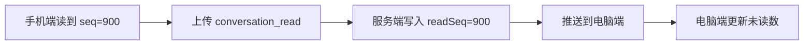

# 8. 总结
> [!summary] 跨平台同步的核心
> 跨平台同步并不是简单的数据复制，而是：
> - 本地优先保证体验
> - 操作日志保证可追溯
> - 游标机制实现增量同步
> - WebSocket + HTTP 实现推拉结合
> - 幂等与版本号解决重复和冲突
> - Kotlin Multiplatform 复用同步模型和合并逻辑
>
> 最终目标是：**每个端都可以离线工作，网络恢复后自动追上服务端，并且所有设备最终收敛到一致状态。**
