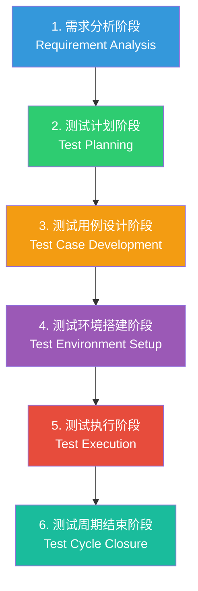
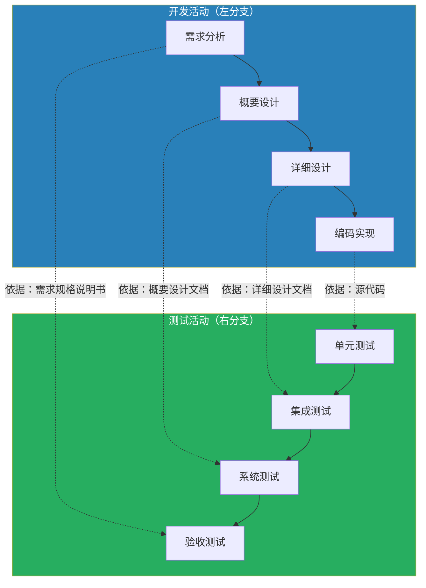
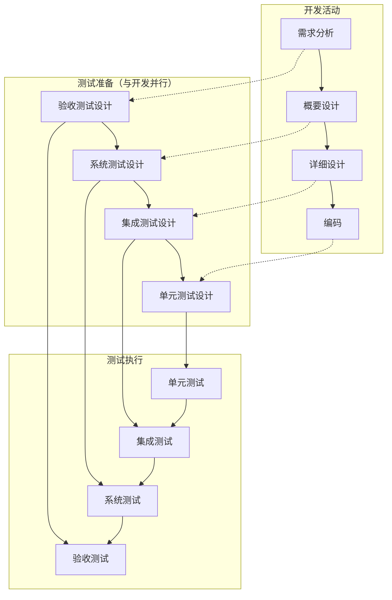
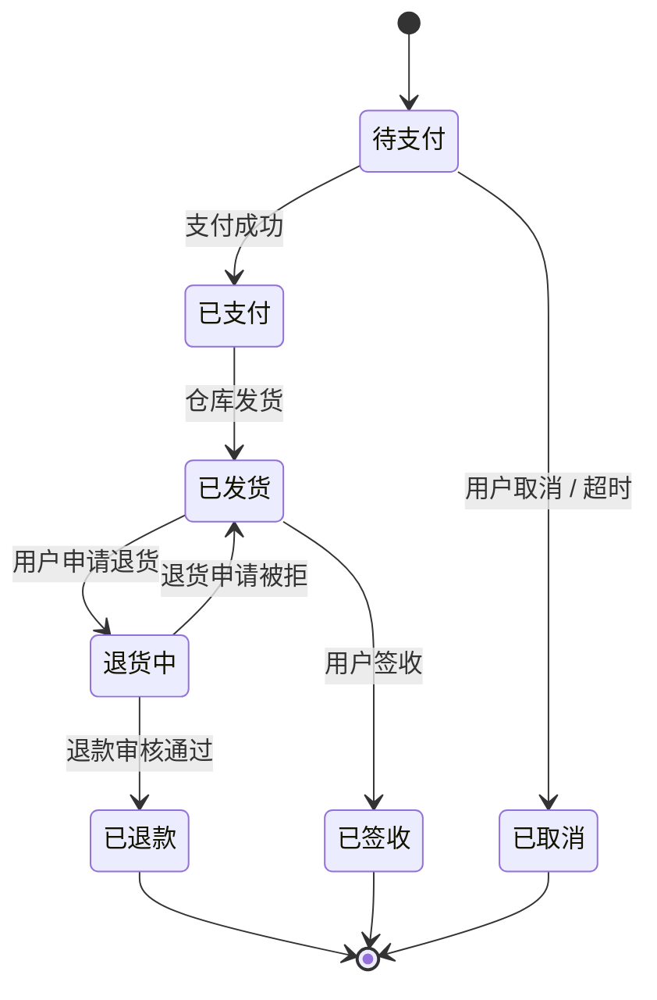
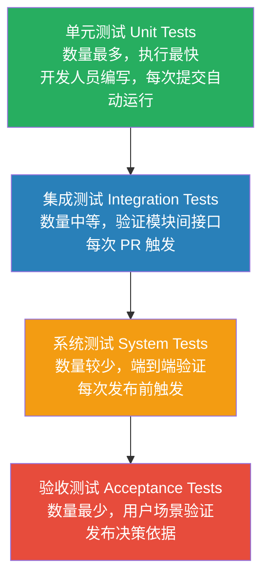
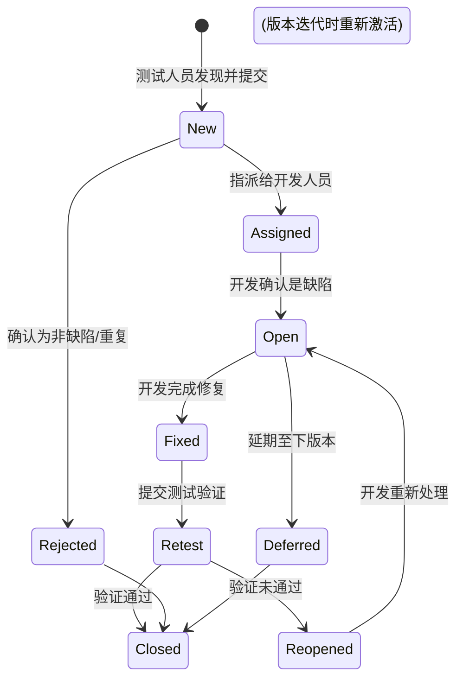
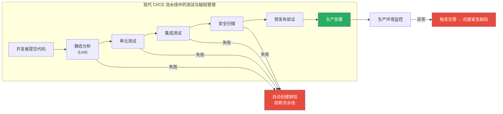

---
tags:
  - 软件测试
  - 工程实践
  - 期末考试
created: 2026-06-22
updated: 2026-06-23
aliases:
  - 软件测试完全指南
  - Software Testing Guide
---

# 软件测试：从理论根基到工程实践

> [!info] 本文档定位
> 这是一份**兼顾期末考试与工程实战**的软件测试知识库。每个章节都遵循"先打地基、再谈落地"的原则：前半部分用通俗语言详解课本核心概念，确保足以应对名词解释、简答和辨析题；后半部分以文字详述该理论在真实项目中的落地痛点和最佳实践。所有代码示例采用**语言无关的伪代码**，任何技术栈的开发者均可无障碍阅读。

---

## 第一章 软件测试基础理论

### 1.1 软件测试的定义与目的

> [!info] 概念解析
> **软件测试**（Software Testing）是指通过人工或自动化的手段，对软件系统进行**运行或评估**的过程。其核心目的是：
> 1. **验证**（Verification）——检查软件是否按照规格说明正确地构建，即"我们是否正确地建造了产品？"
> 2. **确认**（Validation）——检查构建的软件是否真正满足用户的需求，即"我们是否建造了正确的产品？"

> [!important] 考点与核心
> 测试的最终目的**不是证明软件没有错误**（事实上这不可能），而是**以有限的资源，尽可能多地发现软件中潜藏的缺陷，为项目干系人提供关于软件质量的客观信息**。
>
> 一个经典的误解是"测试是为了保证质量"。更准确的说法是：**测试本身不直接提高质量，它只是暴露问题；质量的提升来自于测试之后的分析、修复与流程改进。**

#### 1.1.1 错误、缺陷与失效的区别

这三个术语在课本上是必考的辨析点，在工程中也各有精确含义：

| 术语 | 英文 | 定义 | 类比 |
|------|------|------|------|
| **错误** | Error / Mistake | 开发人员在编码或设计过程中产生的**人为失误** | 医生开错了药方 |
| **缺陷** | Defect / Bug / Fault | 代码、文档或设计中**实际存在的不正确之处** | 药方上的错误内容 |
| **失效** | Failure | 软件运行时表现出来的**不符合预期的行为** | 病人服药后出现不良反应 |

三者的因果链条是：**错误 → 缺陷 → 失效**。但需要注意，并非每个缺陷都会导致失效——某些缺陷可能永远不会被触发，或在特定条件下才暴露。

> [!warning] 工程注意事项
> 在真实项目中，这三个术语的区分直接影响**沟通效率**。当测试人员报告一个"失效"时（如"点击提交按钮后页面崩溃"），开发人员需要定位到对应的"缺陷"（如"空指针异常，因为未检查可选字段"），并追溯到"错误"（如"需求评审时遗漏了对空值的处理讨论"）。
>
> 很多团队在这三个词上混用，导致 Bug 单描述模糊。**建议团队内部统一术语表**：测试报告描述失效现象，开发记录定位到的缺陷根因，复盘时追溯人为错误。

---

### 1.2 软件测试生命周期（STLC）

> [!info] 概念解析
> **软件测试生命周期**（Software Testing Life Cycle, STLC）是指测试活动从开始到结束所经历的一系列**有序阶段**。它并非孤立存在，而是嵌套在更大的软件开发生命周期（SDLC）之中。



#### 各阶段详解

**阶段一：需求分析（Requirement Analysis）**

> [!info] 概念解析
> 这是 STLC 的起点。测试团队在此阶段**不写任何测试用例**，而是全身心投入理解需求文档。核心活动包括：
> - 识别**可测试的需求**（如果一条需求无法被验证，它就不是合格的需求）
> - 标记需求的**模糊点**和**矛盾点**（如"系统应快速响应"——什么叫"快速"？）
> - 确定测试的**范围**和**优先级**

**阶段二：测试计划（Test Planning）**

> [!info] 概念解析
> 测试计划是 STLC 中**唯一产出管理文档**的阶段。它回答的是"测什么、谁来测、怎么测、花多少时间/资源"等战略问题。一份合格的测试计划应包含：
> - 测试范围（哪些模块纳入测试）
> - 测试策略（黑盒还是白盒？手动还是自动？）
> - 资源分配（人员、硬件、工具）
> - 进度安排（里程碑与交付节点）
> - 风险识别（哪些环节可能阻塞测试？）

**阶段三：测试用例设计（Test Case Development）**

> [!info] 概念解析
> 这是测试工程师的**核心创作阶段**。测试人员根据需求文档和测试计划，逐条编写测试用例。一个规范的测试用例包含：
> - 用例ID / 模块 / 优先级
> - 前置条件
> - 测试步骤
> - 输入数据
> - 预期结果
>
> 同时，此阶段还需要准备**测试数据**——这是很多新手忽略但实际极其耗时的环节。

**阶段四：测试环境搭建（Test Environment Setup）**

> [!info] 概念解析
> 在测试执行之前，必须准备好与生产环境尽可能接近的运行环境。这包括：服务器配置、数据库初始化、第三方服务模拟、网络拓扑等。

**阶段五：测试执行（Test Execution）**

> [!info] 概念解析
> 按照测试用例逐条执行，记录实际结果与预期结果的差异。发现的任何差异都应被记录为**缺陷报告**。

**阶段六：测试周期结束（Test Cycle Closure）**

> [!info] 概念解析
> 测试的收尾阶段。核心产出物包括：
> - **测试总结报告**（发现了多少缺陷、修复了多少、还有多少未解决）
> - **缺陷分析**（缺陷的分布、严重程度趋势、根因分析）
> - **经验教训**（下次测试流程可以改进什么）

> [!warning] 工程注意事项
> 在实际项目中，STLC 并不是严格的瀑布式推进。以迭代开发（如 Scrum）为例，上述六个阶段会在每个 Sprint 中**反复上演**——你在 Sprint 的第一天分析需求，第二天设计用例，第三天执行测试，下个 Sprint 又从头开始。此外，**测试环境搭建往往是最大的时间黑洞**——"测试环境和生产环境不一致"是导致"在我机器上能跑啊"这种经典对话的根本原因。Docker 容器化技术在很大程度上缓解了这个问题，但无法根除。

---

### 1.3 软件测试的七大基本原则

> [!important] 考点与核心
> 以下七条原则是软件测试领域的公理，历年来都是考试简答题的高频考点。每条原则不仅要能说出名称，更要能用**自己的话解释其含义**，并给出一个现实中的例子。

**原则一：测试说明存在缺陷（Testing shows the presence of defects）**

> [!info] 概念解析
> 测试可以证明软件**存在**缺陷，但永远无法证明软件**不存在**缺陷。即使执行了成千上万个测试用例且全部通过，也只能说明"在这些用例覆盖的范围内没有发现问题"，而非"软件没有 Bug"。这是测试的**根本局限性**。

**原则二：穷尽测试是不可能的（Exhaustive testing is impossible）**

> [!info] 概念解析
> 除了极度简单的程序外，输入和路径的组合数量是天文数字。假设一个函数接收两个 32 位整数作为输入，可能的输入组合就有 $2^{64}$ 种——即使以每秒十亿次的速度测试，也需要数百年。因此，测试永远是一个**风险驱动的采样活动**。

**原则三：尽早测试（Early testing）**

> [!info] 概念解析
> 测试活动应尽可能早地介入软件开发生命周期。缺陷发现得越早，修复成本越低。在需求评审阶段发现一个歧义，只需修改一句话；而在上线后发现一个需求误解，修复成本可能高达前者的数百倍。

**原则四：缺陷集群性（Defect clustering）**

> [!info] 概念解析
> 绝大多数缺陷集中在少数模块中。这与 Pareto 原理（80/20 法则）吻合——约 80% 的缺陷通常来自 20% 的代码。因此，测试资源应向那些逻辑复杂、改动频繁、历史缺陷密度高的模块倾斜。

**原则五：杀虫剂悖论（Pesticide paradox）**

> [!info] 概念解析
> 如果反复使用相同的杀虫剂，害虫会逐渐产生抗药性。同理，如果反复执行相同的测试用例，这些用例将逐渐失去发现新缺陷的能力。必须**定期审查、更新和扩充**测试用例集。

**原则六：测试依赖于上下文（Testing is context dependent）**

> [!info] 概念解析
> 不存在放之四海而皆准的测试方法。一个航空飞行控制系统的测试策略，与一个内容管理博客的测试策略完全不同。安全关键系统需要极高的覆盖率和形式化验证，而快速迭代的创业产品可能更依赖监控和灰度发布来发现问题。

**原则七：不存在缺陷的谬论（Absence-of-errors fallacy）**

> [!info] 概念解析
> 即使修复了所有已知缺陷，如果软件本身没有满足用户的真实需求，它仍然是失败的产品。这条原则提醒我们：**测试的目标是帮助交付有用的软件，而非仅仅交付 Bug 少的软件**。

> [!warning] 工程注意事项
> 上述七条原则不只是考试内容，更是指导日常测试决策的思维框架。例如：
> - 当产品经理要求"把这个模块测透"时，用**原则二**提醒他穷尽测试不可能，一起做风险排序；
> - 当团队成员问"测试都过了为什么还有线上 Bug"时，用**原则一**解释测试的局限性；
> - 当开发要求"这轮迭代免测"时，用**原则三**的数据（缺陷修复成本随时间指数增长）来说服他。

---

### 1.4 软件测试模型

#### 1.4.1 V 模型

> [!info] 概念解析
> V 模型是瀑布模型的测试版本，它用字母 "V" 的形状来描绘**开发阶段**（左分支）与**测试阶段**（右分支）之间的**一一对应关系**。V 模型的核心思想是：**每个开发阶段都对应着一个测试阶段，测试不应该等到编码结束才开始计划。**



**V 模型的优缺点**：

| 优点 | 缺点 |
|------|------|
| 测试与开发阶段一一对应，职责边界清晰 | 仍然是**线性模型**，无法应对频繁的需求变更 |
| 体现了"尽早测试"的思想 | 测试介入仍然偏晚——真正的测试执行在编码之后 |
| 结构简单，易于理解和推广 | 文档驱动，对于快速迭代的项目过于笨重 |

**适用场景**：需求稳定、周期较长的大型项目（如政府系统、银行核心系统），这些场景下需求变更少，V 模型的严谨性能发挥最大价值。

#### 1.4.2 W 模型

> [!info] 概念解析
> W 模型是 V 模型的升级版，由两个并行的 V 组成——一个 V 代表开发活动，另一个 V 代表**测试准备活动**（测试计划、测试用例设计）。W 模型的核心改进在于：**测试的设计与开发的设计同步进行**，而不是等到编码完成后再补测试用例。



**W 模型 vs V 模型**：

| 维度 | V 模型 | W 模型 |
|------|--------|--------|
| 测试设计时机 | 编码完成后 | **与对应开发阶段同步进行** |
| 测试准备的独立性 | 隐含在测试执行中 | **显式独立为一层** |
| 需求缺陷的发现时机 | 较晚（验收测试阶段才发现需求模糊） | 较早（需求分析阶段就通过验收测试设计发现歧义） |
| 复杂度 | 低 | 中等 |
| 适用场景 | 小型、需求稳定的项目 | 中大型项目、质量要求高的系统 |

> [!warning] 工程注意事项
> V 模型和 W 模型在今天的实际项目中大多以**思想**而非**完整流程**的方式存在。没有人会在敏捷迭代中严格按照 V 模型的每一个阶段去签审文档。但它们的核心思想——**"测试必须与开发并行设计"**——已经成为行业的共识。你在做 Sprint Planning 时，如果只为开发任务估时而不为测试任务估时，本质上就已经违背了 W 模型的精神。
>
> 此外，这两个模型共同的局限性在于：**它们都假设需求在项目开始时就是完整的**。现实中的需求是持续演进的，因此现代项目更多采用**迭代式测试模型**——每个迭代中重复 STLC 的微循环，而非追求一次性的完整 V/W 流程。

---

## 第二章 黑盒测试技术详解与工程落地

### 2.1 黑盒测试概述

> [!info] 概念解析
> **黑盒测试**（Black-Box Testing），又称**功能测试**或**行为测试**，是一种**不关注程序内部结构**的测试方法。测试人员将软件视为一个看不见内部的"黑盒子"，只通过输入数据并观察输出结果来判断程序行为是否正确。
>
> 黑盒测试的核心问题是：**"给定输入 X，软件是否产生了正确的输出 Y？"**——至于软件内部是如何从 X 计算到 Y 的，测试人员不需要知道。

**黑盒测试的主要技术**（本章将逐一详解）：
1. 等价类划分法
2. 边界值分析法
3. 判定表法
4. 因果图法
5. 状态迁移法

> [!warning] 工程注意事项
> 黑盒测试看似门槛低（不需要读源码），但要做好却非常考验**业务理解能力**。一个优秀的黑盒测试工程师，首先必须是一个"超级用户"——他比普通用户更清楚系统的每一个功能边界、每一处业务规则、每一种异常情况。事实上，很多严重的线上事故的根本原因，不是代码逻辑错了，而是**测试人员遗漏了某个需求的隐含条件**——而这个隐含条件在代码中甚至根本没有体现，所以白盒测试也无法发现。

---

### 2.2 等价类划分法

> [!info] 概念解析
> **等价类划分法**（Equivalence Partitioning）是一种将海量输入数据**分组**的技术。其基本思想是：如果程序对某一类输入的处理逻辑是相同的，那么这一类中的所有数据就是"等价的"——我们只需从中选取一个代表值进行测试，即可代表整类数据的测试效果。
>
> 等价类分为两种：
> - **有效等价类**：对程序而言是合理、有意义的输入
> - **无效等价类**：对程序而言是不合理、无意义的输入

**设计步骤**：
1. 仔细阅读需求，找出所有的**输入条件**
2. 对每个输入条件，列出其**有效等价类**和**无效等价类**
3. 为每个等价类分配一个唯一编号
4. 设计测试用例时遵循两条规则：
   - **有效等价类**：一个用例可以同时覆盖多个有效等价类（提高效率）
   - **无效等价类**：**一个用例只覆盖一个无效等价类**（避免"缺陷屏蔽"——一个无效输入触发了错误，掩盖了另一个无效输入的错误）

> [!example] 伪代码演示
> **场景**：某系统的用户注册表单中，"年龄"字段的要求是"18 到 65 岁之间的整数"。
>
> **第一步：划分等价类**
>
> ```
> 输入条件: 年龄（整数）
> 
> 有效等价类:
>   EQ-E1: 年龄 ∈ [18, 65]
> 
> 无效等价类:
>   EQ-I1: 年龄 < 18
>   EQ-I2: 年龄 > 65
>   EQ-I3: 年龄为小数（如 25.5）
>   EQ-I4: 年龄为非数字（如 "abc"）
>   EQ-I5: 年龄为空
> ```
>
> **第二步：设计测试用例**
>
> ```
> TC-01: 年龄 = 30       → 预期: 通过（覆盖 EQ-E1）
> TC-02: 年龄 = 10       → 预期: 拒绝，提示"年龄须≥18"（覆盖 EQ-I1）
> TC-03: 年龄 = 80       → 预期: 拒绝，提示"年龄须≤65"（覆盖 EQ-I2）
> TC-04: 年龄 = 25.5     → 预期: 拒绝，提示"请输入整数"（覆盖 EQ-I3）
> TC-05: 年龄 = "abc"    → 预期: 拒绝，提示"请输入数字"（覆盖 EQ-I4）
> TC-06: 年龄 = (空)     → 预期: 拒绝，提示"年龄为必填"（覆盖 EQ-I5）
> ```
>
> 注意：TC-02 到 TC-06 每个只覆盖一个无效等价类，这样当某个用例失败时，我们能**立刻定位**到是哪个输入校验逻辑出了问题。

> [!warning] 工程注意事项
> 等价类划分法在理论上很优雅，但在实际落地时有几个常见坑：
>
> **坑一：等价类的边界识别。** 很多初学者会把"18 到 65 岁"简单地划成一个有效等价类和一个无效等价类（<18 和 >65），却忽略了一些**隐含的等价类**——比如负数、极大值、非数字类型。这些隐含等价类往往正是程序最容易出问题的地方。
>
> **坑二："一个用例只覆盖一个无效等价类"在手工测试中是对的，但在自动化测试中不一定最优。** 自动化测试可以并行执行，不存在"一个缺陷掩盖另一个"的问题。因此在自动化测试脚本中，你可以把多个无效等价类放在同一个参数化测试里。
>
> **坑三：等价类的划分粒度需要平衡。** 划得太粗会遗漏 Bug，划得太细会导致用例爆炸。一个好的经验法则是：**当且仅当两个值在程序中的处理路径不同时，它们才属于不同的等价类。**

---

### 2.3 边界值分析法

> [!info] 概念解析
> **边界值分析法**（Boundary Value Analysis, BVA）是对等价类划分法的**针对性补充**。它基于一个经验事实：程序错误**高度集中在输入域的边界附近**。原因很简单——开发人员在写 `if (age >= 18 && age <= 65)` 时，容易把 `>=` 误写成 `>`，或者把 `&&` 误写成 `||`。这类"差一个等号"的错误在边界值上才会暴露。
>
> 边界值分析的基本规则是：对于每个等价类边界，测试以下三个值：
> - **边界值本身**
> - **边界值 − 1**（刚好在边界外）
> - **边界值 + 1**（刚好在边界内）

> [!example] 伪代码演示
> **场景**：同前——年龄字段要求 18 到 65 岁的整数。
>
> **边界值选取**：
> ```
> 下边界 = 18, 上边界 = 65
> 
> 需要测试的值:
>   17  (下边界 - 1，无效)
>   18  (下边界，有效)
>   19  (下边界 + 1，有效)
>   64  (上边界 - 1，有效)
>   65  (上边界，有效)
>   66  (上边界 + 1，无效)
> ```
>
> **测试用例**：
> ```
> TC-BV-01: 年龄 = 17  → 预期: 拒绝（刚好低于下限）
> TC-BV-02: 年龄 = 18  → 预期: 通过（精确命中下限）
> TC-BV-03: 年龄 = 19  → 预期: 通过（刚好高于下限）
> TC-BV-04: 年龄 = 64  → 预期: 通过（刚好低于上限）
> TC-BV-05: 年龄 = 65  → 预期: 通过（精确命中上限）
> TC-BV-06: 年龄 = 66  → 预期: 拒绝（刚好高于上限）
> ```

> [!warning] 工程注意事项
> 边界值分析法看似简单，但在工程中非常容易被**遗漏**。原因在于：需求文档通常只描述"正常情况"，而边界条件往往散落在文档的脚注、口头沟通、甚至"默认常识"中。
>
> 几个高频事故场景：
> - **月份/日期相关逻辑**：2 月有 28/29 天，小月有 30 天。每年都有系统在 2 月 29 日或 12 月 31 日出问题。
> - **数组/集合索引**：空数组、单元素数组、恰好满容量的数组——这三个边界是数组越界 Bug 的高发区。
> - **货币和浮点数**：0 元、0.01 元、99999999.99 元（超过数据库字段精度）——边界值不只是整数范围，也包括精度和表示范围。
>
> **推荐做法**：在需求评审阶段，专门列一个"边界条件 Checklist"，将每个输入字段的上界、下界、特殊值（0、空、负数、极大值）逐一过一遍。这个 Checklist 本身就可以直接转化为边界值测试用例。

---

### 2.4 判定表法

> [!info] 概念解析
> **判定表法**（Decision Table Testing）适用于**多个输入条件相互作用、产生多个输出动作**的场景。当需求中存在类似"如果 A 且 B，则执行 X；如果 A 且非 B，则执行 Y"这样的逻辑时，判定表可以系统地列出所有条件组合，确保没有遗漏。

**判定表的结构**：

```
┌─────────────────────────────┬──────────────────────────┐
│  条件桩（所有输入条件列表）   │  条件项（每种条件组合）    │
├─────────────────────────────┼──────────────────────────┤
│  动作桩（所有可能的输出）     │  动作项（对应动作是否执行） │
└─────────────────────────────┴──────────────────────────┘
```

**设计步骤**：
1. 列出所有相关的**输入条件**（条件桩）
2. 计算条件组合的总数（$n$ 个二值条件 → $2^n$ 种组合）
3. 对每种组合，确定系统的**期望动作**
4. **简化合并**：如果两个规则的动作完全相同，且某个条件在其中取不同值但不影响结果，则这两个规则可以合并

> [!example] 伪代码演示
> **场景**：某在线考试系统的"提交试卷"功能。判定逻辑如下：
> - 如果考生**已完成所有题目**且**未超时**，则提交成功，显示成绩。
> - 如果考生**已完成所有题目**但**已超时**，则提交成功，但标记为"超时提交"，成绩可能打折。
> - 如果考生**未完成所有题目**且**未超时**，则拒绝提交，提示"请完成所有题目"。
> - 如果考生**未完成所有题目**且**已超时**，则强制提交（自动提交未做题目），标记为"超时自动提交"。
>
> **判定表**（n=2 个条件，$2^2=4$ 种组合）：
>
> ```
>           R1      R2      R3      R4
> C1: 已完成？  Y       Y       N       N
> C2: 已超时？  N       Y       N       Y
> ─────────────────────────────────────
> A1: 提交成功  ✓       ✓
> A2: 显示成绩  ✓
> A3: 超时标记          ✓               ✓
> A4: 成绩打折           ✓               ✓
> A5: 拒绝提交                  ✓
> A6: 强制提交                          ✓
> ```
>
> 注意：**R2 和 R4 都触发了"超时标记"和"成绩打折"，但它们不可合并**——因为 R2 是主动提交，R4 是强制提交，动作组合并不完全相同。

> [!warning] 工程注意事项
> 判定表法在理论上非常系统，但在工程实践中有一个致命的扩展性问题：**当条件数量超过 4 个时（$2^4=16$ 种组合），手工穷举变得不切实际。** 此时需要借助**因果图法**或**结对测试**（Pairwise Testing）来减少组合数。
>
> 结对测试基于一个统计规律：**绝大多数软件缺陷是由单个条件或两个条件的组合触发的**，三个及以上条件的交互导致的缺陷占比极低。因此，结对测试只覆盖所有**两两条件组合**，将用例数从 $2^n$ 大幅压缩。这在工程上是一个非常实用的折中。
>
> 另一个实战建议：**判定表不是一次性画完就扔的工具。** 把它作为"活文档"维护在项目知识库中——当业务规则变更时，先改判定表，再据此更新测试用例，最后改代码。这个顺序可以确保测试始终与业务规则同步。

---

### 2.5 因果图法

> [!info] 概念解析
> **因果图法**（Cause-Effect Graphing）用于处理**输入条件之间存在逻辑约束**的复杂场景。当条件数量多且条件之间互相影响时，直接从需求文字跳到判定表容易遗漏组合。因果图提供了一种图形化的中间产物，帮助测试人员**系统化地推导**所有有效条件组合。

**基本符号**：

| 约束符号 | 含义 | 说明 |
|----------|------|------|
| **E（Exclusive）** | 互斥 | 最多只能有一个条件为真 |
| **I（Inclusive）** | 包含 | 至少有一个条件为真 |
| **O（One and Only One）** | 唯一 | 有且仅有一个条件为真 |
| **R（Requires）** | 要求 | A 为真时，B 也必须为真 |
| **M（Masks）** | 屏蔽 | A 为真时，B 必须为假 |

> [!warning] 工程注意事项
> 因果图法在实际项目中的使用率远远低于等价类和边界值。原因有三：第一，绘制因果图本身需要一定的学习成本；第二，当条件超过 6 个时，因果图也会变得极其复杂；第三，很多业务规则并不是严格的布尔逻辑，存在"灰色地带"。
>
> 不过，因果图法的核心思想——**在穷举条件组合之前，先梳理条件之间的约束关系以剔除无效组合**——是极其有价值的。即使不画正式的因果图，你在设计测试用例时也应该在脑海中做一遍"条件约束审查"：哪些条件不可能同时为真？哪些条件之间存在依赖？这个思维过程本身就是因果图法的精髓。

---

### 2.6 状态迁移法

> [!info] 概念解析
> **状态迁移法**（State Transition Testing）专注于测试那些**行为依赖于系统历史状态**的软件。许多系统——网上购物（订单）、电梯控制、ATM 机、用户认证流程——都可以用**有限状态机**来建模。每个状态迁移由**事件（触发器）** 驱动，并可能伴随**动作（副作用）**。

**状态迁移测试的三个覆盖级别**：

| 级别 | 覆盖目标 | 说明 |
|------|---------|------|
| **状态覆盖** | 每个状态至少被访问一次 | 最低要求 |
| **0-切换覆盖** | 每条状态迁移（边）至少执行一次 | 基本要求 |
| **N-切换覆盖** | 连续 N 次迁移的序列全部覆盖 | N 越大，覆盖越深，用例越多 |



> [!example] 伪代码演示
> **场景**：上述订单状态机的 0-切换覆盖测试用例。
>
> ```
> TC-ST-01: 待支付 → 已支付 → 已发货 → 已签收 （正常完整流程）
> TC-ST-02: 待支付 → 已取消 （支付前取消）
> TC-ST-03: 待支付 → 已支付 → 已发货 → 退货中 → 已退款 （退货成功流程）
> TC-ST-04: 待支付 → 已支付 → 已发货 → 退货中 → 已发货 （退货被拒流程）
> TC-ST-05: 待支付 → 已支付 → 已发货 → 退货中 → 已退款 → [终态] （确认终态不可再操作）
> ```

> [!warning] 工程注意事项
> 状态迁移测试的最大挑战不是画状态图，而是**发现需求文档中没有明确写出的隐藏状态和隐藏迁移**。
>
> 一个典型的例子：电商订单的"超时自动取消"。需求文档可能只在某处提了一句"30 分钟内未支付则自动取消"，但测试人员需要在状态机中补上一条从"待支付"到"已取消"的迁移，并为此迁移设计测试用例（包括：恰好 30 分钟时是否触发？29 分 59 秒时是否触发？系统时间被 NTP 校时跳变时怎么处理？）。
>
> 另一个工程痛点是**状态机的持久化**。很多系统的状态不是简单的内存变量，而是存储在数据库中。状态的迁移可能跨越多个微服务、多条数据库记录。这就要求测试不仅要覆盖"状态到状态的逻辑是否正确"，还要覆盖"迁移过程中如果一个服务挂了，状态是否一致"——这属于**分布式事务**的测试范畴了。

---

### 2.7 黑盒测试的工程实践总论

> [!warning] 工程注意事项
> 以上五种黑盒测试方法在实际项目中通常是**组合使用**的，而非二选一。一个成熟的测试策略大致如下：
>
> 1. **先用等价类划分法**把输入空间切分成有效和无效两大类。
> 2. **再用边界值分析法**在每个等价类的边界上补测试点。
> 3. 如果业务规则涉及多条件组合，**引入判定表法**（条件 ≤4）或**因果图法**（条件 ≥5）。
> 4. 如果系统有明显的生命周期（如订单、工单），**补充状态迁移测试**。
>
> **一个容易被忽视的工程现实**：黑盒测试的质量不取决于你用了多少种方法，而取决于**你对需求的理解深度**。同一个"登录功能"，新手可能只测"正确用户名 + 正确密码 = 登录成功"。而经验丰富的测试工程师会额外测试：密码大小写敏感性、连续失败后的账户锁定、密码中的特殊字符、第三方 OAuth 登录的回调、token 过期后的行为、不同浏览器的兼容性……这些场景都写在需求文档里——但你得先知道要去"找"它们。

---

## 第三章 白盒测试技术详解与工程落地

### 3.1 白盒测试概述

> [!info] 概念解析
> **白盒测试**（White-Box Testing），又称**结构测试**或**逻辑驱动测试**，是一种**基于程序内部结构和逻辑**的测试方法。与黑盒测试不同，白盒测试要求测试人员**阅读并理解源代码**，然后根据代码中的控制流（if-else、循环、switch 等）来设计测试用例，确保程序的每一个分支、每一条路径都经过了充分验证。
>
> 白盒测试的核心问题是：**"程序的每一行代码都在正确的条件下被执行到了吗？执行结果正确吗？"**

**六种逻辑覆盖标准**（从弱到强，本章逐一详解）：

| 标准 | 简写 | 核心目标 |
|------|------|---------|
| 语句覆盖 | SC | 每条语句至少执行一次 |
| 判定覆盖 | DC | 每个判定的真/假分支至少各走一次 |
| 条件覆盖 | CC | 每个布尔子条件的真/假值至少各出现一次 |
| 判定/条件覆盖 | DCC | 同时满足判定覆盖和条件覆盖 |
| 条件组合覆盖 | MCC | 每个判定内所有条件取值的组合全覆盖 |
| 路径覆盖 | PC | 所有可能的执行路径全覆盖 |

> [!warning] 工程注意事项
> 在进入具体的覆盖标准之前，有必要先厘清一个基本认知：这六种标准是**递进关系**但**不是严格的包含关系**。比如，条件覆盖不一定包含判定覆盖（后面会详细解释为什么）。这一点在考试中是高频辨析题。
>
> 在工程实践中，白盒测试主要由**开发人员**在编写单元测试时执行。测试人员通常不需要做到路径覆盖这种粒度，但理解这些概念有助于在 Code Review 时识别"这个函数的分支明显没有被充分测试"。

---

### 3.2 语句覆盖

> [!info] 概念解析
> **语句覆盖**（Statement Coverage）是最基础、最弱的覆盖标准。它只要求程序中的**每一条可执行语句至少被执行一次**。

> [!example] 伪代码演示
> **示例程序**：
> ```
> FUNCTION process(a, b):
>     IF a > 0 AND b > 0 THEN           // 语句 S1（判定 P1）
>         PRINT "Both positive"          // 语句 S2
>     END IF
>     IF a > 10 OR b > 10 THEN          // 语句 S3（判定 P2）
>         PRINT "At least one > 10"      // 语句 S4
>     END IF
>     PRINT "Done"                       // 语句 S5
>     RETURN "OK"                        // 语句 S6
> END FUNCTION
> ```
>
> **控制流图**：
> ```mermaid
> graph TD
>     Start(["开始"]) --> N1["入口"]
>     N1 --> P1{"判定 P1<br/>a>0 AND b>0"}
>     P1 -->|True| S2["S2: PRINT 'Both positive'"]
>     P1 -->|False| P2{"判定 P2<br/>a>10 OR b>10"}
>     S2 --> P2
>     P2 -->|True| S4["S4: PRINT 'At least one > 10'"]
>     P2 -->|False| S5["S5: PRINT 'Done'"]
>     S4 --> S5
>     S5 --> S6["S6: RETURN 'OK'"]
>     S6 --> End(["结束"])
> ```
>
> **语句覆盖测试**：
> ```
> TC-SC-01: a=15, b=15
> 执行路径: P1=True → S2 → P2=True → S4 → S5 → S6
> 语句覆盖率: 6/6 = 100%
> ```
>
> **致命的漏洞**：上述一个用例就达到了 100% 语句覆盖，但它完全没有测试到 P1=False 或 P2=False 的情况。**如果开发人员把 P1 中的 `AND` 误写成了 `OR`，这个测试用例无法发现这个错误。**

> [!warning] 工程注意事项
> 语句覆盖在工程上的唯一价值是作为一个**绝对底线**——如果连 100% 语句覆盖都做不到，说明有些代码从未被执行过（可能是死代码，或者测试覆盖有盲区）。但**绝不能把语句覆盖作为测试充分性的衡量标准**。很多团队把 CI 覆盖率门槛设为 80% 行覆盖率，这其实很危险——80% 的行覆盖率可能只覆盖了 30% 的逻辑分支。**分支覆盖率**是更值得关注的指标。

---

### 3.3 判定覆盖

> [!info] 概念解析
> **判定覆盖**（Decision Coverage / Branch Coverage）要求程序中**每个判定的真分支和假分支都至少被执行一次**。一个"判定"是指任何会产生分支的语句——if、while、for、switch-case 等。

> [!example] 伪代码演示
> **承接上例**（两个判定 P1 和 P2，共 4 个分支）：
>
> ```
> TC-DC-01: a=15, b=15  → P1=True,  P2=True  （覆盖 P1-T 和 P2-T）
> TC-DC-02: a=0,  b=0   → P1=False, P2=False （覆盖 P1-F 和 P2-F）
> 
> 判定覆盖率: 4/4 = 100%
> ```
>
> 判定覆盖优于语句覆盖——现在 P1 和 P2 为 False 的情况也被测试到了。但它仍然不完美：**判定内部的布尔子条件没有被独立测试。**

---

### 3.4 条件覆盖

> [!info] 概念解析
> **条件覆盖**（Condition Coverage）要求判定中的**每一个布尔子条件**都至少取一次真值和一次假值。在上例中，P1 有两个子条件（C1: a>0, C2: b>0），P2 也有两个（C3: a>10, C4: b>10），共 4 个条件，每个条件需要经历 True 和 False。

> [!important] 考点与核心
> **条件覆盖不一定包含判定覆盖！** 这是选择题和判断题的高频考点。
>
> 证明：对于判定 `IF A AND B THEN ...`：
> - 测试用例 1：A=True, B=False → 判定结果为 False
> - 测试用例 2：A=False, B=True → 判定结果为 False
> - 条件覆盖达到 100%（A 和 B 都经历了 T/F），但**判定从未为 True**！

> [!example] 伪代码演示
> **承接上例**（4 个条件，每个需 T/F）：
>
> ```
> TC-CC-01: a=15, b=0  → C1=T, C2=F, C3=T, C4=F
> TC-CC-02: a=0,  b=15 → C1=F, C2=T, C3=F, C4=T
> 
> 条件覆盖率: 8/8 = 100%（4个条件各取了T和F）
> 但 P1 和 P2 的 True 分支都未被覆盖！
> ```

---

### 3.5 判定/条件覆盖

> [!info] 概念解析
> **判定/条件覆盖**（Decision/Condition Coverage）要求**同时满足**判定覆盖和条件覆盖——既覆盖所有判定的 T/F 分支，又覆盖所有条件的 T/F 取值。这是对前两种标准的"取交集"。

> [!example] 伪代码演示
> ```
> TC-DCC-01: a=15, b=15 → P1=T, P2=T, 所有条件=T
> TC-DCC-02: a=0,  b=0  → P1=F, P2=F, 所有条件=F
> 
> 判定覆盖率: 4/4 = 100%
> 条件覆盖率: 8/8 = 100%（但需注意 C3/C4 在 False 时也需验证）
> ```
>
> 判定/条件覆盖克服了"条件覆盖不一定包含判定覆盖"的问题，但它仍然有一个弱点：**无法检测条件之间的短路效应**。例如 `A AND B` 被误写为 `A OR B`，当 A=True 且 B=False 时两种写法的结果不同，但判定/条件覆盖未必能发现。

---

### 3.6 条件组合覆盖

> [!info] 概念解析
> **条件组合覆盖**（Multiple Condition Coverage）要求每个判定内**所有条件取值的组合**都被测试到。对于含有 $n$ 个条件的判定，需要 $2^n$ 种条件组合。这是**判定内部的最高覆盖标准**。

> [!example] 伪代码演示
> **P1（C1: a>0, C2: b>0）的 4 种组合**：
> ```
> C1=T, C2=T → a=15, b=15
> C1=T, C2=F → a=15, b=0
> C1=F, C2=T → a=0,  b=15
> C1=F, C2=F → a=0,  b=0
> ```
>
> **P2（C3: a>10, C4: b>10）的 4 种组合同理**，合并后只需 4 个用例即可同时覆盖 P1 和 P2 的所有组合。
>
> 条件组合覆盖能够发现**任何与条件组合相关的布尔逻辑错误**，是分支内最强的覆盖标准。

---

### 3.7 路径覆盖

> [!info] 概念解析
> **路径覆盖**（Path Coverage）要求程序中**每一条可能的执行路径**都至少被测试一次。路径覆盖是**理论上最强的覆盖标准**，但在包含循环的程序中**不可能完全实现**——因为循环的迭代次数可以是无限的。

> [!example] 伪代码演示
> **上例程序的 4 条路径**：
> ```
> 路径1: P1=T → S2 → P2=T → S4 → S5 → S6
> 路径2: P1=T → S2 → P2=F → S5 → S6
> 路径3: P1=F → P2=T → S4 → S5 → S6
> 路径4: P1=F → P2=F → S5 → S6
> 
> 需要 4 个测试用例。在此简单案例中，路径覆盖 = 条件组合覆盖。
> ```

> [!warning] 工程注意事项
> 路径覆盖在理论上的优势在工程中面临**指数级爆炸**的困境。考虑一个包含 5 个连续 if-else 语句的函数，理论路径数是 $2^5 = 32$ 条。如果每个 if 内部又有嵌套判断，路径数会呈指数增长。对于一个中等规模的函数（20~30 行），路径数轻松突破数百条——而其中大量路径是从未或极少在真实运行中被触发的。
>
> 因此，工程中几乎**不会追求 100% 路径覆盖**。取而代之的是**基本路径测试**（Basis Path Testing）：利用圈复杂度计算出独立路径的数量，然后设计刚好覆盖这些独立路径的最少用例。这就是下一节圈复杂度的工程价值所在。
>
> 另一个工程折中是**基于风险的路径选择**：如果你只有时间覆盖 20% 的路径，那就优先覆盖那些处理用户输入验证、支付计算、权限判断的路径，而非日志格式化的路径。

---

### 3.8 圈复杂度

> [!info] 概念解析
> **圈复杂度**（Cyclomatic Complexity）由 Thomas McCabe 于 1976 年提出，用于**量化程序控制流的复杂度**。它是一个纯数学度量——通过计算控制流图中有多少条"线性独立路径"来衡量程序的逻辑复杂程度。

> [!important] 考点与核心
> **三种计算方法**（考试中可能要求用任意一种计算）：
>
> **方法一：判定节点法（最快捷）**
> $$
> V(G) = P + 1
> $$
> 其中 $P$ = 判定节点的数量。判定节点是指出度 ≥ 2 的节点——if、while、for、switch 中的每个 case。
>
> **方法二：边-节点法（最通用）**
> $$
> V(G) = E - N + 2
> $$
> 其中 $E$ = 控制流图中边的数量，$N$ = 节点的数量。
>
> **方法三：区域法（最直观）**
> $$
> V(G) = R + 1
> $$
> 其中 $R$ = 将控制流图绘制为平面图后，被边围成的封闭区域数量。

> [!example] 伪代码演示
> **基于 3.2 节的控制流图计算圈复杂度**：
>
> **方法一**：判定节点有 P1 和 P2 两个 → V(G) = 2 + 1 = **3**
>
> **方法二**：边数 E=9, 节点数 N=8 → V(G) = 9 - 8 + 2 = **3**
>
> **方法三**：封闭区域 R=2, 外加外部区域 → V(G) = 2 + 1 = **3**
>
> **结论**：该程序的圈复杂度为 3，至少需要 **3 条独立路径**的测试用例才能达到基本路径覆盖。

**圈复杂度的工程意义**：

| V(G) 值 | 风险等级 | 含义 |
|---------|---------|------|
| 1 ~ 4 | 低风险 | 逻辑简单，常规测试即可 |
| 5 ~ 7 | 中风险 | 需要重点测试，建议考虑重构 |
| 8 ~ 10 | 高风险 | 强烈建议重构，拆分函数或引入策略模式 |
| > 10 | 极高风险 | 不可接受，该函数几乎不可能被充分测试 |

> [!warning] 工程注意事项
> 圈复杂度在工程中的使用与课本上的计算有所不同：
>
> **第一，圈复杂度不是计算一次就够的。** 它应该集成到 CI 流水线中，作为代码质量的**硬性门禁**。许多团队会在 SonarQube 或 Detekt（Kotlin/Java 生态的静态分析工具）中配置"单个函数的圈复杂度上限为 10，超过则构建失败"。这比人工 Code Review 的效率高得多。
>
> **第二，圈复杂度是重构的触发器，而非目的。** 高圈复杂度本身不是 Bug，它是 Bug 的温床。当你看到 V(G)=15 的函数时，正确的反应不是"我要写 15 个测试用例来覆盖它"，而是"我需要把这个函数拆成 3 个 V(G)≤5 的函数"。
>
> **第三，圈复杂度也有盲区。** 它只衡量控制流的复杂度，不衡量数据流的复杂度。一个满屏 if-else 的函数圈复杂度很高，但可能逻辑并不难理解；而一个圈复杂度只有 2 的函数，如果涉及复杂的异步回调链，实际的 Bug 风险可能更高。

---

### 3.9 白盒测试的工程折中策略

> [!warning] 工程注意事项
> 白盒测试的六种覆盖标准构成了一个完美的理论阶梯，但在真实的软件开发中，**追求更高的覆盖标准并非总是正确的决策**。以下是几个核心的工程折中原则：
>
> **原则一：核心模块高覆盖，边缘模块低覆盖。** 支付模块、认证模块、数据持久化模块——这些"一旦出错后果严重"的代码应追求条件组合覆盖甚至路径覆盖。配置解析、日志格式化、简单的 getter/setter——判定覆盖足矣。
>
> **原则二：自动化测试的覆盖率是有成本的。** 每增加 1% 的覆盖率，所需的用例数不是线性增长，而是接近指数增长。从 60% 提升到 80% 的成本，远低于从 80% 提升到 95% 的成本。团队的覆盖率目标应该是一个**经济决策**，而非道德追求。
>
> **原则三：覆盖率是必要非充分条件。** 100% 的分支覆盖率 != 没有 Bug。覆盖率只告诉你"哪些代码被运行过"，不告诉你"运行的结果是否正确"。断言的质量（你真的验证了正确的行为吗？）远比覆盖率数字重要。
>
> **原则四：不要为了覆盖率写测试。** 如果你发现自己在写"这个测试只是为了凑覆盖率"，停下来。这样的测试不仅浪费 CI 时间，还会给团队一种虚假的安全感。**真正有效的测试，是那些失败时你能立刻判断出问题在哪里的测试。**

---

## 第四章 软件测试的层次

### 4.1 测试金字塔



> [!info] 概念解析
> 测试金字塔是由 Mike Cohn 提出的经典模型，它描述了不同层次测试的**理想比例关系**：底层（单元测试）数量最多、执行最快；顶层（端到端测试）数量最少、执行最慢。金字塔的核心思想是：**将大部分测试投入放在底层，而非顶层**——底层测试的反馈更快、定位更准、维护成本更低。

---

### 4.2 单元测试

> [!info] 概念解析
> **单元测试**（Unit Testing）是对软件中**最小可测试单元**进行验证的活动。在面向对象语言中，这个"单元"通常是一个类或一个方法。单元测试的特点是：**隔离性**——测试一个单元时，它的所有外部依赖（数据库、网络、文件系统、其他类）都应该被模拟或替换，以确保只测试该单元自身的逻辑。

> [!important] 考点与核心
> **驱动模块（Driver）与桩模块（Stub）**：
>
> | 概念 | 角色 | 作用 |
> |------|------|------|
> | **被测模块** | 测试目标 | 被验证的代码单元 |
> | **驱动模块（Driver）** | 上层调用者 | 调用被测模块，传递测试输入，接收输出 |
> | **桩模块（Stub）** | 下层被调用者 | 模拟被被测模块调用的下层模块，返回预设的固定值 |

**单元测试的一般原则**：
- **FIRST 原则**：Fast（快速）、Independent（独立）、Repeatable（可重复）、Self-Validating（自验证）、Timely（及时）
- 每个测试只验证**一个行为**
- 测试命名应描述**场景 + 预期**（如 `test_emptyList_returnsZero`）

> [!warning] 工程注意事项
> 单元测试在工程落地时的最大阻力不是技术问题，而是**文化问题**。许多团队在赶进度时会跳过单元测试，理由是"功能很简单不需要测"或"后面再补"。但"后面再补"几乎等于"永远不会补"。
>
> 一个有效的工程实践是**把单元测试的执行集成到 Git 工作流中**：在每次提交（commit）或推送（push）时自动运行相关模块的单元测试。如果测试失败，阻止合并。这个机制被称为"测试门禁"——它不需要人的自律，靠自动化来保证纪律。
>
> 另一个常见讨论是**测试覆盖率的目标值**。没有绝对正确的数字，但一个合理的起点是：
> - 核心业务逻辑：80%~90% 分支覆盖率
> - 工具类/配置类：50%~70%
> - 总体：不低于 70%

---

### 4.3 集成测试

> [!info] 概念解析
> **集成测试**（Integration Testing）发生在单元测试之后，它的关注点不再是单个模块的内部逻辑，而是**模块与模块之间的接口和交互**是否正确。典型的问题包括：两个模块之间的数据格式不匹配、参数传递顺序错误、一个模块修改了另一个模块依赖的共享状态等。

**三种集成策略**：

| 策略 | 组装方向 | 需要的替身 | 早期可见性 | 适用场景 |
|------|---------|-----------|-----------|---------|
| **自顶向下** | 顶层 → 底层 | 需要桩模块（模拟下层） | 系统框架早期可见 | UI 先行、架构骨架优先 |
| **自底向上** | 底层 → 顶层 | 需要驱动模块（模拟上层） | 底层逻辑早期验证 | 算法/数据处理先行 |
| **三明治** | 两端同时向中间 | 中层需要两者 | 两头可见，中层后验证 | 大型系统，多团队并行 |

> [!warning] 工程注意事项
> 集成测试在微服务架构中面临全新的挑战。传统的集成测试假设所有模块在同一个进程中运行，通过函数调用交互。微服务架构下，模块之间的交互变成了**网络调用**，这意味着集成测试需要处理网络延迟、超时、重试、部分服务宕机等分布式系统的固有问题。
>
> 对此的工程应对策略包括：
> - **契约测试**：服务提供方和消费方共同维护一份"接口契约"文档，集成测试验证双方是否遵守契约
> - **Docker Compose / Testcontainers**：在 CI 中用容器快速拉起依赖服务的真实实例进行测试
> - **服务虚拟化 / Mock Server**：对于无法在测试环境中真实调用的第三方服务（如支付网关），使用录制-回放模式的 Mock Server

---

### 4.4 系统测试

> [!info] 概念解析
> **系统测试**（System Testing）是将整个软件系统作为一个整体，在**模拟真实使用环境**的条件下进行端到端验证。系统测试的目的是确认整个系统满足了需求规格说明书中规定的**所有功能和非功能需求**。

**系统测试包含的子类型**：

| 测试类型 | 关注点 | 典型工具/方法 |
|----------|--------|-------------|
| 功能测试 | 系统是否实现了所有需求功能 | 测试用例执行 |
| 性能测试 | 响应时间、吞吐量、并发用户数 | JMeter、Gatling、k6 |
| 压力测试 | 系统在极限负载下的行为 | 逐步增加负载直到系统崩溃 |
| 安全测试 | 认证、授权、SQL 注入、XSS、CSRF | OWASP 测试指南 |
| 兼容性测试 | 不同 OS、浏览器、屏幕尺寸 | BrowserStack、Sauce Labs |
| 可用性测试 | 用户界面的易用性和可访问性 | 真实用户观察、A/B 测试 |

> [!warning] 工程注意事项
> 系统测试的最大痛点是**环境的真实性**。一个在测试环境运行良好的系统，到了生产环境可能因为数据规模、网络拓扑、安全策略的差异而出现完全不同的行为。以下是几个降低"环境差异风险"的实践：
>
> - **蓝绿部署 / 金丝雀发布**：先让一小部分真实用户流量打到新版本上，观察一段时间后再全量发布。这本质上是"用生产环境做系统测试"。
> - **混沌工程**：在生产环境注入可控的故障（如随机杀死某个服务实例），验证系统的容错能力。这已经超出了传统系统测试的范畴，但理念相通。
> - **生产环境监控**：与其追求测试环境与生产环境的完全一致（技术上几乎不可能），不如加强生产环境的可观测性（日志、指标、链路追踪），让系统测试的补漏工作在线上持续进行。

---

### 4.5 验收测试

> [!info] 概念解析
> **验收测试**（Acceptance Testing）是部署前的最后一道关卡，由**用户或客户**主导（或深度参与），目的是确认系统已准备好交付使用。验收测试的核心问题是：**"这个系统真的解决了用户的问题吗？"**

> [!important] 考点与核心
> **Alpha 测试 vs Beta 测试**：
>
> | 维度 | Alpha 测试 | Beta 测试 |
> |------|-----------|----------|
> | 执行地点 | 开发组织内部（受控环境） | 用户的实际使用环境 |
> | 执行者 | 内部用户代表 | 真实终端用户 |
> | 开发人员是否在场 | 是（实时观察和记录） | 否（用户自行反馈） |
> | 主要目的 | 在受控条件下发现严重缺陷 | 在真实环境中验证兼容性和体验 |
> | 执行顺序 | 先于 Beta | 后于 Alpha |

> [!warning] 工程注意事项
> 验收测试在传统瀑布模型中是独立的一个阶段，但在敏捷开发中，验收测试被"内化"到了每个迭代中。每个 Sprint 结束时，Product Owner 对已完成的功能进行验收——这本质上就是小规模的、持续的验收测试。
>
> 一个值得借鉴的工程实践是**验收测试驱动开发**：在开发开始之前，先和用户一起定义验收标准（Acceptance Criteria），然后基于这些标准编写自动化验收测试。这些测试在开发过程中持续运行，一旦全部通过，就意味着功能达到了交付标准。这种方式将验收测试从"事后检查"转变为"事前引导"。

---

## 第五章 缺陷管理与现代 DevOps 理念

### 5.1 缺陷的定义与分类

> [!info] 概念解析
> **缺陷**（Defect / Bug）是指软件中存在的、导致其无法满足需求规格或用户合理期望的任何问题。缺陷可以从多个维度进行分类：

| 分类标准 | 类别 | 示例 |
|----------|------|------|
| **按来源** | 需求缺陷、设计缺陷、编码缺陷、配置缺陷 | 需求遗漏了"密码长度限制" |
| **按类型** | 功能缺陷、界面缺陷、性能缺陷、安全缺陷 | 按钮点击无响应 |
| **按严重程度** | Blocker、Critical、Major、Minor、Trivial | 支付崩溃（Blocker）vs 图标偏移（Minor） |
| **按优先级** | Immediate、High、Medium、Low | 线上事故（Immediate）vs 优化建议（Low） |

### 5.2 缺陷的生命周期

> [!info] 概念解析
> 缺陷从被发现到被关闭，会经历一系列**状态变迁**。在传统的测试流程中，这个生命周期如下：



> [!important] 考点与核心
> 关键状态变迁辨析：
> - **Reopened → Open**（而非 → New）：因为开发已经知道这个缺陷了，不需要重新指派
> - **Rejected** 必须有明确理由：常见原因包括"符合设计"、"不可复现"、"重复缺陷"
> - **Deferred（延期）** 是实际项目中非常高频的状态，但很多教材会省略

### 5.3 严重程度与优先级

> [!important] 考点与核心
> **Severity（严重程度）≠ Priority（优先级）**。这是辨析题的高频考点。
>
> | 维度 | Severity | Priority |
> |------|----------|----------|
> | 视角 | 技术视角（对系统的影响有多大） | 业务视角（多急迫需要修复） |
> | 判定者 | 测试人员 / 开发人员 | 产品经理 / 项目经理 |
> | 是否可变 | 一般不随时间变化 | 随里程碑临近可能升高 |

> [!example] 伪代码演示
> **经典辨析案例**：
>
> ```
> 案例1: 公司官网的 Logo 颜色偏了 2 个像素
>   Severity: Low（不影响任何功能）
>   Priority:  High（距离发布会还有 2 小时，CEO 亲自盯）
> 
> 案例2: 一个罕见的内存泄漏，需要连续运行 3 天才触发
>   Severity: High（技术影响大，最终会导致系统崩溃）
>   Priority:  Medium（触发频率低，可以放在下个迭代修）
> 
> 案例3: 支付接口在特定金额组合下 crash，100% 复现
>   Severity: Blocker（核心功能不可用）
>   Priority:  Immediate（立即修复，停止其他所有工作）
> ```

### 5.4 缺陷管理与持续集成/持续交付的融合

> [!warning] 工程注意事项
> 传统的缺陷生命周期图（上一节的状态机）描述的是**手工流程**。在现代 DevOps 实践中，很多状态变迁已经被**自动化**替代。以下是传统流程与现代实践的对比：
>
> **传统流程的痛点**：
> 1. 缺陷从"New"到"Assigned"可能需要数小时甚至数天（等待人工分配）。
> 2. 修复完成后，从"Fixed"到"Retest"依赖测试人员手动重新部署。
> 3. 整个流程严重依赖人工传递信息，容易遗漏和延迟。
>
> **现代 DevOps 实践的改造**：
>
> **1. 缺陷发现即自动通知。** 当自动化测试在 CI 流水线中失败时，系统自动创建 Issue 并 @ 相关开发者。缺陷的"New → Assigned"在几秒内自动完成。
>
> **2. 修复与验证的闭环。** 开发者提交修复代码后，CI 自动运行相关测试。如果测试通过，自动将缺陷状态设置为"待人工确认"；如果失败，自动打回。这减少了测试人员的手工回归测试工作量。
>
> **3. 部署流水线中的质量门控。** 在任何代码可以部署到生产环境之前，通过流水线中的多个"门"：
> ```
> 代码提交 → 静态分析 → 单元测试 → 集成测试 → 安全扫描 → 预发布环境验证 → 生产部署
> ```
> 每一个"门"如果失败，对应的缺陷会自动生成并阻止后续流程。质量不再是测试人员的个人责任，而是**嵌入在交付管道中的自动化检查**。
>
> **4. 生产环境缺陷的快速响应。** 即使有完善的测试，生产环境仍然可能出现缺陷。现代实践强调的不是"零缺陷"，而是**快速发现和快速修复**：
> - **监控告警**：线上异常自动触发报警
> - **功能开关**：发现缺陷后可以即时关闭受影响的功能，而不需要回滚整个版本
> - **热修复流程**：紧急缺陷可以走加速通道（跳过部分非关键测试），但修复后必须补充完整测试以防止回归



> [!warning] 工程注意事项
> 将缺陷管理融入 CI/CD 流水线后，团队文化也需要相应调整。**"CI 红了谁修"** 这个问题需要明确的团队规则。最常见的规则是：**谁提交的代码导致测试失败，谁就负责修复**。如果同一段代码由多人修改，则需要建立清晰的所有权（Code Ownership）机制。
>
> 另一个重要但常被忽略的工程实践是**缺陷的趋势分析**。单个缺陷的修复只是"治标"，分析一段时间内缺陷的产生趋势和分布规律才是"治本"。例如：
> - 哪个模块的缺陷密度最高？→ 是否需要重构？
> - 哪种类型的缺陷反复出现？→ 开发流程中哪个环节薄弱？
> - 缺陷从"发现"到"修复"的平均时间（MTTR）是多长？→ 团队的响应效率如何？
>
> 这些数据不应只在项目结项时做一次性的回顾，而应该作为**持续改进的输入**，在每个迭代的回顾会议上讨论。

---

## 附录：经典理论速查表

### 七大测试原则速记

| # | 原则 | 核心含义（一句话） |
|---|------|------------------|
| 1 | 测试说明存在缺陷 | 测试不能证明没有 Bug |
| 2 | 穷尽测试不可能 | 资源有限，必须做风险排序 |
| 3 | 尽早测试 | 越早发现，修复成本越低 |
| 4 | 缺陷集群 | 80% 的 Bug 在 20% 的代码里 |
| 5 | 杀虫剂悖论 | 老用例发现不了新 Bug |
| 6 | 测试依赖上下文 | 不同项目的测试策略不同 |
| 7 | 无错谬论 | 没 Bug ≠ 满足用户需求 |

### 黑盒测试五大方法速查

| 方法 | 核心思想 | 适用条件 |
|------|---------|---------|
| 等价类划分 | 输入分组，每组取代表 | 输入有明显的取值分类 |
| 边界值分析 | 在边界 ±1 处取值 | 输入有明确范围约束 |
| 判定表 | 条件组合 → 动作映射 | 多条件决定多动作 |
| 因果图 | 先画约束再推导组合 | 条件之间有互斥/依赖关系 |
| 状态迁移 | 状态机 + 事件驱动 | 系统行为依赖历史状态 |

### 白盒六种覆盖标准速查

| 标准 | 覆盖目标 | 能否独立作为充分标准？ |
|------|---------|---------------------|
| 语句覆盖 | 每行代码执行过 | ❌ 最弱，不能 |
| 判定覆盖 | 每个判定的 T/F | ⚠️ 勉强可用 |
| 条件覆盖 | 每个子条件的 T/F | ❌ 不一定包含判定覆盖 |
| 判定/条件覆盖 | 判定 + 条件 | ✅ 推荐的最小目标 |
| 条件组合覆盖 | 全部条件组合 | ✅ 核心模块推荐 |
| 路径覆盖 | 全部执行路径 | ✅ 理论最强，循环中不可穷尽 |

### V 模型 vs W 模型

| 维度 | V 模型 | W 模型 |
|------|--------|--------|
| 核心改进 | 将测试与开发对应 | 在 V 基础上增加测试设计前移 |
| 测试设计时机 | 编码完成后 | 与开发同步 |
| 适用场景 | 需求稳定的小项目 | 中大型项目 |

### Severity vs Priority

| 维度 | Severity | Priority |
|------|----------|----------|
| 视角 | 技术 | 业务 |
| 判定者 | QA/Dev | PM/PO |
| S0-S4 | Blocker → Trivial | Immediate → Low |

---

> [!summary] 结语
> 软件测试既是一门**严谨的工程学科**，也是一项**需要持续判断和折中的艺术**。课本上的理论和标准为你提供了思考的框架，但当你真正面对一个工期紧张、需求模糊、代码复杂的真实项目时，考验你的不仅是"知道什么"，更是"在约束条件下做出最佳决策"的能力。
>
> 把这份文档当作你的床头参考——考试前翻翻理论速查，写测试时翻翻工程注意事项。希望它既能帮你通过期末考试，也能在你未来的职业生涯中持续提供参考价值。

---

*Created: 2026-06-22 | Last Rewritten: 2026-06-23*
*A living document — update it when you encounter new testing insights in the wild.*
