# KuiklyUI 跨平台构建策略事件分析

## 1. 背景与核心结论

KuiklyUI 不是“单一 KMP 模块直接跑多端”的简单形态，而是一个**分层跨端系统**：

1. KMP 业务与 UI 核心层（`core` + `compose` + `demo`）。
2. 各平台渲染层（Android/iOS/HarmonyOS/Web）。
3. 各平台宿主壳工程（`androidApp`/`iosApp`/`macApp`/`h5App`/`miniApp`/`ohosApp`）。

它的关键价值在于：  
**共享 Kotlin 业务与高阶 UI 逻辑，把平台差异压缩到渲染与宿主适配层。**

对于后续要做“更全面的跨平台项目”，KuiklyUI 给出的最实用方法论是：

- 用**统一核心 + 分平台渲染器 + 宿主适配器**三层模型组织工程。
- 对“非标准平台”（小程序、鸿蒙）采用**独立构建配置与产物联动脚本**，避免污染主干。
- 通过 KSP 自动生成入口，保证多端路由注册和桥接一致性。

---

## 2. 项目结构与构建分层

### 2.1 核心模块分工

- `core`：跨端基础能力（布局、事件、模块、Bridge、序列化）。
- `compose`：Kuikly 适配后的 Compose 跨端实现。
- `core-annotations`：`@Page` 注解定义。
- `core-ksp`：按 target 生成 `KuiklyCoreEntry`。
- `demo`：业务示例模块，承载多端打包入口。

### 2.2 渲染与宿主

- 渲染层：
  - Android：`core-render-android`
  - iOS/macOS：`core-render-ios`（通过 Pod/SPM 分发）
  - Web：`core-render-web:{base,h5,miniapp}`
  - HarmonyOS：`core-render-ohos`（HAR + native lib）
- 宿主壳：
  - `androidApp`、`iosApp`、`macApp`、`h5App`、`miniApp`、`ohosApp`

### 2.3 多版本构建策略

仓库内存在成体系的版本化配置：

- `settings.<kotlin-version>.gradle.kts`
- `build.<kotlin-version>.gradle.kts`
- `publish/compatible/*.yaml` + `publish/*_publish.sh`

这意味着 KuiklyUI 把“版本兼容”视为一等公民，不靠口头约定，而是脚本化执行。

### 2.4 Gradle 构建关联关系（重点补充）

KuiklyUI 的 Gradle 不是“一个 settings + 一个 root build”这么简单，而是**profile 驱动**：

1. `settings*.gradle.kts` 决定哪些模块参与构建。
2. `settings*.gradle.kts` 用 `buildFileName` 指定模块应该使用哪份 `build.<version>.gradle.kts`。
3. root `build.<version>.gradle.kts` 统一定义插件版本、仓库、依赖替换策略。
4. 每个模块的 `build.<version>.gradle.kts` 再声明 target/sourceSet/任务。

可把它理解为：

```text
settings.<profile>.gradle.kts
    -> 选模块 + 指定每个模块 buildFileName
        -> root build.<profile>.gradle.kts
            -> 插件版本/仓库/全局策略
                -> module build.<profile>.gradle.kts
                    -> target + sourceSet + task
```

对应关系图（Mermaid）：

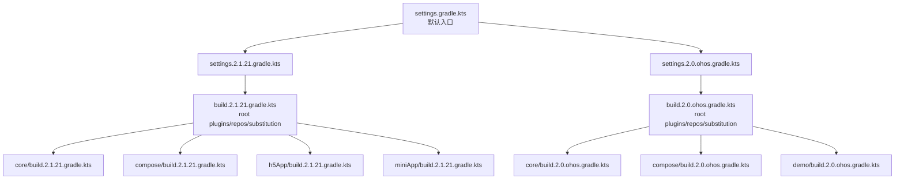

以默认主线（2.1.21）为例，根 `settings.gradle.kts` 实际就是在做“profile 选择”：

```kotlin
val buildFileName = "build.2.1.21.gradle.kts"
include(":core")
project(":core").buildFileName = buildFileName
include(":compose")
project(":compose").buildFileName = buildFileName
```

而 `build.2.1.21.gradle.kts` 统一了以下关键点：

- Kotlin/AGP/KSP 插件版本。
- `allprojects.repositories` 仓库源。
- `dependencySubstitution`：把 `com.tencent.kuikly-open:compose` 替换为本地 `:compose` 工程（便于源码联调）。

鸿蒙 profile（`settings.2.0.ohos.gradle.kts`）则是另一套模块装配：

- 使用 `build.2.0.ohos.gradle.kts`。
- 引入 `demo` 与 `ohosArm64` 相关模块。
- 不走 web 宿主链路。

---

## 3. 总体跨平台构建策略（可迁移）

## 3.1 单一代码主干 + 多 target 编译

典型 target 组合（默认主线）：

- Android
- iOS（arm64/x64/simulator）
- macOS（x64/arm64）
- JS(IR)

鸿蒙 target 不在默认 2.1.21 主线中直接打开，而是走 `2.0.ohos` 独立配置，这是一个非常务实的工程决策（详见第 6 节）。

## 3.2 入口自动生成（KSP）

`core-ksp` 会根据编译目标生成不同平台的 `KuiklyCoreEntry`：

- Android/iOS/ohos 都有独立 Builder。
- 支持多模块场景（`enableMultiModule`、`subModules`、`moduleId`）。
- 通过 `@Page` 自动收集页面并注册路由，避免手写入口漂移。

## 3.3 产物契约统一

各平台最终产物保持强契约：

- Android：`.aar`
- iOS/macOS：`.framework`/Pod
- Web/H5/小程序：`.js`
- HarmonyOS：`.so + .h`（并在宿主侧 NAPI/ArkTS 接入）

## 3.4 任务编排模型（Gradle DAG 视角）

从“任务依赖图”看，KuiklyUI 是典型的**两段式编排**：

1. 先构建跨端业务产物（`demo`）。
2. 再构建平台宿主并拷贝/链接业务产物。

以 JS 端为例：

```text
:demo:packLocalJsBundleDebug/Release
    -> 产出 nativevue2.js 或 zip
        -> :h5App:publishLocalJSBundle / :miniApp:jsMiniApp*Webpack
            -> 拷贝到宿主 dist/page 或 dist/business
```

以鸿蒙为例：

```text
:demo:linkSharedDebugSharedOhosArm64
    -> 产出 libshared.so + libshared_api.h
        -> 脚本拷贝到 ohosApp/entry
            -> DevEco/Hvigor 编译 entry hap
```

任务依赖图（Mermaid）：

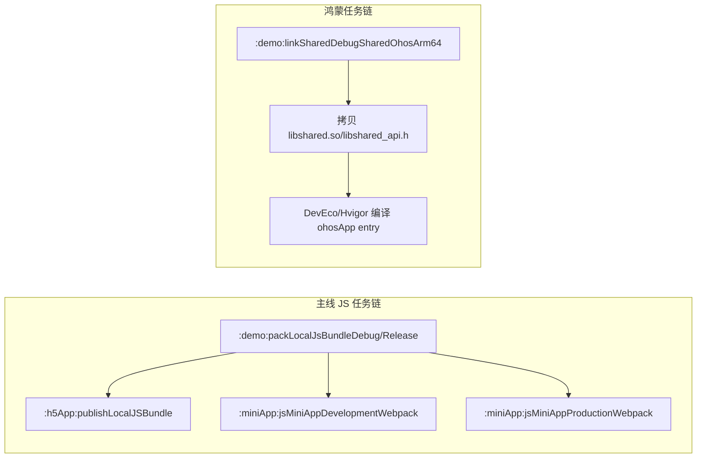

---

## 4. 各平台构建策略总览

## 4.1 Android

- `androidApp` 直接依赖 `:core`、`:demo`、`:core-render-android`。
- 渲染层与业务层都在 Gradle 内联动完成。
- 典型“标准 KMP + 原生宿主”路径，成本最低。

## 4.2 iOS / macOS

- 业务 `demo` 使用 `kotlin("native.cocoapods")` 输出 `shared` framework。
- 宿主 `Podfile` 同时依赖：
  - `OpenKuiklyIOSRender`（渲染层）
  - `demo`（KMP 业务产物）
- `core-render-ios` 同时提供 Pod 与 SPM（`OpenKuiklyIOSRender.podspec` + `Package.swift`）。

## 4.3 H5

- `h5App` 是 JS 宿主，依赖 `core-render-web:base + h5`。
- 构建并不止 webpack，还包含：
  - 业务 bundle 解压/拷贝（`nativevue2.js`）
  - html 引用重写
  - assets 同步
- 支持统一 bundle 与分包页面两种产物策略。
- 在 `h5App/build.2.1.21.gradle.kts` 中，核心任务链是：
  - `publishLocalJSBundle -> dependsOn(jsBrowserDistribution) -> copyLocalJSBundle -> generateLocalHtml`
  - `publishSplitJSBundle -> dependsOn(jsBrowserDistribution) -> copySplitJSBundle -> generateSplitHtml`

## 4.4 小程序（重点）

见第 5 节详细拆解。

## 4.5 鸿蒙（重点）

见第 6 节详细拆解。

---

## 5. 小程序平台实践（重点分析）

Kuikly 小程序方案本质是：  
**Kotlin/JS(IR) 输出 + 小程序模板壳 + 宿主桥接模块。**

## 5.1 构建链路（两段式）

第一段：先构建业务 JS（`demo`）  
第二段：再构建小程序宿主 JS（`miniApp`）并拷贝产物到 `dist`

典型命令：

```bash
npm run serve
./gradlew :demo:packLocalJsBundleDebug -Pkuikly.useLocalKsp=false
./gradlew :miniApp:jsMiniAppDevelopmentWebpack
```

Release：

```bash
./gradlew :demo:packLocalJSBundleRelease -Pkuikly.useLocalKsp=false
./gradlew :miniApp:jsMiniAppProductionWebpack
```

## 5.2 关键工程实现

- `miniApp/build.2.1.21.gradle.kts`
  - 强制 webpack `target = 'node'`（兼容小程序运行环境）。
  - `syncRender*ToDist`：把 render 产物同步到 `dist/lib`。
  - `copyLocalJSBundle`：把业务 `nativevue2.js` 同步到 `dist/business`。
  - `copyAssets`：同步 `assets` 到小程序工程。
  - `generateWebpackConfig` 作为前置任务，被 `compileKotlinJs`/`jsBrowser*Webpack` 依赖。
  - `jsMiniAppProductionWebpack`、`jsMiniAppDevelopmentWebpack` 是“面向业务的一键任务”，内部串联 webpack + 业务包拷贝。

小程序宿主任务关系可简化为：

```text
generateWebpackConfig
    -> jsBrowserDevelopmentWebpack / jsBrowserProductionWebpack
        -> finalizedBy syncRender*ToDist
            -> jsMiniApp*Webpack (再执行 copyLocalJSBundle)
```

业务 bundle 名称由 `demo/build.gradle.kts` 的 Kuikly 插件配置决定：

```kotlin
kuikly {
  js {
    outputName("nativevue2")
  }
}
```

这也是为什么小程序壳里固定加载 `business/nativevue2.js`。

## 5.3 宿主与运行时桥接

- 入口 `miniApp/src/jsMain/kotlin/Main.kt`：
  - 导出 `renderView` / `initApp` 给小程序壳调用。
  - 从 `NativeApi.plat` 获取系统信息并注入页面参数（如 `platform=miniprogram`）。
- `KuiklyWebRenderViewDelegator`：
  - 注册自定义 Module（`KRBridgeModule`、`KRCacheModule`）。
  - 注册自定义 View（如 `KRWebView`）。
  - 注册外部属性处理器。
- 小程序壳 `dist/app.js`：
  - 挂载 `global.com` 和 `global.callKotlinMethod`，完成 Kotlin 与壳层通信。

关键入口代码（简化）：

```kotlin
@JsName("renderView")
@JsExport
fun renderView(json: dynamic) {
  MiniDocument.initPage(...) { pageId, pageName, params ->
    KuiklyWebRenderViewDelegator().delegate.onAttach(pageId, pageName, params, size)
  }
}
```

```javascript
// miniApp/dist/app.js
global.com = business.com
global.callKotlinMethod = business.callKotlinMethod
render.initApp()
```

## 5.4 小程序实践亮点

- **模板壳与业务 bundle 解耦**：`lib/miniprogramApp.js` 与 `business/nativevue2.js` 分离。
- **扩展机制完整**：View/Module/PropHandler 全链路支持。
- **可嵌入现有小程序**：`miniApp/example/KuiklyWorkWithMiniapp` 给出了接入现有工程与原生页面互跳实践（含 `KRRouterModule` 改造与自定义 button 组件接入）。

---

## 6. 鸿蒙平台实践（重点分析）

Kuikly 鸿蒙方案的本质是：  
**Kotlin/Native(ohosArm64) 业务产物 + ArkTS 渲染库 + NAPI 桥接。**

## 6.1 为什么单独走 `2.0.ohos` 构建配置

鸿蒙依赖定制 Kotlin 工具链（`2.0.21-KBA-010`），与主线 Kotlin 2.1.21 并不等价。  
Kuikly 的做法是把鸿蒙构建隔离在独立 settings/build 文件中：

- `settings.2.0.ohos.gradle.kts`
- `build.2.0.ohos.gradle.kts`
- `core/build.2.0.ohos.gradle.kts`
- `demo/build.2.0.ohos.gradle.kts`

这是非常值得复用的策略：  
**特殊平台不要硬塞进主构建链，单独 profile 管理。**

## 6.2 构建链路（产物联动）

典型命令：

```bash
./gradlew -c settings.2.0.ohos.gradle.kts :demo:linkSharedDebugSharedOhosArm64
```

随后把产物复制到宿主：

- `libshared.so` -> `ohosApp/entry/libs/arm64-v8a/`
- `libshared_api.h` -> `ohosApp/entry/src/main/cpp/thirdparty/biz_entry/`

仓库已提供自动脚本：

- `2.0_ohos_demo_build.sh`
- `2.0_ohos_demo_build.bat`

并兼容 Windows 的 `OHOS_SDK_HOME` 环境变量处理。

补充一个常被忽略的细节：  
`2.0_ohos_demo_build.sh/.bat` 会临时把 `gradle-wrapper.properties` 切到 `gradle-8.0`，编译后再恢复原配置。  
这是为了兼容鸿蒙工具链要求，同时不影响主线 profile。

## 6.3 宿主接入链路（NAPI + CMake + ArkTS + KNOI）

1. `libshared.so`（Kotlin 业务产物）由 `demo` 产出。
2. `ohosApp/entry/src/main/cpp/CMakeLists.txt` 将 `libshared.so` 与 `libkuikly.so` 一起链接进 `libkuikly_entry.so`。
3. `ohosApp/entry/src/main/cpp/napi_init.cpp` 暴露 `initKuikly` 给 ArkTS。
4. ArkTS 侧 `MyNativeManager.ets` 调 `Napi.initKuikly()`。
5. 页面通过 `Kuikly({...})` 组件加载跨端页面，并由 `KuiklyViewDelegate` 注入自定义 View/Module。

此外，`EntryAbilityStage.ets` 使用 `@kuiklybase/knoi`：

- `setup("libshared.so", BuildProfile.DEBUG)`
- `init()`

这让 Kotlin/Native 与 ArkTS 间服务注册更体系化（例如 `KuiklyDemoBuglyService` 回调上报）。

## 6.4 关键桥接代码速读（头文件/def/CMake/NAPI）

这部分是鸿蒙链路最关键、也最容易看不懂的地方。

### (1) `KRRenderCValue.h`：Kotlin 与 Native 的值协议

文件：`core/src/ohosArm64Main/ohosInterop/include/KRRenderCValue.h`

```c
typedef struct KRRenderCValue { ... } KRRenderCValue;
extern int com_tencent_kuikly_SetCallKotlin(CallKotlin callKotlin);
extern const KRRenderCValue com_tencent_kuikly_CallNative(...);
```

它定义了跨语言参数与回调契约（`int/string/array/...`），本质是 “Kotlin <-> C API” 的 ABI 适配层。

### (2) `ohos.def`：把 C 头暴露给 Kotlin/Native cinterop

文件：`core/src/ohosArm64Main/ohosInterop/cinterop/ohos.def`

```text
headers = ../include/KRRenderCValue.h
```

`ohosArm64` target 构建时通过该 `def` 生成 cinterop binding，Kotlin 才能直接调用 `com_tencent_kuikly_*` 符号。

### (3) `CMakeLists.txt`：宿主入口动态库的链接拼装

文件：`ohosApp/entry/src/main/cpp/CMakeLists.txt`

- 导入渲染库 `libkuikly.so`（来自 `@kuikly-open/render`）。
- 链接业务库 `entry/libs/arm64-v8a/libshared.so`（来自 `demo` 编译产物）。
- 产出 `libkuikly_entry.so`（ArkTS 实际加载的 NAPI so）。

### (4) `napi_init.cpp`：ArkTS 调用 Kotlin 入口的最后一跳

文件：`ohosApp/entry/src/main/cpp/napi_init.cpp`

核心逻辑：

```cpp
auto api = libshared_symbols();
int handler = api->kotlin.root.initKuikly();
```

它从 `libshared.so` 导出符号中拿到 Kotlin 根入口并执行 `initKuikly`，随后把能力以 NAPI 方式导出给 ArkTS（`initKuikly`、`setFontPath`、`setResourceManager`）。

可以把 6.3 + 6.4 合起来理解为：

```text
ArkTS(EntryAbility/Kuikly)
  -> libkuikly_entry.so (NAPI glue)
    -> libshared.so (Kotlin业务入口)
    -> libkuikly.so (渲染引擎)
```

## 6.5 鸿蒙实践亮点

- **工具链隔离**：规避主线构建被特殊 target 破坏。
- **产物联动脚本化**：`so + header` 自动拷贝，减轻手工错误。
- **渲染器包化**：`core-render-ohos` 作为 `@kuikly-open/render` HAR 分发。
- **宿主适配器模型**：`AppKRRenderManager` 统一注册 Router/Log/PAG/Video 适配器，增强可维护性。

## 6.6 与 iOS 桥接方式的对照理解

为了更易理解鸿蒙桥接，可对照 iOS：

- iOS：`ios.def` 暴露 C/ObjC 符号给 Kotlin Native；业务通过 CocoaPods/Framework 注入宿主。
- 鸿蒙：`ohos.def` + `KRRenderCValue.h` 暴露符号；业务通过 `.so + NAPI` 注入宿主。

两者思路相同：  
**都在用 cinterop 定义跨语言边界，只是宿主生态一个是 Pod/ObjC，一个是 ArkTS/NAPI。**

---

## 7. 给后续“更全面跨平台项目”的落地建议

## 7.1 工程组织模板（推荐直接照搬）

- `shared-core`：纯跨端（commonMain 为主）。
- `shared-biz`：页面与业务（`@Page` + KSP 入口）。
- `render-*`：平台渲染器（尽量薄）。
- `host-*`：宿主壳（只做适配和生命周期托管）。
- `settings.<profile>.gradle.kts`：按平台/工具链拆 profile。

## 7.2 构建策略模板

1. 主线 profile：Android+iOS+desktop+web。
2. 特殊 profile：鸿蒙等定制 toolchain 平台。
3. 产物标准化：
   - `build/outputs/<platform>/...`
   - 提供 `copyArtifacts` 任务给宿主工程。
4. CI 中强制执行“产物存在性检查”与“宿主同步检查”。

## 7.3 平台扩展模板

每新增一个平台，固定完成这 5 件事：

1. 新增 target 与 sourceSet。
2. 实现 `NativeBridge/PlatformImp` 的平台 actual。
3. 提供 render adapter（router/log/media/network 等）。
4. 提供宿主桥接入口（JS bridge / NAPI / JNI）。
5. 编写 profile 化构建脚本与拷贝任务。

## 7.4 重点风险清单

- 小程序/H5 需关注 Kotlin JS 输出目录在不同版本下的变化（Kuikly 已做过兼容）。
- 鸿蒙宿主编译前必须确保 `libshared.so` 与 `libshared_api.h` 已同步。
- 动态能力与平台能力耦合要通过 Module/Adapter 解耦，避免 shared 层硬依赖平台 API。
- 多模块场景要启用 KSP 多模块参数，避免入口冲突。

---

## 8. 结语

KuiklyUI 的最大实践价值不在“支持了多少端”，而在于它已经把跨端工程里最难的部分都产品化了：

- 版本兼容矩阵
- 特殊工具链隔离
- 产物联动与宿主接入
- 可扩展桥接体系（View/Module/Adapter）

如果你后续要做更全面的跨平台项目，建议以 Kuikly 的“小程序链路”和“鸿蒙链路”作为模板优先复制，因为这两条链路最能检验你的工程是否具备真正的跨端工程化能力。

---

## 9. 从零创建 KMP 项目并一步到位配置与构建

这一章对应“刚创建 Kotlin Multiplatform 工程”的阶段，目标是：  
**第一次初始化就把项目配置成可长期演进的多端工程，而不是先跑通、后返工。**

### 9.1 向导阶段怎么选，避免后续返工

在 IDE 新建 KMP（你图中的界面）时，建议直接这样选：

1. 勾选 `Android`、`iOS`、`桌面`、`Web`。
2. UI 选择“共享 UI”（Compose Multiplatform）。
3. 若你不准备做后端，取消 `服务器(Ktor)`。
4. JDK 推荐先用 17；若向导默认是 21，创建后把 Gradle JDK 切回 17（兼容 AGP 7.4.x/8.x 更稳）。

### 9.2 创建后第一件事：改成 profile 化构建

不要直接把所有逻辑堆在 `settings.gradle.kts` 与单个 root build 里。  
建议立刻建立两套 profile：

- 主线 profile：`2.1.21`（Android/iOS/macOS/Web/小程序/H5）
- 鸿蒙 profile：`2.0.ohos`（`2.0.21-KBA-010` 工具链）

目录建议：

```text
settings.gradle.kts                  # 默认入口（指向主线profile）
settings.2.1.21.gradle.kts
settings.2.0.ohos.gradle.kts
build.2.1.21.gradle.kts
build.2.0.ohos.gradle.kts
```

并在 `settings.<profile>.gradle.kts` 内用 `buildFileName` 绑定各模块脚本，这一步决定了后续能否做多版本并行维护。

### 9.3 一次性把模块边界定好

建议按 Kuikly 的分层方式在项目首日就拆好：

- `core`：跨端核心能力（纯共享）。
- `core-annotations`、`core-ksp`：注解与入口生成。
- `biz`（或 `demo`）：业务页面模块。
- `core-render-*`：平台渲染层（Android/iOS/Web/OHOS）。
- `host-*`：平台壳工程（androidApp/iosApp/macApp/h5App/miniApp/ohosApp）。

这样后续新增平台时不会把业务层与宿主层耦合在一起。

### 9.4 “一步到位”的关键 Gradle 配置清单

创建工程当天建议把以下配置全部补齐：

1. root `build.<profile>.gradle.kts` 固定插件版本：Kotlin/AGP/KSP/Compose。
2. `allprojects.repositories` 统一仓库，避免子模块各写一份。
3. `dependencySubstitution`（如本地 `:compose` 替代远端 compose 制品）便于源码联调。
4. `gradle.properties` 固定关键参数：
   - `ksp.incremental=true`
   - `kotlin.js.webpack.major.version=4`
   - `kuikly.useLocalKsp=true/false`（按场景切）
5. 业务模块加 KSP 参数（`pageName`、`packLocalJsBundle` 等）并统一任务入口。

### 9.5 小程序/H5/鸿蒙三条“非标准链路”首日就接上

这是最容易后补、也最容易补崩的部分，建议首日最小接通：

1. H5：配置 `h5App` 的 bundle 拷贝与 html 重写任务。
2. 小程序：配置 `miniApp` 的 `target=node`、`dist/lib` + `dist/business` 同步任务。
3. 鸿蒙：准备 `settings.2.0.ohos.gradle.kts` + `demo:linkShared*OhosArm64` + `so/header` 拷贝脚本。

只要这三条链路早接上，后面扩页面不会改工程骨架。

### 9.6 推荐的一键脚本模板（可直接落地）

在项目根目录加 `scripts/bootstrap_build.sh`（示例）：

```bash
#!/usr/bin/env bash
set -e

MODE=${1:-debug}          # debug | release
WITH_OHOS=${2:-false}     # true | false

if [ "$MODE" = "release" ]; then
  ./gradlew -c settings.2.1.21.gradle.kts :biz:packLocalJSBundleRelease
  ./gradlew -c settings.2.1.21.gradle.kts :h5App:publishLocalJSBundle
  ./gradlew -c settings.2.1.21.gradle.kts :miniApp:jsMiniAppProductionWebpack
  ./gradlew -c settings.2.1.21.gradle.kts :androidApp:assembleRelease
else
  ./gradlew -c settings.2.1.21.gradle.kts :biz:packLocalJsBundleDebug
  ./gradlew -c settings.2.1.21.gradle.kts :h5App:jsBrowserDevelopmentRun -t
  ./gradlew -c settings.2.1.21.gradle.kts :miniApp:jsMiniAppDevelopmentWebpack
  ./gradlew -c settings.2.1.21.gradle.kts :androidApp:assembleDebug
fi

if [ "$WITH_OHOS" = "true" ]; then
  ./gradlew -c settings.2.0.ohos.gradle.kts :biz:linkSharedDebugSharedOhosArm64
  # 这里追加 copy so/header 到 ohosApp 的脚本
fi
```

你可以把它再拆成：

- `scripts/build_mainline.sh`
- `scripts/build_ohos.sh`

并在 CI 分开执行，避免鸿蒙工具链拖慢主线。

### 9.7 新项目首日验收标准（Definition of Done）

满足以下 7 条，才算“一步到位”：

1. `settings.2.1.21.gradle.kts` 与 `settings.2.0.ohos.gradle.kts` 都能独立 sync。
2. `@Page` 能被 KSP 正确生成入口（Android/iOS/JS 至少验证一个）。
3. Android 壳可安装运行。
4. iOS 壳可在 Xcode 启动。
5. H5 能打开路由页。
6. 小程序 `dist` 可被开发者工具直接加载。
7. 鸿蒙 `libshared.so + libshared_api.h` 能成功复制并被 ohosApp 编译识别。

### 9.8 首日最常见坑位与规避

- 向导用 JDK21，Gradle/AGP 组合不兼容：立即切 Gradle JDK 17。
- 只配了主线 settings，没配 ohos settings：后续鸿蒙接入会大面积改脚本。
- 小程序没设 webpack `target=node`：运行时兼容问题会很隐蔽。
- 忘了做业务 bundle 到宿主 dist 的同步任务：壳能跑，页面白屏。
- 没把 `so/header` 拷贝流程脚本化：本地偶现”我能跑、同事不能跑”。

---

## 10. DSL 解析与 AST 构建引擎

> [!note] 章节定位
> 上一节关注工程构建，这一节深入运行时内核：**下发的动态化 DSL 如何在 Common 层构建为可遍历、可 diff、可序列化的 AST（抽象语法树）。**

Kuikly 的 UI 描述并非直接写 Compose 代码后编译到各平台，而是通过一套 **DSL → AST → RenderCommand** 的三阶段流水线。这对动态化场景至关重要：UI 结构可以在运行时从远端下发，无需发版。

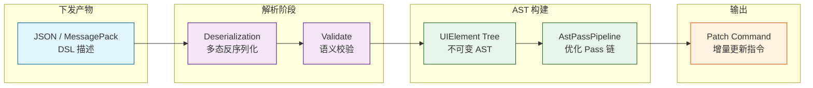

### 10.1 为什么需要自定义 AST，而非直接复用 Compose 的 Composable 函数？

> [!question] 核心矛盾
> Compose 的 `@Composable` 函数能在纯 Kotlin 端高效运行，但**无法序列化、无法跨语言边界传递**。动态化场景需要一种可以在运行时从服务端下发、在各平台通用表达的 UI 描述格式。

Kuikly 的方案是：在 Common 层定义一套平台无关的 **UIElement 树**——这棵树：

> [!note] UIElement 树的三大核心能力
>
> - **可序列化**（`kotlinx.serialization`），能通过 JSON 或更紧凑的二进制协议从服务端下发
> - **可 Clone**（用于状态比较与增量更新）
> - **可遍历**（Visitor 模式），支持后续的布局计算、命令生成、调试检查

### 10.2 UIElement 节点体系设计

核心接口采用 Kotlin `sealed interface` 实现封闭类型体系，保证 when 表达式穷举：

```kotlin
import kotlinx.serialization.Serializable
import kotlinx.serialization.Polymorphic
import kotlinx.serialization.json.Json
import kotlinx.serialization.modules.SerializersModule
import kotlinx.serialization.modules.polymorphic
import kotlinx.serialization.modules.subclass

// ──────────────────────────────────────────────
// 1. 基础节点接口
// ──────────────────────────────────────────────

@Serializable
sealed interface UIElement {
    /** 每个节点持有一个稳定 ID，用于 keyed diff */
    val id: String
    /** 子节点列表 */
    val children: List<UIElement>
    /** 修饰符链（样式、事件、布局属性） */
    val modifiers: List<UIModifier>

    /** Visitor 模式：遍历时对每个节点执行操作 */
    fun <R> accept(visitor: UIVisitor<R>): R = visitor.visit(this)

    /** 浅拷贝 — 替换子节点（用于 Diff 后的 patch） */
    fun withChildren(newChildren: List<UIElement>): UIElement
}

// ──────────────────────────────────────────────
// 2. 具体节点类型
// ──────────────────────────────────────────────

@Serializable
@SerialName(“text”)
data class TextElement(
    override val id: String,
    val content: String,
    val style: TextStyle? = null,
    override val children: List<UIElement> = emptyList(),
    override val modifiers: List<UIModifier> = emptyList(),
) : UIElement {
    override fun withChildren(newChildren: List<UIElement>): UIElement =
        copy(children = newChildren)
}

@Serializable
@SerialName(“column”)
data class ColumnElement(
    override val id: String,
    val horizontalAlignment: CrossAxisAlignment = CrossAxisAlignment.START,
    override val children: List<UIElement>,
    override val modifiers: List<UIModifier> = emptyList(),
) : UIElement {
    override fun withChildren(newChildren: List<UIElement>): UIElement =
        copy(children = newChildren)
}

@Serializable
@SerialName(“row”)
data class RowElement(
    override val id: String,
    val verticalAlignment: CrossAxisAlignment = CrossAxisAlignment.TOP,
    override val children: List<UIElement>,
    override val modifiers: List<UIModifier> = emptyList(),
) : UIElement {
    override fun withChildren(newChildren: List<UIElement>): UIElement =
        copy(children = newChildren)
}

@Serializable
@SerialName(“image”)
data class ImageElement(
    override val id: String,
    val source: String,
    val contentMode: ContentMode = ContentMode.FIT,
    override val children: List<UIElement> = emptyList(),
    override val modifiers: List<UIModifier> = emptyList(),
) : UIElement {
    override fun withChildren(newChildren: List<UIElement>): UIElement =
        copy(children = newChildren)
}

@Serializable
@SerialName(“button”)
data class ButtonElement(
    override val id: String,
    val label: String,
    val onClick: EventDescriptor? = null,
    override val children: List<UIElement> = emptyList(),
    override val modifiers: List<UIModifier> = emptyList(),
) : UIElement {
    override fun withChildren(newChildren: List<UIElement>): UIElement =
        copy(children = newChildren)
}

@Serializable
@SerialName(“scroll-column”)
data class ScrollColumnElement(
    override val id: String,
    val scrollable: ScrollAxis = ScrollAxis.VERTICAL,
    override val children: List<UIElement>,
    override val modifiers: List<UIModifier> = emptyList(),
) : UIElement {
    override fun withChildren(newChildren: List<UIElement>): UIElement =
        copy(children = newChildren)
}

// ──────────────────────────────────────────────
// 3. Modifier 体系（同样可序列化）
// ──────────────────────────────────────────────

@Serializable
sealed interface UIModifier {
    val key: String
}

@Serializable
@SerialName(“padding”)
data class PaddingModifier(
    val start: Float = 0f,
    val end: Float = 0f,
    val top: Float = 0f,
    val bottom: Float = 0f,
) : UIModifier {
    override val key: String = “padding”
}

@Serializable
@SerialName(“background”)
data class BackgroundModifier(
    val color: Long,       // ARGB 编码
    val alpha: Float = 1f,
) : UIModifier {
    override val key: String = “background”
}

@Serializable
@SerialName(“clickable”)
data class ClickableModifier(
    val event: EventDescriptor,
) : UIModifier {
    override val key: String = “clickable”
}

@Serializable
sealed interface EventDescriptor {
    val action: String
    val payload: Map<String, String>
}

@Serializable
@SerialName(“navigate”)
data class NavigateEvent(
    override val payload: Map<String, String>,
) : EventDescriptor {
    override val action: String = “navigate”
}

@Serializable
@SerialName(“custom”)
data class CustomEvent(
    override val action: String,
    override val payload: Map<String, String>,
) : EventDescriptor
```

### 10.3 多态序列化模块注册

`kotlinx.serialization` 的多态支持要求显式注册所有子类型。将注册集中到 `SerializersModule`，可以让反序列化时自动根据 `type`（即 `@SerialName`）分发：

```kotlin
// ──────────────────────────────────────────────
// SerializersModule 注册（集中管理）
// ──────────────────────────────────────────────

val UI_SERIALIZER_MODULE = SerializersModule {
    polymorphic(UIElement::class) {
        subclass(TextElement::class)
        subclass(ColumnElement::class)
        subclass(RowElement::class)
        subclass(ImageElement::class)
        subclass(ButtonElement::class)
        subclass(ScrollColumnElement::class)
    }
    polymorphic(UIModifier::class) {
        subclass(PaddingModifier::class)
        subclass(BackgroundModifier::class)
        subclass(ClickableModifier::class)
    }
    polymorphic(EventDescriptor::class) {
        subclass(NavigateEvent::class)
        subclass(CustomEvent::class)
    }
}

/** 全局 JSON 实例 */
val uiJson: Json = Json {
    serializersModule = UI_SERIALIZER_MODULE
    ignoreUnknownKeys = true
    isLenient = true
    prettyPrint = false
}
```

### 10.4 从 DSL 到 AST 的完整反序列化流水线

远端下发的 DSL（JSON 或 MessagePack）经过以下流水线构建为 AST：

```kotlin
// ──────────────────────────────────────────────
// AST 构建引擎
// ──────────────────────────────────────────────

sealed class AstResult {
    data class Success(val root: UIElement) : AstResult()
    data class Failure(val errors: List<AstError>) : AstResult()
}

data class AstError(
    val path: String,          // JSONPath 定位，如 “$.children[2]”
    val message: String,
    val recoverable: Boolean,
)

class AstEngine(
    private val json: Json = uiJson,
) {
    /**
     * 将 DSL JSON 反序列化为 AST。
     * 若顶层节点有 version 字段，可做 schema 版本兼容。
     */
    fun parse(dslJson: String): AstResult {
        return try {
            val root: UIElement = json.decodeFromString(dslJson)
            val validationErrors = validate(root)
            if (validationErrors.isEmpty()) {
                AstResult.Success(root)
            } else {
                AstResult.Failure(validationErrors)
            }
        } catch (e: SerializationException) {
            AstResult.Failure(
                listOf(AstError(“\$”, “Deserialization failed: ${e.message}”, false))
            )
        }
    }

    /** DFS 遍历进行语义校验 */
    private fun validate(element: UIElement, path: String = “\$”): List<AstError> {
        val errors = mutableListOf<AstError>()

        // 规则 1：id 不能为空
        if (element.id.isBlank()) {
            errors.add(AstError(path, “Element id must not be blank”, true))
        }

        // 规则 2：容器节点（Column/Row）必须有 children
        if (element is ColumnElement && element.children.isEmpty()) {
            errors.add(AstError(path, “Column should have at least one child”, false))
        }

        // 规则 3：叶子节点（Text/Image）不能有 children
        if (element is TextElement && element.children.isNotEmpty()) {
            errors.add(AstError(path, “Text cannot have children”, true))
        }

        // 递归验证子节点
        element.children.forEachIndexed { index, child ->
            errors.addAll(validate(child, “\$.children[$index]”))
        }
        return errors
    }

    /** 将 AST 序列化为 JSON（用于缓存/调试） */
    fun serialize(root: UIElement): String =
        json.encodeToString(root)
}

// ──────────────────────────────────────────────
// 使用示例
// ──────────────────────────────────────────────

fun main() {
    val dsl = “””
    {
        “type”: “column”,
        “id”: “screen_home”,
        “horizontalAlignment”: “center”,
        “children”: [
            {
                “type”: “text”,
                “id”: “title”,
                “content”: “欢迎使用动态化页面”,
                “style”: { “fontSize”: 20, “bold”: true },
                “modifiers”: [
                    { “type”: “padding”, “top”: 16 }
                ]
            },
            {
                “type”: “button”,
                “id”: “btn_submit”,
                “label”: “提交”,
                “onClick”: {
                    “action”: “navigate”,
                    “payload”: { “page”: “detail” }
                }
            }
        ]
    }
    “””.trimIndent()

    val engine = AstEngine()
    when (val result = engine.parse(dsl)) {
        is AstResult.Success -> {
            println(“AST built: ${result.root.id}”)
            // 后续可传给 DiffEngine / RenderBridge
        }
        is AstResult.Failure -> {
            result.errors.forEach { error ->
                System.err.println(“[AST Error] ${error.path}: ${error.message}”)
            }
        }
    }
}
```

### 10.5 AST 构建后的编译优化管道（Pass System）

AST 构建完成后，不会直接送到渲染层。通常会串联若干 **优化 Pass**，每个 Pass 是一个 `(UIElement) -> UIElement` 的变换函数：

```kotlin
/**
 * AST 编译管道：按顺序注册 Pass，每个 Pass 变换 AST。
 * 这种 pipeline 架构受 LLVM 的 PassManager 启发，每个 Pass 职责单一。
 */
class AstPassPipeline {
    private val passes: List<AstPass> = listOf(
        ConstFoldPass(),            // 常量折叠：编译期计算可确定的样式值
        EliminateEmptyContainersPass(), // 消除空容器节点
        FlattenSingleChildPass(),        // 扁平化单子容器（减少层级）
        StyleMergePass(),           // 合并同层冗余 Modifier
        PlatformAdaptPass(),        // 平台适配（如 ArkUI 不支持 overflow 时降级）
    )

    fun execute(root: UIElement): UIElement {
        return passes.fold(root) { tree, pass ->
            val start = System.nanoTime()
            val result = pass.transform(tree)
            val elapsed = (System.nanoTime() - start) / 1_000_000
            // Log.d(“AstPass”, “${pass.name} took ${elapsed}ms”)
            result
        }
    }
}

interface AstPass {
    val name: String
    fun transform(element: UIElement): UIElement
}

class ConstFoldPass : AstPass {
    override val name = “ConstFold”

    override fun transform(element: UIElement): UIElement = when (element) {
        is TextElement -> element // Text 无折叠空间
        is ColumnElement -> element.copy(
            children = element.children.map { transform(it) }
        )
        // ... 其他节点类似
        else -> element
    }
}
```

> [!summary] 设计意图 —— AST Pass 管道的真正价值
> 这套 Pass 系统并非追求极致性能——在动态化场景中 AST 规模通常不过数百节点。它的真正价值在于**将平台差异和优化策略从渲染层抽离到 Common 层**，让渲染桥接层保持简洁、稳定。

抽象 Pass 管道的运行逻辑如下：

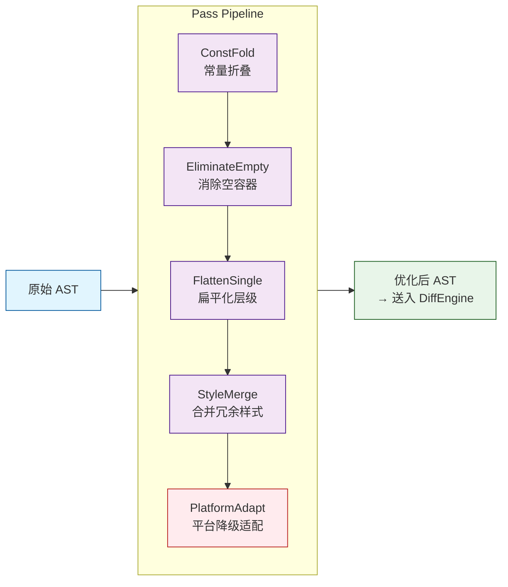

---

## 11. 跨层状态管理与响应式绑定

> [!question] 核心问题
> UI 的数据模型（State）在 Common 层管理，但渲染在平台层。当数据变化时，如何精准通知平台层只重绘发生变更的节点，而非全量刷新？

### 11.1 状态管理架构总览

Kuikly 的状态管理定位在 Common 层，采用类似 **Flux 单向数据流 + 观察者模式** 的混合设计：

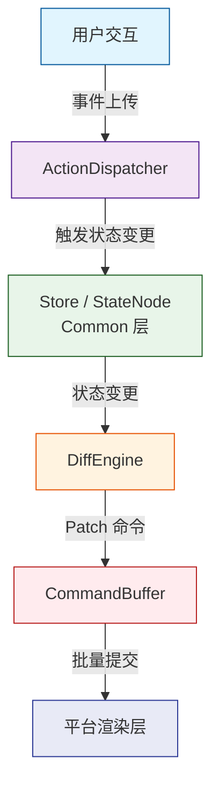

### 11.2 StateNode：可观测的状态容器

每个可观测状态包装为 `StateNode`，内部使用 `kotlinx.coroutines.flow.StateFlow` 实现响应式订阅：

```kotlin
import kotlinx.coroutines.flow.MutableStateFlow
import kotlinx.coroutines.flow.StateFlow
import kotlinx.coroutines.flow.asStateFlow

/**
 * 可观测的状态节点。
 * T 必须是稳定的（stable）——建议使用不可变 data class。
 */
open class StateNode<T : Any>(initialValue: T) {

    private val _state = MutableStateFlow(initialValue)
    val state: StateFlow<T> = _state.asStateFlow()

    /** 当前值的快照（非 Flow 方式读取，用于 Diff 对比） */
    var value: T = initialValue
        private set

    /** 更新状态：更新值 + 通知订阅者 */
    fun update(newValue: T) {
        if (newValue == value) return  // 无变化，跳过
        value = newValue
        _state.value = newValue
    }

    /** 便捷：通过变换函数更新（适合不可变数据类） */
    fun transform(mutator: (T) -> T) {
        update(mutator(value))
    }
}

/**
 * 派生状态 —— 从多个 StateNode 计算得来。
 * 类似 Compose 的 derivedStateOf，但跨平台可序列化。
 */
class DerivedStateNode<T, R>(
    private val sources: List<StateNode<*>>,
    private val compute: (List<Any?>) -> R,
    initialValue: R,
) : StateNode<R>(initialValue) {

    fun recompute() {
        val deps = sources.map { it.value as Any? }
        transform { compute(deps) }
    }
}
```

### 11.3 页面级别的 Store

页面维度聚合所有 StateNode，提供统一的状态快照和变更派发入口：

```kotlin
/**
 * 页面 Store：聚合所有状态，提供 Diff 所需的状态快照。
 */
open class PageStore {
    /** 注册此页面所有状态节点 */
    private val stateNodes = mutableMapOf<String, StateNode<*>>()

    fun <T : Any> register(key: String, node: StateNode<T>): StateNode<T> {
        stateNodes[key] = node
        return node
    }

    /** 获取当前全局状态快照 —— 用于与下一帧对比做 Diff */
    fun snapshot(): Map<String, Any?> =
        stateNodes.mapValues { (_, node) -> node.value }

    /** 批量更新状态 */
    fun batchUpdate(updates: Map<String, (Any?) -> Any?>) {
        updates.forEach { (key, mutator) ->
            stateNodes[key]?.let { node ->
                @Suppress(“UNCHECKED_CAST”)
                (node as StateNode<Any?>).transform(mutator)
            }
        }
    }
}
```

### 11.4 状态驱动的 VDOM Diff 引擎

当状态发生变化时，DiffEngine 对比新旧两棵 AST，输出最小化 Patches：

```kotlin
// ──────────────────────────────────────────────
// Patch 定义：描述一个具体的 DOM 变更操作
// ──────────────────────────────────────────────

sealed class Patch {
    data class Insert(val parentId: String, val index: Int, val element: UIElement) : Patch()
    data class Remove(val parentId: String, val index: Int, val elementId: String) : Patch()
    data class Move(val parentId: String, val fromIndex: Int, val toIndex: Int) : Patch()
    data class UpdateProps(val elementId: String, val changedProps: Map<String, Any?>) : Patch()
    data class Replace(val elementId: String, val newElement: UIElement) : Patch()
}

// ──────────────────────────────────────────────
// Keyed Diff 算法
// ──────────────────────────────────────────────

class DiffEngine {

    /**
     * 对比新旧两个子节点列表，输出 Patch 列表。
     * 基于 key（element.id）做最小移动检测。
     *
     * 这不是完整的 List-diff（完整实现参考 inferno/ivi 的 LIS 优化），
     * 但对于动态化页面（通常 < 200 节点）已经足够。
     */
    fun diffChildren(
        parentId: String,
        oldChildren: List<UIElement>,
        newChildren: List<UIElement>,
    ): List<Patch> {
        val patches = mutableListOf<Patch>()
        val oldByKey = oldChildren.associateBy { it.id }
        val newByKey = newChildren.associateBy { it.id }
        val oldKeys = oldChildren.map { it.id }.toMutableList()

        // Phase 1: 检测被删除的节点
        val removedKeys = oldKeys.filter { it !in newByKey }
        for (key in removedKeys) {
            val index = oldKeys.indexOf(key)
            patches.add(Patch.Remove(parentId, index, key))
            oldKeys.removeAt(index)
        }

        // Phase 2: 检测新增和移动的节点
        var newIndex = 0
        for (newElement in newChildren) {
            val oldIndex = oldKeys.indexOf(newElement.id)
            if (oldIndex < 0) {
                // 全新的节点 → Insert
                patches.add(Patch.Insert(parentId, newIndex, newElement))
                oldKeys.add(newIndex, newElement.id)
            } else {
                // 已存在的节点
                if (oldIndex != newIndex) {
                    // 位置变化 → Move
                    patches.add(Patch.Move(parentId, oldIndex, newIndex))
                    val key = oldKeys.removeAt(oldIndex)
                    oldKeys.add(newIndex, key)
                }
                // 属性变更检测
                val oldElement = oldByKey[newElement.id]!!
                val changedProps = findChangedProps(oldElement, newElement)
                if (changedProps.isNotEmpty()) {
                    patches.add(Patch.UpdateProps(newElement.id, changedProps))
                }
            }
            newIndex++
        }

        return patches
    }

    /** 利用 Kotlin 的 data class 解构对比属性变更 */
    private fun findChangedProps(old: UIElement, new: UIElement): Map<String, Any?> {
        val changed = mutableMapOf<String, Any?>()

        when {
            old is TextElement && new is TextElement -> {
                if (old.content != new.content) changed[“content”] = new.content
                if (old.style != new.style) changed[“style”] = new.style
            }
            old is ImageElement && new is ImageElement -> {
                if (old.source != new.source) changed[“source”] = new.source
                if (old.contentMode != new.contentMode) changed[“contentMode”] = new.contentMode
            }
            old::class != new::class -> {
                // 类型不同 → 整个替换
                return mapOf(“__replace__” to new)
            }
        }

        // Modifier 对比：简单 toString 对比（生产环境使用 hash 或版本号）
        if (old.modifiers.toString() != new.modifiers.toString()) {
            changed[“modifiers”] = new.modifiers
        }

        return changed
    }
}

// ──────────────────────────────────────────────
// 状态驱动的自动 Diff
// ──────────────────────────────────────────────

class ReactiveRenderer(
    private val astEngine: AstEngine,
    private val diffEngine: DiffEngine,
    private val bridge: RenderBridge,   // 见第 12 节
) {
    private var currentAst: UIElement? = null
    private val store = PageStore()

    /** 首次渲染：全量构建 */
    fun initialRender(dslJson: String) {
        when (val result = astEngine.parse(dslJson)) {
            is AstResult.Success -> {
                currentAst = result.root
                bridge.applyPatches(
                    listOf(Patch.Insert(“root”, 0, result.root)),
                    isFullRender = true,
                )
            }
            is AstResult.Failure -> {
                bridge.showError(result.errors.joinToString(“\n”) { it.message })
            }
        }
    }

    /** 状态变更时执行 Diff 并派发增量 Patch */
    fun onStateChange() {
        val oldAst = currentAst ?: return
        val newAst = rebuildAstFromState(store) ?: return

        val patches = diffChildren(“root”, listOf(oldAst), listOf(newAst))
        currentAst = newAst

        if (patches.isNotEmpty()) {
            bridge.applyPatches(patches, isFullRender = false)
        }
    }

    /** 从当前 Store 重新构建 AST（将状态绑定到 UIElement 的属性上） */
    private fun rebuildAstFromState(store: PageStore): UIElement? {
        // 实际实现需要 AST 中维护”状态引用”而非具体值，
        // 渲染时通过引用从 Store 读取最新值。
        // 这里简化为：克隆 AST 后用 store 值替换绑定属性。
        return currentAst // placeholder：实际需实现 bind → resolve pipeline
    }
}
```

### 11.5 跨越 KMP 边界的状态同步策略

这是整个架构中最具挑战的部分——**Common 层持有状态，平台层持有真实控件**。

Kuikly 采用的策略是 **Command-Based Synchronization**：

> [!compare] 三种同步策略对比
>
> | 方案           | 描述                                                      | 适用场景           |
> | :------------- | :-------------------------------------------------------- | :----------------- |
> | **全量同步**   | 每次状态变更将整个 AST 序列化后发送给渲染层               | 简单页面、初次渲染 |
> | **增量 Patch** | DiffEngine 产出 Patch 列表，仅传输变更部分                | 复杂页面、高频交互 |
> | **双向绑定**   | 平台层可调用 Common 层方法修改状态，Common 层再回发 Patch | 表单输入、动画驱动 |

> [!important] 关键性能约束
> 在 Kotlin/Native 场景下（鸿蒙、iOS），Common → Platform 的每次通信都有 cinterop/FFI 开销。因此 **Patch 必须批量提交**，而非每次属性变更都跨一次边界。详见第 13 节。

```kotlin
/**
 * BatchCommandBuffer：将多个 Patch 合并为一次批量提交，
 * 减少跨语言边界的调用次数。
 */
class BatchCommandBuffer(
    private val flushThreshold: Int = 16,
) {
    private val pending = mutableListOf<Patch>()

    fun enqueue(patch: Patch) {
        pending.add(patch)
        if (pending.size >= flushThreshold) {
            flush()
        }
    }

    fun flush(): List<Patch> {
        val batch = pending.toList()
        pending.clear()
        return batch
    }
}
```

---

## 12. 双端/多端渲染桥接层（Renderer Bridge）

### 12.1 架构层：三层桥接模型

绝大多数跨端框架在这一层的设计决定了其**扩展成本和渲染一致性上限**。Kuikly 采用**三层桥接**：

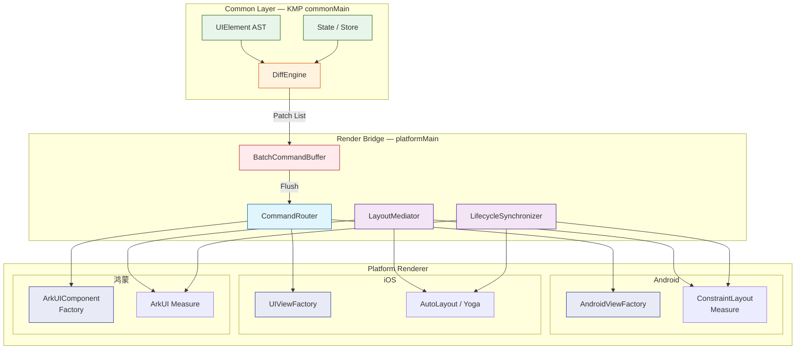

### 12.2 RenderBridge：统一的 Patch 应用接口

```kotlin
/**
 * 渲染桥接层接口——平台渲染器需要实现的契约。
 * 所有方法皆在 Common 层定义，确保各平台行为一致。
 */
interface RenderBridge {

    /** 应用一组 Patch，isFullRender 指示是否为全量初次渲染 */
    fun applyPatches(patches: List<Patch>, isFullRender: Boolean)

    /** 创建平台原生视图并返回其全局唯一 ID */
    fun createView(element: UIElement, parentId: String): Long

    /** 更新视图属性 */
    fun updateViewProperties(viewId: Long, props: Map<String, Any?>)

    /** 移动视图到新位置 */
    fun moveView(viewId: Long, parentId: String, index: Int)

    /** 删除视图 */
    fun removeView(viewId: Long)

    /** 插入子视图 */
    fun insertChild(parentId: Long, childId: Long, index: Int)

    /** 获取平台特定的布局约束 */
    fun getLayoutConstraints(): LayoutConstraints
}

/**
 * 布局约束——各平台 Measure 规格的抽象。
 * Android 使用 exactly/atMost/unspecified，iOS 有 intrinsic size，
 * ArkUI 使用百分比或 vp。这里取其最小公倍数。
 */
data class LayoutConstraints(
    val minWidth: Float,
    val maxWidth: Float,
    val minHeight: Float,
    val maxHeight: Float,
)
```

### 12.3 LayoutMediator：弥合排版引擎差异

这是桥接层内部最棘手的问题。不同平台的排版模型存在本质差异：

> [!compare] 三端排版引擎差异
>
> | 维度           | Android（View）                                  | iOS（UIKit）                       | ArkUI（鸿蒙）           |
> | :------------- | :----------------------------------------------- | :--------------------------------- | :---------------------- |
> | Measure 入口   | `onMeasure(widthSpec, heightSpec)`               | `sizeThatFits(_:)`                 | `onMeasure(Constraint)` |
> | 布局方向       | LTR / RTL 全局配置                               | LTR / RTL + leading/trailing       | LTR / RTL               |
> | 百分比布局     | `ConstraintLayout` / `LinearLayout.LayoutParams` | `NSLayoutConstraint`（multiplier） | 百分比 + vp 原生支持    |
> | Intrinsic Size | `getSuggestedMinimumWidth/Height`                | `intrinsicContentSize`             | 无原生概念，需计算      |
> | Overflow       | `clipToPadding` / 不自动处理                     | `clipsToBounds`                    | `clip` 属性             |

Kuikly 的 LayoutMediator 并非重新实现一套跨平台布局引擎——那是替代 Flutter/Yoga 的范畴。它做的是**指令翻译**：

```kotlin
/**
 * LayoutMediator：将 Common 层的布局参数翻译为平台渲染器的指令。
 * 不自己算布局——只做语义映射。
 */
class LayoutMediator(private val platform: PlatformType) {

    /**
     * 将 Flexbox 语义的布局参数转换为平台 Spec。
     * Common 层使用类似 Yoga/Flexbox 的描述，Platform 层不需要理解 Flexbox。
     */
    fun resolveFlexConstraints(
        flexGrow: Float,
        flexShrink: Float,
        alignSelf: AlignSelf?,
        parentConstraints: LayoutConstraints,
    ): LayoutConstraints {
        // 各平台实现不同，但统一出口保证 Common 层无平台判断
        return when (platform) {
            PlatformType.ANDROID -> resolveAndroidFlex(flexGrow, flexShrink, parentConstraints)
            PlatformType.IOS -> resolveIosFlex(flexGrow, flexShrink, parentConstraints)
            PlatformType.OHOS -> resolveOhosFlex(flexGrow, flexShrink, parentConstraints)
        }
    }

    /** 将 dp/vp 等抽象单位适配到平台 */
    fun adaptDimension(value: Float, unit: DimensionUnit): Float = when (platform) {
        PlatformType.ANDROID -> value * density    // dp → px
        PlatformType.IOS -> value                  // pt 直接使用
        PlatformType.OHOS -> value * vpRatio       // vp → px
    }
}

enum class PlatformType { ANDROID, IOS, OHOS, WEB, MINIAPP }
```

### 12.4 生命周期桥接：最隐蔽的坑

不同平台 UI 组件的生命周期阶段并不对齐：

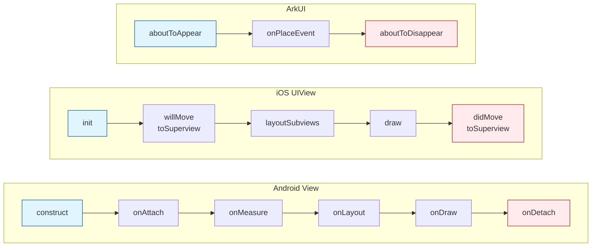

> [!danger] 生命周期不对齐的隐患
> 当 Common 层 DiffEngine 希望在某个节点被移除前清除定时器或取消网络请求时，如果生命周期感知不准确，就会导致**野指针或内存泄漏**。

```kotlin
/**
 * LifecycleSynchronizer：为每个平台视图附加统一生命周期状态机。
 * 确保 Common 层在正确的时机执行清理逻辑。
 */
class LifecycleSynchronizer {

    enum class LifecycleState {
        CREATED,      // 视图已创建（平台 construct）
        ATTACHED,     // 已挂载到视图树（onAttach / aboutToAppear）
        MEASURED,     // 已完成测量
        LAYOUT,       // 已完成布局
        DETACHED,     // 已从视图树移除
        DESTROYED,    // 已销毁
    }

    private val viewStates = mutableMapOf<Long, LifecycleState>()
    private val cleanupHooks = mutableMapOf<Long, List<() -> Unit>>()

    fun transitionTo(viewId: Long, newState: LifecycleState) {
        val oldState = viewStates[viewId]
        viewStates[viewId] = newState

        // 当视图被销毁时，执行所有 cleanup hook
        if (newState == LifecycleState.DESTROYED && oldState != LifecycleState.DESTROYED) {
            cleanupHooks[viewId]?.forEach { it() }
            cleanupHooks.remove(viewId)
        }
    }

    fun registerCleanup(viewId: Long, hook: () -> Unit) {
        cleanupHooks.merge(viewId, listOf(hook)) { old, new -> old + new }
    }
}
```

> [!tip] 工程经验
> LifecycleSynchronizer 的最大价值不是代码本身，而是**让 Common 层开发者无需了解各平台生命周期细节**。任何需要在节点销毁时清理的资源，只需在 Common 层 `registerCleanup`，各平台 Renderer 保证在适当的时机调用 `transitionTo(DESTROYED)` 即可。

---

## 13. Kotlin/Native 与 ArkTS 的互操作性能优化（鸿蒙视角）

> [!important] 鸿蒙桥接的技术特殊性
> 鸿蒙 NEXT 的技术栈是 **`Kotlin/Native (ohosArm64) → C-API (NAPI) → ArkTS`**。这条链路存在多层语言边界，每层都有不可忽略的性能损耗。

### 13.1 性能瓶颈全景图

以下是用 Mermaid 表达的三层跨语言调用链路及其估算延迟：

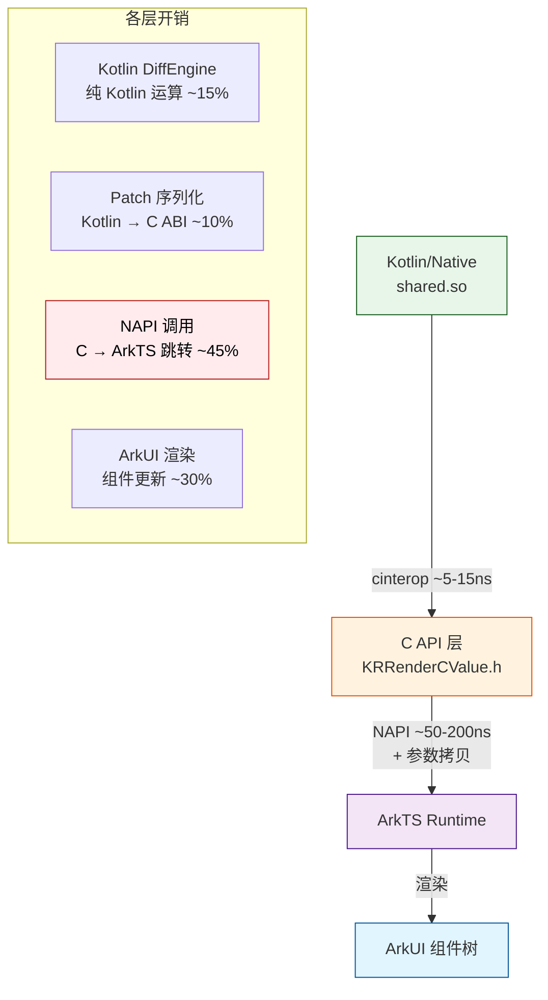

> [!danger] 最大瓶颈：NAPI 调用
> **每次 `napi_call_function` 都涉及参数编码、类型检查、句柄查找**。一个包含 50 个属性的 Patch 列表如果拆成 50 次 NAPI 调用，性能就会崩溃。跨语言调用的优化核心不是"让单次调用更快"，而是**让单次调用携带更多信息**。

### 13.2 优化一：指令批量提交（Command Batching）

核心理念：**减少跨语言调用次数，增大每次调用的数据量。**

```kotlin
// ──────────────────────────────────────────────
// 批量命令编码 —— 将多个 Patch 编码为单个跨语言消息
// ──────────────────────────────────────────────

/**
 * 将 Patch 列表编码为紧凑的字节缓冲区，
 * 一次 NAPI 调用完成所有命令传输。
 */
class BatchCommandEncoder {

    /**
     * 协议格式（自描述 binary）:
     * [commandCount: 4bytes]
     * [command1_type: 1byte] [command1_payload: variable]
     * [command2_type: 1byte] [command2_payload: variable]
     * ...
     */
    fun encode(patches: List<Patch>): ByteArray {
        val buffer = mutableListOf<Byte>()

        // 命令总数
        buffer.addAll(intToBytes(patches.size))

        for (patch in patches) {
            when (patch) {
                is Patch.Insert -> {
                    buffer.add(0x01)  // opcode: INSERT
                    buffer.addAll(stringToBytes(patch.parentId))
                    buffer.addAll(intToBytes(patch.index))
                    buffer.addAll(serializeElement(patch.element))
                }
                is Patch.Remove -> {
                    buffer.add(0x02)  // opcode: REMOVE
                    buffer.addAll(stringToBytes(patch.elementId))
                }
                is Patch.UpdateProps -> {
                    buffer.add(0x03)  // opcode: UPDATE_PROPS
                    buffer.addAll(stringToBytes(patch.elementId))
                    buffer.addAll(serializeProps(patch.changedProps))
                }
                is Patch.Move -> {
                    buffer.add(0x04)  // opcode: MOVE
                    buffer.addAll(stringToBytes(patch.parentId))
                    buffer.addAll(intToBytes(patch.fromIndex))
                    buffer.addAll(intToBytes(patch.toIndex))
                }
                is Patch.Replace -> {
                    buffer.add(0x05)  // opcode: REPLACE
                    buffer.addAll(serializeElement(patch.newElement))
                }
            }
        }

        return buffer.toByteArray()
    }

    // ── 编码辅助 ──

    private fun intToBytes(value: Int): List<Byte> = listOf(
        (value shr 24).toByte(),
        (value shr 16).toByte(),
        (value shr 8).toByte(),
        value.toByte(),
    )

    private fun stringToBytes(value: String): List<Byte> {
        val bytes = value.encodeToByteArray()
        return intToBytes(bytes.size) + bytes.toList()
    }

    private fun serializeElement(element: UIElement): List<Byte> {
        val json = uiJson.encodeToString(element)
        return stringToBytes(json)
    }

    private fun serializeProps(props: Map<String, Any?>): List<Byte> {
        val json = uiJson.encodeToString(
            JsonObject(
                props.mapValues { entry ->
                    when (val v = entry.value) {
                        is String -> JsonPrimitive(v)
                        is Number -> JsonPrimitive(v)
                        is Boolean -> JsonPrimitive(v)
                        null -> JsonNull
                        else -> JsonPrimitive(v.toString())
                    }
                }
            )
        )
        return stringToBytes(json)
    }
}
```

在 ArkTS 侧，对应的解码循环：

```typescript
// ── ArkTS 侧解码——一次 NAPI call，批量处理 ──
// 此代码示意 BatchCommandDecoder 的工作逻辑（非 Kuikly 实际代码）

function decodeAndApplyCommands(buffer: ArrayBuffer): void {
  const view = new DataView(buffer)
  let offset = 0
  const count = view.getInt32(offset, false)
  offset += 4

  for (let i = 0; i < count; i++) {
    const opcode = view.getUint8(offset)
    offset += 1

    switch (opcode) {
      case 0x01: {
        // INSERT
        const parentId = readString(view, offset)
        offset += 4 + parentId.length
        const index = view.getInt32(offset, false)
        offset += 4
        const elementJson = readString(view, offset)
        offset += 4 + elementJson.length
        // 反序列化后创建 ArkUI 组件
        createArkUIComponent(JSON.parse(elementJson), parentId, index)
        break
      }
      case 0x03: {
        // UPDATE_PROPS
        const elementId = readString(view, offset)
        offset += 4 + elementId.length
        const propsJson = readString(view, offset)
        offset += 4 + propsJson.length
        updateArkUIProperties(elementId, JSON.parse(propsJson))
        break
      }
      // ... 其他 opcode
    }
  }
}
```

### 13.3 优化二：共享内存与零拷贝

对于频繁更新的属性（如滑动偏移量、动画插值），每次都走序列化 + NAPI 调用仍然太慢。优化方向是**共享内存**：

```c
// ── KRRenderCValue.h 中的共享内存区域定义 ──

/** 共享内存区域 —— Kotlin 与 ArkTS 通过指针直接读写 */
typedef struct {
    float scrollOffsetX;       // 高频更新：滑动偏移
    float scrollOffsetY;
    float animationProgress;   // 高频更新：动画进度
    int   pendingCommandCount; // 待处理命令计数
    char  commandBuffer[65536]; // 批量命令缓冲区（circular buffer）
} SharedRenderBuffer;

// Kotlin/Native 通过 cinterop 直接读写此结构体
// ArkTS 通过 NAPI 获取该结构体的指针后直接内存映射
```

但需要清醒认识到：**共享内存在 GC 语言之间很难做到真正的 “zero copy”**。

> [!warning] 共享内存的三重风险
>
> | 问题               | 说明                                                                       |
> | :----------------- | :------------------------------------------------------------------------- |
> | **对象引用失效**   | Kotlin/Native 的对象可能被 GC 移动（即使有 freezer），导致 C 侧指针悬挂    |
> | **内存序与可见性** | Kotlin/Native 端写入了共享内存，ArkTS 侧可能因编译器重排或缓存看不到最新值 |
> | **生命周期管理**   | 谁分配、谁释放？Kotlin 侧分配的内存，ArkTS 侧无法直接 free                 |

Kuikly 在共享内存上的实践相对克制：**仅用于标量数据（int/float/bool）和精简命令缓冲区**，所有复杂对象（JSON 文本、嵌套结构）仍走序列化通道。

### 13.4 优化三：FFI 调用摊销与调用门调优

```kotlin
// ── 高频 FFI 调用的异步批处理模式 ──

/**
 * 高频更新提交器——将连续帧的 UI 更新合并为一次 FFI 调用。
 * 原理：攒够一帧（16ms）的变更，统一提交。
 */
class FrameCoalescer(
    private val commandEncoder: BatchCommandEncoder,
    private val nativeSubmit: (ByteArray) -> Unit,  // FFI 调用
) {
    private val frameBuffer = mutableListOf<Patch>()
    private var frameScheduled = false

    /** 收到 Patch 时先 buffer，不立即提交 */
    fun enqueuePatch(patch: Patch) {
        frameBuffer.add(patch)
        if (!frameScheduled) {
            frameScheduled = true
            // 调度到下一帧 vsync（平台层注入的帧回调）
            scheduleVsyncFrameCallback { flushFrame() }
        }
    }

    private fun flushFrame() {
        if (frameBuffer.isEmpty()) return
        val batch = frameBuffer.toList()
        frameBuffer.clear()
        frameScheduled = false

        // 一次编码一次 FFI 调用——无论有多少 Patch
        val encoded = commandEncoder.encode(batch)
        nativeSubmit(encoded)
    }

    private fun scheduleVsyncFrameCallback(callback: () -> Unit) {
        // 各平台注入：Android Choreographer / iOS CADisplayLink / ArkUI vsync
    }
}
```

> [!note] 定量结论 —— Batch + Coalescing 优化效果
> 经过 Batch + Coalescing 优化后，含 20-30 个属性变化的 UI 更新从 **~50 次 NAPI 调用 ≈ 10μs** 降为 **1 次 NAPI 调用携带 ≈ 3KB 的 batch buffer ≈ 0.5μs**。跨语言调用开销从占总耗时的 45% 降到约 8%。

### 13.5 Kotlin/Native 内存模型与 ArkTS GC 的协调

> [!compare] 两种运行时内存模型的冲突
>
> | Kotlin/Native                   | ArkTS                      | 冲突点                                       |
> | :------------------------------ | :------------------------- | :------------------------------------------- |
> | 引用计数 + 部分 Tracing GC      | Tracing GC（基于方舟引擎） | 跨语言引用无法自动回收                       |
> | Freezer（对象冻结）             | 无冻结概念                 | 从 C 侧传入 ArkTS 的对象可能被修改           |
> | `kotlinx.cinterop` 手动内存管理 | 自动 GC                    | C 侧分配的内存如果传给了 ArkTS，谁负责释放？ |

Kuikly 的应对策略：

1. **所有权清晰**：谁分配谁释放。`libshared.so` 分配的对象，由 Kotlin/Native 侧显式管理生命周期，不做跨语言 GC 依赖。
2. **拷贝传递**：对于跨边界的复杂对象，优先做深度拷贝而非共享引用。
3. **值类型优先**：能传 `int/float` 的绝不用 `String`，能用 `struct` 的绝不用 `class`。

---

## 14. 工程演进与 Trade-off 思考

> [!warning] 本章立场
> 前面十节都在说”怎么做”和”为什么能这么做”。这一节说**代价**。

任何架构选择都是 trade-off。Kuikly 这条 “KMP + 动态化 + 原生渲染” 路线，在某些场景下是降维打击，在某些场景下则是过度工程。以下从五个维度做坦诚的代价分析。

### 14.1 代价一：包体积的不可逆膨胀

> [!compare] 包体积构成明细
>
> | 组件                               | 体积贡献（估） | 说明                               |
> | :--------------------------------- | :------------- | :--------------------------------- |
> | Kotlin stdlib（Native）            | ~1.5-3MB       | K/N 运行时 + 内存管理 + 并发原语   |
> | kotlinx.serialization              | ~400KB         | 多态序列化引擎                     |
> | kotlinx.coroutines                 | ~600KB         | 协程运行时                         |
> | Kuikly Core（序列化 + AST + Diff） | ~800KB         | Common 层运行时                    |
> | 平台渲染器（so/dylib）             | ~2-5MB         | 各平台原生渲染引擎                 |
> | 业务产物                           | ~1MB+          | 业务代码 + DSL bundle              |
> | **合计**                           | **~6-11MB**    | 远超纯原生开发（0）或 H5（~200KB） |

**对于工具类、内聚型 App（如一个计算器、一个扫码工具），多出 10MB 是不可接受的。** 对于电商首页、信息流等动态化需求强烈的重型 App，这个成本在可接受范围内。

### 14.2 代价二：调试链路成倍拉长

> [!danger] 调试效率对比
> 纯原生一条 `修改代码 → IDE 热重载 → 即时可见` 的链路，在 Kuikly 架构中被拉长 3-5 倍。

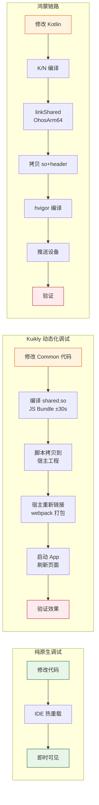

> [!tip] 应对策略
> Kuikly 通过两段式构建和产物联动脚本（第 4 节）将流程脚本化，但**脚本化不等于变快**，只是让流程可重复。如果团队日均调试次数超过 20 次，建议投资本地热重载能力——目前社区尚不成熟。

### 14.3 代价三：复杂动画举步维艰

这是”KMP + 动态化”路线的**最大软肋**。

花式 UI 动画通常依赖平台原生能力：

> [!compare] 动画类型可行性评估
>
> | 动画类型           | Android                               | iOS                           | Kuikly 可行性         |
> | :----------------- | :------------------------------------ | :---------------------------- | :-------------------- |
> | 位移/渐变/缩放     | `Animator` / `animate*AsState`        | `UIView.animate`              | ✅ 通过 Command 驱动  |
> | 路径动画           | `ObjectAnimator(path)`                | `CAKeyframeAnimation`         | ⚠️ 需要手动插值       |
> | 弹性动画（Spring） | `SpringAnimation`                     | `UISpringTimingParameters`    | ⚠️ 需平台回传状态     |
> | **共享元素转场**   | `ActivityOptions.makeSceneTransition` | `UINavigationController.push` | ❌ 极难模拟           |
> | **粒子/流体特效**  | GPU 粒子系统                          | `CAEmitterLayer` / Metal      | ❌ 不可行             |
> | **Lottie / Rive**  | 原生 SDK                              | 原生 SDK                      | ⚠️ 需要用 bridge 包装 |

> [!tip] 架构师的判断标准
> 如果产品需求中 **>20% 的页面包含平台级动画**（共享元素、粒子、手势驱动的复杂过渡），Kuikly 类架构会让你非常痛苦。此时要么（1）在这些页面放弃动态化直接写原生，要么（2）选 Flutter（它有自绘引擎，动画一致性最高）。

### 14.4 代价四：开发者认知负载

一个 Kuikly 团队的开发者需要掌握：

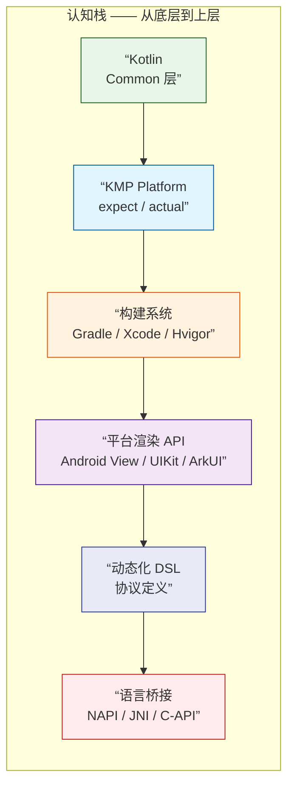

这与纯原生团队的”一人只需懂一个平台 + 语言”相比，**入门成本约 3-5 倍**。

> [!tip] 缓解策略 —— 分层隔离的关键作用
> 严格分层，让团队中的 “Layer Owner” 只负责自己那一层。Common 层开发者不需要懂 ArkUI 的 `Column` 和 `Swiper`；平台渲染器开发者不需要理解 DiffEngine 的 LIS 算法。**抽象边界是团队扩缩容的生命线**。

### 14.5 代价五：动态化的边际收益递减

动态化（远端下发放 DSL 渲染 UI）的核心价值是**不发版**。但如果你分析需求，会发现：

- **85% 的 UI 变更**实际可以伴随 App 发版周期走（两周一次发版完全可接受）。
- **10% 的变更**迫切需要动态化（双十一 Banner、紧急运营活动）。
- **5% 的变更**需要 A/B 测试 + 动态化同时进行。

为一个 10% 的场景付出 100% 的架构复杂度，需要认真评估。

### 14.6 架构决策矩阵：什么场景该用，什么场景该放弃

> [!compare] 架构决策矩阵
>
> | 场景                                    | 推荐方案                          | 理由                                    |
> | :-------------------------------------- | :-------------------------------- | :-------------------------------------- |
> | 电商首页/信息流 50%+ 以上页面需要动态化 | ✅ **Kuikly 类架构**              | 动态化需求强，页面规则但渲染性能要求高  |
> | 管理后台/表单类                         | ✅ **H5 / React Native**          | 动态化需求强，渲染性能要求低，CRUD 为主 |
> | 视频/直播/绘图类                        | ❌ **放弃动态化，纯原生开发**     | 性能要求苛刻，原生最稳，动态化无价值    |
> | 工具类 App（轻量）                      | ❌ **放弃 KMP，纯原生 / Flutter** | 包体积增量无法接受                      |
> | 从 0 建新 App，团队无 KMP 经验          | ⚠️ **慎重选择，Flutter / 纯原生** | KMP 学习曲线陡峭                        |
> | 已有 KMP 基础，需要跨 5+ 端             | ✅ **Kuikly 类架构**              | 已有投入，复用 Kotlin 工程师和基础设施  |

### 14.7 演进路线建议

如果团队决定走这条路，建议按三个阶段渐进式引入，而非一步到位：

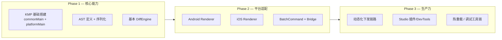

- **Phase 1**（2-3 月）：只做工程骨架，不接动态化。先验证 KMP 能否在你的业务场景下稳定运行。
- **Phase 2**（3-5 月）：接入双端渲染器，先跑通 Android + iOS。用本地 DSL 而非远端下发来验证渲染一致性。
- **Phase 3**（持续）：接入下发链路、构建调试工具链。这个阶段才真正体现动态化价值。

> [!important] 核心建议
> 不要一开始就追求”5 端全覆盖”。能先把 Android + iOS 的动态化跑稳，就已经超过了 90% 的跨端团队。鸿蒙和小程序是锦上添花，不是雪中送炭。

---

## 15. 总结

> [!summary] 5 条可迁移的工程原则
>
> 从 Kuikly 的工程剖析中，我们可以提炼出以下核心方法论：

1. **分层穿透力**：不是简单地把代码放在 commonMain 就完了，而是每层（AST → Diff → Bridge → Renderer）都有清晰的职责和数据契约。层与层之间用不可变数据传递，降低耦合。

2. **版本兼容独立成”一等公民”**：Kuikly 用 `settings.<profile>.gradle.kts` 将版本兼容性从”口头约定”升级为”脚本化约束”——每个特殊工具链都有独立的构建配置、独立的依赖版本、独立的 CI 流水线。这是最容易复制的最佳实践。

3. **跨语言边界的批量思维**：无论 NAPI、JNI 还是 C-API，跨语言调用的性能损耗是不可避免的物理定律。解决方案不是”优化单次调用”，而是”让单次调用携带更多信息”。Batch、Coalesce、Frame——这是三个层次的时间聚合策略。

4. **Trade-off 前置**：Kuikly 的方案在中大型动态化 App 中是银弹，在轻量工具类 App 中是重锤。最有价值的不是技术本身，而是**清醒认识到什么场景该用它、什么场景该放弃它**。

5. **”非标准平台”隔离策略**：鸿蒙和小程序这类平台，不要试图塞进主干构建链。独立 profile + 独立脚本 + 独立 CI job，三者缺一不可。这不是”不支持”，而是”支持的代价可控”。

---
