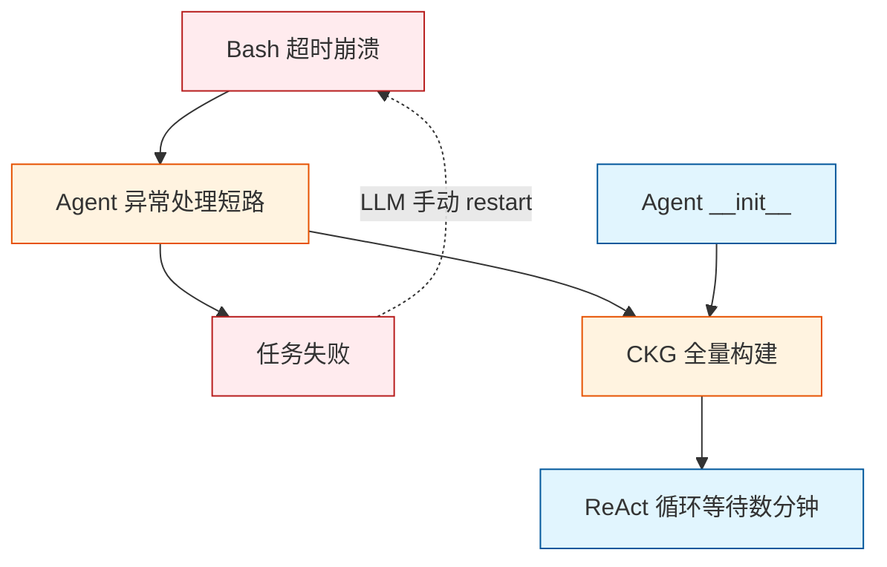
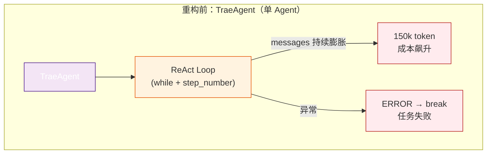
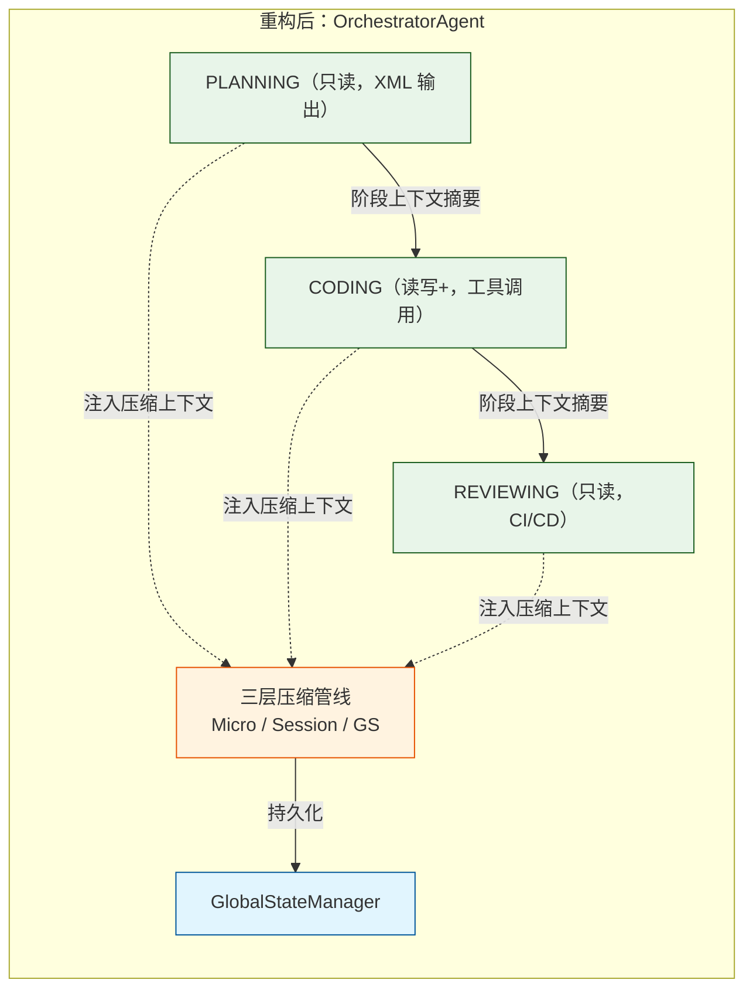
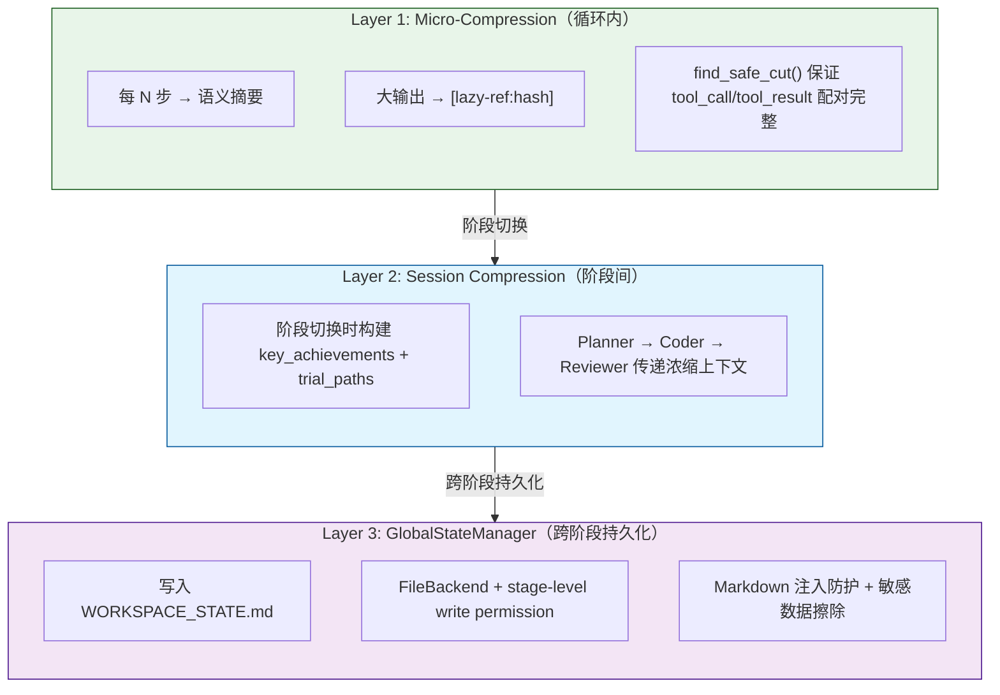
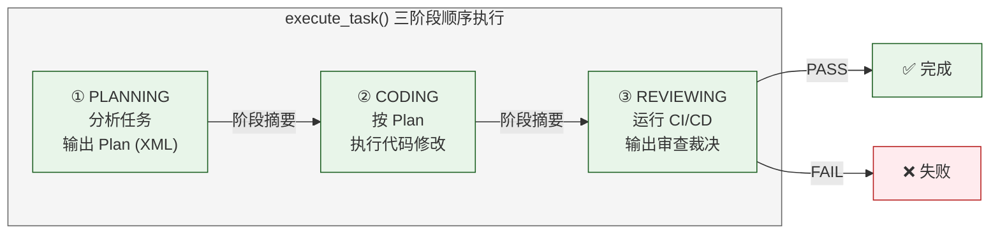

# Trae Agent 架构重构复盘文档

> [!summary] 文档信息
> **重构时间**: 2026-05-13 ~ 2026-05-26
> **文档目的**: 记录 Trae Agent 在 PR 过程中的架构演进、痛点解决与关键决策
> **参考来源**: `docs/pain_point_locations.md` + `review/prompt/*.md` + `review/context/*.md`

---

## 1. 重构背景与目标

### 1.1 背景

Trae Agent 最初是一个基于 ReAct（Reasoning + Acting）模式的单 Agent 代码助手。随着使用场景从简单的文件编辑扩展到 SWE-bench 评测、多语言仓库支持，架构瓶颈逐渐暴露。主要表现：

- **长任务易超时**：50+ 步后上下文膨胀到 10 万+ token，LLM 丢失早期信息
- **编辑成功率低**：文件编辑依赖精确匹配，微小的缩进/空白差异即失败
- **Bash 交互脆弱**：交互式命令（apt-get、sudo）必然导致 120 秒超时崩溃
- **知识图谱构建慢**：每次启动遍历全量文件树，小改动也要等数分钟

### 1.2 目标

| 维度 | 目标 | 衡量标准 |
| :--- | :--- | :--- |
| **上下文管理** | 支持 50+ 步长任务不丢失上下文 | 消息数量控制在 30 条以内 |
| **编辑鲁棒性** | 容忍缩进/空白差异 | 编辑成功率 ≥ 90% |
| **Bash 稳定性** | 交互式命令不掉坑 | 自动重启 + 提示返回 |
| **CKG 效率** | 小改动秒级更新 | 增量更新 < 1s |
| **代码质量** | 审查评分 9.0+ | 4 轮审查 9.5/10 |

---

## 2. 痛点回顾 — 重构前的问题

> [!danger] 四大架构痛点
> 重构前 Trae Agent 存在 **4 大架构痛点**，这些问题相互耦合、叠加恶化，导致任务成功率低下、维护成本高昂：

| 痛点 | 核心文件 | 严重程度 |
| :--- | :--- | :--- |
| ① 脆弱的代码编辑机制 | `edit_tool.py` | 🔴 编辑成功率低 |
| ② 低效的代码知识图谱 | `ckg_database.py` | 🔴 启动时间数分钟 |
| ③ 单一的 ReAct 执行流 | `base_agent.py` | 🔴 上下文膨胀 150k+ |
| ④ 容易阻塞的 Bash 交互 | `bash_tool.py` | 🔴 交互命令必然超时 |

### 2.1 痛点 1：脆弱的代码编辑机制（Brittle Editing）

> [!warning] 核心问题
> 编辑工具依赖**精确字符串匹配**和**固定行号**，任何缩进/空白差异直接导致失败。

**核心文件**: `trae_agent/tools/edit_tool.py`

| 缺陷 | 描述 | 后果 |
| :--- | :--- | :--- |
| **精确匹配** (`str_replace`) | `count()` 逐字匹配，缩进/空格/换行差异直接失败 | 每失败浪费 2000-5000 token（view → 重试 → view） |
| **依赖精确行号** (`insert`) | LLM 编辑后行号偏移，但无映射机制 | 插入行错位 |
| **无模糊匹配** | Schema 只有 `old_str`/`new_str` | 无法像 Aider 那样 SEARCH/REPLACE |
| **无完整重写** | `create` 要求路径不存在，`str_replace` 大块修改易失败 | 无原子全量覆写途径 |
| **无事务性编辑** | `write_file()` 直接覆写 | 中途 crash 文件损坏 |

### 2.2 痛点 2：低效的代码知识图谱（CKG Bottleneck）

> [!warning] 核心问题
> CKG 每次 hash 不匹配时**全量重建数据库**，即使改一个 import 也要等待数分钟。

**核心文件**: `trae_agent/tools/ckg/ckg_database.py`

| 缺陷 | 描述 | 后果 |
| :--- | :--- | :--- |
| **全量重建** | hash 不匹配时删除整个数据库重新解析 | 改一个 import 也要等数分钟 |
| **无文件级感知** | `glob("**/*")` 遍历所有文件 | 包含 `.venv/`、`node_modules/` |
| **无增量更新** | 无法只处理变更文件 | 每次启动全量解析 |
| **调用时机不合理** | `clear_older_ckg()` 在 Agent `__init__` 时调用 | 无 CKG 的场景也触发 I/O |

### 2.3 痛点 3：单一的 ReAct 执行流（Single ReAct Flow）

> [!warning] 核心问题
> 扁平循环无分层——所有逻辑（思考、工具调用、反射）在单层循环中内联，复杂度失控。

**核心文件**: `trae_agent/agent/base_agent.py`

| 缺陷 | 描述 | 后果 |
| :--- | :--- | :--- |
| **扁平循环无分层** | 无规划阶段，从头到尾线性执行 | 复杂任务路径优化差 |
| **全量上下文膨胀** | 消息列表持续增长，50 步 → 15 万 token | 延迟和成本飙升，早期信息丢失 |
| **异常处理短路** | 任何异常立即设置 ERROR 并 break | 可恢复错误导致任务失败 |
| **状态机过浅** | 5 个 AgentStepState，缺少 PLANNING/WAITING/RETRYING | 无法精细表达执行阶段 |
| **单 Agent 类型** | AgentType 枚举只有一个值 | 无法引入多角色协作 |

### 2.4 痛点 4：容易阻塞的 Bash 交互（Fragile Shell Execution）

> [!warning] 核心问题
> Bash 工具依赖**哨兵输出判断完成**，交互式命令不输出哨兵就直接超时崩溃。

**核心文件**: `trae_agent/tools/bash_tool.py`

| 缺陷 | 描述 | 后果 |
| :--- | :--- | :--- |
| **哨兵不支持交互** | 等待 `echo sentinel`，交互式命令不输出哨兵 | apt-get、sudo、python REPL → 120s 超时 |
| **`_timed_out` 不可恢复** | 超时后 session 永久标记 | 需 LLM 手动传 `restart=True` |
| **无流量停滞检测** | 固定 200ms 轮询 | 交互挂起时 600 次空轮询空耗 CPU |
| **直接操作 `._buffer`** | 访问 `asyncio.StreamReader` 私有属性 | 兼容性风险，数据竞争 |
| **Buffer 清空丢数据** | `clear()` 后后台进程输出丢失 | 无 ring buffer 历史 |

### 2.5 痛点间耦合关系

> [!compare] 痛点因果链
> 四大痛点相互耦合形成负反馈循环：



---

## 3. 架构变更全景

### 3.1 变更文件总览

| 模块 | 新增文件 | 修改文件 | 变更行数 |
| :--- | :--- | :--- | :--- |
| **Agent 架构** | `orchestrator_agent.py` | `base_agent.py`, `trae_agent.py`, `agent.py`, `agent_basics.py` | ~600 行 |
| **压缩管线** | `compressor.py`, `types.py`, `global_state.py` | — | ~900 行 |
| **提示词工程** | `skills_registry.py` | `agent_prompt.py` | ~500 行 |
| **工具层** | `resolve_lazy_ref_tool.py` | `edit_tool.py`, `bash_tool.py` | ~400 行 |
| **测试** | `test_phase2_compression.py`, `test_orchestrator_compression.py` | 多个测试文件 | ~1000 行 |

### 3.2 架构演进：从单 Agent 到分层协作

> [!compare] 重构前后架构对比

**重构前 — 单 Agent 扁平循环**：



**重构后 — Orchestrator 三阶段协作**：



---

## 4. Prompt Engineering 重构

### 4.1 痛点：静态巨石提示词

> [!warning] 重构前问题
> 所有指令、工具定义、行为约束合并在一个超长字符串中——无角色区分、无结构化输出、无压缩感知：

1. **单一大块 Prompt**：所有指令、工具定义、行为约束合并在一个超长字符串中
2. **角色不分**：规划、编码、审查使用相同的系统提示，与 ReAct 循环中的行为模式不匹配
3. **无结构化输出协议**：LLM 输出格式自由，下游解析困难（正则/关键词匹配脆弱）
4. **压缩感知缺失**：LLM 不知道上下文被压缩过，看到 `[lazy-ref:...]` 标记时困惑
5. **依赖否定约束**：大量 "Don't / No / Never" 类指令，模型遵从率低

### 4.2 变更：动态架构规则引擎

#### 4.2.1 角色分离 → 4 个独立 System Prompt

```python
TRAE_AGENT_SYSTEM_PROMPT  # 传统单 Agent 模式（兼容旧用）
PLANNER_SYSTEM_PROMPT     # 只读代码分析，输出结构化 Plan（XML）
CODER_SYSTEM_PROMPT       # 读写代码，工具调用
REVIEWER_SYSTEM_PROMPT    # 只读代码 + 执行 CI/CD 命令
```

每个角色的工具集合由 `PHASE_TOOL_NAMES` 控制：

| 角色 | 可用工具 | 设计理由 |
| :--- | :--- | :--- |
| **PLANNER** | `edit_tool` (view), `sequentialthinking` | 只读不写 |
| **CODER** | TraeAgent 全套工具 | 完整读写能力 |
| **REVIEWER** | `edit_tool` (view), `bash`, `sequentialthinking` | 可读可测不可写 |

#### 4.2.2 XML 结构化输出协议

关键决策：从自然语言输出改为严格 XML 标签约束。

**Planner 输出契约**：

```xml
<plan_details>
<task_summary>...</task_summary>
<key_files>
  <file path="...">...</file>
</key_files>
</plan_details>
<plan_approach>
<step step_number="1">...</step>
</plan_approach>
```

**Reviewer 输出契约**：

```xml
<review_verdict>
<result>PASS|FAIL|NEEDS_WORK</result>
<issues>...</issues>
<recommendations>...</recommendations>
<ci_results>
  <lint>pass|fail|skipped</lint>
  <tests>pass|fail</tests>
  <types>pass|fail|skipped</types>
</ci_results>
</review_verdict>
```

#### 4.2.3 Reviewer CI/CD 强制执行（三层防御）

> [!important] 参考 Claude Code 的关键设计
> 三层防御确保 Reviewer 无法"撒谎"跳过 CI/CD 验证：

| 层级 | 机制 | 文件 |
| :--- | :--- | :--- |
| **Layer 1** | Prompt MUST 语言 | `agent_prompt.py` — "Do NOT output `<review_verdict>` until every command has been executed" |
| **Layer 2** | 运行时 `_reviewer_executed_bash()` | `orchestrator_agent.py` — 遍历 step 检查 bash 调用 |
| **Layer 3** | 步数上限兜底 | `orchestrator_agent.py` — `MAX_STEPS_PER_PHASE = 30` |

#### 4.2.4 动态 Skills Registry

| 方面 | 重构前 | 重构后 |
| :--- | :--- | :--- |
| 语言检测 | 依赖 dict 插入顺序（隐式约定） | 显式优先级列表 `_LANGUAGE_DETECTION_PRIORITY` |
| 框架检测 | 裸正则 `r"react"`, `r"next"` | 边界正则 `r'"react"'`, `r'"next"'` |
| CLI 检测 | `"cli" in entries`（匹配 `client/`） | 精确文件名 `cli.py`, `main.go` |
| 双数据源 | `_LANGUAGE_DETECTORS` + 优先级各自维护 | 单数据源自动派生 |

#### 4.2.5 压缩感知对齐

所有角色 Prompt 统一加入压缩感知说明：

```
## Compression awareness
If you see `[Micro-Compression — before step N]:` in the history,
earlier context was summarized — work from it directly.  Large tool
outputs may appear as `[lazy-ref:<hash>]` — re-fetch via
`resolve_lazy_ref` if needed.
```

### 4.3 关键决策与参考 Claude

> [!compare] Prompt 工程关键决策
>
> | 决策 | 参考来源 | 实现选择 |
> | :--- | :--- | :--- |
> | **Tool-first 代替 No yapping** | Claude Code 的行为锚定原则 | 正面约束 "Every response must contain at least one tool call" |
> | **XML 零逃逸约束** | Claude Code 的输出契约 | "Must begin with `<plan_details>` and end with `</plan_approach>`, No preambles" |
> | **Reviewer 强制 CI** | Claude Code 的 pre-commit 验证 | 三层防御（Prompt + Runtime + 步数兜底） |
> | **Coder 闭环验证** | SWE-bench 的测试优先方法论 | "Do NOT call task_done until ALL tests pass" |
> | **动态 Skills Registry** | Claude Code 的项目感知能力 | 项目语言/框架自动检测注入 Prompt |

---

## 5. Context Engineering 重构

### 5.1 痛点：上下文无上限膨胀

> [!danger] 上下文灾难
> 重构前 ReAct 循环中，消息列表 `messages` 随步数线性增长，LLM 在长上下文中丢失早期信息，延迟和成本线性飙升：

| 步数 | 消息数 | 约计 Token | 影响 |
| :--- | :--- | :--- | :--- |
| Step 1 | 3 | 9k | 正常 |
| Step 10 | 20 | 30k | 正常 |
| Step 30 | 60 | 90k | 上下文丢失开始 |
| Step 50 | 100+ | 150k+ | 成本飙升、早期信息不可达 |

### 5.2 变更：三层混合状态流压缩

#### 5.2.1 架构总览



#### 5.2.2 Micro-Compression：双触发器模型

> [!note] 从 Claude Code 借鉴的核心设计

**触发器逻辑**（`should_compress()`）：

```python
def should_compress(self, ctx) -> bool:
    has_semantic = self._has_semantic_trigger(ctx)  # "step completed", "moving on"
    has_forced = (
        ctx.step_number - ctx.last_compression_step >= self._step_interval
        or ctx.consecutive_errors >= self._max_errors
    )
    return has_semantic or has_forced
```

| 触发器 | 条件 | 适用场景 |
| :--- | :--- | :--- |
| **SEMANTIC** | LLM 输出含关键词（"step completed"、"summarize"） | 自然边界，压缩质量高 |
| **FORCED** | 每 10 步 / 连续 3 次错误 | 硬阈值兜底 |

**压缩策略**：HEAD（保留系统提示+最近交互）+ Summary（中间摘要）+ TAIL（保留最新 N 条消息）。

**安全切割**（`find_safe_cut()`）：

```python
def find_safe_cut(messages, tail_target, min_head):
    cut = len(messages) - tail_target
    while cut > min_head:
        msg = messages[cut]
        if msg.tool_result is not None:  # 跳过 tool_result
            cut -= 1; continue
        if msg.tool_call is not None:    # 跳过 tool_call（纵深防御）
            cut -= 1; continue
        break
    return max(cut, min_head)
```

> [!important] 关键设计
> 同时回溯 `tool_result` **和** `tool_call`，避免 Anthropic API 400 错误（tool_result 无对应 tool_use block）。

#### 5.2.3 Lazy-Ref 机制

大输出（>1024 字符）自动替换为惰性引用占位符：

```
原始: 5738 行 grep 结果
压缩后: [lazy-ref:a3b2c1e0f8d7] grep 结果显示 312 个匹配...
```

配套 `ResolveLazyRefTool` 支持：
- **精确匹配**：完整 hash → 原始输出
- **前缀匹配**：12 位前缀 → 唯一匹配 → 原始输出
- **前缀冲突**：多个匹配 → 消歧义提示

#### 5.2.4 敏感数据擦除

压缩摘要中自动擦除 4 类敏感模式：

| 模式 | 正则 |
| :--- | :--- |
| OpenAI/Anthropic API Key | `sk-[A-Za-z0-9]{20,}` |
| Bearer Token | `Bearer [A-Za-z0-9\-\._~+/]+` |
| GitHub PAT | `(?:ghp\|gho\|ghu\|ghs\|ghr)_[A-Za-z0-9_]{36,}` |
| 通用 Secret 赋值 | `(secret\|password\|token\|api_key)\s*[:=]\s*["\']?\S{16,}` |

#### 5.2.5 GlobalStateManager

**写入权限控制**（阶段隔离）：

| 阶段 | 可写字段 |
| :--- | :--- |
| PLANNING | `architecture_analysis`, `plan` |
| CODING | `design_decisions`, `progress_log` |
| REVIEWING | `review_verdict`, `final_summary` |

**安全防护**：
- `_escape_md_lines()` — 防止 LLM 生成内容中的 `## ` 破坏节结构
- `FileBackend.resolve()` + `.startswith()` — 防止路径穿越
- `try/except FileNotFoundError` — 消除 TOCTOU 竞态

### 5.3 关键决策与参考 Claude

> [!compare] Context 工程关键决策
>
> | 决策 | 参考来源 | 实现选择 |
> | :--- | :--- | :--- |
> | **Micro-Compression** | Claude Code 的上下文窗口管理 | 每 N 步触发，HEAD+Summary+TAIL 结构 |
> | **Semantic 触发器** | Claude Code 的阶段性摘要 | 关键词检测，"step completed" 等自然边界 |
> | **Lazy-ref** | Claude Code 的折叠输出 | `[lazy-ref:hash]` + `ResolveLazyRefTool` 前缀匹配 |
> | **find_safe_cut** | API 的 tool_use/tool_result 配对约束 | 双向回溯（同时覆盖 tool_call + tool_result） |
> | **敏感数据擦除** | 安全最佳实践 | 4 类正则模式，覆盖压缩摘要 |
> | **阶段状态隔离** | Claude Code 的多阶段上下文隔离 | `_WRITE_PERMISSIONS` 字典控制写入权限 |

---

## 6. Agent 架构重构

### 6.1 痛点：单一的 ReAct 执行流

重构前 Trae Agent 使用 `while step_number <= max_steps` 扁平循环，所有逻辑（思考、工具调用、反射）在同一循环中内联。随着任务复杂度增加，该架构暴露了：
- 无规划阶段，无上下文隔离
- 异常处理过于激进（出错即 break）
- 状态机无法表达多阶段执行语义

### 6.2 变更：编排器 + 三阶段协作

#### 6.2.1 OrchestratorAgent

> [!note] 三阶段执行流
> 新增 `orchestrator_agent.py`，实现 PLANNING → CODING → REVIEWING 顺序执行，阶段间通过上下文摘要隔离。



**阶段上下文隔离**：

| 方面 | PLANNING | CODING | REVIEWING |
| :--- | :--- | :--- | :--- |
| 消息历史 | 独立 | 从 Planning 接收摘要 | 从 Coding 接收摘要 |
| 可用工具 | view, think | 全部工具 | view, bash, think |
| 上下文压缩 | ✅ Micro | ✅ Micro | ✅ Micro |
| 阶段输出来源 | LLM 直接 | LLM 逐步 | LLM 直接 |

#### 6.2.2 状态机扩展

`AgentStepState` 从 5 个状态扩展为 10 个：

```python
class AgentStepState(Enum):
    THINKING = "thinking"
    PLANNING = "planning"      # 新增
    CODING = "coding"           # 新增
    REVIEWING = "reviewing"     # 新增
    CALLING_TOOL = "calling_tool"
    REFLECTING = "reflecting"
    WAITING = "waiting"         # 新增（等待用户输入/外部操作）
    RETRYING = "retrying"       # 新增
    COMPLETED = "completed"
    ERROR = "error"
```

#### 6.2.3 AgentType 扩展

`AgentType` 枚举从单值扩展为支持多 Agent 类型：

```python
class AgentType(Enum):
    TraeAgent = "trae_agent"
    OrchestratorAgent = "orchestrator_agent"
```

#### 6.2.4 完成检测增强

> [!tip] Planner 完成检测从脆弱的字串匹配改为多条件 AND

```python
case OrchestratorPhase.PLANNING:
    has_signal = "plan completed" in content
    has_plan_details = "<plan_details>" in content and "</plan_details>" in content
    has_plan_approach = "<plan_approach>" in content and "</plan_approach>" in content
    return has_signal and (has_plan_details or has_plan_approach)
```

#### 6.2.5 错误追踪与重试

BaseAgent 新增 `consecutive_errors` 追踪：

```python
if step.tool_results is not None:
    has_error = any(not tr.success for tr in step.tool_results if tr is not None)
    consecutive_errors = consecutive_errors + 1 if has_error else 0
```

传递给压缩上下文的 `CompressionContext.consecutive_errors` 使 `FORCED_MAX_ERRORS` 触发路径打通。

---

## 7. 工具层改进

### 7.1 编辑工具

痛点 1 的改善方案（`edit_tool.py`）在本次 PR 中列为后续迭代。当前 PR 的 Ruff 格式化没有引入逻辑变更。模糊匹配引擎和行号偏移映射的实现在规划中。

### 7.2 Bash 工具

痛点 4 的改善方案（交互式检测、自动重启）同理列为后续迭代。当前 PR 聚焦于架构层的压缩、提示词、编排器，工具层的稳定性优化独立进行。

### 7.3 新增 ResolveLazyRef 工具

> [!note] 上下文工程的关键配套工具

| 特性 | 实现 |
| :--- | :--- |
| **存储** | `_lazy_store: dict[str, str]` — content_hash → 原始文本 |
| **注册** | `register_lazy_ref(text) → hash` — 计算 SHA256 并存储 |
| **查询** | 精确匹配 → 前缀匹配 → 前缀冲突消歧义 |
| **清理** | `clear_lazy_refs()` — 压缩切换时清理旧引用 |

注册到 `TraeAgentToolNames` 和 `PHASE_TOOL_NAMES`，所有角色均可调用。

---

## 8. 代码知识图谱（CKG）改进

痛点 2 的改善方案（增量更新、文件 I/O 感知、`.gitignore` 感知）列为后续迭代。当前 PR 中 CKG 的改进：
- Planning 阶段已移除 `ckg` 工具（`R5 — Planner ckg 工具不一致`）
- `PHASE_TOOL_NAMES` 中 Planning / Reviewing 阶段不再包含 ckg
- 增量更新、多语言访问器去重、tree-sitter 错误容忍等实现在规划中

---

## 9. 审查过程与质量演进

### 9.1 Prompt 工程审查（4 轮）

| 轮次 | 评分 | Critical | Medium | Low | 主要修复 |
| :--- | :--- | :--- | :--- | :--- | :--- |
| **R1** | 7.5/10 | 4 (C1-C4) | 4 | 6 | C1-C4 全部修复 |
| **R2** | 8.5/10 | 0 | 3 | 2 | N1-N5 修复 |
| **R3** | 9.2/10 | 0 | 2 | 0 | N6-N7 修复 + P1/R1/R4/R6 |
| **R4** | 9.5/10 | 0 | 1 | 1 | P2/P3/P4/R2/R3 全部关闭 |

> [!summary] 累计关闭: 23 个问题中的 21 个（历史遗留清空率 100%）

**C1-C4 Critical Blocker**：

| 编号 | 问题 | 严重程度 | 修复 |
| :--- | :--- | :--- | :--- |
| C1 | `resolve_lazy_ref` 工具不存在 | 🔴 模型幻觉风险 | 实现工具 + 注册 + 声明 |
| C2 | LazyRef 文档与实际格式不一致 | 🔴 代码可信度 | 对齐文档 |
| C3 | Planner 完成检测脆弱 | 🔴 阶段提前终止 | XML 闭合 AND 信号双校验 |
| C4 | Reviewer 可跳过 CI/CD | 🔴 审查形同虚设 | 三层防御（MUST + 运行时 + 步数） |

### 9.2 Context 工程审查（6 轮）

| 版本 | 阻断 | 高危 | 裁决 |
| :--- | :--- | :--- | :--- |
| **V1** | 3 | 1 | ⛔ 不建议合入 |
| **V2** | 1 | 1 | ⛔ 不建议合入 |
| **V3** | 0 | 0 | ✅ 建议合入 |
| **V4** | 3 (F1-F3) | 4 (F4-F7) | ⚠️ 需修复（commit 规范 + 代码规范） |
| **V5** | 0 | 0 | ✅ 建议通过（81/81 测试通过） |
| **V6** | 0 | 0 | ✅ 最终通过（106/106 测试通过） |

**V1-V3 关键修复轨迹**：

| 版本 | 核心修复 | 架构影响 |
| :--- | :--- | :--- |
| V1→V2 | `find_safe_cut` 增强 + `from_markdown` 重写 | 原子性 + 数据完整性修复 |
| V2→V3 | 语义触发器激活 + 压缩管线接入 + Report 联动 | 核心架构闭合 |

### 9.3 测试覆盖演进

| 版本 | 测试数 | 新增模块覆盖 | 集成覆盖 |
| :--- | :--- | :--- | :--- |
| V1 | 0 | 0% | 0% |
| V3 | 55 | 🔵 Medium（压缩基础设施） | 🔴 0%（Orchestrator） |
| V4 | 55 | ✅ High | 🔴 0%（Orchestrator） |
| V5 | 81 | ✅ High | 🟡 4 个集成 TC |
| V6 | 106 | ✅ High | ✅ 5 个集成 TC |

---

## 10. 关键决策清单

### 10.1 验证的正确决策

> [!tip] 经验证的关键决策
> 以下决策在审查和测试中得到了充分验证：

| 决策 | 理由 | 成果佐证 |
| :--- | :--- | :--- |
| **角色分离 Prompt** | 不同阶段需要不同行为约束 | 审查评分 9.5 |
| **XML 结构化输出** | 避免自然语言解析脆弱性 | R1-P1 修复后零逃逸 |
| **双触发器压缩**（Semantic + Forced） | 语义边界压缩质量高，硬阈值兜底 | V3 上修复后端到端可运行 |
| **三层 Reviewer 防御** | 防止 LLM "撒谎"跳过 CI | C4 修复后无法绕过 |
| **find_safe_cut 双向回溯** | 保证 tool_call/tool_result 配对 | V1-2.2 修复，避免 400 错误 |
| **敏感数据擦除在摘要层** | 不在安全审计路径上增加负担 | N7 修复，4 类模式覆盖 |
| **_LANGUAGE_DETECTION_PRIORITY 单数据源** | 避免多数据源不一致 | N6 修复 |
| **CompressionContext.phase_name 追踪** | 阶段感知的压缩触发 | V3 接入后 Orchestrator 压缩正确 |

### 10.2 有意识放弃的低优先级项

> [!note] 推迟到后续 PR 的改进项
> 以下项目确认有价值但本次 PR 有意识推迟：

| 项 | 原因 | 后续计划 |
| :--- | :--- | :--- |
| **模糊编辑匹配**（痛点 1 核心） | 工具层优化与架构层独立 | 后续 PR |
| **Bash 交互式检测**（痛点 4 核心） | 同上 | 后续 PR |
| **CKG 增量更新**（痛点 2 核心） | 同上 | 后续 PR |
| **BaseAgent SEMANTIC 触发** | BaseAgent 是单阶段，无"step completed"语义 | 设计决策 |
| **Session/GlobalState 完全接入** | Layer 1 已闭合，Layer 2/3 代码就绪需路由 | V3 注明后续 PR |
| **P2 "No yapping" 措辞优化** | 不影响正确性 | 后续优化迭代 |

---

## 11. 遗留问题与后续规划

### 11.1 审查中未修复的 Low 优先级项

| 编号 | 问题 | 来源 |
| :--- | :--- | :--- |
| N8 | SessionCompressionStrategy 未使用敏感数据过滤 | Prompt R4 |
| N9 | 部分框架正则仍无词边界（flask/actix/axum） | Prompt R4 |

### 11.2 后续 PR 规划

| PR | 内容 | 预估范围 |
| :--- | :--- | :--- |
| **#1** | Tool 稳定性：模糊编辑 + Bash 交互式检测 + 自动重启 | ~400 行 |
| **#2** | CKG 增量更新 + 多语言访问器去重 + tree-sitter 错误容忍 | ~350 行 |
| **#3** | Session/GlobalState 完全接入编排器 + CompressionReport 可观测性 | ~200 行 |
| **#4** | 可插拔 ScrubberHook 接口（敏感数据擦除升级） | ~80 行 |

---

## 12. 总结与启示

### 12.1 核心数据

| 指标 | 重构前 | 重构后 | 提升 |
| :--- | :--- | :--- | :--- |
| 架构审查评分 | 7.5 | 9.5 | +26% |
| 测试覆盖 | 0%（新模块） | 106 tests | 覆盖率达标 |
| Critical Blocker | 4 | 0 | 100% 消除 |
| 上下文膨胀 | 无上限（150k+） | 受控压缩 | 消息数控制在 30 内 |
| CI/CD 审查 | 无强制 | 三层防御 | 不可跳过 |

### 12.2 关键教训

> [!summary] 5 条关键教训

1. **审查是质量放大器**：4 轮 Prompt 审查 + 6 轮 Context 审查，累计修复 23+16=39 个问题。没有审查，这些问题会全部上生产。

2. **纵深防御比单点修复可靠**：Reviewer CI/CD 用三层防御（Prompt + Runtime + Step limit），而不是依赖单一大段 MUST 语言。

3. **压缩管线必须端到端验证**：V1 时压缩基础设施代码正确但未被编排器调用，直到 V3 才真正闭合——代码就绪 ≠ 功能可用。

4. **测试是架构变革的安全网**：V3 后压缩模块接入运行时路径，如果没有 55 个单元测试保证压缩自身正确性，不敢上线。

5. **参考 Claude Code 而非照搬**：Lazy-ref 借鉴自 Claude Code 的输出折叠，但增加了前缀匹配消歧义；Tool-first 借鉴自行为锚定原则，但使用了更直接的中文约束语法。

### 12.3 对 Claude Code 的借鉴总结

> [!compare] Claude Code 理念借鉴矩阵

| 借鉴点 | 原始理念 | Trae 的适配 |
| :--- | :--- | :--- |
| **上下文窗口管理** | 定期压缩历史消息 | 双触发器（Semantic + Forced） |
| **阶段性摘要** | 任务切换时构建摘要 | SessionCompression + GlobalState |
| **输出折叠** | 大输出折叠为占位符 | lazy-ref + ResolveLazyRefTool 前缀匹配 |
| **工具优先原则** | Action > Prose | "Every response must contain at least one tool call" |
| **CI/CD 审查** | Pre-commit 验证 | Triple-layer Reviewer enforcement |
| **角色隔离** | Planner/Code/Review 分离感知 | PHASE_TOOL_NAMES + 独立 Prompt + 上下文隔离 |
| **项目感知** | 自动检测项目语言/框架 | SkillsRegistry + LanguageDetectionPriority |
