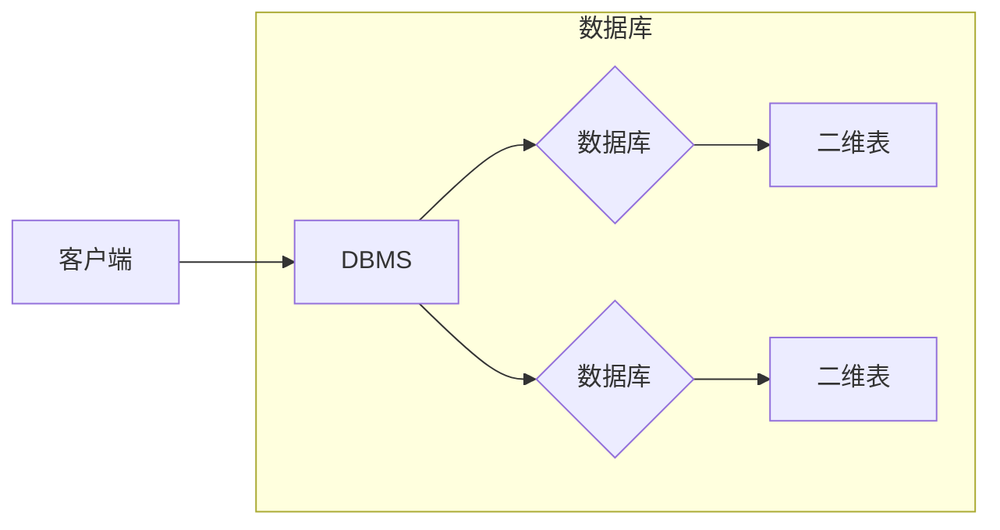
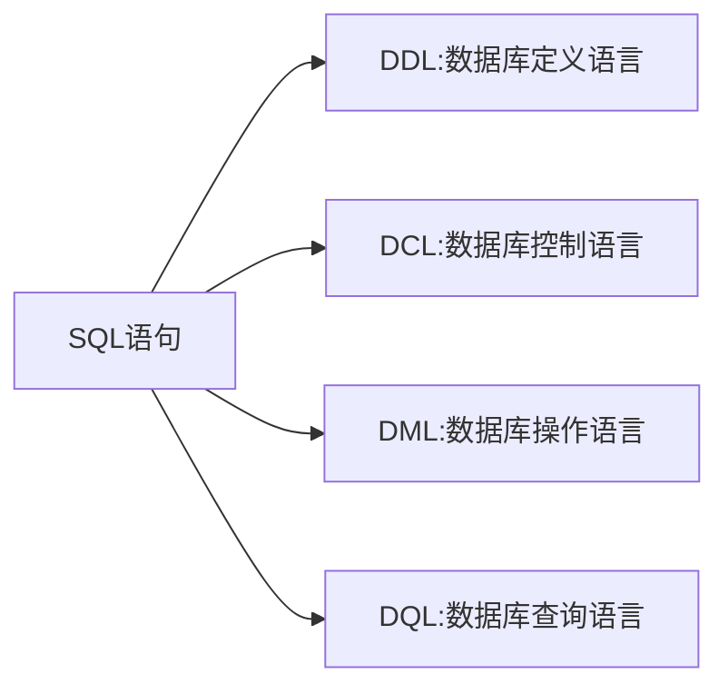
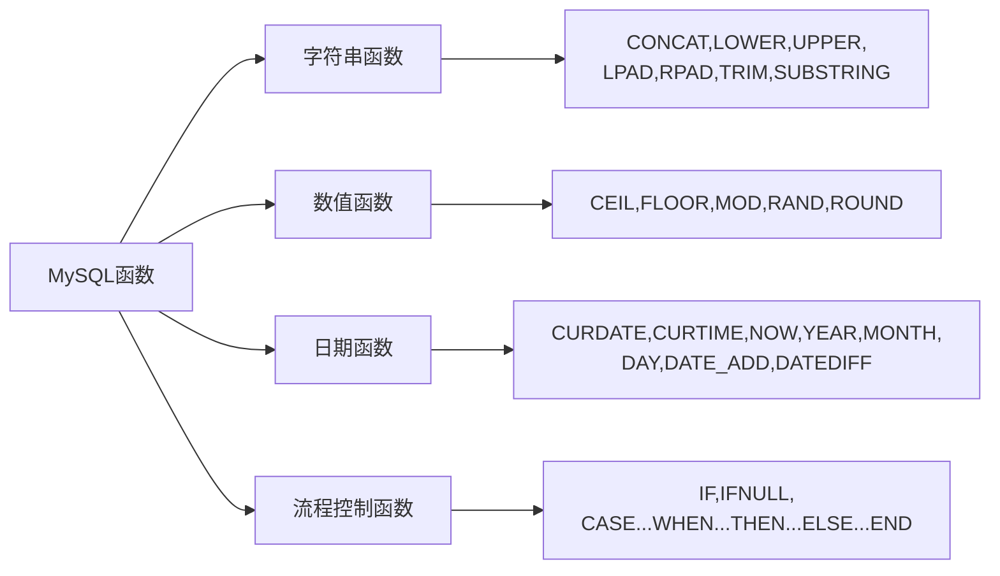
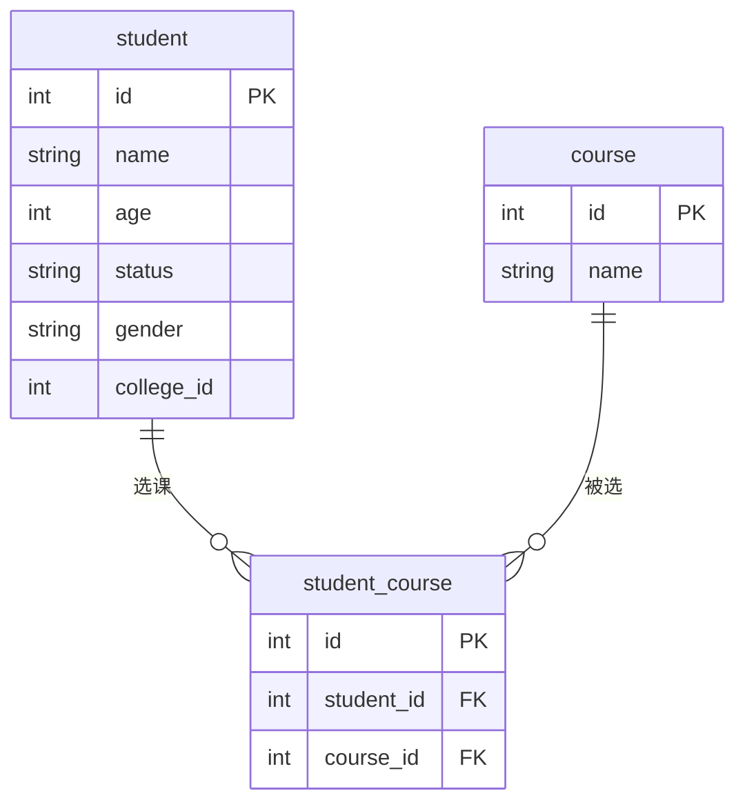
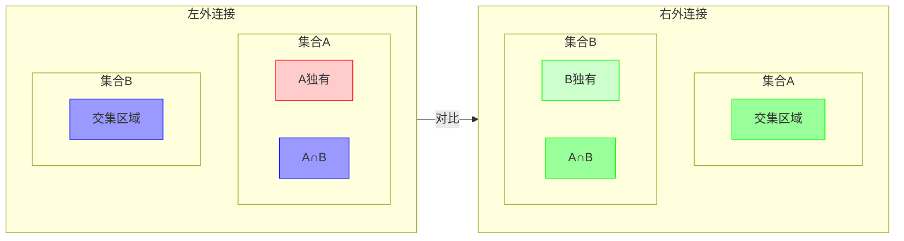
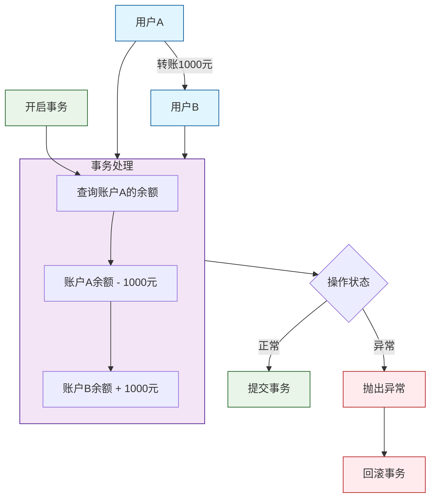
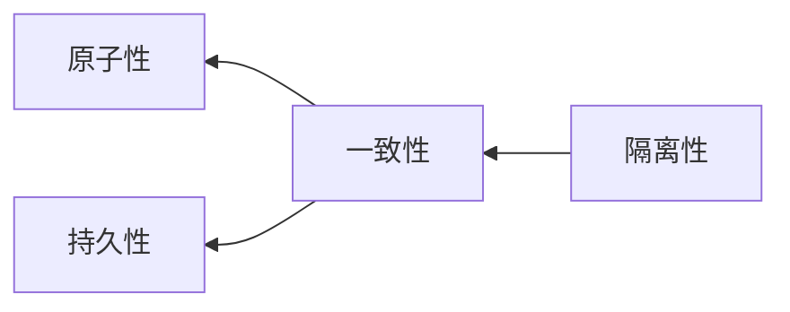
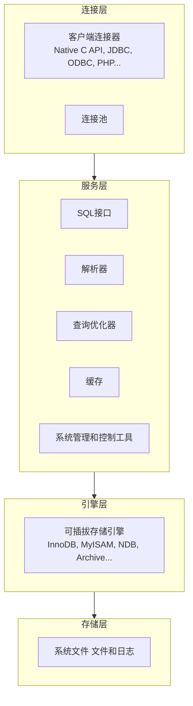

# 1.基础

## 1.1 数据库概述

### 数据库

数据库（Database）是按照数据结构来组织、存储和管理数据的仓库。
每个数据库都有一个或多个不同的 API 用于创建，访问，管理，搜索和复制所保存的数据。

### 数据库管理系统

数据库管理系统是一种操纵和管理数据库的大型软件，用于建立、使用和维护数据库，简称 _DBMS_。它对数据库进行统一的管理和控制，以保证数据库的安全性和完整性。

### SQL

SQL (Structured Query Language) 是具有数据操纵和数据定义等多种功能的数据库语言，这种语言具有交互性特点，能为用户提供极大的便利，数据库管理系统应充分利用SQL语言提高计算机应用系统的工作质量与效率。SQL语言不仅能独立应用于终端，还可以作为子语言为其他程序设计提供有效助力，该程序应用中，SQL可与其他程序语言一起优化程序功能，进而为用户提供更多更全面的信息。
SQL是ANSI标准语言，但不同数据库系统有各自的实现和扩展

## 1.2 MySQL

MySQL 是一个关系型数据库管理系统，由瑞典 MySQL AB 公司开发，目前属于 Oracle 公司。MySQL 是一种关联数据库管理系统，关联数据库将数据保存在不同的表中，而不是将所有数据放在一个大仓库内，这样就增加了速度并提高了灵活性。

- MySQL 是开源的，目前隶属于 Oracle 旗下产品。
- MySQL 支持大型的数据库。可以处理拥有上千万条记录的大型数据库。
- MySQL 使用标准的 SQL 数据语言形式。
- MySQL 可以运行于多个系统上，并且支持多种语言。这些编程语言包括 C、C++、Python、Java、Perl、PHP、Eiffel、Ruby 和 Tcl 等。
- MySQL 对 PHP 有很好的支持，PHP 是很适合用于 Web 程序开发。
- MySQL 支持大型数据库，支持 5000 万条记录的数据仓库，32 位系统表文件最大可支持 4GB，64 位系统支持最大的表文件为8TB。
- MySQL 是可以定制的，采用了 GPL 协议，你可以修改源码来开发自己的 MySQL 系统。
- MySQL 的默认端口是 3306
- MySQL 的事务特性（ACID）是关系型数据库的核心特性

### 关系型数据库

> [!note] 概述
> 关系型数据库，是指采用了[关系模型](https://baike.baidu.com/item/%E5%85%B3%E7%B3%BB%E6%A8%A1%E5%9E%8B/3189329?fromModule=lemma_inlink)来组织数据的数据库，其以行和列的形式[存储数据](https://baike.baidu.com/item/%E5%AD%98%E5%82%A8%E6%95%B0%E6%8D%AE/14717603?fromModule=lemma_inlink)，以便于用户理解，关系型数据库这一系列的行和列被称为表，一组表组成了[数据库](https://baike.baidu.com/item/%E6%95%B0%E6%8D%AE%E5%BA%93/103728?fromModule=lemma_inlink)。用户通过查询来检索数据库中的数据，而查询是一个用于限定数据库中某些区域的执行代码。关系模型可以简单理解为[二维表格](https://baike.baidu.com/item/%E4%BA%8C%E7%BB%B4%E8%A1%A8%E6%A0%BC/645449?fromModule=lemma_inlink)模型，而一个关系型数据库就是**由[二维表](https://baike.baidu.com/item/%E4%BA%8C%E7%BB%B4%E8%A1%A8/2863955?fromModule=lemma_inlink)及其之间的关系组成的**一个[数据组](https://baike.baidu.com/item/%E6%95%B0%E6%8D%AE%E7%BB%84%E7%BB%87/5199063?fromModule=lemma_inlink)

### MySQL数据库数据模型

一个服务器中可以有多个数据库,每个数据库中又有很多**表**



## **1.3 SQL语句(重点)**

### SQL语法

通用语法

- SQL语句可以单行或多行书写,用分号结尾
- SQL语句可以通过空格/缩进增强可读性
- MySQL数据库的SQL语句**不区分大小写**,_关键字建议大写_
- 单行注释使用`#注释内容`来注释,多行注释使用`/*注释内容*/`来注释

### MySQL数据类型

MySQL数据类型有很多,主要分三类:**数值类型**,**字符串类型**,**日期时间类型**

#### 数值类型

|     类型     |      大小      |         描述          | 类比Java中的类型 |
| :----------: | :------------: | :-------------------: | :--------------: |
|   TINYINT    |     1byte      |       小整数值        |       byte       |
|   SMALLINT   |    2 bytes     |       大整数值        |      short       |
|  MEDIUMINT   |    3 bytes     |       大整数值        |  int(部分范围)   |
| INT/INTEGER  |    4 bytes     |       大整数值        |       int        |
|    BIGINT    |    8 bytes     |      极大整数值       |       long       |
|    FLOAT     |    4 bytes     |      单精度浮点       |      float       |
|    DOUBLE    |    8 bytes     |      双精度浮点       |      double      |
|   DECIMAL    |                |  小数值(精确定点数)   |    BigDecimal    |
|    BIT(M)    | ≈(M+7)/8 bytes |       位字段值        |  boolean/bitSet  |
| BOOL/BOOLEAN |     1 byte     | 布尔值(TINYINT的别名) |     boolean      |

#### 字符串类型

|    类型    |        大小        |             描述             |
| :--------: | :----------------: | :--------------------------: |
|    CHAR    |    0~255 bytes     |          定长字符串          |
|  VARCHAR   |   0~65535 bytes    |          变长字符串          |
|  TINYBLOB  |    0~255 bytes     | 不超过255个字符的二进制数据  |
|  TINYTEXT  |    0~255 bytes     |         短文本字符串         |
|    BLOB    |   0~65535 bytes    |    二进制形式的长文本数据    |
|    TEXT    |   0~65535 bytes    |          长文本数据          |
| MEDIUMBLOB |  0~16777215 bytes  | 二进制形式的中等长度文本数据 |
| MEDIUMTEXT |  0~16777215 bytes  |       中等长度文本数据       |
|  LONGBLOB  | 0~4294967295 bytes |   二进制形式的极大文本数据   |
|  LONGTEXT  | 0~4294967295 bytes |         极大文本数据         |

#### 日期时间类型

|   类型    | 大小 |                   范围                   |        格式         |          描述           |
| :-------: | :--: | :--------------------------------------: | :-----------------: | :---------------------: |
|   DATE    |  3   |          1000-01-01到9999-12-31          |     YYYY-MM-DD      |         日期值          |
|   TIME    |  3   |          -838:59:59到838:59:59           |      HH:MM:SS       |    时间值或持续时间     |
|   YEAR    |  1   |                1901~2155                 |        YYYY         |          年份           |
| DATETIME  |  8   | 1000-01-01 00:00:00到9999-12-31 23:59:59 | YYYY-MM-DD HH:MM:SS |    混合日期和时间值     |
| TIMESTAMP |  4   | 1976-01-01 00:00:01到2038-01-19 3:14:07  | YYYY-MM-DD HH:MM:SS | 混合日期和时间值,时间戳 |

### MySQL的关键字

#### MySQL的所有关键字

需要注意关键字的操作对象!

|     关键字     |           描述           |                 注意事项                  |
| :------------: | :----------------------: | :---------------------------------------: |
|      ADD       |     添加**列或索引**     |           在*ALTER TABLE*中使用           |
|      ALL       | 用以比较子查询中的所有值 |         通常与比较运算符一起使用          |
|     ALTER      |      修改**表结构**      |             需要表级别的权限              |
|      AND       |          逻辑与          |               优先级高于or                |
|       AS       |   为**列或表**创建别名   |       别名可用于GROUP BY或ORDER BY        |
|      ASC       |         升序排序         |           默认排序方式,可以省略           |
| AUTO_INCREMENT | **自动**生成**递增**数字 |            仅适用于**整数列**             |
|    BETWEEN     |       指定范围条件       |                **闭区间**                 |
|       BY       |  用于GROUP BY或ORDER BY  |                                           |
|      CASE      |        条件表达式        |             类似于switch语句              |
|     CHECK      |       创建约束条件       | MySQL会解析但是忽略CHECK约束(除了NDB引擎) |
|     COLUMN     |          列操作          |           在*ALTER TABLE*中使用           |
|     COMMIT     |         提交事务         |        需要启用事务(如InnoDB引擎)         |
|   CONSTRAINT   |         定义约束         |              用于主键,外键等              |
|     CREATE     |    创建**数据库**对象    |               需要相应权限                |
|    DEFAULT     |          默认值          |      仅适用于**INSERT**和**UPDATE**       |
|     DELETE     |         删除数据         |        不加where限制会删除所有数据        |
|      DESC      |         降序排序         |             需要**显式声明**              |
|    DISTINCT    |  返回唯一值(**行去重**)  |               影响性能,慎用               |
|      DROP      |    删除**数据库对象**    |                  不可逆                   |
|     EXISTS     |  测试子查询是否返回结果  |             通常用于where子句             |
|  FOREIGN KEY   |       定义**外键**       |        需要存储引擎支持(如InnoDB)         |
|      FROM      |      指定查询**表**      |            基本SELECT语句必需             |
|    GROUP BY    |      **分组结果**集      |       非聚合列必须出现在GROUP BY中        |
|     HAVING     |      对分组结果过滤      |          类似where但用于聚合函数          |
|       IN       |       指定多值条件       |              比多个or更方便               |
|     INDEX      |      创建或删除索引      |       提高查询性能,但是增大写入开销       |
|   INNER JOIN   |       **内连接**表       |   返回两表匹配的记录(两个表的**交集**)    |
|     INSERT     |         插入数据         |           多行插入比单行更高效            |
|    IS NULL     |        测试NULL值        |             不能使用=NULL比较             |
|      LIKE      |  模式匹配(**模糊匹配**)  |              支持通配符%和_               |
|     LIMIT      |       限制返回行数       |                常用于分页                 |
|      NOT       |          逻辑非          |            可与其他运算符组合             |
|       OR       |          逻辑或          |               优先级低于AND               |
|    ORDER BY    |      **排序结果**集      |         可使用列名,别名或位置编号         |
|   PRIMARY BY   |       定义**主键**       |                唯一切非空                 |
|    ROLLBACK    |       **回滚**事务       |             撤销未提交的更改              |
|     SELECT     |         查询数据         |            **最常用**的SQL语句            |
|      SET       |  更新**列**值或设置变量  |      在**UPDATE**和**SET**语句中使用      |
|     TABLE      |          表操作          |        用于**CREATE/DROP TABLE**等        |
|  TRANSACTION   |         事务操作         |          需要支持事务的存储引擎           |
|     UNION      |         联合查询         |        默认去重,union all不会去重         |
|     UNIQUE     |     创建**唯一约束**     |       允许NULL（除非同时NOT NULL）        |
|     UPDATE     |         更新数据         |           不加where会更新所有行           |
|     VALUES     |    指定INSERT语句的值    |              多行输入更高效               |
|     WHERE      |         过滤条件         |     在UPDATE/DELETE中不加WHERE很危险      |
|      WITH      |       公共表表达式       |      MySQL 8.0+支持，可用于递归查询       |

> [!warning] 注意事项：
>
> 1. 关键字**不区分大小写**，但通常建议大写以提高可读性
> 2. 使用反引号``(`)``可以转义关键字作为标识符（如`select`作为列名）
> 3. 不同MySQL版本可能支持不同的关键字
> 4. 完整关键字列表可通过`SHOW keywords;`查询

#### 易混淆的关键字

|      易混淆的关键字对       |                                 主要区别                                  |                常见错误                |
| :-------------------------: | :-----------------------------------------------------------------------: | :------------------------------------: |
|   `DELETE` vs `TRUNCATE`    |             DELETE逐行删除可回滚；TRUNCATE整表清空且不可回滚              |        误用TRUNCATE删除部分数据        |
|    `DROP` vs `TRUNCATE`     |                DROP删除**表**结构+数据；TRUNCATE只清空数据                |      混淆**对象级别**（表vs数据）      |
|     `HAVING` vs `WHERE`     |                WHERE过滤行，HAVING过滤分组（支持聚合函数）                |         在WHERE中使用聚合函数          |
| `INNER JOIN` vs `LEFT JOIN` | INNER只返回两个表的**交集**，LEFT返回**左表所有行**（右表无匹配则为NULL） |          混淆NULL值的产生场景          |
|   `UNION` vs `UNION ALL`    |              UNION会去重，UNION ALL保留所有结果（包括重复）               |         误用UNION导致性能下降          |
|  `GROUP BY` vs `DISTINCT`   |               GROUP BY可配合聚合函数；DISTINCT只是简单去重                |         用DISTINCT实现分组统计         |
|      `BETWEEN` vs `IN`      |                 BETWEEN是**连续范围**，IN是**离散值**列表                 |   混淆边界包含性（BETWEEN包含边界）    |
|    `IS NULL` vs `= NULL`    |             IS NULL是正确语法，= NULL永远返回NULL（不会为真）             |           误用= NULL判断空值           |
|     `LIMIT` vs `OFFSET`     |               LIMIT控制**返回行数**，OFFSET指定**跳过行数**               | 混淆参数顺序（LIMIT offset,count语法） |
|     `CHAR` vs `VARCHAR`     |               CHAR**定长会填充空格**，VARCHAR**变长不填充**               |          混淆存储空间计算方式          |
|  `DATETIME` vs `TIMESTAMP`  |                  DATETIME不自动转换时区，TIMESTAMP会转换                  |        时区处理不当导致时间错误        |
|    `STORED` vs `VIRTUAL`    |                存储生成列实际存储数据，虚拟生成列动态计算                 |     混淆计算时机（写入时vs读取时）     |
|      `EXISTS` vs `IN`       | EXISTS在找到第一个匹配即停止，IN会处理所有值（子查询结果大时EXISTS更快）  |            在大数据集误用IN            |
|   `CASCADE` vs `RESTRICT`   |                       外键约束的级联删除vs禁止删除                        |            混淆外键约束行为            |

> [!danger] 高频混淆点:
>
> 1. ​`COUNT(column)` vs `COUNT(*)`：前者忽略NULL，后者计数所有行
> 2. `ON` vs `USING`：连接条件语法差异（`JOIN...ON a.id=b.id` vs `JOIN...USING(id)`）
> 3. `!=` vs `<>`：两者都是"不等于"，但<>是标准SQL语法
> 4. `REGEXP` vs `LIKE`：正则匹配vs简单通配符匹配（性能差异显著）
> 5. `FLOAT` vs `DECIMAL`：浮点数近似存储vs精确小数存储（金融数据必须用DECIMAL）

### SQL语句分类

SQL语句分为四类



#### DDL(Data Defination Language)

数据**定义**语言,用来**定义数据库对象**(数据库,表,字段)

##### 数据库操作

###### 查询

- 查询所有数据库

```MySQL
SHOW DATABASES;
```

- 查询当前数据库

```MySQL
SELECT DATABASE();
```

###### 创建

- 创建数据库

```mysql
CREATE DATABASE[IF NOT EXISTS] 数据库名 [DEFAULT CHARSET 字符集][COLLATE 排序规则];
```

在创建时可以添加约束条件,如*IF NOT EXISTS*,这表示如果数据库不存在则新建一个数据库

`[...]`是可选参数

###### 删除

```MySQL
DROP DATABASE[IF EXISTS]数据库名;
```

与创建相同,在删除时也可以进行判断,如果有这个数据库则删除

###### 使用

```MySQL
USE 数据库名;
```

##### 表操作

###### 创建表

```MySQL
CREATE TABLE 表名(
	字段1 字段1类型[COMMENT 字段1注释],
	字段2 字段2类型[COMMENT 字段2注释],
	字段3 字段3类型[COMMENT 字段3注释],
	...
	字段n 字段n类型[COMMENT 字段n注释]
)[COMMENT 表注释];
```

###### 查询表结构

- 查询当前数据库的所有表

```MySQL
SHOW TABLES;
```

- 查询表结构

```MySQL
DESC 表名;
```

- 查询指定表名的建表语句

```MySQL
SHOW CREATE TABLE 表名;
```

###### 修改

- 添加字段

```MySQL
ALTER TABLE 表名 ADD 字段名 类型(长度)[COMMENT 注释][约束];
```

例:向emp表中添加一个新的字段:昵称(nickname),类型为varchar(20)

```MySQL
alter table emp add nickname varchar(20) comment"昵称";
```

- 修改*数据类型*

```MySQL
ALTER TABLE 表名 MODIFY 字段名 新数据类型(长度);
```

- 修改*字段名和字段类型*

```MySQL
ALTER TABLE 表名 CHANGE 旧字段名 新字段名 类型(长度)[COMMENT注释][约束];
```

例:将emp表中的nickname字段改为username,类型为varchar(30)

```MySQL
alter table emp change nickname username varchar(30) comment"用户名";
```

- 删除字段

```MySQL
ALTER TABLE 表名 DROP 字段名;
```

- 修改表名

```MySQL
ALTER TABLE 表名 RENAME TO 新表名;
```

- 删除表

```MySQL
DROP TABLE[IF EXISTS]表名;
```

- 删除指定表并重新创建该表

```MySQL
TRUNCATE TABLE 表名;
```

在删除表时,表中的数据也会被一并删除.

#### DML(Data Manipulation Language)

数据**操作**语言,用来对数据库表中的数据进行**增删改**

##### 增加(INSERT)

- 给指定字段添加数据

```MySQL
INSERT INTO 表名(字段名1,字段名2...) VALUES(值1,值2...);
```

- 给全部字段添加数据

```MySQL
INSERT INTO 表名 VALUES (值1,值2...);
```

- 批量添加数据

```MySQL
INSERT INTO 表名(字段名1,字段名2...) VALUES (值1,值2...),(值1,值2...),(值1,值2...);
```

```MySQL
INSERT INTO 表名 VALUES (值1,值2...),(值1,值2...),(值1,值2...);
```

INSERT语句也可以插入表达式或函数结果

```mysql
INSERT INTO 表名 (column1) VALUES (NOW());
```

> [!warning] 注意
>
> - 插入数据时,指定的字段顺序要和值的顺序一一对应
> - 字符串和日期型数据应该包含在**单引号**内
> - 插入数据的大小应该在字段的规定范围内

##### 修改(UPDATE)

```MySQL
UPDATE 表名 SET 字段名1 = 值1,字段名2 = 值2,...[WHERE条件]
```

修改条件可以有也可以没有. 如果没有条件,则修改整张表的相应字段内容

##### 删除(DELETE)

```MySQL
DELETE FROM 表名 [WHERE条件]
```

- DELETE语句条件可以有也可以没有,如果没有则会删除**整张表的数据(表仍然存在)**(谨慎操作!)

#### DQL(Data Query Language)

数据**查询**语言,用来 **查询(SELECT)** 数据库表中的记录

编写顺序:

```MySQL
SELECT
	字段列表
FROM
	表名列表
WHERE
	条件列表
GROUP BY
	分组字段列表
HAVING
	分组后条件列表
ORDER BY
	排序字段列表
LIMIT
	分页参数
```

执行顺序:

```MySQL
FROM
	表名列表
WHERE
	条件列表
GROUP BY
	分组字段列表
HAVING
	分组后条件列表
SELECT
	字段列表
ORDER BY
	排序字段列表
LIMIT
	分页参数
```

##### 基本查询

- 查询多个字段
  查询指定字段

```MySQL
SELECT 字段1,字段2,字段3...FROM 表名;
```

查询所有字段

```MySQL
SELECT * FROM 表名;
```

示例代码

```MySQL
#创建表
create table stu(
    id int comment '学号',
    name varchar(20) comment '姓名',
    gender char(1) comment '性别',
    age tinyint comment '年龄',
    entryTime date comment '入学时间'
)comment '学生表';
#插入数据
insert into stu (id, name, gender, age, entryTime)
values (1, '张三', '男', 18, '2020-09-01'),
       (2, '李四', '女', 19, '2020-09-01'),
       (3, '王五', '男', 20, '2020-09-01'),
       (4, '赵六', '女', 21, '2020-09-01'),
       (5, '孙七', '男', 22, '2020-09-01'),
       (6, '周八', '女', 23, '2020-09-01'),
       (7, '吴九', '男', 24, '2020-09-01'),
       (8, '郑十', '女', 25, '2020-09-01');

select name,id,age from stu;
select * from stu;
```

- 设置别名
  使用**SELECT**后进行相应字段的查询并给字段赋予别名

```MySQL
SELECT 字段1[AS 别名1],字段2[AS 别名2]...FROM 表名
```

示例:用姓名作为字段别名查询姓名

```MySQL
select name as '姓名' from stu;
```

- 去除重复记录

```MySQL
SELECT DISTINCT 字段列表 FROM 表名;
```

##### 条件查询

条件查询需要在SELECT关键字后添加**WHERE**, WHERE之后跟*条件列表*

条件

| 运算符/表达式 |                   功能                    |  运算符/表达式   |                    功能                     |
| :-----------: | :---------------------------------------: | :--------------: | :-----------------------------------------: |
|       >       |                   大于                    |        =         |                    等于                     |
|      >=       |                 大于等于                  |      <>或!=      |                   不等于                    |
|       <       |                   小于                    | BETWEEN...AND... |           在某个范围之内(闭区间)            |
|      <=       |                 小于等于                  |     IN(...)      | 在in之后的列表中的值,多选一(括号中列举内容) |
|  LIKE占位符   | 模糊匹配(`_`匹配单个字符,%匹配任意个字符) |     IS NULL      |                   是NULL                    |
|    AND或&&    |                    且                     |     OR或\|\|     |                     或                      |
|    NOT或!     |                    非                     |                  |                                             |

语法

```MySQL
SELECT 字段列表 FROM 表名 WHERE 条件列表;
```

示例:查询年龄大于18且小于22岁的学生

```MySQL
select age,name, id from stu where age>18&&age<22;
```

##### 聚合函数

聚合函数是什么-->将一列数据作为一个整体,进行纵向计算

常见聚合函数

| 函数  |  功能  |
| :---: | :----: |
| count |  计数  |
|  max  | 最大值 |
|  min  | 最小值 |
|  avg  | 平均值 |
|  sum  |  求和  |
| 语法  |

```MySQL
SELECT 聚合函数(字段列表) FROM 表名;
```

例:

- 统计学生列表中的学生数量

```MySQL
select count(*) from stu;
```

- 统计学生的平均年龄

```MySQL
select avg( age) from stu;
```

- 记录最大年龄

```MySQL
select max(age) from stu;
```

- 记录最小年龄

```MySQL
select min(age) from stu;
```

- 统计在18~22岁之间学生的年龄之和

```MySQL
select sum(age) from stu where age between 18 and 22;
```

##### 分组查询

语法

```MySQL
SELECT 字段列表 FROM 表名[WHERE 条件] GROUP BY 分组字段名 [HAVING 分组后过滤条件];
```

> [!tip] where和having的区别
>
> - 执行时机不同: where是在**分组之前**过滤,不满足where的不参与分组; 而having是**分组之后**对结果进行过滤
> - 判断条件不同:where不能用聚合函数进行判断,而having可以

例

- 根据性别分组,统计男学生和女学生的数量

```MySQL
select gender,count(*) from stu group by gender;
```

- 根据性别分组,统计男学生和女学生的平均年龄

```MySQL
select stu.gender,avg(age) from stu group by gender;
```

- 查询小于21岁的学生,并根据性别分组,获取所有男学生

```MySQL
SELECT name,id,gender, COUNT(*) FROM stu WHERE age < 21 AND gender = '男' GROUP BY name, id, gender;
```

注意,_查询的结果和分组字段名应该对应_

##### 排序查询

语法

```MySQL
SELECT 字段列表 FROM 表名 ORDER BY 字段1 排序方式1,字段2 排序方式2;
```

排序方式

- ASC : （从上到下）升序(默认值)
- DESC : （从上到下）降序

如果是多字段排序,当第一个字段相同时,才会根据第二个字段进行排序

例:

- 根据年龄对学生进行升序排序

```MySQL
select * from stu order by age asc;
或
select * from stu order by age;
```

- 根据年龄对学生升序排序,如果年龄相同按照学号进行降序排序

```MySQL
select * from stu order by age asc,id desc ;
```

##### 分页查询

语法

```MySQL
SELECT 字段列表 FROM 表名 LIMIT 起始索引,查询记录数;
```

> [!warning] 注意
>
> - 起始索引从0开始, `起始索引=(页码-1)*每一页显示的记录数`
> - 分页查询是数据库的方言,不同的数据库有不同的实现.在MySQL中,关键字是**LIMIT**
> - 如果查询的是第一页数据,起始索引可以省略,直接简写为`limit 10`

例:

- 查询第一页的学生数据,每页展示3条数据

```MySQL
select * from stu limit 3;
```

- 查询第二页的学生数据,每页展示4条数据 (起始索引为`(2-1)*4=4`)

```MySQL
select * from stu limit 4,4 ;
```

#### DCL(Data Control Language)

数据**控制**语言,用来创建数据库用户,**控制**数据库的**访问权限**

##### 用户管理

1. 查询用户

```MySQL
USE mysql;
SELECT * FROM user;
```

2. 创建用户

```MySQL
CREATE USER '用户名' @ '主机名' IDENTIFIED BY '密码';
```

3. 修改用户密码

```MySQL
ALTER USER '用户名' @ '主机名' IDENTIFIED WITH 加密方式 BY '新密码';
```

4. 删除用户

```MySQL
DROP USER '用户名' @ '主机名';
```

> [!warning] 注意
>
> - 主机名可以使用%通配
> - 这类SQL开发人员操作的比较少,主要由数据库管理员使用

##### 权限控制

MySQL中有很多种权限,常用的权限如下

|        权限        |        说明        |
| :----------------: | :----------------: |
| ALL/ALL PRIVILEGES |      所有权限      |
|       SELECT       |      查询数据      |
|       INSERT       |      插入数据      |
|       UPDATE       |      修改数据      |
|       DELETE       |      删除数据      |
|       ALTER        |       修改表       |
|        DROP        | 删除数据库/表/视图 |
|       CREATE       |   创建数据库/表    |

权限控制的操作有:

- 查询权限

```MySQL
SHOW GRANTS FOR '用户名' @ '主机名';
```

- 授予权限

```MySQL
GRANT 权限列表 ON 数据库名.表名 TO '用户名' @ '主机名';
```

- 撤销权限

```MySQL
REMOVE 权限列表 ON 数据库名.表名 FROM '用户名' @ '主机名';
```

> [!warning] 注意:
>
> - 多个权限之间,用逗号分隔
> - 授权时,数据库名和表名可以用`*`进行通配

## 1.4 函数

函数是之一段可以直接被另一段程序调用的程序或代码
MySQL中的函数分类如下



### 字符串函数

MySQL中内置了很多字符串函数,常用的如下

|           函数           |                               功能                               |
| :----------------------: | :--------------------------------------------------------------: |
|   CONCAT(S1,S2,...Sn)    |                字符串拼接,将S1~Sn拼接为一个字符串                |
|        LOWER(str)        |                    将字符串str全部转换为小写                     |
|        UPPER(str)        |                    将字符串str全部转换为大写                     |
|     LPAD(str,n,pad)      |      左填充,用字符串pad对str左边进行填充,达到n个字符串长度       |
|     RPAD(str,n,pad)      |      右填充,用字符串pad对str右边进行填充,达到n个字符串长度       |
|        TRIM(str)         |                    去掉字符串头部和尾部的空格                    |
| SUBSTRING(str,start,len) | 返回从字符串str从start开始起的len个长度的字符串(**初始索引为1**) |
|       CONCAT_WS()        |                      用指定分隔符连接字符串                      |

使用示例

```MySQL
#拼接
select concat('hello','world')
#转换为大/小写
select lower('HELLO WORLD');
select upper('hello world');
#填充
select lpad('hello',10,'-');
select rpad('hello',10,'-');
#去除空格
select trim('  hello   '); #去掉全部空格
select ltrim('  hello');   #去掉左侧空格
select rtrim('hello  ');   #去掉右侧空格
#子字符串
select substring('hello world',1,5);
```

### 数值函数

|    函数    |            功能             |
| :--------: | :-------------------------: |
|  CEIL(x)   |          向上取整           |
|  FLOOR(x)  |          向下取整           |
|  MOD(x,y)  |             x%y             |
|   RAND()   |       返回0~1的随机数       |
| ROUND(x,y) | 求x四舍五入的值,保留y位小数 |
| TRUNCATE() |         截断小数位          |

使用示例

```MySQL
#向上取整
select ceil(1.1);
#向下取整
select floor(1.9);
#求模运算
select mod(5,2);
#随机数
select rand();
#四舍五入,保留3为小数
select round(1.123456,3);
```

> [!question] 思考:如何通过数据库的函数生成一位六位数的随机验证码?
> 思路:
>
> 1. 先使用rand()生成随机数
> 2. 放大随机数的范围,限定在0~999999之间
> 3. 使用round()进行四舍五入取整
> 4. 使用lpad()向左填充0,确保结果总是六位数

```MySQL
select lpad(round(rand()*1000000,0),6,'0');
```

### 日期函数

|               函数                |                              功能                               |
| :-------------------------------: | :-------------------------------------------------------------: |
|             CURDATE()             |                          返回当前日期                           |
|             CURTIME()             |                          返回当前时间                           |
|               NOW()               |                      返回当前的日期和时间                       |
|            YEAR(date)             |                       获取指定date的年份                        |
|            MONTH(date)            |                       获取指定date的月份                        |
|             DAY(date)             |                       获取指定date的日期                        |
| DATE_ADD(date,INTERVAL expr type) |       返回一个日期/时间值上加上一个时间间隔expr后的时间值       |
|       DATEDIFF(date1,date2)       | 返回时间date1和时间date2之间的**天数**(返回的内容为date1-date2) |
|           DATE_FORMAT()           |                           格式化日期                            |

使用示例

```MySQL
#获取日期
select current_date();
#获取时间
select current_time();
#获取当前日期和时间
select now();
#获取年月日
select year(now());
select month(now());
select day(now());
#获取指定日期加上一段时间后的时间
select date_add(now(),interval 1 day); #往后推一年
#获取时间间隔
select datediff('2025-9-1','2025-08-01');
```

### 流程控制函数

|                        函数                         |                        功能                         |
| :-------------------------------------------------: | :-------------------------------------------------: |
|                     IF(val,t,f)                     |               如果val为true否则返回f                |
|                  IFNULL(val1,val2)                  |         如果val1不为空返回val1,否则返回val2         |
|   `CASE WHEN[val1]THEN[res1]...ELSE[default]END`    |    如果val1为true,返回res1,否则返回default默认值    |
| `CASE[expr]WHEN[val1]THEN[res1]...ELSE[default]END` | 如果expr的值等于val1,返回res1,否则返回default默认值 |

使用示例

```MySQL
#if
select if(true,'true','false');
#ifnull
select ifnull('ok','default');
```

需求:查询stu表中的学生姓名和年龄段

```MySQL
select
    stu.name,
    (case
         when age >= 18 and age < 20 then '20岁以下'
         when age >= 20 then '20岁以上'
        end) as '年龄'
from stu;
```

## 1.5 约束

### 约束概述

- 概念:约束是**作用于表中字段上**的规则,用于**限制**存储在表中的数据
- 目的:保证数据库中的数据正确,有效和完整
- 分类:

|           约束           |                          描述                           |   关键字    |
| :----------------------: | :-----------------------------------------------------: | :---------: |
|         非空约束         |                限制该字段的数据不为null                 |  NOT NULL   |
|         唯一约束         |             保证该字段的所有数据唯一,不重复             |   UNIQUE    |
|         主键约束         |     主键是一行数据的**唯一标识**,要求**非空且唯一**     | PRIMARY KEY |
|         默认约束         |      保存数据时,如果未指定该字段的值,则采用默认值       |   DEFAULT   |
| 检查约束(8.0.16版本之后) |                保证字段值满足某一个条件                 |    CHECK    |
|         外键约束         | 用来让两张表的数据之间建立连接,保证数据的一致性和完整性 | FOREIGN KEY |

### 约束实现

根据需求完成表结构的创建

| 字段名 | 字段含义 |  字段类型   |         约束条件          |         约束关键字         |
| :----: | :------: | :---------: | :-----------------------: | :------------------------: |
|   id   | 唯一标识 |     INT     |      主键,并自动增长      | PRIMARY KEY,AUTO_INCREMENT |
|  name  |   姓名   | VARCHAR(10) |        非空且唯一         |      NOT NULL, UNIQUE      |
|  age   |   年龄   |     INT     |     大于0小于等于120      |           CHECK            |
| status |   状态   |   CHAR(1)   | 如果没有指定该值*默认*为1 |          DEFAULT           |
| gender |   性别   |   CHAR(1)   |            无             |             无             |

创建表

```MySQL
create table student(
    id int primary key auto_increment comment '学号',
    name varchar(10) not null unique comment '姓名',
    age int check ( age>0&&age<=120 ) comment '年龄',
    status char(1) default '1' comment '状态',
    gender char(1) comment '性别'
) comment '学生表';
```

插入数据

```MySQL
#设置所有字段
insert into student values (1,'张三',18,'1','男'),(2,'李四',19,'1','女');
#不设置id,id会自增
insert into student(name, age, status, gender) values ('王五',20,'1','男');
#不设置status,status保持默认值
insert into student(name, age, gender) values ('赵六',21,'男');
```

### 外键约束

- 概念: 外键用来让**两张表的数据之间建立连接**,从而保证数据的一致性和完整性

#### 添加外键

创建表时添加外键

```MySQL
CREATE TABLE 表名(
	字段名 数据类型,
	...
	[CONSTRAINT][外键名称] FOREIGN KEY(外键字段名) REFERENCES 主表(主表列名)
);
```

表已经创建,额外增加外键

```MySQL
ALTER TABLE 表名 ADD CONSTRAINT 外键名称 FOREIGN KEY(外键字段名) REFERENCES 主表(主表列名);
```

示例:
建立学生表和学院表, 并建立学生表和学院表之间的外键关系

建立两张表

```MySQL
create table college(
    id int auto_increment primary key comment '学院编号',
    name varchar(10) not null unique comment '学院名称'
)comment '学院表';
insert into college(name) values ('计算机与信息学院'),
                                 ('外国语学院'),
                                 ('经济管理学院'),
                                 ('软件学院');

create table student(
    id int auto_increment primary key comment '学号',
    name varchar(10) not null comment '姓名',
    age int comment '年龄',
    status char(1) comment '状态',
    gender char(1) comment '性别',
    college_id int comment '学院编号'
)comment '学生表';
```

现在建立了两张表,但是学院的id和学生中的字段college_id没有关联, 于是我们开始建立外键关联

```MySQL
alter table student add constraint foreign key (college_id) references college(id);
```

#### 外键删除/更新行为

|    行为     |                                                说明                                                |
| :---------: | :------------------------------------------------------------------------------------------------: |
|  NO ACTION  |          当在父表中删除/更新记录时.首先检查该记录是否有对应外键,如果有则不允许删除和更新           |
|  RESTRICT   |          当在父表中删除/更新记录时.首先检查该记录是否有对应外键,如果有则不允许删除和更新           |
|   CASCADE   | 当在父表中删除/更新记录时.首先检查该记录是否有对应外键,如果有则**也删除/更新**外外键在子表中的记录 |
|  SET NULL   |       当在父表中删除对应记录时,首先检查该记录是否有对应外键,如果有则设置子表中该外键值为null       |
| SET DEFAULT |                            父表有变更时,子表将外键列设置成一个默认的值                             |
|    语法     |

```MySQL
ALTER TABLE 表名 ADD CONSTRAINT 外键名称 FOREIGN KEY(外键字段名) REFERENCES 主表(主表字段名) ON UPDATE CASCADE ON DELETE SET NULL;
```

## 1.6 多表查询

### 多表关系

在项目开发中,在进行数据库表结构设计时,会根据业务需求及业务模块之间的关系,分析并设计表结构,由于业务之间相互关联, 所以各个表结构之间也存在各种联系,大致分为三种

#### 一对多(多对一)

- 案例: 部门和员工的关系
- 关系: 一个部门对应多个员工, 一个员工对应一个部门
- 实现: 在多的一方建立外键,指向另一方的主键

#### 多对多

- 案例: 学生与课程的关系
- 关系: 一个学生可以选修多门课程, 一门课程也可以被多个学生选择
- 实现: 建立第三张中间表, 中间表至少包含两个外键,分别关联两方主键

```MySQL
#建立课程表
create table course(
    id int auto_increment primary key comment '课程编号',
    name varchar(20) not null comment '课程名称'
)comment '课程表';
insert into course(name) values ('Java'),('C++'),('Python'),('JavaScript'),('PHP');

#建立学生-课程中间表
create table student_course(
    id int auto_increment primary key comment '编号',
    student_id int comment '学号',
    course_id int comment '课程编号',
    constraint fk_course_id foreign key (course_id) references course(id),
    constraint fk_student_id foreign key (student_id) references student(id)
)comment '学生选课表';
```

关系图如图



#### 一对一

- 案例: 用户与用户详情的关系
- 关系: 一对一,多用于单表拆分,将一张表的基础字段放在一张表中,其他字段放在另一张表中,以提高操作效率
- 实现: 在任意一方添加外键,关联另一方的主键,并设置外键为**唯一的**(unique),保证是一对一的关系

建表

```MySQL
#用户表
create table tb_user(
    id int auto_increment primary key comment '编号',
    name varchar(10) comment '用户名',
    age int comment '年龄',
    gender char(1) comment '性别',
    phoneNumber char(11) comment '手机号'
)comment '用户表';
#教育信息表
create table tb_user_edu(
    id int auto_increment primary key comment '编号',
    degree varchar(10) comment '学历',
    major varchar(20) comment '专业',
    primarySchool varchar(20) comment '小学',
    middleSchool varchar(20) comment '中学',
    university varchar(20) comment '大学',
    uid int unique comment '用户编号',
    #建立外键关联
    constraint fk_uid foreign key (uid) references tb_user(id)
)comment '用户教育信息表';
```

插入数据(一一对应)

```MySQL
insert into tb_user(name, age, gender, phoneNumber) values
('张三', 18, '男', '13888888888'),
('李四', 19, '女', '13888888889'),
('王五', 20, '男', '13888888890');

insert into tb_user_edu(degree, major, primarySchool, middleSchool, university, uid) VALUES
('本科', '计算机科学与技术', '北京邮电大学', '北京 Colegio Militar', '北京邮电大学', 1),
                                                                ('本科', '计算机科学与技术', '北京邮电大学', '北京 Colegio Militar', '北京邮电大学', 2),
                                                                ('本科', '软件工程', '北京邮电大学', '北京 Colegio Militar', '北京邮电大学', 3);
```

### 多表查询

从多张表中查询数据

在多表查询中,需要消除无效的笛卡尔积

#### 多表查询的分类

##### 连接查询

###### 内连接

相当于查询A和B**交集**部分的数据(通过外键相关联的部分)

- 隐式内连接

```MySQL
SELECT 字段列表 FROM 表1,表2 WHERE 条件;
```

- 显式内连接

```MySQL
SELECT 字段列表 FROM 表1 [INNER] JOIN 表2 ON 连接条件;
```

例:
查询每一个学生的姓名,及关联学院的名称(分别使用隐式和现实内连接实现)

```MySQL
#隐式内连接
select student.name,college.name from student,college where student.college_id = college.id;
#显式内连接
select * from student stu inner join college col on stu.college_id = col.id;
```

###### 外连接



- 左外连接: 查询左表的所有数据,以及两张表交集的部分(完全包含表1)

```MySQL
SELECT 字段列表 FROM 表1 LEFT [OUTER] JOIN 表2 ON 条件;
```

- 右外连接: 查询右表的所有数据,以及两张表交集的部分(完全包含表2)

```MySQL
SELECT 字段列表 FROM 表1 RIGHT [OUTER] JOIN 表2 ON 条件;
```

例:
查询学生表中的所有数据,和对应的学院信息(左外连接)

```MySQL
select stu.* ,col.name from student stu left outer join college col on stu.college_id = col.id;
```

其中,outer可省略

查询学院表的所有数据,和对应的学生信息(右外连接)

```MySQL
select col.*,stu.* from student stu right outer join college col on stu.college_id = col.id;
```

###### 自连接

自连接是指一个表与自身进行连接，通常用于处理层级结构或树形结构数据，例如员工-领导关系、分类父子关系等。

- 当前表与自身的连接查询,自连接**必须使用表别名**.
- 自连接可以使用内连接也可以使用外连接

语法

```MySQL
SELECT 字段列表 FROM 表A 别名A JOIN 表A 别名B ON 条件;
```

例:查询员工及其所属领导的名字

```MySQL
#建表
-- 创建员工表
create table employee (
    id int primary key,
    name varchar(50),
    manager_id int
);

-- 插入员工数据
insert into employee(id, name, manager_id) values
(1, '张三（CEO）', null),
(2, '李四（技术总监）', 1),
(3, '王五（产品经理）', 1),
(4, '赵六（开发）', 2),
(5, '钱七（测试）', 2),
(6, '孙八（UI）', 3);

#自连接测试
select
    e.name as employee_name,
    m.name as manager_name
from
    employee e
left join
    employee m
on
    e.manager_id = m.id;
```

##### 联合查询

联合查询指把多次查询的结果合并起来,形成一个新的查询结果集

语法

```MySQL
SELECT 字段列表 FROM 表A [条件]
UNION[ALL]
SELECT 字段列表 FROM 表B [条件];
```

注意:

- union后是否有all-->*有all*时会将所有的结果**合并**,*没有all*时会对查询结果**去重**.
- 多张表的**列数必须保持一致**,而且**字段类型也要一致**.

##### 子查询

在外层SQL语句中嵌套SELECT语句,内层的查询称为子查询(嵌套查询)

语法

```MySQL
SELECT * FROM t1 WHERE column1 = (SELECT column1 FROM t2);
```

根据子查询的结果不同,分为

###### **标量**子查询-->子查询结果为**单个值**

常用的操作符`= <> > >= < <=`

例:查询计算机学院的所有学生信息
步骤拆解:

1. 查询计算机学院的id
2. 根据计算机学院的id查询学生信息
   如果要将两步合并,就需要将第一步的查询作为子查询的内容,位于等号右边

```MySQL
select * from student where college_id = (select id from college where college.name='计算机学院');
```

###### **列**子查询-->子查询结果为**一列**

常用的操作符:

| 操作符 |                 描述                  |
| :----: | :-----------------------------------: |
|   IN   |       在指定范围内列举(多选一)        |
| NOT IN |        不在指定的集合范围之内         |
|  ANY   |  子查询返回列表中有任意一个满足即可   |
|  SOME  | 与any等同,使用some的地方都可以使用any |
|  ALL   |   子查询返回列表的所有值都必须满足    |

例: 查询软件学院和艺术学院的所有员工信息
步骤拆解

1. 查询学院id
2. 根据学院id查询学生信息

```MySQL
select * from student where college_id in (select id from college where college.name='软件学院'or college.name='艺术学院');
```

###### **行**子查询-->子查询结果为**一行**

常用操作符: `= < > IN, NOT IN`

例:查询与张三的性别以及学院相同的学生信息

```MySQL
select name from student where (gender,college_id) = (select gender,college_id from student where name='张三');
```

###### **表**子查询-->子查询结果为**多行多列**

常用操作符: `IN`

例: 查询20岁以上的学生及其学院信息

```MySQL
select * from (select * from student where age>20) stu left join college col on stu.college_id = col.id;
```

上述代码将子查询的结果作为一张表,与另外一张表进行联合查询

根据子查询的位置,又可以分为

- where之后
- from之后
- select之后

## 1.7 事务

> [!note] 概述
> **事务**是**一组操作**的**集合**,它是一个不可分割的工作单位. 事务会**把所有操作作为一个整体**向系统提交或撤销操作请求,即这些操作**要么同时成功,要么同时失败**.
> 事务最重要的特性是ACID，即**原子性**（*A*tomicity）、**一致性**（*C*onsistency）、**隔离性**（*I*solation）和**持久性**（*D*urability）。

场景描述:
考虑一个银行系统中的转账操作



账户A向账户B转账1000元。这个操作需要：

1. 查询账户A的余额是否够1000元
2. 从账户A扣除1000元
3. 向账户B增加1000元
   上述步骤中任意一步出错, 进程就不能再继续进行,事务将回滚, 否则会出现数据错误(如资金丢失等)

**注意**: 默认的MySQL的事务是自动提交的,也就是说,当执行一条DML语句,MySQL会立刻隐式地提交任务

### 事务操作

还是以转账操作为例,我们先创建一个账户表,插入两条示例数据

```MySQL
create table account(
    id int auto_increment primary key comment '编号',
    username varchar(20) not null unique comment '用户名',
    money int comment '余额'
)comment '账户表';

insert into account(username,money) values
                                        ('张三',2000),
                                        ('李四',3000);
```

- 查看/设置事务的提交方式
  提交方式**默认值为1**(自动提交)

```MySQL
select @@autocommit;
set @@autocommit=0; -- 设置为手动提交
```

- 开启事务

```MySQL
start transaction ; 或 begin;
```

- 提交事务

```MySQL
commit;
```

- 回滚事务

```MySQL
rollback;
```

### 事务的四大特性--ACID

> [!note] 概述
> 事务具有四大特性,分别是
>
> - **原子性** (A)
> - **一致性** (C)
> - **隔离性** (I)
> - **持久性** (D)

**现实世界类比**
想象一个快递配送系统：

1. ​**原子性**​：包裹要么完整送达，要么退回发货地（不会半路消失）
2. ​**一致性**​：发货仓库减少的库存 = 收货地增加的库存
3. ​**隔离性**​：多个快递员同时取件不会互相干扰（有序排队）
4. ​**持久性**​：签收记录永久保存，即使快递公司系统故障也不会丢失



#### 原子性（*A*tomicity）

**定义**: 事务是**不可分割的最小操作单元**,要么全部成功要么全部失败

**通俗理解**​：就像"一键下单"功能，点击后所有操作（扣库存、减余额、生成订单）必须全部成功或全部失败，不能只执行部分。

**示例场景**​：银行转账（A转100元给B）

```mysql
-- 原子性示例代码
START TRANSACTION;
UPDATE accounts SET balance = balance - 100 WHERE id = 'A'; -- A账户扣款
UPDATE accounts SET balance = balance + 100 WHERE id = 'B'; -- B账户收款
-- 如果此时系统崩溃...
COMMIT;
```

**可能问题**​：

- 如果执行完A扣款后系统崩溃，没有原子性保障时：  
  ✅ A账户已扣款（执行了）  
  ❌ B账户未收款（未执行）  
  → 钱凭空消失！

​**原子性保障**​：  
数据库通过undo日志实现：如果事务未完成，系统会用undo日志回滚已执行的操作，就像从未发生过。

#### 一致性（*C*onsistency）

**定义**​：事务执行前后，数据库从一个一致状态变到另一个一致状态。

​**通俗理解**​：就像会计记账必须"收支平衡"，转账前后总金额应该不变。

**示例场景**​：同一转账操作

```mysql
-- 一致性检查伪代码
START TRANSACTION;
-- 检查1：转账前总金额
SELECT SUM(balance) INTO @before_total FROM accounts;

-- 执行转账
UPDATE accounts SET balance = balance - 100 WHERE id = 'A';
UPDATE accounts SET balance = balance + 100 WHERE id = 'B';

-- 检查2：转账后总金额
SELECT SUM(balance) INTO @after_total FROM accounts;

-- 验证一致性
IF @before_total != @after_total THEN
    ROLLBACK; -- 不一致则回滚
ELSE
    COMMIT;
END IF;
```

​**一致性规则**​：

1. 转账前后总金额相同（A减少的 = B增加的）
2. 账户余额不能为负数（A转账后余额 ≥ 0）
3. 账户必须存在（A和B账户在accounts表中）

#### 隔离性（*I*solation）

**定义**​：多个并发事务之间互不干扰。

​**通俗理解**​：就像ATM机的隔离舱，一个人操作时其他人必须等待。

**并发问题示例**​：

```mysql
-- 事务1（A→B转100）         -- 事务2（同时查询A余额）
START TRANSACTION;           START TRANSACTION;
                             SELECT balance FROM accounts
                             WHERE id = 'A'; -- 读到旧值
UPDATE accounts
SET balance = balance - 100
WHERE id = 'A';
                             -- 此时事务2应该看到什么？
COMMIT;
```

​**隔离性问题**​：

1. 脏读：事务2读取了事务1未提交的修改
2. 不可重复读：事务2内两次查询A余额结果不同
3. 幻读：事务2查询符合条件的记录数发生变化

​**解决方案**​：  
通过锁机制或MVCC实现不同隔离级别：

```mysql
-- 使用锁保证隔离性
SELECT balance FROM accounts WHERE id = 'A' FOR UPDATE;
-- 其他事务必须等待当前事务完成
```

#### 持久性（*D*urability）

**定义**​：事务一旦提交，其结果就是永久性的。

​**通俗理解**​：就像银行金库，钱一旦存入就安全可靠，即使停电也不会丢失。

**实现机制**​：

```mysql
-- 持久性保障流程
START TRANSACTION;
UPDATE accounts SET balance = balance - 100 WHERE id = 'A';
-- 数据库在此刻：
-- 1. 将修改写入redo日志（磁盘）
-- 2. 返回成功给客户端
COMMIT;
-- 3. 异步将数据页写入磁盘
```

​**崩溃恢复**​：  
如果系统在步骤3前崩溃：

1. 重启时检查redo日志
2. 重新执行已提交但未写入数据文件的操作
3. 回滚未提交的事务（使用undo日志）

### 并发事务问题

#### 概述

并发事务处理是数据库系统的核心能力，但多个事务同时执行时会产生各种问题。下面将详细讲解四种典型的并发问题，包括它们的定义、产生条件、具体表现以及实际案例。

##### 举例(餐厅管理)

让我们用一个餐厅管理的场景来形象理解数据库并发问题。假设你经营一家餐厅，有多个服务员(事务)同时处理订单。

###### 一、脏读：看到未确认的订单

​**场景**​：  
服务员A接到一桌客人点了一份牛排(开始修改数据)，但还没确认是否要加酱汁(未提交事务)。这时：

服务员B看了一眼订单本(读取数据)，告诉厨房："5号桌要牛排！"(基于未确认数据行动)  
结果客人说："等等，我要改成猪排"(事务回滚)  
厨房已经按错误信息开始做了(系统基于脏数据操作)

​**问题本质**​：读了别人没最终确认的信息，结果人家又改了主意

###### 二、不可重复读：菜单价格变了

​**场景**​：  
上午10点，服务员A查菜单看到牛排价格是100元(第一次读取)  
这时经理修改了价格(其他事务提交修改)，牛排改为120元  
11点服务员A再次查看(第二次读取)，发现价格变了  
服务员A困惑："怎么我看到的价钱会自己变呢？"

​**现实类比**​：  
就像你在网购时，第一次看到商品价格是一个数，刷新页面后发现价格变了

###### 三、幻读：凭空出现的新桌子

​**场景**​：  
服务员A统计当前需要服务的桌子："1号、3号、5号桌在用餐"(第一次查询)  
这时新客人来了，被安排到7号桌(其他事务插入数据)  
服务员A再次统计："1号、3号、5号、7号桌在用餐"(第二次查询)  
服务员A惊呆："7号桌是从哪冒出来的？！"

​**现实类比**​：  
就像老师点名时，第一次数30人，低头记个笔记再抬头，发现教室里多了几个学生

###### 四、丢失更新：订单覆盖

​**场景1**​ (第一类 - 回滚覆盖)：  
服务员A记下5号桌要加饮料(修改数据)  
服务员B看到后告诉厨房5号桌要加辣(基于A的记录修改)  
结果5号桌说："饮料不要了"(A回滚)  
厨房只收到加辣要求，不知道饮料取消了

​**场景2**​ (第二类 - 提交覆盖)：  
两个服务员同时看到5号桌的订单写着"不要葱"  
服务员A加上"要加辣"  
服务员B加上"要加醋"  
最终订单变成"不要葱，要加醋"(A的加辣被覆盖)

​**现实类比**​：  
就像多人同时编辑同一份在线文档，后保存的人会覆盖前一个人的修改

###### 餐厅的解决方案

1. ​**脏读**​：等订单用钢笔写好再读(**提高隔离级别**到READ COMMITTED)
2. ​**不可重复读**​：把当前菜单拍照留存(事务内快照)
3. ​**幻读**​：统计期间不让新客人入座(SERIALIZABLE隔离)
4. ​**丢失更新**​：
   - 乐观锁：发现订单被改过就重新确认(版本号检查)
   - 悲观锁：第一个拿到订单的服务员锁住订单本(行锁)

#### 脏读

**定义**​：一个事务读取了另一个**未提交事务**修改过的数据。
​**发生条件**​：事务隔离级别为READ UNCOMMITTED时可能出现

```mysql
-- 事务1（转账操作）            -- 事务2（查询余额）
START TRANSACTION;            START TRANSACTION;
UPDATE accounts               SELECT balance
SET balance = balance - 100    FROM accounts
WHERE id = 'A';               WHERE id = 'A';
                              -- 此时读到A账户未提交的修改
ROLLBACK;                     -- 事务1回滚后，事务2读到的数据是无效的
COMMIT;
```

**问题本质**​：

- 事务2依赖于事务1未确认的中间状态
- 如果事务1最终回滚，事务2读取的就是"脏数据"（不存在的数据）

​**实际影响**​：

- 财务报表可能显示错误的余额
- 基于脏数据做出的决策可能是错误的

#### 不可重复读

**定义**​：同一事务内，多次读取同一数据返回不同结果（**值变化**）

​**发生条件**​：READ COMMITTED及以上隔离级别可防止，但REPEATABLE READ以下级别可能出现

```mysql
-- 事务1（多次查询）            -- 事务2（更新数据）
START TRANSACTION;            START TRANSACTION;
SELECT balance                UPDATE accounts
FROM accounts                 SET balance = balance - 100
WHERE id = 'A';               WHERE id = 'A';
                              COMMIT;
-- 第二次查询结果不同！
SELECT balance
FROM accounts
WHERE id = 'A';
COMMIT;
```

**问题本质**​：

- 事务1执行期间，事务2修改并提交了数据
- 导致事务1内看到数据"变化"的假象

​**实际影响**​：

- 对账时前后数据不一致
- 统计报表在同一个事务内出现矛盾结果

#### 幻读

**定义**​：同一事务内，多次执行相同查询返回**不同行集合**​（**行数变化**）

​**发生条件**​：REPEATABLE READ及以上隔离级别可防止，但SERIALIZABLE以下级别可能出现

```mysql
-- 事务1（统计操作）            -- 事务2（新增账户）
START TRANSACTION;            START TRANSACTION;
SELECT COUNT(*)               INSERT INTO accounts
FROM accounts                 VALUES ('C3001', '新用户', 5000);
WHERE balance > 1000;         COMMIT;
                              -- 第一次返回2条
SELECT COUNT(*)
FROM accounts
WHERE balance > 1000;
-- 第二次返回3条！
COMMIT;
```

**问题本质**​：

- 事务1执行期间，事务2新增了符合条件的数据
- 导致事务1内看到"幻影行"

​**与不可重复读的区别**​：

- 不可重复读：同一条记录的**值**发生变化
- 幻读：查询结果**行数**发生变化

#### 丢失更新

**定义**​：两个事务同时读取并修改同一数据，后提交的事务覆盖了先提交事务的修改

​**发生条件**​：所有隔离级别都可能出现，需要应用层处理

**两种表现形式**

- 回滚覆盖(第一类丢失更新)

```mysql
-- 事务1（转账）               -- 事务2（存款）
START TRANSACTION;            START TRANSACTION;
SELECT balance                SELECT balance
FROM accounts                 FROM accounts
WHERE id = 'A';               WHERE id = 'A';
-- 读到1000                   -- 读到1000
UPDATE accounts               UPDATE accounts
SET balance = balance - 100   SET balance = balance + 200
WHERE id = 'A';               WHERE id = 'A';
ROLLBACK;                     COMMIT;
-- 事务1回滚后，事务2的存款被覆盖
```

- 提交覆盖(第二类丢失更新)

```mysql
-- 事务1（转账）               -- 事务2（存款）
START TRANSACTION;            START TRANSACTION;
SELECT balance                SELECT balance
FROM accounts                 FROM accounts
WHERE id = 'A';               WHERE id = 'A';
-- 读到1000                   -- 读到1000
UPDATE accounts               UPDATE accounts
SET balance = balance - 100   SET balance = balance + 200
WHERE id = 'A';               WHERE id = 'A';
COMMIT;                       COMMIT;
-- 最终余额为1100（丢失了转账操作）
```

**问题本质**​：

- 两个事务都基于同一初始值进行修改
- 没有考虑对方的修改，导致部分更新丢失

### 事务隔离级别

#### 概述

事务隔离级别就像餐厅管理中的不同工作模式，每种模式在效率和数据准确性之间有不同的权衡。让我们继续用餐厅场景来理解这四种隔离级别。

|                            级别                             | 脏读 | 不可重复读 | 幻读 |
| :---------------------------------------------------------: | :--: | :--------: | :--: |
|                 READ UNCOMMITTED(读未提交)                  |  ×   |     ×      |  ×   |
|                  READ COMMITTED(读已提交)                   |  √   |     ×      |  ×   |
|                  REPEATABLE READ(可重复读)                  |  √   |     √      |  ×   |
|                    SERIALIZABLE(串行化)                     |  √   |     √      |  √   |
| **注意**:事务的隔离**级别越高**,**数据越安全**,**性能越低** |

查看和设置事务隔离级别的语法如下

```MySQL
#查看
SELECT @@TRANSACTION_ISOLATION
#设置
SET[SESSION|GLOBAL] TRANSACTION ISOLATION LEVEL{READ UNCOMMITTED}
```

##### 举例

###### 1. READ UNCOMMITTED（开放式厨房）

​**场景**​：

- 所有服务员可以直接看到厨师正在做的每一道菜（包括还没完成的）
- 厨师刚把牛排下锅（开始修改但未提交），服务员就告诉客人"您的牛排开始做了"

​**问题**​：

- 可能看到"_脏数据_"：厨师可能最后发现牛排煎糊了要重做（事务回滚）
- 但客人已经以为牛排快好了（基于无效数据）

​**数据库表现**​：

```sql
SET TRANSACTION ISOLATION LEVEL READ UNCOMMITTED;
-- 事务1
BEGIN;
UPDATE dishes SET status = 'cooking' WHERE id = 1; -- 未提交
-- 事务2能立即看到这个未提交的修改
```

###### 2. READ COMMITTED（普通餐厅）

​**场景**​：

- 服务员只能看到已确认的订单（已提交的数据）
- 但同一顿饭期间，可能看到菜单价格变化：
  - 早上看牛排100元（第一次查询）
  - 中午经理调价后变成120元（其他事务提交）
  - 下午再看变成120元（第二次查询）

​**数据库表现**​：

```sql
SET TRANSACTION ISOLATION LEVEL READ COMMITTED;
-- 事务1
BEGIN;
SELECT price FROM menu WHERE id = 1; -- 看到100
-- 事务2更新并提交
UPDATE menu SET price = 120 WHERE id = 1; COMMIT;
-- 事务1再次查询
SELECT price FROM menu WHERE id = 1; -- 看到120
```

###### 3. REPEATABLE READ（VIP包间服务）-->(MySQL的默认值)

​**场景**​：

- 为VIP客人提供"时间快照"服务：
  - 客人入座时拍下菜单照片（事务开始时建立数据快照）
  - 用餐期间无论外面菜单怎么变，都按快照上的信息为准
- 但可能出现：
  - 第一次点单时只有牛排和沙拉（第一次查询）
  - 第二次点单时发现新增了龙虾（其他事务插入数据）
  - "咦？怎么多出个新菜？"

​**数据库表现**​：

```sql
SET TRANSACTION ISOLATION LEVEL REPEATABLE READ;
-- 事务1
BEGIN;
SELECT * FROM menu; -- 只有牛排、沙拉
-- 事务2插入新菜并提交
INSERT INTO menu VALUES (3, '龙虾'); COMMIT;
-- 事务1再次查询
SELECT * FROM menu; -- 看到牛排、沙拉、龙虾（幻读）
```

###### 4. SERIALIZABLE（私人定制餐厅）

​**场景**​：

- 完全一对一服务，同一时间只服务一桌客人
- 其他客人都要在门外排队等候
- 绝对保证：
  - 不会看到别人的半成品订单
  - 不会遇到菜单突然变化
  - 不会突然出现新菜品

​**数据库表现**​：

```sql
SET TRANSACTION ISOLATION LEVEL SERIALIZABLE;
-- 事务1
BEGIN;
SELECT * FROM menu; -- 锁定整个菜单表
-- 事务2尝试新增菜品会被阻塞
-- 必须等事务1完成才能继续
```

#### 隔离级别实现原理

##### 1. 读未提交

- 完全不限制，像餐厅的监控直播
- 直接读取数据页最新值

##### 2. 读已提交

- 像只公布确认的订单
- 使用语句级快照：每条SQL看到最新已提交数据

##### 3. 可重复读

- 像给VIP客人专用菜单相册
- 使用事务级快照：事务开始时建立数据视图
- MySQL通过MVCC（多版本并发控制）实现

##### 4. 串行化

- 像餐厅只开一个包间
- 实际通过锁实现：读取时加共享锁，写入加排他锁
- 可能退化为真正的串行执行

### 事务的日志机制

1. **redo log（重做日志）**：
   - 物理日志，记录数据页的物理修改
   - 实现事务的持久性（WAL机制）
   - 固定大小，循环写入

2. **undo log（回滚日志）**：
   - 逻辑日志，记录事务前的数据状态
   - 实现事务回滚和MVCC
   - 存放在系统表空间或独立undo表空间

3. **binlog（归档日志）**：
   - 服务层日志，记录所有DDL和DML
   - 用于主从复制和数据恢复

---

# 2.进阶

## 2.1 存储引擎

### MySQL体系结构



#### 连接层

主要接收客户端的连接, 完成一些连接的处理,认证授权,是否超过最大连接数等内容

#### 服务层

绝大多数**核心功能**在服务层完成, 所有跨存储引擎的实现也在服务层完成

#### 引擎层

在MySQL中, 提供了很多存储引擎, 如果不满足需求,还能进行扩展,故成为可插拔存储引擎.
索引是在存储引擎层进行的,说明不同的存储引擎,索引的结构不同
在MySQL中,**InnoDB**是MySQL 5.5及其之后版本的默认引擎

#### 存储层

存储层主要存储数据库中的数据,包含一系列的日志等,这些都存储在磁盘文件中.

### 概述

存储引擎是存储数据,建立索引,更新/查询数据等技术的实现方式.
存储引擎是**基于表**的,而不是基于库的,所以存储引擎也可以被称为表类型

在创建表时,可以创建存储引擎.

```MySQL
CREATE TABLE 表名(
	字段1 字段类型 注释,
	...
	字段n 字段类型 注释;
)ENGINE=INNODB 表注释
```

查看当前数据库的存储引擎

```MySQL
SHOW ENGINES;
```

### 特点

#### InnoDB存储引擎

##### 概述

InnoDB是一种兼顾高可靠性和高性能的通用存储引擎, 在MySQL5.5之后,InnoDB是默认存储引擎.

##### 特点

- DML操作遵循ACID模型,**支持事务**
- **行级锁**,提高并发访问性能
- 支持外键约束,保证数据的完整性和正确性.

##### 相关文件

1. **表空间文件(.ibd)​**​
   - 每个InnoDB表通常对应一个.ibd文件(当启用`innodb_file_per_table`时)
   - 包含表数据、索引和元数据
   - 文件位置在数据库目录下，如`/var/lib/mysql/dbname/tablename.ibd`
2. ​**系统表空间(ibdata1)​**​
   - 默认文件名为ibdata1
   - 存储数据字典、双写缓冲区、撤销日志(undo logs)和系统表
   - 可通过`innodb_data_file_path`配置
3. ​**重做日志文件(ib_logfile0, ib_logfile1)​**​
   - 通常有两个文件(ib_logfile0和ib_logfile1)
   - 用于崩溃恢复，记录所有已完成的事务
   - 大小由`innodb_log_file_size`控制
4. ​**撤销日志(undo logs)​**​
   - 存储在系统表空间或单独的undo表空间中
   - 用于事务回滚和MVCC实现

#### MyISAM

##### 概述

MySQL早期的默认引擎

##### 特点

- 不支持事务,不支持外键
- 支持表锁,不支持行锁
- 访问速度快

##### 相关文件

1. ​**表定义文件(.frm/.sdi)​**​
   - 存储表结构定义
   - 每个MyISAM表都有一个对应的.frm文件
2. ​**数据文件(.MYD)​**​
   - 存储表的所有数据
   - 文件名与表名相同，扩展名为.MYD
3. ​**索引文件(.MYI)​**​
   - 存储表的索引数据
   - 文件名与表名相同，扩展名为.MYI

#### Memory

##### 概述

Memory引擎的表数据是存储在内存中的,由于受到硬件问题或断电问题,只能将这些表作为临时表或缓存使用

##### 特点

- 内存存放
- hash索引(默认)

##### 相关文件

- 不创建磁盘文件，所有数据存储在内存中
- 表结构定义仍存储在.frm文件中
- 服务器重启后数据丢失

### 选择

在选择存储引擎时要根据应用系统的特点选择合适的存储引擎. 对于复杂的应用系统,还可以根据实际情况选择多种存储引擎进行组合

#### 选择策略

##### 1. 默认选择：InnoDB

​**适用场景**​：绝大多数情况，特别是：

- 需要事务支持(ACID特性)
- 需要高并发写入
- 需要外键约束
- 需要崩溃后自动恢复
- 需要行级锁定

​**优势**​：

- 完整的事务支持
- 优秀的并发性能
- 自动崩溃恢复
- 支持热备份

##### 2. 考虑MyISAM的场景

​**适用场景**​：

- 读密集型应用(如数据仓库)
- 不需要事务支持
- 表数据很少修改
- 需要全文索引(MySQL 5.6前)

​**注意事项**​：

- 表级锁导致并发写入性能差
- 崩溃后恢复困难
- 不支持外键
- 逐渐被InnoDB取代(MySQL 8.0中已弃用)

##### 3. 考虑Memory引擎的场景

​**适用场景**​：

- 临时数据存储
- 极高速度访问的只读或低频写入数据
- 数据可丢失的场景
- 作为查询缓存

​**注意事项**​：

- 服务器重启后数据丢失
- 表级锁限制并发
- 不支持TEXT/BLOB类型

##### 4. 考虑Archive引擎的场景

​**适用场景**​：

- 日志和历史数据归档
- 极少查询但需要存储的数据
- 需要高压缩比的场景

​**特点**​：

- 插入速度快
- 压缩比高(比MyISAM小75%)
- 只支持INSERT和SELECT

##### 5. 考虑CSV引擎的场景

​**适用场景**​：

- 数据交换(与CSV文件交互)
- 需要外部程序直接读写数据文件
- 简单数据导入导出

#### 决策步骤

1. **是否需要事务支持？​**​
   - 是 → 选择InnoDB
   - 否 → 进入下一步
2. ​**是否是只读或极少写入？​**​
   - 是 → 考虑MyISAM(但需权衡风险)
   - 否 → 进入下一步
3. ​**数据是否可丢失？​**​
   - 是 → 考虑Memory引擎
   - 否 → 进入下一步
4. ​**是否是归档数据？​**​
   - 是 → 考虑Archive引擎
   - 否 → 进入下一步
5. ​**是否需要与CSV文件交互？​**​
   - 是 → 考虑CSV引擎
   - 否 → 默认选择InnoDB

## 2.2 索引

概述

索引是数据库中用于**加速数据检索**的结构，类似于书籍的目录。通过索引，数据库可以快速定位数据，而无需扫描整个表。索引的创建和使用需要权衡**查询速度**与**写入性能**。

### 索引类型

| 索引类型 |         描述         |       适用场景       |
| :------: | :------------------: | :------------------: |
| 主键索引 | 唯一且自动创建的索引 |       主键字段       |
| 唯一索引 |    确保字段值唯一    |      唯一性校验      |
| 普通索引 |     无唯一性约束     |     常用查询字段     |
| 全文索引 |     支持全文检索     | 大文本字段（如TEXT） |
| 空间索引 |   用于空间数据类型   |     地理信息查询     |

### 索引操作

- **创建索引**

  ```sql
  CREATE INDEX 索引名 ON 表名(字段名);
  ```

  示例：

  ```sql
  CREATE INDEX idx_name ON student(name);
  ```

- **删除索引**

  ```sql
  DROP INDEX 索引名 ON 表名;
  ```

  示例：

  ```sql
  DROP INDEX idx_name ON student;
  ```

- **查看索引**

  ```sql
  SHOW INDEX FROM 表名;
  ```

  示例：

  ```sql
  SHOW INDEX FROM student;
  ```

注意事项

1. 索引字段应选择**查询频率高**且**选择性好**的字段（如主键、唯一字段）
2. 索引会**降低写入速度**，因为每次写入都需要维护索引结构
3. 避免对**大字段**（如TEXT、BLOB）创建索引
4. 索引字段应尽量**避免NULL值**，否则索引效率降低

---

## 2.3 SQL优化

概述

SQL优化是提升数据库性能的关键，通过减少查询时间、降低资源消耗，使数据库更高效地运行。优化策略包括索引使用、查询语句调整、执行计划分析等。

### 优化技巧

1. **避免SELECT ***  
   只查询需要的字段，减少数据传输量

   ```sql
   SELECT id, name FROM student WHERE age > 18;
   ```

2. **使用EXPLAIN分析执行计划**  
   查看查询是否使用索引、是否全表扫描

   ```sql
   EXPLAIN SELECT * FROM student WHERE name = '张三';
   ```

3. **合理使用JOIN**

   - 避免多表关联，优先使用单表查询
   - 明确JOIN条件，避免笛卡尔积

   ```sql
   SELECT stu.name, col.name
   FROM student stu
   JOIN college col ON stu.college_id = col.id;
   ```

4. **分页查询优化**

   - 避免使用OFFSET，改用`WHERE id > last_id LIMIT n`

   ```sql
   SELECT * FROM student WHERE id > 100 LIMIT 10;
   ```

5. **避免全表扫描**

   - 使用索引字段作为WHERE条件
   - 避免在索引字段上使用函数或表达式

   ```sql
   -- 错误：索引字段被函数干扰
   SELECT * FROM student WHERE YEAR(entryTime) = 2020;
   ```

6. **减少子查询**  
   使用JOIN替代子查询，提升执行效率

   ```sql
   -- 原始查询
   SELECT name FROM student WHERE college_id = (SELECT id FROM college WHERE name = '计算机学院');

   -- 优化后
   SELECT stu.name
   FROM student stu
   JOIN college col ON stu.college_id = col.id
   WHERE col.name = '计算机学院';
   ```

优化原则

- **读取最小数据**：只获取需要的字段和行
- **减少锁竞争**：避免长时间事务和锁表操作
- **使用缓存**：对高频查询结果进行缓存
- **定期分析表**：使用`ANALYZE TABLE`更新统计信息

---

## 2.4 视图

概述

视图（View）是**虚拟表**，由查询语句定义，不存储实际数据。视图可以简化复杂查询、增强数据安全性，但**无法直接更新**（需满足条件）。

### 视图操作

- **创建视图**

  ```sql
  CREATE VIEW 视图名 AS 查询语句;
  ```

  示例：

```sql
    CREATE VIEW young_students AS
    SELECT name, age FROM student WHERE age < 20;
```

- **查询视图**

```sql
    SELECT * FROM young_students;
```

- **更新视图**  
  部分视图支持更新，需满足以下条件：

  1. 视图字段与原始表字段一一对应
  2. 视图不包含聚合函数或GROUP BY
  3. 视图不包含子查询

  示例：

  ```sql
  CREATE VIEW student_info AS
  SELECT id, name, age FROM student;

  -- 更新视图
  UPDATE student_info SET age = 20 WHERE id = 1;
  ```

- **删除视图**

  ```sql
  DROP VIEW 视图名;
  ```

  示例：

  ```sql
  DROP VIEW young_students;
  ```

注意事项

1. 视图**不存储数据**，查询时动态生成
2. 视图字段名应与原始表字段名**保持一致**
3. 视图更新可能引发**性能问题**，需谨慎使用
4. 视图可以嵌套，但层级不宜过深

---

## 2.5 存储过程

概述

存储过程（Stored Procedure）是预编译并存储在数据库中的SQL代码块，可以接受参数、执行逻辑操作，并返回结果。它能减少网络传输、提高执行效率，但**可维护性较差**。

### 存储过程操作

- **创建存储过程**

```sql
    DELIMITER $$
    CREATE PROCEDURE 存储过程名()
    BEGIN
        -- SQL语句
    END $$
    DELIMITER ;
```

示例：

```sql
    DELIMITER $$
    CREATE PROCEDURE get_student_info()
    BEGIN
        SELECT name, age FROM student WHERE age > 18;
    END $$
    DELIMITER ;
```

- **调用存储过程**

  ```sql
  CALL 存储过程名();
  ```

  示例：

  ```sql
  CALL get_student_info();
  ```

- **参数传递**

  - **输入参数**：

    ```sql
    CREATE PROCEDURE get_student_by_id(IN id INT)
    BEGIN
        SELECT * FROM student WHERE id = id;
    END
    ```

  - **输出参数**：

    ```sql
    CREATE PROCEDURE get_student_age(IN id INT, OUT age INT)
    BEGIN
        SELECT age INTO age FROM student WHERE id = id;
    END
    ```

  - **输入输出参数**：

    ```sql
    CREATE PROCEDURE update_student_age(INOUT age INT)
    BEGIN
        SET age = age + 1;
    END
    ```

- **查看存储过程**

  ```sql
  SHOW CREATE PROCEDURE 存储过程名;
  ```

注意事项

1. 存储过程**不支持事务**（需在调用时显式开启）
2. 参数类型需与实际字段类型**严格匹配**
3. 存储过程**无法直接更新表**（需通过SQL语句）
4. 存储过程**可提高性能**，但**可读性差**，建议用于复杂逻辑

---

## 2.6 其他进阶内容

### 事务与锁

- **行级锁**：InnoDB默认使用，减少锁竞争
- **表级锁**：MyISAM使用，适合读密集型场景
- **乐观锁**：通过版本号字段实现，避免丢失更新

  ```sql
  -- 乐观锁示例
  UPDATE student SET age = 20 WHERE id = 1 AND version = 1;
  ```

### 分区表

- **按范围分区**：按日期或数值范围划分数据

  ```sql
  CREATE TABLE sales (
      id INT,
      sale_date DATE
  ) PARTITION BY RANGE(YEAR(sale_date));
  ```

### 临时表

- **创建临时表**：用于中间结果存储

  ```sql
  CREATE TEMPORARY TABLE temp_student AS
  SELECT * FROM student WHERE age > 18;
  ```

### 事件调度器

- **定时任务**：通过事件实现自动执行

  ```sql
  CREATE EVENT update_stats
  ON SCHEDULE EVERY 1 DAY
  DO
      UPDATE statistics SET count = count + 1;
  ```

进阶建议

- 对高频查询使用**缓存**（如Redis）
- 对大表使用**分区**和**分表**策略
- 对复杂逻辑使用**存储过程**或**函数**
- 对数据一致性使用**事务**和**锁机制**

---

# 3.高阶(运维)
