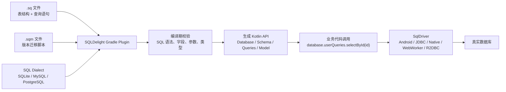
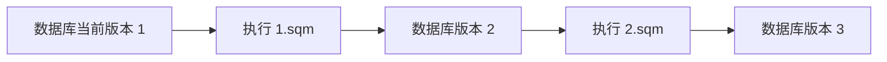
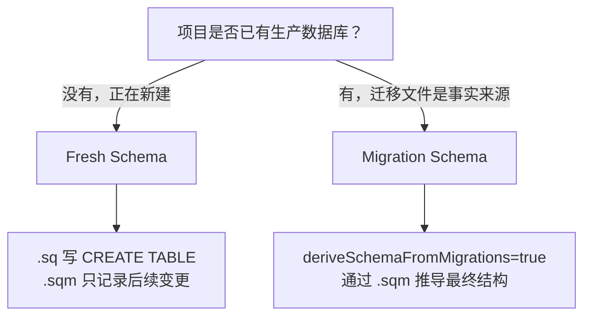
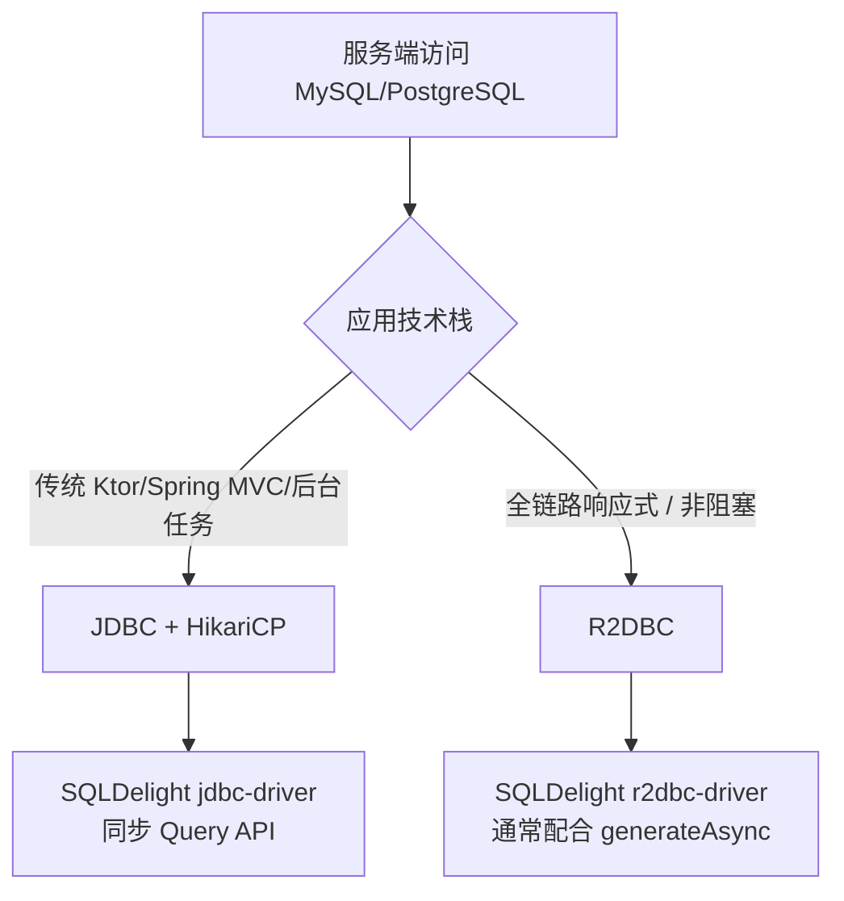
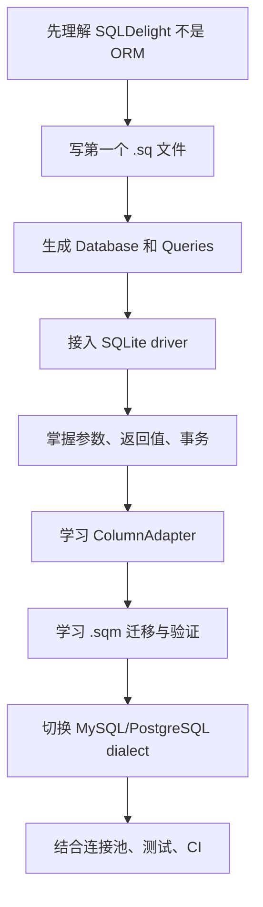

# SQLDelight

> 更新时间：2026-04-29  
> 参考版本：SQLDelight `2.3.2`  
> 核心关注：SQLite、MySQL、PostgreSQL 三类数据库的配置、驱动、SQL 写法、类型映射、迁移与实战注意点。

## 1. SQLDelight 是什么

SQLDelight 是一个 **SQL-first 的 Kotlin 类型安全代码生成工具**。

它不是 ORM，也不是像 Exposed 那样用 Kotlin DSL 拼 SQL。SQLDelight 的工作方式是：

1. 开发者直接写真实 SQL：建表、索引、查询、插入、更新、删除、迁移。
2. Gradle 插件在编译期解析 `.sq` 与 `.sqm` 文件。
3. SQLDelight 根据 SQL 方言生成 Kotlin API。
4. 业务代码通过生成的 `Queries` 对象调用类型安全方法。
5. 运行时由具体平台驱动负责连接数据库。

### 1.1 SQLDelight 解决的问题

| 问题 | SQLDelight 的做法 |
|---|---|
| SQL 字符串运行时才报错 | 编译期解析 SQL，提前暴露语法、字段、类型错误 |
| 查询参数容易写错 | 根据 SQL 参数生成 Kotlin 函数参数 |
| 返回结果类型不稳定 | 根据 `SELECT` 投影生成 data class 或基础类型 |
| 多平台 SQLite 访问割裂 | Android、JVM、Native、JS 使用同一套 `.sq`，换不同 driver |
| 数据库迁移不可验证 | `.sqm` 迁移可参与 Gradle 校验 |
| SQL 与业务类型不一致 | `ColumnAdapter` 负责数据库类型与领域类型互转 |

### 1.2 SQLDelight 不适合什么

- 不适合完全不想写 SQL 的项目。
- 不负责自动建模对象关系，不会像 ORM 那样维护实体生命周期。
- 不负责替你设计数据库 schema、索引和事务边界。
- 服务端 MySQL/PostgreSQL 项目中，迁移通常仍会和 Flyway、Liquibase、数据库发布流程配合使用。

## 2. 核心工作流



SQLDelight 的心智模型可以拆成两层：

- **编译期层**：`.sq`、`.sqm`、dialect、Gradle 插件、生成代码。
- **运行时层**：`SqlDriver`、生成的 `Database`、各个 `Queries`、真实数据库连接。

最重要的一点：**SQLDelight 生成的是调用 SQL 的 Kotlin API，不是数据库本身。**  
因此同一套 `.sq` 文件可以用不同 driver 运行在不同平台，但 SQL 方言必须和真实数据库匹配。

## 3. 支持范围速查

| 数据库 | 主要平台 | 主要方言依赖 | 常用运行时 driver |
|---|---|---|---|
| SQLite | Android、JVM、Native、JS、Multiplatform | 默认 SQLite，或 `sqlite-3-xx-dialect` | `android-driver`、`sqlite-driver`、`native-driver`、`web-worker-driver` |
| MySQL | JVM | `mysql-dialect` | `jdbc-driver`、`r2dbc-driver` |
| PostgreSQL | JVM，部分 Native 场景 | `postgresql-dialect` | `jdbc-driver`、`r2dbc-driver` |

实践中：

- 移动端、本地缓存、KMP 项目优先用 SQLite。
- JVM 服务端连接 MySQL/PostgreSQL 时，SQLDelight 更像「类型安全 SQL 访问层」。
- JDBC 是最常见、最稳妥的服务端接入方式。
- R2DBC 适合需要异步数据库驱动的响应式栈，通常需要 `generateAsync.set(true)` 配合。

## 4. 目录结构

### 4.1 单平台 JVM / Android 常见结构

```text
src/main/sqldelight/
└── com/example/db/
    ├── User.sq
    ├── Article.sq
    └── migrations/
        ├── 1.sqm
        └── 2.sqm
```

### 4.2 Kotlin Multiplatform 常见结构

```text
src/commonMain/sqldelight/
└── com/example/db/
    ├── User.sq
    ├── Article.sq
    └── migrations/
        ├── 1.sqm
        └── 2.sqm
```

### 4.3 文件职责

| 文件 | 作用 |
|---|---|
| `.sq` | 描述最新 schema，包含建表、索引、初始化数据、运行时查询 |
| `.sqm` | 描述从旧版本迁移到新版本的 SQL |
| `1.sqm` | 从 schema version 1 升级到 2 |
| `2.sqm` | 从 schema version 2 升级到 3 |
| `.db` schema 文件 | 用于迁移验证，证明迁移后的结构等于最新 schema |

注意：`.sq` 永远描述「空数据库如何创建最新结构」；`.sqm` 描述「已有旧数据库如何升级」。

## 5. Gradle 基础配置

### 5.1 通用 Kotlin DSL

```kotlin
plugins {
    kotlin("jvm") version "2.0.0"
    id("app.cash.sqldelight") version "2.3.2"
}

repositories {
    google()
    mavenCentral()
}

sqldelight {
    databases {
        register("AppDatabase") {
            // 生成 AppDatabase 类所在的 Kotlin package。
            packageName.set("com.example.db")

            // 默认查找 src/main/sqldelight。
            // 如果项目有自定义目录，显式指定更清晰。
            srcDirs.setFrom("src/main/sqldelight")
        }
    }
}
```

`register("AppDatabase")` 中的 `AppDatabase` 会成为生成的数据库类名：

```kotlin
val database = AppDatabase(driver)
val userQueries = database.userQueries
```

### 5.2 常用 Gradle 参数

| 参数 | 作用 | 建议 |
|---|---|---|
| `packageName` | 生成代码的包名 | 必填，建议放在 `db` 或 `database` 包 |
| `srcDirs` | `.sq` / `.sqm` 文件目录 | 单平台默认可不配，复杂项目建议显式配置 |
| `dialect` | 指定 SQL 方言 | MySQL/PostgreSQL 必配；SQLite 可按版本选配 |
| `schemaOutputDirectory` | 输出 `.db` schema 文件 | 需要迁移验证时配置 |
| `verifyMigrations` | 编译时验证迁移语法 | 建议打开 |
| `deriveSchemaFromMigrations` | 用 `.sqm` 推导 schema | 适合已有生产库或迁移为唯一事实来源 |
| `generateAsync` | 生成挂起函数，配合异步 driver | JS WebWorker、R2DBC 场景考虑打开 |
| `expandSelectStar` | 将 `SELECT *` 展开为具体列 | 默认 true，利于生成代码稳定 |

示例：

```kotlin
sqldelight {
    databases {
        register("AppDatabase") {
            packageName.set("com.example.db")
            srcDirs.setFrom("src/main/sqldelight")

            // 生成 schema 快照，用于迁移验证。
            schemaOutputDirectory.set(file("src/main/sqldelight/databases"))

            // 让 Gradle check 阶段检查迁移文件。
            verifyMigrations.set(true)

            // 默认 true。保持开启可以减少 SELECT * 带来的生成类型漂移。
            expandSelectStar.set(true)
        }
    }
}
```

## 6. `.sq` 文件写法

### 6.1 建表与查询放在同一个 `.sq`

```sql
-- src/main/sqldelight/com/example/db/User.sq

CREATE TABLE user (
    id INTEGER NOT NULL PRIMARY KEY,
    name TEXT NOT NULL,
    email TEXT NOT NULL UNIQUE,
    created_at INTEGER NOT NULL
);

CREATE INDEX user_email_index ON user(email);

-- 标签 selectAll 会生成 userQueries.selectAll()。
selectAll:
SELECT id, name, email, created_at
FROM user
ORDER BY created_at DESC;

-- SQLDelight 会根据 WHERE id = ? 推断参数类型。
selectById:
SELECT id, name, email, created_at
FROM user
WHERE id = ?;

-- 命名参数可读性更好，生成的 Kotlin 参数名就是 name。
selectByName:
SELECT id, name, email, created_at
FROM user
WHERE name LIKE '%' || :name || '%';

insertUser:
INSERT INTO user(id, name, email, created_at)
VALUES (:id, :name, :email, :createdAt);

updateEmail:
UPDATE user
SET email = :email
WHERE id = :id;

deleteById:
DELETE FROM user
WHERE id = ?;
```

生成后使用：

```kotlin
fun createUser(database: AppDatabase) {
    val userQueries = database.userQueries

    // 参数名来自 .sq 中的命名参数，编译期检查类型。
    userQueries.insertUser(
        id = 1L,
        name = "Alice",
        email = "alice@example.com",
        createdAt = System.currentTimeMillis(),
    )

    // 查询返回 Query<User>，需要显式执行。
    val user = userQueries.selectById(1L).executeAsOne()
}
```

### 6.2 Query 执行方法

| 方法 | 含义 | 适用场景 |
|---|---|---|
| `executeAsOne()` | 必须返回一行，否则抛异常 | 根据主键查询 |
| `executeAsOneOrNull()` | 返回 0 或 1 行 | 可为空查询 |
| `executeAsList()` | 返回列表 | 列表页、批量读取 |
| `execute()` | 执行无返回语句 | 插入、更新、删除 |

示例：

```kotlin
val oneUser = userQueries.selectById(1L).executeAsOne()
val maybeUser = userQueries.selectById(404L).executeAsOneOrNull()
val allUsers = userQueries.selectAll().executeAsList()
```

### 6.3 参数写法

#### 位置参数

```sql
selectByEmail:
SELECT *
FROM user
WHERE email = ?;
```

#### 命名参数

```sql
selectByEmail:
SELECT *
FROM user
WHERE email = :email;
```

命名参数更适合复杂 SQL，因为 Kotlin 调用处不容易传错顺序。

#### 集合参数

```sql
selectByIds:
SELECT *
FROM user
WHERE id IN ?;
```

```kotlin
// SQLDelight 会把集合参数展开为底层 driver 支持的占位符形式。
val users = userQueries.selectByIds(listOf(1L, 2L, 3L)).executeAsList()
```

#### 使用整行数据插入

```sql
insertUserObject:
INSERT INTO user
VALUES ?;
```

```kotlin
val user = User(
    id = 1L,
    name = "Alice",
    email = "alice@example.com",
    created_at = System.currentTimeMillis(),
)

// 适合字段稳定的小表；字段经常变化时建议显式列名。
userQueries.insertUserObject(user)
```

建议：生产代码中优先写显式列名，避免表字段顺序变化带来误读。

## 7. 查询结果与投影

### 7.1 默认生成 data class

```sql
selectAll:
SELECT id, name, email, created_at
FROM user;
```

如果查询投影正好对应表结构，通常返回生成的 `User` data class。

如果是自定义投影：

```sql
selectUserBrief:
SELECT id, name
FROM user
ORDER BY name ASC;
```

SQLDelight 会为该查询生成独立的结果类型，例如 `SelectUserBrief`。

### 7.2 使用 mapper 改造结果

```kotlin
val names: List<String> =
    userQueries.selectUserBrief { id, name ->
        // mapper 的参数来自 SQL SELECT 投影顺序。
        "$id - $name"
    }.executeAsList()
```

建议优先在 SQL 中表达投影、排序、聚合逻辑；mapper 只做轻量转换。

## 8. 事务

```kotlin
fun importUsers(database: AppDatabase, users: List<User>) {
    database.userQueries.transaction {
        users.forEach { user ->
            database.userQueries.insertUserObject(user)
        }
    }
}
```

带返回值：

```kotlin
fun replaceUsers(database: AppDatabase, users: List<User>): Int {
    return database.userQueries.transactionWithResult {
        database.userQueries.deleteAll()

        users.forEach { user ->
            database.userQueries.insertUserObject(user)
        }

        // transactionWithResult 的最后表达式就是返回值。
        users.size
    }
}
```

手动回滚：

```kotlin
fun importValidUsers(database: AppDatabase, users: List<User>): Int {
    return database.userQueries.transactionWithResult {
        users.forEach { user ->
            if (user.email.isBlank()) {
                // 指定返回值并终止事务，已执行语句会回滚。
                rollback(0)
            }

            database.userQueries.insertUserObject(user)
        }

        users.size
    }
}
```

事务回调：

```kotlin
database.userQueries.transaction {
    afterCommit {
        // 事务提交后再做日志、缓存刷新、事件通知。
        logger.info("users imported")
    }

    afterRollback {
        // 事务失败后做补偿或观测记录。
        logger.warn("users import rolled back")
    }

    database.userQueries.insertUserObject(user)
}
```

## 9. Flow 与响应式查询

依赖：

```kotlin
dependencies {
    implementation("app.cash.sqldelight:coroutines-extensions:2.3.2")
}
```

使用：

```kotlin
val usersFlow: Flow<List<User>> =
    database.userQueries.selectAll()
        .asFlow()
        // mapToList 需要指定 dispatcher，避免在主线程做数据库读取。
        .mapToList(Dispatchers.IO)
```

当 SQLDelight 观察到影响该查询结果的表发生变更时，Flow 会重新发射查询结果。

常见实践：

- Android / Compose 中将 Flow 暴露给 ViewModel。
- 服务端不一定需要 Flow，普通同步查询更直接。
- 高频写入场景要注意 Flow 重查次数，必要时用 debounce、distinctUntilChanged 或更细粒度查询。

## 10. ColumnAdapter：数据库类型与领域类型互转

SQLDelight 允许在 SQL 中声明 Kotlin 暴露类型：

```sql
import kotlin.collections.List;

CREATE TABLE article (
    id INTEGER NOT NULL PRIMARY KEY,
    title TEXT NOT NULL,

    -- 数据库存 TEXT，Kotlin 层暴露为 List<String>。
    tags TEXT AS List<String> NOT NULL
);
```

Kotlin adapter：

```kotlin
val tagsAdapter = object : ColumnAdapter<List<String>, String> {
    override fun decode(databaseValue: String): List<String> {
        // 读取数据库 TEXT，转换成业务层 List<String>。
        if (databaseValue.isBlank()) return emptyList()
        return databaseValue.split(",")
    }

    override fun encode(value: List<String>): String {
        // 写入数据库前，把业务层 List<String> 转成 TEXT。
        return value.joinToString(separator = ",")
    }
}

val database = AppDatabase(
    driver = driver,
    articleAdapter = Article.Adapter(
        tagsAdapter = tagsAdapter,
    ),
)
```

枚举适配：

```sql
import com.example.ArticleStatus;

CREATE TABLE article (
    id INTEGER NOT NULL PRIMARY KEY,
    status TEXT AS ArticleStatus NOT NULL
);
```

```kotlin
val database = AppDatabase(
    driver = driver,
    articleAdapter = Article.Adapter(
        // EnumColumnAdapter 会用 enum.name 存储，读取时再转回 enum。
        statusAdapter = EnumColumnAdapter(),
    ),
)
```

建议：

- JSON、枚举、时间、金额、ID value class 都适合用 adapter。
- adapter 的数据库侧类型要和 SQL 列真实类型一致。
- adapter 不应做网络请求或复杂 IO，只做纯转换。

## 11. 迁移

### 11.1 迁移版本规则

假设当前 schema 版本是 1，要升级到 2，就写：

```text
src/main/sqldelight/com/example/db/migrations/1.sqm
```

内容：

```sql
ALTER TABLE user ADD COLUMN avatar_url TEXT;
```

如果再升级到 3：

```text
src/main/sqldelight/com/example/db/migrations/2.sqm
```

内容：

```sql
CREATE TABLE article (
    id INTEGER NOT NULL PRIMARY KEY,
    title TEXT NOT NULL,
    author_id INTEGER NOT NULL,
    FOREIGN KEY(author_id) REFERENCES user(id)
);
```

执行链路：



### 11.2 迁移验证配置

```kotlin
sqldelight {
    databases {
        register("AppDatabase") {
            packageName.set("com.example.db")

            // 保存 schema 快照，迁移验证依赖这里的 .db 文件。
            schemaOutputDirectory.set(file("src/main/sqldelight/databases"))

            // 编译/检查阶段验证 .sqm。
            verifyMigrations.set(true)
        }
    }
}
```

常见任务：

```bash
# 生成当前 schema 快照，任务名与 source set 和数据库名有关。
./gradlew generateMainAppDatabaseSchema

# 执行包含迁移验证在内的检查。
./gradlew check
```

### 11.3 Fresh Schema vs Migration Schema



Fresh Schema：

- `.sq` 里写最新完整建表语句。
- 新数据库直接执行 `.sq` 生成最新结构。
- 后续版本变更再补 `.sqm`。

Migration Schema：

- 用 `.sqm` 作为 schema 来源。
- 适合已有生产数据库，或者团队要求所有结构变化必须走迁移。
- 配置 `deriveSchemaFromMigrations.set(true)`。

示例：

```kotlin
sqldelight {
    databases {
        register("AppDatabase") {
            packageName.set("com.example.db")

            // 从迁移文件推导 schema，不再只依赖 .sq 建表。
            deriveSchemaFromMigrations.set(true)
        }
    }
}
```

### 11.4 迁移注意事项

- 不要在 `.sqm` 中手写 `BEGIN TRANSACTION` / `COMMIT`，driver 支持时 SQLDelight 会处理事务。
- 迁移要幂等地按版本推进，不要修改已经发布的旧迁移文件。
- SQLite 修改列、删除列受版本影响，复杂变更经常需要「建新表 -> 迁移数据 -> 删除旧表 -> 重命名」。
- MySQL/PostgreSQL 服务端项目中，建议迁移文件和数据库发布工具保持一致。
- 数据迁移需要 Kotlin 逻辑时，可使用 `AfterVersion` 回调。

示例：

```kotlin
val driver = JdbcSqliteDriver(
    url = "jdbc:sqlite:app.db",
    properties = Properties(),
    schema = AppDatabase.Schema,
    callbacks = arrayOf(
        AfterVersion(3) { driver ->
            // 在 3.sqm 执行后补一段数据迁移逻辑。
            driver.execute(
                identifier = null,
                sql = "UPDATE user SET avatar_url = '' WHERE avatar_url IS NULL",
                parameters = 0,
            )
        },
    ),
)
```

## 12. SQLite

SQLite 是 SQLDelight 最常见的使用场景，覆盖 Android、JVM、Native、JS 与 KMP。

### 12.1 SQLite Gradle：单平台

```kotlin
plugins {
    id("app.cash.sqldelight") version "2.3.2"
}

repositories {
    google()
    mavenCentral()
}

sqldelight {
    databases {
        register("AppDatabase") {
            packageName.set("com.example.db")

            // 可选：显式指定 SQLite 方言版本。
            // Android 项目通常会根据 minSdk 自动选择 SQLite 版本。
            dialect("app.cash.sqldelight:sqlite-3-38-dialect:2.3.2")
        }
    }
}
```

### 12.2 SQLite Android

依赖：

```kotlin
dependencies {
    implementation("app.cash.sqldelight:android-driver:2.3.2")
}
```

创建 driver：

```kotlin
fun createAndroidDatabase(context: Context): AppDatabase {
    val driver = AndroidSqliteDriver(
        schema = AppDatabase.Schema,
        context = context,
        name = "app.db",
    )

    return AppDatabase(driver)
}
```

开启外键：

```kotlin
fun createAndroidDatabase(context: Context): AppDatabase {
    val driver = AndroidSqliteDriver(
        schema = AppDatabase.Schema,
        context = context,
        name = "app.db",
        callback = object : AndroidSqliteDriver.Callback(AppDatabase.Schema) {
            override fun onOpen(db: SupportSQLiteDatabase) {
                // SQLite 默认可能未开启外键约束，打开后 FOREIGN KEY 才会真正生效。
                db.setForeignKeyConstraintsEnabled(true)
            }
        },
    )

    return AppDatabase(driver)
}
```

### 12.3 SQLite JVM

依赖：

```kotlin
dependencies {
    implementation("app.cash.sqldelight:sqlite-driver:2.3.2")
}
```

文件数据库：

```kotlin
fun createJvmDatabase(): AppDatabase {
    val driver = JdbcSqliteDriver(
        url = "jdbc:sqlite:app.db",
        properties = Properties(),
        schema = AppDatabase.Schema,
    )

    return AppDatabase(driver)
}
```

内存数据库：

```kotlin
fun createInMemoryDatabase(): AppDatabase {
    val driver = JdbcSqliteDriver(
        url = JdbcSqliteDriver.IN_MEMORY,
        properties = Properties(),
        schema = AppDatabase.Schema,
    )

    return AppDatabase(driver)
}
```

开启外键：

```kotlin
val driver = JdbcSqliteDriver(
    url = "jdbc:sqlite:app.db",
    properties = Properties().apply {
        // SQLite JDBC driver 通过属性开启外键约束。
        put("foreign_keys", "true")
    },
    schema = AppDatabase.Schema,
)
```

### 12.4 SQLite Native

依赖：

```kotlin
kotlin {
    sourceSets.nativeMain.dependencies {
        implementation("app.cash.sqldelight:native-driver:2.3.2")
    }
}
```

创建 driver：

```kotlin
fun createNativeDatabase(): AppDatabase {
    val driver = NativeSqliteDriver(
        schema = AppDatabase.Schema,
        name = "app.db",
    )

    return AppDatabase(driver)
}
```

注意：

- SQLDelight 2.x Native driver 只支持 Kotlin/Native 新内存管理器。
- iOS/macOS 等平台如果静态链接 framework，可能需要在 Xcode 链接参数中加入 SQLite。
- Native SQLite 适合 KMP 本地数据库，不适合直接替代服务端数据库。

### 12.5 SQLite JS

JS 场景使用异步 Web Worker driver，因此需要 `generateAsync`：

```kotlin
sqldelight {
    databases {
        register("AppDatabase") {
            packageName.set("com.example.db")

            // JS Web Worker driver 是异步 driver，需要生成 suspend 查询 API。
            generateAsync.set(true)
        }
    }
}
```

依赖：

```kotlin
kotlin {
    sourceSets.jsMain.dependencies {
        implementation("app.cash.sqldelight:web-worker-driver:2.3.2")
        implementation(devNpm("copy-webpack-plugin", "9.1.0"))
        implementation(npm("@cashapp/sqldelight-sqljs-worker", "2.3.2"))
        implementation(npm("sql.js", "1.8.0"))
    }
}
```

创建 driver：

```kotlin
val driver = WebWorkerDriver(
    Worker(
        js("""new URL("@cashapp/sqldelight-sqljs-worker/sqljs.worker.js", import.meta.url)""")
    )
)

val database = AppDatabase(driver)
```

注意：

- SQL.js 依赖 WebAssembly 文件，需要通过 Webpack 配置复制 `sql-wasm.wasm`。
- Web Worker driver 主要面向浏览器目标。
- JS 侧查询 API 通常是 `suspend`，调用处要在协程中执行。

### 12.6 SQLite Multiplatform

共同 SQL 放在：

```text
src/commonMain/sqldelight/com/example/db/
```

Gradle：

```kotlin
plugins {
    kotlin("multiplatform")
    id("app.cash.sqldelight") version "2.3.2"
}

sqldelight {
    databases {
        register("AppDatabase") {
            packageName.set("com.example.db")
        }
    }
}

kotlin {
    androidTarget()
    jvm()
    iosArm64()
    iosSimulatorArm64()

    sourceSets {
        androidMain.dependencies {
            implementation("app.cash.sqldelight:android-driver:2.3.2")
        }

        jvmMain.dependencies {
            implementation("app.cash.sqldelight:sqlite-driver:2.3.2")
        }

        commonMain.dependencies {
            implementation("app.cash.sqldelight:coroutines-extensions:2.3.2")
        }

        // 实际项目可把 iosArm64Main、iosSimulatorArm64Main 合并到 iosMain。
        iosMain.dependencies {
            implementation("app.cash.sqldelight:native-driver:2.3.2")
        }
    }
}
```

`commonMain` 定义抽象工厂：

```kotlin
expect class DriverFactory {
    fun createDriver(): SqlDriver
}

fun createDatabase(driverFactory: DriverFactory): AppDatabase {
    // commonMain 只依赖 SqlDriver，不关心具体平台 driver。
    return AppDatabase(driverFactory.createDriver())
}
```

Android actual：

```kotlin
actual class DriverFactory(
    private val context: Context,
) {
    actual fun createDriver(): SqlDriver {
        return AndroidSqliteDriver(
            schema = AppDatabase.Schema,
            context = context,
            name = "app.db",
        )
    }
}
```

iOS actual：

```kotlin
actual class DriverFactory {
    actual fun createDriver(): SqlDriver {
        return NativeSqliteDriver(
            schema = AppDatabase.Schema,
            name = "app.db",
        )
    }
}
```

JVM actual：

```kotlin
actual class DriverFactory {
    actual fun createDriver(): SqlDriver {
        return JdbcSqliteDriver(
            url = "jdbc:sqlite:app.db",
            properties = Properties(),
            schema = AppDatabase.Schema,
        )
    }
}
```

### 12.7 SQLite 类型映射

| SQLite 类型 | Kotlin 默认类型 | 说明 |
|---|---|---|
| `INTEGER` | `Long` | SQLite 整型统一倾向 Long |
| `REAL` | `Double` | 浮点数 |
| `TEXT` | `String` | 字符串、JSON、枚举常用 TEXT 存储 |
| `BLOB` | `ByteArray` | 二进制数据 |

如果希望 SQLite 的 `INTEGER` 在 Kotlin 暴露为 `Int`、`Short`，可以使用 primitive adapters：

```kotlin
dependencies {
    implementation("app.cash.sqldelight:primitive-adapters:2.3.2")
}
```

示例：

```sql
CREATE TABLE counter (
    id INTEGER NOT NULL PRIMARY KEY,

    -- 数据库存 INTEGER，但 Kotlin 层通过 adapter 暴露 Int。
    value INTEGER AS kotlin.Int NOT NULL
);
```

```kotlin
val database = AppDatabase(
    driver = driver,
    counterAdapter = Counter.Adapter(
        valueAdapter = IntColumnAdapter,
    ),
)
```

### 12.8 SQLite 常见坑

- SQLite 外键需要显式开启，否则 `FOREIGN KEY` 可能只停留在 schema 层。
- Android 上 SQLite 版本跟 `minSdk` 有关，不同版本支持的 SQL 特性不同。
- `ALTER TABLE` 能力受 SQLite 版本影响，复杂迁移要保守。
- SQLite 没有真正的布尔类型，通常用 `INTEGER` 或 adapter 表达。
- KMP 多平台共用 `.sq` 时，不要使用某个平台 SQLite 版本不支持的语法。

## 13. MySQL

MySQL 在 SQLDelight 中主要是 JVM 场景。配置重点是：

1. Gradle 中指定 `mysql-dialect`。
2. 运行时用 JDBC 或 R2DBC driver 连接真实 MySQL。
3. 生产项目通常使用连接池，例如 HikariCP。

### 13.1 MySQL Gradle 配置

```kotlin
plugins {
    kotlin("jvm") version "2.0.0"
    id("app.cash.sqldelight") version "2.3.2"
}

repositories {
    mavenCentral()
    google()
}

sqldelight {
    databases {
        register("AppDatabase") {
            packageName.set("com.example.db")

            // MySQL 必须指定 MySQL dialect，否则默认会按 SQLite 解析。
            dialect("app.cash.sqldelight:mysql-dialect:2.3.2")

            srcDirs.setFrom("src/main/sqldelight")
            schemaOutputDirectory.set(file("src/main/sqldelight/databases"))
            verifyMigrations.set(true)
        }
    }
}

dependencies {
    implementation("app.cash.sqldelight:jdbc-driver:2.3.2")

    // MySQL 官方 JDBC driver。具体版本建议放在 version catalog 或平台 BOM 中统一锁定。
    runtimeOnly(libs.mysql.connector.j)

    // 生产服务端通常通过连接池提供 DataSource。
    implementation(libs.hikariCP)
}
```

如果项目没有使用 version catalog，可把 `libs.mysql.connector.j` 替换成 `com.mysql:mysql-connector-j:<项目锁定版本>`，把 `libs.hikariCP` 替换成 `com.zaxxer:HikariCP:<项目锁定版本>`。

### 13.2 MySQL 连接

```kotlin
fun createMysqlDatabase(): AppDatabase {
    val hikariConfig = HikariConfig().apply {
        jdbcUrl = "jdbc:mysql://localhost:3306/app_db"
        username = "app_user"
        password = "secret"

        // MySQL 服务端项目必须控制连接池规模，避免压垮数据库。
        maximumPoolSize = 10

        // 根据业务设置连接超时，避免请求无限等待。
        connectionTimeout = 3_000
    }

    val dataSource = HikariDataSource(hikariConfig)

    // asJdbcDriver 来自 SQLDelight jdbc-driver。
    val driver: SqlDriver = dataSource.asJdbcDriver()

    return AppDatabase(driver)
}
```

如果需要由 SQLDelight 创建 schema：

```kotlin
fun createMysqlSchema(driver: SqlDriver) {
    // 服务端生产环境通常不在应用启动时自动建表。
    // 本地测试或临时环境可以显式调用。
    AppDatabase.Schema.create(driver)
}
```

### 13.3 MySQL `.sq` 示例

```sql
-- src/main/sqldelight/com/example/db/MysqlUser.sq

CREATE TABLE mysql_user (
    id BIGINT NOT NULL AUTO_INCREMENT PRIMARY KEY,
    email VARCHAR(255) NOT NULL UNIQUE,
    nickname VARCHAR(64) NOT NULL,
    status VARCHAR(32) NOT NULL,
    created_at TIMESTAMP NOT NULL DEFAULT CURRENT_TIMESTAMP
);

CREATE INDEX mysql_user_status_index ON mysql_user(status);

selectById:
SELECT id, email, nickname, status, created_at
FROM mysql_user
WHERE id = :id;

selectByStatus:
SELECT id, email, nickname, status, created_at
FROM mysql_user
WHERE status = :status
ORDER BY created_at DESC
LIMIT :limit OFFSET :offset;

insertUser:
INSERT INTO mysql_user(email, nickname, status)
VALUES (:email, :nickname, :status);

updateStatus:
UPDATE mysql_user
SET status = :status
WHERE id = :id;
```

使用：

```kotlin
fun findActiveUsers(database: AppDatabase): List<Mysql_user> {
    return database.mysqlUserQueries
        .selectByStatus(
            status = "ACTIVE",
            limit = 20,
            offset = 0,
        )
        .executeAsList()
}
```

### 13.4 MySQL 类型映射

| MySQL 类型 | Kotlin 默认类型 |
|---|---|
| `BIT` | `Boolean` |
| `TINYINT` | `Byte` |
| `SMALLINT` | `Short` |
| `MEDIUMINT` / `INTEGER` / `INT` | `Int` |
| `BIGINT` | `Long` |
| `DECIMAL` / `DEC` / `FIXED` | `Double` |
| `NUMERIC` | `BigDecimal` |
| `FLOAT` / `REAL` / `DOUBLE` | `Double` |
| `DATE` | `LocalDate` |
| `TIME` | `LocalTime` |
| `DATETIME` | `LocalDateTime` |
| `TIMESTAMP` | `OffsetDateTime` |
| `CHAR` / `VARCHAR` / `TEXT` 系列 | `String` |
| `ENUM` / `SET` | `String` |
| `BINARY` / `VARBINARY` / `BLOB` | `ByteArray` |
| `JSON` | `String` |
| `BOOLEAN` | `Boolean` |

建议：

- 金额不要盲目用 `Double`，优先使用 `DECIMAL AS BigDecimal` 或直接让 `NUMERIC` 映射为 `BigDecimal`。
- `JSON` 默认是 `String`，业务层可用 `ColumnAdapter` 映射为对象。
- `ENUM` 默认是 `String`，业务层可配 `EnumColumnAdapter`。
- 时间类型要统一时区策略，特别是 `TIMESTAMP` 与 `DATETIME` 的语义差异。

### 13.5 MySQL 自定义类型

```sql
import com.example.UserStatus;

CREATE TABLE mysql_account (
    id BIGINT NOT NULL AUTO_INCREMENT PRIMARY KEY,

    -- MySQL 存 VARCHAR，Kotlin 层暴露 UserStatus。
    status VARCHAR(32) AS UserStatus NOT NULL
);
```

```kotlin
val database = AppDatabase(
    driver = driver,
    mysqlAccountAdapter = Mysql_account.Adapter(
        // 数据库存 enum.name，读取时恢复成 enum。
        statusAdapter = EnumColumnAdapter(),
    ),
)
```

### 13.6 MySQL 迁移建议

服务端 MySQL 项目建议将迁移分成两类：

- **结构迁移**：用 Flyway/Liquibase/DBA 发布流程控制。
- **SQLDelight 迁移验证**：保留 `.sqm`，让 SQLDelight 在编译期理解 schema 演进。

如果让 `.sqm` 同时给 Flyway 使用，需要注意文件命名与 SQLDelight 命名规则不同，通常要通过构建脚本复制或生成目标格式。

典型 `.sqm`：

```sql
-- src/main/sqldelight/com/example/db/migrations/1.sqm

ALTER TABLE mysql_user
    ADD COLUMN last_login_at TIMESTAMP NULL;

CREATE INDEX mysql_user_last_login_index
    ON mysql_user(last_login_at);
```

### 13.7 MySQL 常见坑

- 忘记配置 `mysql-dialect` 会导致 MySQL 语法按 SQLite 解析。
- `AUTO_INCREMENT`、反引号、`ON DUPLICATE KEY UPDATE` 等语法是 MySQL 特有的，不能和 SQLite 共用同一套 SQL。
- MySQL 的 `BOOLEAN` 本质与存储实现有关，迁移到其他数据库时要谨慎。
- 分页用 `LIMIT/OFFSET` 简单但大偏移性能差，服务端大表优先用 keyset pagination。
- 生产服务端不要每个请求创建新 `DataSource` 或新连接池。

## 14. PostgreSQL

PostgreSQL 在 SQLDelight 中也是以 JVM 服务端为主。配置重点：

1. Gradle 中指定 `postgresql-dialect`。
2. 运行时用 JDBC 或 R2DBC driver。
3. 可以使用 PostgreSQL 特有类型，例如 `UUID`、`JSONB`、`TIMESTAMPTZ`。

### 14.1 PostgreSQL Gradle 配置

```kotlin
plugins {
    kotlin("jvm") version "2.0.0"
    id("app.cash.sqldelight") version "2.3.2"
}

repositories {
    mavenCentral()
    google()
}

sqldelight {
    databases {
        register("AppDatabase") {
            packageName.set("com.example.db")

            // PostgreSQL 项目必须指定 PostgreSQL dialect。
            dialect("app.cash.sqldelight:postgresql-dialect:2.3.2")

            srcDirs.setFrom("src/main/sqldelight")
            schemaOutputDirectory.set(file("src/main/sqldelight/databases"))
            verifyMigrations.set(true)
        }
    }
}

dependencies {
    implementation("app.cash.sqldelight:jdbc-driver:2.3.2")

    // PostgreSQL JDBC driver 与 HikariCP 版本建议由项目统一管理。
    runtimeOnly(libs.postgresql.jdbc)
    implementation(libs.hikariCP)
}
```

如果项目没有使用 version catalog，可把 `libs.postgresql.jdbc` 替换成 `org.postgresql:postgresql:<项目锁定版本>`。

### 14.2 PostgreSQL 连接

```kotlin
fun createPostgresDatabase(): AppDatabase {
    val hikariConfig = HikariConfig().apply {
        jdbcUrl = "jdbc:postgresql://localhost:5432/app_db"
        username = "app_user"
        password = "secret"

        // PostgreSQL 连接较重，连接池大小要结合数据库 max_connections 设置。
        maximumPoolSize = 10
        connectionTimeout = 3_000
    }

    val dataSource = HikariDataSource(hikariConfig)
    val driver = dataSource.asJdbcDriver()

    return AppDatabase(driver)
}
```

### 14.3 PostgreSQL `.sq` 示例

```sql
-- src/main/sqldelight/com/example/db/PostgresArticle.sq

CREATE TABLE postgres_article (
    id UUID NOT NULL PRIMARY KEY,
    author_id UUID NOT NULL,
    title TEXT NOT NULL,
    body TEXT NOT NULL,
    tags JSONB NOT NULL,
    published_at TIMESTAMPTZ,
    created_at TIMESTAMPTZ NOT NULL DEFAULT now()
);

CREATE INDEX postgres_article_author_index
    ON postgres_article(author_id);

selectById:
SELECT id, author_id, title, body, tags, published_at, created_at
FROM postgres_article
WHERE id = :id;

selectPublished:
SELECT id, author_id, title, body, tags, published_at, created_at
FROM postgres_article
WHERE published_at IS NOT NULL
ORDER BY published_at DESC
LIMIT :limit OFFSET :offset;

insertArticle:
INSERT INTO postgres_article(
    id,
    author_id,
    title,
    body,
    tags,
    published_at
)
VALUES (
    :id,
    :authorId,
    :title,
    :body,
    :tags,
    :publishedAt
);

publish:
UPDATE postgres_article
SET published_at = now()
WHERE id = :id;
```

使用：

```kotlin
fun insertArticle(database: AppDatabase, article: NewArticle) {
    database.postgresArticleQueries.insertArticle(
        id = article.id,
        authorId = article.authorId,
        title = article.title,
        body = article.body,
        tags = article.tagsJson,
        publishedAt = null,
    )
}
```

### 14.4 PostgreSQL 类型映射

| PostgreSQL 类型 | Kotlin 默认类型 |
|---|---|
| `SMALLINT` / `INT2` | `Short` |
| `INTEGER` / `INT` / `INT4` | `Int` |
| `BIGINT` / `INT8` | `Long` |
| `NUMERIC` | `BigDecimal` |
| `DECIMAL` | `Double` |
| `REAL` / `FLOAT4` / `DOUBLE PRECISION` / `FLOAT8` | `Double` |
| `SMALLSERIAL` / `SERIAL2` | `Short` |
| `SERIAL` / `SERIAL4` | `Int` |
| `BIGSERIAL` / `SERIAL8` | `Long` |
| `CHAR` / `VARCHAR` / `TEXT` | `String` |
| `DATE` | `LocalDate` |
| `TIME` | `LocalTime` |
| `TIMESTAMP` | `LocalDateTime` |
| `TIMESTAMPTZ` | `OffsetDateTime` |
| `JSON` / `JSONB` | `String` |
| `INTERVAL` | `String` |
| `UUID` | `UUID` |
| `BOOL` / `BOOLEAN` | `Boolean` |
| `BYTEA` | `ByteArray` |

建议：

- PostgreSQL 的 `UUID` 可以直接映射为 `java.util.UUID`，很适合主键或外部公开 ID。
- `JSONB` 默认是 `String`，可用 adapter 映射到序列化对象。
- `TIMESTAMPTZ` 比 `TIMESTAMP` 更适合跨时区系统。
- 金额、精确计量值优先用 `NUMERIC` / `BigDecimal`。

### 14.5 PostgreSQL 自定义 JSONB 类型

```sql
import com.example.ArticleTags;

CREATE TABLE article_metadata (
    article_id UUID NOT NULL PRIMARY KEY,

    -- 数据库存 JSONB，Kotlin 层暴露 ArticleTags。
    tags JSONB AS ArticleTags NOT NULL
);
```

```kotlin
val tagsAdapter = object : ColumnAdapter<ArticleTags, String> {
    override fun decode(databaseValue: String): ArticleTags {
        // 示例使用 kotlinx.serialization，实际 serializer 按项目定义。
        return json.decodeFromString(ArticleTags.serializer(), databaseValue)
    }

    override fun encode(value: ArticleTags): String {
        // PostgreSQL 仍收到 JSON 字符串，由 JDBC driver 发送给 JSONB 列。
        return json.encodeToString(ArticleTags.serializer(), value)
    }
}

val database = AppDatabase(
    driver = driver,
    articleMetadataAdapter = Article_metadata.Adapter(
        tagsAdapter = tagsAdapter,
    ),
)
```

### 14.6 PostgreSQL 迁移示例

```sql
-- src/main/sqldelight/com/example/db/migrations/1.sqm

ALTER TABLE postgres_article
    ADD COLUMN summary TEXT;

CREATE INDEX postgres_article_created_at_index
    ON postgres_article(created_at DESC);
```

复杂数据迁移建议：

- 纯 SQL 能表达的，放 `.sqm`。
- 需要调用 Kotlin 业务逻辑或序列化转换的，用 `AfterVersion` 或外部迁移工具。
- 生产环境的 DDL 要考虑锁表、索引并发创建、回滚策略。

### 14.7 PostgreSQL 常见坑

- 忘记配置 `postgresql-dialect` 会导致 PostgreSQL 特有语法无法通过编译。
- `JSONB` 默认是 `String`，不是自动解析对象。
- `TIMESTAMP` 与 `TIMESTAMPTZ` 语义不同，跨时区系统优先统一使用 `TIMESTAMPTZ`。
- `SERIAL` 是老式自增写法，新项目也可考虑标准 identity column，但要确认 dialect 支持情况。
- 大表分页优先 keyset pagination，不要长期依赖大 offset。

## 15. JDBC 与 R2DBC 怎么选



JDBC：

- 生态成熟。
- 与 HikariCP、Spring、Ktor 集成直接。
- 调试、监控、性能分析资料多。
- 大多数服务端项目优先选择。

R2DBC：

- 非阻塞数据库访问。
- 更适合响应式服务端栈。
- 需要理解协程、连接生命周期、事务上下文。
- 依赖底层数据库 R2DBC driver 的成熟度。

R2DBC 依赖示例：

```kotlin
dependencies {
    implementation("app.cash.sqldelight:r2dbc-driver:2.3.2")

    // MySQL 或 PostgreSQL 还需要各自的 R2DBC driver。
    // implementation("io.asyncer:r2dbc-mysql:...")
    // implementation("org.postgresql:r2dbc-postgresql:...")
}
```

SQLDelight 异步生成配置：

```kotlin
sqldelight {
    databases {
        register("AppDatabase") {
            packageName.set("com.example.db")
            dialect("app.cash.sqldelight:postgresql-dialect:2.3.2")

            // 为异步 driver 生成 suspend 查询方法。
            generateAsync.set(true)
        }
    }
}
```

## 16. SQLite / MySQL / PostgreSQL 对比

| 维度 | SQLite | MySQL | PostgreSQL |
|---|---|---|---|
| 典型场景 | 本地存储、移动端、桌面、KMP | Web 服务、业务系统、传统关系库 | Web 服务、复杂查询、JSONB、强 SQL 能力 |
| SQLDelight 平台 | Android/JVM/Native/JS/KMP | JVM 为主 | JVM 为主，部分 Native |
| 方言配置 | 可默认，可指定 SQLite 版本 | 必须 `mysql-dialect` | 必须 `postgresql-dialect` |
| Driver | 平台差异大 | JDBC/R2DBC | JDBC/R2DBC |
| 事务 | 本地轻量 | 服务端事务 | 服务端事务 |
| 类型系统 | 动态类型倾向，映射简单 | 类型多，时间语义需注意 | 类型强，UUID/JSONB/TIMESTAMPTZ 友好 |
| 迁移复杂度 | ALTER 能力受版本影响 | DDL 与线上锁表需注意 | DDL 能力强，但也要注意锁和索引创建 |

## 17. 实战建议

### 17.1 SQL 文件拆分

推荐按聚合或表拆：

```text
sqldelight/com/example/db/
├── User.sq
├── Article.sq
├── Comment.sq
└── migrations/
    ├── 1.sqm
    └── 2.sqm
```

每个 `.sq` 文件会生成一个对应的 `Queries` 对象：

| 文件 | 生成对象 |
|---|---|
| `User.sq` | `userQueries` |
| `Article.sq` | `articleQueries` |
| `Comment.sq` | `commentQueries` |

### 17.2 SQL 命名规范

建议：

- 查询用 `selectById`、`selectAll`、`selectByStatus`。
- 插入用 `insertXxx`。
- 更新用 `updateXxx`。
- 删除用 `deleteByXxx`。
- 复杂查询按业务意图命名，如 `selectRecentPublishedArticles`。

不要用：

- `query1`
- `getData`
- `doSelect`
- `test`

### 17.3 避免滥用 `SELECT *`

虽然 SQLDelight 默认会展开 `SELECT *`，但生产 SQL 建议明确列：

```sql
selectBrief:
SELECT id, title, published_at
FROM article
WHERE published_at IS NOT NULL;
```

好处：

- 结果类型稳定。
- 避免新增大字段影响查询性能。
- 业务代码更清楚依赖哪些列。

### 17.4 分页策略

小数据量：

```sql
selectPage:
SELECT id, title, created_at
FROM article
ORDER BY created_at DESC
LIMIT :limit OFFSET :offset;
```

大数据量建议 keyset：

```sql
selectAfter:
SELECT id, title, created_at
FROM article
WHERE created_at < :lastCreatedAt
ORDER BY created_at DESC
LIMIT :limit;
```

说明：

- `OFFSET` 越大，数据库跳过的行越多。
- keyset pagination 依赖稳定排序列，常用 `created_at + id` 组合避免时间重复。

### 17.5 测试建议

SQLite JVM 内存库：

```kotlin
class UserRepositoryTest {
    private lateinit var database: AppDatabase

    @BeforeTest
    fun setUp() {
        val driver = JdbcSqliteDriver(
            url = JdbcSqliteDriver.IN_MEMORY,
            properties = Properties(),
            schema = AppDatabase.Schema,
        )

        database = AppDatabase(driver)
    }

    @Test
    fun insertAndReadUser() {
        database.userQueries.insertUser(
            id = 1L,
            name = "Alice",
            email = "alice@example.com",
            createdAt = 1_700_000_000_000L,
        )

        val user = database.userQueries.selectById(1L).executeAsOne()

        assertEquals("Alice", user.name)
    }
}
```

MySQL/PostgreSQL 服务端测试：

- 单元测试可抽 repository，并用 Testcontainers 起真实数据库。
- 不建议用 SQLite 假装 MySQL/PostgreSQL，因为 SQL 方言、类型、事务语义都有差异。
- 迁移必须进 CI，至少跑 `./gradlew check`。

## 18. 排错清单

| 现象 | 可能原因 | 处理 |
|---|---|---|
| `Database` 类没有生成 | 插件未应用、`.sq` 路径错误、包名错误 | 检查 `sqldelight` 配置与 source set |
| MySQL/PostgreSQL SQL 编译失败 | 未配置对应 dialect | 添加 `mysql-dialect` 或 `postgresql-dialect` |
| Kotlin 参数名奇怪 | SQL 使用位置参数或列名不清晰 | 改用命名参数 `:id` |
| 返回类型不是预期 data class | SELECT 投影与表结构不一致 | 检查列顺序、别名、mapper |
| SQLite 外键不生效 | 没有开启 foreign key | Android/JVM/Native 按 driver 配置开启 |
| 迁移验证未运行 | 未配置 `schemaOutputDirectory` | 配置目录并生成 schema 快照 |
| JS 查询不能同步调用 | Web Worker driver 是异步 | 打开 `generateAsync`，在协程中调用 |
| Flow 不更新 | 不是通过 SQLDelight 查询对象写入，或查询监听表不匹配 | 确认写入路径和查询表依赖 |
| 金额精度异常 | 使用了 `Double` | 改用 `BigDecimal` / adapter |

## 19. 最小可用模板

### 19.1 SQLite Android 模板

```kotlin
plugins {
    id("com.android.application")
    kotlin("android")
    id("app.cash.sqldelight") version "2.3.2"
}

sqldelight {
    databases {
        register("AppDatabase") {
            packageName.set("com.example.db")
        }
    }
}

dependencies {
    implementation("app.cash.sqldelight:android-driver:2.3.2")
    implementation("app.cash.sqldelight:coroutines-extensions:2.3.2")
}
```

```kotlin
class DatabaseProvider(
    private val context: Context,
) {
    val database: AppDatabase by lazy {
        val driver = AndroidSqliteDriver(
            schema = AppDatabase.Schema,
            context = context,
            name = "app.db",
        )

        AppDatabase(driver)
    }
}
```

### 19.2 MySQL JVM 模板

```kotlin
plugins {
    kotlin("jvm")
    id("app.cash.sqldelight") version "2.3.2"
}

sqldelight {
    databases {
        register("AppDatabase") {
            packageName.set("com.example.db")
            dialect("app.cash.sqldelight:mysql-dialect:2.3.2")
            verifyMigrations.set(true)
        }
    }
}

dependencies {
    implementation("app.cash.sqldelight:jdbc-driver:2.3.2")

    // 版本由项目的 libs.versions.toml 统一锁定。
    runtimeOnly(libs.mysql.connector.j)
    implementation(libs.hikariCP)
}
```

```kotlin
fun mysqlDatabase(): AppDatabase {
    val dataSource = HikariDataSource(
        HikariConfig().apply {
            jdbcUrl = "jdbc:mysql://localhost:3306/app_db"
            username = "app_user"
            password = "secret"
            maximumPoolSize = 10
        },
    )

    return AppDatabase(dataSource.asJdbcDriver())
}
```

### 19.3 PostgreSQL JVM 模板

```kotlin
plugins {
    kotlin("jvm")
    id("app.cash.sqldelight") version "2.3.2"
}

sqldelight {
    databases {
        register("AppDatabase") {
            packageName.set("com.example.db")
            dialect("app.cash.sqldelight:postgresql-dialect:2.3.2")
            verifyMigrations.set(true)
        }
    }
}

dependencies {
    implementation("app.cash.sqldelight:jdbc-driver:2.3.2")

    // 版本由项目的 libs.versions.toml 统一锁定。
    runtimeOnly(libs.postgresql.jdbc)
    implementation(libs.hikariCP)
}
```

```kotlin
fun postgresDatabase(): AppDatabase {
    val dataSource = HikariDataSource(
        HikariConfig().apply {
            jdbcUrl = "jdbc:postgresql://localhost:5432/app_db"
            username = "app_user"
            password = "secret"
            maximumPoolSize = 10
        },
    )

    return AppDatabase(dataSource.asJdbcDriver())
}
```

## 20. 学习路线



推荐顺序：

1. 先用 SQLite JVM 内存库跑通最小示例。
2. 再在 Android 或 KMP 项目中接入真实 driver。
3. 最后再扩展到 MySQL/PostgreSQL 服务端项目。
4. 一旦进入团队项目，立刻补迁移验证和 CI。

## 21. 官方参考

- [SQLDelight Overview](https://sqldelight.github.io/sqldelight/2.3.2/)
- [SQLite Android](https://sqldelight.github.io/sqldelight/2.3.2/android_sqlite/)
- [SQLite JVM](https://sqldelight.github.io/sqldelight/2.3.2/jvm_sqlite/)
- [SQLite Multiplatform](https://sqldelight.github.io/sqldelight/2.3.2/multiplatform_sqlite/)
- [SQLite Native](https://sqldelight.github.io/sqldelight/2.3.2/native_sqlite/)
- [SQLite JS](https://sqldelight.github.io/sqldelight/2.3.2/js_sqlite/)
- [MySQL JVM](https://sqldelight.github.io/sqldelight/2.3.2/jvm_mysql/)
- [PostgreSQL JVM](https://sqldelight.github.io/sqldelight/2.3.2/jvm_postgresql/)
- [Gradle 配置](https://sqldelight.github.io/sqldelight/2.3.2/jvm_sqlite/gradle/)
- [迁移](https://sqldelight.github.io/sqldelight/2.3.2/jvm_sqlite/migrations/)
