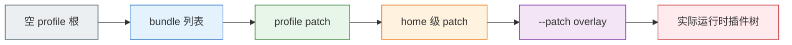
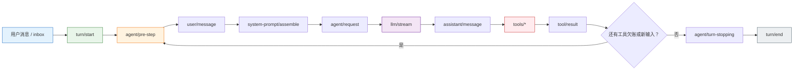
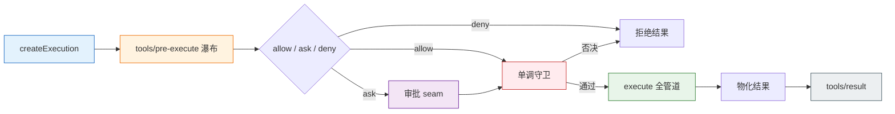
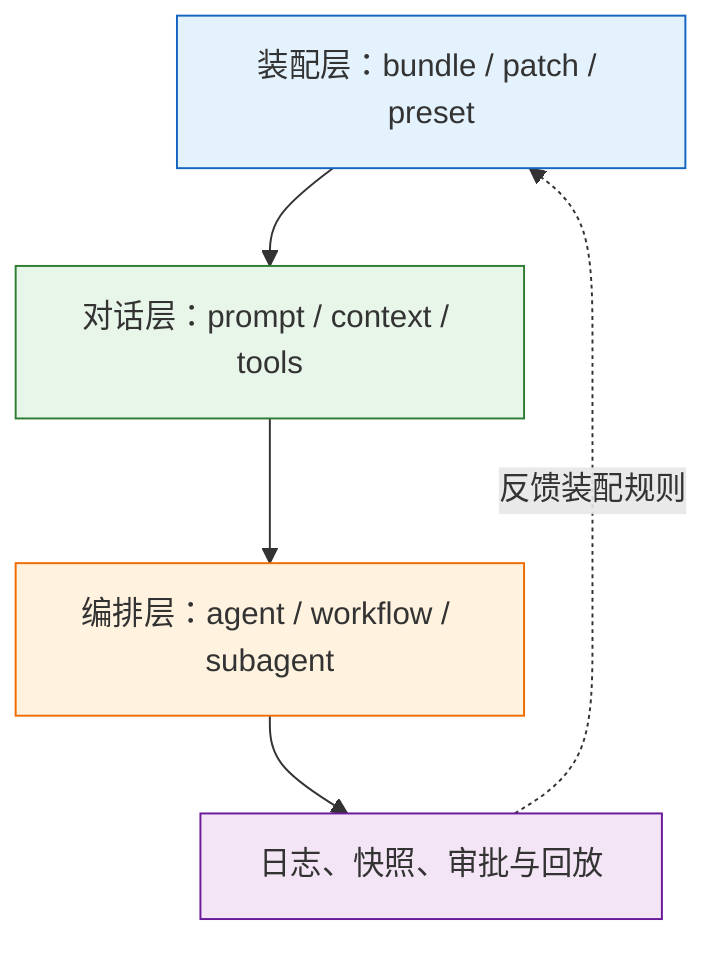

# 0. 前言
> [!note] 写这篇文章的目的
> 最近我刚把 DeepSeek Harness（dsh） 的仓库 Fork 下来，并在上面编写了自用的桌面端，也尝试使用了一下 dsh，关于 DeepSeek Harness 这次的动作，我自己有一些感触，于是便拆解一下这个开源项目，分享一下其中的门道和这个产品给我们带来的指引和启示。

> [!example] 相关代码库
> - [AI-DLC：深入理解 AI-DLC](https://github.com/mancbj/aidlc-book-baojun)
> - [DeepSeek Harness](https://github.com/deepseek-ai/deepseek-harness)


# 1. “一切皆插件”

> 本部分拆解 DeepSeek Harness（`dsh`）插件化的底层原理：它如何在 Cordis 之上把提示词工程、上下文工程、循环工程全部变成可插拔的"脚手架"，以及与 Codex 等黑盒脚手架相比的收益与风险。
> 所有代码片段均来自仓库源码（`packages/`、`vendor/`、`docs/`），标注文件与行号，可对照阅读。

## 1.0 引子：一个"没有核心"的产品长什么样

DeepSeek Harness 的 README 只有一句话值得先记住：**everything is a plugin（一切皆插件）**。多数项目说这句话时指的是"可以写插件"，但 dsh 是字面意义的：整个产品就是一个插件列表。

打开 `packages/bundle/base/cordis.patch.yml`——每个 dsh profile 的第一层组合包——你会看到这样的内容：

```yaml
# packages/bundle/base/cordis.patch.yml（节选）
# The dsh-base bundle patch: the shared core of every dsh profile, applied as
# ONE insert over the empty profile root. Later bundle patches and the user's
# profile cordis.patch.yml address these rows by id, with the last write
# winning per row.
# 本补丁是每个 dsh profile 共享的核心，以一次 insert 应用在空 profile 根之上。
# 后续的 bundle patch 与用户 profile 的 cordis.patch.yml 按 id 寻址这些行，每行以最后一次写入为准。
#
# A patch replaces the targeted row's whole `config` rather than merging into
# it.
# patch 替换目标行的整个 config，而不是合并进去。
#
# Row order carries no load semantics (activation is service-availability
# driven); the grouping is for readers.
# 行顺序不携带加载语义（激活由服务可用性驱动）；分组仅为方便阅读。
- insert:
    - id: timer
      name: '@deepseek-ai/cordis-plugin-timer'

    - id: llm
      name: '@deepseek-ai/dsh-llm'

    - id: session
      name: '@deepseek-ai/dsh-session'

    - id: agent
      name: '@deepseek-ai/dsh-agent'

    - id: tools
      name: '@deepseek-ai/dsh-tools'

    - id: system-prompt
      name: '@deepseek-ai/dsh-system-prompt'
      config:
        persona: ''

    # Agents created at startup. The base stays empty; raw overlays may create
    # agents, while Web creates sessions on client request.
    # 启动时创建的 agent。base 保持为空；原始 overlay 可以创建 agent，而 Web 在客户端请求时创建会话。
    - id: agent-loop
      name: '@deepseek-ai/dsh-agent-loop'
      config:
        agents: []
```

> 片段 1.1 · `packages/bundle/base/cordis.patch.yml:15-30, 436-440`

模型适配器（`llm`）、会话日志（`session`）、工具注册表（`tools`）、提示词组装（`system-prompt`）、**甚至驱动整个智能体的主循环（`agent-loop`）**，都只是配置文件里的一行。没有一行写着"这是核心，不可替换"。

这个列表是怎么变成一棵能跑的插件树的？这正是本部分要拆解的门道：先看支撑它的插件框架 Cordis 的五根支柱（1.1），再看三大"核心工程"如何以插件形态存在（1.2），然后看 Profile/组合包如何把它们拼成产品（1.3），最后与黑盒脚手架对比（1.4）。

> [!summary] 第一部分的阅读地图
> **形态**：Cordis 把服务、事件、效果、依赖和作用域抽象成可组合的插件机制；
> **证据**：`system-prompt`、`session`、`agent-loop` 和工具都以插件存在；
> **装配**：profile、bundle 与 patch 把插件列表拼成具体产品；
> **取舍**：整棵运行时可改，意味着更强的控制力，也意味着更高的组合与维护成本。

---

## 1.1 插件化原理：Cordis 的五根支柱

dsh 没有自己造轮子。它把 Cordis——一个开源插件框架——**源码复制进仓库**（`vendor/cordis/`），rescope 成 `@deepseek-ai/cordis` 后随自己发布。理由写在 `vendor/README.md` 里：harness 要**完全拥有自己的框架层**（auditable / patchable / pinned），框架缺陷不能等上游修，要能自己打补丁。

Cordis 的全部思想浓缩为五个概念：服务与上下文、类型化事件、可逆效果、声明式注入、作用域。逐个看。

> [!compare] Cordis 五根支柱各自解决什么问题
> | 支柱 | 解决的问题 | 在 dsh 中的表现 |
> |---|---|---|
> | 服务与上下文 | 能力如何被发现与替换 | `ctx.llm`、`ctx.tools` 等具名服务 |
> | 类型化事件 | 插件如何协同而不互相 import | `emit`、`serial`、`waterfall` |
> | 可逆效果 | 热更新和卸载如何恢复现场 | 注册效果随 fiber 回卷 |
> | 声明式依赖注入 | 加载顺序如何表达 | `inject` / `static` 声明需求 |
> | 作用域 | 能力和事件如何隔离 | 每个 agent 拥有自己的小世界 |

### 1.1.1 服务与上下文：一切按 key 查找

Cordis 的 `Context` 是一个**服务仓库**：插件占据 `ctx.<key>`（如 `ctx.llm`、`ctx.tools`），其他插件按 key 取服务，而不是 import 具体实现。这打破了"模块依赖模块"的耦合，改成了"模块依赖名字"。

```ts
// vendor/cordis/src/context.ts:16-33
/**
 * Public shape of a Cordis context.
 * Cordis 上下文的公开形态。
 *
 * The concrete `Context` class is proxied at runtime, so this interface is
 * augmented by core services and plugins to describe the properties that may
 * be read from `ctx`.
 * 具体 Context 类在运行时被代理，因此该接口由核心服务与插件扩展，以描述可从 ctx 读取的属性。
 */
export interface Context {
  /** Isolation map: service name → scope label. 隔离映射：服务名 → 作用域标签。 */
  [symbols.isolate]: Dict<symbol>
  /** Intercept map: service name → config merged into that service's per-plugin config. 拦截映射：服务名 → 合并进该服务每个插件配置的配置。 */
  [symbols.intercept]: Dict
  /** The root context of the application (every child context shares it). 应用的根上下文（每个子上下文共享它）。 */
  root: this
  /** The event bus. Its methods are also mixed onto `ctx` (`ctx.on`, `ctx.emit`, ...). 事件总线；其方法也混入 `ctx`（`ctx.on`、`ctx.emit` 等）。 */
  events: EventsService
  /** The logging service. Call `ctx.logger(name)` for a named logger. 日志服务；用 `ctx.logger(name)` 获取命名 logger。 */
  logger: LoggerService
  /** The reflection layer backing the context proxy (`ctx.get`, `ctx.provide`, ...). 支撑上下文代理的反射层（`ctx.get`、`ctx.provide` 等）。 */
  reflect: ReflectService
  /** The plugin registry. Its methods are mixed onto `ctx` (`ctx.plugin`, `ctx.inject`). 插件注册表；其方法也混入 `ctx`（`ctx.plugin`、`ctx.inject`）。 */
  registry: RegistryService
}
```

> 片段 1.2 · `vendor/cordis/src/context.ts:16-33`

注意 `Context` 接口本身也是"可以被插件扩展"的：dsh 的每个包都用 TypeScript 声明合并（`declare module '@deepseek-ai/cordis'`）往这个接口里加 `ctx.sessions`、`ctx.tools` 等键——这个模式后面会反复出现。

`Context` 的实现更关键：**它是一个 Proxy**。属性读取走服务解析，`extend()` 创建子上下文而不改父：

```ts
// vendor/cordis/src/context.ts:70-84（节选）
/**
 * Root and child dependency containers for Cordis plugins.
 * Cordis 插件的根与子依赖容器。
 *
 * A context is a proxy: normal property reads go through the service resolver,
 * while `extend()`, `isolate()`, and `intercept()` create scoped child
 * contexts without mutating their parent.
 * 上下文是代理：普通属性读取走服务解析，而 extend()/isolate()/intercept() 创建作用域化子上下文而不改动父上下文。
 */
/** Create the root context and install the built-in services. 创建根上下文并安装内置服务。 */
constructor() {
  this[symbols.isolate] = Object.create(null)
  this[symbols.intercept] = Object.create(null)
  const self = new Proxy<this>(this, ReflectService.handler)
  this.root = self
  this.reflect = new ReflectService(self)
  this.registry = new RegistryService(self)
  this.events = new EventsService(self)
  this.logger = new LoggerService(self)
  return self
}
```

> 片段 1.3 · `vendor/cordis/src/context.ts:70-84`（节选）

服务本身是 `Service` 基类的子类，**构造即注册**，随所属 fiber 卸载自动移除：

```ts
// vendor/cordis/src/service.ts:11, 32-43（节选）
/**
 * Base class for services that expose a named API on `ctx`.
 * 在 ctx 上暴露具名 API 的服务基类。
 *
 * Subclasses call `super(ctx, name)` from their constructor. The service is
 * registered immediately and is automatically removed with the owning fiber.
 * 子类在构造器中调用 super(ctx, name)。服务立即注册，并随所属 fiber 自动移除。
 */
export abstract class Service<out T = never> {
  /**
   * Register this instance as `name` in the current context.
   * 在当前上下文中将此实例注册为 name。
   *
   * Calls `ctx.reflect.provide(name, this, this[Service.check])`, so the
   * service is unregistered automatically when the owning fiber unloads.
   * 调用 ctx.reflect.provide(name, this, this[Service.check])，因此服务在所属 fiber 卸载时自动注销。
   */
  constructor(protected ctx: Context, name: string) {
    name ??= this.constructor['provide'] as string
    // ...
    self.ctx = ctx
    self.name = name
    self.ctx.reflect.provide(name, self, this[symbols.check])
    return self
  }
}
```

> 片段 1.4 · `vendor/cordis/src/service.ts:11, 32-43`（节选）

"构造即注册 + 随 fiber 卸载自动移除"是后面一切可回卷特性的地基。

### 1.1.2 类型化事件：四种分发模式

插件之间通信不靠直接调用，而靠**类型化事件**。事件是公共契约，通过声明合并定义，并且带分发模式标注。分发有四种：`emit`（通知，不等）、`parallel`（并行等待）、`serial`（按序直到 bail）、`waterfall`（环绕中间件）。

`dispatch()` 是分发的地基——它解析 `thisArg`（作用域载体）和事件名，用 `filter` 过滤监听器，返回绑定好的回调列表：

```ts
// vendor/cordis/src/events.ts:165-175
/**
 * Resolve listeners for one dispatch and apply context filtering.
 * 解析一次分发的监听器并应用上下文过滤。
 *
 * @param type — the dispatch mode, reported on `internal/dispatch`. 分发模式，记录于 `internal/dispatch`。
 * @param args — the raw dispatch arguments; consumed up to the event name. 原始分发参数；消费到事件名为止。
 * @returns the matching listener callbacks, bound to the dispatch `this`. 匹配的监听器回调，绑定到分发的 `this`。
 */
dispatch(type: string, args: any[]) {
  const thisArg = typeof args[0] === 'object' || typeof args[0] === 'function' ? args.shift() : null
  const name: string = args.shift()
  if (!name.startsWith('internal/')) {
    this.emit('internal/dispatch', type, name, args, thisArg)
  }
  const filter = thisArg?.[Context.filter]
  return (this._hooks[name] || [])
    .filter(hook => hook.global || !filter || filter.call(thisArg, hook.ctx))
    .map(hook => hook.callback.bind(thisArg))
}
```

> 片段 1.5 · `vendor/cordis/src/events.ts:165-175`

`waterfall` 是 dsh 用得最多的模式，值得看它的实现——**最后一个参数是 innermost `next`**，监听器从外到内组合，不调用 `next()` 就短路（veto）：

```ts
// vendor/cordis/src/events.ts:234-243
/**
 * Compose listeners around the final `next` callback.
 * 将监听器组合在最终的 next 回调周围。
 *
 * The last dispatch argument is treated as the innermost `next`. Listeners
 * run outermost-first; a listener that does not call `next()` vetoes the
 * rest of the chain, including the built-in behavior.
 * 最后一个分发参数被视为最内层的 next。监听器从最外层开始运行；
 * 不调用 next() 的监听器会否决链的其余部分——包括内置行为。
 *
 * @returns the outermost listener's return value. 最外层监听器的返回值。
 */
waterfall(...args: any[]) {
  const cbs = this.dispatch('waterfall', args)
  const inner = args.pop()
  const next = () => {
    const cb = cbs.shift() ?? inner
    return cb(...args)
  }
  args.push(next)
  return next()
}
```

> 片段 1.6 · `vendor/cordis/src/events.ts:234-243`

以及 `serial`——按注册顺序逐个 `await`，直到某个监听器返回 bail 值：

```ts
// vendor/cordis/src/events.ts:204-209
/**
 * Run listeners in order, awaiting each, until one returns a bail value.
 * 按序运行监听器，逐个 await，直到某个返回 bail 值。
 *
 * @returns the first bail value (see {@link isBailed}), if any. 第一个 bail 值（见 isBailed），若有。
 */
async serial(...args: any[]) {
  for (const cb of this.dispatch('serial', args)) {
    const result = await cb(...args)
    if (isBailed(result)) return result
  }
}
```

> 片段 1.7 · `vendor/cordis/src/events.ts:204-209`

四种模式对应四种意图：通知、扇出、有序裁决、环绕拦截。dsh 把分发模式写进事件声明的 `@mode` 标注里，并有生成的门禁检查声明与派发点一致——**事件契约是公共 API，不是内部实现细节**。

### 1.1.3 可逆效果：注册即回卷

Cordis 的第三支柱是**可逆效果**（reversible effect）：所有注册——监听器、服务、prompt 分段、工具——都通过 `ctx.effect()`/`ctx.on()` 安装，拿到一个 disposer；fiber 卸载时按逆序自动回卷。这是"热重载安全"的根基。

```ts
// vendor/cordis/src/fiber.ts:415-442（节选）
/**
 * Register a cleanup-aware effect on this fiber.
 * 在此 fiber 上注册一个感知清理的效果。
 *
 * `execute` runs immediately; the disposers it produces are collected and
 * run (in reverse order) either when the returned disposer is called or
 * when the fiber unloads, whichever comes first. Calling the disposer twice
 * is a no-op.
 * execute 立即运行；其产生的 disposer 被收集，并在返回的 disposer 被调用或 fiber 卸载时
 * （以先到者为准）按逆序运行。重复调用 disposer 是 no-op。
 *
 * Throws `CordisError('INACTIVE_EFFECT')` if the fiber is already disposed,
 * and `TypeError` if `execute` returns an invalid shape.
 * fiber 已销毁时抛出 CordisError('INACTIVE_EFFECT')；execute 返回非法形态时抛出 TypeError。
 */
effect(execute: () => Effect, label = 'anonymous'): any {
  this.assertActive()
  const disposables: Disposable[] = []
  let disposing = false
  const dispose = () => {
    if (disposing) return disposalTask
    disposing = true
    let task!: void | Promise<void>
    for (const disposable of disposables.splice(0).reverse()) {
      if (task) {
        task = task.then(() => runDisposable(disposable))
      } else {
        const result = runDisposable(disposable)
        // ...
      }
    }
    return disposalTask = task
  }
  // ...
}
```

> 片段 1.8 · `vendor/cordis/src/fiber.ts:415-442`（节选）

监听器的注册是它的典型应用——`on()` 把监听器登记到当前 fiber 的效果列表：

```ts
// vendor/cordis/src/events.ts:288-302（节选）
/**
 * Register an event listener owned by the current fiber.
 * 注册一个由当前 fiber 拥有的事件监听器。
 *
 * The listener is removed automatically when the fiber unloads. Throws
 * `CordisError('INACTIVE_EFFECT')` if the fiber is already disposed.
 * 监听器在 fiber 卸载时自动移除。fiber 已销毁时抛出 CordisError('INACTIVE_EFFECT')。
 *
 * @param name — the event name to listen for. 要监听的事件名。
 * @param listener — called with the dispatch arguments. 以分发参数调用。
 * @param options — listener options; a boolean is shorthand for `prepend`. 监听器选项；布尔值是 prepend 的简写。
 * @returns a disposer removing the listener; `true` if it was still registered. 移除监听器的 disposer；若仍在注册则返回 true。
 */
on(name: string | symbol, listener: (...args: any) => any, options?: boolean | EventOptions) {
  this.ctx.fiber.assertActive()
  listener = this.ctx.reflect.bind(listener)
  const result = this.bail(this.ctx, 'internal/listener', name, listener, options)
  if (result) return result
  const hooks = this._hooks[name] ||= []
  const label = `ctx.on(${JSON.stringify(name)})`
  return this.register(label, hooks, listener, options)
}
```

> 片段 1.9 · `vendor/cordis/src/events.ts:288-302`（节选）

"注册是一种可逆效果"这条纪律贯穿 dsh 全部代码：AGENTS.md 里写着 *Registrations are effects*——每个贡献必须返回 disposer，卸载时按序回卷。

### 1.1.4 声明式依赖注入：加载顺序由需求表达

插件用 `inject` 声明它需要的服务。服务未就绪的插件保持 pending，就绪才激活——**启动顺序由服务需求表达，而不是手工排序**：

```ts
// vendor/cordis/src/registry.ts:300-301
/**
 * Start a callback once the requested dependencies are available.
 * 请求的依赖可用后启动回调。
 *
 * @param inject — required services, as an array or a name → config map. 所需服务，数组或 name → config 映射。
 * @param callback — plugin body called with `(ctx, config)`. 插件主体，以 (ctx, config) 调用。
 * @returns the fiber; awaiting it settles once loading finished. 返回 fiber；await 它在加载完成后落定。
 */
inject(inject: Inject, callback: Plugin.Function<void>) {
  return this.plugin({ inject, apply: callback, name: callback.name })
}
```

> 片段 1.10 · `vendor/cordis/src/registry.ts:300-301`

dsh 的每个服务插件都这样声明依赖。以主循环为例：

```ts
// packages/core/agent-loop/src/index.ts:296-311（节选）
/** Concrete agent factory and driver service. 具体的 agent 工厂与驱动器服务。 */
export class AgentLoop extends Service implements AgentFactory {
  // 声明主循环需要的五个服务：未就绪前本插件保持 pending（片段 1.10）
  static inject = ['agents', 'sessions', 'llm', 'tools', 'systemPrompt']

  // 配置即契约。字段注释来自 Config 接口（同文件 255-272 行）：
  // maxParallelToolCalls —— 每个 agent step 最多并行安全的在途调用数；1 表示串行
  // agents —— 在插件启动时创建或恢复的 agent 列表；id 为稳定配置标签，
  //   sessionId 为可选稳定身份（重挂载恢复历史，首次使用新建），resumeSessionId 为要恢复的持久化会话
  static Config = z.object({
    maxParallelToolCalls: z.number().step(1).min(1).default(DEFAULT_MAX_PARALLEL_TOOL_CALLS),
    agents: z.array(z.object({
      id: z.string().required(),
      // ...
    })).default([]),
  }) as z<Config>
}
```

> 片段 1.11 · `packages/core/agent-loop/src/index.ts:296-311`（节选）

注意两个细节：`static inject` 声明主循环需要哪五个服务；`static Config` 用 Schemastery schema 声明自己的配置——**配置也是插件契约的一部分**，从 `cordis.yml` 里可改。

### 1.1.5 作用域：dsh 给 Cordis 的补丁

Cordis 原版没有"作用域"概念。dsh 的 `dsh-scope` 包补上了它：给任意对象铸一个**带身份的子上下文**。

```ts
// packages/core/scope/src/index.ts:137-147
/**
 * Mint a scope under `ctx`. The scoped context inherits the minting plugin's
 * dependency API and owns every registration made through it.
 * 在 ctx 下铸一个作用域。作用域化上下文继承铸造插件的依赖 API，并拥有通过它进行的每项注册。
 *
 * @param ctx - active context whose dependency API the scope inherits. 活动上下文，作用域继承其依赖 API。
 * @param key - opaque identity used for listener routing. 用于监听器路由的不透明身份。
 * @param options - optional scope-chain placement. 可选的作用域链位置。
 * @returns the scoped context and exact/shared disposal boundaries. 作用域化上下文与精确/共享的销毁边界。
 */
export function createScope(ctx: Context, key: ScopeKey, options?: CreateScopeOptions): Scope {
  if (options?.parent !== undefined) bindScopeParent(key, options.parent)
  const fiber = ctx.plugin(scope)
  const scoped: Context = fiber.ctx.extend({ [kScope]: key })
  let disposing: Promise<void> | undefined
  return {
    ctx: scoped,
    rawDispose: fiber.dispose,
    dispose: () => (disposing ??= quiesceFiber(fiber)),
  }
}
```

> 片段 1.12 · `packages/core/scope/src/index.ts:137-147`

作用域的威力在事件路由：**注册向下继承（子作用域看到祖先的一切），事件向上流动（祖先的监听器收得到后代的）**。这是 `scopeTarget` 的 filter 逻辑：

```ts
// packages/core/scope/src/index.ts:170-185（节选）
/**
 * Build an opaque receiver that preserves the base filter, admits untagged
 * listeners globally, and admits tagged listeners for a matching key or any
 * of its ancestors ({@link bindScopeParent}): a listener owned by an enclosing
 * scope receives every descendant scope's events, which is what lets one
 * standing composition observe each of the agents composed under it. A tag
 * BELOW the dispatch key stays excluded — events flow up the chain, never down.
 * 构建保留基础过滤器的不透明接收器：无标签监听器全局放行；带标签的监听器在其 key 或其任一祖先匹配时放行——
 * 由外层作用域拥有的监听器会收到每个后代作用域的事件，这正是让一个常驻组合能观察其组合出的每个 agent 的原因。
 * 位于分发 key 之下的标签保持排除——事件沿链向上流动，从不向下。
 *
 * @param base - subject or service whose existing Cordis filter is preserved. 保留其既有 Cordis 过滤器的主体或服务。
 * @param key - routed scope identity, or `undefined` for an unscoped subject. 路由作用域身份；无作用域主体为 undefined。
 * @returns a carrier whose subject remains available only through event arguments. 载体；其主体仅通过事件参数可用。
 */
export function scopeTarget<T extends object>(base: T, key: ScopeKey | undefined): Scoped<T> {
  const carrier = {
    [CordisContext.filter](ctx: Context): boolean {
      const tag = scopeOf(ctx)
      if (tag === undefined) return true
      for (let cursor = key; cursor !== undefined; cursor = scopeParents.get(cursor)) {
        if (cursor === tag) return true
      }
      return false
    },
  }
  carrierKeys.set(carrier, key)
  return carrier as unknown as Scoped<T>
}
```

> 片段 1.13 · `packages/core/scope/src/index.ts:170-185`（节选）

这个机制让"每个 agent 是一个小世界"成为可能——后面会看到 `ReactLoopAgent` 构造时就铸一个自己的 scope。

**小节关系**：五根支柱（服务仓库 / 类型化事件 / 可逆效果 / 声明式注入 / 作用域）就是"一切皆插件"的全部语法。下一节看 dsh 用这套语法写出了什么——包括那些你以为是"内置核心"的东西。

---

## 1.2 证据：三大核心工程全是插件

现在回答最关键的问题：提示词工程、上下文工程、循环工程——这些在任何 Agent 框架里都是"核心"的东西——在 dsh 里如何以插件形态存在？

### 1.2.1 提示词工程 = `system-prompt` 服务

先看它怎么声明自己。`system-prompt` 包用声明合并往 `Context` 里加 `ctx.systemPrompt`，并声明一个 waterfall 事件：

```ts
// packages/core/system-prompt/src/index.ts:13-31（节选）
declare module '@deepseek-ai/cordis' {
  interface Context {
    systemPrompt: SystemPrompt
  }

  interface Events {
    /**
     * Expert waterfall over the assembled sections, contexts, tools, and variables.
     * 针对已组装的 sections、contexts、tools 与 variables 的专家级 waterfall（环绕瀑布）。
     * @param assembly - the mutable assembly built from registered providers. 由已注册 provider 构建的可变组装结果。
     * @mode waterfall
     */
    'system-prompt/assemble'(this: Scoped<SystemPrompt>, assembly: PromptAssembly, context: AssembleContext, next: () => Promise<PromptAssembly>): Promise<PromptAssembly>
  }
}
```

> 片段 1.13b · `packages/core/system-prompt/src/index.ts:13-31`（节选）

它就是一个普通的 `Service` 子类，构造时注册两个"出厂分段"——harness 身份（order -100）和部署 persona（order 0）：

```ts
// packages/core/system-prompt/src/index.ts:338-371（节选）
/**
 * Registry service for the prompt inputs assembled before each model step.
 * 在每个模型步骤前组装提示词输入的注册表服务。
 *
 * Sections are concatenated in ascending order. Convention: `-100` is the
 * harness identity, `0` the deployment persona, tool guidance uses 100–199;
 * other negative orders also render before the persona.
 * 分段按升序拼接。约定：-100 是 harness 身份，0 是部署 persona，工具指引用 100–199；其他负数顺序也在 persona 之前渲染。
 */
export class SystemPrompt extends Service {
  static Config: z<Config> = z.object({
    includeHarnessIdentity: z.boolean().default(true),
    includeRuntimeContext: z.boolean().default(true),
    persona: z.string().default(''),
    toolOrder: z.array(z.string()).default(undefined as unknown as string[]),
  })

  constructor(ctx: Context, config: Config) {
    super(ctx, 'systemPrompt')
    this.toolOrder = validateToolOrder(config.toolOrder)
    if (config.includeHarnessIdentity ?? true) {
      this.section({
        name: 'harness:identity',
        order: -100,
        text: 'You are an AI agent powered by DeepSeek Harness.',
      })
    }
    this.section({
      name: PERSONA_SECTION,
      order: PERSONA_ORDER,
      text: config.persona ?? '',
    })
  }
```

> 片段 1.14 · `packages/core/system-prompt/src/index.ts:338-371`（节选）

关于 persona 槽位，源码注释点明了它的可替换性：*The deployment persona's section name and order. Exported because a composition can replace this slot — an agent preset shadows the deployment's persona with its own — and both sides naming the same section is what makes the replacement work rather than duplicate.*（部署 persona 的分段名与顺序。导出是因为组合可以替换这个槽位——agent preset 用自己的 persona 遮蔽部署 persona——而双方命名同一分段正是替换生效而非重复的原因。）

提示词工程的注册 API 是 `section()`——注册一段提示词，**返回 exact disposer**（可逆效果的 API 面）：

```ts
// packages/core/system-prompt/src/index.ts:381-390
/**
 * Register an ordered prompt section in the calling context's scope. A scoped
 * section shadows a global section with the same name; duplicates within one
 * layer and non-finite orders throw. Registration and disposal emit
 * `system-prompt/change`.
 * 在调用上下文的作用域中注册一个有序提示词分段。作用域分段遮蔽同名全局分段；
 * 同一层内的重复与非有限顺序会抛错。注册与销毁都会发出 system-prompt/change。
 *
 * @param section - the section to register. 要注册的分段。
 * @returns the exact Cordis effect disposer. 精确的 Cordis 效果 disposer。
 */
section(section: PromptSection): () => void {
  if (!Number.isFinite(section.order)) {
    throw new TypeError(`prompt section "${section.name}" order must be a finite number`)
  }
  return this.layers.effect(
    this.ctx,
    layer => layer.sections.insert(section.name, section),
    { label: 'systemPrompt.section()' },
  )
}
```

> 片段 1.15 · `packages/core/system-prompt/src/index.ts:381-390`

运行时 `assemble()` 把全局层与作用域链的注册合并、按 order 排序、插值 `{{variable}}`，最后跑 `system-prompt/assemble` 瀑布让插件改写：

```ts
// packages/core/system-prompt/src/index.ts:467-542（节选）
/**
 * Assemble global and scoped providers, detach tool parameters, apply
 * canonical ordering, then run the assembly waterfall. Scoped sections and
 * variables shadow globals. The returned waterfall value is authoritative
 * except that an effective complete section is restored afterwards as the
 * sole prompt section.
 * 组装全局与作用域 provider，剥离工具参数，应用规范排序，然后运行组装瀑布。作用域分段与变量遮蔽全局。
 * 返回的瀑布值具有权威性，唯一例外是有效的 complete 分段会在之后恢复为唯一的提示词分段。
 *
 * @param context - the optional scope and plugin-defined assembly fields. 可选作用域与插件定义的组装字段。
 * @returns the post-waterfall assembly with any complete prompt enforced. 瀑布后的组装结果，且任何 complete 提示词已被强制。
 */
async assemble(context: AssembleContext = {}): Promise<PromptAssembly> {
  const scope = context.scope
  const scopeLayers = this.layers.chainLayers(scope)
  // Scoped variables shadow globals. 作用域变量遮蔽全局变量。
  const variables: Record<string, string | undefined> = {}
  for (const [name, provider] of this.layers.global.variables.entries()) {
    variables[name] = provider(context)
  }
  // Scoped sections shadow globals before the stable order sort. 在稳定排序前，作用域分段遮蔽全局分段。
  const sectionByName = this.layers.merge(scope, layer => layer.sections)
  // ...
  const transformed = await this.ctx.waterfall(
    scopeTarget(this, scope), 'system-prompt/assemble', assembly, context,
    () => Promise.resolve(assembly),
  )
  return transformed
}
```

> 片段 1.16 · `packages/core/system-prompt/src/index.ts:467-542`（节选）

**提示词工程不是"一段写死的系统提示词"，而是一个可注册、可排序、可被瀑布改写、可被作用域覆盖的组装服务。**

### 1.2.2 上下文工程 = `session` 事件溯源

dsh 最反直觉的决策：会话没有"消息表"，只有一条**追加式事件日志**。事件词汇表是 `SessionEventMap`——一个声明合并的判别联合：

```ts
// packages/core/session/src/types.ts:236-260（节选）
export interface SessionEventMap {
  /** Opens turn `turn` before the loop claims queued input or runs pre-step. 在循环认领排队输入或运行 pre-step 之前打开轮次 `turn`。 */
  'turn/start': { turn: number }
  /** Closes turn `turn` with the TurnEndReason that ended it. 以结束该轮次的 TurnEndReason 关闭轮次 `turn`。 */
  'turn/end': { turn: number; reason: TurnEndReason }
  /** Opens step `step` of turn `turn` — one model call plus the tool executions it requested. 打开轮次 `turn` 的步骤 `step`——一次模型调用及其请求的工具执行。 */
  'step/start': { turn: number; step: number }
  /** Closes step `step` of turn `turn`. 关闭轮次 `turn` 的步骤 `step`。 */
  'step/end': { turn: number; step: number }
  /** A user-role message on the model-visible surface. 模型可见表面上的一条 user 角色消息。 */
  'user/message': UserMessage
  /** Raw stream chunk — token-level replay fidelity. 原始流式分块——token 级回放保真。 */
  'assistant/chunk': { turn: number; step: number; chunk: StreamChunk }
  /** Assembled assistant message for one step (derived history uses this). 一个步骤的组装后 assistant 消息（派生历史使用它）。 */
  'assistant/message': { turn: number; step: number; message: AssistantMessage; usage?: TokenUsage }
  /** The model requested one tool invocation. 模型请求了一次工具调用。 */
  'tool/call': { turn: number; step: number; callId: CallId; name: string; arguments: string }
  /** A completed tool call's model-facing result. 一次已完成的工具调用的模型可见结果。 */
  'tool/result': { turn: number; step: number; message: ToolResultMessage; error?: { name: string; code: string } }
  // ...
}
```

> 片段 1.17 · `packages/core/session/src/types.ts:236-260`（节选）

插件要加一种新会话事件，不需要改 dsh 源码——在自己的包里 `declare module '@deepseek-ai/dsh-session'` 扩展这个接口即可。

模型看到的完整历史不是存下来的，而是每次请求前从日志**投影**出来：

```ts
// packages/core/session/src/index.ts:726-747（节选）
/**
 * Derive the LLM message history by walking the ordered sequences of
 * message-producing events maintained by `surfaceOp` markers. The
 * surface is the single source of derived history: every message-producing
 * append records its `surfaceOp`, so a raw event with no marker (a chunk, a
 * turn boundary) is correctly absent, and a compaction `replace` deletes the
 * shadowed nodes from the derivation.
 * 通过遍历由 surfaceOp 标记维护的消息产生事件的有序序列，派生 LLM 消息历史。surface 是派生历史的唯一来源：
 * 每个产生消息的追加都记录其 surfaceOp，因此没有标记的原始事件（chunk、轮次边界）正确地缺席，
 * 而压缩 replace 会从派生中删除被遮蔽的节点。
 *
 * CACHED: each surface node is projected exactly once, when first seen — a
 * call costs O(new nodes), and a surface rewrite (a `replace`) rebuilds.
 * 已缓存：每个 surface 节点首次出现时只投影一次——一次调用开销为 O(新节点)，surface 重写（replace）时重建。
 *
 * @returns a fresh array of the shared, frozen derived history. 共享的、冻结的派生历史的新数组。
 */
deriveMessages(): Message[] {
  const surface = this.surface
  const nodes = surface.nodes
  const generation = surface.replaceGeneration
  if (generation !== this.derivedGeneration) {
    this.derived = []
    this.derivedNodes = 0
    this.derivedGeneration = generation
  }
  for (const seq of nodes.slice(this.derivedNodes)) {
    const msg = this.deriveEventMessage(this.log[seq]!)
    if (msg) this.derived.push(msg)
  }
  this.derivedNodes = nodes.length
  return [...this.derived]
}
```

> 片段 1.18 · `packages/core/session/src/index.ts:726-747`（节选）

`deriveMessages()` 的 JSDoc 还解释了"为什么模型历史里没有 chunk"：只有带 `surfaceOp` 标记的消息产生事件才进入派生——原始 `assistant/chunk` 事件没有标记，正确地缺席；压缩（compaction）的 `replace` 会从派生中删除被遮蔽的节点。

由此引出 dsh 的招牌不变式：**model-visible ⟺ logged**——任何到达模型请求的东西，都必须能从日志重建（架构文档原话，由运行时不变量断言）。上下文工程因此是"派生的"，不是"存储的"。

### 1.2.3 循环工程 = `agent-loop` 插件

主循环（agent loop）是所有 Agent 框架里最"核心"的东西。在 dsh 里它是一个插件，而且它的构造器恰好展示了三大工程如何**拧在一起**：

```ts
// packages/core/agent-loop/src/index.ts:319-381（节选）
export class AgentLoop extends Service implements AgentFactory {
  constructor(ctx: Context, config: Config) {
    super(ctx, 'agentLoop')
    // ...
    ctx.effect(() => () => this.ownership.dispose(), 'agentLoop.transactions()')
    // 把自己注册为 agent 工厂：谁实现 AgentFactory 谁就是主循环
    ctx.effect(() => ctx.agents.setFactory(this), 'agentLoop.setFactory()')
    // 向提示词工程贡献变量：模型路由在提示词里可引用 {{provider}}/{{model}}/{{cwd}}
    ctx.systemPrompt.variable('provider', context => context.agent?.options.provider)
    ctx.systemPrompt.variable('model', context => context.agent?.options.model)
    ctx.systemPrompt.variable('cwd', context => context.agent?.session.header.cwd)

    // 按 Config.agents 声明式启动 agent（配置驱动的启动）
    for (const { id, sessionId, cwd, resumeSessionId, ...options } of this.config.agents) {
      // ...
      this.create(configuredId, options, meta)
      // ...
    }
  }
}
```

> 片段 1.19 · `packages/core/agent-loop/src/index.ts:319-381`（节选）

三行代码，三个信号：

1. `ctx.agents.setFactory(this)`——**主循环把自己注册为可替换的工厂**。任何插件都能注册另一个工厂，换掉默认循环；
2. `ctx.systemPrompt.variable(...)`——循环工程向提示词工程**贡献变量**：模型路由（provider/model/cwd）可以在提示词模板里以 `{{provider}}` 引用；
3. `Config.agents`——启动哪些 agent 是**配置**，不是代码。

主循环驱动的实体 `ReactLoopAgent` 构造时铸造自己的作用域：

```ts
// packages/core/agent-loop/src/agent.ts:80-97（节选）
/**
 * Default Agent driver over queued turns and step-boundary input. Every request
 * is derived from the session log.
 * 默认 agent 驱动器，处理排队的轮次与步骤边界输入。每个请求都从会话日志派生。
 * @module dsh-agent-loop/agent
 */
/** Drives one session through turn and step boundaries. 驱动一个会话穿过轮次与步骤边界。 */
constructor(
  private loopCtx: Context,
  public readonly id: SessionId,
  public readonly options: AgentOptions,
  public readonly session: Session,
) {
  this.dispatch = agentEvents(loopCtx, this)
  this.inbox = new Inbox(session, {
    inserted: (message) => { this.dispatch.emit('agent/inbox/inserted', { message }) },
    // ...
  })
  this.scope = createScope(loopCtx, this)
  this.ctx = this.scope.ctx.extend({ agent: this })
}
```

> 片段 1.20 · `packages/core/agent-loop/src/agent.ts:80-97`（节选）

每个 agent 因此拥有一个独立的小世界：它的工具、prompt 分段、监听器都作用域化，卸载时统一回卷。

### 1.2.4 工具的插件形态：一个真实工具的四件套

工具同样不是"内置的"。看一个真实的工具 `todo_write`（todo 列表工具）的完整插件骨架：

```ts
// packages/todo/tool-todo/src/index.ts:128-190（节选）
/**
 * Model-facing whole-list replacement. Each call appends a `todo/write` snapshot to the calling
 * agent's session; replay is last-write-wins, and UIs render from session events. A non-agent
 * caller has no owning list and is rejected.
 * 面向模型的整表替换。每次调用向调用 agent 的会话追加一个 todo/write 快照；回放为最后写入获胜，
 * UI 从会话事件渲染。非 agent 调用者没有所属列表，会被拒绝。
 * @module @deepseek-ai/dsh-tool-todo
 */
export const name = 'tool-todo'
export const inject = ['tools']

/**
 * Register the `todo_write` tool on `ctx.tools` and, when the session-projection seam is composed,
 * the `todos` unit.
 * 在 ctx.tools 上注册 todo_write 工具；当组合中包含会话投影接缝时，还注册 todos 单元。
 *
 * @param ctx - registrant context carrying the tool registry. 携带工具注册表的注册者上下文。
 * @param config - deployment's explicit todo policy. 部署的显式 todo 策略。
 */
export function apply(ctx: Context, config: Config): void {
  const allowParallel = config.allowParallelInProgress
  // 可选注入：当组合里有投影注册表时才注册投影单元
  ctx.inject(['sessionProjections'], (projectionCtx) => {
    projectionCtx.sessionProjections.register<'todos', TodoItem[] | null>({ /* ... */ })
  })
  // 注册工具：schema + 执行函数 + 输出契约
  ctx.tools.register(defineTool({
    name: 'todo_write',
    description: describe(allowParallel),
    parameters: {
      todos: {
        type: 'array',
        required: true,
        description: 'The COMPLETE task list, replacing any previous list.',
        items: { /* ... */ },
      },
    },
    output: {
      schema: { /* 规范的 lossless-JSON 输出契约 */ },
      // ...
    },
    // ...
  }))
}
```

> 片段 1.21 · `packages/todo/tool-todo/src/index.ts:128-190`（节选）

这是一个**函数插件**的标准形态：具名导出 `name` / `inject` / `Config` / `apply`（`Config` 是 Schemastery schema，`apply(ctx, config)` 是入口）。它注册工具时还展示了"可选注入"——`ctx.inject(['sessionProjections'], ...)` 只有在那个服务存在时才激活。工具 = 注册到 `ctx.tools` 的插件，不是内置函数。

**小节结论**：提示词工程、上下文工程、循环工程、工具——四大件全是插件。架构文档的原话此刻有了实锤：

> 不存在需要打补丁的特权内核：扩展 dsh 的方式是把插件挂载到其他插件旁边，而各项注册都是副作用，会在其插件卸载时撤销。（`docs/architecture.zh.md`）

---

## 1.3 组合体系：Profile / 组合包 / patch 把插件拼成产品

单个插件是积木，但几百个插件怎么拼成一个可运行、可定制、可热更新的产品？答案是三层组合机制。

### 1.3.1 分层模型

官方定义（`docs/architecture.zh.md:19-27`）：

- **profile**：Harness home 里的具名组装，列出它叠放的组合包（bundle），保存用户自己的 `cordis.patch.yml`；`web` 和 `headless` 是随附模板；
- **组合包（bundle）**：Cordis 配置项及其挂载代码的**分发格式**——一个 npm 包，`package.json` 里声明 `dsh.bundle.patch` 指向一个 `cordis.patch.yml`；
- **patch**：按 id 定位一行配置，**替换其整个 config**，或插入新行。

各层按序应用在空条目列表之上：bundle 列表 → profile 的 patch → home 级 patch → `--patch` overlay。



```ts
// packages/boot/app-boot/src/profile.ts:113-117
/** The shipped profile templates auto-initialized on first use, by name. 随发行版交付的 profile 模板，首次使用时自动初始化，按名称索引。 */
export const PROFILE_TEMPLATES: Record<string, readonly string[]> = {
  web: ['@deepseek-ai/dsh-base', '@deepseek-ai/dsh-web-app'],
  headless: ['@deepseek-ai/dsh-base', '@deepseek-ai/dsh-headless'],
}
```

> 片段 1.22 · `packages/boot/app-boot/src/profile.ts:113-117`

组合是 patch 列表在空条目上的**纯函数应用**——配置工具与启动器跑同一份算法：

```ts
// packages/boot/app-boot/src/profile.ts:437-444
/**
 * Compose patch layers into the effective entry list over an empty root —
 * the same single `applyEntryPatches` call the boot include makes, so flag
 * derivation and config dumps see exactly what mounts.
 * 将 patch 层在空根上组合为有效条目列表——与 boot include 所用的同一次 applyEntryPatches 调用一致，
 * 因此标志派生与配置转储看到的正是实际挂载的内容。
 *
 * @param layers - patch lists in application order. 按应用顺序排列的 patch 列表。
 * @param warn - sink for skipped-patch diagnostics; defaults to silent (boot repeats them). 跳过 patch 诊断的接收器；默认为静默（boot 会重放它们）。
 * @returns the composed entry list. 组合后的条目列表。
 */
export function composeEntries(
  layers: readonly PatchOptions[][], warn: (message: string) => void = () => {},
): EntryOptions[] {
  return applyEntryPatches([], structuredClone(layers.flat()), (message: string, ...args: unknown[]) => {
    let index = 0
    warn(message.replace(/%C/g, () => JSON.stringify(args[index++])))
  })
}
```

> 片段 1.23 · `packages/boot/app-boot/src/profile.ts:437-444`

### 1.3.2 boot()：Loader 自己也是插件

启动时，`app-boot` 的 `boot()` 做四件事：建根 Context → **把 Loader 作为插件安装** → 挂载根 Include（读配置树）→ 等整棵树 settle 并做激活审计：

```ts
// packages/boot/app-boot/src/index.ts:757-785（节选）
/**
 * Boot the Loader against `absoluteConfigPath` and return only after the whole
 * tree settles. Relative entry names resolve against the config directory;
 * bare package names resolve there by default or against an explicit
 * `bareModuleBaseUrl` for closed packaged runtimes.
 * 针对 absoluteConfigPath 启动 Loader，并仅在整棵树 settle 后返回。相对条目名相对于配置目录解析；
 * 裸包名默认在那里解析，封闭打包运行时则相对显式 bareModuleBaseUrl 解析。
 *
 * Loader settlement rejects startup failures, which `boot` wraps after disposing the
 * partial context; a missing fiber or never-activating entry is rejected by
 * the final audit.
 * Loader 落定会拒绝启动失败，boot 在销毁部分上下文后包装之；缺失 fiber 或永不激活的条目会被最终审计拒绝。
 *
 * @returns the root context once every entry has started, or as soon as a
 * surface disposed the tree while startup was still in flight.
 * 返回根上下文（所有条目已启动），或在启动仍进行中表面便销毁整棵树时尽早返回。
 */
export async function boot(binName: string, absoluteConfigPath: string, patches?: PatchOptions[], prepare?: (ctx: Context) => Promise<void> | void, bareModuleBaseUrl?: string): Promise<Context> {
  const ctx = new Context()
  try {
    ctx.baseUrl = pathToFileURL(dirname(absoluteConfigPath)).href + '/'
    ctx.provide('dshHomePath', dshHomePath)
    await ctx.plugin(Loader)                 // Loader 本身是插件
    await prepare?.(ctx)
    await mountRootInclude(ctx, absoluteConfigPath, patches, bareModuleBaseUrl)  // 挂载配置树
    await ctx.get('loader')?.await()          // 等树 settle
    if (ctx.get('loader') === undefined) return ctx
    await assertEntriesActivated(ctx, binName) // 激活审计：每个条目必须激活
    return ctx
  } catch (cause) {
    await ctx.fiber.dispose()                 // 失败则整树回卷
    // ...
  }
}
```

> 片段 1.24 · `packages/boot/app-boot/src/index.ts:757-785`（节选）

注意"激活审计"：任何配置条目未激活（比如声明的服务缺失）都会**大声失败**——这正是"misconfiguration fails loud"的落地。

### 1.3.3 动态配置：`!!js` 表达式

配置不全是静态的。`cordis.patch.yml` 支持 `!!js` 表达式，让"按平台挂载"这类决策落在配置层：

```yaml
# packages/bundle/base/cordis.patch.yml:178-186（节选）
# Every shipped CLI mode starts with the same file-effect boundary.
# The environment remains an explicit deployment override; otherwise fresh
# sessions pin workspace-write + ask through the permission service below.
# 每个随发行版交付的 CLI 模式都以相同的文件效果边界起步。
# 环境仍是显式的部署覆盖；否则新会话通过下面的权限服务固定 workspace-write + ask。
- id: bash-sandbox
  name: '@deepseek-ai/dsh-bash-sandbox'
  disabled: !!js process.platform === 'win32'
  config:
    timeoutMs: 60000

- id: pwsh-sandbox
  name: '@deepseek-ai/dsh-pwsh-sandbox'
  disabled: !!js process.platform !== 'win32'
```

> 片段 1.25 · `packages/bundle/base/cordis.patch.yml:178-186`（节选）

同一份 patch 文件，在 POSIX 上挂 bash 栈、在 Windows 上挂 pwsh 栈——平台差异是配置问题，不是代码问题。

**小节关系**：到这里，插件体系的完整图景已经成型——五根支柱提供语法，三大工程提供内容，组合体系提供装配。下一节把它和读者更熟悉的黑盒脚手架放在一起对比。

---

## 1.4 对比与风险：与 Codex 等"黑盒脚手架"相比

### 1.4.1 两种扩展哲学

读者大概率用过或读过 OpenAI Codex 或 Anthropic Claude Code。它们代表另一种扩展哲学——**黑盒脚手架**：

- 运行时（agent loop、上下文组装、工具执行管道）是封闭黑盒；
- 扩展面是**预留插槽**：`AGENTS.md`/`CLAUDE.md`（指令注入）、hooks（如 Codex 的 `pre_tool_use`/`post_tool_use`，Claude Code 的 `PreToolUse`/`PostToolUse`，见 [Codex hooks 文档](https://learn.chatgpt.com/docs/hooks.md)）、MCP servers（工具）、custom prompts / commands（自定义命令）；
- 插槽之外不可触及——你无法替换循环本身，无法改写工具执行管道，无法改变上下文如何组装。

dsh 没有插槽概念，因为**整棵树可 patch**：连 Loader、事件瀑布、agent 工厂都是插件（1.1.4、1.2.3 已证）。对比表：

| 维度 | 黑盒脚手架（Codex / Claude Code） | DeepSeek Harness |
|---|---|---|
| 运行时（loop/上下文/工具管道） | 黑盒，不可替换 | 插件：`setFactory` 可换 loop，事件瀑布可拦截一切 |
| 扩展机制 | 预留插槽（hooks/MCP/commands） | 任意挂载插件 + 任意行 patch（`--dump-config` 可见） |
| 提示词 | 单份系统提示词 + 注入指令 | 分段注册、order 排序、`{{variable}}` 插值、作用域覆盖 |
| 状态与回放 | 厂商私有格式 | 事件溯源日志，`deriveMessages()` 派生，fork/resume 自带 |
| 可审计性 | 能看日志，改不了机制 | 整棵树可见、可改、可回卷 |

### 1.4.2 插件化的收益落在哪

1. **可替换性**：换一个 Provider 就换整个产品（fs/subprocess 指向远程沙箱，bash/PTY/LSP 一起搬走）；
2. **可审计性**：`dsh --profile web --dump-config` 打印实际挂载的树，每一行都可以被你的 patch 替换；
3. **可回滚**：注册即效果，卸载即回卷——热重载失败能事务回滚；
4. **自我扩展**：agent 可以通过 `cordis_*` 工具自省并动态挂载自己的插件（显式能力，不是后门）。

### 1.4.3 风险点：不同水平用户

收益的另一面是风险。**配置暴露面大**意味着错误空间也大：

- **普通用户**：patch 可以改任何一行，但语义是"替换整行 config 而非合并"——一个覆盖必须重述该行保留的所有字段（这是 `dsh-base` README 明确列出的 Known Limitation）。误改有 "fail loud" 兜底（配置错误在加载时大声失败），但 `!!js` 表达式本质是配置层的代码执行，属于部署者的信任边界。
- **中级用户（插件作者）**：学习曲线陡——需要 Cordis 五概念、声明合并、Branded ID；纪律要求高——每个注册必须可回卷（HMR 安全）、能力接缝必须 Definition/Provider/Consumer 三位一体（单一角色不算接缝）；调试视角改变——故障可能来自组合里"另一个插件"而非你的代码。
- **高级用户（平台方）**：vendored Cordis 需要维护一份本地修改日志，每次同步上游都要重放补丁（`vendor/README.md` 记录 18 条本地修改）；组合正确性依赖对 patch 覆盖语义、`isolate` realm、作用域链的准确理解；生态碎片化风险——每个插件引入自己的服务与事件，组合空间随插件数指数增长。

一句话总结对比：**黑盒脚手架用"预留插槽"换取安全，dsh 用"整树可改"换取自由——自由的价格是每个使用者都要理解组合语义。**

---

## 1.5 小结与铺垫

回到引子的 `cordis.patch.yml`：现在每一行都有了答案——`llm` 是一个向 `ctx.llm` 注册适配器的插件，`session` 是维护追加式日志的插件，`system-prompt` 是组装提示词分段的插件，`agent-loop` 是把前面几个拧在一起、并向 `ctx.agents` 注册自己为工厂的插件。它们不是被"内置"的，而是被**挂载**的；任何一行都可以被 patch 替换，任何注册都可以在卸载时回卷。

但"一切皆插件"只解释了**形态**，还没解释**协同**。这些插件不是各自为政：一次对话里，session 记录事实、system-prompt 组装模型将看到什么、tools 把关每个工具调用、agent-loop 驱动 turn/step 推进、scope 隔离每个 agent 的世界。它们如何在一次 `turn` 中按序协作、日志如何变成请求、瀑布如何拦截、作用域如何隔离子代理——这是第二部分《深入运行时》的内容。

---

## 附：本部分代码片段索引

| 编号 | 位置 | 论证点 |
|---|---|---|
| 1.1 | `packages/bundle/base/cordis.patch.yml:15-30,436-440` | 整个产品=插件条目列表 |
| 1.2 | `vendor/cordis/src/context.ts:16-33` | Context 是服务仓库 |
| 1.3 | `vendor/cordis/src/context.ts:70-84` | Context 是 Proxy |
| 1.4 | `vendor/cordis/src/service.ts:11,32-43` | Service 构造即注册 |
| 1.5 | `vendor/cordis/src/events.ts:165-175` | dispatch 与 filter |
| 1.6 | `vendor/cordis/src/events.ts:234-243` | waterfall 环绕语义 |
| 1.7 | `vendor/cordis/src/events.ts:204-209` | serial 有序裁决 |
| 1.8 | `vendor/cordis/src/fiber.ts:415-442` | effect 逆序回卷 |
| 1.9 | `vendor/cordis/src/events.ts:288-302` | on() 监听器注册 |
| 1.10 | `vendor/cordis/src/registry.ts:300-301` | inject 即 plugin 简写 |
| 1.11 | `packages/core/agent-loop/src/index.ts:296-311` | static inject + Config |
| 1.12 | `packages/core/scope/src/index.ts:137-147` | createScope |
| 1.13 | `packages/core/scope/src/index.ts:170-185` | scopeTarget 事件向上流动 |
| 1.13b | `packages/core/system-prompt/src/index.ts:13-31` | 声明合并：ctx.systemPrompt + waterfall 事件 |
| 1.14 | `packages/core/system-prompt/src/index.ts:338-371` | SystemPrompt 服务类与出厂分段 |
| 1.15 | `packages/core/system-prompt/src/index.ts:381-390` | section() 注册 API |
| 1.16 | `packages/core/system-prompt/src/index.ts:467-542` | assemble() 组装运行时 |
| 1.17 | `packages/core/session/src/types.ts:236-260` | SessionEventMap 事件词汇表 |
| 1.18 | `packages/core/session/src/index.ts:726-747` | deriveMessages() 上下文投影 |
| 1.19 | `packages/core/agent-loop/src/index.ts:319-381` | 三大工程拧在一起的构造器 |
| 1.20 | `packages/core/agent-loop/src/agent.ts:80-97` | 每 agent 铸造作用域 |
| 1.21 | `packages/todo/tool-todo/src/index.ts:128-190` | 工具插件四件套 |
| 1.22 | `packages/boot/app-boot/src/profile.ts:113-117` | profile 模板 |
| 1.23 | `packages/boot/app-boot/src/profile.ts:437-444` | composeEntries 纯函数组合 |
| 1.24 | `packages/boot/app-boot/src/index.ts:757-785` | boot()：Loader 也是插件 |
| 1.25 | `packages/bundle/base/cordis.patch.yml:178-186` | !!js 动态配置 |

（对比章节 Codex/Claude Code 事实以官方文档为准，引用链接见 1.4.1。）
---
# 2. 深入运行时

> 第一部分证明了"一切皆插件"的形态：提示词工程、上下文工程、循环工程、工具都是插件，profile/组合包把它们拼成产品。
> 本部分回答下一个问题：这些插件不是各自为政——一次 `turn` 里，它们如何按序协作，把日志变成请求、把请求变成日志、把模型意图变成工具执行、把能力组合进每个 agent？
> 所有代码片段均来自仓库源码，标注文件与行号；`docs/agent-lifecycle.md` 的时序图是本部分的视觉地图。

---

## 2.0 引子：从"形态"到"协同"

第一部分结束时留了一个钩子：`cordis.patch.yml` 里的每一行插件，在运行时如何协同？本部分按**数据流**组织回答：

```
日志（session）→ 请求组装（system-prompt + llm）→ 循环推进（agent-loop）
  → 工具执行（tools）→ 作用域边界（scope）→ 能力注入（preset）
```

`docs/agent-lifecycle.md` 用一张时序图画出了主路径，文字转述如下：

- 用户消息进入 inbox → 唤醒驱动器 → `turn/start` 写日志；
- `agent/pre-step` 瀑布决定模型看到什么 → `step/start` → 输入写 `user/message`；
- `system-prompt/assemble` 组装提示词 → `agent/request` 瀑布确定请求配置 → `llm/stream` 流出 `assistant/chunk*`（逐条写日志）→ `assistant/message`；
- 工具调用穿过 `tools/*` 关卡 → `tool/call`/`tool/result` 写日志 → `step/end`；
- 还有工具欠账或新输入 → 下一 step；否则 `agent/turn-stopping` → `turn/end`。



> [!summary] 一次 turn 的核心闭环
> 输入先成为日志事件，日志再投影为模型请求；模型输出和工具结果继续写回日志，下一步仍从这份日志派生。**运行时的主线不是“调用模型”，而是“在事件日志上推进一个可重放的状态机”。**

下面六节逐段拆这条链路。

---

## 2.1 数据的脊柱：一次 `append` 的完整旅程

**本节点题**：会话日志是唯一的"状态"，而 `append()` 是唯一的写入口——理解它的四道工序，就理解了"model-visible ⟺ logged"的机械实现。

`Session.append()` 是运行时一切事实的入口（`packages/core/session/src/index.ts:604-647`）：

```ts
  append<T extends SessionEventType>(
    type: T,
    data: SessionEventMap[T],
    ...opts: T extends SurfaceEventType ? [opts: SurfaceIntent] : []
  ): SessionEvent<T> {
    const surfaceOpts: SurfaceIntent | undefined = opts[0]
    const surfaceMetadata = {
      ...surfaceOpts?.sourceEventSeqs === undefined ? {} : { sourceEventSeqs: surfaceOpts.sourceEventSeqs },
      ...surfaceOpts?.surfaceOp === undefined ? {} : { surfaceOp: surfaceOpts.surfaceOp },
    }
    // 1. 无损 JSON 校验：非 JSON 可序列化的事件在源头被拒绝
    const dataSnapshot = snapshotJsonValue(data)
    if (dataSnapshot === undefined) {
      throw new Error(`session event "${type}" carries non-JSON-serializable data`)
    }
    // 2. 事件构造：seq = log.length —— 单调、连续、可重放的序号
    const event = deepFreeze({
      type,
      seq: this.log.length,
      time: Date.now(),
      data: dataSnapshot,
      ...(surfaceMetadataSnapshot as { surfaceOp?: unknown; sourceEventSeqs?: unknown }),
    } as unknown as SessionEvent<T>)
    // 3. surface 校验：表面可接受的追加/替换必须在提交前通过
    this.surfaceManager.validateNext(event as SessionEvent)

    if (entry !== undefined) entry.appending = true
    try {
      // 4. 先推日志，后广播 session/event —— 观察者看到的是已提交的事实
      this.log.push(event as SessionEvent)
      this.eventsSnapshot = undefined
      if (callbacks !== undefined && entry !== undefined) {
        invokeContainedSessionObservers(entry.emitCtx, 'session/event', entry.id, callbackArgs, callbacks)
      }
      return event
    } finally { /* ... */ }
  }
```

> 片段 2.1a · `packages/core/session/src/index.ts:604-647`（节选）

四道工序值得逐个看：

1. **无损 JSON 校验**——`meta` 这类工具私有载荷也必须可序列化，否则在源头拒绝而非在持久化后端爆雷；
2. **`seq = log.length`**——序号是"日志位置"而非随机 id，这保证回放就是按序重放；
3. **surface 校验**——事件携带 `surfaceOp` 标记（append / replace），`SurfaceManager` 在提交前验证它能否落到当前表面；
4. **先推日志后广播**——`session/event` 的观察者永远读到已提交的事实，回调失败被包含，不阻塞提交。

读路径是 `deriveMessages()` 的另一半：**只有三种事件产生模型消息**。`deriveEventMessage` 是唯一的逐节点投影规则（`packages/core/session/src/surface.ts:83-114`）：

```ts
/**
 * Project a single event into the LLM message it derives to, or null when it
 * produces none — a non-surface event (chunk, boundary, log-only record) or an
 * empty-content assistant/message (which exists only to host usage).
 * 将单个事件投影为它派生出的 LLM 消息；不产生消息时返回 null——非表面事件（chunk、边界、仅日志记录）
 * 或空内容的 assistant/message（仅用于承载 usage）都返回 null。
 * This is THE per-node projection rule: `Session.deriveMessages` folds it over
 * the live surface, external reconstructors fold the same function over a log
 * prefix to rebuild the exact messages any request was built from.
 * 这是唯一的逐节点投影规则：Session.deriveMessages 在实时表面上折叠它，
 * 外部重建器在日志前缀的表面上折叠同一函数，以重建任何请求所基于的精确消息。
 */
export function deriveEventMessage(event: SessionEvent): Message | null {
  // Intentionally non-exhaustive: only message-producing events derive
  // history; turn/step boundaries, chunks, usage, and errors are trace/replay data.
  // 刻意不穷举：只有产生消息的事件派生历史；turn/step 边界、chunk、usage、错误都是追踪/回放数据。
  switch (event.type) {
    case 'user/message': {       // 普通提示词与注入上下文 → user 角色
      return event.data
    }
    case 'assistant/message': {
      // Skip an empty-content assistant/message: it exists only to host a
      // max-tokens step's usage and must not inject a content-less assistant turn.
      // 跳过空内容的 assistant/message：它仅用于承载 max-tokens 步骤的 usage，不能注入无内容的 assistant 轮次。
      if (event.data.message.content.length === 0) return null
      return event.data.message
    }
    case 'tool/result': {        // 工具结果 → tool-result 角色
      return event.data.message
    }
    default:
      // A non-surface event (boundary, chunk, log-only record) projects to no message.
      // 非表面事件（边界、chunk、仅日志记录）不投影出消息。
      return null
  }
}
```

> 片段 2.1b · `packages/core/session/src/surface.ts:83-114`

这个 `switch` 解释了"为什么模型历史里没有 chunk"：`assistant/chunk` 是 token 级回放数据，正确地缺席派生；`tool/call` 也不产生消息，只有 `tool/result` 产生。**写路径（append）与读路径（derive）隔着同一个 surface 契约**——第一部分（片段 1.18）展示的 `deriveMessages()` 缓存投影正是折叠这个函数。

**与下节的关系**：日志把"发生了什么"记录下来了，但模型请求还需要"提示词 + 配置"。下一节看 `preStep()` 和 `buildRequest()` 如何把日志与注册的提示词工程拧成一次请求。

---

## 2.2 请求的组装：从日志到模型请求

**本节点题**：模型请求是日志的**纯函数**——提示词来自注册的分段，历史来自日志投影，配置经过瀑布且写回日志。

循环进入每个 step 前，先经过 `preStep()`（`packages/core/agent-loop/src/agent.ts:225-243`）：

```ts
  private async preStep(target: InboxTarget, position: { turn: number; step: number }): Promise<PreparedStep> {
    const signal = this.phase.abort.signal
    const claimed = this.inbox.claim(target, position.turn)   // 认领：next-step 全部 + next-turn 一条
    const assembly = await this.loopCtx.systemPrompt.assemble(assembleContextFor(this, signal))  // 提示词工程：组装分段+工具
    signal.throwIfAborted()
    const sections = renderContextSections(assembly)
    const context = this.runtimeContext.project(joinContextSections(sections), sections)  // 动态上下文快照
    const decision = await this.dispatch.waterfall(
      'agent/pre-step', { messages: claimed, ...position, signal },   // 瀑布：可改写或拒绝
      (): Promise<PreStepDecision> => Promise.resolve<PreStepDecision>({
        kind: 'enter',
        messages: context === undefined ? claimed : [...claimed, context],
      }),
    )
    signal.throwIfAborted()
    return decision.kind === 'reject' ? decision : { ...decision, assembly }
  }
```

> 片段 2.2a · `packages/core/agent-loop/src/agent.ts:225-243`

`preStep` 是**序列中的第一个瀑布**：认领输入 → 组装（`systemPrompt.assemble`，第一部分片段 1.16）→ 投影运行时上下文 → `agent/pre-step` 让插件改写消息或整体拒绝。决策结果 `enter(messages)` 就是本 step 将写入日志的输入。

真正的组装发生在 `buildRequest()`（`packages/core/agent-loop/src/agent.ts:407-495`，节选）：

```ts
  private async buildRequest(
    turn: number, step: number,
    tools: GenerateOptions['tools'] & object,
    system: string,
    boundaryMessages: Message[],
    signal: AbortSignal,
  ): Promise<{ request: GenerateOptions; preparedCall?: PreparedLlmCall }> {
    const { session } = this

    // 重放锚点：从日志读取上一个请求头，恢复明确的 effort 等字段
    const persistedHeader = session.requestHeader()
    // ...
    const seedConfig = deepFreeze(structuredClone(
      this.requestHeaderLogged
        ? requestProposal(persistedHeader!)          // 已有历史：从日志提议
        : { ...route, ...maxTokens === undefined ? {} : { maxTokens } },  // 首次：agent 选项
    ))
    // agent/request 瀑布：插件可以整体替换请求配置（路由、模型、参数）
    const proposedConfig = await this.dispatch.waterfall(
      'agent/request', { turn, step, signal },
      () => Promise.resolve(seedConfig),
    )
    // ...
    preparedCall = await this.loopCtx.llm.prepareCall(proposedConfig, signal)  // 适配器默认值物化
    // ...
    const header = canonicalHeader({ config, ...system ? { system } : {}, ...tools.length > 0 ? { tools } : {} })
    // 请求头写回日志：模型可见的配置变更成为持久事实
    if (!this.requestHeaderLogged) {
      this.session.append('request/header', { header, reason: 'initial' })
      this.requestHeaderLogged = true
    } else if (baseline === undefined || !headerEquals(baseline, header)) {
      this.session.append('request/header', { header, reason: 'change' })
    }
    // ...
    const request = markAgentLoopRequest(deepFreeze({
      ...header.config,
      messages: boundaryMessages,   // 边界消息 = session.deriveMessages() 的投影（调用方传入）
      ...header.system !== undefined ? { system: header.system } : {},
      ...header.tools !== undefined ? { tools: header.tools } : {},
      sessionId: this.session.id,
      signal,
    }))
    return { request, ...preparedCall === undefined ? {} : { preparedCall } }
  }
```

> 片段 2.2b · `packages/core/agent-loop/src/agent.ts:407-495`（节选）

两个细节把"请求 = 日志的纯函数"落到了机械层面：

1. **种子配置来自日志**：第一次请求用 agent 选项；之后用 `requestProposal(persistedHeader)` 从日志里上一个 `request/header` 事件提议（剥掉适配器默认值，让插件重新决定）。`agent/request` 瀑布拿到的是"可替换的种子"，不是"写死的配置"；
2. **请求头写回日志**：`request/header` 事件记录配置变更（`reason: 'initial' | 'change' | 'resume'`）——下一次请求从日志重建同一份配置，重放时模型可见的配置完全可复现。

注意 `messages: boundaryMessages` ——调用方（`step()`）传入的是 `this.session.deriveMessages()` 的投影。**请求内容与请求配置同源（日志），这是"模型可见即可重放"的完整闭环。**

> [!important] 运行时不变量：`model-visible ⟺ logged`
> 只要某个事实会影响模型看到的内容或请求配置，它就必须能在 session 日志中找到对应来源。这样，`deriveMessages()` 负责读，`append()` 负责写，回放与恢复就不依赖模型的记忆或 UI 状态。

**与下节的关系**：请求组装好了，但"一次对话"是由许多这样的请求组成的。下一节看主循环如何把请求组织成 turn/step，以及流式响应如何逐 token 落回日志。

---

## 2.3 循环的推进：turn/step 状态机

**本节点题**：turn/step 是"可重放的单位"——每个 step 一次模型请求加工具执行，全部落日志；中止也不破坏回放。

`turn()` 是外层状态机（`packages/core/agent-loop/src/agent.ts:246-330`，节选）：

```ts
  private async turn(): Promise<boolean> {
    const phase = this.phase
    const { signal } = phase.abort
    signal.throwIfAborted()
    const turn = phase.turn + 1
    try {
      this.session.append('turn/start', { turn })      // 打开轮次：先写日志
    } catch (error: unknown) {
      this.throwError(error)
    }
    phase.turn = turn
    let turnEnds: TurnEndReason | null = null
    let target: InboxTarget = 'next-turn'
    try {
      while (true) {
        signal.throwIfAborted()
        const step = phase.step + 1
        const decision = await this.preStep(target, { turn, step })   // 认领 + 组装 + 瀑布（2.2）
        if (decision.kind === 'reject') {
          turnEnds = { kind: 'blocked' }
          return false
        }
        // 首个 step 被改写为空：轮次关闭但不花模型调用
        if (phase.step === 0 && decision.messages.length === 0) {
          turnEnds = { kind: 'completed' }
          return false
        }
        signal.throwIfAborted()
        this.session.append('step/start', { turn, step })
        phase.step = step
        try {
          for (const message of decision.messages) {
            this.session.append('user/message', message, { surfaceOp: 'append' })  // 输入写日志
          }
          const stepEnd = await this.step(decision.assembly)   // 模型请求 + 工具（见下）
          // max-tokens 是粘性的：后续正常完成的 step 不能降级轮次结局
          if (turnEnds === null || turnEnds.kind !== 'max-tokens') turnEnds = stepEnd
        } finally {
          this.session.append('step/end', { turn, step })
        }
        signal.throwIfAborted()
        // 自然停止且 next-step 无输入：运行串行的终局检查点
        if (turnEnds && this.inbox.nextStep.length === 0) {
          await this.dispatch.serial('agent/turn-stopping', { turn, signal })
          signal.throwIfAborted()
        }
        if (turnEnds && this.inbox.nextStep.length === 0) break
        target = 'next-step'     // 工具欠账或新输入到达：继续下一个 step
      }
    } catch (error: unknown) {
      // 每个失败都被结构化：LlmError 保留事实，其余压成 errorChain 文本
      turnEnds = { kind: 'error', error: ... }
      this.throwError(error)
    } finally {
      // 无论何种结局，轮次都必须关闭并记录原因
      this.session.append('turn/end', { turn, reason: turnEnds! })
    }
    // 还有排队工作：换新 AbortController，返回 true 让驱动器继续下一轮
    if (!this.inbox.hasPending) return false
    phase.abort = new AbortController()
    phase.wakeRequested = false
    phase.step = 0
    return true
  }
```

> 片段 2.3a · `packages/core/agent-loop/src/agent.ts:246-330`（节选）

三个值得注意的决策：

1. **轮次必须有结局**：`turn/end` 的 `reason` 是必填的判别联合（completed / blocked / aborted / error / max-tokens）——即使被拒绝、被中止、被改写为空，日志也记录这次尝试；
2. **max-tokens 是粘性的**：一旦某个 step 触顶，后续正常完成的 step 不能把轮次结局"降级"成 completed——模型被截断这个事实必须保留；
3. **turn-stopping 是串行的终局检查点**：在最后一步排水前，`agent/turn-stopping` 监听器有一次机会（无 `next()`，是 serial 而非瀑布）。

`step()` 是内层循环——一次模型请求加它的工具执行（`packages/core/agent-loop/src/agent.ts:332-401`，节选）：

```ts
  private async step(assembly: PromptAssembly): Promise<StepEndReason | null> {
    const { turn, step, abort: { signal } } = this.phase
    signal.throwIfAborted()
    const system = renderPrompt(assembly)     // 提示词工程 → 字符串（2.2 的输入）

    while (true) {
      const { request, preparedCall } = await this.buildRequest(
        turn, step, assembly.tools, system, this.session.deriveMessages(), signal,
      )
      const assembler = new BlockAssembler()
      const chunkSeqs: number[] = []
      const stream = preparedCall?.stream(request) ?? this.loopCtx.llm.stream(request)
      signal.throwIfAborted()
      for await (const chunk of stream) {
        signal.throwIfAborted()
        // 每个流式 chunk 逐条写日志：token 级回放保真
        chunkSeqs.push(this.session.append('assistant/chunk', { turn, step, chunk }).seq)
        assembler.push(chunk)
      }
      signal.throwIfAborted()
      const finish = assembler.finish
      if (finish.kind === 'error' || finish.kind === 'aborted') {
        // agent/request-error 瀑布：监听器可返回 retry
        const action = await this.dispatch.waterfall('agent/request-error', {...}, ...)
        if (action?.kind !== 'retry') throw new LlmError(...)
        continue   // 重试同一 step
      }

      const message = createAssistantMessage({ content: assembler.blocks(), source: {...} })
      this.session.append(
        'assistant/message',
        { turn, step, message, ...assembler.usage === undefined ? {} : { usage: assembler.usage } },
        { surfaceOp: 'append', sourceEventSeqs: chunkSeqs },   // 引用它由哪些 chunk 组装而来
      )
      if (finish.kind === 'max-tokens') return { kind: 'max-tokens' }

      const toolCalls = message.content.filter(block => block.type === 'tool-call')
      if (toolCalls.length === 0) return { kind: 'completed' }   // 无工具调用：step 完成
      const { concluded } = await executeToolCalls(
        this.loopCtx, turn, step, toolCalls, signal,
        context => this.inbox.splice('next-step', this.inbox.nextStep.length, 0, [context]),
      )
      return concluded ? { kind: 'completed' } : null   // 工具欠账：null → while 继续下一 step
    }
  }
```

> 片段 2.3b · `packages/core/agent-loop/src/agent.ts:332-401`（节选）

`step()` 的关键模式是**"先落日志再进下一步"**：每个 chunk 逐条写 `assistant/chunk`（token 级保真），`assistant/message` 用 `sourceEventSeqs` 精确引用它由哪些 chunk 组装；工具结果同理。回放时，`assistant/message` 可以直接重建，也可以展开成 chunk 级 UI 保真。

工具调用穿过 `executeToolCalls` 调度器（`packages/core/agent-loop/src/tool-calls.ts:59-101`，节选）：

```ts
/**
 * Schedule one assistant step's tool calls by their live concurrency mode.
 * Exclusive calls form barriers; parallel calls use a bounded rolling pool and
 * are reclassified before start. Dispatch may overlap, while policy, results,
 * and result context remain model-ordered.
 * 按实时并发模式调度一个 assistant step 的工具调用。独占调用构成 barrier；并行调用使用有界滚动池，
 * 并在启动前重新分类。分派可以重叠，而策略、结果与结果上下文保持模型顺序。
 */
export async function executeToolCalls(
  ctx: Context,
  turn: number, step: number,
  toolCalls: ToolCallBlock[],
  signal: AbortSignal,
  acceptContext: (context: UserMessage) => void,
): Promise<{ concluded: boolean }> {
  const agent = ctx.agents.requireInitiator()    // 找回发起 agent（作用域：见 2.5）
  const { session } = agent

  const planned: PlannedCall[] = toolCalls.map(block => ({ block, exec: { ... } }))
  let next = 0
  let concluded = false
  while (next < planned.length) {
    const first = planned[next]!
    const mode = ctx.tools.executionMode(first.exec).kind     // 按并发模式分类
    const group = mode === 'parallel' ? planned.slice(next) : [first]  // 并行池 / 独占 barrier
    const outcome = await runGroup(ctx, turn, step, group, mode, signal, acceptContext)
    next += outcome.consumed
    concluded ||= outcome.concluded
    if (outcome.aborted) {
      // 中止：为未启动的调用写合成错误结果，回放永不缺配对
      for (const call of planned.slice(next)) appendSkippedToolCall(session, turn, step, call.block)
      return { concluded }
    }
  }
  return { concluded }
}
```

> 片段 2.3c · `packages/core/agent-loop/src/tool-calls.ts:59-101`（节选）

调度器把"模型请求的并发意图"翻译成"有界的执行"：`executionMode` 分类（exclusive / parallel），并行池大小由 `maxParallelToolCalls` 限制，**结果按模型顺序提交**（先到不算数），中止时为未启动的调用写合成结果（`aborted before dispatch`）——因为回放需要调用/结果永远配对。

**与下节的关系**：`executeToolCalls` 调用的 `ctx.tools.executionMode` 与 `runGroup` 内部实际穿过的是 `ctx.tools` 的关卡。下一节看工具管道本身——三次瀑布夹守卫。

---

## 2.4 工具的关卡：三次瀑布夹守卫

**本节点题**：策略不进工具实现——权限、审批、超时、重试全在瀑布里；工具本体是"最后的叶子"。



工具的 `prepareExecution` 是策略阶段的入口（`packages/core/tools/src/index.ts:1463-1507`，节选）：

```ts
  private async prepareExecution<T>(
    input: ToolExecutionInput,
    next: (prepared: ScheduledToolPreparation) => T | PromiseLike<T>,
  ): Promise<T> {
    const created = this.createExecution(input)
    if (created.kind !== 'ready') return next(created)
    const exec = created.exec
    if (this.callerCancelled(exec)) {
      return next({ kind: 'final-result', exec, result: toolAbortedBeforeDispatchResult() })
    }
    try {
      const carrier = scopeTarget(this, exec.agent)      // 按 agent 作用域路由（2.5）
      const gate = await this.ctx.waterfall(
        carrier, 'tools/pre-execute', exec,
        () => Promise.resolve<PreToolDecision>({ kind: 'allow' }),   // 默认放行；监听器可 allow/deny/ask
      )
      // ask 决议走审批 seam：无审批支持时 ask 降级为拒绝
      const askResolution: ToolAskResolution = gate.kind === 'ask'
        ? await this.serviceAsk(exec, gate)
        : { decision: gate, approvalCancelled: false }
      const { decision } = askResolution
      // 单调守卫：只能否决，不能放行——策略不能被重排绕过
      const denialReason = decision.kind === 'allow'
        ? this.guardReason(exec)
        : decision.reason
      if (denialReason !== undefined) {
        return await next({ kind: 'post-result', exec, result: /* 拒绝结果 */ })
      }
      if (this.callerCancelled(exec)) { /* 中止路径 */ }
      return await next({ kind: 'dispatch', exec })     // 通过策略，进入 execute 阶段
    } catch (error: unknown) {
      return next({ kind: 'final-result', exec, result: toolErrorResult(error) })
    }
  }
```

> 片段 2.4a · `packages/core/tools/src/index.ts:1463-1507`（节选）

`execute()` 的 JSDoc 是整条管道的权威契约（`packages/core/tools/src/index.ts:1328-1344`）：

```ts
  /**
   * Execute through pre-policy, guards, around-dispatch, post-policy,
   * definition-owned content finalization, and final notification. Tool and
   * listener failures resolve as materialized error results; an invisible tool
   * reports `UNKNOWN_TOOL`. The returned outcome is the same lossless, frozen
   * snapshot final observers receive.
   * 依次穿过前置策略、守卫、环绕分派、后置策略、定义所有的内容终化与最终通知执行工具。
   * 工具与监听器失败解析为物化的错误结果；不可见工具报告 UNKNOWN_TOOL。
   * 返回的结果与最终观察者收到的无损、冻结快照一致。
   * @param exec - the typed same-process call input. 类型化的同进程调用输入。
   * @returns the materialized final result. 物化后的最终结果。
   */
  async execute(exec: ToolExecutionInput): Promise<ToolExecutionResult> {
    return this.prepareExecution(exec, prepared => this.completeScheduledExecution(prepared))
  }
```

> 片段 2.4b · `packages/core/tools/src/index.ts:1328-1344`

尾段是"物化 → 内容终化 → 通知"（`packages/core/tools/src/index.ts:1631-1676`，节选）：

```ts
  /** Materialize the candidate, apply definition-owned content finalization, then materialize and notify the authoritative result. 物化候选结果，应用定义所有的内容终化，然后物化并通知权威结果。 */
  private finishScheduledExecution(exec: ToolRunContext, result: ToolExecutionResult): ToolExecutionResult {
    let materializedResult: ToolExecutionResult
    try {
      materializedResult = this.materializeFinalResult(result)      // 无损 JSON 物化
    } catch (error: unknown) {
      materializedResult = this.materializeFinalResult(toolErrorResult(error))
    }
    let finalResult: ToolExecutionResult
    try {
      finalResult = this.materializeFinalResult(this.applyFinalContent(exec, materializedResult))  // finalizeContent
    } catch (error: unknown) {
      finalResult = this.materializeFinalResult(toolErrorResult(error))
    }
    this.notifyResult(exec, finalResult)     // tools/result 通知
    return finalResult
  }

  /** Notify observers without exposing a mutation or error channel into the outcome. 通知观察者，不向结果暴露变更或错误通道。 */
  private notifyResult(exec: ToolExecution, result: ToolExecutionResult): void {
    Object.freeze(exec)
    const callbacks = this.ctx.events.dispatch('emit', [
      scopeTarget(this, exec.agent), 'tools/result', exec, result,   // 按 agent 作用域路由的最终通知
    ])
    for (const callback of callbacks) {
      try {
        const returned: unknown = callback(exec, result)
        void Promise.resolve(returned).catch(reportFailure)
      } catch (error: unknown) {
        reportFailure(error)
      }
    }
  }
```

> 片段 2.4c · `packages/core/tools/src/index.ts:1631-1676`（节选）

管道的完整顺序（第一部分片段 1.5–1.6 已展示瀑布原语）：

```
tools/pre-execute 瀑布（hooks、权限、sandbox）
  → 单调守卫（只否决不通过）
  → ctx.approval 一次性审批（ask 决议）
  → tools/execute 瀑布（timeout、retry、metrics 包在 dispatch 外）
  → 工具本体 execute()
  → tools/post-execute 瀑布（接受/替换/追加）
  → finalizeContent（调用开始时被快照的最后内容不变式）
  → tools/result（冻结、按作用域路由的最终通知）
```

两个细节值得注意：`finalizeContent` 在调用开始时就被快照（`createExecution` 里 `capturedFinalizer`），参数 getter 无法在物化途中篡改回调；`tools/result` 是 `emit`（观察者只能读，无法改），且按 `exec.agent` 作用域路由。

**与下节的关系**：工具管道里反复出现 `scopeTarget(this, exec.agent)`——作用域不是概念，而是每个运行时路径上的路由参数。下一节看作用域如何把"一个组合服务多个 agent"变成机械事实。

---

## 2.5 世界的边界：作用域在运行时

**本节点题**：每个 agent 是独立小世界——它的监听器只收它的消息，它的工具只对它的调用把关。

第一部分展示了 `createScope` / `scopeTarget` 的机制（片段 1.12–1.13）。运行时里它们被铸进每个 agent：`ReactLoopAgent` 构造时 `this.scope = createScope(loopCtx, this)`（片段 1.20）。真正让作用域"活"起来的是 `agentEvents`——**fused dispatcher**（`packages/core/agent/src/dispatch.ts:107-149`，节选）：

```ts
/**
 * Build a dispatcher that couples the agent subject to its scope carrier.
 * 构建一个将 agent 主体与其作用域载体耦合的分发器。
 * @param ctx - the context to dispatch through (any context of the app). 用于分发的上下文。
 * @param agent - the subject agent; also the scope-carrier key. 主体 agent；同时也是作用域载体键。
 */
export function agentEvents(ctx: Context, agent: Agent, carrier: Scoped<Agent> = agentCarrier(agent)): AgentEventDispatch {
  // The dispatcher owns the subject injection; callers pass PayloadRest, so
  // the fused record is exactly the declared payload. The spread comes first,
  // so a structurally acceptable payload that happens to carry an `agent` field
  // can never override the injected subject.
  // 分发器拥有主体注入；调用者传入 PayloadRest，融合记录恰好是声明的载荷。展开在前，
  // 因此恰好携带 agent 字段的结构可接受载荷永远无法覆盖注入的主体。
  const fused = <K extends AgentSubjectEvent>(payload: PayloadRest<K>): PayloadOf<K> =>
    ({ ...payload, agent } as PayloadOf<K>)
  return {
    emit(name, payload) {
      const args: unknown[] = [carrier, name, fused(payload)]   // carrier 作 thisArg → 作用域过滤
      const callbacks = ctx.events.dispatch('emit', args)
      for (const callback of callbacks) {
        try {
          const returned: unknown = callback(...args)
          void Promise.resolve(returned).catch(...)   // 每个监听器独立包含失败
        } catch (error: unknown) { /* 记录 */ }
      }
    },
    async serial(name, payload) {
      return await serial(carrier, name, fused(payload))
    },
    waterfall(name, payload, ...rest) {
      return waterfall(carrier, name, fused(payload), ...rest)
    },
  }
}
```

> 片段 2.5a · `packages/core/agent/src/dispatch.ts:107-149`（节选）

fused dispatcher 的三个保证：

1. **主体注入**：`agent` 由分发器注入 payload，调用者传入的 `agent` 字段不可能覆盖（展开在前）——作用域键与主体不可能分叉；
2. **carrier 作 `thisArg`**：`dispatch()` 的 filter（片段 1.5）据此按作用域过滤监听器——只有该 agent 作用域内的监听器收到它的 `agent/*` 事件；
3. **发射即包含**：emit 的每个监听器独立捕获失败，一个抛错不饿死其他观察者。

运行时的因果链同样走作用域：驱动器每次被唤醒时，`ctx.agents.withInitiator(this, () => this.kick())`（`agent.ts:192`）把发起 agent 挂到 AsyncLocalStorage 上——工具执行途中 `ctx.agents.requireInitiator()`（片段 2.3c 第一行）就能找回"是谁发起了这次调用"，即使深处异步工具栈。

inbox 是这个世界的"收件箱"：`agent/inbox/spliced` 事件（第一部分片段 1.20 附近的 Inbox）让待处理消息**持久**——重启后从日志重放重建，UI 也能从 `session/event` 投影出队列状态。

**与下节的关系**：作用域隔离了"世界"，但每个世界里的能力从哪来？下一节看 preset——它把能力组合注入每个 agent，并让子代理继承父代理的组合。

---

## 2.6 组合的注入：preset 与子代理继承

**本节点题**：能力跟随作用域——每个 agent 的能力集由 preset 组合决定；子代理继承父代理的**同一代**组合，保证历史可重放。

agent 创建时，工厂的 `setup` 里调用 `mount()`（`packages/preset/agent-presets/src/index.ts:275-288`）：

```ts
  /**
   * Compose one agent from a preset: ensure the preset's standing mount, then
   * parent the agent's scope key to it so the mount's registrations and
   * listeners cover this agent.
   * 用 preset 组合一个 agent：确保 preset 的常驻挂载（standing mount），然后将 agent 的作用域键
   * 作为其子节点绑定到它，使挂载的注册与监听器覆盖该 agent。
   * @param agentCtx - the agent's scope context. agent 的作用域上下文。
   * @param id - the preset id, or `undefined` for {@link defaultId}. preset id，缺省为默认 id。
   */
  async mount(agentCtx: Context, id?: string): Promise<AgentPreset> {
    const agentKey = scopeOf(agentCtx)
    if (agentKey === undefined) {
      throw new Error('agent-presets: refusing to compose an unscoped context; the scope key is what joins an agent to its preset')
    }
    const preset = await this.resolveMountable(id)
    const standing = await this.ensureStanding(preset)   // 常驻组合：每个 preset 只挂一次，agent 共享
    // The one bind of this agent's ancestry. The binding is the only re-link
    // authority, held privately so nothing outside this roster can move a
    // composed agent to another preset.
    // 该 agent 谱系的唯一一次绑定。此绑定是唯一的重链接权威，被私下持有，
    // 因此名册之外的任何东西都不能把已组合的 agent 移到另一个 preset。
    this.bindings.set(agentKey, bindScopeParent(agentKey, standing.key))   // 作用域键绑定到常驻组合
    return preset
  }
```

> 片段 2.6a · `packages/preset/agent-presets/src/index.ts:275-288`

`bindScopeParent(agentKey, standing.key)` 是全部秘密：agent 的作用域键成了常驻组合作用域键的**子节点**。由片段 1.13 的规则——注册向下继承、事件向上流动——常驻组合注册的工具、prompt 分段、监听器自动覆盖这个 agent。

子代理的继承是 `composeFrom`——**bind 而不是 mount**（`packages/preset/agent-presets/src/index.ts:316-325`）：

```ts
  /**
   * Join one agent to the SAME standing composition another already runs on.
   * This is how a child agent inherits its parent's capabilities. It is a bind,
   * not a mount: the parent's generation is already composed, so the child gets
   * that exact instance — the same plugin objects, the same tool registrations,
   * the same prompt sections. Re-resolving the parent's preset by id instead
   * would re-read the roster, and a composition file edited since the parent
   * started would hand the child a DIFFERENT generation than the one its
   * parent's history was produced under.
   * 让一个 agent 加入另一个 agent 正在运行的同一常驻组合。这正是子 agent 继承父 agent 能力的方式。
   * 这是 bind 而非 mount：父代理的代（generation）已经组合好，子代理得到的是那个精确实例——
   * 相同的插件对象、相同的工具注册、相同的提示词分段。若改为按 id 重新解析父代理的 preset，
   * 就会重读名册，父代理启动后编辑过的组合文件会给子代理一个与其父代理历史产生时不同代的组合。
   */
  composeFrom(agentCtx: Context, parentCtx: Context): string | undefined {
    const agentKey = scopeOf(agentCtx)
    if (agentKey === undefined) {
      throw new Error('agent-presets: refusing to compose an unscoped context; the scope key is what joins an agent to its preset')
    }
    const standing = standingMountFor(parentCtx)      // 找父代理所在的常驻组合
    if (standing === undefined) return undefined
    this.bindings.set(agentKey, bindScopeParent(agentKey, standing.key))   // 子代理键绑定到同一常驻组合
    return standing.presetId
  }
```

> 片段 2.6b · `packages/preset/agent-presets/src/index.ts:316-325`

注释把设计意图讲得很透：**继承的是同一代组合**——同样的插件对象、同样的工具注册、同样的 prompt 分段。如果按 id 重新解析，父代理启动后编辑过的组合文件会让子代理拿到"不同代"的能力，而子代理的对话历史却是在父代理的组合下产生的——重放就会失真。

`standingMountFor` 是运行时定位常驻组合的机械实现（`packages/preset/agent-presets/src/mount.ts:222-230`）：

```ts
/**
 * The standing composition one agent is joined to.
 * 一个 agent 所加入的常驻组合。
 * The agent's own key is parented to its preset's standing key, so the mount
 * is found by matching that parent rather than by walking up from the agent —
 * the mount is not under the agent's fiber.
 * agent 自身的作用域键被绑定为其 preset 常驻键的子节点，因此通过匹配该父键即可找到挂载，
 * 而无需从 agent 向上遍历——挂载不在 agent 的 fiber 之下。
 */
export function standingMountFor(agentCtx: Context): JoinedPresetMount | undefined {
  const agentKey = scopeOf(agentCtx)
  if (agentKey === undefined) return undefined
  const standingKey = scopeParentOf(agentKey)        // 直接读 scope parent 关系
  if (standingKey === undefined) return undefined
  return livePresetMounts().find(
    (candidate): candidate is JoinedPresetMount => candidate.key === standingKey,
  )
}
```

> 片段 2.6c · `packages/preset/agent-presets/src/mount.ts:222-230`

还有一个值得知道的硬约束：`recompose`（把 agent 重链接到另一个 preset）只在**agent 未产生任何内容**时允许——换工具会让已记录的 `tool/call` 无法由新组合重放。**能力与历史的一致性是被守的不变量**，不是建议。

**与下节的关系**：到这里，运行时链路的每一环都拆完了——日志（2.1）、请求（2.2）、循环（2.3）、工具（2.4）、边界（2.5）、注入（2.6）。下一节收束。

---

## 2.7 小结：运行时的"脚手架"图景

回看整条链路，运行时的脚手架由五块拼成：

| 块 | 插件 | 运行时角色 |
|---|---|---|
| 数据的脊柱 | `session` | `append` → surface → `deriveMessages`：唯一状态，全部派生 |
| 请求的组装 | `system-prompt` + `llm` | 分段组装 + 瀑布配置 + 请求头回写日志 |
| 循环的推进 | `agent-loop` | turn/step 状态机：可重放的单位、粘性结局、中止保配对 |
| 工具的关卡 | `tools` | 三次瀑布夹守卫：策略不进工具实现 |
| 世界的边界与注入 | `scope` + `agent-presets` | 每 agent 独立小世界；能力随作用域组合与继承 |

最关键的一点：**这些协同没有一处写死在 agent-loop 里**。`turn()` 里跑的每个步骤——`systemPrompt.assemble`、`agent/pre-step`、`agent/request`、`llm/stream`、`tools/*`——都是已注册的插件贡献；循环只是把"已注册的事件、已组装的提示词、已注册的工具"按次序跑起来，并把一切模型可见的事实落回日志。第一部分说的"没有特权核心"，在运行时得到了验证：**换掉任何一环（换瀑布监听器、换 Provider、换预设），产品行为随之改变，而循环代码一行不用动。**

这也解释了为什么"一切皆插件"不是口号而是工程决策：因为协同的每一环都是可替换的，运行时才真正可组合。

**与下部分的关系**：第二部分的运行时现象——事件溯源、中间件即策略、能力随作用域、组合即配置——每一个对开发者都意味着具体的工作方式改变。第三部分《DSH 给开发者的信息和启示》将逐个展开。

---

## 附：本部分代码片段索引

| 编号 | 位置 | 论证点 |
|---|---|---|
| 2.1a | `packages/core/session/src/index.ts:604-647` | append 四道工序：校验/seq/surface/先推后广播 |
| 2.1b | `packages/core/session/src/surface.ts:83-114` | deriveEventMessage：只有三种事件产生消息 |
| 2.2a | `packages/core/agent-loop/src/agent.ts:225-243` | preStep：认领 → assemble → 瀑布决策 |
| 2.2b | `packages/core/agent-loop/src/agent.ts:407-495` | buildRequest：种子来自日志、瀑布、header 回写 |
| 2.3a | `packages/core/agent-loop/src/agent.ts:246-330` | turn：轮次边界、粘性 max-tokens、turn-stopping |
| 2.3b | `packages/core/agent-loop/src/agent.ts:332-401` | step：chunk 逐条落日志、assistant/message 引用 |
| 2.3c | `packages/core/agent-loop/src/tool-calls.ts:59-101` | 调度：barrier + 并行池、中止保配对 |
| 2.4a | `packages/core/tools/src/index.ts:1463-1507` | pre-execute 瀑布 → ask → 单调守卫 |
| 2.4b | `packages/core/tools/src/index.ts:1328-1344` | execute 全管道契约 |
| 2.4c | `packages/core/tools/src/index.ts:1631-1676` | 物化 → finalizeContent → tools/result |
| 2.5a | `packages/core/agent/src/dispatch.ts:107-149` | fused dispatcher：主体注入 + 作用域路由 |
| 2.6a | `packages/preset/agent-presets/src/index.ts:275-288` | mount：standing mount + bindScopeParent |
| 2.6b | `packages/preset/agent-presets/src/index.ts:316-325` | composeFrom：子代理继承同一代组合 |
| 2.6c | `packages/preset/agent-presets/src/mount.ts:222-230` | standingMountFor：经 scope parent 定位 |

（第二部分的视觉地图：`docs/agent-lifecycle.md` 时序图；工具管道图：`docs/tool-execution-pipeline.md`。）
---
# 3. DSH 给开发者的信息和启示

> 第一、二部分拆完了 dsh 的"形态"（一切皆插件）与"协同"（一次 turn 如何跑起来）。
> 本部分回答：这些设计对开发者意味着什么？——门槛如何变化、黑盒与自定义如何取舍、以及如何用 AI-DLC 的原则 + dsh 的工程实现，为你的业务场景搭一座专属脚手架。
> AI-DLC（AI-Driven Life Cycle，AI 驱动的生命周期）的定义与原则来自开源书《深入理解 AI-DLC》（[mancbj/aidlc-book-baojun](https://github.com/mancbj/aidlc-book-baojun)），核心公式见 3.3。

---

## 3.1 门槛之变：AI Agent 使用者的水平与理解要求进一步提升

**本节点题**：插件化、深入到运行时的 Agent 基建，把使用者从"会用"推向"理解运行机制"——门槛不是功能复杂度，而是心智模型。

dsh 这类产品最容易被低估的地方是它的**隐性入场券**：表面上是"配置一下就能跑"，实际上每一行配置背后都是一个运行机制。`cordis.patch.yml` 里的一行 `agent-loop`（片段 1.1），对应的是一台 turn/step 状态机（片段 2.3a）；一行 `system-prompt`，对应的是分段注册、排序、变量插值、作用域遮蔽（片段 1.14–1.16）。

黑盒时代的使用者只需要"会提问"；插件化时代的使用者需要理解四件事，它们直接决定你会不会用、能不能排错：

1. **事件是扩展点**——`agent/*`、`tools/*`、`llm/stream` 是拦截与策略的位置（片段 2.2a、2.4a）；
2. **瀑布是策略注入点**——不调用 `next()` 就短路，策略按注册顺序叠加（片段 1.6）；
3. **作用域是隔离边界**——每个 agent 是一个小世界，能力随作用域组合与继承（片段 2.6b）；
4. **日志是唯一状态**——一切模型可见的事实都可回放，`deriveMessages()` 是读路径（片段 2.1a/2.1b）。

按使用水平分层看，"理解要求"与"回报"同步增长：

| 使用者 | 必须理解 | 买到什么 |
|---|---|---|
| 普通用户 | patch"替换整行而非合并"、`!!js` 是配置层代码执行 | 配置级定制、fail loud 兜底 |
| 插件作者 | Cordis 五概念、声明合并、Branded ID、注册即可回卷 | 可发布的能力、HMR 安全 |
| 平台方 | isolate realm、作用域链、组合正确性、vendored 框架维护 | 对整个运行时的控制权 |

这条"理解要求上升"的曲线，本质上和操作系统、编译器、分布式系统走过的路一样：**基础设施越强大，使用者的抽象负担越重，但换来的控制力也越大。** 对 dsh 的使用者来说，这意味着"会跑起来"只是开始，"知道它为什么这样跑"才是分水岭——而 dsh 恰好把这件事变得可学习：`--dump-config` 打印实际挂载的树，事件日志让每个决策可回放，源码里的 JSDoc 就是文档。

**与下节的关系**：理解要求上升的另一面，是"选择变多"——你可以选黑盒、也可以选自定义。下一节看这两者之间的取舍光谱。

---

## 3.2 取舍光谱：黑盒脚手架 vs 自定义脚手架——复杂性与安全性的权衡

**本节点题**：dsh 这类插件化方案出现后，"脚手架"不再是单选题，而是一条连续光谱；选择 = 在复杂性与安全性之间做显式取舍。

第一部分 1.4 的对比表展示了光谱两端。这里把取舍讲透：

- **黑盒脚手架**（Codex / Claude Code）：低门槛、插槽式扩展（hooks / MCP / commands）、厂商兜底安全边界。代价是天花板受限——你改不了运行时、状态格式私有、机制不可审计。
- **自定义脚手架**（dsh）：高自由度、整树可 patch、事件溯源可审计。代价是要求理解组合语义，安全由你组装。

两者最深刻的区别在**安全性的来源**：

> **黑盒的安全是厂商给的（限制面），dsh 的安全是你组装的（策略层）。**

> [!compare] 取舍的本质：责任放在哪里
> | 维度 | 黑盒脚手架 | 自定义脚手架 |
> |---|---|---|
> | 可改范围 | 厂商预留的 hooks / MCP / commands | 整棵插件树与运行时策略 |
> | 安全来源 | 厂商限制危险能力的可达范围 | 由沙箱、审批、守卫等插件组合 |
> | 使用成本 | 上手快，机制理解较少 | 学习和调试成本高 |
> | 责任位置 | 更多由厂商承担 | 更多由平台方和使用团队承担 |

黑盒靠"限制面"保证安全——你够不着危险的部分，自然安全。dsh 靠"策略层"——危险的部分不是被藏起来，而是被显式中间件把关。看 dsh 把安全做成什么样子（`packages/bundle/base/cordis.patch.yml:172-205`，节选）：

```yaml
    # Every shipped CLI mode starts with the same file-effect boundary.
    # The environment remains an explicit deployment override; otherwise fresh
    # sessions pin workspace-write + ask through the permission service below.
    # 每个随发行版交付的 CLI 模式都以相同的文件效果边界起步。
    # 环境仍是显式的部署覆盖；否则新会话通过下面的权限服务固定 workspace-write + ask。
    - id: sandbox
      name: '@deepseek-ai/dsh-sandbox-local'

    - id: sandbox-policy
      name: '@deepseek-ai/dsh-sandbox-policy'
      config:
        mode: !!js process.env.DSH_PERMISSION_MODE ?? 'workspace-write'
        workspaceRoot: !!js process.cwd()

    - id: permission
      name: '@deepseek-ai/dsh-permission-presets'
      config:
        presets:
          read-only:
            sandbox: read-only
            approval: ask
          workspace-write:
            sandbox: workspace-write
            approval: ask
          danger-full-access:
            sandbox: danger-full-access
            approval: never
```

> 片段 3.1 · `packages/bundle/base/cordis.patch.yml:172-205`（节选）

注意这段配置说明了三件事：**安全是组合出来的**（沙箱、审批、权限预设都是可替换的插件行）；**安全是可配置的**（`DSH_PERMISSION_MODE` 环境变量切换预设）；**安全是分层的**（`read-only` / `workspace-write` / `danger-full-access` 三个档位）。再加上工具管道里的 `tools/pre-execute` 瀑布、单调守卫、`ctx.approval`（片段 2.4a）——dsh 的安全不是"内置兜底"，而是一套**可组装的策略层**。

取舍的决策变量是显式的：团队技术水位、安全合规要求、定制深度、长期维护成本。务实建议是**不必二选一**：同一组织内，黑盒给日常使用者、自定义脚手架给专业场景；或者从黑盒起步、需求出现时再迁移——dsh 的场景化组合（3.5）恰好让"迁移"变成"换一个 preset"级别的操作。

**与下节的关系**：取舍光谱是"选哪端"的问题；选定自定义端之后，下一个问题是"按什么原则搭"。下一节给出答案：AI-DLC 的原则 + dsh 的工程实现。

---

## 3.3 一切皆插件 × AI-DLC：确定性交付的工程实现

**本节点题**：AI-DLC 回答"要什么"（确定性交付的原则），dsh 回答"怎么实现"（这些原则的机械对应物）——一切皆插件让 AI-DLC 从方法论变成可运行的工程。

先给出 AI-DLC 的核心公式（来源：《深入理解 AI-DLC》[宣言](https://github.com/mancbj/aidlc-book-baojun/blob/main/book/manifesto.md)）：

> **AI-DLC = 𝓔（人的判断 + AI 能力）**，𝓔 = Engineering with Exsecutio（工程化执行）
> 一句话：**人定方向，AI 加速度，工程化执行保交付。** 目标不是"生成得更快"，而是"更快地交付正确"。

AI-DLC 的五条"不是"划清了边界：不是一次 Prompt 就算交付；不是把目标、边界、取舍和最终责任交给 AI；不是只追求生成速度而忽略正确性；不是只展示成功样例却隐藏失败边界；不是绕过工程方法的工具包装。

把 AI-DLC 的原则与 dsh 的机械实现并排，会得到一张惊人的映射表——**AI-DLC 的每个原则，在 dsh 里几乎都能找到逐字对应的工程构造**：

| AI-DLC 原则（书中章节） | dsh 的工程对应 |
|---|---|
| 版本化事实源（CH4 上下文工程 / Memory Bank） | session 日志事件溯源：`append` → surface → `deriveMessages`（片段 2.1a/2.1b） |
| 新会话恢复正确上下文（CH4） | resume / fork：从持久化日志重建会话，不靠聊天历史 |
| 人定检查点、模型自评不算证据（CH7 验证） | keyless 快照测试（真实 transcript 回放）、doc-sync 门禁、`model-visible ⟺ logged` 证据链 |
| AI proposes, human validates（CH2 反向对话） | `agent/pre-step` 瀑布（策略/人在环上）、approval seam、单调守卫（片段 2.4a） |
| Intent → 可追溯分解（CH3 Inception） | plan mode、todo_write（会话事件）、workflow 多代理编排 |
| Bolt 分阶段、可中断可恢复（CH5/CH6 Exsecutio） | turn/step 状态机：每个 step 是可重放单位；abort 写合成结果保配对（片段 2.3a/2.3b/2.3c） |
| 可回滚（CH8 Operations） | 注册即效果、卸载回卷；热重载事务回滚（片段 1.8/1.9） |
| 按风险选 Flow、不过度工程化（CH9 适配性工程） | 黑盒 vs 自定义光谱（3.2）；场景化脚手架（3.5） |
| 场景配装 | bundle / preset / patch：per-agent 能力组合（片段 2.6a/2.6b） |

这张表的含义远超"巧合"：**AI-DLC 把"确定性交付"分解成可验收的原则，dsh 把每个原则落成了可运行的机制。** 比如 AI-DLC 说"模型自评不算证据，要独立验证"（CH7）——dsh 的快照测试就是"用真实 transcript 做 keyless 回放"，验证不依赖模型的自评；AI-DLC 说"工程事实源约束上下文"（CH4）——dsh 的会话日志就是那个事实源，`deriveMessages()` 从日志投影历史，新会话/子代理从不靠聊天记录恢复上下文。

五条"不是"逐条对照 dsh，会发现 dsh 恰好把"不是"变成了"是"：

- **不是一次 Prompt 算交付** → turn/step 是完整的生命周期单位，`turn/end` 必有 reason；
- **不是绕过工程方法** → doc-sync、快照测试、覆盖门禁是 CI 的一部分；
- **不隐藏失败边界** → 中止也写日志（合成结果保配对）、`request/header` 记录每次配置变更；
- **不是把责任交给 AI** → 审批 seam、单调守卫、`agent/pre-step` 瀑布让人的判断保持在环上。

对开发者来说，这意味着：**如果你认同 AI-DLC 的"确定性交付"目标，dsh 提供了一条现成的工程路径；如果你已经用 dsh，AI-DLC 给你一套验收标准，告诉你"脚手架搭得够不够"。**

**与下节的关系**：原则有了、实现有了，那么"如何与 AI 交互"具体变成什么形态？下一节看交互方式的转变。

---

## 3.4 与 AI 交互方式的转变：从"提问"到"配置 + 提问 + 编排"

**本节点题**：插件化 + AI-DLC 的"反向对话"原则，把"人与 AI 交互"从单一对话扩展成三层——装配、对话、编排；验证方式也从"信 AI 自评"变成"让检查点生效"。

### 3.4.1 三层交互

1. **装配层（对人）**：选 bundle、写 patch、定 preset——你"配"出来的脚手架决定了 agent 能做什么、不能做什么。这是黑盒脚手架没有的一层：在那里你只能选"用或不用"，在这里你决定"由什么组成"。
2. **对话层（对模型）**：提示词不是单份系统提示词，而是可排序的分段（`order` 语义）、可插值的变量（`{{provider}}`、`{{cwd}}`，片段 1.19）、工具 schema 的组装结果。AI-DLC 的"反向对话"（CH2：AI proposes, human validates）在这里有机械实现——`agent/pre-step` 瀑布允许策略监听器改写或拒绝模型将看到的内容（片段 2.2a）。
3. **编排层（agent 之间）**：subagent 继承父组合（片段 2.6b）、workflow 多代理编排、preset 定义"哪个 agent 有什么能力"。多 agent 不是"多开几个对话"，而是"能力随作用域组合与继承"。



### 3.4.2 交互重心的迁移

一句话概括这个转变：**从"怎么把话说清楚"到"怎么把环境搭对"。** 同一句话，在不同脚手架上产生完全不同的行为——装配层决定了对话层能发生什么。

AI-DLC 的上下文工程原则（CH4）进一步强化了这一点：**上下文不是聊出来的，是工程出来的。** dsh 的会话日志就是"版本化事实源"——新会话不靠"把之前的对话再讲一遍"恢复上下文，而靠从日志投影（`deriveMessages`）；子代理不靠"继承聊天记录"而靠继承同一代组合（片段 2.6b 注释原文）。这直接改变了使用者的工作方式：**你要维护的不是"提示词"，而是"事实源 + 组装规则"。**

### 3.4.3 验证方式的转变

交互的另一半是验证。AI-DLC 第 7 章的核心警告是"模型自评不算证据"。dsh 的工程实现是：**你的每一次交互都是可回放、可审计的**——`model-visible ⟺ logged`（片段 2.1–2.2）意味着任何一次请求的内容与配置都能从日志重建；keyless 快照测试意味着回归验证不依赖模型、不依赖 API key。对使用者来说，这意味着**交互质量可以被事后检验**——这不是黑盒脚手架能承诺的。

**与下节的关系**：交互方式变了，随之而来的问题是"怎么为具体业务场景搭脚手架"。下一节给出方法论。

---

## 3.5 场景化脚手架的方法论：为业务场景搭专属运行时

**本节点题**：dsh 的启示不是"所有人都该自定义"，而是**当你的场景足够专业时，值得搭一座专属脚手架**——方法上与 AI-DLC"按风险选 Flow、不过度也不足工程化"（CH9）一致。

先看一个真实的"场景脚手架"——`examples/headless-agent/cordis.yml` 是一个"一次性编码 agent"的完整组合（`examples/headless-agent/cordis.yml`，节选）：

```yaml
# One-shot coding agent with format-pure stdout. The app bin loads the
# gitignored root `.env` into the process environment.
# 一次性编码 agent，stdout 输出格式纯净。app bin 把被 gitignore 的根 .env 载入进程环境。
- id: settings
  name: '@deepseek-ai/dsh-settings-file'

- id: credentials
  name: '@deepseek-ai/dsh-credentials-local'

# The DeepSeek adapter. Swap to '@deepseek-ai/dsh-llm-pi-ai' for the pi-ai-backed
# twin (a `providers` dict keyed by route; `reasoning: high` replaces
# thinking/reasoningEffort).
# DeepSeek 适配器。换成 '@deepseek-ai/dsh-llm-pi-ai' 即用 pi-ai 版孪生适配器。
- id: llm-deepseek
  name: '@deepseek-ai/dsh-llm-deepseek'
  config:
    thinking: enabled
    reasoningEffort: max
    models:
      - id: deepseek-v4-pro
        contextWindow: 128000

# Managed child-process groups for the bash executor.
- id: subprocess
  name: '@deepseek-ai/dsh-subprocess-local'

- id: bash
  name: '@deepseek-ai/dsh-bash-local'
  config:
    timeoutMs: 60000

# The example composition pre-creates one fresh `main` agent for its test driver.
- id: agent-spine
  name: '@deepseek-ai/dsh-agent-spine-demo'
  config:
    agents:
      - id: main
        provider: deepseek-official
        model: deepseek-v4-flash
        cwd: !!js process.cwd()
    persona: |
      You are headless-agent, a coding assistant powered by the {{model}} model.
      Verify your work by running the code or tests. Keep answers brief and ...
```

> 片段 3.2 · `examples/headless-agent/cordis.yml`（节选）

这个文件就是"场景化脚手架"的标本：能力（llm + subprocess + bash）、凭据（credentials）、agent（`agent-spine` 的 `main`）、提示词（persona 模板含 `{{model}}` 变量）——全部是配置行，且注释里直接写"Swap to ... for the pi-ai-backed twin"（换 Provider 换产品）。dsh 的仓库里还有更多样板：`jsonrpc-agent`（API 驱动）、`acp-agent`（自动化协议）、`web-cordis`（自引用）、`mcp-memory`（MCP 场景 overlay）。

**方法论五步**（融合 AI-DLC CH5"Bolt 轨道选择"与 CH9"适配性工程"）：

1. **盘点能力**：场景需要什么工具/策略/上下文？编码场景要 fs + shell + LSP + 守卫；数据场景要 web 搜索 + 抓取；自动化场景要 headless + 调度；
2. **选基座**：从哪个 bundle/preset 起步？`dsh-base` 是共同内核，模式选 `web` / `headless`；
3. **装配**：profile 选 bundle、patch 按 id 覆盖、preset 定 per-agent 组合——对应 AI-DLC"按任务复杂度/风险/可逆性选 Flow"；
4. **上策略**：审批、沙箱、守卫、超时——把安全做成组合的一部分（片段 3.1、2.4a），对应 AI-DLC"人的判断在环上"；
5. **验证与观测**：`--dump-config` 看实际挂载树、事件日志做审计、快照测试保回归——对应 AI-DLC"证据链"。

> [!tip] 场景化脚手架的最小闭环
> **盘点能力 → 选择基座 → 装配组合 → 加入策略 → 用证据验证**。只有最后一步也被纳入脚手架，配置才不只是“能跑”，而是能解释、能回放、能持续维护。

**判断"值不值得自定义"的信号**（对应 AI-DLC CH9 的风险变量）：需要替换运行时一环、需要特殊策略、需要专属工具集、需要可审计性。都不需要？黑盒脚手架够用，别为复杂度买单。

**反模式警示**：为不需要的场景过度自定义（复杂度是成本）；不理解 patch 语义就乱覆盖（"替换整行而非合并"，一个覆盖要重述保留字段）；把 `!!js` 当玩具（它是配置层的代码执行，属于部署者信任边界）。

**与下节的关系**：方法论有了，但"谁来按方法论干活"——下一节讲这背后的开发范式转移。

---

## 3.6 对 AI 应用开发者的启示：从"写 agent"到"写可组合能力"

**本节点题**：dsh 展示的范式转移——应用开发者未来交付的不是"一个 agent"，而是**可组合的能力**。

第一部分拆过能力接缝的三位一体：Service Definition / Provider / Consumer（片段 1.2 的接缝论述、llm 的 `registerAdapter`）。这对开发者的启示是**交付物设计标准的改变**：

1. **面向 Service Definition 编程**：消费者只依赖接口，不 import 具体实现。你的能力因此天然可替换、可测试、可远程化——今天提供本地实现，明天换沙箱/远程实现，消费方一行不改（第二部分 2.4 的"换 Provider 换产品"）。
2. **事件词汇表先行**：先定义 `SessionEventMap` 风格的事件（片段 1.17），再写实现。这保证你的能力"模型可见即可重放"——可审计性不是事后补的，是设计出来的。
3. **注册即可回卷**：你交付的每个能力（工具、策略、prompt 分段）都必须是可逆效果（片段 1.8）——这让你的能力天然适配热重载、热更新、故障回滚。

AI-DLC 的角度看，这就是"𝓔（工程化执行）"对能力作者的要求：**你交付的不是一段代码，而是一个可验证、可回滚、可组合的工程构件。** 生态里每个插件都遵守这条纪律，组合起来才可能是"确定性交付"。

**与下节的关系**：开发者交付物的变化，最终汇聚成一个更大的趋势——下一节看 harness 正在成为什么。

---

## 3.7 趋势判断：harness 正在成为"agent 的操作系统"

**本节点题**：把 dsh 的运行时映射到操作系统概念，会看到一个清晰趋势——agent harness 在重复操作系统演化的路径，而 AI-DLC 第 10 章的"研发操作系统"（CH10）正在这里找到工程基座。

第二部分的运行时图景（2.7）几乎逐项对应操作系统概念：

| dsh 运行时构件 | 操作系统类比 |
|---|---|
| session 事件日志（append → derive） | 文件系统：唯一持久状态，一切派生 |
| waterfall / serial 事件 | 系统调用：策略注入点、有序裁决 |
| scope（每 agent 小世界） | 进程隔离：互不串味，能力随作用域 |
| bundle / preset / patch | 软件包管理与启动脚本：能力装配 |
| 能力接缝（seam） | 设备驱动：换 Provider 换产品 |

这个趋势的推论：**未来构建 agent 会像构建操作系统之上的应用——组合大于发明。** 你不再从零写一个 agent，而是在一个成熟的 harness 上：选能力、配策略、定组合、接 Provider。AI-DLC 的"四 Agent 架构 + 责任图 + 记分卡"（CH10）描述的"研发操作系统"，需要的正是 dsh 这类"运行时 + 组合体系"的基座。

但趋势的另一面要诚实：**平台化意味着平台方的权力与责任同时变大**——vendored 框架维护、组合正确性、生态治理都压在平台方身上（3.8 展开）。操作系统的历史也证明了这一点：Windows 的兼容性负担、Linux 内核的维护者 burnout——agent 操作系统的维护者会走上同样的路。

**与下节的关系**：趋势是乐观的，但采用是现实的。最后一节诚实地列出风险与局限。

---

## 3.8 风险与局限：诚实声明

**本节点题**：这篇文章不是赞美诗——插件化的代价与 dsh 的现实局限，决定"谁适合现在采用、谁应该观望"。

**插件化的固有代价**：

- **组合爆炸**：N 个插件 × M 个服务的交互空间随插件数增长；你的故障可能来自"另一个插件"，调试视角被迫从"我的代码"扩大到"整个组合"；
- **学习曲线陡**：Cordis 五概念、声明合并、Branded ID、作用域链——3.1 讲过的理解门槛是真实成本；
- **生态碎片化风险**：每个插件引入自己的服务与事件，缺乏治理时组合空间失控。

**dsh 的现实局限**（来自源码与文档的第一手事实）：

- **developer preview**：README 明说"THERE WILL BE COMPATIBILITY-BREAKING CHANGES"——现在基于它搭的生产系统要承担迁移成本；
- **vendored 框架的维护负担**：`vendor/README.md` 记录了 18 条本地修改，每次同步上游都要重放补丁——平台方才能承担这个成本；
- **patch 无深层合并**：覆盖一行配置要重述全部保留字段（`dsh-base` README 的 Known Limitations）；
- **动态插件不是安全边界**：`tool-cordis` 的文档明说"VM 沙箱隔离全局但不是安全边界，把它当 bash 权限对待"——自我扩展能力自带信任标注。

**平衡表述**：这些局限不否定理念，而是界定适用范围——**有平台能力、需要可审计性与定制深度的团队，现在就是采用时机；单兵作战、以效率为先的场景，黑盒脚手架仍然更划算。** 这正是 3.2 取舍光谱的落地：没有最好的脚手架，只有最匹配的取舍。

---

## 结语

从第一部分的"形态"（一切皆插件）、第二部分的"协同"（一次 turn 如何跑起来），到第三部分的"启示"（门槛、取舍、AI-DLC、场景化脚手架）——dsh 展示的不只是一个开源项目，而是一条路径：**当 AI 基建把"运行机制"开放给使用者时，AI 从"概率性的黑盒"走向"可组合、可验证、可审计的工程系统"。**

AI-DLC 给了目标（确定性交付），dsh 给了实现（事件溯源、瀑布策略、作用域、组合装配）。剩下的问题不是"AI 能不能做"，而是"你的场景值不值得一座专属脚手架，以及你有没有准备好为它付理解成本"——这个取舍，正是每一个 AI 时代工程人的新课题。

---

## 附：本部分引用索引

| 编号 | 来源 | 论证点 |
|---|---|---|
| 3.1 | `packages/bundle/base/cordis.patch.yml:172-205` | 安全是配置组装的（沙箱/审批/权限预设） |
| 3.2 | `examples/headless-agent/cordis.yml` | 场景化脚手架的完整标本 |
| — | 片段 1.1–1.25（第一部分） | 插件化形态 |
| — | 片段 2.1a–2.6c（第二部分） | 运行时协同 |
| — | [《深入理解 AI-DLC》manifesto](https://github.com/mancbj/aidlc-book-baojun/blob/main/book/manifesto.md) | 核心公式 `AI-DLC = 𝓔（人的判断 + AI 能力）`、五条"不是" |
| — | [《深入理解 AI-DLC》toc](https://github.com/mancbj/aidlc-book-baojun/blob/main/book/toc.md) | 十章结构与 CH2/4/5/7/8/9 引用 |
