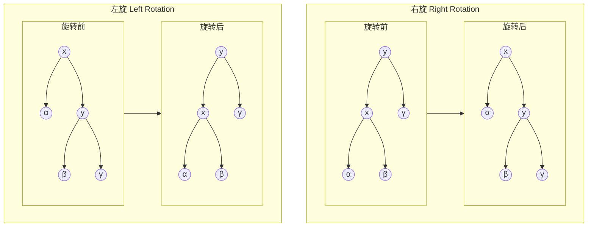

# 1.相关知识引入

在数据结构中,我们学会了建立常规的二叉树,规律可以按照左小右大(或者其他规律)来进行构造一棵二叉树.但是,我们需要思考一个问题:如果我输入一个有序的序列,这棵树就会退化成一个链表,这就失去了我们建立二叉树便于查找存储的初衷.我们现在需要解决的问题是-->如何在输入任意数据(无规律)的同时,使数据结构还能是一颗二叉树.自此,我们引入了一种==自平衡的==二叉树--红黑树.

--- 

# 2.关于红黑树的相关知识点
### 2.0.红黑树的性质
- 每个结点或是红色或是黑色
- 根节点为黑色
- 每个叶子结点是黑色的
- 如果一个结点是红色的,那么他的两个子节点都是黑色的(红结点不相邻)
- 对于每个结点,从该结点到其所有的后代叶子结点的简单路径上,具有的黑色结点数量(黑高)相同

---
### 2.1.预备内容
在构建红黑树前,我们需要先定义结点以及相关判定方法:
- 结点颜色枚举
```C++
enum Color { Red, Black };
```
- 结点结构体
```C++
typedef struct Node {  
    int val;  
    Color color = Red;  
    Node* left = nullptr;  
    Node* right = nullptr;  
	Node* parent = nullptr;   //父结点
    Node(int data) : val(data) {}  
} Node;
```
- 判断是否为左孩子
```C++
bool isLeft(Node* node) {  
    return node->parent && node == node->parent->left;  
}
```
- 判断是否为叔结点
```C++
Node* isUncle(Node* node) {  
    if (!node->parent || !node->parent->parent) {  
       return nullptr;  
    }  
    return isLeft(node->parent) ? node->parent->parent->right : node->parent->parent->left;  
}
```
- 判断兄弟结点
```C++
Node* isBrother(Node* node) {  
    if (!node->parent) return nullptr;  
    return isLeft(node) ? node->parent->right : node->parent->left;  
}
```
- 判断结点颜色
```C++
//是否为红
bool isRed(Node* node) {  
    return node && node->color == Red;  
}  
//是否为黑
bool isBlack(Node* node) {  
    return !node || node->color == Black;  
}
```


---
### 2.2.红黑树的平衡机制-->旋转和变色
- 旋转
通过左旋/右旋(同时修改结点颜色)来保证平衡

#### 左旋
```C++
void leftRotate(Node* y) {  
    Node* x = y->right;  
    y->right = x->left;  
    if (x->left) x->left->parent = y;  
      
    x->parent = y->parent;  
    if (!y->parent) {  
       root = x;  
    } else if (isLeft(y)) {  
       y->parent->left = x;  
    } else {  
       y->parent->right = x;  
    }  
      
    x->left = y;  
    y->parent = x;  
}
```
#### 右旋
```C++
void rightRotate(Node* y) {  
    Node* x = y->left;  
    y->left = x->right;  
    if (x->right) x->right->parent = y;  
      
    x->parent = y->parent;  
    if (!y->parent) {  
       root = x;  
    } else if (isLeft(y)) {  
       y->parent->left = x;  
    } else {  
       y->parent->right = x;  
    }  
      
    x->right = y;  
    y->parent = x;  
}
```

- 在红黑树的构建过程中,需要结合树当前的情况来调整结点的颜色

---
### 2.3.红黑树的构建与增删改查
#### 增
按照二叉树的规则正常添加,需要处理**红红不平衡**的情况
由于结点的颜色默认为红色,所以需要修正方法(重点)
- 插入结点为根节点,将根节点变黑
- 插入结点的父亲为黑色,红黑性质不变,无需调整 ; 插入结点的父亲为红色,触发红红相邻
- 叔叔为红色
- 叔叔为黑色
```C++
void fixUp(Node* x) {  
	// 结点不为根节点(循环不变式),处理红红不平衡
    while (x != root && isRed(x->parent)) {  
       Node* parent = x->parent;  
       Node* grandparent = parent->parent;  
       Node* uncle = isUncle(x);  
        //叔叔是红色 
       if (isRed(uncle)) {  
	       //将父结点和叔结点的颜色变黑-->黑高+1
          parent->color = Black;  
          uncle->color = Black;  
          //将祖父结点变红-->黑高-1-->平衡-->可能继续触发红红不平衡
          grandparent->color = Red;  
          //将操作的结点设置为祖父结点,迭代修改,直至修改到根节点为止
          x = grandparent;  
       } 
       //叔叔为黑色
       else {  
	       //父结点是左孩子
          if (isLeft(parent)) {  
	          /*插入结点也为左孩子-->LL不平衡-->右旋祖父结点
	         插入结点为右孩子-->LR不平衡-->先左旋父结点再右旋祖父结点*/
             if (!isLeft(x)) {  
                x = parent;  
                leftRotate(x);  
                parent = x->parent;  
                grandparent = parent->parent;  
             }  
             parent->color = Black;  
             grandparent->color = Red;  
             rightRotate(grandparent);  
          } 
          //父结点是右孩子
          else {  
	          /*插入结点也是右孩子-->RR不平衡-->左旋祖父结点
	           插入结点是左孩子-->RL不平衡-->先右旋父结点再左旋祖父结点*/
             if (isLeft(x)) {  
                x = parent;  
                rightRotate(x);  
                parent = x->parent;  
                grandparent = parent->parent;  
             }  
             parent->color = Black;  
             grandparent->color = Red;  
             leftRotate(grandparent);  
          }  
       }  
    }  
    //不满足循环不变式时,即插入的结点为根节点,直接将根节点变黑
    root->color = Black;  
}
```

```C++
// 插入数据  
void Insert(int val) {  
    Node* parent = nullptr;  //父结点初始值为NULL,每次变量更新为当前结点
    Node* current = root;  
      
    while (current) {  
       parent = current;  
       if (val < current->val) {  
          current = current->left;  
       } else if (val > current->val) {  
          current = current->right;  
       } else {  
          return; // 值已存在  
       }  
    }  
    //新增结点  
    Node* newNode = new Node(val);  
    //
    newNode->parent = parent;  
      
    if (!parent) {  
	    //父结点为空时,根节点成为新增结点
       root = newNode;  
    }
    //按照左小右大插入结点
     else if (val < parent->val) {  
       parent->left = newNode;  
    } else {  
       parent->right = newNode;  
    }  
      //修正红红不平衡
    fixUp(newNode);  
}
```
#### 删
按照二叉树的删除规则删除,需要处理**黑黑不平衡**的情况
##### 辅助方法
- 查找结点和查找后继结点
```C++
// 查找结点  --> 常规查找,小向左大向右
Node* Find(int target) {  
    Node* p = root;  
    while (p) {  
       if (target < p->val) {  
          p = p->left;  
       } else if (target > p->val) {  
          p = p->right;  
       } else {  
          return p;  
       }  
    }  
    return nullptr;  
}  
  
// 查找后继结点  
Node* findSuccessor(Node* node) {  
    if (!node->right) return nullptr;  
    Node* succ = node->right;  
    while (succ->left) {  
       succ = succ->left;  
    }  
    return succ;  
}
```
- 修正黑黑不平衡
分类如图：

```C++
// 处理双黑情况  
void fixDoubleBlack(Node* x) {  
    if (!x) return;  
      
    while (x != root) {  
       Node* parent = x->parent;  
       Node* sibling = isBrother(x);  
         
       if (!sibling) break;  
         //如果兄弟是红色
       if (isRed(sibling)) {  
       //为了保证必须有黑色子节点,将兄弟染黑父结点染红
          parent->color = Red;  
          sibling->color = Black;  
          //旋转父结点进行平衡修正
          if (isLeft(x)) {  
             leftRotate(parent);  
          } else {  
             rightRotate(parent);  
          }  
          sibling = isBrother(x); // 更新兄弟节点  
       }  
         //兄弟的两个子节点都是黑色
       if (isBlack(sibling->left) && isBlack(sibling->right)) {  
          sibling->color = Red;  
          if (isRed(parent)) {  
             parent->color = Black;  
             break;  
          } else {  
             x = parent;  
          }  
       } 
       //兄弟的子结点至少有一个是红色
       else {  
          if (isLeft(x)) {  
             if (isBlack(sibling->right)) {  
             //交换兄弟结点和其左孩子结点的颜色
                sibling->color = Red;  
                if (sibling->left) sibling->left->color = Black; 
                //右旋兄弟结点 
                rightRotate(sibling);  
                //更新兄弟结点为其原左孩子
                sibling = parent->right;  
             }  
             sibling->color = parent->color;  
             parent->color = Black;  
             if (sibling->right) sibling->right->color = Black;  
             leftRotate(parent);  
          }
           else {  
             if (isBlack(sibling->left)) {  
                sibling->color = Red;  
                if (sibling->right) sibling->right->color = Black;  
                leftRotate(sibling);  
                sibling = parent->left;  
             }  
             sibling->color = parent->color;  
             parent->color = Black;  
             if (sibling->left) sibling->left->color = Black;  
             rightRotate(parent);  
          }  
          break;  
       }  
    }  
    if (x) x->color = Black;  
}
```
##### 删除方法
- 删除的结点有两个孩子
- 删除的是根节点-->如果删完了,根节点为null,反之则用剩余结点替换根节点的值
- 删除的是黑结点,剩下红结点,剩下的这个红结点变黑
- 删除结点或剩余结点的兄弟,兄弟的孩子都为黑
- 删除的结点的兄弟为黑,且至少有一个红色侄子
```C++
// 执行删除操作  
void doRemove(Node* deleted) {  
    if (!deleted) return;  
      
    Node* child = !deleted->left ? deleted->right :   
    !deleted->right ? deleted->left : nullptr;  
    Node* parent = deleted->parent;  
      
    bool isDeletedBlack = isBlack(deleted);  
    //没有孩子 
    if (!deleted->left && !deleted->right) {  
       // 情况1：删除的是叶子节点  
       //如果是根节点且没有左右孩子,直接置空
       if (deleted == root) {  
          root = nullptr;  
       }
       //反之替换根节点的值,并修正黑黑不平衡 
       else {  
          if (isDeletedBlack) {  
             fixDoubleBlack(deleted);  
          }  
          //如果删除的结点是左孩子,左孩子置空
          if (isLeft(deleted)) {  
             parent->left = nullptr;  
          }
          //反之右孩子置空 
          else {  
             parent->right = nullptr;  
          }  
       }  
       //释放内存
       delete deleted;  
       return;  
    }  
    // 情况2：删除的节点有一个子节点 
    if (!deleted->left || !deleted->right) {  
       if (deleted == root) {  
          deleted->val = child->val;  
          deleted->left = deleted->right = nullptr;  
          delete child;  
       } else {  
          if (isLeft(deleted)) {  
             parent->left = child;  
          } else {  
             parent->right = child;  
          }  
          child->parent = parent;  
            
          if (isDeletedBlack && isBlack(child)) {  
             fixDoubleBlack(child);  
          } else {  
             child->color = Black;  
          }  
          delete deleted;  
       }  
       return;  
    }  
      
    // 情况3：删除的节点有两个子节点  
    Node* successor = findSuccessor(deleted);  
    deleted->val = successor->val;  
    doRemove(successor);  
}
```

#### 改/查
修改和查找的操作和二叉树的操作类似,修改之后需要重新修正平衡
```C++
// 修改数据

// 查找数据  
bool Search(int target) {  
    return Find(target) != nullptr;  
}
```

---

