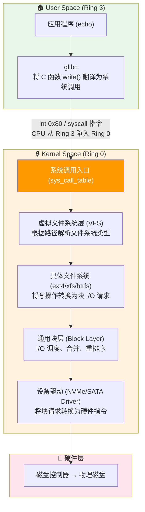
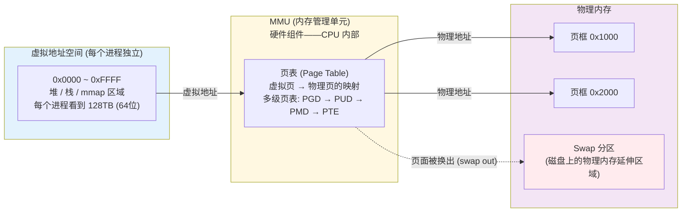
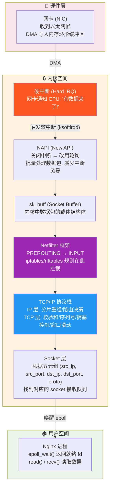

# Linux 内核破壁：从底层机制到内核调优与 DIY 专属操作系统

## 1. 引言：跨越边界——User Space 与 Kernel Space 的楚河汉界

在上一篇[[Linux基础]]的文章中，你学会了在终端里像呼吸一样自然地游走。你敲下 `echo "hello" > /dev/tty`，文字出现在屏幕上——一切都那么理所当然。

但你的大脑里一定盘旋着一个问题：**"这个 `echo` 进程到底是怎么把字符串写进一个'设备文件'的？它凭什么有资格碰硬件？"**

答案藏在一个被刻意维护的边界背后。这个边界，是从 Intel 80386 时代起，CPU 就在芯片层面强制执行的隔离墙——**CPU 特权级环 (Protection Rings)**。

```
        ┌─────────────────────────────────────────┐
        │               Ring 3                     │
        │          User Space (用户空间)            │
        │                                          │
        │  你的 echo、vim、nginx、python 全在这里    │
        │  无权直接访问物理内存、磁盘、网卡          │
        │  想干什么？请按门铃——System Call          │
        └──────────────────┬──────────────────────┘
                           │
                    系统调用 (System Call)
                    这是一条精心管控的单行道
                           │
        ┌──────────────────▼──────────────────────┐
        │               Ring 0                     │
        │        Kernel Space (内核空间)            │
        │                                          │
        │  进程调度、内存分配、文件系统、网络协议栈   │
        │  这里掌管一切硬件资源，是真正的独裁者      │
        │  任何越权访问都会被 CPU 硬件机制当场击毙    │
        └─────────────────────────────────────────┘
```

> [!important] 架构重点：内核的"独裁者"角色
> 内核不是操作系统的"一部分"，内核**就是**操作系统本身。我们从应用层看到的所谓"Linux 系统"，实际上是内核 + 一堆跑在 Ring 3 的用户态工具（GNU Coreutils、systemd、glibc……）的集合体。但所有用户态进程都在一个精心构建的沙箱里运行——它们看不见真实物理地址，拿不到原始磁盘 I/O 权限，甚至连申请一块内存都要看内核的脸色。这不是限制，这是保护。一个死循环的 Python 脚本不会把整个服务器卡死，因为内核调度器会在时间片耗尽时强行剥夺它的 CPU。一个越界写内存的 C 程序只会收到 SIGSEGV 然后被处决，而不是把隔壁进程的数据改得面目全非。

### 1.1 一条 `write()` 调用的完整旅程

当你执行 `echo "hello" > /tmp/test.txt` 时，底层到底发生了什么？请看下面这幅图——



这条调用链路的每一层都体现了 **"机制与策略分离"** 的系统设计精髓：

- **VFS 层**提供统一的 `open/read/write/close` 接口（机制），不管底下是 ext4 还是 xfs，应用层代码完全不变（策略在底层实现）。
- **块层**可以进行 I/O 合并和重排序（机制），而具体的调度算法（noop/deadline/cfq/kyber）是策略。
- **设备驱动**屏蔽了 NVMe 和 SATA 在硬件协议上的差异，对上层暴露出一个统一的"块设备"抽象。

> [!info] 开发者视角
> 如果你写过面向接口编程的代码，你会发现 Linux 内核就是设计模式的终极形态。VFS 的 `struct file_operations` 是一个包含了 `read()`、`write()`、`mmap()` 等函数指针的结构体。每种文件系统（ext4、xfs、nfs、procfs）各自填充这些指针，指向自己的实现。这就是 C 语言里的**多态**，没有 `virtual` 关键字，没有 vtable 编译器魔法——纯粹的 struct + 函数指针，比任何面向对象框架都更优雅，因为它零运行时开销。

> [!tip] 运维视角
> 理解这个分层模型的现实意义在于：当你排查一个磁盘 I/O 的线上问题时，你不会像无头苍蝇一样到处抓日志。你知道问题一定发生在这条链路的某一层——是 VFS 层的锁争用？是文件系统碎片化导致的寻道延迟？是块层的 I/O 调度策略不合理？还是磁盘硬件本身的 SMART 数据爆红了？分层定位，逐级排除，效率是指数级提升的。

---

## 2. 拆解引擎：Linux 内核的四大核心子系统

如果说内核是一部精密的发动机，那它的四大子系统就是活塞、曲轴、燃油系统和进排气。每一个都在独立运转，但只有它们精确配合时，数十万行的内核代码才能汇成一股推动万物运行的洪流。

### 2.1 进程调度器 (CPU Scheduler)——决定 "谁先用CPU" 的法官

现代服务器的 CPU 动辄 64 核、128 线程，但跑在上面的进程可能有上千个。谁先执行？执行多久？谁被暂时"冷冻"？这一切由一个叫做 **CFS（Completely Fair Scheduler，完全公平调度器）** 的子系统决定。

**CFS 的核心思想不是"平均分配 CPU"，而是"追平虚拟运行时间"。**

```
每个进程有一个 vruntime (虚拟运行时间)，单位是纳秒。
CFS 维护一个红黑树 (red-black tree)，按 vruntime 从小到大排列。
每次调度时，CFS 选择 vruntime 最小的进程运行。
vruntime 的增长速度 = 实际运行时间 × (1024 / 进程权重)
```

关键推论：**低权重进程的 vruntime 增长更快**，所以它们"看起来"跑得更久，实际拿到的时间片更少。高权重进程（比如 `nice` 值低的交互式程序）vruntime 增长慢，所以它们更频繁地出现在红黑树的最左端，拿到更多 CPU。

```bash
# 查看当前系统上各进程的调度信息
cat /proc/$$/sched
# 输出示例（部分）：
# bash (10652, #threads: 1)
# -------------------------------------------------------------------
# se.exec_start                 :     183748576.817852    # 最近一次被调度的时间
# se.vruntime                   :      87654321.123456    # 虚拟运行时间 ← 核心指标
# se.sum_exec_runtime           :       1234567.890123    # 实际已运行的物理时间
# nr_switches                   :               38472    # 上下文切换次数

# 查看一个进程的 nice 值（影响调度权重）
ps -eo pid,ni,comm | grep nginx
# 输出:  12345   0 nginx
# nice 值范围 -20 (最高优先级) 到 19 (最低优先级)，默认 0
```

> [!important] 架构重点：为什么是"红黑树"而不是"就绪队列"？
> Linux 2.4 时代的 O(1) 调度器使用双向链表组织就绪进程，虽然复杂度是 O(1)，但它在交互式场景下表现糟糕——GUI 程序和后台批处理任务被"一视同仁"，造成桌面系统卡顿。CFS 用红黑树（自平衡二叉搜索树）组织进程，查找最小 vruntime 的复杂度是 O(log n)，但换来的是对"公平性"的精确建模——每个进程的等待时间与其权重严格挂钩。对于几百到几千个进程的典型场景，log n 的开销完全可以接受。这是工程上"以少量计算换取更公平调度"的教科书级 trade-off。

> [!bug] 生产痛点：Load Average 的认知误区
> 很多运维看到 `load average: 8.0` 就慌了："我的 4 核机器负载 8 了！"这里的 8 不全是 CPU 在忙——`load average` 统计的是**处于 R (Running) 和 D (Uninterruptible Sleep) 状态的进程数**。D 状态意味着进程在等待 I/O 完成（磁盘、网络），此时 CPU 可能是空闲的。所以高 Load Average ≠ CPU 瓶颈。正确做法是同时看：`top` 里的 `%us`（用户态 CPU 占用）、`%wa`（I/O 等待）、以及 `vmstat 1` 里的 `b` 列（阻塞队列长度）。如果 `%wa` 高 + `b` 列数值大 → I/O 瓶颈；如果是 `%us` 高 + load average 远大于核数 → 确实是 CPU 瓶颈。

### 2.2 内存管理 (Memory Management)——你以为你"有"的那些内存

你在程序里 `malloc(1024 * 1024 * 1024)` 申请了 1GB 内存，内核说："拿去。"然后你的程序就以为它真的拿到了 1GB 连续物理内存。

**你在做梦。**

内核给你的是虚拟地址空间（Virtual Address Space）里的一段连续区域。这段虚拟地址后面可能映射着：

- 几块散布在物理内存各个角落的 4KB 页框（Page Frame）
- 一大片被标记为"已分配但从未被访问过"的零页
- 甚至……根本不存在的物理内存（等真正写的时候才会触发缺页中断，届时再分配）

这就是**虚拟内存**和**按需分页 (Demand Paging)** 的底层真相。



> [!important] 架构重点：Swap 不是"慢内存"，是"内存的逃生舱"
> Linux 的 Swap 机制常被误解为"内存不够了才往磁盘写"。这是一个危险的简化认知。实际上 Linux 内核的内存管理有一个叫做**内存回收 (Memory Reclaim)** 的后台进程（kswapd），它在物理内存还充裕时就在做**预换出**——把那些长时间没被访问过的匿名页（没有文件映射的内存页，比如程序的堆和栈）悄悄换出到 Swap。目的是**腾出物理内存给 Page Cache（文件缓存）**，因为对大多数服务器来说，缓存更多的文件数据块对性能的正面影响远大于保留一堆僵尸内存页。
>
> **换句话说：Swap 不是应急手段，是内存管理策略的一部分。** 彻底关闭 Swap 在某些场景下反而会让内存管理变得僵硬，因为内核丢掉了最后一个腾挪空间的手段，只能靠 OOM Killer 杀进程。

```bash
# 查看当前系统的 Swap 使用情况
free -h
# 输出示例：
#               total        used        free      shared  buff/cache   available
# Mem:            15Gi       8.2Gi       2.1Gi       456Mi       5.3Gi       6.8Gi
# Swap:          2.0Gi       128Mi       1.9Gi
#
# 解读：
# - "free" 是真正完全未被使用的物理内存
# - "available" 是实际可用于新进程的内存 (free + 可回收的缓存)
# - Swap 128Mi 在使用中，说明有少量匿名页被换出了

# 查看 Swap 的使用倾向——这个参数决定了内核"多激进地"使用 Swap
cat /proc/sys/vm/swappiness
# 默认值 60。取值范围 0~100
# 0: 尽量不用 Swap (除非 OOM)
# 100: 积极使用 Swap
# 对于数据库服务器，通常建议调低到 10~20
```

> [!warning] 危险操作：不要把 `vm.swappiness=0` 当成银弹
> 很多人看了网上文章就把数据库服务器的 `vm.swappiness` 设为 0。不幸的是，在 3.5 之前的内核中，`0` 的含义是"除非 OOM 否则打死不用 Swap"，但在更新的内核中，`0` 的含义变成了"除非内存极度紧张否则不用 Swap"——区别微妙但足以在运维文档里埋下一颗不定时炸弹。建议用 `vm.swappiness=1` 来表达"尽量别 swap"的意图，语义更明确。

> [!info] 开发者视角
> 虚拟内存的设计是对所有上层编程语言最深刻的隐性影响。你写 Java，以为 `new byte[1024]` 分配在"堆"上——这个堆其实是 JVM 在虚拟地址空间里分配的一段区域，JVM 再自己管理它内部的分配和 GC。你写 Go，goroutine 的栈从 2KB 起步，动态增长——这依赖的是 `mmap` 在虚拟地址空间里预留大段区域，然后按需提交物理页。你写 C，`malloc` 底下是 `brk()` 和 `mmap()` 两个系统调用，它们请求的是虚拟地址，物理内存的分配发生在第一次写入时（缺页中断）。**理解了虚拟内存，你就理解了所有高级语言的内存模型本质。**

### 2.3 虚拟文件系统 (VFS)——用同一套接口操作世间万物

还记得你在第一篇里学到的"一切皆文件"吗？让这个哲学变成现实的，是一个叫做 VFS（Virtual File System）的内核子系统。

VFS 本质上是一个**面向对象的抽象层**，只不过它用纯 C 实现，没有 class 关键字。它的"接口"是四个核心数据结构：

```
struct super_block      → 代表一个挂载的文件系统（一个磁盘分区、一个 proc、一个 NFS 挂载）
struct inode            → 代表一个文件（在磁盘上、在内存中、甚至在网络另一端）
struct dentry           → 代表目录缓存项，连接文件名和 inode
struct file             → 代表一个被打开的文件（有读写位置、有打开模式）
```

每种具体文件系统（ext4、xfs、btrfs、nfs、procfs、sysfs、tmpfs……）只需要实现一组函数指针，就能接入 VFS：

```c
// 内核源码中的 struct file_operations (简化版)
// 路径: include/linux/fs.h
struct file_operations {
    struct module *owner;
    loff_t (*llseek) (struct file *, loff_t, int);
    ssize_t (*read) (struct file *, char __user *, size_t, loff_t *);
    ssize_t (*write) (struct file *, const char __user *, size_t, loff_t *);
    int (*mmap) (struct file *, struct vm_area_struct *);
    int (*open) (struct inode *, struct file *);
    int (*flush) (struct file *, fl_owner_t id);
    int (*release) (struct inode *, struct file *);
    // ... 还有更多函数指针
};
```

```bash
# 查看当前系统已挂载的文件系统类型
mount | awk '{print $5}' | sort | uniq -c
# 你可能会看到：
#   ext4, xfs, proc, sysfs, devtmpfs, tmpfs, cgroup2, ...
# 每一种都用同一套 open/read/write/close 接口暴露给用户空间

# 验证 VFS 的统一性：三个完全不同的"文件"，用同一个 cat 读取
cat /etc/hostname                    # ext4/xfs 磁盘文件
cat /proc/cpuinfo                    # procfs 伪文件——内核实时生成的 CPU 信息
cat /sys/class/net/eth0/mtu          # sysfs 伪文件——网络设备属性
```

> [!tip] 运维视角：通过 VFS 读取内核状态，比学专用工具更快
> Linux 的 procfs 和 sysfs 是你最强大的排障盟友——它们暴露的是一个活体系统的实时解剖图。`cat /proc/meminfo` 给你完整的内存剖面，`cat /proc/net/dev` 给你所有网卡的收发包计数，`cat /proc/diskstats` 给你每块盘的 I/O 统计。你不用装任何监控 Agent（那是 Prometheus Node Exporter 干的事——它本质上也是在读这些文件），内核状态就在你的指尖。

> [!info] 开发者视角：为什么 Go 的 `io.Reader` / `io.Writer` 如此好用——因为它在复刻 VFS
> Go 标准库只定义了两个接口：`io.Reader`（Read）和 `io.Writer`（Write），然后把文件、网络连接、压缩流、加密流、缓冲器全部实现为这两个接口。你调用 `io.Copy(dst, src)` 时，不在乎 src 是一个 os.File 还是一个 net.Conn 还是一个 gzip 解压流。这种"面向接口编程"的哲学，Linux 内核在 1991 年就用 C 语言的 struct + 函数指针实现了。**优秀的软件设计从来不依赖于语言的语法糖，它依赖于对问题本质的抽象能力。**

### 2.4 网络协议栈 (Network Stack)——一个数据包的万里长征

当一个 HTTP 请求（"GET /api/users"）被封装在 TCP 报文里、包裹在 IP 包里、塞进以太网帧里，然后以光速通过网线到达你的服务器网卡——它要经历什么才能变成 Nginx 进程里一行可读的日志？



> [!important] 架构重点：为什么 NAPI 比纯中断驱动更好？
> 早年内核采用"每个数据包触发一次硬中断"的模式。在高吞吐场景下（比如 10Gbps+ 的流量），每秒几十万个数据包意味着每秒几十万次中断——CPU 会把大量时间花在中断上下文切换上，真正干活的时间反而少了。这叫做 **"中断风暴 (Interrupt Storm)"**，本质上是**接收活锁 (Receive Livelock)**——CPU 忙得要死但吞吐量上不去。
>
> NAPI 的解法是：第一个数据包到达时触发中断 → 中断处理函数关闭该网卡的中断 → 在内核线程 `ksoftirqd` 中轮询网卡的接收队列 → 批量处理一组数据包 → 队列清空后再重新开启中断。这种"中断 + 轮询混合"模式在高吞吐场景下将上下文切换开销降低了若干个数量级。

> [!bug] 生产痛点：`nf_conntrack` 表爆满导致新连接被丢弃
> Netfilter 的连接跟踪模块（nf_conntrack）会为每一个网络连接维护一条状态记录。在高并发的 NAT 网关或负载均衡器上，如果 `nf_conntrack_max` 设得太小，连接跟踪表会爆满，内核会丢弃后续所有新连接——而你的应用程序会看到连接超时或 Connection Refused，日志里却毫无线索。排查方法：
>
> ```bash
> # 查看当前连接跟踪表的用量
> cat /proc/sys/net/netfilter/nf_conntrack_count
> # 查看最大容量
> cat /proc/sys/net/netfilter/nf_conntrack_max
> # 查看当前被跟踪的连接
> conntrack -L | wc -l
> # 如果 count 接近 max → 调大上限或缩短超时时间
> echo 262144 > /proc/sys/net/netfilter/nf_conntrack_max
> ```

---

## 3. 掌控引擎：系统调优与动态观测

如果前面的四大子系统是发动机的工程图纸，那这一节就是驾驶舱里的仪表盘和控制杆。你不能拆开发动机看内部状态，但你可以通过 `/proc` 和 `/sys` 这两个"透视窗口"实时观测内核的一举一动——并且通过 `sysctl` 在运行中调整它的行为参数。

### 3.1 透视内核：`/proc` 和 `/sys` 伪文件系统

首先要打破一个常见的认知错误：`/proc` 和 `/sys` 不是真实的文件系统。它们不存在于任何磁盘上，它们是**内核在内存中构建的实时数据镜像**。你每 `cat` 一次 `/proc/meminfo`，内核当场计算一次最新的内存统计然后返回。

```bash
# /proc 里一些你可能天天用但未必理解本质的文件
cat /proc/meminfo        # 内存全景剖面图——MemTotal/MemFree/Cached/Buffers/SwapTotal
cat /proc/cpuinfo        # 每颗 CPU 核心的型号/频率/缓存/特性位
cat /proc/loadavg        # 1/5/15 分钟平均负载 + 当前运行的进程 ID
cat /proc/uptime         # 系统启动以来的秒数 + 空闲秒数（精确到厘秒）
cat /proc/$$/maps        # 当前 bash 进程的虚拟地址空间映射表
cat /proc/$$/limits      # 当前 bash 进程的资源限制（ulimit 的运行时状态）
cat /proc/buddyinfo      # 伙伴分配器（Buddy Allocator）的状态——物理页碎片化程度

# /sys 提供了更结构化的内核对象视图
ls /sys/class/net/eth0/  # 网络设备 eth0 的所有可读/可写属性
cat /sys/block/sda/queue/scheduler   # 查看当前 I/O 调度器
# 输出: [mq-deadline] kyber bfq none → 当前使用 mq-deadline

cat /sys/devices/system/cpu/cpu0/cpufreq/scaling_governor
# 输出: powersave / performance / ondemand → CPU 调频策略
```

> [!tip] 最佳实践：用 `/proc` 替代大部分专用工具
> 下次你想看系统信息时，试试用 `cat` 直接读 `/proc` 而不是打开 `htop`。`htop` 好看，但它只是把 `/proc` 的数据做了可视化包装。当你通过 SSH 连上一个极其精简的容器或者嵌入式设备，那里可能根本没有 `htop`、没有 `lsof`、甚至没有 `ping`——但 `/proc` 和 `/sys` 一定在。掌握直接读取内核接口的能力，是你在极端环境下保持排障能力的护身符。

### 3.2 实战调优：高并发场景下的 `sysctl` 网络参数调优

假设你维护着一台每秒处理 10 万并发连接的 API 网关。客户端疯狂地建立和关闭 TCP 连接。在默认内核参数下运行到第 30 分钟，你会看到：

```
nginx: accept() failed (24: Too many open files)
[error] socket() failed (24: Too many open files) while connecting to upstream
```

这不是 Nginx 配置问题，这是**内核在对你摇红旗**。

```bash
# === 1. 文件描述符上限——"Too many open files" 的根因 ===

# 系统级：整个内核允许打开的文件描述符总数
cat /proc/sys/fs/file-max
# 默认通常只有几十万，高并发场景下可以调到：
echo 2097152 > /proc/sys/fs/file-max

# 查看当前系统已打开的文件描述符数量
cat /proc/sys/fs/file-nr
# 输出: 16384  0  2097152
#      ↑已分配  ↑未使用  ↑上限

# 进程级：单个进程能打开的文件描述符上限（需要配合 ulimit）
# 在 /etc/security/limits.conf 中设置：
# nginx  soft  nofile  65536
# nginx  hard  nofile  65536
# 然后在 nginx 启动脚本中执行：ulimit -n 65536

# === 2. TCP TIME_WAIT 优化——连接的"僵尸回收" ===

# 主动关闭方在连接关闭后会进入 TIME_WAIT 状态，持续 60 秒。
# 高并发短连接场景下，TIME_WAIT 会把本地端口耗光。
# 查看当前 TIME_WAIT 数量：
ss -tan state time-wait | wc -l

# 允许重用 TIME_WAIT 状态的 socket 用于新连接（客户端侧）
# 注意：只在发起连接（而非被动监听）的场景下安全
echo 1 > /proc/sys/net/ipv4/tcp_tw_reuse

# TIME_WAIT 的最大数量——超过此值后新进入的 TIME_WAIT 会被直接销毁
echo 65536 > /proc/sys/net/ipv4/tcp_max_tw_buckets

# 加快 FIN_WAIT2 的超时（默认 60 秒）—— 仅适用于内网低延迟场景
echo 30 > /proc/sys/net/ipv4/tcp_fin_timeout

# === 3. 监听队列深度——"Connection Refused" 的隐藏根因 ===

# SYN 队列（半连接队列）的最大长度——处理 SYN Flood 攻击的关键防线
echo 8192 > /proc/sys/net/ipv4/tcp_max_syn_backlog

# Accept 队列（全连接队列）的最大长度——积压在应用 accept() 之前的连接数
echo 4096 > /proc/sys/net/core/somaxconn
# 注意：这个值还需要在 Nginx 的 listen 指令中配合设置 backlog 参数
# listen 80 backlog=4096;

# 查看当前是否有 Accept 队列溢出（丢连接！）
netstat -s | grep -i listen
# 如果看到 "times the listen queue of a socket overflowed" 的计数在涨 →
# 你的 somaxconn 或者应用层的 backlog 设得太小了，连接在到达 accept() 之前就被丢了！

# === 4. 套接字缓冲区——吞吐量的隐性瓶颈 ===

# 查看当前默认的接收/发送缓冲区大小
cat /proc/sys/net/core/rmem_default   # 接收缓冲默认值
cat /proc/sys/net/core/wmem_default   # 发送缓冲默认值

# 对于 10Gbps 网络，建议调整为：
echo 16777216 > /proc/sys/net/core/rmem_max     # 最大接收缓冲 (16MB)
echo 16777216 > /proc/sys/net/core/wmem_max     # 最大发送缓冲 (16MB)
echo 4096 87380 16777216 > /proc/sys/net/ipv4/tcp_rmem  # min/default/max
echo 4096 65536 16777216 > /proc/sys/net/ipv4/tcp_wmem

# 启用 TCP 窗口自动缩放 (Window Scaling)——几乎必须开
echo 1 > /proc/sys/net/ipv4/tcp_window_scaling
```

> [!warning] 危险操作：`echo` 进 `/proc/sys` 的改动只在当前运行时生效，重启后会丢失
> 要让 `sysctl` 参数永久生效，必须写入 `/etc/sysctl.conf`（或 `/etc/sysctl.d/` 下的配置文件）：
>
> ```bash
> # /etc/sysctl.d/99-high-concurrency.conf
> fs.file-max = 2097152
> net.ipv4.tcp_tw_reuse = 1
> net.ipv4.tcp_max_tw_buckets = 65536
> net.ipv4.tcp_fin_timeout = 30
> net.ipv4.tcp_max_syn_backlog = 8192
> net.core.somaxconn = 4096
> net.core.rmem_max = 16777216
> net.core.wmem_max = 16777216
> net.ipv4.tcp_rmem = 4096 87380 16777216
> net.ipv4.tcp_wmem = 4096 65536 16777216
> net.ipv4.tcp_window_scaling = 1
>
> # 应用所有配置
> sysctl -p /etc/sysctl.d/99-high-concurrency.conf
> # 或一次性应用所有 sysctl 配置
> sysctl --system
> ```

> [!bug] 生产痛点：`tcp_tw_recycle` 的"血色浪漫"
> 你可能在一些古老的调优文档里看到 `net.ipv4.tcp_tw_recycle = 1` 的推荐。这个参数会启用 TIME_WAIT 的快速回收——听起来很美好。但它有一个致命的副作用：**它会破坏 NAT 环境下的 TCP 连接**。因为 `tcp_tw_recycle` 依赖 TCP 时间戳来区分新旧连接，而在 NAT 环境下，不同客户端的时间戳是不同的，内核会错误地丢弃合法请求，导致客户端随机出现连接超时。从 Linux 4.12 开始，这个参数已被**彻底移除**。如果你的 `/etc/sysctl.conf` 里还残留着这一行——删掉它。立刻。

> [!info] 开发者视角：从内核参数反推应用层设计
> 当你理解了 `somaxconn`（Accept 队列长度）和 `tcp_max_syn_backlog`（SYN 队列长度）的物理意义后，你的应用程序设计会自然地变得更好：
>
> - **不要在 accept 循环里做耗时操作**。每个被 accept 的连接都应尽快交给 worker 线程/协程处理，主线程立刻回到 accept 循环，因为 Accept 队列积压意味着新连接在被内核丢弃。
> - **连接池化是必须的**。短连接频繁建连/断连不仅消耗 TIME_WAIT 端口，还会产生大量的 TCP 三次握手/四次挥手开销。连接池的本质不是"省内存"，而是**避免与内核协议栈频繁互动**。
> - **`SO_REUSEPORT` 是神器**。Linux 3.9 引入的 `SO_REUSEPORT` 允许多个进程/线程绑定到同一个端口，内核以连接为单位进行负载分发。Nginx 的 `accept_mutex off` + `reuseport` 就是这个原理——用内核级的无锁分发替代应用层的锁争用。

---

## 4. 扩展引擎：可加载内核模块 (LKM)——内核的"热插拔"哲学

你插上一个新买的 USB 摄像头，Linux 立刻能识别并使用它。你没有重新编译内核，甚至没有重启系统。

这个"黑魔法"叫做 **LKM（Loadable Kernel Module，可加载内核模块）**。它让 Linux 内核拥有了传统单体内核不应具备的灵活性——在不重启的情况下，动态加载和卸载功能代码到内核空间（Ring 0）。

**LKM 的设计哲学一句话：内核的核心（vmlinuz）保持最小化，一切可选功能都做成"插件"。**

```
┌─────────────────────────────────────────────────┐
│              内核核心 (vmlinuz)                   │
│  进程调度器 · 内存管理 · VFS · 网络协议栈(核心)     │
│                                                 │
│  ┌──────┐  ┌──────┐  ┌──────┐  ┌───────────┐    │
│  │ ext4  │  │ xfs  │  │ nfs  │  │ nf_conntrack│   │
│  │ .ko   │  │ .ko  │  │ .ko  │  │ .ko        │   │
│  └──────┘  └──────┘  └──────┘  └───────────┘    │
│  ┌──────┐  ┌──────┐  ┌───────────┐              │
│  │GPU   │  │USB   │  │Wireless   │              │
│  │Driver│  │Driver│  │Driver     │              │
│  └──────┘  └──────┘  └───────────┘              │
│                                                 │
│  这些 .ko 文件可以在运行时 insmod / rmmod         │
│  它们直接跑在 Ring 0，享受完整的内核权限           │
└─────────────────────────────────────────────────┘
```

```bash
# 查看当前已加载的内核模块
lsmod
# 输出示例（前几列）：
# Module                  Size  Used by
# nf_conntrack          143360  2 nf_nat,ipt_MASQUERADE
# xfs                  1740800  1
# nvidia_drm             69632  0
#
# 解读：
# - Module: 模块名称
# - Size: 模块在内存中的大小（字节）
# - Used by: 依赖该模块的其他模块（数字是引用计数，后跟模块名）

# 查看某个模块的详细信息
modinfo xfs
# 输出: 模块路径、版本、依赖、参数列表

# 手动加载一个模块
sudo insmod /lib/modules/$(uname -r)/kernel/fs/btrfs/btrfs.ko
# 但 insmod 不自动处理依赖关系——实际中使用 modprobe 更多：

# modprobe 会自动解析模块依赖并加载所有需要的前置模块
sudo modprobe btrfs

# 卸载模块（引用计数为 0 时才能卸载）
sudo rmmod btrfs
# 或使用 modprobe -r（同样处理依赖）
sudo modprobe -r btrfs
```

> [!tip] 运维视角：容器镜像为什么可以把内核模块全扔掉？
> Docker 镜像里没有 `/lib/modules`——一个也没有。为什么？因为容器直接共享宿主机的内核。容器里的进程看到的文件系统（rootfs）是 Docker 提供的镜像层，但 `/proc`、`/sys`、内核模块这些属于 Kernel Space 的东西，根本不在容器可见的文件系统里。这就是为什么你不可能在容器里 `modprobe` 一个内核模块——你运行的内核就是你宿主机的那个内核，你需要的是在宿主机上加载模块，而不是在容器里。这也是容器和虚拟机的本质区别之一：**容器没有自己的内核**。

> [!important] 架构重点：LKM 的安全两难
> 内核模块跑在 Ring 0，拥有最高特权。一个恶意的或者有 bug 的内核模块可以直接读写所有物理内存、拦截所有系统调用、篡改所有进程的地址空间。这就是为什么：
>
> 1. **Secure Boot** 会验证内核模块签名——加载未签名的 .ko 会被拒绝。
> 2. **内核锁定 (Kernel Lockdown)** 模式会禁止所有未签名的内核代码执行。
> 3. **eBPF** 的兴起正是因为它的安全模型优于 LKM——eBPF 程序在内核中运行之前会经过验证器（Verifier）的严格检查，确保不会无限循环、不会越界访问、不会崩溃内核。在云原生时代，eBPF 正在逐步取代传统 LKM 的部分应用场景（如网络观测、安全审计、性能追踪）。

---

## 5. 终极极客浪漫：编译内核与 DIY 你的专属操作系统

如果前面四节是教你驾驶和调校一辆高性能跑车，那这一节就是——**打开引擎盖，告诉你这台引擎是怎么造出来的，以及为什么你完全可以在自家车库造一台**。

### 5.1 编译你自己的内核：比你想象的简单

编译 Linux 内核的流程在 2026 年已经高度自动化。但亲自走一遍这个流程后，你会对"内核究竟是什么"有一个身临其境的认知：

```bash
# 1. 获取源码（约 1.2GB）
git clone --depth 1 https://git.kernel.org/pub/scm/linux/kernel/git/stable/linux.git
cd linux

# 2. 基于当前运行内核的配置作为起点
#    （zcat /proc/config.gz 或从 /boot 复制）
cp /boot/config-$(uname -r) .config

# 3. 进入配置界面——整个流程的灵魂
make menuconfig
# 这是一个基于 ncurses 的 TUI（终端界面），里面有数千个配置选项。
# 你将面对一连串的灵魂拷问：
#   - 你的 CPU 是哪家的？Intel? AMD? ARM?
#   - 需要 NTFS 文件系统支持吗？
#   - 需要 Bluetooth 协议栈吗？
#   - 需要哪些网络拥塞控制算法？（cubic? bbr?）
#   - 需要 eBPF JIT 编译器吗？
#   - 需要 KVM 虚拟化支持吗？
#   - 要不要把 EXT4 驱动编译进内核本体 (y)，还是做成模块 (m)，还是去掉 (n)？

# 4. 编译（-j$(nproc) 使用全部 CPU 核心并行编译）
make -j$(nproc)

# 5. 安装模块和内核镜像
sudo make modules_install
sudo make install

# 6. 更新引导加载程序（GRUB）
sudo update-grub    # Debian/Ubuntu
sudo grub-mkconfig -o /boot/grub/grub.cfg   # Arch

# 7. 重启，在 GRUB 菜单里选择新内核启动
sudo reboot
```

> [!important] 架构重点：`y` / `m` / `n` 三种选择的工程含义
> 在 `make menuconfig` 里每个功能有三个选项：
>
> - **`y` (built-in, 内建)**：把代码编译进 `vmlinuz` 内核本体。优点是启动时直接可用、没有加载开销。缺点是增大了内核镜像的体积，增加了常驻内存占用。适用于 CPU 调度器、内存管理这类**必须**存在的核心功能。
> - **`m` (module, 模块化)**：编译为独立的 `.ko` 文件。优点是内核本体保持瘦小、按需加载、不用时卸载。缺点是加载时有少量初始化开销。适用于硬件驱动、不常用的文件系统（如 btrfs）。
> - **`n` (禁用)**：完全不编译。如果你的服务器上根本没有 NVMe 硬盘，为什么要把 NVMe 驱动编译进内核？每 KB 的内核代码都是潜在的 Bugs 和攻击面。

> [!tip] 最佳实践：云原生场景下的内核"瘦身"逻辑
> 现代容器优化的 Linux 发行版（如 Flatcar Container Linux、Bottlerocket、Talos）只保留了运行容器所需的最小内核功能集：
>
> - 不需要桌面环境 → 砍掉 DRM/KMS 图形栈
> - 不需要蓝牙/无线 → 砍掉整个 wireless 和 bluetooth 子系统
> - 不需要声音 → 砍掉 ALSA
> - 固定硬件平台 → 只编译当前硬件需要的驱动
> - 结果：内核镜像缩小到几 MB，启动时间从秒级降到毫秒级，攻击面指数级缩小。**你物理服务器上那个 90MB 的 `vmlinuz` 里，至少有 70MB 是这辈子不会被执行的死代码。**

### 5.2 LFS (Linux From Scratch)：操作系统"脱神化"

如果你觉得编译内核还不够硬核，那 LFS 会让你彻底看透。

**LFS 是什么？** 它不是一个发行版，而是一本书。这本书的每一页都在告诉你：**"去下载这个源码，用这些命令编译它，然后放到这个位置。"** 按顺序做完后，你得到了一个完全由自己编译的 Linux 操作系统——没有包管理器、没有一键安装、没有预设配置。你的第一个可启动的 LFS 系统大概只需要不到 200 个软件包的源码。

```
LFS 的构建阶梯：

  阶段 1: 交叉编译工具链
       ↓  构建临时的 binutils + gcc + glibc
       ↓  这三者构成你操作系统的"造物主三件套"
  阶段 2: 用临时工具链构建基础系统
       ↓  bash, coreutils, grep, sed, make, ...
       ↓  每一个包都是你手动 ./configure && make && make install
  阶段 3: 进入 chroot 环境
       ↓  从这一刻起，你在"自己的系统"里编译"自己的系统"
  阶段 4: 构建最终系统
       ↓  安装内核、配置启动、构建 init 系统
       ↓
  🎉 终点: 输入 reboot，看到你自己的登录提示符
```

> [!info] 开发者视角：LFS 的价值不在于"能用"，而在于"看得见"
> 你在大学操作系统课上背过"进程是资源分配的单位，线程是调度的单位"，但你可能从没亲手验证过一个进程的诞生。做完 LFS 之后，你会亲眼看到：
>
> - glibc 是用户空间程序和内核之间的"翻译官"——你编译的大多数程序都动态链接了它
> - `/sbin/init` 是用户空间的第一个进程，PID 恒为 1，它是所有其他进程的祖先
> - 你平时用的 `ls`、`cat`、`grep` 只是 `/bin` 下的几个二进制文件，你能用同一个工具链重新编译它们
> - "操作系统"不是一个神秘的黑盒，而是**一层层编译出来的软件栈**：内核在最底下，glibc 在中间，你的应用在最上面

> [!important] 架构重点：Linus 那句名言的真实含义
> 很多人以为"Linux 只是个内核"是技术分类学上的琐碎争论。但当你自己编译一次内核、再跑一次 LFS 流程后，你会真正理解这句话的力量：
>
> **GNU/Linux = Linux 内核 (vmlinuz) + GNU 工具链 (glibc + coreutils + binutils + gcc + bash + ...)**
>
> 我们日常所说的"Linux 系统"，实际上是 Linus 写的一个内核，加上 Richard Stallman 发起的 GNU 项目写的一整套用户空间工具，再加上各发行版（Debian/Red Hat/Arch）打的包、选的默认配置、做的集成工作。理解了这个分层，你就不会再把"Ubuntu 的某个 bug"和"Linux 内核的 bug"混为一谈——Ubuntu 的问题很可能在 systemd 或 NetworkManager 那层，和内核八竿子打不着。

---

## 结语：从"会用 Linux"到"理解 Linux"

这篇文章写得很长，但它的结构只有一个中心思想：**把 Linux 从一个你需要"背诵咒语"才能操作的黑盒，变成一个你能用工程直觉理解的白盒。**

回顾一下你刚刚穿越的这五个站点：

1. **User Space 与 Kernel Space 的边界** → 你知道了为什么 `echo` 不能直接写磁盘，为什么系统调用是唯一合法的"敲门方式"。
2. **四大核心子系统** → CFS 教你什么是公平，虚拟内存教你什么是假象，VFS 教你什么是抽象，网络栈教你什么是分层。
3. **`/proc` + `sysctl` 调优** → 你学会了不用任何第三方工具就能透视系统状态，并且用一行 `echo` 调出一个能扛 10 万并发的网络栈。
4. **LKM 内核模块** → 你知道了 Linux 的"插件系统"如何在不重启的情况下扩展内核能力，以及为什么 eBPF 在安全模型上更优。
5. **DIY 内核编译 + LFS 概念** → 你知道了"编译自己的内核"不是神话（虽然你可能永远不会在生产环境里这么做），并且理解了"操作系统不过是一堆源码编译后的集合"这句终极真理。

当你下次在线上排查一个诡异的高并发问题时，你不会再对着 `htop` 里花花绿绿的柱状图发愣。你会打开 `/proc`、检查 `sysctl` 参数、用 `perf top` 看内核函数热点、用 `strace` 追踪系统调用——因为你知道，所有答案都在那里，只不过以前你不知道门在哪。

**内核不可怕。可怕的是你不知道它不可怕。**

---

_下一篇预告：《网络协议栈深潜：从 TCP 三次握手到 Load Balancer 的底层协奏曲》_
