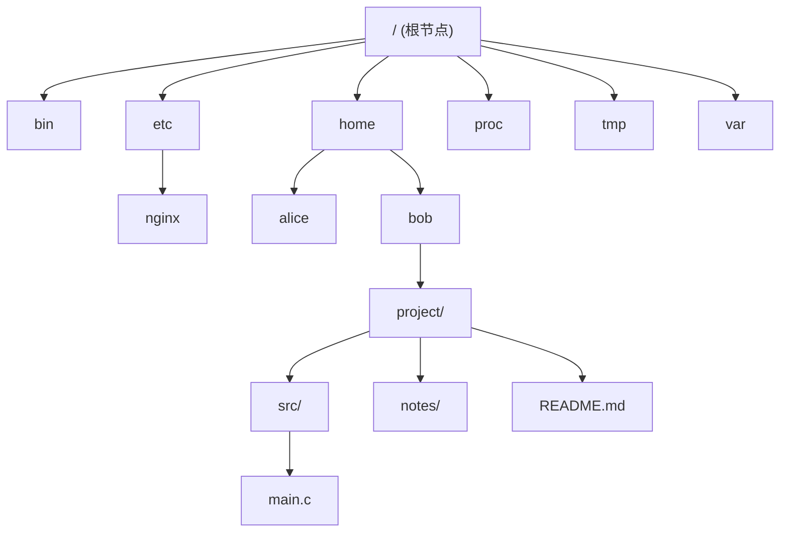
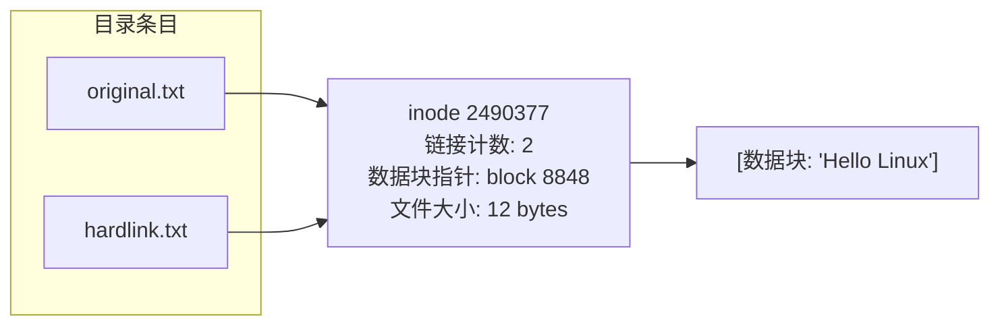
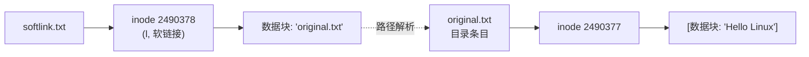
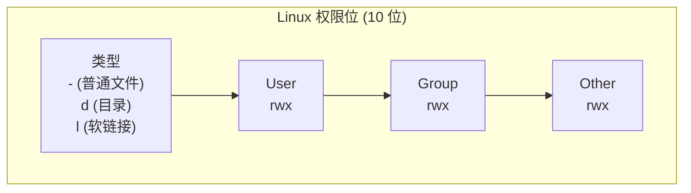
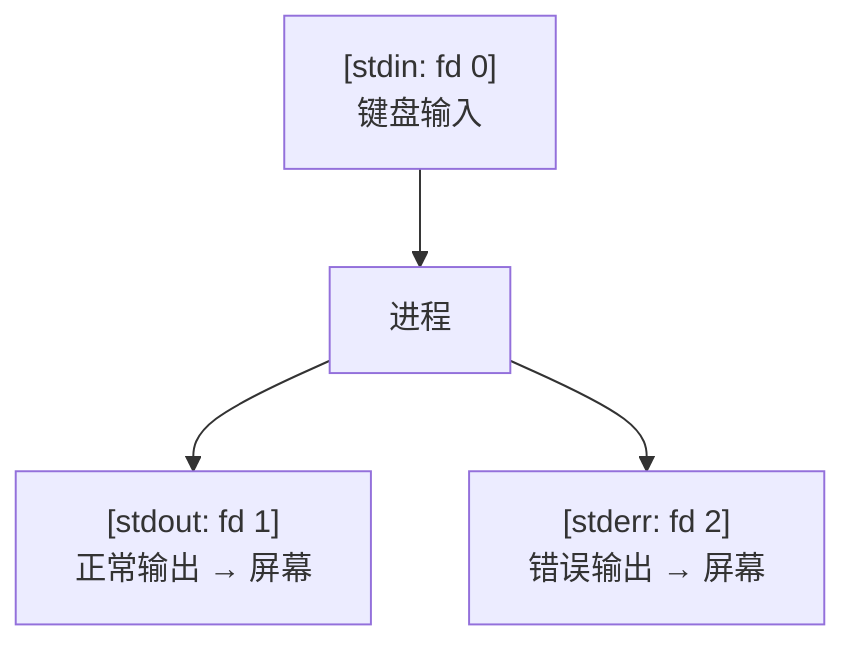

# Linux 核心原点：打破 GUI 依赖，像呼吸一样流畅使用纯终端

## 1. 引言：图形界面的假象与终端的绝对掌控

回想一下你在 Windows 或 macOS 上创建一个文件夹的过程：鼠标右键 → "新建文件夹" → 输入名称 → 回车。整个过程你与系统之间隔着一层厚厚的中间层——Shell Explorer 或 Finder。你看见的是一个名为 `新建文件夹` 的图标，但你无从得知底层发生了什么：inode 有没有被正确分配？文件系统元数据是什么样的？权限位是 755 还是 644？

图形界面是一层善意的谎言。它把系统的复杂性封装在一堆按钮、菜单和拖拽操作背后，让你误以为"操作文件"就是"拖拽图标"。这种抽象在 80% 的场景下很舒适，但剩下那 20% 的排障、自动化、批量处理场景里，它会让你寸步难行。

终端则完全不同。

```
$ echo "Hello, Kernel." > /dev/tty
```

当你敲下这行命令时，你和内核之间没有任何中间人——shell 只是翻译官，把你的人类语言转译成系统调用（system call），然后直接扔给内核执行。这个黑框不是给"极客装逼"用的道具，它是你与操作系统**直接对话的最高效通道**。

> [!info] 开发者视角
> 在 Windows 上修改一个系统配置文件，你可能要经历：打开文件夹 → 右键管理员身份 → 找到记事本 → 编辑 → 保存 → 重启服务。在 Linux 终端里这通常就是一句 `vim /etc/nginx/nginx.conf && systemctl reload nginx`。不是 Linux 更"难用"，而是它把精力从**操作 GUI 控件**转移到了**表达意图**上。

Linux 终端的学习曲线确实陡峭，但一旦越过那个临界点——当你不再"背命令"而是"理解系统在做什么"的时候，你会发现它不是工具，而是一种**思维延伸**。本文的目标就是帮你跨过那个临界点。

---

## 2. 核心心智模型："一切皆文件"到底意味着什么？

### 2.1 这个口号不是比喻，是事实

在 Windows 上，你有：

- `C:\` — 磁盘分区
- `COM1:` — 串口设备
- `HKEY_LOCAL_MACHINE` — 注册表配置
- `\\server\share` — 网络共享

在 macOS 上，你有：

- `/Applications` — 应用程序 Bundle
- `Disk Utility` — 磁盘管理
- `.plist` — 属性列表配置

在 Linux 上，以上所有这些，**全是文件**。

```
# 磁盘分区信息
cat /proc/partitions

# 当前运行进程的信息
cat /proc/$$/status

# 鼠标输入
sudo cat /dev/input/mouse0

# 网络连接状态
cat /proc/net/tcp

# 内核参数
cat /proc/sys/net/ipv4/ip_forward
```

注意这里的关键词：**cat**。你用来查看文本文件的那个 cat，同样的语法、同样的心智模型，可以直接用来读取进程信息、磁盘信息、网络信息、设备输入。因为对内核而言，它们暴露的接口都是同一个东西——**文件描述符（file descriptor）**。

> [!tip] 运维视角
> 这个设计带来的管理红利是巨大的。你不需要学习 50 种管理工具各自的操作逻辑。你只需要学会操作文件的工具（cat, grep, sed, awk, echo, find），然后用它们去操作一切。写个监控脚本？本质上就是写个文件读取脚本。

### 2.2 三大类"伪文件"的深度解析

Linux 的"文件"可以分为三个层次来理解：

| 层级         | 类型                  | 典型路径               | 本质                                                         |
| ------------ | --------------------- | ---------------------- | ------------------------------------------------------------ |
| 真实文件     | 磁盘上的数据块        | `/home/user/note.txt`  | 有 inode、有实际数据块                                       |
| 设备文件     | 字符设备 & 块设备     | `/dev/sda`, `/dev/tty` | 没有数据块，但通过对主次设备号的读写，内核将其映射为硬件 I/O |
| 虚拟文件系统 | procfs, sysfs, devpts | `/proc`, `/sys`        | 完全不存在于磁盘上，是内核在内存中暴露的运行时接口           |

VFS（Virtual File System，虚拟文件系统）是这一切的基石。Linux 把所有可访问的资源统一抽象为一个统一的文件操作接口：`open() → read() / write() → close()`。无论你操作的是一个 .txt 文本文件、一个 U 盘、还是一个 TCP socket，系统调用的签名是一样的。

```
# — 这些操作看起来毫无关系，但底层完全是同一套 VFS 调用 —
echo "hello" > /tmp/test.txt           # write() 到 ext4 文件系统
echo "hello" > /dev/tty                # write() 到 TTY 设备驱动
echo "1" > /proc/sys/net/ipv4/ip_forward  # write() 到 procfs 触发内核参数变更
```

> [!info] 开发者视角
> 如果你写过 Node.js 的 Stream、Java 的 InputStream/OutputStream、或者 Go 的 io.Reader/io.Writer，你已经在设计层面复刻了 Linux 的 VFS 哲学——**把一切数据流动抽象为"从源读取，向目标写入"**。这不是巧合，是 Unix 设计哲学的跨维度共鸣。理解了这一点，你会发现管道操作、流式处理、中间件模式全都是同一个思想在不同抽象层级的表现。

---

## 3. 基础命令的空间漫游：在文件树中穿梭与施工

### 3.1 理解"倒置大树"：Linux 目录树的物理与逻辑

把 Linux 文件系统想象成一棵**倒置的大树**：



- **根 `/`** 是所有一切的起点。没有 C 盘 D 盘，只有一棵以 `/` 为根的树。
- **一切皆挂载**：U 盘插上去了？挂到 `/mnt/usb`。新的硬盘？挂到 `/data`。对用户来说，它们只是树上的另一个分支。
- **目录也是文件**：目录本质上是一个特殊类型的文件，里面存的不是文本，而是一张 **文件名 → inode** 的映射表。

### 3.2 文件树中的"游走"：你把 pwd / cd / ls 玩转了才算入门

下面不是命令词典，而是一次"在文件树中穿梭"的完整旅途：

```bash
# 第 0 步：我他妈在哪？
pwd
# 输出: /home/bob
# 解读：你现在站在 / 这棵大树的 home 分支的 bob 小枝上。

# 第 1 步：看看周围有什么
ls
# 输出: Desktop  Documents  Downloads  project
# 解读：这是当前目录下的子节点。注意 ls 不显示隐藏文件（以 . 开头）。

# 第 2 步：看看完整信息，包括隐藏文件
ls -la
# -l: 长格式（权限、所有者、大小、时间）
# -a: 显示所有文件，包括 .（当前目录）和 ..（父目录）
# 输出解读见下文

# 第 3 步：在树中移动
cd project/src        # 向下深入
cd ..                 # 向上一级
cd ~                  # 回到家目录（这棵树上属于你的"窝"）
cd -                  # 回到刚才离开的那个目录（像浏览器的"后退"按钮）
```

`ls -la` 的典型输出：

```
drwxr-xr-x  2 bob  staff   4096 Jun 25 10:30 src
-rw-r--r--  1 bob  staff   2048 Jun 24 09:15 main.c
lrwxr-xr-x  1 bob  staff      7 Jun 23 14:00 latest -> v2.0.0/
```

解读（从左到右）：

|      字段      |     含义     |                      示例                      |
| :------------: | :----------: | :--------------------------------------------: |
|  `drwxr-xr-x`  |  类型+权限   | `d` 表示目录，`-` 表示普通文件，`l` 表示软链接 |
|      `2`       |   硬链接数   |      目录至少为 2（`.` 和 `..` 各算一个）      |
|     `bob`      |    所有者    |              谁创建/拥有这个文件               |
|    `staff`     |    所属组    |             哪个用户组可以共享访问             |
|     `4096`     | 大小（字节） |          目录的大小通常是 4096 的倍数          |
| `Jun 25 10:30` | 最后修改时间 |             最后修改时间 \| mtime              |

### 3.3 文件树的"施工"：增删改查

```bash
# 造房子：创建目录
mkdir -p project/src/components   # -p: 递归创建，不会因为父目录不存在而报错

# 建房间：创建文件
touch README.md                   # 创建空文件，或更新已有文件的时间戳
echo "# My Project" > README.md   # 创建并写入内容（> 会覆盖）

# 拆房子：删除（注意！这是终端里威力最大的操作之一）
rm main.c                         # 删除一个普通文件
rm -r old_project/                # 递归删除目录及其所有内容
rm -rf old_project/               # -f (force): 不提示确认，即使文件只读也照删不误
```

> [!warning] 危险操作：`rm -rf` 的杀伤力
> `rm -rf /` 会从根开始递归删除整个文件系统（现代系统有 `--preserve-root` 保护，但别测试）。
> `rm -rf *` 在你误 cd 到错误目录时同样致命。
> **铁律**：在执行 `rm -rf` 之前，先 `pwd` 确认你在哪，再 `ls` 确认你要删什么。我见过太多凌晨三点还在恢复备份的运维。

```bash
# 搬家：移动/重命名
mv old_name.txt new_name.txt      # 同一目录下：重命名
mv file.txt ../archive/           # 移动到其他目录

# 复印：复制
cp config.yml config.yml.bak      # 备份
cp -r src/ src_backup/            # 递归复制目录
```

### 3.4 进阶认知：软链接与硬链接——inode 层面的一堂哲学课

这是 Linux 文件系统里最容易被误解的两个概念，也是面试高频题。核心区别一句话：

**硬链接是指向同一块数据的别名，软链接是指向文件路径的快捷方式。**

```bash
# 先创建一个原始文件
echo "Hello Linux" > original.txt

# 创建硬链接
ln original.txt hardlink.txt

# 创建软链接（符号链接）
ln -s original.txt softlink.txt

# 看看发生了什么
ls -li
# 输出：
# 2490377 -rw-r--r--  2 bob  staff  12 Jun 25 11:00 hardlink.txt
# 2490377 -rw-r--r--  2 bob  staff  12 Jun 25 11:00 original.txt
# 2490378 lrwxr-xr-x  1 bob  staff  12 Jun 25 11:00 softlink.txt -> original.txt
```

注意上面输出的 inode 号（第一列）：

- `original.txt` 和 `hardlink.txt` 共享同一个 inode 号 `2490377`。它们**根本就是同一个文件**，只是目录映射表里有两行指向同一个 inode。那个 `2`（硬链接计数）说明当前有两个目录条目指向它。
- `softlink.txt` 有自己独立的 inode `2490378`（注意类型是 `l`），它只存了一个字符串 `"original.txt"`——目标路径。

**硬链接的物理本质**：



**软链接的物理本质**：



关键推论：

| 特性           | 硬链接                                  | 软链接                                               |
| -------------- | --------------------------------------- | ---------------------------------------------------- |
| 跨文件系统     | ❌ 不行的，inode 只在单个文件系统内有效 | ✅ 可以，因为只存路径字符串                          |
| 链接目录       | ❌ 不允许（防止循环引用）               | ✅ 可以                                              |
| 源文件被删除后 | 数据依然存在，直到硬链接计数归零        | 成为"悬空链接"（dangling symlink），指向不存在的路径 |
| `rm` 的行为    | 只减少链接计数，计数归零才释放数据块    | 只删除链接文件本身                                   |

> [!tip] 运维视角：实际工程中的妙用
>
> - **硬链接用于增量备份**：rsync 的 `--link-dest` 选项正是利用硬链接。每次备份时，未变化的文件直接创建硬链接而不是复制，极大节省磁盘空间。
> - **软链接用于版本管理**：`/usr/bin/python -> /usr/bin/python3.12`，升级解释器只需修改一个链接。Nginx 的 `sites-enabled/` 目录下全是指向 `sites-available/` 的软链接——启用一个站点就是创建一个软链接，禁用就是删除它。优雅到令人窒息。

---

## 4. 构建系统护城河：权限与安全基石

### 4.1 UGO 权限体系：一张三位一体表

Linux 的权限模型简洁到可以写在一张餐巾纸上，但这张餐巾纸保护着地球上大部分服务器：



每种权限的含义在文件和目录上**截然不同**：

| 权限         | 对文件的作用                   | 对目录的作用                                                       |
| ------------ | ------------------------------ | ------------------------------------------------------------------ |
| **r** (读)   | 可以 cat / less / vim 查看内容 | 可以 ls 列出目录下的文件名                                         |
| **w** (写)   | 可以修改文件内容               | 可以在目录内创建/删除/重命名文件（**即使你不能写那个文件本身！**） |
| **x** (执行) | 可以作为程序运行               | 可以 cd 进入这个目录，可以访问目录内的文件                         |

> [!warning] 常见误区
> 很多人以为"有文件 w 权限就能删除它"——**错**。删除文件是对**目录**的写操作（从目录的映射表中移除条目），所以你需要在目录上有 `w` 和 `x` 权限。同理，一个只读目录里的文件，即使文件本身是 777，你也无法删除或重命名它。

### 4.2 权限的三种表示法与 chmod 实战

权限有两种常见的表示法：

```bash
# 符号模式 (Symbolic Mode) —— 人类可读
chmod u+x script.sh      # u=user, +x: 给所有者加上执行权限
chmod g-w shared.txt     # g=group, -w: 移除组的写权限
chmod o= report.md       # o=other, =: 精确设置为空（无任何权限）
chmod a+r public.html    # a=all, +r: 所有人都可读

# 八进制模式 (Octal Mode) —— 机器友好
# r=4, w=2, x=1，每类用户的权限求和
chmod 755 script.sh      # rwx(7) r-x(5) r-x(5)
                         # 所有者: 读+写+执行, 组: 读+执行, 其他: 读+执行
chmod 644 config.ini     # rw- r-- r--
                         # 所有者可读写, 其他人只读 —— 配置文件的标配
chmod 600 ~/.ssh/id_rsa  # rw- --- ---
                         # 只有我自己能读写 —— SSH 私钥的标配
```

**常见场景速查**：

```bash
# Web 服务器目录：目录需要 x 才能 cd 进去，文件不要随便给 x
find /var/www -type d -exec chmod 755 {} \;   # 所有目录 755
find /var/www -type f -exec chmod 644 {} \;   # 所有文件 644

# 可执行脚本
chmod +x deploy.sh   # 等同于 chmod ugo+x，简单但粗放
chmod 755 deploy.sh  # 更精细：只有所有者能修改
```

**chown：移交所有权**

```bash
chown bob:devteam project/    # 把 project/ 的所有者改为 bob，组改为 devteam
chown -R www-data:www-data /var/www/html/  # -R: 递归修改，Web 部署常用
```

### 4.3 当 UGO 不够用：ACL 访问控制列表

UGO 的局限很明显：一个文件只能有一个所有者和一个组。现实往往是——Alice 需要读写，Bob 只能读，Charlie 不能访问，而这三个人分属三个不同的组。

```bash
# 先确认文件系统启用了 ACL（大部分现代发行版默认开启）
mount | grep acl

# 查看 ACL
getfacl project/report.md
# 输出：
# user::rw-           # 所有者 (bob)
# user:alice:rw-      # Alice 额外获得读写
# group::r--          # 所属组
# group:auditors:r--  # auditors 组获得只读
# mask::rw-           # 权限上限掩码
# other::---          # 其他人完全禁止

# 设置 ACL
setfacl -m u:alice:rw project/report.md     # 给 Alice 读写权限
setfacl -m g:auditors:r project/report.md   # 给 auditors 组读权限
setfacl -x u:charlie project/report.md      # 移除 Charlie 的 ACL 条目

# 递归设置默认 ACL（目录下新建文件自动继承）
setfacl -R -m d:g:devteam:rwx project/
```

> [!info] 开发者视角
> 你会发现 UGO → ACL 的演进很像代码里的权限系统从"硬编码三个角色"到"RBAC（基于角色的访问控制）"的演进。理解了这个演进逻辑，你就理解了为什么 Kubernetes RBAC、AWS IAM 的策略语法也是分层的——这是系统设计中的共同模式。Linux 在这个问题上，比绝大多数应用框架早了三十年。

---

## 5. 终端效率心法：管道（`|`）与重定向（`>` / `>>`）

### 5.1 三条数据流的哲学

Linux 为每个进程预设了三条"水流"：



默认情况下，`stdout` 和 `stderr` 都指向终端屏幕，所以你分不清哪个是正常输出、哪个是错误。但你可以分别控制它们：

```bash
# 重定向 stdout 到文件（覆盖）
ls -la > files.txt

# 重定向 stdout 到文件（追加）
echo "new log entry" >> app.log

# 重定向 stderr 到文件
npm install 2> errors.log

# 重定向 stdout 和 stderr 到不同文件
./run_test.sh > output.log 2> error.log

# 把 stdout 和 stderr 合并到同一个文件
./run_test.sh > all_output.log 2>&1
# 解读：2>&1 意思是"把 fd 2（stderr）重定向到 fd 1（stdout）当前指向的地方"

# 黑洞设备：丢弃不需要的输出
./noisy_binary > /dev/null 2>&1
# /dev/null 是一个特殊的设备文件，向它写入的任何数据都会永久消失
```

### 5.2 管道：把简单工具组合成瑞士军刀

管道（`|`）把一个命令的 `stdout` 直接连接到另一个命令的 `stdin`，让你用"积木式思维"解决问题。

```bash
# 语法
command1 | command2 | command3
# command1 的输出 → command2 的输入 → command3 的输入 → ...
```

**实战场景 1：日志分析——十万行 Nginx 访问日志中找到流量最大的 IP Top 10**

```bash
# 一条命令串起 5 个工具，每个只做一件事，做到极致
cat /var/log/nginx/access.log \
  | awk '{print $1}' \           # 提取每行第一个字段（客户端 IP）
  | sort \                        # 排序（为 uniq 准备）
  | uniq -c \                     # 统计每个 IP 出现次数（-c: 前面加计数）
  | sort -rn \                    # 按数字降序排序（-n: 数字排序, -r: 反向）
  | head -10                      # 取前 10 条
```

> [!tip] 运维视角
> 上面的命令链就是 DevOps 日常工作流的缩影。每个 `|` 都是流水线上的一个工位，输入经过逐站加工，最终变成你想要的产物。你不需要找一个"一站式日志分析工具"，因为你手上的这些"单一职责小程序"拼起来比任何工具都灵活。

**实战场景 2：开发环境排障——找到占用某个端口的进程并优雅杀死**

```bash
# 问题：启动服务时报 "port 3000 already in use"

# 找到占用 3000 端口的进程
lsof -i :3000
# 输出：node  12345  bob  ...

# 一步到位：找到 PID 并杀死
lsof -ti :3000 | xargs kill -9
# -t: 只输出 PID（terse mode）
# xargs: 把 stdin 里的 PID 转成 kill 的命令行参数
```

> [!warning] 危险操作
> `kill -9` 是 SIGKILL，不给进程任何清理机会（关闭连接、写日志、释放资源）。一般情况下先用 `kill`（默认 SIGTERM），给进程体面结束的机会。`kill -9` 是最后的手段。

**实战场景 3：代码工程——统计当前项目里自己写了多少行 JavaScript**

```bash
# 找 src 目录下所有 .ts 和 .tsx 文件，排除 node_modules，统计总行数
find src/ -name "*.ts" -o -name "*.tsx" \
  | grep -v node_modules \    # -v: 反向过滤，排除含 node_modules 的行
  | xargs wc -l \             # wc -l: 统计每个文件的行数
  | tail -1                   # 只取最后一行（总计）
```

### 5.3 管道心智模型的核心：做一件事，做好它

Unix 哲学里最重要的一条："**Do one thing and do it well.**"

你可能会想："每次都要拼 5 个命令太麻烦了，为什么不写一个命令搞定所有事？"答案是：**因为拼积木比换整套乐高更灵活**。

今天你要分析 Nginx 日志，明天你可能要分析 Apache 日志（格式不同），后天要分析应用 JSON 日志。如果你用的是"一个命令搞定"的黑盒工具，你需要三个不同的工具。但如果你掌握了 `awk | sort | uniq | head` 的组合技，你只需要调整 awk 的字段提取逻辑——其余四个命令原封不动复用。组合胜于封装，这是终端思维的精髓。

---

## 结语：从"背命令"到"理解系统"

读完这篇文章，如果你回去打开终端，你应该看到的不再是一个需要"背诵咒语"的黑色方框，而是一个**文件树的可交互导航系统**加上一套**数据流的组合乐高**。

记住这三个支点：

1. **一切皆文件** → 你只需要学一套操作文件的方法，就能操作磁盘、进程、设备、网络。
2. **文件树 + 权限矩阵** → 你可以在系统中任意位置"游走"和"施工"，权限规则保证了每一步的安全性。
3. **管道 + 重定向** → 你不会再被 300 行的单一脚本困住，你会用小工具拼接出最优雅的解决方案。

接下来，当你面对一个实际需求时，不要先问"这个命令叫什么"，而是先问自己：

- 我要操作的是什么东西？（是文件？进程？设备？——都是一样的接口）
- 数据从哪来、到哪去？（stdin / stdout / stderr 的流动路径是什么？）
- 需要哪些加工步骤？（有哪些单一职责的小工具可以拼成流水线？）

终端不是需要征服的敌人，而是等你唤醒的盟友。祝你在这片由 ASCII 字符构成的无限深空里，航行愉快。
