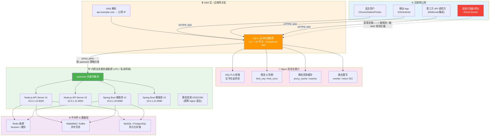
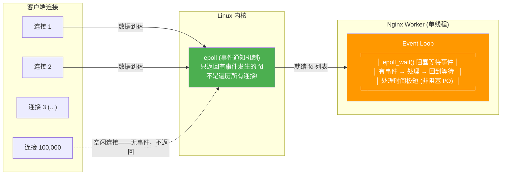

# Nginx 破局：从反向代理到高并发网关的架构心智

## 1. 引言：为什么我们需要一道"护城河"？

假设你刚写完一个 Node.js 服务，监听在 `127.0.0.1:3000`。你兴奋地买了一台云服务器，SSH 上去 `node server.js`，然后用浏览器访问 `http://你的公网IP:3000`——通了。你觉得自己掌握了部署的全部奥秘。

**三天后，你的服务器 CPU 飙到 100%，日志里塞满了来自全球各地的恶意扫描请求。你的 Node.js 进程——那个仅用于渲染 JSON 数据的单线程小家伙——正在徒手接全世界扔过来的板砖。**

问题出在哪？你把一个应用服务器直接暴露在了公网上。这就像把保险柜放在马路边，只靠它自带的锁来防御一切。

在真实的生产环境里，你的业务服务器永远不应该直接面向公网。它们应该躲在一道"护城河"后面——这道护城河，在绝大多数现代 Web 架构中，就是 **Nginx**。

> [!important] 架构重点：正向代理 vs 反向代理——两句话厘清终身困惑
> **正向代理 (Forward Proxy)**：代理的是客户端。你公司内网的浏览器不能直接访问外网，所有请求先发给一台代理服务器，由它替你出门。客户端知道代理的存在，目标服务器不知道客户端的真实 IP——它只看到代理的 IP。典型应用：翻墙工具、企业上网行为管理。
>
> **反向代理 (Reverse Proxy)**：代理的是服务端。互联网上的用户以为自己访问的是 `api.example.com`，实际上这个域名指向的是 Nginx，Nginx 再把请求默默地转发给内网里的一台或多台业务服务器。客户端不知道后端服务器的存在（甚至不知道有多少台），后端服务器不知道真实客户端的 IP（除非 Nginx 主动告知）。典型应用：负载均衡、SSL 卸载、缓存加速、安全防护。
>
> 一张图搞懂两者的拓扑差异：
>
> ```
> 正向代理：  你 (客户端) → 代理服务器 → 互联网上的任意目标服务器
> 反向代理：  互联网上的任意用户 → Nginx (反向代理) → 内网业务服务器集群
> ```

**Nginx 在现代 Web 架构中的枢纽位置——完整流量拓扑图：**



看这张图，Nginx 所处的位置不是"可选的中间件"，而是**整个系统面向公网的第一道，往往也是唯一一道关卡**。在流量到达你的业务代码之前，它要完成 SSL 解密、请求合法性判断、路由分发、缓存命中检查。你的 Node.js 或 Spring Boot 服务根本不知道互联网上发生了什么——它们只看到 Nginx 递过来的、干干净净的、已经验证过的请求。

这就是 Nginx 在微服务架构中的真正定位：**它不是"转发器"，而是网关层面的防御性基础设施。**

---

## 2. 核心解密：Nginx 凭什么抗住百万并发？

你肯定听说过这个数字：**Nginx 可以轻松处理 10 万并发连接，极端场景下百万级也不在话下**。而传统的 Apache（prefork 模式）在几千并发时就开始跪。

这不是广告词，这是架构基因决定的。

### 2.1 Master-Worker 进程模型：先理解"谁在干活"

Nginx 启动后，你执行 `ps aux | grep nginx`，会看到类似这样的输出：

```
root      12345  nginx: master process /usr/sbin/nginx
www-data  12346  nginx: worker process
www-data  12347  nginx: worker process
www-data  12348  nginx: worker process
www-data  12349  nginx: worker process
```

一个 `master` 进程，若干个 `worker` 进程。分工极其明确：

```
┌──────────────────────────────────────────────────┐
│            Master 进程 (root 权限)                  │
│                                                    │
│  职责：                                             │
│  · 读取并校验配置文件                                │
│  · 创建 socket、绑定端口 (80/443)                    │
│  · 启动/终止/管理 Worker 进程                        │
│  · 响应 nginx -s reload / stop 等管理信号            │
│                                                    │
│  不干什么：                                          │
│  · 不处理任何用户请求——Master 永远不碰业务流量         │
└──────────┬───────────┬───────────┬────────────────┘
           │           │           │
    ┌──────▼──┐  ┌─────▼───┐  ┌───▼──────┐
    │ Worker 1│  │ Worker 2│  │ Worker N │
    │ (实际处  │  │ (实际处  │  │ (实际处   │
    │  理请求) │  │  理请求) │  │  理请求)  │
    │         │  │         │  │          │
    │ · Epoll  │  │ · Epoll  │  │ · Epoll  │
    │ · HTTP   │  │ · HTTP   │  │ · HTTP   │
    │ · 代理   │  │ · 代理   │  │ · 代理   │
    └─────────┘  └─────────┘  └──────────┘
         ↑ 全部监听同一个端口 (SO_REUSEPORT)
```

> [!important] 架构重点：Worker 数量到底该设多少？
> Nginx 官方建议 **`worker_processes auto;`**——让 Nginx 自动设为 CPU 核数。背后的逻辑是：每个 Worker 是单线程的，通过 epoll 在一个线程内轮询成千上万个连接。如果 Worker 数量超过 CPU 核数，多出来的 Worker 只是在争抢 CPU，反而会因为上下文切换降低吞吐。**1 核 1 Worker，是 Nginx 进程模型的最优配置。**
>
> 唯一的例外是：当你的 Nginx 做了大量磁盘 I/O 操作（如 `proxy_cache` 写磁盘）或需要处理大量阻塞型 SSL 握手时，可以适当把 Worker 数调高到 CPU 核数的 1.5~2 倍，但这也是权宜之计——更好的做法是把 SSL 卸载和缓存卸载到独立的硬件/层上去。

### 2.2 Epoll 事件驱动模型：为什么 Apache 做不到而 Nginx 可以？

Apache（prefork/worker 模式）的工作方式是：**每来一个连接，fork 一个进程（或线程）去处理。** 1000 个并发连接 = 1000 个进程/线程。每个进程都吃内存（默认 ~2MB/进程），每个线程的上下文切换都消耗 CPU。

Nginx 的做法完全不同——**一个 Worker 线程，通过 epoll 同时监听数万个连接**：



`epoll` 的核心优势一句话：**它只通知那些"有事发生"的连接，而不是让你去遍历所有连接。**

用伪代码对比两种模型：

```
❌ Apache prefork 模型 (简化为伪代码) —— 每连接一线程：
for each connection in accept_loop():
    thread = create_thread()
    thread.handle(connection)  // 这个线程在这个连接上阻塞到请求结束
    // 10000 连接 = 10000 线程 = 内核调度器在哭

✅ Nginx epoll 模型 (简化为伪代码) —— 一个线程处理所有连接：
epoll_fd = epoll_create()
for each socket:
    epoll_ctl(epoll_fd, EPOLL_CTL_ADD, socket, EPOLLIN)  // 注册到 epoll
    set_nonblocking(socket)  // 关键：设置为非阻塞模式

while true:
    events = epoll_wait(epoll_fd, timeout)  // 阻塞直到有事件
    for each ready_event in events:          // 只遍历有事件的连接！
        if event.is_readable(): handle_read(event.socket)
        if event.is_writeable(): handle_write(event.socket)
    // 10000 连接，但只有 50 个活跃 → epoll_wait 只返回这 50 个
    // 99950 个空闲连接对 CPU 的开销 ≈ 零
```

> [!info] 开发者视角：Nginx Event Loop vs Node.js vs Netty——殊途同归的异步非阻塞
> 如果你写过 Node.js，你不会对上面的伪代码感到陌生。Node.js 的 `libuv` 在 Linux 下也是基于 epoll 的，代码结构几乎一致：一个主线程，事件循环，非阻塞 I/O，回调。
>
> 如果你用过 Java 的 Netty，它的 `NioEventLoopGroup` 本质上也是在复刻 Nginx 的 Worker 模型——多个 EventLoop 线程，每个持有一个 `Selector`（Java NIO 对 epoll/kqueue 的封装），注册 Channel，轮询就绪事件。
>
> **这不是巧合。** Nginx（2004 年发布）是最早大规模实践"单线程事件驱动 + 非阻塞 I/O"的应用之一。Node.js（2009 年发布）的诞生深受 Nginx 影响——Ryan Dahl 在他的演讲中明确提到，Node.js 的 Event Loop 理念直接来自 Nginx 和 Python 的 Twisted 框架。而 Netty（2008 年起源于 JBoss），作为 Java 生态最重要的 NIO 框架，同样遵循了相同的模式。
>
> 理解了 Nginx 的 epoll 模型，你就理解了整个"异步非阻塞"范式的底层逻辑。这不是某个框架的专利，这是**操作系统提供的能力**——epoll（Linux）、kqueue（BSD/macOS）、IOCP（Windows）是内核级的 I/O 多路复用原语，所有上层框架只是它们的"翻译官"。

### 2.3 优雅热重启：`nginx -s reload` 的底层发生了什么？

`nginx -s reload` 可能是你敲过最多次的 Nginx 命令之一，但绝大多数人不知道"reload"和"restart"的区别——以及为什么 reload 可以做到**流量零中断**。

> [!tip] 运维视角：为什么 reload 不会丢请求？
> `nginx -s reload` 的完整流程如下：
>
> 1. Master 进程收到 `SIGHUP` 信号。
> 2. Master 重新读取并校验配置文件。如果配置有语法错误，**整个 reload 操作中止，现有 Worker 进程继续正常运行**——这就是为什么 reload 比 restart 安全得多。restart 先停再启，配置错了服务就真挂了。
> 3. 如果配置校验通过，Master 启动**一批新的 Worker 进程**——它们加载新配置，开始监听同一个端口（新配置如 `listen 443 ssl;` 之类的变更会在这里生效）。
> 4. Master 向**旧的 Worker 进程**发送 `SIGQUIT` 信号，通知它们"优雅关闭"。
> 5. 旧 Worker 在收到 `SIGQUIT` 后，**停止接受新连接**，但继续处理当前已建立的连接——直到这些连接上的请求全部处理完毕（或超时），Worker 才退出。
> 6. 过渡期间，新旧两批 Worker 进程同时存在。内核通过 `SO_REUSEPORT`（Linux 3.9+）将新连接分发给新 Worker，旧 Worker 只处理存量连接。
> 7. 所有旧连接处理完毕后，旧 Worker 进程全部退出。reload 完成。
>
> **整个过程，没有一个 TCP 连接被强制断开。** 这就是"优雅热重启"的真正含义。

> [!bug] 生产痛点：`nginx -s reload` 不是万能的——长连接 (Keep-Alive) 引发的"幽灵 Worker"
> 如果你的后端服务或客户端使用了 HTTP Keep-Alive 长连接，旧 Worker 可能会因为连接迟迟不关闭而长时间存留。默认的 `worker_shutdown_timeout` 是没有限制的——这意味着一个挂起的 Keep-Alive 连接可以让一个旧 Worker 永远不死。
>
> 修复方式：在配置中显式限制 worker 的优雅关闭超时时间：
>
> ```nginx
> # 旧 Worker 在收到 SIGQUIT 后最多存活 30 秒，超时后强制退出
> worker_shutdown_timeout 30s;
> ```

---

## 3. 流量调度室：反向代理与负载均衡实战

### 3.1 反向代理 (`proxy_pass`)：不只是"转发"

一个最简的、仅用于把请求转发给后端 Node.js 服务的 Nginx 配置看起来是这样的：

```nginx
server {
    listen 80;
    server_name api.example.com;  # 此 server 块只处理这个域名的请求

    location / {
        # 把匹配 / 的请求全部转发给本机 3000 端口上的 Node.js 进程
        proxy_pass http://127.0.0.1:3000;
    }
}
```

这能跑。但它在生产环境里是一个**残缺的配置**。缺失的是最重要的东西——**Header 透传**。

当 Nginx 作为反向代理中转请求时，你的后端服务 `127.0.0.1:3000` 看到的连接是这样的：

```
连接来源 IP: 127.0.0.1      ← 这是 Nginx 的 IP，不是真实客户端！
请求 Host:   127.0.0.1:3000 ← 这也不是客户端请求的原始域名
协议:        HTTP           ← 即使客户端访问的是 HTTPS，到后端也是 HTTP（默认）
```

结果就是你后端的日志里，所有请求的来源 IP 全是 `127.0.0.1`。你的风控系统、分析系统、访问统计——全部报废。

> [!bug] 生产痛点：拿不到真实用户 IP——反向代理的"身份丢失"问题
> **几乎所有第一次配 Nginx 反向代理的人都会踩的坑。** 这不是 Nginx 的 bug，而是 HTTP 协议的固有设计：TCP 连接是端到端的，中间的代理节点会重新建立与后端的 TCP 连接，所以后端的 `remote_addr` 永远是 Nginx 的 IP。
>
> 解决方案是 **通过 HTTP Header 显式传递原始请求信息**——这是行业标准做法，不是 hack：

```nginx
server {
    listen 80;
    server_name api.example.com;

    location / {
        # ============ 代理转发配置 ============

        # 1. 目标地址——请求最终去哪
        proxy_pass http://backend_upstream;

        # ============ 关键 Header 透传——绝对不要把这块删掉！ ============

        # 2. Host: 将客户端请求的原始域名传给后端
        #    如果你有多个域名指向同一个后端（如 api.example.com 和 admin.example.com），
        #    后端需要靠这个头来区分业务逻辑
        proxy_set_header Host $host;

        # 3. X-Real-IP: 客户端的真实 IP 地址（单个 IP）
        #    $remote_addr 是 Nginx 变量，值为与 Nginx 建立 TCP 连接的 IP
        #    对于直接访问 Nginx 的客户端，这就是真实 IP
        proxy_set_header X-Real-IP $remote_addr;

        # 4. X-Forwarded-For: 完整的代理链 IP 列表（可能有多个代理）
        #    $proxy_add_x_forwarded_for =
        #      如果请求已有 X-Forwarded-For → 追加 ", $remote_addr"
        #      如果请求没有 X-Forwarded-For → 直接设为 $remote_addr
        #    这是多级代理场景下唯一的真实 IP 追踪手段
        proxy_set_header X-Forwarded-For $proxy_add_x_forwarded_for;

        # 5. X-Forwarded-Proto: 客户端访问 Nginx 时使用的协议 (http / https)
        #    后端需要知道客户端用的是 HTTPS 还是 HTTP——
        #    比如生成绝对 URL、判断是否需要跳转到 HTTPS 等
        proxy_set_header X-Forwarded-Proto $scheme;

        # 6. X-Forwarded-Host: 客户端请求的原始 Host 头
        proxy_set_header X-Forwarded-Host $host;

        # 7. X-Forwarded-Port: 客户端访问的端口
        proxy_set_header X-Forwarded-Port $server_port;

        # ============ 连接与超时优化 ============

        # 8. 使用 HTTP/1.1 与后端通信（支持 Keep-Alive 连接复用）
        proxy_http_version 1.1;
        proxy_set_header Connection "";  # 清空 Connection 头，让 Nginx 自己管理连接复用

        # 9. 超时设置——至关重要，直接影响用户体验和系统稳定性
        proxy_connect_timeout 5s;     # 与后端建立连接的超时（不宜太长——连不上就快速失败）
        proxy_send_timeout 30s;       # 向后端发送请求的超时
        proxy_read_timeout 60s;       # 等待后端响应的超时（长耗时接口要调大这个值）

        # 10. 缓冲设置——防止大响应撑爆 Nginx 内存
        proxy_buffering on;
        proxy_buffer_size 4k;         # 响应头的缓冲区大小
        proxy_buffers 8 16k;          # 响应体的缓冲区：8 个 × 16KB = 128KB
        proxy_busy_buffers_size 32k;  # 在响应未完全读完时可以开始向客户端发送的最大缓冲
        proxy_max_temp_file_size 256m;# 超大响应写入临时文件的最大体积

        # 11. 后端错误时的重试机制
        proxy_next_upstream error timeout invalid_header http_500 http_502 http_503;
        proxy_next_upstream_tries 2;   # 最多重试 2 个不同的后端节点
        proxy_next_upstream_timeout 10s; # 重试总时长上限
    }
}
```

> [!tip] 最佳实践：如果你的 Nginx 和业务服务在同一台机器上（如 Docker 环境），`127.0.0.1` 就够了。但如果是跨主机部署，后端地址应该用内网 IP（如 `10.0.1.10`），并且建议配置 `proxy_bind` 显式指定源 IP——避免在有多网卡的机器上走了错误的网络接口。

### 3.2 负载均衡 (`upstream`)：从单点到集群的架构跃迁

当你只有一个后端节点时，`proxy_pass http://127.0.0.1:3000;` 就够了。但当你的业务增长到需要多台服务器时——事情变了。

`upstream` 块是 Nginx 的"服务发现"原语。它定义了一组后端服务器，然后通过 `proxy_pass http://upstream_name;` 引用。Nginx 根据你指定的**调度策略**决定每个请求发往哪台后端。

```nginx
# =====================================
# upstream 定义：后端服务器集群
# =====================================
upstream backend_api {

    # === 策略 1: 默认轮询 (Round Robin) ===
    # 请求按顺序逐一分配给后端节点。
    # 适用场景：所有后端服务器配置一致、无状态服务
    server 10.0.1.10:3000;
    server 10.0.1.11:3000;
    server 10.0.1.12:3000;

    # 注意：上面的写法就是默认轮询。它会严格按 server 的书写顺序
    # 逐一分配——请求 1 → .10, 请求 2 → .11, 请求 3 → .12, 请求 4 → .10 ...

    # === 策略 2: 权重轮询 (Weighted Round Robin) ===
    # 高性能机器处理更多请求，低性能机器少处理。
    # 适用场景：后端服务器硬件配置不同（如 8C16G vs 4C8G）
    #
    # server 10.0.1.10:3000 weight=5;   # 这台性能好，承担 50% 流量 (5/10)
    # server 10.0.1.11:3000 weight=3;   # 承担 30% 流量
    # server 10.0.1.12:3000 weight=2;   # 承担 20% 流量
    # 注意：权重不是绝对的并发数，而是"被选中的概率比例"

    # === 策略 3: IP 哈希 (ip_hash) ===
    # 根据客户端 IP 的哈希值，将同一个 IP 的请求始终发往同一台后端。
    # 适用场景：后端服务有会话状态 (Session)，且没有外部 Session 共享机制（如 Redis）
    #
    # ip_hash;
    # server 10.0.1.10:3000;
    # server 10.0.1.11:3000;
    # server 10.0.1.12:3000;
    #
    # 注意：ip_hash 的致命缺点是——如果一台后端挂了，原本路由到它的所有用户
    # 会被重新分配到其他节点，Session 全部丢失。生产环境强烈建议用 Redis
    # 集中管理 Session + 轮询/权重策略，而不是依赖 ip_hash。

    # === 策略 4: 最少连接 (least_conn) ===
    # 把新请求分配给当前活跃连接数最少的后端服务器。
    # 适用场景：请求处理时间不均匀（有些接口 50ms，有些要 5 秒）
    # 轮询会把慢请求都堆到同一台机器上，least_conn 可以动态均衡
    #
    # least_conn;
    # server 10.0.1.10:3000;
    # server 10.0.1.11:3000;
    # server 10.0.1.12:3000;

    # === 健康检查 (Health Check) ===
    # Nginx Plus (商业版) 有主动健康检查。
    # 开源版只有被动健康检查——当请求到一个后端失败达到一定次数后，
    # Nginx 会将它标记为 "down" 一段时间。

    # max_fails: 在 fail_timeout 时间段内，最多允许的失败次数
    # fail_timeout: 当失败次数达到 max_fails 后，将该服务器标记为不可用的时长
    # backup: 备用服务器——只有在所有主服务器都不可用时才启用
    # down: 手动将该服务器标记为下线（灰度下线时有用）
    #
    server 10.0.1.10:3000 max_fails=3 fail_timeout=30s;
    server 10.0.1.11:3000 max_fails=3 fail_timeout=30s;
    server 10.0.1.12:3000 max_fails=3 fail_timeout=30s backup;  # 备用节点
    # server 10.0.1.13:3000 down;  # 手动下线，维护/灰度时用

    # === Keep-Alive 连接池 ===
    # 保持与后端的空闲连接数。减少 TCP 握手开销，显著降低延迟。
    keepalive 32;
    # 每个 Worker 进程保持与 upstream 的 32 个空闲连接。
    # 值不宜太大——一般设为 16~64 之间。太多了会浪费后端资源（尤其是 PHP-FPM
    # 这类每连接消耗一个进程的场景）。
}

# =====================================
# server 块：使用上面定义的 upstream
# =====================================
server {
    listen 80;
    server_name api.example.com;

    location / {
        # 使用 upstream 定义的名称而不是直接写 IP:Port
        proxy_pass http://backend_api;

        # Header 透传（省略，同 3.1 节的完整配置）
        proxy_set_header Host $host;
        proxy_set_header X-Real-IP $remote_addr;
        proxy_set_header X-Forwarded-For $proxy_add_x_forwarded_for;
        proxy_set_header X-Forwarded-Proto $scheme;

        # 连接池复用需配合 HTTP/1.1
        proxy_http_version 1.1;
        proxy_set_header Connection "";
    }
}
```

> [!important] 架构重点：为什么"轮询就够了"是有前提的
> 很多工程师说"默认轮询就行"，但在以下场景下轮询是灾难：
>
> - **长连接 / WebSocket 场景**：轮询会把新的长连接均匀分给所有后端，但一个 WebSocket 可能在某个后端上活跃数小时，其他请求却在别的后端上空转。此时 `least_conn` 更好。
> - **后端处理能力不均**：如果你在做蓝绿部署 / 金丝雀发布，新旧版本可能在同一个 upstream 里。旧版本慢但还在承接流量，轮询会让用户体验忽快忽慢。此时应该用权重 + 动态调整。
> - **缓存热度问题**：轮询会把请求均匀分发，但每个后端独立维护自己的本地缓存（如进程内 LRU），导致缓存命中率只有 1/N。此时 `ip_hash` 或 `hash $request_uri` 可以通过"请求亲和性"提升缓存效率——**但这个问题的正解是上 Redis 做集中式缓存，而不是用 Nginx 分配策略去补。**

---

## 4. 守卫大门：HTTPS 加密与安全基线

### 4.1 SSL/TLS 卸载：为什么要在 Nginx 层做证书终结？

假设你有 10 台 Spring Boot 实例处理业务。如果你让每台实例都自己处理 HTTPS：

```
问题清单：
  ✗ 你需要购买/续期/部署 10 份证书（或用同一份证书在 10 台机器上配置）
  ✗ 每台机器都要做非对称加密的 TLS 握手——这是 CPU 密集型操作
  ✗ 后端代码（Java/Kotlin/Python）要处理 SSL Context、KeyStore、证书格式
  ✗ 更新证书 = 10 台机器逐一操作 / 或依赖配置管理工具额外编排
```

**SSL/TLS 卸载 (SSL/TLS Termination)** 的做法是把加密的外衣在 Nginx 层脱掉，内网明文传输：

```
客户端 ── HTTPS (加密) ──→ Nginx ── HTTP (明文) ──→ 内网后端集群
```

> [!important] 架构重点：内网 HTTP 明文传输安全吗？
> **在云原生的 VPC 私有网络内——安全。** 原因是：
>
> 1. VPC 网络在链路层就已经隔离——同一 VPC 之外的机器无法嗅探内网流量。
> 2. 你的后端服务器没有公网 IP，外部攻击者根本访问不到它们。
> 3. 即使同一 VPC 内有恶意的其他租户（共享物理机场景），现代云平台的虚拟化隔离也保证了网络流量的不可见性。
> 4. 如果你的安全合规要求极端严格（如金融/医疗行业），可以在 Nginx 和后端之间也启用 TLS——这叫 **SSL/TLS 桥接 (Re-encryption)**，Nginx 解密后用自己的证书重新加密再发给后端，性能开销加倍但安全等级最高。

### 4.2 完整 HTTPS 配置：从证书到强制跳转

```nginx
# =====================================
# HTTP → HTTPS 强制跳转（80 端口唯一的作用）
# =====================================
server {
    listen 80;
    listen [::]:80;          # IPv6 支持
    server_name example.com www.example.com;

    # 方法 1：301 永久重定向——推荐
    # return 301 比 rewrite 效率高很多（rewrite 需要正则匹配，return 直接返回）
    return 301 https://$host$request_uri;

    # 方法 2：用 rewrite（不推荐，性能差）
    # rewrite ^(.*)$ https://$host$1 permanent;

    # 方法 3：如果只需要重定向特定路径
    # location /admin {
    #     return 301 https://$host$request_uri;
    # }
}

# =====================================
# HTTPS 主配置
# =====================================
server {
    # HTTP/2 需要 TLS，所以 listen 指令要加 ssl 和 http2
    listen 443 ssl http2;
    listen [::]:443 ssl http2;
    server_name example.com www.example.com;

    # ========== SSL 证书配置 ==========
    # 证书与私钥——绝对路径，别用相对路径，排查问题时你会感谢自己
    ssl_certificate     /etc/nginx/ssl/example.com/fullchain.pem;   # 证书链（证书 + 中间 CA）
    ssl_certificate_key /etc/nginx/ssl/example.com/privkey.pem;     # 私钥（权限 600！）

    # ========== SSL 协议 & 加密套件——安全基线 ==========
    # 只启用 TLSv1.2 和 TLSv1.3
    # TLSv1.0 和 TLSv1.1 已被 PCI DSS 和主流浏览器弃用
    # 不要贪兼容性——支持过旧的协议=给攻击者留后门
    ssl_protocols TLSv1.2 TLSv1.3;

    # 加密套件优先级：让服务器决定用哪个加密算法（而非客户端）
    # 这样你可以强制使用更安全的套件
    ssl_prefer_server_ciphers on;

    # TLSv1.2 的加密套件列表——精选高强度算法
    # 禁用 RC4、3DES、MD5、SHA1 等已被证明不安全的算法
    ssl_ciphers 'ECDHE-ECDSA-AES128-GCM-SHA256:ECDHE-RSA-AES128-GCM-SHA256:ECDHE-ECDSA-AES256-GCM-SHA384:ECDHE-RSA-AES256-GCM-SHA384:ECDHE-ECDSA-CHACHA20-POLY1305:ECDHE-RSA-CHACHA20-POLY1305';

    # ========== SSL 会话缓存——显著降低 TLS 握手开销 ==========
    # 共享内存缓存：10MB 可以存储约 40000 个 session
    ssl_session_cache shared:SSL:10m;
    # 客户端在 session_timeout 时间内重连可复用 TLS session（免完整握手）
    ssl_session_timeout 1h;
    # 开启 TLS session ticket（替代方案，有些场景下更高效）
    ssl_session_tickets on;

    # ========== 安全增强 Header ==========
    # OCSP Stapling：Nginx 帮客户端验证证书吊销状态，减少客户端延迟
    ssl_stapling on;
    ssl_stapling_verify on;
    # OCSP 应答缓存
    ssl_stapling_cache shared:ocsp:128k;

    # HSTS (HTTP Strict Transport Security)：告诉浏览器"永远用 HTTPS 访问我"
    # max-age=63072000 秒 = 2 年
    # includeSubDomains: 子域名也强制 HTTPS
    # preload: 允许浏览器将此域名硬编码进 HSTS 预加载列表
    add_header Strict-Transport-Security "max-age=63072000; includeSubDomains; preload" always;

    # 其他安全 Header
    add_header X-Content-Type-Options nosniff always;          # 禁止浏览器 MIME 类型嗅探
    add_header X-Frame-Options DENY always;                    # 禁止页面被嵌入 iframe（防点击劫持）
    add_header X-XSS-Protection "1; mode=block" always;        # 开启浏览器 XSS 过滤器

    # ========== gzip 压缩——节省带宽 ==========
    gzip on;
    gzip_vary on;
    gzip_min_length 1024;              # 小于 1KB 的不压（压了反而更大）
    gzip_comp_level 6;                 # 压缩级别 1~9（6 是性能与压缩率的平衡点）
    gzip_types
        text/plain
        text/css
        text/javascript
        application/javascript
        application/json
        application/xml
        application/rss+xml
        image/svg+xml;
    # 注意：不要压缩图片（jpg/png/webp）——它们已经被编码器压缩过了

    # ========== 业务路由 ==========
    location / {
        proxy_pass http://backend_api;
        # Header 透传（省略，同 3.1 节）
        proxy_set_header Host $host;
        proxy_set_header X-Real-IP $remote_addr;
        proxy_set_header X-Forwarded-For $proxy_add_x_forwarded_for;
        proxy_set_header X-Forwarded-Proto $scheme;
    }

    # 静态资源——Nginx 直接返回，不经过后端
    location /static/ {
        alias /var/www/static/;
        expires 30d;           # 30 天浏览器缓存
        add_header Cache-Control "public, immutable";
        # immutable: 告诉浏览器"这个资源绝对不会变"，跳过 304 验证请求
    }

    # Let's Encrypt 证书自动续期的验证目录
    location /.well-known/acme-challenge/ {
        alias /var/www/acme-challenge/;
    }
}
```

### 4.3 防刷限流 (`limit_req`)：在网关层拦住恶意流量

如果你的业务代码里写了一个"每秒最多请求 10 次"的限流逻辑，那这个"限流"发生的时候——恶意请求已经穿越了 Nginx、走完了 TCP 握手、TLS 握手、HTTP 解析、代理转发、到达了你的业务代码、消耗了数据库连接池——**然后才被你的 if 语句拦住**。

> [!bug] 生产痛点：业务层限流 vs 网关层限流的巨大成本差异
> 一个到达业务层的恶意请求消耗的是整个调用链的资源。极限情况下，一个简单的 CC 攻击可能每秒 10000 个请求——你的 Nginx 确实能扛住，但你的 Node.js/Java 进程被 10000 的并发打满了线程池/事件循环，正常的用户请求全在排队。
>
> **限流必须发生在系统的最外层。** Nginx 的 `limit_req` 模块处理一个被限流的请求几乎不消耗 CPU——它连 `proxy_pass` 都不走，直接在 Nginx 层返回 503 或 429。被拦截的请求不会对你的后端产生任何影响。

```nginx
# =====================================
# 限流配置：定义"漏桶"的容量和速率
# =====================================

# 必须在 http 块中定义 limit_req_zone
# 语法：limit_req_zone key zone=名称:大小 rate=速率;
# key: 以什么为标识限流（$binary_remote_addr = 客户端 IP 的二进制形式，比 $remote_addr 省内存）
# zone=名称:大小：在共享内存中创建一个 zone，大小决定了能存多少个限流状态
# rate=速率：允许的请求速率，如 10r/s = 每秒 10 个请求
http {
    # Zone 1: 全站级别限流——每个 IP 每秒最多 10 个请求
    limit_req_zone $binary_remote_addr zone=per_ip:10m rate=10r/s;

    # Zone 2: 登录接口——每个 IP 每分钟最多 5 次尝试（防暴力破解）
    limit_req_zone $binary_remote_addr zone=login_limit:10m rate=5r/m;

    # Zone 3: API 接口级别——按 API Key 限流（而非 IP）
    # 如果你的 API 使用 API Key 认证（通过 Header 传递），可以对每个 Key 限流
    # limit_req_zone $http_x_api_key zone=api_key_limit:10m rate=100r/m;

    server {
        listen 443 ssl http2;
        server_name api.example.com;

        # 全站默认限流
        location / {
            # burst=20: 允许瞬间突发 20 个请求排队等待（而不是直接拒绝）
            # nodelay: 突发请求立即处理——不加 nodelay 的话突发请求会排队限速处理
            # 关键区别：
            #   不加 nodelay：rate=10r/s, burst=20 → 前 10 个请求立即处理，后 20 个排队
            #                  按每秒 10 个的速度处理（总共要 3 秒处理完 30 个）
            #   加 nodelay：   rate=10r/s, burst=20 → 前 30 个请求全部立即处理
            #                  但之后要等 2 秒才能处理下一个
            limit_req zone=per_ip burst=20 nodelay;

            # 被限流时返回 429 Too Many Requests
            limit_req_status 429;

            proxy_pass http://backend_api;
            # ... Header 透传省略
        }

        # 登录接口——更严格的限流
        location /api/login {
            limit_req zone=login_limit burst=3 nodelay;
            limit_req_status 429;

            proxy_pass http://backend_api;
            # ... Header 透传省略
        }

        # 提供一个专门处理限流错误的自定义页面
        error_page 429 /429.html;
        location = /429.html {
            internal;  # 只允许内部重定向，外部无法直接访问
            return 429 '{"error": "请求过于频繁，请稍后再试。","retry_after": 1}\n';
            add_header Content-Type application/json;
            add_header Retry-After 1;
        }
    }
}
```

> [!tip] 最佳实践：限流粒度选择——IP vs User vs API Key
>
> - **按 IP 限流** (`$binary_remote_addr`)：最简单，适合防扫站、防爬虫。缺点是公司/学校共用出口 IP 的场景下会误伤正常用户。
> - **按用户限流** (`$http_authorization` 或 `$cookie_session`)：更精确，但需要依赖应用层的认证信息（JWT Token / Session Cookie），而且 Nginx 不会验证 Token 是否有效——攻击者可以用伪造 Token 绕过。
> - **按 API Key 限流**：最精准，但前提是你的系统有 API Key 机制。对于对外开放的 API，这是标准做法。
> - **组合限流**：三层叠加——IP 层粗粒度（全站 10r/s）+ 认证用户中粒度（100r/m）+ 特定接口细粒度（登录 5r/m）。"纵深防御"不是口号，是每一层的实际配置。

> [!warning] 危险操作：千万不要用 `$remote_addr` 而不是 `$binary_remote_addr` 来定义 `limit_req_zone` 的 key
> `$remote_addr` 是字符串（IPv4 最长 15 字节，IPv6 最长 45 字节），`$binary_remote_addr` 是固定 4 字节（IPv4）或 16 字节（IPv6）的二进制值。用 `$remote_addr` 会导致共享内存消耗增加 3~~10 倍。对于 10MB 的 zone，用 `$binary_remote_addr` 可以存约 16 万个 IP 的状态，用 `$remote_addr` 可能只能存 4~~8 万。在流量高峰期 zone 被撑满后——新的 IP 完全无法记录限流状态，相当于限流功能直接失效。

---

## 5. 结语：网关层面的防御性思维

回到文章开头的那个场景——你把 Node.js 端口直接暴露在公网上，然后被扫得生活不能自理。

现在你应该理解了，这件事错不在 Node.js 性能不够、也不在攻击者太猖獗，而在于**系统设计层面缺少了一层防御**。这层防御的专业名称叫 **API Gateway / Edge Proxy**，而 Nginx 是这一层的工业标准实现。

让我们回顾一下 Nginx 在这篇文章里扮演的角色，它们分别构成了网关层防御体系的四个维度：

```
          ┌──────────────┐
          │   互联网流量   │
          └──────┬───────┘
                 │
    ┌────────────▼────────────────────────────┐
    │            Nginx 网关层                  │
    │                                         │
    │  1. SSL/TLS 卸载 —— 加解密在此终结         │
    │     · 后端服务只处理明文 HTTP              │
    │     · 证书管理集中化                      │
    │                                         │
    │  2. 安全防护 —— 恶意流量在此被拦截         │
    │     · limit_req 限流 → 防 CC              │
    │     · IP 黑白名单 / GeoIP → 地域封禁       │
    │     · 安全 Header → HSTS / CSP / X-Frame  │
    │                                          │
    │  3. 流量调度 —— 决定请求去往何方           │
    │     · 负载均衡 (轮询 / 权重 / IP哈希)       │
    │     · 健康检查 → 自动摘除故障节点           │
    │     · 灰度 / 蓝绿 → 按 Header 路由         │
    │                                          │
    │  4. 缓冲与减负 —— 替后端扛住流量冲击        │
    │     · 静态资源缓存 → expires / CDN 回源    │
    │     · gzip 压缩 → 节省带宽                 │
    │     · 连接复用 → Keep-Alive 减少握手       │
    └─────────────────────────────────────────┘
                 │
    ┌────────────▼────────────────────────────┐
    │           内网业务服务器                   │
    │   Node.js · Spring Boot · Go · Python    │
    │   (只处理核心业务逻辑，不操心网络安全)       │
    └──────────────────────────────────────────┘
```

> [!important] 架构重点：Nginx 是微服务的第一道防线，也是最后一道
> 在云原生架构中，我们花了大量精力讨论 Service Mesh（Istio/Linkerd）、API Gateway（Kong/APISIX）、Ingress Controller 这些概念。但无论你的架构多复杂，无论你用的是 Kubernetes 还是传统部署，在你系统的某个节点上，一定有一个东西在监听 80/443 端口，接收互联网上的每一个 HTTP 请求。这个东西，在绝大多数场景下，就是 Nginx。
>
> Service Mesh 管理的是东西向流量（服务之间），API Gateway 管理的是南北向流量（外部进入系统）。Nginx 既可以做南北向的 API Gateway（本文的主题），也可以做东西向的 Service Proxy（Nginx 的 `stream` 模块可以做四层 TCP/UDP 代理，包括 MySQL/Redis 等非 HTTP 协议）。
>
> 当你把 Nginx 从"一个需要背诵的配置语法"变成"一个你理解了架构原理后自然知道该怎么配的组件"时，你就完成了从"能写业务代码"到"能设计系统架构"的认知跃迁。

**Nginx 不是黑盒，它是一台透明的、精致的、经过二十年战争检验的流量调度机器。** 你需要做的不是记住所有指令的参数，而是理解它站在系统的什么位置、承担什么角色、在什么场景下做出什么取舍。

下一次，当你面对一个线上故障时——请求超时、502 错误、SSL 证书过期——你不会再 log 进后端服务器无头苍蝇般地翻应用日志。你会先 `tail -f /var/log/nginx/error.log`，因为你知道了，**答案往往就在网关层的日志里，只不过以前你不知道去看。**

---
