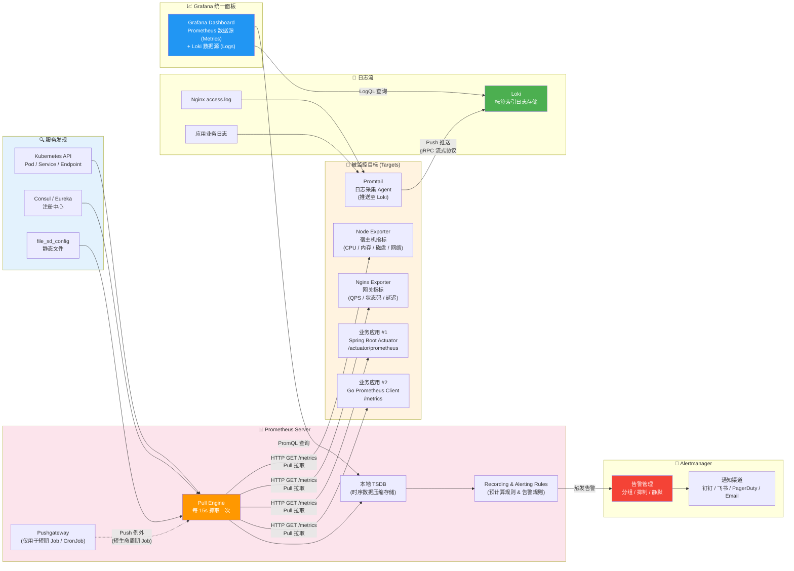
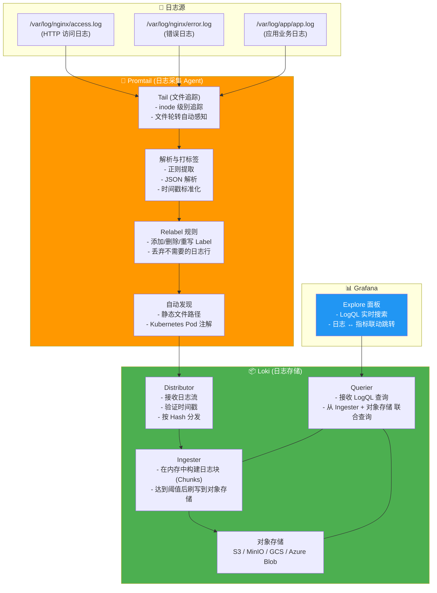

# 破除线上黑盒：基于 Prometheus + Loki + Grafana 的生产级可观测性架构实战

## 1. 引言：为什么我们需要可观测性 (Observability)？

假设你刚刚部署好了上一篇文章（[[Nginx]]）中搭建的 Nginx 网关 + 后端服务集群。用户访问正常，业务跑得挺好。周末你安心地去看了一场电影。

凌晨两点，手机震动。老板发来一张截图：用户页面打不开，白屏。

你翻出电脑，第一反应是 SSH 进服务器，先 `htop` 看一眼 CPU，发现没打满。再看 `free -h`，内存也正常。然后你陷入了每个运维人都熟悉的深渊——**打开一个又一个服务的日志文件，用 `grep` 在几十万行文本里大海捞针，试图找到那个让系统崩溃的元凶。**

半小时后，你终于在某个 `error.log` 的角落里发现了一个 `connection timeout`。数据库连接池昨晚被一个慢查询撑爆了，但你是通过"翻垃圾堆"的方式发现的，而不是系统告诉你的。

这就是**传统监控（Monitoring）** 的局限。

> [!important] 架构重点：Monitoring vs Observability——不是换了个英文词，是彻底的心智跃迁
>
> **传统监控 (Monitoring)** 回答的是预定义的问题。你在 Zabbix/Nagios 里设置了"CPU > 80% 告警"、"磁盘剩余 < 10% 告警"。这些规则是你在部署时**已经知道**可能会出现的问题。但 2026 年的生产环境里，真正的线上故障有 70% 来自你**未曾预料**的维度——某个第三方 API 的 P99 延迟突然飙升、某个 Redis 命令的复杂度在特定数据规模下指数级退化、某个 Kafka 分区的 Consumer Lag 悄悄堆积到 10 万条。这些"未知的未知"，传统监控根本不会告诉你。
>
> **可观测性 (Observability)** 不预设问题。它要求系统足够"透明"——你可以随时向它提问，而它能回答你。实现这一能力的三大支柱是：
>
> | 支柱               | 简称     | 核心语义                                                              | 典型存储                     |
> | ------------------ | -------- | --------------------------------------------------------------------- | ---------------------------- |
> | **指标 (Metrics)** | 聚合数据 | "_What_ happened？"——某个接口在过去 1 小时内有多少请求、平均延迟多少  | Prometheus / VictoriaMetrics |
> | **日志 (Logs)**    | 离散事件 | "_Why_ did it happen？"——这一次报错的完整 stack trace、上下文参数     | Loki / Elasticsearch         |
> | **追踪 (Traces)**  | 调用链路 | "_Where_ did it bottleneck？"——一个请求在 14 个微服务间穿行的完整路径 | Tempo / Jaeger / Zipkin      |
>
> 本文的核心论点：**以极低的系统资源占用，换取极高的排障线索信噪比。** 你将不再需要 `grep` 大法——故障发生后，你打开 Grafana，看一张面板上指标曲线的异动点，点击那个时间点直接跳转到对应的日志行，一条命令都不需要敲。

### 1.1 传统运维的三大排障死循环

在进入正式架构之前，请你诚实地对号入座——你是否经历过以下任一"运维地狱体验"？

> [!bug] 生产痛点：死循环 #1——"狼来了"告警风暴
> 你给 20 台服务器各配了 CPU > 80% 的告警。某天一台机器因为代码死循环导致 CPU 飙高，你的钉钉/飞书/短信在 3 分钟内收到 87 条告警。你麻木地忽略掉它们，因为它们 99% 都是误报。**这就是告警风暴带来的灾难性后果：当报警器的误报率高到一定程度时，真正的故障来临时你也不会相信它。** 你在潜意识里把告警当成了"正常噪音"——这比没有监控更危险。

> [!bug] 生产痛点：死循环 #2——"登录服务器翻日志"排障模式
> 故障发生了。你 SSH 进服务器 A，`tail -f /var/log/nginx/error.log` 看了 2 分钟，没找到线索。退出。SSH 进服务器 B，重复。SSH 进服务器 C……当你有 5 台以上的服务器时，这种排障方式不是查故障，是燃烧生命。更致命的是——你永远只能在**单台机器**的视角看问题，而现代微服务故障的根因往往是一个跨服务的**系统性关联**。

> [!bug] 生产痛点：死循环 #3——"重启大法"治好了一切，但一切原因未知
> 凌晨三点的你对一个冻僵的 Java 进程执行了 `systemctl restart`。服务恢复了。老板问"发生了什么"。你说"内存泄漏吧，已经重启了"。但你没有证据——没有当时堆内存的快照曲线、没有 GC 频率的时间序列、没有那个时间窗口内的请求延迟统计。你对自己撒了谎，然后祈祷同样的问题不会在明天的同一时间复发。**没有数据支撑的排障结论，不是运维，是玄学。**

本文要做的就是帮你彻底终结这三个死循环。

---

## 2. 指标引擎：Prometheus 与时序数据的哲学

Prometheus 是这个星球上继 Kubernetes 之后第二个"从 CNCF 毕业"的项目。它的名字来自希腊神话里盗取火种给人类的泰坦——而它也确实为人类（开发者与运维）盗取了一样东西：**对系统内部的可见性之火**。

但在你开始狂写 `prometheus.yml` 之前，有件事必须首先搞清楚：**Prometheus 选择了 Pull（拉取）模型，而不是 Push（推送）模型。** 这不是一个随意的实现决定——它是 Prometheus 整个架构哲学的基石。

### 2.1 Pull 模型 vs Push 模型：一场持续十年的架构辩论

**Push 模型**的代表是 Graphite、InfluxDB（早期版本）、Zabbix。工作方式很简单：你的应用或 Agent 主动把指标数据**推送**到一个集中的接收端点。

```
每个被监控目标 (Target):
  while true:
    采集本地数据
    TCP/UDP 连接到监控服务器
    把数据 PUSH 过去
    如果网络断了？重试或丢弃，取决于实现
```

**Pull 模型**是 Prometheus 的做法：Prometheus Server 按照配置的间隔（默认 15 秒），主动去每个目标暴露的 `/metrics` 端点**抓取**数据。

```
Prometheus Server:
  每秒检查 service discovery 列表:
    对每个 Target:
      HTTP GET http://target:9090/metrics
      解析返回的文本数据
      写入本地 TSDB (时序数据库)
  如果目标挂了？在这个时间点没有数据，但目标恢复后会正常抓取。
```

> [!important] 架构重点：为什么 Prometheus 坚定选择 Pull 模型？三个不可替代的优势
>
> **1. 服务发现 (Service Discovery) 天然集成**
> 在 Push 模型下，你必须告诉每一个 Agent：请把数据推到 `monitoring.internal:8086`。当集群扩缩容、IP 变更、容器漂移时，你需要额外的机制通知所有 Agent "新的网关地址"。而在 Pull 模型下，Prometheus 自己知道"我应该去找谁要数据"。结合 Kubernetes 的 Service Discovery，你部署一个新 Pod 后，Prometheus 自动发现它并开始拉取——**被监控端零配置**。
>
> **2. 健康检查与监控一体**
> 在 Push 模型中，一个目标挂了你可能要到收不到数据一段时间后才能推断"它可能挂了"。在 Pull 模型中，Prometheus 每次拉取失败都会记录一个 `up{target="..."} = 0` 的指标——**监控自身健康状态不需要额外的探活机制，拉取失败 = 它不健康**。这个设计优雅到令人窒息。
>
> **3. 反压 (Backpressure) 保护**
> Push 模型下，如果 10000 个 Agent 同时向监控服务器推送数据，监控服务器需要承受瞬时流量洪峰。而 Pull 模型由 Prometheus 自己控制抓取节奏——它可以根据自身负载动态调整抓取间隔，永远不会被"打爆"。



> [!info] 开发者视角：如何理解 Pull 模型对你代码的影响？
> 在 Push 模型下，你的代码要关心"监控服务器的地址是什么？什么时候发数据？发了没？失败了要重试吗？缓冲区满了怎么办？"——这些都是与业务逻辑完全无关的分布式系统难题。在 Pull 模型下，你的代码只需要做一件事：**注册一个 HTTP handler，把内存中的指标数据格式化为文本返回。** 至于谁拉取、什么时候拉取、拉取失败了怎么办——这些全部是 Prometheus Server 的责任，与你的业务进程无关。这是关注点分离（Separation of Concerns）在可观测性领域的完美实践。

> [!info] 运维视角：Pull 模型的唯一"痛点"——短生命周期任务
> 如果有一个 CronJob 每天凌晨 3 点运行，运行时长只有 15 秒——当 Prometheus 在 `3:00:00` 尝试拉取时它可能还没启动，在 `3:00:15` 时它已经退出了。对于这类短生命周期任务，Prometheus 提供了 **Pushgateway** 作为"中间缓存层"：CronJob 在退出前把指标 Push 到 Pushgateway，Prometheus 再从 Pushgateway Pull。但这是**例外**，不是常规做法。Pushgateway 不是"绕过 Pull 模型的快捷键"——它是一个需要你理解其 tradeoff 后才使用的专门工具。

### 2.2 高基数陷阱：最容易让 Prometheus 跪的架构错误

在开始写 `prometheus.yml` 之前，有一件事你必须刻在骨头上。这件事让多少初次接触 Prometheus 的工程师的生产环境直接瘫痪——**高基数 (High Cardinality) 问题**。

> [!warning] 危险操作：用 URL 路径、User ID、Session ID 等动态值作为 Metric Label——这是在谋杀你的 Prometheus
>
> 以下 Label 设计是**生产级别的事故**：
>
> ```yaml
> # ❌ 致命错误：把完整的 HTTP 请求路径作为 Label
> http_requests_total{path="/api/user/12345/order/67890/refund"}
> http_requests_total{path="/api/user/99999/order/54321/refund"}
> # 这会产生不计其数的时间序列——
> # 每个唯一的 path 值 = 一条新的时间序列 = Prometheus 内存中的一个独立数据结构
>
> # ❌ 致命错误：把 UUID 或 Trace ID 作为 Label
> http_requests_total{trace_id="a1b2c3d4-..."}
> # 每条日志一个 UUID = 每条日志一条新的时间序列 = Prometheus 内存直接爆炸
> ```
>
> **Prometheus 在内存中为每一条时间序列维护以下数据结构：**
>
> - 一个 Series ID（uint64, 8 bytes）
> - 一组 Label 对（每个 pair 约占用 16~48 bytes，取决于是否 interned）
> - 一个 `memSeries` 对象，包含 head chunk、WAL segment 引用等（约 1~2KB / series）
>
> **保守估算：1 条时间序列 ≈ 2KB 内存。100 万条不重复的 Label 组合 ≈ 2GB 内存——仅用于存储元数据，还没算实际数据点。**
>
> 高基数问题的本质是：**Label 是用于分组的，不是用于过滤的。**
>
> - ✅ 正确的 Label：`method="GET"`, `status_code="500"`, `handler="order_create"`——值的枚举数量有限且稳定
> - ❌ 错误的 Label：`user_id="uuid..."`, `request_path="/api/user/12345/order/67890"`, `ip_address="192.168.1.100"`——值的组合数是无限的

**Label 设计的黄金法则——这一条规则可以帮你避免 99% 的高基数灾难：**

> [!tip] 最佳实践：Label 值必须满足两个条件
>
> 1. **基数 (Cardinality) 有限且可知**——值的种类数不会超过一个"你可以数得过来"的数量级（一般 < 1000）
> 2. **值的集合是稳定的**——不会随时间推移持续增长（`method` 始终只有 GET/POST/PUT/DELETE 几种，但 `user_id` 每天都在增加）
>
> 当你需要一个高基数值用于排障时（如某个请求的 trace ID），正确的做法是把它放在 **日志 (Logs)** 里而不是 **指标 (Metrics)** 里。指标的职责是回答 "HTTP 500 错误比例"；日志的职责是回答 "这个具体的 trace_id 对应的请求发生了什么"。**指标做聚合，日志做定位——各司其职，不可越界。**

### 2.3 Docker Compose 一键部署 Prometheus + Node Exporter 栈

理论知识够了。现在开始动手。以下是一份可以直接使用的 Docker Compose 编排文件，它会把 Prometheus Server 和 Node Exporter 一起启动。Node Exporter 是 Prometheus 官方出品的宿主机指标采集器——它暴露 CPU、内存、磁盘、网络、文件系统等所有核心资源指标。

```yaml
# ============================================================
# docker-compose.yml — Prometheus + Node Exporter 观测栈
# ============================================================
version: "3.8"

services:
  # ==========================================================
  # Prometheus Server：时序数据库 + 抓取引擎 + 告警规则引擎
  # ==========================================================
  prometheus:
    image: prom/prometheus:v2.52.0 # 坚持用固定版本，别用 latest
    container_name: prometheus
    restart: unless-stopped # 进程崩溃自动重启，服务器重启后也自启
    ports:
      - "9090:9090" # Prometheus 自身的 Web UI 端口
    volumes:
      # 核心：将我们自定义的 prometheus.yml 挂载进容器
      # 注意必须用绝对路径，相对路径在 Docker 中存在路径解析陷阱
      - ./prometheus/prometheus.yml:/etc/prometheus/prometheus.yml:ro # :ro = 只读
      # 数据持久化——监控数据是生产资产，不能随着容器销毁而丢失
      - prometheus_data:/prometheus
    command:
      - "--config.file=/etc/prometheus/prometheus.yml" # 配置文件路径
      - "--storage.tsdb.path=/prometheus" # 时序数据存储路径
      - "--storage.tsdb.retention.time=30d" # 数据保留 30 天（按需调整）
      - "--storage.tsdb.retention.size=50GB" # 数据最大 50GB（先触达者生效）
      - "--web.enable-lifecycle" # 开启热重载 API (POST /-/reload)
      - "--web.enable-admin-api" # 开启管理 API（如删除时间序列）
      - "--query.max-concurrency=20" # 最大并发查询数
      - "--query.timeout=2m" # 单次查询超时时间
    networks:
      - monitoring

  # ==========================================================
  # Node Exporter：暴露宿主机所有硬件/OS 层面指标
  # 这是 Prometheus 生态里部署率第一的 Exporter——没有之一
  # ==========================================================
  node_exporter:
    image: prom/node-exporter:v1.8.1
    container_name: node_exporter
    restart: unless-stopped
    ports:
      - "9100:9100" # Node Exporter 的 /metrics 暴露端口
    volumes:
      # Node Exporter 需要读取宿主机的 procfs 和 sysfs
      # 注意：不能用 :ro，因为部分 proc 文件需要读写权限
      - /proc:/host/proc:ro
      - /sys:/host/sys:ro
      - /:/rootfs:ro # 用于读取磁盘信息
    command:
      # --path.procfs 和 --path.sysfs 指定在容器内的挂载路径
      - "--path.procfs=/host/proc"
      - "--path.sysfs=/host/sys"
      - "--path.rootfs=/rootfs"
      # 只收集特定类型的指标（按需开启，减少数据量）
      # 默认会收集所有 collector——在生产环境，只收集你真正需要的
      - "--collector.filesystem.mount-points-exclude=^/(dev|proc|sys|var/lib/docker/.+|var/lib/containerd/.+)($$|/)"
      # 排除 Docker/containerd 的虚拟文件系统挂载点——它们数量大且噪音高
      - "--collector.cpu.info" # 收集 CPU 型号/缓存等静态信息
      - "--collector.systemd" # 收集 systemd 服务状态
      - "--collector.processes" # 收集进程数量统计
    networks:
      - monitoring

# ============================================================
# 命名卷声明——Docker 会自动管理存储位置
# ============================================================
volumes:
  prometheus_data:
    driver: local

# ============================================================
# 自定义网络——将监控组件隔离在独立网络段
# ============================================================
networks:
  monitoring:
    driver: bridge
```

```yaml
# ============================================================
# prometheus/prometheus.yml — Prometheus 核心配置
# 位置：与上面的 docker-compose.yml 同级目录下的 prometheus/ 子目录
# ============================================================

# ———— 全局配置 ————
global:
  scrape_interval: 15s # 每 15 秒抓取一次指标（默认值，Per-Job 可覆盖）
  evaluation_interval: 15s # 每 15 秒评估一次告警规则
  # 全局外部标签——在多 Prometheus 实例场景下用于区分数据来源
  external_labels:
    cluster: "production"
    region: "cn-east-1"

# ———— 告警规则文件 ————
# rule_files 支持通配符——可以按模块分文件管理告警规则
rule_files:
  - "rules/*.yml" # 告警规则统一放在 rules/ 目录下
  - "rules/*.yaml"

# ———— 抓取目标 (Scrape Targets) ————
scrape_configs:
  # =====================================================
  # Job 1: Prometheus 自身监控
  # "监控自己的监控"——这是生产运维的第一道防线
  # =====================================================
  - job_name: "prometheus_self"
    # scrape_interval 可以覆盖全局设置
    # Prometheus 自身的 /metrics 包含抓取耗时、TSDB 存储状态等内部指标
    scrape_interval: 10s # 自身指标抓取频率更高——这是观测系统的"心跳"
    static_configs:
      - targets: ["localhost:9090"]
        labels:
          component: "prometheus"

  # =====================================================
  # Job 2: Node Exporter — 宿主机资源监控
  # =====================================================
  - job_name: "node_exporter"
    scrape_interval: 15s
    static_configs:
      # 生产环境这里应该是一个 IP 列表，而非 localhost
      # 每个 Node Exporter 跑在各自的目标机器上
      - targets:
          - "node_exporter:9100" # Docker Compose 内通过 service name 解析
          # - '10.0.1.10:9100'          # 远程宿主机 #1
          # - '10.0.1.11:9100'          # 远程宿主机 #2
          # - '10.0.1.12:9100'          # 远程宿主机 #3
        labels:
          # 附加静态 Label——比 targets 更灵活地区分机器
          # 在 Docker 环境，可以用 hostname 作为区分标识
          env: "production"
          # hostname 标签会被 Node Exporter 自身暴露的 hostname 覆盖
          # 这里仅作 fallback 示意

  # =====================================================
  # Job 3: 业务应用 — Spring Boot / Go 服务
  # =====================================================
  - job_name: "backend_apps"
    scrape_interval: 15s
    # 度量路径——Spring Boot Actuator 默认在 /actuator/prometheus
    # Go Prometheus Client 默认在 /metrics
    metrics_path: "/actuator/prometheus"
    static_configs:
      - targets:
          - "backend-api-1:8080"
          - "backend-api-2:8080"
          - "backend-api-3:8080"
        labels:
          app: "core-api"
          framework: "spring-boot"
```

### 2.4 双重视角：运维监控宿主机 vs 开发者暴露业务指标

#### 运维视角：Node Exporter —— 你真正应该关心的宿主机指标

`htop`、`free -h`、`df -h`——你每天在终端里敲的这些命令，Node Exporter 把它们全部变成了可查询的时间序列。但问题在于，默认开启的 Node Exporter 暴露了 **超过 500 个 metric**。你不可能、也不应该全部关注。

> [!tip] 最佳实践：四条"保命曲线"——运维必须盯的 Node Exporter 指标
> 面对 500+ 个 metric，你的 Grafana 面板上真正需要展示的核心曲线只有以下四类：
>
> **1. CPU 饱和度（不是"使用率"！）**
>
> ```promql
> # 不是简单的 "CPU 使用率"，而是 CPU 等待调度的比例——这个才是性能瓶颈的信号
> rate(node_cpu_seconds_total{mode="iowait"}[5m])
> # iowait 高 → 磁盘 IO 瓶颈 → 通常意味着数据库/日志写盘有问题
> ```
>
> **2. 内存饱和度（不是"已用内存"！）**
>
> ```promql
> # 内存使用率不看总量，看"可用内存"的耗尽速度
> # "已用内存"包含 Page Cache (可回收)，不具有参考意义
> node_memory_MemAvailable_bytes / node_memory_MemTotal_bytes * 100
> # 这个值 < 10% 才是真正危险的时候
> ```
>
> **3. 磁盘 IO 饱和度**
>
> ```promql
> rate(node_disk_io_time_seconds_total{device="sda"}[5m])
> # 如果这个值接近 1 (> 0.8 持续 5 分钟)，说明磁盘在拼命读写——你的 IOPS 打满了
> ```
>
> **4. 网络丢包**
>
> ```promql
> rate(node_network_receive_drop_total{device="eth0"}[5m])
> # 这个值应该永远等于 0。任何非零值都值得立刻排查
> ```

#### 开发者视角：在业务代码中暴露业务指标——让代码"自解释"

监控宿主机是运维的职责。但作为一个开发者，你的业务代码里也有"只有你知道"的关键信息：**今天有多少订单被创建？支付接口的 P95 延迟是多少？注册流程的转化率是多少？**

在传统监控体系下，这些数据通常被记录在数据库的业务表里，然后由数据分析师或 BI 系统处理——**延迟至少 T+1（一天后才能看到昨天的数据）**。但在可观测性架构中，你应该让业务指标直接进入 Prometheus——**实时、秒级、与系统指标在同一面板上高度关联**。

以下是一个 Spring Boot 项目中暴露自定义业务指标的完整示例：

```java
// ============================================================
// OrderMetrics.java — 订单业务指标的 Prometheus 暴露
// 依赖: micrometer-registry-prometheus (Spring Boot Actuator 自带)
// ============================================================
package com.example.metrics;

import io.micrometer.core.instrument.Counter;
import io.micrometer.core.instrument.MeterRegistry;
import io.micrometer.core.instrument.Timer;
import org.springframework.stereotype.Component;

import jakarta.annotation.PostConstruct;

@Component
public class OrderMetrics {

    private final MeterRegistry registry;

    // ———— 计数器 (Counter): 只增不减的累计值 ————
    // 适合记录：总订单数、总支付金额、总注册用户数
    private Counter orderCreatedTotal;
    private Counter orderPaidTotal;
    private Counter orderRefundTotal;

    // ———— 计时器 (Timer): 记录操作的耗时分布 ————
    // 适合记录：接口延迟、数据库查询耗时、第三方 API 调用耗时
    private Timer paymentLatency;

    public OrderMetrics(MeterRegistry registry) {
        this.registry = registry;
    }

    @PostConstruct
    public void init() {
        // ====================================================
        // 计数器定义——Label 设计必须遵循低基数原则
        // ====================================================

        // ✅ 正确的 Label 设计：payment_method 只有 3~5 种枚举值
        this.orderCreatedTotal = Counter.builder("order_created_total")
            .description("订单创建总数——按支付方式和来源渠道分类")
            .tag("app", "core-api")           // 固定的全局标签
            .register(registry);
            // 注意：这里不定义 payment_method 标签——
            // 因为每次调用 .increment() 时才传入不同的 Tag 组合
            // Prometheus 会在抓取时看到不同的 {payment_method="xxx"} 组合

        this.orderPaidTotal = Counter.builder("order_paid_total")
            .description("支付成功订单总数")
            .tag("app", "core-api")
            .register(registry);

        this.orderRefundTotal = Counter.builder("order_refund_total")
            .description("退款订单总数")
            .tag("app", "core-api")
            .register(registry);

        // ====================================================
        // 计时器定义
        // ====================================================
        this.paymentLatency = Timer.builder("payment_latency_seconds")
            .description("支付接口响应延迟——从发起支付到收到回调的总耗时")
            .tag("app", "core-api")
            .register(registry);
    }

    // ====================================================
    // 业务代码中调用——每个关键业务节点记录一次
    // ====================================================

    /**
     * 在订单创建成功后调用
     * @param paymentMethod 支付方式：alipay / wechat / credit_card
     */
    public void recordOrderCreated(String paymentMethod) {
        // ✅ 高基数值（如 orderId）不放入 Label——只放低基数的分类维度
        // ❌ 绝不写：.tag("order_id", "8a7b3c2d-...")  ← 这会在 Prometheus 里创建新的时间序列！
        Counter.builder("order_created_total")
            .tag("payment_method", paymentMethod)
            .tag("app", "core-api")
            .register(registry)
            .increment();
    }

    /**
     * 在支付完成（成功/失败）后调用
     * @param paymentMethod 支付方式
     * @param status 支付结果：success / failure / timeout
     */
    public void recordPaymentCompleted(String paymentMethod, String status) {
        Counter.builder("order_paid_total")
            .tag("payment_method", paymentMethod)
            .tag("status", status)      // ✅ status 只有 3 种枚举值——低基数
            .tag("app", "core-api")
            .register(registry)
            .increment();
    }

    /**
     * 记录支付耗时——使用 Timer 自动计算分位数
     * @param latencyMs 支付延迟（毫秒）
     * @param paymentMethod 支付方式
     */
    public void recordPaymentLatency(long latencyMs, String paymentMethod) {
        Timer.builder("payment_latency_seconds")
            .tag("payment_method", paymentMethod)
            .tag("app", "core-api")
            .register(registry)
            .record(latencyMs, java.util.concurrent.TimeUnit.MILLISECONDS);
    }
}
```

在业务代码中使用这些 metrics：

```java
// ———— 在 OrderService.java 中嵌入监控 ————

@Service
public class OrderService {

    @Autowired
    private OrderMetrics orderMetrics;

    @Transactional
    public Order createOrder(CreateOrderRequest req) {
        // 1. 创建订单的业务逻辑...
        Order order = orderRepository.save(toEntity(req));

        // 2. 记录指标——仅一行代码
        orderMetrics.recordOrderCreated(req.getPaymentMethod().name());

        // 3. 发起支付
        long start = System.currentTimeMillis();
        PaymentResult result = paymentGateway.pay(order);
        long latency = System.currentTimeMillis() - start;

        // 4. 记录支付延迟和结果
        orderMetrics.recordPaymentLatency(latency, req.getPaymentMethod().name());
        orderMetrics.recordPaymentCompleted(
            req.getPaymentMethod().name(),
            result.isSuccess() ? "success" : "failure"
        );

        return order;
    }
}
```

> [!important] 架构重点：为什么把业务指标放入 Prometheus 而不是 BI 系统？
> BI 系统通常有 T+1 的延迟。当你的支付接口在下午 3:15 出现大面积超时时，你的 Grafana 面板上应该在 3:15:15（Prometheus 抓取后 15 秒内）就看到指标曲线的断崖式下跌。你的 BI 报表要到明天早上才能告诉你"昨天支付成功率降了 30%"。**数据分析看趋势，实时监控看异常。两者解决不同时间尺度上的不同问题，不可相互替代。**

---

## 3. 轻量级日志流：Loki 的反直觉设计

在 Prometheus 解决了"系统在做什么"的问题之后，你必须面对下一个问题：**"为什么它这么做？"** 这是日志的领域。

提到日志系统，你第一个想到的可能是 **ELK Stack（Elasticsearch + Logstash + Kibana）**。ELK 统治了这个领域十年，但它有一个致命的代价——**重**。一个中等规模的集群，Elasticsearch 可能吃掉你 30% 的服务器预算——不仅要存储日志原文，还要为每一个单词建立倒排索引。这是"全文搜索"的代价。

**Loki 的设计哲学与 ELK 截然相反。**

### 3.1 "像 Prometheus 一样的日志系统"——Loki 的核心架构取舍

> [!important] 架构重点：Loki 的破局思路——只索引标签 (Labels)，不全文索引日志内容
>
> 这是理解 Loki 为什么"轻量"的唯一钥匙：
>
> | 维度             | ELK (Elasticsearch)                                 | Loki                                                                                     |
> | ---------------- | --------------------------------------------------- | ---------------------------------------------------------------------------------------- |
> | **索引策略**     | 为日志原文的每个单词建立倒排索引                    | 只索引你主动定义的 Label（如 `app="nginx"`, `level="error"`）                            |
> | **日志正文存储** | 存入 ES（也支持压缩，但本质上是可搜索的）           | 以压缩块 (Chunks) 形式存入对象存储（S3/GCS/MinIO）                                       |
> | **查询模式**     | 全文搜索——"找到所有含有 `ConnectionTimeout` 的日志" | Label 过滤 + 内容正则——"在 `app=nginx` 且 `env=prod` 的日志中，grep `ConnectionTimeout`" |
> | **存储成本**     | 高（索引的体积大约是原始日志的 1~2 倍）             | 极低（原始日志被 gzip 压缩后存储，索引只占很小一部分）                                   |
> | **横向扩展**     | 复杂——ES 集群的管理是一本厚书的主题                 | 简单——Loki 本身无状态（Ingester 有状态但可动态扩展），存储完全依赖对象存储               |
>
> **Loki 的"反直觉"设计：它放弃了日志正文的全文本索引。** 这意味着你无法"直接搜索日志内容"——你必须先通过 Label 缩小范围，再在这个范围内用正则过滤。这听起来像是功能退化，但它换来的收益是巨大的：**你可以用 Elasticsearch 十分之一的成本，存储十倍的日志量，保留三个月甚至更长时间。**

Loki 选择了与 Prometheus 完全相同的 Label 模型：

- 你的日志被一系列 Label 标记（如 `{job="nginx", env="prod", host="web-01"}`）
- Loki 的索引只存储"哪些 Label 组合对应哪些日志块"——**与 Prometheus 索引"哪些 Label 组合对应哪些时间序列"完全一致**
- 每一条日志原文都被视为一个"日志条目 (Log Entry)"，与它关联的 Label 组合决定了它被分配到哪个日志流 (Stream)



### 3.2 Promtail + Nginx access.log 实战：把网关日志变成可查询资产

在[[Nginx|上一篇 Nginx 文章]]中，我们搭建了一个作为网关层的 Nginx。它处理所有的 HTTP 流量——但现在它的日志还散落在服务器的文件系统里，只能通过 `tail` 和 `grep` 访问。

现在我们用 Promtail 把这些日志管道送进 Loki，让它们变成可以查询的资产。

```yaml
# ============================================================
# promtail-config.yml — Promtail 采集 Nginx + 业务日志
# ============================================================

server:
  # Promtail 自身的 HTTP 端口——用于健康检查和状态查询
  http_listen_port: 9080
  grpc_listen_port: 0 # Promtail 不用 gRPC 监听，0 = 关闭

# ———— 日志采集目标 ————
clients:
  # Loki 的地址——Promtail 把日志 Push 到这个 URL
  # 在 Docker Compose 内用 service name 解析
  - url: http://loki:3100/loki/api/v1/push
    # 批量发送配置——平衡"实时性"和"网络效率"
    batchwait: 1s # 最多等待 1 秒，攒够一批日志一起发送
    batchsize: 1048576 # 批次最大 1MB——达到这个体积即使没满 1s 也立即发送
    # 外部标签——所有从这个 Promtail 实例发出的日志都带这些 Label
    external_labels:
      datacenter: "cn-east"
      source: "promtail"

# ———— 采集规则 (scrape_configs) ————
# Promtail 的 scrape_configs 语法与 Prometheus 高度一致——这是故意的设计
scrape_configs:
  # ==========================================================
  # Job 1: Nginx access.log — HTTP 访问日志
  # ==========================================================
  - job_name: nginx_access
    # 静态文件路径——Promtail 会自动 tail 这些文件
    static_configs:
      - targets:
          - localhost
        labels:
          job: nginx # ★ 核心 Label——所有查询都从 job 开始
          app: gateway # 应用名称
          log_type: access # 日志类型 (access / error)
          __path__: /var/log/nginx/access.log # ★ 文件路径——Promtail 内部变量
          # 注意：__path__ 以双下划线开头——这是 Promtail 的内部保留标签
          # 它不会作为日志 Label 传给 Loki，只用于确定"从哪里读文件"

    # ———— 管道 (Pipeline): 在日志进入 Loki 之前进行解析和转换 ————
    pipeline_stages:
      # Stage 1: 正则解析——从 Nginx 默认的 combined 日志格式中提取字段
      # Nginx combined 格式：
      #   $remote_addr - $remote_user [$time_local] "$request" $status
      #   $body_bytes_sent "$http_referer" "$http_user_agent"
      - regex:
          expression: '^(?P<remote_addr>\S+) - (?P<remote_user>\S+) \[(?P<timestamp>[^\]]+)\] "(?P<request_method>\S+) (?P<request_uri>\S+) (?P<request_protocol>\S+)" (?P<status>\d+) (?P<body_bytes_sent>\d+) "(?P<http_referer>[^"]*)" "(?P<http_user_agent>[^"]*)"(?:\s+(?P<request_time>\S+))?$'

      # Stage 2: 时间戳解析——把日志里的 [02/Jan/2006:15:04:05 -0700] 转成可排序的时间戳
      - timestamp:
          source: timestamp # 使用上一个 stage 提取的 timestamp 字段
          format: "02/Jan/2006:15:04:05 -0700"
          # 格式说明：Go 语言的时间格式模板——2006 年 1 月 2 日 15:04:05 是 Go 的"魔法时间"

      # Stage 3: Labels——从提取的字段中创建 Loki Label
      - labels:
          status: # 将 HTTP 状态码提升为 Label（用于分组查询）
            # 如查询 {job="nginx", status=~"5.."} → 所有 5xx 错误
          request_method: # 将 HTTP 方法提升为 Label
            # 如查询 {job="nginx", request_method="POST"}

      # Stage 4: 数值指标——从日志中提取可以聚合的数值
      # 注意：提取的 metric 不是 Prometheus 指标，而是 Loki 内置的"从日志抽取的数字"
      # 你可以在 LogQL 查询中对这些数值做聚合计算（如 avg、quantile）
      - metrics:
          body_bytes_sent:
            type: Counter # 累计发送字节数
            description: "Nginx 响应体大小（Bytes）"
            source: body_bytes_sent
          request_time:
            type: Gauge # 单个请求的响应时间
            description: "Nginx 上游处理耗时（秒）"
            source: request_time

  # ==========================================================
  # Job 2: 业务应用日志——JSON 格式的结构化日志
  # ==========================================================
  - job_name: app_logs
    static_configs:
      - targets:
          - localhost
        labels:
          job: backend_app
          app: core-api
          env: production
          __path__: /var/log/app/*.log

    pipeline_stages:
      # Stage 1: JSON 解析——对于结构化日志，JSON 解析远比正则高效
      - json:
          expressions:
            level: level # 日志级别：INFO / WARN / ERROR
            message: message # 日志正文
            logger: logger_name # Logger 名称（用于定位具体类/模块）
            trace_id: trace_id # 分布式追踪 ID（⭐ 重要！用于关联日志与 Trace）
            span_id: span_id # Span ID（分布式追踪中的单次调用）
            thread: thread_name # 线程名称（排查并发问题时极其有用）

      # Stage 2: Labels——只把低基数字段提升为 Label
      - labels:
          level: # ★ 按日志级别分组——这是 Loki 查询的第一道过滤
          logger: # 按 Logger 名称分组——定位具体模块

      # ⚠️ 不把 trace_id 提升为 Label！
      # 原因：trace_id 是高基数字段——每条日志的 trace_id 都不同
      # 如果把它作为 Label，会创建天文数字的日志流 (Streams)，撑爆 Loki 的索引
      # 正确做法：trace_id 保留在日志正文中，查询时用 LogQL 的正则或 JSON 过滤器匹配：
      #   {job="backend_app"} |= `"trace_id":"abc123"`
      # 这样做不会创建新的 Stream——只在已匹配的 Stream 内做全文扫描

      # Stage 3: Timestamp——从 JSON 中提取时间戳
      - timestamp:
          source: timestamp_ms
          format: UnixMs # 毫秒级 Unix 时间戳

      # Stage 4: 模板——动态修改日志行的内容（可选）
      # 这里演示如何从日志行中剥离已经作为 Label 存储的冗余信息
      - template:
          source: message
          # 直接输出纯净的消息内容——level 和 logger 已经在 Label 中了
          # 这样 Loki 存储的日志正文更小，查询时也可以直接看 message 原文
          template: "{{ .message }}"
```

**Docker Compose —— Loki + Promtail 部署：**

```yaml
# ============================================================
# 在之前的 docker-compose.yml 中追加 Loki + Promtail 服务
# ============================================================

  # ==========================================================
  # Loki：像 Prometheus 一样的日志系统
  # ==========================================================
  loki:
    image: grafana/loki:2.9.7
    container_name: loki
    restart: unless-stopped
    ports:
      - "3100:3100"                        # Loki HTTP API 端口
    volumes:
      - ./loki/loki-config.yml:/etc/loki/loki-config.yml:ro
      - loki_data:/loki                    # 本地索引和 WAL（在对象存储到达前暂存）
    command: -config.file=/etc/loki/loki-config.yml
    networks:
      - monitoring

  # ==========================================================
  # Promtail：日志采集 Agent
  # ==========================================================
  promtail:
    image: grafana/promtail:2.9.7
    container_name: promtail
    restart: unless-stopped
    ports:
      - "9080:9080"                        # Promtail 自身健康检查和指标
    volumes:
      # 挂载日志目录——Promtail 需要读取宿主机的日志文件
      - /var/log/nginx:/var/log/nginx:ro       # Nginx 日志
      - /var/log/app:/var/log/app:ro           # 应用日志
      - ./promtail/promtail-config.yml:/etc/promtail/promtail-config.yml:ro
    command: -config.file=/etc/promtail/promtail-config.yml
    networks:
      - monitoring
    # 依赖 Loki——等 Loki 先启动再启动 Promtail
    depends_on:
      - loki

# ———— 新增命名卷 ————
volumes:
  loki_data:
    driver: local
```

```yaml
# ============================================================
# loki/loki-config.yml — Loki 最小化生产配置
# ============================================================

# 认证开关——内网环境可以关闭（配合反向代理在网关层做认证）
auth_enabled: false

server:
  http_listen_port: 3100 # Loki HTTP API 端口
  grpc_listen_port: 9095 # 内部 gRPC 通信端口（分布式模式下各组件间通信）

# ———— 组件配置 ————
# Loki 采用微服务架构。单实例模式（all）把下面所有组件跑在一个进程里。
# 生产分布式部署时，用 target 参数拆分为独立进程。
ingester:
  lifecycler:
    # 单机模式——不需要环 (Ring) 成员管理
    ring:
      kvstore:
        store: inmemory # 单机模式，在内存中管理租期和状态
      replication_factor: 1 # 单机模式，副本因子 = 1
  # 每个日志流在 Ingester 内存中停留的时间
  # 超过这个时间后刷写到对象存储
  chunk_idle_period: 30m # 一条 Chunk 没有新数据写入 30 分钟后关闭它
  chunk_retain_period: 15m # Chunk 刷写后保留 15 分钟（接受延迟到达的日志）
  max_chunk_age: 2h # 一条 Chunk 最多存活 2 小时（无论是否有新数据）
  chunk_target_size: 1572864 # Chunk 目标大小 ~1.5MB（压缩后）
  # 未达到上述阈值多久后强制刷写
  chunk_encoding: snappy # Chunk 压缩格式——snappy 速度快，压缩比适中

# ———— 存储配置 ————
# 此处使用本地文件存储作为示例。
# 生产环境务必替换为 S3 / MinIO / GCS
storage_config:
  boltdb_shipper:
    active_index_directory: /loki/boltdb-shipper-active
    cache_location: /loki/boltdb-shipper-cache
    cache_ttl: 24h # 本地索引缓存 TTL
    shared_store: filesystem # 对象存储类型——本地文件系统
  filesystem:
    directory: /loki/chunks # 日志块 (Chunks) 存储路径

# ———— 查询配置 ————
query_range:
  # 每 24 小时分割查询（并行化查询大时间范围）
  split_queries_by_interval: 24h
  # 并行执行的最大查询数
  max_retries: 3
  # 查询结果缓存
  results_cache:
    cache:
      enable_fifocache: true
      fifocache:
        max_size_bytes: 500MB
        validity: 24h

# ———— 保留策略 ————
# 日志自动删除——按需调节
table_manager:
  retention_deletes_enabled: true
  retention_period: 90d # 日志保留 90 天

# ———— 限制配置 —— 防止单个查询打爆 Loki ————
limits_config:
  reject_old_samples: true
  reject_old_samples_max_age: 168h # 拒绝 7 天前的日志
  ingestion_rate_mb: 6 # 每秒最多接收 6MB 日志（单租户）
  ingestion_burst_size_mb: 12 # 突发接收 12MB
  max_entries_limit_per_query: 5000 # 单次查询最多返回 5000 条日志行
  max_query_series: 500 # 单次查询最多匹配 500 个 Stream
  max_query_length: 721h # 单次查询最大时间范围 ~30 天
  # ★ 关键设置：限制单个 Stream 的 Label 长度——防高基数
  max_label_name_length: 1024
  max_label_value_length: 2048
  max_label_names_per_series: 15 # 每条日志最多 15 个 Label（防止滥用）
```

### 3.3 LogQL：像写 PromQL 一样查日志

Loki 的查询语言叫 **LogQL**。它的设计思路与 PromQL 惊人地一致——如果你会写 PromQL，你可以在 10 分钟内上手 LogQL。

> [!tip] 最佳实践：LogQL 的三大常用模式——覆盖 90% 的排障需求
>
> **模式 1：Label 过滤 + 正文搜索——最常用的排障模式**
>
> ```logql
> # 找到 Nginx 日志中所有状态码为 5xx 且包含 "upstream timed out" 的日志行
> {job="nginx", status=~"5.."} |= "upstream timed out"
> #  |= 表示"日志行包含此子字符串"（大小写敏感）
> #  != 表示"日志行不包含此子字符串"
> #  这个查询先通过 {job="nginx", status=~"5.."} 快速过滤掉 99% 不相关的日志，
> #  然后在余下的日志行中做正文正则匹配——对比在全量日志中全文搜索，
> #  效率高出 3 个数量级
> ```
>
> **模式 2：LogQL 中的聚合——从日志中生成指标**
>
> ```logql
> # 统计过去 5 分钟内，每分钟 Nginx 5xx 错误的数量（即每分钟的错误率）
> rate({job="nginx", status=~"5.."} [5m])
>
> # 统计同一时间段内各 HTTP 方法的请求量
> sum by (request_method) (count_over_time({job="nginx"} [5m]))
> ```
>
> **模式 3：日志跳转——从 Grafana 指标面板一键跳转到关联日志**
>
> ```logql
> # 在 Grafana 的指标面板上，点击图表上的某个异常时间点，
> # Grafana 自动打开 Loki Explore，并传入时间范围和 Label 条件
> # 这是可观测性"三支柱联动"的核心——从指标发现异常，
> # 从异常时间点关联日志，从日志 trace_id 关联 Trace
> {job="backend_app", level="error"}
>   | json                  # 如果日志是 JSON 格式，用 json 解析器展开字段
>   | line_format "{{.message}}"  # 格式化输出——只显示消息正文
> ```

---

## 4. 上帝视角与防线：Grafana 大盘与告警收敛

Prometheus 负责采集指标，Loki 负责存储日志。但这两个系统的数据，最终都要汇聚到一个统一的"作战指挥中心"——**Grafana**。

Grafana 的哲学是：**一个面板 (Dashboard) 可以同时从多个数据源拉取数据，并以一致的方式呈现。** 你的 CPU 指标来自 Prometheus，你的 Nginx 错误日志来自 Loki——但它们可以在**同一块屏幕**上按时间线对齐排列。这是"统一观测"的真正含义。

### 4.1 统一展示：Prometheus + Loki 双数据源联动

在 Grafana 中配置好 Prometheus 和 Loki 两个数据源后，你可以构建一张集成了指标和日志的"全景面板"。

> [!tip] 最佳实践：一张"金丝雀"面板的最小构成——可观测性面板设计模式
>
> 每一张生产级 Grafana 面板都应该遵循这个"四层金字塔"布局：
>
> **第一层 TOP：核心业务指标 (Counter/Gauge)**
>
> - 当前实时 QPS（来自 Prometheus 的 `rate(http_requests_total[1m])`）
> - 4xx / 5xx 错误率百分比
> - P95 响应延迟
> - 这层回答：**系统现在正常吗？**（你打开面板 3 秒内应该能回答这个问题）
>
> **第二层 MIDDLE：资源饱和度 (Utilization Saturation)**
>
> - CPU iowait、内存可用率、磁盘 IO 利用率
> - 数据库连接池使用率、线程池队列长度
> - 这层回答：**如果异常，瓶颈在哪个资源维度？**
>
> **第三层 BOTTOM：错误日志流 (Loki log panel)**
>
> - 来自 Loki 的实时错误日志流，按 `level=error` 过滤
> - 点击任意错误日志行，跳转到 Explore 做更详细的 LogQL 查询
> - 这层回答：**具体是哪一行代码、哪一个请求、哪一条 SQL 导致了失败？**
>
> **第四层 SIDE：告警状态 (Alert State)**
>
> - 当前活跃的告警列表（对接 Alertmanager 或 Grafana Alerting）
> - 每个告警的持续时间、当前值、触发条件
> - 这层回答：**有没有正在发生但我还没注意到的问题？**

**Grafana 面板中实现 Prometheus → Loki 无缝联动（Datasource Link）：**

在 Grafana 中编辑一个 Prometheus 指标面板，添加一个 **Data Link**：

```
配置字段:
  Title: 查看关联日志
  URL: /explore?left={"datasource":"Loki","queries":[{"refId":"A","expr":"{job=\"backend_app\",level=\"error\"}"}],"range":{"from":"${__from}","to":"${__to}"}}
  # ${__from} 和 ${__to} 是 Grafana 内置变量——自动替换为当前面板选择的时间范围
  # 当你点击图上的一个数据点时，会自动跳转到该时间窗口内的关联日志

  # 如果要在日志中按 trace_id 搜索（先决条件：你在日志 JSON 中有 trace_id 字段）
  # URL: /explore?left={"datasource":"Loki","queries":[{"refId":"A","expr":"{job=\"backend_app\"} |= `\\\"${__value.raw}\\\"`"}]},"range":{"from":"${__from}","to":"${__to}"}}
```

### 4.2 Prometheus 告警配置实战：从规则到通知的全链路

Grafana 解决了"看什么"的问题。现在解决"什么时候应该被打扰"的问题——告警。

> [!bug] 生产痛点：告警风暴的三大根源及根治之道
>
> **根源 1：瞬时抖动触发的"尖叫告警"**
> CPU 在 14:32:00 那一秒飙到 81%——因为 Prometheus 精确到秒的抓取，它捕捉到了这个瞬态，然后立刻发出一条告警。14:32:15 CPU 回落到 40%。但告警已经发出去了。你打开手机看到"CPU > 80%！"，打开 Grafana 一看——曲线平平的，一切正常。**你觉得是误报。**
>
> **根治：使用 `for` 子句——只有持续超过阈值的异常才值得告警。**
>
> **根源 2：一个故障产生 N 条告警**
> 一台交换机挂了 → 50 台服务器断开 → 50 条 `target_down` 告警 + 50 条 `high_error_rate` 告警 + 1 条 `network_partition` 告警。你的手机在 30 秒内收到 101 条通知。你根本无法从中分辨出根因事件。
>
> **根治：Alertmanager 的抑制规则 (Inhibition Rules)——一条高级别告警静默所有关联的低级别告警。**
>
> **根源 3：同一个问题的重复通知**
> 一个慢查询触发了"P99 延迟 > 2s"告警。Alertmanager 每 5 分钟重发一次。你的钉钉/飞书每 5 分钟弹一次。30 分钟后你已经在潜意识里把它当成"背景噪音"。
>
> **根治：Alertmanager 的分组规则 (Grouping)——同一个 Alert Group 内的告警合并为一条通知，只在新告警加入或有告警恢复时才重新发送。**

```yaml
# ============================================================
# prometheus/rules/alerts.yml — 告警规则定义
# ============================================================

groups:
  # ———— 告警组 1: 基础设施级别 ————
  - name: infrastructure_alerts
    rules:
      # 告警：目标下线
      - alert: InstanceDown
        # 表达式：up == 0 表示 Prometheus 无法抓取该目标的 /metrics
        expr: up{job!=""} == 0
        for:
          5m # ★ 关键：持续 5 分钟才触发——
          # 过滤掉 99% 的瞬态抖动和无伤大雅的临时断连
        labels:
          severity: critical # 严重级别——用于 Alertmanager 路由
          tier: infrastructure
        annotations:
          summary: "监控目标 {{ $labels.instance }} 已下线超过 5 分钟"
          description: "Job: {{ $labels.job }}\n实例: {{ $labels.instance }}\n当前值: {{ $value }}\n可能原因：进程崩溃、网络不可达、或机器宕机。"
          # {{ $labels.xxx }} 是告警模板变量——引用触发告警的那条时间序列的 Label 值
          # {{ $value }} 是触发告警时 expr 的计算值

      # 告警：磁盘空间即将耗尽
      - alert: DiskSpaceLow
        expr: |
          (
            node_filesystem_avail_bytes{fstype!="tmpfs",fstype!="fuse.overlay"}
            /
            node_filesystem_size_bytes{fstype!="tmpfs",fstype!="fuse.overlay"}
          ) < 0.15     # 可用空间 < 15%
          # 排除了 tmpfs (内存文件系统) 和 fuse.overlay (Docker overlay) ——
          # 这些不是真正会耗尽的磁盘，不加过滤会产生大量误报
        for: 5m
        labels:
          severity: warning # 预警级别——不如 critical 紧急
          tier: infrastructure
        annotations:
          summary: "磁盘 {{ $labels.mountpoint }} 可用空间低于 15%"
          description: "实例: {{ $labels.instance }}\n挂载点: {{ $labels.mountpoint }}\n可用空间: {{ printf \"%.2f\" $value | humanizePercentage }}"

      # 告警：CPU IOWait 过高——通常意味着磁盘 IO 瓶颈
      - alert: HighIOWait
        expr: rate(node_cpu_seconds_total{mode="iowait"}[5m]) * 100 > 20
        for: 10m
        labels:
          severity: warning
          tier: infrastructure
        annotations:
          summary: "实例 {{ $labels.instance }} CPU IOWait 持续过高 (> 20%)"
          description: '当前 IOWait: {{ printf "%.1f" $value }}%——可能原因：磁盘 IOPS 打满或数据库慢查询导致大量磁盘读取。'

  # ———— 告警组 2: 应用级别 ————
  - name: application_alerts
    rules:
      # 告警：HTTP 5xx 错误率飙升
      - alert: High5xxRate
        expr: |
          (
            sum(rate(http_requests_total{status=~"5.."}[5m]))
            /
            sum(rate(http_requests_total[5m]))
          ) > 0.05      # 5xx 占比 > 5%——说明有 5% 的用户请求在遭受故障
        for: 3m # 只等 3 分钟——5xx 是用户可以直接感知的故障，反应要快
        labels:
          severity: critical
          tier: application
        annotations:
          summary: "HTTP 5xx 错误率超过 5%——用户正在遭受故障"
          description: |
            当前 5xx 占比: {{ printf "%.1f" $value | humanizePercentage }}
            注意：{{ $labels.handler }} 端点受到的影响最大。
            请立即查看 Grafana → Loki 面板中该时间窗口的 error 级别日志。

      # 告警：P99 接口响应延迟飙升
      - alert: HighLatency
        expr: |
          histogram_quantile(0.99,
            sum(rate(http_request_duration_seconds_bucket[5m])) by (le, handler)
          ) > 3    # P99 延迟超过 3 秒
        for: 5m
        labels:
          severity: warning
          tier: application
        annotations:
          summary: "接口 {{ $labels.handler }} P99 响应延迟 > 3 秒"
          description: "当前 P99 延迟: {{ printf \"%.2f\" $value }} 秒。\n可能原因：下游服务响应慢、数据库慢查询、或 GC Full。"
```

```yaml
# ============================================================
# alertmanager/alertmanager.yml — Alertmanager 配置
# ============================================================

global:
  # 告警解决通知的超时时间
  resolve_timeout: 5m

# ———— 路由树 (Routing Tree) ————
# 所有告警从根路由进入，按照 Label 匹配规则一层层向下分发
route:
  # 根路由——所有告警的入口
  receiver: "default" # 默认接收者（兜底）

  # ★ 分组 (Grouping) 配置——这是解决"告警重复通知"的关键
  group_by:
    - "alertname" # 按告警名称分组——同一个 alertname 的告警合并为一条通知
    - "severity" # 按严重级别分组
  group_wait: 30s # 收到第一条告警后等 30 秒——等待同组其他告警到达
  group_interval: 5m # 同一组告警的后续通知间隔——不要每分钟都发
  repeat_interval: 4h # 同一组活跃告警的重复通知间隔——4 小时后若仍未恢复，重新通知

  # 子路由——按 severity Label 匹配
  routes:
    # 严重告警 → 走钉钉 + PagerDuty（双重保险）
    - match:
        severity: critical
      receiver: "critical_oncall"
      # 严重告警继续分组细化——按 alertname 合并
      group_by: ["alertname", "instance"]
      group_wait: 10s # 严重告警等待时间更短——快速响应
      group_interval: 2m

    # 告警通知 → 只走钉钉
    - match:
        severity: warning
      receiver: "warning_dingtalk"
      group_interval: 10m # 告警通知间隔更长——不紧急的事不要频繁骚扰

# ———— 抑制规则 (Inhibition Rules) ————
# ★ 最容易被忽略但最重要的配置——防止告警级联
inhibit_rules:
  # 规则 1：当一个 Job 的所有实例都 Down 了（InstanceDown for job）→
  #         抑制所有该 Job 下的应用级别告警
  # 逻辑：如果整批服务器都挂了，应用级别的"高延迟"告警毫无意义——根因是基础设施
  - source_match:
      alertname: "InstanceDown"
      severity: "critical"
    target_match:
      tier: "application" # 目标是所有应用级别的告警
    equal: ["job"] # 只在同一个 job 内进行抑制
    # 翻译成人话：如果某个 job 的基础设施 (InstanceDown) 正在告警，
    # 那么这个 job 下的所有应用告警都不要再发了——先修基础设施。

  # 规则 2：网络分区 (NetworkPartition) → 抑制所有该区域的告警
  - source_match:
      alertname: "NetworkPartition"
    target_match_re:
      alertname: "InstanceDown|High5xxRate|HighLatency"
    # 翻译：如果是网络分区导致的，所有实例离线都是衍生的——只需要修网络分区。

# ———— 接收器 (Receivers) ————
receivers:
  # 接收器 1：默认——只发钉钉
  - name: "default"
    webhook_configs:
      - url: "https://oapi.dingtalk.com/robot/send?access_token=YOUR_DINGTALK_TOKEN"
        send_resolved: true # 告警恢复时也发送通知（知道问题解了同样重要）

  # 接收器 2：严重故障——钉钉 + PagerDuty
  - name: "critical_oncall"
    webhook_configs:
      - url: "https://oapi.dingtalk.com/robot/send?access_token=YOUR_CRITICAL_TOKEN"
        send_resolved: true
    pagerduty_configs:
      - routing_key: "YOUR_PAGERDUTY_KEY"
        # 严重级别的告警需要电话通知——凌晨三点你不能指望任何人看到钉钉消息

  # 接收器 3：告警通知——只发钉钉
  - name: "warning_dingtalk"
    webhook_configs:
      - url: "https://oapi.dingtalk.com/robot/send?access_token=YOUR_WARNING_TOKEN"
        send_resolved: false # 告警恢复不通知——避免"你有一条问题"+"问题解了"双重打扰
```

---

## 5. 结语：让系统"开口说话"

我们把整篇文章串起来做一个思想实验。

现在是凌晨 2:47。你的 API 服务 P99 延迟从平时的 200ms 飙到 8 秒。在没有可观测性架构的世界里，你的排障路径是这样的：

```
收到用户投诉 → SSH 进服务器 → htop 看 CPU → 正常
→ free -h 看内存 → 正常 → df -h 看磁盘 → 正常
→ tail -f 各种日志 → 眼睛在几十万行文本里大海捞针
→ 30 分钟过去了 → 无奈重启服务 → 问题"解决"了
→ 你不知道为什么，只知道"重启治百病"
```

在有了本文构建的 Prometheus + Loki + Grafana 可观测性栈之后，同样的问题，你的排障路径是这样的：

```
收到钉钉告警 "HighLatency: P99 > 3s"（Alertmanager 在第 5 分钟触发）
→ 打开 Grafana 面板，看到 P99 曲线在 2:40 开始陡升
→ 同时看到同一时刻 MySQL 连接池使用率从 30% 跳到 100%
→ 点击 P99 曲线上 2:42 的那个尖峰 → Grafana 自动跳转到 Loki
→ 看到 2:42:03 有一条日志：`Slow Query: SELECT * FROM orders WHERE ... (took 8.2s)`
→ 你知道了根因：一个定时任务在凌晨触发了全表扫描
→ 你打开 Jira，把 trace_id 贴进去，附上一行注释："这个 SQL 需要加索引"
→ 整个过程 3 分钟
```

这两种排障体验的差距，不是工具层面的差距，是**心智模型**的差距。

> [!important] 架构重点：可观测性建设的终极目的——不是为了看炫酷的大屏
>
> 很多人以为上 Prometheus + Grafana 是为了搞一个挂在办公室墙上的"监控大屏"——彩色的曲线、旋转的 3D 地球、跳动的数字。那不是可观测性，那是给老板看的 PPT。
>
> **可观测性的真正价值，体现在凌晨两点半——你被叫醒的那一刻。** 当故障发生时，一个好的可观测性体系应该做到：
>
> 1. **主动通知你**——不需要你去"检查有没有问题"，系统自己知道有问题并告诉你。
> 2. **告诉你问题在哪**——不是"CPU 高了"这种废话，而是"P99 延迟飙升，关联到 MySQL 连接池耗尽，对应时间窗口有一条慢查询"这种有因果链的信息。
> 3. **给你看证据**——不是"可能是数据库的问题"这种猜测，而是一条带有完整 stack trace 和上下文参数的日志行。
> 4. **不骚扰你**——同一个问题只通知一次，无关的衍生告警自动静默。
>
> 这四点，分别对应了本文的四个核心组件：**Alertmanager（主动通知）→ Prometheus（指标定位）→ Loki（日志取证）→ Alertmanager Routing（告警收敛）**。
>
> 可观测性的本质不是"监控更多的指标"，而是**让系统在它出问题的时候，能够自己告诉你它哪里疼、为什么疼、从什么时候开始疼**。当你不再需要登录服务器翻日志，当你的 Grafana 面板能比用户还早发现故障——你就完成了从"响应式运维"到"主动式可观测"的心智跃迁。

---

### 本文核心组件版本对照

| 组件          | 版本    | 端口 | 核心职责                         |
| ------------- | ------- | ---- | -------------------------------- |
| Prometheus    | v2.52.0 | 9090 | 时序指标采集、存储、告警规则评估 |
| Node Exporter | v1.8.1  | 9100 | 宿主机硬件/OS 指标暴露           |
| Loki          | v2.9.7  | 3100 | 标签索引日志存储                 |
| Promtail      | v2.9.7  | 9080 | 日志采集、解析、推送至 Loki      |
| Alertmanager  | v0.27.0 | 9093 | 告警分组、抑制、静默、路由分发   |
| Grafana       | v10.4.x | 3000 | 统一可视化面板 + 告警 UI         |

### 延伸阅读与下一步

- **[[Nginx|上一篇：Nginx 破局——从反向代理到高并发网关的架构心智]]**：本文的 Promtail 采集对象就是上一篇文章搭建的 Nginx 网关日志。
- **下一步：分布式追踪 (Distributed Tracing)**：本文重点覆盖了 Metrics + Logs 两大支柱。第三大支柱 Traces（使用 Grafana Tempo 或 Jaeger）将在后续文章中展开——届时你将能够从 Grafana 的 P99 延迟指标 → 关联日志 → `trace_id` → Trace 火焰图，完成"从现象到根因"的完整闭环。
- **后续预告：Kubernetes 下的可观测性改造**：本文以传统部署（Docker Compose）为基础。后续文章将展示如何在 K8s 环境下利用 Prometheus Operator + ServiceMonitor 实现自动化指标采集，以及如何用 Loki 的 `kubernetes_sd_config` 自动发现 Pod 日志。
