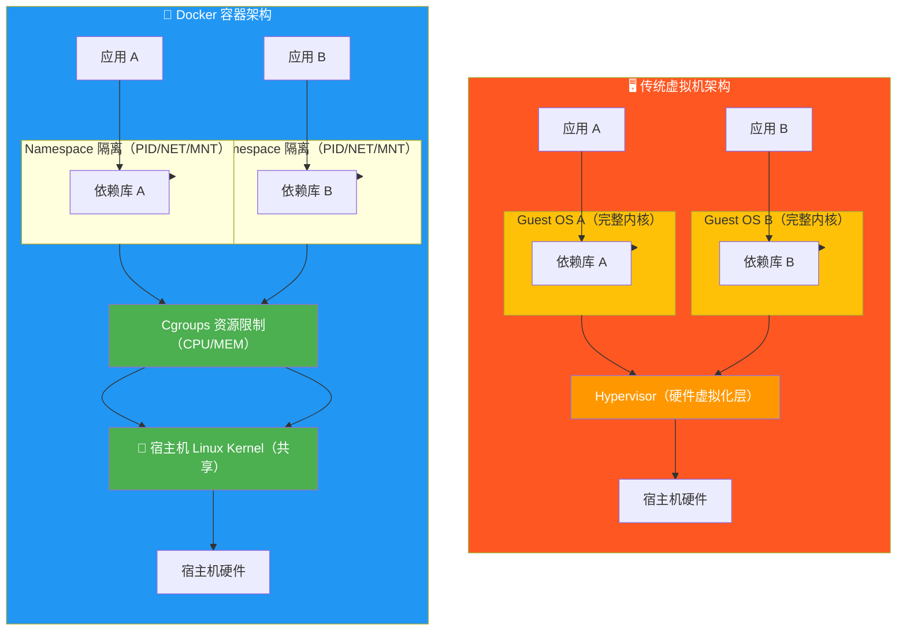
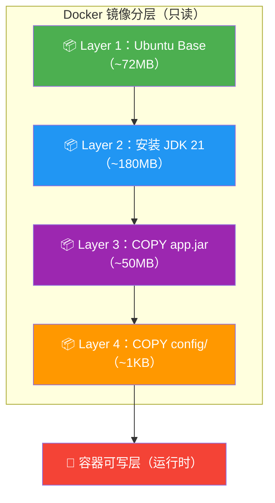

# 集装箱革命：掀开 Docker 的底牌与极致镜像工程实战

## 1. 引言："在我电脑上能跑"的历史终结

每个开发者都经历过这样的噩梦——

你在本地跑得丝滑如镜的 Spring Boot 服务，部署到测试环境后，`ClassNotFoundException` 满天飞。你检查了三遍 `pom.xml`，没问题。运维同事检查了 JDK 版本，也没问题。最后花了四个小时发现：测试机上的 `glibc` 版本比你本地低了一个小版本，而你依赖的某个 native 库恰好踩在兼容性边界上。

**"It works on my machine"—— 这句话是整个软件工程史上最昂贵的一句玩笑。**

Docker 横空出世，用一个叫"集装箱"的隐喻彻底改变了游戏规则：**把你的代码、依赖、运行时、配置、甚至操作系统库，全部打包进一个标准化的"箱子"里。** 不管这个箱子被运到哪里——你的 MacBook、测试服务器、AWS 的 EC2 实例——它内部的环境完全一致。

> [!important] 架构重点：容器 ≠ 轻量级虚拟机
> 这是关于容器技术最根深蒂固的误解。**容器不是一个虚拟机，容器只是一个被隔离的、受资源约束的特殊进程。** 它没有自己的操作系统内核，没有硬件模拟层，没有 Hypervisor。容器和宿主机**共享同一个 Linux Kernel**——它只是通过内核提供的 Namespace 和 Cgroups 机制，对这个进程"遮住了眼睛"（看不到其他进程/网络/文件系统），同时"绑住了手脚"（限制 CPU/内存用量）。
>
> 下面这张图，是理解 Docker 架构本质的**关键中的关键**：



**看清楚了吗？** 虚拟机的每个 Guest OS 都带了完整的操作系统内核——这意味着每个 VM 至少吃掉几百 MB 的内存，启动需要分钟级别。而 Docker 容器？它直接复用宿主机的内核，**启动只需要毫秒级**，单个容器的额外内存开销几乎可以忽略。

这不是营销话术——**这是架构基因决定的。**

---

## 2. 核心解密：容器凭什么能实现隔离？

既然容器只是一个"被隔离的进程"，那问题来了：Linux 内核到底用了什么魔法，让一个进程看不见别人、摸不到外面的网络、还被限制了能用多少资源？

答案是两个经典的内核机制——**Namespace** 和 **Cgroups**。它们不是 Docker 发明的，而是 Linux 内核从 2002 年就开始逐步引入的特性。Docker 只是第一个把它们包装得足够好用的工具。

### 2.1 Namespace（命名空间）：给进程戴上"眼罩"

Namespace 的核心思想极其朴素：**让进程以为自己看到了全世界，实际上它看到的只是一个被精心裁剪过的局部视图。**

Linux 内核提供了 8 种 Namespace，其中最常用的 6 种：

| Namespace | 隔离内容 | 你体验到的效果 |
|-----------|---------|---------------|
| **PID** | 进程 ID 空间 | 容器内 `ps aux` 只能看到自己的进程，PID 从 1 开始 |
| **NET** | 网络栈 | 容器有自己的 IP 地址、端口空间、路由表、iptables |
| **MNT** | 挂载点 | 容器有自己的文件系统根目录，看不到宿主机的 `/etc` |
| **UTS** | 主机名 | 容器可以有自己的 hostname |
| **IPC** | 进程间通信 | 共享内存、信号量等 IPC 资源相互隔离 |
| **USER** | 用户和组 ID | 容器内的 root（UID 0）可以映射为宿主机的普通用户 |

> [!info] 开发者视角：为什么 `ps aux` 只能看到自己的进程？
> 当你 `docker exec` 进入容器后，执行 `ps aux` 发现只有寥寥几个进程。这不是 ps 命令被"阉割"了，而是 **PID Namespace** 在起作用。Docker 在创建容器时，通过 `clone()` 系统调用传入 `CLONE_NEWPID` 标志，为新进程创建了一个全新的 PID 命名空间。在这个命名空间里，容器里的第一个进程 PID 就是 1——就像它是整个世界的 init 进程一样。**它以为自己是老大，其实只是宿主机上一个普普通通的子进程。**
>
> 你可以验证这一点：在宿主机上执行 `ps aux | grep <容器内进程名>`，你会发现宿主机给这个进程分配了一个完全不同的、正常的 PID。

> [!tip] 运维视角：NET Namespace 的实战价值
> NET Namespace 让每个容器拥有独立的网络栈——独立的 IP、独立的端口空间、独立的路由表。这意味着你可以在同一台宿主机上跑 10 个容器，**每个容器都绑定自己的 80 端口，彼此互不冲突。** 这就是 Docker 网络模型的基石，也是后续 Kubernetes Pod 网络模型（所有容器共享同一个 Network Namespace）的底层原理。
>
> 如果你想深入理解容器网络的完整链路——veth pair、docker0 网桥、iptables NAT、Overlay 网络——请阅读后续文章。

### 2.2 Cgroups（控制组）：给进程"上枷锁"

Namespace 解决了"看不见"的问题，但还不够——一个进程虽然看不到别人，但它可以**无节制地吞噬 CPU 和内存**，把整台宿主机拖垮。

Cgroups（Control Groups）就是内核提供的**资源配额管理器**。它能限制、统计、隔离一组进程对物理资源的使用。

| 资源维度 | Cgroups 能力 | 常用参数示例 |
|---------|-------------|-------------|
| **CPU** | 限制 CPU 时间片占比 | `--cpus=1.5`（最多用 1.5 个核） |
| **Memory** | 设置内存硬上限 | `--memory=512m`（最多用 512 MB） |
| **IO** | 限制磁盘读写带宽 | `--device-write-bps /dev/sda:10mb` |
| **PID** | 限制进程数量 | `--pids-limit=100`（防止 fork 炸弹） |

> [!bug] 生产痛点：一个 Java 容器如何拖垮整台宿主机
> **真实事故场景**：某团队部署了一个 Java 微服务容器，Dockerfile 里设置了 `-Xmx1g`，但**没有设置 Docker 层面的 `--memory` 限制**。某次上线引入内存泄漏，JVM 堆涨到 1g 后触发 GC，但 GC 期间堆外内存（Direct Buffer、Metaspace、线程栈）持续飙升。由于没有 Cgroups 的内存硬限制，这个进程一路吃到了宿主机的 64 GB 内存上限，触发了 **OOM Killer**——内核无差别地杀掉了宿主机上的其他容器进程，包括核心的数据库服务。
>
> **防御措施**：永远同时设置 JVM 参数 **和** Docker 内存限制，并确保 Docker 限制 > JVM `-Xmx`（预留 20%-30% 给堆外内存和 OS 开销）：
>
> ```bash
> # 正确做法：Docker 限制 1.5g，JVM 堆最多 1g，留 500MB 给堆外
> docker run --memory=1536m --memory-swap=1536m \
>   -e JAVA_OPTS="-Xmx1g -Xms1g" \
>   my-java-app:latest
> ```

> [!warning] 危险操作：不设资源限制等于裸奔
> `docker run` 时不加 `--memory` 和 `--cpus`，容器将**默认享有宿主机的全部资源**。在开发环境无所谓，在生产环境这是自杀行为。你必须把它视为一条安全基线——**每个容器必须设置资源上限**，就像每个进程必须有 ulimit 一样。

---

## 3. 镜像千层饼：UnionFS 与构建缓存的艺术

理解了容器的隔离机制，下一个核心问题是：**容器里的文件系统从哪来？**

答案是**镜像（Image）**——一个只读的、分层的、可复用的文件系统快照。

### 3.1 UnionFS：把千层饼叠在一起

Docker 镜像的核心技术是**联合文件系统（UnionFS）**。它的原理可以类比为千层饼：

- 每一层只记录相对于上一层的**变更**（新增的文件、修改的文件、删除的文件标记）
- 多层叠加在一起，对使用者呈现为一个**统一的、完整的文件系统**
- 读取文件时，从上往下找，找到的第一个就是最终结果（上层覆盖下层）
- 如果容器需要**写入**某个文件，触发**写时复制（Copy-on-Write, COW）**——把该文件从只读层复制到最上面的可写层，然后在副本上修改



> [!important] 架构重点：为什么分层如此重要？
> 分层带来了两个杀手级优势：
>
> **① 存储效率**：如果你有 10 个 Java 微服务，它们的基础镜像都是 `eclipse-temurin:21-jre`——这 10 个镜像**共享同一个基础层**，只在磁盘上存一份。相比虚拟机动辄 10 GB × 10 = 100 GB 的存储开销，容器可能只需要 72 MB（基础层）+ 10 × 50 MB（各自的 app 层）。
>
> **② 构建缓存**：这是提升 CI/CD 效率的关键，请看下一节。

### 3.2 构建缓存：为什么 COPY 的顺序能决定你的咖啡时间

Docker 在构建镜像时，会逐行执行 Dockerfile 中的指令。**每一行指令都会检查：这一行和上次构建时完全一样吗？如果一样，而且它依赖的上一层也没变——直接用缓存，跳过执行。**

这意味着，**指令的顺序直接决定了缓存命中率**。

```dockerfile
# ============ ❌ 反面教材：缓存形同虚设 ============
FROM node:20-alpine

# 把所有文件一股脑复制进去
COPY . .                          # 1️⃣ 任何文件一变，这层就失效

# 安装依赖
RUN npm ci                        # 2️⃣ 上面那层失效了，这层也得重跑
                                  #    每次改一行代码，就要重新下载 200MB 的 node_modules
                                  #    祝你 CI 快乐 ☕
```

```dockerfile
# ============ ✅ 正面教材：榨干每一滴缓存 ============
FROM node:20-alpine

# 第一步：只复制依赖声明文件
COPY package.json package-lock.json ./    # 1️⃣ 只有依赖变了才会失效

# 第二步：安装依赖（只要 package.json 没变，这层永远命中缓存）
RUN npm ci --production                   # 2️⃣ ✅ 缓存命中！省掉 200MB 下载 + 编译

# 第三步：最后才复制业务代码（代码天天改，但不影响上面两层的缓存）
COPY . .                                  # 3️⃣ 代码变了？无所谓，依赖层已经缓存了

CMD ["node", "server.js"]
```

> [!info] 开发者视角：缓存失效的连锁反应
> Docker 的构建缓存是**线性级联**的——第 N 层的缓存失效，意味着第 N+1、N+2、...、最后一层**全部失效**，无论它们的输入有没有变化。所以原则是：**把变化频率低的操作放前面，变化频率高的操作放后面。** 依赖安装（低频变化）→ 配置文件（中频变化）→ 业务代码（高频变化）。
>
> 一个实用技巧：你可以用 `docker build --no-cache` 强制跳过所有缓存，用于排查"到底是不是缓存导致的问题"。

> [!tip] 运维视角：在 CI 中善用 BuildKit 缓存挂载
> Docker BuildKit（默认启用，`DOCKER_BUILDKIT=1`）支持 `--mount=type=cache`，可以把 `npm ci`、`pip install`、`go mod download` 等包管理器的**本地缓存目录**挂载为持久缓存。即使 `package.lock` 变了导致 RUN 层需要重跑，也不需要从零开始下载——它复用了上一次下载的包缓存：
>
> ```dockerfile
> # BuildKit 缓存挂载：即使锁文件变了，也能复用已下载的包
> RUN --mount=type=cache,target=/root/.npm \
>     npm ci --production
> ```
>
> 在大型 CI/CD 流水线中，这一招可以将构建时间从 **8 分钟压缩到 30 秒**。

---

## 4. 极致镜像工程实战：Multi-stage Builds

现在你已经理解了镜像的分层机制。但现实中，很多团队的 Dockerfile 是这样的：

```dockerfile
# ============ ❌ 典型的"胖镜像" Dockerfile ============
FROM maven:3.9-eclipse-temurin-21      # 编译环境：含 Maven + JDK，约 800MB

COPY . /app
WORKDIR /app
RUN mvn clean package -DskipTests      # 编译打包

# 直接在这个"大而全"的镜像上运行
EXPOSE 8080
CMD ["java", "-jar", "target/app.jar"]
```

**问题**：最终镜像约 **850 MB**，里面包含了完整的 Maven、JDK 开发工具链、源代码、中间产物——这些东西在运行时**一个都用不上**，却白白增大了镜像体积、拉长了部署时间，还扩大了攻击面。

### 4.1 多阶段构建：编译和运行各归各位

多阶段构建的核心思想：**在一个 Dockerfile 中使用多个 `FROM` 指令，每个阶段用不同的基础镜像。前面的阶段负责编译，最后一个阶段只复制编译产物到极简的运行环境中。**

```dockerfile
# ============================================================
#  阶段 1：构建（Builder）—— 用什么工具都行，反正不带进最终镜像
# ============================================================
FROM maven:3.9-eclipse-temurin-21 AS builder

WORKDIR /build

# ---- 利用缓存：先复制依赖声明，后复制源码（参见第 3 节） ----
COPY pom.xml .
RUN --mount=type=cache,target=/root/.m2 \
    mvn dependency:go-offline -B        # 预下载依赖，利用 BuildKit 缓存

COPY src ./src
RUN --mount=type=cache,target=/root/.m2 \
    mvn clean package -DskipTests -B    # 编译打包

# ============================================================
#  阶段 2：运行（Runtime）—— 只要能跑 jar 的最小环境
# ============================================================
FROM eclipse-temurin:21-jre-alpine AS runtime
# ⬆️ 只含 JRE，约 190MB；对比 Stage 1 的 ~800MB

# ---- 安全基线：创建非 root 用户（详见第 5 节） ----
RUN addgroup -S appgroup && \
    adduser -S appuser -G appgroup

WORKDIR /app

# ---- 只从 Builder 阶段复制编译产物 ----
COPY --from=builder /build/target/app.jar ./app.jar

# ---- 切换到非 root 用户 ----
USER appuser

EXPOSE 8080

# ---- JVM 启动参数：容器感知 + 内存限制 ----
ENTRYPOINT ["java", \
  "-XX:+UseContainerSupport", \         # 1️⃣ 让 JVM 感知 Cgroups 内存限制
  "-XX:MaxRAMPercentage=75.0", \        # 2️⃣ 最多用容器内存的 75%
  "-jar", "app.jar"]
```

> [!important] 架构重点：多阶段构建的双重收益
>
> | 维度 | 单阶段构建 | 多阶段构建 |
> |------|-----------|-----------|
> | **镜像体积** | ~850 MB（含 Maven + JDK + 源码） | **~210 MB**（仅 JRE + 产物） |
> | **攻击面** | Maven、编译器、源码全部暴露 | **只有 JRE 运行时**，无可执行的编译工具 |
> | **构建缓存** | 每次全量复制源码 | 依赖层独立缓存，源码变更不触发依赖重装 |
>
> **体积缩小 75%，攻击面收窄 90%**——这就是为什么多阶段构建被称为"工业级镜像构建的标准姿势"。

> [!tip] 最佳实践：用 Distroless 镜像达到终极极简
> Google 的 **Distroless** 镜像比 Alpine 更极端——它连 `sh`、`bash`、`ls`、`curl` 这些常用工具都没有，只包含应用程序的运行时依赖。这意味着即使攻击者突破了你的应用进入了容器 shell，**里面没有任何工具可以用来横向移动或提权**：
>
> ```dockerfile
> # 终极极简运行时：Distroless
> FROM gcr.io/distroless/java21-debian12:nonroot
> # nonroot 标签已经内置了非 root 用户，无需手动创建
> COPY --from=builder /build/target/app.jar /app.jar
> ENTRYPOINT ["java", "-jar", "/app.jar"]
> ```
>
> 代价是**无法 `docker exec` 进去调试**。但对于生产环境来说，你有日志、有 metrics、有 tracing——你本就不应该 SSH 进生产容器里 debug。

### 4.2 跨语言的多阶段构建模板

多阶段构建不是 Java 的专利——它适用于任何需要"编译 → 运行"分离的语言：

**Go（静态编译，终极轻量）：**

```dockerfile
# ---- 构建阶段 ----
FROM golang:1.22-alpine AS builder
WORKDIR /app
COPY go.mod go.sum ./
RUN go mod download                      # 缓存依赖
COPY . .
RUN CGO_ENABLED=0 GOOS=linux go build \  # 静态编译，不依赖 glibc
    -ldflags="-s -w" \                   # 去掉调试符号，再减 30% 体积
    -o /app/server .

# ---- 运行阶段：连 libc 都不要 ----
FROM scratch                             # 空镜像！只有你复制进去的东西
COPY --from=builder /app/server /server
EXPOSE 8080
ENTRYPOINT ["/server"]
```

> [!tip] 最佳实践：Go + scratch 的组合能产出 **10-15 MB** 的极简镜像。配合 `CGO_ENABLED=0` 和 `-ldflags="-s -w"`，一个完整的 Web 服务镜像可以比一张高清截图还小。

**Node.js（前后端分离型）：**

```dockerfile
# ---- 构建阶段：安装所有依赖（含 devDependencies）并编译 ----
FROM node:20-alpine AS builder
WORKDIR /app
COPY package.json package-lock.json ./
RUN npm ci                               # 安装全部依赖（含 ts, webpack 等）
COPY . .
RUN npm run build                        # TypeScript 编译、Webpack 打包

# ---- 运行阶段：只带生产依赖 ----
FROM node:20-alpine AS runtime
WORKDIR /app
RUN addgroup -S appgroup && adduser -S appuser -G appgroup
COPY package.json package-lock.json ./
RUN npm ci --production                  # 只装生产依赖，去掉 devDependencies
COPY --from=builder /app/dist ./dist     # 只复制编译产物
USER appuser
EXPOSE 3000
CMD ["node", "dist/server.js"]
```

---

## 5. 守卫集装箱：安全基线与无 Root 运行

镜像构建得再精致，如果安全基线没做好，等于把保险柜放在了马路边。

### 5.1 为什么容器内的 root 是定时炸弹

Docker 容器默认以 **root 用户（UID 0）** 运行进程。你可能觉得无所谓——"反正有 Namespace 隔离，容器里的 root 又不是宿主机的 root。"

**大错特错。**

> [!warning] 危险操作：root + 容器逃逸 = 毁灭性打击
> 容器的隔离是**软件层面**的，不是硬件层面的。历史上，Linux 内核已经出现过多次**容器逃逸漏洞**（CVE-2019-5736 runc 逃逸、CVE-2022-0185 文件系统漏洞等）。一旦攻击者利用漏洞突破了容器的 Namespace 边界，**容器内的 UID 0 就是宿主机的 UID 0——root 权限**。
>
> 这意味着攻击者可以：
> - 读取宿主机上所有容器的数据（包括数据库）
> - 在宿主机上植入后门
> - 横向移动到同一集群的其他节点
> - **你的整条生产链路彻底沦陷**
>
> 所以，安全领域有一条铁律：**容器内的进程绝不应该以 root 运行。**

### 5.2 工业级防御模板：Non-root User

在 Dockerfile 中创建专用的非特权用户，并在最后切换到该用户，是**最基本也最有效的安全加固手段**：

```dockerfile
# ============================================================
#  安全 Dockerfile 模板：Non-root 运行
# ============================================================
FROM eclipse-temurin:21-jre-alpine

# ---- 1. 创建专用用户和用户组（系统级，不可登录） ----
#    -S：系统用户（无密码、无家目录）
#    -G：指定所属组
RUN addgroup -S appgroup && \
    adduser -S appuser -G appgroup

# ---- 2. 设置工作目录并确保权限 ----
WORKDIR /app
COPY --from=builder /build/target/app.jar ./app.jar
RUN chown -R appuser:appgroup /app      # 确保非 root 用户能读取

# ---- 3. 切换到非 root 用户（此后的所有指令都以 appuser 身份执行） ----
USER appuser

# ---- 4. 健康检查（不依赖 curl，用 JDK 自带工具） ----
HEALTHCHECK --interval=30s --timeout=5s --retries=3 \
  CMD ["java", "-cp", "app.jar", "HealthCheck"]

EXPOSE 8080

ENTRYPOINT ["java", \
  "-XX:+UseContainerSupport", \
  "-XX:MaxRAMPercentage=75.0", \
  "-jar", "app.jar"]
```

> [!info] 开发者视角：USER 指令放错位置会怎样？
> `USER` 指令一旦执行，它之后的**所有指令**（包括 `RUN`、`COPY`、`CMD`、`ENTRYPOINT）**都会以该用户身份运行。如果你在 `USER appuser` 之后执行 `RUN mkdir /app/data`，而 `appuser` 没有 `/app` 的写权限——构建直接失败。
>
> **最佳实践**：把 `USER` 指令放到**所有需要 root 权限的操作（安装包、创建目录、修改权限）之后**，只在设置 `EXPOSE`、`CMD`、`ENTRYPOINT` 之前切换。

> [!tip] 最佳实践：安全加固清单
> 除了 Non-root 用户，生产级镜像还应做到以下几点：
>
> | 加固项 | 做法 | 收益 |
> |--------|------|------|
> | **非 root 运行** | `USER appuser` | 容器逃逸后无法获得宿主机 root |
> | **只读文件系统** | `docker run --read-only` | 防止攻击者写入恶意文件 |
> | **去掉 capabilities** | `--cap-drop=ALL --cap-add=NET_BIND_SERVICE` | 最小权限原则 |
> | **不用 `latest` 标签** | 固定版本 `eclipse-temurin:21.0.3_9-jre-alpine` | 构建可复现，避免供应链攻击 |
> | **扫描漏洞** | CI 中集成 `trivy image myapp:latest` | 上线前捕获 CVE |
> | **不安装不需要的工具** | 不要在生产镜像中放 `curl`、`wget`、`vim` | 攻击者无工具可用 |
> | **`.dockerignore`** | 排除 `.git`、`node_modules`、`.env` | 防止敏感文件泄露到镜像 |

> [!bug] 生产痛点：`.env` 文件被复制进镜像导致密钥泄露
> **真实事故**：某团队在 Dockerfile 中使用 `COPY . .`，没有配置 `.dockerignore`，结果本地的 `.env` 文件（包含数据库密码、第三方 API Key）被复制进了镜像层。即使后来删除了 `.env` 并重新构建，**由于镜像分层机制，旧层中的 `.env` 仍然可以通过 `docker history` 或 `docker save` 导出后提取出来。** 密钥就这样躺在公共镜像仓库里，直到被安全扫描工具发现。
>
> **修复**：创建 `.dockerignore` 并把 `.env`、`.git`、`*.secret` 等全部排除：
>
> ```text
> # .dockerignore — 必须和 Dockerfile 放在同一目录
> .git
> .env
> .env.*
> *.secret
> node_modules
> target/
> dist/
> ```
>
> **永远记住：镜像层是不可变的，一旦写入就永远存在于历史层中。**

---

## 结语：三个心智模型，一个工程纪律

回顾整篇文章，你需要建立三个核心心智模型，并遵守一条工程纪律：

**① 容器 = 被隔离的普通进程，不是虚拟机。** Namespace 负责"遮眼"（视图隔离），Cgroups 负责"绑手"（资源限制），它们共享宿主机内核——这是容器轻量、快速、高效的根源。

**② 镜像 = 只读分层文件系统。** UnionFS + Copy-on-Write 让镜像可以高效共享和增量构建。**指令顺序决定缓存命中率**，变化频率低的放前面，高的放后面。

**③ 编译和运行必须分离。** 多阶段构建把臃肿的编译环境留在构建阶段，只把精简的产物送进运行环境——体积缩小 75%，攻击面收窄 90%。

**一条工程纪律：每个容器必须以非 root 用户运行，必须设置资源上限。** 没有例外。

> [!summary] 记住
> **容器不是魔法，它是 Linux 内核几十年积累的系统编程能力的集大成者。** 当你真正理解了 Namespace 和 Cgroups，你就能在生产环境游刃有余——不是因为你会敲 `docker run`，而是因为你**理解每一个 flag 背后的内核行为**。这就是一个云原生工程师和一个"Docker 用户"的本质区别。
